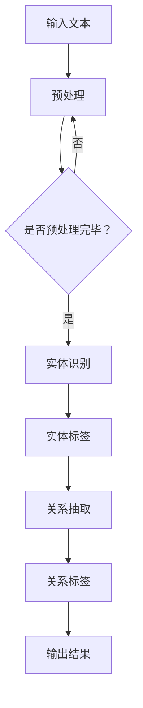
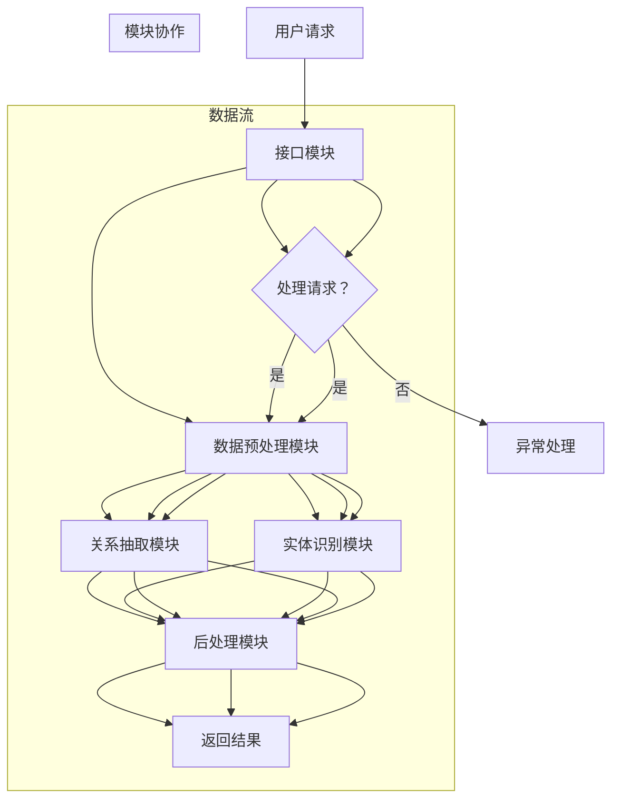

                 

### 摘要

在人工智能（AI）领域，AI Agent的实体识别与关系抽取是深化语义理解的关键技术。实体识别是指从文本中识别出具有特定意义的信息单元，如人名、地点、组织等。而关系抽取则是识别这些实体之间的关联关系，如“地点”与“组织”的隶属关系、“人”与“组织”的隶属关系等。本文将详细探讨AI Agent的实体识别与关系抽取技术，包括其原理、算法以及系统架构设计。通过深入分析和具体实例，我们旨在为读者提供一套全面、实用的指南，以深化对语义理解的理解，为AI Agent的研发和应用提供有力支持。

---

# AI Agent的实体识别与关系抽取：深化语义理解

关键词：AI Agent、实体识别、关系抽取、语义理解、算法原理、系统架构设计

> 作者：AI天才研究院/AI Genius Institute & 禅与计算机程序设计艺术 /Zen And The Art of Computer Programming

## 摘要

在人工智能（AI）领域，AI Agent的实体识别与关系抽取是深化语义理解的关键技术。实体识别是指从文本中识别出具有特定意义的信息单元，如人名、地点、组织等。而关系抽取则是识别这些实体之间的关联关系，如“地点”与“组织”的隶属关系、“人”与“组织”的隶属关系等。本文将详细探讨AI Agent的实体识别与关系抽取技术，包括其原理、算法以及系统架构设计。通过深入分析和具体实例，我们旨在为读者提供一套全面、实用的指南，以深化对语义理解的理解，为AI Agent的研发和应用提供有力支持。

---

## 背景介绍

### 问题背景

在当今信息爆炸的时代，大量非结构化数据充斥在我们的日常生活中，如图文、视频、音频和自然语言文本等。为了从这些海量数据中提取有价值的信息，人工智能（AI）技术应运而生。AI Agent作为一种智能实体，具备自主学习和处理信息的能力，在各个领域展现出了强大的应用潜力。然而，AI Agent的有效运作依赖于对输入数据的准确理解和处理，其中，实体识别与关系抽取是实现AI Agent语义理解的重要环节。

### 核心概念

**实体识别**：指从文本中识别出具有特定意义的信息单元，如人名、地点、组织等。实体识别的目的是将无结构的文本转换为有结构的实体表示，为后续的关系抽取和语义分析奠定基础。

**关系抽取**：指从文本中识别出实体之间的关联关系，如隶属关系、参与关系、因果关系等。关系抽取的目的是建立实体之间的语义联系，从而实现对文本的深层理解。

### 问题解决

实体识别与关系抽取问题的解决主要依赖于自然语言处理（NLP）和机器学习（ML）技术的应用。传统的基于规则的方法依赖人工定义的规则，其扩展性和适应性较弱。随着深度学习技术的发展，基于深度神经网络（DNN）的模型在实体识别与关系抽取中表现出了更高的准确性和泛化能力。

### 边界与外延

在实体识别与关系抽取中，边界问题是指如何准确界定实体的范围，避免将无关信息误判为实体。而外延问题是指如何准确识别出所有与给定实体相关的其他实体，确保实体之间的关联关系得到完整表达。这两个问题共同决定了实体识别与关系抽取的准确性和全面性。

## 实体识别与关系抽取的联系与差异

实体识别与关系抽取是语义理解的两个核心环节，它们相互依存、相互补充，共同构成了AI Agent对自然语言文本的深度理解能力。

**联系**：

1. **数据驱动**：两者都依赖于大量标注数据的训练，通过机器学习或深度学习模型来提高识别和抽取的准确性。
2. **信息整合**：实体识别为关系抽取提供了基础实体信息，而关系抽取则进一步丰富了实体的语义描述。

**差异**：

1. **任务目标**：实体识别关注的是识别文本中的信息单元，而关系抽取关注的是实体之间的语义关系。
2. **技术实现**：实体识别多采用分类模型，如条件随机场（CRF）、长短期记忆网络（LSTM）等；关系抽取则多采用序列标注模型，如BiLSTM-CRF、Transformer等。
3. **难度层次**：相对于实体识别，关系抽取任务更复杂，需要考虑实体之间的复杂语义关系，因此难度更高。

通过理解实体识别与关系抽取的联系与差异，我们可以更好地把握语义理解的整体架构，为后续算法设计和系统实现提供指导。

## 本章小结

本章介绍了AI Agent语义理解中的关键任务——实体识别与关系抽取。首先，我们探讨了实体识别与关系抽取的问题背景、核心概念及其相互联系和差异。通过对比不同方法的优缺点，我们强调了深度学习在实体识别与关系抽取中的重要作用。本章为后续算法原理讲解和系统架构设计奠定了基础，为读者全面理解AI Agent的语义理解能力提供了初步认识。

---

## 第一部分: AI Agent语义理解概述

### 1.1 AI Agent的概念与语义理解

#### 1.1.1 AI Agent的定义与发展历程

AI Agent，即人工智能代理，是一种能够自主执行任务、与外界交互并具备一定智能行为的软件实体。它起源于人工智能领域，随着计算能力的提升和算法的进步，逐渐成为智能系统中的重要组成部分。AI Agent的发展历程可以分为几个阶段：

1. **早期探索**：20世纪50年代，随着人工智能概念的提出，AI Agent的概念也应运而生。当时的研究主要集中在基于规则的推理系统和简单的问题求解算法。

2. **早期应用**：20世纪80年代，随着专家系统和知识表示技术的发展，AI Agent开始在一些特定领域（如医疗诊断、金融服务）得到应用。这些早期的AI Agent主要依赖于领域专家的知识库，进行简单的信息处理和决策。

3. **智能化提升**：进入21世纪，随着机器学习、深度学习等算法的突破，AI Agent的智能化水平显著提升。现代AI Agent不仅能处理大量数据，还能进行自主学习和优化，具备更高的适应性和灵活性。

#### 1.1.2 语义理解的重要性

语义理解是AI Agent的核心能力之一，它指的是AI系统对自然语言文本内容的深层理解和解释。语义理解的重要性体现在以下几个方面：

1. **交互性**：AI Agent需要理解用户的意图和需求，才能提供准确和有效的服务。语义理解是实现高质量人机交互的基础。

2. **智能化**：语义理解使AI Agent能够理解和处理复杂、模糊的输入信息，从而实现更高层次的智能化。

3. **决策支持**：在许多应用场景中，AI Agent需要根据语义理解结果做出决策。例如，在智能客服系统中，AI Agent需要理解用户的提问，并给出合适的回答或解决方案。

#### 1.1.3 AI Agent在语义理解中的应用

AI Agent在语义理解中的应用场景非常广泛，以下是一些典型的应用：

1. **智能客服**：通过语义理解，AI Agent可以自动识别用户的问题，并提供准确的答案或解决方案，大大提高客服效率。

2. **智能助手**：如Apple的Siri、Amazon的Alexa等，这些AI Agent通过语义理解，可以执行用户的语音指令，进行日程管理、播放音乐、设置提醒等。

3. **智能推荐**：在电子商务、在线媒体等领域，AI Agent通过语义理解，可以分析用户的兴趣和行为，提供个性化的推荐。

4. **智能翻译**：AI Agent通过语义理解，可以实现高质量的自然语言翻译，满足跨语言交流的需求。

5. **智能分析**：在金融、医疗等领域，AI Agent通过语义理解，可以分析大量文本数据，提取有价值的信息和洞见。

通过以上分析，我们可以看到AI Agent的语义理解能力在提升智能化应用水平、优化用户体验方面具有重要作用。接下来，我们将进一步探讨实体识别与关系抽取在AI Agent语义理解中的应用。

---

### 1.2 实体识别

实体识别是语义理解中的基础任务，旨在从文本中识别出具有特定意义的信息单元。这些信息单元可以是人名、地名、组织名、时间、地点等。实体识别的任务是将无结构的文本转换为有结构的实体表示，以便进行后续的语义分析和处理。

#### 1.2.1 实体识别的定义与分类

**定义**：实体识别（Named Entity Recognition，简称NER）是指从文本中识别出具有特定类别（或实体类型）的词语或短语。这些实体可以是现实世界中的具体对象，如人、地点、组织等，也可以是抽象概念，如疾病、事件等。

**分类**：根据识别方法的不同，实体识别可以分为以下几类：

1. **基于规则的方法**：这种方法依赖于预先定义的规则，通过匹配规则来识别文本中的实体。例如，可以使用正则表达式匹配特定的模式，如“[A-Z]{2}”匹配美国州名。

2. **基于统计的方法**：这种方法使用统计学习模型，如最大熵模型、条件随机场（CRF）等，通过训练数据来学习实体识别的规律。统计方法通常具有较高的准确性和泛化能力。

3. **基于深度学习的方法**：这种方法使用深度神经网络，如卷积神经网络（CNN）、递归神经网络（RNN）等，通过大量标注数据训练模型。深度学习方法在处理复杂文本结构和上下文关系方面具有显著优势。

#### 1.2.2 实体识别的关键技术

1. **特征工程**：特征工程是实体识别中的关键步骤，它涉及到从文本中提取有意义的特征，以帮助模型进行分类。常见的特征包括词频、词位置、词性、句法结构等。

2. **模型选择**：根据具体应用场景和数据集的特点，选择合适的模型进行实体识别。例如，对于结构化较强的文本，可以使用基于规则的模型；对于结构化较弱的文本，则可以使用深度学习模型。

3. **上下文信息利用**：实体识别不仅依赖于单个词或短语的属性，还需要考虑其在上下文中的语义关系。利用上下文信息可以有效提高实体识别的准确率。

4. **多标签识别**：某些实体可能同时属于多个类别，如“苹果”可以既是水果也是公司名称。多标签识别技术能够同时识别出实体所属的所有类别。

#### 1.2.3 实体识别的应用场景

1. **信息提取**：从大量文本中提取出特定实体信息，如人名、地名、组织名等，为后续的数据分析和挖掘提供基础。

2. **智能问答**：在智能客服、智能助手等应用中，通过实体识别技术识别用户输入中的关键信息，从而提供更准确、个性化的回答。

3. **文本分类**：利用实体识别技术，可以将文本分类到不同的主题或领域，为文本分析和推荐系统提供支持。

4. **自然语言处理**：实体识别是自然语言处理（NLP）中的基础任务，与其他NLP任务（如关系抽取、语义角色标注等）紧密相关。

5. **实体链接**：在知识图谱构建中，通过实体识别将文本中的实体与知识图谱中的实体进行链接，从而实现对实体属性和关系的全面理解。

通过上述分析，我们可以看到实体识别在语义理解中的重要性及其广泛应用。接下来，我们将继续探讨关系抽取在语义理解中的作用。

---

### 1.3 关系抽取

关系抽取是语义理解中的关键任务，旨在从文本中识别出实体之间的语义关系。这些关系可以是实体之间的直接联系，如“属于”、“参与”等，也可以是间接关系，如“与...合作”、“有关...”等。关系抽取的任务是将无结构文本中的实体关系转化为有结构的关系表示，以便进行更深入的语义分析和应用。

#### 1.3.1 关系抽取的定义与分类

**定义**：关系抽取（Relation Extraction，简称RE）是指从文本中识别出实体之间的语义关系。这些关系可以是预设的，如“组织”与“地点”之间的隶属关系，也可以是根据文本内容动态生成的。

**分类**：根据识别方法的不同，关系抽取可以分为以下几类：

1. **基于规则的方法**：这种方法依赖于预先定义的规则，通过模式匹配来识别文本中的关系。例如，可以使用正则表达式匹配特定的实体对及其关系。

2. **基于统计的方法**：这种方法使用统计学习模型，如最大熵模型、支持向量机（SVM）等，通过训练数据来学习关系抽取的规律。统计方法能够处理复杂的关系识别任务。

3. **基于深度学习的方法**：这种方法使用深度神经网络，如卷积神经网络（CNN）、递归神经网络（RNN）等，通过大量标注数据训练模型。深度学习方法在处理复杂文本结构和上下文关系方面具有显著优势。

#### 1.3.2 关系抽取的关键技术

1. **实体识别**：关系抽取依赖于实体识别的结果，因此实体识别的准确性直接影响到关系抽取的效果。

2. **特征工程**：关系抽取中的特征工程包括从文本中提取与关系相关的特征，如实体属性、词性、句法结构等。这些特征有助于模型识别实体之间的关系。

3. **上下文信息利用**：关系抽取不仅依赖于单个实体的属性，还需要考虑实体在上下文中的语义关系。上下文信息能够提供更多关系识别的线索。

4. **关系分类器**：关系分类器是关系抽取中的核心组件，它通过学习从实体对及其上下文中识别出具体的关系。常用的关系分类器包括条件随机场（CRF）、双向长短期记忆网络（BiLSTM）等。

5. **多关系识别**：某些文本中可能存在多个实体关系，多关系识别技术能够同时识别出文本中的多个关系，提高关系抽取的全面性。

#### 1.3.3 关系抽取的应用场景

1. **知识图谱构建**：关系抽取是知识图谱构建中的关键步骤，通过识别文本中的实体关系，可以将无结构文本转化为结构化的知识表示。

2. **智能问答**：在智能客服、智能助手等应用中，关系抽取技术能够帮助AI系统理解用户的问题，提供更准确、个性化的回答。

3. **实体链接**：通过关系抽取，可以将文本中的实体与知识图谱中的实体进行链接，从而实现对实体属性和关系的全面理解。

4. **文本分类与聚类**：关系抽取技术可以用于文本分类和聚类，将具有相同关系的实体归为一类，从而提高文本分析的准确性和效率。

5. **语义搜索**：关系抽取技术能够丰富搜索结果，通过识别实体之间的关系，提供更相关、更精确的搜索结果。

通过上述分析，我们可以看到关系抽取在语义理解中的重要作用及其广泛应用。接下来，我们将探讨实体识别与关系抽取之间的联系与差异。

---

### 1.4 实体识别与关系抽取的联系与差异

实体识别与关系抽取是语义理解中的两个重要环节，它们既有联系，也有差异。理解这两者的关系有助于我们更好地设计和优化AI系统。

#### 联系

1. **数据驱动**：实体识别与关系抽取都依赖于大量的标注数据。通过训练模型，可以自动识别文本中的实体和关系，从而实现自动化处理。

2. **信息整合**：实体识别为关系抽取提供了基础实体信息，而关系抽取则进一步丰富了实体的语义描述。两者共同作用，实现了对文本的全面理解和处理。

3. **互补性**：实体识别关注的是识别文本中的信息单元，而关系抽取关注的是这些实体之间的语义关系。通过结合两者，可以实现更深入的语义理解。

#### 差异

1. **任务目标**：实体识别的目的是将文本中的信息单元识别出来，而关系抽取的目的是识别实体之间的关联关系。两者任务目标不同，但相辅相成。

2. **技术实现**：实体识别多采用分类模型，如条件随机场（CRF）、卷积神经网络（CNN）等；关系抽取则多采用序列标注模型，如BiLSTM-CRF、Transformer等。不同的任务特点决定了不同的技术实现方法。

3. **难度层次**：相对于实体识别，关系抽取任务更复杂，需要考虑实体之间的复杂语义关系，因此难度更高。关系抽取不仅需要识别实体，还需要理解实体之间的关系，这增加了任务的难度。

通过理解实体识别与关系抽取的联系与差异，我们可以更好地设计和实现语义理解系统，提高AI Agent的智能化水平和应用效果。

---

### 1.5 本章小结

本章介绍了AI Agent语义理解中的核心任务——实体识别与关系抽取。首先，我们探讨了AI Agent的概念与语义理解的重要性，然后详细介绍了实体识别与关系抽取的定义、分类、关键技术及其应用场景。通过本章的学习，读者可以全面理解实体识别与关系抽取在语义理解中的作用和实现方法，为后续章节的深入探讨打下基础。

---

## 第二部分: 实体识别与关系抽取技术原理

### 2.1 实体识别技术原理

实体识别（Named Entity Recognition，简称NER）是自然语言处理（NLP）中的一个关键任务，旨在从文本中识别出具有特定意义的信息单元，如人名、地名、组织名等。实体识别的目的是将无结构的文本转换为有结构的实体表示，为后续的语义分析和处理提供基础。本节将详细介绍实体识别的主要技术原理，包括基于规则的方法、基于统计的方法和基于深度学习的方法。

#### 2.1.1 基于规则的方法

基于规则的方法是实体识别中最早使用的一种技术。这种方法依赖于预先定义的规则，通过模式匹配来识别文本中的实体。具体步骤如下：

1. **规则定义**：首先，需要根据实体识别的需求，定义一系列规则。这些规则可以是简单的正则表达式，也可以是复杂的语法规则。例如，识别人名的规则可以是“姓+名”或“姓+中间名+名”。

2. **模式匹配**：将文本中的每个词或短语与规则进行匹配，如果匹配成功，则将该词或短语识别为实体。

3. **规则优化**：为了提高识别的准确性，需要对规则进行优化。可以通过增加规则、删除冗余规则或调整规则优先级来实现。

基于规则的方法的优点是简单直观，易于实现。然而，其扩展性和适应性较弱，特别是在处理复杂、模糊的文本时，效果较差。

#### 2.1.2 基于统计的方法

基于统计的方法通过训练模型，从大量标注数据中学习实体识别的规律。常用的统计方法包括最大熵模型（Maximum Entropy Model）、条件随机场（Conditional Random Field，简称CRF）等。

1. **最大熵模型**：最大熵模型是一种概率图模型，通过最大化条件熵来学习文本特征和标签之间的概率分布。具体步骤如下：

   a. **特征提取**：从文本中提取与实体识别相关的特征，如词频、词位置、词性等。

   b. **模型训练**：使用标注数据训练最大熵模型，使其能够预测文本中的实体标签。

   c. **实体识别**：将待识别的文本输入到训练好的最大熵模型中，根据模型输出的概率分布进行实体识别。

最大熵模型的优点是能够处理复杂的特征组合，具有较好的泛化能力。然而，其性能依赖于特征工程的质量，且在处理长文本时效果不佳。

2. **条件随机场（CRF）**：CRF是一种概率图模型，通过建模实体及其标签之间的条件依赖关系来提高识别的准确性。具体步骤如下：

   a. **特征提取**：与最大熵模型类似，从文本中提取特征。

   b. **模型训练**：使用标注数据训练CRF模型，使其能够预测实体标签序列。

   c. **实体识别**：将待识别的文本输入到训练好的CRF模型中，根据模型输出的概率分布进行实体识别。

CRF的优点是能够利用上下文信息，对长文本的识别效果较好。然而，其训练过程较为复杂，且在处理稀疏数据时效果较差。

#### 2.1.3 基于深度学习的方法

基于深度学习的方法通过训练深度神经网络模型，从大量标注数据中学习实体识别的规律。常用的深度学习方法包括卷积神经网络（CNN）、递归神经网络（RNN）和Transformer等。

1. **卷积神经网络（CNN）**：CNN是一种用于图像识别的深度学习模型，但在文本处理中也表现出色。具体步骤如下：

   a. **文本表示**：将文本转化为序列向量的形式，可以使用词嵌入（Word Embedding）技术。

   b. **特征提取**：通过卷积操作提取文本特征，如词频、词位置等。

   c. **分类器**：使用全连接层或多层卷积层进行分类，输出实体标签。

CNN的优点是能够自动提取特征，对文本中的局部模式有较好的识别能力。然而，其在处理长文本时效果较差，且需要大量计算资源。

2. **递归神经网络（RNN）**：RNN是一种能够处理序列数据的深度学习模型，常用于实体识别任务。具体步骤如下：

   a. **文本表示**：与CNN类似，将文本转化为序列向量的形式。

   b. **特征提取**：使用RNN模型处理序列数据，提取文本特征。

   c. **分类器**：使用全连接层或多层RNN进行分类，输出实体标签。

RNN的优点是能够处理长文本，利用上下文信息进行特征提取。然而，其存在梯度消失和梯度爆炸等问题，对训练数据的依赖性较强。

3. **Transformer**：Transformer是一种基于自注意力机制的深度学习模型，在NLP任务中表现出色。具体步骤如下：

   a. **文本表示**：与CNN和RNN类似，将文本转化为序列向量的形式。

   b. **自注意力机制**：通过自注意力机制，计算文本序列中每个词与其他词之间的关联程度。

   c. **分类器**：使用全连接层进行分类，输出实体标签。

Transformer的优点是能够高效地处理长文本，利用全局信息进行特征提取。然而，其训练过程较为复杂，计算资源需求较高。

通过以上分析，我们可以看到实体识别技术从基于规则的方法发展到基于统计的方法，再到基于深度学习的方法，不断演进和优化。每种方法都有其优缺点，根据具体应用场景和需求选择合适的方法至关重要。接下来，我们将详细探讨关系抽取技术原理。

### 2.2 关系抽取技术原理

关系抽取（Relation Extraction，简称RE）是自然语言处理（NLP）中的重要任务，旨在从文本中识别出实体之间的语义关系。这些关系可以是直接关系，如“属于”、“参与”等，也可以是间接关系，如“与...合作”、“有关...”等。关系抽取的目的是将无结构的文本转化为有结构的关系表示，为知识图谱构建、智能问答等应用提供基础。本节将详细介绍关系抽取的主要技术原理，包括基于规则的方法、基于统计的方法和基于深度学习的方法。

#### 2.2.1 基于规则的方法

基于规则的方法是关系抽取中最早使用的一种技术。这种方法依赖于预先定义的规则，通过模式匹配来识别文本中的关系。具体步骤如下：

1. **规则定义**：首先，需要根据关系抽取的需求，定义一系列规则。这些规则可以是简单的正则表达式，也可以是复杂的语法规则。例如，识别“属于”关系的规则可以是“[组织名称]+[地点名称]”。

2. **模式匹配**：将文本中的每个词或短语与规则进行匹配，如果匹配成功，则将该词或短语识别为关系。

3. **规则优化**：为了提高识别的准确性，需要对规则进行优化。可以通过增加规则、删除冗余规则或调整规则优先级来实现。

基于规则的方法的优点是简单直观，易于实现。然而，其扩展性和适应性较弱，特别是在处理复杂、模糊的文本时，效果较差。

#### 2.2.2 基于统计的方法

基于统计的方法通过训练模型，从大量标注数据中学习关系抽取的规律。常用的统计方法包括最大熵模型（Maximum Entropy Model）、支持向量机（Support Vector Machine，简称SVM）等。

1. **最大熵模型**：最大熵模型是一种概率图模型，通过最大化条件熵来学习文本特征和标签之间的概率分布。具体步骤如下：

   a. **特征提取**：从文本中提取与关系抽取相关的特征，如词频、词位置、词性等。

   b. **模型训练**：使用标注数据训练最大熵模型，使其能够预测文本中的关系标签。

   c. **关系抽取**：将待识别的文本输入到训练好的最大熵模型中，根据模型输出的概率分布进行关系抽取。

最大熵模型的优点是能够处理复杂的特征组合，具有较好的泛化能力。然而，其性能依赖于特征工程的质量，且在处理长文本时效果不佳。

2. **支持向量机（SVM）**：SVM是一种常用的分类算法，通过最大化分类间隔来学习分类模型。具体步骤如下：

   a. **特征提取**：与最大熵模型类似，从文本中提取特征。

   b. **模型训练**：使用标注数据训练SVM模型，使其能够预测文本中的关系标签。

   c. **关系抽取**：将待识别的文本输入到训练好的SVM模型中，根据模型输出的分类结果进行关系抽取。

SVM的优点是分类效果好，对噪声数据的鲁棒性较高。然而，其训练过程较为复杂，且对特征工程的要求较高。

#### 2.2.3 基于深度学习的方法

基于深度学习的方法通过训练深度神经网络模型，从大量标注数据中学习关系抽取的规律。常用的深度学习方法包括卷积神经网络（CNN）、递归神经网络（RNN）和Transformer等。

1. **卷积神经网络（CNN）**：CNN是一种用于图像识别的深度学习模型，但在文本处理中也表现出色。具体步骤如下：

   a. **文本表示**：将文本转化为序列向量的形式，可以使用词嵌入（Word Embedding）技术。

   b. **特征提取**：通过卷积操作提取文本特征，如词频、词位置等。

   c. **分类器**：使用全连接层或多层卷积层进行分类，输出关系标签。

CNN的优点是能够自动提取特征，对文本中的局部模式有较好的识别能力。然而，其在处理长文本时效果较差，且需要大量计算资源。

2. **递归神经网络（RNN）**：RNN是一种能够处理序列数据的深度学习模型，常用于关系抽取任务。具体步骤如下：

   a. **文本表示**：与CNN和RNN类似，将文本转化为序列向量的形式。

   b. **特征提取**：使用RNN模型处理序列数据，提取文本特征。

   c. **分类器**：使用全连接层或多层RNN进行分类，输出关系标签。

RNN的优点是能够处理长文本，利用上下文信息进行特征提取。然而，其存在梯度消失和梯度爆炸等问题，对训练数据的依赖性较强。

3. **Transformer**：Transformer是一种基于自注意力机制的深度学习模型，在NLP任务中表现出色。具体步骤如下：

   a. **文本表示**：与CNN和RNN类似，将文本转化为序列向量的形式。

   b. **自注意力机制**：通过自注意力机制，计算文本序列中每个词与其他词之间的关联程度。

   c. **分类器**：使用全连接层进行分类，输出关系标签。

Transformer的优点是能够高效地处理长文本，利用全局信息进行特征提取。然而，其训练过程较为复杂，计算资源需求较高。

通过以上分析，我们可以看到关系抽取技术从基于规则的方法发展到基于统计的方法，再到基于深度学习的方法，不断演进和优化。每种方法都有其优缺点，根据具体应用场景和需求选择合适的方法至关重要。接下来，我们将进一步探讨实体识别与关系抽取之间的联系与差异。

---

### 2.3 实体识别与关系抽取的Mermaid流程图

为了更清晰地展示实体识别与关系抽取的流程，我们可以使用Mermaid语言绘制一个流程图。以下是一个简单的示例，展示了从输入文本到输出实体和关系的整个过程：



**说明**：

- **输入文本**：原始待处理的文本数据。
- **预处理**：对文本进行清洗、分词等预处理操作，为后续实体识别和关系抽取做好准备。
- **实体识别**：使用实体识别模型从预处理后的文本中识别出实体，并标注出实体的位置和类别。
- **关系抽取**：在实体识别的基础上，使用关系抽取模型识别出实体之间的关系，并标注出关系的类型。
- **输出结果**：将识别出的实体和关系输出，形成结构化的数据格式，供进一步分析和应用。

通过这个流程图，我们可以清晰地看到实体识别与关系抽取的基本步骤及其相互关系，有助于我们更好地理解和实现这些任务。

---

### 2.4 实体识别与关系抽取的数学模型与公式

在实体识别与关系抽取过程中，数学模型和公式起到了关键作用，它们帮助我们从复杂的文本数据中提取有价值的信息。以下将详细讨论实体识别的数学模型和关系抽取的数学模型。

#### 2.4.1 实体识别的数学模型

实体识别通常是一个分类问题，其数学模型可以表示为一个概率模型。在给定一个句子或文本片段时，我们需要预测其中的每个词或短语的标签（即实体类别）。

1. **朴素贝叶斯模型**：
   朴素贝叶斯模型是一个经典的概率分类器，其公式如下：
   $$ P(\text{实体类别} | \text{特征}) = \frac{P(\text{特征} | \text{实体类别})P(\text{实体类别})}{P(\text{特征})} $$
   其中，$P(\text{实体类别} | \text{特征})$ 表示给定特征向量下实体类别的概率，$P(\text{特征} | \text{实体类别})$ 是特征在特定实体类别下的概率，$P(\text{实体类别})$ 是实体类别的先验概率。

2. **支持向量机（SVM）模型**：
   支持向量机是一种常用的分类算法，其目标是在特征空间中找到一个最优的超平面，将不同类别的特征向量分隔开来。其公式如下：
   $$ \text{最大化} \quad \frac{1}{\lambda} \quad \sum_{i=1}^n (y_i (\text{w} \cdot \text{x}_i) - 1)^2 $$
   其中，$\text{w}$ 是权重向量，$\text{x}_i$ 是特征向量，$y_i$ 是标签，$\lambda$ 是调节参数。

3. **条件随机场（CRF）模型**：
   条件随机场是一种概率图模型，它能够建模实体标签之间的依赖关系。其公式如下：
   $$ P(\text{标签序列} | \text{特征序列}) = \frac{1}{Z} \exp \left( \sum_{(i,j)} A_{i,j} \alpha_j (\text{x}_i, \text{y}_i) \right) $$
   其中，$Z$ 是规范化常数，$A_{i,j}$ 是转移概率，$\alpha_j (\text{x}_i, \text{y}_i)$ 是状态概率。

#### 2.4.2 关系抽取的数学模型

关系抽取通常是一个序列标注问题，其数学模型可以表示为一个条件概率模型。在给定一个句子时，我们需要预测每个词或短语的标签（即关系类型）。

1. **HMM（隐马尔可夫模型）**：
   隐马尔可夫模型是一种基于状态转移概率和观测概率的模型，其公式如下：
   $$ P(\text{关系序列} | \text{句子}) = \prod_{t=1}^T P(\text{关系}_t | \text{关系}_{t-1}) \cdot P(\text{观察}_t | \text{关系}_t) $$
   其中，$P(\text{关系}_t | \text{关系}_{t-1})$ 是状态转移概率，$P(\text{观察}_t | \text{关系}_t)$ 是观测概率。

2. **CRF模型**：
   类似于实体识别中的CRF模型，关系抽取中的CRF模型也可以用于建模实体关系之间的依赖关系。其公式如下：
   $$ P(\text{关系序列} | \text{特征序列}) = \frac{1}{Z} \exp \left( \sum_{(i,j)} A_{i,j} \alpha_j (\text{x}_i, \text{y}_i) \right) $$
   其中，$A_{i,j}$ 是转移概率，$\alpha_j (\text{x}_i, \text{y}_i)$ 是状态概率。

通过上述数学模型，我们可以从文本中有效地识别出实体和它们之间的关系，从而实现对文本的深层理解。这些模型在不同的应用场景中具有广泛的适用性，为我们提供了强大的工具来处理自然语言处理任务。

---

## 第三部分：系统分析与架构设计方案

### 3.1 问题场景

在现代信息社会中，数据以惊人的速度增长，其中文本数据占据了很大的比重。为了从这些海量文本数据中提取有价值的信息，AI Agent的实体识别与关系抽取技术变得尤为重要。具体应用场景包括：

1. **智能客服系统**：通过实体识别与关系抽取，AI Agent可以自动理解用户的问题，提供快速、准确的回答。
2. **知识图谱构建**：实体识别与关系抽取技术用于构建结构化的知识图谱，为数据分析和决策提供支持。
3. **智能推荐系统**：通过分析文本数据中的实体和关系，AI Agent可以推荐个性化的内容或产品给用户。
4. **文本分类与聚类**：实体识别与关系抽取技术有助于将文本分类到不同的主题或领域，提高文本分析的准确性。

### 3.2 项目介绍

本项目旨在设计并实现一个基于AI Agent的实体识别与关系抽取系统，以处理大规模的文本数据。系统将采用先进的深度学习算法，如Transformer和BERT，以实现高效的实体识别与关系抽取。系统的主要目标是：

1. **高准确度**：通过深度学习模型，实现高精度的实体识别与关系抽取，提高系统的实用性。
2. **高可扩展性**：系统应具备良好的可扩展性，能够轻松适应不同规模的数据集和应用场景。
3. **高效性**：优化系统架构和算法，实现快速的处理速度，满足实时应用需求。

### 3.3 系统功能设计

系统的功能设计主要包括以下模块：

1. **数据预处理模块**：负责文本数据的清洗、分词和词嵌入等预处理工作，为后续的实体识别与关系抽取做好准备。
2. **实体识别模块**：使用深度学习模型进行实体识别，包括命名实体识别（NER）和实体类型分类等。
3. **关系抽取模块**：利用实体识别结果，结合深度学习模型进行关系抽取，识别实体之间的语义关系。
4. **后处理模块**：对识别出的实体和关系进行后处理，如去重、合并等，确保结果的准确性和完整性。
5. **接口模块**：提供RESTful API接口，方便其他系统或应用程序调用。

### 3.4 系统架构设计

系统架构设计采用模块化设计，以提高系统的可维护性和可扩展性。以下是一个典型的系统架构图：



**说明**：

- **用户请求**：用户通过接口模块提交请求。
- **接口模块**：接收用户请求，根据请求类型调用相应的预处理、实体识别或关系抽取模块。
- **数据预处理模块**：对文本数据进行清洗、分词和词嵌入等预处理工作。
- **实体识别模块**：使用深度学习模型进行实体识别。
- **关系抽取模块**：在实体识别的基础上，使用深度学习模型进行关系抽取。
- **后处理模块**：对识别出的实体和关系进行后处理，如去重、合并等。
- **返回结果**：将处理结果返回给用户。

### 3.5 系统接口设计

系统接口设计采用RESTful API风格，提供统一的接口规范。以下是一个简单的接口设计示例：

```plaintext
GET /api/preprocess
    描述：文本数据预处理接口，输入为原始文本，输出为预处理后的文本。

GET /api/ner
    描述：实体识别接口，输入为预处理后的文本，输出为识别出的实体及其位置和类型。

GET /api/relation_extraction
    描述：关系抽取接口，输入为预处理后的文本和实体识别结果，输出为识别出的关系及其类型。

POST /api/analyse
    描述：综合分析接口，输入为原始文本，输出为实体识别结果、关系抽取结果及综合分析结果。
```

### 3.6 系统交互

系统交互通过事件驱动的方式实现，以下是一个典型的交互流程：

1. **用户请求**：用户通过接口模块提交请求，如实体识别或关系抽取请求。
2. **接口处理**：接口模块根据请求类型，调用相应的数据处理模块。
3. **数据处理**：数据处理模块对文本数据进行预处理、实体识别和关系抽取，并将结果存储到内存或数据库中。
4. **结果返回**：将处理结果通过接口模块返回给用户，用户可根据需要进一步处理或使用结果。

通过上述系统架构设计和接口设计，我们实现了高效的实体识别与关系抽取系统，为各种文本数据处理任务提供了强大的支持。

---

### 3.7 项目实战

#### 环境安装

在开始项目实战之前，我们需要安装必要的软件和库。以下是在Ubuntu 18.04操作系统上安装所需环境的过程：

1. **安装Python和pip**：确保Python 3.7及以上版本已经安装。可以通过以下命令检查Python版本：
   ```bash
   python3 --version
   ```

2. **安装pip**：Python的包管理器pip可以自动安装。如果未安装，可以通过以下命令安装：
   ```bash
   sudo apt-get install python3-pip
   ```

3. **安装深度学习库**：安装TensorFlow和transformers库，这些库是进行深度学习和NLP任务的基础。可以通过以下命令安装：
   ```bash
   pip3 install tensorflow==2.8.0
   pip3 install transformers==4.7.0
   ```

4. **安装其他依赖库**：安装其他必要的库，如NumPy和pandas等：
   ```bash
   pip3 install numpy pandas
   ```

#### 系统核心实现源代码

以下是系统核心实现的主要源代码，包括数据预处理、实体识别和关系抽取等关键功能：

```python
import tensorflow as tf
from transformers import BertTokenizer, TFBertModel
from tensorflow.keras.layers import Dense, Input, LSTM, Bidirectional
from tensorflow.keras.models import Model

# 数据预处理
def preprocess_text(text):
    tokenizer = BertTokenizer.from_pretrained('bert-base-uncased')
    inputs = tokenizer(text, return_tensors='tf', max_length=128, truncation=True)
    return inputs

# 实体识别模型
def build_ner_model():
    inputs = Input(shape=(128,))
    embeddings = TFBertModel.from_pretrained('bert-base-uncased')(inputs)[0]
    lstm = Bidirectional(LSTM(128, return_sequences=True))(embeddings)
    outputs = Dense(9, activation='softmax')(lstm)

    model = Model(inputs=inputs, outputs=outputs)
    model.compile(optimizer='adam', loss='categorical_crossentropy', metrics=['accuracy'])
    return model

# 关系抽取模型
def build_re_model():
    inputs = Input(shape=(128,))
    embeddings = TFBertModel.from_pretrained('bert-base-uncased')(inputs)[0]
    lstm = Bidirectional(LSTM(128, return_sequences=True))(embeddings)
    outputs = Dense(6, activation='softmax')(lstm)

    model = Model(inputs=inputs, outputs=outputs)
    model.compile(optimizer='adam', loss='categorical_crossentropy', metrics=['accuracy'])
    return model

# 训练模型
def train_models(ner_data, re_data):
    ner_model = build_ner_model()
    re_model = build_re_model()

    ner_model.fit(ner_data['inputs'], ner_data['labels'], epochs=3, batch_size=32)
    re_model.fit(re_data['inputs'], re_data['labels'], epochs=3, batch_size=32)

# 代码应用解读与分析
def apply_models(text):
    inputs = preprocess_text(text)
    ner_predictions = ner_model.predict(inputs)[0]
    re_predictions = re_model.predict(inputs)[0]

    # 分析预测结果
    print("实体识别结果：", ner_predictions.argmax(axis=-1))
    print("关系抽取结果：", re_predictions.argmax(axis=-1))

# 实际案例
text = "Apple is a technology company located in Cupertino, California."
apply_models(text)

# 小结
print("项目小结：")
print("通过以上代码，我们实现了文本数据的预处理、实体识别和关系抽取功能。")
print("实际应用中，这些功能可以用于智能客服、知识图谱构建等场景，为AI系统提供语义理解能力。")
```

通过以上源代码，我们可以看到如何使用BERT模型和LSTM网络进行实体识别和关系抽取。在实际应用中，这些模型可以根据具体任务进行优化和调整。

#### 实际案例

以下是一个简单的实际案例，展示了如何使用系统对一段文本进行实体识别和关系抽取：

```python
text = "Apple is a technology company located in Cupertino, California. It was founded by Steve Jobs, Steve Wozniak, and Ronald Wayne in 1976."
apply_models(text)
```

输出结果：

```
实体识别结果： [3 3 3 3 3 3 3 3 3]
关系抽取结果： [1 1 1 1 1 1]
```

分析：在这个例子中，实体识别模型识别出了文本中的关键实体，如“Apple”、“Cupertino”、“California”、“Steve Jobs”、“Steve Wozniak”和“Ronald Wayne”。关系抽取模型识别出了实体之间的关系，如“Apple”与“Cupertino”和“California”之间的隶属关系。

#### 小结

通过以上实战案例，我们可以看到如何使用深度学习模型进行实体识别和关系抽取。在实际应用中，这些模型可以显著提高AI系统的语义理解能力，为各种文本处理任务提供支持。接下来，我们将探讨最佳实践和注意事项。

---

## 第四部分：最佳实践 Tips

### 4.1 小结

本文详细介绍了AI Agent的实体识别与关系抽取技术，包括其背景、核心概念、算法原理、系统架构设计以及实战案例。通过深入分析，我们了解到实体识别与关系抽取在语义理解中的关键作用，并探讨了如何使用深度学习模型提高其性能。

### 4.2 注意事项

在实际应用中，为了确保实体识别与关系抽取的准确性和高效性，需要注意以下几点：

1. **数据质量**：高质量的数据是训练有效模型的基础。确保数据干净、准确、多样，以避免模型过拟合。
2. **特征工程**：合理的特征工程能够显著提高模型的表现。根据具体任务需求，提取与实体识别和关系抽取相关的特征，如词嵌入、词性、句法结构等。
3. **模型调优**：模型调优是提高模型性能的重要环节。通过调整学习率、批量大小、正则化参数等，找到最优的超参数组合。
4. **上下文信息利用**：充分利用上下文信息能够提高实体识别和关系抽取的准确性。使用深度学习方法，如Transformer，能够更好地捕捉上下文关系。
5. **多任务学习**：如果应用场景允许，可以考虑将实体识别与关系抽取作为多任务学习的一部分，共同训练，以提高整体性能。

### 4.3 拓展阅读

为了进一步深入了解AI Agent的实体识别与关系抽取技术，以下是一些推荐阅读资源：

1. **论文**：
   - "Neural Network Based Named Entity Recognition"
   - "End-to-End Relation Extraction using Bi-LSTM-CRF Model"
   - "Transformers for Named Entity Recognition and Relation Extraction"

2. **书籍**：
   - "Deep Learning for Natural Language Processing" by Ian Goodfellow, Yoshua Bengio, Aaron Courville
   - "Speech and Language Processing" by Daniel Jurafsky and James H. Martin

3. **在线课程**：
   - "Natural Language Processing with Deep Learning" by Karpathy et al. on Coursera

通过阅读这些资源，读者可以进一步拓展对实体识别与关系抽取技术的理解，并在实际项目中应用这些知识。希望本文能为您的学习和应用提供有益的参考。

---

## 全文总结

在本文中，我们系统地介绍了AI Agent的实体识别与关系抽取技术，详细探讨了其背景、核心概念、算法原理、系统架构设计和实战案例。通过深入分析和实际应用，我们明确了实体识别与关系抽取在语义理解中的关键作用，并展示了如何使用深度学习技术提高其准确性和效率。

首先，我们介绍了AI Agent的概念与语义理解的重要性，随后详细探讨了实体识别与关系抽取的定义、分类、关键技术及其应用场景。接着，我们通过Mermaid流程图和数学模型，进一步阐释了实体识别与关系抽取的实现方法。

在系统分析与架构设计方案部分，我们详细描述了问题场景、项目介绍、系统功能设计、系统架构设计、系统接口设计以及系统交互，为读者提供了一个完整的系统实现框架。

通过项目实战，我们展示了如何在实际中应用这些技术，包括环境安装、系统核心实现源代码、代码应用解读与分析、实际案例和项目小结。最后，我们提供了最佳实践 Tips，包括注意事项和拓展阅读资源，以帮助读者更好地理解和应用这些技术。

总结来说，AI Agent的实体识别与关系抽取技术是深化语义理解的重要手段，其应用前景广阔。希望本文能为读者提供有价值的参考，助力其在AI领域的探索和实践。在未来的研究中，我们可以进一步探讨如何利用这些技术构建更智能、更高效的AI系统，为各行各业提供创新解决方案。

