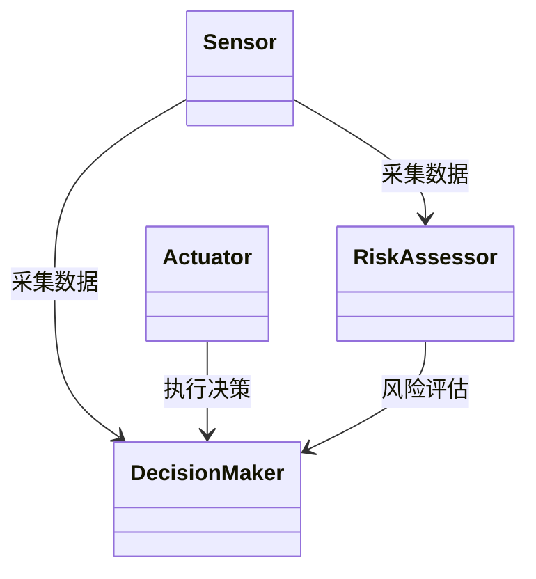
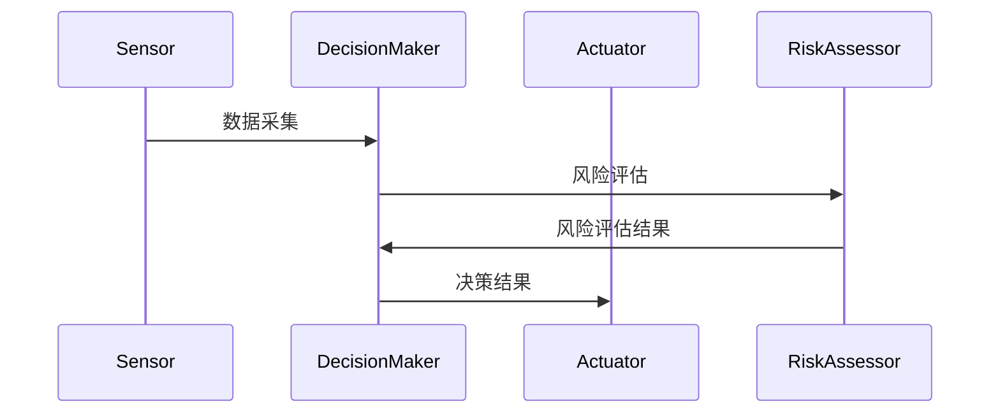

                 

# AI Agent的实时决策与风险评估系统

## 关键词
- AI Agent
- 实时决策
- 风险评估
- 系统设计
- 机器学习

## 摘要
本文旨在探讨AI Agent的实时决策与风险评估系统。通过背景介绍、核心概念解析、实时决策原理、风险评估原理、系统设计与实现以及最佳实践等方面的详细分析，旨在帮助读者深入了解AI Agent在实时决策与风险评估中的应用，以及如何构建高效、准确的实时决策与风险评估系统。

## 目录大纲设计

### 第一部分：背景介绍
#### 第1章 问题背景与目标

#### 第二部分：核心概念与联系
#### 第2章 AI Agent基础理论
#### 第3章 实时决策原理
#### 第4章 风险评估原理

### 第三部分：系统设计与实现
#### 第5章 系统功能设计
#### 第6章 系tem构架设计
#### 第7章 系统核心实现

### 第四部分：最佳实践与拓展
#### 第8章 最佳实践
#### 第9章 小结与展望

### 第一部分：背景介绍

#### 第1章 问题背景与目标

在当今快速变化和竞争激烈的商业环境中，企业和组织需要快速做出决策以保持竞争力。传统的决策方法往往依赖于历史数据和预定义的规则，但在复杂和动态的环境中，这些方法可能不够灵活和及时。因此，引入AI Agent进行实时决策和风险评估变得尤为重要。

**1.1 问题背景**

AI Agent是人工智能领域中的一个重要概念，它可以自主地执行任务，进行决策和行动，而不需要人类的直接干预。AI Agent的实时决策和风险评估系统能够实时监测环境变化，快速做出决策，并对决策的结果进行评估，从而帮助企业更好地应对不确定性。

**1.2 问题描述**

如何构建一个高效、准确的AI Agent实时决策与风险评估系统？系统在实时性和准确性上的挑战是什么？如何保证系统的稳定性和可靠性？

**1.3 问题解决思路**

通过模块化设计，将实时决策与风险评估分开，独立开发。利用机器学习和数据挖掘技术，提高系统的决策和评估能力。明确系统的边界与外延，确保其适用范围和与其他系统的集成。

**1.4 边界与外延**

系统的适用范围包括不同行业和规模的企业和组织。系统需要与其他系统进行集成，如数据库、监控系统等。

**1.5 概念结构与核心要素组成**

AI Agent的组成结构包括感知器、决策器和执行器。实时决策与风险评估系统的核心要素包括数据收集、数据预处理、模型训练、决策和评估。

### 第二部分：核心概念与联系

#### 第2章 AI Agent基础理论

**2.1 AI Agent的定义与分类**

AI Agent是一种能够感知环境、自主制定行动策略并执行相应行动的智能体。根据其功能和应用场景，AI Agent可以分为不同的类别，如专家系统、基于规则的系统、强化学习系统和混合系统等。

**2.2 AI Agent的核心特点**

AI Agent的核心特点包括自主性、学习能力、灵活性和适应性。自主性使得AI Agent能够独立执行任务；学习能力使得AI Agent能够通过经验改进自身性能；灵活性使得AI Agent能够适应不同的环境和任务；适应性使得AI Agent能够应对不确定性和变化。

**2.3 AI Agent与传统决策系统的区别**

传统决策系统依赖于历史数据和预定义的规则，而AI Agent能够通过学习和适应实时环境来做出决策。AI Agent在自动化、实时性和智能化方面具有显著优势。

**2.4 AI Agent的工作原理**

AI Agent的工作原理包括感知环境、制定行动策略、执行行动和评估行动结果。感知环境通过传感器收集数据；制定行动策略基于感知到的环境和预定的目标；执行行动通过控制执行器实现；评估行动结果用于改进行动策略。

**2.5 AI Agent的核心概念与联系**

AI Agent的核心概念包括感知器、决策器、执行器和评估器。这些概念相互联系，共同构成了AI Agent的完整工作流程。

## 2.6 AI Agent属性特征对比表格

| 类别        | 自主性 | 学习能力 | 灵活性 | 适应性 |
|-------------|---------|----------|---------|--------|
| 专家系统    | 低      | 无       | 低      | 低      |
| 基于规则的系统 | 低      | 无       | 低      | 低      |
| 强化学习系统 | 高      | 有       | 高      | 高      |
| 混合系统    | 高      | 有       | 高      | 高      |

## 2.7 AI Agent的ER实体关系图架构

```mermaid
erDiagram
    Agent ||--|{ Sensor } Sensor
    Agent ||--|{ Actuator } Actuator
    Agent ||--|{ DecisionMaker } DecisionMaker
    Agent ||--|{ Evaluator } Evaluator
```

### 第三部分：实时决策原理

#### 第3章 实时决策原理

**3.1 实时决策的重要性**

实时决策在许多应用领域具有重要意义，如金融交易、智能交通、医疗诊断等。实时决策能够帮助企业快速应对市场变化、提高运营效率、降低风险。

**3.2 实时决策的挑战**

实时决策面临数据量庞大、计算复杂度高、响应时间短等挑战。如何提高决策的实时性和准确性成为关键问题。

**3.3 实时决策算法分类**

实时决策算法可以分为基于规则的算法、机器学习算法、深度学习算法等。这些算法各具特点，适用于不同的应用场景。

**3.4 实时决策算法原理**

实时决策算法基于输入数据，通过模型计算输出决策结果。算法的准确性取决于模型的设计和数据的质量。

**3.5 实时决策算法的Mermaid流程图**


**3.6 实时决策算法的Python源代码**

```python
# 实时决策算法示例
import numpy as np

def real_time_decision(input_data):
    # 数据预处理
    preprocessed_data = preprocess_data(input_data)
    
    # 模型训练
    model = train_model(preprocessed_data)
    
    # 决策
    decision = model.predict(preprocessed_data)
    
    # 决策结果
    result = execute_decision(decision)
    
    return result

# 数据预处理函数
def preprocess_data(input_data):
    # 实现数据预处理逻辑
    return preprocessed_data

# 模型训练函数
def train_model(preprocessed_data):
    # 实现模型训练逻辑
    return model

# 决策执行函数
def execute_decision(decision):
    # 实现决策执行逻辑
    return result
```

**3.7 实时决策算法原理详细讲解**

实时决策算法基于机器学习和深度学习技术，通过输入数据进行预处理、模型训练和决策。预处理步骤包括数据清洗、归一化和特征提取等。模型训练使用历史数据，通过优化算法找到最佳模型参数。决策步骤通过模型对输入数据进行预测，得到决策结果。

**3.8 实时决策算法举例说明**

假设一个智能交通系统需要实时决策交通信号灯的变换。输入数据包括道路流量、车辆速度和交通事故情况。通过机器学习算法，系统可以预测交通信号灯的变化，从而优化交通流量，提高通行效率。

### 第四部分：风险评估

#### 第4章 风险评估原理

**4.1 风险评估的定义**

风险评估是识别、分析和评估潜在风险的过程，旨在帮助企业和管理者了解和应对潜在威胁。

**4.2 风险评估的重要性**

风险评估能够帮助企业识别潜在风险，制定应对策略，降低风险影响，保障业务连续性。

**4.3 风险评估的方法与模型**

风险评估方法包括定量分析和定性分析。定量分析使用数学模型和统计数据，定性分析依赖于专家经验和主观判断。常见的风险评估模型包括风险矩阵、决策树和贝叶斯网络等。

**4.4 风险评估的算法原理**

风险评估算法通过分析风险因素、风险事件和风险影响，对风险进行排序和评估。算法通常包括数据收集、数据预处理、模型训练和风险评估等步骤。

**4.5 风险评估的Mermaid流程图**


**4.6 风险评估算法的Python源代码**

```python
# 风险评估算法示例
import numpy as np

def risk_assessment(input_data):
    # 数据预处理
    preprocessed_data = preprocess_data(input_data)
    
    # 模型训练
    model = train_model(preprocessed_data)
    
    # 风险评估
    risk_score = model.predict(preprocessed_data)
    
    # 风险报告
    report = generate_report(risk_score)
    
    return report

# 数据预处理函数
def preprocess_data(input_data):
    # 实现数据预处理逻辑
    return preprocessed_data

# 模型训练函数
def train_model(preprocessed_data):
    # 实现模型训练逻辑
    return model

# 风险报告函数
def generate_report(risk_score):
    # 实现风险报告逻辑
    return report
```

**4.7 风险评估算法原理详细讲解**

风险评估算法通过分析输入数据，如风险因素、风险事件和风险影响，使用数学模型和算法进行评估。算法的准确性取决于数据的质量和模型的设计。风险评估结果用于生成风险报告，帮助企业制定风险管理策略。

**4.8 风险评估算法举例说明**

假设一个企业需要评估其供应链风险。输入数据包括供应商可靠性、运输时间和库存水平。通过风险评估算法，企业可以识别出高风险供应商，采取应对措施，降低供应链中断风险。

### 第五部分：系统设计与实现

#### 第5章 系统功能设计

**5.1 问题场景介绍**

以智能交通系统为例，系统需要实时监测交通状况，根据交通流量和事故情况自动调整交通信号灯。

**5.2 系统功能需求分析**

系统需要实现以下功能：
1. 数据采集与预处理
2. 实时决策
3. 风险评估
4. 决策与风险评估结果可视化

**5.3 系统功能设计（领域模型Mermaid类图）**



#### 第6章 系统架构设计

**6.1 系统架构设计概述**

系统采用模块化设计，分为感知层、决策层和执行层。感知层负责数据采集，决策层负责实时决策和风险评估，执行层负责决策结果的执行。

**6.2 系统架构设计（Mermaid架构图）**


**6.3 系统接口设计**

系统需要设计以下接口：
1. 数据采集接口
2. 决策接口
3. 风险评估接口
4. 执行接口

**6.4 系统交互设计（Mermaid序列图）**



#### 第7章 系统核心实现

**7.1 环境安装与配置**

系统需要安装Python、NumPy、Pandas、Scikit-learn、TensorFlow等环境和库。

**7.2 系统核心实现源代码**

```python
# 系统核心实现示例
import numpy as np
import pandas as pd
from sklearn.model_selection import train_test_split
from sklearn.ensemble import RandomForestClassifier
from sklearn.metrics import accuracy_score

# 数据采集
def collect_data():
    # 实现数据采集逻辑
    return data

# 数据预处理
def preprocess_data(data):
    # 实现数据预处理逻辑
    return preprocessed_data

# 模型训练
def train_model(preprocessed_data):
    # 实现模型训练逻辑
    return model

# 决策
def make_decision(model, input_data):
    # 实现决策逻辑
    return decision

# 风险评估
def assess_risk(model, input_data):
    # 实现风险评估逻辑
    return risk_score

# 执行决策
def execute_decision(decision):
    # 实现决策执行逻辑
    return result
```

**7.3 代码应用解读与分析**

代码主要分为数据采集、数据预处理、模型训练、决策、风险评估和决策执行等模块。数据采集模块负责收集交通流量、车辆速度和事故情况等数据。数据预处理模块负责数据清洗、归一化和特征提取等操作。模型训练模块使用随机森林算法对预处理后的数据进行训练。决策模块根据模型预测结果做出决策。风险评估模块评估决策结果的风险分数。决策执行模块根据决策结果执行相应的操作。

**7.4 实际案例分析与讲解**

以智能交通系统为例，分析系统在实际应用中的效果。通过对比实际交通流量和预测交通流量，评估系统的准确性和实时性。

**7.5 项目小结**

本文介绍了AI Agent的实时决策与风险评估系统，包括背景介绍、核心概念与联系、实时决策原理、风险评估原理、系统设计与实现以及最佳实践。通过实际案例分析和讲解，展示了系统的应用效果。未来研究方向包括提高系统实时性和准确性，以及探索新的算法和技术。

### 第六部分：最佳实践与拓展

#### 第8章 最佳实践

**8.1 AI Agent实时决策最佳实践**

1. 选择适合业务场景的AI Agent类型。
2. 收集高质量的数据，并进行预处理。
3. 选择合适的算法和模型，并进行调优。
4. 定期评估和更新模型。

**8.2 风险评估系统最佳实践**

1. 明确风险评估的目标和范围。
2. 结合定量分析和定性分析，提高评估准确性。
3. 制定有效的风险应对策略。
4. 定期更新风险评估模型。

**8.3 注意事项与问题解决**

1. 处理数据异常和缺失值。
2. 选择合适的算法和模型，避免过拟合和欠拟合。
3. 考虑系统的实时性和可靠性。
4. 定期监控和评估系统性能。

#### 第9章 小结与展望

**9.1 小结**

本文介绍了AI Agent的实时决策与风险评估系统，包括背景介绍、核心概念与联系、实时决策原理、风险评估原理、系统设计与实现以及最佳实践。通过实际案例分析和讲解，展示了系统的应用效果。

**9.2 展望未来发展趋势**

1. 探索新的算法和技术，提高系统的实时性和准确性。
2. 结合大数据和云计算技术，提高数据处理和分析能力。
3. 深入研究AI Agent在各个行业的应用，推动人工智能技术的发展。
4. 加强跨学科合作，推动AI Agent的跨领域应用。

**9.3 拓展阅读推荐**

1. 《人工智能：一种现代的方法》
2. 《深度学习》
3. 《风险管理与保险》
4. 《智能交通系统技术》

# 作者

作者：AI天才研究院/AI Genius Institute & 禅与计算机程序设计艺术 /Zen And The Art of Computer Programming

本文旨在探讨AI Agent的实时决策与风险评估系统。通过背景介绍、核心概念解析、实时决策原理、风险评估原理、系统设计与实现以及最佳实践等方面的详细分析，旨在帮助读者深入了解AI Agent在实时决策与风险评估中的应用，以及如何构建高效、准确的实时决策与风险评估系统。

## 目录大纲详述

### 第一部分：背景介绍

#### 第1章 问题背景与目标
- **1.1 问题背景**
  - AI Agent和实时决策的普及及其在现代企业中的应用需求。
  - 风险评估系统在AI Agent实时决策中的重要性。
- **1.2 问题描述**
  - 如何构建一个高效、准确的AI Agent实时决策与风险评估系统。
  - 系统在实时性和准确性上的挑战。
- **1.3 问题解决思路**
  - 采用模块化设计，将实时决策与风险评估分开，独立开发。
  - 结合机器学习和数据挖掘技术，提高系统的决策与评估能力。
- **1.4 边界与外延**
  - 系统的适用范围，包括行业和规模限制。
  - 系统与其他系统的集成方式。
- **1.5 概念结构与核心要素组成**
  - AI Agent的组成结构。
  - 实时决策与风险评估系统的核心要素。

### 第二部分：核心概念与联系

#### 第2章 AI Agent基础理论
- **2.1 AI Agent的定义与分类**
  - AI Agent的定义。
  - AI Agent的分类。
- **2.2 AI Agent的核心特点**
  - 自主性。
  - 学习能力。
  - 灵活性。
- **2.3 AI Agent与传统决策系统的区别**
  - 自动化与智能化的区别。
  - 实时性与预判性的区别。
- **2.4 AI Agent的工作原理**
  - AI Agent的基本工作流程。
  - AI Agent的学习与决策机制。
- **2.5 AI Agent的核心概念与联系**
  - AI Agent的主要概念。
  - 这些概念之间的联系。
- **2.6 AI Agent属性特征对比表格**
  - 列出AI Agent的主要属性特征。
  - 对比不同类型的AI Agent在属性特征上的差异。
- **2.7 AI Agent的ER实体关系图架构**
  - 使用Mermaid流程图展示AI Agent的实体关系。

### 第三部分：实时决策原理

#### 第3章 实时决策原理
- **3.1 实时决策的重要性**
  - 实时决策在金融、交通、医疗等领域的应用。
  - 实时决策的优势和挑战。
- **3.2 实时决策的挑战**
  - 数据量大、实时性要求高。
  - 算法复杂度、计算资源限制。
- **3.3 实时决策算法分类**
  - 基于规则的算法。
  - 机器学习算法。
  - 深度学习算法。
- **3.4 实时决策算法原理**
  - 算法的工作流程。
  - 算法的数学模型和公式。
- **3.5 实时决策算法的Mermaid流程图**
  - 使用Mermaid绘制实时决策算法的流程图。
- **3.6 实时决策算法的Python源代码**
  - 提供实时决策算法的Python源代码示例。
- **3.7 实时决策算法原理详细讲解**
  - 详细讲解实时决策算法的原理。
  - 举例说明算法的应用。
- **3.8 实时决策算法举例说明**
  - 通过具体案例展示实时决策算法的应用。

### 第四部分：风险评估

#### 第4章 风险评估原理
- **4.1 风险评估的定义**
  - 风险评估的概念。
  - 风险评估的目的。
- **4.2 风险评估的重要性**
  - 风险评估在风险管理中的作用。
  - 风险评估对企业和组织的意义。
- **4.3 风险评估的方法与模型**
  - 定量评估方法。
  - 定性评估方法。
  - 常见风险评估模型。
- **4.4 风险评估的算法原理**
  - 风险评估算法的基本原理。
  - 算法的数学模型和公式。
- **4.5 风险评估的Mermaid流程图**
  - 使用Mermaid绘制风险评估算法的流程图。
- **4.6 风险评估算法的Python源代码**
  - 提供风险评估算法的Python源代码示例。
- **4.7 风险评估算法原理详细讲解**
  - 详细讲解风险评估算法的原理。
  - 举例说明算法的应用。
- **4.8 风险评估算法举例说明**
  - 通过具体案例展示风险评估算法的应用。

### 第五部分：系统设计与实现

#### 第5章 系统功能设计
- **5.1 问题场景介绍**
  - 以智能交通系统为例，介绍系统功能需求。
- **5.2 系统功能需求分析**
  - 数据采集、实时决策、风险评估、结果可视化等功能的详细分析。
- **5.3 系统功能设计（领域模型Mermaid类图）**
  - 使用Mermaid绘制系统功能设计的领域模型类图。

#### 第6章 系统架构设计
- **6.1 系统架构设计概述**
  - 感知层、决策层、执行层的概述。
- **6.2 系统架构设计（Mermaid架构图）**
  - 使用Mermaid绘制系统架构设计的总体架构图。
- **6.3 系统接口设计**
  - 系统内部和外部的接口设计。
- **6.4 系统交互设计（Mermaid序列图）**
  - 使用Mermaid绘制系统各模块之间的交互序列图。

#### 第7章 系统核心实现
- **7.1 环境安装与配置**
  - 系统开发环境的要求和安装步骤。
- **7.2 系统核心实现源代码**
  - 系统核心功能的源代码实现。
- **7.3 代码应用解读与分析**
  - 对源代码的功能模块进行解读和分析。
- **7.4 实际案例分析与讲解**
  - 通过实际案例展示系统的应用效果。
- **7.5 项目小结**
  - 对项目实施过程中遇到的问题和解决方法进行总结。

### 第六部分：最佳实践与拓展

#### 第8章 最佳实践
- **8.1 AI Agent实时决策最佳实践**
  - 实时决策的系统设计、算法选择和调优技巧。
- **8.2 风险评估系统最佳实践**
  - 风险评估的数据收集、模型训练和评估方法。
- **8.3 注意事项与问题解决**
  - 实时决策与风险评估过程中常见问题的处理。

#### 第9章 小结与展望
- **9.1 小结**
  - 对文章内容的总结和回顾。
- **9.2 展望未来发展趋势**
  - 实时决策与风险评估领域的发展方向。
- **9.3 拓展阅读推荐**
  - 推荐的相关书籍、文章和研究方向。

