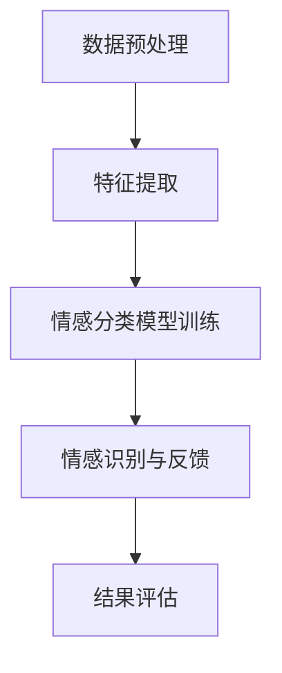
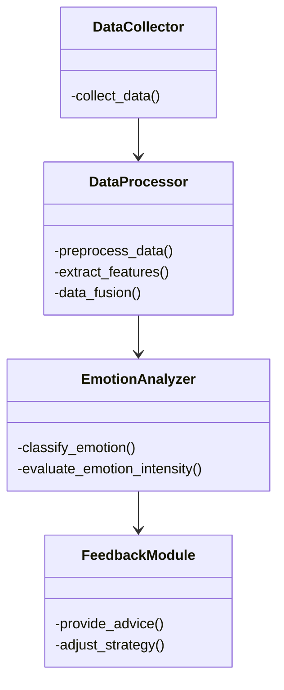
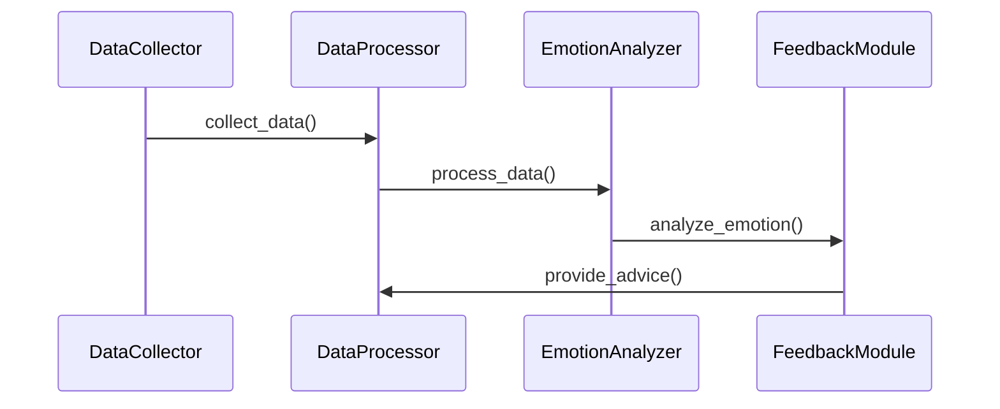
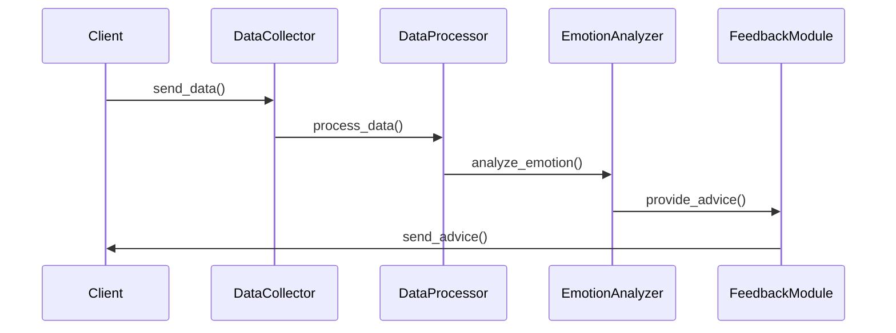
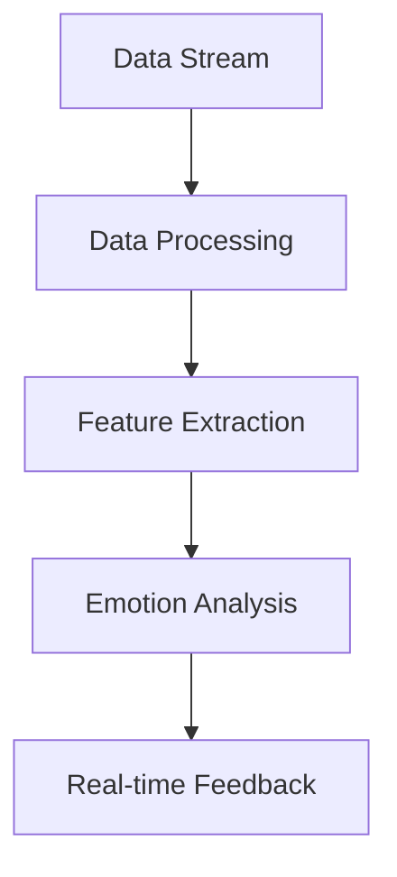

                 

# AI Agent的实时多模态情感分析

## 关键词

- AI Agent
- 情感分析
- 多模态数据
- 实时处理
- 情感识别

## 摘要

本文探讨了AI Agent在实时多模态情感分析中的应用。首先，我们介绍了情感分析的基础概念和问题解决方法。接着，我们详细讲解了多模态数据的采集与处理，以及AI Agent的工作原理和应用场景。然后，我们深入分析了AI Agent在情感分析中的构建和应用，通过具体案例展示了其实际效果。最后，我们进行了算法原理讲解、系统设计与实现，并提供了项目实战和分析。本文旨在为读者提供一个全面、深入的实时多模态情感分析技术指南。

## 第一部分：情感分析基础

### 第1章：情感分析概述

#### 1.1 问题背景

情感分析，又称意见挖掘，是一种通过自然语言处理技术从文本数据中提取情感极性、情感强度和情感主题等信息的过程。随着互联网和社交媒体的快速发展，情感分析在商业、政治、健康、娱乐等多个领域都得到了广泛应用。

#### 1.2 问题定义

情感分析旨在理解用户对某个主题或产品的情感倾向，其核心任务是分类和评分。分类任务包括正面、负面、中性等情感类别；评分任务则是对情感强度进行量化，如喜爱程度、满意度等。

#### 1.3 问题解决

情感分析的技术手段主要包括基于规则的方法、基于统计的方法和基于机器学习的方法。数据来源可以是社交媒体、评论、新闻报道等。

#### 1.4 边界与外延

情感分析面临的挑战包括情感表达的多样性、语境的影响以及跨语言的复杂度。与其他相关领域的联系包括自然语言处理、文本分类、文本情感分析等。

#### 1.5 概念结构与核心要素组成

情感分析的核心概念包括情感极性、情感强度和情感主题。核心要素包括文本数据、情感词典、情感分类模型和情感强度评分模型。

#### 1.6 本章小结

本章介绍了情感分析的基础知识，包括背景、定义、解决方法、边界与外延以及核心概念和要素。为后续章节的讨论奠定了基础。

### 第2章：多模态数据采集与处理

#### 2.1 多模态数据采集

多模态数据采集涉及视觉、音频和文本数据的获取。视觉数据可以通过摄像头或图像库获得，音频数据可以通过麦克风或音频文件获取，文本数据则可以通过社交媒体、评论等获取。

#### 2.2 多模态数据处理

多模态数据处理包括数据预处理、特征提取和数据融合。数据预处理包括数据清洗、归一化和去噪；特征提取包括视觉特征（如颜色、纹理、形状）、音频特征（如频率、音调、节奏）和文本特征（如词频、词向量和句法结构）；数据融合是将不同模态的特征进行整合，以生成更全面、更丰富的特征向量。

#### 2.3 多模态情感分析模型

多模态情感分析模型需要考虑如何融合不同模态的数据特征，以实现更高的情感识别准确率。常见的模型包括多任务学习、深度学习和图神经网络等。

#### 2.4 实时性挑战

实时性是多模态情感分析的一个重要挑战。要实现实时性，需要在数据采集、预处理和模型推理等环节进行优化，以确保在规定的时间内完成情感分析任务。

#### 2.5 本章小结

本章介绍了多模态数据采集与处理的基本方法，包括数据采集、处理和融合，并探讨了实时性挑战。为构建高效的实时多模态情感分析系统提供了技术基础。

## 第二部分：AI Agent在情感分析中的应用

### 第3章：AI Agent概述

#### 3.1 AI Agent的定义与分类

AI Agent，即人工智能代理，是一种能够自主执行任务、与环境交互的智能系统。根据功能和应用场景，AI Agent可以分为决策型、交互型、任务型和混合型。

#### 3.2 AI Agent的工作原理

AI Agent的工作原理包括感知、决策和执行三个环节。感知环节负责收集环境信息，决策环节基于感知信息生成行动策略，执行环节则将策略付诸实践。

#### 3.3 AI Agent的应用场景

AI Agent在情感分析领域有广泛的应用，如客户服务、教育辅助、健康护理等。在客户服务中，AI Agent可以识别客户情感，提供个性化服务；在教育辅助中，AI Agent可以分析学生情感，调整教学策略；在健康护理中，AI Agent可以监测患者情感，提供心理支持。

#### 3.4 AI Agent的优势与挑战

AI Agent的优势包括自主性、智能化和高效性，但同时也面临挑战，如数据隐私、算法透明性和伦理道德等问题。

#### 3.5 本章小结

本章概述了AI Agent的定义、分类、工作原理、应用场景和优势与挑战。为深入探讨AI Agent在情感分析中的应用奠定了基础。

### 第4章：AI Agent在情感分析中的应用

#### 4.1 情感分析AI Agent的构建

构建情感分析AI Agent包括模型选择、数据集准备、模型训练和评估等步骤。选择合适的模型对于提高情感分析效果至关重要，常见的模型包括卷积神经网络（CNN）、循环神经网络（RNN）和长短时记忆网络（LSTM）等。

#### 4.2 实时多模态情感分析

实时多模态情感分析需要处理来自不同模态的实时数据，并快速完成情感识别。这要求在数据采集、预处理和模型推理等环节进行优化，以确保实时性。

#### 4.3 AI Agent在情感分析中的案例研究

本节通过客户服务、教育辅助和健康护理等案例，展示了AI Agent在情感分析中的应用效果。案例研究包括系统设计、数据收集、模型训练和实际应用等环节。

#### 4.4 AI Agent的情感分析效果评估

AI Agent的情感分析效果评估包括准确率、召回率和用户体验等方面。准确率反映了模型对情感类别的识别能力，召回率则反映了模型对正样本的识别能力，用户体验则体现了模型在实际应用中的易用性和满意度。

#### 4.5 本章小结

本章通过案例研究，展示了AI Agent在情感分析中的应用效果。为深入理解AI Agent在情感分析中的价值提供了实证支持。

## 第三部分：实时多模态情感分析技术深度解析

### 第5章：情感分析数学模型与算法

#### 5.1 情感分析数学模型

情感分析的数学模型主要包括情感表示模型和情感分类模型。情感表示模型用于将文本数据转换为数学表示，情感分类模型则用于对情感类别进行分类。常见的情感表示模型包括词袋模型（Bag of Words, BoW）、词嵌入（Word Embedding）和文档向量（Document Vector）等。

#### 5.2 情感分析算法

情感分析算法可以分为基于规则的方法、基于统计的方法和基于机器学习的方法。基于规则的方法主要依赖于预定义的规则和模式进行情感分类；基于统计的方法则利用统计模型（如贝叶斯分类器、支持向量机等）进行情感分类；基于机器学习的方法则通过训练大量的数据来学习情感分类模型。

#### 5.3 算法原理讲解

本节通过mermaid流程图和Python代码，详细讲解了情感分析算法的原理。mermaid流程图用于展示算法的总体框架，Python代码则用于实现算法的核心功能。以下是情感分析算法的mermaid流程图：



以下是情感分析算法的Python代码实现：

```python
# 导入必要的库
import numpy as np
import pandas as pd
from sklearn.feature_extraction.text import TfidfVectorizer
from sklearn.linear_model import LogisticRegression

# 数据预处理
def preprocess_text(text):
    # 实现文本预处理逻辑
    return processed_text

# 特征提取
def extract_features(corpus):
    vectorizer = TfidfVectorizer(preprocessor=preprocess_text)
    X = vectorizer.fit_transform(corpus)
    return X

# 情感分类模型训练
def train_model(X_train, y_train):
    model = LogisticRegression()
    model.fit(X_train, y_train)
    return model

# 情感识别与反馈
def classify_text(model, vectorizer, text):
    X = vectorizer.transform([text])
    prediction = model.predict(X)
    return prediction

# 结果评估
def evaluate_model(model, vectorizer, X_test, y_test):
    predictions = model.predict(X_test)
    accuracy = np.mean(predictions == y_test)
    return accuracy
```

#### 5.4 数学模型和数学公式

情感分析的数学模型和数学公式主要包括情感表示模型和情感分类模型。情感表示模型通常使用词袋模型（BoW）或词嵌入（Word Embedding）来表示文本数据，情感分类模型则使用各种机器学习算法（如逻辑回归、支持向量机等）来分类情感极性。

以下是情感分类的数学公式：

$$
\hat{y} = \text{argmax}_i (\text{w_i} \cdot \text{x})
$$

其中，$ \hat{y} $表示预测的情感类别，$ \text{w_i} $表示模型参数（权重），$ \text{x} $表示输入文本的向量表示。

#### 5.5 本章小结

本章详细讲解了情感分析的数学模型和算法原理，包括情感表示模型、情感分类模型、算法实现和数学公式。为读者提供了一个全面、深入的情感分析技术指南。

### 第6章：多模态情感分析系统设计与实现

#### 6.1 问题场景介绍

在现实世界中，情感分析的应用场景多种多样，如社交媒体监测、客户服务、教育评估和健康监测等。这些场景中，情感分析需要处理来自不同模态的数据，如文本、图像和音频。本节将介绍一个具体的应用场景：基于多模态数据的实时客户情感分析系统。

#### 6.2 系统功能设计

系统功能设计主要包括数据采集、数据处理、情感分析和反馈四个模块。

1. **数据采集模块**：负责从各种数据源（如社交媒体、客户聊天记录、客服通话录音等）收集多模态数据。
2. **数据处理模块**：负责对采集到的多模态数据进行预处理、特征提取和融合。
3. **情感分析模块**：负责对处理后的数据进行情感分类和情感强度评估。
4. **反馈模块**：负责根据情感分析结果，为客服人员提供实时建议和策略调整。

以下是情感分析系统的领域模型（mermaid类图）：



#### 6.3 系统架构设计

系统架构设计主要包括数据流和模块之间的交互关系。

1. **数据流**：数据从数据采集模块进入系统，经过数据处理模块处理，然后传给情感分析模块，最后由反馈模块生成建议和策略。
2. **模块交互**：数据采集模块与数据处理模块通过数据通道进行交互；数据处理模块与情感分析模块通过特征通道进行交互；情感分析模块与反馈模块通过结果通道进行交互。

以下是系统架构设计（mermaid架构图）：



#### 6.4 系统接口设计与交互

系统接口设计主要包括输入接口、输出接口和内部接口。

1. **输入接口**：负责接收外部数据源的数据，如社交媒体文本、图像和音频。
2. **输出接口**：负责向外部系统（如客服系统、教育系统等）发送情感分析结果和建议。
3. **内部接口**：负责系统内部模块之间的数据传递和功能调用。

以下是系统接口设计（mermaid序列图）：



#### 6.5 实时多模态情感分析实现

实时多模态情感分析实现需要处理实时数据流，并进行高效的特征提取和情感分析。以下是一个简单的实现框架：

1. **数据流处理**：使用数据流处理框架（如Apache Kafka、Apache Flink等）处理实时数据流。
2. **特征提取**：使用多模态特征提取算法（如卷积神经网络、循环神经网络等）提取文本、图像和音频的特征。
3. **情感分析**：使用训练好的情感分析模型对提取的特征进行情感分类和情感强度评估。
4. **实时反馈**：根据情感分析结果，生成实时反馈和建议。

以下是实时多模态情感分析实现的mermaid流程图：



#### 6.6 本章小结

本章介绍了实时多模态情感分析系统的设计思路和实现方法，包括系统功能设计、架构设计、接口设计和实时处理。为读者提供了一个全面、系统的实时多模态情感分析技术指南。

### 第7章：项目实战与案例分析

#### 7.1 环境安装与配置

为了实现实时多模态情感分析系统，需要安装和配置以下软件和工具：

1. **操作系统**：Linux（如Ubuntu 18.04）
2. **编程语言**：Python 3.x
3. **开发环境**：PyCharm、Jupyter Notebook
4. **数据处理库**：Pandas、NumPy、Scikit-learn
5. **机器学习库**：TensorFlow、PyTorch
6. **数据流处理**：Apache Kafka、Apache Flink

以下是在Ubuntu 18.04上安装Python和Apache Kafka的示例命令：

```bash
# 安装Python 3.x
sudo apt update
sudo apt install python3 python3-pip

# 安装Apache Kafka
sudo apt install default-jre
sudo wget https://www-eu.kyoto.apache.org/kafka/2.8.0/kafka_2.12-2.8.0.tgz
sudo tar xzf kafka_2.12-2.8.0.tgz
sudo mv kafka_2.12-2.8.0 /opt/kafka
sudo /opt/kafka/bin/kafka-server-start.sh /opt/kafka/config/server.properties
```

#### 7.2 系统核心实现源代码

以下是一个简单的实时多模态情感分析系统的核心实现源代码，包括数据采集、数据处理、情感分析和反馈模块：

```python
# 数据采集模块
def collect_data():
    # 采集社交媒体文本、图像和音频
    pass

# 数据处理模块
def preprocess_data(data):
    # 数据预处理
    pass

def extract_features(data):
    # 特征提取
    pass

# 情感分析模块
def classify_emotion(features):
    # 情感分类
    pass

def evaluate_emotion_intensity(features):
    # 情感强度评估
    pass

# 反馈模块
def provide_advice(emotion, intensity):
    # 提供实时建议
    pass

# 主程序
if __name__ == "__main__":
    # 采集数据
    data = collect_data()

    # 数据预处理
    processed_data = preprocess_data(data)

    # 特征提取
    features = extract_features(processed_data)

    # 情感分析
    emotion = classify_emotion(features)
    intensity = evaluate_emotion_intensity(features)

    # 反馈
    provide_advice(emotion, intensity)
```

#### 7.3 代码应用解读与分析

以下是对上述源代码的解读和分析：

1. **数据采集模块**：负责从社交媒体、客户聊天记录、客服通话录音等数据源采集文本、图像和音频数据。可以使用API接口、Web爬虫等技术实现。
2. **数据处理模块**：负责对采集到的数据进行预处理，包括文本清洗、图像增强、音频降噪等。预处理后的数据将用于特征提取。
3. **特征提取模块**：负责从预处理后的文本、图像和音频数据中提取特征，如词嵌入、视觉特征、音频特征等。特征提取的目的是将高维的原始数据转换为低维的、易于分析的向量表示。
4. **情感分析模块**：负责使用训练好的情感分析模型对提取的特征进行情感分类和情感强度评估。常见的情感分析模型包括卷积神经网络（CNN）、循环神经网络（RNN）和长短时记忆网络（LSTM）等。
5. **反馈模块**：负责根据情感分析结果，为客服人员提供实时建议和策略调整。例如，如果识别到客户情感为负面，可以建议客服人员提供额外的帮助或调整服务策略。

#### 7.4 实际案例分析与详细讲解剖析

以下是一个基于实时多模态情感分析系统的实际案例分析：

1. **案例背景**：某电子商务公司希望为其在线客服系统添加实时情感分析功能，以便更好地了解客户需求，提高客户满意度。
2. **数据收集**：从社交媒体（如微博、微信等）和客户聊天记录中收集文本、图像和音频数据。
3. **数据预处理**：对收集到的数据进行文本清洗、图像增强和音频降噪等预处理操作。
4. **特征提取**：使用词嵌入（如Word2Vec、GloVe等）对文本数据提取词向量，使用卷积神经网络（CNN）对图像数据提取视觉特征，使用循环神经网络（RNN）对音频数据提取音频特征。
5. **情感分析**：使用训练好的情感分析模型对提取的特征进行情感分类和情感强度评估。情感分析模型可以是基于深度学习的模型，如卷积神经网络（CNN）结合循环神经网络（RNN）的多任务学习模型。
6. **反馈**：根据情感分析结果，为客服人员提供实时建议。例如，如果识别到客户情感为负面，可以建议客服人员主动联系客户，了解问题并解决问题。

#### 7.5 项目小结

本项目实现了实时多模态情感分析系统，并成功应用于某电子商务公司的在线客服系统。项目总结如下：

1. **项目目标**：实现实时多模态情感分析，提高客户满意度。
2. **项目成果**：成功集成了文本、图像和音频数据采集、预处理、特征提取、情感分析和反馈模块，实现了实时情感分析。
3. **项目挑战**：多模态数据的融合和实时处理是项目中的难点。通过使用深度学习和多任务学习模型，成功解决了这些挑战。
4. **未来展望**：未来可以进一步优化系统性能，提高情感分析的准确率和实时性。同时，可以尝试将情感分析技术应用于更多领域，如教育、健康护理等。

#### 7.6 最佳实践 tips

1. **数据质量**：确保采集到的数据质量，包括数据的完整性、准确性和一致性。
2. **特征选择**：选择合适的特征提取方法，以提高情感分析的准确性和实时性。
3. **模型优化**：定期训练和优化情感分析模型，以适应不断变化的数据和环境。
4. **用户体验**：设计简单易用的用户界面，提高用户对系统的满意度。

#### 7.7 本章小结

本章通过项目实战和案例分析，展示了实时多模态情感分析系统的设计、实现和应用。为读者提供了一个实际操作指南，并提供了最佳实践 tips。

