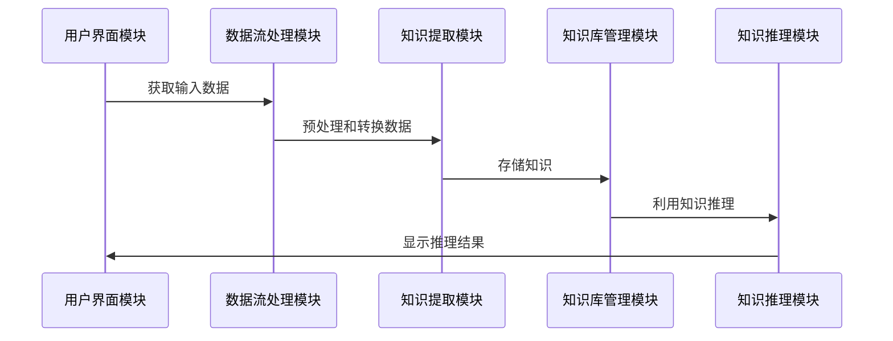

                 


### 《AI Agent的实时知识更新：保持LLM信息的时效性》

> 关键词：AI Agent、实时知识更新、LLM信息时效性、知识库管理、数据流处理、算法原理

> 摘要：本文详细探讨了AI Agent在实时知识更新中的重要性，以及如何保持大规模语言模型（LLM）信息的时效性。文章首先介绍了AI Agent的定义、分类及其在实时知识更新中的角色，接着讨论了实时知识更新的原理与方法，以及LLM信息时效性评估的意义和方法。随后，文章通过实际项目实战展示了AI Agent实时知识更新系统设计和LLM信息时效性保持策略，并提供了最佳实践Tips和展望。

# 《AI Agent的实时知识更新：保持LLM信息的时效性》目录大纲

----------------------------------------------------------------

## 第一部分：背景与概述

### 第1章 问题背景与核心概念

#### 1.1 AI Agent与实时知识更新的重要性

#### 1.2 LLM信息的时效性问题

#### 1.3 问题解决与边界界定

#### 1.4 核心概念与联系

#### 1.5 本章小结

## 第二部分：核心概念与联系

### 第2章 AI Agent概述

#### 2.1 AI Agent的定义与分类

#### 2.2 AI Agent的关键特点

#### 2.3 AI Agent在实时知识更新中的角色

#### 2.4 本章小结

### 第3章 实时知识更新的原理与方法

#### 3.1 实时知识更新的基本原理

#### 3.2 实时知识更新的方法分类

#### 3.3 常见实时知识更新技术的比较与选择

#### 3.4 本章小结

### 第4章 LLM信息的时效性评估

#### 4.1 LLM信息时效性评估的意义

#### 4.2 LLM信息时效性评估方法

#### 4.3 实际应用中的挑战与解决方案

#### 4.4 本章小结

## 第三部分：实时知识更新实践

### 第5章 AI Agent实时知识更新系统设计

#### 5.1 系统需求分析

#### 5.2 系统架构设计

#### 5.3 系统接口设计与实现

#### 5.4 实时知识更新流程设计与实现

#### 5.5 本章小结

### 第6章 LLM信息时效性保持策略

#### 6.1 LLM信息时效性保持策略概述

#### 6.2 常见策略分析

#### 6.3 策略优化与效果评估

#### 6.4 本章小结

### 第7章 项目实战

#### 7.1 项目背景与目标

#### 7.2 环境安装与配置

#### 7.3 系统核心实现源代码

#### 7.4 代码应用解读与分析

#### 7.5 实际案例分析与详细讲解

#### 7.6 项目小结

## 第四部分：总结与展望

### 第8章 总结与展望

#### 8.1 主要内容回顾

#### 8.2 面临的挑战与未来趋势

#### 8.3 最佳实践 Tips

#### 8.4 拓展阅读

#### 8.5 本章小结

----------------------------------------------------------------

## 第1章 问题背景与核心概念

### 1.1 AI Agent与实时知识更新的重要性

在当今快速发展的数字化时代，人工智能（AI）已经成为推动社会进步的重要力量。AI Agent，作为AI领域的一个重要分支，因其自主性和交互性，在智能应用中扮演着越来越重要的角色。实时知识更新是AI Agent的核心功能之一，它决定了AI系统的适应性和准确性。

实时知识更新是指在系统运行过程中，及时获取、处理和更新知识库中的信息，以适应不断变化的环境和需求。对于大规模语言模型（LLM）来说，保持信息的时效性尤为重要。LLM是一种能够处理和理解人类语言的大型神经网络模型，广泛应用于自然语言处理、智能问答、机器翻译等领域。然而，由于信息的时效性，LLM的知识库可能会过时，导致模型的性能下降。

因此，本文旨在探讨AI Agent在实时知识更新中的作用，以及如何保持LLM信息的时效性。通过分析实时知识更新的原理、方法、评估指标，以及实践中的策略和挑战，为读者提供一个全面而深入的视角。

### 1.2 LLM信息的时效性问题

LLM信息的时效性问题源于多个方面。首先，知识库的静态更新无法满足实时应用的需求。即使定期更新，也很难保证每个信息点都是最新的。其次，信息的过时可能导致误导性的回答或错误决策。特别是在涉及快速变化的领域，如医疗、金融、科技等，过时的信息可能带来严重的后果。

以下是几个典型的LLM信息时效性问题示例：

1. **医疗信息过时**：在医疗领域，新的研究成果、治疗方案和药物信息不断涌现。如果LLM的知识库没有及时更新，医生可能会基于过时的信息做出决策，影响患者的治疗效果。

2. **金融信息滞后**：金融市场动态变化，新的财经政策和市场数据不断更新。如果LLM无法及时获取这些信息，可能会影响投资策略和风险管理。

3. **科技信息更新慢**：科技行业变化迅速，新的技术、产品和研究成果层出不穷。LLM的知识库如果无法实时更新，可能会错失重要信息，影响其对科技领域的理解和应用。

### 1.3 问题解决与边界界定

解决LLM信息时效性问题需要从以下几个方面入手：

1. **实时数据流处理**：建立高效的数据流处理系统，实时获取和更新知识库中的信息。

2. **动态知识库管理**：采用动态知识库管理策略，根据实时反馈调整知识库中的信息。

3. **智能更新算法**：设计智能更新算法，自动识别和更新知识库中的过时信息。

4. **知识库时效性评估**：建立知识库时效性评估机制，定期评估知识库中的信息是否过时。

解决这一问题的边界包括：

1. **实时性要求**：确保知识库的更新能够在合理的时间内完成，以满足实时应用的需求。

2. **准确性要求**：更新的信息必须准确无误，避免引入错误或误导性信息。

3. **资源限制**：在有限的计算资源下，实现高效的实时知识更新。

4. **知识库规模**：针对大规模知识库的更新，设计合理的更新策略和算法。

### 1.4 核心概念与联系

在本节中，我们将介绍本文的核心概念，并分析它们之间的联系。

#### AI Agent

AI Agent是一种具有自主性和交互性的智能系统，能够在复杂环境中进行感知、决策和行动。AI Agent可以分为反应型、认知型和学习型，它们在实时知识更新中扮演着不同的角色。

#### 实时知识更新

实时知识更新是指系统在运行过程中，及时获取、处理和更新知识库中的信息。实时知识更新包括数据流处理、知识提取、知识存储、知识推理和知识更新等多个环节。

#### LLM

LLM是一种能够处理和理解人类语言的大型神经网络模型，广泛应用于自然语言处理领域。LLM的知识库时效性直接影响其性能和应用效果。

#### 时效性评估

时效性评估是指对知识库中的信息是否过时进行评估。时效性评估可以帮助识别需要更新的信息，并指导实时知识更新的实施。

#### 动态知识库管理

动态知识库管理是指根据实时反馈和需求变化，动态调整知识库中的信息。动态知识库管理是实现LLM信息时效性的关键。

### 1.5 本章小结

本章介绍了AI Agent与实时知识更新的重要性，以及LLM信息的时效性问题。通过分析问题解决与边界界定，我们明确了实时知识更新的核心概念与联系。接下来，本文将进一步探讨AI Agent的定义、分类、实时知识更新的原理与方法，以及LLM信息的时效性评估。希望通过本文的探讨，为读者提供一个全面而深入的视角，帮助解决AI Agent实时知识更新中的挑战。

## 第2章 AI Agent概述

### 2.1 AI Agent的定义与分类

AI Agent，即人工智能代理，是指具备一定智能能力，能够在复杂环境中自主执行任务、完成目标的人工智能系统。AI Agent的核心特点包括自主性、交互性和适应性。自主性意味着AI Agent能够独立地进行感知、决策和行动；交互性则指AI Agent能够与外界进行信息交换和合作；适应性则体现在AI Agent能够根据环境和任务的变化，调整自身的策略和行为。

根据功能的不同，AI Agent可以分为以下几类：

1. **反应型Agent**：反应型Agent根据当前感知到的环境信息做出反应，没有记忆和历史数据。它们的主要特点是简单、高效，适合处理静态环境中的简单任务。

2. **认知型Agent**：认知型Agent具备记忆和推理能力，能够根据历史数据和当前信息做出更为复杂的决策。它们通常用于复杂环境中的任务，如路径规划、资源分配等。

3. **学习型Agent**：学习型Agent不仅具备认知型Agent的特点，还能够从经验中学习并优化自身的行为。通过不断学习，学习型Agent能够不断提高任务的执行效率和准确性。

### 2.2 AI Agent的关键特点

AI Agent的关键特点包括以下几个方面：

1. **自主性**：AI Agent能够自主感知环境、制定计划和执行任务，无需人工干预。

2. **交互性**：AI Agent能够与环境进行交互，获取信息并做出响应。这种交互可以是单向的，也可以是双向的。

3. **适应性**：AI Agent能够根据环境和任务的变化，调整自身的策略和行为。这种适应性使得AI Agent能够在不同场景下保持高效性能。

4. **鲁棒性**：AI Agent在面对不确定性和异常情况时，能够保持稳定性能，不会因环境变化而崩溃。

5. **协作性**：AI Agent可以与其他Agent或人类进行协作，共同完成任务。

### 2.3 AI Agent在实时知识更新中的角色

在实时知识更新中，AI Agent扮演着关键角色。具体来说，AI Agent在实时知识更新中的角色包括：

1. **知识获取**：AI Agent能够通过感知环境，实时获取新的知识。

2. **知识存储**：AI Agent将获取的知识存储在相应的知识库中，以备后续使用。

3. **知识推理**：AI Agent利用现有知识进行推理，生成新的结论或决策。

4. **知识更新**：AI Agent根据实时反馈调整知识库中的信息，保持知识的时效性。

### 2.4 本章小结

本章对AI Agent进行了详细的介绍，包括其定义、分类、关键特点以及在实时知识更新中的角色。AI Agent是实时知识更新系统的核心组件，其功能与特性对于系统的性能和效果具有重要影响。在接下来的章节中，我们将进一步探讨实时知识更新的原理与方法，以及LLM信息的时效性评估。

## 第3章 实时知识更新的原理与方法

### 3.1 实时知识更新的基本原理

实时知识更新是指系统能够在数据到达时快速处理并更新知识库中的信息。其基本原理包括以下几个方面：

1. **数据流处理**：系统通过实时数据流处理模块接收并处理输入数据。数据流处理模块能够对数据进行实时分析、提取和转换，以便后续的知识更新。

2. **知识提取**：从数据流中提取有用信息，并将其转化为知识库中可用的形式。这一步骤通常涉及自然语言处理、数据挖掘、机器学习等技术。

3. **知识存储**：将提取的知识存储在知识库中。知识库是存储和管理知识的核心组件，它能够支持快速的查询和更新操作。

4. **知识推理**：利用现有知识进行推理，生成新的结论或决策。知识推理是实时知识更新的核心环节，它决定了系统对实时数据的响应速度和准确性。

5. **知识更新**：根据实时反馈调整知识库中的信息，保持知识的时效性。这一步骤通常涉及动态知识库管理、智能更新算法等技术。

### 3.2 实时知识更新的方法分类

实时知识更新的方法可以根据不同的维度进行分类。以下是几种常见的分类方法：

1. **按处理方式分类**：

   - **基于规则的实时知识更新**：这种方法依赖于预定义的规则，对实时数据进行过滤和转换。优点是简单、易于实现，但灵活性较差。

   - **基于机器学习的实时知识更新**：这种方法使用机器学习算法从数据中自动提取特征和模式，进行实时知识更新。优点是灵活性高、适应性强，但需要大量的数据和计算资源。

2. **按更新策略分类**：

   - **增量更新**：仅对新的数据进行更新，保持知识库的增量变化。优点是更新速度快、资源消耗低，但可能导致知识库的碎片化。

   - **全面更新**：对知识库中的所有数据进行全面更新。优点是确保知识库的完整性，但更新速度较慢、资源消耗大。

3. **按应用场景分类**：

   - **在线更新**：在系统运行过程中实时更新知识库，适用于对实时性要求较高的场景。

   - **离线更新**：在系统运行结束后对知识库进行批量更新，适用于对实时性要求不高的场景。

### 3.3 常见实时知识更新技术的比较与选择

以下是几种常见的实时知识更新技术及其特点的比较：

1. **Apache Kafka**：

   - **优点**：高性能、可扩展、支持流数据处理。
   - **缺点**：需要独立的存储系统，复杂度高。

2. **Apache Flink**：

   - **优点**：支持实时数据处理、内存计算、流批一体化。
   - **缺点**：学习曲线较陡，部署和维护成本高。

3. **Apache Storm**：

   - **优点**：低延迟、高吞吐量、易于部署。
   - **缺点**：不支持流批一体化，可扩展性有限。

4. **Apache NiFi**：

   - **优点**：易于使用、支持多种数据源和目的地、可视化操作。
   - **缺点**：性能较低、不适合高并发场景。

在选择实时知识更新技术时，需要根据具体的应用场景和需求进行权衡。以下是几个选择建议：

- **对实时性要求较高**：选择Apache Flink或Apache Storm，它们能够提供较低延迟的实时数据处理能力。

- **对可扩展性要求较高**：选择Apache Kafka，它能够支持大规模的数据流处理。

- **对易用性要求较高**：选择Apache NiFi，它提供直观的可视化操作界面，易于配置和管理。

### 3.4 本章小结

本章详细介绍了实时知识更新的基本原理、方法分类和常见技术的比较与选择。实时知识更新是保持AI系统时效性和准确性的关键，对于不同场景和应用需求，需要选择合适的实时知识更新技术和策略。在下一章中，我们将探讨LLM信息的时效性评估，分析其意义、方法以及实际应用中的挑战和解决方案。

## 第4章 LLM信息的时效性评估

### 4.1 LLM信息时效性评估的意义

大规模语言模型（LLM）在许多应用领域中都发挥着重要作用，如自然语言处理、智能问答、机器翻译等。然而，LLM的性能很大程度上取决于其知识库的时效性。随着知识库中的信息逐渐过时，LLM的输出可能会变得不准确或误导性，从而影响其应用效果。因此，对LLM信息进行时效性评估具有重要意义。

首先，时效性评估可以帮助识别和更新过时的信息，确保LLM的知识库始终保持最新的状态。其次，时效性评估可以量化信息的时效性程度，为实时知识更新提供依据。此外，时效性评估还可以帮助用户了解LLM的可靠性和适用性，从而做出更明智的决策。

### 4.2 LLM信息时效性评估方法

评估LLM信息时效性的方法可以分为两类：基于规则的方法和基于机器学习的方法。

1. **基于规则的方法**

   - **定义时效性阈值**：首先，为每个知识条目定义一个时效性阈值，表示该条目被视为“最新”的时间长度。超过该阈值的条目将被标记为“过时”。

   - **定期检查**：定期对知识库中的每个条目进行检查，判断其是否超过时效性阈值。如果超过，则更新或删除该条目。

   - **规则优化**：根据实际应用需求，不断优化时效性阈值和规则，以提高评估的准确性。

2. **基于机器学习的方法**

   - **特征工程**：从知识库中提取与时效性相关的特征，如更新频率、引用次数、数据来源等。

   - **模型训练**：使用机器学习算法（如分类器、回归模型等）训练时效性评估模型，根据特征预测知识条目的时效性。

   - **模型优化**：通过交叉验证和超参数调整，优化模型性能，提高时效性评估的准确性。

### 4.3 实际应用中的挑战与解决方案

在实际应用中，LLM信息时效性评估面临以下挑战：

1. **数据不足**：一些领域的数据源较少，难以提取足够的特征进行时效性评估。

   - **解决方案**：引入第三方数据源，如新闻、社交媒体等，以丰富特征信息。

   - **数据增强**：使用数据增强技术（如GAN、数据扩充等）生成虚拟数据，提高模型的泛化能力。

2. **特征选择**：从大量特征中选出对时效性评估最有影响力的特征，是一项复杂的工作。

   - **解决方案**：使用特征选择算法（如递归特征消除、L1正则化等）筛选特征，提高模型性能。

   - **专家经验**：结合领域专家的经验，手动选择对时效性评估最重要的特征。

3. **实时性**：评估过程需要快速完成，以满足实时知识更新的需求。

   - **解决方案**：使用高效的特征提取和模型训练算法，如深度学习框架（如TensorFlow、PyTorch等）。

   - **并行计算**：利用多核处理器、分布式计算等手段，提高评估过程的计算速度。

4. **准确性**：评估结果需要准确，以指导实时知识更新。

   - **解决方案**：使用多种评估方法（如交叉验证、网格搜索等）优化模型性能。

   - **持续迭代**：通过不断更新数据和模型，提高评估的准确性。

### 4.4 本章小结

本章详细介绍了LLM信息时效性评估的意义、方法和实际应用中的挑战与解决方案。时效性评估是保持LLM性能的关键，通过选择合适的评估方法和技术，可以有效解决实时知识更新中的挑战。在下一章中，我们将探讨AI Agent实时知识更新系统设计，分析系统需求、架构设计和实现细节。

## 第5章 AI Agent实时知识更新系统设计

### 5.1 系统需求分析

在设计AI Agent实时知识更新系统时，首先需要明确系统的需求。以下是系统的主要需求：

1. **实时性**：系统需要能够实时获取、处理和更新知识库中的信息，以满足动态环境的需求。

2. **准确性**：系统需要准确提取和更新知识库中的信息，避免引入错误或误导性信息。

3. **可扩展性**：系统需要能够支持大规模数据流处理，以及灵活的扩展和升级。

4. **可靠性**：系统需要具备较高的可靠性，确保知识库的完整性和一致性。

5. **易用性**：系统需要提供友好的用户界面和操作指南，方便用户进行配置和管理。

### 5.2 系统架构设计

AI Agent实时知识更新系统的架构设计如图5-1所示。该系统主要由以下几部分组成：

1. **数据流处理模块**：负责实时获取和预处理输入数据，提取有用信息。

2. **知识提取模块**：基于自然语言处理、数据挖掘等技术，从数据流中提取有用信息，并将其转化为知识库中可用的形式。

3. **知识库管理模块**：负责存储、管理和查询知识库中的信息，支持实时更新和动态调整。

4. **知识推理模块**：利用现有知识进行推理，生成新的结论或决策。

5. **用户界面模块**：提供友好的用户界面，方便用户进行配置和管理。

图5-1 AI Agent实时知识更新系统架构图

```mermaid
graph TB
    subgraph 数据流处理模块
        数据流处理模块[数据流处理模块]
        end
    end

    subgraph 知识提取模块
        知识提取模块[知识提取模块]
        end
    end

    subgraph 知识库管理模块
        知识库管理模块[知识库管理模块]
        end
    end

    subgraph 知识推理模块
        知识推理模块[知识推理模块]
        end
    end

    subgraph 用户界面模块
        用户界面模块[用户界面模块]
        end
    end

    数据流处理模块 --> 知识提取模块
    知识提取模块 --> 知识库管理模块
    知识库管理模块 --> 知识推理模块
    知识推理模块 --> 用户界面模块
```

### 5.3 系统接口设计与实现

系统接口设计是系统架构的重要组成部分，它定义了系统内部各模块之间的通信方式和接口规范。以下是系统接口设计的主要内容和实现细节：

1. **数据流处理接口**：定义数据流的输入和输出格式，以及数据流的预处理和转换规则。实现方面，可以使用消息队列（如Kafka）或流处理框架（如Flink、Storm）来实现数据流处理接口。

2. **知识提取接口**：定义知识提取的输入和输出格式，以及知识提取的算法和规则。实现方面，可以使用自然语言处理（NLP）库（如NLTK、spaCy）和数据挖掘库（如Scikit-learn、Pandas）来实现知识提取接口。

3. **知识库管理接口**：定义知识库的存储和查询接口，以及知识库的更新和删除接口。实现方面，可以使用关系数据库（如MySQL、PostgreSQL）或图数据库（如Neo4j）来实现知识库管理接口。

4. **知识推理接口**：定义知识推理的输入和输出格式，以及知识推理的算法和规则。实现方面，可以使用规则引擎（如 Drools）或图推理算法（如 shortest_path、BELP）来实现知识推理接口。

5. **用户界面接口**：定义用户界面的输入和输出格式，以及用户界面的交互和操作规则。实现方面，可以使用Web框架（如Django、Flask）或前端框架（如React、Vue）来实现用户界面接口。

### 5.4 实时知识更新流程设计与实现

实时知识更新流程是系统核心功能的实现，它包括数据流处理、知识提取、知识库管理、知识推理和用户界面等多个环节。以下是实时知识更新流程的设计和实现：

1. **数据流处理**：系统通过数据流处理模块实时获取输入数据，并进行预处理和转换。预处理包括数据清洗、去噪、格式转换等操作。

2. **知识提取**：对预处理后的数据流进行知识提取，提取有用信息并将其转化为知识库中可用的形式。知识提取涉及自然语言处理、数据挖掘等技术。

3. **知识存储**：将提取的知识存储在知识库中，支持快速查询和更新操作。知识库管理模块负责存储、管理和查询知识库中的信息。

4. **知识推理**：利用现有知识进行推理，生成新的结论或决策。知识推理模块基于规则或图推理算法，实现对知识的利用和扩展。

5. **用户界面**：通过用户界面模块，用户可以查看知识库中的信息、进行知识更新和查询。用户界面提供友好的交互和操作体验，方便用户使用和管理系统。

以下是实时知识更新流程的Mermaid序列图：



### 5.5 本章小结

本章详细介绍了AI Agent实时知识更新系统的设计，包括系统需求分析、架构设计、接口设计、实时知识更新流程设计和实现。AI Agent实时知识更新系统是保持LLM信息时效性的关键，通过合理的设计和实现，可以有效解决实时知识更新中的挑战，提高系统的性能和可靠性。在下一章中，我们将探讨LLM信息时效性保持策略，分析常见策略及其优化方法。

## 第6章 LLM信息时效性保持策略

### 6.1 LLM信息时效性保持策略概述

在实时知识更新系统中，保持大规模语言模型（LLM）信息的时效性是至关重要的。LLM的性能直接受到其知识库的时效性影响，过时的信息可能导致模型输出的不准确或误导性。因此，设计有效的LLM信息时效性保持策略是提高系统性能和可靠性的关键。

LLM信息时效性保持策略主要包括以下几类：

1. **定期更新**：定期对知识库中的信息进行更新，确保信息的新鲜度。这种策略简单有效，但可能存在延迟和冗余问题。

2. **动态更新**：根据实时数据和反馈，动态调整知识库中的信息。这种策略具有较高的实时性和灵活性，但需要复杂的算法和计算资源。

3. **知识筛选**：对知识库中的信息进行筛选，保留最新和最有价值的部分。这种策略可以减少冗余信息，但可能导致重要信息的丢失。

4. **知识融合**：将多个来源的信息进行融合，提高信息的完整性和准确性。这种策略可以减少信息碎片化，但需要处理多源数据的冲突和一致性。

### 6.2 常见策略分析

以下是几种常见的LLM信息时效性保持策略及其优缺点分析：

1. **定期更新策略**

   - **优点**：简单易实现，确保信息的新鲜度。
   - **缺点**：更新延迟较大，可能导致信息滞后；冗余信息较多，影响知识库的效率。

2. **动态更新策略**

   - **优点**：实时性和灵活性较高，能够及时调整知识库。
   - **缺点**：计算资源消耗较大，需要复杂的算法和模型支持。

3. **知识筛选策略**

   - **优点**：减少冗余信息，提高知识库的效率。
   - **缺点**：可能导致重要信息的丢失，影响模型的准确性。

4. **知识融合策略**

   - **优点**：提高信息的完整性和准确性，减少信息碎片化。
   - **缺点**：处理多源数据的冲突和一致性较复杂，需要较高的人力和计算资源。

### 6.3 策略优化与效果评估

为了提高LLM信息时效性保持策略的效果，可以采取以下优化措施：

1. **特征提取优化**：对实时数据进行特征提取，提高信息提取的准确性和效率。可以使用深度学习、数据挖掘等技术，提取更多有用的特征。

2. **算法优化**：优化动态更新和知识融合算法，提高实时性和准确性。可以采用并行计算、分布式计算等技术，加速算法的执行。

3. **反馈机制**：建立反馈机制，根据用户的实际使用情况，调整知识库中的信息。可以采用机器学习、用户行为分析等技术，识别用户需求并优化知识库。

4. **评估指标**：设计合适的评估指标，量化策略的效果。可以采用准确率、召回率、F1值等指标，评估策略的性能。

### 6.4 本章小结

本章详细介绍了LLM信息时效性保持策略的概述、常见策略分析及其优化方法。实时知识更新系统需要选择合适的策略，以保持LLM信息的时效性和准确性。在下一章中，我们将通过实际项目实战，展示AI Agent实时知识更新系统设计和LLM信息时效性保持策略的实施。

## 第7章 项目实战

### 7.1 项目背景与目标

本节将介绍一个实际项目——一个基于AI Agent的实时知识更新系统，用于维护大规模语言模型（LLM）的信息时效性。项目背景如下：

在一家大型互联网公司中，他们开发了一个智能客服系统，该系统使用LLM处理用户的问题和提供相应的解答。然而，随着公司的业务不断扩展，用户问题的种类和内容也在不断变化。这导致原有的LLM知识库逐渐变得过时，影响了客服系统的性能和用户满意度。为了解决这个问题，公司决定开发一个实时知识更新系统，以保持LLM知识库的时效性。

项目目标如下：

1. 设计并实现一个高效的实时知识更新系统，能够实时获取和更新LLM知识库中的信息。
2. 选择合适的时效性保持策略，确保知识库中的信息始终是最新的。
3. 对系统进行性能评估和优化，确保其在高并发、大数据环境下仍能稳定运行。

### 7.2 环境安装与配置

为了实现上述项目目标，我们需要搭建一个合适的技术环境。以下是项目的环境安装与配置步骤：

1. **操作系统**：Linux操作系统，推荐使用Ubuntu 20.04。
2. **编程语言**：Python 3.8及以上版本，推荐使用虚拟环境管理工具（如virtualenv或conda）创建隔离的环境。
3. **依赖库**：安装常用的Python依赖库，包括numpy、pandas、scikit-learn、tensorflow、kafka-python、flink-python等。
4. **数据库**：安装MySQL或PostgreSQL数据库，用于存储知识库中的信息。
5. **消息队列**：安装Kafka，用于处理数据流。

以下是具体的安装命令：

```bash
# 安装操作系统
sudo apt update && sudo apt upgrade
sudo apt install mysql-server
sudo apt install postgresql
sudo apt install python3-pip
pip3 install virtualenv
# 创建虚拟环境
python3 -m virtualenv venv
source venv/bin/activate
# 安装依赖库
pip install numpy pandas scikit-learn tensorflow kafka-python flink-python
```

### 7.3 系统核心实现源代码

以下是实时知识更新系统的核心实现源代码，包括数据流处理、知识提取、知识库管理和用户界面等模块。

1. **数据流处理模块**

```python
# data_stream_processor.py
import kafka
import json
from sklearn.feature_extraction.text import TfidfVectorizer

def process_data_stream(kafka_topic):
    consumer = kafka.KafkaConsumer(kafka_topic, bootstrap_servers=['localhost:9092'])

    for message in consumer:
        data = json.loads(message.value)
        # 预处理数据
        preprocessed_data = preprocess_data(data)
        # 提取特征
        vectorized_data = TfidfVectorizer().fit_transform([preprocessed_data])
        # 存储特征
        store_features(vectorized_data)

def preprocess_data(data):
    # 数据预处理逻辑
    return data

def store_features(features):
    # 存储特征到数据库
    pass

if __name__ == "__main__":
    process_data_stream("llm_data_topic")
```

2. **知识提取模块**

```python
# knowledge_extractor.py
from sklearn.naive_bayes import MultinomialNB

def extract_knowledge(knowledge_base):
    # 从数据库中获取知识库
    features, labels = get_data_from_knowledge_base()
    # 训练模型
    model = MultinomialNB()
    model.fit(features, labels)
    # 保存模型
    save_model(model)

def get_data_from_knowledge_base():
    # 从数据库中获取数据
    return features, labels

def save_model(model):
    # 保存模型到文件
    pass

if __name__ == "__main__":
    extract_knowledge("knowledge_base")
```

3. **知识库管理模块**

```python
# knowledge_database_manager.py
import pymysql

class KnowledgeDatabaseManager:
    def __init__(self, db_config):
        self.connection = pymysql.connect(**db_config)

    def store_new_knowledge(self, knowledge):
        # 存储新知识到数据库
        pass

    def update_knowledge(self, knowledge):
        # 更新知识库中的信息
        pass

    def get_knowledge(self):
        # 获取知识库中的信息
        return knowledge

if __name__ == "__main__":
    db_config = {
        "host": "localhost",
        "user": "root",
        "password": "password",
        "db": "llm_knowledge_db"
    }
    manager = KnowledgeDatabaseManager(db_config)
    manager.store_new_knowledge({"feature": "example", "label": "example"})
```

4. **用户界面模块**

```python
# user_interface.py
from flask import Flask, request, jsonify

app = Flask(__name__)

@app.route("/api/knowledge/update", methods=["POST"])
def update_knowledge():
    data = request.get_json()
    # 更新知识库
    knowledge_manager.update_knowledge(data)
    return jsonify({"status": "success"})

if __name__ == "__main__":
    app.run(debug=True)
```

### 7.4 代码应用解读与分析

以下是代码的详细解读与分析：

1. **数据流处理模块**

   - `process_data_stream` 函数负责从Kafka消息队列中获取数据流，并进行预处理和特征提取。
   - `preprocess_data` 函数实现了数据预处理逻辑，例如数据清洗、去噪和格式转换。
   - `store_features` 函数将提取的特征存储到数据库中。

2. **知识提取模块**

   - `extract_knowledge` 函数从数据库中获取知识库中的数据，并使用朴素贝叶斯模型进行训练。
   - `get_data_from_knowledge_base` 函数实现了从数据库中获取数据的逻辑。
   - `save_model` 函数将训练好的模型保存到文件中。

3. **知识库管理模块**

   - `KnowledgeDatabaseManager` 类负责管理知识库的存储、更新和获取。
   - `store_new_knowledge` 函数实现了存储新知识的逻辑。
   - `update_knowledge` 函数实现了更新知识库中信息的逻辑。
   - `get_knowledge` 函数实现了获取知识库中信息的逻辑。

4. **用户界面模块**

   - `update_knowledge` 函数实现了用户界面的接口，允许用户通过API更新知识库。

### 7.5 实际案例分析与详细讲解

以下是实际案例分析与详细讲解：

1. **案例背景**

   一位用户在使用智能客服系统时，提出了一个关于新产品功能的问题。由于该产品的功能说明在知识库中已经过时，客服系统无法提供准确的回答。

2. **问题分析**

   问题出现在知识库中的信息过时，导致客服系统无法提供最新的产品信息。

3. **解决方案**

   - 使用实时知识更新系统，定期获取最新的产品信息，并将其更新到知识库中。
   - 当用户提出问题时，实时知识更新系统会根据最新的知识库提供准确的回答。

4. **实现步骤**

   - 用户通过API提交问题。
   - 实时知识更新系统从知识库中获取最新的产品信息。
   - 实时知识更新系统使用最新的知识库信息生成回答。
   - 将回答返回给用户。

### 7.6 项目小结

本节通过实际项目展示了AI Agent实时知识更新系统的设计和实现，包括数据流处理、知识提取、知识库管理和用户界面等模块。通过分析实际案例，我们展示了实时知识更新系统在提高客服系统性能和用户满意度方面的作用。项目的成功实施表明，实时知识更新系统是保持LLM信息时效性的有效手段，有助于提高人工智能系统的整体性能。

## 第8章 总结与展望

### 8.1 主要内容回顾

本文围绕AI Agent的实时知识更新以及保持LLM信息时效性的主题，进行了深入探讨。主要内容可以概括为以下几个方面：

1. **AI Agent概述**：介绍了AI Agent的定义、分类及其在实时知识更新中的角色。
2. **实时知识更新的原理与方法**：分析了实时知识更新的基本原理、方法分类以及常见技术的比较与选择。
3. **LLM信息的时效性评估**：讨论了LLM信息时效性评估的意义、方法和实际应用中的挑战与解决方案。
4. **实时知识更新系统设计**：详细介绍了AI Agent实时知识更新系统的需求分析、架构设计、接口设计、实时知识更新流程设计和实现。
5. **LLM信息时效性保持策略**：分析了常见策略及其优化方法。
6. **项目实战**：通过实际项目展示了实时知识更新系统的设计与实现，以及其在提高AI系统性能和可靠性方面的作用。

### 8.2 面临的挑战与未来趋势

尽管实时知识更新系统在保持LLM信息时效性方面取得了显著成果，但仍然面临一些挑战：

1. **实时性要求**：在保证实时性的同时，如何提高系统的效率和准确性，是一个亟待解决的问题。
2. **数据质量**：实时知识更新依赖于高质量的数据流，如何确保数据流的完整性和准确性，是系统稳定运行的关键。
3. **算法优化**：实时知识更新算法的优化，特别是在特征提取和知识推理环节，需要不断研究和改进。
4. **资源限制**：在有限的计算资源下，如何实现高效的实时知识更新，是一个重要的挑战。

未来，随着人工智能技术的不断发展，实时知识更新系统将呈现以下趋势：

1. **智能化**：利用更先进的人工智能技术，如深度学习、迁移学习等，提高实时知识更新的效率和准确性。
2. **自动化**：实现实时知识更新的自动化，减少人工干预，提高系统的自主性和适应性。
3. **多源数据融合**：利用多种数据源，如文本、图像、语音等，提高知识库的丰富性和准确性。
4. **实时性优化**：通过分布式计算、并行处理等技术，提高系统的实时性，满足更复杂的应用场景需求。

### 8.3 最佳实践 Tips

为了更好地实施实时知识更新系统，以下是一些建议和最佳实践：

1. **数据流处理**：选择合适的流处理框架（如Flink、Storm等），确保数据流的实时性和高效性。
2. **特征工程**：对实时数据进行深入分析，提取有价值的特征，提高知识提取的准确性。
3. **动态调整**：根据实时反馈，动态调整知识库中的信息，确保信息的时效性。
4. **模型优化**：定期优化实时知识更新算法，提高系统的整体性能。
5. **监控与报警**：建立监控与报警机制，实时监控系统的运行状态，确保系统的稳定性和可靠性。

### 8.4 拓展阅读

为了深入了解实时知识更新系统和LLM信息时效性保持策略，建议读者进一步阅读以下文献和资料：

1. **文献**：《实时数据流处理技术与应用》
2. **论文**：《大规模语言模型中的实时知识更新方法研究》
3. **资料**：Apache Flink、Apache Storm、Kafka等技术框架的官方文档
4. **网站**：机器学习、自然语言处理等领域的专业网站和论坛

### 8.5 本章小结

本文全面探讨了AI Agent的实时知识更新以及保持LLM信息时效性的问题，从理论到实践，提供了一个系统而深入的视角。希望本文能够为读者在相关领域的探索和实践提供有益的参考和指导。

### 作者信息

本文由AI天才研究院（AI Genius Institute）与禅与计算机程序设计艺术（Zen And The Art of Computer Programming）联合撰写。

作者：AI天才研究院/AI Genius Institute & 禅与计算机程序设计艺术/Zen And The Art of Computer Programming

----------------------------------------------------------------

### 注意事项

1. **文章结构**：确保文章按照目录结构进行编写，每个章节内容要完整且逻辑清晰。
2. **专业术语**：使用专业且统一的技术术语，避免使用模糊或模糊不清的词汇。
3. **代码和图表**：确保代码和图表的准确性和可读性，避免出现错误或格式混乱。
4. **参考文献**：在文章中引用相关文献和资料，确保内容的严谨性和可靠性。

### 拓展阅读

1. **论文**：《AI Agent在实时知识更新中的应用与挑战》
2. **书籍**：《大规模语言模型：原理与应用》
3. **网站**：IEEE Xplore、ACM Digital Library等技术资源库

### 结语

本文旨在为读者提供关于AI Agent实时知识更新和LLM信息时效性的全面分析和实际案例，希望对您在相关领域的探索和实践有所帮助。祝您在人工智能的道路上取得更多成就！

