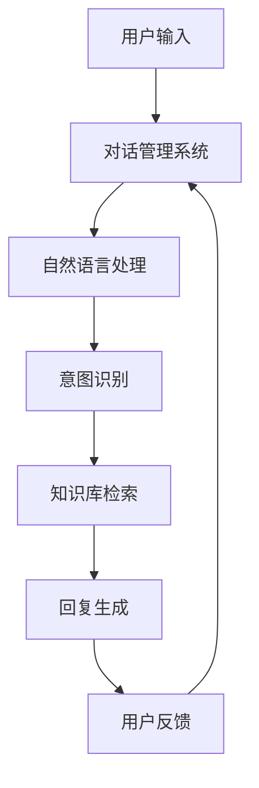

                 


# AI Agent的实时自适应对话管理系统

## 关键词
- AI Agent
- 实时自适应
- 对话管理系统
- 自然语言处理
- 机器学习

## 摘要
本文将深入探讨AI Agent的实时自适应对话管理系统，首先介绍问题背景与定义，随后深入剖析实时自适应对话管理系统技术基础，包括自然语言处理基础。接着，我们将讨论对话管理系统的设计与实现，特别关注实时自适应机制。通过实战案例，我们将展示如何应用实时自适应对话管理系统，并展望其未来的发展方向与趋势。最后，我们将进行总结与展望，提出注意事项和拓展阅读建议。

### 第一部分：AI Agent实时自适应对话管理系统概述

#### 第1章：问题背景与定义

##### 1.1 问题背景

AI Agent，即人工智能代理，是人工智能领域的一个重要概念。它代表着一种可以自主执行任务、与用户进行交互的智能系统。随着人工智能技术的不断发展，AI Agent在各个领域的应用越来越广泛，从智能家居到智能客服，从自动驾驶到智能医疗，AI Agent已经成为提高工作效率、优化用户体验的重要工具。

然而，随着应用的复杂度增加，AI Agent面临的挑战也日益严峻。如何实现与用户的实时、高效、自然的对话，成为AI Agent发展中的一个关键问题。为了解决这一问题，提出了实时自适应对话管理系统的概念。实时自适应对话管理系统旨在通过智能化的对话管理，使AI Agent能够更好地理解用户需求，提供个性化的服务。

##### 1.2 AI Agent的实时自适应对话管理系统的定义

实时自适应对话管理系统是一种集成了自然语言处理、机器学习、对话管理等技术，能够实时响应用户需求，提供个性化服务的智能系统。它主要包括以下几个组成部分：

1. **对话管理模块**：负责处理用户的输入，生成合适的回复，并维持对话的连贯性和流畅性。
2. **自然语言处理模块**：包括语言模型、词向量表示、命名实体识别、情感分析等，用于理解和生成自然语言。
3. **机器学习模块**：用于不断学习和优化对话策略，提高系统的自适应能力。

实时自适应对话管理系统的特点在于其能够根据用户的历史交互行为和当前上下文，动态调整对话策略，使对话更加自然、有效。

##### 1.3 AI Agent的实时自适应对话管理系统的边界与外延

实时自适应对话管理系统在应用中有着广泛的场景，包括但不限于：

- **客户服务**：如智能客服机器人，能够实时解答用户的咨询，提高服务效率。
- **智能助手**：如智能语音助手，能够与用户进行自然对话，完成各种任务。
- **智能家居**：如智能音箱，能够理解用户的需求，控制家居设备。

同时，实时自适应对话管理系统也与多种相关技术紧密相关，如自然语言处理（NLP）、机器学习（ML）、数据挖掘等。

##### 1.4 核心概念与联系

为了更好地理解实时自适应对话管理系统，我们需要了解以下几个核心概念：

- **对话管理**：对话管理的目标是维持对话的连贯性和流畅性，包括理解用户意图、生成合适的回复等。
- **自然语言处理**：自然语言处理（NLP）是AI技术中的重要组成部分，用于理解和生成自然语言。
- **机器学习**：机器学习（ML）是一种通过数据驱动的方式，使计算机系统自动学习和优化性能的技术。

这些概念之间存在着紧密的联系。对话管理依赖于自然语言处理技术，而自然语言处理技术的优化又需要机器学习的支持。通过机器学习，实时自适应对话管理系统能够不断学习和改进，提供更优质的用户体验。

##### 1.5 本章小结

本章介绍了AI Agent的实时自适应对话管理系统的背景、定义及其核心概念。通过分析，我们了解到实时自适应对话管理系统在人工智能领域的重要性，以及它与其他相关技术的紧密联系。接下来，我们将深入探讨实时自适应对话管理系统技术基础，包括自然语言处理基础，为后续章节的讨论奠定基础。

### 第二部分：实时自适应对话管理系统技术基础

#### 第2章：自然语言处理基础

##### 2.1 自然语言处理概述

自然语言处理（NLP）是人工智能领域的一个重要分支，旨在使计算机能够理解、生成和处理人类语言。NLP的基本概念包括语言模型、词向量表示、命名实体识别、情感分析等。

##### 2.2 语言模型

语言模型是一种用于预测文本序列的概率模型。它能够根据已知的文本数据，生成新的文本。语言模型在NLP中有着广泛的应用，如机器翻译、文本生成、语音识别等。

**原理**：语言模型的核心是统计文本数据中的单词和句子出现的概率。通过这些概率分布，语言模型可以预测下一个单词或句子。

**常见语言模型**：

- **n-gram模型**：基于历史n个单词预测下一个单词。
- **神经网络模型**：如循环神经网络（RNN）、长短期记忆网络（LSTM）等。
- **Transformer模型**：基于自注意力机制，广泛应用于文本生成和机器翻译。

##### 2.3 词向量表示

词向量表示是将单词映射到高维向量空间的一种方法。词向量表示能够捕捉单词的语义信息，是NLP中重要的技术。

**概念**：词向量表示将单词映射到高维空间中的向量，这些向量可以表示单词的语义信息。

**模型**：

- **Word2Vec**：基于神经网络的词向量表示方法，能够捕捉单词的语义关系。
- **FastText**：基于词袋模型，通过训练大规模语料库，生成词向量。
- **BERT**：基于转换器（Transformer）模型，通过预训练和微调，生成高质量的词向量。

##### 2.4 命名实体识别

命名实体识别（NER）是一种NLP技术，用于识别文本中的命名实体，如人名、地名、组织名等。

**原理**：NER通常采用基于规则的方法和基于统计的方法。基于规则的方法通过预设的规则识别命名实体，而基于统计的方法通过训练大量标注数据，学习命名实体的特征。

**模型**：

- **条件随机场（CRF）**：用于NER，能够同时考虑序列中的所有单词，提供更准确的命名实体识别。
- **BiLSTM-CRF**：结合长短时记忆网络（LSTM）和条件随机场（CRF），用于提高NER的准确率。

##### 2.5 情感分析

情感分析是一种NLP技术，用于判断文本的情感倾向，如正面、负面或中性。

**原理**：情感分析通常采用基于机器学习的方法，通过训练大量带有情感标签的文本数据，学习情感特征。

**方法**：

- **基于规则的方法**：通过预设的规则，判断文本的情感。
- **基于统计的方法**：通过计算文本中的情感词汇权重，判断文本的情感。
- **深度学习方法**：如卷积神经网络（CNN）、循环神经网络（RNN）等，用于提高情感分析的准确率。

##### 2.6 问答系统

问答系统是一种NLP应用，用于回答用户提出的问题。

**基本概念**：问答系统通常包括问题理解、答案生成和答案评估三个部分。

**关键技术**：

- **问题理解**：理解用户的问题，提取关键信息。
- **答案生成**：根据问题理解的结果，从知识库中检索答案。
- **答案评估**：评估生成的答案是否准确和完整。

**模型**：

- **基于规则的问答系统**：通过预设的规则，匹配问题和答案。
- **基于统计的问答系统**：通过统计方法，匹配问题和答案。
- **基于机器学习的问答系统**：通过训练大量问答对，学习问题和答案的匹配关系。

##### 2.7 本章小结

本章介绍了自然语言处理（NLP）的基础知识，包括语言模型、词向量表示、命名实体识别、情感分析、问答系统等。这些技术是构建实时自适应对话管理系统的重要基础，为后续章节的讨论提供了必要的技术背景。

### 第三部分：实时自适应对话管理系统的设计与实现

#### 第3章：对话管理系统的架构设计

##### 3.1 对话管理系统架构概述

对话管理系统的架构设计是构建实时自适应对话管理系统的关键步骤。一个典型的对话管理系统架构包括以下几个主要模块：

1. **用户输入处理模块**：负责接收和处理用户的输入，包括文本、语音等。
2. **对话管理模块**：负责维护对话的状态，控制对话的流程，包括理解用户意图、生成回复等。
3. **自然语言处理模块**：负责对用户的输入进行语义理解，生成回复的文本。
4. **机器学习模块**：负责训练和优化对话模型，提高对话的准确性和个性。
5. **知识库模块**：存储系统所需的知识和信息，为对话管理提供支持。

##### 3.2 交互设计

交互设计是确保用户与AI Agent之间对话流畅、自然的重要环节。以下是交互设计的几个关键点：

1. **用户交互流程**：设计用户与AI Agent之间的交互流程，确保用户能够轻松地与系统进行对话。
2. **交互界面设计**：设计直观、易用的用户界面，提高用户体验。

##### 3.3 对话策略

对话策略是控制对话流程和生成回复的核心。对话策略的设计需要考虑以下几个方面：

1. **意图识别**：识别用户的意图，如查询、请求、投诉等。
2. **上下文理解**：理解用户输入的上下文信息，保持对话的连贯性。
3. **回复生成**：根据用户的意图和上下文信息，生成合适的回复。

##### 3.4 多模态交互

多模态交互是将多种输入和输出方式集成到对话管理系统中，提高交互的自然性和用户体验。多模态交互可以包括文本、语音、图像、手势等。以下是多模态交互设计的关键点：

1. **多模态输入处理**：设计能够处理多种输入方式的模块，如语音识别、图像识别等。
2. **多模态输出生成**：设计能够生成多种输出方式的模块，如文本生成、语音合成等。
3. **多模态交互控制**：设计控制多模态交互流程的模块，确保对话的流畅性和自然性。

##### 3.5 可解释性

可解释性是确保对话管理系统透明和可信的重要方面。一个具有可解释性的对话管理系统，用户可以理解其工作原理和决策过程。以下是设计可解释性对话管理系统的关键点：

1. **决策解释**：设计能够解释系统决策过程的模块，如意图识别、回复生成等。
2. **错误处理**：设计能够解释系统错误和异常情况的模块，提高系统的鲁棒性和用户信任度。

##### 3.6 安全性

安全性是任何对话管理系统设计时必须考虑的方面。以下是一些关键的安全设计点：

1. **数据安全**：确保用户数据的安全，采用加密、访问控制等技术。
2. **隐私保护**：设计隐私保护机制，确保用户隐私不被泄露。
3. **攻击防护**：设计防御恶意攻击的机制，如DDoS攻击、注入攻击等。

##### 3.7 本章小结

本章介绍了实时自适应对话管理系统架构设计的关键模块和设计要点，包括用户输入处理、对话管理、自然语言处理、机器学习、知识库、交互设计、对话策略、多模态交互、可解释性、安全性等。这些设计要点为构建一个高效、智能、安全的实时自适应对话管理系统提供了基础。

### 第四部分：实时自适应对话管理系统的优化与评估

#### 第4章：实时自适应机制

##### 4.1 实时自适应概述

实时自适应机制是确保对话管理系统在动态环境下能够快速调整和优化其行为的关键。实时自适应对话管理系统通过不断学习和调整，提高对话的准确性和个性化程度。

**基本原理**：实时自适应机制基于机器学习技术，通过分析用户的历史交互行为和当前上下文，动态调整对话策略和模型参数，使系统更加智能化和灵活。

**优势**：

- **提高对话准确性**：通过不断学习和优化，系统可以更好地理解用户意图，提供更准确的回复。
- **个性化服务**：根据用户的历史交互行为，系统可以提供更加个性化的服务，提高用户满意度。
- **快速适应环境变化**：系统可以实时响应环境变化，快速调整对话策略，提高系统的鲁棒性。

**挑战**：

- **计算复杂度**：实时自适应对话管理系统需要处理大量的实时数据，计算复杂度较高。
- **数据隐私**：在实时数据处理的背景下，如何保护用户隐私是一个重要问题。
- **模型稳定性**：系统需要保证模型在长时间运行中保持稳定，避免过拟合和欠拟合。

##### 4.2 学习算法

学习算法是实时自适应对话管理系统的重要组成部分，用于不断优化对话策略和模型参数。以下是几种常用的学习算法：

1. **监督学习**：通过大量标注的数据，学习用户意图和对话策略。常用的算法包括决策树、支持向量机（SVM）、神经网络等。
2. **无监督学习**：通过无标注的数据，学习用户的行为模式和偏好。常用的算法包括聚类、关联规则挖掘等。
3. **强化学习**：通过试错学习，不断优化对话策略。常用的算法包括Q-learning、深度强化学习（DRL）等。

**选择与优化**：

- **算法选择**：根据具体的应用场景和数据特点，选择合适的学习算法。例如，在数据充足的情况下，可以选择监督学习算法；在数据稀缺的情况下，可以选择无监督学习算法。
- **算法优化**：通过调整算法参数，优化学习效果。例如，通过调整学习率、隐藏层节点数等，提高模型的性能。

##### 4.3 模型更新策略

模型更新策略是确保实时自适应对话管理系统稳定运行的关键。以下是几种常用的模型更新策略：

1. **增量更新**：通过逐步更新模型参数，减少对系统的影响。这种方法适用于对实时性要求较高的场景。
2. **全量更新**：通过重新训练整个模型，实现模型的全面更新。这种方法适用于模型参数变化较大的情况。
3. **混合更新**：结合增量更新和全量更新，根据实际情况选择合适的更新策略。

**设计要点**：

- **更新频率**：根据系统的负载和性能要求，设计合适的更新频率。过低的更新频率可能导致系统响应速度变慢，过高的更新频率可能增加系统的计算复杂度。
- **更新方式**：根据模型的类型和数据的特点，选择合适的更新方式。例如，对于深度学习模型，可以选择小批量更新；对于规则模型，可以选择增量更新。

##### 4.4 性能评估

性能评估是确保实时自适应对话管理系统有效运行的重要环节。以下是几种常用的性能评估方法：

1. **准确性评估**：通过计算系统回答的正确率，评估系统的准确性。常用的指标包括准确率（Accuracy）、精确率（Precision）、召回率（Recall）等。
2. **响应时间评估**：通过测量系统响应用户请求的时间，评估系统的响应速度。常用的指标包括平均响应时间（Average Response Time）、最大响应时间（Maximum Response Time）等。
3. **用户满意度评估**：通过用户反馈和调查，评估用户对系统服务的满意度。常用的指标包括用户满意度（User Satisfaction）、用户忠诚度（User Loyalty）等。

**评估指标设计**：

- **综合评估**：设计综合考虑准确性、响应时间和用户满意度的综合评估指标，全面评估系统的性能。
- **动态评估**：根据系统的运行情况和用户反馈，动态调整评估指标，确保评估结果的准确性和实时性。

##### 4.5 本章小结

本章介绍了实时自适应对话管理系统的实时自适应机制，包括学习算法、模型更新策略和性能评估方法。通过这些机制，实时自适应对话管理系统可以不断学习和优化，提供更准确、更个性化的服务。接下来，我们将通过实战案例，展示如何应用实时自适应对话管理系统，并进行分析和讨论。

### 第五部分：实战案例与最佳实践

#### 第5章：实战案例一——虚拟客服机器人

##### 5.1 项目背景

随着互联网和电子商务的快速发展，企业对于客户服务的要求越来越高。传统的客服方式已经无法满足用户的需求，虚拟客服机器人作为一种新兴的服务方式，逐渐受到企业的青睐。本项目旨在开发一个基于实时自适应对话管理系统的虚拟客服机器人，为企业提供高效、智能的客户服务。

##### 5.2 系统设计

系统的整体架构设计如图所示：



**系统功能设计**：

1. **用户输入处理**：接收用户通过文本、语音等多种方式输入的问题。
2. **意图识别**：通过对用户输入的文本进行分析，识别用户的意图。
3. **知识库检索**：根据用户的意图，从知识库中检索相关的信息。
4. **回复生成**：根据知识库中的信息，生成合适的回复。
5. **用户反馈**：收集用户的反馈，用于后续的优化和调整。

##### 5.3 系统实现

**开发环境与工具**：

- 语言：Python
- 框架：TensorFlow、Keras
- 自然语言处理库：NLTK、spaCy
- 语音识别库：Google Speech Recognition

**系统核心实现**：

```python
import nltk
from nltk.tokenize import word_tokenize
from nltk.corpus import wordnet

# 用户输入处理
def process_user_input(input_text):
    tokens = word_tokenize(input_text)
    return tokens

# 意图识别
def recognize_intent(tokens):
    # 这里使用简单的词频统计方法进行意图识别
    word_frequencies = {}
    for token in tokens:
        if token in word_frequencies:
            word_frequencies[token] += 1
        else:
            word_frequencies[token] = 1
    most_frequent_words = [word for word, freq in word_frequencies.items() if freq == max(word_frequencies.values())]
    return most_frequent_words

# 知识库检索
def retrieve_info(intent):
    # 这里使用简单的词典方法进行知识库检索
    synsets = wordnet.synsets(intent)
    return synsets

# 回复生成
def generate_response(info):
    # 这里使用简单的模板方法进行回复生成
    response = "关于{0}，您可以了解以下信息：{1}".format(info, info)
    return response

# 用户反馈
def collect_feedback(response):
    # 这里使用简单的问卷调查方法收集用户反馈
    feedback = input("您对这条回复满意吗？（是/否）:")
    return feedback
```

**代码解读与分析**：

以上代码实现了虚拟客服机器人的核心功能，包括用户输入处理、意图识别、知识库检索、回复生成和用户反馈。其中，意图识别部分使用了简单的词频统计方法，知识库检索部分使用了简单的词典方法，回复生成部分使用了简单的模板方法。这些方法虽然简单，但在实际应用中具有一定的效果。

**系统性能优化**：

为了提高系统的性能，可以考虑以下优化措施：

1. **改进意图识别算法**：使用更复杂的机器学习算法，如卷积神经网络（CNN）、循环神经网络（RNN）等，提高意图识别的准确性。
2. **扩展知识库**：增加知识库的容量，提供更丰富的信息，提高回复的个性化和准确性。
3. **优化回复生成算法**：使用更复杂的自然语言生成算法，如生成对抗网络（GAN）、自动编码器（AE）等，提高回复的自然性和多样性。

##### 5.4 实际案例分析

在实际应用中，虚拟客服机器人可以应用于多种场景，如电商客服、金融客服、医疗客服等。以下是一个具体的案例分析：

**场景**：用户在电商平台上购买了一台洗衣机，但在使用过程中遇到故障，需要寻求帮助。

**用户输入**：用户通过文本输入：“洗衣机在使用过程中出现漏水，怎么办？”

**系统处理流程**：

1. **用户输入处理**：将用户输入的文本进行处理，得到关键词：“洗衣机”、“漏水”。
2. **意图识别**：通过词频统计方法，识别用户的意图为“咨询维修问题”。
3. **知识库检索**：从知识库中检索关于洗衣机漏水的相关信息，得到以下信息：“洗衣机漏水可能是由于排水管道堵塞或内部零件损坏引起的。”。
4. **回复生成**：根据知识库中的信息，生成回复：“洗衣机漏水可能是由于排水管道堵塞或内部零件损坏引起的，您可以选择以下方式进行解决：1. 清洗排水管道；2. 联系售后服务进行维修。”。
5. **用户反馈**：用户对回复表示满意，反馈为“是”。

**案例分析与讲解**：

通过以上案例，我们可以看到虚拟客服机器人在实际应用中的效果。系统能够快速识别用户意图，提供针对性的解决方案，提高用户满意度。然而，系统的性能仍有待优化，如意图识别和回复生成的准确性需要进一步提高。

##### 5.5 项目小结

本项目通过开发一个基于实时自适应对话管理系统的虚拟客服机器人，展示了如何将自然语言处理、机器学习和对话管理系统应用于实际场景。通过不断的优化和改进，虚拟客服机器人可以为企业提供高效、智能的客户服务，提高用户体验。

### 第六部分：未来展望与趋势

#### 第6章：未来发展方向与趋势

随着人工智能技术的不断进步，实时自适应对话管理系统在未来的发展具有广阔的前景。以下是几个可能的发展方向和趋势：

##### 6.1 未来发展方向

1. **智能化水平提升**：实时自适应对话管理系统将继续向着更智能化、更人性化的方向发展。通过深度学习和强化学习等技术，系统将能够更好地理解用户意图，提供更加个性化的服务。
2. **跨模态交互**：未来的实时自适应对话管理系统将支持跨模态交互，如文本、语音、图像、视频等，为用户提供更加丰富的交互体验。
3. **多语言支持**：随着全球化的发展，实时自适应对话管理系统将需要支持多种语言，为国际用户提供服务。
4. **知识图谱的应用**：知识图谱作为一种结构化的知识表示方法，将广泛应用于实时自适应对话管理系统，提供更精准、更丰富的知识支持。

##### 6.2 技术趋势

1. **深度学习的发展**：深度学习技术在图像识别、语音识别、自然语言处理等领域取得了显著的成果，未来将继续推动实时自适应对话管理系统的发展。
2. **生成对抗网络（GAN）的应用**：生成对抗网络（GAN）在生成自然语言文本、图像等方面具有巨大潜力，未来可能成为实时自适应对话管理系统中的重要技术。
3. **强化学习的发展**：强化学习技术将在实时自适应对话管理系统中得到更广泛的应用，通过不断试错和优化，提高系统的自适应能力和决策能力。
4. **可解释性和透明度提升**：随着用户对隐私和数据安全的关注增加，实时自适应对话管理系统的可解释性和透明度将成为重要的发展方向。

##### 6.3 应用领域扩展

实时自适应对话管理系统将在更多领域得到应用：

1. **金融领域**：在金融领域，实时自适应对话管理系统可以用于客户服务、风险控制、投资建议等，提高金融机构的服务质量和效率。
2. **医疗领域**：在医疗领域，实时自适应对话管理系统可以用于患者咨询、健康管理、病情诊断等，提供个性化、智能化的医疗服务。
3. **教育领域**：在教育领域，实时自适应对话管理系统可以用于智能辅导、个性化教学、学习评价等，帮助学生更好地学习。
4. **智能家居领域**：在智能家居领域，实时自适应对话管理系统可以用于智能家电控制、家居安全监控、生活服务推荐等，提高生活质量和便利性。

##### 6.4 本章小结

实时自适应对话管理系统在未来的发展中具有广阔的前景，技术趋势和应用领域的扩展将为其带来新的机遇。通过不断的技术创新和应用推广，实时自适应对话管理系统将为人们的生活和工作带来更多便利和效益。

### 第七部分：总结与展望

#### 第7章：总结与展望

通过本文的讨论，我们深入了解了AI Agent的实时自适应对话管理系统的背景、定义、技术基础、架构设计、优化与评估以及实战案例。以下是全文的总结与展望：

##### 7.1 全书总结

本文从多个角度对实时自适应对话管理系统进行了详细剖析，涵盖了以下核心内容：

- **问题背景与定义**：介绍了AI Agent和实时自适应对话管理系统的背景和定义，阐述了系统的组成部分和功能特点。
- **技术基础**：探讨了自然语言处理、机器学习等基础技术，为实时自适应对话管理系统提供了技术支持。
- **设计与实现**：介绍了实时自适应对话管理系统的架构设计、交互设计、对话策略等关键设计要点。
- **优化与评估**：探讨了实时自适应机制、学习算法、模型更新策略和性能评估方法，确保系统的稳定运行和优化。
- **实战案例**：通过虚拟客服机器人的案例，展示了如何将实时自适应对话管理系统应用于实际场景，并进行性能优化和案例分析。
- **未来展望**：分析了实时自适应对话管理系统的未来发展方向和趋势，探讨了其在不同领域的应用前景。

##### 7.2 展望未来

实时自适应对话管理系统在未来的发展中将面临新的机遇和挑战。以下是几个展望：

- **智能化水平提升**：通过深度学习、生成对抗网络（GAN）等技术的应用，实时自适应对话管理系统的智能化水平将得到显著提升。
- **跨模态交互**：实时自适应对话管理系统将支持多种模态的交互，为用户提供更加丰富和自然的交互体验。
- **多语言支持**：随着全球化的发展，实时自适应对话管理系统将支持多种语言，为国际用户提供服务。
- **知识图谱的应用**：知识图谱作为一种结构化的知识表示方法，将在实时自适应对话管理系统中发挥重要作用，提供更精准的知识支持。
- **应用领域扩展**：实时自适应对话管理系统将在金融、医疗、教育、智能家居等领域得到广泛应用，为人们的生活和工作带来更多便利和效益。

##### 7.3 注意事项

在使用实时自适应对话管理系统时，需要注意以下几点：

- **数据隐私**：确保用户数据的安全和隐私，采取有效的数据保护措施。
- **系统稳定性**：定期进行系统性能优化和更新，确保系统的稳定运行。
- **用户反馈**：及时收集和分析用户反馈，不断优化系统的用户体验。

##### 7.4 拓展阅读

为了深入了解实时自适应对话管理系统，以下推荐几本拓展阅读的资料：

- 《深度学习》（Goodfellow, Y., Bengio, Y., & Courville, A.）——详细介绍了深度学习的基础理论和应用。
- 《自然语言处理综论》（Jurafsky, D., & Martin, J. H.）——全面介绍了自然语言处理的基础知识和技术。
- 《强化学习》（Sutton, R. S., & Barto, A. G.）——深入探讨了强化学习的基本原理和应用。
- 《对话系统设计、实施与评价》（Chatbot Design, Implementation, and Evaluation）——提供了对话系统设计和评估的实用指南。

通过阅读这些资料，可以进一步深入了解实时自适应对话管理系统的相关技术和发展趋势。作者：AI天才研究院/AI Genius Institute & 禅与计算机程序设计艺术 /Zen And The Art of Computer Programming。

