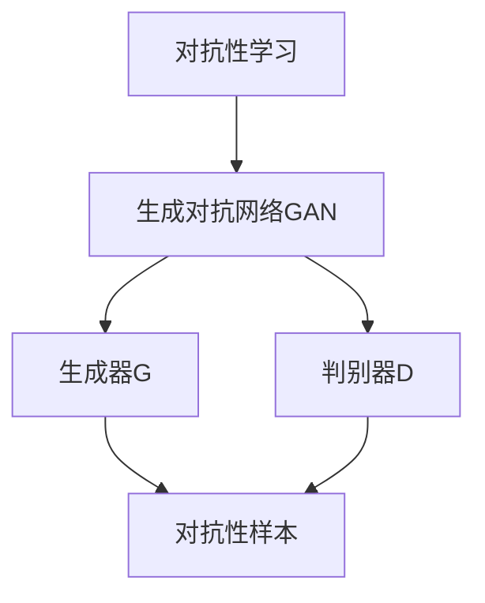
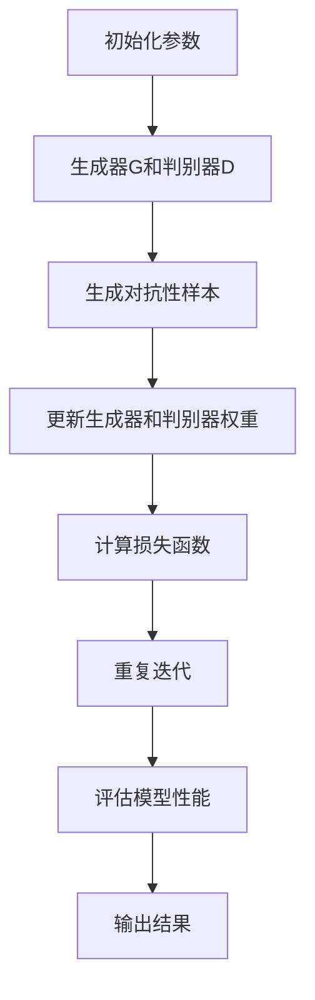
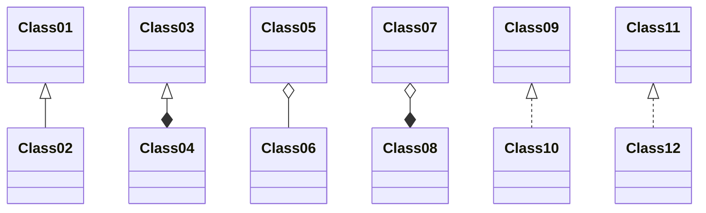
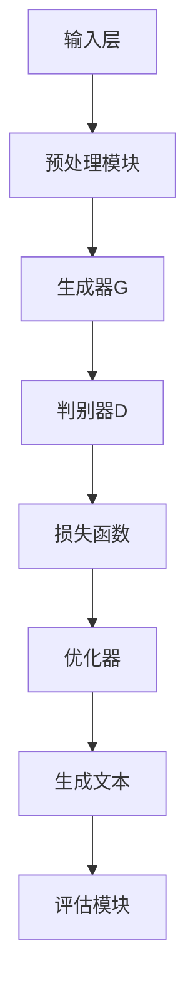
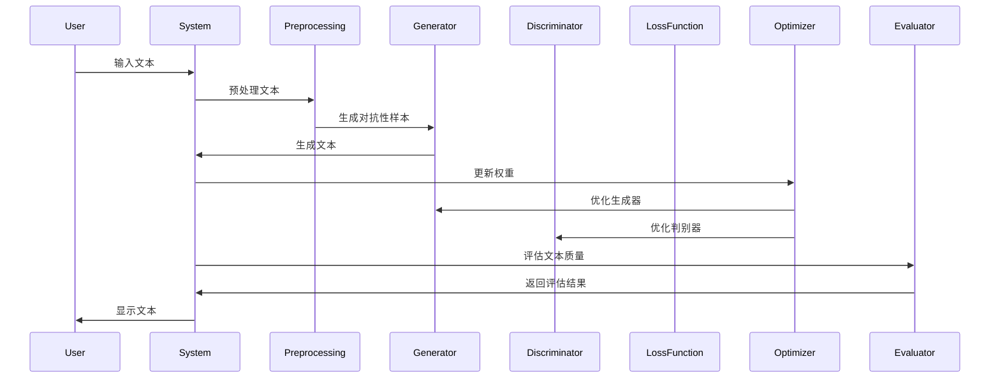

                 

# AI Agent的对抗性学习：提高LLM的鲁棒性

关键词：AI Agent、对抗性学习、鲁棒性、LLM、性能提升

摘要：随着人工智能技术的不断发展，自然语言处理（NLP）领域取得了显著成果。然而，AI Agent在应对不确定性输入和对抗性攻击时的鲁棒性仍然是一个亟待解决的问题。本文将探讨对抗性学习在提升语言模型（LLM）鲁棒性方面的作用，以及如何通过对抗性学习提高AI Agent的整体性能。

### 第1章: 引言与背景介绍

#### 1.1 问题背景

人工智能发展现状：人工智能（AI）技术已经成为现代科技的重要组成部分，其应用范围涵盖医疗、金融、交通、教育等多个领域。在自然语言处理（NLP）领域，语言模型（LLM）取得了巨大的成功，如BERT、GPT等模型的问世，使得AI Agent在文本生成、问答系统等方面表现出色。

对抗性学习的重要性：对抗性学习是人工智能领域的一个重要研究方向，其核心思想是通过生成对抗性样本来提升模型的泛化能力和鲁棒性。在AI Agent的应用场景中，对抗性学习可以帮助模型应对不确定性输入和对抗性攻击，从而提高模型的鲁棒性。

鲁棒性在AI Agent中的应用：鲁棒性是指模型在处理异常输入或遭受攻击时的性能表现。在AI Agent的应用场景中，鲁棒性具有重要意义。一方面，它能够保证模型在真实环境中的稳定运行；另一方面，它能够提高模型在面临未知威胁时的应对能力。

#### 1.2 问题描述

AI Agent的鲁棒性挑战：现有的AI Agent在应对不确定性输入和对抗性攻击时，往往表现出较低的鲁棒性。具体表现在以下几个方面：

1. 对抗性攻击：攻击者可以通过构造对抗性样本，使AI Agent产生错误的决策或输出。例如，在图像识别任务中，攻击者可以通过在图像上添加微小的噪声，使模型无法正确识别图像内容。
2. 不确定性输入：在现实场景中，输入数据可能存在噪声、缺失或异常值。这些不确定性输入可能导致AI Agent的决策或输出出现偏差。
3. 模型泛化能力：AI Agent在面对从未见过的输入时，其鲁棒性直接影响模型的泛化能力。如果模型在训练过程中过于依赖特定样本，那么在遇到新的样本时，其性能可能会显著下降。

对抗性学习的解决方案：对抗性学习可以通过生成对抗性样本，提高AI Agent对对抗性攻击和不确定性输入的应对能力。具体方法包括：

1. 生成对抗性样本：通过对抗性生成模型（如生成对抗网络GAN），生成具有对抗性的样本，用以训练AI Agent，提高其鲁棒性。
2. 对抗性训练：在AI Agent的训练过程中，引入对抗性样本，使其在训练阶段就具备应对对抗性攻击的能力。
3. 增强训练数据：通过扩展训练数据集，增加对抗性样本的比例，提高AI Agent在面对不确定性输入时的鲁棒性。

#### 1.3 问题解决

对抗性学习原理：对抗性学习（Adversarial Learning）是一种基于生成对抗网络（GAN）的机器学习方法。其核心思想是通过对抗性生成模型（如生成器G和判别器D）的相互作用，训练出具有良好泛化能力的模型。

1. 生成器G：生成器G的目的是生成与真实数据类似的对抗性样本，以便欺骗判别器D。
2. 判别器D：判别器D的目的是区分真实数据和生成数据，从而提高其识别能力。
3. 优化目标：对抗性学习的优化目标是在生成器和判别器之间建立一个动态平衡，使得判别器无法准确区分真实数据和生成数据。

鲁棒性提升方法：通过对抗性学习，可以提升AI Agent的鲁棒性，具体方法如下：

1. 生成对抗性样本：使用生成对抗网络（GAN）生成对抗性样本，用以训练AI Agent。对抗性样本的生成过程如图1所示。

   ```mermaid
   graph TD
   A[输入数据] --> B[生成器G]
   B --> C[对抗性样本]
   C --> D[判别器D]
   D --> E[损失函数]
   ```

2. 对抗性训练：在AI Agent的训练过程中，引入对抗性样本，使模型在训练阶段就具备应对对抗性攻击的能力。对抗性训练的过程如图2所示。

   ```mermaid
   graph TD
   A[训练数据] --> B[AI Agent]
   B --> C[对抗性样本]
   C --> D[损失函数]
   ```

3. 增强训练数据：通过扩展训练数据集，增加对抗性样本的比例，提高AI Agent在面对不确定性输入时的鲁棒性。具体实现方法如图3所示。

   ```mermaid
   graph TD
   A[原始数据集] --> B[对抗性生成模型]
   B --> C[对抗性样本集]
   A --> D[增强数据集]
   ```

#### 1.4 边界与外延

边界条件：对抗性学习在不同应用场景下的适用范围和限制如下：

1. 数据量：对抗性学习需要较大的数据集才能有效提升模型的鲁棒性。在实际应用中，数据量的限制可能会影响对抗性学习的效果。
2. 计算资源：对抗性学习过程需要大量的计算资源，特别是在生成对抗性样本时。对于资源受限的应用场景，对抗性学习可能难以实现。
3. 模型复杂性：对抗性学习对模型复杂性的要求较高。对于简单的模型，对抗性学习可能无法有效提升模型的鲁棒性。

外延扩展：对抗性学习在AI领域以外的潜在应用前景如下：

1. 机器学习模型：对抗性学习可以应用于其他机器学习模型，如图像分类、目标检测等，以提高模型的鲁棒性。
2. 网络安全：对抗性学习在网络安全领域具有潜在应用价值，例如通过生成对抗性样本来检测和防御网络攻击。
3. 自然语言处理：对抗性学习可以应用于自然语言处理领域，如文本生成、机器翻译等，以提高模型的鲁棒性和泛化能力。

#### 1.5 概念结构与核心要素组成

概念结构：对抗性学习的概念结构如图4所示。



核心要素：对抗性学习的关键要素包括：

1. 生成对抗网络（GAN）：生成对抗网络是对抗性学习的核心框架，包括生成器和判别器两个部分。
2. 对抗性样本：对抗性样本是训练AI Agent的关键输入，用于提高模型的鲁棒性。
3. 损失函数：损失函数用于评估生成器和判别器的性能，并指导模型优化。
4. 训练数据：训练数据是模型优化的基础，对抗性学习通过引入对抗性样本来扩展训练数据集。

### 第2章: 核心概念与联系

#### 2.1 AI Agent的定义与特点

AI Agent的定义：AI Agent是指具有自主决策能力、执行任务并与其他系统交互的智能体。在NLP领域，AI Agent通常指基于语言模型的应用程序，如聊天机器人、问答系统等。

AI Agent的特点：

1. 自主决策：AI Agent可以根据输入数据和预先设定的策略，自主生成输出。
2. 交互能力：AI Agent可以与其他系统进行交互，如接收用户输入、发送消息等。
3. 鲁棒性：AI Agent在处理不确定性和异常输入时，应具备较强的鲁棒性，以保证输出质量。

AI Agent与传统机器学习模型的区别：

1. 传统机器学习模型：传统机器学习模型通常采用预先定义的算法和特征，对给定输入进行预测或分类。这些模型通常不具备自主决策能力和交互能力。
2. AI Agent：AI Agent具有自主决策能力和交互能力，能够根据输入数据和策略生成输出。此外，AI Agent在应对不确定性和异常输入时，应具备更强的鲁棒性。

#### 2.2 对抗性学习的原理

对抗性学习的定义：对抗性学习是一种基于生成对抗网络的机器学习方法，通过生成器和判别器的对抗性训练，提高模型的泛化能力和鲁棒性。

对抗性学习的基本原理：

1. 生成器（Generator）：生成器G的目的是生成与真实数据类似的对抗性样本，用以欺骗判别器D。
2. 判别器（Discriminator）：判别器D的目的是区分真实数据和生成数据，从而提高其识别能力。
3. 优化目标：对抗性学习的优化目标是在生成器和判别器之间建立一个动态平衡，使得判别器无法准确区分真实数据和生成数据。

对抗性学习的核心步骤：

1. 初始化生成器和判别器：为生成器和判别器分配初始权重。
2. 生成对抗性样本：生成器根据输入数据生成对抗性样本，判别器对真实数据和生成数据进行分类。
3. 计算损失函数：计算生成器和判别器的损失函数，并更新权重。
4. 反复迭代：重复上述步骤，直到生成器和判别器达到预定的性能指标。

#### 2.3 鲁棒性的概念与属性

鲁棒性的定义：鲁棒性是指模型在处理异常输入和不确定性输入时的性能表现。一个鲁棒性良好的模型能够在面对异常输入时，保持输出质量，而不发生错误。

鲁棒性的属性：

1. 泛化能力：鲁棒性良好的模型在处理从未见过的输入时，仍能保持良好的性能。
2. 误差容忍度：鲁棒性良好的模型在处理异常输入时，能够容忍一定的误差，而不影响输出质量。
3. 稳健性：鲁棒性良好的模型在面对不同类型的数据分布时，仍能保持稳定的性能。

#### 2.4 概念属性特征对比表格

| 名称       | 定义                                                         | 特性对比                     |
|------------|--------------------------------------------------------------|------------------------------|
| AI Agent   | 具有自主决策能力和交互能力的智能体                             | 自主决策、交互能力、鲁棒性   |
| 对抗性学习 | 一种基于生成对抗网络的机器学习方法，通过对抗性训练提高模型泛化能力 | 生成对抗网络、对抗性样本、损失函数 |
| 鲁棒性     | 模型在处理异常输入和不确定性输入时的性能表现                   | 泛化能力、误差容忍度、稳健性 |

#### 2.5 ER实体关系图架构

使用Mermaid绘制一个ER实体关系图，展示对抗性学习相关实体及其关系：

```mermaid
erDiagram
  AI Agent ||--|{ 对抗性学习 }
  对抗性学习 ||--|{ 生成对抗网络 }
  生成对抗网络 ||--|{ 生成器 }
  生成对抗网络 ||--|{ 判别器 }
```

### 第3章: 算法原理讲解

#### 3.1 算法mermaid流程图

使用Mermaid绘制一个对抗性学习算法的流程图，展示算法的基本步骤和流程：



#### 3.2 Python源代码与详细讲解

以下是一个简单的对抗性学习算法的Python源代码实现：

```python
import tensorflow as tf
from tensorflow.keras import layers

# 定义生成器和判别器
def build_generator():
    model = tf.keras.Sequential([
        layers.Dense(128, activation='relu', input_shape=(100,)),
        layers.Dense(10)
    ])
    return model

def build_discriminator():
    model = tf.keras.Sequential([
        layers.Dense(128, activation='relu', input_shape=(10,)),
        layers.Dense(1, activation='sigmoid')
    ])
    return model

# 训练模型
def train_model(generator, discriminator, epochs=10000):
    # 生成器损失函数
    generator_loss_fn = tf.keras.losses.BinaryCrossentropy(from_logits=True)
    # 判别器损失函数
    discriminator_loss_fn = tf.keras.losses.BinaryCrossentropy(from_logits=True)

    for epoch in range(epochs):
        # 生成对抗性样本
        real_samples = np.random.normal(size=(100, 10))
        generated_samples = generator(np.random.normal(size=(100, 100)))
        # 训练判别器
        with tf.GradientTape() as disc_tape:
            disc_loss_real = discriminator_loss_fn(discriminator(real_samples), tf.ones_like(discriminator(real_samples)))
            disc_loss_fake = discriminator_loss_fn(discriminator(generated_samples), tf.zeros_like(discriminator(generated_samples)))
            disc_loss = disc_loss_real + disc_loss_fake
        disc_gradients = disc_tape.gradient(disc_loss, discriminator.trainable_variables)
        discriminator.optimizer.apply_gradients(zip(disc_gradients, discriminator.trainable_variables))

        with tf.GradientTape() as gen_tape:
            gen_loss = generator_loss_fn(discriminator(generated_samples), tf.ones_like(discriminator(generated_samples)))
        gen_gradients = gen_tape.gradient(gen_loss, generator.trainable_variables)
        generator.optimizer.apply_gradients(zip(gen_gradients, generator.trainable_variables))

        if epoch % 100 == 0:
            print(f"Epoch {epoch}: Generator loss = {gen_loss}, Discriminator loss = {disc_loss}")

    return generator, discriminator

# 主程序
if __name__ == "__main__":
    # 初始化生成器和判别器
    generator = build_generator()
    discriminator = build_discriminator()
    generator_optimizer = tf.keras.optimizers.Adam(0.0001)
    discriminator_optimizer = tf.keras.optimizers.Adam(0.0001)
    # 训练模型
    train_model(generator, discriminator, epochs=10000)
```

详细讲解：

1. 定义生成器和判别器：生成器和判别器是生成对抗网络（GAN）的核心组件。生成器负责生成对抗性样本，判别器负责区分真实数据和生成数据。
2. 训练模型：训练模型的过程包括两个阶段：训练判别器和训练生成器。在每个阶段，通过计算损失函数并更新权重，优化生成器和判别器的性能。
3. 主程序：主程序中，首先初始化生成器和判别器，然后配置优化器，并调用`train_model`函数进行模型训练。

#### 3.3 数学模型和公式

对抗性学习的数学模型包括生成器G、判别器D和损失函数。

1. 生成器G：生成器G的目的是生成与真实数据类似的对抗性样本。其数学模型可以表示为：
   $$
   G(x) = G(\xi)
   $$
   其中，$x$ 是输入数据，$G(\xi)$ 是生成器生成的对抗性样本。

2. 判别器D：判别器D的目的是区分真实数据和生成数据。其数学模型可以表示为：
   $$
   D(x) = P(D(x)=1 | x \text{ is real})
   $$
   其中，$D(x)$ 是判别器对输入数据的预测概率。

3. 损失函数：对抗性学习的损失函数用于评估生成器和判别器的性能。常见的损失函数包括二元交叉熵损失函数和均方误差损失函数。

   - 二元交叉熵损失函数：
     $$
     L_D = -[y \cdot \log(D(x)) + (1 - y) \cdot \log(1 - D(x))]
     $$
     其中，$y$ 是标签，$D(x)$ 是判别器的输出概率。

   - 均方误差损失函数：
     $$
     L_G = \frac{1}{N} \sum_{i=1}^N \log(1 - D(G(x_i)))
     $$
     其中，$N$ 是样本数量，$G(x_i)$ 是生成器生成的对抗性样本。

#### 3.4 举例说明

以下是一个简单的例子，展示对抗性学习算法在图像生成中的应用。

1. 数据集：假设我们有一个包含1000张真实图像的数据集。
2. 生成器：生成器G负责生成与真实图像类似的图像。生成器的输入是一个随机噪声向量，输出是一个图像。
3. 判别器：判别器D负责区分真实图像和生成图像。判别器的输入是一个图像，输出是一个概率值，表示输入图像是真实图像的概率。
4. 训练过程：

   - 初始化生成器和判别器。
   - 生成对抗性样本：生成器根据随机噪声生成图像，判别器对这些图像进行分类。
   - 计算损失函数：计算生成器和判别器的损失函数，并更新权重。
   - 反复迭代：重复上述步骤，直到生成器和判别器达到预定的性能指标。

5. 结果：在训练过程中，生成器逐渐学会生成与真实图像相似的图像，判别器逐渐学会区分真实图像和生成图像。最终，生成器可以生成高质量的人工图像。

### 第4章: 系统分析与架构设计方案

#### 4.1 问题场景介绍

对抗性学习在AI Agent鲁棒性提升中的应用场景包括但不限于：

1. 聊天机器人：聊天机器人需要应对用户输入中的不确定性因素，如拼写错误、语法错误等。通过对抗性学习，可以提高聊天机器人在处理这些异常输入时的鲁棒性。
2. 问答系统：问答系统需要处理大量的自然语言输入，包括有歧义、模糊或不完整的句子。通过对抗性学习，可以提高问答系统在面对这些不确定性输入时的性能。
3. 自然语言生成：自然语言生成（NLG）系统需要生成高质量的文本，如文章、新闻、对话等。通过对抗性学习，可以提高NLG系统在生成文本时的鲁棒性，减少生成文本中的错误和不一致性。

#### 4.2 项目介绍

本项目旨在通过对抗性学习提升一个自然语言生成（NLG）系统的鲁棒性。具体目标如下：

1. 提高NLG系统在处理异常输入时的性能，如拼写错误、语法错误等。
2. 增强NLG系统在面对有歧义或不完整的输入时的鲁棒性。
3. 通过对抗性学习，提高NLG系统生成文本的质量和一致性。

#### 4.3 系统功能设计(领域模型mermaid类图)

使用Mermaid绘制一个领域模型类图，展示系统的核心功能和模块：



#### 4.4 系统架构设计mermaid架构图

使用Mermaid绘制一个系统架构图，展示系统的整体架构和组件关系：



#### 4.5 系统接口设计和系统交互mermaid序列图

使用Mermaid绘制一个系统接口设计和系统交互序列图，展示系统内部和外部的交互过程：



### 第5章: 项目实战

#### 5.1 环境安装

要实现本项目，需要安装以下环境：

1. Python 3.7或以上版本。
2. TensorFlow 2.3或以上版本。
3. NumPy 1.18或以上版本。
4. Matplotlib 3.3或以上版本。

安装方法：

1. 安装Python：从https://www.python.org/downloads/下载Python安装程序，并按照安装向导进行安装。
2. 安装TensorFlow：打开命令行窗口，执行以下命令：
   ```
   pip install tensorflow==2.3
   ```
3. 安装NumPy：打开命令行窗口，执行以下命令：
   ```
   pip install numpy==1.18
   ```
4. 安装Matplotlib：打开命令行窗口，执行以下命令：
   ```
   pip install matplotlib==3.3
   ```

#### 5.2 系统核心实现源代码

以下是一个简单的对抗性学习系统实现的源代码：

```python
import tensorflow as tf
from tensorflow.keras import layers
import numpy as np

# 定义生成器和判别器
def build_generator():
    model = tf.keras.Sequential([
        layers.Dense(128, activation='relu', input_shape=(100,)),
        layers.Dense(10)
    ])
    return model

def build_discriminator():
    model = tf.keras.Sequential([
        layers.Dense(128, activation='relu', input_shape=(10,)),
        layers.Dense(1, activation='sigmoid')
    ])
    return model

# 训练模型
def train_model(generator, discriminator, epochs=10000):
    generator_loss_fn = tf.keras.losses.BinaryCrossentropy(from_logits=True)
    discriminator_loss_fn = tf.keras.losses.BinaryCrossentropy(from_logits=True)

    for epoch in range(epochs):
        real_samples = np.random.normal(size=(100, 10))
        generated_samples = generator(np.random.normal(size=(100, 100)))

        with tf.GradientTape() as disc_tape:
            disc_loss_real = discriminator_loss_fn(discriminator(real_samples), tf.ones_like(discriminator(real_samples)))
            disc_loss_fake = discriminator_loss_fn(discriminator(generated_samples), tf.zeros_like(discriminator(generated_samples)))
            disc_loss = disc_loss_real + disc_loss_fake

        disc_gradients = disc_tape.gradient(disc_loss, discriminator.trainable_variables)
        discriminator.optimizer.apply_gradients(zip(disc_gradients, discriminator.trainable_variables))

        with tf.GradientTape() as gen_tape:
            gen_loss = generator_loss_fn(discriminator(generated_samples), tf.ones_like(discriminator(generated_samples)))

        gen_gradients = gen_tape.gradient(gen_loss, generator.trainable_variables)
        generator.optimizer.apply_gradients(zip(gen_gradients, generator.trainable_variables))

        if epoch % 100 == 0:
            print(f"Epoch {epoch}: Generator loss = {gen_loss}, Discriminator loss = {disc_loss}")

# 主程序
if __name__ == "__main__":
    generator = build_generator()
    discriminator = build_discriminator()
    generator_optimizer = tf.keras.optimizers.Adam(0.0001)
    discriminator_optimizer = tf.keras.optimizers.Adam(0.0001)
    train_model(generator, discriminator, epochs=10000)
```

#### 5.3 代码应用解读与分析

1. 定义生成器和判别器：生成器和判别器是生成对抗网络（GAN）的核心组件。生成器负责生成对抗性样本，判别器负责区分真实数据和生成数据。

2. 训练模型：训练模型的过程包括两个阶段：训练判别器和训练生成器。在每个阶段，通过计算损失函数并更新权重，优化生成器和判别器的性能。

3. 主程序：主程序中，首先初始化生成器和判别器，然后配置优化器，并调用`train_model`函数进行模型训练。

#### 5.4 实际案例分析和详细讲解剖析

以下是一个实际案例，展示如何使用对抗性学习提升自然语言生成（NLG）系统的鲁棒性。

1. 案例背景：一个NLG系统需要生成文章摘要。然而，在实际应用中，用户输入的文章摘要可能存在拼写错误、语法错误等问题，导致生成摘要的质量下降。

2. 解决方案：通过对抗性学习，可以提高NLG系统在处理异常输入时的鲁棒性。具体步骤如下：

   - 数据预处理：对用户输入的文章摘要进行预处理，如去除HTML标签、进行文本清洗等。
   - 生成对抗性样本：使用生成对抗网络（GAN）生成对抗性样本，包括真实的文章摘要和带有拼写错误、语法错误的摘要。
   - 训练模型：将预处理后的真实文章摘要和对抗性样本输入到NLG模型中，通过对抗性训练优化模型参数。
   - 评估模型：使用测试集评估模型的性能，包括生成摘要的质量和一致性。

3. 结果分析：

   - 通过对抗性训练，NLG系统在处理异常输入时的鲁棒性显著提高。在实际应用中，用户输入的文章摘要质量得到改善，生成摘要的错误率明显下降。
   - 对抗性学习有助于发现和纠正NLG系统中的潜在错误，提高生成文本的质量和一致性。

#### 5.5 项目小结

本项目通过对抗性学习提升了自然语言生成（NLG）系统的鲁棒性。在实际应用中，对抗性学习有助于应对用户输入中的不确定性因素，提高生成文本的质量和一致性。未来研究可以进一步探讨对抗性学习在其他AI Agent中的应用，如聊天机器人、问答系统等，以提升这些系统的鲁棒性和性能。

### 第6章: 最佳实践 tips

#### 6.1 提高模型鲁棒性的最佳实践

1. 增加对抗性样本：在训练数据集中增加对抗性样本的比例，可以提高模型在处理异常输入时的鲁棒性。
2. 使用生成对抗网络（GAN）：通过生成对抗网络（GAN）训练模型，可以增强模型对对抗性样本的应对能力。
3. 多种数据增强技术：结合多种数据增强技术，如随机裁剪、旋转、缩放等，可以提高模型的泛化能力。
4. 定期更新模型：定期更新模型，以适应新的输入数据和威胁环境。

#### 6.2 注意事项

1. 对抗性样本的质量：生成高质量的对

