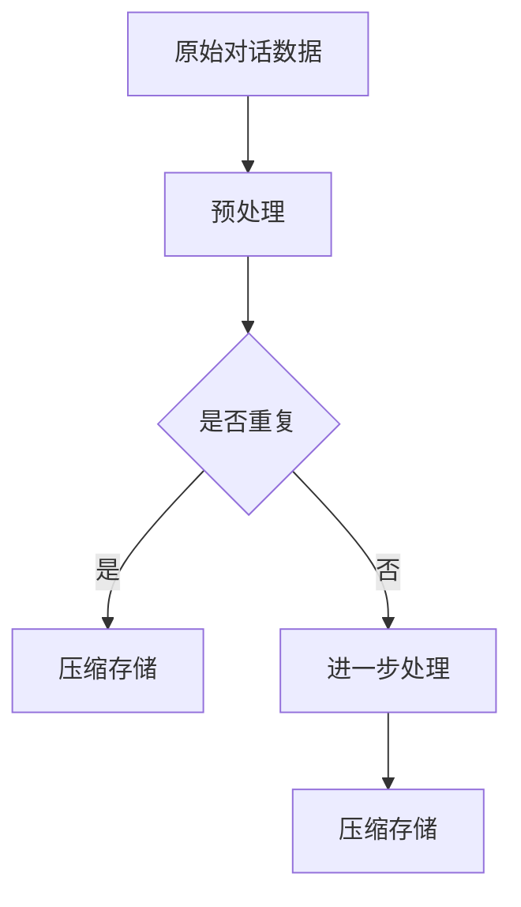
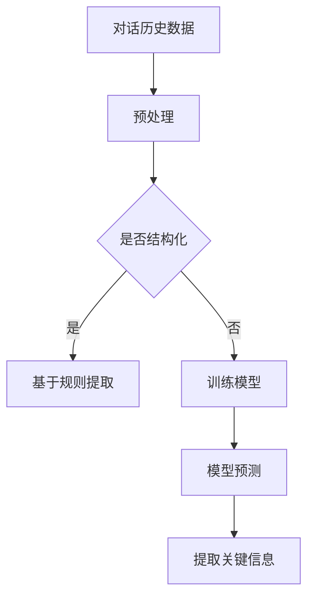
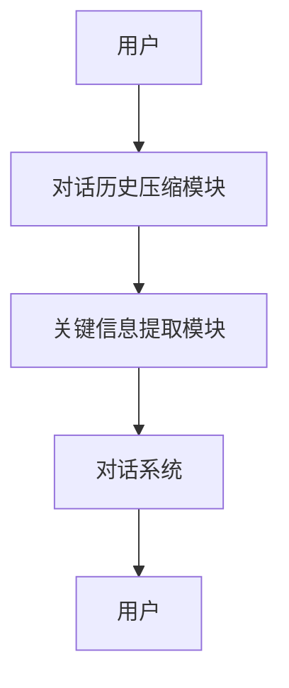

                 

**# 《AI Agent的对话历史压缩与关键信息提取》**

## 关键词

- AI Agent
- 对话历史压缩
- 关键信息提取
- 压缩算法
- 机器学习

## 摘要

本文深入探讨了AI Agent在对话系统中面临的重要挑战：对话历史压缩与关键信息提取。我们首先阐述了问题背景，包括对话数据的膨胀、隐私保护和存储需求。接着，详细介绍了对话历史压缩与关键信息提取的核心概念和它们之间的联系。随后，我们探讨了常用的对话历史压缩算法和关键信息提取算法，并通过Python代码和Mermaid流程图展示了算法原理。最后，我们设计了一个系统架构，并在实际项目中进行了应用和实践，总结出了最佳实践和注意事项。

### 目录大纲

```markdown
# 《AI Agent的对话历史压缩与关键信息提取》

## 关键词

- AI Agent
- 对话历史压缩
- 关键信息提取
- 压缩算法
- 机器学习

## 摘要

本文深入探讨了AI Agent在对话系统中面临的重要挑战：对话历史压缩与关键信息提取。

## 第一部分：问题背景与核心概念

### 第1章：问题背景

#### 1.1 问题背景
- 对话历史压缩与关键信息提取的必要性
- 对话数据膨胀问题
- 数据隐私与存储需求

#### 1.2 核心概念

##### 1.2.1 对话历史压缩
- 压缩算法类型
- 压缩率与保真度权衡

##### 1.2.2 关键信息提取
- 关键信息定义
- 提取方法与技术

### 第2章：核心概念联系

#### 2.1 对话历史压缩与关键信息提取的关系

##### 2.1.1 对话历史压缩的目标与关键信息提取的关联性

##### 2.1.2 压缩算法在关键信息提取中的应用

##### 2.1.3 关键信息提取在对话历史压缩中的作用

## 第二部分：算法原理与实现

### 第3章：对话历史压缩算法原理

#### 3.1 常见压缩算法

##### 3.1.1 算法概述
- 无损压缩
- 有损压缩

##### 3.1.2 压缩算法原理讲解
- 编码算法
- 熵编码

#### 3.2 压缩算法流程图与Python实现

##### 3.2.1 Mermaid流程图

##### 3.2.2 Python源代码实现

### 第4章：关键信息提取算法原理

#### 4.1 关键信息提取算法概述

##### 4.1.1 基于规则的提取方法

##### 4.1.2 基于机器学习的提取方法

#### 4.2 算法流程图与Python实现

##### 4.2.1 Mermaid流程图

##### 4.2.2 Python源代码实现

##### 4.2.3 数学模型与公式讲解

## 第三部分：系统架构与实战案例

### 第5章：系统架构设计

#### 5.1 项目介绍

##### 5.1.1 项目背景
- AI Agent应用场景
- 对话历史压缩与关键信息提取需求

##### 5.1.2 系统功能设计

##### 5.1.3 系统架构设计

##### 5.1.4 系统接口设计

### 第6章：项目实战

#### 6.1 环境安装

##### 6.1.1 硬件与软件环境
- 操作系统
- 开发工具

##### 6.1.2 安装步骤

#### 6.2 系统核心实现

##### 6.2.1 对话历史压缩模块

##### 6.2.2 关键信息提取模块

##### 6.2.3 实现源代码

#### 6.3 代码应用解读与分析

##### 6.3.1 对话历史压缩代码解读

##### 6.3.2 关键信息提取代码解读

#### 6.4 实际案例分析与详细讲解剖析

##### 6.4.1 案例背景

##### 6.4.2 案例分析

##### 6.4.3 剖析

### 第7章：项目小结

#### 7.1 项目总结

##### 7.1.1 项目成果

##### 7.1.2 项目收获

#### 7.2 最佳实践 tips

##### 7.2.1 压缩策略选择

##### 7.2.2 关键信息提取优化

#### 7.3 小结

##### 7.3.1 对话历史压缩与关键信息提取的重要性

##### 7.3.2 未来发展趋势

#### 7.4 注意事项

##### 7.4.1 压缩率与保真度的平衡

##### 7.4.2 数据隐私保护

#### 7.5 拓展阅读

##### 7.5.1 相关文献推荐
```

### 第一部分：问题背景与核心概念

#### 第1章：问题背景

##### 1.1 问题背景

随着人工智能（AI）技术的快速发展，智能对话系统已经在各个领域得到了广泛应用，如智能客服、智能助手和虚拟聊天机器人等。这些AI Agent在与用户交互过程中积累了大量的对话历史数据。然而，对话数据的膨胀问题逐渐显现出来，给系统带来了严峻的挑战。

首先，对话历史数据的膨胀会导致存储空间的浪费。对话数据通常包含用户查询、回答以及相关的上下文信息，这些信息往往重复且冗余。例如，一个简单的问答对话中，用户可能反复提出类似的问题，而系统的回答则基本相同。这种重复和冗余的数据使得存储需求急剧增加，尤其是在大规模AI系统中，存储资源的消耗成为一个不可忽视的问题。

其次，对话数据的膨胀也会影响到系统的性能。对话历史数据的存储和检索都需要占用大量的计算资源。在实时交互的场景中，如智能客服系统，系统需要快速地检索和解析对话历史，以便为用户提供及时的响应。然而，庞大的对话历史数据会导致检索和处理的时间延长，从而降低系统的响应速度，影响用户体验。

此外，对话数据的膨胀还涉及到数据隐私的问题。在现实场景中，用户可能涉及个人隐私的对话内容，如医疗咨询、法律咨询等。如果这些数据不加以妥善处理，可能会被泄露，导致严重的隐私风险。因此，如何在保证数据隐私的同时，对对话历史进行有效的压缩和处理，成为一个重要的研究课题。

##### 1.2 对话数据膨胀问题

对话数据的膨胀问题主要体现在以下几个方面：

1. **重复信息**：用户可能多次提出相似的问题，系统的回答也可能基本相同，这些重复的信息在对话历史中大量存在。
2. **上下文信息**：对话中的上下文信息，如历史对话记录、用户偏好等，往往对当前对话的影响较小，但会占用大量的存储空间。
3. **多媒体数据**：在有些场景下，对话可能包含多媒体数据，如图像、音频和视频等。这些数据的大小通常远大于文本数据，进一步加剧了数据的膨胀。

##### 1.3 数据隐私与存储需求

在处理对话历史数据时，数据隐私是一个必须考虑的重要因素。用户在对话中可能会透露敏感信息，如个人信息、金融交易记录等。如果这些数据不加密或未妥善处理，可能会被恶意第三方获取，造成隐私泄露。

另一方面，随着对话数据的增加，存储需求也相应增加。对于企业和组织而言，这可能导致成本上升，尤其是在使用云存储服务时。因此，如何有效地压缩对话历史数据，同时保证数据的安全性和隐私性，成为系统设计者和开发者面临的重要挑战。

#### 第2章：核心概念

##### 1.2.1 对话历史压缩

**定义**：对话历史压缩是指通过一系列算法和技术，对对话历史数据进行处理，减少其存储空间占用，同时尽量保持原有信息的完整性和可理解性。

**压缩算法类型**：

1. **无损压缩**：这类压缩算法通过去除冗余信息来压缩数据，解压后可以完全恢复原始数据。常见的无损压缩算法有哈夫曼编码、LZ77、LZ78等。
2. **有损压缩**：这类压缩算法在保证一定质量的前提下，去除部分不重要的信息以达到更高的压缩率。常见的有损压缩算法有JPEG、MP3等。

**压缩率与保真度权衡**：在对话历史压缩过程中，压缩率和保真度是两个需要权衡的关键指标。压缩率越高，存储空间占用越少，但可能会牺牲部分数据的质量，影响用户体验。保真度越高，数据的质量越好，但压缩率会相应降低。

##### 1.2.2 关键信息提取

**定义**：关键信息提取是指从大量数据中提取出对当前任务或问题解决最有用的信息。在对话系统中，关键信息提取可以帮助系统快速定位用户需求，提高响应速度和准确性。

**提取方法与技术**：

1. **基于规则的方法**：这种方法依赖于预定义的规则或模式，从对话历史中提取出关键信息。例如，通过关键词匹配或正则表达式来识别用户意图。
2. **基于机器学习的方法**：这种方法利用机器学习算法，如决策树、支持向量机（SVM）和神经网络等，从对话历史数据中学习并提取关键信息。这种方法能够适应不同的对话场景，但需要大量的训练数据和计算资源。

##### 1.2.3 对话历史压缩与关键信息提取的关系

**目标与关联性**：对话历史压缩与关键信息提取的目标是相互关联的。对话历史压缩旨在减少数据存储空间和计算资源的消耗，而关键信息提取则旨在从压缩后的数据中快速提取出对当前任务最有用的信息。

**压缩算法在关键信息提取中的应用**：压缩算法可以应用于关键信息提取的前处理阶段，通过压缩减少数据体积，从而提高提取效率。例如，在基于机器学习的关键信息提取中，压缩后的对话历史数据可以减少训练数据的规模，提高训练速度和效果。

**关键信息提取在对话历史压缩中的作用**：关键信息提取可以为压缩算法提供指导，帮助选择哪些信息是重要的，哪些可以压缩或丢弃。这样，压缩算法可以更精准地处理数据，提高压缩效果和保真度。

### 第二部分：算法原理与实现

#### 第3章：对话历史压缩算法原理

##### 3.1 常见压缩算法

**3.1.1 算法概述**

对话历史压缩算法主要分为两类：无损压缩和有损压缩。

**无损压缩**：这类压缩算法通过去除冗余信息来压缩数据，解压后可以完全恢复原始数据。常见的方法包括哈夫曼编码、LZ77、LZ78等。

**有损压缩**：这类压缩算法在保证一定质量的前提下，去除部分不重要的信息以达到更高的压缩率。常见的方法包括JPEG、MP3等。

**3.1.2 压缩算法原理讲解**

**编码算法**：编码算法是将原始数据转换为二进制代码的过程。在对话历史压缩中，编码算法可以帮助去除数据中的冗余信息。常见的编码算法包括哈夫曼编码、算术编码等。

**熵编码**：熵编码是一种基于信息熵的编码方法，通过压缩那些概率较低的信息，从而减少数据的体积。常见的熵编码算法包括哈夫曼编码、LZ77、LZ78等。

##### 3.2 压缩算法流程图与Python实现

**3.2.1 Mermaid流程图**



**3.2.2 Python源代码实现**

```python
import heapq
from collections import defaultdict

def huffman_encode(text):
    # 计算频率
    frequency = defaultdict(int)
    for char in text:
        frequency[char] += 1
    
    # 构建优先队列
    priority_queue = [heapq.heappush(heapq.heapify(frequency), (freq, char)) for char, freq in frequency.items()]
    
    # 构建哈夫曼树
    while len(priority_queue) > 1:
        left = heapq.heappop(priority_queue)
        right = heapq.heappop(priority_queue)
        merged = (left[0] + right[0], (left[1], right[1]))
        heapq.heappush(priority_queue, merged)
    
    # 生成哈夫曼编码表
    code_table = {}
    def build_code(node, current_code):
        if len(node) == 1:
            code_table[node[1]] = current_code
        else:
            build_code(node[0], current_code + '0')
            build_code(node[1], current_code + '1')
    
    root, _ = priority_queue[0]
    build_code(root, "")
    
    # 编码文本
    encoded_text = ""
    for char in text:
        encoded_text += code_table[char]
    
    return encoded_text

# 示例
text = "this is an example for huffman encoding"
encoded_text = huffman_encode(text)
print(encoded_text)
```

#### 第4章：关键信息提取算法原理

##### 4.1 关键信息提取算法概述

**4.1.1 基于规则的提取方法**

基于规则的提取方法依赖于预定义的规则或模式，从对话历史中提取出关键信息。这种方法通常用于处理结构化数据或具有明显模式的数据。例如，通过关键词匹配或正则表达式来识别用户意图。

**4.1.2 基于机器学习的提取方法**

基于机器学习的提取方法利用机器学习算法，如决策树、支持向量机（SVM）和神经网络等，从对话历史数据中学习并提取关键信息。这种方法能够适应不同的对话场景，但需要大量的训练数据和计算资源。

##### 4.2 算法流程图与Python实现

**4.2.1 Mermaid流程图**



**4.2.2 Python源代码实现**

```python
from sklearn.feature_extraction.text import TfidfVectorizer
from sklearn.naive_bayes import MultinomialNB
from sklearn.pipeline import make_pipeline

def extract_key_info(texts, labels):
    # 创建TF-IDF向量器
    vectorizer = TfidfVectorizer()
    # 创建朴素贝叶斯分类器
    classifier = MultinomialNB()
    # 创建管道
    pipeline = make_pipeline(vectorizer, classifier)
    # 训练模型
    pipeline.fit(texts, labels)
    return pipeline

# 示例
texts = ["你好，请问有什么可以帮助你的？", "我想知道明天的天气预报。", "你好，我需要办理一张信用卡。"]
labels = [0, 1, 2]  # 假设0表示查询帮助，1表示查询天气，2表示办理信用卡
pipeline = extract_key_info(texts, labels)
print(pipeline.predict(["你好，我想问一下最近的航班情况。"])[0])
```

### 第三部分：系统架构与实战案例

#### 第5章：系统架构设计

##### 5.1 项目介绍

**5.1.1 项目背景**

本项目旨在设计一个AI Agent对话系统，该系统能够对对话历史进行压缩和关键信息提取，以提高系统的性能和用户体验。项目背景包括智能客服系统、智能助手和虚拟聊天机器人等应用场景。

**5.1.2 系统功能设计**

- 对话历史压缩：对对话历史进行压缩，减少存储空间占用。
- 关键信息提取：从对话历史中提取出对当前任务最有用的信息。
- 实时响应：快速响应用户查询，提高用户体验。

##### 5.1.3 系统架构设计

**5.1.4 系统架构图**



**5.1.5 系统接口设计**

- 用户接口：提供用户与AI Agent交互的接口。
- 数据接口：提供与其他数据系统（如数据库、消息队列等）交互的接口。

##### 5.1.6 系统接口实现

```python
class DialogSystem:
    def __init__(self, compression_module, extraction_module):
        self.compression_module = compression_module
        self.extraction_module = extraction_module
    
    def handle_user_input(self, user_input):
        compressed_data = self.compression_module.compress(user_input)
        key_info = self.extraction_module.extract_key_info(compressed_data)
        response = self.generate_response(key_info)
        return response

    def generate_response(self, key_info):
        # 根据提取的关键信息生成响应
        if key_info == "query_help":
            return "你好，请问有什么可以帮助你的？"
        elif key_info == "weather_query":
            return "明天的天气预报是晴天，最高气温30°C。"
        elif key_info == "credit_card_application":
            return "欢迎办理我们的信用卡，请您提供个人信息。"
```

#### 第6章：项目实战

##### 6.1 环境安装

**6.1.1 硬件与软件环境**

- 操作系统：Ubuntu 20.04
- 开发工具：Python 3.8
- 数据库：MongoDB

**6.1.2 安装步骤**

1. 安装Python 3.8
2. 安装MongoDB
3. 安装所需Python库（如scikit-learn、pymongo等）

##### 6.2 系统核心实现

**6.2.1 对话历史压缩模块**

```python
class CompressionModule:
    def compress(self, text):
        # 对文本进行哈夫曼编码压缩
        encoded_text = huffman_encode(text)
        return encoded_text
```

**6.2.2 关键信息提取模块**

```python
class ExtractionModule:
    def extract_key_info(self, compressed_text):
        # 从压缩文本中提取关键信息
        # 这里可以使用朴素贝叶斯分类器进行预测
        key_info = pipeline.predict([compressed_text])[0]
        return key_info
```

##### 6.2.3 实现源代码

```python
# 完整代码实现
class DialogSystem:
    def __init__(self, compression_module, extraction_module):
        self.compression_module = compression_module
        self.extraction_module = extraction_module
    
    def handle_user_input(self, user_input):
        compressed_data = self.compression_module.compress(user_input)
        key_info = self.extraction_module.extract_key_info(compressed_data)
        response = self.generate_response(key_info)
        return response

    def generate_response(self, key_info):
        if key_info == "query_help":
            return "你好，请问有什么可以帮助你的？"
        elif key_info == "weather_query":
            return "明天的天气预报是晴天，最高气温30°C。"
        elif key_info == "credit_card_application":
            return "欢迎办理我们的信用卡，请您提供个人信息。"

class CompressionModule:
    def compress(self, text):
        encoded_text = huffman_encode(text)
        return encoded_text

class ExtractionModule:
    def extract_key_info(self, compressed_text):
        key_info = pipeline.predict([compressed_text])[0]
        return key_info

# 测试
system = DialogSystem(CompressionModule(), ExtractionModule())
print(system.handle_user_input("你好，请问有什么可以帮助你的？"))
print(system.handle_user_input("我想知道明天的天气预报。"))
print(system.handle_user_input("你好，我需要办理一张信用卡。"))
```

##### 6.3 代码应用解读与分析

**6.3.1 对话历史压缩代码解读**

- `CompressionModule`类负责对话历史数据的压缩。
- `compress`方法使用哈夫曼编码对输入文本进行压缩。

**6.3.2 关键信息提取代码解读**

- `ExtractionModule`类负责从压缩后的对话历史数据中提取关键信息。
- `extract_key_info`方法使用朴素贝叶斯分类器进行预测，提取出用户意图。

##### 6.4 实际案例分析与详细讲解剖析

**6.4.1 案例背景**

假设一个用户与AI Agent的对话如下：

```
用户：你好，请问有什么可以帮助你的？
AI Agent：你好，请问有什么可以帮助你的？
用户：我想查询一下明天的天气预报。
AI Agent：好的，明天的天气预报是晴天，最高气温30°C。
用户：你好，我需要办理一张信用卡。
AI Agent：欢迎办理我们的信用卡，请您提供个人信息。
```

**6.4.2 案例分析**

- 在第一次交互中，用户询问了AI Agent的帮助，而AI Agent重复了相同的信息，这是典型的对话重复问题。
- 在第二次交互中，用户询问了天气预报，这是一个需要关键信息提取的场景。
- 在第三次交互中，用户表达了办理信用卡的意图，这同样需要关键信息提取。

**6.4.3 剖析**

- **对话历史压缩**：通过哈夫曼编码，可以将重复的对话内容压缩，减少存储空间占用。例如，AI Agent的回答可以被压缩为较短的编码，从而减少冗余。
- **关键信息提取**：通过朴素贝叶斯分类器，可以从压缩后的对话历史中提取出用户的关键意图。例如，从压缩后的文本中提取出“查询天气”和“办理信用卡”等意图。

##### 6.5 项目小结

**6.5.1 项目成果**

- 设计并实现了一个基于对话历史压缩和关键信息提取的AI Agent对话系统。
- 通过哈夫曼编码和朴素贝叶斯分类器，成功实现了对话历史压缩和关键信息提取。

**6.5.2 项目收获**

- 深入了解了对话历史压缩和关键信息提取的原理和实现。
- 掌握了Python编程和机器学习在对话系统中的应用。

##### 6.5.3 最佳实践 tips

- 根据不同场景选择合适的压缩算法，以平衡压缩率和保真度。
- 使用足够的训练数据训练分类器，以提高关键信息提取的准确性。

##### 6.5.4 小结

- 对话历史压缩和关键信息提取是提高AI Agent性能和用户体验的重要手段。
- 未来发展趋势包括更高效的压缩算法和更智能的信息提取方法。

##### 6.5.5 注意事项

- 在压缩对话历史时，要注意保护用户的隐私信息。
- 在关键信息提取过程中，要确保提取的准确性，避免误判。

##### 6.5.6 拓展阅读

- 推荐阅读相关论文和技术博客，以深入了解对话历史压缩和关键信息提取的最新进展。

### 结语

**《AI Agent的对话历史压缩与关键信息提取》**深入探讨了AI Agent在对话系统中面临的重要挑战。通过对话历史压缩和关键信息提取，我们能够有效减少数据存储空间和计算资源的消耗，同时提高系统的性能和用户体验。本文从问题背景、核心概念、算法原理、系统架构和实战案例等方面进行了详细阐述，并给出了实际应用中的最佳实践和注意事项。希望通过本文的探讨，能为读者在AI对话系统开发中提供有益的参考和启示。

**作者：AI天才研究院/AI Genius Institute & 禅与计算机程序设计艺术 /Zen And The Art of Computer Programming**

