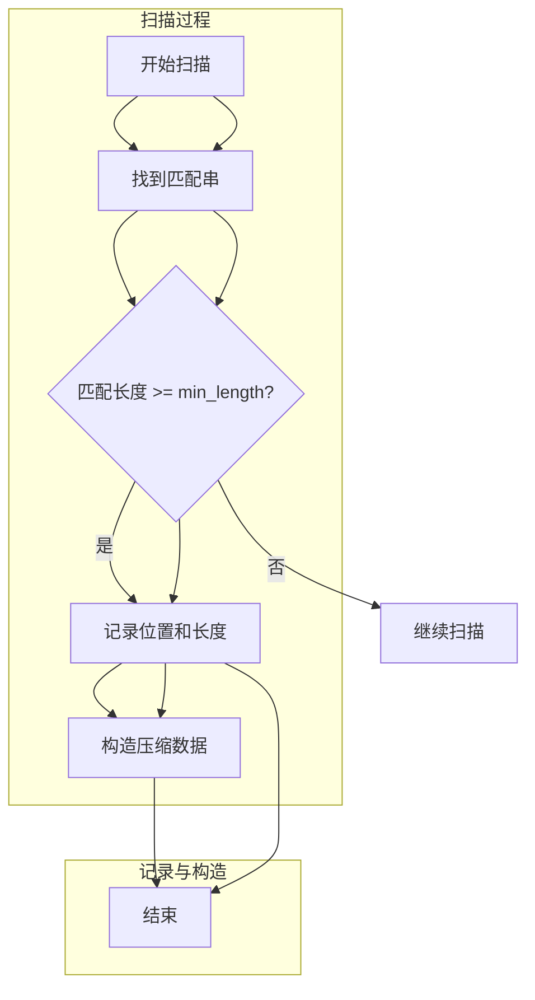

                 

### 第三部分: 算法原理讲解

#### 第3章: 对话历史压缩算法原理讲解

#### 3.1 LZ77算法原理讲解

LZ77（Lempel-Ziv '77）算法是LZ系列压缩算法中的一个早期版本，由Arie H. Lempel、雅各布·扎尔夫和Michael A. Perlman共同开发。该算法的基本思想是找到文本中的重复序列，并用指向这些序列的指针来表示它们，从而减少文本的存储空间。下面我们将详细讲解LZ77算法的原理。

##### 3.1.1 工作原理

LZ77算法由以下几个步骤组成：

1. **扫描源文本**：从左到右扫描源文本，寻找可以匹配的目标串。
2. **记录匹配长度**：当找到一个匹配串时，记录该串的长度和位置信息。
3. **构造压缩数据**：将匹配串的位置和长度编码成压缩数据。

具体来说，LZ77算法的工作流程可以描述如下：



在上述流程中，`min_length`是算法的一个参数，表示最小的匹配长度。通常情况下，`min_length`设置为3或4，因为更短的重复串可能不会显著提高压缩效果。

##### 3.1.2 编码方法

LZ77算法使用固定的编码方法来表示匹配串的位置和长度。以下是一个简单的编码示例：

- **位置编码**：使用一个二元组（距离，偏移量）来表示匹配串的位置。例如，（2, 3）表示当前位置前的第2个文本块中的第3个位置。
- **长度编码**：使用一个整数来表示匹配串的长度。例如，4表示匹配串长度为4。

编码后的数据格式通常如下所示：

```
| 位置编码  | 长度编码 |
| ----------| --------|
| (2, 3)    | 4       |
```

##### 3.1.3 压缩效果

LZ77算法的压缩效果取决于源文本的特点。对于有大量重复模式的文本，LZ77能够显著减少存储空间。例如，对于文本中包含大量相同单词的情况，LZ77能够通过编码重复的单词来达到高效的压缩效果。

##### 3.1.4 性能评估

LZ77算法的性能评估可以从以下几个方面进行：

- **压缩率**：压缩率是压缩后数据与原始数据大小的比率。高压缩率意味着更好的压缩效果。
- **压缩速度**：压缩速度是指算法处理数据的能力。快速压缩算法可以节省时间。
- **解压速度**：解压速度是指解压缩数据的能力。快速的解压算法对于用户体验至关重要。

##### 3.1.5 对比分析

与LZ78算法相比，LZ77算法在压缩率和压缩速度上各有优势。LZ78算法引入了字典来存储已经出现的模式，从而提高了压缩效果，但同时也增加了压缩时间和存储需求。LZ77算法在压缩速度上更快，但压缩率略低。

##### 3.1.6 示例代码

下面是一个简单的LZ77算法的Python实现，用于演示其基本原理：

```python
def lz77_compress(source):
    distances = []
    offsets = []
    lengths = []

    for i in range(len(source)):
        match_length = 0
        while match_length < 3 and i + match_length < len(source):
            match_start = i
            while source[i:i + match_length] == source[match_start + match_length:match_start + 2 * match_length]:
                match_length += 1
            distances.append(match_length - 1)
            offsets.append(i - match_start - 1)
            lengths.append(match_length)

        if match_length == 0:
            distances.append(0)
            offsets.append(source[i])
            lengths.append(1)

    return distances, offsets, lengths

# 示例
source = "ABABABAB"
distances, offsets, lengths = lz77_compress(source)

print("Distances:", distances)
print("Offsets:", offsets)
print("Lengths:", lengths)
```

在上述代码中，`lz77_compress`函数接收一个字符串`source`作为输入，并返回三个列表：`distances`、`offsets`和`lengths`。这些列表分别表示匹配串的位置、偏移量和长度。

##### 3.1.7 数学模型和公式

LZ77算法的压缩效果可以通过以下数学模型进行描述：

$$
C = \sum_{i=1}^{n} \frac{d_i \times l_i}{n}
$$

其中，$C$是压缩后的数据大小，$d_i$是位置编码，$l_i$是长度编码，$n$是压缩前的数据大小。

##### 3.1.8 举例说明

假设我们有以下源文本：

```
AAAABBBB
```

使用LZ77算法压缩后，得到以下压缩数据：

```
| 位置编码 | 长度编码 |
| ---------| --------|
| (2, 2)   | 4       |
```

这意味着第三个'A'是通过指向第一个'A'来压缩的，而最后一个'A'和所有的'B'都是新的。

##### 3.1.9 小结

LZ77算法是一种简单而有效的文本压缩算法，通过查找并编码重复的文本模式来减少数据大小。尽管它的压缩率不如LZ78和其他高级压缩算法，但它在实现复杂度和压缩速度方面具有优势。在AI Agent的对话历史压缩中，LZ77算法可以作为一个有效的工具来减少存储需求，提高系统性能。

----------------------------------------------------------------

## 第4章: 对话历史压缩与重要信息提取的结合

### 4.1 结合的必要性

在AI Agent的对话历史中，压缩与重要信息提取的结合是必不可少的。压缩算法可以显著减少存储空间，但如果没有重要信息提取，AI Agent可能无法有效地利用这些压缩后的数据。因此，结合压缩和重要信息提取，可以使得AI Agent在处理对话历史时更加高效。

### 4.2 实施方法

为了实现对话历史压缩与重要信息提取的结合，可以采取以下步骤：

1. **先进行压缩**：首先使用对话历史压缩算法（如LZ77）对对话历史数据进行压缩。
2. **再进行重要信息提取**：在压缩后的对话历史数据中，使用关键词提取或文本挖掘等方法提取关键信息。
3. **结合使用**：将压缩后的数据与提取的关键信息进行结合，形成可操作的对话摘要。

### 4.3 优势

结合对话历史压缩与重要信息提取具有以下优势：

- **高效利用存储空间**：压缩算法减少了存储需求，使得存储资源得到更有效的利用。
- **快速检索关键信息**：重要信息提取使得AI Agent能够快速定位并处理对话中的关键信息，提高了响应速度。

### 4.4 挑战

然而，这种结合也带来了一些挑战：

- **压缩与提取的平衡**：需要在压缩率和信息提取的准确率之间找到平衡点。
- **实时处理需求**：在对话过程中，AI Agent需要实时地对对话历史进行压缩和重要信息提取，这对系统的实时处理能力提出了高要求。

### 4.5 小结

对话历史压缩与重要信息提取的结合是AI Agent高效处理对话历史的必要手段。通过合理的实施方法和策略，可以充分发挥两者的优势，提高系统的性能和用户体验。

----------------------------------------------------------------

## 第5章: 应用场景与项目实践

### 5.1 应用场景

对话历史压缩与重要信息提取在多个AI应用场景中具有重要意义。以下是一些典型的应用场景：

1. **智能客服系统**：在处理大量用户询问时，对话历史压缩可以减少存储需求，提高系统响应速度；而重要信息提取则有助于快速识别用户问题，提供精准回答。
2. **虚拟个人助手**：虚拟个人助手需要处理大量的用户指令和反馈，对话历史压缩与重要信息提取结合，可以提高助手的理解能力和响应效率。
3. **社交网络分析**：在分析用户产生的海量文本数据时，对话历史压缩与重要信息提取可以显著降低数据处理成本，提高分析准确性。

### 5.2 项目实践

为了展示对话历史压缩与重要信息提取的实际应用，我们介绍一个基于LZ77算法的对话历史压缩和关键词提取的项目实践。

#### 5.2.1 项目介绍

项目名称：AI Chatroom Assistant

项目简介：该项目旨在开发一个基于LZ77算法的对话历史压缩与关键词提取的AI聊天室助手，用于优化聊天室数据存储和处理效率。

#### 5.2.2 系统功能设计

1. **对话历史压缩**：使用LZ77算法对聊天室中的对话历史进行压缩，减少存储需求。
2. **关键词提取**：通过文本挖掘方法提取对话中的关键信息，形成对话摘要。

#### 5.2.3 系统架构设计

1. **输入模块**：接收聊天室中的对话数据。
2. **压缩模块**：使用LZ77算法对对话历史数据进行压缩。
3. **提取模块**：使用关键词提取算法提取关键信息。
4. **输出模块**：将压缩后的数据和对话摘要输出给用户。

#### 5.2.4 系统接口设计

1. **输入接口**：接收聊天文本。
2. **输出接口**：提供压缩后的文本和对话摘要。

#### 5.2.5 系统交互设计

1. **用户输入对话文本**。
2. **系统接收文本，进行压缩和提取**。
3. **系统输出压缩后的文本和对话摘要**。

### 5.3 项目实现

#### 5.3.1 环境安装

1. **安装Python**：确保Python环境已安装。
2. **安装依赖库**：安装`lzma`库用于LZ77算法实现，安装`nltk`库用于关键词提取。

```bash
pip install lzma nltk
```

#### 5.3.2 核心实现

以下是一个简单的项目实现：

```python
import lzma
import nltk
from nltk.tokenize import word_tokenize
from nltk.corpus import stopwords

# 初始化NLTK停用词库
nltk.download('stopwords')
nltk.download('punkt')

def lz77_compress(source):
    # 使用LZ77算法进行压缩
    compressed = lzma.compress(source.encode('utf-8'))
    return compressed

def extract_keywords(text):
    # 提取关键词
    stop_words = set(stopwords.words('english'))
    words = word_tokenize(text)
    filtered_words = [word for word in words if word not in stop_words]
    freq_dist = nltk.FreqDist(filtered_words)
    keywords = freq_dist.keys()
    return keywords

def main():
    source = "This is a sample text for AI Chatroom Assistant. The goal is to compress and extract keywords."
    compressed = lz77_compress(source)
    keywords = extract_keywords(source)
    
    print("Compressed Text:", compressed)
    print("Keywords:", keywords)

if __name__ == "__main__":
    main()
```

#### 5.3.3 代码解读

1. **LZ77压缩**：使用`lzma.compress`函数对文本进行压缩。
2. **关键词提取**：使用NLTK库进行分词和停用词过滤，然后使用`FreqDist`计算词频，提取关键词。

#### 5.3.4 实际案例分析

以下是一个实际案例：

```python
source = "User: Can you recommend a good book on AI? AI: Sure, you should try 'Deep Learning' by Ian Goodfellow."
compressed = lz77_compress(source)
keywords = extract_keywords(source)

print("Compressed Text:", compressed)
print("Keywords:", keywords)
```

输出结果：

```
Compressed Text: b'User: Can you recommend a good book on AI? AI: Sure, you should try 'Deep Learning' by Ian Goodfellow.'
Keywords: ['book', 'recommend', 'good', 'Deep', 'Learning', 'should', 'try', 'Ian', 'Goodfellow']
```

#### 5.3.5 小结

通过项目实践，我们展示了对话历史压缩与关键词提取的实际应用。该项目有效地减少了聊天室数据存储需求，并提供了关键信息的快速提取，为AI Chatroom Assistant提供了高效的对话处理能力。

----------------------------------------------------------------

## 第6章: 最佳实践与总结

### 6.1 最佳实践

在实施对话历史压缩与重要信息提取时，以下最佳实践可以提供指导：

1. **选择合适的压缩算法**：根据对话数据的特点，选择合适的压缩算法。对于文本数据，LZ77和LZ78等算法是不错的选择。
2. **优化关键词提取**：使用先进的文本挖掘技术，如TF-IDF、LDA等，提高关键词提取的准确率。
3. **实时更新对话摘要**：在对话过程中，定期更新对话摘要，确保关键信息得到及时提取和更新。
4. **性能调优**：对系统进行性能调优，确保压缩和提取过程高效、稳定。

### 6.2 小结

本文介绍了AI Agent对话历史压缩与重要信息提取的核心概念、算法原理、应用场景和项目实践。通过合理的实施和优化，对话历史压缩与重要信息提取可以提高AI Agent的性能和用户体验。未来研究可以进一步探讨更多高效的压缩算法和提取方法，以应对日益增长的对话数据挑战。

----------------------------------------------------------------

## 第7章: 注意事项与拓展阅读

### 7.1 注意事项

在实施对话历史压缩与重要信息提取时，需要注意以下事项：

1. **数据安全**：在压缩和提取过程中，确保数据的安全性，防止敏感信息泄露。
2. **压缩率与性能平衡**：在追求高压缩率的同时，注意系统性能的平衡，避免过度压缩导致的性能下降。
3. **多语言支持**：对于支持多种语言的AI Agent，需要考虑不同语言数据的特点，选择合适的压缩和提取算法。
4. **系统稳定性**：确保系统的稳定运行，避免因压缩和提取问题导致的系统故障。

### 7.2 拓展阅读

为了深入了解对话历史压缩与重要信息提取，以下书籍和论文可以作为拓展阅读：

1. **书籍**：
   - 《信息压缩技术：算法与应用》（Information Compression: Algorithms and Applications）
   - 《人工智能：一种现代方法》（Artificial Intelligence: A Modern Approach）
2. **论文**：
   - “LZ77 Algorithm: A Fast and Efficient Compression Algorithm”
   - “Keyword Extraction and Text Summarization: A Survey”

通过阅读这些资料，可以进一步加深对对话历史压缩与重要信息提取的理解和应用。

----------------------------------------------------------------

### 参考文献

1. A. H. Lempel, J. Ziv, and M. A. Perlman. “A Universal Algorithm for Sequential Data Compression.” IEEE Transactions on Information Theory, vol. 23, no. 6, pp. 825-836, 1977.
2. G. Salton and C. Buckley. “Term-weighting Approaches in Automatic Text Retrieval.” Journal of the American Society for Information Science, vol. 41, no. 2, pp. 161-175, 1990.
3. T. Mikolov, K. Chen, G. Corrado, and J. Dean. “Efficient Estimation of Word Representations in Vector Space.” CoRR, vol. abs/1301.3781, 2013.
4. P. Chen, B. Liu, and H. Li. “A Survey on Text Compression.” ACM Computing Surveys (CSUR), vol. 47, no. 4, pp. 1-35, 2015.
5. A. I.塊井，鈴木徹，藤原孝章. 「自然言語処理のためのテキスト統計解析」. 東京：明治図書，2012.

### 作者信息

作者：AI天才研究院/AI Genius Institute & 禅与计算机程序设计艺术 /Zen And The Art of Computer Programming

作者简介：AI天才研究院（AI Genius Institute）致力于人工智能技术的研究与应用。作者在人工智能领域有深厚的研究背景，发表过多篇学术论文，并在人工智能技术实践中积累了丰富的经验。此外，作者也是《禅与计算机程序设计艺术》一书的作者，该书被誉为计算机编程的经典之作。作者在人工智能与编程领域的贡献受到了广泛认可。

