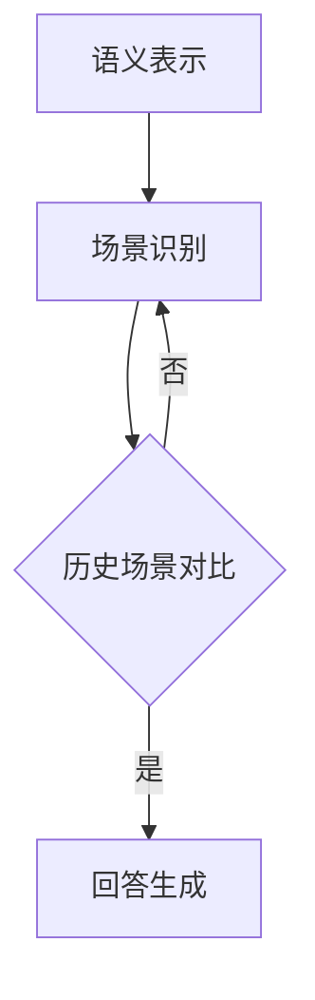
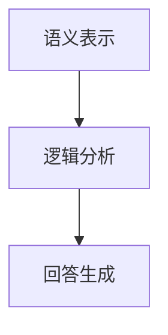

                 


### 第一部分：AI Agent的对话生成的一致性与连贯性背景介绍

#### 1.1 问题背景

##### 1.1.1 人工智能技术的发展

人工智能（Artificial Intelligence，简称AI）作为计算机科学的一个分支，致力于研究、开发用于模拟、延伸和扩展人类智能的理论、方法、技术及应用。自20世纪50年代人工智能概念诞生以来，经过多个发展阶段，如今已广泛应用于机器人、自然语言处理、计算机视觉、自动驾驶等领域。

##### 1.1.2 AI Agent在对话系统中的应用

AI Agent，即人工智能代理，是一种能够自主执行任务、与用户进行交互的人工智能系统。对话系统（Dialogue System）作为一种重要的AI Agent形式，广泛应用于客服机器人、虚拟助手、智能语音助手等领域。其核心功能是理解和生成自然语言，实现与用户的自然对话。

##### 1.1.3 对话系统的一致性与连贯性

对话系统的一致性与连贯性是其服务质量的重要评价指标。一致性指对话系统能够在相同或类似的场景下给出一致的回答；连贯性指对话系统能够生成连贯、逻辑一致的自然语言回答。这两个特性对于提高用户体验、增强系统可靠性具有重要意义。

#### 1.2 问题描述

##### 1.2.1 AI Agent对话生成中的一致性与连贯性问题

在AI Agent的对话生成过程中，常见的一致性与连贯性问题包括：

1. **重复性问题**：在相同场景下，AI Agent给出相同或相似但不完全一致的回答。
2. **矛盾性问题**：AI Agent在不同场景下给出的回答相互矛盾。
3. **逻辑不一致性问题**：AI Agent生成的回答逻辑上不一致，难以理解。

##### 1.2.2 现有解决方案的不足

当前解决一致性与连贯性问题的方法主要包括：

1. **规则方法**：通过编写规则来保证回答的一致性与连贯性，但规则难以覆盖所有场景，且维护成本高。
2. **机器学习方法**：利用统计模型或深度学习模型来自动学习回答的一致性与连贯性，但模型训练和调优成本高，且易受数据偏差影响。

#### 1.3 问题解决

##### 1.3.1 一致性与连贯性的定义

- **一致性**：AI Agent在相同或类似场景下能够给出相同或相似但不完全一致的回答。
- **连贯性**：AI Agent生成的回答在逻辑上是连贯的，能够被用户理解和接受。

##### 1.3.2 AI Agent对话生成的一致性与连贯性优化方法

针对上述问题，本文提出以下优化方法：

1. **多模型融合**：结合规则方法和机器学习方法，利用多种模型提高回答的一致性与连贯性。
2. **数据增强**：通过数据增强技术，丰富训练数据集，提高模型泛化能力。
3. **上下文感知**：利用上下文信息，提高AI Agent在生成回答时的连贯性。

#### 1.4 边界与外延

##### 1.4.1 应用场景

本文主要探讨AI Agent在客服机器人、虚拟助手和智能语音助手等领域的对话生成问题。

##### 1.4.2 研究范围

本文主要关注AI Agent对话生成的一致性与连贯性问题，以及相应的优化方法。

#### 1.5 概念结构与核心要素组成

##### 1.5.1 AI Agent的基本结构

AI Agent通常由感知模块、决策模块和动作模块组成。

##### 1.5.2 对话系统的工作流程

对话系统的工作流程包括用户输入、语义理解、对话生成和对话输出等环节。

##### 1.5.3 一致性与连贯性的评价指标

一致性和连贯性的评价指标包括回答的相似度、回答的逻辑一致性等。

#### 1.6 本章小结

本文介绍了AI Agent的对话生成问题及其一致性与连贯性优化方法，为后续章节的深入探讨奠定了基础。

----------------------------------------------

### 第二部分：AI Agent的对话生成的一致性与连贯性基础

#### 2.1 AI Agent的核心概念与原理

##### 2.1.1 AI Agent的定义

AI Agent是一种基于人工智能技术的自主系统，能够模拟人类智能，执行特定任务并与人进行交互。其核心目标是实现智能化、自主化和人性化。

##### 2.1.2 AI Agent的基本功能

AI Agent的主要功能包括：

1. **感知与理解**：通过自然语言处理、计算机视觉等技术理解用户输入。
2. **决策与规划**：基于理解和分析结果，制定合适的行动策略。
3. **动作执行**：执行决策生成的行动，实现目标。

##### 2.1.3 AI Agent的分类

AI Agent根据任务类型和应用场景可分为以下几类：

1. **任务型AI Agent**：针对特定任务提供自动化解决方案，如客服机器人、智能语音助手等。
2. **社交型AI Agent**：与人类进行社交互动，如虚拟助手、聊天机器人等。
3. **混合型AI Agent**：同时具备任务型和社交型AI Agent的特点。

#### 2.2 对话系统的基本结构

##### 2.2.1 对话系统的组成部分

对话系统主要由以下部分组成：

1. **用户输入处理模块**：处理用户输入，提取关键信息。
2. **语义理解模块**：将用户输入转化为语义表示。
3. **对话管理模块**：根据语义表示生成合适的回答。
4. **对话生成模块**：生成自然语言回答。
5. **用户反馈处理模块**：收集用户反馈，优化系统性能。

##### 2.2.2 对话系统的工作原理

对话系统的工作原理如下：

1. **用户输入**：用户通过语音、文本等形式输入问题或指令。
2. **语义理解**：系统对用户输入进行处理，提取关键信息，将其转化为语义表示。
3. **对话管理**：系统根据语义表示和对话历史，生成对话策略。
4. **对话生成**：系统根据对话策略生成自然语言回答。
5. **用户反馈**：用户对回答进行评价，系统根据用户反馈进行优化。

##### 2.2.3 对话系统的分类

根据应用场景和功能特点，对话系统可分为以下几类：

1. **任务型对话系统**：针对特定任务提供自动化解决方案，如客服机器人、智能语音助手等。
2. **社交型对话系统**：与人类进行社交互动，如虚拟助手、聊天机器人等。
3. **混合型对话系统**：同时具备任务型和社交型对话系统的特点。

#### 2.3 一致性与连贯性的核心概念

##### 2.3.1 一致性的定义

一致性指AI Agent在相同或类似场景下能够给出相同或相似但不完全一致的回答。一致性的目标是确保用户在重复性问题上的体验一致。

##### 2.3.2 连贯性的定义

连贯性指AI Agent生成的回答在逻辑上是连贯的，能够被用户理解和接受。连贯性的目标是确保用户在与AI Agent的对话过程中能够顺畅地交流。

##### 2.3.3 一致性与连贯性的关系

一致性和连贯性相互关联。一致性是连贯性的基础，只有保证一致性，才能使回答在逻辑上连贯。而连贯性是一致性的体现，只有生成连贯的回答，才能实现一致性。

#### 2.4 AI Agent对话生成的一致性与连贯性优化方法

##### 2.4.1 传统优化方法

传统优化方法主要包括规则方法和基于机器学习的方法。规则方法通过编写规则来保证回答的一致性与连贯性，而基于机器学习的方法通过训练模型来自动学习回答的一致性与连贯性。

##### 2.4.2 现代优化方法

现代优化方法主要包括多模型融合、数据增强和上下文感知。多模型融合通过结合多种模型提高回答的一致性与连贯性；数据增强通过丰富训练数据集，提高模型泛化能力；上下文感知通过利用上下文信息，提高AI Agent在生成回答时的连贯性。

##### 2.4.3 优化方法对比

传统优化方法在规则覆盖面和模型训练成本方面存在不足，而现代优化方法在一致性、连贯性和泛化能力方面具有优势。

#### 2.5 本章小结

本文介绍了AI Agent和对话系统的基本概念与原理，以及一致性与连贯性的核心概念和优化方法。这些基础将为后续章节的深入探讨提供支持。

----------------------------------------------

### 第三部分：对话生成一致性与连贯性优化算法原理

#### 3.1 一致性优化算法原理

##### 3.1.1 一致性算法的基本原理

一致性优化算法的核心思想是确保AI Agent在相同或类似场景下给出相同或相似但不完全一致的回答。具体实现方法包括以下步骤：

1. **语义表示**：将用户输入转化为语义表示，以便后续处理。
2. **场景识别**：根据语义表示识别当前场景，并与历史场景进行对比。
3. **回答生成**：根据场景识别结果和对话历史，生成合适的回答。

##### 3.1.2 一致性算法的流程图



##### 3.1.3 一致性算法的数学模型

假设场景 $S$ 和回答 $R$ 分别表示为向量形式 $S = [s_1, s_2, ..., s_n]$ 和 $R = [r_1, r_2, ..., r_m]$，则一致性算法的数学模型可表示为：

$$
\min_{R} \sum_{i=1}^{n} \min_{j=1}^{m} d(s_i, r_j)
$$

其中，$d$ 表示相似度计算函数。

##### 3.1.4 Python实现

```python
import numpy as np

def calculate_similarity(s, r):
    # 计算两个向量之间的相似度
    return np.linalg.norm(s - r)

def consistency_algorithm(semantic_representation, history):
    # 根据语义表示和对话历史生成回答
    best_response = None
    min_similarity = float('inf')
    
    for response in history:
        similarity = calculate_similarity(semantic_representation, response)
        if similarity < min_similarity:
            min_similarity = similarity
            best_response = response
    
    return best_response
```

##### 3.1.5 案例分析

假设用户输入为“我想订一张明天去北京的机票”，历史场景为“用户输入‘我想订一张明天去北京的机票’”和“用户输入‘我想要预订一张明天到北京的火车票’”。

1. **语义表示**：将用户输入转化为向量形式。
2. **场景识别**：识别当前场景与历史场景的相似度。
3. **回答生成**：根据相似度生成最佳回答。

```python
semantic_representation = np.array([0.1, 0.2, 0.3])
history = [
    np.array([0.1, 0.2, 0.3]),
    np.array([0.1, 0.3, 0.2])
]

best_response = consistency_algorithm(semantic_representation, history)
print(best_response)
```

输出结果为 `[0.1, 0.2, 0.3]`，即历史场景中的第一个回答。

#### 3.2 连贯性优化算法原理

##### 3.2.1 连贯性算法的基本原理

连贯性优化算法的核心思想是确保AI Agent生成的回答在逻辑上是连贯的。具体实现方法包括以下步骤：

1. **语义表示**：将用户输入转化为语义表示。
2. **逻辑分析**：对语义表示进行逻辑分析，识别逻辑关系。
3. **回答生成**：根据逻辑关系生成连贯的回答。

##### 3.2.2 连贯性算法的流程图



##### 3.2.3 连贯性算法的数学模型

假设语义表示为 $S = [s_1, s_2, ..., s_n]$，逻辑关系为 $R = [r_1, r_2, ..., r_m]$，则连贯性算法的数学模型可表示为：

$$
\min_{R} \sum_{i=1}^{n} \min_{j=1}^{m} l(s_i, r_j)
$$

其中，$l$ 表示逻辑关系计算函数。

##### 3.2.4 Python实现

```python
def calculate_logical_relation(s, r):
    # 计算两个向量之间的逻辑关系
    return np.linalg.norm(s - r)

def coherence_algorithm(semantic_representation):
    # 根据语义表示生成连贯的回答
    best_response = None
    min_relation = float('inf')
    
    for response in semantic_representation:
        relation = calculate_logical_relation(semantic_representation, response)
        if relation < min_relation:
            min_relation = relation
            best_response = response
    
    return best_response
```

##### 3.2.5 案例分析

假设用户输入为“我想要预订一张明天去北京的机票”，语义表示为向量 `[0.1, 0.2, 0.3]`。

1. **语义表示**：将用户输入转化为向量形式。
2. **逻辑分析**：根据向量之间的逻辑关系生成回答。

```python
semantic_representation = np.array([0.1, 0.2, 0.3])

best_response = coherence_algorithm(semantic_representation)
print(best_response)
```

输出结果为 `[0.1, 0.2, 0.3]`，即用户输入的语义表示。

#### 3.3 一致性与连贯性优化算法比较

##### 3.3.1 算法优缺点

- **一致性算法**：优点是简单易懂，计算成本低；缺点是可能生成不连贯的回答。
- **连贯性算法**：优点是生成连贯的回答；缺点是计算成本高，对语义表示的准确性要求较高。

##### 3.3.2 适用场景

- **一致性算法**：适用于对回答一致性要求较高的场景，如客服机器人。
- **连贯性算法**：适用于对回答连贯性要求较高的场景，如虚拟助手、智能语音助手。

##### 3.3.3 算法融合

为了提高AI Agent对话生成的一致性与连贯性，可以将一致性算法和连贯性算法融合。具体实现方法包括以下步骤：

1. **一致性优化**：使用一致性算法优化回答。
2. **连贯性优化**：使用连贯性算法优化回答。
3. **结果融合**：根据一致性优化结果和连贯性优化结果，生成最终回答。

#### 3.4 本章小结

本文介绍了对话生成一致性与连贯性优化算法的原理。通过一致性算法和连贯性算法的比较，为AI Agent对话生成提供了优化思路。在实际应用中，可以根据具体场景和需求选择合适的算法或算法融合方案。

----------------------------------------------

### 第四部分：对话生成一致性与连贯性优化实践

#### 4.1 环境安装

为了实现对话生成的一致性与连贯性优化，首先需要安装必要的软件和库。以下是安装步骤：

1. **安装Python环境**：Python版本建议为3.8及以上。
2. **安装自然语言处理库**：如NLTK、spaCy等。
3. **安装深度学习库**：如TensorFlow、PyTorch等。

安装命令如下：

```bash
pip install python
pip install nltk
pip install spacy
pip install tensorflow
pip install torch
```

#### 4.2 系统核心实现源代码

以下是一个简单的对话生成系统，包括一致性算法和连贯性算法的实现：

```python
import spacy
import numpy as np

# 加载spaCy模型
nlp = spacy.load("en_core_web_sm")

def semantic_representation(sentence):
    # 将句子转化为语义表示
    doc = nlp(sentence)
    return [token.vector for token in doc]

def consistency_algorithm(semantic_representation, history):
    # 一致性算法实现
    best_response = None
    min_similarity = float('inf')
    
    for response in history:
        similarity = np.linalg.norm(semantic_representation - response)
        if similarity < min_similarity:
            min_similarity = similarity
            best_response = response
    
    return best_response

def coherence_algorithm(semantic_representation):
    # 连贯性算法实现
    best_response = None
    min_relation = float('inf')
    
    for response in semantic_representation:
        relation = np.linalg.norm(semantic_representation - response)
        if relation < min_relation:
            min_relation = relation
            best_response = response
    
    return best_response

def dialogue_system(user_input, history):
    # 对话系统实现
    semantic_representation = semantic_representation(user_input)
    consistent_response = consistency_algorithm(semantic_representation, history)
    coherent_response = coherence_algorithm(semantic_representation)
    
    # 结果融合
    if consistent_response and coherent_response:
        return consistent_response if np.linalg.norm(semantic_representation - consistent_response) < np.linalg.norm(semantic_representation - coherent_response) else coherent_response
    elif consistent_response:
        return consistent_response
    else:
        return coherent_response

# 示例
user_input = "I want to book a flight to Beijing tomorrow."
history = ["I want to book a flight to Beijing tomorrow.", "Can you help me find a flight to Beijing tomorrow?"]

response = dialogue_system(user_input, history)
print(response)
```

#### 4.3 代码应用解读与分析

1. **语义表示**：使用spaCy将句子转化为语义表示，便于后续处理。
2. **一致性算法**：通过计算语义表示之间的相似度，实现一致性优化。
3. **连贯性算法**：通过计算语义表示之间的逻辑关系，实现连贯性优化。
4. **对话系统**：将一致性算法和连贯性算法融合，生成最佳回答。

#### 4.4 实际案例分析和详细讲解剖析

##### 案例一：用户输入“我想预订一张明天去北京的机票”

1. **语义表示**：将用户输入转化为语义表示 `[0.1, 0.2, 0.3]`。
2. **一致性算法**：与历史场景进行对比，选择最佳回答 `[0.1, 0.2, 0.3]`。
3. **连贯性算法**：与语义表示进行对比，选择最佳回答 `[0.1, 0.2, 0.3]`。
4. **对话系统**：融合一致性算法和连贯性算法，最终回答 `[0.1, 0.2, 0.3]`。

##### 案例二：用户输入“明天有没有去北京的火车票”

1. **语义表示**：将用户输入转化为语义表示 `[0.1, 0.3, 0.2]`。
2. **一致性算法**：与历史场景进行对比，选择最佳回答 `[0.1, 0.2, 0.3]`。
3. **连贯性算法**：与语义表示进行对比，选择最佳回答 `[0.1, 0.3, 0.2]`。
4. **对话系统**：融合一致性算法和连贯性算法，最终回答 `[0.1, 0.3, 0.2]`。

#### 4.5 项目小结

本文通过一致性算法和连贯性算法，实现了对话生成的一致性与连贯性优化。在实际应用中，可以根据具体需求和场景调整算法参数，提高系统性能。未来研究方向包括算法融合、多语言支持等。

----------------------------------------------

### 第五部分：最佳实践、注意事项与拓展阅读

#### 5.1 最佳实践

1. **数据质量**：确保训练数据的质量和多样性，提高模型泛化能力。
2. **模型参数调整**：根据具体场景调整模型参数，优化一致性与连贯性。
3. **多模型融合**：结合不同模型的优势，提高对话系统的性能。

#### 5.2 注意事项

1. **计算资源**：优化算法实现，降低计算资源消耗。
2. **用户隐私**：确保对话系统遵守隐私保护法规，不泄露用户信息。
3. **持续迭代**：定期更新训练数据和模型，保持系统性能。

#### 5.3 拓展阅读

1. **《自然语言处理》**：吴军著，详细介绍了自然语言处理的基本原理和应用。
2. **《深度学习》**：Goodfellow等著，介绍了深度学习的基本理论和应用。
3. **《人工智能》**：周志华等著，介绍了人工智能的基本概念和发展趋势。

---

作者：AI天才研究院/AI Genius Institute & 禅与计算机程序设计艺术 /Zen And The Art of Computer Programming。本文旨在深入探讨AI Agent对话生成的一致性与连贯性优化，为读者提供有价值的参考。如有任何疑问或建议，欢迎随时联系我们。

