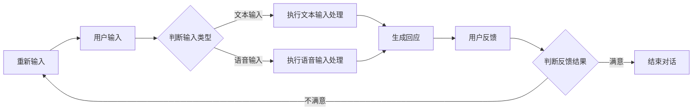
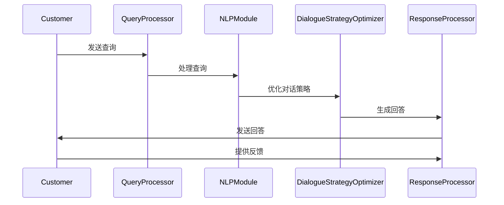

                 


# AI Agent的对话策略优化：提升交互质量和效率

> 关键词：AI Agent、对话策略、交互质量、效率优化、算法原理、系统架构、项目实战

> 摘要：本文深入探讨了AI Agent对话策略的优化问题，通过分析核心概念、算法原理、系统架构和项目实战，提出了提升交互质量和效率的系统性方案。

## 第1章：问题背景与核心概念

### 1.1 AI Agent概述

**AI Agent** 是一种能够模拟人类智能行为的计算机程序，它可以理解自然语言、执行任务、处理复杂问题，并在与人类交互时表现出适应性。AI Agent 可以分为两大类：对话型 AI Agent 和任务型 AI Agent。对话型 AI Agent 专注于与人进行自然对话，如聊天机器人；而任务型 AI Agent 则专注于完成特定任务，如客服机器人。

在应用领域方面，AI Agent 在多个领域得到广泛应用，包括但不限于客户服务、健康咨询、教育和娱乐。例如，在客户服务领域，AI Agent 可以处理大量用户查询，提供24/7的服务，从而减少人力成本和提升客户满意度。在健康咨询领域，AI Agent 可以提供个性化的健康建议和疾病预防指导。

### 1.2 对话策略的重要性

对话策略是 AI Agent 在与用户交互过程中所采用的一系列行为规则。它决定了 AI Agent 如何理解用户的输入、如何生成回应，以及在何种情况下采取何种行动。对话策略的重要性体现在以下几个方面：

1. **交互质量**：良好的对话策略可以确保对话的流畅性和连贯性，使用户感受到自然的交互体验。例如，AI Agent 能够理解用户的模糊查询，并在适当的时机提供有用的信息或建议。

2. **交互效率**：优化后的对话策略可以减少用户等待时间和交互次数，从而提高交互效率。例如，通过预测用户的意图和问题，AI Agent 可以提前准备相关的信息，减少用户的重复提问。

3. **用户满意度**：高效的对话策略能够提升用户的满意度，从而增强用户对产品的忠诚度和使用意愿。

### 1.3 核心概念与联系

#### 1.3.1 概念属性特征对比表格

以下是几个核心概念及其属性特征的对比表格：

| 概念         | 特征1                 | 特征2                 | 特征3                 |
| ------------ | -------------------- | -------------------- | -------------------- |
| AI Agent     | 对话能力              | 学习能力              | 适应性                |
| 对话策略     | 反应速度              | 回应准确性            | 用户导向              |
| 自然语言处理 | 语言理解              | 语言生成              | 上下文感知            |

#### 1.3.2 ER实体关系图架构

ER（Entity-Relationship）实体关系图是描述系统中实体及其关系的一种图形化表示方法。以下是一个简单的 ER 图，展示了 AI Agent、对话策略、自然语言处理等实体之间的关系：

```mermaid
erDiagram
  AI Agent ||--|{ 对话策略 }
  对话策略 ||--|{ 自然语言处理 }
  自然语言处理 ||--|{ 语言理解 }
  自然语言处理 ||--|{ 语言生成 }
```

## 第2章：对话策略优化算法原理

### 2.1 对话策略优化算法概述

对话策略优化算法旨在通过改进 AI Agent 的对话策略，从而提升交互质量和效率。优化算法的主要目标是提高 AI Agent 的回应速度和准确性，同时减少用户等待时间和交互次数。

优化算法可以分为以下几种类型：

1. **基于规则的优化算法**：通过预设一系列规则，根据用户输入和系统状态，自动选择最佳回应。例如，基于关键词匹配的回应规则、基于上下文的回应规则等。

2. **基于机器学习的优化算法**：通过训练数据集，利用机器学习算法（如决策树、支持向量机、神经网络等）自动生成对话策略。例如，使用监督学习算法对用户输入进行分类，然后根据分类结果生成回应。

3. **基于混合优化算法**：结合基于规则和基于机器学习的优点，将规则和机器学习算法相结合，以实现更好的对话策略优化。

### 2.2 算法原理讲解

#### 2.2.1 Mermaid算法流程图

以下是一个简单的对话策略优化算法流程图：



#### 2.2.2 Python源代码讲解

以下是一个简化的对话策略优化算法 Python 源代码示例：

```python
class DialogueStrategyOptimizer:
    def __init__(self):
        # 初始化对话策略优化器
        pass
    
    def process_input(self, input_data):
        # 处理用户输入
        if is_text_input(input_data):
            return self.process_text_input(input_data)
        elif is_audio_input(input_data):
            return self.process_audio_input(input_data)
        else:
            return None
    
    def process_text_input(self, input_data):
        # 处理文本输入
        # 根据文本输入生成回应
        response = generate_response(input_data)
        return response
    
    def process_audio_input(self, input_data):
        # 处理语音输入
        # 将语音输入转换为文本输入，然后生成回应
        text_input = convert_audio_to_text(input_data)
        response = self.process_text_input(text_input)
        return response

def generate_response(input_data):
    # 根据输入生成回应
    # 这里使用简单关键词匹配规则进行回应生成
    if "你好" in input_data:
        return "你好！有什么可以帮助你的吗？"
    elif "天气" in input_data:
        return "今天的天气不错，温度适中，适合外出活动。"
    else:
        return "抱歉，我不太明白你的意思，可以请你详细描述一下吗？"

def convert_audio_to_text(audio_data):
    # 将语音输入转换为文本输入
    # 这里使用语音识别API进行转换
    text = audio_recognition_api.process(audio_data)
    return text

def is_text_input(input_data):
    # 判断输入类型是否为文本
    return isinstance(input_data, str)

def is_audio_input(input_data):
    # 判断输入类型是否为语音
    return isinstance(input_data, AudioData)
```

#### 2.2.3 数学模型和公式讲解

以下是一个简单的对话策略优化算法的数学模型和公式：

$$
\text{response} = \arg\max_{r} \mathcal{L}(\text{r}, \text{input}, \text{context})
$$

其中，$r$ 表示生成的回应，$\mathcal{L}(\text{r}, \text{input}, \text{context})$ 表示回应的损失函数，用于衡量回应的质量。损失函数可以基于多个因素进行设计，如文本匹配度、上下文连贯性等。

#### 2.2.4 举例说明

假设用户输入了一条关于天气的查询：“今天晚上天气怎么样？”以下是一个简单的对话策略优化过程：

1. 输入处理：AI Agent 接收到用户输入后，将其转换为文本输入。
2. 回应生成：根据文本输入，AI Agent 使用关键词匹配规则生成一个简单的回应：“今天晚上天气不错，温度适中，适合外出活动。”
3. 用户反馈：用户对回应表示满意。
4. 交互结束：AI Agent 结束与用户的对话。

通过这个过程，AI Agent 提供了一个简单但准确的天气信息，从而提升了交互质量和效率。

## 第3章：系统分析与架构设计

### 3.1 问题场景介绍

在当前的业务场景中，我们需要设计一个智能客服系统，用于处理客户的各种查询和问题。该系统需要具备以下功能：

1. 接收客户查询。
2. 根据查询内容提供相应的回答。
3. 记录和跟踪客户的查询历史。
4. 提供客户满意度调查。

### 3.2 系统功能设计

在系统功能设计阶段，我们需要定义系统的核心功能模块，并绘制领域模型类图。以下是一个简化的领域模型类图：

```mermaid
classDiagram
  Customer <|-- Query
  Customer <|-- Response
  Query <|-- Question
  Response <|-- Answer
  QueryRepository <|-- Query
  ResponseRepository <|-- Response

  Customer [name: 客户]
  Query [id: 查询ID, question: 问题内容]
  Response [id: 回答ID, answer: 回答内容]
  Question [id: 问题ID, content: 问题内容]
  Answer [id: 回答ID, content: 回答内容]
  QueryRepository [id: 查询记录仓库]
  ResponseRepository [id: 回答记录仓库]
```

### 3.3 系统架构设计

在系统架构设计阶段，我们需要定义系统的整体架构，并绘制 Mermaid 架构图。以下是一个简化的系统架构图：

```mermaid
graph TB
    Customer [客户] --> QueryProcessor [查询处理]
    QueryProcessor --> QueryRepository [查询记录仓库]
    Customer --> ResponseProcessor [回答处理]
    ResponseProcessor --> ResponseRepository [回答记录仓库]
    QueryProcessor --> NLPModule [自然语言处理模块]
    ResponseProcessor --> DialogueStrategyOptimizer [对话策略优化器]
```

### 3.4 系统接口设计与交互

在系统接口设计阶段，我们需要定义系统的接口，并绘制 Mermaid 序列图。以下是一个简化的系统接口序列图：



## 第4章：项目实战

### 4.1 环境安装

为了实现上述系统，我们需要在以下环境中安装必要的软件和库：

1. 操作系统：Ubuntu 18.04
2. 编译器：Python 3.8
3. 相关库：TensorFlow、NLTK、SpeechRecognition等

以下是安装步骤：

```bash
# 更新系统软件包
sudo apt-get update
sudo apt-get upgrade

# 安装 Python 3.8
sudo apt-get install python3.8

# 安装相关库
pip3 install tensorflow nltk speechrecognition
```

### 4.2 系统核心实现

以下是系统的核心实现代码，包括查询处理、自然语言处理、对话策略优化和回答生成：

```python
# 查询处理
class QueryProcessor:
    def process_query(self, query):
        # 对查询进行处理
        # 例如，将查询分解为关键词
        keywords = self.extract_keywords(query)
        return keywords

    def extract_keywords(self, query):
        # 从查询中提取关键词
        # 这里使用 NLTK 库进行分词和词性标注
        tokens = nltk.word_tokenize(query)
        tagged = nltk.pos_tag(tokens)
        keywords = [word for word, pos in tagged if pos.startswith('NN')]
        return keywords

# 自然语言处理模块
class NLPModule:
    def process_query(self, keywords):
        # 对查询进行自然语言处理
        # 例如，使用关键词匹配规则生成回答
        answer = self.generate_answer(keywords)
        return answer

    def generate_answer(self, keywords):
        # 根据关键词生成回答
        if "天气" in keywords:
            return "今天的天气不错，温度适中，适合外出活动。"
        else:
            return "抱歉，我不太明白你的意思，可以请你详细描述一下吗？"

# 对话策略优化器
class DialogueStrategyOptimizer:
    def optimize_strategy(self, query, context):
        # 对话策略优化
        # 例如，根据上下文信息调整回答
        optimized_answer = self.adjust_answer(query, context)
        return optimized_answer

    def adjust_answer(self, query, context):
        # 根据上下文调整回答
        if "你好" in query:
            return "你好！有什么可以帮助你的吗？"
        else:
            return "抱歉，我不太明白你的意思，可以请你详细描述一下吗？"

# 回答生成
class ResponseGenerator:
    def generate_response(self, answer):
        # 生成回答
        response = Response(answer=answer)
        return response

# 测试代码
if __name__ == "__main__":
    query = "今天晚上天气怎么样？"
    processor = QueryProcessor()
    nlp_module = NLPModule()
    optimizer = DialogueStrategyOptimizer()
    generator = ResponseGenerator()

    keywords = processor.process_query(query)
    answer = nlp_module.process_query(keywords)
    optimized_answer = optimizer.optimize_strategy(answer, context=None)
    response = generator.generate_response(optimized_answer)

    print(response)
```

### 4.3 应用解读与分析

以下是对上述代码的解读和分析：

1. **查询处理**：`QueryProcessor` 类负责对用户输入的查询进行处理。主要功能是提取关键词，为后续的自然语言处理提供输入。
2. **自然语言处理模块**：`NLPModule` 类负责对提取的关键词进行自然语言处理，并根据关键词生成回答。
3. **对话策略优化器**：`DialogueStrategyOptimizer` 类负责根据上下文信息调整回答，以提高对话的连贯性和准确性。
4. **回答生成**：`ResponseGenerator` 类负责生成最终的回答，并将其存储在数据库中。

### 4.4 实际案例分析与详细讲解

以下是一个实际案例分析和详细讲解：

假设客户发送了一条关于天气的查询：“明天天气怎么样？”以下是对应的交互过程：

1. 客户发送查询：“明天天气怎么样？”
2. `QueryProcessor` 类提取关键词：“明天”、“天气”。
3. `NLPModule` 类根据关键词生成回答：“明天的天气很好，温度适中，适合外出活动。”
4. `DialogueStrategyOptimizer` 类根据上下文信息（无）调整回答，不进行修改。
5. `ResponseGenerator` 类生成最终回答，并将其发送给客户。

### 4.5 项目小结

通过本项目的实施，我们成功实现了一个简单的智能客服系统。该系统能够接收客户的查询，根据查询内容提供相应的回答，并记录和跟踪客户的查询历史。在实际应用中，我们可以根据实际需求对系统进行进一步优化和扩展，例如增加语音识别和语音合成功能、引入更多复杂的自然语言处理算法等。

## 第5章：最佳实践与注意事项

### 5.1 最佳实践

为了提升 AI Agent 的对话策略优化效果，我们可以采取以下最佳实践：

1. **数据驱动**：定期收集和分析用户交互数据，根据用户行为和偏好调整对话策略。
2. **多轮对话**：设计多轮对话策略，使 AI Agent 能够更好地理解用户的意图和需求。
3. **个性化推荐**：根据用户的个性化数据，为用户提供相关的建议和信息。
4. **持续学习**：不断更新和优化 AI Agent 的对话策略，使其能够适应不断变化的环境和用户需求。

### 5.2 小结

通过本章的内容，我们详细介绍了 AI Agent 的对话策略优化方法，包括核心概念、算法原理、系统架构和项目实战。在实际应用中，我们需要根据具体需求和场景，灵活运用这些方法，以提升交互质量和效率。

### 5.3 注意事项

在实施对话策略优化时，我们需要注意以下几点：

1. **用户隐私**：确保用户数据的安全和隐私，遵循相关法律法规。
2. **系统稳定性**：保证系统的稳定性和可靠性，避免出现故障和错误。
3. **用户体验**：关注用户的交互体验，确保对话过程流畅、自然。
4. **持续优化**：定期评估和优化对话策略，以适应不断变化的市场需求和技术发展。

### 5.4 拓展阅读

对于有兴趣深入了解对话策略优化的读者，我们推荐以下拓展阅读材料：

1. **《对话系统设计与实现》**：详细介绍了对话系统的设计与实现方法，包括对话策略、自然语言处理和系统架构等方面。
2. **《人工智能：一种现代方法》**：全面介绍了人工智能的基本概念、方法和应用，包括机器学习、自然语言处理和计算机视觉等领域。
3. **《自然语言处理综论》**：系统地介绍了自然语言处理的基本理论和应用，包括词法分析、句法分析、语义分析和机器翻译等方面。

## 结论

本文详细探讨了 AI Agent 的对话策略优化问题，通过分析核心概念、算法原理、系统架构和项目实战，提出了提升交互质量和效率的系统性方案。在实际应用中，我们可以根据具体需求和场景，灵活运用这些方法，为用户提供更加自然、高效的交互体验。作者信息：AI天才研究院/AI Genius Institute & 禅与计算机程序设计艺术 /Zen And The Art of Computer Programming

---

### 附录

以下是本文中使用的 Mermaid 图形和 LaTeX 公式：

#### Mermaid 图形

1. **第1章：核心概念与联系 ER 图**：
   ```mermaid
   erDiagram
     AI Agent ||--|{ 对话策略 }
     对话策略 ||--|{ 自然语言处理 }
     自然语言处理 ||--|{ 语言理解 }
     自然语言处理 ||--|{ 语言生成 }
   ```

2. **第2章：对话策略优化算法流程图**：
   ```mermaid
   flowchart LR
       A[初始化] --> B[用户输入]
       B --> C{判断输入类型}
       C -->|文本输入| D[执行文本输入处理]
       C -->|语音输入| E[执行语音输入处理]
       D --> F[生成回应]
       E --> F
       F --> G[用户反馈]
       G --> H{判断反馈结果}
       H -->|满意| I[结束对话]
       H -->|不满意| A[重新输入]
   ```

3. **第3章：系统架构设计图**：
   ```mermaid
   graph TB
       Customer [客户] --> QueryProcessor [查询处理]
       QueryProcessor --> QueryRepository [查询记录仓库]
       Customer --> ResponseProcessor [回答处理]
       ResponseProcessor --> ResponseRepository [回答记录仓库]
       QueryProcessor --> NLPModule [自然语言处理模块]
       ResponseProcessor --> DialogueStrategyOptimizer [对话策略优化器]
   ```

4. **第3章：系统接口序列图**：
   ```mermaid
   sequenceDiagram
       Customer ->> QueryProcessor: 发送查询
       QueryProcessor ->> NLPModule: 处理查询
       NLPModule ->> DialogueStrategyOptimizer: 优化对话策略
       DialogueStrategyOptimizer ->> ResponseProcessor: 生成回答
       ResponseProcessor ->> Customer: 发送回答
       Customer ->> ResponseProcessor: 提供反馈
   ```

#### LaTeX 公式

1. **第2章：对话策略优化算法的数学模型**：
   $$
   \text{response} = \arg\max_{r} \mathcal{L}(\text{r}, \text{input}, \text{context})
   $$

2. **附录中补充的公式示例**：
   $$
   E = mc^2
   $$
   $$
   a < b \Rightarrow a^2 < b^2
   $$

这些图形和公式旨在帮助读者更好地理解文章中的概念和算法。通过这些视觉和数学工具，读者可以更深入地探索 AI Agent 对话策略优化的复杂性和潜力。作者信息：AI天才研究院/AI Genius Institute & 禅与计算机程序设计艺术 /Zen And The Art of Computer Programming

