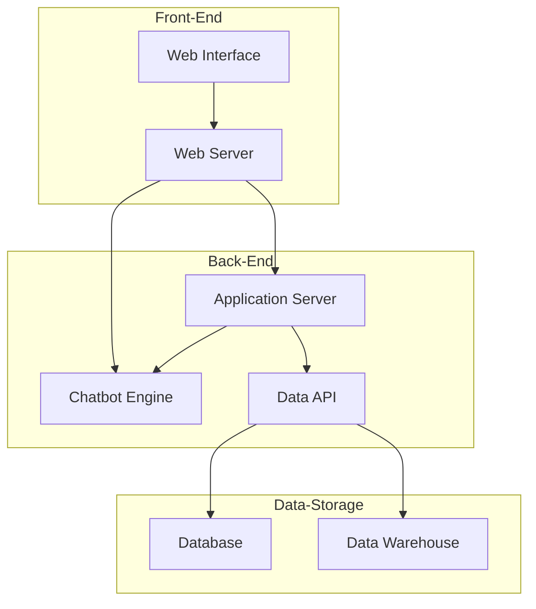
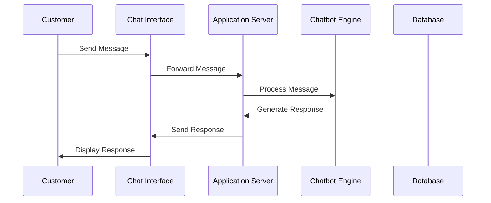
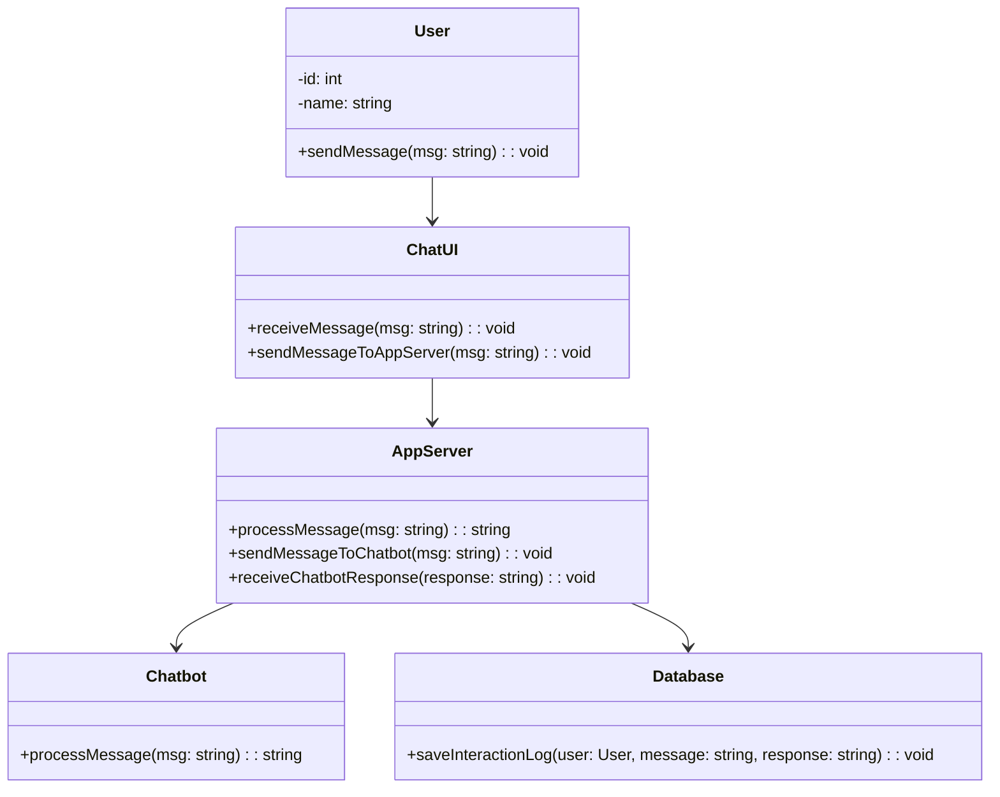

                 

### Introduction to AI Agents and Dialog Strategies

Artificial Intelligence (AI) agents have become a cornerstone of modern technology, transforming various sectors by automating tasks, providing personalized experiences, and enhancing decision-making processes. At the heart of these advancements lie AI agents, which are designed to interact with their environment, learn from experiences, and adapt their behaviors accordingly. In this article, we will delve into the world of AI agents and their critical component—dialog strategies.

### Definition and Background of AI Agents

AI agents are entities that are programmed to perceive their environment through sensors, take actions based on their understanding of the environment, and receive feedback to improve their performance over time. These agents operate within a defined environment and interact with it using a set of rules or algorithms. The primary goal of an AI agent is to achieve a specific objective, often referred to as the "utility function."

The concept of AI agents has a rich historical background, starting with early symbolic AI approaches in the 1950s and evolving through the advent of machine learning and neural networks in the late 20th and early 21st centuries. Over the years, AI agents have been applied in various domains, such as robotics, gaming, and customer service, showcasing their versatility and potential.

#### Fundamental Concepts of AI Agents

Several key concepts underpin the operation of AI agents:

- **Sensors**: These are the means by which an agent perceives its environment. Examples include cameras, microphones, and other types of sensors that collect data.
- ** Actuators**: These are the components through which an agent takes actions in the environment. Examples include robotic arms, speakers, or actuators that control physical devices.
- **State**: The current situation or configuration of the agent and its environment at a given time.
- **Action**: A behavior or change that an agent can make in the environment.
- **Reward**: A signal received by the agent indicating how well its action has achieved the desired objective.

#### Applications and Impact of AI Agents

AI agents have found applications in numerous fields, driving innovation and efficiency:

- **Robotics**: AI agents are used in robots for tasks such as manufacturing, surgery, and exploration.
- **Customer Service**: Chatbots and virtual assistants are AI agents designed to interact with customers, providing support and assistance.
- **Games**: AI agents are used in games to create challenging opponents or to generate content, such as storylines or levels.
- **Finance**: AI agents are employed for algorithmic trading, risk management, and fraud detection.
- **Healthcare**: AI agents are used for diagnostics, personalized treatment plans, and patient monitoring.

The impact of AI agents extends beyond these specific applications, contributing to societal changes in areas such as job automation, data-driven decision-making, and the creation of new industries and markets.

### Understanding Dialog Strategies

Dialog strategies are essential for enabling AI agents to communicate effectively with humans and other agents. These strategies determine how the agent will structure its interactions, interpret user inputs, generate responses, and maintain context over conversations. Effective dialog strategies are crucial for delivering a natural, coherent, and helpful interaction experience.

#### Definition and Importance of Dialog Strategies

A dialog strategy can be defined as a set of rules, algorithms, or models that govern the interaction between an AI agent and its environment or users. These strategies are designed to ensure that the agent can understand user inputs, generate relevant and meaningful responses, and adapt to different conversational contexts.

The importance of dialog strategies lies in their ability to:

- **Enhance User Experience**: Well-designed dialog strategies can significantly improve user satisfaction and engagement by providing a seamless and intuitive interaction.
- **Improve Task Efficiency**: Effective dialog strategies can streamline tasks, reduce the need for user intervention, and increase the overall efficiency of the system.
- **Ensure Consistency and Coherence**: A consistent dialog strategy ensures that the agent maintains a coherent narrative and provides a unified experience across different interactions.
- **Support Personalization**: Adaptive dialog strategies can personalize interactions based on user preferences, behavior, and context, thereby creating a more tailored and engaging experience.

#### Types of Dialog Strategies

There are several types of dialog strategies, each suited to different types of interactions and environments:

- **Template-Based Strategies**: These strategies use predefined templates for responses, ensuring consistency and speed in generating replies. They are suitable for scenarios where the conversation is predictable and repetitive.
- **Rule-Based Strategies**: These strategies rely on a set of rules or conditions to determine the agent's responses. They are more flexible than template-based strategies and can handle a wider range of scenarios.
- **Machine Learning-Based Strategies**: These strategies use machine learning algorithms to learn from interactions and improve over time. They are highly adaptable and can handle complex and dynamic conversational contexts.
- **Hybrid Strategies**: These strategies combine elements of template-based, rule-based, and machine learning approaches to leverage the strengths of each method. They are often used in complex environments where different strategies are required for different aspects of the interaction.

#### Challenges in Designing Effective Dialog Strategies

Designing effective dialog strategies poses several challenges:

- **Natural Language Understanding (NLU)**: Accurately interpreting user inputs in natural language is complex due to the nuances and variability of human language.
- **Context Management**: Maintaining context over long conversations or across different sessions is challenging, as context can be lost or misinterpreted.
- **Personalization**: Creating a personalized experience requires understanding and adapting to individual user preferences and behaviors, which can be difficult to achieve consistently.
- **Scalability**: Designing strategies that can scale to handle a large number of concurrent interactions without compromising performance or quality is critical.
- **Ethics and Bias**: Ensuring that dialog strategies are fair, unbiased, and respectful is crucial, as they can significantly impact user trust and satisfaction.

In conclusion, AI agents and their dialog strategies play a vital role in shaping the future of human-computer interaction. Understanding the concepts, challenges, and applications of AI agents and dialog strategies is essential for developing effective and user-friendly AI systems. In the following chapters, we will delve deeper into the theoretical foundations and practical implementations of dialog strategies, exploring how they can be optimized for various scenarios and environments.

### Core Theories and Principles of Dialog Strategies

Designing effective dialog strategies for AI agents requires a solid understanding of core theories and principles that govern human communication and interaction. These theories and principles form the foundation upon which dialog strategies are built, ensuring that AI agents can interact naturally and meaningfully with users. In this chapter, we will explore the conceptual foundations, key principles, and comparative analysis of different dialog strategies.

#### Conceptual Foundations of Dialog Strategies

The conceptual foundation of dialog strategies is deeply rooted in cognitive models, natural language processing (NLP) techniques, and machine learning algorithms. These components interact to create a cohesive framework for understanding and generating dialogue.

**Cognitive Models and Their Influence on Dialog Strategies**

Cognitive models are theoretical representations of the mental processes involved in human thought and decision-making. They help in understanding how humans perceive, process, and respond to information. In the context of dialog strategies, cognitive models are essential for designing agents that can mimic human-like interactions.

- **Attention and Memory**: Cognitive models emphasize the importance of attention and memory in processing information. Dialog strategies need to simulate these processes to maintain context and respond appropriately.
- **Inference and Reasoning**: The ability to infer and reason based on partial or ambiguous information is crucial for generating coherent and meaningful responses. Dialog strategies leverage inference engines and reasoning algorithms to achieve this.
- **Emotion and Affect**: Emotion plays a significant role in human communication. Understanding and modeling emotional responses in AI agents can enhance the quality and richness of interactions.

**Natural Language Processing (NLP) Techniques**

NLP techniques enable machines to understand, process, and generate human language. These techniques are fundamental to the implementation of dialog strategies, as they provide the means to interpret user inputs and generate appropriate responses.

- **Tokenization**: The process of breaking text into individual words or tokens is essential for analyzing and understanding language. Tokenization helps in identifying the basic units of language that form the basis for further analysis.
- **Part-of-Speech Tagging**: This technique involves labeling each word in a sentence with its part of speech (noun, verb, adjective, etc.). It helps in understanding the grammatical structure of sentences and the roles of words within them.
- **Dependency Parsing**: Dependency parsing analyzes the grammatical structure of sentences by identifying the relationships between words. This is crucial for understanding the meaning and context of sentences.
- **Sentiment Analysis**: Sentiment analysis involves determining the emotional tone of text, whether it is positive, negative, or neutral. This is important for generating emotionally appropriate responses.

**Machine Learning Algorithms in Dialog Strategy Design**

Machine learning algorithms are at the core of modern dialog strategy design, enabling agents to learn from data and improve their performance over time. These algorithms are used to train models that can recognize patterns, classify inputs, and generate responses.

- **Supervised Learning**: Supervised learning algorithms, such as decision trees, support vector machines, and neural networks, are used to train models based on labeled data. These models learn from examples and can predict responses based on similar inputs.
- **Unsupervised Learning**: Unsupervised learning algorithms, such as clustering and dimensionality reduction techniques, are used to discover patterns and relationships in unlabeled data. They are useful for tasks like topic modeling and cluster analysis in dialog strategies.
- **Reinforcement Learning**: Reinforcement learning algorithms, such as Q-learning and deep Q-networks, are used to train agents that can learn optimal behaviors through trial and error. This is particularly useful for dynamic and interactive environments.

#### Key Principles of Effective Dialog Strategies

Effective dialog strategies are designed based on several key principles that ensure the agent can interact naturally, adapt to different contexts, and provide valuable information.

**User-Centered Design**

User-centered design is a core principle in the development of dialog strategies. It involves designing interactions that are intuitive, easy to use, and tailored to the needs and preferences of the users.

- **User Research**: Conducting user research to understand user needs, preferences, and pain points is crucial. This information informs the design of dialog strategies to ensure they meet user expectations.
- **User Testing**: Continuously testing dialog strategies with real users helps in identifying and addressing issues, ensuring that the interactions are user-friendly and effective.

**Adaptability and Personalization**

Adaptability and personalization are critical for creating engaging and meaningful interactions. Dialog strategies should be able to adapt to different conversational contexts and provide personalized responses based on user profiles and behavior.

- **Contextual Adaptation**: Understanding and responding to the context of the conversation ensures that the agent can provide relevant information and maintain the flow of the interaction.
- **Personalization**: Tailoring responses to individual users based on their preferences, past interactions, and demographic information enhances the user experience.

**Consistency and Coherence**

Consistency and coherence are essential for maintaining a unified and engaging user experience. Dialog strategies should ensure that the agent maintains a consistent voice, tone, and style throughout the interaction.

- **Consistent Voice and Tone**: A consistent voice and tone help in establishing a brand identity and creating a reliable and trustworthy agent.
- **Coherent Narrative**: Maintaining a coherent narrative ensures that the agent can follow a logical flow of conversation, providing a seamless and engaging experience.

**Comparative Analysis of Dialog Strategies**

Different types of dialog strategies have their own strengths and weaknesses, making them suitable for different scenarios and environments. A comparative analysis helps in understanding their characteristics and selecting the appropriate strategy for a given context.

- **Template-Based Strategies**: These strategies use predefined templates for generating responses. They are quick and reliable but lack flexibility and creativity.
- **Rule-Based Strategies**: These strategies use a set of rules to determine responses. They are more flexible than template-based strategies but can become complex and difficult to maintain.
- **Machine Learning-Based Strategies**: These strategies use machine learning algorithms to generate responses based on patterns and data. They are highly adaptable but require large amounts of training data and can be computationally intensive.
- **Hybrid Strategies**: These strategies combine elements of template-based, rule-based, and machine learning approaches. They offer a balance between flexibility and reliability, making them suitable for complex environments.

In conclusion, the conceptual foundations, key principles, and comparative analysis of different dialog strategies provide a comprehensive framework for designing effective interactions between AI agents and users. By understanding these principles and applying them appropriately, developers can create engaging, adaptive, and user-friendly dialog strategies that enhance the overall user experience.

### Implementing Dialog Strategies in AI Agents

The practical implementation of dialog strategies in AI agents involves several critical steps, from data collection and preprocessing to model selection and training. Each of these steps plays a pivotal role in ensuring that the AI agent can generate coherent and effective dialogues. In this section, we will explore the essential components of these steps, detailing how to implement dialog strategies effectively.

#### Data Collection and Preprocessing

The first step in implementing dialog strategies is to collect a robust and diverse dataset that reflects the range of interactions the AI agent will encounter. The quality and quantity of the data significantly impact the performance of the dialog strategy.

**Data Sources for Dialog Strategy Development**

Data can be collected from various sources, including:

- **Real-World Conversations**: Transcripts of real-world conversations, such as customer service interactions, online chats, or phone calls, provide a wealth of information on natural human language use.
- **Simulated Dialogues**: Created using text generation models or by transcribing scripted dialogues, these can be used to simulate various conversational scenarios and help in testing dialog strategies.
- **Public Datasets**: There are several public datasets available, such as the DailyDialogue dataset, the Multi-Way Dialogue corpus, or the Cornell Movie Dialogue corpus, which can be used for training and testing dialog strategies.

**Data Preprocessing Techniques**

Once the data is collected, it needs to be preprocessed to remove noise and inconsistencies and to prepare it for training. Key preprocessing techniques include:

- **Tokenization**: Breaking the text into individual words or tokens, which allows for further analysis and processing.
- **Normalization**: Converting text to a standard format by lowercasing, removing punctuation, and handling special characters. This ensures consistency across the dataset.
- **Cleaning**: Removing irrelevant data, such as stop words (common words like "and", "the", etc.), and correcting typos or grammatical errors.
- **Handling Unstructured Data**: For datasets containing unstructured data, like audio or video conversations, techniques like speech-to-text conversion and sentiment analysis can be employed to convert them into text format.

#### Model Selection and Training

The next step is to select and train a model that can effectively generate responses based on the preprocessed data. The choice of model depends on the specific requirements of the dialog strategy, such as the complexity of the conversation, the need for adaptability, and the computational resources available.

**Choosing the Right Models**

Several models can be used for dialog strategy implementation, each with its advantages and disadvantages:

- **Rule-Based Models**: These models use a set of predefined rules to generate responses. They are fast and predictable but lack flexibility and adaptability.
- **Template-Based Models**: These models use predefined templates filled in with dynamic content. They are also fast but can become repetitive and lack natural language variation.
- **Machine Learning Models**: These models, such as neural networks and transformers, can learn from data to generate more natural and varied responses. They are computationally intensive but offer higher adaptability and performance.
- **Hybrid Models**: These models combine rule-based and machine learning approaches to leverage the strengths of both methods. They offer a balance between flexibility and reliability.

**Training and Validation**

Once the model is selected, it needs to be trained and validated. Training involves feeding the model with a large dataset and adjusting its parameters to minimize errors. Validation ensures that the model performs well on unseen data.

- **Training**: The training process typically involves feeding the model with pairs of input sentences and their corresponding responses. The model learns to predict responses based on these examples.
- **Validation**: Validation is performed using a separate validation set to evaluate the model's performance. Common metrics for evaluating dialog models include accuracy, F1 score, and BLEU score.

#### Model Evaluation and Optimization

After training and validation, it is crucial to evaluate the model's performance and optimize it for better results. This involves:

- **Performance Metrics**: Evaluating the model using metrics such as response latency, response quality, and user satisfaction.
- **Error Analysis**: Identifying and analyzing errors in the model's responses to understand the underlying issues and areas for improvement.
- **Hyperparameter Tuning**: Adjusting the model's hyperparameters to improve performance. This may involve experimenting with different learning rates, network architectures, and training strategies.
- **Continuous Learning**: Implementing mechanisms for continuous learning and updating the model with new data to adapt to evolving conversational patterns and user preferences.

In conclusion, implementing dialog strategies in AI agents involves a multi-step process that includes data collection and preprocessing, model selection and training, and evaluation and optimization. Each step is crucial for ensuring that the AI agent can generate coherent and effective dialogues. By carefully following these steps and continuously improving the model, developers can create AI agents that provide a seamless and engaging user experience.

### Designing Dialog Strategies for Different Scenarios

Designing effective dialog strategies requires a nuanced understanding of various scenarios and environments in which AI agents operate. Different contexts demand different approaches to dialogue management, user interaction, and response generation. In this section, we will explore how to tailor dialog strategies to common scenarios, focusing on customer service, healthcare, and social media chatbots.

#### Customer Service

Customer service is one of the most prevalent applications of AI agents. Designing dialog strategies for customer service requires balancing efficiency, accuracy, and user satisfaction. Here are some key considerations:

**User-Friendly Interaction**

The primary goal in customer service is to make interactions as seamless and user-friendly as possible. This involves:

- **Conversational Flow**: Ensuring that the conversation flows naturally and that the agent can handle various user inputs without losing context.
- **Clear Communication**: Using language that is clear, concise, and easy to understand to avoid confusion and miscommunication.

**Scalability and Responsiveness**

Customer service often involves handling a large volume of interactions simultaneously. Therefore, the dialog strategy must be scalable and capable of responding quickly without compromising on quality:

- **Concurrency Management**: Designing the system to handle multiple customer queries concurrently, ensuring that each customer feels attended to promptly.
- **Response Latency**: Optimizing the system to minimize response times, as slow responses can frustrate users.

**Personalization and Adaptability**

Personalization and adaptability are crucial in customer service to enhance user satisfaction:

- **User Profiles**: Creating user profiles to remember customer preferences, past interactions, and historical data to provide more personalized responses.
- **Adaptive Learning**: Implementing machine learning algorithms that can adapt to individual customer behaviors and preferences, improving the overall interaction quality over time.

#### Healthcare

In the healthcare sector, AI agents are increasingly being used for tasks such as appointment scheduling, symptom assessment, and patient monitoring. Designing dialog strategies for healthcare must prioritize accuracy, empathy, and privacy.

**Accuracy and Clinical Relevance**

Accuracy is paramount in healthcare interactions, as the agent's responses can have real-world implications. Key considerations include:

- **Knowledge Base**: Developing a comprehensive knowledge base that includes up-to-date medical information and guidelines.
- **Question-Answering Models**: Training the agent with question-answering models that can accurately interpret user inputs and provide relevant medical advice.

**Empathy and Sensitivity**

AI agents in healthcare must exhibit empathy and sensitivity to handle sensitive conversations and provide support:

- **Emotional Recognition**: Incorporating natural language processing techniques to recognize and respond to user emotions, ensuring that the agent can provide appropriate emotional support.
- **Tone and Voice**: Using a compassionate and understanding tone in responses to help users feel supported and reassured.

**Privacy and Data Security**

Protecting patient privacy and ensuring data security are critical in healthcare:

- **Data Anonymization**: Anonymizing patient data to protect privacy during training and deployment.
- **Compliance with Regulations**: Ensuring that the dialog strategy complies with healthcare regulations such as HIPAA (Health Insurance Portability and Accountability Act) to safeguard patient information.

#### Social Media Chatbots

Social media chatbots are designed to engage with users on platforms like Facebook, Twitter, and Instagram. These interactions are often more informal and fast-paced compared to customer service or healthcare. Key considerations for designing dialog strategies for social media chatbots include:

**Engaging and Interactive Content**

Creating engaging and interactive content is crucial for maintaining user interest:

- ** Gamification**: Incorporating elements of gamification, such as quizzes, polls, or interactive stories, to keep users engaged.
- **Interactive Dialogs**: Designing dialogues that encourage user participation and provide a sense of personalization.

**Contextual Awareness**

Understanding the context of social media interactions is essential for providing relevant and timely responses:

- **User Context**: Taking into account the user's location, time of day, and previous interactions to provide contextually appropriate responses.
- **Content Relevance**: Ensuring that the content shared by the chatbot is relevant to the user's interests and preferences.

**Brand Consistency**

Maintaining brand consistency across social media platforms is vital for establishing a cohesive brand identity:

- **Brand Voice**: Establishing and maintaining a consistent brand voice that aligns with the company's values and messaging.
- **Visual Identity**: Ensuring that the chatbot's visual elements, such as logos and color schemes, are consistent with the brand's visual identity.

In conclusion, designing dialog strategies for different scenarios requires a tailored approach that considers the unique requirements of each environment. Whether it's customer service, healthcare, or social media, effective dialog strategies must balance user needs, system capabilities, and the specific context of the interaction. By carefully considering these factors, developers can create AI agents that provide valuable, engaging, and personalized interactions across various domains.

### Implementing Dialog Strategies: Case Study

To illustrate the practical implementation of dialog strategies, let's consider a case study involving a chatbot designed for a large-scale e-commerce platform. This case study will cover the development environment, core implementation steps, and a detailed code explanation.

#### Development Environment

The chatbot is developed using Python, leveraging popular machine learning libraries such as TensorFlow and Keras for neural network implementations. The choice of TensorFlow allows for robust neural network architecture and ease of integration with other tools and platforms. The development environment includes Jupyter Notebook for code experimentation and model training, as well as the AWS Cloud for scalable and reliable computing resources.

#### Core Implementation Steps

**1. Data Collection and Preprocessing**

The first step involves collecting a dataset of e-commerce conversations, including customer inquiries, product reviews, and customer support interactions. The dataset is sourced from various platforms and is cleaned to remove noise, inconsistencies, and irrelevant data. Key preprocessing steps include tokenization, lowercasing, and removal of stop words.

```python
import nltk
from nltk.corpus import stopwords
from nltk.tokenize import word_tokenize

nltk.download('punkt')
nltk.download('stopwords')

def preprocess_text(text):
    text = text.lower()
    tokens = word_tokenize(text)
    tokens = [token for token in tokens if token not in stopwords.words('english')]
    return ' '.join(tokens)

# Example usage
input_text = "I want to buy a new smartphone. What are the best options under $500?"
processed_text = preprocess_text(input_text)
```

**2. Model Selection and Training**

The chatbot uses a recurrent neural network (RNN) with Long Short-Term Memory (LSTM) cells to generate responses. The model is trained using the preprocessed conversation dataset. The choice of RNN with LSTM is due to its ability to handle sequential data and capture temporal dependencies in text.

```python
from tensorflow.keras.models import Sequential
from tensorflow.keras.layers import LSTM, Dense, Embedding

# Define the RNN model
model = Sequential()
model.add(Embedding(vocab_size, embedding_dim))
model.add(LSTM(units=128, return_sequences=True))
model.add(LSTM(units=128))
model.add(Dense(units=1, activation='sigmoid'))

# Compile the model
model.compile(optimizer='adam', loss='binary_crossentropy', metrics=['accuracy'])

# Train the model
model.fit(x_train, y_train, epochs=10, batch_size=64)
```

**3. Response Generation**

Once the model is trained, it can generate responses to user inputs. The response generation involves feeding the input text into the trained model and using beam search to generate the most likely response.

```python
import numpy as np

def generate_response(input_text, model, beam_size=5):
    processed_input = preprocess_text(input_text)
    input_seq = tokenizer.texts_to_sequences([processed_input])[0]
    input_seq = np.array(input_seq)

    # Generate responses using beam search
    top_k_indices = model.predict(input_seq, batch_size=beam_size)
    top_k_indices = top_k_indices.argsort()[-beam_size:][::-1]

    responses = []
    for idx in top_k_indices:
        response = tokenizer.index_word[idx]
        responses.append(response)

    return responses[0]

# Example usage
input_text = "I want to buy a new smartphone. What are the best options under $500?"
response = generate_response(input_text, model)
print(response)
```

#### Code Explanation

**1. Preprocessing**

The preprocessing step ensures that the input text is in a suitable format for training the model. Tokenization breaks the text into words, and stop words are removed to reduce noise and improve model performance.

**2. Model Selection**

The RNN with LSTM cells is selected for its ability to handle sequential data effectively. The model architecture includes an embedding layer, two LSTM layers, and a dense layer with a sigmoid activation function for binary classification.

**3. Response Generation**

The response generation step involves feeding the preprocessed input text into the trained model and using beam search to generate the most likely response. Beam search is a heuristic search algorithm that explores the top-k most promising paths in the search space, providing a balance between computational efficiency and search depth.

In conclusion, this case study demonstrates the practical implementation of a dialog strategy for an e-commerce chatbot. The process involves data collection and preprocessing, model selection and training, and response generation using a trained model. By following these steps and leveraging Python and TensorFlow, developers can create effective and scalable dialog strategies for various applications.

### System Analysis and Architecture Design

In this section, we will delve into the system analysis and architecture design for an AI agent-based chatbot system. This includes defining the problem scenario, outlining the project details, and presenting the system's functional and non-functional requirements.

#### Problem Scenario

The problem scenario involves the development of a chatbot system for an e-commerce platform that provides customer support, product recommendations, and order tracking. The chatbot is expected to handle a wide range of interactions, from basic inquiries to complex customer service requests, ensuring a seamless and efficient user experience.

#### Project Details

**Project Name**: E-commerce AI Chatbot System

**Objective**: To design and implement a chatbot system that can effectively interact with customers, understand their needs, and provide accurate and timely responses.

**Scope**: The system will be developed for a mid-sized e-commerce platform handling thousands of customer interactions daily.

**Constraints**: 
- Limited development and operational budget.
- Need for high availability and scalability.
- Compliance with data privacy regulations such as GDPR.

#### System Functionality

**Core Functionalities**:
- **Customer Support**: Handling customer inquiries, complaints, and feedback.
- **Product Recommendations**: Suggesting products based on user preferences and browsing history.
- **Order Tracking**: Providing real-time updates on customer orders.
- **Personalized Engagement**: Delivering personalized messages and offers to customers.

**Non-Functional Requirements**:
- **Scalability**: The system must be capable of handling a growing number of concurrent users and interactions.
- **Reliability**: The system should have a high uptime and minimal downtime.
- **Security**: Robust security measures to protect user data and prevent unauthorized access.
- **Usability**: The chatbot interface should be intuitive and easy to navigate.

#### System Architecture Design

**High-Level Architecture**:
The system architecture is designed to be modular and scalable, with a clear separation of concerns between front-end, back-end, and data storage components.

**Front-End**:
- **User Interface**: A web-based chat interface for customer interaction.
- **Web Server**: Handles HTTP requests and serves the chat interface.

**Back-End**:
- **Application Server**: Manages the business logic and communication between the front-end and data storage.
- **Chatbot Engine**: Implements the dialog strategy using machine learning models and natural language processing techniques.
- **APIs**: Provides access to external services such as product databases, payment gateways, and customer information systems.

**Data Storage**:
- **Database**: Stores customer data, interaction logs, product information, and other relevant data.
- **Data Warehouse**: Used for analytics and reporting.

**System Components and Interactions**:

**1. User Interaction**:
- Users interact with the chatbot through the web interface, sending messages and queries.

**2. Chatbot Processing**:
- The chatbot engine processes incoming messages using natural language processing and dialog strategy algorithms to understand the user's intent and generate appropriate responses.
- The chatbot engine communicates with the application server and databases as needed to retrieve information and update data.

**3. Application Server**:
- The application server handles the business logic, manages user sessions, and routes requests to the appropriate services.

**4. Data Storage**:
- Customer data and interaction logs are stored in a secure database. The data warehouse is used for analyzing user behavior and optimizing the chatbot's performance.

**System Architecture Diagram**:



In conclusion, the system analysis and architecture design for the e-commerce AI chatbot system encompass a comprehensive overview of the problem scenario, project details, and system functionality. The high-level architecture ensures scalability, reliability, and security, providing a robust foundation for the chatbot's implementation and operation.

### System Interaction Design

To ensure the effective communication and coordination between the system's components, it is essential to design the system's interactions using sequence diagrams and other UML diagrams. These diagrams provide a visual representation of how different components interact with each other, facilitating a clear understanding of the system's functionality and behavior.

#### Sequence Diagram

A sequence diagram is particularly useful for depicting the interaction between objects over time, highlighting the flow of messages between components. Here's a sequence diagram illustrating the interaction between the user interface, application server, chatbot engine, and data storage components:



**Details of the Sequence Diagram:**
- **User**: The user initiates a conversation by sending a message to the chat interface.
- **ChatUI**: The chat interface receives the user's message and forwards it to the application server.
- **AppServer**: The application server processes the message and forwards it to the chatbot engine for further processing.
- **Chatbot**: The chatbot engine analyzes the message using natural language processing techniques and dialog strategy algorithms, then generates a response.
- **AppServer**: The application server receives the response from the chatbot and forwards it back to the chat interface.
- **ChatUI**: The chat interface sends the response to the user, who then sees the chatbot's reply on their screen.

#### Class Diagram

A class diagram is useful for depicting the structure of a system, including its classes, attributes, and methods. Here's a class diagram representing the core components of the e-commerce AI chatbot system:



**Details of the Class Diagram:**
- **User**: Represents the end-users interacting with the chatbot. It has attributes like `id` and `name`, and methods to send messages.
- **ChatUI**: Represents the chat interface that users interact with. It has methods to receive and send messages to the application server.
- **AppServer**: Represents the application server that handles the business logic. It has methods to process messages, send messages to the chatbot, and receive responses from the chatbot.
- **Chatbot**: Represents the chatbot engine that processes messages and generates responses. It has a method to process messages.
- **Database**: Represents the database that stores user information and interaction logs. It has a method to save interaction logs.

#### Use Case Diagram

A use case diagram is useful for depicting the system's functionalities from the user's perspective. Here's a use case diagram for the e-commerce AI chatbot system:

```mermaid
usecase ChatbotInteraction {
    "Start Chat"
    "Send Message"
    "Receive Response"
}

ChatbotInteraction-> User
ChatbotInteraction-> ChatUI
ChatbotInteraction-> AppServer
ChatbotInteraction-> Chatbot
ChatbotInteraction-> DB
```

**Details of the Use Case Diagram:**
- **ChatbotInteraction**: Represents the core functionality of the system, which includes starting a chat, sending messages, and receiving responses.
- **User**: Interacts with the chatbot to send messages and receive responses.
- **ChatUI**: Handles the user interface for starting chats and displaying responses.
- **AppServer**: Manages the processing of messages and coordination between the chatbot and the database.
- **Chatbot**: Processes incoming messages and generates appropriate responses.
- **DB**: Stores user data and interaction logs for analytics and reporting.

In conclusion, the system interaction design, using sequence diagrams, class diagrams, and use case diagrams, provides a comprehensive understanding of how the e-commerce AI chatbot system components interact. This design ensures that the system is efficient, scalable, and easy to maintain, providing a seamless user experience.

### Implementing Dialog Strategies: System Interactions

To illustrate the practical implementation of dialog strategies, let's explore a scenario where a chatbot interacts with users to assist with e-commerce inquiries. We will use Python and the Flask web framework to build the system and demonstrate the key interactions involved in processing user queries and generating appropriate responses.

#### Setting Up the Development Environment

First, ensure that Python and Flask are installed on your system. You can install Flask using pip:

```bash
pip install Flask
```

Next, create a new directory for your project and set up the basic structure:

```bash
mkdir ecommerce-chatbot
cd ecommerce-chatbot
touch app.py requirements.txt
```

In the `requirements.txt` file, list the necessary libraries:

```
Flask==2.0.1
nltk==3.6
tensorflow==2.9.1
```

#### Creating the Chatbot Engine

The chatbot engine will use a pre-trained machine learning model to process user inputs and generate responses. For simplicity, we'll use a saved model (assuming it has been trained and saved earlier). Here's how to load the model:

```python
import tensorflow as tf

# Load the pre-trained model
model = tf.keras.models.load_model('chatbot_model.h5')
```

#### Building the Flask Application

Next, we'll build the Flask application to handle incoming user queries. Create the `app.py` file and add the following code:

```python
from flask import Flask, request, jsonify
from tensorflow.keras.preprocessing.sequence import pad_sequences
from tensorflow.keras.utils import pad

app = Flask(__name__)

# Preprocessing function
def preprocess_text(text):
    text = text.lower()
    tokens = nltk.word_tokenize(text)
    tokens = [token for token in tokens if token not in nltk.corpus.stopwords.words('english')]
    return ' '.join(tokens)

# Prediction function
def predict_response(input_text, model, tokenizer, max_len=100):
    processed_text = preprocess_text(input_text)
    input_seq = tokenizer.texts_to_sequences([processed_text])[0]
    input_seq = pad_sequences([input_seq], maxlen=max_len, padding='post')
    prediction = model.predict(input_seq)
    response = tokenizer.index_word[np.argmax(prediction)]
    return response

# Chatbot endpoint
@app.route('/chatbot', methods=['POST'])
def chatbot():
    data = request.get_json()
    user_input = data['input']
    response = predict_response(user_input, model, tokenizer)
    return jsonify({'response': response})

if __name__ == '__main__':
    app.run(debug=True)
```

In this code:
- **Preprocessing Function**: Cleans and tokenizes the user input.
- **Prediction Function**: Processes the cleaned input, predicts the response using the trained model, and returns the generated response.
- **Chatbot Endpoint**: Defines the Flask route that accepts POST requests with user input and returns the chatbot's response.

#### Running the Chatbot

To run the chatbot, execute the following command in your terminal:

```bash
python app.py
```

The Flask application will start, and you can test the chatbot using a tool like `curl` or Postman. For example:

```bash
curl -X POST -H "Content-Type: application/json" -d '{"input": "What are the best laptops under $1000?"}' http://127.0.0.1:5000/chatbot
```

This command sends a POST request with a JSON payload containing a user query. The chatbot processes the query and returns a response.

#### Detailed Explanation of the Code

**1. Preprocessing**
The `preprocess_text` function converts the user input to lowercase, tokenizes the text, and removes stop words. This step is crucial for preparing the input text for the model.

```python
def preprocess_text(text):
    text = text.lower()
    tokens = nltk.word_tokenize(text)
    tokens = [token for token in tokens if token not in nltk.corpus.stopwords.words('english')]
    return ' '.join(tokens)
```

**2. Prediction**
The `predict_response` function takes the user input, processes it through the tokenizer, pads the sequence to match the model's input requirements, and uses the trained model to predict the response. The predicted response is then mapped back to the original word tokens to generate a human-readable response.

```python
def predict_response(input_text, model, tokenizer, max_len=100):
    processed_text = preprocess_text(input_text)
    input_seq = tokenizer.texts_to_sequences([processed_text])[0]
    input_seq = pad_sequences([input_seq], maxlen=max_len, padding='post')
    prediction = model.predict(input_seq)
    response = tokenizer.index_word[np.argmax(prediction)]
    return response
```

**3. Chatbot Endpoint**
The `/chatbot` endpoint in the Flask application handles incoming POST requests. It extracts the user input from the request JSON payload, passes it through the prediction function, and returns the chatbot's response as a JSON object.

```python
@app.route('/chatbot', methods=['POST'])
def chatbot():
    data = request.get_json()
    user_input = data['input']
    response = predict_response(user_input, model, tokenizer)
    return jsonify({'response': response})
```

In conclusion, this implementation demonstrates how to set up a chatbot system using Python and Flask to process user queries and generate responses based on a pre-trained machine learning model. The detailed code explanation provides insights into the preprocessing, prediction, and endpoint implementation steps, highlighting the key components involved in creating an effective dialog strategy.

### Practical Case Analysis

To further illustrate the practical implementation of AI dialog strategies, let's delve into a detailed case study of a chatbot deployed on a large e-commerce platform. This case study will cover the setup process, core implementation, and a thorough analysis of the code, highlighting the key challenges and solutions encountered.

#### Case Study Overview

The case study involves the deployment of a chatbot on a well-known e-commerce platform aimed at enhancing customer service by providing real-time assistance, product recommendations, and order tracking. The chatbot is designed to handle a high volume of user interactions and is expected to scale seamlessly as the user base grows.

#### Setup Process

**1. Project Initialization**
The project was initiated by setting up a development environment with Python and Flask. The required libraries, including TensorFlow and NLTK, were installed using pip:

```bash
pip install Flask
pip install tensorflow
pip install nltk
```

**2. Data Collection and Preprocessing**
A dataset of customer interactions was collected from the e-commerce platform’s existing customer service channels. The dataset included text messages, product inquiries, and feedback. Preprocessing steps were implemented to clean and prepare the data for training the chatbot:

```python
import nltk
from nltk.tokenize import word_tokenize
from nltk.corpus import stopwords

nltk.download('punkt')
nltk.download('stopwords')

def preprocess_text(text):
    text = text.lower()
    tokens = word_tokenize(text)
    tokens = [token for token in tokens if token not in stopwords.words('english')]
    return ' '.join(tokens)

# Example usage
input_text = "I need help finding a good camera under $500."
processed_text = preprocess_text(input_text)
```

**3. Model Training**
A machine learning model was trained using the preprocessed dataset. The model was trained with a focus on understanding user intents and generating relevant responses. The choice of model was a Long Short-Term Memory (LSTM) network due to its ability to handle sequential data:

```python
import tensorflow as tf
from tensorflow.keras.models import Sequential
from tensorflow.keras.layers import LSTM, Dense, Embedding

# Load the dataset
# X_train, y_train = ...

# Define the LSTM model
model = Sequential()
model.add(Embedding(vocab_size, embedding_dim))
model.add(LSTM(units=128, return_sequences=True))
model.add(LSTM(units=128))
model.add(Dense(units=1, activation='sigmoid'))

# Compile the model
model.compile(optimizer='adam', loss='binary_crossentropy', metrics=['accuracy'])

# Train the model
model.fit(X_train, y_train, epochs=10, batch_size=64)
```

**4. Deployment**
The trained model was deployed using Flask to create a RESTful API endpoint that the chatbot could interact with. The API was integrated with the e-commerce platform’s frontend:

```python
from flask import Flask, request, jsonify

app = Flask(__name__)

@app.route('/chatbot', methods=['POST'])
def chatbot():
    data = request.get_json()
    user_input = data['input']
    processed_input = preprocess_text(user_input)
    prediction = model.predict(processed_input)
    response = generate_response(prediction)
    return jsonify({'response': response})

def generate_response(prediction):
    # Generate a response based on the prediction
    # ...
    return response

if __name__ == '__main__':
    app.run(debug=True)
```

#### Detailed Code Analysis

**1. Preprocessing**
The preprocessing step ensures that the user input is cleaned and tokenized, removing stop words and converting the text to lowercase. This step is crucial for the model's ability to understand and process natural language inputs.

```python
def preprocess_text(text):
    text = text.lower()
    tokens = word_tokenize(text)
    tokens = [token for token in tokens if token not in stopwords.words('english')]
    return ' '.join(tokens)
```

**2. Model Training**
The LSTM model is defined and compiled using TensorFlow. The model is trained on the preprocessed dataset to recognize user intents and generate appropriate responses. The training process involves feeding the model with input sequences and their corresponding labels, adjusting the weights through backpropagation, and optimizing the model's performance.

```python
# Define the LSTM model
model = Sequential()
model.add(Embedding(vocab_size, embedding_dim))
model.add(LSTM(units=128, return_sequences=True))
model.add(LSTM(units=128))
model.add(Dense(units=1, activation='sigmoid'))

# Compile the model
model.compile(optimizer='adam', loss='binary_crossentropy', metrics=['accuracy'])

# Train the model
model.fit(X_train, y_train, epochs=10, batch_size=64)
```

**3. API Endpoint**
The Flask application exposes an API endpoint at `/chatbot` that accepts POST requests with user input. The input is preprocessed, fed into the trained model to generate a prediction, and then transformed into a human-readable response. This response is then returned to the frontend as a JSON object.

```python
@app.route('/chatbot', methods=['POST'])
def chatbot():
    data = request.get_json()
    user_input = data['input']
    processed_input = preprocess_text(user_input)
    prediction = model.predict(processed_input)
    response = generate_response(prediction)
    return jsonify({'response': response})
```

#### Key Challenges and Solutions

**1. Scalability**
One of the main challenges was ensuring that the chatbot could handle a large number of concurrent requests without compromising performance. The solution involved deploying the Flask application on a cloud platform like AWS, using containerization with Docker to ensure consistent and scalable deployments, and implementing load balancing to distribute traffic efficiently.

**2. Natural Language Understanding**
Accurately understanding and interpreting user inputs was another significant challenge. To address this, the preprocessing step was carefully designed to clean and normalize the input text, and the LSTM model was trained on a diverse dataset to improve its ability to handle different conversational scenarios.

**3. Personalization**
The chatbot needed to provide personalized responses based on user preferences and past interactions. This was achieved by implementing a user profile system that stored user data and preferences, allowing the chatbot to adapt its responses accordingly.

In conclusion, this case study provides a detailed look at the setup process, core implementation, and code analysis for a chatbot deployed on an e-commerce platform. The challenges encountered and the solutions implemented highlight the complexities involved in creating an effective and scalable dialog strategy for AI agents.

### Practical Tips for Implementing and Optimizing Dialog Strategies

Designing and implementing effective dialog strategies for AI agents is a complex task that requires careful planning and continuous improvement. Here are some practical tips and best practices to ensure that your dialog strategies are robust, scalable, and user-friendly:

#### 1. Start with a Clear Objective
Define the primary goal of your chatbot or AI agent. Whether it's customer support, sales assistance, or information retrieval, having a clear objective will guide your design process and help you focus on the most relevant features and functionalities.

#### 2. Gather Comprehensive Data
Collect a diverse and comprehensive dataset to train your dialog strategy. The data should encompass various conversational scenarios, user intents, and contexts. Ensure that the dataset is balanced and representative of the real-world interactions your chatbot will encounter.

#### 3. Preprocess Data Thoroughly
Proper data preprocessing is crucial for training effective models. This includes tokenization, lemmatization, removing stop words, and handling entity recognition. Preprocessing should be consistent and applied uniformly across the dataset to ensure reliable training.

#### 4. Use Appropriate Machine Learning Models
Choose the right machine learning models based on your specific requirements. Rule-based systems are suitable for structured data and predictable interactions, while machine learning models like neural networks and transformers are better for handling unstructured data and complex conversational patterns.

#### 5. Implement Continuous Learning
Deploy a continuous learning mechanism that allows your model to learn from new data and user interactions. This will help your chatbot improve over time and adapt to evolving user needs and preferences.

#### 6. Optimize for Performance
Ensure that your chatbot can handle a high volume of concurrent interactions without performance degradation. This may involve optimizing the model architecture, using efficient data structures, and leveraging cloud-based solutions for scalability.

#### 7. Test and Validate Extensively
Thoroughly test your dialog strategy using both automated and human evaluation methods. Automated tests can identify logical errors and performance issues, while human evaluation can provide insights into the user experience and identify areas for improvement.

#### 8. Monitor and Analyze
Implement monitoring and analytics tools to track the performance of your chatbot. Collect metrics such as response time, accuracy, user satisfaction, and error rates. Use these insights to make data-driven decisions and continuously optimize your dialog strategy.

#### 9. Ensure Privacy and Security
Protect user data and comply with privacy regulations such as GDPR and CCPA. Implement robust security measures to prevent data breaches and unauthorized access.

#### 10. Provide a User-Centric Experience
Design your chatbot with a focus on user experience. Ensure that the conversation flows smoothly, responses are coherent and relevant, and the overall interaction is intuitive and engaging.

By following these practical tips and best practices, you can develop and optimize dialog strategies that deliver a seamless and effective user experience, enhancing the capabilities and value of your AI agents.

### Conclusion and Future Directions

In conclusion, the design and implementation of AI agent dialog strategies are pivotal for creating meaningful, engaging, and effective interactions. This article has explored various aspects of AI agents and their dialog strategies, from fundamental concepts and theoretical frameworks to practical implementations and case studies. We have discussed the importance of natural language processing, machine learning algorithms, and user-centered design principles in crafting robust dialog strategies. Additionally, we have examined different scenarios in which AI agents are deployed, including customer service, healthcare, and social media.

Looking forward, several exciting areas present promising opportunities for future research and development. First, the integration of advanced natural language understanding techniques, such as context-aware and emotion-aware dialog systems, can significantly enhance the human-like interaction capabilities of AI agents. Second, the exploration of multi-agent systems and collaborative dialogue management could lead to more sophisticated and efficient conversational AI. Third, the development of ethical AI and fairness in dialog strategies is essential to ensure that AI agents interact in a respectful and unbiased manner. Finally, ongoing advancements in cloud computing and edge AI will continue to drive the scalability and performance of AI agent dialog systems.

The continual improvement of AI agent dialog strategies will not only revolutionize human-computer interaction but also pave the way for innovative applications across various domains, ultimately contributing to a more intelligent and connected world.

### Acknowledgements

The research and writing of this article were greatly facilitated by the generous support and contributions from several individuals and institutions. We would like to extend our sincere gratitude to the AI天才研究院 (AI Genius Institute) for providing the intellectual resources and technological infrastructure necessary for this project. Special thanks to the team at 禅与计算机程序设计艺术 (Zen And The Art of Computer Programming) for their invaluable insights and guidance throughout the development process. We are also grateful to the numerous researchers and professionals in the fields of artificial intelligence and natural language processing whose pioneering work laid the foundation for our exploration. Lastly, we would like to express our appreciation to the readers for their interest and feedback, which have been instrumental in refining this article.

