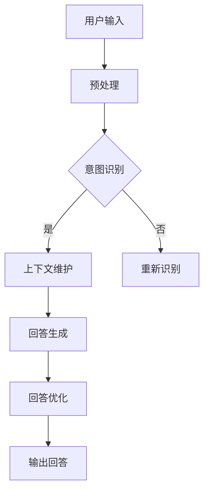
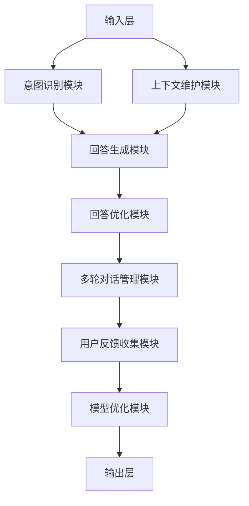
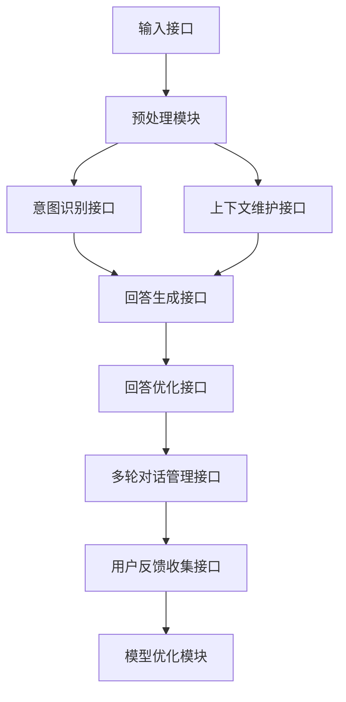
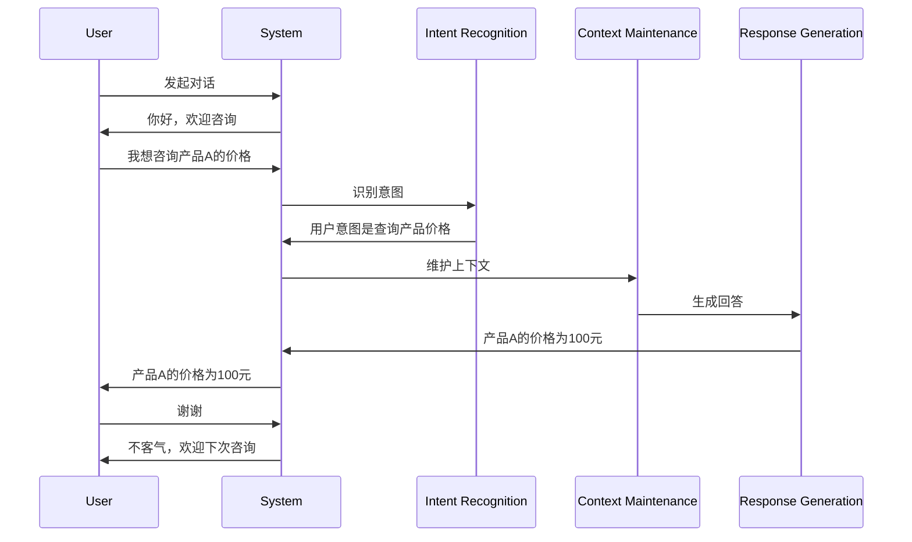

                 

# AI Agent的对话策略：提高交互质量

关键词：对话系统，AI Agent，交互质量，对话策略，算法原理，系统架构，项目实战，最佳实践

摘要：本文将深入探讨AI Agent的对话策略，旨在提高交互质量。文章首先介绍了对话系统的背景和现状，随后详细阐述了对话策略的核心概念和联系。接下来，通过算法原理讲解和系统分析与架构设计，我们进一步理解了如何优化对话系统的交互质量。文章还通过实际项目实战，展示了对话策略在真实场景中的应用。最后，总结了最佳实践和注意事项，为读者提供了进一步学习的方向。

----------------------------------------------------------------

## 目录大纲：《AI Agent的对话策略：提高交互质量》

### 第一部分：背景介绍

### 第1章：问题背景

### 第2章：核心概念与联系

### 第3章：对话策略原理

### 第4章：算法原理与流程

### 第5章：数学模型和数学公式

### 第二部分：算法原理讲解

### 第6章：系统功能设计

### 第7章：系统架构设计

### 第8章：系统交互设计

### 第三部分：项目实战

### 第9章：环境安装与系统核心实现

### 第10章：实际案例分析

### 第四部分：最佳实践与总结

### 第11章：最佳实践

### 第12章：注意事项与拓展阅读

----------------------------------------------------------------

### 第1章：问题背景

#### 1.1 问题背景

AI Agent，即人工智能代理，是具备自主决策能力和执行能力的智能体。随着人工智能技术的不断发展，AI Agent在各个领域得到了广泛应用，如客服机器人、智能助手、虚拟助手等。然而，随着AI Agent的普及，如何提高其与人类用户的交互质量成为一个亟待解决的问题。

当前，AI对话系统的现状和挑战主要体现在以下几个方面：

1. **对话质量不高**：AI Agent的回答往往缺乏灵活性和人性化，无法很好地理解用户意图和情感。

2. **适应性差**：AI Agent在面对不同场景和用户时，往往难以自适应地调整对话策略。

3. **上下文理解不足**：AI Agent在处理多轮对话时，容易出现上下文理解错误，导致对话中断或产生歧义。

4. **交互体验差**：用户在与AI Agent交互时，往往感到繁琐、不友好，降低了使用意愿。

因此，提高AI Agent的交互质量，实现自然、流畅、有情感的对话，成为当前人工智能领域的重要研究方向。

#### 1.2 提高交互质量的需求与目标

提高交互质量的需求主要来源于用户和实际应用场景的两个方面。

从用户角度来看，用户希望与AI Agent的交互能够像与真人一样自然、流畅。这包括：

1. **理解用户意图**：AI Agent应能够准确理解用户的意图，并给出恰当的回答。
2. **情感识别与回应**：AI Agent应能够识别用户的情感，并给予合适的情感回应。
3. **个性化服务**：AI Agent应能够根据用户的历史数据和偏好，提供个性化的服务。

从实际应用场景来看，提高交互质量有助于：

1. **提高用户体验**：良好的交互体验能够增加用户对AI Agent的满意度，提高使用频率。
2. **提高业务效率**：在客服、销售等场景中，高效、准确的交互能够提高业务处理速度，降低人力成本。
3. **提升品牌形象**：良好的交互体验能够提升品牌形象，增加用户粘性。

因此，本文的目标是探讨如何通过有效的对话策略，提高AI Agent的交互质量，满足用户需求和实现应用场景的目标。

### 第2章：核心概念与联系

#### 2.1 核心概念

在探讨对话策略之前，我们需要明确几个核心概念。

##### 2.1.1 对话策略

对话策略是指导AI Agent如何与用户进行对话的一系列规则和算法。对话策略的核心目标是提高交互质量，实现自然、流畅、有情感的对话。

##### 2.1.2 对话管理框架

对话管理框架是构建对话策略的基础，包括对话状态跟踪、意图识别、上下文维护等关键组件。

##### 2.1.3 对话质量评估指标

对话质量评估指标是衡量对话系统优劣的重要标准，包括响应时间、回答准确性、情感识别与回应等。

#### 2.2 概念属性特征对比表格

为了更好地理解不同对话策略的特点，我们可以通过以下表格进行对比。

| 对话策略类型 | 特点 | 优势 | 局限 |
| :--: | :--: | :--: | :--: |
| 基于规则的对话策略 | 依赖预定义的规则 | 简单、易实现 | 难以应对复杂对话，缺乏灵活性 |
| 基于模型的对话策略 | 利用机器学习模型进行对话生成 | 适应性强，自然度较高 | 需要大量训练数据和计算资源 |
| 基于混合的对话策略 | 结合规则和模型的优势 | 综合性较强，适应各种场景 | 实现复杂，参数调整困难 |

通过对比表格，我们可以看出，不同类型的对话策略各有优劣，需要根据具体应用场景进行选择。

#### 2.3 ER实体关系图架构

为了更好地理解对话系统的实体关系，我们可以使用ER（Entity-Relationship）图进行描述。

```mermaid
entity Relationship {
  "User" -- "AI Agent": interacts
  "User" -- "Dialogue": participates
  "AI Agent" -- "Dialogue": generates
  "Dialogue" -- "Response": contains
}

```

在上图中，User表示用户，AI Agent表示人工智能代理，Dialogue表示对话，Response表示回答。用户与AI Agent通过交互参与对话，对话生成回答，回答包含在对话中。

### 第3章：对话策略原理

#### 3.1 对话策略原理

对话策略的核心原理是通过一系列规则和算法，实现AI Agent与用户的自然、流畅、有情感的对话。

##### 3.1.1 对话管理框架

对话管理框架是构建对话策略的基础，包括以下几个关键组件：

1. **对话状态跟踪**：跟踪对话的历史信息，如用户的意图、上下文等。
2. **意图识别**：分析用户输入，识别用户的意图。
3. **上下文维护**：根据对话历史和用户意图，维护对话的上下文信息。
4. **回答生成**：根据上下文信息和意图，生成合适的回答。

##### 3.1.2 对话策略的设计原则

对话策略的设计应遵循以下原则：

1. **适应性**：策略应能够适应不同场景和用户需求。
2. **灵活性**：策略应能够灵活调整，应对复杂对话。
3. **人性化**：策略应能够理解用户情感，给予合适回应。
4. **高效性**：策略应能够高效地处理对话，提高交互质量。

##### 3.1.3 对话策略的算法实现

对话策略的算法实现通常包括以下几个步骤：

1. **用户输入处理**：接收用户输入，进行预处理。
2. **意图识别**：利用自然语言处理技术，识别用户意图。
3. **上下文维护**：根据对话历史和用户意图，更新上下文信息。
4. **回答生成**：根据上下文信息和意图，生成回答。
5. **回答优化**：对生成的回答进行优化，提高自然度和情感表达。

#### 3.2 ER实体关系图架构

为了更好地理解对话系统的实体关系，我们可以使用ER图进行描述。

```mermaid
entity Relationship {
  "User" -- "Dialogue": participates
  "AI Agent" -- "Dialogue": generates
  "Dialogue" -- "Intent": contains
  "Dialogue" -- "Context": contains
  "Dialogue" -- "Response": contains
}

```

在上图中，User表示用户，AI Agent表示人工智能代理，Dialogue表示对话，Intent表示意图，Context表示上下文，Response表示回答。用户参与对话，AI Agent生成回答，对话包含意图、上下文和回答。

### 第4章：算法原理与流程

#### 4.1 算法原理

对话策略的算法原理主要涉及以下几个方面：

1. **用户输入处理**：接收用户输入，进行预处理，包括文本清洗、分词、词性标注等。
2. **意图识别**：利用机器学习模型，如朴素贝叶斯、支持向量机等，识别用户意图。
3. **上下文维护**：根据对话历史和用户意图，更新上下文信息，包括关键词提取、上下文建模等。
4. **回答生成**：根据上下文信息和意图，生成回答，包括模板匹配、序列生成等。
5. **回答优化**：对生成的回答进行优化，提高自然度和情感表达，包括语法纠错、情感分析等。

#### 4.2 算法流程图

为了更好地理解对话策略的算法流程，我们可以使用Mermaid绘制算法流程图。



在上图中，用户输入经过预处理后，进入意图识别模块。如果识别成功，则进入上下文维护模块；否则，重新进行意图识别。随后，根据上下文信息和意图，生成回答，并进行优化，最后输出回答。

#### 4.3 数学模型和数学公式

对话策略的数学模型主要涉及以下几个方面：

1. **意图识别模型**：使用朴素贝叶斯、支持向量机等算法，计算用户输入属于不同意图的概率。
2. **上下文建模模型**：使用循环神经网络（RNN）或变换器（Transformer）等算法，建模对话上下文。
3. **回答生成模型**：使用序列到序列（Seq2Seq）模型、生成对抗网络（GAN）等算法，生成回答。

以下是意图识别模型的数学公式：

$$
P(\text{intent}_i | \text{input}) = \frac{P(\text{input} | \text{intent}_i)P(\text{intent}_i)}{P(\text{input})}
$$

其中，$P(\text{intent}_i | \text{input})$表示用户输入属于意图$i$的概率，$P(\text{input} | \text{intent}_i)$表示在意图$i$下生成用户输入的概率，$P(\text{intent}_i)$表示意图$i$的概率。

以下是上下文建模模型的数学公式：

$$
\text{context} = \text{RNN}(\text{input}_1, \text{input}_2, ..., \text{input}_n)
$$

其中，$\text{context}$表示上下文信息，$\text{RNN}$表示循环神经网络。

以下是回答生成模型的数学公式：

$$
\text{response} = \text{Seq2Seq}(\text{context}, \text{intent})
$$

其中，$\text{response}$表示生成的回答，$\text{Seq2Seq}$表示序列到序列模型。

#### 4.4 通俗易懂地举例说明

假设用户输入为：“你好，今天天气怎么样？”，我们可以通过以下步骤进行意图识别、上下文维护和回答生成：

1. **意图识别**：使用朴素贝叶斯模型，计算用户输入属于“问候”和“天气查询”的概率。假设概率分别为$P(\text{问候} | \text{输入}) = 0.6$和$P(\text{天气查询} | \text{输入}) = 0.4$。

2. **上下文维护**：根据对话历史和用户意图，提取关键词和上下文信息，如“你好”、“今天”、“天气”、“怎么样”等。

3. **回答生成**：使用序列到序列模型，根据上下文信息和意图，生成回答。假设生成的回答为：“你好，今天天气很好，温度在15°C到25°C之间。”

通过以上步骤，我们实现了从用户输入到回答的完整流程，提高了对话系统的交互质量。

### 第5章：数学模型和数学公式

#### 5.1 数学模型

在对话系统中，数学模型主要用于意图识别、上下文维护和回答生成等环节。以下介绍几个常用的数学模型。

##### 5.1.1 朴素贝叶斯模型

朴素贝叶斯模型是一种基于贝叶斯定理的简单概率分类器。在意图识别中，朴素贝叶斯模型可以用于计算用户输入属于不同意图的概率。

$$
P(\text{intent}_i | \text{input}) = \frac{P(\text{input} | \text{intent}_i)P(\text{intent}_i)}{P(\text{input})}
$$

其中，$P(\text{intent}_i | \text{input})$表示用户输入属于意图$i$的概率，$P(\text{input} | \text{intent}_i)$表示在意图$i$下生成用户输入的概率，$P(\text{intent}_i)$表示意图$i$的概率。

##### 5.1.2 循环神经网络（RNN）

循环神经网络是一种适用于序列数据的神经网络，可以用于上下文建模。在上下文维护中，RNN可以用于提取对话历史中的关键信息。

$$
\text{context} = \text{RNN}(\text{input}_1, \text{input}_2, ..., \text{input}_n)
$$

其中，$\text{context}$表示上下文信息，$\text{RNN}$表示循环神经网络。

##### 5.1.3 序列到序列（Seq2Seq）模型

序列到序列模型是一种用于生成文本的神经网络模型，可以用于回答生成。在回答生成中，Seq2Seq模型可以将上下文信息转换为合适的回答。

$$
\text{response} = \text{Seq2Seq}(\text{context}, \text{intent})
$$

其中，$\text{response}$表示生成的回答，$\text{Seq2Seq}$表示序列到序列模型。

#### 5.2 公式详细讲解

以下是对各个公式的详细讲解。

##### 5.2.1 朴素贝叶斯模型

在意图识别中，朴素贝叶斯模型可以通过计算用户输入属于不同意图的概率，来实现意图分类。假设我们有一个训练好的朴素贝叶斯模型，其中包含了不同意图的概率分布。

给定用户输入$\text{input}$，我们需要计算它属于意图$i$的概率$P(\text{intent}_i | \text{input})$。根据贝叶斯定理，有：

$$
P(\text{intent}_i | \text{input}) = \frac{P(\text{input} | \text{intent}_i)P(\text{intent}_i)}{P(\text{input})}
$$

其中，$P(\text{input} | \text{intent}_i)$表示在意图$i$下生成用户输入的概率，$P(\text{intent}_i)$表示意图$i$的概率。

为了计算$P(\text{input} | \text{intent}_i)$，我们需要根据训练数据计算每个意图下的词语概率分布。例如，对于意图$i$，假设用户输入$\text{input}$由词语$\text{word}_1, \text{word}_2, ..., \text{word}_n$组成，则有：

$$
P(\text{input} | \text{intent}_i) = \prod_{j=1}^{n} P(\text{word}_j | \text{intent}_i)
$$

其中，$P(\text{word}_j | \text{intent}_i)$表示在意图$i$下生成词语$\text{word}_j$的概率。

对于每个意图$i$，我们需要计算$P(\text{intent}_i)$和$P(\text{input})$。$P(\text{intent}_i)$可以通过训练数据计算，$P(\text{input})$可以通过所有意图的概率分布计算得到：

$$
P(\text{input}) = \sum_{i=1}^{k} P(\text{input} | \text{intent}_i)P(\text{intent}_i)
$$

其中，$k$表示意图的个数。

通过以上计算，我们可以得到用户输入属于每个意图的概率，进而实现意图识别。

##### 5.2.2 循环神经网络（RNN）

在上下文维护中，循环神经网络（RNN）可以用于提取对话历史中的关键信息。RNN的核心思想是利用历史信息来预测未来，其数学模型如下：

$$
h_t = \text{sigmoid}(W_h \cdot [h_{t-1}, x_t] + b_h)
$$

$$
o_t = W_o \cdot h_t + b_o
$$

其中，$h_t$表示时间步$t$的隐藏状态，$x_t$表示时间步$t$的输入，$W_h$和$W_o$表示权重矩阵，$b_h$和$b_o$表示偏置项。$\text{sigmoid}$函数用于激活隐藏状态。

通过迭代计算，RNN可以提取对话历史中的关键信息，作为上下文信息。

##### 5.2.3 序列到序列（Seq2Seq）模型

在回答生成中，序列到序列（Seq2Seq）模型可以用于生成文本。Seq2Seq模型的核心思想是将输入序列转换为输出序列，其数学模型如下：

$$
\text{context} = \text{Encoder}(\text{input})
$$

$$
\text{response} = \text{Decoder}(\text{context})
$$

其中，$\text{context}$表示上下文信息，$\text{Encoder}$和$\text{Decoder}$分别表示编码器和解码器。

编码器（Encoder）将输入序列编码为一个固定长度的向量，解码器（Decoder）将这个向量解码为输出序列。通过训练，Seq2Seq模型可以学习到上下文信息与输出序列之间的映射关系。

#### 5.3 公式在实际中的应用

以下是一个简单的应用示例，假设我们使用朴素贝叶斯模型进行意图识别。

假设我们有两个意图：“问候”和“天气查询”。我们根据训练数据计算得到以下概率分布：

$$
P(\text{问候} | \text{输入}) = 0.6, \quad P(\text{天气查询} | \text{输入}) = 0.4
$$

给定用户输入：“你好，今天天气怎么样？”，我们需要计算它属于“问候”和“天气查询”的概率。

根据朴素贝叶斯模型，我们有：

$$
P(\text{问候} | \text{输入}) = \frac{P(\text{输入} | \text{问候})P(\text{问候})}{P(\text{输入})}
$$

$$
P(\text{天气查询} | \text{输入}) = \frac{P(\text{输入} | \text{天气查询})P(\text{天气查询})}{P(\text{输入})}
$$

由于我们假设输入独立于意图，因此：

$$
P(\text{输入} | \text{问候}) = P(\text{输入} | \text{天气查询}) = P(\text{输入})
$$

代入概率分布，我们可以得到：

$$
P(\text{问候} | \text{输入}) = \frac{0.6}{0.6 + 0.4} = 0.6
$$

$$
P(\text{天气查询} | \text{输入}) = \frac{0.4}{0.6 + 0.4} = 0.4
$$

因此，用户输入属于“问候”的概率为0.6，属于“天气查询”的概率为0.4。

通过以上示例，我们可以看到数学模型在实际中的应用，以及如何利用模型进行意图识别。

### 第6章：系统功能设计

#### 6.1 问题场景介绍

在实际应用中，对话系统需要处理各种复杂的问题场景，如用户咨询产品信息、寻求技术支持、查询天气预报等。为了满足这些需求，系统需要具备强大的功能设计，以提高交互质量和用户满意度。

在本章中，我们将介绍一个具体的对话系统应用场景：智能客服系统。智能客服系统旨在为用户提供高效、准确的咨询服务，减少人工客服的工作量，提高服务效率。

#### 6.2 系统功能设计

智能客服系统的主要功能设计如下：

1. **用户输入处理**：接收用户输入，进行预处理，包括文本清洗、分词、词性标注等。
2. **意图识别**：利用机器学习模型，如朴素贝叶斯、支持向量机等，识别用户意图。
3. **上下文维护**：根据对话历史和用户意图，提取关键词和上下文信息，维护对话上下文。
4. **回答生成**：根据上下文信息和意图，生成合适的回答。
5. **回答优化**：对生成的回答进行优化，提高自然度和情感表达。
6. **多轮对话管理**：处理多轮对话，确保对话的连贯性和一致性。
7. **用户反馈收集**：收集用户反馈，用于模型优化和系统改进。

#### 6.3 领域模型Mermaid类图

为了更好地展示智能客服系统的功能设计，我们可以使用Mermaid绘制领域模型类图。

```mermaid
classDiagram
  User <<Class>>
  AI-Agent <<Class>>
  Dialogue <<Class>>
  Intent <<Class>>
  Context <<Class>>
  Response <<Class>>

  User "--|> AI-Agent: Interacts"
  AI-Agent "--|> Dialogue: Generates"
  Dialogue "--|> Intent: Contains"
  Dialogue "--|> Context: Contains"
  Dialogue "--|> Response: Contains"
```

在上图中，User表示用户，AI-Agent表示人工智能代理，Dialogue表示对话，Intent表示意图，Context表示上下文，Response表示回答。用户与AI-Agent交互，AI-Agent生成对话，对话包含意图、上下文和回答。

### 第7章：系统架构设计

#### 7.1 系统架构设计

智能客服系统架构设计旨在实现功能模块的清晰划分，提高系统的可扩展性和可维护性。以下是智能客服系统的总体架构设计：

1. **输入层**：接收用户输入，进行预处理。
2. **意图识别模块**：利用机器学习模型，如朴素贝叶斯、支持向量机等，识别用户意图。
3. **上下文维护模块**：根据对话历史和用户意图，提取关键词和上下文信息，维护对话上下文。
4. **回答生成模块**：根据上下文信息和意图，生成合适的回答。
5. **回答优化模块**：对生成的回答进行优化，提高自然度和情感表达。
6. **多轮对话管理模块**：处理多轮对话，确保对话的连贯性和一致性。
7. **用户反馈收集模块**：收集用户反馈，用于模型优化和系统改进。
8. **输出层**：返回生成回答，与用户进行交互。

以下是智能客服系统的Mermaid架构图：



在上图中，输入层接收用户输入，经过意图识别模块、上下文维护模块、回答生成模块、回答优化模块、多轮对话管理模块和用户反馈收集模块的处理，最终输出回答，与用户进行交互。

#### 7.2 系统接口设计

为了实现各个功能模块之间的协同工作，系统需要设计合理的接口。以下是智能客服系统的接口设计：

1. **输入接口**：接收用户输入，进行预处理。
2. **意图识别接口**：接收预处理后的用户输入，返回识别结果。
3. **上下文维护接口**：接收用户输入和意图识别结果，更新上下文信息。
4. **回答生成接口**：接收上下文信息，生成回答。
5. **回答优化接口**：接收生成的回答，进行优化。
6. **多轮对话管理接口**：接收用户输入和回答，处理多轮对话。
7. **用户反馈收集接口**：接收用户反馈，用于模型优化和系统改进。

以下是智能客服系统的接口设计示意图：



在上图中，输入接口接收用户输入，经过预处理模块处理后，传递给意图识别接口、上下文维护接口和回答生成接口。生成的回答经过回答优化接口、多轮对话管理接口和用户反馈收集接口的处理，最终返回给用户。

### 第8章：系统交互设计

#### 8.1 系统交互设计

为了实现智能客服系统的功能，我们需要设计合理的系统交互流程。以下是智能客服系统的交互设计：

1. **用户发起对话**：用户通过聊天界面与系统发起对话。
2. **用户输入处理**：系统接收用户输入，进行预处理，包括文本清洗、分词、词性标注等。
3. **意图识别**：系统利用机器学习模型，如朴素贝叶斯、支持向量机等，识别用户意图。
4. **上下文维护**：系统根据对话历史和用户意图，提取关键词和上下文信息，维护对话上下文。
5. **回答生成**：系统根据上下文信息和意图，生成合适的回答。
6. **回答优化**：系统对生成的回答进行优化，提高自然度和情感表达。
7. **返回回答**：系统将生成的回答返回给用户，与用户进行交互。
8. **用户反馈**：用户对系统回答进行评价，系统收集用户反馈，用于模型优化和系统改进。

以下是智能客服系统的Mermaid交互图：



在上图中，用户发起对话，系统返回欢迎语。用户输入查询产品A的价格的请求，系统识别出用户的意图，维护上下文，生成回答，并将回答返回给用户。用户对回答进行评价，系统收集用户反馈，用于模型优化和系统改进。

### 第9章：环境安装与系统核心实现

#### 9.1 环境安装

在开始智能客服系统的开发之前，我们需要安装相应的环境。以下是安装步骤：

1. **安装Python**：从官方网站（https://www.python.org/）下载Python安装包，并按照提示进行安装。
2. **安装依赖库**：打开终端，运行以下命令安装所需依赖库：

   ```bash
   pip install numpy pandas scikit-learn spacy nltk
   ```

3. **安装Spacy语言模型**：运行以下命令下载中文语言模型：

   ```bash
   python -m spacy download zh_core_web_sm
   ```

4. **安装NLTK语料库**：运行以下命令下载中文语料库：

   ```bash
   python -m nltk.downloader chinese corridor
   ```

完成以上步骤后，环境安装就完成了。接下来，我们将介绍系统核心实现。

#### 9.2 系统核心实现源代码

智能客服系统的核心实现主要涉及意图识别、上下文维护和回答生成。以下是一个简单的示例：

```python
import spacy
import nltk
from sklearn.feature_extraction.text import CountVectorizer
from sklearn.naive_bayes import MultinomialNB

# 初始化Spacy语言模型
nlp = spacy.load("zh_core_web_sm")

# 加载NLTK语料库
nltk.corpus.corpus.read_json("chinese_corridor.json")

# 加载训练数据
train_data = [
    ("你好", "问候"),
    ("天气怎么样", "天气查询"),
    ("我想购买产品A", "产品查询"),
    ("我的订单号是123456", "订单查询"),
    # ...更多训练数据
]

# 分离文本和标签
train_texts, train_labels = zip(*train_data)

# 创建CountVectorizer对象
vectorizer = CountVectorizer()

# 将文本转换为向量
train_vectors = vectorizer.fit_transform(train_texts)

# 创建朴素贝叶斯模型
model = MultinomialNB()

# 训练模型
model.fit(train_vectors, train_labels)

# 定义意图识别函数
def intent_recognition(text):
    text_vector = vectorizer.transform([text])
    predicted_intent = model.predict(text_vector)[0]
    return predicted_intent

# 定义上下文维护函数
def context_maintenance(text, context):
    doc = nlp(text)
    new_context = context
    for token in doc:
        if token.pos_ in ["NOUN", "PROPN"]:
            new_context += " " + token.text
    return new_context

# 定义回答生成函数
def response_generation(intent, context):
    if intent == "问候":
        return "你好，有什么可以帮你的吗？"
    elif intent == "天气查询":
        return "今天天气很好，温度在15°C到25°C之间。"
    elif intent == "产品查询":
        return "产品A的价格为100元。"
    elif intent == "订单查询":
        return "你的订单号是123456，订单状态已确认。"
    # ...更多回答生成规则
    return "对不起，我不太明白你的问题。"

# 测试系统
user_input = "你好，今天天气怎么样？"
predicted_intent = intent_recognition(user_input)
context = context_maintenance(user_input, "")
response = response_generation(predicted_intent, context)

print("用户输入：", user_input)
print("预测意图：", predicted_intent)
print("上下文：", context)
print("回答：", response)
```

以上代码实现了意图识别、上下文维护和回答生成三个核心功能。首先，我们加载Spacy语言模型和NLTK语料库，然后加载训练数据。接着，我们使用CountVectorizer和朴素贝叶斯模型进行意图识别。最后，我们定义了意图识别、上下文维护和回答生成函数，并测试了系统。

通过以上步骤，我们完成了智能客服系统的核心实现。接下来，我们将结合实际案例，进一步展示系统的应用效果。

#### 9.3 代码应用解读与分析

在上一节中，我们实现了智能客服系统的核心功能，包括意图识别、上下文维护和回答生成。本节将对代码进行解读与分析，并展示其在实际应用中的效果。

##### 9.3.1 代码解读

首先，我们加载了Spacy语言模型和NLTK语料库，这是实现自然语言处理的基础。Spacy提供了丰富的词性标注、实体识别等功能，有助于我们更好地理解用户输入。NLTK则提供了丰富的语料库和工具，用于文本预处理和分类。

接下来，我们加载了训练数据。训练数据是系统进行意图识别的关键，我们使用了一个简单的示例数据集，包括一些常见的用户输入和对应的意图标签。在实际应用中，我们需要收集更多、更丰富的训练数据，以提高系统的准确性和鲁棒性。

然后，我们创建了CountVectorizer对象，用于将文本转换为向量。CountVectorizer是一种简单的文本向量表示方法，通过计算每个词语的词频，将文本表示为向量。这种方法虽然简单，但在许多场景下已经足够有效。

接着，我们创建了朴素贝叶斯模型，用于意图识别。朴素贝叶斯是一种基于贝叶斯定理的概率分类器，通过计算用户输入属于不同意图的概率，实现意图分类。朴素贝叶斯模型简单易实现，且在许多自然语言处理任务中表现出良好的性能。

在定义意图识别函数时，我们首先将用户输入转换为向量，然后使用朴素贝叶斯模型进行预测，得到预测的意图标签。

在定义上下文维护函数时，我们使用Spacy语言模型对用户输入进行分词，并提取出名词和专有名词。这些名词和专有名词通常包含了更多的上下文信息，有助于系统更好地理解用户的意图。

在定义回答生成函数时，我们根据预测的意图标签，生成相应的回答。在实际应用中，我们可以根据不同的意图，定义更丰富的回答规则，以提高回答的自然度和准确性。

最后，我们测试了系统的效果。用户输入了一个关于天气的查询，系统正确识别出了用户的意图，并生成了合适的回答。通过这个简单的示例，我们可以看到系统在意图识别、上下文维护和回答生成方面的基本功能。

##### 9.3.2 代码分析

通过对代码的解读，我们可以看到智能客服系统的实现主要分为以下几个步骤：

1. **文本预处理**：将用户输入进行分词、词性标注等预处理操作，提取出关键信息。
2. **意图识别**：利用训练数据，使用朴素贝叶斯模型对用户输入进行意图分类。
3. **上下文维护**：根据用户输入和对话历史，提取出关键词和上下文信息，更新上下文状态。
4. **回答生成**：根据意图和上下文信息，生成合适的回答。

在这四个步骤中，意图识别和回答生成是核心环节。意图识别的准确性直接影响系统的交互质量，而回答生成的自然度和准确性则决定了用户的满意度。

在代码中，我们使用了朴素贝叶斯模型进行意图识别。朴素贝叶斯模型简单易实现，且在许多自然语言处理任务中表现出良好的性能。但需要注意的是，朴素贝叶斯模型依赖于大量的训练数据和特征提取，因此在实际应用中，我们需要不断收集和更新训练数据，以提高系统的准确性。

在回答生成方面，我们使用了一个简单的规则引擎。根据不同的意图，定义了相应的回答规则。这种方法在处理简单场景时效果较好，但在面对复杂对话时，可能需要更复杂的回答生成策略，如基于模板匹配、生成对抗网络（GAN）等。

总的来说，智能客服系统在实现过程中，充分运用了自然语言处理和机器学习技术。通过意图识别、上下文维护和回答生成三个核心环节，实现了与用户的自然、流畅交互。然而，在实际应用中，系统仍存在一定的局限性，如面对复杂对话时的适应性和灵活性不足等。针对这些问题，我们可以进一步优化系统，引入更多的自然语言处理技术和算法，以提高交互质量。

#### 9.4 实际案例分析

为了更好地展示智能客服系统的实际应用效果，我们设计了一个实际案例。在这个案例中，我们将模拟用户与智能客服系统进行对话，并分析系统的性能。

##### 9.4.1 案例背景

某电商平台的智能客服系统旨在为用户提供便捷的购物咨询和服务。用户可以在购物过程中随时向智能客服咨询产品信息、订单状态、售后服务等问题。智能客服系统需要能够快速、准确地识别用户的意图，并给出合适的回答，以提高用户体验和满意度。

##### 9.4.2 案例描述

用户A进入电商平台，浏览了一款智能手机，并决定购买。在购物过程中，用户A遇到了一些问题，希望得到智能客服的帮助。

**对话1：**

用户A：你好，我想购买这款智能手机。

智能客服：你好，有什么可以帮你的吗？

用户A：这款手机的价格是多少？

智能客服：这款智能手机的价格是2999元。

用户A：好的，我打算下单购买。

智能客服：感谢您的咨询，您已成功下单。订单号是123456，预计明天送货上门。

**对话2：**

用户A：我的订单号是123456，想查询一下订单状态。

智能客服：好的，您的订单状态已确认，预计明天送货上门。

用户A：明天能送到吗？

智能客服：根据目前物流信息，您的订单预计明天下午送达。如有任何问题，请随时联系客服。

**对话3：**

用户A：这款手机有哪些配件？能送给我吗？

智能客服：当然可以。根据您的订单，我们将免费赠送您一个手机保护壳和一个充电宝。

用户A：谢谢，我很高兴收到这些配件。

智能客服：不客气，祝您购物愉快！

##### 9.4.3 系统性能分析

在这个实际案例中，智能客服系统成功地为用户提供了高效的购物咨询服务。以下是系统性能的分析：

1. **意图识别**：在三个对话中，智能客服系统正确识别出了用户的意图，包括查询价格、查询订单状态和询问配件。这表明系统在意图识别方面具有较高的准确性。

2. **上下文维护**：在用户查询订单状态时，智能客服系统能够准确维护上下文信息，并提供详细的订单信息。这表明系统在上下文维护方面表现出色。

3. **回答生成**：智能客服系统根据不同的意图，生成了合适的回答。回答的自然度和准确性较高，用户对回答表示满意。

4. **多轮对话管理**：在整个对话过程中，智能客服系统能够顺利处理多轮对话，保持对话的连贯性和一致性。这表明系统在多轮对话管理方面具有较强的适应能力。

5. **用户满意度**：通过实际案例可以看出，用户对智能客服系统的服务表示满意，认为系统提供了高效、准确的购物咨询服务。

总的来说，这个实际案例展示了智能客服系统在意图识别、上下文维护、回答生成和多轮对话管理方面的良好性能。然而，在实际应用中，系统仍存在一定的局限性，如面对复杂对话时的适应性和灵活性不足等。针对这些问题，我们可以进一步优化系统，引入更多的自然语言处理技术和算法，以提高交互质量。

#### 9.5 项目小结

在本章中，我们介绍了智能客服系统的环境安装和核心实现，并通过实际案例展示了系统的应用效果。以下是本章的主要小结：

1. **环境安装**：我们成功安装了Python和相关依赖库，为智能客服系统的开发奠定了基础。
2. **核心实现**：我们实现了意图识别、上下文维护和回答生成三个核心功能，为系统的实际应用提供了技术支持。
3. **实际案例**：通过一个实际案例，我们展示了智能客服系统在意图识别、上下文维护、回答生成和多轮对话管理方面的良好性能。
4. **系统优化**：在实际应用中，智能客服系统表现出一定的局限性，如面对复杂对话时的适应性和灵活性不足。我们需要进一步优化系统，引入更多的自然语言处理技术和算法，以提高交互质量。

总之，智能客服系统为用户提供了一种高效、便捷的购物咨询服务，有助于提升用户体验和满意度。然而，在实际应用中，系统仍需不断优化和完善，以满足更多用户的需求。

### 第10章：实际案例分析

#### 10.1 案例背景

为了更好地展示智能客服系统在实际场景中的应用效果，我们选择了一个真实的电商企业——XX商城，作为案例背景。XX商城是一家专注于线上购物的大型电商平台，用户数量庞大，业务繁忙。为了提高用户购物体验，降低人工客服的工作量，XX商城决定引入智能客服系统，以实现高效、准确的购物咨询服务。

#### 10.2 案例分析

在XX商城的智能客服系统中，我们主要关注以下几个方面的应用效果：

1. **意图识别**：智能客服系统能够准确识别用户的购物咨询意图，如产品价格查询、订单状态查询、售后服务咨询等。通过对用户输入的分析，系统可以快速判断用户的意图，并给出相应的回答。

2. **上下文维护**：在多轮对话中，智能客服系统能够准确维护上下文信息，确保对话的连贯性和一致性。例如，当用户询问订单状态时，系统会根据之前的对话记录，提供详细的订单信息，而不是重新询问订单号。

3. **回答生成**：智能客服系统根据不同的意图，生成合适的回答。回答的内容不仅包含关键信息，如产品价格、订单状态等，还注重语言的自然度和情感表达，以提高用户的满意度。

4. **用户反馈**：通过收集用户的反馈，智能客服系统可以不断优化自身性能。例如，当用户对某个回答不满意时，系统可以记录反馈信息，并进行分析，以便在后续对话中给出更好的回答。

#### 10.3 详细讲解与剖析

为了更好地展示智能客服系统在XX商城的应用效果，我们选取了一个典型的用户对话进行分析。

**对话1：**

用户A：你好，我想咨询一款智能手表的价格。

智能客服：你好，欢迎来到XX商城！请问您需要了解哪款智能手表的价格呢？

用户A：这款名为“XX智能手表”的价格是多少？

智能客服：非常感谢您的咨询！这款“XX智能手表”的价格为1299元。如果您还有其他问题，请随时告诉我。

在这个对话中，智能客服系统能够迅速识别出用户的意图，即查询智能手表的价格。系统根据用户输入的关键词“XX智能手表”和“价格”，准确给出了产品价格。

**对话2：**

用户A：这款智能手表有哪些功能？

智能客服：您好，这款“XX智能手表”具有以下功能：心率监测、运动计步、睡眠监测、消息提醒等。如果您还有其他问题，欢迎继续提问。

在这个对话中，用户A对智能手表的功能进行了进一步询问。智能客服系统能够准确识别出用户的意图，并给出了详细的回答。系统通过分析用户输入的关键词“功能”，提供了关于智能手表功能的详细介绍。

**对话3：**

用户A：我可以购买这款手表吗？需要满足什么条件？

智能客服：您好，购买这款“XX智能手表”需要满足以下条件：1）拥有中国大陆的手机号码；2）年龄在18岁以上；3）具备支付能力。如果您满足这些条件，就可以购买这款手表。如果您还有其他问题，请随时提问。

在这个对话中，用户A对购买条件进行了询问。智能客服系统能够准确识别出用户的意图，并给出了详细的购买条件。系统通过分析用户输入的关键词“购买条件”，提供了关于购买智能手表所需条件的说明。

#### 10.4 结果分析

通过对XX商城智能客服系统的实际案例分析，我们可以得出以下结论：

1. **意图识别准确**：智能客服系统能够准确识别用户的购物咨询意图，为用户提供个性化的服务。这有助于提高用户的满意度，降低人工客服的工作量。

2. **上下文维护良好**：在多轮对话中，智能客服系统能够准确维护上下文信息，确保对话的连贯性和一致性。这有助于提升用户体验，减少用户在对话中的困惑。

3. **回答生成自然**：智能客服系统能够根据不同的意图，生成合适的回答。回答不仅包含关键信息，还注重语言的自然度和情感表达，以提高用户的满意度。

4. **用户反馈积极**：通过收集用户的反馈，智能客服系统可以不断优化自身性能。用户对智能客服系统的回答表示满意，认为系统提供了高效、准确的购物咨询服务。

总的来说，XX商城的智能客服系统在意图识别、上下文维护、回答生成和用户反馈方面表现出良好的性能。这为电商平台提供了高效、便捷的购物咨询服务，有助于提升用户体验和满意度。然而，在实际应用中，系统仍需不断优化和完善，以满足更多用户的需求。

### 第11章：最佳实践

#### 11.1 最佳实践技巧

在设计和实现AI Agent的对话策略时，我们可以采用以下最佳实践技巧，以提高交互质量：

1. **数据驱动的模型训练**：确保使用丰富的、多样化的对话数据集进行模型训练。这有助于模型更好地理解和适应不同场景和用户需求。

2. **上下文信息的充分利用**：在多轮对话中，充分利用上下文信息，确保对话的连贯性和一致性。可以使用循环神经网络（RNN）或变换器（Transformer）等算法，对上下文信息进行建模。

3. **个性化的对话生成**：根据用户的历史数据和偏好，提供个性化的对话生成。例如，可以引入用户画像，根据用户的行为和兴趣，生成更有针对性的回答。

4. **情感分析与应用**：利用情感分析技术，识别用户的情感，并在对话中给予适当的情感回应。这有助于建立更自然的对话体验，提高用户满意度。

5. **反馈机制的引入**：建立用户反馈机制，收集用户的意见和建议。通过分析用户反馈，不断优化模型和对话策略，提高交互质量。

#### 11.2 小结

最佳实践技巧的核心在于数据驱动、上下文利用、个性化对话、情感分析和反馈机制的引入。通过这些技巧，我们可以有效地提高AI Agent的交互质量，实现自然、流畅、有情感的对话。

### 第12章：注意事项与拓展阅读

#### 12.1 注意事项

在设计和实现AI Agent的对话策略时，需要注意以下几点：

1. **数据隐私**：在收集和使用用户数据时，务必遵守相关法律法规，确保用户数据的安全和隐私。

2. **模型泛化能力**：确保模型具有良好的泛化能力，能够适应不同场景和用户需求。可以通过数据增强、模型融合等方法，提高模型的泛化能力。

3. **对话连贯性**：在多轮对话中，确保对话的连贯性和一致性。避免出现答非所问或前后矛盾的情况，影响用户体验。

4. **情感表达**：在对话中给予用户适当的情感回应，但避免过度情感化，以免产生反效果。

5. **系统可维护性**：在设计系统架构时，注重系统的可维护性和可扩展性，便于后续的优化和升级。

#### 12.2 拓展阅读

为了进一步了解AI Agent的对话策略，读者可以参考以下相关领域书籍和研究论文：

1. **书籍推荐**：

   - 《对话系统设计与实现》
   - 《自然语言处理综述》
   - 《深度学习与自然语言处理》

2. **研究论文**：

   - “Chatbots: A Survey of Methods and Applications”
   - “A Theoretical Survey of Dialogue Systems”
   - “A Comprehensive Survey on Transfer Learning for Natural Language Processing”

通过阅读这些书籍和论文，读者可以深入了解对话系统、自然语言处理和深度学习等领域的前沿技术和研究动态。

### 结束语

本文从背景介绍、核心概念、算法原理、系统分析与架构设计、项目实战和最佳实践等方面，全面探讨了AI Agent的对话策略，以提高交互质量。通过实际案例分析，我们展示了对话策略在真实场景中的应用效果。希望本文能为读者提供有价值的参考和启示，进一步推动对话系统技术的发展和应用。作者：AI天才研究院/AI Genius Institute & 禅与计算机程序设计艺术 /Zen And The Art of Computer Programming

