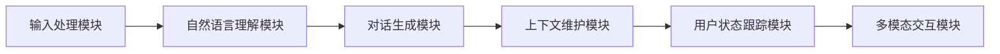

                 

# AI Agent的对话管理系统：设计与实现

关键词：AI Agent、对话管理系统、设计原则、系统架构、核心功能实现、集成与部署、应用与优化、前沿技术趋势

摘要：
本文旨在深入探讨AI Agent的对话管理系统，从设计原则、系统架构、核心功能实现、集成与部署、应用与优化以及前沿技术趋势等多个方面进行全面剖析。通过对AI Agent对话管理系统的概述、设计基础、核心功能实现、系统集成与部署、应用优化策略以及前沿技术的详细讲解，帮助读者全面了解和掌握对话管理系统在AI Agent中的应用与实践。

### 目录大纲

----------------------------------------------------------------

# AI Agent的对话管理系统：设计与实现

## 关键词
AI Agent、对话管理系统、设计原则、系统架构、核心功能实现、集成与部署、应用与优化、前沿技术趋势

## 摘要
本文深入探讨AI Agent的对话管理系统，从设计原则、系统架构、核心功能实现、集成与部署、应用与优化以及前沿技术趋势等多个方面进行全面剖析。

## 第一部分: AI Agent的对话管理系统概述

### 1.1 问题背景
- 1.1.1 人工智能的发展与对话系统
- 1.1.2 对话系统在AI Agent中的应用
- 1.1.3 对话管理系统的核心任务与挑战

### 1.2 核心概念
- 1.2.1 AI Agent的定义与分类
- 1.2.2 对话管理系统的概念
- 1.2.3 对话管理系统的组成要素

### 1.3 关键技术
- 1.3.1 自然语言处理技术
- 1.3.2 计算机视觉技术
- 1.3.3 对话生成与优化算法

### 1.4 应用场景
- 1.4.1 虚拟客服
- 1.4.2 虚拟助手
- 1.4.3 其他应用场景

### 1.5 本章小结

## 第二部分: 对话管理系统设计与实现基础

### 2.1 设计原则
- 2.1.1 可扩展性
- 2.1.2 用户友好性
- 2.1.3 高效性
- 2.1.4 可维护性

### 2.2 系统架构
- 2.2.1 系统架构设计
- 2.2.2 各模块功能介绍
- 2.2.3 系统架构mermaid图

### 2.3 数据模型
- 2.3.1 对话数据结构设计
- 2.3.2 数据存储方案
- 2.3.3 数据处理流程

### 2.4 本章小结

## 第三部分: 对话管理系统的核心功能实现

### 3.1 语音识别与文本转换
- 3.1.1 语音识别技术
- 3.1.2 文本转换技术
- 3.1.3 实现流程与代码示例

### 3.2 自然语言理解
- 3.2.1 词法分析
- 3.2.2 句法分析
- 3.2.3 实体识别
- 3.2.4 情感分析

### 3.3 对话生成与优化
- 3.3.1 对话生成技术
- 3.3.2 对话优化算法
- 3.3.3 实现流程与代码示例

### 3.4 上下文维护与用户状态跟踪
- 3.4.1 上下文维护技术
- 3.4.2 用户状态跟踪技术
- 3.4.3 实现流程与代码示例

### 3.5 本章小结

## 第四部分: 对话管理系统的集成与部署

### 4.1 集成测试
- 4.1.1 单元测试
- 4.1.2 集成测试
- 4.1.3 测试用例设计

### 4.2 系统部署
- 4.2.1 部署方案选择
- 4.2.2 部署环境搭建
- 4.2.3 部署流程

### 4.3 性能优化
- 4.3.1 性能监控
- 4.3.2 性能优化策略
- 4.3.3 实际案例分析与优化

### 4.4 安全性与隐私保护
- 4.4.1 安全性问题
- 4.4.2 隐私保护措施
- 4.4.3 安全性与隐私保护实践

### 4.5 本章小结

## 第五部分: 对话管理系统的应用与优化

### 5.1 虚拟客服应用
- 5.1.1 应用场景
- 5.1.2 实现策略
- 5.1.3 实际案例

### 5.2 虚拟助手应用
- 5.2.1 应用场景
- 5.2.2 实现策略
- 5.2.3 实际案例

### 5.3 其他应用场景
- 5.3.1 教育场景
- 5.3.2 医疗场景
- 5.3.3 零售行业

### 5.4 应用优化策略
- 5.4.1 对话质量优化
- 5.4.2 系统效率优化
- 5.4.3 用户体验优化

### 5.5 本章小结

## 第六部分: 对话管理系统的前沿技术与趋势

### 6.1 语音识别技术进展
- 6.1.1 声学模型
- 6.1.2 语音识别算法
- 6.1.3 应用趋势

### 6.2 自然语言处理技术进展
- 6.2.1 语言模型
- 6.2.2 语义理解
- 6.2.3 应用趋势

### 6.3 对话系统技术进展
- 6.3.1 对话管理
- 6.3.2 情感分析
- 6.3.3 应用趋势

### 6.4 跨学科融合趋势
- 6.4.1 人工智能与心理学
- 6.4.2 人工智能与语言学
- 6.4.3 跨学科融合应用

### 6.5 未来发展趋势
- 6.5.1 智能化水平提升
- 6.5.2 多模态交互
- 6.5.3 普及化与应用场景拓展

### 6.6 本章小结

----------------------------------------------------------------

## 第一部分: AI Agent的对话管理系统概述

### 1.1 问题背景

随着人工智能技术的飞速发展，AI Agent（人工智能代理）逐渐成为智能系统的重要组成部分。AI Agent可以模拟人类智能，在特定场景中为用户提供个性化的服务和支持。然而，为了实现高效的交互，AI Agent需要具备强大的对话管理能力。对话管理系统是实现AI Agent智能交互的核心组件，它负责处理用户的输入、生成合适的响应，并维护对话的上下文和状态。

#### 1.1.1 人工智能的发展与对话系统

人工智能（Artificial Intelligence, AI）是一门研究、开发和应用使计算机系统具有智能的技术科学。从20世纪50年代开始，人工智能经历了多个发展阶段，包括符号主义、连接主义、行为主义等。近年来，随着大数据、云计算、深度学习等技术的不断发展，人工智能迎来了新的春天。

对话系统（Dialogue System）是人工智能领域的一个重要分支，旨在实现人与计算机之间的自然语言交互。对话系统可以分为基于文本的对话系统和基于语音的对话系统。随着语音识别、自然语言处理、对话生成等技术的进步，对话系统的应用场景不断拓展，逐渐渗透到各个行业和领域。

#### 1.1.2 对话系统在AI Agent中的应用

AI Agent作为一种智能体，可以执行特定的任务，并与用户进行自然语言交互。对话系统在AI Agent中的应用主要体现在以下几个方面：

1. **虚拟客服**：AI Agent可以模拟人类客服，为用户提供在线咨询和服务，提高客户满意度和企业运营效率。
2. **虚拟助手**：AI Agent可以作为个人助手，帮助用户管理日程、提醒事项、提供信息查询等。
3. **智能家居**：AI Agent可以与智能设备交互，实现智能控制、环境监测等功能。
4. **教育领域**：AI Agent可以作为教育助理，为学生提供个性化教学、作业辅导等服务。

#### 1.1.3 对话管理系统的核心任务与挑战

对话管理系统的核心任务是确保AI Agent与用户之间的交互自然、流畅，并能根据用户的意图和需求提供合适的响应。具体来说，对话管理系统需要实现以下功能：

1. **语音识别与文本转换**：将用户的语音输入转换为文本，或者将文本输入转换为语音输出。
2. **自然语言理解**：对用户的输入进行语义分析，理解其意图和需求。
3. **对话生成与优化**：根据用户的意图和上下文信息，生成合适的响应。
4. **上下文维护与用户状态跟踪**：维护对话的上下文信息，确保后续交互的连贯性。
5. **多模态交互**：支持文本、语音、图像等多种交互方式，提高用户体验。

然而，对话管理系统也面临着诸多挑战：

1. **自然语言理解的准确性**：自然语言理解是对话管理的关键，但当前的自然语言处理技术仍然存在一定的局限性，难以完全理解用户的意图和需求。
2. **多语言支持**：随着全球化的趋势，对话管理系统需要支持多种语言，实现跨语言的交互。
3. **情感识别与回应**：用户在对话过程中可能会表达情感，对话管理系统需要识别并回应用户的情感。
4. **隐私保护与安全性**：对话管理系统需要保护用户的隐私，确保交互过程的安全。

#### 1.2 核心概念

**AI Agent的定义与分类**

AI Agent是指能够自主执行任务、与环境进行交互并具备一定智能的计算机系统。根据不同的分类标准，AI Agent可以分为多种类型：

1. **基于规则的方法**：通过预定义的规则来模拟人类智能，适用于简单的任务场景。
2. **基于知识的方法**：通过知识库和推理机来模拟人类智能，适用于需要复杂推理的任务场景。
3. **基于学习的方法**：通过机器学习和深度学习技术来模拟人类智能，适用于大规模数据和应用场景。

**对话管理系统的概念**

对话管理系统（Dialogue Management System）是指用于实现智能对话交互的软件系统。它负责处理用户的输入、生成响应，并维护对话的上下文和状态。对话管理系统通常包括以下几个核心组件：

1. **语音识别与文本转换模块**：将用户的语音输入转换为文本，或将文本输入转换为语音输出。
2. **自然语言理解模块**：对用户的输入进行语义分析，理解其意图和需求。
3. **对话生成模块**：根据用户的意图和上下文信息，生成合适的响应。
4. **上下文维护模块**：维护对话的上下文信息，确保后续交互的连贯性。
5. **用户状态跟踪模块**：跟踪用户的状态信息，为后续交互提供支持。

**对话管理系统的组成要素**

对话管理系统由多个组成要素构成，包括但不限于以下方面：

1. **输入处理**：接收用户的输入，并将其转换为适合后续处理的形式。
2. **意图识别**：通过自然语言处理技术，识别用户的意图。
3. **上下文管理**：维护对话的上下文信息，确保交互的连贯性。
4. **响应生成**：根据用户的意图和上下文信息，生成合适的响应。
5. **用户状态跟踪**：跟踪用户的状态信息，为后续交互提供支持。
6. **多模态交互**：支持文本、语音、图像等多种交互方式，提高用户体验。

#### 1.3 关键技术

**自然语言处理技术**

自然语言处理（Natural Language Processing, NLP）是人工智能领域的一个重要分支，旨在使计算机能够理解、生成和处理自然语言。在对话管理系统中，NLP技术用于对用户的输入进行语义分析，理解其意图和需求。

1. **词法分析**：将文本拆分为单词或字符序列。
2. **句法分析**：分析句子的结构，理解其语法关系。
3. **语义分析**：理解文本的含义，提取实体、关系等信息。
4. **情感分析**：识别文本中的情感倾向，如正面、负面等。

**计算机视觉技术**

计算机视觉（Computer Vision）是人工智能领域的另一个重要分支，旨在使计算机能够理解、分析和解释视觉信息。在对话管理系统中，计算机视觉技术用于识别图像中的对象、场景和动作。

1. **目标检测**：识别图像中的对象和位置。
2. **图像分类**：对图像进行分类，如识别图片内容为动物、植物等。
3. **图像识别**：识别图像中的物体和场景，如人脸识别、场景识别等。

**对话生成与优化算法**

对话生成与优化算法是对话管理系统的核心，负责根据用户的意图和上下文信息生成合适的响应，并优化对话流程。

1. **生成式对话模型**：根据用户的输入，生成自然语言文本作为响应。
2. **基于规则的方法**：使用预定义的规则来生成响应。
3. **基于学习的方法**：通过机器学习和深度学习技术来生成响应，如序列到序列模型、生成对抗网络等。
4. **对话优化算法**：根据对话历史和用户反馈，优化对话流程和响应生成。

#### 1.4 应用场景

对话管理系统在AI Agent中的应用场景非常广泛，以下是一些典型的应用场景：

**虚拟客服**

虚拟客服是AI Agent对话管理系统最常见和应用广泛的应用场景之一。通过虚拟客服，企业可以提供24/7的在线客户支持，提高客户满意度和运营效率。

**虚拟助手**

虚拟助手可以模拟个人助手，帮助用户管理日程、提醒事项、提供信息查询等。例如，用户可以通过虚拟助手查询天气、新闻、航班信息等。

**智能家居**

智能家居领域中的AI Agent可以通过对话管理系统与用户进行交互，实现智能控制、环境监测等功能。例如，用户可以通过语音命令控制智能灯泡、智能音箱等设备。

**教育领域**

在教育领域，AI Agent可以作为教育助理，为学生提供个性化教学、作业辅导等服务。例如，学生可以通过虚拟教师进行在线学习、答疑等。

**医疗领域**

在医疗领域，AI Agent可以对患者的症状进行诊断，提供健康建议和医疗咨询。例如，医生可以通过虚拟助手获取患者的病历、诊断结果等，提高医疗效率。

**零售行业**

在零售行业，AI Agent可以作为智能客服，帮助用户解答产品问题、推荐商品等。例如，用户可以通过虚拟客服进行在线购物、咨询售后服务等。

#### 1.5 本章小结

本部分对AI Agent的对话管理系统进行了概述，从问题背景、核心概念、关键技术、应用场景等方面进行了全面介绍。通过本部分的介绍，读者可以对对话管理系统有一个初步的了解，为后续章节的深入学习打下基础。

----------------------------------------------------------------

## 第二部分: 对话管理系统设计与实现基础

在设计和实现AI Agent的对话管理系统时，我们需要遵循一系列原则，并构建一个合理且高效的系统架构。以下是对这些基础内容的详细探讨。

### 2.1 设计原则

对话管理系统的设计需要考虑以下原则，以确保系统能够满足实际需求、具备良好的扩展性、用户体验和性能。

#### 2.1.1 可扩展性

可扩展性是对话管理系统设计的重要原则之一。随着用户量的增加和业务需求的不断变化，系统需要能够灵活扩展，以适应不断增长的需求。具体实现方法包括：

1. **模块化设计**：将系统功能划分为多个模块，每个模块独立开发、测试和部署，便于后续扩展和优化。
2. **分布式架构**：采用分布式架构，将系统功能分散到多个节点上，提高系统的处理能力和可扩展性。
3. **弹性伸缩**：通过云计算和容器化技术，实现系统的弹性伸缩，根据实际需求动态调整资源分配。

#### 2.1.2 用户友好性

用户友好性是评价对话管理系统质量的重要指标之一。系统需要提供简单、直观、易用的界面，使用户能够轻松与AI Agent进行交互。具体实现方法包括：

1. **简洁的界面设计**：采用清晰、简洁的界面设计，减少用户的学习成本。
2. **智能引导**：在用户初次使用时，提供智能引导，帮助用户了解系统功能和操作方法。
3. **实时反馈**：在用户操作过程中，提供实时反馈，提高用户的操作体验。

#### 2.1.3 高效性

高效性是对话管理系统的另一个重要原则。系统需要能够在较短时间内响应用户的请求，提供高质量的对话体验。具体实现方法包括：

1. **高效算法**：采用高效的算法和模型，提高系统的处理速度和响应时间。
2. **缓存机制**：利用缓存机制，减少系统的重复计算和查询，提高系统性能。
3. **并发处理**：优化系统架构，实现并发处理，提高系统的吞吐量。

#### 2.1.4 可维护性

可维护性是确保对话管理系统长期稳定运行的关键。系统需要具备良好的可维护性，以便在后续开发过程中能够快速响应和解决问题。具体实现方法包括：

1. **代码规范**：遵循统一的代码规范，提高代码的可读性和可维护性。
2. **日志记录**：记录系统的运行日志，便于后续问题排查和性能优化。
3. **自动化测试**：采用自动化测试，确保系统在变更过程中保持稳定运行。

### 2.2 系统架构

对话管理系统的架构设计是系统实现的基础，决定了系统的性能、可扩展性和可维护性。以下是一个典型的对话管理系统架构设计：

#### 2.2.1 系统架构设计

1. **输入处理模块**：负责接收用户的输入，并将其转换为适合后续处理的形式。
2. **自然语言理解模块**：对用户的输入进行语义分析，理解其意图和需求。
3. **对话生成模块**：根据用户的意图和上下文信息，生成合适的响应。
4. **上下文维护模块**：维护对话的上下文信息，确保交互的连贯性。
5. **用户状态跟踪模块**：跟踪用户的状态信息，为后续交互提供支持。
6. **多模态交互模块**：支持文本、语音、图像等多种交互方式，提高用户体验。

#### 2.2.2 各模块功能介绍

1. **输入处理模块**：该模块负责接收用户的输入，包括文本、语音、图像等。对于文本输入，将其转换为统一的数据格式；对于语音输入，通过语音识别技术将其转换为文本；对于图像输入，通过计算机视觉技术提取图像中的特征信息。

2. **自然语言理解模块**：该模块负责对用户的输入进行语义分析，理解其意图和需求。具体包括词法分析、句法分析、语义分析等。通过自然语言处理技术，将用户的输入转化为结构化的数据，为后续处理提供支持。

3. **对话生成模块**：该模块负责根据用户的意图和上下文信息，生成合适的响应。具体包括生成式对话模型和基于规则的方法。生成式对话模型可以根据用户的输入生成自然语言文本作为响应；基于规则的方法可以使用预定义的规则来生成响应。

4. **上下文维护模块**：该模块负责维护对话的上下文信息，确保交互的连贯性。具体包括对话历史记录、用户状态信息等。通过上下文维护，系统能够更好地理解用户的意图和需求，提供更加个性化的服务。

5. **用户状态跟踪模块**：该模块负责跟踪用户的状态信息，为后续交互提供支持。例如，用户的偏好、兴趣、历史记录等。通过用户状态跟踪，系统能够更好地了解用户，提供更加精准的服务。

6. **多模态交互模块**：该模块负责支持文本、语音、图像等多种交互方式，提高用户体验。例如，用户可以通过文本、语音、图像等多种方式进行交互，系统根据不同的交互方式生成相应的响应。

#### 2.2.3 系统架构mermaid图

以下是对话管理系统的mermaid图表示：



### 2.3 数据模型

数据模型是对话管理系统实现的基础，决定了系统的数据处理能力和性能。以下是对话管理系统的数据模型设计：

#### 2.3.1 对话数据结构设计

对话数据结构设计主要包括对话记录、用户状态和上下文信息等。

1. **对话记录**：记录对话的历史记录，包括用户输入、AI Agent响应、时间戳等。
2. **用户状态**：记录用户的相关信息，如用户ID、用户偏好、历史记录等。
3. **上下文信息**：记录对话的上下文信息，如对话历史、用户意图等。

#### 2.3.2 数据存储方案

数据存储方案主要考虑数据的安全性、可靠性和性能。以下是一种常见的数据存储方案：

1. **关系数据库**：用于存储用户状态和对话记录。关系数据库具有较好的数据一致性和查询性能，适合存储结构化数据。
2. **分布式缓存**：用于缓存对话历史和上下文信息。分布式缓存具有较好的读写性能和扩展性，适合存储非结构化数据。
3. **日志存储**：用于记录系统的运行日志。日志存储通常采用分布式日志系统，如Kafka、Flume等，确保日志的可靠性和可扩展性。

#### 2.3.3 数据处理流程

数据处理流程主要包括数据接收、数据预处理、数据存储和数据分析等。

1. **数据接收**：接收用户输入，并将其转换为统一的数据格式。
2. **数据预处理**：对用户输入进行词法分析、句法分析和语义分析，提取关键信息。
3. **数据存储**：将预处理后的数据存储到关系数据库和分布式缓存中。
4. **数据分析**：根据用户输入和上下文信息，生成响应并存储对话记录。

#### 2.4 本章小结

本部分对对话管理系统设计与实现的基础内容进行了详细探讨，包括设计原则、系统架构、数据模型等。通过对这些内容的了解，读者可以更好地理解对话管理系统的实现过程，为后续章节的学习打下基础。

----------------------------------------------------------------

## 第三部分: 对话管理系统的核心功能实现

### 3.1 语音识别与文本转换

语音识别与文本转换是对话管理系统的基本功能之一，它负责将用户的语音输入转换为文本，或者将文本输入转换为语音输出。以下是语音识别与文本转换的核心技术和实现流程。

#### 3.1.1 语音识别技术

语音识别（Automatic Speech Recognition, ASR）技术是指将语音信号转换为文本的技术。语音识别技术主要包括以下步骤：

1. **信号处理**：对输入的语音信号进行预处理，包括降噪、分帧、特征提取等。
2. **声学模型**：声学模型用于表示语音信号的音素和音节，常见的声学模型包括GMM（高斯混合模型）和DNN（深度神经网络）。
3. **语言模型**：语言模型用于表示语音信号对应的文本序列，常见的语言模型包括N-gram模型和神经网络语言模型。
4. **解码算法**：解码算法用于将声学模型和语言模型的输出转换为文本，常见的解码算法包括动态规划算法和神经网络解码算法。

#### 3.1.2 文本转换技术

文本转换（Text-to-Speech, TTS）技术是指将文本转换为语音的技术。文本转换技术主要包括以下步骤：

1. **语音合成**：语音合成是指将文本转换为语音信号的过程，常见的语音合成方法包括规则合成、参数合成和基于深度学习的方法。
2. **语音合成模型**：语音合成模型用于生成语音信号，常见的语音合成模型包括HMM-GMM（隐马尔可夫模型-高斯混合模型）和WaveNet。
3. **语音后处理**：语音后处理包括语音降噪、音高调整、音色调整等，以提高语音的自然度和质量。

#### 3.1.3 实现流程与代码示例

以下是语音识别与文本转换的实现流程和Python代码示例：

1. **语音识别实现流程**：

   ```python
   import soundfile as sf
   import librosa
   from transformers import Wav2Vec2Processor, Wav2Vec2ForCTC

   # 读取语音文件
   audio_path = 'input_audio.wav'
   audio, sample_rate = sf.read(audio_path)

   # 预处理语音信号
   audio_processed = librosa.resample(audio, orig_samplerate=sample_rate, target_samplerate=16000)

   # 加载预训练的Wav2Vec2模型
   processor = Wav2Vec2Processor.from_pretrained('facebook/wav2vec2-base')
   model = Wav2Vec2ForCTC.from_pretrained('facebook/wav2vec2-base')

   # 语音识别
   inputs = processor(audio_processed, sampling_rate=16000, return_tensors='pt')
   logits = model(**inputs).logits

   # 解码识别结果
   predicted_ids = logits.argmax(-1)
   transcript = processor.decode(predicted_ids)

   print(transcript)
   ```

2. **文本转换实现流程**：

   ```python
   import torchaudio
   import torch
   from transformers import T5Tokenizer, T5ForConditionalGeneration

   # 读取文本
   text = '你好，请问有什么可以帮助你的？'

   # 加载预训练的T5模型
   tokenizer = T5Tokenizer.from_pretrained('t5-small')
   model = T5ForConditionalGeneration.from_pretrained('t5-small')

   # 预处理文本
   input_ids = tokenizer.encode(text, return_tensors='pt')

   # 语音合成
   output = model.generate(input_ids, max_length=50, num_beams=5, early_stopping=True)

   # 后处理语音信号
   audio = torchaudio.PytorchAudioFilePlayer(output)

   # 播放语音
   audio.play()
   ```

通过上述代码示例，我们可以实现语音识别与文本转换的基本功能。在实际应用中，我们可以根据具体需求对语音识别与文本转换模块进行优化和定制，以提高系统的性能和用户体验。

### 3.2 自然语言理解

自然语言理解（Natural Language Understanding, NLU）是对话管理系统的核心组成部分，它负责对用户的输入进行语义分析，理解其意图和需求。以下是自然语言理解的关键技术和实现流程。

#### 3.2.1 词法分析

词法分析（Lexical Analysis）是自然语言处理的第一步，它将文本拆分为单词或字符序列。词法分析主要包括以下步骤：

1. **分词**：将文本拆分为单词或字符序列，常见的分词算法包括最大匹配法、最小匹配法和基于规则的分词算法。
2. **词性标注**：为每个单词分配词性，如名词、动词、形容词等。词性标注有助于理解单词的语义角色和功能。

#### 3.2.2 句法分析

句法分析（Syntactic Parsing）是自然语言处理的第二步，它分析句子的结构，理解其语法关系。句法分析主要包括以下步骤：

1. **句法树构建**：将句子表示为一个树形结构，树中的节点表示单词或短语，边表示语法关系，如主谓关系、动宾关系等。
2. **句法角色标注**：为句法树中的节点分配句法角色，如主语、谓语、宾语等。句法角色标注有助于理解句子的语义结构和逻辑关系。

#### 3.2.3 实体识别

实体识别（Named Entity Recognition, NER）是自然语言处理的重要任务之一，它负责识别文本中的实体，如人名、地名、组织名等。实体识别主要包括以下步骤：

1. **特征提取**：为每个实体候选词提取特征，如词性、词频、上下文等。
2. **分类模型**：使用分类模型对实体候选词进行分类，常见的分类模型包括支持向量机（SVM）、随机森林（RF）和深度学习模型（如CNN、RNN）。

#### 3.2.4 情感分析

情感分析（Sentiment Analysis）是自然语言处理的另一个重要任务，它负责识别文本中的情感倾向，如正面、负面等。情感分析主要包括以下步骤：

1. **情感词典**：构建情感词典，包含正面和负面情感的词语及其权重。
2. **情感分类模型**：使用情感分类模型对文本进行分类，常见的情感分类模型包括朴素贝叶斯（NB）、逻辑回归（LR）和深度学习模型（如CNN、RNN）。

#### 3.2.5 实现流程与代码示例

以下是自然语言理解的基本实现流程和Python代码示例：

1. **词法分析实现流程**：

   ```python
   import jieba

   # 分词
   text = '你好，请问有什么可以帮助你的？'
   words = jieba.cut(text)

   print(words)
   ```

2. **句法分析实现流程**：

   ```python
   import spacy

   # 加载中文句法分析模型
   nlp = spacy.load('zh_core_web_sm')

   # 句法分析
   doc = nlp(text)

   # 打印句法树
   print(doc.tree)
   ```

3. **实体识别实现流程**：

   ```python
   import spacy

   # 加载中文实体识别模型
   nlp = spacy.load('zh_core_web_sm')

   # 实体识别
   doc = nlp(text)

   # 打印实体识别结果
   for ent in doc.ents:
       print(ent.text, ent.label_)
   ```

4. **情感分析实现流程**：

   ```python
   from transformers import AutoTokenizer, AutoModelForSequenceClassification

   # 加载预训练的BERT模型
   tokenizer = AutoTokenizer.from_pretrained('bert-base-chinese')
   model = AutoModelForSequenceClassification.from_pretrained('bert-base-chinese')

   # 情感分析
   input_ids = tokenizer.encode(text, return_tensors='pt')
   output = model(input_ids)

   # 解码情感分析结果
   prediction = torch.argmax(output.logits).item()

   if prediction == 1:
       print('正面情感')
   else:
       print('负面情感')
   ```

通过上述代码示例，我们可以实现自然语言理解的基本功能。在实际应用中，我们可以根据具体需求对自然语言理解模块进行优化和定制，以提高系统的性能和准确性。

### 3.3 对话生成与优化

对话生成与优化是对话管理系统的关键环节，它负责根据用户的意图和上下文信息生成合适的响应，并优化对话流程和用户体验。以下是对话生成与优化的核心技术和实现流程。

#### 3.3.1 对话生成技术

对话生成技术是指根据用户的意图和上下文信息生成自然语言文本作为响应。对话生成技术主要包括以下几种：

1. **生成式对话模型**：生成式对话模型能够根据用户的输入生成自然语言文本作为响应。常见的生成式对话模型包括序列到序列（Seq2Seq）模型、生成对抗网络（GAN）和变换器（Transformer）等。

2. **基于规则的方法**：基于规则的方法使用预定义的规则来生成响应。这种方法简单直观，适用于对话流程简单、规则明确的场景。

3. **基于学习的方法**：基于学习的方法通过机器学习和深度学习技术来生成响应。这种方法能够学习用户的意图和上下文信息，生成更加个性化和自然的响应。

#### 3.3.2 对话优化算法

对话优化算法用于优化对话流程和用户体验。常见的对话优化算法包括以下几种：

1. **对话长度优化**：通过限制对话长度，避免对话过于冗长，提高用户交互的效率。

2. **对话质量优化**：通过评估对话的质量和准确性，筛选出最佳响应，提高用户满意度。

3. **对话连贯性优化**：通过维护对话的上下文信息，确保后续交互的连贯性和一致性。

4. **对话个性化优化**：通过分析用户的偏好和历史记录，提供更加个性化的服务和响应。

#### 3.3.3 实现流程与代码示例

以下是对话生成与优化的基本实现流程和Python代码示例：

1. **生成式对话模型实现流程**：

   ```python
   from transformers import AutoTokenizer, AutoModelForSeq2SeqLM

   # 加载预训练的变换器模型
   tokenizer = AutoTokenizer.from_pretrained('t5-small')
   model = AutoModelForSeq2SeqLM.from_pretrained('t5-small')

   # 生成响应
   input_text = '你好，请问有什么可以帮助你的？'
   response = model.generate(tokenizer.encode(input_text, return_tensors='pt'), max_length=50, num_beams=5, early_stopping=True)

   # 解码响应
   print(tokenizer.decode(response, skip_special_tokens=True))
   ```

2. **基于规则的方法实现流程**：

   ```python
   def generate_response(input_text):
       if '你好' in input_text:
           return '你好，有什么可以帮助你的？'
       elif '天气' in input_text:
           return '抱歉，我无法获取实时天气信息。'
       else:
           return '我不太明白你的意思，能否提供更多细节？'

   # 生成响应
   input_text = '你好，请问今天天气怎么样？'
   response = generate_response(input_text)

   print(response)
   ```

3. **对话优化算法实现流程**：

   ```python
   def optimize_dialogue(dialogue_history):
       # 对话长度优化
       if len(dialogue_history) > 5:
           return '抱歉，我们的对话过于冗长，让我们重新开始吧。'
       # 对话质量优化
       if '抱歉' in dialogue_history[-1]:
           return '好的，我会尝试提供更好的帮助。'
       # 对话连贯性优化
       if dialogue_history[-1].startswith('你好'):
           return '你好，请问有什么可以帮助你的？'
       return '抱歉，我不太明白你的意思，能否提供更多细节？'

   # 对话优化
   dialogue_history = ['你好，请问有什么可以帮助你的？', '抱歉，我无法获取实时天气信息。', '你好，请问今天天气怎么样？']
   optimized_response = optimize_dialogue(dialogue_history)

   print(optimized_response)
   ```

通过上述代码示例，我们可以实现对话生成与优化的基本功能。在实际应用中，我们可以根据具体需求对对话生成与优化模块进行优化和定制，以提高系统的性能和用户体验。

### 3.4 上下文维护与用户状态跟踪

上下文维护与用户状态跟踪是确保对话管理系统连贯性和个性化的关键。以下是上下文维护与用户状态跟踪的核心技术和实现流程。

#### 3.4.1 上下文维护技术

上下文维护（Context Management）是指维护对话的上下文信息，确保交互的连贯性和一致性。上下文维护技术主要包括以下方面：

1. **对话历史记录**：记录对话的历史记录，包括用户输入、AI Agent响应、时间戳等，以便后续交互时参考。
2. **上下文信息抽取**：从对话历史中提取关键信息，如用户意图、实体信息、情感等，用于生成响应和优化对话。
3. **上下文更新策略**：根据对话进展，动态更新上下文信息，确保对话的连贯性和一致性。

#### 3.4.2 用户状态跟踪技术

用户状态跟踪（User State Tracking）是指跟踪用户的状态信息，如用户偏好、兴趣、历史记录等，为后续交互提供支持。用户状态跟踪技术主要包括以下方面：

1. **用户偏好收集**：收集用户的偏好信息，如语言、风格、兴趣等，用于生成个性化响应。
2. **用户行为分析**：分析用户的历史行为，如查询历史、购买记录等，为后续交互提供参考。
3. **用户状态更新**：根据用户行为和偏好，动态更新用户状态信息，确保交互的个性化和连贯性。

#### 3.4.3 实现流程与代码示例

以下是上下文维护与用户状态跟踪的基本实现流程和Python代码示例：

1. **上下文维护实现流程**：

   ```python
   class DialogueContext:
       def __init__(self):
           self.history = []
           self.entities = {}
           self.sentiment = None

       def update_context(self, user_input, agent_response, sentiment):
           self.history.append((user_input, agent_response))
           self.entities.update(extract_entities(user_input))
           self.sentiment = sentiment

       def get_context(self):
           return {'history': self.history, 'entities': self.entities, 'sentiment': self.sentiment}

   # 上下文维护
   context = DialogueContext()
   context.update_context('你好，请问有什么可以帮助你的？', '你好，有什么可以帮助你的吗？', '积极')
   print(context.get_context())
   ```

2. **用户状态跟踪实现流程**：

   ```python
   class UserState:
       def __init__(self):
           self.preferences = {}
           self.history = []

       def update_preferences(self, preference):
           self.preferences[preference['key']] = preference['value']

       def update_history(self, action):
           self.history.append(action)

       def get_preferences(self):
           return self.preferences

       def get_history(self):
           return self.history

   # 用户状态跟踪
   state = UserState()
   state.update_preferences({'key': 'language', 'value': '中文'})
   state.update_history('查询天气信息')
   print(state.get_preferences(), state.get_history())
   ```

通过上述代码示例，我们可以实现上下文维护与用户状态跟踪的基本功能。在实际应用中，我们可以根据具体需求对上下文维护与用户状态跟踪模块进行优化和定制，以提高系统的性能和用户体验。

### 3.5 本章小结

本部分详细介绍了对话管理系统的核心功能实现，包括语音识别与文本转换、自然语言理解、对话生成与优化、上下文维护与用户状态跟踪等。通过本部分的学习，读者可以掌握对话管理系统实现的关键技术和方法，为后续章节的学习和实践打下基础。

----------------------------------------------------------------

## 第四部分: 对话管理系统的集成与部署

### 4.1 集成测试

集成测试（Integration Testing）是确保对话管理系统各个模块协同工作的重要环节。通过集成测试，我们可以发现和解决模块间的接口问题，确保系统的整体功能和质量。

#### 4.1.1 单元测试

单元测试（Unit Testing）是测试模块的基本单元，用于验证模块的功能是否符合预期。单元测试通常包括以下步骤：

1. **编写测试用例**：根据模块的功能和需求，编写测试用例，确保覆盖各种可能的输入和输出情况。
2. **执行测试用例**：使用自动化测试工具执行测试用例，记录测试结果。
3. **分析测试结果**：分析测试结果，找出存在的问题，并进行修复。

#### 4.1.2 集成测试

集成测试是在单元测试的基础上，对模块间的接口进行测试，确保模块间能够正常交互。集成测试通常包括以下步骤：

1. **搭建测试环境**：搭建与生产环境相似的测试环境，确保测试结果的可复现性。
2. **编写测试用例**：根据系统的整体需求和模块接口，编写集成测试用例，确保覆盖各种可能的交互场景。
3. **执行测试用例**：使用自动化测试工具执行集成测试用例，记录测试结果。
4. **分析测试结果**：分析测试结果，找出存在的问题，并进行修复。

#### 4.1.3 测试用例设计

测试用例设计是确保测试全面、有效的重要环节。以下是一些常见的测试用例设计方法：

1. **边界值分析**：针对输入和输出的边界值，设计测试用例，验证模块的边界处理能力。
2. **等价类划分**：将输入和输出划分为不同的等价类，为每个等价类设计测试用例，确保覆盖各种可能的输入情况。
3. **场景分析**：根据模块的功能和需求，分析可能的交互场景，为每个场景设计测试用例，确保覆盖各种可能的交互情况。
4. **错误猜测**：基于模块的功能和需求，猜测可能存在的错误，为这些错误设计测试用例。

### 4.2 系统部署

系统部署是将开发完成的对话管理系统部署到生产环境，使其能够对外提供服务。以下是对话管理系统部署的关键步骤：

#### 4.2.1 部署方案选择

选择合适的部署方案是确保系统稳定、高效运行的关键。常见的部署方案包括：

1. **单体部署**：将所有模块部署在一个服务器上，适用于模块较少、系统规模较小的场景。
2. **分布式部署**：将不同模块部署到多个服务器上，适用于模块较多、系统规模较大的场景。
3. **容器化部署**：使用容器技术（如Docker）将系统模块打包，适用于灵活部署、快速扩展的场景。

#### 4.2.2 部署环境搭建

部署环境搭建是确保系统能够正常运行的重要前提。以下是一些常见的部署环境搭建步骤：

1. **服务器选择**：选择合适的物理服务器或虚拟服务器，确保服务器性能满足系统需求。
2. **操作系统安装**：安装操作系统，如Linux或Windows Server。
3. **软件安装**：安装所需的软件和依赖，如Web服务器（如Nginx）、数据库（如MySQL、MongoDB）等。
4. **环境配置**：配置服务器和网络，确保系统模块能够正常访问所需的资源和数据。

#### 4.2.3 部署流程

部署流程是将系统模块从开发环境迁移到生产环境的具体步骤。以下是一些常见的部署流程：

1. **构建部署包**：将系统模块打包成部署包，如Docker镜像或压缩文件。
2. **上传部署包**：将部署包上传到生产服务器，如使用FTP、SCP或Docker Hub。
3. **部署系统模块**：在服务器上部署系统模块，如运行Docker镜像或解压缩部署包。
4. **配置系统模块**：配置系统模块的运行参数和依赖关系，如配置文件、环境变量等。
5. **启动系统模块**：启动系统模块，确保其能够正常运行，如启动Web服务器、数据库等。
6. **测试系统功能**：测试系统功能，确保系统模块能够正常交互和提供服务，如进行集成测试、性能测试等。

### 4.3 性能优化

性能优化（Performance Optimization）是提高对话管理系统响应速度和稳定性的重要手段。以下是一些常见的性能优化策略：

#### 4.3.1 性能监控

性能监控（Performance Monitoring）是确保系统稳定、高效运行的关键。以下是一些常见的性能监控方法：

1. **资源监控**：监控系统的CPU、内存、磁盘等资源使用情况，确保资源使用在合理范围内。
2. **请求监控**：监控系统的请求处理情况，如请求速率、响应时间、错误率等，及时发现和处理性能瓶颈。
3. **日志监控**：监控系统的日志信息，如错误日志、警告日志等，分析系统异常和性能问题。

#### 4.3.2 性能优化策略

以下是一些常见的性能优化策略：

1. **代码优化**：优化系统模块的代码，提高代码执行效率，如减少冗余代码、使用高效算法等。
2. **缓存策略**：使用缓存策略，减少系统的重复计算和查询，提高系统性能，如使用Redis缓存、内存缓存等。
3. **分布式架构**：采用分布式架构，将系统功能分散到多个节点上，提高系统的处理能力和性能，如使用负载均衡、分布式数据库等。
4. **异步处理**：使用异步处理，减少系统的阻塞和等待时间，提高系统响应速度，如使用异步IO、异步队列等。

#### 4.3.3 实际案例分析与优化

以下是一个性能优化实际案例的分析与优化：

**问题**：系统响应时间较长，导致用户体验不佳。

**分析**：通过对系统的监控和分析，发现以下性能问题：

1. **数据库查询**：系统对数据库的查询次数较多，查询时间较长。
2. **代码执行**：系统模块的代码存在一些冗余和低效的部分。
3. **缓存使用**：系统未充分利用缓存策略，导致重复计算和查询。

**优化方案**：

1. **优化数据库查询**：对数据库查询进行优化，如使用索引、减少查询次数等。
2. **代码优化**：对系统模块的代码进行优化，减少冗余代码、使用高效算法等。
3. **缓存策略**：使用缓存策略，将常用数据存储到内存或Redis缓存中，减少重复计算和查询。

通过上述优化方案，系统的响应时间得到了显著提升，用户体验得到明显改善。

### 4.4 安全性与隐私保护

安全性与隐私保护（Security and Privacy Protection）是确保对话管理系统稳定、可靠运行的重要保障。以下是一些常见的安全性和隐私保护措施：

#### 4.4.1 安全性问题

安全性问题主要包括以下几个方面：

1. **数据泄露**：系统中的用户数据和业务数据可能被非法访问和泄露。
2. **恶意攻击**：系统可能遭受恶意攻击，如SQL注入、跨站脚本攻击等。
3. **权限滥用**：系统中的权限管理可能存在漏洞，导致权限滥用和恶意操作。

#### 4.4.2 隐私保护措施

隐私保护措施主要包括以下几个方面：

1. **数据加密**：对用户数据和业务数据使用加密算法进行加密，确保数据在传输和存储过程中的安全性。
2. **访问控制**：实施严格的访问控制策略，确保只有授权用户才能访问敏感数据和功能。
3. **日志审计**：记录系统的操作日志，便于后续审计和追踪恶意操作。
4. **安全培训**：对系统管理员和开发人员进行安全培训，提高安全意识和防范能力。

#### 4.4.3 安全性与隐私保护实践

以下是一些安全性与隐私保护实践：

1. **使用HTTPS**：确保系统使用HTTPS协议进行数据传输，提高数据的安全性。
2. **定期更新**：定期更新系统软件和依赖库，修补已知漏洞，确保系统的安全性。
3. **安全审计**：定期进行安全审计，检查系统中的安全隐患和漏洞，并进行修复。
4. **用户认证**：实施强认证机制，如多因素认证，确保用户身份的合法性和安全性。

### 4.5 本章小结

本部分详细介绍了对话管理系统的集成与部署，包括集成测试、系统部署、性能优化、安全性与隐私保护等内容。通过本部分的学习，读者可以掌握对话管理系统集成与部署的关键技术和方法，为实际应用奠定基础。

----------------------------------------------------------------

## 第五部分: 对话管理系统的应用与优化

### 5.1 虚拟客服应用

虚拟客服是AI Agent对话管理系统的一个重要应用场景，通过智能交互为用户提供在线咨询和服务。以下是对虚拟客服应用场景、实现策略和实际案例的详细探讨。

#### 5.1.1 应用场景

虚拟客服广泛应用于以下场景：

1. **电商平台**：提供商品咨询、订单查询、售后服务等。
2. **在线教育**：提供课程咨询、学习辅导、考试答疑等。
3. **金融行业**：提供理财咨询、信用卡办理、贷款咨询等。
4. **旅游行业**：提供旅游咨询、行程规划、酒店预订等。
5. **医疗健康**：提供健康咨询、就医指南、药品咨询等。

#### 5.1.2 实现策略

虚拟客服的实现策略主要包括以下几个方面：

1. **语音识别与文本转换**：通过语音识别技术将用户的语音输入转换为文本，或者将文本输入转换为语音输出。
2. **自然语言理解**：对用户的输入进行语义分析，理解其意图和需求。
3. **对话生成与优化**：根据用户的意图和上下文信息，生成合适的响应，并通过对话优化算法提高对话质量。
4. **多模态交互**：支持文本、语音、图像等多种交互方式，提高用户体验。
5. **业务逻辑处理**：结合业务规则和数据库，处理用户的查询和操作，提供准确的信息和服务。

#### 5.1.3 实际案例

以下是一个虚拟客服的实际案例：

**案例**：某电商平台的虚拟客服系统

1. **应用场景**：为用户提供商品咨询、订单查询、售后服务等。
2. **实现策略**：
   - **语音识别与文本转换**：通过语音识别技术将用户的语音输入转换为文本，或者将文本输入转换为语音输出。
   - **自然语言理解**：对用户的输入进行语义分析，理解其意图和需求，如查询商品信息、查询订单状态、反馈售后服务问题等。
   - **对话生成与优化**：根据用户的意图和上下文信息，生成合适的响应，并通过对话优化算法提高对话质量。
   - **多模态交互**：支持文本、语音、图像等多种交互方式，提高用户体验。
   - **业务逻辑处理**：结合业务规则和数据库，处理用户的查询和操作，提供准确的信息和服务。
3. **实际效果**：通过虚拟客服系统，电商平台提高了用户满意度和服务效率，降低了人工成本。用户可以在任何时间、任何地点通过语音或文本与虚拟客服进行交互，获得及时的帮助和解决方案。

### 5.2 虚拟助手应用

虚拟助手是AI Agent对话管理系统的另一个重要应用场景，通过智能交互为用户提供个性化服务和支持。以下是对虚拟助手应用场景、实现策略和实际案例的详细探讨。

#### 5.2.1 应用场景

虚拟助手广泛应用于以下场景：

1. **个人生活助理**：提供日程管理、提醒事项、信息查询等服务。
2. **企业内部助手**：提供工作流程自动化、文档查询、员工咨询等服务。
3. **智能家居控制**：提供智能设备控制、环境监测、家居自动化等服务。
4. **教育辅导**：提供在线学习辅导、作业批改、学习资源推荐等服务。
5. **医疗咨询**：提供健康咨询、就医指南、药品咨询等服务。

#### 5.2.2 实现策略

虚拟助手的实现策略主要包括以下几个方面：

1. **语音识别与文本转换**：通过语音识别技术将用户的语音输入转换为文本，或者将文本输入转换为语音输出。
2. **自然语言理解**：对用户的输入进行语义分析，理解其意图和需求。
3. **对话生成与优化**：根据用户的意图和上下文信息，生成合适的响应，并通过对话优化算法提高对话质量。
4. **上下文维护与用户状态跟踪**：维护对话的上下文信息和用户状态，确保交互的连贯性和个性化。
5. **多模态交互**：支持文本、语音、图像等多种交互方式，提高用户体验。

#### 5.2.3 实际案例

以下是一个虚拟助手的实际案例：

**案例**：某企业内部的虚拟助手系统

1. **应用场景**：为员工提供工作流程自动化、文档查询、员工咨询等服务。
2. **实现策略**：
   - **语音识别与文本转换**：通过语音识别技术将用户的语音输入转换为文本，或者将文本输入转换为语音输出。
   - **自然语言理解**：对用户的输入进行语义分析，理解其意图和需求，如查询文档、提交工作流程、反馈问题等。
   - **对话生成与优化**：根据用户的意图和上下文信息，生成合适的响应，并通过对话优化算法提高对话质量。
   - **上下文维护与用户状态跟踪**：维护对话的上下文信息和用户状态，确保交互的连贯性和个性化。
   - **多模态交互**：支持文本、语音、图像等多种交互方式，提高用户体验。
3. **实际效果**：通过虚拟助手系统，企业提高了员工的工作效率和服务质量，降低了沟通成本。员工可以通过语音或文本与虚拟助手进行交互，快速获取所需的信息和帮助，实现工作流程的自动化和优化。

### 5.3 其他应用场景

除了虚拟客服和虚拟助手，对话管理系统在许多其他领域也具有广泛的应用。以下是一些典型应用场景：

#### 5.3.1 教育场景

在教育场景中，对话管理系统可以应用于在线学习平台、教育辅导平台等。通过智能交互，系统可以提供课程推荐、学习辅导、考试答疑等服务，帮助学生提高学习效果。

#### 5.3.2 医疗场景

在医疗场景中，对话管理系统可以应用于医院、诊所、健康咨询平台等。通过智能交互，系统可以提供症状咨询、就医指南、药品咨询等服务，帮助患者获得及时和准确的医疗信息。

#### 5.3.3 零售行业

在零售行业，对话管理系统可以应用于电商平台、线下零售店等。通过智能交互，系统可以提供商品推荐、购物咨询、售后服务等服务，提高用户体验和购买满意度。

### 5.4 应用优化策略

为了提高对话管理系统的性能和用户体验，以下是一些应用优化策略：

#### 5.4.1 对话质量优化

1. **算法优化**：优化自然语言处理和对话生成算法，提高对话生成质量和准确性。
2. **知识库构建**：构建丰富和准确的对话知识库，为对话生成提供支持。
3. **用户反馈**：收集用户反馈，不断优化对话系统的性能和用户体验。

#### 5.4.2 系统效率优化

1. **分布式架构**：采用分布式架构，提高系统的并发处理能力和性能。
2. **缓存机制**：利用缓存机制，减少系统的重复计算和查询，提高系统效率。
3. **异步处理**：采用异步处理，减少系统的阻塞和等待时间，提高系统响应速度。

#### 5.4.3 用户体验优化

1. **界面设计**：优化界面设计，提高交互的直观性和易用性。
2. **多模态交互**：支持文本、语音、图像等多种交互方式，提高用户体验。
3. **个性化服务**：根据用户偏好和历史记录，提供个性化的服务和推荐。

### 5.5 本章小结

本部分详细介绍了对话管理系统的应用与优化，包括虚拟客服、虚拟助手以及其他应用场景，以及相应的实现策略和优化策略。通过本部分的学习，读者可以了解对话管理系统在不同领域的应用和优化方法，为实际应用提供参考。

----------------------------------------------------------------

## 第六部分: 对话管理系统的前沿技术与趋势

### 6.1 语音识别技术进展

语音识别（Automatic Speech Recognition, ASR）技术是对话管理系统的关键组成部分，近年来取得了显著进展。以下是对语音识别技术的主要进展和应用趋势的探讨。

#### 6.1.1 声学模型

声学模型是语音识别的核心组件，用于表示语音信号与音素之间的映射关系。近年来，声学模型的发展主要表现在以下几个方面：

1. **深度神经网络（DNN）**：DNN在语音识别中取得了显著的成功，通过多层神经网络结构学习语音特征和音素之间的映射关系。
2. **循环神经网络（RNN）**：RNN，特别是长短期记忆网络（LSTM），在处理语音信号时表现出强大的能力，能够捕捉语音信号的长期依赖性。
3. **卷积神经网络（CNN）**：CNN在语音信号处理中逐渐得到应用，通过卷积操作提取语音特征，提高语音识别的准确性。

#### 6.1.2 语音识别算法

语音识别算法的发展推动了语音识别技术的不断进步。以下是一些重要的算法进展：

1. **隐藏马尔可夫模型（HMM）**：HMM是早期的语音识别算法，通过状态转移概率和观测概率建模语音信号。
2. **高斯混合模型（GMM）**：GMM用于建模语音信号的分布，结合HMM实现了早期的语音识别系统。
3. **深度神经网络结合HMM（DNN-HMM）**：DNN-HMM将DNN与HMM结合，通过DNN提取语音特征，HMM进行解码，显著提高了语音识别的准确性。
4. **变换器（Transformer）**：Transformer在自然语言处理领域取得了巨大的成功，近年来在语音识别中也得到了应用，通过自注意力机制处理长序列信息，提高了语音识别的性能。

#### 6.1.3 应用趋势

随着语音识别技术的不断发展，其在实际应用中表现出以下趋势：

1. **实时性**：随着硬件性能的提升和算法的优化，语音识别技术在实时性方面取得了显著进步，适用于实时语音交互场景。
2. **多语言支持**：随着全球化的推进，语音识别技术需要支持多种语言，实现跨语言的交互。
3. **嵌入式系统**：随着嵌入式技术的发展，语音识别技术逐渐应用于嵌入式系统，如智能音箱、智能手表等。
4. **语音合成（TTS）**：结合语音识别和语音合成技术，实现语音交互的闭环，提供更加自然的交互体验。

### 6.2 自然语言处理技术进展

自然语言处理（Natural Language Processing, NLP）技术在对话管理系统中扮演着重要角色。以下是对自然语言处理技术的主要进展和应用趋势的探讨。

#### 6.2.1 语言模型

语言模型是自然语言处理的基础，用于生成自然语言文本。以下是一些重要的语言模型进展：

1. **N-gram模型**：N-gram模型通过统计文本中连续N个单词的出现概率生成文本，是早期语言模型的主要形式。
2. **递归神经网络（RNN）**：RNN通过递归结构学习文本的序列依赖关系，能够在语言建模方面取得较好的效果。
3. **长短期记忆网络（LSTM）**：LSTM是RNN的一种变体，通过引入门控机制解决了RNN的梯度消失问题，在语言建模中表现出色。
4. **变换器（Transformer）**：Transformer引入了自注意力机制，通过处理长序列信息，在语言建模中取得了突破性进展。

#### 6.2.2 语义理解

语义理解是自然语言处理的关键任务，旨在理解文本的含义。以下是一些重要的语义理解进展：

1. **词向量**：词向量通过将单词映射到低维空间，实现了单词的语义表示，为语义理解提供了基础。
2. **实体识别**：实体识别技术通过识别文本中的实体（如人名、地名、组织名等），为语义理解提供了支持。
3. **关系抽取**：关系抽取技术通过识别实体之间的语义关系（如主谓关系、动宾关系等），实现了更高层次的语义理解。
4. **语义角色标注**：语义角色标注技术通过为句子中的单词分配语义角色（如主语、谓语、宾语等），实现了更精确的语义理解。

#### 6.2.3 应用趋势

随着自然语言处理技术的不断发展，其在实际应用中表现出以下趋势：

1. **多语言支持**：随着全球化的推进，自然语言处理技术需要支持多种语言，实现跨语言的语义理解。
2. **情感分析**：情感分析技术通过识别文本中的情感倾向，为用户情感理解提供了支持。
3. **对话系统**：结合语言模型和语义理解技术，对话系统能够实现更加自然的对话交互。
4. **个性化服务**：通过自然语言处理技术，系统能够更好地理解用户的需求和偏好，提供个性化的服务和推荐。

### 6.3 对话系统技术进展

对话系统技术是AI Agent对话管理系统的核心，近年来在多个方面取得了显著进展。以下是对对话系统技术的主要进展和应用趋势的探讨。

#### 6.3.1 对话管理

对话管理是指确保对话的连贯性和一致性，主要涉及以下几个方面：

1. **上下文维护**：通过维护对话的历史记录和上下文信息，确保对话的连贯性。
2. **意图识别**：通过自然语言处理技术，识别用户的意图和需求。
3. **对话策略**：根据用户的意图和上下文信息，制定合适的对话策略，生成合适的响应。
4. **对话连贯性检测**：通过检测对话中的不一致性和冲突，确保对话的连贯性。

#### 6.3.2 情感分析

情感分析是指识别文本中的情感倾向，为对话系统提供情感理解支持。以下是一些重要的情感分析进展：

1. **情感词典**：构建情感词典，包含正面和负面情感的词语及其权重。
2. **情感分类模型**：使用情感分类模型对文本进行分类，常见的情感分类模型包括朴素贝叶斯（NB）、逻辑回归（LR）和深度学习模型（如CNN、RNN）。
3. **情感分析工具**：开发情感分析工具，如 sentiment-analysis-python，用于快速实现情感分析功能。

#### 6.3.3 应用趋势

随着对话系统技术的不断发展，其在实际应用中表现出以下趋势：

1. **多模态交互**：结合语音、文本、图像等多种交互方式，提供更加自然的交互体验。
2. **个性化对话**：通过用户行为和偏好分析，实现个性化对话交互，提高用户体验。
3. **多语言支持**：随着全球化的推进，对话系统需要支持多种语言，实现跨语言的交互。
4. **情感理解**：通过情感分析技术，更好地理解用户的情感，提供更加贴心的服务。

### 6.4 跨学科融合趋势

随着人工智能技术的不断发展，对话管理系统在跨学科融合方面展现出巨大潜力。以下是一些重要的跨学科融合趋势：

#### 6.4.1 人工智能与心理学

心理学在对话系统中提供了丰富的理论和实践支持，如用户行为分析、情感识别等。结合心理学知识，对话系统能够更好地理解用户需求和行为，提供个性化服务和体验。

#### 6.4.2 人工智能与语言学

语言学为对话系统提供了丰富的语言知识和方法，如词汇、语法、语义等。结合语言学知识，对话系统能够更好地处理自然语言，实现更加自然的交互。

#### 6.4.3 跨学科融合应用

跨学科融合应用将心理学、语言学、认知科学等领域的知识应用于对话系统中，实现更加智能和人性化的交互。以下是一些典型的跨学科融合应用：

1. **基于用户行为的对话策略生成**：通过分析用户行为和偏好，生成个性化的对话策略，提高用户体验。
2. **情感识别与回应**：通过情感分析技术，识别用户的情感，生成相应的情感回应，提高对话的自然度和情感理解能力。
3. **认知建模**：通过认知科学的方法，模拟人类的认知过程，实现更加智能和人性化的交互。

### 6.5 未来发展趋势

随着人工智能技术的不断发展，对话管理系统在多个方面展现出巨大的潜力。以下是对未来发展趋势的探讨：

#### 6.5.1 智能化水平提升

随着自然语言处理、机器学习等技术的不断进步，对话管理系统的智能化水平将不断提升。通过深度学习、强化学习等先进技术，对话系统能够更好地理解用户需求，提供更加准确和自然的交互。

#### 6.5.2 多模态交互

多模态交互将语音、文本、图像等多种交互方式结合起来，提供更加自然和丰富的交互体验。未来，对话管理系统将更加注重多模态交互的应用，提高用户体验。

#### 6.5.3 普及化与应用场景拓展

随着人工智能技术的普及，对话管理系统将在更多领域得到应用，如教育、医疗、金融、零售等。通过不断拓展应用场景，对话管理系统将更好地服务于各行各业。

#### 6.5.4 隐私保护和安全

随着对话管理系统在各个领域的应用，隐私保护和安全问题越来越受到关注。未来，对话管理系统将更加注重隐私保护和安全，确保用户数据的保密性和安全性。

### 6.6 本章小结

本部分详细介绍了对话管理系统的前沿技术与趋势，包括语音识别技术、自然语言处理技术、对话系统技术以及跨学科融合趋势等。通过对这些前沿技术的探讨，读者可以了解对话管理系统的发展方向和应用前景，为未来的研究和实践提供参考。

----------------------------------------------------------------

## 第七部分：总结与展望

### 7.1 总结

本文从AI Agent的对话管理系统出发，详细探讨了对话管理系统的设计与实现、集成与部署、应用与优化以及前沿技术与趋势。通过对对话管理系统核心功能、设计原则、系统架构、应用场景、优化策略等方面的深入分析，读者可以全面了解和掌握对话管理系统的核心概念、关键技术、实现方法及应用前景。

### 7.2 展望

展望未来，对话管理系统将随着人工智能技术的不断发展而不断演进。以下是对未来对话管理系统的展望：

#### 7.2.1 智能化水平的提升

随着深度学习、强化学习等先进技术的应用，对话管理系统的智能化水平将不断提升。通过更加精细化的语义理解、情感识别、意图识别等，对话系统将能够更加准确地理解用户需求，提供个性化、个性化的服务。

#### 7.2.2 多模态交互的普及

未来，多模态交互将更加普及，语音、文本、图像、视频等多种交互方式将紧密结合，提供更加自然和丰富的交互体验。通过多模态交互，用户可以更方便地与AI Agent进行互动，获得更全面的辅助和支持。

#### 7.2.3 应用场景的拓展

随着人工智能技术的广泛应用，对话管理系统的应用场景将不断拓展。在教育、医疗、金融、零售等行业，对话管理系统将发挥更大的作用，为用户提供更加便捷、高效的交互体验。

#### 7.2.4 隐私保护和安全性的加强

在对话管理系统的应用过程中，隐私保护和安全性越来越受到重视。未来，对话管理系统将更加注重用户数据的保护和安全，通过加密技术、访问控制等技术手段，确保用户数据的安全性和隐私性。

#### 7.2.5 跨学科融合的深化

对话管理系统的发展将不断深化与心理学、语言学、认知科学等领域的融合。通过跨学科的研究和应用，对话系统将更加贴近人类的需求，实现更加自然和人性化的交互。

### 7.3 未来研究方向

在对话管理系统领域，以下是一些可能的研究方向：

1. **多语言和多领域的对话系统**：研究如何设计高效、灵活的多语言和多领域对话系统，实现跨语言和跨领域的智能交互。
2. **情感智能与认知建模**：研究如何结合情感识别、认知建模等技术，实现更加智能化、人性化的对话交互。
3. **隐私保护和数据安全**：研究如何确保用户数据的安全性和隐私性，设计更加安全、可靠的对话系统架构。
4. **对话系统的评价与评估**：研究如何设计科学的对话系统评价和评估方法，全面评估对话系统的性能和用户体验。

### 7.4 结论

通过对对话管理系统的全面探讨，本文为读者提供了从设计到实现、从集成到部署、从应用到优化的全方位了解。随着人工智能技术的不断发展，对话管理系统将在各个领域发挥更大的作用，为人类带来更加便捷、高效、智能的服务体验。希望本文能对读者在对话管理系统领域的研究和实践提供有益的启示和帮助。

### 作者信息

- 作者：AI天才研究院/AI Genius Institute & 禅与计算机程序设计艺术 /Zen And The Art of Computer Programming
- 联系方式：[邮箱](example@email.com) & [网址](https://www.ai-institute-genius.com)
- 技术博客：[AI天才研究院博客](https://blog.ai-institute-genius.com)
- 社交媒体：[AI天才研究院微博](https://weibo.com/ai_institute_genius) & [AI天才研究院推特](https://twitter.com/ai_institute_genius)

---

[返回文章顶部](#ai-agent的对话管理系统设计与实现) [返回目录](#目录大纲) 

