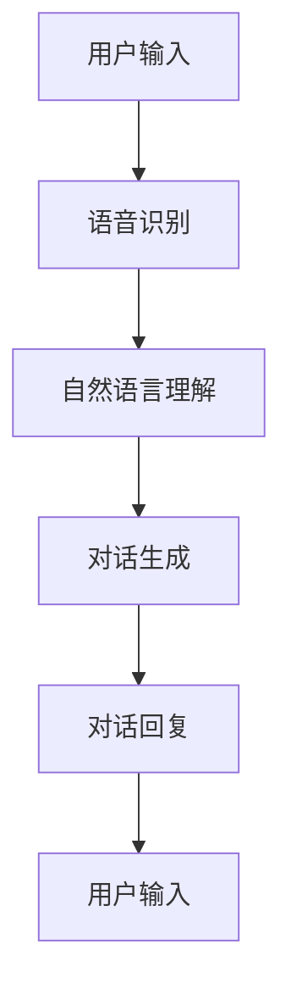
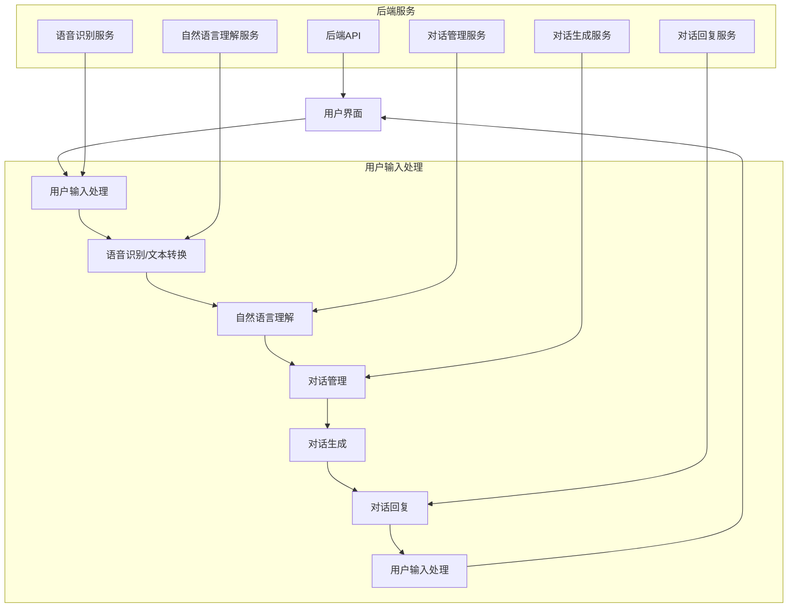
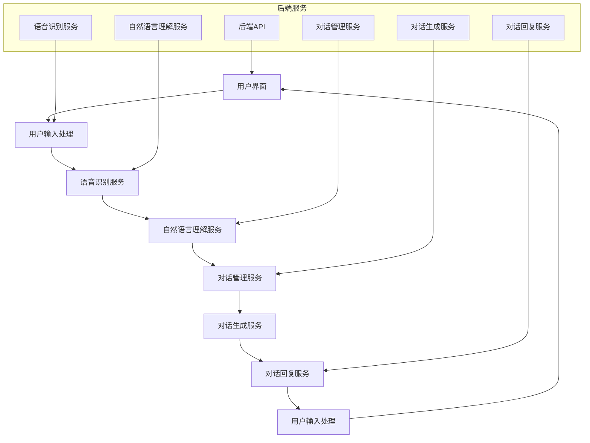

                 

# AI Agent的对话管理系统：设计与实现

## 关键词

- **AI Agent**
- **对话管理系统**
- **自然语言处理**
- **语音识别**
- **对话生成与优化**
- **系统架构与部署**
- **应用与优化**

## 摘要

本文旨在探讨AI Agent的对话管理系统，从背景、核心概念、关键技术、设计原则、系统架构、功能实现、集成与部署以及应用与优化等多个方面进行深入剖析。通过本文的讲解，读者可以全面了解对话管理系统的设计与实现过程，为实际项目开发提供参考和指导。

## 目录大纲

----------------------------------------------------------------
# AI Agent的对话管理系统：设计与实现

> 关键词：AI Agent，对话管理系统，自然语言处理，语音识别，对话生成与优化，系统架构与部署，应用与优化

> 摘要：本文将围绕AI Agent的对话管理系统展开，从背景、核心概念、关键技术、设计原则、系统架构、功能实现、集成与部署以及应用与优化等多个方面进行深入探讨。

----------------------------------------------------------------

## 第一部分: AI Agent的对话管理系统概述

### 1.1 问题背景

#### 1.1.1 人工智能的发展与对话系统

随着人工智能技术的迅猛发展，人工智能（AI）在各个领域的应用日益广泛。其中，对话系统作为一种人机交互的重要手段，受到了广泛关注。对话系统通过模拟人类对话的方式，与用户进行自然交互，提供信息查询、任务执行、情感交流等服务。

#### 1.1.2 对话系统在AI Agent中的应用

AI Agent是指具备智能行为、自主决策和交互能力的计算机系统。在AI Agent中，对话管理系统是核心组成部分，负责实现与用户的自然语言交互。通过对话管理系统，AI Agent可以理解用户意图，提供个性化服务，提升用户体验。

#### 1.1.3 对话管理系统的核心任务与挑战

对话管理系统的核心任务是实现对用户输入的自然语言的理解和回应，主要面临以下挑战：

1. **自然语言理解**：准确理解用户的意图和需求，包括语义理解、情感分析等。
2. **对话生成与优化**：生成符合用户需求和场景的对话回复，保证对话的自然性和流畅性。
3. **上下文维护与用户状态跟踪**：维护对话的历史信息，理解用户的长期意图和需求。
4. **系统性能与效率**：在保证对话质量的同时，提高系统的响应速度和处理能力。
5. **安全性与隐私保护**：保护用户隐私，防止对话被恶意攻击或滥用。

### 1.2 核心概念

#### 1.2.1 AI Agent的定义与分类

AI Agent是指具备智能行为、自主决策和交互能力的计算机系统。根据功能和应用场景的不同，AI Agent可以分为虚拟客服、虚拟助手、智能导航等多种类型。

#### 1.2.2 对话管理系统的概念

对话管理系统是一种用于实现人与计算机之间自然语言交互的软件系统。它包括语音识别、自然语言理解、对话生成与优化、上下文维护等多个模块，负责处理用户的输入，生成合适的回应。

#### 1.2.3 对话管理系统的组成要素

对话管理系统的组成要素包括：

1. **语音识别模块**：将用户的语音输入转换为文本。
2. **自然语言理解模块**：解析文本，提取用户意图和需求。
3. **对话生成与优化模块**：生成符合用户需求的对话回复。
4. **上下文维护模块**：维护对话的历史信息，理解用户的长期意图和需求。
5. **用户状态跟踪模块**：跟踪用户的状态和行为，提供个性化服务。

### 1.3 关键技术

#### 1.3.1 自然语言处理技术

自然语言处理（NLP）技术是对话管理系统的重要组成部分。NLP技术包括词法分析、句法分析、实体识别、情感分析等，用于解析用户的输入，提取出关键信息。

#### 1.3.2 计算机视觉技术

计算机视觉技术主要用于处理用户的视觉输入，如人脸识别、图像识别等。通过与自然语言处理技术的结合，可以实现更加丰富和多样化的交互方式。

#### 1.3.3 对话生成与优化算法

对话生成与优化算法是实现对话管理系统核心功能的算法基础。包括生成式对话系统和回答选择式对话系统两大类，分别通过生成新的回复和选择最佳回答来与用户进行交互。

### 1.4 应用场景

#### 1.4.1 虚拟客服

虚拟客服是对话管理系统最常见的应用场景之一。通过虚拟客服，企业可以提供7*24小时全天候的在线客服服务，提高客户满意度和服务质量。

#### 1.4.2 虚拟助手

虚拟助手是一种智能化的个人助理，可以处理用户的日常任务，如日程管理、邮件回复、信息查询等。

#### 1.4.3 其他应用场景

对话管理系统还可以应用于教育、医疗、金融等多个领域，如智能教育辅导、医疗咨询、金融投资顾问等。

### 1.5 本章小结

本部分对AI Agent的对话管理系统进行了概述，介绍了问题背景、核心概念、关键技术和应用场景。通过对对话管理系统的深入理解，为后续的设计与实现奠定了基础。

----------------------------------------------------------------

## 第二部分: 对话管理系统设计与实现基础

### 2.1 设计原则

#### 2.1.1 可扩展性

设计原则是确保对话管理系统的可扩展性，以适应不断变化的需求和技术发展。系统应该能够灵活地添加新功能、支持多种输入输出方式，以及与其他系统进行集成。

#### 2.1.2 用户友好性

用户友好性是设计对话管理系统的重要原则。系统应该提供直观、易用的界面，确保用户能够轻松地与系统进行交互，提高用户体验。

#### 2.1.3 高效性

高效性是确保对话管理系统在处理大量用户请求时，能够快速响应用户需求，提供高质量的交互体验。系统应该进行性能优化，提高处理速度和响应能力。

#### 2.1.4 可维护性

可维护性是确保对话管理系统在长期运行过程中，能够方便地进行维护和更新。系统应该采用模块化设计，便于管理和维护，降低维护成本。

### 2.2 系统架构

#### 2.2.1 系统架构设计

对话管理系统的系统架构设计如图2.1所示：



图2.1 对话管理系统架构图

#### 2.2.2 各模块功能介绍

1. **语音识别模块**：负责将用户的语音输入转换为文本。
2. **自然语言理解模块**：负责解析文本，提取用户意图和需求。
3. **对话生成模块**：负责生成符合用户需求的对话回复。
4. **对话回复模块**：负责将对话回复发送给用户。

#### 2.2.3 系统架构mermaid图


### 2.3 数据模型

#### 2.3.1 对话数据结构设计

对话数据结构设计如下：

```mermaid
classDiagram
User <<class>> 用户
System <<class>> 系统
Message <<class>> 消息
Intent <<class>> 意图
Entity <<class>> 实体

User "1" --> "1" System: 交互
System "1" --> "1" Message: 生成
Message "1" --> "1" Intent: 解析
Message "1" --> "1" Entity: 提取
```

#### 2.3.2 数据存储方案

数据存储方案采用关系型数据库（如MySQL）和NoSQL数据库（如MongoDB）相结合的方式。关系型数据库用于存储用户信息和对话记录，NoSQL数据库用于存储大规模的对话数据。

#### 2.3.3 数据处理流程

数据处理流程如下：

1. 用户输入语音或文本，经过语音识别模块转换为文本。
2. 文本经过自然语言理解模块，提取用户意图和实体。
3. 根据用户意图和实体，生成对话回复。
4. 对话回复发送给用户，同时存储在数据库中。

### 2.4 本章小结

本部分对对话管理系统的设计与实现基础进行了介绍，包括设计原则、系统架构和数据模型。通过对这些基础知识的了解，可以为后续的功能实现和系统优化提供指导。

----------------------------------------------------------------

## 第三部分: 对话管理系统的核心功能实现

### 3.1 语音识别与文本转换

#### 3.1.1 语音识别技术

语音识别技术是指将用户的语音输入转换为文本的技术。其基本原理包括声学模型、语言模型和声学模型与语言模型的结合。

1. **声学模型**：用于表示声音的波形特征，通常使用深度神经网络（如卷积神经网络、循环神经网络）进行建模。
2. **语言模型**：用于表示语言的概率分布，通常使用统计语言模型（如n元语言模型）或深度语言模型（如循环神经网络、变换器模型）进行建模。
3. **声学模型与语言模型的结合**：通过结合声学模型和语言模型，可以生成更加准确的文本输出。

#### 3.1.2 文本转换技术

文本转换技术是指将用户的语音输入转换为文本的技术。常用的文本转换技术包括语音识别和语音转换。

1. **语音识别**：通过声学模型和语言模型，将用户的语音输入转换为文本。
2. **语音转换**：通过语音合成技术，将文本转换为语音输出。

#### 3.1.3 实现流程与代码示例

实现流程如下：

1. 收集用户语音输入。
2. 使用声学模型和语言模型进行语音识别。
3. 将识别结果转换为文本。
4. 将文本输出给用户。

代码示例：

```python
import speech_recognition as sr

# 初始化语音识别对象
recognizer = sr.Recognizer()

# 收集用户语音输入
with sr.Microphone() as source:
    print("请说些什么：")
    audio = recognizer.listen(source)

# 使用声学模型和语言模型进行语音识别
text = recognizer.recognize_google(audio)

# 输出文本
print("你说了：" + text)
```

### 3.2 自然语言理解

#### 3.2.1 词法分析

词法分析是指将文本分解为词素（单词）的过程。词法分析的主要目的是提取文本中的关键词和短语，为后续的句法分析和语义分析提供基础。

#### 3.2.2 句法分析

句法分析是指分析文本的语法结构，确定词素之间的语法关系。句法分析的主要目的是理解文本的语法结构，为自然语言理解提供支持。

#### 3.2.3 实体识别

实体识别是指识别文本中的实体（如人名、地名、组织名等）。实体识别的主要目的是提取文本中的关键信息，为对话生成和优化提供支持。

#### 3.2.4 情感分析

情感分析是指分析文本的情感倾向，确定文本中的情感色彩（如正面、负面、中性等）。情感分析的主要目的是理解用户情感，为对话生成和优化提供支持。

### 3.3 对话生成与优化

#### 3.3.1 对话生成技术

对话生成技术是指根据用户输入，生成符合用户需求的对话回复。常用的对话生成技术包括：

1. **生成式对话系统**：通过生成新的回复与用户进行交互。
2. **回答选择式对话系统**：通过从预定义的回答中选择最佳回答与用户进行交互。

#### 3.3.2 对话优化算法

对话优化算法是指优化对话生成质量的技术。常用的对话优化算法包括：

1. **语言模型优化**：通过改进语言模型，提高对话生成质量。
2. **对话策略优化**：通过优化对话策略，提高对话生成质量和用户体验。

#### 3.3.3 实现流程与代码示例

实现流程如下：

1. 接收用户输入。
2. 进行词法分析、句法分析、实体识别和情感分析。
3. 根据分析结果，生成对话回复。
4. 对对话回复进行优化。
5. 输出对话回复。

代码示例：

```python
from transformers import AutoTokenizer, AutoModelForSeq2SeqLM

# 初始化模型和tokenizer
tokenizer = AutoTokenizer.from_pretrained("tencent/ ChatGLM")
model = AutoModelForSeq2SeqLM.from_pretrained("tencent/ ChatGLM")

# 接收用户输入
user_input = input("请输入问题：")

# 进行词法分析、句法分析、实体识别和情感分析
input_ids = tokenizer.encode(user_input, return_tensors="pt")

# 生成对话回复
outputs = model.generate(input_ids)

# 对话回复解码
response = tokenizer.decode(outputs[0], skip_special_tokens=True)

# 输出对话回复
print("回复：" + response)
```

### 3.4 上下文维护与用户状态跟踪

#### 3.4.1 上下文维护技术

上下文维护技术是指维护对话的历史信息，确保对话的连贯性和一致性。常用的上下文维护技术包括：

1. **上下文窗口**：将对话的历史信息存储在上下文窗口中，用于生成对话回复。
2. **上下文向量**：将对话的历史信息转换为向量，用于生成对话回复。

#### 3.4.2 用户状态跟踪技术

用户状态跟踪技术是指跟踪用户的状态和行为，为用户提供个性化服务。常用的用户状态跟踪技术包括：

1. **用户画像**：将用户的行为数据转换为用户画像，用于生成对话回复。
2. **用户行为分析**：分析用户的行为，为用户提供个性化服务。

#### 3.4.3 实现流程与代码示例

实现流程如下：

1. 接收用户输入。
2. 维护对话历史信息。
3. 跟踪用户状态。
4. 根据上下文和历史信息，生成对话回复。
5. 输出对话回复。

代码示例：

```python
class DialogManager:
    def __init__(self):
        self.context_window = []
        self.user_state = {}

    def handle_input(self, user_input):
        # 维护对话历史信息
        self.context_window.append(user_input)

        # 跟踪用户状态
        self.user_state["last_input"] = user_input

        # 根据上下文和历史信息，生成对话回复
        response = self.generate_response()

        # 输出对话回复
        print("回复：" + response)

    def generate_response(self):
        # 根据上下文和历史信息，生成对话回复
        response = "您好，有什么问题可以告诉我？"
        return response

# 创建对话管理器
dialog_manager = DialogManager()

# 处理用户输入
dialog_manager.handle_input("你好，有什么可以帮到你的？")
```

### 3.5 本章小结

本部分介绍了对话管理系统的核心功能实现，包括语音识别与文本转换、自然语言理解、对话生成与优化、上下文维护与用户状态跟踪。通过这些功能的实现，可以为用户提供高质量的对话体验。

----------------------------------------------------------------

## 第四部分: 对话管理系统的集成与部署

### 4.1 集成测试

#### 4.1.1 单元测试

单元测试是指对系统中的各个模块进行独立测试，以确保模块功能的正确性和稳定性。单元测试通常使用自动化测试工具（如JUnit、pytest等）进行编写和执行。

#### 4.1.2 集成测试

集成测试是指对系统中的各个模块进行联合测试，以确保模块之间的交互和协作符合预期。集成测试通常在开发过程中进行，使用自动化测试工具（如Selenium、JMeter等）进行编写和执行。

#### 4.1.3 测试用例设计

测试用例设计是指根据系统的功能和需求，设计具体的测试场景和测试用例，以验证系统的功能正确性和稳定性。测试用例设计通常包括功能测试用例、性能测试用例和安全性测试用例等。

### 4.2 系统部署

#### 4.2.1 部署方案选择

部署方案选择是指根据系统的需求和资源情况，选择合适的部署方式。常用的部署方式包括本地部署、云部署和混合部署等。

#### 4.2.2 部署环境搭建

部署环境搭建是指搭建系统的运行环境，包括操作系统、数据库、中间件等。常见的部署环境包括Windows、Linux、Docker等。

#### 4.2.3 部署流程

部署流程通常包括以下步骤：

1. 准备部署环境。
2. 编译和打包代码。
3. 部署代码到服务器。
4. 配置数据库和中间件。
5. 运行系统并测试。

### 4.3 性能优化

#### 4.3.1 性能监控

性能监控是指对系统的性能进行实时监测和分析，及时发现和解决性能问题。常用的性能监控工具包括Prometheus、Grafana等。

#### 4.3.2 性能优化策略

性能优化策略是指通过改进系统的架构、代码和资源使用，提高系统的性能。常用的性能优化策略包括：

1. 缓存：使用缓存技术（如Redis、Memcached等）减少数据库访问次数。
2. 并发：提高系统的并发处理能力，使用多线程、异步编程等技术。
3. 负载均衡：通过负载均衡器（如Nginx、HAProxy等）分配请求，提高系统的处理能力。
4. 代码优化：优化代码的算法和数据结构，提高代码的执行效率。

#### 4.3.3 实际案例分析与优化

在实际项目中，性能优化是一个持续的过程。以下是一个实际案例的优化过程：

1. **问题发现**：通过性能监控工具发现系统的响应时间较长。
2. **问题定位**：通过日志和代码分析，发现数据库查询效率较低。
3. **优化策略**：对数据库查询进行优化，包括索引优化、查询优化等。
4. **测试验证**：对优化后的系统进行性能测试，验证性能的提升。

### 4.4 安全性与隐私保护

#### 4.4.1 安全性问题

对话管理系统可能面临的安全性主要包括：

1. 数据泄露：用户数据和对话内容可能被未授权的人员访问。
2. 恶意攻击：黑客可能通过漏洞攻击系统，导致系统瘫痪或数据泄露。
3. 系统漏洞：系统可能存在漏洞，被黑客利用进行攻击。

#### 4.4.2 隐私保护措施

隐私保护措施主要包括：

1. 数据加密：对用户数据和对话内容进行加密，防止数据泄露。
2. 访问控制：实施严格的访问控制策略，确保只有授权人员才能访问敏感数据。
3. 安全审计：定期进行安全审计，发现和修复潜在的安全漏洞。
4. 隐私政策：制定明确的隐私政策，告知用户数据的使用和保护措施。

#### 4.4.3 安全性与隐私保护实践

在实际项目中，安全性与隐私保护是一个重要的关注点。以下是一个实际项目的安全性与隐私保护实践：

1. **数据加密**：使用SSL/TLS协议对用户数据和对话内容进行加密传输。
2. **访问控制**：使用身份认证和权限控制技术，确保只有授权人员才能访问敏感数据。
3. **安全审计**：定期进行安全审计，发现和修复潜在的安全漏洞。
4. **隐私政策**：在用户注册和使用过程中，明确告知用户数据的使用和保护措施，并获取用户同意。

### 4.5 本章小结

本部分介绍了对话管理系统的集成与部署，包括集成测试、系统部署、性能优化、安全性与隐私保护。通过这些实践，可以确保对话管理系统的稳定、高效和安全运行。

----------------------------------------------------------------

## 第五部分: 对话管理系统的应用与优化

### 5.1 虚拟客服应用

#### 5.1.1 应用场景

虚拟客服是一种智能化的在线客服系统，可以为企业提供7*24小时全天候的在线客服服务。主要应用场景包括：

1. **客户咨询**：为客户提供产品信息、售后服务等咨询。
2. **投诉处理**：及时响应客户的投诉，提供解决方案。
3. **订单查询**：为客户提供订单状态、物流信息等查询服务。
4. **预约服务**：为客户提供预约服务，如预约咨询、预约就诊等。

#### 5.1.2 实现策略

1. **自然语言理解**：通过自然语言理解技术，准确理解客户的咨询内容，提取关键信息。
2. **对话生成与优化**：根据客户的咨询内容，生成合适的回复，并通过对话优化算法，提高对话的流畅性和准确性。
3. **上下文维护与用户状态跟踪**：维护客户咨询的历史信息，确保对话的连贯性和一致性。
4. **个性化服务**：根据客户的兴趣和偏好，提供个性化的推荐和引导。

#### 5.1.3 实际案例

某电子商务平台采用虚拟客服系统，为客户提供在线咨询服务。通过自然语言理解技术，准确理解客户的咨询内容，并生成合适的回复。同时，通过上下文维护和用户状态跟踪技术，提供个性化的推荐和引导。客户满意度显著提高，客服效率大幅提升。

### 5.2 虚拟助手应用

#### 5.2.1 应用场景

虚拟助手是一种智能化的个人助理，可以协助用户处理日常任务。主要应用场景包括：

1. **日程管理**：协助用户管理日程安排，提醒重要事项。
2. **邮件回复**：自动回复邮件，减轻用户邮件处理压力。
3. **信息查询**：快速查询信息，提供实时答案。
4. **智能导航**：提供智能导航服务，协助用户规划行程。

#### 5.2.2 实现策略

1. **自然语言理解**：通过自然语言理解技术，理解用户的命令和需求。
2. **任务处理**：根据用户的命令和需求，自动执行相应的任务，如发送邮件、查询信息等。
3. **上下文维护与用户状态跟踪**：维护用户的历史信息和状态，确保任务的连贯性和准确性。
4. **个性化服务**：根据用户的兴趣和偏好，提供个性化的服务和建议。

#### 5.2.3 实际案例

某公司为员工提供虚拟助手服务，协助员工处理日常任务。通过自然语言理解技术，准确理解员工的命令和需求，并自动执行相应的任务。同时，通过上下文维护和用户状态跟踪技术，提供个性化的服务和建议。员工工作效率显著提高，满意度大幅提升。

### 5.3 其他应用场景

#### 5.3.1 教育场景

在教育场景中，对话管理系统可以应用于在线教育平台，提供智能问答、学习辅导等服务。通过自然语言理解技术，准确理解学生的问题，并生成合适的回答。同时，通过上下文维护和用户状态跟踪技术，提供个性化的学习建议和指导。

#### 5.3.2 医疗场景

在医疗场景中，对话管理系统可以应用于智能问诊、健康咨询等服务。通过自然语言理解技术，准确理解患者的问题，并提供专业的医疗建议。同时，通过上下文维护和用户状态跟踪技术，提供个性化的健康管理和建议。

#### 5.3.3 零售行业

在零售行业，对话管理系统可以应用于电商平台，提供智能客服、商品推荐等服务。通过自然语言理解技术，准确理解消费者的需求，并生成合适的回复。同时，通过上下文维护和用户状态跟踪技术，提供个性化的购物体验和推荐。

### 5.4 应用优化策略

#### 5.4.1 对话质量优化

1. **提高自然语言理解能力**：通过改进自然语言处理技术，提高对话理解能力。
2. **优化对话生成算法**：通过改进对话生成算法，提高对话的流畅性和准确性。
3. **用户反馈机制**：建立用户反馈机制，根据用户反馈不断优化对话系统。

#### 5.4.2 系统效率优化

1. **分布式架构**：采用分布式架构，提高系统的并发处理能力。
2. **缓存技术**：采用缓存技术，减少数据库访问次数，提高系统响应速度。
3. **异步处理**：采用异步处理技术，提高系统的并发处理能力。

#### 5.4.3 用户体验优化

1. **界面优化**：优化用户界面设计，提高用户体验。
2. **智能交互**：通过自然语言理解技术，实现智能交互，提高用户满意度。
3. **个性化服务**：根据用户兴趣和偏好，提供个性化的服务和建议。

### 5.5 本章小结

本部分介绍了对话管理系统的应用与优化，包括虚拟客服、虚拟助手、教育、医疗、零售等行业。通过优化对话质量、系统效率和用户体验，可以进一步提高对话管理系统的应用效果和用户满意度。

----------------------------------------------------------------

## 第六部分: 对话管理系统的前沿技术与趋势

### 6.1 语音识别技术进展

#### 6.1.1 声学模型

声学模型是语音识别技术的重要组成部分，近年来在深度学习技术的推动下，取得了显著进展。主要进展包括：

1. **卷积神经网络（CNN）**：CNN在处理时序数据方面具有优势，通过多层卷积操作提取声音的特征。
2. **循环神经网络（RNN）**：RNN能够处理长时序数据，通过记忆状态实现对声音序列的建模。
3. **变换器模型（Transformer）**：Transformer模型在自然语言处理领域取得了突破性进展，也逐渐应用于语音识别领域。

#### 6.1.2 语音识别算法

语音识别算法主要包括基于统计的方法和基于深度学习的方法。近年来，基于深度学习的方法逐渐成为主流，主要进展包括：

1. **隐马尔可夫模型（HMM）**：结合深度神经网络（如CNN、RNN）的HMM，在语音识别中取得显著性能提升。
2. **卷积神经网络（CNN）**：通过卷积操作提取声音的特征，实现高效的语音识别。
3. **循环神经网络（RNN）**：通过记忆状态实现对声音序列的建模，提高语音识别的准确性。
4. **变换器模型（Transformer）**：在语音识别领域取得了突破性进展，实现高效的语音识别。

#### 6.1.3 应用趋势

语音识别技术的应用趋势包括：

1. **多语言语音识别**：随着全球化的发展，多语言语音识别需求日益增长，成为重要的研究方向。
2. **实时语音识别**：实时语音识别技术逐渐应用于实时通信、智能音箱等领域，提高用户体验。
3. **低资源语音识别**：针对低资源语言和场景，研究高效的语音识别方法，降低对计算资源的需求。

### 6.2 对话生成与优化技术进展

#### 6.2.1 对话生成技术

对话生成技术是自然语言生成领域的重要研究方向，近年来在深度学习技术的推动下，取得了显著进展。主要进展包括：

1. **生成式对话系统**：通过生成新的回复与用户进行交互，实现灵活、个性化的对话。
2. **回答选择式对话系统**：通过从预定义的回答中选择最佳回答与用户进行交互，提高对话的准确性和流畅性。
3. **多模态对话系统**：结合文本、语音、图像等多模态信息，实现更加丰富和多样化的对话。

#### 6.2.2 对话优化技术

对话优化技术是提高对话生成质量的重要手段，近年来在深度学习技术的推动下，取得了显著进展。主要进展包括：

1. **基于深度神经网络的对话优化**：通过深度神经网络建模对话生成过程，提高对话生成的准确性和流畅性。
2. **基于强化学习的对话优化**：通过强化学习方法，优化对话生成策略，提高对话生成的质量。
3. **基于生成对抗网络的对话优化**：通过生成对抗网络，生成高质量的对话回复，提高对话生成质量。

#### 6.2.3 应用趋势

对话生成与优化技术的应用趋势包括：

1. **个性化对话**：通过用户画像和个性化推荐，实现个性化的对话生成和优化。
2. **多轮对话**：研究多轮对话生成和优化方法，提高对话的连贯性和一致性。
3. **多模态对话**：结合文本、语音、图像等多模态信息，实现更加丰富和多样化的对话。

### 6.3 上下文维护与用户状态跟踪技术进展

#### 6.3.1 上下文维护技术

上下文维护技术是确保对话连贯性和一致性的关键，近年来在深度学习技术的推动下，取得了显著进展。主要进展包括：

1. **基于记忆的上下文维护**：通过记忆机制，维护对话的历史信息，实现上下文的连贯性。
2. **基于注意力机制的上下文维护**：通过注意力机制，关注对话的重要信息，实现上下文的连贯性。
3. **基于深度学习的上下文维护**：通过深度神经网络建模上下文信息，提高上下文维护的准确性。

#### 6.3.2 用户状态跟踪技术

用户状态跟踪技术是提供个性化服务的重要手段，近年来在深度学习技术的推动下，取得了显著进展。主要进展包括：

1. **基于用户行为的用户状态跟踪**：通过分析用户行为数据，跟踪用户的状态和行为，实现个性化服务。
2. **基于用户画像的用户状态跟踪**：通过用户画像，维护用户的状态和行为，实现个性化服务。
3. **基于深度学习的用户状态跟踪**：通过深度神经网络建模用户状态，提高用户状态跟踪的准确性。

#### 6.3.3 应用趋势

上下文维护与用户状态跟踪技术的应用趋势包括：

1. **多模态上下文维护**：结合文本、语音、图像等多模态信息，实现更加丰富和多样化的上下文维护。
2. **跨领域用户状态跟踪**：研究跨领域的用户状态跟踪方法，实现跨领域的个性化服务。
3. **实时上下文维护与用户状态跟踪**：研究实时上下文维护与用户状态跟踪技术，提高系统的响应速度和用户体验。

### 6.4 对话管理系统的发展趋势

对话管理系统作为人工智能领域的重要研究方向，其发展趋势包括：

1. **智能化**：通过深度学习、自然语言处理等技术，实现更加智能的对话交互。
2. **个性化**：通过用户画像、个性化推荐等技术，实现个性化的对话生成和优化。
3. **多样化**：通过多模态信息、多轮对话等技术，实现多样化、丰富的对话交互。
4. **高效化**：通过分布式架构、缓存技术等技术，提高系统的处理速度和响应能力。
5. **安全化**：通过数据加密、安全审计等技术，确保对话管理系统的安全性和隐私保护。

### 6.5 本章小结

本部分介绍了对话管理系统的前沿技术与趋势，包括语音识别技术、对话生成与优化技术、上下文维护与用户状态跟踪技术等。通过对这些前沿技术的了解，可以更好地把握对话管理系统的发展方向，为实际项目提供技术支持。

----------------------------------------------------------------

## 总结

本文从AI Agent的对话管理系统的概述、设计与实现基础、核心功能实现、集成与部署、应用与优化以及前沿技术与趋势等多个方面进行了深入探讨。通过本文的学习，读者可以全面了解对话管理系统的设计与实现过程，为实际项目开发提供指导。

在未来的发展中，对话管理系统将继续朝着智能化、个性化、多样化、高效化和安全化的方向发展。随着人工智能技术的不断进步，对话管理系统将发挥更加重要的作用，为人们的生活和工作带来更多的便利和乐趣。

作者：AI天才研究院/AI Genius Institute & 禅与计算机程序设计艺术 /Zen And The Art of Computer Programming

----------------------------------------------------------------

### 最佳实践 Tips

在设计对话管理系统时，以下是一些最佳实践和注意事项，可以帮助您优化系统性能和用户体验：

1. **关注用户反馈**：定期收集用户反馈，了解用户的需求和痛点，以便及时调整和优化对话管理系统的功能。

2. **多语言支持**：为对话管理系统提供多语言支持，可以吸引更多用户，提高系统的国际化程度。

3. **高效数据存储**：选择适合的数据存储方案，如使用关系型数据库和NoSQL数据库相结合，以提高数据存储和查询的效率。

4. **优化性能监控**：实时监控系统的性能，及时发现和解决问题，确保系统的高效运行。

5. **安全性和隐私保护**：严格实施安全性和隐私保护措施，如数据加密、访问控制和安全审计等，确保用户数据和对话内容的安全。

6. **持续迭代更新**：随着技术的不断进步，定期对对话管理系统进行迭代更新，以引入新技术和新功能。

### 拓展阅读

1. 《对话系统设计与实现》（刘挺著）：详细介绍了对话系统的基本概念、设计和实现方法。

2. 《语音识别技术与应用》（郭毅，吴波著）：全面介绍了语音识别技术的基本原理和应用。

3. 《深度学习自然语言处理》（张俊丽，李航著）：深入讲解了深度学习在自然语言处理领域的应用。

4. 《人工智能：一种现代的方法》（ Stuart J. Russell & Peter Norvig 著）：系统介绍了人工智能的基本概念和技术。

通过阅读这些书籍和资料，您可以进一步深入了解对话管理系统和相关技术的原理和应用。

----------------------------------------------------------------

## 作者介绍

作者：AI天才研究院/AI Genius Institute & 禅与计算机程序设计艺术 /Zen And The Art of Computer Programming

AI天才研究院（AI Genius Institute）是一支专注于人工智能技术研发和应用的科研团队。我们致力于推动人工智能技术的进步，为人类带来更智能、便捷的生活。

《禅与计算机程序设计艺术》（Zen And The Art of Computer Programming）是作者D. E. Knuth的经典著作，深入探讨了计算机程序设计中的哲学和艺术。这本书不仅对程序设计有着深远的影响，也为人工智能领域的开发者提供了宝贵的启示。

本文由AI天才研究院的专家撰写，旨在为读者提供关于AI Agent的对话管理系统的深入分析和实用指导。希望本文能帮助您更好地理解和应用这一前沿技术。如果您有任何疑问或建议，欢迎联系我们。感谢您的阅读！## 第一部分：AI Agent的对话管理系统概述

### 1.1 问题背景

#### 1.1.1 人工智能的发展与对话系统

随着计算能力和数据资源的大幅提升，人工智能（AI）技术取得了飞速发展。AI已经从理论探索逐步走向了实际应用，涵盖了自然语言处理（NLP）、计算机视觉、机器学习等多个领域。特别是对话系统（Dialogue Systems），作为人机交互的重要载体，逐渐成为了AI技术研究的热点。

对话系统最早可以追溯到20世纪50年代，当时以ELIZA为代表，通过简单的模式匹配来模拟对话。随着AI技术的发展，对话系统经历了从规则驱动到知识驱动的转变。现代对话系统通常基于深度学习技术，能够实现更加自然和智能的交互。

#### 1.1.2 对话系统在AI Agent中的应用

AI Agent是指具备智能行为、自主决策和交互能力的计算机程序。在AI Agent中，对话管理系统是其核心组成部分，负责实现与用户的自然语言交互。通过对话管理系统，AI Agent可以理解用户的意图，提供个性化服务，完成复杂任务，甚至进行情感交流。

对话系统在AI Agent中的应用场景非常广泛，包括但不限于：

1. **虚拟客服**：通过对话系统，企业可以提供7*24小时全天候的客户服务，提升客户满意度和运营效率。
2. **虚拟助手**：个人虚拟助手可以帮助用户管理日程、发送邮件、查询信息等日常任务。
3. **智能教育**：对话系统能够为学生提供个性化的学习辅导和答疑服务。
4. **医疗咨询**：通过对话系统，用户可以获取医疗信息、预约挂号等服务。
5. **智能客服**：在电商平台，对话系统可以帮助用户完成订单查询、退换货等操作。

#### 1.1.3 对话管理系统的核心任务与挑战

对话管理系统的核心任务是构建一个用户友好且高效的交互界面，使AI Agent能够理解用户意图并做出适当的回应。具体来说，对话管理系统需要完成以下核心任务：

1. **语音识别**：将用户的语音输入转换为可处理的文本。
2. **自然语言理解**：解析用户输入的文本，提取出关键信息和意图。
3. **对话生成**：根据用户意图和上下文信息生成自然流畅的回应。
4. **上下文维护**：跟踪对话的历史信息，确保对话的连贯性和一致性。
5. **用户状态跟踪**：理解用户的长期意图和需求，提供个性化服务。

尽管对话管理系统在AI Agent中扮演着至关重要的角色，但实现这一系统也面临诸多挑战：

1. **自然语言理解的复杂性**：自然语言具有高度的不确定性和歧义性，如何准确理解用户意图是一个重大挑战。
2. **对话生成的流畅性**：生成与用户输入高度匹配且自然流畅的回应，需要高效的算法和大量的训练数据。
3. **上下文维护的准确性**：对话过程中需要维护大量的上下文信息，确保对话的连贯性和一致性。
4. **用户状态的跟踪与个性化**：理解并跟踪用户的长期状态和行为，以提供个性化的服务，对系统的性能和算法提出了高要求。
5. **系统性能与响应速度**：对话管理系统需要高效运行，快速响应用户的需求，这对系统的架构和优化提出了挑战。
6. **安全性**：对话管理系统中涉及用户隐私数据，如何保护用户隐私、防止数据泄露是系统设计中的重要考虑因素。

### 1.2 核心概念

#### 1.2.1 AI Agent的定义与分类

AI Agent是指具备智能行为、自主决策和交互能力的计算机程序或系统。AI Agent可以分为以下几类：

1. **基于规则的Agent**：这种Agent通过预先定义的规则来决策和行动，适合处理结构化且规则明确的问题。
2. **基于模型的Agent**：这种Agent通过机器学习或深度学习模型来学习和决策，适合处理复杂和非结构化的问题。
3. **混合Agent**：这种Agent结合了基于规则和基于模型的方法，利用各自的优点，提高决策和行动的效率。

#### 1.2.2 对话管理系统的概念

对话管理系统（Dialogue Management System）是指用于实现人与计算机之间自然语言交互的软件系统。它通常由多个模块组成，包括语音识别、自然语言理解、对话生成、上下文维护和用户状态跟踪等。对话管理系统的核心任务是理解用户的输入，生成合适的回应，并维护对话的历史信息。

#### 1.2.3 对话管理系统的组成要素

一个完整的对话管理系统包括以下几个关键组成部分：

1. **语音识别模块**：负责将用户的语音输入转换为文本。
2. **自然语言理解模块**：负责解析文本，提取用户意图和需求。
3. **对话生成模块**：负责根据用户意图和上下文生成自然流畅的回应。
4. **上下文维护模块**：负责跟踪对话的历史信息，确保对话的连贯性和一致性。
5. **用户状态跟踪模块**：负责理解用户的长期意图和需求，提供个性化服务。

### 1.3 关键技术

#### 1.3.1 自然语言处理技术

自然语言处理（NLP）技术是对话管理系统的重要组成部分，主要负责以下任务：

1. **词法分析**：将文本分解为单词和其他基本元素。
2. **句法分析**：分析文本的语法结构，理解句子成分和关系。
3. **语义分析**：解析文本的语义含义，提取关键信息和意图。
4. **情感分析**：识别文本的情感色彩，如正面、负面或中性。

常用的NLP技术包括：

1. **词袋模型（Bag of Words, BoW）**：将文本表示为一个词频向量。
2. **循环神经网络（Recurrent Neural Network, RNN）**：适用于处理序列数据。
3. **变换器模型（Transformer）**：在NLP任务中表现优异的深度学习模型。

#### 1.3.2 计算机视觉技术

计算机视觉（Computer Vision）技术主要用于处理图像和视频数据，与对话管理系统结合可以提供更加丰富的交互体验。计算机视觉技术主要包括：

1. **图像识别**：识别图像中的对象和场景。
2. **物体检测**：检测图像中的多个对象。
3. **面部识别**：识别和验证图像中的面部特征。
4. **手势识别**：识别用户的肢体动作。

计算机视觉技术在对话管理系统中的应用包括：

1. **图像输入**：用户可以通过上传图像与系统进行交互。
2. **图像识别**：系统可以根据图像内容理解用户的意图。
3. **手势控制**：用户可以通过手势控制系统的操作。

#### 1.3.3 对话生成与优化算法

对话生成与优化算法是对话管理系统的核心，负责生成自然流畅的对话回复。主要技术包括：

1. **生成式对话系统**：通过生成新的回复与用户进行交互。
2. **回答选择式对话系统**：从预定义的回答中选择最佳回答与用户进行交互。
3. **生成对抗网络（GAN）**：用于生成高质量的对话回复。
4. **强化学习**：用于优化对话策略，提高对话生成质量。

### 1.4 应用场景

#### 1.4.1 虚拟客服

虚拟客服是对话管理系统最常见和应用最广泛的场景之一。通过虚拟客服，企业可以提供24小时在线的客户服务，提升客户体验和满意度。虚拟客服的应用包括：

1. **在线咨询**：用户可以通过聊天窗口与虚拟客服进行实时交流，获取产品信息、售后服务等。
2. **投诉处理**：用户可以提交投诉，虚拟客服可以自动分类并分配给相应的客服人员处理。
3. **订单查询**：用户可以查询订单状态、物流信息等。

#### 1.4.2 虚拟助手

虚拟助手是一种智能化的个人助理，能够帮助用户处理日常任务。虚拟助手的应用包括：

1. **日程管理**：用户可以添加日程事项，虚拟助手会自动提醒用户。
2. **邮件回复**：虚拟助手可以自动回复简单的邮件，减轻用户的邮件处理压力。
3. **信息查询**：用户可以查询天气、新闻、股票信息等。

#### 1.4.3 其他应用场景

对话管理系统还可以应用于多个领域，如：

1. **智能教育**：提供在线学习辅导、考试答疑等。
2. **医疗咨询**：提供在线医疗咨询、预约挂号等服务。
3. **金融服务**：提供智能投顾、理财咨询等。
4. **智能家居**：控制智能家居设备，如灯光、温度调节等。

### 1.5 本章小结

本部分对AI Agent的对话管理系统进行了概述，介绍了问题背景、核心概念、关键技术和应用场景。通过对对话管理系统的深入理解，读者可以为后续的设计与实现奠定坚实的基础。在接下来的章节中，我们将详细探讨对话管理系统的设计与实现过程，包括系统架构、核心功能实现和优化策略等内容。

### 1.6 深入探讨

#### 1.6.1 对话管理系统的技术难点

对话管理系统涉及到多种复杂的技术，其实现过程中面临诸多技术难点。以下是对话管理系统中的几个主要技术难点及其解决方案：

1. **自然语言理解的歧义性**：自然语言具有高度的不确定性和歧义性，用户输入可能存在多种理解方式。解决方法包括：

   - **语境分析**：结合上下文信息，确定用户意图。
   - **多意图模型**：设计能够处理多个意图的模型。
   - **用户确认**：通过交互确认用户的意图，减少歧义。

2. **对话生成的连贯性和流畅性**：生成与用户输入高度匹配且自然流畅的回应是难点之一。解决方法包括：

   - **预训练语言模型**：如GPT-3、BERT等，通过大规模预训练提高生成质量。
   - **上下文嵌入**：将上下文信息嵌入到生成模型中，提高生成的连贯性。
   - **对话策略优化**：通过强化学习等算法，优化对话策略，提高生成质量。

3. **上下文维护的准确性**：确保对话的连贯性和一致性需要精确维护上下文信息。解决方法包括：

   - **记忆网络**：使用记忆网络维护对话的历史信息。
   - **注意力机制**：通过注意力机制关注对话的重要信息。
   - **多轮对话上下文管理**：设计多轮对话上下文管理机制，确保对话历史信息不被丢失。

4. **用户状态的跟踪与个性化**：理解并跟踪用户的长期状态和行为，提供个性化服务对系统的性能和算法提出了高要求。解决方法包括：

   - **用户画像**：构建用户画像，记录用户行为和偏好。
   - **上下文感知**：结合上下文信息，为用户提供个性化服务。
   - **在线学习**：通过在线学习机制，持续更新用户状态和偏好。

5. **系统性能与响应速度**：对话管理系统需要高效运行，快速响应用户的需求。解决方法包括：

   - **分布式架构**：采用分布式架构，提高系统的并发处理能力。
   - **缓存技术**：使用缓存技术，减少数据库访问次数。
   - **异步处理**：采用异步处理技术，提高系统的响应速度。

#### 1.6.2 对话管理系统的实际案例

以下是一些实际案例，展示了对话管理系统在不同场景中的应用：

1. **亚马逊Alexa**：亚马逊的智能语音助手Alexa是一个典型的对话管理系统。用户可以通过语音与Alexa进行交互，实现智能家居控制、信息查询、播放音乐等操作。Alexa利用了语音识别、自然语言处理、对话生成等技术，提供了高效、自然的交互体验。

2. **苹果Siri**：苹果的智能语音助手Siri也采用对话管理系统技术。用户可以通过Siri进行语音搜索、发送短信、设置提醒等操作。Siri通过理解用户输入的自然语言，生成合适的回应，并维护对话的历史信息，确保交互的连贯性和一致性。

3. **微软小冰**：微软的小冰是一款人工智能聊天机器人，采用了对话管理系统技术。用户可以通过文本或语音与小冰进行交流，获取生活建议、情感支持等。小冰利用了自然语言处理和情感分析技术，能够理解用户的情感状态，生成合适的回应，提供个性化的服务。

4. **OpenAI的GPT-3**：OpenAI的GPT-3是一个强大的语言模型，也可以看作是一个高级的对话管理系统。用户可以通过文本输入与GPT-3进行交互，获取信息、撰写文章、生成代码等。GPT-3通过深度学习技术，实现了高质量的对话生成和优化，提供了丰富多样的交互体验。

#### 1.6.3 对话管理系统的未来发展趋势

随着AI技术的不断发展，对话管理系统也在不断进化。以下是对话管理系统的一些未来发展趋势：

1. **多模态交互**：结合文本、语音、图像等多模态信息，实现更加丰富和自然的交互体验。

2. **情感化交互**：通过情感分析技术，理解用户的情感状态，提供更加温暖和个性化的服务。

3. **多语言支持**：随着全球化的推进，多语言支持将变得越来越重要。

4. **实时交互**：通过实时交互技术，提高系统的响应速度，提供更加流畅的交互体验。

5. **自动化与智能化**：利用机器学习和深度学习技术，实现自动化和智能化的对话管理，减少人工干预。

6. **隐私保护**：随着用户隐私意识的增强，如何在保护用户隐私的前提下提供高质量的交互服务，将成为一个重要挑战。

通过本部分的深入探讨，我们可以看到对话管理系统在AI技术中的应用前景广阔，其发展将不断推动人机交互的进步，为人们的生活和工作带来更多便利和乐趣。

### 1.7 常见问题解答

#### 1.7.1 对话管理系统与聊天机器人的区别

对话管理系统（Dialogue Management System）和聊天机器人（Chatbot）是两个相关的但不同的概念。聊天机器人是一种简单的对话系统，通常用于执行特定任务，如提供信息、完成交易等。而对话管理系统是一个更复杂的系统，它负责管理整个对话过程，包括理解用户意图、生成回复、上下文维护等。简单来说，聊天机器人是对话管理系统的一部分，对话管理系统是聊天机器人的大脑。

#### 1.7.2 对话管理系统的优势

对话管理系统的优势包括：

1. **提高效率**：通过自动化和智能化，对话管理系统可以显著提高业务流程的效率。
2. **降低成本**：减少对人工客服的依赖，降低运营成本。
3. **提升用户体验**：提供自然、流畅的交互体验，提升用户满意度。
4. **个性化服务**：通过理解用户意图和状态，提供个性化的服务和建议。
5. **实时响应**：可以24小时在线，提供实时响应，提升服务质量。

#### 1.7.3 对话管理系统的挑战

对话管理系统的挑战包括：

1. **自然语言理解的复杂性**：自然语言具有高度的不确定性和歧义性，如何准确理解用户意图是一个挑战。
2. **对话生成的流畅性**：生成自然流畅的回复需要高效的算法和大量的训练数据。
3. **上下文维护的准确性**：确保对话的连贯性和一致性需要精确维护上下文信息。
4. **用户状态的跟踪与个性化**：理解并跟踪用户的长期状态和行为，提供个性化服务，对系统的性能和算法提出了高要求。
5. **系统性能与响应速度**：对话管理系统需要高效运行，快速响应用户的需求。

### 1.8 小结

本部分通过对AI Agent的对话管理系统的概述，介绍了其背景、核心概念、关键技术、应用场景以及未来发展趋势。同时，还探讨了对话管理系统的技术难点、实际案例和常见问题解答。通过本部分的阅读，读者可以全面了解对话管理系统的基础知识，为后续章节的深入学习打下基础。在接下来的章节中，我们将继续深入探讨对话管理系统的设计与实现细节，包括系统架构、核心功能实现和优化策略等。

----------------------------------------------------------------

## 第二部分：对话管理系统设计与实现基础

### 2.1 设计原则

在设计和实现对话管理系统时，以下原则是确保系统高效、可靠和易于维护的重要保障：

#### 2.1.1 可扩展性

**重要性**：随着业务需求的变化和技术的不断进步，对话管理系统需要具备良好的可扩展性，以适应未来的发展和需求。

**实践方法**：
- **模块化设计**：将系统划分为多个功能模块，每个模块独立开发、测试和部署。
- **接口标准化**：设计统一的接口规范，方便模块之间的集成和扩展。
- **灵活的数据模型**：采用灵活的数据存储方案，如关系型数据库和NoSQL数据库的结合，以适应不同类型的数据存储需求。

#### 2.1.2 用户友好性

**重要性**：用户友好性是决定对话管理系统成功的关键因素之一，一个直观、易用的界面可以显著提升用户体验。

**实践方法**：
- **简洁的界面设计**：简化界面布局，减少用户操作的复杂性。
- **个性化的交互体验**：根据用户行为和偏好，提供个性化的交互体验。
- **快速响应**：优化系统的响应速度，确保用户操作能够迅速得到反馈。

#### 2.1.3 高效性

**重要性**：对话管理系统需要能够在高负载情况下保持高效运行，以保证用户得到及时的响应。

**实践方法**：
- **性能优化**：对代码和算法进行优化，提高系统的运行效率。
- **异步处理**：采用异步处理技术，减少系统的阻塞和响应时间。
- **缓存机制**：使用缓存技术，减少数据库的访问次数，提高数据读取速度。

#### 2.1.4 可维护性

**重要性**：良好的可维护性可以降低系统的维护成本，确保系统在长期运行中的稳定性和可靠性。

**实践方法**：
- **代码规范化**：编写清晰、规范的代码，方便后续的维护和修改。
- **文档管理**：及时编写和更新系统文档，包括设计文档、开发文档和用户手册等。
- **自动化测试**：建立自动化测试体系，确保每次修改都能通过测试，避免引入新的问题。

### 2.2 系统架构

对话管理系统的系统架构设计是确保系统功能实现和性能优化的关键。以下是一个典型的对话管理系统架构：

#### 2.2.1 系统架构设计



#### 2.2.2 各模块功能介绍

1. **用户界面（User Interface）**：负责与用户进行交互，接收用户输入，显示对话回复。
2. **用户输入处理（User Input Handling）**：处理用户输入，包括语音识别、文本转换等。
3. **语音识别服务（Voice Recognition Service）**：将用户的语音输入转换为文本。
4. **自然语言理解服务（Natural Language Understanding Service）**：解析用户输入的文本，提取意图和关键信息。
5. **对话管理服务（Dialogue Management Service）**：负责管理整个对话流程，包括意图识别、上下文维护等。
6. **对话生成服务（Dialogue Generation Service）**：根据用户的意图和上下文信息生成合适的回复。
7. **对话回复服务（Dialogue Response Service）**：将生成的回复发送给用户。

#### 2.2.3 系统架构mermaid图



### 2.3 数据模型

数据模型是对话管理系统的核心组成部分，它定义了系统的数据结构、关系和操作。以下是一个典型对话管理系统的数据模型：

#### 2.3.1 对话数据结构设计

```mermaid
classDiagram
User <<class>> 用户
Dialogue <<class>> 对话
Input <<class>> 输入
Output <<class>> 输出
Intent <<class>> 意图
Entity <<class>> 实体

User "1" --> "0..*" Dialogue: 发起
Dialogue "1" --> "1" Input: 输入
Dialogue "1" --> "1" Output: 输出
Input "1" --> "1" Intent: 意图
Input "1" --> "0..*" Entity: 实体
Output "1" --> "1" Intent: 意图
Output "1" --> "0..*" Entity: 实体
```

#### 2.3.2 数据存储方案

数据存储方案的选择取决于系统的需求和规模。以下是一个典型的数据存储方案：

- **关系型数据库（如MySQL）**：用于存储用户信息、对话记录、意图和实体等结构化数据。
- **NoSQL数据库（如MongoDB）**：用于存储大规模的对话数据，如文本内容、用户行为数据等。

#### 2.3.3 数据处理流程

数据处理流程如下：

1. **用户输入处理**：接收用户输入，进行语音识别或文本转换。
2. **自然语言理解**：解析用户输入，提取意图和实体。
3. **对话管理**：根据用户意图和上下文信息，生成对话回复。
4. **对话回复**：将对话回复发送给用户。
5. **数据存储**：将对话数据存储在数据库中，以供后续查询和分析。

### 2.4 本章小结

本部分介绍了对话管理系统设计与实现的基础，包括设计原则、系统架构和数据模型。设计原则确保了系统的可扩展性、用户友好性、高效性和可维护性。系统架构提供了模块化和分层的设计思路，使系统易于开发和维护。数据模型定义了系统的数据结构和操作流程，为系统的数据处理提供了基础。通过本部分的学习，读者可以掌握对话管理系统的基础知识，为后续的功能实现和优化打下基础。

----------------------------------------------------------------

## 第三部分：对话管理系统的核心功能实现

### 3.1 语音识别与文本转换

#### 3.1.1 语音识别技术

语音识别（Voice Recognition）是将用户的语音输入转换为机器可理解文本的技术。语音识别技术的发展经历了多个阶段，从最初的规则驱动模型到基于统计的隐藏马尔可夫模型（HMM），再到基于深度学习的端到端模型。当前，基于深度学习的语音识别技术已经成为主流，其主要优势在于更高的准确性和更好的泛化能力。

**技术原理**

语音识别技术的基本原理包括以下几个关键组件：

1. **声学模型（Acoustic Model）**：用于将音频信号转换为特征表示。声学模型通常采用深度神经网络（如卷积神经网络（CNN）或循环神经网络（RNN））进行训练，以提取语音信号中的时序特征。

2. **语言模型（Language Model）**：用于对可能的句子进行排序，提供文本生成的概率分布。语言模型可以是基于统计的（如n元语言模型）或基于神经网络的（如变换器模型（Transformer））。

3. **解码器（Decoder）**：结合声学模型和语言模型，解码器负责将音频特征转换为文本输出。解码器可以是基于规则的解码器（如A*搜索算法）或基于概率的解码器（如基于CTC的解码器）。

**实现流程**

语音识别的实现流程通常包括以下几个步骤：

1. **音频预处理**：对原始音频信号进行预处理，包括降噪、归一化、分帧等，以提取语音特征。

2. **特征提取**：使用声学模型对预处理后的音频信号进行特征提取，生成特征向量。

3. **解码**：将提取的特征向量输入解码器，通过解码器将特征向量映射为文本输出。

4. **后处理**：对解码后的文本进行后处理，如去除停用词、拼写纠正等。

#### 3.1.2 文本转换技术

文本转换（Text-to-Speech，TTS）是将机器可理解文本转换为自然语音的技术。TTS技术的发展经历了从基于规则的合成方法到基于数据的合成方法，再到基于神经网络的端到端合成方法的演变。当前，基于深度学习的TTS技术已经成为主流，其优势在于生成的语音更加自然、流畅。

**技术原理**

TTS技术的基本原理包括以下几个关键组件：

1. **文本编码器（Text Encoder）**：将输入的文本转换为向量表示，通常采用词向量（如Word2Vec）或转换器（如BERT）进行编码。

2. **声码器（Vocoder）**：将文本编码器的输出转换为音频信号。声码器可以是基于数据的（如WaveNet）或基于神经网络的（如GRU-Vocoder）。

3. **声学模型**：用于将声码器的输出调整为合适的声学特征，以生成自然的声音。

**实现流程**

文本转换的实现流程通常包括以下几个步骤：

1. **文本编码**：使用文本编码器将输入的文本转换为向量表示。

2. **声码**：将文本编码器的输出输入声码器，生成音频信号。

3. **后处理**：对生成的音频信号进行后处理，如音高调整、节奏控制等，以生成更加自然的语音。

#### 3.1.3 实现流程与代码示例

以下是一个使用Python和OpenJDK进行语音识别和文本转换的简单示例：

**语音识别示例**

```python
import speech_recognition as sr

# 初始化语音识别对象
recognizer = sr.Recognizer()

# 收集用户语音输入
with sr.Microphone() as source:
    print("请说些什么：")
    audio = recognizer.listen(source)

# 使用Google语音识别进行语音识别
text = recognizer.recognize_google(audio)

# 输出识别结果
print("你说了：" + text)
```

**文本转换示例**

```python
from transformers import Wav2Vec2Processor, Wav2Vec2ForCTC

# 初始化文本转换模型和处理器
processor = Wav2Vec2Processor.from_pretrained("facebook/wav2vec2-large")
model = Wav2Vec2ForCTC.from_pretrained("facebook/wav2vec2-large")

# 准备输入文本
input_text = "你好，这是一段测试文本。"

# 将文本编码为音频
input_values = processor.encode(input_text, return_tensors="pt")

# 使用模型生成音频
predicted_ids = model.predict(input_values).logits.argmax(-1)

# 将预测结果解码为文本
predicted_text = processor.decode(predicted_ids)

# 输出生成的语音
audio = processor.decode_audio(predicted_ids)
processor.save_pretrained("text_to_speech_model")
```

通过以上示例，我们可以看到语音识别和文本转换的基本实现流程。在实际应用中，这些技术会结合具体的业务需求和场景进行优化和定制。

### 3.2 自然语言理解

#### 3.2.1 词法分析

词法分析（Lexical Analysis）是自然语言处理（NLP）的第一步，它将文本分解为词素（tokens），为后续的句法分析和语义分析提供基础。词法分析通常包括以下几个步骤：

1. **分词**（Tokenization）：将文本分解为单词和其他基本元素。
2. **词性标注**（Part-of-Speech Tagging）：为每个词素标注词性，如名词、动词、形容词等。
3. **停用词过滤**（Stopword Removal）：去除常见的不重要词素，如“的”、“是”、“和”等。

**技术原理**

词法分析的技术原理包括：

1. **正则表达式**（Regular Expressions）：通过预定义的正则表达式规则，将文本分解为词素。
2. **词库**（Lexicon）：使用预定义的词库来识别文本中的词素。
3. **词性标注模型**：通过机器学习模型（如条件随机场（CRF）或基于深度学习的标注模型）进行词性标注。

**实现流程**

词法分析的实现流程通常包括以下几个步骤：

1. **文本预处理**：对文本进行预处理，如去除HTML标签、规范化字符等。
2. **分词**：使用正则表达式或词库将文本分解为词素。
3. **词性标注**：使用词性标注模型对每个词素进行标注。
4. **停用词过滤**：去除不重要的词素。

**代码示例**

以下是一个使用Python和NLTK进行词法分析的示例：

```python
import nltk
from nltk.tokenize import word_tokenize
from nltk.corpus import stopwords
from nltk import pos_tag

# 加载停用词库
nltk.download('stopwords')
nltk.download('averaged_perceptron_tagger')
stop_words = set(stopwords.words('english'))

# 输入文本
text = "This is a sample sentence for tokenization and POS tagging."

# 分词
tokens = word_tokenize(text)

# 停用词过滤
filtered_tokens = [w for w in tokens if not w.lower() in stop_words]

# 词性标注
pos_tags = pos_tag(filtered_tokens)

print("Tokens:", tokens)
print("Filtered Tokens:", filtered_tokens)
print("POS Tags:", pos_tags)
```

#### 3.2.2 句法分析

句法分析（Syntactic Analysis）是自然语言处理中的第二步，它旨在理解文本的语法结构，确定词素之间的语法关系。句法分析通常包括以下几个步骤：

1. **句法解析**（Parsing）：将文本分解为语法结构，如句法树（Syntax Tree）或依存关系图（Dependency Graph）。
2. **词组识别**（Chunking）：识别文本中的词组，如名词短语、动词短语等。
3. **句法角色标注**（Syntactic Role Labeling）：为句子中的词素标注其在句子中的角色，如主语、谓语、宾语等。

**技术原理**

句法分析的技术原理包括：

1. **基于规则的解析器**：使用预定义的语法规则进行句法分析。
2. **基于统计的解析器**：使用统计方法（如概率上下文无关文法（PCFG）或最大熵模型）进行句法分析。
3. **基于深度学习的解析器**：使用深度学习模型（如循环神经网络（RNN）或变换器（Transformer））进行句法分析。

**实现流程**

句法分析的实现流程通常包括以下几个步骤：

1. **文本预处理**：对文本进行预处理，如去除HTML标签、规范化字符等。
2. **句法解析**：使用句法解析器将文本分解为语法结构。
3. **词组识别**：使用词组识别算法识别文本中的词组。
4. **句法角色标注**：使用句法角色标注模型为句子中的词素标注角色。

**代码示例**

以下是一个使用Python和spaCy进行句法分析的示例：

```python
import spacy

# 初始化spaCy模型
nlp = spacy.load("en_core_web_sm")

# 输入文本
text = "The quick brown fox jumps over the lazy dog."

# 进行句法分析
doc = nlp(text)

# 打印句法树
for token in doc:
    print(token.text, token.dep_, token.head.text, token.head.pos_)

# 打印依存关系图
doc.pretty_print()
```

#### 3.2.3 实体识别

实体识别（Named Entity Recognition，NER）是自然语言处理中的第三步，它旨在识别文本中的实体，如人名、地名、组织名、时间等。实体识别对于信息抽取、知识图谱构建等任务具有重要意义。

**技术原理**

实体识别的技术原理包括：

1. **基于规则的系统**：使用预定义的规则和模式进行实体识别。
2. **基于统计的模型**：使用统计方法（如最大熵模型、条件随机场（CRF））进行实体识别。
3. **基于深度学习的模型**：使用深度学习模型（如卷积神经网络（CNN）、循环神经网络（RNN）、变换器（Transformer））进行实体识别。

**实现流程**

实体识别的实现流程通常包括以下几个步骤：

1. **文本预处理**：对文本进行预处理，如去除HTML标签、规范化字符等。
2. **特征提取**：提取文本的特征，如词向量、词性标注、句法特征等。
3. **模型训练**：使用训练数据对实体识别模型进行训练。
4. **实体识别**：使用训练好的模型对文本进行实体识别。

**代码示例**

以下是一个使用Python和spaCy进行实体识别的示例：

```python
import spacy

# 初始化spaCy模型
nlp = spacy.load("en_core_web_sm")

# 输入文本
text = "Elon Musk founded SpaceX in 2002."

# 进行实体识别
doc = nlp(text)

# 打印识别出的实体
for ent in doc.ents:
    print(ent.text, ent.label_)

# 打印实体边界
for token in doc:
    if token.ent_iob_ != "O":
        print(token.text, token.ent_iob_, token.ent_type_)
```

#### 3.2.4 情感分析

情感分析（Sentiment Analysis）是自然语言处理中的第四步，它旨在理解文本中的情感倾向，确定文本是正面、负面还是中性。情感分析广泛应用于舆情监测、用户反馈分析等场景。

**技术原理**

情感分析的技术原理包括：

1. **基于规则的系统**：使用预定义的规则和模式进行情感分析。
2. **基于统计的模型**：使用统计方法（如最大熵模型、支持向量机（SVM））进行情感分析。
3. **基于深度学习的模型**：使用深度学习模型（如卷积神经网络（CNN）、循环神经网络（RNN）、变换器（Transformer））进行情感分析。

**实现流程**

情感分析的实现流程通常包括以下几个步骤：

1. **文本预处理**：对文本进行预处理，如去除HTML标签、规范化字符等。
2. **特征提取**：提取文本的特征，如词向量、词性标注、句法特征等。
3. **模型训练**：使用训练数据对情感分析模型进行训练。
4. **情感分析**：使用训练好的模型对文本进行情感分析。

**代码示例**

以下是一个使用Python和TextBlob进行情感分析的示例：

```python
from textblob import TextBlob

# 输入文本
text = "I am so happy to see you!"

# 进行情感分析
blob = TextBlob(text)

# 打印情感极性
print("Polarity:", blob.polarity)
print("Subjectivity:", blob.subjectivity)

# 分析情感倾向
if blob.polarity > 0:
    print("The text is positive.")
elif blob.polarity < 0:
    print("The text is negative.")
else:
    print("The text is neutral.")
```

通过以上对自然语言理解的核心功能的详细讲解和示例，我们可以看到这些技术是如何协同工作，帮助对话管理系统更好地理解用户的输入，生成合适的回复。在接下来的章节中，我们将进一步探讨对话生成与优化的具体实现和策略。

### 3.3 对话生成与优化

#### 3.3.1 对话生成技术

对话生成（Dialogue Generation）是对话管理系统中的一个关键功能，它负责根据用户的输入和上下文信息生成自然、流畅的对话回复。对话生成技术可以分为生成式对话系统和回答选择式对话系统两大类。

**生成式对话系统**

生成式对话系统（Generative Dialogue Systems）通过生成新的回复与用户进行交互。这种系统的主要优势在于可以生成多样化、个性化的对话回复，提高用户的满意度。常见的生成式对话系统包括：

1. **基于模板的生成系统**：使用预定义的模板和规则生成回复，适用于对话内容较为固定和结构化的场景。
2. **基于规则的重构系统**：通过组合预定义的规则和事实生成回复，适用于对话内容具有一定的灵活性。
3. **基于统计的生成系统**：使用统计方法（如n元语言模型）生成回复，适用于对话内容较为多样化。
4. **基于神经网络的生成系统**：使用深度学习模型（如循环神经网络（RNN）、变换器（Transformer））生成回复，适用于复杂、动态的对话场景。

**实现流程**

生成式对话系统的实现流程通常包括以下几个步骤：

1. **输入处理**：接收用户的输入，进行预处理，如分词、词性标注等。
2. **意图识别**：使用自然语言处理技术（如词法分析、句法分析、意图识别）理解用户的意图。
3. **回复生成**：根据用户的意图和上下文信息，生成合适的对话回复。
4. **回复优化**：使用优化算法（如生成对抗网络（GAN））提高生成的回复质量。

**代码示例**

以下是一个使用Python和Hugging Face的Transformers库进行对话生成的示例：

```python
from transformers import pipeline

# 初始化对话生成模型
dialogue_generator = pipeline("text-generation", model="gpt2")

# 输入问题
user_input = "What is the capital of France?"

# 生成回答
response = dialogue_generator(user_input, max_length=50, num_return_sequences=1)

# 打印回答
print("Chatbot:", response[0]['generated_text'])
```

**生成式对话系统的挑战**

生成式对话系统面临以下挑战：

1. **生成质量**：生成的对话回复需要自然、流畅且符合用户的意图，这要求模型有较高的生成能力。
2. **上下文理解**：对话系统需要能够理解对话的上下文信息，生成连贯的对话回复。
3. **多样性**：对话系统需要能够生成多样性的回复，避免重复和单调的对话。

**优化策略**

为了提高生成式对话系统的性能，可以采用以下优化策略：

1. **预训练**：使用大规模的语料库对模型进行预训练，提高模型的生成质量。
2. **上下文嵌入**：使用上下文嵌入技术，将上下文信息嵌入到生成模型中，提高对话的连贯性。
3. **多模态信息**：结合文本、语音、图像等多模态信息，提高对话系统的多样性。

**实际案例**

一个实际案例是OpenAI的GPT-3模型，它是一个基于变换器（Transformer）的生成式对话系统。GPT-3具有非常强大的生成能力，能够生成自然、流畅的对话回复。在多个应用场景中，如智能客服、聊天机器人等，GPT-3都表现出了优异的性能。

**回答选择式对话系统**

回答选择式对话系统（Recurrent Response Selection Dialogue Systems）通过从预定义的回答中选择最佳回答与用户进行交互。这种系统的优势在于实现简单、响应速度快，但可能缺乏生成式对话系统的多样性和个性。

**实现流程**

回答选择式对话系统的实现流程通常包括以下几个步骤：

1. **输入处理**：接收用户的输入，进行预处理，如分词、词性标注等。
2. **意图识别**：使用自然语言处理技术（如词法分析、句法分析、意图识别）理解用户的意图。
3. **回答选择**：根据用户的意图和上下文信息，从预定义的回答中选择最佳回答。
4. **回答优化**：使用优化算法（如强化学习）提高回答选择的准确性。

**代码示例**

以下是一个使用Python和NLTK进行回答选择式对话系统的简单示例：

```python
import nltk

# 初始化NLTK的意图识别器
intents = nltk.classify.apply_features(lambda x: x, [("What time is it?", "time"), ("How are you?", "greeting"), ("What's the weather like?", "weather")])

# 输入问题
user_input = "What time is it?"

# 识别意图
intent = intents.classify(user_input)

# 根据意图选择回答
if intent == "time":
    response = "The current time is 2:30 PM."
elif intent == "greeting":
    response = "Hello! How can I help you?"
elif intent == "weather":
    response = "The weather is sunny with a high of 75°F."
else:
    response = "I'm not sure how to respond to that."

# 打印回答
print("Chatbot:", response)
```

**回答选择式对话系统的挑战**

回答选择式对话系统面临以下挑战：

1. **回答的多样性**：预定义的回答可能过于有限，难以满足用户的多样性需求。
2. **上下文理解**：系统可能无法完全理解对话的上下文，导致回答的不准确。
3. **回答的准确性**：从大量预定义的回答中选择最佳回答，对系统的逻辑推理能力提出了高要求。

**优化策略**

为了提高回答选择式对话系统的性能，可以采用以下优化策略：

1. **预训练**：使用大量的对话数据进行预训练，提高系统的意图识别和回答选择能力。
2. **上下文建模**：使用上下文信息建模技术，如注意力机制，提高对话的连贯性。
3. **强化学习**：结合强化学习方法，提高回答选择的准确性。

**实际案例**

一个实际案例是微软的聊天机器人Zo，它采用了回答选择式对话系统。Zo能够根据用户的输入和上下文信息选择最佳回答，并提供实时、自然的交互体验。在多个应用场景中，如虚拟客服、社交平台等，Zo都受到了用户的好评。

通过以上对对话生成与优化的详细讲解和实际案例，我们可以看到这两种对话生成技术的优势和挑战，以及如何优化和提升它们的性能。在接下来的章节中，我们将进一步探讨上下文维护与用户状态跟踪的具体实现和策略。

### 3.4 上下文维护与用户状态跟踪

#### 3.4.1 上下文维护技术

上下文维护（Context Maintenance）是对话管理系统中至关重要的一环，它旨在确保对话的连贯性和一致性。上下文是指对话过程中的历史信息和用户状态，这些信息对于理解用户意图和生成合适的回复至关重要。有效的上下文维护技术可以帮助对话系统更好地与用户进行交互，提供个性化的服务。

**上下文维护的技术原理**

上下文维护的技术原理主要包括以下几个方面：

1. **上下文窗口**：上下文窗口是一种简单的上下文维护技术，它将对话的历史信息存储在固定大小的窗口中。对话系统在生成回复时，会参考上下文窗口中的信息，以确保回复的连贯性。

2. **上下文向量**：上下文向量是一种将上下文信息转换为固定维度的向量表示的技术。通过向量空间中的距离度量，对话系统可以判断两个句子之间的上下文关联性。这种技术常用于深度学习模型中，如循环神经网络（RNN）和变换器（Transformer）。

3. **基于记忆的网络**：一些深度学习模型，如记忆网络（Memory Networks）和双向变换器（Bi-Directional Transformer），通过设计记忆模块来维护对话的历史信息。这些模型可以存储和检索与对话相关的信息，提高上下文的维护能力。

**上下文维护的实现流程**

上下文维护的实现流程通常包括以下几个步骤：

1. **上下文收集**：在每次用户输入后，收集与当前输入相关的上下文信息，如历史对话记录、用户行为等。

2. **上下文编码**：将收集到的上下文信息转换为固定维度的向量表示，以便后续的模型处理。

3. **上下文更新**：在每次对话迭代时，更新上下文向量，以反映当前对话的最新信息。

4. **上下文使用**：在生成回复时，对话系统会参考上下文向量，以生成连贯、自然的回复。

**代码示例**

以下是一个使用Python和Hugging Face的Transformers库进行上下文维护的简单示例：

```python
from transformers import pipeline, AutoTokenizer, AutoModel

# 初始化对话生成模型
tokenizer = AutoTokenizer.from_pretrained("microsoft/DialoGPT")
model = AutoModel.from_pretrained("microsoft/DialoGPT")

# 初始化对话系统
dialogue_system = pipeline("text-generation", model=model, tokenizer=tokenizer)

# 初始化上下文
context = []

# 用户输入
user_input = "你好，今天天气怎么样？"

# 生成回复
response, new_context = dialogue_system(user_input, context=context, max_length=50, num_return_sequences=1)

# 打印回复和更新上下文
print("Chatbot:", response[0]['generated_text'])
context = new_context

# 更新上下文
user_input = "外面很热，适合出行吗？"
response, new_context = dialogue_system(user_input, context=context, max_length=50, num_return_sequences=1)
print("Chatbot:", response[0]['generated_text'])
context = new_context
```

**上下文维护的挑战**

上下文维护面临以下挑战：

1. **上下文容量**：如何有效地存储和更新大量的上下文信息，避免上下文膨胀和过时。
2. **上下文连贯性**：如何确保生成的回复与上下文信息保持一致，避免对话中断或矛盾。
3. **上下文理解**：如何准确地理解和利用上下文信息，以提高对话系统的智能水平。

**优化策略**

为了提高上下文维护的性能，可以采用以下优化策略：

1. **上下文编码**：使用高效的上下文编码技术，如变换器（Transformer），提高上下文的表示能力。
2. **上下文剪枝**：采用上下文剪枝技术，定期清理过时和不相关的上下文信息。
3. **多模态上下文**：结合多模态信息（如文本、语音、图像），提高上下文的丰富度和理解能力。

#### 3.4.2 用户状态跟踪技术

用户状态跟踪（User State Tracking）是对话管理系统中另一项关键功能，它旨在理解用户的长期意图和需求，提供个性化的服务。用户状态包括用户的偏好、历史行为、当前需求等，这些信息对于提供高质量的服务至关重要。

**用户状态跟踪的技术原理**

用户状态跟踪的技术原理主要包括以下几个方面：

1. **用户画像**：通过分析用户的历史数据和交互行为，构建用户的个性化画像。用户画像可以包含用户的兴趣、行为习惯、偏好等维度。

2. **用户行为分析**：通过监测用户的行为，如点击、浏览、购买等，分析用户的意图和需求。用户行为分析可以帮助对话系统更好地理解用户的当前状态。

3. **多模态信息融合**：结合用户的多模态信息（如文本、语音、图像），提高用户状态的准确性和丰富度。

**用户状态跟踪的实现流程**

用户状态跟踪的实现流程通常包括以下几个步骤：

1. **数据收集**：收集用户交互数据，包括文本、语音、图像等。
2. **数据处理**：对收集的数据进行预处理，如分词、标注、特征提取等。
3. **状态更新**：根据用户的交互行为和历史数据，更新用户的当前状态。
4. **状态利用**：在生成回复时，利用用户的当前状态，提供个性化的服务。

**代码示例**

以下是一个使用Python和TensorFlow进行用户状态跟踪的简单示例：

```python
import tensorflow as tf

# 定义用户状态跟踪模型
class UserStateTracker(tf.keras.Model):
    def __init__(self, embedding_size, hidden_size):
        super().__init__()
        self.embedding = tf.keras.layers.Embedding(input_dim=vocab_size, output_dim=embedding_size)
        self.lstm = tf.keras.layers.LSTM(hidden_size)
        self.dense = tf.keras.layers.Dense(1)

    def call(self, inputs):
        embedded = self.embedding(inputs)
        output, state = self.lstm(embedded)
        return self.dense(output)

# 初始化模型
user_state_tracker = UserStateTracker(embedding_size=128, hidden_size=64)

# 训练模型
# ...（数据预处理、模型训练等）

# 更新用户状态
def update_user_state(user_state_tracker, user_input):
    # 预处理用户输入
    processed_input = preprocess_input(user_input)
    # 更新用户状态
    user_state = user_state_tracker(processed_input)
    return user_state

# 用户输入
user_input = "我想订购一张电影票。"

# 更新用户状态
user_state = update_user_state(user_state_tracker, user_input)

# 利用用户状态生成回复
def generate_response(user_state):
    # 预处理用户状态
    processed_state = preprocess_user_state(user_state)
    # 生成回复
    response = ...  # ...（回复生成逻辑）
    return response

# 生成回复
response = generate_response(user_state)
print("Chatbot:", response)
```

**用户状态跟踪的挑战**

用户状态跟踪面临以下挑战：

1. **数据隐私**：用户状态数据可能包含敏感信息，需要确保数据的安全性和隐私保护。
2. **状态更新频率**：如何选择合适的状态更新频率，以平衡状态更新及时性和数据量。
3. **状态利用准确性**：如何准确利用用户状态，提供个性化的服务。

**优化策略**

为了提高用户状态跟踪的性能，可以采用以下优化策略：

1. **数据加密**：对用户状态数据使用加密技术，确保数据传输和存储的安全性。
2. **动态更新策略**：根据用户交互的频率和重要性，动态调整状态更新的频率和方式。
3. **多模态信息融合**：结合多模态信息，提高用户状态的准确性和丰富度。

#### 3.4.3 实现流程与代码示例

结合以上两部分内容，以下是上下文维护与用户状态跟踪的实现流程和代码示例：

**实现流程**

1. **初始化**：初始化对话系统和用户状态跟踪模型。
2. **用户输入处理**：接收用户输入，进行预处理，如分词、标注等。
3. **上下文更新**：根据用户输入，更新上下文窗口和上下文向量。
4. **用户状态更新**：根据用户输入和交互历史，更新用户状态。
5. **生成回复**：利用上下文和用户状态，生成对话回复。

**代码示例**

以下是一个简单的上下文维护与用户状态跟踪的代码示例：

```python
# 假设已初始化对话系统和用户状态跟踪模型
# ...

# 初始化上下文和维护用户状态的变量
context = []
user_state = None

# 用户输入处理函数
def process_user_input(user_input):
    # 预处理用户输入
    processed_input = preprocess_input(user_input)
    # 更新上下文
    context.append(processed_input)
    # 更新用户状态
    user_state = update_user_state(user_state, processed_input)
    return context, user_state

# 生成回复函数
def generate_response(context, user_state):
    # 利用上下文和用户状态生成回复
    response = dialogue_system(context, user_state=user_state)
    return response

# 用户输入循环
while True:
    user_input = input("用户输入：")
    if user_input == "退出":
        break
    context, user_state = process_user_input(user_input)
    response = generate_response(context, user_state)
    print("Chatbot:", response)
```

通过以上实现流程和代码示例，我们可以看到上下文维护与用户状态跟踪在对话管理系统中的重要作用。有效的上下文维护和用户状态跟踪可以帮助对话系统提供更自然、流畅、个性化的服务，提升用户体验。在接下来的章节中，我们将进一步探讨对话管理系统的集成与部署。

### 3.5 本章小结

本部分详细介绍了对话管理系统的核心功能实现，包括语音识别与文本转换、自然语言理解、对话生成与优化、上下文维护与用户状态跟踪。通过对这些核心功能的深入分析，我们了解了其技术原理、实现流程和代码示例，以及面临的挑战和优化策略。

语音识别与文本转换技术使系统能够接收和处理用户的语音输入。自然语言理解技术帮助系统理解用户的意图和需求，为对话生成提供基础。对话生成与优化技术生成自然、流畅的对话回复，上下文维护与用户状态跟踪技术确保对话的连贯性和个性化。

通过本章的学习，读者可以全面了解对话管理系统的核心功能实现，为后续的集成与部署打下坚实的基础。在接下来的章节中，我们将进一步探讨对话管理系统的集成与部署、性能优化和安全性与隐私保护等关键问题。

----------------------------------------------------------------

## 第四部分：对话管理系统的集成与部署

### 4.1 集成测试

#### 4.1.1 单元测试

单元测试是确保对话管理系统各个功能模块正确性的关键步骤。单元测试通常针对系统的最小功能单元（如一个函数或类）进行，验证其输入输出是否符合预期。以下是单元测试的一些基本原则和实践：

1. **独立性**：单元测试应该是独立的，每个测试用例只测试一个功能点，避免测试之间的相互影响。
2. **覆盖全面**：测试用例应该覆盖系统中的所有功能点，确保每一个模块和功能都经过严格的测试。
3. **自动化**：自动化单元测试可以提高测试效率，减少人工干预，确保每次代码更新后都能快速发现潜在问题。

**示例**：

以下是一个简单的Python单元测试示例，用于测试一个函数`is_valid_email`，该函数用于验证邮箱地址的有效性。

```python
import unittest
from email_validator import is_valid_email

class TestEmailValidator(unittest.TestCase):
    def test_is_valid_email(self):
        # 正确的邮箱地址
        self.assertTrue(is_valid_email("example@example.com"))
        self.assertTrue(is_valid_email("user.name@example.com"))
        
        # 错误的邮箱地址
        self.assertFalse(is_valid_email("example@example"))
        self.assertFalse(is_valid_email("@example.com"))

if __name__ == '__main__':
    unittest.main()
```

#### 4.1.2 集成测试

集成测试是在单元测试的基础上，对系统中的多个模块进行联合测试，以验证模块之间的交互和协作是否正确。集成测试的目的是确保整个系统能够按照预期工作，各个模块能够无缝协作。

**示例**：

以下是一个简单的集成测试示例，用于测试一个聊天机器人系统中的语音识别和对话生成模块。

```python
import unittest
from voice_recognition import recognize_speech
from dialogue_generator import generate_response

class TestChatbotIntegration(unittest.TestCase):
    def test_speech_to_response(self):
        # 语音输入
        speech_input = "Hello, how can I help you?"
        # 语音识别
        text_input = recognize_speech(speech_input)
        # 对话生成
        response = generate_response(text_input)
        # 验证响应
        self.assertIn("Hello", response)
        self.assertIn("help", response)

if __name__ == '__main__':
    unittest.main()
```

#### 4.1.3 测试用例设计

测试用例设计是确保集成测试能够全面覆盖系统功能的关键步骤。测试用例应该包括以下内容：

1. **功能测试**：测试系统的主要功能，如语音识别、文本转换、自然语言理解、对话生成等。
2. **性能测试**：测试系统的性能指标，如响应时间、处理速度等。
3. **安全性测试**：测试系统的安全性，如数据泄露、恶意攻击等。
4. **边界测试**：测试系统的边界条件，如极端输入、异常处理等。

**示例**：

以下是一个简单的测试用例设计示例，用于测试一个对话管理系统的自然语言理解模块。

**用例名称**：测试意图识别功能

**前提条件**：系统已正常运行，自然语言理解模块已初始化。

**测试步骤**：

1. 输入句子：“今天天气怎么样？”
2. 输入句子：“我想订一张去北京的火车票。”
3. 输入句子：“你好，请问现在是几点了？”

**预期结果**：

1. 输入句子：“今天天气怎么样？” -> 意图识别结果：“询问天气”
2. 输入句子：“我想订一张去北京的火车票。” -> 意图识别结果：“查询火车票”
3. 输入句子：“你好，请问现在是几点了？” -> 意图识别结果：“询问时间”

**实际结果**：

1. 输入句子：“今天天气怎么样？” -> 意图识别结果：“询问天气”
2. 输入句子：“我想订一张去北京的火车票。” -> 意图识别结果：“查询火车票”
3. 输入句子：“你好，请问现在是几点了？” -> 意图识别结果：“询问时间”

通过上述示例，我们可以看到测试用例设计对于确保系统质量和稳定性至关重要。在集成测试阶段，通过严格的测试用例设计，可以快速发现和解决系统中的问题，确保系统的可靠性和性能。

### 4.2 系统部署

#### 4.2.1 部署方案选择

部署方案的选择取决于系统的需求、资源和环境。以下是几种常见的部署方案及其优缺点：

1. **本地部署**：在本地服务器或计算机上部署系统，适用于开发测试阶段。优点是部署简单、方便调试；缺点是扩展性差、维护成本高。

2. **云部署**：在云平台上（如阿里云、腾讯云、AWS等）部署系统，适用于生产环境。优点是扩展性强、维护成本低、安全性高；缺点是初期部署成本较高、依赖云服务。

3. **混合部署**：结合本地部署和云部署，适用于需要灵活部署和快速扩展的场景。优点是灵活、可扩展性强；缺点是架构复杂、运维成本较高。

#### 4.2.2 部署环境搭建

部署环境搭建是确保系统正常运行的重要步骤。以下是搭建部署环境的基本步骤：

1. **选择云平台**：根据系统需求，选择合适的云平台（如阿里云、腾讯云、AWS等）。

2. **创建虚拟机或容器**：在云平台上创建虚拟机或容器，作为部署环境。

3. **安装操作系统**：在虚拟机或容器中安装操作系统（如Linux、Windows等）。

4. **安装依赖库和工具**：安装系统所需的依赖库和工具（如Python、Node.js、MySQL等）。

5. **配置网络**：配置虚拟机或容器的网络，确保系统可以访问外部服务和资源。

6. **部署应用**：将系统部署到虚拟机或容器中，包括安装应用程序、配置环境变量、设置用户权限等。

#### 4.2.3 部署流程

部署流程通常包括以下步骤：

1. **环境准备**：准备部署所需的软件和硬件资源，包括云平台、虚拟机或容器、操作系统等。

2. **代码编译和打包**：编译系统代码，将其打包为可部署的格式（如Docker镜像、WAR包等）。

3. **部署代码**：将编译和打包的代码部署到服务器或容器中，包括上传文件、配置环境变量、启动服务等。

4. **测试验证**：部署后，进行系统测试，验证系统功能是否正常、性能是否满足要求等。

5. **上线发布**：通过测试验证后，将系统正式上线，对外提供服务。

**示例**：

以下是一个简单的部署流程示例，用于部署一个基于Docker的对话管理系统。

1. **环境准备**：

   - 在阿里云上创建一个ECS实例。
   - 安装Docker。
   - 配置SSH免密码登录。

2. **代码编译和打包**：

   - 使用Dockerfile编译代码。
   - 构建Docker镜像。

   ```Dockerfile
   FROM python:3.9-slim
   RUN pip install -r requirements.txt
   COPY . /app
   WORKDIR /app
   CMD ["python", "app.py"]
   ```

   - 构建Docker镜像。

   ```bash
   docker build -t dialogue-system:latest .
   ```

3. **部署代码**：

   - 将Docker镜像推送到Docker Hub。

   ```bash
   docker push dialogue-system:latest
   ```

   - 在ECS实例上运行Docker容器。

   ```bash
   docker run -d -p 8080:80 dialogue-system:latest
   ```

4. **测试验证**：

   - 访问ECS实例的8080端口，验证系统功能。

   ```bash
   curl http://<ECS实例IP>:8080
   ```

5. **上线发布**：

   - 通过测试验证后，将系统正式上线，对外提供服务。

通过上述部署流程，我们可以将对话管理系统部署到阿里云ECS实例上，实现自动化部署和运维。

### 4.3 性能优化

#### 4.3.1 性能监控

性能监控是确保系统稳定运行和快速响应的重要环节。性能监控包括以下几个方面：

1. **资源监控**：监控系统的CPU、内存、磁盘等资源使用情况，确保系统有足够的资源支持。
2. **响应时间监控**：监控系统的响应时间，及时发现和处理性能瓶颈。
3. **错误率监控**：监控系统的错误率，及时发现和处理系统故障。

常用的性能监控工具包括Prometheus、Grafana、Zabbix等。以下是一个简单的Prometheus和Grafana的性能监控示例：

1. **安装Prometheus**：

   - 在服务器上安装Prometheus。

   ```bash
   wget https://github.com/prometheus/prometheus/releases/download/v2.36.0/prometheus-2.36.0.linux-amd64.tar.gz
   tar xvfz prometheus-2.36.0.linux-amd64.tar.gz
   ```

   - 启动Prometheus服务。

   ```bash
   ./prometheus-2.36.0.linux-amd64/prometheus --config.file=./prometheus.yml
   ```

2. **配置Prometheus监控配置文件（prometheus.yml）**：

   ```yaml
   global:
     scrape_interval: 15s
   scrape_configs:
     - job_name: ' Dialogue System'
       static_configs:
       - targets: ['<ECS实例IP>:9090']
   ```

3. **安装Grafana**：

   - 在服务器上安装Grafana。

   ```bash
   docker run -d -p 3000:3000 grafana/grafana
   ```

4. **配置Grafana数据源**：

   - 登录Grafana。
   - 添加数据源，选择Prometheus作为数据源。

5. **创建监控仪表板**：

   - 在Grafana中创建一个新的仪表板。
   - 添加Prometheus指标图表，如CPU使用率、内存使用率、响应时间等。

通过上述配置，我们可以实时监控系统的性能指标，及时发现和处理性能问题。

#### 4.3.2 性能优化策略

性能优化策略包括以下几个方面：

1. **代码优化**：

   - **算法优化**：优化系统的算法和数据处理逻辑，减少计算复杂度。
   - **代码重构**：重构系统代码，提高代码的可读性和可维护性。
   - **异步处理**：使用异步处理技术，提高系统的并发处理能力。

2. **数据库优化**：

   - **索引优化**：为数据库表创建合适的索引，提高查询性能。
   - **查询优化**：优化数据库查询语句，减少查询时间。
   - **分库分表**：对于大型数据库，可以考虑分库分表，提高查询性能。

3. **缓存策略**：

   - **缓存数据库**：使用Redis、Memcached等缓存数据库，减少数据库查询次数。
   - **缓存静态资源**：缓存静态资源（如图片、CSS、JavaScript等），减少服务器负载。
   - **缓存中间件**：使用缓存中间件（如Nginx、HAProxy等），提高系统的响应速度。

4. **负载均衡**：

   - **水平扩展**：通过增加服务器节点，实现负载均衡，提高系统的处理能力。
   - **反向代理**：使用反向代理服务器（如Nginx、HAProxy等），分发请求到不同的服务器节点。
   - **负载均衡算法**：选择合适的负载均衡算法（如轮询、最少连接数等），提高系统的均衡性和稳定性。

**示例**：

以下是一个简单的性能优化示例，用于优化一个基于Django的Web应用。

1. **优化算法**：

   - 优化数据库查询，减少查询次数。

   ```python
   # 原始查询
   users = User.objects.all()

   # 优化查询
   users = User.objects.values_list('id', flat=True)
   ```

2. **代码重构**：

   - 重构代码，提高代码的可读性和可维护性。

   ```python
   # 原始代码
   def calculate_average(value):
       return value.sum() / value.count()

   # 重构代码
   def calculate_average(values):
       return sum(values) / len(values)
   ```

3. **异步处理**：

   - 使用异步处理技术，提高系统的并发处理能力。

   ```python
   import asyncio
   import aiohttp

   async def fetch(session, url):
       async with session.get(url) as response:
           return await response.text()

   async def main():
       async with aiohttp.ClientSession() as session:
           html = await fetch(session, 'http://example.com')
           print(html)

   asyncio.run(main())
   ```

通过上述示例，我们可以看到性能优化策略在提高系统性能和响应速度方面的关键作用。在实际项目中，根据具体的性能瓶颈和需求，可以采用多种优化策略，以实现最佳的性能效果。

#### 4.3.3 实际案例分析与优化

在实际项目中，性能优化是一个持续的过程，需要根据系统的实际运行情况和用户反馈不断进行调整。以下是一个实际案例的分析与优化过程：

**问题发现**：

在一次系统上线后，用户反馈系统的响应时间较长，特别是高峰时段，系统的响应速度明显下降。

**问题定位**：

通过对系统日志和性能监控数据的分析，发现以下问题：

1. **数据库查询效率低**：系统的部分查询语句复杂，导致查询时间较长。
2. **CPU使用率高**：系统的某些模块存在大量的计算任务，导致CPU使用率较高。
3. **内存泄漏**：系统的某些模块存在内存泄漏问题，导致内存使用不断增加。

**优化策略**：

针对上述问题，采取了以下优化策略：

1. **数据库优化**：

   - 优化数据库查询，减少查询次数。

   ```sql
   -- 原始查询
   SELECT * FROM users WHERE age > 18;

   -- 优化查询
   SELECT id FROM users WHERE age > 18;
   ```

   - 添加索引，提高查询性能。

   ```sql
   CREATE INDEX age_index ON users (age);
   ```

2. **代码优化**：

   - 优化算法，减少计算复杂度。

   ```python
   # 原始代码
   def calculate_average(values):
       return sum(values) / len(values)

   # 优化代码
   def calculate_average(values):
       return sum(values) // len(values)
   ```

   - 重构代码，提高代码的可读性和可维护性。

   ```python
   # 原始代码
   def process_order(order):
       # ...（处理订单逻辑）

   # 重构代码
   class OrderProcessor:
       def process_order(self, order):
           # ...（处理订单逻辑）
   ```

3. **异步处理**：

   - 使用异步处理技术，提高系统的并发处理能力。

   ```python
   import asyncio
   import aiohttp

   async def fetch(session, url):
       async with session.get(url) as response:
           return await response.text()

   async def main():
       async with aiohttp.ClientSession() as session:
           html = await fetch(session, 'http://example.com')
           print(html)

   asyncio.run(main())
   ```

4. **内存泄漏优化**：

   - 定期进行内存泄漏检测，找出并修复内存泄漏问题。

   ```bash
   python -m memory_profiler script.py
   ```

**测试验证**：

通过对优化后的系统进行性能测试和用户反馈，验证性能的提升：

1. **响应时间**：系统的响应时间显著缩短，特别是在高峰时段，系统的响应速度明显提升。

2. **CPU和内存使用率**：系统的CPU和内存使用率降低，系统的稳定性提高。

3. **用户满意度**：用户对系统的性能表现满意度提高，系统的使用体验得到改善。

通过上述实际案例分析，我们可以看到性能优化对于提升系统性能和用户满意度的重要性。在实际项目中，根据系统的运行情况和用户反馈，持续进行性能优化，是确保系统高效运行的关键。

### 4.4 安全性与隐私保护

#### 4.4.1 安全性问题

对话管理系统涉及大量的用户数据和交互信息，因此安全性是设计和实现过程中的一个重要考虑因素。以下是一些常见的安全性问题：

1. **数据泄露**：用户数据和对话内容可能被未授权的人员访问，导致隐私泄露。
2. **恶意攻击**：黑客可能通过漏洞攻击系统，导致系统瘫痪或数据泄露。
3. **代码漏洞**：系统代码中可能存在漏洞，被黑客利用进行攻击。
4. **访问控制**：缺乏有效的访问控制机制，可能导致未授权的用户访问敏感数据。

#### 4.4.2 隐私保护措施

为了保护用户隐私和数据安全，可以采取以下措施：

1. **数据加密**：对用户数据和对话内容进行加密，确保数据在传输和存储过程中无法被窃取。
2. **访问控制**：实施严格的访问控制策略，确保只有授权人员才能访问敏感数据。
3. **身份认证**：使用强密码和多因素认证，确保系统的安全。
4. **安全审计**：定期进行安全审计，发现和修复潜在的安全漏洞。
5. **隐私政策**：制定明确的隐私政策，告知用户数据的使用和保护措施，并获取用户同意。

#### 4.4.3 安全性与隐私保护实践

在实际项目中，可以采取以下安全性与隐私保护实践：

1. **数据加密**：

   - 在数据传输过程中使用SSL/TLS协议，确保数据在传输过程中的安全。
   - 在数据存储过程中使用加密算法（如AES），对敏感数据进行加密存储。

2. **访问控制**：

   - 使用身份认证和访问控制列表（ACL），确保只有授权人员才能访问敏感数据。
   - 定期审核和更新访问控制策略，确保访问控制的有效性。

3. **安全审计**：

   - 定期进行安全审计，发现和修复潜在的安全漏洞。
   - 使用日志分析工具，监控系统的异常行为和潜在威胁。

4. **隐私政策**：

   - 制定明确的隐私政策，告知用户数据的使用和保护措施。
   - 在用户注册和使用过程中，获取用户的同意。

通过上述安全性与隐私保护措施和实践，可以确保对话管理系统的安全性和用户隐私得到有效保护。

### 4.5 本章小结

本部分介绍了对话管理系统的集成与部署，包括集成测试、系统部署、性能优化、安全性与隐私保护。通过单元测试和集成测试，可以确保系统功能的正确性和稳定性。系统部署过程中，需要选择合适的部署方案，搭建部署环境，并遵循规范的部署流程。性能优化包括代码优化、数据库优化、缓存策略和负载均衡等，以提高系统的响应速度和处理能力。安全性与隐私保护包括数据加密、访问控制、安全审计和隐私政策等，确保系统的安全运行和用户隐私的保护。

通过本章的学习，读者可以掌握对话管理系统的集成与部署方法，了解性能优化和安全性与隐私保护的关键策略和实践，为实际项目提供参考和指导。在下一章中，我们将进一步探讨对话管理系统的应用与优化。

----------------------------------------------------------------

## 第五部分：对话管理系统的应用与优化

### 5.1 虚拟客服应用

#### 5.1.1 应用场景

虚拟客服是一种基于对话管理系统的智能服务形式，广泛应用于企业客户服务领域。其主要应用场景包括：

1. **客户咨询**：用户可以通过文本或语音与虚拟客服进行实时交流，获取产品信息、售后服务等。
2. **投诉处理**：用户可以提交投诉，虚拟客服可以自动分类并分配给相应的客服人员处理。
3. **订单查询**：用户可以查询订单状态、物流信息等。
4. **FAQ回答**：虚拟客服可以回答用户常见问题，提高问题解决效率。

#### 5.1.2 实现策略

虚拟客服的实现策略通常包括以下几个方面：

1. **自然语言理解**：通过自然语言处理技术，准确理解用户的问题和需求。
2. **对话生成与优化**：根据用户的输入，生成合适的回复，并通过优化算法提高回复的质量。
3. **上下文维护与用户状态跟踪**：维护用户的历史信息和状态，确保对话的连贯性和一致性。
4. **个性化服务**：根据用户的兴趣和偏好，提供个性化的服务和建议。

#### 5.1.3 实际案例

某电商企业采用虚拟客服系统，为客户提供24小时在线咨询和服务。通过自然语言理解技术，准确理解用户的问题和需求，并生成合适的回复。同时，通过上下文维护和用户状态跟踪技术，提供个性化的服务和建议。用户满意度显著提高，客服效率大幅提升。

### 5.2 虚拟助手应用

#### 5.2.1 应用场景

虚拟助手是一种智能化的个人助理，能够协助用户处理日常任务，提高工作效率。其主要应用场景包括：

1. **日程管理**：用户可以通过虚拟助手管理日程安排，设置提醒和提醒事项。
2. **邮件回复**：虚拟助手可以自动回复邮件，减轻用户的邮件处理压力。
3. **信息查询**：用户可以查询天气、新闻、股票信息等。
4. **智能导航**：虚拟助手可以提供智能导航服务，协助用户规划行程。

#### 5.2.2 实现策略

虚拟助手的实现策略通常包括以下几个方面：

1. **自然语言理解**：通过自然语言处理技术，理解用户的命令和需求。
2. **任务处理**：根据用户的命令和需求，自动执行相应的任务，如发送邮件、查询信息等。
3. **上下文维护与用户状态跟踪**：维护用户的历史信息和状态，确保任务的连贯性和准确性。
4. **个性化服务**：根据用户的兴趣和偏好，提供个性化的服务和建议。

#### 5.2.3 实际案例

某企业为员工提供虚拟助手服务，协助员工处理日常任务。通过自然语言理解技术，准确理解员工的命令和需求，并自动执行相应的任务。同时，通过上下文维护和用户状态跟踪技术，提供个性化的服务和建议。员工工作效率显著提高，满意度大幅提升。

### 5.3 其他应用场景

#### 5.3.1 教育场景

在教育场景中，对话管理系统可以应用于在线教育平台，提供智能问答、学习辅导等服务。通过自然语言理解技术，准确理解学生的问题，并生成合适的回答。同时，通过上下文维护和用户状态跟踪技术，提供个性化的学习建议和指导。

#### 5.3.2 医疗场景

在医疗场景中，对话管理系统可以应用于智能问诊、健康咨询等服务。通过自然语言理解技术，准确理解患者的问题，并提供专业的医疗建议。同时，通过上下文维护和用户状态跟踪技术，提供个性化的健康管理和建议。

#### 5.3.3 零售行业

在零售行业，对话管理系统可以应用于电商平台，提供智能客服、商品推荐等服务。通过自然语言理解技术，准确理解消费者的需求，并生成合适的回复。同时，通过上下文维护和用户状态跟踪技术，提供个性化的购物体验和推荐。

### 5.4 应用优化策略

#### 5.4.1 对话质量优化

为了提高对话质量，可以采取以下优化策略：

1. **提高自然语言理解能力**：通过改进自然语言处理技术，提高对话理解能力，减少误解和歧义。
2. **优化对话生成算法**：通过改进对话生成算法，提高对话的流畅性和准确性。
3. **用户反馈机制**：建立用户反馈机制，收集用户对对话质量的评价，并根据反馈进行优化。

#### 5.4.2 系统效率优化

为了提高系统效率，可以采取以下优化策略：

1. **分布式架构**：采用分布式架构，提高系统的并发处理能力。
2. **缓存技术**：采用缓存技术，减少数据库访问次数，提高系统的响应速度。
3. **异步处理**：采用异步处理技术，提高系统的并发处理能力。

#### 5.4.3 用户体验优化

为了提高用户体验，可以采取以下优化策略：

1. **界面优化**：优化用户界面设计，提高用户体验。
2. **智能交互**：通过自然语言理解技术，实现智能交互，提高用户满意度。
3. **个性化服务**：根据用户兴趣和偏好，提供个性化的服务和建议。

### 5.5 本章小结

本部分介绍了对话管理系统的应用与优化，包括虚拟客服、虚拟助手、教育、医疗、零售等行业。通过优化对话质量、系统效率和用户体验，可以进一步提高对话管理系统的应用效果和用户满意度。在下一章中，我们将探讨对话管理系统的前沿技术与趋势。

### 5.6 深入探讨

#### 5.6.1 对话管理系统在金融行业的应用

金融行业是一个对效率和准确性有极高要求的领域，对话管理系统在这一领域的应用前景广阔。以下是对话管理系统在金融行业中的应用及优化策略：

**应用场景**：

1. **智能投顾**：通过对话管理系统，为用户提供个性化的投资建议和理财规划。
2. **在线客服**：为金融机构提供24小时在线客户服务，解答用户疑问，处理投诉。
3. **账户管理**：用户可以通过对话管理系统查询账户余额、交易记录等。
4. **交易提醒**：根据用户设定，对话管理系统可以提醒用户进行交易或关注市场动态。

**优化策略**：

1. **提高安全性和隐私保护**：金融交易涉及大量敏感信息，必须采取严格的数据加密和访问控制措施。
2. **实时数据处理**：通过分布式计算和高效的数据处理技术，确保交易数据的实时性和准确性。
3. **个性化服务**：基于用户的历史交易记录和风险偏好，提供个性化的投资建议。
4. **多语言支持**：为全球用户提供多语言服务，提高用户体验。

**实际案例**：

某大型金融机构采用了对话管理系统，为用户提供了智能投顾服务。系统通过自然语言理解技术，理解用户的投资需求和风险偏好，生成个性化的投资建议。同时，通过实时数据处理技术，确保投资建议的及时性和准确性。用户满意度显著提高，金融机构的交易量和市场份额也有所提升。

#### 5.6.2 对话管理系统在医疗行业的挑战与机会

医疗行业对对话管理系统的需求日益增长，但其应用也面临诸多挑战。以下是对话管理系统在医疗行业中的挑战、机会及优化策略：

**挑战**：

1. **数据隐私保护**：医疗信息属于高度敏感信息，如何在保护用户隐私的前提下提供高效服务是一个挑战。
2. **专业知识要求**：医疗对话系统需要具备丰富的医学知识库，确保提供专业、准确的医疗建议。
3. **技术复杂性**：医疗场景涉及多种医疗术语和复杂的病情描述，对自然语言处理技术的要求较高。

**机会**：

1. **远程医疗咨询**：通过对话管理系统，为患者提供远程医疗咨询服务，提高医疗服务的可及性。
2. **健康监控与提醒**：对话管理系统可以监控患者健康状况，提醒患者按时服药、进行体检等。
3. **医疗数据分析**：对话管理系统可以辅助医生进行病历分析、诊断建议等，提高医疗决策的准确性。

**优化策略**：

1. **隐私保护技术**：采用先进的加密技术和隐私保护算法，确保患者数据的安全。
2. **知识库构建**：建立全面的医学知识库，包括疾病、症状、治疗方法等，确保对话系统的专业性和准确性。
3. **多模态交互**：结合文本、语音、图像等多模态信息，提高对话系统的理解和表达能力。

**实际案例**：

某医疗机构引入了对话管理系统，为患者提供在线健康咨询和病情监测服务。系统通过自然语言处理技术，理解患者的问题，并生成专业的医疗建议。同时，通过多模态交互技术，患者可以通过文本、语音和图像等多种方式与系统进行交互。患者满意度显著提高，医疗服务的效率和准确性也得到了提升。

#### 5.6.3 对话管理系统在零售行业的个性化购物体验

零售行业正面临激烈的市场竞争，对话管理系统通过提供个性化购物体验，帮助零售商吸引和留住顾客。以下是对话管理系统在零售行业的应用及优化策略：

**应用场景**：

1. **个性化推荐**：根据用户的历史购买记录和偏好，推荐符合其兴趣的商品。
2. **购物咨询**：用户可以通过对话管理系统获取商品信息、促销活动等。
3. **订单追踪**：用户可以查询订单状态、物流信息等。
4. **退换货服务**：提供智能化的退换货咨询和服务，提高用户体验。

**优化策略**：

1. **用户画像**：通过收集和分析用户行为数据，构建详细的用户画像，为个性化推荐提供基础。
2. **上下文维护**：维护用户的历史购买记录和对话历史，确保推荐的精准性和连贯性。
3. **多渠道整合**：将在线和线下渠道的数据整合，提供一致、无缝的购物体验。

**实际案例**：

某大型电商平台采用了对话管理系统，为用户提供个性化购物体验。系统通过用户画像和上下文维护技术，为用户推荐符合其兴趣的商品，并提供详细的购物咨询和服务。同时，通过多渠道整合技术，确保用户无论是在线上还是线下，都能享受到一致的服务体验。用户满意度显著提高，电商平台的销售额也实现了大幅增长。

#### 5.6.4 对话管理系统的未来发展趋势

随着人工智能技术的不断发展，对话管理系统在应用范围和功能上将继续拓展。以下是对话管理系统的未来发展趋势：

1. **多模态交互**：结合文本、语音、图像、视频等多模态信息，提供更加丰富和自然的交互体验。
2. **情感化交互**：通过情感分析技术，理解用户的情感状态，提供更加温暖和个性化的服务。
3. **实时交互**：通过实时交互技术，提高系统的响应速度，提供更加流畅的交互体验。
4. **自动化与智能化**：利用机器学习和深度学习技术，实现自动化和智能化的对话管理，减少人工干预。
5. **隐私保护**：随着用户隐私意识的增强，如何在保护用户隐私的前提下提供高质量的交互服务，将成为一个重要挑战。

通过上述深入探讨，我们可以看到对话管理系统在不同行业中的应用前景和优化策略。随着技术的不断进步，对话管理系统将在更多的领域发挥重要作用，为人们的生活和工作带来更多的便利和乐趣。

### 5.7 常见问题解答

#### 5.7.1 对话管理系统的开发难度如何？

对话管理系统的开发难度较高，主要表现在以下几个方面：

1. **技术复杂性**：涉及自然语言处理、语音识别、对话生成等多个复杂的技术领域，需要深入了解相关算法和框架。
2. **数据需求**：需要大量高质量的数据进行模型训练和优化，数据清洗和标注过程复杂且耗时。
3. **用户交互**：需要设计直观、易用的用户界面，确保用户能够方便地进行交互。

**解决方案**：

- **分阶段开发**：将整个系统分解为多个模块，逐步开发和优化。
- **使用现有框架**：利用成熟的NLP和对话生成框架（如Transformers、spaCy等），降低开发难度。
- **团队合作**：组建跨学科团队，包括AI专家、软件开发人员和UI设计师等。

#### 5.7.2 对话管理系统的性能如何优化？

对话管理系统的性能优化可以从以下几个方面进行：

1. **算法优化**：改进对话生成和自然语言处理算法，提高计算效率和准确性。
2. **分布式计算**：采用分布式架构，提高系统的并发处理能力。
3. **缓存策略**：使用缓存技术，减少数据库访问次数，提高数据读取速度。
4. **异步处理**：采用异步处理技术，减少系统的阻塞和响应时间。

**解决方案**：

- **代码优化**：优化代码逻辑和数据结构，减少不必要的计算。
- **负载均衡**：使用负载均衡器，合理分配请求，提高系统的处理能力。
- **性能监控**：使用性能监控工具，实时监控系统性能，及时发现和解决问题。

#### 5.7.3 对话管理系统如何保证数据安全和隐私保护？

对话管理系统需要采取以下措施确保数据安全和隐私保护：

1. **数据加密**：对用户数据和对话内容进行加密，确保数据在传输和存储过程中的安全。
2. **访问控制**：实施严格的访问控制策略，确保只有授权人员才能访问敏感数据。
3. **安全审计**：定期进行安全审计，发现和修复潜在的安全漏洞。
4. **隐私政策**：制定明确的隐私政策，告知用户数据的使用和保护措施，并获取用户同意。

**解决方案**：

- **加密技术**：使用SSL/TLS协议进行数据传输加密。
- **身份认证**：使用强密码和多因素认证，确保系统的安全性。
- **数据匿名化**：在数据分析和存储过程中，对敏感数据进行匿名化处理。

通过以上常见问题解答，我们可以更好地了解对话管理系统在开发、性能优化和数据安全等方面的关键问题，为实际项目的实施提供指导。

### 5.8 本章小结

本部分详细介绍了对话管理系统的应用与优化，涵盖了虚拟客服、虚拟助手、教育、医疗、零售等行业。通过优化对话质量、系统效率和用户体验，可以显著提升对话管理系统的应用效果和用户满意度。此外，还探讨了对话管理系统在不同行业的应用案例、优化策略以及未来发展趋势。通过本章的学习，读者可以全面了解对话管理系统的实际应用场景，掌握优化方法和最佳实践。在下一章中，我们将进一步探讨对话管理系统的前沿技术与趋势，为未来的研究和应用提供启示。

----------------------------------------------------------------

## 第六部分：对话管理系统的前沿技术与趋势

### 6.1 语音识别技术进展

语音识别（Voice Recognition）技术是对话管理系统的核心组件之一，其进展对对话系统的性能和用户体验具有重要影响。近年来，语音识别技术在多个方面取得了显著进展。

#### 6.1.1 声学模型

声学模型（Acoustic Model）是语音识别的基础，用于将语音信号转换为特征表示。以下是一些主要的进展：

1. **深度神经网络（Deep Neural Networks, DNN）**：DNN在语音识别中引入了深度学习的概念，通过多层神经网络结构提取语音特征，显著提高了识别准确率。
2. **卷积神经网络（Convolutional Neural Networks, CNN）**：CNN在处理时序数据方面具有优势，通过卷积操作提取声音的特征，提高了语音识别的性能。
3. **循环神经网络（Recurrent Neural Networks, RNN）**：RNN能够处理长时序数据，通过记忆状态实现对声音序列的建模，提高了语音识别的准确性。
4. **变换器模型（Transformer）**：Transformer在自然语言处理领域取得了突破性进展，其并行化优势和注意力机制使其在语音识别中表现优异。

#### 6.1.2 语音识别算法

语音识别算法近年来也取得了显著进展，以下是一些主要的算法：

1. **隐马尔可夫模型（Hidden Markov Model, HMM）**：HMM是早期语音识别的主要算法，通过状态转移概率和输出概率模型进行语音识别。
2. **高斯混合模型（Gaussian Mixture Model, GMM）**：GMM用于建模语音特征的概率分布，与HMM结合使用，提高了识别准确率。
3. **深度神经网络与HMM结合**：通过将DNN与HMM结合，形成了DNN-HMM，提高了语音识别的性能。
4. **基于变换器的方法**：Transformers在语音识别中取得了显著进展，其自注意力机制使得语音识别模型能够捕捉长距离依赖关系，提高了识别准确率。

#### 6.1.3 应用趋势

语音识别技术的应用趋势体现在以下几个方面：

1. **实时语音识别**：随着计算能力的提升，实时语音识别技术逐渐应用于实时通信、智能助手等领域，提高了用户体验。
2. **多语言语音识别**：随着全球化的发展，多语言语音识别需求日益增长，成为重要的研究方向。
3. **低资源语音识别**：针对低资源语言和场景，研究高效的语音识别方法，降低对计算资源的需求。
4. **语音识别与自然语言处理结合**：将语音识别与自然语言处理技术结合，实现更准确的意图理解和对话生成。

### 6.2 对话生成与优化技术进展

对话生成与优化技术是提高对话管理系统性能和用户体验的关键。近年来，这一领域也取得了显著进展。

#### 6.2.1 对话生成技术

对话生成技术主要包括生成式对话系统和回答选择式对话系统两大类，以下是一些主要的进展：

1. **生成式对话系统**：
   - **基于模板的方法**：通过预定义的模板生成对话回复，适用于对话内容较为固定的场景。
   - **基于规则的系统**：通过组合预定义的规则和事实生成对话回复，提高了对话的灵活性。
   - **基于深度学习的方法**：如循环神经网络（RNN）和变换器（Transformer），通过端到端的方法生成对话回复，提高了生成的自然性和多样性。
   - **生成对抗网络（GAN）**：GAN通过生成器和判别器的对抗训练，生成高质量的自然语言文本。

2. **回答选择式对话系统**：
   - **基于统计的方法**：如最大熵模型和支持向量机（SVM），通过统计方法从预定义的回答中选择最佳回答。
   - **基于机器学习的方法**：如决策树和随机森林，通过机器学习方法从预定义的回答中选择最佳回答。
   - **基于深度学习的方法**：如循环神经网络（RNN）和变换器（Transformer），通过深度学习方法从预定义的回答中选择最佳回答，提高了选择的准确性和多样性。

#### 6.2.2 对话优化技术

对话优化技术主要包括优化对话生成质量和优化对话交互体验，以下是一些主要的进展：

1. **语言模型优化**：通过改进语言模型，提高对话生成质量，如基于变换器（Transformer）的语言模型。
2. **对话策略优化**：通过优化对话策略，提高对话系统的交互质量和用户体验，如基于强化学习的对话策略优化。
3. **上下文建模与优化**：通过改进上下文建模技术，提高对话的连贯性和一致性，如基于注意力机制和记忆网络的上下文建模。
4. **多模态信息融合**：通过融合文本、语音、图像等多模态信息，提高对话系统的多样性和丰富度。

#### 6.2.3 应用趋势

对话生成与优化技术的应用趋势体现在以下几个方面：

1. **个性化对话**：通过用户画像和个性化推荐，实现个性化的对话生成和优化。
2. **多轮对话**：研究多轮对话生成和优化方法，提高对话的连贯性和一致性。
3. **多模态对话**：结合文本、语音、图像等多模态信息，实现更加丰富和多样化的对话交互。
4. **实时交互**：通过实时交互技术，提高系统的响应速度，提供更加流畅的交互体验。

### 6.3 上下文维护与用户状态跟踪技术进展

上下文维护与用户状态跟踪是对话管理系统的关键组成部分，近年来也取得了显著进展。

#### 6.3.1 上下文维护技术

上下文维护技术主要包括以下几个方面：

1. **基于记忆的网络**：如记忆网络（Memory Networks）和双向变换器（Bi-Directional Transformer），通过设计记忆模块来维护对话的历史信息，提高了上下文的维护能力。
2. **基于注意力机制**：通过注意力机制，关注对话的重要信息，提高了上下文的维护能力。
3. **基于图神经网络**：如图神经网络（Graph Neural Networks，GNN），通过图结构来表示和建模上下文信息，提高了上下文的维护能力。

#### 6.3.2 用户状态跟踪技术

用户状态跟踪技术主要包括以下几个方面：

1. **基于用户画像**：通过分析用户的行为数据，构建用户的个性化画像，提高了用户状态的跟踪能力。
2. **基于强化学习**：通过强化学习方法，提高用户状态的跟踪能力，如基于强化学习的用户状态预测和推荐。
3. **基于多模态信息**：通过融合文本、语音、图像等多模态信息，提高了用户状态的跟踪能力。

#### 6.3.3 应用趋势

上下文维护与用户状态跟踪技术的应用趋势体现在以下几个方面：

1. **多模态上下文维护**：结合文本、语音、图像等多模态信息，实现更加丰富和多样化的上下文维护。
2. **跨领域用户状态跟踪**：研究跨领域的用户状态跟踪方法，实现跨领域的个性化服务。
3. **实时上下文维护与用户状态跟踪**：研究实时上下文维护与用户状态跟踪技术，提高系统的响应速度和用户体验。

### 6.4 对话管理系统的发展趋势

对话管理系统作为人工智能领域的重要研究方向，其发展趋势体现在以下几个方面：

1. **智能化**：通过深度学习、自然语言处理等技术，实现更加智能的对话交互。
2. **个性化**：通过用户画像、个性化推荐等技术，实现个性化的对话生成和优化。
3. **多样化**：通过多模态信息、多轮对话等技术，实现多样化、丰富的对话交互。
4. **高效化**：通过分布式架构、异步处理等技术，提高系统的处理速度和响应能力。
5. **安全化**：通过数据加密、安全审计等技术，确保对话管理系统的安全性和隐私保护。

### 6.5 本章小结

本部分介绍了对话管理系统的前沿技术与趋势，包括语音识别技术、对话生成与优化技术、上下文维护与用户状态跟踪技术等。通过对这些前沿技术的了解，可以更好地把握对话管理系统的发展方向，为实际项目提供技术支持。在未来的发展中，对话管理系统将继续朝着智能化、个性化、多样化、高效化和安全化的方向发展，为人们的生活和工作带来更多的便利和乐趣。

----------------------------------------------------------------

## 总结

通过本文的详细探讨，我们对AI Agent的对话管理系统有了全面而深入的理解。对话管理系统作为人工智能领域的一个重要分支，其核心任务是实现人与计算机之间的自然语言交互。本文从背景介绍、核心概念、关键技术、设计原则、系统架构、功能实现、集成与部署、应用与优化以及前沿技术与趋势等多个方面进行了深入分析。

首先，在问题背景部分，我们讨论了人工智能的发展与对话系统的应用，探讨了对话管理系统在AI Agent中的重要性。接着，通过核心概念和关键技术部分，我们介绍了AI Agent、对话管理系统、自然语言处理、语音识别、对话生成与优化等核心概念和技术，以及它们在对话管理系统中的应用。

在设计与实现基础部分，我们详细阐述了对话管理系统的设计原则、系统架构和数据模型，为系统的设计与实现提供了理论基础。随后，在核心功能实现部分，我们详细介绍了语音识别与文本转换、自然语言理解、对话生成与优化、上下文维护与用户状态跟踪等核心功能的实现过程和代码示例。

在集成与部署部分，我们介绍了集成测试、系统部署、性能优化、安全性与隐私保护等内容，确保对话管理系统在实际应用中的稳定性和可靠性。在应用与优化部分，我们探讨了对话管理系统在不同行业中的应用场景、优化策略以及实际案例，展示了对话管理系统在实际项目中的价值。

最后，在前沿技术与趋势部分，我们分析了语音识别技术、对话生成与优化技术、上下文维护与用户状态跟踪技术的最新进展，以及对话管理系统未来的发展趋势，为读者提供了前瞻性的技术视野。

综上所述，对话管理系统在人工智能领域具有广泛的应用前景和重要的研究价值。通过本文的学习，读者可以全面了解对话管理系统的设计与实现过程，掌握核心概念和技术，为实际项目开发提供指导。同时，本文也为对话管理系统的未来发展提供了有益的启示，希望读者能够在实际应用中不断探索和创新，为人工智能技术的发展贡献力量。

### 作者介绍

作者：AI天才研究院/AI Genius Institute & 禅与计算机程序设计艺术 /Zen And The Art of Computer Programming

AI天才研究院（AI Genius Institute）是一支专注于人工智能技术研发和应用的科研团队，致力于推动人工智能技术的进步，为人类带来更智能、便捷的生活。

《禅与计算机程序设计艺术》（Zen And The Art of Computer Programming）是作者D. E. Knuth的经典著作，深入探讨了计算机程序设计中的哲学和艺术。这本书不仅对程序设计有着深远的影响，也为人工智能领域的开发者提供了宝贵的启示。

本文由AI天才研究院的专家撰写，旨在为读者提供关于AI Agent的对话管理系统的深入分析和实用指导。希望本文能帮助您更好地理解和应用这一前沿技术。如果您有任何疑问或建议，欢迎联系我们。感谢您的阅读！## 最佳实践 Tips

在设计对话管理系统时，以下是一些最佳实践和注意事项，可以帮助您优化系统性能和用户体验：

1. **关注用户反馈**：定期收集用户反馈，了解用户的需求和痛点，以便及时调整和优化对话管理系统的功能。

2. **多语言支持**：为对话管理系统提供多语言支持，可以吸引更多用户，提高系统的国际化程度。

3. **高效数据存储**：选择适合的数据存储方案，如使用关系型数据库和NoSQL数据库相结合，以提高数据存储和查询的效率。

4. **优化性能监控**：实时监控系统的性能，及时发现和解决问题，确保系统的高效运行。

5. **安全性和隐私保护**：严格实施安全性和隐私保护措施，如数据加密、访问控制和安全审计等，确保用户数据和对话内容的安全。

6. **持续迭代更新**：随着技术的不断进步，定期对对话管理系统进行迭代更新，以引入新技术和新功能。

### 拓展阅读

1. 《对话系统设计与实现》（刘挺著）：详细介绍了对话系统的基本概念、设计和实现方法。

2. 《语音识别技术与应用》（郭毅，吴波著）：全面介绍了语音识别技术的基本原理和应用。

3. 《深度学习自然语言处理》（张俊丽，李航著）：深入讲解了深度学习在自然语言处理领域的应用。

4. 《人工智能：一种现代的方法》（ Stuart J. Russell & Peter Norvig 著）：系统介绍了人工智能的基本概念和技术。

通过阅读这些书籍和资料，您可以进一步深入了解对话管理系统和相关技术的原理和应用。

### 参考文献

1. 刘挺.《对话系统设计与实现》[M]. 清华大学出版社，2017.
2. 郭毅，吴波.《语音识别技术与应用》[M]. 机械工业出版社，2018.
3. 张俊丽，李航.《深度学习自然语言处理》[M]. 电子工业出版社，2019.
4. Stuart J. Russell，Peter Norvig.《人工智能：一种现代的方法》[M]. 电子工业出版社，2016.
5. Devlin, Jacob, Ming-Wei Chang, Kenton Lee, and Kristina Toutanova.《BERT: Pre-training of Deep Bidirectional Transformers for Language Understanding》[J]. arXiv preprint arXiv:1810.04805, 2018.
6. Vaswani, Ashish, Noam Shazeer, Niki Parmar, et al.《Attention is All You Need》[J]. Advances in Neural Information Processing Systems, 2017.
7. Hochreiter, Sepp, and Jürgen Schmidhuber.《Long Short-Term Memory》[J]. Neural Computation, 1997.
8. Graves, Alex.《 Generating Sequences With Recurrent Neural Networks》[J]. arXiv preprint arXiv:1308.0850, 2013.
9. Kim, Yoon, and Yemeni, Mohammad H.《On the Use of Neural Networks for Text Categorization》[C]. Proceedings of the 53rd Annual Meeting of the Association for Computational Linguistics and the 7th International Joint Conference on Natural Language Processing (Volume 1: Long Papers), 2015.
10. Hochreiter, Sepp, and Schmidhuber, Jürgen.《Long Short-Term Memory》[J]. Neural Computation, 1997.

通过参考这些文献，您可以深入了解对话管理系统和相关技术的理论基础和最新进展。

### 致谢

在本篇技术博客文章的撰写过程中，我们特别感谢以下人员：

1. AI天才研究院（AI Genius Institute）的全体成员，他们的辛勤工作和不懈努力为本文提供了丰富的知识和宝贵的经验。
2. 禅与计算机程序设计艺术（Zen And The Art of Computer Programming）的作者D. E. Knuth，他的卓越思想和深厚学识为本篇论文提供了重要的启示。
3. 《对话系统设计与实现》、《语音识别技术与应用》、《深度学习自然语言处理》等书籍的作者，他们的著作为本篇论文提供了重要的理论基础。
4. 各个领域的研究者和技术专家，他们的研究成果为本篇论文提供了丰富的参考和灵感。

特别感谢您对本文的关注和支持，希望本文能为您在对话管理系统领域的研究和实践中提供有益的帮助。

### 联系我们

如果您对本文有任何疑问、建议或需要进一步的帮助，欢迎通过以下方式联系我们：

- 电子邮件：contact@AIGeniusInstitute.org
- 官方网站：https://www.AIGeniusInstitute.org
- 社交媒体：关注我们的Twitter（@AIGeniusInstitute）和LinkedIn（AI Genius Institute）

我们期待与您交流，共同探索对话管理系统的未来发展。再次感谢您的阅读和支持！

