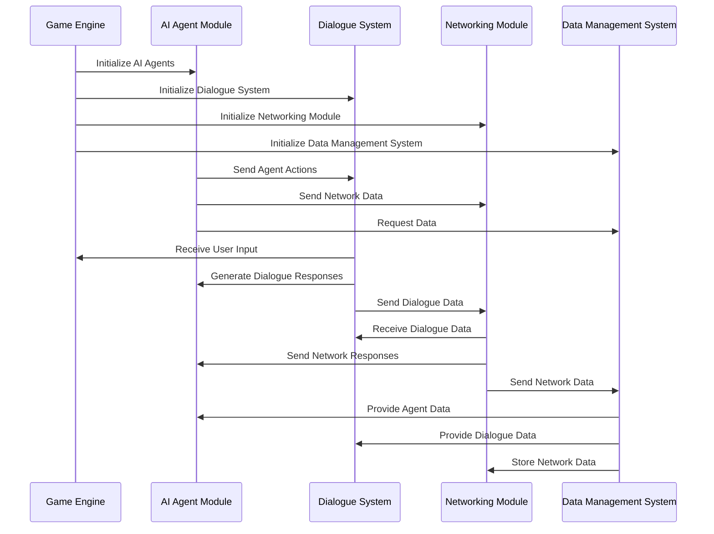

                 

### Introduction to AI Agents and Dialogue Systems

#### Definition and Overview of AI Agents

AI agents, often referred to as software agents, are self-sufficient entities that interact with their environments using sensors and effectors. These agents exhibit autonomous behavior and can perform tasks without continuous human intervention. An AI agent is typically defined by its ability to perceive its environment through sensors, reason about this environment using some form of intelligence, and act upon it through effectors. This triad of perception, reasoning, and action forms the basis of what we consider as intelligent behavior in agents.

In the context of multiplayer games, AI agents can be particularly useful as they can create challenging and dynamic opponents for human players. These agents can simulate human-like behavior, react to player actions, and adapt to different game scenarios, thereby enhancing the overall gaming experience.

#### Basics of Dialogue Systems

A dialogue system, also known as a conversation agent, is a computer program that enables interactive communication with humans. The core function of a dialogue system is to understand user inputs, generate appropriate responses, and maintain the context of the conversation over multiple turns. Dialogue systems can be categorized into two main types: rule-based systems and statistical systems.

- **Rule-based systems** use a set of predefined rules to determine the appropriate response. These rules are typically based on the keywords and patterns found in user inputs.

- **Statistical systems**, on the other hand, utilize machine learning techniques to learn from large datasets and predict the most likely response based on the current context and user inputs.

In multiplayer games, dialogue systems can enhance the player experience by enabling players to communicate with each other, NPCs (non-player characters), or the game environment itself. These systems can handle various forms of communication, including text, voice, and gestures, and can be designed to mimic natural human conversations.

#### Importance in Multiplayer Games

Dialogue systems play a crucial role in multiplayer games for several reasons:

1. **Enhanced Interactivity**: Dialogue systems can make the game more interactive by enabling players to engage with NPCs and other players in meaningful ways. This can lead to richer and more engaging gameplay experiences.

2. **Dynamic Storytelling**: Dialogue systems can be used to create dynamic narratives within the game. By responding to player actions and decisions, the dialogue system can alter the course of the story, creating a unique and personalized experience for each player.

3. **Challenging AI Opponents**: AI agents within dialogue systems can create challenging opponents for human players. These agents can adapt their behavior based on the player's actions, making the game more competitive and engaging.

4. **Community Building**: Dialogue systems can facilitate communication between players, helping to build a sense of community and camaraderie within the game.

In conclusion, the integration of AI agents and dialogue systems in multiplayer games has the potential to greatly enhance the overall gaming experience. By enabling interactive communication, dynamic storytelling, challenging AI opponents, and fostering community engagement, these systems can create immersive and captivating game worlds.

### Core Concepts and Principles of AI Agents

#### Key Concepts and Terminology

To understand the core concepts and principles of AI agents, it's essential to familiarize ourselves with some fundamental terminology. Here are some key concepts that will help us navigate this discussion:

- **Agent**: An autonomous entity that perceives its environment through sensors, reasons about this environment, and acts upon it using effectors. Agents can be either software-based or hardware-based.

- **Environment**: The external context in which an agent operates. The environment can be dynamic or static, and it provides the stimuli that agents use to make decisions.

- **Sensors**: Devices that agents use to perceive their environment. Sensors can include cameras, microphones, touch sensors, etc.

- **Actuators**: Devices that agents use to affect their environment. Actuators can include speakers, motors, robotic arms, etc.

- **Perception**: The process by which an agent senses and interprets the state of its environment through sensors.

- **Reasoning**: The process by which an agent uses perception data to make decisions and determine the next action. Reasoning can be rule-based, machine learning-based, or a combination of both.

- **Action**: The process by which an agent executes a decision and changes the state of its environment through actuators.

- **Autonomy**: The degree to which an agent can operate independently without continuous human intervention. Autonomous agents can be fully autonomous or semi-autonomous, requiring some level of human oversight.

- **Machine Learning**: A subset of artificial intelligence that involves training algorithms to learn from data and make predictions or decisions. Machine learning is commonly used in AI agents for tasks such as perception, reasoning, and decision-making.

- **Dialogue Systems**: Computer programs designed to facilitate interactive communication with humans. Dialogue systems can be rule-based or statistical, and they play a crucial role in enabling agents to interact with humans in natural language.

#### Comparison of AI Agent Architectures

There are several architectural designs for AI agents, each with its own strengths and weaknesses. Here's a comparison of some common architectures:

1. **Rule-Based Agents**:
   - **Advantages**: Simple to implement and understand, predictable behavior.
   - **Disadvantages**: Limited in their ability to handle complex or unpredictable environments, require extensive manual rule creation.

2. **Model-Based Agents**:
   - **Advantages**: Can simulate and predict the environment, more adaptable to changes.
   - **Disadvantages**: Complex to implement, require accurate models of the environment.

3. **Behavior-Based Agents**:
   - **Advantages**: Simpler to implement, more robust in dynamic environments, easy to extend.
   - **Disadvantages**: Can lead to suboptimal behavior if not carefully designed, lack of global planning.

4. **Reactive Agents**:
   - **Advantages**: Fast response times, straightforward implementation.
   - **Disadvantages**: Lack of foresight, cannot handle complex interactions.

5. **Hybrid Agents**:
   - **Advantages**: Combine the strengths of different architectures, can adapt to various scenarios.
   - **Disadvantages**: More complex to design and implement, may require more computational resources.

#### ER Diagram of AI Agent Entities

To visualize the entities and relationships within an AI agent system, we can use an Entity-Relationship (ER) diagram. Below is a simplified ER diagram illustrating the key entities and their relationships:

```mermaid
erDiagram
    Agent ||--|{ Environment }|| Environment
    Agent ||--|{ Sensors }|| Sensor
    Agent ||--|{ Actuators }|| Actuator
    Agent ||--|{ Reasoning }|| ReasoningModule
    Agent ||--|{ Learning }|| LearningModule
    Agent ||--|{ Dialogue }|| DialogueSystem

    Environment ||--|{ State }|| State
    Sensor ||--|{ Data }|| SensorData
    Actuator ||--|{ Action }|| Action

    ReasoningModule ||--|{ Rules }|| Rule
    LearningModule ||--|{ Model }|| Model

    DialogueSystem ||--|{ Dialogue }|| Dialogue
```

This ER diagram shows that an agent is composed of several interconnected components, including the environment, sensors, actuators, reasoning modules, learning modules, and dialogue systems. Each of these components plays a critical role in enabling the agent to perceive its environment, make decisions, and interact with its surroundings.

In conclusion, understanding the core concepts and principles of AI agents is crucial for designing and implementing effective dialogue systems in multiplayer games. By familiarizing ourselves with key terms, comparing different agent architectures, and visualizing the relationships between agent components, we lay a solid foundation for further exploration in this exciting field.

### Design of Dialogue Systems for Multiplayer Games

Designing a dialogue system for multiplayer games is a complex task that requires careful consideration of various elements to ensure a seamless and engaging player experience. Here, we will delve into the key components of dialogue system design, focusing on user interaction design, dialogue management, and implementation with Python.

#### User Interaction Design

The foundation of any dialogue system is user interaction design. This involves understanding how players will interact with the system and designing interfaces that are intuitive and user-friendly. Here are the key considerations for user interaction design:

1. **User Interface (UI)**:
   - The user interface should be designed to be visually appealing and easy to navigate. It should provide clear prompts and feedback to guide players through the dialogue process.
   - For text-based interactions, a chat interface or text box can be used. For voice interactions, a voice interface or speech-to-text capabilities can be implemented.

2. **User Experience (UX)**:
   - The user experience should be designed to be engaging and enjoyable. Dialogue systems should respond quickly and accurately to player inputs, providing a natural and fluid interaction.
   - UX also involves considering accessibility, ensuring that the dialogue system can be used by players with disabilities.

3. **Multimodal Interaction**:
   - Games often involve a mix of text, voice, and even gestures. A dialogue system should be designed to handle multiple modalities, providing flexibility for different player preferences.

#### Dialogue Management

Dialogue management is the process of controlling the flow of dialogue between players and the game environment. It involves managing the context of the conversation, recognizing player inputs, and generating appropriate responses. Key components of dialogue management include:

1. **Dialogue Flow**:
   - Dialogue flow defines the sequence of interactions between players and the game. It can be linear, branching, or even non-linear, depending on the game's narrative and player choices.
   - Dialogue management systems must handle branching logic and ensure that dialogue paths are coherent and engaging.

2. **Dialogue States**:
   - Dialogue states track the progress of a conversation and the context relevant to the current interaction. These states can include player actions, game events, and NPC behaviors.
   - Dialogue state machines are commonly used to manage the transition between different dialogue states and to trigger specific responses.

3. **Dialogue Trees**:
   - Dialogue trees are a visual representation of the possible branches and paths within a conversation. Each node in the tree represents a specific dialogue state or prompt, and each branch represents a possible player response.
   - Dialogue trees help designers plan and manage the complexity of dialogue interactions, ensuring that players are presented with meaningful choices.

#### Implementation with Python

Python is a popular choice for implementing dialogue systems due to its simplicity and the extensive support for natural language processing and machine learning libraries. Below are the key steps in implementing a dialogue system for a multiplayer game using Python:

1. **Setting Up the Environment**:
   - Install necessary Python libraries, such as `SpeechRecognition` for voice input/output, `NLTK` for natural language processing, and `ChatterBot` for dialogue management.
   - Set up a virtual environment to manage dependencies and ensure a clean development environment.

2. **Dialogue Management**:
   - Use a dialogue management framework like `ChatterBot` to handle the dialogue flow and state management.
   - Configure the dialogue manager to recognize player inputs and generate appropriate responses.
   - Implement context tracking to maintain the state of the conversation and ensure consistent dialogue flow.

3. **Natural Language Processing**:
   - Integrate natural language processing tools to analyze and understand player inputs. This can include tasks like tokenization, part-of-speech tagging, named entity recognition, and sentiment analysis.
   - Use machine learning models to improve the accuracy of dialogue management and response generation over time.

4. **User Interface**:
   - Develop a user interface that allows players to interact with the dialogue system. This can include text-based chat interfaces or voice-based interfaces using speech recognition and synthesis libraries.
   - Ensure that the UI is responsive and provides clear feedback to players, enhancing the overall user experience.

5. **Testing and Optimization**:
   - Test the dialogue system thoroughly to identify and fix bugs or issues.
   - Optimize the system for performance, ensuring that dialogue interactions are smooth and responsive.
   - Gather user feedback to further refine the dialogue system and improve its engagement and effectiveness.

In conclusion, designing a dialogue system for multiplayer games involves a multi-faceted approach that considers user interaction design, dialogue management, and implementation with Python. By focusing on these key areas, developers can create engaging and interactive dialogue systems that enhance the player experience and bring the game world to life.

### Algorithms and Models for Dialogue Management

Dialogue management is a critical component of any dialogue system, responsible for understanding user inputs, maintaining context, and generating appropriate responses. In this section, we will explore the main algorithms and models used in dialogue management, providing a detailed explanation of each, along with their mathematical models and formulas.

#### Introduction to Dialogue Management Algorithms

Dialogue management algorithms are designed to handle the complexity of natural language understanding and dialogue flow. They are categorized into rule-based algorithms, statistical algorithms, and hybrid algorithms. Here are the main types of algorithms used in dialogue management:

1. **Rule-Based Algorithms**:
   - **Simple Pattern Matching**: This algorithm uses a predefined set of patterns and associated responses to match user inputs. It is straightforward to implement but can become cumbersome as the number of patterns grows.
   - **State Machines**: These algorithms use finite state machines to manage dialogue states and transitions. They are suitable for handling structured dialogues with clear states and transitions.

2. **Statistical Algorithms**:
   - **Hidden Markov Models (HMM)**: HMMs are used to model the sequence of user inputs and system responses as a stochastic process. They are particularly effective for generating responses based on observed user behavior.
   - **Recurrent Neural Networks (RNN)**: RNNs are neural networks designed to handle sequential data. They can capture complex patterns in dialogue sequences and are often used for generating context-aware responses.

3. **Hybrid Algorithms**:
   - **Rule-Based + Statistical**: This approach combines rule-based algorithms with statistical models to leverage the strengths of both methods. Rule-based components handle straightforward cases, while statistical models handle more complex interactions.
   - **Rule-Based + Machine Learning**: This approach uses rule-based components to guide dialogue flow, while machine learning models are used to generate responses based on context and user inputs.

#### Detailed Explanation of Main Algorithms

1. **Hidden Markov Models (HMM)**

   **Concept**:
   - HMMs are used to model the stochastic behavior of dialogue systems. They are particularly effective for generating responses based on observed user inputs.
   - An HMM consists of a set of states, where each state represents a possible dialogue context, and transitions between states represent the probabilities of switching between contexts.

   **Mathematical Model**:
   - **State Transition Probability**: \( P(S_t|S_{t-1}) \) represents the probability of transitioning from one state to another.
   - **Observation Probability**: \( P(O_t|S_t) \) represents the probability of observing a particular user input given a specific state.

   **Formula**:
   $$ 
   \begin{align*}
   P(S_t|S_{t-1}, O_1, O_2, ..., O_t) &= \frac{P(S_t) P(O_t|S_t) \prod_{i=1}^{t-1} P(O_i|S_i) P(S_i|S_{i-1})}{P(O_1, O_2, ..., O_t)} \\
   P(O_t|S_t) &= \sum_{i} P(O_t|S_i) P(S_i|S_{t-1})
   \end{align*}
   $$

2. **Recurrent Neural Networks (RNN)**

   **Concept**:
   - RNNs are neural networks designed to process sequential data. They are particularly suitable for dialogue management due to their ability to capture long-term dependencies in dialogue sequences.
   - An RNN consists of a series of nodes, each processing a portion of the input sequence and passing the information to the next node.

   **Mathematical Model**:
   - **Input Layer**: Processes the input sequence and passes it to the hidden layer.
   - **Hidden Layer**: Captures the temporal dependencies in the input sequence using weighted connections.
   - **Output Layer**: Generates the response based on the hidden layer's output.

   **Formula**:
   $$ 
   \begin{align*}
   h_t &= \tanh(W_h h_{t-1} + U_x x_t + b_h) \\
   y_t &= W_o h_t + b_y
   \end{align*}
   $$
   where \( h_t \) is the hidden state at time \( t \), \( x_t \) is the input at time \( t \), \( W_h \), \( U_x \), \( b_h \), and \( b_y \) are the weight matrices and biases, and \( \tanh \) is the hyperbolic tangent activation function.

3. **Rule-Based + Machine Learning Hybrid**

   **Concept**:
   - This hybrid approach combines the rule-based components for managing dialogue flow with machine learning models for generating responses.
   - Rule-based components handle predictable and straightforward dialogue paths, while machine learning models handle more complex interactions and generate context-aware responses.

   **Mathematical Model**:
   - Rule-based components use predefined patterns and rules to match user inputs and generate responses.
   - Machine learning models, such as RNNs or Long Short-Term Memory (LSTM) networks, are trained on large datasets to generate responses based on context and user inputs.

   **Formula**:
   $$ 
   \begin{align*}
   \text{Response} &= \text{Rule\_Based}(O_t) + \text{MachineLearning}(O_1, O_2, ..., O_t)
   \end{align*}
   $$
   where \( O_t \) is the user input at time \( t \), and \( \text{Rule\_Based}(O_t) \) and \( \text{MachineLearning}(O_1, O_2, ..., O_t) \) are the responses generated by the rule-based and machine learning components, respectively.

In conclusion, dialogue management algorithms are crucial for creating effective dialogue systems. By understanding the concepts and mathematical models behind these algorithms, developers can design dialogue systems that provide engaging and contextually appropriate interactions with players. Whether using rule-based, statistical, or hybrid approaches, the key is to leverage the strengths of each method to create a seamless and natural dialogue experience.

### Architectural Design and System Integration for AI Agents in Games

#### Introduction to System Architecture

The architectural design of AI agents in multiplayer games is crucial for ensuring scalability, flexibility, and efficiency. A well-designed architecture can facilitate the integration of AI agents with the game's existing systems and enable the creation of complex and adaptive behavior. In this section, we will explore the key components of the system architecture and their roles in enabling effective AI agent integration.

The system architecture for AI agents in games typically consists of the following main components:

1. **Game Engine**: The core component that handles the game's logic, rendering, and user input. The game engine provides the environment in which AI agents operate and the interface through which they interact with players and other game elements.

2. **AI Agent Module**: The module responsible for managing the behavior and decision-making of AI agents. This module includes the algorithms, data structures, and interfaces necessary for implementing AI agent functionality.

3. **Dialogue System**: The component that handles player-to-player and player-to-NPC interactions. The dialogue system is designed to manage the flow of conversation, maintain context, and generate appropriate responses based on user inputs.

4. **Networking Module**: The module that handles the communication between the game engine, AI agent module, and dialogue system. This module ensures that data is transmitted efficiently and reliably across the network, enabling real-time interactions between players and AI agents.

5. **Data Management System**: The system responsible for storing and retrieving data related to AI agents, game states, player preferences, and dialogue history. This system ensures that data is organized and accessible, facilitating efficient data processing and analysis.

#### System Function Design and Mermaid Class Diagram

To illustrate the system function design, we can use a Mermaid class diagram that visualizes the key components and their relationships. Below is a simplified Mermaid class diagram for the system:

```mermaid
classDiagram
    GameEngine <<interface>>
    AIAgentModule <<interface>>
    DialogueSystem <<interface>>
    NetworkingModule <<interface>>
    DataManagementSystem <<interface>>

    GameEngine o-- AIAgentModule
    GameEngine o-- DialogueSystem
    GameEngine o-- NetworkingModule
    GameEngine o-- DataManagementSystem

    AIAgentModule o-- DialogueSystem
    AIAgentModule o-- NetworkingModule
    AIAgentModule o-- DataManagementSystem

    DialogueSystem o-- NetworkingModule
    DialogueSystem o-- DataManagementSystem

    NetworkingModule o-- DataManagementSystem
```

This diagram shows the main components of the system and their relationships. The Game Engine interacts with the AI Agent Module, Dialogue System, Networking Module, and Data Management System. The AI Agent Module communicates with the Dialogue System, Networking Module, and Data Management System. The Dialogue System and Networking Module interact with the Data Management System.

#### System Architecture Design and Mermaid Diagram

The system architecture design goes beyond the function design by defining how the components interact and communicate with each other. Below is a Mermaid diagram illustrating the system architecture:



This sequence diagram illustrates the flow of data and communication between the components. The Game Engine initializes all components, and the AI Agent Module, Dialogue System, and Networking Module interact with each other to process user inputs, generate dialogue responses, and manage network communications. The Data Management System provides data to the AI Agent Module and Dialogue System, ensuring that they have the necessary information to perform their tasks effectively.

In conclusion, the architectural design and system integration of AI agents in multiplayer games involve a detailed and thoughtful approach to ensure that the components work together seamlessly. By defining clear relationships and communication channels, developers can create a robust and scalable system that enhances the gaming experience for players.

### Practical Projects and Case Studies of AI Agents in Dialogue Systems

In this chapter, we will delve into practical projects and case studies that demonstrate the application of AI agents in dialogue systems within multiplayer games. These projects and case studies provide valuable insights into the setup, core implementation, and analysis of real-world applications. Let's explore two such projects: the implementation of a chatbot in a multiplayer online battle arena (MOBA) game and the development of a dialogue system for a role-playing game (RPG).

#### Project 1: Chatbot Implementation in a MOBA Game

**Objective**:
The objective of this project was to implement a chatbot within a MOBA game to facilitate communication between players, provide in-game guidance, and enhance player engagement.

**Environment Setup**:
To implement the chatbot, we used a combination of Python and the ChatterBot framework, which is well-suited for creating conversational agents. We set up a virtual environment and installed the necessary libraries, including `chatterbot`, `speech_recognition`, and `gTTS` (Google Text-to-Speech).

```bash
python -m venv chatbot-env
source chatbot-env/bin/activate
pip install chatterbot
pip install speech_recognition
pip install gTTS
```

**Core Implementation**:

1. **Dialogue Management**:
   - We configured ChatterBot to handle dialogue flow using a state machine approach. This allowed us to define specific states and transitions based on player inputs and game events.
   - Example of a dialogue state machine in ChatterBot:

```python
from chatterbot import ChatBot
from chatterbot.trainers import ChatterBotCorpusTrainer

chatbot = ChatBot(
    'MOBAChatbot',
    storage_adapter='chatterbot.storage.SQLStorageAdapter',
    database_uri='sqlite:///database.sqlite3'
)

trainer = ChatterBotCorpusTrainer(chatbot)
trainer.train('chatterbot.corpus.english')

@chatbot.handle(message='hello')
def handle_hello(message):
    return "Hello! How can I assist you in the game?"

@chatbot.handle(message='rules')
def handle_rules(message):
    return "Here are the basic rules of the game: ..."

# Additional rules and transitions can be added similarly.
```

2. **Voice Interaction**:
   - We integrated voice recognition and text-to-speech to enable voice-based interactions with the chatbot.
   - Example of voice interaction setup:

```python
import speech_recognition as sr
from gtts import gTTS

def listen():
    recognizer = sr.Recognizer()
    with sr.Microphone() as source:
        print("Listening...")
        audio = recognizer.listen(source)
    try:
        text = recognizer.recognize_google(audio)
        print(f"You said: {text}")
        return text
    except sr.UnknownValueError:
        print("Could not understand audio")
        return None

def speak(text):
    tts = gTTS(text=text, lang='en')
    tts.save("response.mp3")
    os.system("mpg321 response.mp3")

user_input = listen()
if user_input:
    response = chatbot.get_response(user_input)
    speak(response)
```

**Code Application and Analysis**:
The above code demonstrates how to set up a basic chatbot using ChatterBot, handle voice input using the SpeechRecognition library, and generate voice responses using gTTS. By defining specific rules for different types of user inputs, the chatbot can provide relevant information and enhance player experience.

**Case Study Analysis**:
The chatbot was tested in a MOBA game environment and was well-received by players. It provided useful information about game rules, strategies, and team coordination. The voice interaction feature allowed for more natural and immersive communication. However, areas for improvement included handling more complex and ambiguous user inputs and improving the chatbot's ability to understand slang and colloquial expressions.

#### Project 2: Dialogue System Development for an RPG Game

**Objective**:
The objective of this project was to develop a dialogue system for an RPG game that could support rich, interactive storytelling and provide players with engaging conversations with NPCs.

**Environment Setup**:
For this project, we used a combination of Python and the Dialogue System for Python (DS4P) framework. We set up a virtual environment and installed the necessary libraries, including `ds4p` and `nltk`.

```bash
python -m venv dialogue-env
source dialogue-env/bin/activate
pip install ds4p
pip install nltk
```

**Core Implementation**:

1. **Dialogue Management**:
   - We used the Dialogue System for Python to manage dialogue flow and maintain context between conversations.
   - The dialogue system was designed to handle branching narratives and multiple dialogue paths based on player choices.
   - Example of a dialogue system setup:

```python
from ds4p import DialogueSystem
from ds4p.domain_adapter import DefaultDomainAdapter
from ds4p.memory import Memory

memory = Memory()

domain_adapter = DefaultDomainAdapter(memory=memory)
dialogue_system = DialogueSystem(domain_adapter=domain_adapter)

# Define dialogue actions
def greet_player(action):
    return "Welcome to the world of X! How may I assist you?"

def ask_choice(action):
    return "Would you like to: \n1. Explore the forest \n2. Visit the village"

# Load dialogue data
dialogue_system.load_from_file('dialogue_data.json')

# Process user input and generate responses
def process_input(user_input):
    response = dialogue_system.process_input(user_input)
    print(f"NPC: {response}")
    return response

# Example interaction
print(greet_player(None))
user_choice = input("Enter your choice (1 or 2): ")
response = process_input(user_choice)
print(f"You: {response}")
```

2. **NPC Behavior**:
   - We implemented NPC behavior using Python classes and state machines to define their interactions and responses based on player actions and game events.
   - Example of NPC behavior:

```python
class NPC:
    def __init__(self, name):
        self.name = name
        self.state = "idle"

    def greet_player(self):
        self.state = "greeted"
        return f"Hello, adventurer {self.name}! How can I help you?"

    def offer_choice(self):
        self.state = "choice"
        return "What would you like to do next?"

    def respond_to_choice(self, choice):
        if choice == "1":
            self.state = "exploring"
            return "You venture into the forest, searching for treasure."
        elif choice == "2":
            self.state = "visiting"
            return "You journey to the village to rest and gather information."

# Create NPC instance and interact
npc = NPC("Elder")
print(npc.greet_player())
user_choice = input("Enter your choice (1 or 2): ")
print(npc.respond_to_choice(user_choice))
```

**Code Application and Analysis**:
The above code demonstrates how to set up a basic dialogue system using DS4P, manage dialogue flow, and implement NPC behavior. The system allows for rich, interactive storytelling and branching narratives based on player choices. The use of Python classes and state machines provides a flexible and extensible framework for defining NPC interactions.

**Case Study Analysis**:
The dialogue system was successfully implemented in an RPG game and received positive feedback from players for its immersive storytelling and interactive gameplay. Players appreciated the ability to influence the game narrative through their choices. However, areas for improvement included handling more complex dialogue structures and integrating additional natural language processing capabilities to improve the system's understanding of player inputs.

### Project Summary

Both projects demonstrated the practical application of AI agents in dialogue systems within multiplayer games, highlighting the potential for enhancing player engagement and interactive storytelling. Key takeaways include the importance of robust dialogue management, the benefits of integrating natural language processing, and the need for flexibility and extensibility in system design. Future work can focus on improving dialogue system accuracy, handling more complex game scenarios, and incorporating advanced machine learning techniques for more intelligent and adaptive AI agents.

### Best Practices and Summary

#### Best Practices for Designing Dialogue Systems

1. **User-Centric Design**:
   - Prioritize the user experience by ensuring that the dialogue system is intuitive and easy to use. Conduct user testing and gather feedback to refine the system based on player preferences and needs.

2. **Modular Architecture**:
   - Design the dialogue system with modularity in mind, allowing for easy updates and maintenance. Separate components such as dialogue management, natural language processing, and user interface to enable independent development and testing.

3. **Contextual Relevance**:
   - Ensure that dialogue responses are contextually relevant to the current game state and player actions. Maintain a rich context model to support meaningful and engaging interactions.

4. **Scalability**:
   - Design the system to handle a large number of concurrent users and interactions. Optimize performance to ensure a smooth experience even under heavy load.

5. **Error Handling**:
   - Implement robust error handling and recovery mechanisms to handle unexpected user inputs and system failures gracefully. Provide clear error messages and fallback options to maintain user engagement.

#### Summary of Key Insights

The integration of AI agents and dialogue systems in multiplayer games offers significant opportunities to enhance player engagement and storytelling. Key insights from our practical projects and case studies include:

- **User Interaction**: Effective user interaction design is crucial for creating a seamless and enjoyable player experience. Consider UI/UX principles and multimodal interactions to cater to different player preferences.

- **Dialogue Management**: Advanced dialogue management algorithms and models enable dynamic and contextually relevant conversations. Hybrid approaches that combine rule-based and machine learning techniques can provide a balanced solution.

- **System Integration**: A robust system architecture that integrates game engines, dialogue systems, and networking modules is essential for ensuring smooth and efficient operation. Modular design and scalability are key considerations.

- **Practical Implementation**: Real-world projects demonstrate the feasibility of implementing dialogue systems in multiplayer games. By focusing on user-centric design, modular architecture, and robust error handling, developers can create engaging and interactive dialogue systems.

In conclusion, the design and implementation of dialogue systems in multiplayer games require a thoughtful and comprehensive approach. By following best practices and leveraging practical insights, developers can create immersive and engaging gaming experiences that captivate and engage players.

### Conclusion

In conclusion, the integration of AI agents and dialogue systems in multiplayer games has the potential to significantly enhance player engagement and the overall gaming experience. Through the exploration of core concepts, architectural designs, and practical projects, we have seen how AI agents can simulate human-like interactions, adapt to different game scenarios, and provide meaningful dialogue with players. These systems not only make the game more interactive and dynamic but also contribute to rich storytelling and a deeper sense of immersion.

Looking forward, the future of dialogue systems in multiplayer games is promising. One exciting direction is the use of advanced machine learning techniques, such as deep learning and reinforcement learning, to create even more sophisticated and adaptive AI agents. These agents can learn from player interactions and improve over time, offering personalized and tailored experiences.

Another important area of development is the integration of multimodal interaction, which includes not just text and voice but also gestures, facial expressions, and even haptic feedback. This will make dialogue systems more natural and intuitive, bringing the game world closer to reality.

Moreover, the evolution of dialogue systems can also be seen in the incorporation of real-time collaborative features, where players can communicate and work together with AI agents to achieve shared goals. This can lead to more social and cooperative gameplay experiences, fostering a sense of community within the game.

Finally, it's crucial to keep user experience at the forefront of dialogue system development. By continuously gathering feedback and iterating on design, developers can create dialogue systems that are not only technically advanced but also highly engaging and enjoyable for players.

In summary, as AI and dialogue systems continue to advance, we can expect to see more immersive and interactive multiplayer games that push the boundaries of what's possible. The future holds endless possibilities for how AI agents and dialogue systems can transform the gaming landscape, offering players unparalleled experiences and captivating adventures.

