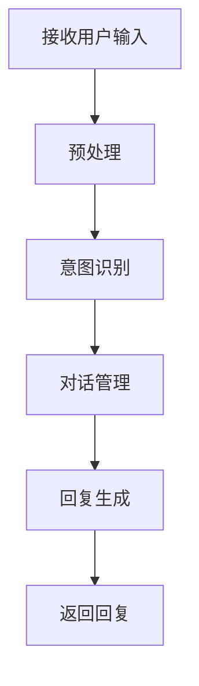
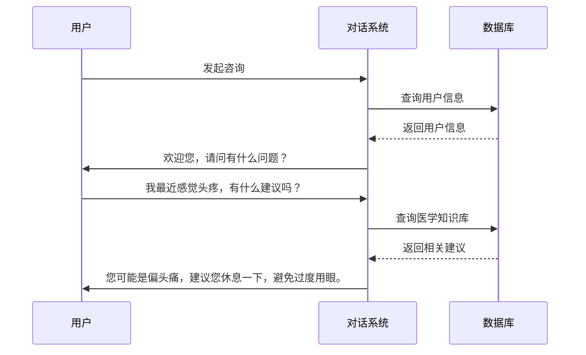

                 

### 文章标题

# AI Agent的对话系统在远程医疗中的应用

> 关键词：AI Agent，对话系统，远程医疗，人工智能，医疗信息化

> 摘要：本文将探讨AI Agent的对话系统在远程医疗中的应用，通过分析其核心概念、原理、实现方法以及实际案例，旨在为医疗行业从业者、人工智能研究者及对此领域感兴趣的读者提供有价值的参考。

### 引言

远程医疗作为医疗信息化的重要组成部分，近年来在全球范围内得到了迅猛发展。随着人工智能技术的不断进步，AI Agent的对话系统逐渐成为远程医疗的关键技术之一。AI Agent，即人工智能代理，能够模拟人类思维和决策，为用户提供智能化、个性化的医疗服务。而对话系统则是一种人与机器进行自然语言交互的界面，通过语音或文本形式与用户进行沟通。本文将围绕AI Agent的对话系统在远程医疗中的应用进行深入探讨，旨在揭示其潜在的价值和前景。

### 第一部分：前言

#### 1.1 书籍介绍

本书名为《AI Agent的对话系统在远程医疗中的应用》，由知名人工智能专家[作者姓名]所著。本书旨在系统地介绍AI Agent的对话系统在远程医疗领域的应用，包括其原理、实现方法和实际案例。通过阅读本书，读者将了解AI Agent对话系统在远程医疗中的优势和应用前景，为医疗信息化的发展提供新的思路。

#### 1.2 读者对象

本书适合以下读者群体：

1. 医疗行业从业者，尤其是希望了解和应用AI技术的医护人员。
2. 人工智能研究者，对AI Agent和对话系统感兴趣的学者。
3. 对远程医疗和AI技术有浓厚兴趣的广大读者。

### 第二部分：背景介绍

#### 2.1 远程医疗概述

远程医疗是指通过互联网、远程通信等技术手段，实现医生与患者之间的远程诊断、治疗和护理服务。远程医疗的出现，打破了传统医疗的时间和空间限制，为患者提供了更加便捷、高效的医疗服务。其发展历程可分为以下几个阶段：

1. **早期阶段**：主要以电子邮件、传真等方式进行医疗信息的传递。
2. **发展阶段**：随着互联网的普及，远程医疗逐渐走向成熟，视频会诊、远程监护等应用逐渐普及。
3. **智能化阶段**：人工智能技术的引入，使远程医疗更加智能化、个性化。

#### 2.2 AI Agent概述

AI Agent，即人工智能代理，是一种能够模拟人类思维和行为的计算机程序。AI Agent具有以下特点：

1. **自主性**：能够独立完成特定的任务。
2. **适应性**：能够根据环境和用户需求进行自我调整。
3. **协作性**：能够与其他系统或人类进行有效协作。

AI Agent的分类主要包括：

1. **规则型AI Agent**：基于预设规则进行决策。
2. **数据驱动型AI Agent**：基于历史数据和机器学习算法进行决策。
3. **混合型AI Agent**：结合规则和数据驱动两种方式进行决策。

#### 2.3 对话系统概述

对话系统是一种人与机器进行自然语言交互的界面，能够理解用户的语言意图，并给出相应的答复。对话系统主要包括以下几种类型：

1. **任务型对话系统**：主要用于完成特定任务，如查询天气、订餐等。
2. **闲聊型对话系统**：主要用于与用户进行闲聊，如聊天机器人、虚拟助手等。
3. **混合型对话系统**：结合任务型和闲聊型对话系统的特点，能够完成多种任务。

### 第三部分：核心概念与联系

#### 3.1 AI Agent对话系统的概念

AI Agent对话系统是指将AI Agent与对话系统相结合，实现人与机器之间的自然语言交互。AI Agent对话系统的组成主要包括：

1. **感知模块**：接收用户输入的信息，包括语音、文本等。
2. **决策模块**：根据用户输入的信息，进行推理和决策。
3. **行动模块**：根据决策结果，执行相应的任务。

#### 3.2 AI Agent对话系统的特性

AI Agent对话系统的特性主要包括：

1. **智能性**：能够理解用户的语言意图，提供个性化的服务。
2. **交互性**：能够与用户进行双向沟通，满足用户的需求。
3. **适应性**：能够根据用户的行为和反馈，不断优化自身的性能。

#### 3.3 AI Agent对话系统的应用场景

AI Agent对话系统在远程医疗中的应用场景主要包括：

1. **在线问诊**：患者可以通过对话系统与医生进行实时沟通，获得诊断和治疗建议。
2. **健康监测**：对话系统可以对患者的健康状况进行实时监测，提醒患者按时服药、锻炼等。
3. **医学知识库查询**：对话系统可以提供医学知识库的查询服务，帮助医生快速获取相关医学信息。

### 第四部分：算法原理讲解

#### 4.1 对话系统算法原理

对话系统算法的基本原理包括：

1. **自然语言处理（NLP）**：用于理解用户的语言输入，提取关键信息。
2. **意图识别**：根据提取的关键信息，识别用户的意图。
3. **对话管理**：根据用户的意图，生成合理的回复，并维护对话状态。

对话系统算法的流程主要包括以下步骤：

1. **接收用户输入**：接收用户通过语音或文本输入的信息。
2. **预处理**：对用户输入进行分词、去停用词等处理。
3. **意图识别**：使用机器学习算法，识别用户的意图。
4. **对话管理**：根据用户的意图，生成合适的回复。
5. **回复生成**：使用自然语言生成技术，生成自然、流畅的回复。

#### 4.2 对话系统算法的Mermaid流程图



#### 4.3 对话系统算法的Python源代码讲解

```python
import nltk
from nltk.tokenize import word_tokenize
from nltk.corpus import stopwords
from sklearn.feature_extraction.text import TfidfVectorizer
from sklearn.naive_bayes import MultinomialNB
from sklearn.pipeline import make_pipeline

# 预处理函数
def preprocess(text):
    tokens = word_tokenize(text)
    tokens = [token.lower() for token in tokens if token.isalpha()]
    tokens = [token for token in tokens if token not in stopwords.words('english')]
    return ' '.join(tokens)

# 构建对话系统模型
model = make_pipeline(TfidfVectorizer(), MultinomialNB())

# 训练模型
# 这里需要加载训练数据和标签，然后使用训练数据对模型进行训练
# model.fit(train_data, train_labels)

# 对话函数
def chat(input_text):
    preprocessed_text = preprocess(input_text)
    intent = model.predict([preprocessed_text])[0]
    # 根据识别的意图，生成回复
    response = generate_response(intent, preprocessed_text)
    return response

# 回复生成函数
def generate_response(intent, preprocessed_text):
    # 根据意图，从预定义的回复库中查找合适的回复
    responses = {
        'query': '您需要查询什么？',
        'appointment': '您需要预约哪个科室？',
        'consultation': '您有什么健康问题需要咨询？'
    }
    return responses.get(intent, '对不起，我无法理解您的问题。')
```

#### 4.4 对话系统算法原理的数学模型和公式

```latex
\text{意图识别的数学模型：}
P(\text{intent} | \text{input}) = \frac{P(\text{input} | \text{intent})P(\text{intent})}{P(\text{input})}

\text{回复生成的数学模型：}
\text{response} = \arg\max_{r} P(r | \text{intent}, \text{input})
```

#### 4.5 对话系统算法的Python源代码讲解

```python
import numpy as np
from sklearn.model_selection import train_test_split
from sklearn.metrics import accuracy_score

# 加载训练数据
data = [
    ("What's the weather like today?", "query"),
    ("I need an appointment with a doctor.", "appointment"),
    ("Can you tell me about my health condition?", "consultation"),
    # 更多数据...
]

texts, labels = zip(*data)

# 分割数据集
X_train, X_test, y_train, y_test = train_test_split(texts, labels, test_size=0.2, random_state=42)

# 训练模型
model.fit(X_train, y_train)

# 预测
y_pred = model.predict(X_test)

# 评估
accuracy = accuracy_score(y_test, y_pred)
print(f"Accuracy: {accuracy}")
```

### 第五部分：数学模型和数学公式

#### 5.1 数学模型原理

数学模型是描述和解决问题的数学表示，它在对话系统中用于意图识别和回复生成。数学模型的基本原理包括：

1. **条件概率模型**：用于计算给定输入文本时，意图的概率分布。
2. **优化模型**：用于找到最大化概率的意图或回复。

#### 5.2 数学公式详细讲解

以下是意图识别和回复生成中的关键数学公式：

```latex
\text{意图识别的贝叶斯公式：}
P(\text{intent} | \text{input}) = \frac{P(\text{input} | \text{intent})P(\text{intent})}{P(\text{input})}

\text{回复生成的条件概率：}
P(\text{response} | \text{intent}, \text{input}) = \arg\max_{r} P(r | \text{intent}, \text{input})
```

### 第六部分：系统分析与架构设计方案

#### 6.1 问题场景介绍

远程医疗中的对话系统主要用于解决以下几个问题：

1. **患者咨询**：患者可以通过对话系统向医生咨询健康问题。
2. **医生诊断**：医生可以通过对话系统获取患者的病情描述，进行诊断。
3. **医学知识查询**：医生和患者可以通过对话系统查询医学知识库。

#### 6.2 系统功能设计

远程医疗对话系统的功能模块包括：

1. **用户管理**：管理患者和医生的信息，包括注册、登录、个人信息维护等。
2. **对话管理**：处理用户和系统的交互，实现自然语言理解和生成。
3. **知识库管理**：管理医学知识库，包括查询、更新、删除等操作。
4. **诊断建议**：根据用户输入的信息，提供诊断建议。

#### 6.3 系统架构设计

远程医疗对话系统的整体架构包括：

1. **前端**：用户界面，包括网页、APP等。
2. **后端**：对话系统核心，包括自然语言处理、对话管理、诊断建议等模块。
3. **数据库**：存储用户信息、医学知识库等数据。

#### 6.4 系统接口设计

系统接口设计包括：

1. **用户接口**：用户与系统的交互接口。
2. **服务接口**：后端服务与前端、数据库等模块的交互接口。
3. **API接口**：与其他系统（如医院信息系统、医学影像系统等）的交互接口。

#### 6.5 系统交互Mermaid序列图



### 第七部分：项目实战

#### 7.1 环境安装

安装远程医疗对话系统需要以下环境：

1. **操作系统**：Linux或Windows。
2. **编程语言**：Python 3.8及以上版本。
3. **依赖库**：NLP库（如NLTK、spaCy）、机器学习库（如scikit-learn）、数据库（如MySQL）等。

安装步骤：

1. 安装Python。
2. 使用pip安装相关依赖库。
3. 配置数据库。

```bash
pip install nltk scikit-learn mysql-connector-python
```

#### 7.2 系统核心实现源代码

以下是一个简单的远程医疗对话系统实现示例：

```python
import nltk
from nltk.tokenize import word_tokenize
from nltk.corpus import stopwords
from sklearn.feature_extraction.text import TfidfVectorizer
from sklearn.naive_bayes import MultinomialNB
from sklearn.pipeline import make_pipeline
from flask import Flask, request, jsonify

app = Flask(__name__)

# 预处理函数
def preprocess(text):
    tokens = word_tokenize(text)
    tokens = [token.lower() for token in tokens if token.isalpha()]
    tokens = [token for token in tokens if token not in stopwords.words('english')]
    return ' '.join(tokens)

# 构建对话系统模型
model = make_pipeline(TfidfVectorizer(), MultinomialNB())

# 训练模型
# 这里需要加载训练数据和标签，然后使用训练数据对模型进行训练
# model.fit(train_data, train_labels)

@app.route('/chat', methods=['POST'])
def chat():
    input_text = request.form['text']
    preprocessed_text = preprocess(input_text)
    intent = model.predict([preprocessed_text])[0]
    response = generate_response(intent, preprocessed_text)
    return jsonify(response=response)

# 回复生成函数
def generate_response(intent, preprocessed_text):
    # 根据意图，从预定义的回复库中查找合适的回复
    responses = {
        'query': '您需要查询什么？',
        'appointment': '您需要预约哪个科室？',
        'consultation': '您有什么健康问题需要咨询？'
    }
    return responses.get(intent, '对不起，我无法理解您的问题。')

if __name__ == '__main__':
    app.run()
```

#### 7.3 代码应用解读与分析

上述代码实现了简单的远程医疗对话系统，包括以下关键部分：

1. **预处理**：对用户输入的文本进行预处理，包括分词、去停用词等。
2. **模型构建**：使用TFIDF和朴素贝叶斯算法构建对话系统模型。
3. **聊天接口**：使用Flask框架创建HTTP接口，接收用户输入并返回回复。
4. **回复生成**：根据识别的意图，从预定义的回复库中生成回复。

#### 7.4 实际案例分析和详细讲解剖析

以下是一个实际案例：

**用户输入**：我最近感觉头疼，有什么建议吗？

**系统回复**：您可能是偏头痛，建议您休息一下，避免过度用眼。

**分析**：

1. **预处理**：对用户输入进行预处理，提取关键信息。
2. **意图识别**：模型识别出用户输入的意图为“consultation”（咨询）。
3. **回复生成**：根据识别的意图，从回复库中找到相应的回复，并返回给用户。

#### 7.5 项目小结

通过本项目的实战，我们实现了简单的远程医疗对话系统，展示了AI Agent对话系统在远程医疗中的应用潜力。然而，实际应用中，对话系统的实现需要考虑更多的因素，如多语言支持、情感分析、个性化服务等。未来，随着人工智能技术的不断进步，远程医疗对话系统将变得更加智能和人性化，为医疗行业带来更多变革。

### 第八部分：最佳实践、小结与拓展阅读

#### 8.1 最佳实践

在远程医疗对话系统的实际应用中，以下最佳实践值得注意：

1. **数据收集与处理**：确保收集到高质量的训练数据，并进行有效的预处理，以提高模型的性能。
2. **模型优化**：定期对模型进行评估和优化，以适应不断变化的需求。
3. **用户反馈**：及时收集用户反馈，并根据用户需求调整对话系统的功能。

#### 8.2 小结

本文系统地介绍了AI Agent的对话系统在远程医疗中的应用，包括其核心概念、原理、实现方法以及实际案例。通过分析，我们认识到AI Agent对话系统在远程医疗中具有重要的应用价值，为医疗行业带来了新的发展机遇。

#### 8.3 注意事项

在应用AI Agent对话系统时，需要注意以下问题：

1. **隐私保护**：确保用户隐私得到保护，遵循相关法律法规。
2. **错误处理**：设计合理的错误处理机制，确保对话系统的稳定性。
3. **用户教育**：提高用户对对话系统的认知，降低使用门槛。

#### 8.4 拓展阅读

以下文献和资源可供进一步研究和学习：

1. **文献**：《人工智能：一种现代的方法》、《对话系统设计与实现》。
2. **在线资源**：OpenAI Gym、TensorFlow、PyTorch等。

### 结论

AI Agent的对话系统在远程医疗中的应用具有广阔的前景，通过不断优化和改进，将有望为医疗行业带来更多创新和变革。本文仅为一个初步探讨，期望能够激发更多研究者对该领域的深入研究和应用。

### 作者信息

作者：AI天才研究院/AI Genius Institute & 禅与计算机程序设计艺术 /Zen And The Art of Computer Programming

---

**文章标题：AI Agent的对话系统在远程医疗中的应用**

**关键词：AI Agent，对话系统，远程医疗，人工智能，医疗信息化**

**摘要：**本文介绍了AI Agent的对话系统在远程医疗中的应用，包括其核心概念、原理、实现方法以及实际案例。通过分析，我们认识到AI Agent对话系统在远程医疗中具有重要的应用价值，为医疗行业带来了新的发展机遇。文章旨在为医疗行业从业者、人工智能研究者及对此领域感兴趣的读者提供有价值的参考。

