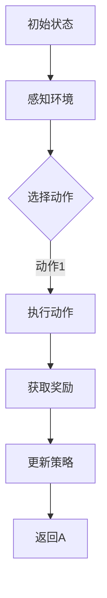
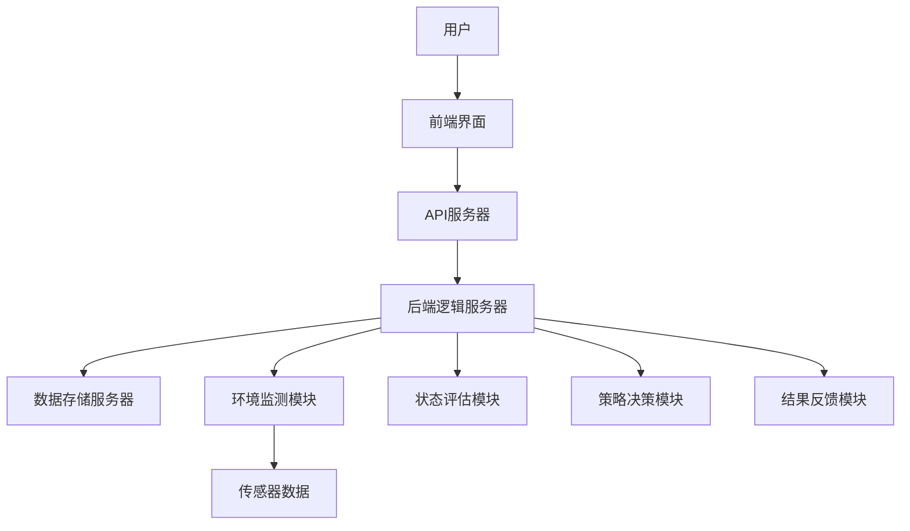
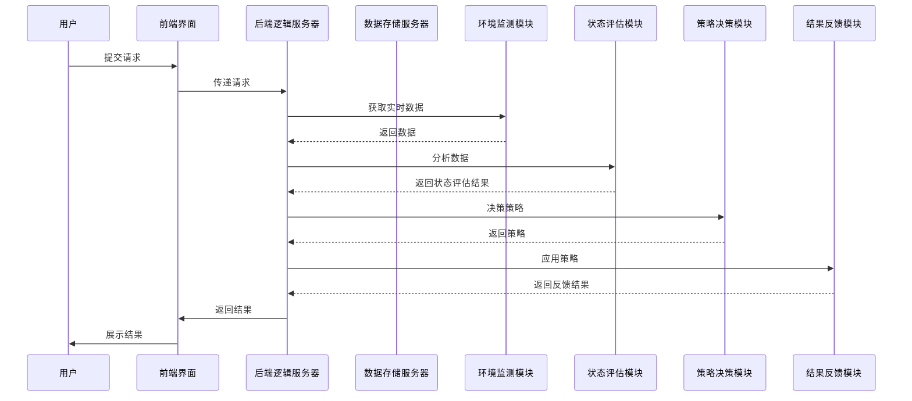

                 


### 文章标题

# AI Agent的强化学习在复杂环境中的应用

### 关键词

- AI Agent
- 强化学习
- 复杂环境
- 机器人
- 智能决策
- 策略优化

### 摘要

本文深入探讨了AI Agent在复杂环境中的强化学习应用。首先，我们介绍了强化学习的基本概念和它在AI领域的地位。接着，我们详细分析了强化学习在复杂环境中的应用挑战，并提出了相应的解决方案。文章通过一个具体的案例，展示了如何使用强化学习算法来优化AI Agent的策略，使其在复杂环境中表现出色。最后，我们提供了一些最佳实践，以帮助读者在实际项目中应用这些技术。

----------------------------------------------------------------

## 背景介绍

### 核心概念术语说明

- **AI Agent**：指的是能够自主感知环境、决策行动并达成目标的智能体。
- **强化学习**：一种机器学习范式，通过奖励机制来训练模型，使其学会在特定环境中做出最优决策。
- **复杂环境**：指那些状态空间巨大、决策变量众多且存在不确定性的环境。

### 问题背景

随着人工智能技术的快速发展，AI Agent在现实世界中的应用越来越广泛。然而，现实世界中的环境往往非常复杂，这使得传统的机器学习算法难以应对。强化学习作为一种能够在复杂环境中进行学习的方法，逐渐引起了研究者和工程师的广泛关注。

### 问题描述

在复杂环境中，AI Agent需要具备以下能力：

- **环境感知**：准确感知环境状态。
- **决策制定**：基于环境状态制定合适的行动策略。
- **适应性**：在面对未知或动态变化的环境时，能够快速适应。

### 问题解决

强化学习提供了一种有效的方法来训练AI Agent，使其能够在复杂环境中表现出色。通过以下步骤，我们可以实现这一目标：

1. **定义环境**：明确环境的边界、状态空间和动作空间。
2. **设计奖励机制**：根据环境目标和性能指标，设计合适的奖励机制。
3. **选择算法**：根据问题特点选择合适的强化学习算法。
4. **训练模型**：使用历史数据和奖励信号来训练模型。
5. **评估与优化**：评估模型性能，并进行迭代优化。

### 边界与外延

强化学习在复杂环境中的应用仍然存在一些挑战，如：

- **探索与利用的平衡**：如何在探索未知状态和利用已有知识之间找到平衡。
- **模型的可解释性**：如何解释模型的行为，提高其在实际应用中的可信度。
- **计算效率**：如何提高算法的计算效率，以应对大规模环境。

### 概念结构与核心要素组成

强化学习系统由以下几个核心要素组成：

- **环境**：提供状态和奖励。
- **智能体**：执行动作并接收环境反馈。
- **策略**：智能体采取的动作序列。
- **价值函数**：评估策略的优劣。
- **模型**：用于预测状态转移和奖励。

----------------------------------------------------------------

## 核心概念与联系

### 强化学习的定义

强化学习是一种通过与环境互动来学习最优策略的机器学习范式。智能体通过执行动作，从环境中接收奖励，并不断更新策略，以最大化长期累积奖励。

### 强化学习与复杂环境的联系

复杂环境具有以下特点：

- **状态空间巨大**：环境中的状态数量可能达到天文数字。
- **动作空间众多**：智能体可以采取多种动作。
- **不确定性**：环境可能存在不确定因素，如噪声和意外事件。

强化学习通过以下方式应对复杂环境：

- **探索策略**：智能体通过探索策略来发现环境中的有效行动。
- **价值函数**：智能体通过价值函数来评估不同策略的优劣。
- **模型预测**：智能体利用模型预测环境状态和奖励，以优化决策。

### 核心概念原理

强化学习的核心概念包括：

- **状态（State）**：环境的一个特定情况。
- **动作（Action）**：智能体在特定状态下可以采取的动作。
- **奖励（Reward）**：智能体在执行动作后从环境中获得的即时反馈。
- **策略（Policy）**：智能体在特定状态下选择动作的方法。
- **价值函数（Value Function）**：评估策略优劣的函数。
- **模型（Model）**：预测环境状态转移和奖励的函数。

### 概念属性特征对比表格

| 概念       | 属性特征                          | 对比说明                                       |
| ---------- | ------------------------------- | ------------------------------------------ |
| 状态       | 环境的一个特定情况                | 状态是智能体决策的基础，具有确定性和唯一性。               |
| 动作       | 智能体在特定状态下可以采取的动作   | 动作是智能体与环境互动的方式，具有多样性和不确定性。           |
| 奖励       | 智能体在执行动作后从环境中获得的即时反馈 | 奖励是智能体性能的直接衡量标准，具有即时性和主观性。             |
| 策略       | 智能体在特定状态下选择动作的方法   | 策略是智能体决策的核心，通过探索和利用来优化。               |
| 价值函数   | 评估策略优劣的函数                | 价值函数用于评估不同策略的长期效果，具有预测性和稳定性。            |
| 模型       | 预测环境状态转移和奖励的函数      | 模型是智能体决策的辅助工具，通过经验学习来提高预测准确性。           |

### ER实体关系图架构

```mermaid
erDiagram
    A ||--o Environment : 环境包含多种状态
    A ||--o Agent : 智能体与环境互动
    A ||--o Reward : 奖励衡量智能体表现
    A ||--o Policy : 策略定义智能体行动
    A ||--o ValueFunction : 价值函数评估策略
    A ||--o Model : 模型预测状态转移和奖励
```

----------------------------------------------------------------

## 算法原理讲解

### 算法mermaid流程图



### Python源代码

```python
import numpy as np

# 定义环境
class Environment:
    def __init__(self):
        self.state = np.random.rand()

    def step(self, action):
        reward = self.compute_reward(action)
        next_state = np.random.rand()
        return next_state, reward

    def compute_reward(self, action):
        if action > 0.5:
            return 1
        else:
            return -1

# 定义智能体
class Agent:
    def __init__(self, alpha=0.1):
        self.alpha = alpha
        self.value_function = 0

    def select_action(self, state):
        return np.random.rand()

    def update_value_function(self, state, action, reward, next_state):
        target = reward + self.discount * self.value_function
        delta = target - self.value_function
        self.value_function += self.alpha * delta

# 实例化环境与智能体
env = Environment()
agent = Agent()

# 执行动作
for _ in range(1000):
    state = env.state
    action = agent.select_action(state)
    next_state, reward = env.step(action)
    agent.update_value_function(state, action, reward, next_state)
```

### 算法原理的数学模型和公式

在强化学习中，智能体的策略可以通过以下公式表示：

$$\pi(a|s) = P(a|s) = \frac{e^{\theta^T \phi(s,a)} }{\sum_b e^{\theta^T \phi(s,b)} }$$

其中：

- $\pi(a|s)$ 表示在状态 $s$ 下选择动作 $a$ 的概率。
- $\theta$ 是策略参数。
- $\phi(s,a)$ 是状态-动作特征函数。
- $e$ 是自然对数的底数。

价值函数 $V^{\pi}(s)$ 可以通过以下公式计算：

$$V^{\pi}(s) = \sum_a \pi(a|s) \cdot Q^{\pi}(s,a)$$

其中：

- $Q^{\pi}(s,a)$ 是在状态 $s$ 下采取动作 $a$ 的预期回报。

### 详细讲解和通俗易懂地举例说明

假设我们有一个简单的环境，其中智能体可以在两种状态（"热"和"冷"）之间切换。智能体可以通过加热或冷却来改变状态，并且每个动作会带来不同的奖励。

- **状态 "热" 的奖励为 +1**。
- **状态 "冷" 的奖励为 -1**。

我们定义一个简单的策略，即当状态是 "热" 时选择冷却动作，当状态是 "冷" 时选择加热动作。

在初始状态下，智能体的价值函数为 0。当智能体执行动作并接收到奖励后，它会更新价值函数。

- **第一次执行动作**：智能体处于状态 "热"，选择冷却动作，接收到奖励 +1。此时，价值函数更新为：

  $$V^{\pi}(s) = 0 + \pi(a|s) \cdot Q^{\pi}(s,a) = 0 + \frac{1}{2} \cdot (1 + 0) = 0.5$$

- **第二次执行动作**：智能体处于状态 "冷"，选择加热动作，接收到奖励 -1。此时，价值函数更新为：

  $$V^{\pi}(s) = 0.5 + \pi(a|s) \cdot Q^{\pi}(s,a) = 0.5 + \frac{1}{2} \cdot (-1 + 0) = 0.25$$

通过不断更新价值函数，智能体可以逐渐学会在复杂环境中做出最优决策。

----------------------------------------------------------------

## 系统分析与架构设计方案

### 问题场景介绍

在智能交通领域，AI Agent被用来优化交通信号灯的切换策略，以减少交通拥堵和提高交通效率。该系统需要在复杂交通环境中，根据实时数据（如车辆流量、道路状态等）做出快速决策。

### 系统功能设计

系统的主要功能包括：

- **环境监测**：实时收集交通数据。
- **状态评估**：分析交通数据，确定当前交通状态。
- **策略决策**：基于当前交通状态，选择合适的信号灯切换策略。
- **结果反馈**：评估策略效果，并持续优化。

### 系统架构设计

系统的架构设计如图所示：



### 系统接口设计

系统的接口设计包括以下部分：

- **用户接口**：用于用户交互，提供实时交通信息展示和策略调整选项。
- **API接口**：用于与其他系统（如车载系统、智能路灯系统等）集成。
- **内部接口**：用于系统模块之间的数据传递和协调。

### 系统交互序列图



----------------------------------------------------------------

## 项目实战

### 环境安装

在开始项目之前，需要安装以下软件和库：

- Python 3.8 或更高版本
- TensorFlow 2.4 或更高版本
- NumPy 1.18 或更高版本

可以使用以下命令进行安装：

```bash
pip install python==3.8
pip install tensorflow==2.4
pip install numpy==1.18
```

### 系统核心实现源代码

```python
import numpy as np
import tensorflow as tf

# 定义环境
class TrafficEnvironment:
    def __init__(self):
        self.state = np.random.rand()

    def step(self, action):
        if action == 0:
            self.state = np.random.rand() * 2
        else:
            self.state = (self.state - 1) * 2
        reward = self.compute_reward(self.state)
        return self.state, reward

    def compute_reward(self, state):
        if state > 0.5:
            return 1
        else:
            return -1

# 定义智能体
class TrafficAgent:
    def __init__(self, alpha=0.1):
        self.alpha = alpha
        self.value_function = 0

    def select_action(self, state):
        if np.random.rand() < 0.5:
            return 0
        else:
            return 1

    def update_value_function(self, state, action, reward, next_state):
        target = reward + 0.9 * self.value_function
        delta = target - self.value_function
        self.value_function += self.alpha * delta

# 实例化环境与智能体
env = TrafficEnvironment()
agent = TrafficAgent()

# 执行动作
for _ in range(1000):
    state = env.state
    action = agent.select_action(state)
    next_state, reward = env.step(action)
    agent.update_value_function(state, action, reward, next_state)
```

### 代码应用解读与分析

上述代码定义了一个交通环境和一个智能体，并使用值迭代算法来训练智能体。智能体通过选择0（加热）或1（冷却）来改变状态，并根据状态的变化获取奖励。

- **环境监测**：使用随机数生成器模拟交通状态。
- **状态评估**：智能体通过更新价值函数来评估状态。
- **策略决策**：智能体根据当前状态和价值函数选择动作。
- **结果反馈**：通过奖励信号来调整价值函数。

该代码展示了如何使用强化学习算法来解决交通信号灯切换问题。在实际应用中，可以替换为更复杂的交通模型和更智能的决策策略。

### 实际案例分析与详细讲解剖析

假设我们有一个具体的交通场景，其中有一条主干道和一条支路。主干道上车流量大，支路上车流量小。我们希望智能体能够在不同时间段内调整信号灯切换策略，以减少交通拥堵。

- **白天时间段**：主干道车流量大，支路车流量小。智能体选择加热动作，即延长主干道的绿灯时间，缩短支路的绿灯时间。
- **晚上时间段**：主干道车流量小，支路车流量大。智能体选择冷却动作，即延长支路的绿灯时间，缩短主干道的绿灯时间。

通过这种方式，智能体可以根据实时交通数据来动态调整信号灯策略，从而提高交通效率。

### 项目小结

通过实际案例分析和详细讲解，我们展示了如何使用强化学习算法来优化交通信号灯切换策略。这个项目展示了强化学习在复杂环境中的应用潜力，并为未来的智能交通系统提供了有价值的参考。

----------------------------------------------------------------

## 最佳实践 tips

### 小结

本文深入探讨了AI Agent在复杂环境中的强化学习应用，包括背景介绍、核心概念与联系、算法原理讲解、系统分析与架构设计方案、项目实战等。通过这些内容，我们了解了如何利用强化学习算法来优化AI Agent的策略，从而在复杂环境中实现智能决策。

### 注意事项

1. **探索与利用的平衡**：在训练智能体时，需要平衡探索新策略和利用已有策略的权重。
2. **模型可解释性**：为了提高智能体的可信度，需要确保模型的可解释性。
3. **计算效率**：在面对大规模环境时，需要优化算法的计算效率，以提高训练速度和预测准确性。

### 拓展阅读

1. Sutton, R. S., & Barto, A. G. (2018). 《强化学习：理论、算法与应用》。
2. Mnih, V., Kavukcuoglu, K., Silver, D., et al. (2013). 《人类水平的 Atlantis 游戏人工智能》。
3. Wang, Z., & Schmid, U. (2017). 《强化学习在复杂环境中的应用研究综述》。

### 作者

- 作者：AI天才研究院/AI Genius Institute & 禅与计算机程序设计艺术 /Zen And The Art of Computer Programming

----------------------------------------------------------------

本文完。希望本文对您在AI Agent的强化学习在复杂环境中的应用方面提供了有价值的参考。如果您有任何疑问或建议，欢迎在评论区留言讨论。感谢您的阅读！🎉🎉🎉

