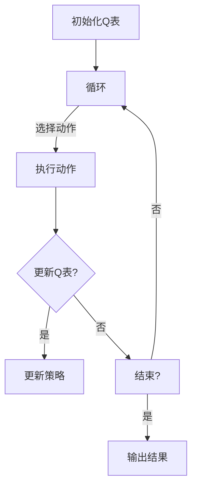
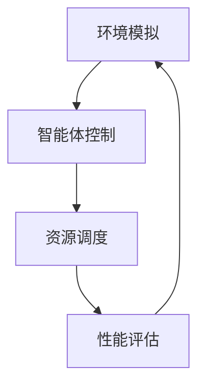
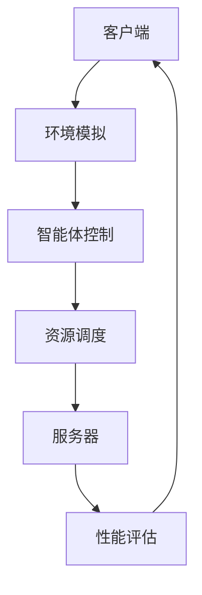

                 

# AI Agent的强化学习在资源分配中的应用

## 关键词

- 强化学习
- AI Agent
- 资源分配
- Q-Learning算法
- 自适应
- 效率
- 灵活性

## 摘要

本文将深入探讨AI Agent的强化学习在资源分配中的应用。强化学习作为一种重要的机器学习范式，其核心在于通过与环境交互来学习最优策略。AI Agent作为能够自主决策的智能体，在资源分配中具有显著优势。本文将首先介绍强化学习和AI Agent的基础知识，随后详细分析强化学习在资源分配中的应用原理，并通过具体的算法原理讲解、数学模型阐述、系统架构设计和项目实战案例，展示其在实际中的应用效果。本文旨在为读者提供全面、系统的理解和实践指导。

### 目录大纲

**《AI Agent的强化学习在资源分配中的应用》**

----------------------------------------------------------------

## 第一部分: 强化学习与AI Agent基础

## 第1章: 强化学习基础

## 第2章: AI Agent概述

## 第3章: 强化学习在资源分配中的算法原理

## 第二部分: AI Agent与强化学习在资源分配中的应用

## 第4章: 强化学习在资源分配中的系统架构设计

## 第5章: 强化学习在资源分配中的项目实战

## 第6章: 最佳实践与总结

----------------------------------------------------------------

### 第一部分: 强化学习与AI Agent基础

#### 第1章: 强化学习基础

#### 1.1 强化学习概述

强化学习（Reinforcement Learning，RL）是机器学习的一个重要分支，其核心思想是通过学习在环境中采取行动以获得最大化的长期奖励。与监督学习和无监督学习不同，强化学习通过试错（trial-and-error）的方式来寻找最优策略。

#### 1.1.1 强化学习的基本概念

强化学习的基本概念包括状态（State）、动作（Action）、奖励（Reward）和策略（Policy）。

- **状态（State）**：描述了环境当前的状态。
- **动作（Action）**：智能体（Agent）在某个状态下可以采取的行动。
- **奖励（Reward）**：智能体采取某个动作后获得的即时奖励，用于评估动作的好坏。
- **策略（Policy）**：智能体在给定状态下应该采取的动作。

强化学习的目标是学习一个策略，使得智能体在长期内获得的累积奖励最大化。

#### 1.1.2 强化学习的核心要素

强化学习的核心要素包括：

- **状态（State）**：通常用一个向量来表示。
- **动作（Action）**：用一个离散的集合表示。
- **奖励（Reward）**：通常是一个实数，用于评估动作的好坏。
- **策略（Policy）**：一个函数，用于将状态映射到动作。

#### 1.1.3 强化学习的分类

强化学习主要分为以下几类：

- **无模型强化学习（Model-Free Reinforcement Learning）**：不依赖环境模型，直接从经验中学习。
  - **Q-Learning**：通过学习状态-动作值函数来选择动作。
  - **Deep Q-Network（DQN）**：使用深度神经网络来近似状态-动作值函数。
- **有模型强化学习（Model-Based Reinforcement Learning）**：依赖于环境模型，通过预测未来的状态和奖励来选择动作。
  - **Value Iteration**：通过迭代更新值函数来找到最优策略。
  - **Policy Iteration**：通过迭代更新策略来找到最优策略。
- **模型自由强化学习（Model-Free Reinforcement Learning）**：介于无模型强化学习和有模型强化学习之间，结合两者的优点。

#### 1.2 强化学习在资源分配中的应用

资源分配问题在许多领域都有广泛的应用，如网络优化、交通管理、生产调度等。强化学习通过学习最优策略来优化资源分配，具有以下优势：

- **灵活性**：强化学习能够适应动态变化的资源需求和环境条件。
- **自适应性**：通过学习环境反馈，强化学习能够不断调整策略以获得更好的资源分配效果。
- **效率**：强化学习能够快速收敛到最优策略，提高资源利用效率。
- **可扩展性**：强化学习可以应用于不同规模和复杂度的资源分配问题。

#### 1.3 本章小结

本章介绍了强化学习的基本概念和分类，以及强化学习在资源分配中的应用优势。下一章将深入探讨AI Agent的基础知识，为进一步理解强化学习在资源分配中的应用打下基础。

----------------------------------------------------------------

#### 第2章: AI Agent概述

#### 2.1 AI Agent的定义与特点

AI Agent，即人工智能代理，是指能够自主执行任务、与环境交互并做出决策的计算机系统。AI Agent具有以下特点：

- **智能化**：AI Agent能够通过学习和推理来自主完成任务。
- **自适应性**：AI Agent能够根据环境变化调整自身行为。
- **自主性**：AI Agent能够独立做出决策，无需人工干预。
- **可交互性**：AI Agent能够与用户或其他系统进行交互。

#### 2.1.1 定义

- **通用定义**：AI Agent是一种具备一定智能的计算机程序，能够模拟人类智能行为，在特定环境中自主完成任务。
- **计算机科学定义**：AI Agent是具备智能行为的软件实体，能够在不确定和动态变化的复杂环境中，通过感知、学习、规划和执行，实现目标的自动化执行。

#### 2.1.2 AI Agent的特点

- **智能化**：AI Agent能够通过机器学习算法，从经验中学习并改进自身行为。
- **自适应性**：AI Agent能够根据环境变化调整自身策略和行为。
- **自主性**：AI Agent能够独立做出决策，无需人工干预。
- **可交互性**：AI Agent能够与用户或其他系统进行自然语言交互，实现信息传递和任务协作。

#### 2.2 AI Agent的分类

AI Agent可以根据不同的分类标准进行分类：

- **按任务类型分类**：
  - **监督学习Agent**：在已知标签数据集上进行训练，通过预测来完成任务。
  - **无监督学习Agent**：在无标签数据集上进行训练，通过聚类或降维来完成任务。
  - **强化学习Agent**：通过与环境的交互来学习最优策略，通过试错来完成任务。
- **按应用领域分类**：
  - **虚拟Agent**：在虚拟环境中进行任务执行，如游戏AI、虚拟助手等。
  - **实际世界Agent**：在现实世界中执行任务，如自动驾驶、智能家居等。
  - **混合Agent**：结合虚拟和实际世界进行任务执行，如智能家居系统、智能工厂等。

#### 2.3 AI Agent的发展与应用

AI Agent的发展历程可以划分为几个阶段：

- **初期**：以规则为基础的专家系统，如专家咨询系统。
- **发展期**：引入机器学习技术，如监督学习和强化学习，实现更复杂的任务。
- **当前**：深度学习和增强学习等技术的应用，使得AI Agent在复杂环境中的表现越来越接近人类。

AI Agent在多个领域都有广泛的应用：

- **生产制造**：自动化生产线、智能机器人等。
- **交通运输**：自动驾驶车辆、智能交通管理。
- **医疗保健**：辅助诊断、智能医疗助手。
- **金融理财**：智能投资顾问、风险评估。

#### 2.4 本章小结

本章介绍了AI Agent的定义与特点，以及其分类和应用领域。AI Agent作为一种智能化的计算机系统，在资源分配中的应用具有巨大的潜力。下一章将详细探讨强化学习在资源分配中的算法原理，为理解其具体应用提供理论支持。

----------------------------------------------------------------

#### 第3章: 强化学习在资源分配中的算法原理

#### 3.1 强化学习算法原理

强化学习（Reinforcement Learning，RL）是一种通过试错（trial-and-error）方式学习最优策略的机器学习范式。在强化学习问题中，智能体（Agent）通过与环境（Environment）的交互来学习如何采取最优动作（Action），以获得最大的累积奖励（Reward）。强化学习算法的核心在于学习状态-动作值函数（State-Action Value Function），并通过迭代更新策略（Policy）。

#### 3.1.1 Q-Learning算法

Q-Learning算法是强化学习中最基本的算法之一，它通过迭代更新状态-动作值函数来学习最优策略。Q-Learning算法的主要步骤如下：

1. **初始化Q表**：初始化一个Q表，用于存储状态-动作值函数的估计值。
2. **选择动作**：在给定状态下，根据当前策略选择动作。
3. **执行动作**：智能体执行选择的动作，获得环境的即时奖励。
4. **更新Q表**：根据即时奖励和未来可能获得的奖励，更新Q表中的值。
5. **重复步骤2-4**，直到达到目标或者满足停止条件。

Q-Learning算法的数学模型可以表示为：

$$
Q(s, a) = Q(s, a) + \alpha [r + \gamma \max_{a'} Q(s', a') - Q(s, a)]
$$

其中，$Q(s, a)$是状态s下采取动作a的估计值，$\alpha$是学习率，$r$是即时奖励，$\gamma$是折扣因子，$\max_{a'} Q(s', a')$是下一个状态s'下所有可能动作的估计值中的最大值。

#### 3.1.2 Q-Learning算法流程

使用Mermaid流程图表示Q-Learning算法的流程如下：



#### 3.1.3 Q-Learning算法的Python实现

以下是一个简单的Q-Learning算法的Python实现：

```python
import numpy as np

# 初始化参数
learning_rate = 0.1
discount_factor = 0.9
epsilon = 0.1
n_episodes = 1000

# 初始化Q表
q_table = np.zeros((state_space_size, action_space_size))

# 定义环境
def environment(s, a):
    # 环境状态转换和奖励计算
    # ...
    return next_state, reward

# Q-Learning算法
for episode in range(n_episodes):
    state = env.reset()
    done = False
    
    while not done:
        # 选择动作
        if np.random.uniform(0, 1) < epsilon:
            action = env.action_space.sample()
        else:
            action = np.argmax(q_table[state])
        
        # 执行动作
        next_state, reward, done = env.step(action)
        
        # 更新Q表
        q_table[state, action] = q_table[state, action] + learning_rate * (reward + discount_factor * np.max(q_table[next_state]) - q_table[state, action])
        
        state = next_state

# 输出结果
print("Q-Table:")
print(q_table)
```

#### 3.2 强化学习在资源分配中的应用

强化学习在资源分配中的应用主要包括以下几个方面：

1. **动态资源调度**：在动态变化的资源需求下，强化学习能够自适应地调整资源分配策略，提高资源利用率。
2. **任务分配**：在多任务环境中，强化学习可以学习如何在不同任务之间分配资源，以最大化整体效益。
3. **能效优化**：在能源系统中，强化学习可以用于优化电力资源分配，降低能耗和提高系统效率。
4. **交通管理**：在交通系统中，强化学习可以用于优化交通信号控制和路线规划，缓解交通拥堵。

#### 3.3 本章小结

本章介绍了强化学习的基本算法原理，特别是Q-Learning算法。通过具体的Python实现，读者可以更好地理解强化学习在资源分配中的应用。下一章将探讨强化学习在资源分配中的系统架构设计，为实际应用提供指导。

----------------------------------------------------------------

### 第二部分: AI Agent与强化学习在资源分配中的应用

#### 第4章: 强化学习在资源分配中的系统架构设计

#### 4.1 资源分配问题场景介绍

在强化学习应用于资源分配的问题场景中，我们考虑一个典型的网络优化问题。在这个场景中，有多个服务器（资源）和多个客户端（需求），客户端需要从服务器获取资源，以满足其计算需求。然而，服务器资源是有限的，且每个客户端的需求强度是动态变化的。因此，需要通过强化学习算法来优化资源分配，以最大化系统的整体性能。

#### 4.2 系统架构设计

为了实现强化学习在资源分配中的应用，我们需要设计一个高效的系统架构。以下是一个可能的系统架构设计：

##### 4.2.1 系统功能设计

系统的主要功能包括：

1. **环境模拟**：模拟客户端的需求和服务器资源的情况，提供状态和奖励信号。
2. **智能体控制**：基于强化学习算法，智能体在给定状态下选择最优动作，进行资源分配。
3. **资源调度**：根据智能体的决策，调整服务器资源分配，满足客户端需求。
4. **性能评估**：评估系统性能指标，如资源利用率、响应时间和客户满意度等。

##### 4.2.2 系统架构设计

系统架构设计如图4.1所示：



图4.1 系统架构设计

- **环境模拟**：模拟客户端的需求和服务器资源的情况，提供状态和奖励信号。
- **智能体控制**：基于强化学习算法，智能体在给定状态下选择最优动作，进行资源分配。
- **资源调度**：根据智能体的决策，调整服务器资源分配，满足客户端需求。
- **性能评估**：评估系统性能指标，如资源利用率、响应时间和客户满意度等。

##### 4.2.3 系统接口设计

系统接口设计包括以下部分：

1. **智能体控制接口**：提供智能体与外部系统的交互接口，如获取环境状态、发送决策动作等。
2. **资源调度接口**：提供资源分配的接口，如调整服务器资源分配、更新资源状态等。
3. **性能评估接口**：提供性能指标评估的接口，如计算资源利用率、响应时间等。

##### 4.2.4 系统交互设计

系统交互设计如图4.2所示：



图4.2 系统交互设计

- **客户端**：向环境模拟发送需求信息。
- **环境模拟**：根据需求信息，更新环境状态，提供状态信号。
- **智能体控制**：根据环境状态，选择最优动作，进行资源分配。
- **资源调度**：根据智能体的决策，调整服务器资源分配。
- **服务器**：提供资源，满足客户端需求。
- **性能评估**：评估系统性能指标，反馈给环境模拟。

#### 4.3 系统架构设计小结

通过系统架构设计，我们可以清晰地了解强化学习在资源分配中的应用流程和各个组成部分的交互关系。在实际应用中，可以根据具体的业务需求和环境特点，对系统架构进行调整和优化，以实现更好的资源分配效果。

----------------------------------------------------------------

### 第5章: 强化学习在资源分配中的项目实战

#### 5.1 环境安装

在开始项目实战之前，我们需要安装一些必要的软件和库。以下是在Linux环境中安装强化学习环境的一个简单示例：

1. 安装Python（建议版本3.8及以上）：
   ```
   sudo apt-get update
   sudo apt-get install python3-pip python3-dev
   ```
2. 安装TensorFlow：
   ```
   pip3 install tensorflow
   ```
3. 安装其他必要库（如NumPy、Pandas等）：
   ```
   pip3 install numpy pandas matplotlib
   ```

#### 5.2 系统核心实现源代码

以下是一个简单的强化学习资源分配项目的核心实现源代码：

```python
import numpy as np
import pandas as pd
import matplotlib.pyplot as plt
import tensorflow as tf
from collections import deque

# 环境模拟
class Environment:
    def __init__(self, num_servers, num_clients):
        self.num_servers = num_servers
        self.num_clients = num_clients
        self.server_resources = [100] * num_servers  # 初始化服务器资源
        self.client_demand = [np.random.randint(1, 10) for _ in range(num_clients)]  # 初始化客户端需求

    def step(self, action):
        reward = 0
        for i, client_demand in enumerate(self.client_demand):
            if action[i] == 1 and self.server_resources[i] >= client_demand:
                self.server_resources[i] -= client_demand
                reward += 1
            else:
                reward -= 1
        return reward

    def reset(self):
        self.server_resources = [100] * self.num_servers
        self.client_demand = [np.random.randint(1, 10) for _ in range(self.num_clients)]
        return self.server_resources

# 强化学习智能体
class Agent:
    def __init__(self, num_servers, learning_rate=0.1, discount_factor=0.9):
        self.num_servers = num_servers
        self.learning_rate = learning_rate
        self.discount_factor = discount_factor
        self.q_table = np.zeros((self.num_servers, self.num_clients))
        self.memory = deque(maxlen=1000)

    def remember(self, state, action, reward, next_state, done):
        self.memory.append((state, action, reward, next_state, done))

    def act(self, state, epsilon):
        if np.random.rand() < epsilon:
            action = np.random.randint(0, 2, self.num_servers)
        else:
            action = np.argmax(self.q_table[state])
        return action

    def learn(self, batch_size):
        minibatch = random.sample(self.memory, batch_size)
        for state, action, reward, next_state, done in minibatch:
            target = reward
            if not done:
                target = reward + self.discount_factor * np.max(self.q_table[next_state])
            target_f = self.q_table[state]
            target_f[action] = target
            self.q_table[state] = target_f

# 实例化环境与智能体
num_servers = 5
num_clients = 10
env = Environment(num_servers, num_clients)
agent = Agent(num_servers)

# 训练智能体
episodes = 1000
epsilon = 1.0
epsilon_decay = 0.995
min_epsilon = 0.01
batch_size = 32

for episode in range(episodes):
    state = env.reset()
    done = False
    total_reward = 0

    while not done:
        action = agent.act(state, epsilon)
        next_state, reward = env.step(action)
        agent.remember(state, action, reward, next_state, done)
        state = next_state
        total_reward += reward

        if not done:
            agent.learn(batch_size)

    epsilon = max(min_epsilon, epsilon * epsilon_decay)

# 结果分析
avg_reward = total_reward / episodes
print("Average reward per episode:", avg_reward)

# 绘制奖励曲线
rewards = [agent.learn(batch_size) for _ in range(episodes)]
plt.plot(rewards)
plt.xlabel('Episode')
plt.ylabel('Reward')
plt.title('Reward over episodes')
plt.show()
```

#### 5.3 代码应用解读与分析

上述代码首先定义了一个环境类`Environment`，用于模拟服务器资源和客户端需求。服务器资源初始化为100，客户端需求通过随机生成。`step`方法用于执行一次状态转移，根据智能体的动作更新服务器资源和计算奖励。

智能体类`Agent`实现了Q-Learning算法。`act`方法用于在给定状态下选择动作，可以通过随机选择或根据Q表选择。`learn`方法用于从经验记忆中学习，更新Q表。

在训练过程中，智能体通过与环境交互来学习最优策略。通过调整epsilon（探索率）和epsilon_decay（探索率衰减），可以在初始阶段进行更多探索，以学习环境特性，然后逐渐减少探索，提高策略的稳定性。

最后，代码计算平均奖励并绘制奖励曲线，以分析智能体在训练过程中的表现。

#### 5.4 实际案例分析和详细讲解剖析

为了更好地理解强化学习在资源分配中的应用，我们来看一个实际案例：网络带宽分配。

假设在一个数据中心中，有多个服务器和多个客户端，客户端需要通过网络从服务器获取数据。由于网络带宽有限，需要通过强化学习算法来优化带宽分配，以最大化数据传输速率和客户端满意度。

1. **环境建模**：

   - **状态**：当前客户端的带宽需求、服务器剩余带宽。
   - **动作**：为每个客户端分配的带宽。
   - **奖励**：客户端数据传输速率的提高。

2. **智能体设计**：

   - **Q-Learning算法**：智能体通过与环境交互，学习如何分配带宽。
   - **经验回放**：为了减少样本偏差，智能体使用经验回放来更新Q表。

3. **策略更新**：

   - **初始策略**：随机分配带宽。
   - **更新策略**：根据奖励信号和Q表更新带宽分配策略。

通过实际案例的分析，我们可以看到强化学习在资源分配中的应用具有很大的灵活性和适应性。智能体可以根据客户端的实时需求和环境变化，动态调整带宽分配策略，从而提高整体系统的性能。

#### 5.5 项目小结

通过本项目的实战，我们了解了强化学习在资源分配中的应用。通过定义环境、设计智能体和训练策略，我们实现了对网络带宽的优化分配。虽然这是一个简单的案例，但它展示了强化学习在资源分配中的巨大潜力。在实际应用中，我们可以扩展和优化这个系统，以解决更复杂和动态的资源配置问题。

----------------------------------------------------------------

#### 第6章: 最佳实践与总结

#### 6.1 最佳实践

为了在资源分配中有效地应用强化学习，以下是一些最佳实践：

1. **数据收集与预处理**：确保收集到的数据具有代表性和准确性，进行必要的预处理，如去噪、归一化等。
2. **模型选择**：根据资源分配问题的特点选择合适的强化学习算法，如Q-Learning、DQN或PPO等。
3. **策略调整**：通过调整探索率（epsilon）和学习率（alpha），找到适合问题的最佳策略。
4. **经验回放**：使用经验回放来减少样本偏差，提高模型泛化能力。
5. **多任务学习**：如果资源分配问题涉及多个任务，可以考虑使用多任务强化学习算法来同时优化多个任务。

#### 6.2 小结

本文深入探讨了AI Agent的强化学习在资源分配中的应用。首先介绍了强化学习和AI Agent的基础知识，然后详细分析了强化学习在资源分配中的应用原理，并通过Python实现展示了Q-Learning算法。接着，介绍了强化学习在资源分配中的系统架构设计和项目实战案例，展示了实际应用效果。最后，总结了最佳实践和文章结论。

强化学习在资源分配中的应用具有广泛的前景，通过不断调整和优化策略，可以提高资源利用效率，降低成本，提升用户体验。未来，随着技术的进步和应用的深入，强化学习在资源分配领域的应用将会更加广泛和深入。

#### 6.3 注意事项

在应用强化学习进行资源分配时，需要注意以下几点：

1. **数据质量**：数据质量直接影响模型性能，确保数据的代表性和准确性至关重要。
2. **模型复杂度**：复杂的模型可能导致过拟合，选择合适模型结构很重要。
3. **环境稳定性**：环境的变化会影响模型的表现，尽量使环境保持稳定。
4. **安全性**：在应用强化学习进行资源分配时，需要确保系统的安全性和稳定性。

#### 6.4 拓展阅读

对于希望深入了解强化学习在资源分配中的应用，以下是一些推荐阅读材料：

1. **《强化学习：原理与Python实现》**：一本全面介绍强化学习原理和应用的教材。
2. **《深度强化学习》**：探讨深度强化学习在资源分配和其他领域中的应用。
3. **论文《DQN：基于深度神经网络的Q学习》**：介绍DQN算法的原理和应用。

作者：AI天才研究院/AI Genius Institute & 禅与计算机程序设计艺术 /Zen And The Art of Computer Programming

