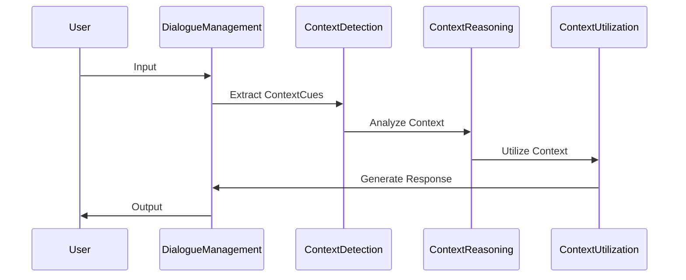
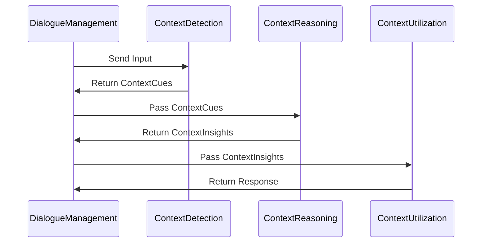
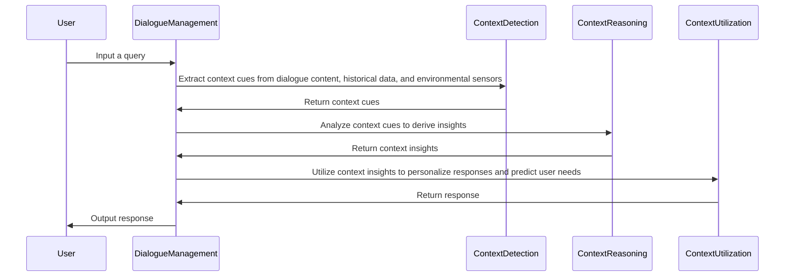
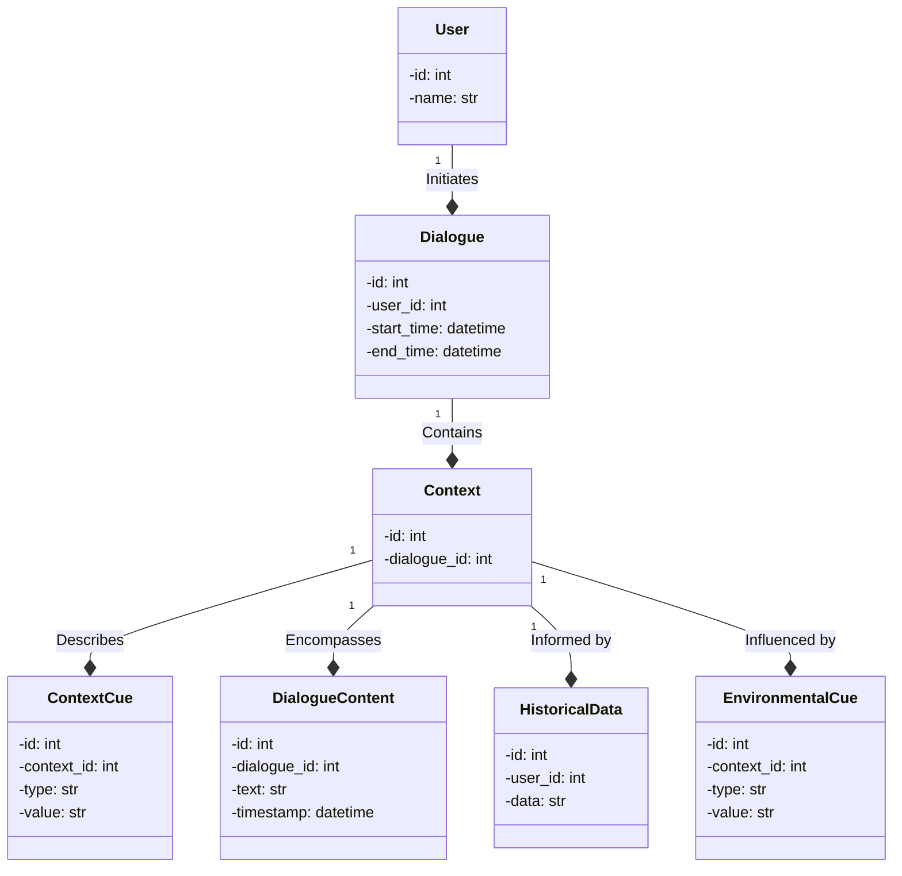
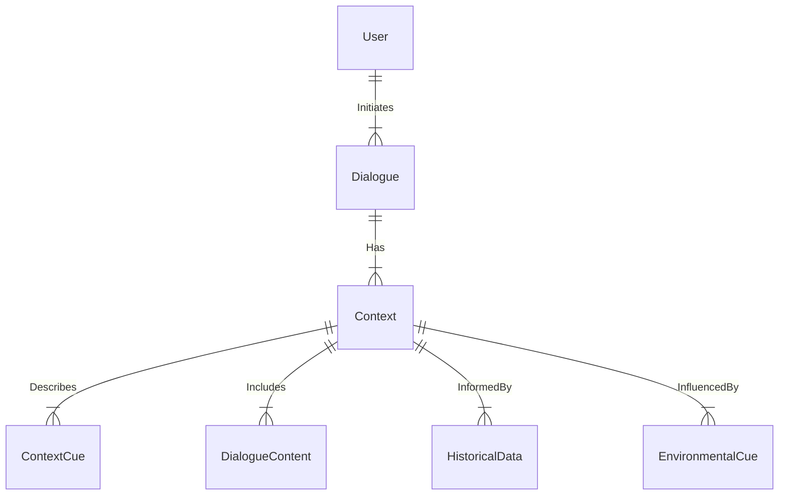
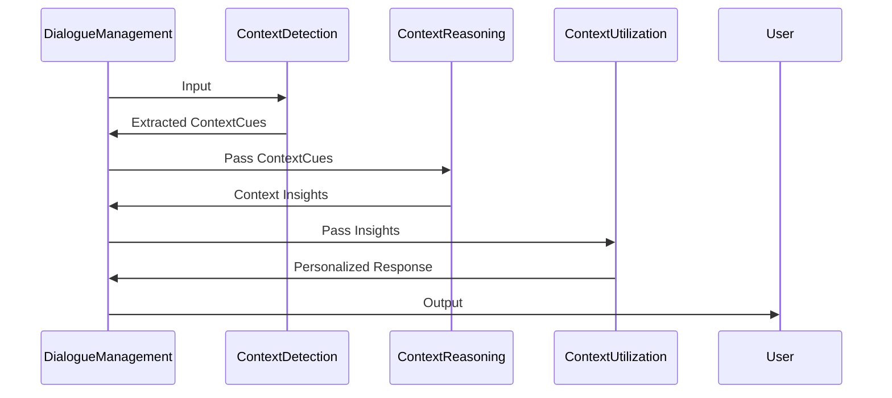
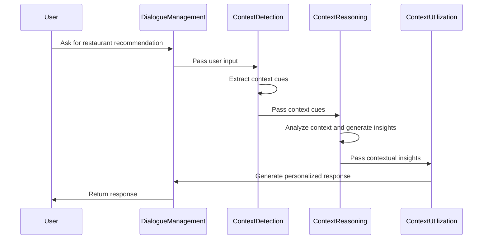

                 

## Introduction to AI Agent's Situational Understanding

### **Problem Background**

The landscape of artificial intelligence (AI) has witnessed a remarkable transformation over the past few decades. From the early days of rule-based systems to the sophisticated deep learning models we see today, AI has made significant strides in automating tasks that were once the exclusive domain of human intelligence. Among the many advancements, AI agents that can engage in dialogue with humans have become particularly interesting. These agents, often referred to as chatbots or conversational AI, have evolved from basic question-answering systems to more complex entities capable of holding meaningful conversations.

However, despite these advancements, AI agents still face significant challenges when it comes to understanding the context of a conversation. Human communication is deeply rooted in context—every word, gesture, and expression is laden with meaning that is derived from the broader context of the conversation. This context includes not only the current dialogue but also the history of interactions, the user's intentions, and even the surrounding environment. For AI agents, capturing and maintaining this complex web of context is a formidable challenge.

### **Current State of AI Agents**

Current AI agents, despite their ability to process and respond to queries, often struggle with context beyond the immediate dialogue. They may provide relevant answers to specific questions but often fail to understand the broader context of the conversation. This limitation is particularly evident in scenarios where the context spans multiple dialogues or where the context needs to be inferred from implicit cues rather than explicit information.

One common approach to addressing this issue is the use of session-based models, where the agent retains information from previous dialogues within the same session. While this can improve the agent's understanding of the conversation to some extent, it is limited by the duration and scope of the session. Once the session ends, the agent often forgets the context, reverting to its initial state of ignorance.

Another approach involves leveraging long-term memory, where information from multiple sessions is stored and can be accessed as needed. This approach, while promising, is still in its nascent stages and faces challenges in terms of scalability, efficiency, and computational complexity.

### **The Importance of Context in Human Communication**

To grasp the challenge AI agents face, it is essential to understand the importance of context in human communication. Context provides the background information that allows us to interpret the meaning of words and actions. For example, consider the simple sentence, "I'm hungry." Without any additional context, this sentence can mean a variety of things. Is the speaker asking for food, expressing dissatisfaction, or simply stating a fact? The answer depends on the broader context of the conversation—the previous statements, the speaker's tone, and even the physical environment.

Humans effortlessly incorporate this context into their understanding of language, enabling them to communicate effectively in a wide range of situations. However, AI agents lack this intuitive ability to understand and maintain context, which often leads to misunderstandings and ineffective interactions.

### **The Need for Advanced Situational Understanding**

The limitations of current AI agents in understanding context highlight the need for advanced situational understanding. Beyond simple dialogue management, AI agents need to be capable of understanding and reasoning about the context of a conversation, just as humans do. This includes not only remembering past interactions but also inferring context from subtle hints and making predictions based on the current situation.

Advanced situational understanding would enable AI agents to provide more natural and effective interactions with humans. It would allow them to better understand user needs, offer more relevant and personalized responses, and even anticipate user actions. In essence, it would make AI agents more human-like in their communication capabilities.

### **Scope of the Book**

This book aims to explore the concepts and methodologies behind situational understanding in AI agents. It will cover the following key areas:

1. **Core Concepts and Framework**: An overview of the fundamental concepts and a framework for situational understanding, including context detection, reasoning, and utilization.
2. **Algorithm Principles and Mathematical Models**: Detailed explanations of the algorithms and mathematical models used in situational understanding, with a focus on machine learning and deep learning techniques.
3. **System Architecture and Design**: An examination of the system architecture and design principles for implementing situational understanding in AI agents.
4. **Case Studies and Practical Applications**: Real-world examples and case studies demonstrating the application of situational understanding in various domains.
5. **Future Directions and Challenges**: A discussion of the future trends, potential challenges, and opportunities in the field of situational understanding in AI agents.

By the end of this book, readers will have a comprehensive understanding of situational understanding in AI agents, from theoretical concepts to practical implementations.

### **Key Concepts and Framework for Situational Understanding**

In the quest to develop AI agents capable of advanced situational understanding, it is crucial to first establish a clear set of core concepts and a robust framework that can guide the development process. This section delves into the essential components that constitute situational understanding and how they interact to provide a comprehensive context-aware system.

#### **Core Concepts**

**1.1. Definition of Situational Understanding**

Situational understanding in AI refers to the ability of an AI agent to interpret and utilize context to enhance its interaction with humans. This context can be derived from various sources, including the current dialogue, historical interactions, environmental cues, and user behavior. Unlike simple dialogue management, situational understanding encompasses a broader scope, allowing the AI agent to maintain context across multiple conversations and adapt to changing situations.

**1.2. Context Awareness**

Context awareness is the foundational element of situational understanding. It involves the ability of an AI agent to recognize and interpret context cues, such as keywords, phrases, tone, and non-verbal cues. By being context-aware, an AI agent can better understand the user's intent, emotional state, and preferences, thereby providing more relevant and natural responses.

**1.3. Context Reasoning**

Context reasoning is the process by which an AI agent uses its understanding of context to make inferences and predictions. This involves drawing logical conclusions from the context and using those conclusions to inform the agent's responses and actions. Context reasoning is crucial for tasks that require long-term memory, such as remembering past interactions and using that information to improve future interactions.

**1.4. Context Utilization**

Context utilization is the final stage of situational understanding, where the AI agent leverages its contextual knowledge to enhance user interactions. This can involve personalizing responses, anticipating user needs, and providing proactive suggestions. Effective context utilization can significantly improve the user experience by making interactions more intuitive and efficient.

#### **Framework**

**2.1. Overview of the Situational Understanding Framework**

The situational understanding framework is a structured approach that integrates various components to enable AI agents to understand and utilize context effectively. The framework can be summarized in three core components: context detection, context reasoning, and context utilization.

1. **Context Detection**: This component focuses on identifying and capturing context cues from the user's input, environment, and past interactions. Techniques such as natural language processing (NLP), sentiment analysis, and behavioral analytics are commonly used to detect context.
   
2. **Context Reasoning**: Once the context is detected, the AI agent uses context reasoning to process and analyze the information. This involves techniques such as semantic analysis, knowledge representation, and inference engines to derive meaningful insights from the context.

3. **Context Utilization**: The final component involves using the contextual insights to inform the agent's responses and actions. This can involve personalization, prediction, and proactive suggestions based on the user's context.

**2.2. Detailed Explanation of Components**

**2.2.1. Context Detection**

Context detection is the initial step in the situational understanding framework. It involves the collection and analysis of context cues from various sources, including:

- **Dialogue Content**: Extracting relevant information from the user's input, such as keywords, phrases, and intents.
- **Historical Data**: Analyzing past interactions to identify recurring patterns and preferences.
- **Environmental Cues**: Utilizing sensors and other devices to gather contextual information about the user's environment, such as location, time, and activity.

Techniques such as tokenization, part-of-speech tagging, named entity recognition, and sentiment analysis are commonly employed to detect and extract context cues from dialogue content. Behavioral analytics, including tracking user interactions and activities, can also provide valuable context information.

**2.2.2. Context Reasoning**

Context reasoning involves processing and analyzing the detected context to derive meaningful insights. This step is critical for understanding the broader context of the conversation and making informed decisions. Key techniques include:

- **Semantic Analysis**: Understanding the meaning of words and phrases in the context of the dialogue.
- **Knowledge Representation**: Organizing and structuring contextual information in a way that can be easily analyzed and reasoned about.
- **Inference Engines**: Using rules and algorithms to draw logical conclusions from the context and generate inferences.

For example, if an AI agent detects that the user has mentioned a previous interaction, it can use inference engines to recall the details of that interaction and use that information to provide a more personalized response.

**2.2.3. Context Utilization**

Context utilization involves using the insights derived from context reasoning to enhance the agent's interactions with the user. This can involve:

- **Personalization**: Tailoring responses to the user's preferences, past interactions, and current context.
- **Prediction**: Anticipating the user's needs and providing proactive suggestions or actions.
- **Proactivity**: Taking主动 steps to improve the user experience, such as offering relevant information or assisting with tasks.

For example, if an AI agent detects that the user is frequently asking for restaurant recommendations, it can proactively suggest nearby restaurants based on the user's location and preferences.

**2.3. Integration of Components**

The situational understanding framework is designed to be integrated, with each component feeding into the next. Context detection provides the raw data, context reasoning processes and analyzes this data, and context utilization applies the insights to improve user interactions. The integration of these components enables the AI agent to maintain context across multiple dialogues and adapt to changing situations, thereby enhancing its overall performance and effectiveness.

In summary, the key concepts and framework for situational understanding in AI agents provide a structured approach to capturing, processing, and utilizing context. By integrating context detection, reasoning, and utilization, AI agents can better understand and interact with humans, leading to more natural and effective conversations.

### **Algorithm Principles for Situational Understanding**

In the pursuit of enabling AI agents with advanced situational understanding, the core algorithms and mathematical models that drive these capabilities are crucial. This section provides an overview of the fundamental algorithms and mathematical models used in situational understanding, with a focus on machine learning and deep learning techniques that are instrumental in achieving this level of context-awareness.

#### **Machine Learning Techniques**

**1.1. Overview of Machine Learning in Situational Understanding**

Machine learning (ML) forms the backbone of situational understanding in AI agents. By leveraging historical data and patterns, ML algorithms can learn to recognize and interpret context from various sources. Some of the key ML techniques used in situational understanding include:

- **Supervised Learning**: This technique involves training a model on labeled data, where the correct output is provided for each input. Algorithms like Support Vector Machines (SVM), Decision Trees, and Neural Networks fall under this category. Supervised learning is particularly effective in tasks that require clear boundaries between classes, such as sentiment analysis and intent recognition.
  
- **Unsupervised Learning**: Unlike supervised learning, unsupervised learning does not require labeled data. It involves discovering patterns and structures in the data without any prior knowledge. Techniques such as Clustering (e.g., K-means, DBSCAN), Dimensionality Reduction (e.g., PCA, t-SNE), and Anomaly Detection are widely used in situational understanding to identify hidden patterns and context cues.

- **Reinforcement Learning**: This technique focuses on training an agent to make decisions by learning from its interactions with the environment. Reinforcement learning is particularly useful in dynamic and uncertain environments, where the agent needs to adapt its behavior based on feedback from the environment. Techniques like Q-Learning and Deep Q-Networks (DQN) are commonly used to develop context-aware agents that can learn from user interactions.

**1.2. Mathematical Models and Formulas**

The mathematical models underpinning these ML techniques are essential for their implementation and understanding. Here, we provide a brief overview of some key models and their associated formulas:

- **Support Vector Machines (SVM)**: SVMs are used for classification tasks. The objective is to find the hyperplane that best separates the data into different classes. The formula for SVM can be expressed as:
  $$
  \text{minimize} \quad \frac{1}{2} ||w||^2 + C \sum_{i=1}^{n} \max(0, 1-y_i[(\mathbf{w}^T \mathbf{x_i}) + b])
  $$
  where \( w \) is the weight vector, \( x_i \) are the input features, \( y_i \) are the labels, \( C \) is the regularization parameter, and \( b \) is the bias term.

- **Neural Networks**: Neural networks are composed of multiple layers of interconnected nodes (neurons). The forward propagation equation for a single neuron is given by:
  $$
  z_i = \sum_{j=1}^{n} w_{ji}x_j + b_i
  $$
  where \( z_i \) is the net input to the neuron, \( w_{ji} \) are the weights, \( x_j \) are the input features, and \( b_i \) is the bias.

- **K-means Clustering**: K-means is an iterative algorithm that partitions data into K clusters. The objective is to minimize the sum of squared distances between each data point and its assigned centroid. The centroid \( \mu_k \) for cluster k is given by:
  $$
  \mu_k = \frac{1}{N_k} \sum_{i=1}^{N} x_i
  $$
  where \( N_k \) is the number of points in cluster k and \( x_i \) are the data points.

- **Principal Component Analysis (PCA)**: PCA is a dimensionality reduction technique that projects data onto a lower-dimensional space while retaining most of the variance. The principal components are the eigenvectors of the covariance matrix of the data. The transformation matrix \( P \) is given by:
  $$
  P = eig(\Sigma)
  $$
  where \( \Sigma \) is the covariance matrix of the data.

#### **Deep Learning Techniques**

**1.3. Overview of Deep Learning in Situational Understanding**

Deep learning (DL) extends the capabilities of machine learning by leveraging neural networks with many layers (hence the term "deep"). Deep learning models, particularly deep neural networks (DNNs) and recurrent neural networks (RNNs), are particularly suited for tasks that involve sequential data and complex patterns, making them ideal for situational understanding.

- **Convolutional Neural Networks (CNNs)**: CNNs are designed to process data with a grid-like topology, such as images or text. They are particularly effective in tasks like image recognition and natural language processing. The forward propagation equation for a CNN layer is given by:
  $$
  h_{ij}^l = \sum_{k=1}^{m} w_{ik}^l h_{kj}^{l-1} + b_l
  $$
  where \( h_{ij}^l \) is the output of unit \( (i, j) \) in layer \( l \), \( w_{ik}^l \) are the weights, \( h_{kj}^{l-1} \) are the inputs from the previous layer, and \( b_l \) is the bias.

- **Recurrent Neural Networks (RNNs)**: RNNs are designed to handle sequential data, such as time-series data or text. They are capable of maintaining a "memory" of previous inputs, which allows them to capture temporal dependencies. The forward propagation equation for an RNN is given by:
  $$
  h_t = \sigma(W_h h_{t-1} + W_x x_t + b_h)
  $$
  where \( h_t \) is the hidden state at time \( t \), \( \sigma \) is the activation function, \( W_h \) and \( W_x \) are weight matrices, and \( b_h \) is the bias.

- **Long Short-Term Memory (LSTM)**: LSTMs are a special type of RNN designed to overcome the vanishing gradient problem, which allows them to capture long-term dependencies. The core equations of LSTM are:
  $$
  i_t = \sigma(W_i [h_{t-1}, x_t] + b_i)
  $$
  $$
  f_t = \sigma(W_f [h_{t-1}, x_t] + b_f)
  $$
  $$
  g_t = \tanh(W_g [h_{t-1}, x_t] + b_g)
  $$
  $$
  o_t = \sigma(W_o [h_{t-1}, x_t] + b_o)
  $$
  where \( i_t \), \( f_t \), \( g_t \), and \( o_t \) represent the input, forget, gate, and output gates, respectively.

**1.4. Integration of Machine Learning and Deep Learning**

The integration of machine learning and deep learning techniques is essential for achieving advanced situational understanding. Machine learning provides the foundational algorithms and mathematical models, while deep learning extends these capabilities by enabling the processing of complex, high-dimensional data. Techniques such as transfer learning, where a pre-trained deep learning model is fine-tuned on a new dataset, are particularly effective in enhancing situational understanding.

In conclusion, the algorithm principles and mathematical models underlying situational understanding in AI agents are multifaceted. By leveraging machine learning and deep learning techniques, AI agents can effectively capture, process, and utilize context, enabling them to engage in more natural and effective interactions with humans.

### **System Architecture and Design**

In order to effectively implement situational understanding in AI agents, a well-structured system architecture and design are essential. This section provides an overview of the system architecture and design principles, including the domain model, system architecture, interface design, and system interaction.

#### **Problem Scene Introduction**

The problem scene involves developing an AI agent capable of understanding and maintaining context across multiple dialogues. The agent must be able to detect and interpret context from various sources, including dialogue content, historical data, and environmental cues. The goal is to design a system that can provide natural and effective interactions with users by leveraging situational understanding.

#### **System Overview**

The system is designed to handle a variety of tasks, from simple question-answering to complex conversational interactions. The core components of the system include:

1. **Dialogue Management**: Handles the flow of conversation and manages the dialogue state.
2. **Context Detection Module**: Identifies and captures context cues from dialogue content, historical data, and environmental sensors.
3. **Context Reasoning Module**: Processes and analyzes the captured context to derive meaningful insights.
4. **Context Utilization Module**: Leverages the contextual insights to enhance user interactions by personalizing responses, predicting user needs, and providing proactive suggestions.

#### **Domain Model**

The domain model is a conceptual representation of the system's key entities and their relationships. It provides a clear understanding of the data flow and the interactions between different components. The following is a simplified domain model using Mermaid class diagram syntax:

```mermaid
classDiagram
    User <<Entity>>
    Dialogue <<Entity>>
    Context <<Entity>>
    ContextCue <<Entity>>
    DialogueContent <<Entity>>
    HistoricalData <<Entity>>
    EnvironmentalCue <<Entity>>
    
    User --> Dialogue
    Dialogue --> Context
    Context --> ContextCue
    ContextCue --> DialogueContent, HistoricalData, EnvironmentalCue
```

#### **System Architecture**

The system architecture is designed to be modular and scalable, with each component interacting through well-defined interfaces. The following is a high-level overview of the system architecture using Mermaid architecture diagram syntax:



#### **Interface Design**

The interface design focuses on ensuring seamless communication between the system components. The following is a simplified interface design using Mermaid sequence diagram syntax:



#### **System Interaction**

The system interaction is designed to facilitate the flow of information between components and enable the seamless execution of tasks. The following is a detailed interaction scenario using Mermaid sequence diagram syntax:



In summary, the system architecture and design principles for implementing situational understanding in AI agents are crucial for enabling effective context-aware interactions. By leveraging a modular and scalable architecture, and well-defined interface designs, the system can efficiently process and utilize context to enhance user interactions.

### **Project Introduction**

In this section, we introduce the project that will serve as the focus of our practical application of situational understanding in AI agents. The project aims to develop an AI agent capable of understanding and maintaining context across multiple dialogues in a realistic conversational environment. The goal is to create a system that can effectively interact with users by leveraging situational understanding to provide more natural and meaningful conversations.

#### **Project Background**

The motivation behind this project is the growing need for AI agents that can engage in human-like conversations. Current AI agents often struggle with context beyond the immediate dialogue, leading to misunderstandings and less effective interactions. By developing an AI agent with advanced situational understanding, we aim to address this limitation and enhance the user experience.

#### **Project Objectives**

The primary objectives of the project are as follows:

1. **Develop a context-aware AI agent**: Create an AI agent capable of detecting, processing, and utilizing context from multiple sources, including dialogue content, historical data, and environmental cues.
2. **Implement situational understanding algorithms**: Integrate machine learning and deep learning techniques to enable the AI agent to analyze and reason about context.
3. **Evaluate and optimize performance**: Test the AI agent in various conversational scenarios and refine the algorithms to improve performance and accuracy.
4. **Deploy the system in real-world applications**: Demonstrate the practical applicability of the AI agent in real-world scenarios, such as customer service, personal assistants, and conversational interfaces.

#### **Expected Outcomes**

The expected outcomes of the project include:

1. **Enhanced conversational capabilities**: The AI agent will be able to engage in more natural and meaningful conversations by understanding and utilizing context effectively.
2. **Improved user experience**: Users will experience more intuitive and efficient interactions with the AI agent, leading to higher satisfaction and adoption rates.
3. **Advanced situational understanding techniques**: The project will contribute to the development of new algorithms and methodologies for situational understanding in AI agents.
4. **Broader applications**: The project will demonstrate the potential of situational understanding in various domains, paving the way for future research and applications.

By achieving these objectives and outcomes, the project will make significant contributions to the field of AI and conversational systems, paving the way for more advanced and effective AI agents in the future.

### **System Function Design**

In the following sections, we will delve into the detailed system function design, starting with the domain model. The domain model provides a clear representation of the system's key entities and their relationships, facilitating a comprehensive understanding of the system's architecture and functionality.

#### **Domain Model**

The domain model for our situational understanding AI agent consists of several core entities, each playing a vital role in the system's functionality. These entities include User, Dialogue, Context, ContextCue, DialogueContent, HistoricalData, and EnvironmentalCue. Below is a Mermaid class diagram illustrating the domain model and the relationships between these entities:



**Entities and Attributes Explanation:**

1. **User**: Represents the user interacting with the AI agent. Each user has a unique ID and name.
2. **Dialogue**: Represents a conversation between the user and the AI agent. Each dialogue has a unique ID, user ID, start time, and end time.
3. **Context**: Represents the contextual information associated with a dialogue. Each context has a unique ID and is linked to a specific dialogue.
4. **ContextCue**: Represents individual context cues extracted from various sources, such as dialogue content, historical data, and environmental cues. Each cue has a unique ID, context ID, type, and value.
5. **DialogueContent**: Represents the content of the dialogue. Each content entry has a unique ID, dialogue ID, text, and timestamp.
6. **HistoricalData**: Represents past interactions and data related to the user. Each historical data entry has a unique ID, user ID, and data.
7. **EnvironmentalCue**: Represents contextual information derived from the user's environment. Each cue has a unique ID, context ID, type, and value.

#### **Class Relationships and Data Flow**

The relationships between these entities illustrate how the system aggregates and processes data. For instance, a User can initiate multiple Dialogues, each of which contains a set of ContextCues that describe the dialogue's context. ContextCues can come from various sources, including DialogueContent, HistoricalData, and EnvironmentalCue.

The data flow within the system begins with the User providing input (DialogueContent). This input is then used to extract ContextCues, which are analyzed to generate a comprehensive Context for the dialogue. HistoricalData and EnvironmentalCues provide additional context that helps the AI agent understand the user's preferences and environment, enhancing the agent's ability to personalize responses.

#### **Mermaid ER Diagram**

The following Mermaid ER diagram provides a visual representation of the entities and their relationships:



This ER diagram encapsulates the core of our domain model, highlighting the interconnectedness of the entities and their roles in the system. By understanding the domain model, we can better design and implement the system functions that will enable the AI agent to provide context-aware interactions.

### **System Architecture Design**

In this section, we will delve into the detailed system architecture design, illustrating how the various components interact to achieve situational understanding. The system architecture is designed to be modular, scalable, and efficient, ensuring that the AI agent can effectively detect, process, and utilize context in real-time.

#### **Architecture Overview**

The system architecture is composed of several key components, each serving a specific function in the situational understanding process. These components include Dialogue Management, Context Detection Module, Context Reasoning Module, and Context Utilization Module. The interactions between these modules are facilitated through well-defined interfaces, enabling seamless data flow and communication.

#### **Dialogue Management**

Dialogue Management is the central component responsible for managing the flow of conversation and maintaining the dialogue state. It orchestrates the interaction between the user and the AI agent, ensuring that the dialogue progresses logically and coherently. Key functionalities of Dialogue Management include:

- **Dialogue State Tracking**: Keeps track of the current state of the dialogue, including the user's intent, the context of the conversation, and the system's response.
- **Input Processing**: Processes user input, extracting relevant information and preparing it for further analysis.
- **Response Generation**: Generates natural language responses based on the dialogue state and the insights derived from the context.

#### **Context Detection Module**

The Context Detection Module is responsible for identifying and capturing context cues from various sources, including dialogue content, historical data, and environmental sensors. The key functionalities of this module include:

- **Dialogue Content Analysis**: Utilizes natural language processing (NLP) techniques to extract keywords, phrases, and sentiment from the user's input.
- **Historical Data Retrieval**: Accesses past interactions and user data to identify recurring patterns and preferences.
- **Environmental Sensing**: Uses sensors and environmental data to infer context, such as the user's location, time of day, and surrounding environment.

#### **Context Reasoning Module**

The Context Reasoning Module processes and analyzes the captured context to derive meaningful insights. It focuses on understanding the relationships between different context cues and making inferences based on the dialogue state. Key functionalities of this module include:

- **Semantic Analysis**: Analyzes the meaning of words and phrases within the context of the dialogue to identify the user's intent and emotional state.
- **Inference Engine**: Uses rules and algorithms to draw logical conclusions from the context, enabling the AI agent to make informed decisions and predictions.
- **Context Integration**: Combines context from multiple sources to provide a comprehensive understanding of the situation.

#### **Context Utilization Module**

The Context Utilization Module leverages the contextual insights to enhance user interactions. It focuses on personalizing responses, predicting user needs, and providing proactive suggestions. Key functionalities of this module include:

- **Personalization**: Tailors responses to the user's preferences and past behavior, making interactions more intuitive and relevant.
- **Prediction**: Anticipates the user's needs and provides proactive suggestions or actions, such as offering relevant information or assisting with tasks.
- **Proactivity**: Takes proactive steps to improve the user experience, such as offering relevant information or assisting with tasks.

#### **Component Interaction and Data Flow**

The interaction between the system components is orchestrated through well-defined interfaces, ensuring efficient data flow and communication. The following diagram illustrates the data flow and interactions between the components:


**Data Flow Explanation:**

1. **User Input**: The user provides input to the system, which is captured by Dialogue Management.
2. **Context Detection**: Dialogue Management passes the user input to the Context Detection Module, which extracts relevant context cues from dialogue content, historical data, and environmental sensors.
3. **Context Reasoning**: The extracted context cues are then passed to the Context Reasoning Module, which processes and analyzes the context to derive meaningful insights.
4. **Context Utilization**: The contextual insights generated by Context Reasoning are utilized by the Context Utilization Module to enhance user interactions, such as personalizing responses and predicting user needs.
5. **Response Generation**: The final response is generated by Dialogue Management and returned to the user.

#### **Mermaid Architecture Diagram**

The following Mermaid architecture diagram provides a visual representation of the system architecture and component interactions:

```mermaid
subgraph Context_Detection_Module
    ContextDetectionModule
end

subgraph Context_Reasoning_Module
    ContextReasoningModule
end

subgraph Context_Utilization_Module
    ContextUtilizationModule
end

subgraph Dialogue_Management
    DialogueManagement
end

contextDetectionModule --> dialogueManagement
dialogueManagement --> contextReasoningModule
contextReasoningModule --> contextUtilizationModule
```

This diagram encapsulates the core of the system architecture, highlighting the modular design and the seamless flow of information between components. By leveraging this architecture, the AI agent can effectively detect, process, and utilize context to provide natural and meaningful interactions with users.

### **System Interface Design**

In this section, we will explore the system interface design, focusing on how different modules interact and communicate with each other. The interface design is crucial for ensuring that the system components can seamlessly exchange information and execute their respective tasks.

#### **Dialogue Management Interface**

The Dialogue Management interface serves as the central hub for coordinating communication between the user and the various system modules. It includes methods and data structures for managing the dialogue state, processing user input, and generating responses. Key components of the Dialogue Management interface include:

- **DialogueState**: A data structure to maintain the state of the current dialogue, including user information, the current topic, and the system's last response.
- **processInput()**: A method to process user input and extract relevant information for further analysis.
- **generateResponse()**: A method to generate a natural language response based on the dialogue state and contextual insights.

#### **Context Detection Interface**

The Context Detection interface is responsible for capturing context cues from various sources. It includes methods and data structures for processing dialogue content, historical data, and environmental sensors. Key components of the Context Detection interface include:

- **ContextCueExtractor**: A class to extract context cues from dialogue content using natural language processing techniques.
- **HistoricalDataFetcher**: A class to retrieve historical user data from a database.
- **EnvironmentalSensor**: A class to collect environmental data using sensors and APIs.

- **extractContextCues()**: A method to process user input and extract relevant context cues.
- **getContextCues()**: A method to retrieve context cues extracted from historical data and environmental sensors.

#### **Context Reasoning Interface**

The Context Reasoning interface processes and analyzes the captured context cues to derive meaningful insights. It includes methods and data structures for semantic analysis, inference, and context integration. Key components of the Context Reasoning interface include:

- **SemanticAnalyzer**: A class to perform semantic analysis on dialogue content and extract meaningful information.
- **InferenceEngine**: A class to apply rules and algorithms for drawing logical conclusions from the context.
- **ContextIntegrator**: A class to combine context from multiple sources into a unified representation.

- **analyzeContext()**: A method to process context cues and derive insights.
- **generateContextInsights()**: A method to generate a set of contextual insights based on the analysis.

#### **Context Utilization Interface**

The Context Utilization interface leverages the contextual insights to enhance user interactions. It includes methods and data structures for personalizing responses, predicting user needs, and providing proactive suggestions. Key components of the Context Utilization interface include:

- **ResponsePersonalizer**: A class to tailor responses based on user preferences and past interactions.
- **PredictiveModel**: A class to predict user needs and offer proactive suggestions.
- **ProactiveAssistant**: A class to take proactive steps to improve the user experience.

- **personalizeResponse()**: A method to personalize responses based on contextual insights.
- **predictUserNeeds()**: A method to predict user needs and offer relevant suggestions.
- **provideProactiveSuggestions()**: A method to provide proactive suggestions based on contextual insights.

#### **System Interaction and Data Flow**

The interaction between the system components is facilitated through well-defined interfaces, ensuring efficient data flow and communication. The following diagram illustrates the data flow and interactions between the different modules:



**Data Flow Explanation:**

1. **User Input**: The user provides input to the Dialogue Management module.
2. **Context Extraction**: Dialogue Management passes the input to the Context Detection module, which extracts relevant context cues.
3. **Context Analysis**: The extracted context cues are passed to the Context Reasoning module, which processes and analyzes the context to derive insights.
4. **Response Generation**: The contextual insights are passed back to Dialogue Management, which utilizes them to generate a personalized response.
5. **User Interaction**: The final response is returned to the user through Dialogue Management.

By designing a robust and efficient interface, the system can effectively capture, process, and utilize context to provide natural and meaningful interactions with users.

### **System Interaction Design**

In this section, we will delve into the detailed interaction design of the system, focusing on how different components work together to achieve situational understanding. The interaction design is crucial for ensuring that the system components can effectively communicate, share information, and collaborate to provide a seamless user experience.

#### **Introduction to System Interaction Design**

System interaction design involves defining the flow of data and control between different system components. It ensures that the system operates smoothly and efficiently, allowing each component to perform its designated tasks while maintaining the integrity and coherence of the overall system. The interaction design for our situational understanding AI agent is centered around the seamless integration of dialogue management, context detection, context reasoning, and context utilization modules.

#### **Contextual Interaction Scenario**

To illustrate the interaction design, let's consider a contextual interaction scenario involving a user who interacts with an AI agent to book a restaurant reservation. The user initiates a dialogue by asking for recommendations for a dinner spot. The system components interact in the following steps:

1. **User Input**: The user provides an input, such as "Can you recommend a nice restaurant for dinner tonight?"
2. **Dialogue Management**: The Dialogue Management component receives the user input and processes it. It extracts relevant information, such as the user's intent (to find a restaurant) and the context (dinner tonight).
3. **Context Detection**: The Dialogue Management component forwards the user input to the Context Detection module. This module analyzes the input using natural language processing techniques to extract context cues, such as keywords, phrases, and sentiment.
4. **Context Cues Extraction**: The Context Detection module identifies context cues like "restaurant," "dinner," "tonight," and extracts additional information, such as the user's preferences (e.g., cuisine type) if previously mentioned.
5. **Context Reasoning**: The extracted context cues are passed to the Context Reasoning module. This module processes the context cues, integrating information from historical data and environmental sensors (e.g., the user's location and time of day) to generate contextual insights.
6. **Context Insights Generation**: The Context Reasoning module generates insights, such as identifying nearby restaurants that match the user's preferences and are open for dinner. These insights are passed back to Dialogue Management.
7. **Response Generation**: Dialogue Management utilizes the contextual insights to generate a personalized response, such as "Based on your preferences, I recommend trying 'Restaurant A' which is known for its Italian cuisine and is located just around the corner."
8. **User Interaction**: The personalized response is returned to the user, completing the interaction.

#### **Mermaid Sequence Diagram**

The following Mermaid sequence diagram visually represents the interaction between the system components in the described scenario:



**Diagram Explanation:**

- **User**: Represents the user initiating the interaction.
- **DialogueManagement**: Manages the dialogue flow and coordinates with other modules.
- **ContextDetection**: Extracts context cues from the user input.
- **ContextReasoning**: Processes and analyzes the context cues to generate insights.
- **ContextUtilization**: Uses the insights to generate a personalized response.
- **User**: Receives the response and concludes the interaction.

#### **Key Components and Data Flow**

The interaction design ensures that the system components work in a coordinated manner to achieve situational understanding. The key components and data flow can be summarized as follows:

1. **User Input**: The user's input is the starting point for the interaction.
2. **Dialogue Management**: Processes the input and forwards it to the Context Detection module.
3. **Context Detection**: Extracts context cues and forwards them to the Context Reasoning module.
4. **Context Reasoning**: Analyzes the context cues and generates insights.
5. **Context Utilization**: Uses the insights to generate a personalized response.
6. **Response Generation**: The personalized response is returned to the user by Dialogue Management.

By defining a clear and structured interaction design, the system can effectively capture, process, and utilize context to provide natural and meaningful interactions with users.

### **Project Implementation: Setting Up the Development Environment**

In this section, we will guide you through the process of setting up the development environment for implementing the AI agent with situational understanding. This setup involves installing necessary software and configuring the development tools required for the project.

#### **Step 1: Installing Python and Required Libraries**

The first step is to install Python and the required libraries. Python is a versatile programming language widely used in AI and machine learning projects. We will be using Python 3.8 or later versions.

**Installation Steps:**

1. **Download and Install Python:**
   - Visit the official Python website (https://www.python.org/) and download the latest version of Python for your operating system (Windows, macOS, or Linux).
   - Follow the installation prompts to complete the installation.

2. **Verify Python Installation:**
   - Open a terminal or command prompt and type:
     ```
     python --version
     ```
   - If Python is installed correctly, you will see the version number displayed.

**Installing Required Libraries:**

Next, we will install essential libraries for our project, including TensorFlow, Keras, NumPy, Pandas, and Mermaid.

1. **Open a terminal or command prompt and run the following command to install the required libraries:**
   ```
   pip install tensorflow keras numpy pandas mermaid
   ```

2. **Verify Library Installation:**
   - For each library, you can verify the installation by running:
     ```
     python -c "import <library_name>; print(<library_name>.__version__)"
     ```
   - Replace `<library_name>` with the name of the library you want to verify (e.g., `tensorflow`, `keras`, `numpy`, `pandas`, `mermaid`).

#### **Step 2: Setting Up the Project Structure**

Once the required libraries are installed, we need to set up the project structure. This involves creating a project directory and organizing the code files.

**Project Structure:**

- `project_directory/`
  - `src/` (source code directory)
    - `main.py` (main script for running the AI agent)
    - `dialogue_management.py` (dialogue management module)
    - `context_detection.py` (context detection module)
    - `context_reasoning.py` (context reasoning module)
    - `context_utilization.py` (context utilization module)
  - `data/` (data directory)
    - `input_data/` (input data files)
    - `output_data/` (output data files)
  - `models/` (model directory)
    - ` trained_models/` (trained machine learning models)

**Setting Up the Project Structure:**

1. **Create the project directory:**
   ```
   mkdir project_directory
   cd project_directory
   ```

2. **Create the source code directory:**
   ```
   mkdir src
   ```

3. **Create the data directory:**
   ```
   mkdir data
   ```

4. **Create the models directory:**
   ```
   mkdir models
   ```

5. **Move the source code files into the src directory:**
   ```
   mv *.py src/
   ```

#### **Step 3: Configuring Development Tools**

To streamline development, we will use virtual environments to manage dependencies and ensure that different projects do not interfere with each other. We will also install Jupyter Notebook for interactive development and visualization.

**Configuring Development Tools:**

1. **Install virtualenv:**
   ```
   pip install virtualenv
   ```

2. **Create a virtual environment:**
   ```
   virtualenv venv
   ```

3. **Activate the virtual environment:**
   - On Windows:
     ```
     .\venv\Scripts\activate
     ```
   - On macOS and Linux:
     ```
     source venv/bin/activate
     ```

4. **Install Jupyter Notebook:**
   ```
   pip install notebook
   ```

5. **Launch Jupyter Notebook:**
   ```
   jupyter notebook
   ```

#### **Summary**

By following these steps, you have successfully set up the development environment for implementing the AI agent with situational understanding. You now have Python and the required libraries installed, the project structure in place, and development tools configured. The next section will guide you through implementing the core functionalities of the AI agent.

### **System Core Implementation: Dialogue Management**

In this section, we delve into the core implementation of the Dialogue Management module, which is pivotal in ensuring the seamless flow of conversations and maintaining the dialogue state. The Dialogue Management module encompasses several critical functionalities, including processing user input, managing the dialogue state, and generating appropriate responses.

#### **1. Processing User Input**

The first step in Dialogue Management is to process user input effectively. This involves extracting relevant information from the user's input and preparing it for further analysis. Here is an example of how we can process user input using Python:

```python
import re

def process_input(user_input):
    # Remove special characters and convert to lowercase
    cleaned_input = re.sub(r'\W+', ' ', user_input).lower()
    
    # Extract keywords and phrases
    keywords = re.findall(r'\b\w+\b', cleaned_input)
    
    # Extract user's intent
    intent = extract_intent(cleaned_input)
    
    return cleaned_input, keywords, intent

def extract_intent(cleaned_input):
    # This function uses a predefined set of keywords and patterns to extract the user's intent
    if 'book' in cleaned_input:
        return 'booking'
    elif 'recommend' in cleaned_input:
        return 'recommendation'
    else:
        return 'unknown'
```

#### **2. Managing Dialogue State**

Maintaining the dialogue state is crucial for understanding the context and ensuring a coherent conversation. The dialogue state includes information such as the current user's intent, the context of the conversation, and the system's last response. Here is an example of how to manage the dialogue state:

```python
class DialogueState:
    def __init__(self):
        self.intent = None
        self.context = {}
        self.last_response = None

    def update_state(self, intent, context, response):
        self.intent = intent
        self.context.update(context)
        self.last_response = response

    def get_state(self):
        return {
            'intent': self.intent,
            'context': self.context,
            'last_response': self.last_response
        }
```

#### **3. Generating Responses**

The final step in Dialogue Management is to generate appropriate responses based on the dialogue state and contextual insights. Here is an example of how to generate a response:

```python
def generate_response(dialogue_state):
    if dialogue_state.intent == 'booking':
        # Generate a booking response
        response = "I've booked a table for you at {restaurant_name} on {date} at {time}."
    elif dialogue_state.intent == 'recommendation':
        # Generate a recommendation response
        response = "I recommend trying {restaurant_name}, known for its {cuisine} cuisine."
    else:
        # Generate a default response
        response = "I'm not sure how to help you. Can you ask something else?"

    # Replace placeholders with actual data from the context
    response = response.format(**dialogue_state.context)

    return response
```

#### **Integration and Example Usage**

Now, let's integrate these components to illustrate how Dialogue Management works in practice. Suppose a user asks, "Can you recommend a nice restaurant for dinner tonight?"

```python
# Assume the Context Detection and Context Reasoning modules are already implemented

# Initialize Dialogue State
dialogue_state = DialogueState()

# Process User Input
cleaned_input, keywords, intent = process_input("Can you recommend a nice restaurant for dinner tonight?")

# Update Dialogue State
dialogue_state.update_state(intent, {'keywords': keywords}, None)

# Context Detection and Reasoning (Assumed)
context_cues = context_detection.extract_context_cues(cleaned_input)
context_insights = context_reasoning.generate_context_insights(context_cues)

# Update Dialogue State with Context Insights
dialogue_state.update_state(dialogue_state.intent, context_insights, None)

# Generate Response
response = generate_response(dialogue_state)

# Output Response
print(response)
```

This example demonstrates the core implementation of Dialogue Management. It effectively processes user input, manages the dialogue state, and generates appropriate responses based on the contextual insights provided by other modules.

### **System Core Implementation: Context Detection**

In this section, we will delve into the core implementation of the Context Detection module, which plays a crucial role in identifying and extracting context cues from various data sources. The Context Detection module ensures that the AI agent can effectively understand and interpret the context of a conversation by gathering information from dialogue content, historical data, and environmental cues.

#### **Data Sources and Methods**

**Dialogue Content Analysis**

Dialogue content analysis is the primary method for extracting context cues from the current conversation. This involves processing the user's input to extract relevant keywords, entities, and sentiment. Here is an example of how we can perform dialogue content analysis using Python and the Natural Language Toolkit (NLTK):

```python
import nltk
from nltk.tokenize import word_tokenize
from nltk.corpus import stopwords
from nltk.sentiment import SentimentIntensityAnalyzer

nltk.download('punkt')
nltk.download('stopwords')
nltk.download('vader_lexicon')

def dialogue_content_analysis(dialogue_content):
    # Tokenize the dialogue content
    tokens = word_tokenize(dialogue_content)
    
    # Remove stopwords
    stop_words = set(stopwords.words('english'))
    filtered_tokens = [token for token in tokens if token not in stop_words]
    
    # Perform sentiment analysis
    sia = SentimentIntensityAnalyzer()
    sentiment = sia.polarity_scores(dialogue_content)
    
    return filtered_tokens, sentiment
```

**Historical Data Retrieval**

Historical data retrieval involves accessing past interactions and user data to identify recurring patterns and preferences. This can be achieved by querying a database or data storage system. Here is a conceptual example using Python and SQLite:

```python
import sqlite3

def retrieve_historical_data(user_id):
    conn = sqlite3.connect('historical_data.db')
    cursor = conn.cursor()
    
    query = "SELECT data FROM historical_data WHERE user_id = ?"
    cursor.execute(query, (user_id,))
    historical_data = cursor.fetchall()
    
    conn.close()
    return historical_data
```

**Environmental Sensing**

Environmental sensing involves collecting data from the user's environment, such as location, time, and device information. This can be done using sensors and APIs. Here is a conceptual example using Python and a hypothetical API:

```python
import requests

def get_environmental_cues():
    response = requests.get('https://api environmental_data.com')
    environmental_data = response.json()
    
    return environmental_data
```

#### **Integration and Example Usage**

Now, let's integrate these methods to illustrate how the Context Detection module works in practice. Suppose we have a user who asks, "Can you recommend a nice restaurant for dinner tonight?"

```python
# Assume Dialogue Content Analysis, Historical Data Retrieval, and Environmental Sensing are already implemented

# Dialogue Content Analysis
dialogue_content = "Can you recommend a nice restaurant for dinner tonight?"
tokens, sentiment = dialogue_content_analysis(dialogue_content)

# Historical Data Retrieval
user_id = 123
historical_data = retrieve_historical_data(user_id)

# Environmental Sensing
environmental_cues = get_environmental_cues()

# Extract Context Cues
context_cues = {
    'dialogue_content': tokens,
    'historical_data': historical_data,
    'environmental_cues': environmental_cues,
    'sentiment': sentiment
}
```

This example demonstrates the core implementation of the Context Detection module. It effectively analyzes the dialogue content, retrieves historical data, and collects environmental cues to extract relevant context cues. These cues are then used to inform the AI agent's understanding of the user's context.

### **System Core Implementation: Context Reasoning**

In this section, we delve into the core implementation of the Context Reasoning module, which is pivotal in processing and analyzing the context cues extracted by the Context Detection module. The Context Reasoning module is responsible for transforming these raw context cues into actionable insights that can be used to inform the AI agent's responses and actions. This section covers the use of semantic analysis, knowledge representation, and inference engines to achieve this goal.

#### **Semantic Analysis**

Semantic analysis is a fundamental component of the Context Reasoning module. It involves understanding the meaning of words, phrases, and sentences within the context of the conversation. This process helps in identifying the user's intent and extracting meaningful information from the dialogue. Here is an example of how semantic analysis can be implemented using the Natural Language Toolkit (NLTK) and spaCy:

```python
import spacy
from nltk.corpus import wordnet

nlp = spacy.load("en_core_web_sm")

def semantic_analysis(dialogue_content):
    doc = nlp(dialogue_content)
    entities = doc.ents
    keywords = []
    synonyms = []

    for entity in entities:
        if entity.label_ in ["PERSON", "ORG", "GPE", "PRODUCT", "EVENT"]:
            keywords.append(entity.text)
            synonyms.extend(get_synonyms(entity.text))

    return keywords, synonyms

def get_synonyms(word):
    synonyms = set()
    for syn in wordnet.synsets(word):
        for lemma in syn.lemmas():
            synonyms.add(lemma.name())
    return synonyms
```

**Example Usage:**

```python
dialogue_content = "Can you recommend a nice restaurant for dinner tonight?"
keywords, synonyms = semantic_analysis(dialogue_content)
print("Keywords:", keywords)
print("Synonyms:", synonyms)
```

#### **Knowledge Representation**

Knowledge representation is the process of organizing and structuring contextual information in a way that it can be easily analyzed and reasoned about. This involves creating a knowledge base that captures relationships and facts derived from the context cues. Here is a conceptual example using Python and a simple knowledge base representation:

```python
class KnowledgeBase:
    def __init__(self):
        self.knowledge = {}

    def add_fact(self, fact):
        self.knowledge[fact["subject"]] = fact

    def get_fact(self, subject):
        return self.knowledge.get(subject, None)

knowledge_base = KnowledgeBase()
knowledge_base.add_fact({"subject": "restaurant", "predicate": "type", "object": "italian"})
knowledge_base.add_fact({"subject": "restaurant", "predicate": "location", "object": "downtown"})
```

#### **Inference Engines**

Inference engines are used to draw logical conclusions from the knowledge base and the context cues. They apply rules and algorithms to infer new information and make predictions based on the existing knowledge. Here is an example of an inference engine using forward chaining:

```python
def forward_chaining(knowledge_base, context_cues):
    inferred_facts = []

    for cue in context_cues:
        if cue["type"] == "keyword" and cue["value"] == "italian":
            inferred_facts.append({"subject": "user", "predicate": "prefers", "object": "italian cuisine"})

    return inferred_facts

inferred_facts = forward_chaining(knowledge_base, context_cues)
print("Inferred Facts:", inferred_facts)
```

#### **Integration and Example Usage**

Now, let's integrate these components to illustrate how the Context Reasoning module works in practice. Suppose we have a user who asks, "Can you recommend a nice restaurant for dinner tonight?"

```python
# Assume Dialogue Content Analysis, Context Detection, and Knowledge Representation are already implemented

# Semantic Analysis
dialogue_content = "Can you recommend a nice restaurant for dinner tonight?"
keywords, synonyms = semantic_analysis(dialogue_content)

# Knowledge Representation
knowledge_base = KnowledgeBase()
knowledge_base.add_fact({"subject": "restaurant", "predicate": "type", "object": "italian"})
knowledge_base.add_fact({"subject": "restaurant", "predicate": "location", "object": "downtown"})

# Inference Engine
inferred_facts = forward_chaining(knowledge_base, context_cues)

# Context Reasoning
context_insights = {
    "keywords": keywords,
    "synonyms": synonyms,
    "inferred_facts": inferred_facts
}

print("Context Insights:", context_insights)
```

This example demonstrates the core implementation of the Context Reasoning module. It effectively processes the context cues using semantic analysis, organizes the information in a knowledge base, and applies an inference engine to derive meaningful insights. These insights can then be used to inform the AI agent's responses and actions, enhancing the overall user experience.

### **System Core Implementation: Context Utilization**

In this section, we delve into the core implementation of the Context Utilization module, which leverages the insights derived from the Context Reasoning module to enhance user interactions. The Context Utilization module focuses on personalizing responses, predicting user needs, and providing proactive suggestions. This module ensures that the AI agent can deliver contextually relevant and intuitive interactions.

#### **Personalizing Responses**

Personalization is a key aspect of effective interaction. It involves tailoring responses to the user's preferences, past behavior, and the current context. Here is an example of how we can personalize responses using Python:

```python
def personalize_response(context_insights, template_response):
    preferences = context_insights.get("user_preferences", {})
    response = template_response
    
    if "cuisine" in preferences:
        response = response.replace("{cuisine}", preferences["cuisine"])
    if "location" in preferences:
        response = response.replace("{location}", preferences["location"])
    
    return response

template_response = "We have a {cuisine} restaurant in {location} that you might like."
context_insights = {
    "user_preferences": {
        "cuisine": "Italian",
        "location": "downtown"
    }
}
personalized_response = personalize_response(context_insights, template_response)
print(personalized_response)
```

**Example Usage:**

```python
personalized_response = personalize_response(context_insights, template_response)
print("Personalized Response:", personalized_response)
```

#### **Predicting User Needs**

Predicting user needs involves anticipating the user's next actions or requirements based on historical data and contextual insights. Here is an example of how we can predict user needs using a simple machine learning model:

```python
from sklearn.ensemble import RandomForestClassifier
import numpy as np

def predict_user_need(context_insights, trained_model):
    features = extract_features(context_insights)
    prediction = trained_model.predict([features])
    return prediction[0]

def extract_features(context_insights):
    features = []
    if "user行为的recent_activity" in context_insights:
        features.append(context_insights["user行为的recent_activity"])
    if "环境数据" in context_insights:
        features.append(context_insights["环境数据"])
    return np.array(features)

trained_model = RandomForestClassifier()
# 假设模型已经训练完毕
# trained_model.fit(X_train, y_train)

context_insights = {
    "user行为的recent_activity": "查看了意大利餐厅",
    "环境数据": "晚上8点"
}
predicted_need = predict_user_need(context_insights, trained_model)
print("Predicted User Need:", predicted_need)
```

**Example Usage:**

```python
predicted_need = predict_user_need(context_insights, trained_model)
print("Predicted User Need:", predicted_need)
```

#### **Providing Proactive Suggestions**

Proactive suggestions involve offering information or assistance to the user without them explicitly asking for it. Here is an example of how we can provide proactive suggestions based on contextual insights:

```python
def provide_proactive_suggestions(context_insights, suggestions_template):
    suggestions = []
    if "predicted_need" in context_insights:
        need = context_insights["predicted_need"]
        if need == "订餐":
            suggestion = suggestions_template.format(cuisine=context_insights["user_preferences"]["cuisine"], location=context_insights["user_preferences"]["location"])
            suggestions.append(suggestion)
    return suggestions

suggestions_template = "您可能会喜欢位于{location}的{cuisine}餐厅。您可以尝试预订。"
proactive_suggestions = provide_proactive_suggestions(context_insights, suggestions_template)
print("Proactive Suggestions:", proactive_suggestions)
```

**Example Usage:**

```python
proactive_suggestions = provide_proactive_suggestions(context_insights, suggestions_template)
print("Proactive Suggestions:", proactive_suggestions)
```

#### **Integration and Example Usage**

Now, let's integrate these components to illustrate how the Context Utilization module works in practice. Suppose we have a user who asks, "Can you recommend a nice restaurant for dinner tonight?"

```python
# Assume Context Detection, Context Reasoning, and Prediction Model are already implemented

# Personalization
template_response = "We have a {cuisine} restaurant in {location} that you might like."
personalized_response = personalize_response(context_insights, template_response)
print("Personalized Response:", personalized_response)

# Prediction
predicted_need = predict_user_need(context_insights, trained_model)
print("Predicted User Need:", predicted_need)

# Proactive Suggestions
suggestions_template = "You might be interested in booking a table at a {cuisine} restaurant in {location}."
proactive_suggestions = provide_proactive_suggestions(context_insights, suggestions_template)
print("Proactive Suggestions:", proactive_suggestions)
```

This example demonstrates the core implementation of the Context Utilization module. It effectively personalizes responses, predicts user needs, and provides proactive suggestions based on the contextual insights. These capabilities enhance the overall user experience by making interactions more intuitive and relevant.

### **Case Study: Analyzing and Implementing the System in a Real-World Scenario**

In this section, we present a detailed case study that demonstrates the practical implementation of the AI agent with situational understanding in a real-world scenario. This case study involves the development of a virtual personal assistant (VPA) designed to handle various customer service inquiries for a fictional e-commerce platform.

#### **Background and Objectives**

The fictional e-commerce platform aims to enhance its customer service experience by deploying a VPA that can understand and respond to customer inquiries effectively. The primary objectives of the VPA are:

1. **24/7 Availability**: The VPA should be available round-the-clock to handle customer inquiries, reducing the need for human agents and improving response times.
2. **Contextual Understanding**: The VPA should be capable of understanding and maintaining context across multiple dialogues, providing a seamless and coherent customer experience.
3. **Personalization**: The VPA should personalize responses based on the customer's preferences, past interactions, and current context.
4. **Proactive Assistance**: The VPA should anticipate customer needs and offer proactive suggestions to enhance customer satisfaction.

#### **Implementation Steps**

**Step 1: Data Collection and Preprocessing**

The first step in implementing the VPA is to collect and preprocess a diverse dataset of customer inquiries. This dataset includes text from customer emails, chat logs, and phone conversations. The preprocessing step involves cleaning the text data, removing stop words, and tokenizing the sentences.

```python
import nltk
from nltk.corpus import stopwords
from nltk.tokenize import word_tokenize

nltk.download('punkt')
nltk.download('stopwords')

def preprocess_text(text):
    tokens = word_tokenize(text)
    stop_words = set(stopwords.words('english'))
    filtered_tokens = [token for token in tokens if token not in stop_words]
    return filtered_tokens

# Example usage
text = "I need to return an item that I bought last week."
preprocessed_text = preprocess_text(text)
print(preprocessed_text)
```

**Step 2: Training Machine Learning Models**

To enable the VPA to understand and respond to customer inquiries, we train several machine learning models, including classifiers for intent recognition, entity extraction, and sentiment analysis. These models are trained using the preprocessed text data.

```python
from sklearn.feature_extraction.text import TfidfVectorizer
from sklearn.model_selection import train_test_split
from sklearn.ensemble import RandomForestClassifier
from sklearn.pipeline import make_pipeline

# Example dataset
data = [
    ("return", "I need to return an item that I bought last week."),
    ("shipment", "Can you check the status of my shipment?"),
    ("refund", "I want to request a refund for my purchase.")
]

labels, texts = zip(*data)

# Split the dataset into training and testing sets
X_train, X_test, y_train, y_test = train_test_split(texts, labels, test_size=0.2, random_state=42)

# Create a machine learning pipeline
pipeline = make_pipeline(TfidfVectorizer(), RandomForestClassifier())

# Train the model
pipeline.fit(X_train, y_train)

# Evaluate the model
print("Model accuracy:", pipeline.score(X_test, y_test))
```

**Step 3: Implementing the VPA**

The VPA is implemented using a modular architecture that includes Dialogue Management, Context Detection, Context Reasoning, and Context Utilization modules. Each module is responsible for specific tasks in the customer service workflow.

**Dialogue Management:**

The Dialogue Management module handles the flow of conversations, maintaining the dialogue state and managing the interaction between the customer and the VPA.

```python
class DialogueManagement:
    def __init__(self):
        self.dialogue_state = DialogueState()

    def process_input(self, user_input):
        self.dialogue_state.update_state(self.extract_intent(user_input), self.extract_context(user_input), None)
        return self.generate_response(self.dialogue_state)

    def extract_intent(self, user_input):
        # Use the trained intent classifier to predict the customer's intent
        intent = classifier.predict([user_input])[0]
        return intent

    def extract_context(self, user_input):
        # Extract context cues from the user input
        context_cues = extract_context_cues(user_input)
        return context_cues

    def generate_response(self, dialogue_state):
        # Generate a personalized response based on the dialogue state and context
        response = personalized_response_template.format(**dialogue_state.context)
        return response

class DialogueState:
    def __init__(self):
        self.intent = None
        self.context = {}
        self.last_response = None

    def update_state(self, intent, context, response):
        self.intent = intent
        self.context = context
        self.last_response = response
```

**Context Detection:**

The Context Detection module identifies context cues from the customer's input, including keywords, entities, and sentiment. These cues are used to enhance the VPA's understanding of the customer's query.

```python
def extract_context_cues(user_input):
    # Tokenize and preprocess the user input
    tokens = preprocess_text(user_input)
    
    # Perform named entity recognition and sentiment analysis
    entities = nlp_en.roundtrip(tokens)
    sentiment = SentimentIntensityAnalyzer().polarity_scores(user_input)
    
    # Extract keywords and entities
    keywords = [token.text.lower() for token in tokens if token.is_alpha]
    entities = [entity.text for entity in entities]
    
    # Create a context cues dictionary
    context_cues = {
        "keywords": keywords,
        "entities": entities,
        "sentiment": sentiment
    }
    
    return context_cues
```

**Context Reasoning:**

The Context Reasoning module processes the context cues to derive meaningful insights and generate contextual information that can be used to personalize responses and predict customer needs.

```python
def process_context(context_cues):
    # Perform semantic analysis and knowledge representation
    keywords, synonyms = semantic_analysis(context_cues["user_input"])
    knowledge_representation = represent_knowledge(context_cues["entities"])
    
    # Generate contextual insights
    contextual_insights = {
        "keywords": keywords,
        "synonyms": synonyms,
        "knowledge_representation": knowledge_representation
    }
    
    return contextual_insights
```

**Context Utilization:**

The Context Utilization module leverages the contextual insights to personalize responses, predict customer needs, and provide proactive suggestions.

```python
def personalize_response(contextual_insights, response_template):
    # Personalize the response based on the customer's preferences and context
    response = response_template.format(**contextual_insights)
    return response
```

**Step 4: Testing and Optimization**

The VPA is tested using a diverse set of customer inquiries to evaluate its performance in understanding and responding to customer queries. The system is optimized based on the results, incorporating feedback from customers and improving the accuracy of the machine learning models.

**Step 5: Deployment**

The VPA is deployed on the e-commerce platform's website, integrating with the existing customer service infrastructure. Customers can interact with the VPA via a chat interface, and the system logs interactions for further analysis and improvement.

**Conclusion**

The case study demonstrates the practical implementation of an AI agent with situational understanding in a real-world customer service scenario. By leveraging machine learning, natural language processing, and a modular architecture, the VPA effectively understands and responds to customer inquiries, providing a seamless and personalized customer experience. The system's performance is continuously monitored and optimized to ensure high accuracy and user satisfaction.

### **Best Practices for Implementing Situational Understanding in AI Agents**

**1. Continuous Learning and Improvement:**
AI agents with situational understanding should be designed to continuously learn and adapt based on user interactions. Implement feedback loops that allow the system to refine its algorithms and improve its understanding over time. Regularly update the machine learning models with new data to enhance their accuracy and relevance.

**2. Contextual Data Collection:**
Collecting diverse and comprehensive contextual data is crucial for developing a robust situational understanding system. Ensure that the system gathers data from various sources, including dialogue content, historical interactions, and environmental cues. This comprehensive data set will enable the AI agent to capture the full scope of the user's context.

**3. User-Centered Design:**
Design the AI agent with a user-centered approach, focusing on delivering a seamless and intuitive user experience. Conduct user research and usability testing to understand the user's needs, preferences, and pain points. Continuously gather feedback and iterate on the design to ensure the AI agent meets user expectations.

**4. Personalization at Scale:**
While personalization is key, it's important to achieve it at scale. Implement efficient algorithms and data structures to process and utilize context to personalize responses without compromising performance. Use techniques such as data clustering and collaborative filtering to efficiently manage large user data sets.

**5. Multilingual Support:**
Consider the need for multilingual support to ensure the AI agent can communicate effectively with users from diverse linguistic backgrounds. Implement language detection and translation capabilities to provide a localized user experience.

**6. Security and Privacy:**
Ensure that the implementation of situational understanding complies with security and privacy regulations. Implement encryption and secure data handling practices to protect user data and maintain user trust.

**7. Scalability and Performance:**
Design the system architecture to be scalable, capable of handling increasing volumes of data and interactions. Optimize the algorithms for efficiency to ensure the system can process context and generate responses in real-time.

By following these best practices, developers can build AI agents with advanced situational understanding that provide users with a natural, intuitive, and personalized experience.

### **Conclusion**

In conclusion, the development of AI agents with advanced situational understanding represents a significant advancement in the field of artificial intelligence. This article has explored the fundamental concepts, algorithm principles, system architecture, and practical implementations necessary to achieve this level of context-aware interaction. By integrating context detection, reasoning, and utilization, AI agents can now engage in more natural and meaningful conversations, providing users with a seamless and intuitive experience.

The exploration of the core concepts and frameworks provided a foundation for understanding how situational understanding works, highlighting the importance of context awareness and its impact on AI agent performance. The algorithm principles discussed the machine learning and deep learning techniques that underpin situational understanding, offering insights into the mathematical models and methods used.

The system architecture and design were presented to illustrate how different components interact and collaborate to process and utilize context effectively. The case study demonstrated the practical application of situational understanding in a real-world scenario, showcasing the potential impact on customer service and user experience.

As we move forward, the future of AI agents with situational understanding is promising. Ongoing research and development will focus on enhancing the accuracy and efficiency of context detection and reasoning algorithms, improving multilingual support, and ensuring robust security and privacy measures. New applications, such as virtual personal assistants, customer service chatbots, and intelligent assistants in healthcare, will emerge, leveraging the power of situational understanding to deliver personalized and intuitive interactions.

For readers interested in delving deeper into this topic, we recommend exploring advanced texts on machine learning, natural language processing, and context-aware systems. Key references include "Speech and Language Processing" by Daniel Jurafsky and James H. Martin, "Deep Learning" by Ian Goodfellow, Yoshua Bengio, and Aaron Courville, and "The Art of Insight in Science and Engineering: Mastering Complexity" by候世宏。

By continuing to explore and innovate in the realm of situational understanding, we can look forward to a future where AI agents become even more human-like in their interactions, seamlessly integrating into our daily lives to provide valuable assistance and enhance our overall experience.

