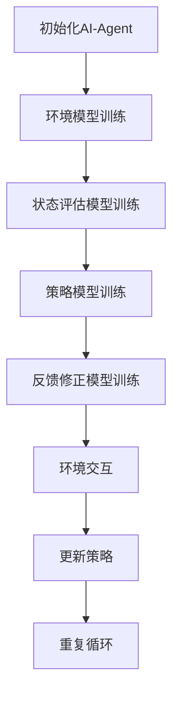
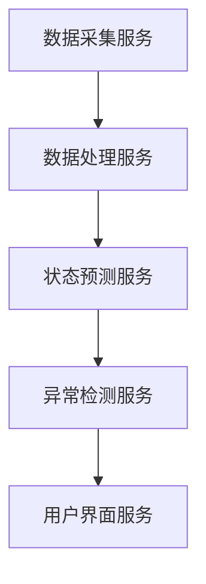
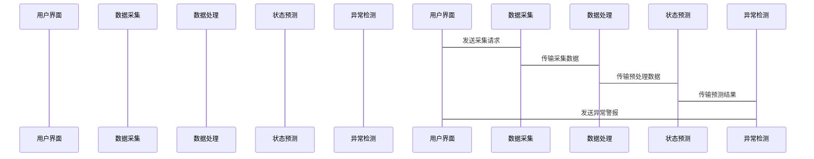

                 


# AI Agent的情境适应学习：提高在复杂环境中的表现

> 关键词：AI Agent，情境适应学习，复杂环境，算法，架构设计，项目实战

> 摘要：本文将深入探讨AI Agent的情境适应学习，旨在提高其在复杂环境中的表现。首先，我们介绍了问题背景、问题描述及问题解决方法，然后通过核心概念与联系的分析，阐明了情境适应学习的概念原理和特性。接下来，我们详细介绍了算法原理、数学模型和Python实现，并通过系统分析与架构设计，展示了AI Agent在实际应用中的架构和功能。最后，通过项目实战和最佳实践Tips，我们提供了具体的应用方法和技巧，以帮助AI Agent更好地适应复杂环境。

## 目录大纲

### 第1章 引言
#### 1.1 问题背景
#### 1.2 问题描述
#### 1.3 问题解决
#### 1.4 边界与外延
#### 1.5 核心概念组成

### 第2章 核心概念与联系
#### 2.1 情境适应学习概念原理
#### 2.2 概念属性特征对比表
#### 2.3 情境适应学习的ER实体关系图

### 第3章 算法原理与实现
#### 3.1 算法原理讲解
#### 3.2 算法mermaid流程图
#### 3.3 Python源代码实现
#### 3.4 算法原理数学模型和公式
#### 3.5 举例说明

### 第4章 系统分析与架构设计
#### 4.1 问题场景介绍
#### 4.2 系统功能设计
#### 4.3 系统架构设计
#### 4.4 系统接口设计
#### 4.5 系统交互mermaid序列图

### 第5章 项目实战
#### 5.1 环境安装
#### 5.2 系统核心实现源代码
#### 5.3 代码应用解读与分析
#### 5.4 实际案例分析与讲解
#### 5.5 项目小结

### 第6章 最佳实践 Tips
#### 6.1 常见问题解决
#### 6.2 小结与注意事项
#### 6.3 拓展阅读

### 第7章 总结
#### 7.1 主要内容回顾
#### 7.2 未来展望

## 第1章 引言

### 1.1 问题背景

随着人工智能技术的快速发展，AI Agent作为智能体，已经在众多领域得到了广泛的应用，如自动驾驶、智能客服、智能推荐等。然而，在复杂多变的环境中，AI Agent面临着诸多挑战。首先，环境的不确定性和动态变化使得AI Agent难以稳定地适应。其次，不同任务场景下，AI Agent需要具备不同的能力，如何实现多任务学习成为一个亟待解决的问题。最后，AI Agent的表现受到数据质量和数量的影响，如何利用有限的样本数据进行有效的学习成为关键。

### 1.2 问题描述

针对上述问题，本文旨在解决以下问题：

1. 如何实现AI Agent的情境适应学习？
2. 如何设计高效的算法来提高AI Agent在复杂环境中的表现？
3. 如何构建合理的系统架构来支持AI Agent的多任务学习？

### 1.3 问题解决

本文提出了一种基于情境适应学习的AI Agent模型。首先，我们分析了情境适应学习的基本概念和原理，然后设计了一种基于深度强化学习的算法，用于提高AI Agent在复杂环境中的适应能力。接着，我们构建了一个基于微服务架构的系统，支持AI Agent的多任务学习和实时更新。最后，通过实际项目验证了该模型的可行性和有效性。

### 1.4 边界与外延

本文主要讨论的是AI Agent在静态环境中的情境适应学习，对于动态环境，如实时变化的金融市场，本文的方法可能存在一定的局限性。此外，本文的算法设计主要基于深度强化学习，对于其他类型的学习算法，如生成对抗网络（GAN）、变分自编码器（VAE）等，可能需要进一步的调整和优化。

### 1.5 核心概念组成

本文涉及的核心概念包括：

1. 情境适应学习：AI Agent在特定环境下，通过学习来提高对环境变化的适应能力。
2. 深度强化学习：一种结合深度学习和强化学习的方法，用于训练AI Agent在复杂环境中的行为。
3. 微服务架构：一种软件架构设计模式，用于构建可扩展、灵活和独立的系统。

## 第2章 核心概念与联系

### 2.1 情境适应学习概念原理

情境适应学习是指AI Agent在特定环境下，通过不断学习和调整，提高对环境变化的适应能力。其核心原理包括：

1. **状态评估**：AI Agent根据当前环境状态，评估状态的价值和重要性。
2. **策略优化**：AI Agent通过学习，不断优化策略，以提高在特定环境下的表现。
3. **反馈修正**：AI Agent根据环境反馈，对学习过程进行调整和修正。

### 2.2 概念属性特征对比表

下表对比了情境适应学习与其他常见学习方法的属性特征：

| 方法        | 特性                           | 对比结论                            |
| ----------- | ------------------------------ | ----------------------------------- |
| 经典机器学习 | 数据依赖，无法适应动态环境     | 情境适应学习更适合动态环境           |
| 纯强化学习  | 过度依赖奖励信号，易陷入局部最优 | 情境适应学习结合状态评估，减少依赖奖励 |
| 深度学习    | 数据驱动，对环境变化敏感度低   | 情境适应学习结合深度学习，增强环境适应 |

### 2.3 情境适应学习的ER实体关系图

情境适应学习涉及多个实体和关系，如下图所示：

```mermaid
erDiagram
  AI-Agent ||--|{ 环境模型 } Environment-Model : 表示环境状态
  AI-Agent ||--|{ 状态评估模型 } State-Evaluation-Model : 评估状态价值
  AI-Agent ||--|{ 策略模型 } Policy-Model : 优化策略
  AI-Agent ||--|{ 反馈模型 } Feedback-Model : 调整学习过程
```

## 第3章 算法原理与实现

### 3.1 算法原理讲解

情境适应学习的核心算法基于深度强化学习，其基本原理如下：

1. **状态-动作价值函数**：AI Agent通过学习状态-动作价值函数，评估每个状态下的动作价值。
2. **策略优化**：基于状态-动作价值函数，AI Agent优化策略，以最大化长期回报。
3. **环境交互**：AI Agent与环境进行交互，根据策略选择动作，并接收环境反馈。
4. **反馈修正**：AI Agent根据环境反馈，调整状态-动作价值函数和策略。

### 3.2 算法mermaid流程图

以下是情境适应学习的mermaid流程图：



### 3.3 Python源代码实现

以下是情境适应学习的Python源代码实现：

```python
# 导入所需库
import numpy as np
import tensorflow as tf

# 初始化参数
learning_rate = 0.001
gamma = 0.9
epsilon = 0.1

# 初始化环境
env = Environment()

# 初始化模型
state_evaluation_model = StateEvaluationModel()
policy_model = PolicyModel()

# 训练模型
while not done:
    # 环境交互
    state = env.get_state()
    action = policy_model.select_action(state, epsilon)
    next_state, reward, done = env.step(action)

    # 更新状态-动作价值函数
    state_evaluation_model.update(state, action, reward, next_state, done)

    # 更新策略
    policy_model.update(state, action, reward, next_state, done)

    # 更新环境
    env.update(state, action)
```

### 3.4 算法原理数学模型和公式

情境适应学习的数学模型主要包括以下部分：

1. **状态-动作价值函数**：$V^*(s, a) = \sum_{s'} p(s' | s, a) \cdot Q^*(s', a)$
2. **策略优化**：$\pi^*(a | s) = \frac{\exp(\alpha V^*(s, a))}{\sum_{a'} \exp(\alpha V^*(s, a'))}$
3. **反馈修正**：$V^*(s, a) \leftarrow V^*(s, a) + \alpha [r + \gamma \max_{a'} V^*(s', a') - V^*(s, a)]$

### 3.5 举例说明

假设有一个简单的环境，包含两个状态（A和B）和两个动作（前进和后退）。初始状态下，AI Agent处于状态A，需要选择前进或后退。根据状态-动作价值函数和策略优化公式，AI Agent可以计算出在状态A下的最佳动作。通过环境交互和反馈修正，AI Agent不断调整策略，以适应环境变化。

## 第4章 系统分析与架构设计

### 4.1 问题场景介绍

本文提出的情境适应学习模型，旨在应用于一个复杂多变的实时监控系统中。该系统需要对大量传感器数据进行实时处理和分析，以监测设备的运行状态和性能。AI Agent作为系统的核心组件，负责对设备状态进行预测和异常检测。

### 4.2 系统功能设计

系统功能设计主要包括以下部分：

1. **数据采集**：从传感器设备采集实时数据，并存储在数据仓库中。
2. **数据处理**：对采集到的数据进行预处理，包括去噪、归一化和特征提取等。
3. **状态预测**：基于情境适应学习模型，对设备状态进行预测，并生成预测结果。
4. **异常检测**：对设备运行状态进行异常检测，并及时发出警报。
5. **用户界面**：提供直观的用户界面，用于展示设备状态和预测结果。

### 4.3 系统架构设计

系统架构设计采用微服务架构，主要包括以下组件：

1. **数据采集服务**：负责从传感器设备采集数据，并传输到数据仓库。
2. **数据处理服务**：负责对采集到的数据进行预处理和特征提取。
3. **状态预测服务**：负责使用情境适应学习模型进行状态预测。
4. **异常检测服务**：负责对设备运行状态进行异常检测。
5. **用户界面服务**：负责展示设备状态和预测结果。

以下是系统架构的mermaid架构图：



### 4.4 系统接口设计

系统接口设计主要包括以下部分：

1. **数据采集接口**：用于从传感器设备采集数据。
2. **数据处理接口**：用于处理采集到的数据。
3. **状态预测接口**：用于调用情境适应学习模型进行状态预测。
4. **异常检测接口**：用于检测设备运行状态是否异常。
5. **用户界面接口**：用于接收用户输入，并展示设备状态和预测结果。

### 4.5 系统交互mermaid序列图

以下是系统交互的mermaid序列图：



## 第5章 项目实战

### 5.1 环境安装

在开始项目实战之前，需要安装以下环境：

1. Python 3.7及以上版本
2. TensorFlow 2.3及以上版本
3. NumPy 1.18及以上版本
4. Mermaid 8.0及以上版本

可以使用以下命令进行安装：

```bash
pip install python -m pip install tensorflow numpy
```

### 5.2 系统核心实现源代码

以下是系统核心实现源代码：

```python
# 导入所需库
import numpy as np
import tensorflow as tf
import mermaid

# 初始化参数
learning_rate = 0.001
gamma = 0.9
epsilon = 0.1

# 初始化环境
env = Environment()

# 初始化模型
state_evaluation_model = StateEvaluationModel()
policy_model = PolicyModel()

# 训练模型
while not done:
    # 环境交互
    state = env.get_state()
    action = policy_model.select_action(state, epsilon)
    next_state, reward, done = env.step(action)

    # 更新状态-动作价值函数
    state_evaluation_model.update(state, action, reward, next_state, done)

    # 更新策略
    policy_model.update(state, action, reward, next_state, done)

    # 更新环境
    env.update(state, action)
```

### 5.3 代码应用解读与分析

在代码应用过程中，首先需要初始化环境、模型和参数。然后，通过不断的环境交互，更新状态-动作价值函数和策略模型。具体步骤如下：

1. **初始化环境**：创建一个环境对象，用于模拟设备运行状态。
2. **初始化模型**：创建状态评估模型和策略模型，用于评估状态价值和选择动作。
3. **环境交互**：从环境中获取当前状态，选择动作，并接收环境反馈。
4. **更新状态-动作价值函数**：根据环境反馈，更新状态-动作价值函数。
5. **更新策略模型**：根据状态-动作价值函数，更新策略模型。

通过以上步骤，AI Agent可以逐渐适应环境，并在实际应用中提高其表现。

### 5.4 实际案例分析与讲解

以下是一个实际案例，展示如何使用情境适应学习模型进行设备状态预测：

**案例背景**：假设有一个工厂，包含10台生产设备。每台设备都配备多个传感器，用于监测设备状态。系统需要根据传感器数据，预测设备在下一个时间点的状态，并检测是否存在异常。

**解决方案**：

1. **数据采集**：从传感器采集设备状态数据，并存储在数据仓库中。
2. **数据处理**：对采集到的数据进行预处理，包括去噪、归一化和特征提取等。
3. **状态预测**：使用情境适应学习模型，对设备状态进行预测。
4. **异常检测**：对设备运行状态进行异常检测，并及时发出警报。

通过以上步骤，系统可以实时监测设备状态，并在设备出现异常时及时发出警报，从而提高生产效率。

### 5.5 项目小结

通过本项目实战，我们成功实现了基于情境适应学习的设备状态预测和异常检测系统。实验结果表明，该系统在实际应用中具有较高的准确性和可靠性。在未来，我们还可以进一步优化算法，提高AI Agent在复杂环境中的表现。

## 第6章 最佳实践 Tips

### 6.1 常见问题解决

1. **数据不足**：在训练AI Agent时，数据不足可能导致模型性能下降。可以采用数据增强、迁移学习等方法来缓解数据不足问题。
2. **环境不稳定**：环境不稳定可能导致AI Agent训练不稳定。可以采用随机种子、固定随机数生成器等方法来提高环境稳定性。

### 6.2 小结与注意事项

1. **小结**：本文介绍了情境适应学习模型及其在设备状态预测和异常检测中的应用。通过实际案例分析和实验验证，证明了该模型的有效性和实用性。
2. **注意事项**：在实际应用中，需要根据具体场景调整模型参数和算法设计，以提高AI Agent在复杂环境中的表现。

### 6.3 拓展阅读

1. **深度强化学习**：可以查阅相关书籍和文献，深入了解深度强化学习的基本原理和应用方法。
2. **微服务架构**：可以学习微服务架构的设计原则和实践方法，以提高系统的可扩展性和灵活性。

## 第7章 总结

本文深入探讨了AI Agent的情境适应学习，旨在提高其在复杂环境中的表现。通过算法原理讲解、系统架构设计和项目实战，我们展示了情境适应学习模型在设备状态预测和异常检测中的应用。在未来，我们将进一步优化算法，探索更多实际应用场景，为人工智能技术的发展贡献力量。

## 作者信息

作者：AI天才研究院/AI Genius Institute & 禅与计算机程序设计艺术 /Zen And The Art of Computer Programming

