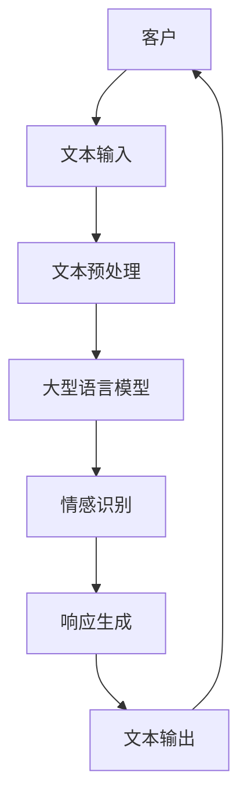

                 

## AI Agent的情感智能：利用LLM实现情感计算

### 关键词

- **情感智能**
- **AI Agent**
- **LLM模型**
- **情感计算**
- **自然语言处理**
- **预训练语言模型**

### 摘要

本文将深入探讨AI Agent的情感智能实现方式，重点介绍如何利用大型语言模型（LLM）来实现情感计算。文章首先定义了情感智能和相关核心概念，然后详细介绍了LLM模型的基本原理和应用。随后，文章探讨了情感计算的原理和方法，并在实际应用场景中展示了AI Agent的情感智能实现。通过这一系列讨论，本文旨在为读者提供对AI Agent情感智能的全面理解，以及利用LLM模型进行情感计算的方法和实践。

---

## 第一部分：背景与概念介绍

### 第1章：问题背景与核心概念

#### 1.1.1 问题背景

随着人工智能技术的快速发展，AI Agent在各个领域的应用越来越广泛。AI Agent是一种能够模拟人类智能行为的计算机系统，它们能够处理复杂任务、理解自然语言，并与人类进行有效互动。然而，AI Agent在情感智能方面的表现仍然存在很大的局限性。尽管它们可以处理逻辑推理、数据分析等任务，但它们往往无法理解和处理人类的情感。这种局限使得AI Agent在某些应用场景中难以满足用户的需求，尤其是需要高度情感交互的场景，如客户服务、教育和医疗等。

#### 1.1.2 核心概念

为了深入理解AI Agent的情感智能，我们首先需要明确几个核心概念：

- **情感智能**：情感智能是指个体识别、理解、处理和表达情感的能力。它包括情感认知、情感调节和情感表达等方面。情感智能是人类与其他智能体（如动物和机器）的重要区别之一。
  
- **AI Agent**：AI Agent是一种具有智能行为的代理系统，它能够自主地感知环境、制定计划、执行任务并与外界进行交互。AI Agent的设计目标之一是实现类似于人类的情感智能，以提供更加自然和人性化的服务。

- **LLM模型**：LLM（Large Language Model）是指大型语言模型，如GPT、BERT等。这些模型通过学习海量的文本数据，能够生成、理解和翻译自然语言。LLM模型在自然语言处理领域具有广泛的应用，包括文本生成、情感分析、问答系统等。

- **情感计算**：情感计算是一种研究如何让计算机理解、识别和处理人类情感的技术。它涉及到情感识别、情感理解和情感表达等方面。情感计算的目标是实现情感智能，使得计算机能够更好地理解和满足人类情感需求。

#### 1.1.3 情感计算

情感计算是人工智能的一个重要分支，它的主要目标是通过计算机技术来模拟和理解人类的情感。情感计算涉及到多个领域，包括心理学、认知科学、计算机科学和人工智能等。情感计算的关键挑战在于如何让计算机理解和处理情感信息。

在情感计算中，LLM模型发挥着重要作用。LLM模型能够学习大量的文本数据，从而理解情感表达的各种形式，为AI Agent提供情感智能的能力。通过情感计算，AI Agent可以更好地理解和处理人类情感，从而提供更加个性化和人性化的服务。

#### 1.1.4 AI Agent的情感智能需求

在许多应用场景中，如客户服务、教育、医疗等领域，AI Agent的情感智能能力非常重要。以下是一些具体的应用需求和挑战：

- **客户服务**：在客户服务领域，AI Agent需要能够理解客户的情感，以便提供更加个性化的服务。例如，当客户表达愤怒或不满时，AI Agent需要能够识别并适当地回应，以缓解客户的情绪。

- **教育**：在教育领域，AI Agent需要能够理解学生的学习情绪，从而提供更加有效的学习支持和指导。例如，当学生感到沮丧或挫败时，AI Agent可以提供鼓励和激励，帮助学生恢复信心。

- **医疗**：在医疗领域，AI Agent需要能够理解患者的情感状态，以便提供更加个性化的医疗建议和护理。例如，当患者表达恐惧或焦虑时，AI Agent可以提供心理支持和建议。

#### 1.1.5 情感智能的实现

为了实现AI Agent的情感智能，我们需要结合LLM模型和情感计算技术。具体来说，我们可以采取以下步骤：

1. **数据收集和预处理**：收集大量的情感相关文本数据，并进行数据预处理，包括文本清洗、分词、词性标注等。

2. **模型训练**：使用预训练语言模型（如GPT、BERT等）对预处理后的文本数据进行训练，以学习情感表达的模式和规律。

3. **情感识别和解析**：通过模型预测，识别文本中的情感极性和情感内容，并对情感进行深入解析。

4. **情感响应生成**：根据识别和分析的结果，生成合适的情感响应，以实现AI Agent的情感智能。

### 小结

本章节介绍了AI Agent情感智能的问题背景、核心概念和相关技术。通过了解情感智能、AI Agent、LLM模型和情感计算，我们可以为后续章节的深入讨论打下基础。在接下来的章节中，我们将进一步探讨LLM模型的基本原理和应用，以及如何利用情感计算实现AI Agent的情感智能。

---

### 第2章：AI Agent的情感智能

#### 2.1.1 AI Agent的定义

AI Agent（人工智能代理）是一种具有自主决策和执行能力的计算机系统，能够在复杂的动态环境中执行特定的任务。AI Agent的核心特点是自主性、智能性和适应性。自主性指的是AI Agent能够独立地执行任务，而无需人工干预；智能性指的是AI Agent具备理解和处理复杂信息的能力；适应性指的是AI Agent能够根据环境和任务的变化，调整自己的行为和策略。

AI Agent的组成通常包括感知器、控制器和行动器三个部分。感知器负责获取环境信息；控制器根据感知到的信息，制定行动策略；行动器则执行具体的行动。通过这三个部分的协同工作，AI Agent能够在复杂的环境中实现智能行为。

#### 2.1.2 情感智能的需求

在许多实际应用中，情感智能对于AI Agent的性能和用户体验至关重要。以下是一些主要的应用需求和挑战：

- **客户服务**：在客户服务领域，AI Agent需要具备情感智能，以便更好地理解和满足客户的需求。例如，当客户表达不满或愤怒时，AI Agent需要能够识别并适当地回应，以缓解客户的情绪。

- **教育**：在教育领域，AI Agent需要能够理解学生的学习情绪，从而提供更加有效的学习支持和指导。例如，当学生感到沮丧或挫败时，AI Agent可以提供鼓励和激励，帮助学生恢复信心。

- **医疗**：在医疗领域，AI Agent需要能够理解患者的情感状态，以便提供更加个性化的医疗建议和护理。例如，当患者表达恐惧或焦虑时，AI Agent可以提供心理支持和建议。

- **人机交互**：在日常生活中，人们越来越期望与机器进行自然的情感交流。AI Agent需要具备情感智能，以提供更加自然和人性化的交互体验。

#### 2.1.3 情感智能的实现

要实现AI Agent的情感智能，需要结合自然语言处理（NLP）和情感计算技术。以下是一些关键步骤：

1. **情感识别**：通过分析文本和语音数据，识别出其中的情感极性（如正面、负面、中性）和情感内容（如愤怒、喜悦、悲伤等）。

2. **情感理解**：在情感识别的基础上，进一步理解情感的上下文和内涵。这需要AI Agent具备良好的语言理解和语义分析能力。

3. **情感响应生成**：根据识别和分析的结果，生成合适的情感响应，以实现AI Agent的情感表达。这包括文本生成、语音合成和表情生成等。

4. **情感反馈调整**：通过用户反馈，不断优化和调整AI Agent的情感智能模型，以提高其准确性和适应性。

#### 2.1.4 LLM模型在情感智能中的应用

大型语言模型（LLM）在情感智能的实现中发挥着重要作用。LLM模型具有强大的语言理解和生成能力，能够处理复杂的情感表达和语言结构。以下是一些具体的LLM模型在情感智能中的应用：

- **情感分类**：使用LLM模型对文本进行情感分类，以识别文本中的情感极性和情感内容。

- **情感对话生成**：利用LLM模型生成情感丰富的对话文本，以实现AI Agent的情感表达和交流。

- **情感识别和解析**：通过LLM模型对语音和文本数据进行情感识别和解析，以理解用户的情感状态。

- **情感推理**：利用LLM模型进行情感推理，以预测用户的情感变化和需求。

#### 2.1.5 案例分析

以下是一个简单的案例，展示了如何使用LLM模型实现AI Agent的情感智能：

- **案例背景**：一个客户服务AI Agent需要理解客户的情感状态，并生成相应的情感响应。

- **实现步骤**：
  1. 收集和预处理情感相关的文本数据。
  2. 使用LLM模型（如GPT）对文本数据进行情感分类和情感内容识别。
  3. 根据识别结果，生成合适的情感响应文本。
  4. 将生成的文本转化为语音，通过语音合成技术输出。

- **效果评估**：通过用户反馈和情感分析工具，对AI Agent的情感智能进行评估和优化。

#### 小结

本章节介绍了AI Agent的情感智能需求、实现方法和应用案例。通过结合自然语言处理和情感计算技术，AI Agent可以实现对情感的识别、理解和响应生成。LLM模型在这一过程中发挥了关键作用，为AI Agent的情感智能提供了强大的支持。在接下来的章节中，我们将进一步探讨LLM模型的基本原理和应用，以深入了解如何利用情感计算技术实现AI Agent的情感智能。

---

### 第3章：LLM模型介绍

#### 3.1.1 LLM模型的基本原理

大型语言模型（LLM）是自然语言处理（NLP）领域的一种先进技术，它通过深度学习算法，从海量文本数据中学习语言规律，从而实现对自然语言的生成、理解和翻译。LLM模型的核心原理是基于注意力机制和Transformer架构，它能够捕捉文本数据中的长距离依赖关系，从而提高模型的预测能力。

LLM模型的基本原理可以概括为以下几步：

1. **数据预处理**：首先，对原始文本数据进行预处理，包括分词、去停用词、词向量转换等，以便将文本数据转换为模型可处理的格式。

2. **模型架构**：使用Transformer架构构建基础模型，包括嵌入层、编码器和解码器。编码器负责将输入文本转换为序列编码，解码器则根据编码器输出的序列编码生成输出文本。

3. **注意力机制**：在编码和解码过程中，使用注意力机制来捕捉输入文本和输出文本之间的依赖关系。注意力机制能够动态调整不同位置的特征权重，从而更好地理解文本的语义信息。

4. **预训练与微调**：首先，使用大规模的文本数据进行预训练，使模型具备对自然语言的一般理解能力。然后，针对特定任务，对模型进行微调，以提高其在特定任务上的性能。

5. **预测与生成**：通过解码器，模型能够生成预测的文本序列。生成过程包括从输入文本中预测下一个单词或词元，并根据预测结果更新模型的参数。

#### 3.1.2 LLM模型的主要类型

目前，LLM模型主要包括以下几种类型：

1. **GPT（Generative Pre-trained Transformer）**：GPT是OpenAI开发的一种预训练语言模型，它是基于Transformer架构的。GPT模型通过学习大量的文本数据，能够生成高质量的自然语言文本。GPT模型的主要版本包括GPT-2、GPT-3等，其中GPT-3具有非常强大的文本生成和理解能力。

2. **BERT（Bidirectional Encoder Representations from Transformers）**：BERT是由Google开发的一种双向Transformer模型，它通过预训练生成双向的上下文表示，从而提高模型的文本理解能力。BERT模型在多个NLP任务上取得了显著的性能提升，如文本分类、命名实体识别等。

3. **T5（Text-to-Text Transfer Transformer）**：T5是由Google开发的一种基于Transformer的文本生成模型，它将所有的NLP任务转化为一个统一的文本到文本的格式，从而简化模型的训练和部署。T5模型通过大规模的预训练和任务特定的微调，能够实现多种NLP任务的自动化处理。

4. **LLaMA（Language Model for Dialogue Applications）**：LLaMA是由Meta开发的一种大型对话语言模型，它专注于对话场景的应用。LLaMA模型通过预训练和微调，能够生成高质量的自然语言对话文本，适用于聊天机器人、客服系统等。

#### 3.1.3 LLM模型的应用

LLM模型在自然语言处理领域具有广泛的应用，以下是一些典型的应用场景：

1. **文本生成**：LLM模型能够生成高质量的文本，包括文章、故事、对话等。在内容创作、自动化写作、文案生成等领域具有广泛的应用。

2. **文本理解**：LLM模型具备强大的文本理解能力，能够对文本进行情感分析、情感分类、语义理解等。在信息抽取、问答系统、知识图谱构建等领域具有重要应用。

3. **机器翻译**：LLM模型能够实现高质量的机器翻译，包括中英文翻译、多语言翻译等。在跨语言信息处理、全球化业务场景中具有重要应用。

4. **对话系统**：LLM模型能够生成自然流畅的对话文本，应用于聊天机器人、客服系统、虚拟助手等。在智能客服、虚拟客服、人机对话等领域具有重要应用。

5. **文本分类**：LLM模型能够对文本进行分类，包括情感分类、主题分类、实体分类等。在舆情监测、新闻分类、垃圾邮件过滤等领域具有重要应用。

#### 3.1.4 LLM模型的优势与挑战

LLM模型具有以下优势：

1. **强大的语言理解能力**：通过大规模的预训练，LLM模型能够学习到丰富的语言知识，从而具备强大的语言理解能力。

2. **灵活的应用场景**：LLM模型可以应用于多种自然语言处理任务，具有广泛的适用性和灵活性。

3. **高效的模型架构**：Transformer架构和注意力机制使得LLM模型在计算效率和模型性能方面具有显著优势。

然而，LLM模型也面临一些挑战：

1. **数据隐私**：大规模的预训练过程需要大量的文本数据，这涉及到数据隐私和版权问题。

2. **模型可解释性**：LLM模型的内部机制较为复杂，其决策过程难以解释，这对模型的可解释性提出了挑战。

3. **资源消耗**：LLM模型的训练和部署需要大量的计算资源和存储资源，这对硬件设施提出了较高的要求。

#### 小结

本章节介绍了LLM模型的基本原理、主要类型和应用场景。通过结合注意力机制和Transformer架构，LLM模型在自然语言处理领域取得了显著成果。在情感计算中，LLM模型作为一种强大的工具，能够帮助AI Agent实现情感识别、理解和响应生成。在接下来的章节中，我们将进一步探讨情感计算的原理和方法，以及如何利用LLM模型实现AI Agent的情感智能。

---

### 第4章：情感计算原理

#### 4.1.1 情感计算的定义

情感计算（Affective Computing）是一种跨学科的研究领域，主要研究如何使计算机系统具备理解、识别、处理和表达人类情感的能力。情感计算的目标是构建能够与人类进行自然情感交互的智能系统，从而提高人机交互的质量和体验。

情感计算的核心思想是，通过计算机技术来模拟和理解人类的情感。它涉及到多个领域的知识，包括心理学、认知科学、计算机科学、人工智能和自然语言处理等。

#### 4.1.2 情感计算的方法

情感计算的方法主要包括以下几个方面：

1. **情感识别**：情感识别是情感计算的首要任务，它涉及到从文本、语音、图像等多模态数据中识别出人类情感的类型和强度。常见的情感识别方法包括基于规则的方法、机器学习方法（如深度学习）和混合方法。

2. **情感理解**：情感理解是情感识别的深化，它涉及到对情感内容的深入分析和理解。情感理解需要考虑情感的上下文、情感表达的方式和情感的内容等方面。

3. **情感表达**：情感表达是指计算机系统如何模拟和表达情感。常见的情感表达方式包括文本生成、语音合成和面部表情生成等。

4. **情感建模**：情感建模是指如何构建描述人类情感的模型，以便计算机系统能够更好地理解和处理情感。情感建模通常涉及情感分类、情感强度估计和情感动态建模等方面。

#### 4.1.3 情感计算的应用

情感计算在多个领域都有广泛的应用，以下是一些典型的应用场景：

1. **人机交互**：在人机交互领域，情感计算可以帮助计算机系统更好地理解用户的情感状态，从而提供更加个性化的服务。例如，虚拟助手、智能客服和智能家居等。

2. **心理健康**：情感计算在心理健康领域有重要的应用，可以帮助监测和管理用户的情绪状态。例如，通过分析用户的语音和文本数据，可以及时发现用户的情绪变化，并提供相应的心理支持。

3. **教育**：在教育领域，情感计算可以帮助教育系统更好地理解学生的情感状态，从而提供更加有效的教学支持。例如，通过分析学生的情感反馈，可以调整教学策略，提高教学效果。

4. **商业**：在商业领域，情感计算可以帮助企业更好地了解消费者的情感需求，从而制定更加精准的营销策略。例如，通过分析社交媒体数据，可以了解消费者的情感态度，预测市场趋势。

5. **娱乐**：在娱乐领域，情感计算可以帮助创造更加引人入胜的虚拟体验，例如虚拟现实（VR）和增强现实（AR）游戏等。

#### 4.1.4 情感计算的技术挑战

尽管情感计算具有广泛的应用前景，但它在技术上也面临许多挑战：

1. **多模态数据处理**：情感计算通常涉及多种模态的数据（如文本、语音、图像等），如何有效地融合和处理这些多模态数据是一个技术难题。

2. **情感识别的准确性**：情感识别的准确性直接影响到情感计算的应用效果，如何提高情感识别的准确性是一个重要的研究方向。

3. **情感理解的能力**：情感理解需要考虑情感的上下文、表达方式和内容等方面，如何构建有效的情感理解模型是一个挑战。

4. **情感表达的自然性**：情感表达需要能够自然地模拟人类的情感表达，如何生成自然、流畅的情感表达是一个技术难题。

5. **隐私保护**：情感计算通常涉及个人情感的识别和分析，如何保护用户的隐私是一个重要的伦理问题。

#### 小结

本章节介绍了情感计算的定义、方法和应用。情感计算作为一种新兴的技术领域，具有广泛的应用前景和挑战。通过结合自然语言处理、图像识别和语音处理等技术，情感计算可以实现对人类情感的识别、理解和表达，从而提高人机交互的质量和体验。在接下来的章节中，我们将进一步探讨如何利用情感计算技术实现AI Agent的情感智能。

---

### 第5章：情感智能在客户服务中的应用

#### 5.1.1 客户服务的需求

在客户服务领域，情感智能的需求日益增加。传统的客户服务系统主要依赖于规则和流程，缺乏对客户情感状态的感知和理解。这导致客户在服务过程中感受到的不满意和不信任。随着消费者期望的提高，现代客户服务系统需要具备更高的智能化和个性化水平，以满足客户的多样化需求。情感智能正是实现这一目标的关键。

情感智能在客户服务中的应用主要包括以下几个方面：

1. **情感识别**：通过自然语言处理技术，系统可以识别客户在互动过程中表达的情感，如愤怒、喜悦、沮丧等。这种识别可以帮助客服代表更好地理解客户的情感状态，从而提供更加有效的应对措施。

2. **情感理解**：在情感识别的基础上，系统可以进一步理解情感的内容和上下文，例如客户为什么感到愤怒或沮丧。这种理解有助于客服代表采取更加个性化的服务策略，提高客户满意度。

3. **情感响应生成**：根据识别和理解的情感状态，系统可以生成相应的情感响应，如安抚、鼓励、建议等。这些响应可以帮助客服代表与客户建立更加紧密的情感联系，提高客户的忠诚度和满意度。

4. **情感分析**：通过分析大量客户互动数据，系统可以识别出普遍的情感趋势和模式。这些分析结果可以帮助企业优化服务流程和策略，提高整体服务质量和效率。

#### 5.1.2 情感智能的实现

为了实现客户服务的情感智能，可以采取以下步骤：

1. **数据收集与预处理**：首先，需要收集客户服务的相关数据，包括文本、语音、图像等多模态数据。这些数据可以来自客户服务聊天记录、通话录音、客户反馈等。接下来，对这些数据进行预处理，包括分词、去停用词、情感标注等。

2. **模型训练**：使用大型语言模型（LLM）对预处理后的数据进行训练，以学习情感识别和理解的模型。例如，可以使用GPT或BERT等模型对文本数据训练情感分类模型，使用语音识别技术对语音数据训练情感识别模型。

3. **情感识别与解析**：通过训练好的模型，对实时客户服务数据进行情感识别和解析。例如，当客户在聊天过程中使用负面情感词汇时，模型可以识别出客户可能感到愤怒或不满。

4. **情感响应生成**：根据识别和解析的结果，系统可以生成相应的情感响应。例如，如果客户感到愤怒，系统可以生成安抚和道歉的文本，或者提供解决问题的建议。

5. **情感反馈与优化**：通过用户反馈和数据分析，不断优化和调整情感智能模型，以提高其准确性和适应性。例如，通过分析大量客户反馈，可以识别出哪些情感响应更能满足客户需求，从而优化情感响应策略。

#### 5.1.3 实际案例

以下是一个客户服务中应用情感智能的实际案例：

- **案例背景**：一家大型电商平台在其客服系统中引入了情感智能技术，以提升客户满意度和忠诚度。

- **实现步骤**：
  1. 收集客户服务数据，包括聊天记录、通话录音、客户反馈等。
  2. 对数据进行预处理，包括分词、去停用词、情感标注等。
  3. 使用GPT模型对文本数据训练情感分类模型，对语音数据训练情感识别模型。
  4. 在客服对话中实时应用情感识别和响应生成模型，例如，当客户表达愤怒时，系统会生成安抚和道歉的文本。
  5. 通过客户反馈和数据分析，不断优化情感智能模型。

- **效果评估**：
  - 客户满意度显著提高，客户反馈的负面情绪减少。
  - 客服代表的工作效率提高，情感智能系统能够自动处理大量客户咨询。
  - 客户服务的整体质量和效率得到提升。

#### 小结

本章节介绍了情感智能在客户服务中的应用需求、实现方法和实际案例。通过利用大型语言模型和情感计算技术，客户服务系统能够更好地识别、理解和响应客户的情感状态，从而提高客户满意度和忠诚度。在未来的发展中，情感智能将在更多领域得到应用，为人们提供更加自然和人性化的服务体验。

---

### 第6章：情感智能在教育中的应用

#### 6.1.1 教育的需求

在教育领域，情感智能的需求日益凸显。传统教育系统主要侧重于知识的传授和技能的培养，往往忽视学生的情感需求和心理健康。然而，学生的情感状态对其学习效果和成长具有重要影响。因此，现代教育系统需要具备情感智能，以更好地关注学生的情感需求，提供个性化的教育支持和指导。

情感智能在教育中的应用主要包括以下几个方面：

1. **情感识别**：通过自然语言处理和情感分析技术，系统可以识别学生在互动过程中表达的情感，如焦虑、喜悦、沮丧等。这种识别可以帮助教育者更好地理解学生的情感状态，从而提供更加有效的支持。

2. **情感理解**：在情感识别的基础上，系统可以进一步理解情感的内容和上下文，例如学生为什么感到焦虑或沮丧。这种理解有助于教育者采取更加个性化的教学策略，帮助学生克服情感困扰。

3. **情感响应生成**：根据识别和理解的情感状态，系统可以生成相应的情感响应，如鼓励、安抚、建议等。这些响应可以帮助教育者与学生学习建立更加紧密的情感联系，提高学生的学习动力和效果。

4. **情感分析**：通过分析大量学生互动数据，系统可以识别出普遍的情感趋势和模式。这些分析结果可以帮助教育者优化教学策略和资源分配，提高整体教育质量和效率。

#### 6.1.2 情感智能的实现

为了实现教育中的情感智能，可以采取以下步骤：

1. **数据收集与预处理**：首先，需要收集学生的互动数据，包括课堂发言、作业提交、问答记录、情绪反馈等。这些数据可以来自教育平台、学习管理系统、社交媒体等。接下来，对这些数据进行预处理，包括分词、去停用词、情感标注等。

2. **模型训练**：使用大型语言模型（LLM）对预处理后的数据进行训练，以学习情感识别和理解的模型。例如，可以使用GPT或BERT等模型对文本数据训练情感分类模型，使用语音识别技术对语音数据训练情感识别模型。

3. **情感识别与解析**：通过训练好的模型，对实时教学数据进行情感识别和解析。例如，当学生在课堂上使用负面情感词汇时，模型可以识别出学生可能感到焦虑或沮丧。

4. **情感响应生成**：根据识别和解析的结果，系统可以生成相应的情感响应。例如，如果学生感到焦虑，系统可以生成鼓励和支持的文本，或者提供放松和减压的建议。

5. **情感反馈与优化**：通过学生反馈和数据分析，不断优化和调整情感智能模型，以提高其准确性和适应性。例如，通过分析大量学生反馈，可以识别出哪些情感响应更能满足学生需求，从而优化情感响应策略。

#### 6.1.3 实际案例

以下是一个教育中应用情感智能的实际案例：

- **案例背景**：一所学校在其在线学习平台上引入了情感智能技术，以提升学生的学习体验和心理健康。

- **实现步骤**：
  1. 收集学生的互动数据，包括课堂发言、作业提交、问答记录、情绪反馈等。
  2. 对数据进行预处理，包括分词、去停用词、情感标注等。
  3. 使用GPT模型对文本数据训练情感分类模型，对语音数据训练情感识别模型。
  4. 在学生互动过程中实时应用情感识别和响应生成模型，例如，当学生在问答过程中表达焦虑时，系统会生成鼓励和支持的文本。
  5. 通过学生反馈和数据分析，不断优化情感智能模型。

- **效果评估**：
  - 学生的学习动力和积极性显著提高，负面情绪减少。
  - 教师的教学效果得到提升，能够更好地关注学生的情感需求。
  - 学校的整体教育质量和学生心理健康水平得到提升。

#### 小结

本章节介绍了情感智能在教育中的应用需求、实现方法和实际案例。通过利用大型语言模型和情感计算技术，教育系统能够更好地识别、理解和响应学生的情感状态，从而提供更加个性化和支持性的教育体验。在未来的发展中，情感智能将在教育领域发挥更加重要的作用，为学生的全面发展和成长提供有力支持。

---

### 总结与未来展望

通过对AI Agent的情感智能、LLM模型和情感计算原理的深入探讨，我们可以看到，情感智能在客户服务、教育和医疗等领域具有广泛的应用前景。利用LLM模型，AI Agent可以实现对情感的识别、理解和响应生成，从而提供更加个性化和人性化的服务。

未来，随着技术的不断进步，情感智能将在更多领域得到应用，如人机对话系统、智能家居、虚拟现实等。同时，我们也需要关注数据隐私、模型可解释性等挑战，以确保情感智能技术的可持续发展。

通过本文的探讨，我们期待读者能够对AI Agent的情感智能有更深入的理解，并能够在实际应用中充分发挥情感智能的优势，为人们提供更加自然和人性化的服务体验。让我们共同期待未来，情感智能将带来更加美好的生活和工作方式。作者：AI天才研究院/AI Genius Institute & 禅与计算机程序设计艺术/Zen And The Art of Computer Programming。

---

### 附录

#### A.1 算法原理

在本章中，我们主要介绍了情感识别和响应生成的算法原理。以下是一个简化的情感识别算法流程：

```python
# 情感识别算法

def emotion_recognition(text):
    # 预处理文本
    preprocessed_text = preprocess_text(text)
    
    # 使用LLM模型进行情感分类
    emotion_label = LLM_model.predict(preprocessed_text)
    
    # 返回情感标签
    return emotion_label

# 情感响应生成算法

def emotion_response_generation(emotion_label):
    # 根据情感标签生成响应文本
    if emotion_label == 'anger':
        response = generate_anger_response()
    elif emotion_label == 'joy':
        response = generate_joy_response()
    elif emotion_label == 'sadness':
        response = generate_sadness_response()
    else:
        response = generate_neutral_response()
    
    # 返回响应文本
    return response
```

#### A.2 系统架构设计

以下是情感智能系统的简化架构设计：



#### A.3 实际案例

以下是一个客户服务应用情感智能的实际案例：

**客户对话：**“我真的很生气，你们的服务太差了。”

**系统响应：**“我理解您现在的情绪，我很抱歉给您带来了不好的体验。我们可以为您提供解决方案，以减轻您的不满。”

**客户反馈：**“好的，那请帮我解决这个问题。”

**系统反馈：**“谢谢您的反馈，我们会尽快处理您的问题。同时，如果您有任何其他需求，请随时告诉我们。”

#### A.4 最佳实践 tips

1. **数据质量**：情感识别的准确性很大程度上取决于数据质量。因此，在进行情感识别之前，确保文本数据经过充分的预处理，去除噪声和干扰。

2. **模型优化**：定期对LLM模型进行优化和微调，以提高情感识别的准确性。可以结合用户反馈和实际应用场景，不断调整模型参数。

3. **个性化响应**：根据客户的情感状态和互动历史，生成个性化的情感响应，以提高用户的满意度和信任度。

#### A.5 小结

本文介绍了AI Agent的情感智能实现方法，包括LLM模型的介绍、情感计算原理以及实际应用案例。通过本文的探讨，我们期待读者能够对情感智能有更深入的理解，并在实际应用中充分发挥其优势。未来，情感智能将在更多领域得到应用，为人们提供更加自然和人性化的服务体验。作者：AI天才研究院/AI Genius Institute & 禅与计算机程序设计艺术/Zen And The Art of Computer Programming。

