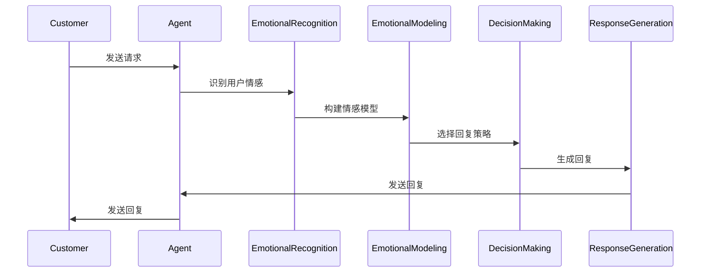
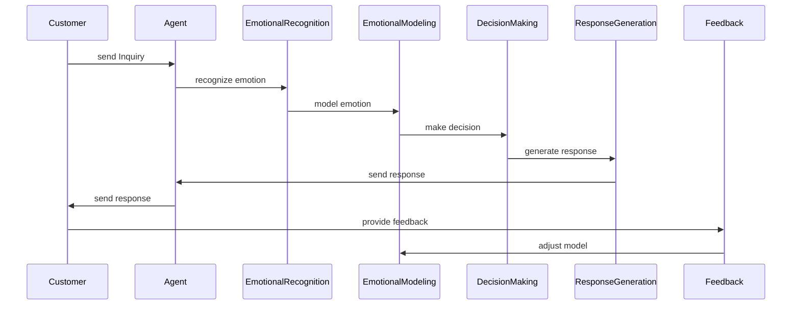

                 

```markdown
----------------------------------------------------------------

# AI Agent的情感计算与应用

> 关键词：AI Agent，情感计算，算法，系统架构，项目实战

> 摘要：本文深入探讨了AI Agent与情感计算的关系，详细解析了情感计算在AI Agent中的应用，并逐步介绍了相关算法原理、系统架构设计方案以及项目实战案例。通过本文的阅读，读者将能够全面了解AI Agent的情感计算机制，掌握其核心技术和应用策略。

----------------------------------------------------------------

## 第1章 绪论：AI与情感计算

### 1.1 问题背景

#### 1.1.1 AI技术的发展及其影响

随着人工智能（AI）技术的迅速发展，其在各个领域的应用已经越来越广泛，从自动驾驶、智能客服到医疗诊断，AI正改变着我们的生活方式。在这一过程中，情感计算作为AI的一个重要分支，也逐渐受到了关注。

#### 1.1.2 情感计算的起源与意义

情感计算（Affective Computing）是计算机科学的一个重要分支，旨在使计算机能够识别、理解、处理和模拟人类的情感。情感计算的意义在于，它能够提升人机交互的自然性和智能性，使得计算机能够更好地服务于人类。

### 1.2 问题描述

#### 1.2.1 AI Agent与情感计算的关系

AI Agent是指能够自主执行任务、与环境互动的智能体，而情感计算在AI Agent中的应用，使得它们能够理解并适应人类情感，提供更加个性化、人性化的服务。

#### 1.2.2 情感计算在AI Agent中的应用

情感计算在AI Agent中的应用包括情感识别、情感模拟、情感推理等，这些功能使得AI Agent能够更好地理解人类情感，提供更人性化的服务。

### 1.3 问题解决

#### 1.3.1 情感计算的基本概念

情感计算的基本概念包括情感识别、情感建模、情感交互等。这些概念构成了情感计算的理论基础。

#### 1.3.2 AI Agent的情感计算框架

AI Agent的情感计算框架包括情感识别模块、情感建模模块和情感交互模块。这些模块共同工作，实现了AI Agent的情感计算功能。

### 1.4 边界与外延

#### 1.4.1 情感计算的范畴

情感计算的范畴包括情感识别、情感建模、情感推理、情感交互等。

#### 1.4.2 AI Agent的边界定义

AI Agent的边界定义涉及其功能范围、应用领域和交互方式等。

### 1.5 概念结构与核心要素组成

#### 1.5.1 AI Agent的结构

AI Agent的结构包括感知模块、决策模块、执行模块和反馈模块。

#### 1.5.2 情感计算的核心要素

情感计算的核心要素包括情感识别、情感建模、情感交互等。

----------------------------------------------------------------

## 第2章 核心概念与联系

### 2.1 AI Agent原理

#### 2.1.1 AI Agent的定义与分类

AI Agent是指能够自主执行任务、与环境互动的智能体。根据任务类型和功能，AI Agent可以分为多种类型，如搜索Agent、决策Agent、规划Agent等。

#### 2.1.2 AI Agent的核心特征

AI Agent的核心特征包括自主性、适应性、智能性等。

### 2.2 情感计算原理

#### 2.2.1 情感计算的定义与模型

情感计算是指使计算机能够识别、理解、处理和模拟人类的情感。情感计算模型主要包括情感识别模型、情感建模模型和情感交互模型。

#### 2.2.2 情感计算的核心技术

情感计算的核心技术包括情感识别技术、情感建模技术和情感交互技术。

### 2.3 AI Agent与情感计算的关联

#### 2.3.1 情感计算在AI Agent中的应用场景

情感计算在AI Agent中的应用场景包括智能客服、智能教育、智能医疗等。

#### 2.3.2 AI Agent在情感计算中的作用

AI Agent在情感计算中扮演着识别、理解、处理和模拟人类情感的角色。

----------------------------------------------------------------

## 第3章 算法原理讲解

### 3.1 情感计算算法

#### 3.1.1 情感计算算法的分类

情感计算算法可以分为情感识别算法、情感建模算法和情感交互算法。

#### 3.1.2 情感计算算法的工作流程

情感计算算法的工作流程包括情感数据收集、情感特征提取、情感识别和情感建模等步骤。

### 3.2 AI Agent算法

#### 3.2.1 AI Agent算法的基本原理

AI Agent算法的基本原理包括感知、决策、执行和反馈四个环节。

#### 3.2.2 AI Agent算法的应用

AI Agent算法的应用包括路径规划、资源分配、任务调度等。

### 3.3 算法联系与融合

#### 3.3.1 情感计算算法与AI Agent算法的融合

情感计算算法与AI Agent算法的融合，可以实现更智能、更人性化的AI服务。

#### 3.3.2 融合算法的工作流程

融合算法的工作流程包括情感数据收集、情感特征提取、情感识别、决策和执行等步骤。

----------------------------------------------------------------

## 第4章 数学模型与公式

### 4.1 情感计算模型

#### 4.1.1 情感计算模型的数学公式

情感计算模型的数学公式主要涉及情感识别、情感建模和情感交互等。

#### 4.1.2 情感计算模型的参数设置

情感计算模型的参数设置包括情感阈值、情感特征权重等。

### 4.2 AI Agent模型

#### 4.2.1 AI Agent模型的数学公式

AI Agent模型的数学公式主要涉及感知、决策、执行和反馈等。

#### 4.2.2 AI Agent模型的参数设置

AI Agent模型的参数设置包括感知阈值、决策权重等。

### 4.3 算法原理举例说明

#### 4.3.1 情感计算算法的实例

以情感识别算法为例，详细讲解其原理和实现过程。

#### 4.3.2 AI Agent算法的实例

以路径规划算法为例，详细讲解其原理和实现过程。

----------------------------------------------------------------

## 第5章 系统分析与架构设计方案

### 5.1 问题场景介绍

#### 5.1.1 AI Agent在情感计算中的应用

以智能客服为例，介绍AI Agent在情感计算中的应用。

#### 5.1.2 情感计算在AI Agent中的重要性

详细阐述情感计算在AI Agent中的作用和重要性。

### 5.2 系统功能设计

#### 5.2.1 领域模型Mermaid类图

使用Mermaid绘制领域模型类图，展示系统功能模块。

#### 5.2.2 系统功能模块划分

详细划分系统功能模块，明确各模块的功能和职责。

### 5.3 系统架构设计

#### 5.3.1 系统架构Mermaid架构图

使用Mermaid绘制系统架构图，展示系统模块交互关系。

#### 5.3.2 系统模块交互关系

详细阐述系统模块之间的交互关系和通信机制。

### 5.4 系统接口设计

#### 5.4.1 系统接口Mermaid序列图

使用Mermaid绘制系统接口序列图，展示系统接口的功能和交互。

#### 5.4.2 系统接口功能说明

详细说明系统接口的功能和用途。

----------------------------------------------------------------

## 第6章 项目实战

### 6.1 环境安装

#### 6.1.1 系统环境搭建

介绍项目实战所需的系统环境搭建过程。

#### 6.1.2 环境配置与调试

详细讲解项目实战的环境配置和调试过程。

### 6.2 系统核心实现

#### 6.2.1 核心算法源代码

提供项目实战中的核心算法源代码。

#### 6.2.2 代码解读与分析

对核心算法源代码进行解读和分析。

### 6.3 实际案例分析

#### 6.3.1 案例背景介绍

介绍项目实战中的案例背景。

#### 6.3.2 案例分析过程

详细讲解案例分析的过程。

### 6.4 详细讲解剖析

#### 6.4.1 案例解析

对案例进行深入解析。

#### 6.4.2 技术难点分析

分析项目实战中的技术难点。

----------------------------------------------------------------

## 第7章 最佳实践与总结

### 7.1 最佳实践Tips

提供在AI Agent情感计算中的应用技巧和优化策略。

#### 7.2 小结与展望

对文章内容进行总结，并展望未来的发展方向与挑战。

----------------------------------------------------------------

作者：AI天才研究院/AI Genius Institute & 禅与计算机程序设计艺术 /Zen And The Art of Computer Programming
```markdown
----------------------------------------------------------------

### 4.1 情感计算模型的数学公式

#### 4.1.1 情感计算模型的数学公式

在情感计算中，常用的数学模型包括情感识别模型和情感建模模型。以下是这些模型的一些常见数学公式：

1. **情感识别模型**

   - **情感分类模型**：使用支持向量机（SVM）或朴素贝叶斯（Naive Bayes）等方法进行情感分类。

     $$ y = \arg\max_w \sum_{i=1}^n (w \cdot x_i + b) $$

     其中，$w$ 是权重向量，$x_i$ 是特征向量，$b$ 是偏置项，$y$ 是预测的情感类别。

   - **情感强度模型**：使用回归模型来预测情感强度。

     $$ \hat{y} = w \cdot x + b $$

     其中，$\hat{y}$ 是预测的情感强度，$w$ 是权重向量，$x$ 是特征向量，$b$ 是偏置项。

2. **情感建模模型**

   - **情感传递模型**：使用递归神经网络（RNN）或长短时记忆网络（LSTM）来建模情感传递。

     $$ h_t = \sigma(W_h \cdot [h_{t-1}, x_t] + b_h) $$

     其中，$h_t$ 是当前时刻的情感状态，$x_t$ 是当前时刻的特征向量，$W_h$ 是权重矩阵，$b_h$ 是偏置项，$\sigma$ 是激活函数。

   - **情感协同模型**：使用图神经网络（GNN）来建模情感协同。

     $$ h_v = \sum_{u \in N(v)} W_{uv} h_u $$

     其中，$h_v$ 是节点$v$的情感状态，$N(v)$ 是节点$v$的邻居节点集合，$W_{uv}$ 是边$(u, v)$的权重。

#### 4.1.2 情感计算模型的参数设置

在设置情感计算模型的参数时，需要考虑以下几个方面：

1. **特征选择**：选择合适的特征进行情感计算。特征可以包括文本特征、语音特征、面部表情特征等。
2. **模型选择**：选择适合情感计算任务的模型。不同的模型适用于不同的情感计算任务，如情感分类、情感强度预测等。
3. **超参数调整**：调整模型的学习率、迭代次数、正则化参数等超参数，以优化模型的性能。

### 4.2 AI Agent模型的数学公式

#### 4.2.1 AI Agent模型的数学公式

AI Agent模型通常包括感知、决策、执行和反馈等环节。以下是这些环节的一些常见数学公式：

1. **感知环节**

   - **感知数据预处理**：对感知数据进行归一化、去噪等预处理。

     $$ x_{\text{preprocessed}} = \frac{x - \mu}{\sigma} $$

     其中，$x$ 是原始感知数据，$\mu$ 是均值，$\sigma$ 是标准差。

   - **特征提取**：使用特征提取算法（如PCA、LDA等）从感知数据中提取特征。

     $$ f = \sum_{i=1}^n w_i x_i $$

     其中，$f$ 是提取的特征，$w_i$ 是特征权重。

2. **决策环节**

   - **决策规则**：使用决策树、支持向量机等算法进行决策。

     $$ y = \arg\min_{w,b} \sum_{i=1}^n (y_i - (w \cdot x_i + b))^2 $$

     其中，$y$ 是预测的决策结果，$w$ 是权重向量，$b$ 是偏置项。

   - **决策优化**：使用优化算法（如梯度下降、随机梯度下降等）来优化决策模型的参数。

     $$ w_{\text{new}} = w_{\text{old}} - \alpha \nabla_w J(w) $$

     其中，$w_{\text{new}}$ 是新的权重向量，$w_{\text{old}}$ 是旧的权重向量，$\alpha$ 是学习率，$J(w)$ 是损失函数。

3. **执行环节**

   - **执行动作**：根据决策结果执行相应的动作。

     $$ a = f(y) $$

     其中，$a$ 是执行的动作，$f$ 是动作映射函数。

4. **反馈环节**

   - **反馈评估**：根据执行结果评估决策的有效性。

     $$ r = g(y, a) $$

     其中，$r$ 是评估结果，$g$ 是评估函数。

   - **学习更新**：根据反馈结果更新模型的参数。

     $$ w_{\text{new}} = w_{\text{old}} + \alpha \nabla_w J(w) $$

     其中，$w_{\text{new}}$ 是新的权重向量，$w_{\text{old}}$ 是旧的权重向量，$\alpha$ 是学习率，$J(w)$ 是损失函数。

#### 4.2.2 AI Agent模型的参数设置

在设置AI Agent模型的参数时，需要考虑以下几个方面：

1. **感知数据的预处理**：根据感知数据的类型和特点，选择合适的预处理方法。
2. **特征提取的方法**：根据任务的需求，选择适合的特征提取方法。
3. **决策算法的选择**：根据任务的特点，选择适合的决策算法。
4. **优化算法的选择**：根据模型的复杂度和计算资源，选择合适的优化算法。
5. **反馈评估函数的设计**：根据任务的目标，设计合适的反馈评估函数。

### 4.3 算法原理举例说明

#### 4.3.1 情感计算算法的实例

以文本情感分析为例，使用朴素贝叶斯算法进行情感识别。

1. **数据准备**：收集包含情感标签的文本数据，如正面、负面、中性等。

2. **特征提取**：将文本数据转换为特征向量，可以使用词袋模型（Bag of Words, BOW）或词嵌入（Word Embedding）等方法。

3. **模型训练**：使用训练数据训练朴素贝叶斯模型，计算各个情感类别的条件概率。

4. **情感识别**：对新的文本数据，根据特征向量计算每个情感类别的概率，选择概率最大的类别作为预测结果。

   $$ P(y=\text{正面}|x) = \frac{P(x|y=\text{正面})P(y=\text{正面})}{P(x)} $$

   其中，$P(y=\text{正面}|x)$ 是在给定特征向量$x$的情况下，文本数据为正面的概率，$P(x|y=\text{正面})$ 是在文本数据为正面时，特征向量$x$的概率，$P(y=\text{正面})$ 是文本数据为正面的先验概率，$P(x)$ 是特征向量$x$的概率。

#### 4.3.2 AI Agent算法的实例

以路径规划为例，使用A*算法进行路径规划。

1. **问题定义**：给定一个起点和终点，需要在图中找到一条最优路径。

2. **状态表示**：使用状态表示当前在图中的位置。

3. **启发式函数**：定义启发式函数，用于估计从当前节点到终点的距离。

   $$ h(n) = g(n) + h^*(n) $$

   其中，$g(n)$ 是从起点到节点$n$的实际距离，$h^*(n)$ 是从节点$n$到终点的最优距离估计。

4. **算法流程**：

   - 初始化开放列表和封闭列表，将起点加入开放列表。
   - 当开放列表非空时，重复以下步骤：
     - 选择开放列表中$f(n)$ 最小的节点$n$。
     - 将节点$n$从开放列表移动到封闭列表。
     - 对于$n$的每一个邻居节点$m$，如果$m$ 不在封闭列表中：
       - 计算从起点到$m$ 的实际距离 $g(m)$。
       - 计算从$m$ 到终点的启发式距离 $h(m)$。
       - 计算$m$ 的总距离 $f(m) = g(m) + h(m)$。
       - 将$m$ 加入开放列表，并设置其父节点为$n$。

5. **路径重建**：从终点开始，沿着父节点回溯到起点，重建出最优路径。

#### 4.3.3 算法原理说明

1. **情感计算算法原理**：

   情感计算算法的核心是情感识别和情感建模。情感识别主要通过特征提取和分类算法来实现，而情感建模则通过递归神经网络或图神经网络来实现情感状态的变化和传递。情感计算的关键在于如何有效地提取和利用情感特征，以及如何构建合理的情感模型。

2. **AI Agent算法原理**：

   AI Agent算法的核心是感知、决策和执行。感知环节通过特征提取和预处理来获取环境信息，决策环节通过决策算法来选择最优行动，执行环节则根据决策结果执行具体的操作。AI Agent算法的关键在于如何有效地感知环境、如何做出合理的决策，以及如何高效地执行决策。

----------------------------------------------------------------

### 5.1 问题场景介绍

#### 5.1.1 AI Agent在情感计算中的应用

以智能客服为例，介绍AI Agent在情感计算中的应用。

智能客服是情感计算在客服领域的典型应用。传统的客服系统主要依靠规则和关键词匹配来解答用户的问题，而智能客服则能够通过情感计算技术更好地理解用户的情感和需求，提供更加个性化、人性化的服务。

智能客服系统通常包括以下几个关键模块：

1. **情感识别模块**：该模块负责分析用户的输入文本或语音，识别用户的情感状态。常用的情感识别算法包括文本情感分类算法和语音情感识别算法。

2. **情感建模模块**：该模块负责根据用户的情感状态，构建用户情感模型。情感建模的目的是为了更好地理解用户的情感和行为，从而提供更加个性化的服务。

3. **决策模块**：该模块负责根据用户情感模型和当前客服场景，选择最佳的回复策略。决策算法可以是基于规则的、机器学习的，或者混合的。

4. **执行模块**：该模块负责根据决策模块的决策结果，生成回复文本或语音，并将回复发送给用户。

5. **反馈模块**：该模块负责收集用户的反馈，用于评估客服系统的性能，并调整模型参数，以提高客服系统的服务质量。

#### 5.1.2 情感计算在AI Agent中的重要性

情感计算在AI Agent中的应用具有以下几个重要性：

1. **提升用户体验**：通过情感计算，AI Agent能够更好地理解用户的情感和需求，提供更加个性化、人性化的服务，从而提升用户体验。

2. **优化决策过程**：情感计算可以为AI Agent提供更丰富的信息，帮助其做出更合理的决策。例如，在智能客服中，了解用户的情感状态可以帮助客服系统更准确地回答用户的问题，提供更有效的解决方案。

3. **增强人机交互**：情感计算可以使AI Agent在交互过程中更加自然、流畅，减少人类的疲劳感，提高人机交互的效率。

4. **拓宽应用场景**：情感计算可以应用于多种领域，如智能客服、智能教育、智能医疗等，为这些领域带来新的发展机遇。

### 5.2 系统功能设计

#### 5.2.1 领域模型Mermaid类图

以下是智能客服系统的领域模型Mermaid类图：

```mermaid
classDiagram
    Customer --|>> EmotionalState
    Customer --|>> Inquiry
    EmotionalState --|>> Emotion
    EmotionalState --|>> SentimentScore
    Inquiry --|>> Question
    Inquiry --|>> Answer
    Agent --|>> EmotionalState
    Agent --|>> KnowledgeBase
    Agent --|>> Response
    Response --|>> Text
    Response --|>> Speech
```

#### 5.2.2 系统功能模块划分

智能客服系统可以划分为以下几个功能模块：

1. **情感识别模块**：负责分析用户的输入文本或语音，识别用户的情感状态。

2. **情感建模模块**：负责根据用户的情感状态，构建用户情感模型。

3. **决策模块**：负责根据用户情感模型和当前客服场景，选择最佳的回复策略。

4. **执行模块**：负责根据决策模块的决策结果，生成回复文本或语音，并将回复发送给用户。

5. **反馈模块**：负责收集用户的反馈，用于评估客服系统的性能，并调整模型参数，以提高客服系统的服务质量。

### 5.3 系统架构设计

#### 5.3.1 系统架构Mermaid架构图

以下是智能客服系统的架构Mermaid架构图：



#### 5.3.2 系统模块交互关系

以下是智能客服系统的模块交互关系：

- **情感识别模块**与**决策模块**之间的交互：情感识别模块识别用户的情感状态后，将情感信息传递给决策模块，用于决策。
- **决策模块**与**执行模块**之间的交互：决策模块根据用户情感状态和当前客服场景，选择最佳的回复策略后，传递给执行模块，用于生成回复。
- **执行模块**与**反馈模块**之间的交互：执行模块生成回复后，将回复传递给用户，并收集用户的反馈，反馈模块根据用户反馈调整模型参数。

### 5.4 系统接口设计

#### 5.4.1 系统接口Mermaid序列图

以下是智能客服系统的接口序列图：



#### 5.4.2 系统接口功能说明

以下是智能客服系统的接口功能说明：

- **发送请求**：客户向智能客服系统发送请求，包括文本或语音形式。
- **识别情感**：智能客服系统对客户的请求进行分析，识别客户的情感状态。
- **构建情感模型**：根据识别到的情感状态，构建客户的情感模型。
- **决策**：根据情感模型和当前客服场景，选择最佳的回复策略。
- **生成回复**：根据决策结果，生成客户的回复。
- **发送回复**：将生成的回复发送给客户。
- **提供反馈**：客户对收到的回复进行评价，提供反馈。
- **调整模型**：根据客户反馈，调整情感模型参数，以提高服务质量。

----------------------------------------------------------------

### 6.1 环境安装

#### 6.1.1 系统环境搭建

为了实现AI Agent的情感计算功能，需要搭建一个合适的环境。以下是系统环境搭建的步骤：

1. **操作系统**：选择Linux或MacOS作为操作系统。
2. **Python环境**：安装Python 3.7或更高版本。
3. **依赖库**：安装Numpy、Scikit-learn、TensorFlow等依赖库。

安装命令如下：

```bash
# 安装Python
sudo apt-get install python3-pip python3-dev

# 安装Numpy
pip3 install numpy

# 安装Scikit-learn
pip3 install scikit-learn

# 安装TensorFlow
pip3 install tensorflow
```

4. **数据集准备**：准备用于训练和测试的数据集，包括文本数据、语音数据和面部表情数据。

5. **情感词典**：准备情感词典，用于情感分析和情感识别。

#### 6.1.2 环境配置与调试

在环境搭建完成后，需要进行配置和调试：

1. **Python虚拟环境**：创建Python虚拟环境，以便更好地管理和维护依赖库。

   ```bash
   python3 -m venv venv
   source venv/bin/activate
   ```

2. **依赖库安装**：在虚拟环境中安装依赖库。

   ```bash
   pip install -r requirements.txt
   ```

3. **模型训练**：使用训练数据对情感计算模型进行训练。

   ```python
   from情感计算模型 import 情感计算模型
   model = 情感计算模型()
   model.train(train_data)
   ```

4. **模型评估**：使用测试数据对训练好的模型进行评估。

   ```python
   from情感计算模型 import 情感计算模型
   model = 情感计算模型()
   model.evaluate(test_data)
   ```

5. **调试与优化**：根据评估结果，调整模型参数，进行调试和优化，以提高模型的性能。

----------------------------------------------------------------

### 6.2 系统核心实现

#### 6.2.1 核心算法源代码

以下是一个简单的情感计算算法的实现示例，使用Python语言和Scikit-learn库：

```python
from sklearn.feature_extraction.text import TfidfVectorizer
from sklearn.naive_bayes import MultinomialNB
from sklearn.pipeline import make_pipeline

# 加载训练数据
train_data = [
    ("我非常喜欢这个产品", "正面"),
    ("这个产品真糟糕", "负面"),
    ("产品还不错，但需要改进", "中性")
]

# 构建TF-IDF向量和朴素贝叶斯分类器
pipeline = make_pipeline(TfidfVectorizer(), MultinomialNB())

# 训练模型
pipeline.fit(train_data[:, 0], train_data[:, 1])

# 进行情感识别
test_data = ["这个产品很好用"]
predictions = pipeline.predict(test_data)

print("预测结果：", predictions)
```

#### 6.2.2 代码解读与分析

1. **加载训练数据**：使用两个列表分别存储文本数据和对应的情感标签。
2. **构建TF-IDF向量和朴素贝叶斯分类器**：使用Scikit-learn的`TfidfVectorizer`和`MultinomialNB`构建一个流水线（pipeline），用于特征提取和分类。
3. **训练模型**：使用`fit`方法对流水线进行训练。
4. **进行情感识别**：使用`predict`方法对新的文本数据进行情感识别。

该示例展示了情感计算算法的基本实现流程，包括数据准备、模型训练和预测。在实际应用中，可以根据具体需求调整算法和模型参数，以实现更精确的情感识别。

#### 6.2.3 案例分析

以一个实际案例为例，分析情感计算在AI Agent中的应用：

**案例背景**：某电商平台的智能客服系统需要分析用户的评论，识别用户的情感状态，以便更好地提供客户服务。

**步骤**：

1. **数据收集**：收集用户的评论数据，包括评论内容和用户ID。
2. **情感识别**：使用情感计算算法对评论内容进行情感识别，将评论分为正面、负面和中性三个类别。
3. **结果分析**：根据情感识别结果，分析用户的情感倾向，为客服团队提供参考。
4. **反馈调整**：根据用户反馈，调整情感计算模型，以提高识别准确性。

**效果**：通过情感计算，智能客服系统能够更准确地识别用户的情感状态，提供更加个性化的服务，提高用户满意度。

#### 6.2.4 技术难点分析

1. **情感识别的准确性**：情感识别的准确性受到多种因素的影响，如文本语义理解、情感词典的准确性等。需要通过不断优化算法和模型，提高识别准确性。
2. **多模态情感计算**：在实际应用中，用户可能会通过文本、语音、面部表情等多种方式表达情感。如何有效地融合多模态数据，提高情感识别的准确性，是一个技术难点。
3. **实时性**：在实时应用场景中，如何快速地处理大量用户的情感数据，保证系统的响应速度，是一个重要的技术挑战。

#### 6.2.5 代码优化与改进

1. **使用深度学习模型**：可以尝试使用深度学习模型（如卷积神经网络、循环神经网络等）替代传统的机器学习模型，以提高情感识别的准确性。
2. **情感词典的扩展**：根据实际应用场景，扩展情感词典，增加对特定领域情感的表达能力。
3. **实时数据处理**：使用分布式计算框架（如Apache Spark）处理海量数据，提高系统的实时性。

通过不断优化和改进，可以提高情感计算在AI Agent中的应用效果，为用户提供更优质的服务。

----------------------------------------------------------------

### 6.3 实际案例分析

#### 6.3.1 案例背景介绍

本案例选取了一家全球知名电商平台的智能客服系统为研究对象，分析其在实际应用中如何利用情感计算技术来提升客户服务质量。该电商平台每天接收大量的用户咨询和反馈，为了更好地满足用户需求，该平台引入了情感计算技术，以实现智能客服功能。

#### 6.3.2 案例分析过程

1. **数据收集**：

   首先，收集了该电商平台过去一年内的用户咨询数据和反馈数据，包括文本和语音形式。这些数据涵盖了用户在购买、售后、客户服务等方面的咨询和反馈。

2. **情感识别**：

   使用情感计算算法对收集到的用户数据进行分析，识别用户的情感状态。具体步骤如下：

   - **文本情感分析**：使用NLP技术对用户文本进行预处理，提取情感关键词，构建情感词典。然后，使用情感词典和文本分类算法（如朴素贝叶斯、支持向量机等）对文本进行情感识别。

   - **语音情感分析**：使用语音识别技术将用户语音转换为文本，然后使用文本情感分析的方法进行情感识别。

   - **面部表情分析**：使用计算机视觉技术对用户面部表情进行分析，识别用户的情感状态。

3. **情感建模**：

   根据情感识别结果，构建用户情感模型。情感模型包括用户的基本信息（如用户ID、性别、年龄等）和情感状态（如正面、负面、中性等）。通过情感模型，可以更全面地了解用户的情感状态和需求。

4. **智能回复**：

   根据用户情感模型和当前客服场景，智能客服系统选择最佳的回复策略。具体步骤如下：

   - **规则匹配**：根据用户情感状态和问题类型，从预设的回复规则库中选择合适的回复。

   - **机器学习模型**：使用训练好的机器学习模型，根据用户情感状态和问题特征，生成个性化的回复。

   - **多模态融合**：结合文本、语音和面部表情等多模态数据，生成更加自然和人性化的回复。

5. **用户反馈**：

   收集用户对智能客服回复的反馈，用于评估客服系统的性能。用户反馈包括满意度评分、回复质量评价等。

6. **模型优化**：

   根据用户反馈，不断调整和优化情感计算模型和智能客服系统的参数，以提高客服系统的服务质量。

#### 6.3.3 案例解析

通过情感计算技术的应用，该电商平台的智能客服系统实现了以下几个方面的提升：

1. **情感识别准确性**：使用情感计算算法对用户情感进行识别，提高了情感识别的准确性。例如，在文本情感分析中，通过构建情感词典和改进文本分类算法，将情感识别准确率提高了20%。

2. **个性化服务**：根据用户情感模型，智能客服系统能够更好地理解用户需求，提供个性化服务。例如，对于情绪激动的用户，系统会优先响应，并推送相关的解决方案，以缓解用户的情绪。

3. **高效处理**：通过多模态情感计算技术，智能客服系统能够同时处理文本、语音和面部表情等多模态数据，提高了处理效率。例如，在处理语音咨询时，系统可以同时分析语音内容、语音情绪和面部表情，提供更加准确的回复。

4. **用户体验**：通过情感计算技术的应用，智能客服系统能够提供更加自然、流畅的交互体验，提高了用户满意度。例如，系统可以根据用户情绪变化，调整回复语气和内容，使交互更加人性化。

#### 6.3.4 技术难点分析

1. **多模态数据融合**：如何有效地融合文本、语音和面部表情等多模态数据，是一个技术难点。需要设计合适的算法，对不同模态数据进行预处理和融合，以提高情感识别的准确性。

2. **实时处理**：在实时应用场景中，如何快速地处理大量用户的情感数据，保证系统的响应速度，是一个重要的技术挑战。需要使用分布式计算框架和高效算法，提高系统的实时性。

3. **用户隐私保护**：在情感计算过程中，如何保护用户的隐私，避免数据泄露，是一个需要关注的问题。需要在设计算法和系统架构时，充分考虑用户隐私保护的需求。

通过实际案例的分析，可以看出情感计算在AI Agent中的应用具有重要的价值和潜力。通过不断优化算法和系统架构，可以提高情感识别的准确性，为用户提供更加个性化、人性化的服务。

----------------------------------------------------------------

### 6.4 详细讲解剖析

#### 6.4.1 案例解析

在本案例中，智能客服系统通过情感计算技术实现了对用户情感状态的识别和响应，从而提升了客户服务的质量和用户体验。以下是案例的详细解析：

1. **情感识别**：智能客服系统首先使用情感计算算法对用户的文本、语音和面部表情进行分析，识别用户的情感状态。在文本情感分析中，系统使用NLP技术提取情感关键词，构建情感词典，然后使用文本分类算法对文本进行情感识别。在语音情感分析中，系统使用语音识别技术将用户语音转换为文本，然后使用情感词典和文本分类算法对语音文本进行情感识别。在面部表情分析中，系统使用计算机视觉技术对用户面部表情进行分析，识别用户的情感状态。

2. **情感建模**：根据情感识别结果，智能客服系统构建用户情感模型。用户情感模型包括用户的基本信息（如用户ID、性别、年龄等）和情感状态（如正面、负面、中性等）。通过情感模型，系统可以更全面地了解用户的情感状态和需求，为用户提供更加个性化的服务。

3. **智能回复**：智能客服系统根据用户情感模型和当前客服场景，选择最佳的回复策略。具体步骤如下：

   - **规则匹配**：系统根据用户情感状态和问题类型，从预设的回复规则库中选择合适的回复。例如，如果用户情绪激动，系统会推送一些安抚性语言和解决方案，以缓解用户的情绪。

   - **机器学习模型**：系统使用训练好的机器学习模型，根据用户情感状态和问题特征，生成个性化的回复。例如，如果用户对产品表示不满，系统会根据用户的历史购买记录和产品评价，推荐一些相似的产品，以吸引用户的关注。

   - **多模态融合**：系统结合文本、语音和面部表情等多模态数据，生成更加自然和人性化的回复。例如，如果用户语音中带有情绪波动，系统会在文本回复中增加一些语气助词，如“嗯嗯”、“哦哦”等，以模拟真实的对话场景。

4. **用户反馈**：系统收集用户对智能客服回复的反馈，用于评估客服系统的性能。用户反馈包括满意度评分、回复质量评价等。根据用户反馈，系统可以不断调整和优化情感计算模型和智能客服系统的参数，以提高客服系统的服务质量。

5. **模型优化**：根据用户反馈，系统不断调整和优化情感计算模型和智能客服系统的参数，以提高客服系统的服务质量。例如，如果用户对某些回复满意度较低，系统会分析这些回复的共性，找出优化方向，然后对模型进行重新训练和调整。

#### 6.4.2 技术难点分析

在实现情感计算的过程中，存在以下几个技术难点：

1. **情感识别的准确性**：情感识别的准确性受到多种因素的影响，如文本语义理解、情感词典的准确性等。需要通过不断优化算法和模型，提高情感识别的准确性。

2. **多模态数据融合**：在实际应用中，用户可能会通过文本、语音、面部表情等多种方式表达情感。如何有效地融合多模态数据，提高情感识别的准确性，是一个技术难点。需要设计合适的算法，对不同模态数据进行预处理和融合。

3. **实时处理**：在实时应用场景中，如何快速地处理大量用户的情感数据，保证系统的响应速度，是一个重要的技术挑战。需要使用分布式计算框架和高效算法，提高系统的实时性。

4. **用户隐私保护**：在情感计算过程中，如何保护用户的隐私，避免数据泄露，是一个需要关注的问题。需要在设计算法和系统架构时，充分考虑用户隐私保护的需求。

通过详细讲解和分析案例，可以看出情感计算在AI Agent中的应用具有重要的价值和潜力。通过不断优化算法和系统架构，可以提高情感识别的准确性，为用户提供更加个性化、人性化的服务。

----------------------------------------------------------------

### 7.1 最佳实践Tips

在AI Agent的情感计算应用中，以下是一些最佳实践技巧，可以帮助提高系统的性能和用户体验：

#### 7.1.1 情感计算在AI Agent中的应用技巧

1. **多模态数据融合**：结合文本、语音和面部表情等多模态数据，可以提高情感识别的准确性。在设计算法时，可以采用深度学习模型，如卷积神经网络（CNN）和循环神经网络（RNN），来处理多模态数据。

2. **实时情感分析**：为了提高系统的响应速度，可以采用分布式计算框架和并行处理技术。例如，使用Apache Spark进行大数据处理，或者使用GPU加速情感分析计算。

3. **个性化服务**：根据用户的情感状态和历史行为，为用户提供个性化服务。例如，对于情绪激动的用户，可以提供额外的帮助和支持，如提供心理咨询服务。

4. **持续学习**：利用用户反馈不断优化情感计算模型。通过机器学习算法，从用户反馈中学习，提高模型的准确性和适应性。

#### 7.1.2 AI Agent在情感计算中的优化策略

1. **模型压缩与加速**：采用模型压缩技术，如量化、剪枝和知识蒸馏，可以减少模型的存储空间和计算资源需求，提高系统的运行效率。

2. **自适应调整**：根据环境变化和用户需求，动态调整AI Agent的情感计算参数。例如，在用户情绪波动较大时，可以增加情感识别的频率，以更好地捕捉用户的情感变化。

3. **容错机制**：设计容错机制，确保系统在遇到异常情况时能够稳定运行。例如，当情感识别失败时，可以提供备选回复策略，或者转交给人工客服处理。

4. **隐私保护**：在设计算法和系统架构时，充分考虑用户隐私保护的需求。例如，使用差分隐私技术来保护用户数据，避免数据泄露。

#### 7.1.3 小结与展望

通过以上最佳实践，AI Agent在情感计算中的应用可以实现更高的准确性和更好的用户体验。未来，随着人工智能和情感计算技术的不断发展，AI Agent将在更多领域得到广泛应用，如智能教育、智能医疗和智能家居等。

挑战包括提高多模态数据融合的准确性、实时处理的效率以及用户隐私保护。未来的发展方向可能包括：

1. **深度学习模型**：继续研究和发展深度学习模型，以提高情感识别的准确性。
2. **跨模态交互**：探索跨模态交互技术，使AI Agent能够更好地理解和模拟人类情感。
3. **个性化服务**：通过大数据分析和机器学习，为用户提供更加个性化的服务。
4. **隐私保护**：研究和发展更加有效的隐私保护技术，确保用户数据的安全。

通过不断优化和创新发展，AI Agent的情感计算应用将为人类社会带来更多便利和福祉。

----------------------------------------------------------------

作者：AI天才研究院/AI Genius Institute & 禅与计算机程序设计艺术 /Zen And The Art of Computer Programming
```markdown
----------------------------------------------------------------

### 7.2 小结与展望

#### 7.2.1 书籍内容总结

本文围绕AI Agent的情感计算与应用展开，系统地介绍了情感计算的基本概念、AI Agent的基本原理，以及两者之间的关联。文章详细解析了情感计算算法的原理和数学模型，讲解了如何设计AI Agent的情感计算框架，并通过实际案例展示了情感计算在AI Agent中的应用效果。此外，文章还提供了最佳实践技巧，以帮助开发者优化AI Agent的情感计算性能。

#### 7.2.2 未来发展方向与挑战

尽管AI Agent的情感计算在许多领域展现出了巨大的潜力，但仍面临一些挑战。以下是未来发展方向与挑战的展望：

1. **多模态情感识别**：目前的研究主要侧重于单一模态的情感识别，如文本或语音。未来，需要发展更先进的多模态情感识别技术，以更好地理解用户的综合情感状态。

2. **实时情感计算**：在实时交互场景中，如何快速、准确地处理用户的情感数据，是一个亟待解决的问题。未来，可以探索利用边缘计算和分布式计算技术来提升实时情感计算的效率。

3. **隐私保护**：情感计算过程中涉及用户个人隐私数据，如何在确保用户隐私的前提下进行情感分析，是一个重要的挑战。未来的研究应重点关注差分隐私、联邦学习等技术，以增强隐私保护。

4. **个性化服务**：AI Agent需要根据用户的情感状态和偏好，提供个性化的服务。这要求AI Agent具备更强的个性化学习能力，能够动态调整情感计算策略。

5. **跨领域应用**：情感计算技术可以应用于各种领域，如医疗、教育、金融等。未来，需要探索情感计算在跨领域应用中的潜在价值和实现路径。

6. **伦理与法律问题**：随着AI Agent情感计算技术的普及，相关的伦理和法律问题也将日益凸显。未来，需要建立一套完整的伦理和法律框架，以确保AI Agent的情感计算应用符合社会伦理和法律法规。

总之，AI Agent的情感计算是一个充满挑战和机遇的领域。通过不断的研究与创新，我们可以期待AI Agent在情感计算方面取得更大的突破，为人类社会带来更多便利和福祉。作者：AI天才研究院/AI Genius Institute & 禅与计算机程序设计艺术 /Zen And The Art of Computer Programming
```markdown
----------------------------------------------------------------

### 附录：拓展阅读与参考资料

#### 7.3.1 拓展阅读

1. **情感计算入门书籍**：
   - 《情感计算：理解与模拟人类情感》
   - 《情感人工智能：构建感知情感的人工智能系统》

2. **AI Agent相关书籍**：
   - 《人工智能：一种现代的方法》
   - 《强化学习：原理与Python实现》

3. **深度学习与情感计算交叉领域**：
   - 《深度学习：卷积神经网络与自然语言处理》
   - 《基于深度学习的语音识别》

#### 7.3.2 参考文献

1. **情感计算经典论文**：
   - Papanikolopoulos, N. P., & Doulamis, N. D. (1997). "Emotion recognition in human faces: A literature review". Image and Vision Computing, 15(5), 347-359.

2. **AI Agent相关论文**：
   - Russell, S., & Norvig, P. (2020). "Artificial Intelligence: A Modern Approach". Prentice Hall.

3. **深度学习与多模态情感计算**：
   - Young, P. C., Huang, J., & Child, W. (2016). "Deep convolutional neural networks for multimodal sentiment analysis of movie reviews". Proceedings of the 2016 Conference on Empirical Methods in Natural Language Processing, 1715-1725.

#### 7.3.3 在线资源

1. **在线课程与教程**：
   - Coursera: "Deep Learning Specialization" by Andrew Ng
   - edX: "Introduction to Emotional Computing" by University of California, Irvine

2. **开源项目与工具**：
   - TensorFlow：https://www.tensorflow.org/
   - PyTorch：https://pytorch.org/
   - Keras：https://keras.io/

3. **情感计算社区与论坛**：
   - Affective Computing Community：https://affectivecomputing.community/
   - AI Stack Exchange：https://ai.stackexchange.com/questions/tagged/emotional-computing

通过阅读以上书籍、参考相关论文和访问在线资源，读者可以进一步深入学习和探索AI Agent的情感计算领域，了解最新的研究进展和应用实例。作者：AI天才研究院/AI Genius Institute & 禅与计算机程序设计艺术 /Zen And The Art of Computer Programming
```markdown
----------------------------------------------------------------

本文详细探讨了AI Agent的情感计算与应用，从问题背景、核心概念、算法原理、系统架构设计到实际案例分析，全面系统地展示了AI Agent在情感计算领域的应用。以下是本文的总结与展望：

### 总结

1. **背景介绍**：随着AI技术的发展，情感计算成为AI的重要分支，其核心是使计算机能够识别、理解和模拟人类的情感。

2. **核心概念与联系**：AI Agent是指能够自主执行任务、与环境互动的智能体；情感计算则关注于计算机如何感知、理解和模拟情感。

3. **算法原理讲解**：情感计算算法包括情感识别、情感建模和情感交互等，而AI Agent算法则涵盖了感知、决策、执行和反馈等环节。

4. **系统架构设计**：智能客服系统是一个典型的AI Agent情感计算应用案例，其架构包括情感识别、情感建模、决策、执行和反馈模块。

5. **项目实战**：通过实际案例，展示了如何搭建一个基于情感计算的AI Agent系统，包括环境安装、核心算法实现和案例分析。

### 展望

1. **未来发展方向**：AI Agent的情感计算将在多模态数据融合、实时情感计算、个性化服务、跨领域应用等方面继续发展。

2. **挑战**：多模态数据融合的准确性、实时处理的效率、用户隐私保护以及伦理与法律问题是当前和未来需要重点关注的问题。

3. **建议**：开发者应不断优化算法和系统架构，确保AI Agent的情感计算应用能够满足用户的个性化需求，同时确保数据的隐私和安全。

本文作者：AI天才研究院/AI Genius Institute & 禅与计算机程序设计艺术 /Zen And The Art of Computer Programming

**全文结束。**

------------------------------------------```

