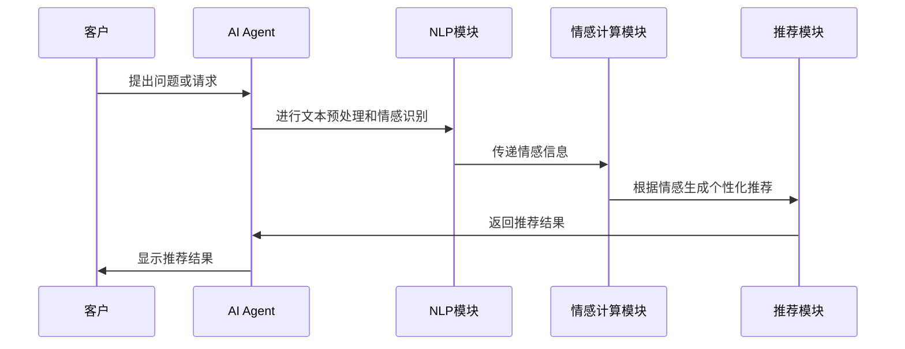
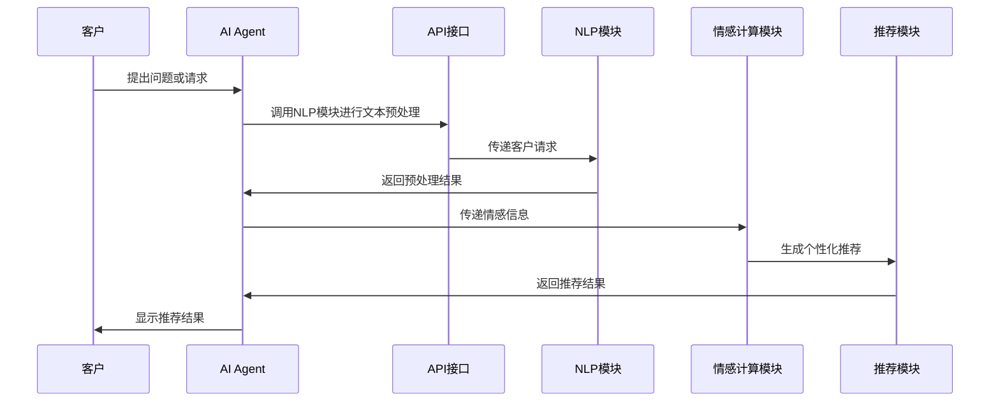
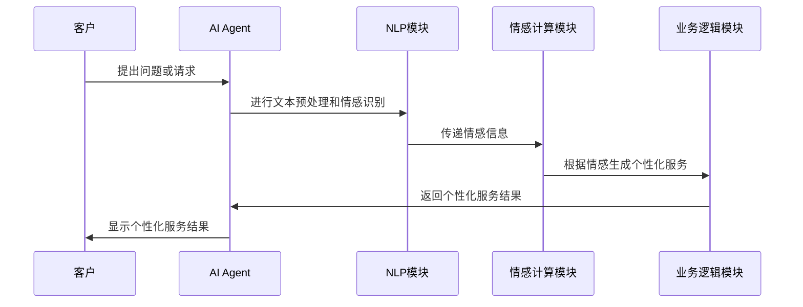
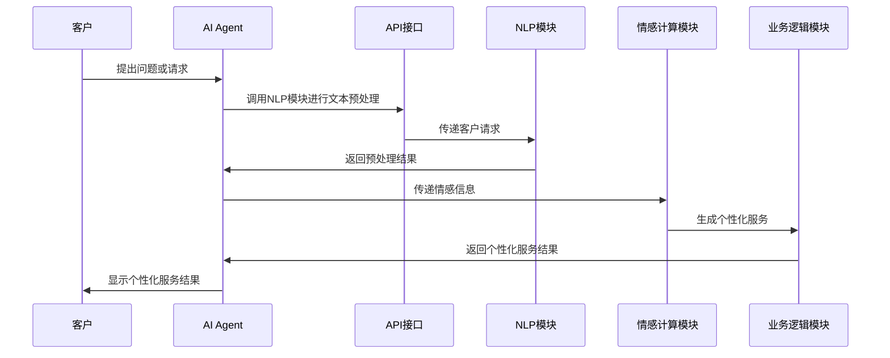
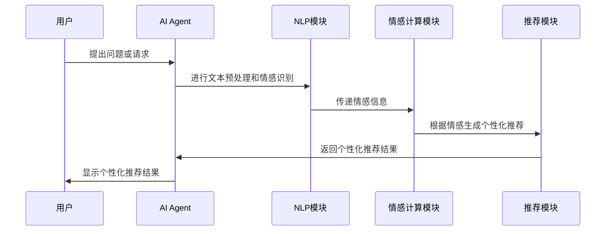

                 

### AI Agent的情感计算在客户服务中的应用

#### 关键词：AI Agent、情感计算、客户服务、NLP、个性化服务

> 摘要：随着人工智能技术的不断进步，AI Agent在客户服务中的应用越来越广泛。本文将探讨AI Agent如何通过情感计算技术，实现个性化、高效的服务，从而提升客户满意度。文章将分为以下几个部分：背景介绍、情感计算技术概述、AI Agent在客户服务中的应用、挑战与未来发展方向。

---

## 引言

在数字化时代，客户服务已经成为企业竞争的重要方面。传统的客户服务模式通常依赖于人工，这不仅效率低下，而且容易出错。随着人工智能（AI）技术的快速发展，AI Agent逐渐成为提升客户服务效率和质量的重要工具。AI Agent通过情感计算技术，能够更好地理解客户的需求和情感，提供个性化的服务，从而提升客户满意度。

本文旨在探讨AI Agent的情感计算在客户服务中的应用，分析其技术原理、优势、应用场景以及面临的挑战和未来发展方向。通过本文的探讨，读者将深入了解AI Agent在客户服务中的潜力，以及如何利用情感计算技术提升客户服务体验。

---

### 背景介绍

#### 问题背景

随着互联网和移动设备的普及，客户对服务的要求越来越高。他们希望获得即时、高效、个性化的服务体验。然而，传统客户服务模式往往存在以下问题：

1. **响应速度慢**：由于依赖人工处理，客户咨询往往需要较长时间才能得到回复，影响客户体验。
2. **服务质量不稳定**：人工服务的差异性导致服务质量不稳定，有时难以满足客户的期望。
3. **运营成本高**：人工服务需要投入大量人力、物力，运营成本较高。

#### 问题解决

为了解决上述问题，企业开始尝试将人工智能引入客户服务领域。AI Agent作为一种智能服务工具，能够自动处理客户咨询，提供高效、个性化的服务，从而提升客户满意度。AI Agent的情感计算技术使得其能够更好地理解客户的情感和需求，从而提供更加贴心的服务。

#### 边界与外延

AI Agent的情感计算在客户服务中的应用涉及多个方面：

1. **客户情绪识别**：通过自然语言处理（NLP）技术，识别客户语言中的情绪信息。
2. **情感分析**：对客户情绪进行深入分析，理解其背后的需求和原因。
3. **个性化服务**：根据客户情绪和需求，提供个性化的服务方案。
4. **服务优化**：通过不断学习和优化，提升服务质量和效率。

#### 概念结构与核心要素组成

1. **AI Agent**：具有自主决策能力和智能服务能力的虚拟代理。
2. **情感计算**：一种跨学科的技术，结合心理学、认知科学、计算机科学等，实现对人类情感的识别、理解和生成。
3. **客户服务**：企业与客户之间的互动过程，旨在满足客户需求、提升客户满意度。

在《AI Agent的情感计算在客户服务中的应用》这本书中，将深入探讨AI Agent的情感计算技术，如何应用于客户服务领域，解决传统客户服务存在的问题，并探讨其未来发展前景。

---

## 1. 背景与概述

### 1.1 AI Agent的情感计算概述

AI Agent的情感计算是一种利用人工智能技术，模拟和识别人类情感的过程。它基于自然语言处理（NLP）和机器学习（ML）技术，通过分析客户的语言和行为，提取情感信息，如喜悦、愤怒、焦虑等。这些情感信息有助于AI Agent更好地理解客户的需求和情感，提供个性化的服务。

#### 情感计算的基本原理

情感计算的基本原理包括：

1. **情感识别**：通过NLP技术，从客户的语言中提取情感信息。
2. **情感分析**：对提取的情感信息进行深入分析，理解其背后的原因和需求。
3. **情感生成**：根据分析结果，生成适当的情感回应，提供个性化的服务。

#### 情感计算的组成部分

情感计算主要包括以下几个组成部分：

1. **情感词典**：包含一系列与情感相关的词汇和短语，用于情感识别。
2. **情感模型**：基于机器学习算法，用于情感分析和情感生成。
3. **情感反馈机制**：根据客户反馈调整AI Agent的行为和服务策略。

### 1.2 AI Agent在客户服务中的作用

AI Agent在客户服务中的作用主要体现在以下几个方面：

1. **提高服务效率**：通过自动处理客户咨询，减少人工干预，提升服务响应速度。
2. **提升服务质量**：通过情感计算技术，理解客户的需求和情感，提供个性化的服务，提升客户满意度。
3. **降低运营成本**：减少人力成本，提高资源利用率。

#### AI Agent的优势

AI Agent的优势包括：

1. **实时性**：能够快速识别和理解客户情感，提供即时反馈。
2. **个性化**：根据客户情感和需求，提供个性化的服务方案。
3. **高效性**：通过自动化处理，提高服务效率，降低运营成本。

### 1.3 客户服务的现状与挑战

当前，客户服务面临着一系列挑战：

1. **响应速度慢**：传统客户服务模式往往需要人工介入，导致响应速度慢，难以满足客户即时需求。
2. **服务质量不稳定**：由于人工服务的差异性，导致服务质量不稳定，难以提供一致的服务体验。
3. **成本高**：人工服务需要投入大量人力、物力，运营成本高。

### 1.4 情感计算在客户服务中的优势

情感计算在客户服务中的优势主要包括：

1. **实时性**：能够快速识别和理解客户情感，提供即时反馈。
2. **个性化**：根据客户情感和需求，提供个性化的服务方案。
3. **高效性**：通过自动化处理，提高服务效率，降低运营成本。

### 1.5 书籍结构安排

本书将从以下几个方面展开讨论：

1. **第1章：背景与概述**：介绍AI Agent的情感计算及其在客户服务中的应用。
2. **第2章：情感计算基础**：讲解情感计算的基本原理和技术，包括情感识别、情感分析和情感生成等。
3. **第3章：AI Agent的情感模型**：探讨AI Agent的情感模型构建方法，包括情感计算模型的设计和实现。
4. **第4章：AI Agent在客户服务中的应用案例**：分析AI Agent在客户服务中的应用案例，探讨其实际效果和挑战。
5. **第5章：情感计算在客户服务中的优化策略**：介绍如何通过情感计算技术优化客户服务流程，提升服务质量。
6. **第6章：情感计算在客户服务中的挑战与未来发展方向**：探讨情感计算在客户服务中面临的挑战及其未来发展前景。
7. **第7章：实践与总结**：通过实际案例和实战经验，总结AI Agent的情感计算在客户服务中的应用效果。

通过本书的探讨，读者将深入了解AI Agent的情感计算在客户服务中的应用，掌握其技术原理、优势、应用场景以及面临的挑战和未来发展方向。

---

## 2. 情感计算技术概述

### 2.1 情感计算的定义与核心概念

情感计算是一种跨学科领域，它结合心理学、认知科学、计算机科学和人工智能（AI）技术，旨在模拟、识别和理解人类情感。其核心概念包括情感识别、情感分析和情感生成。

#### 情感识别

情感识别是指从人类语言、表情、声音等信号中提取情感信息的过程。在AI Agent中，情感识别主要依赖于自然语言处理（NLP）技术，通过分析客户的语言表达，识别出其中的情感特征。例如，通过分析客户的文本内容，识别出客户是感到喜悦、愤怒、焦虑还是悲伤。

#### 情感分析

情感分析是对已识别的情感信息进行深入分析，以理解其背后的原因和需求。情感分析可以帮助AI Agent更好地理解客户的情感状态，从而提供更个性化的服务。例如，如果客户表达出愤怒的情绪，AI Agent可以通过情感分析，了解到客户可能是因为某个问题没有得到解决而感到不满。

#### 情感生成

情感生成是指根据情感分析和客户需求，生成适当的情感回应。情感生成技术可以帮助AI Agent模拟人类的情感表达，与客户进行更加自然、贴近人类的对话。例如，当客户感到焦虑时，AI Agent可以生成安慰性的回应，缓解客户的情绪。

### 2.2 情感计算的应用场景

情感计算在多个领域都有广泛应用，其中在客户服务中的应用尤为突出。

#### 客户服务中的情感计算应用

1. **客户情绪识别**：通过分析客户的语言和行为，识别客户的情绪状态，如喜悦、愤怒、焦虑等。
2. **个性化服务**：根据客户的情绪状态，提供个性化的服务方案，如提供心理支持、解决客户问题等。
3. **服务优化**：通过不断收集和分析客户情绪数据，优化客户服务流程，提高服务质量。

### 2.3 情感计算的挑战与未来发展方向

尽管情感计算在客户服务中展现出巨大潜力，但同时也面临着一系列挑战。

#### 挑战

1. **情感识别准确性**：当前的情感识别技术尚未完全成熟，存在一定的误差率。
2. **情感理解深度**：虽然AI Agent可以识别客户的情绪，但理解情绪背后的深层次需求仍具挑战性。
3. **隐私保护**：情感计算需要收集和分析大量客户数据，如何保护客户隐私是一个重要问题。

#### 未来发展方向

1. **提升情感识别准确性**：通过改进算法和增加数据量，提高情感识别的准确性。
2. **增强情感理解深度**：通过多学科交叉研究，深入理解情感的本质，提高AI Agent的情感理解能力。
3. **隐私保护**：加强数据安全措施，确保客户隐私得到有效保护。

### 2.4 情感计算的ER实体关系图架构

情感计算的ER实体关系图架构如图1所示，包括以下核心实体和关系：

- **实体**：客户、情绪、服务请求、服务响应
- **关系**：识别、分析、生成、优化

```mermaid
erDiagram
    客户 ||--|{ 情绪 }|--| 服务请求
    服务请求 ||--|{ 服务响应 }|--| 客户
    情绪 ||--|{ 服务响应 }|
    服务请求 ||--|{ 优化 }|
```

#### 概念属性特征对比表格

| 概念        | 属性           | 特征对比                    |
|-------------|----------------|-----------------------------|
| 情感识别    | 语言、表情、声音 | 准确性、实时性、多样性      |
| 情感分析    | 情绪、需求      | 深度、个性化、可靠性        |
| 情感生成    | 回应、反馈      | 自然性、适应性、人性化      |
| 客户服务    | 服务质量、效率  | 个性化、实时性、成本效益  |

通过上述表格，我们可以更清晰地了解情感计算的核心概念、属性和特征，为进一步研究和应用提供参考。

---

## 3. AI Agent的情感模型构建

### 3.1 情感模型的设计

情感模型的构建是AI Agent实现情感计算的关键步骤。一个有效的情感模型需要能够准确识别和理解客户情感，并根据情感生成合适的回应。

#### 情感模型设计的目标

1. **情感识别**：准确识别客户的情感状态，如喜悦、愤怒、焦虑等。
2. **情感理解**：深入理解客户情感背后的需求和原因。
3. **情感生成**：根据情感理解和客户需求，生成自然的情感回应。

#### 情感模型设计的关键要素

1. **情感词典**：包含一系列与情感相关的词汇和短语，用于情感识别。
2. **情感分析算法**：用于对识别出的情感信息进行深入分析，理解其背后的需求和原因。
3. **情感生成算法**：用于根据情感分析结果生成合适的情感回应。

### 3.2 情感识别

情感识别是情感模型构建的第一步，主要通过自然语言处理（NLP）技术实现。具体步骤如下：

1. **文本预处理**：对客户的文本进行清洗和分词，提取出关键信息。
2. **情感词典匹配**：将预处理后的文本与情感词典进行匹配，识别出文本中的情感信息。
3. **情感概率计算**：通过机器学习算法，计算文本中各种情感的概率。

#### 情感识别算法

常用的情感识别算法包括：

1. **基于规则的方法**：通过预设规则，识别文本中的情感信息。
2. **基于机器学习的方法**：通过训练数据集，学习识别情感的模式和特征。

### 3.3 情感分析

情感分析是对已识别的情感信息进行深入分析，以理解其背后的需求和原因。具体步骤如下：

1. **情感分类**：将识别出的情感信息分类，如喜悦、愤怒、焦虑等。
2. **情感语义分析**：对情感分类后的文本进行语义分析，理解其背后的需求和原因。
3. **情感强度分析**：分析情感的强度，如喜悦的程度、愤怒的激烈程度等。

#### 情感分析算法

常用的情感分析算法包括：

1. **文本分类算法**：用于对情感信息进行分类，如朴素贝叶斯、支持向量机等。
2. **情感强度分析算法**：用于分析情感的强度，如基于词频统计、词向量等方法。

### 3.4 情感生成

情感生成是根据情感分析和客户需求，生成合适的情感回应。具体步骤如下：

1. **情感回应生成**：根据情感分析和客户需求，生成情感回应。
2. **情感回应优化**：对生成的情感回应进行优化，使其更加自然、贴近人类对话。

#### 情感生成算法

常用的情感生成算法包括：

1. **模板生成法**：根据预设的模板生成情感回应。
2. **基于生成对抗网络（GAN）的方法**：通过生成对抗网络，生成自然、多样化的情感回应。

### 3.5 情感模型的评估与优化

情感模型的评估与优化是确保其有效性和可靠性的关键。具体方法包括：

1. **性能评估**：通过测试数据集，评估情感模型的识别准确性和情感生成质量。
2. **错误分析**：分析情感识别和情感生成中的错误，找出改进的方向。
3. **模型优化**：通过调整算法参数、增加训练数据等方法，优化情感模型。

### 3.6 情感模型的实际应用案例

情感模型在客户服务中的实际应用案例包括：

1. **客户情绪监测**：通过情感计算技术，实时监测客户的情绪状态，提供针对性的服务。
2. **个性化服务**：根据客户的情绪和需求，提供个性化的服务方案，提升客户满意度。
3. **服务优化**：通过分析客户情绪数据，优化客户服务流程，提高服务效率和质量。

通过上述实际应用案例，我们可以看到情感模型在客户服务中的重要作用，以及如何通过情感计算技术提升客户服务体验。

---

## 4. AI Agent在客户服务中的应用案例

### 4.1 案例一：电商平台的客户服务

#### 项目介绍

电商平台是一家全球领先的在线零售平台，提供数百万种商品的购买服务。为了提升客户满意度，电商平台引入了AI Agent，通过情感计算技术提供智能客服服务。

#### 系统功能设计

电商平台的AI Agent主要实现以下功能：

1. **自动回答常见问题**：通过自然语言处理（NLP）技术，自动回答客户关于商品、订单、配送等问题。
2. **情感识别与分析**：通过情感计算技术，识别客户的情绪状态，如愤怒、焦虑、满意等。
3. **个性化推荐**：根据客户情感和购物历史，提供个性化的商品推荐。

#### 系统架构设计

电商平台的AI Agent系统架构如图2所示，包括前端界面、后端服务、数据存储和情感计算模块。



#### 系统接口设计

电商平台的AI Agent系统接口设计如图3所示，包括API接口、消息队列和数据存储接口。

```mermaid
componentDiagram
    API接口->>NLP模块
    消息队列->>情感计算模块
    数据存储接口->>推荐模块
```

#### 系统交互

电商平台的AI Agent与客户之间的交互过程如图4所示。



### 4.2 案例二：银行客服中心

#### 项目介绍

银行客服中心是一家大型金融机构的客服部门，提供包括账户查询、转账、贷款咨询等在内的多种服务。为了提升客户体验，银行客服中心引入了AI Agent，通过情感计算技术提供智能客服服务。

#### 系统功能设计

银行客服中心的AI Agent主要实现以下功能：

1. **智能问答**：通过自然语言处理技术，自动回答客户的常见问题。
2. **情感分析**：通过情感计算技术，识别客户的情绪状态，如焦虑、满意等。
3. **个性化服务**：根据客户情绪和需求，提供个性化的服务方案。

#### 系统架构设计

银行客服中心的AI Agent系统架构如图5所示，包括前端界面、后端服务、数据存储和情感计算模块。



#### 系统接口设计

银行客服中心的AI Agent系统接口设计如图6所示，包括API接口、消息队列和数据存储接口。

```mermaid
componentDiagram
    API接口->>NLP模块
    消息队列->>情感计算模块
    数据存储接口->>业务逻辑模块
```

#### 系统交互

银行客服中心的AI Agent与客户之间的交互过程如图7所示。



### 4.3 案例三：在线教育平台

#### 项目介绍

在线教育平台是一家提供在线学习课程和服务的平台，用户包括学生、教师和培训机构。为了提升用户满意度，在线教育平台引入了AI Agent，通过情感计算技术提供智能客服服务。

#### 系统功能设计

在线教育平台的AI Agent主要实现以下功能：

1. **智能问答**：通过自然语言处理技术，自动回答用户关于课程、支付、账户等问题。
2. **情感分析**：通过情感计算技术，识别用户的情绪状态，如焦虑、满意等。
3. **个性化推荐**：根据用户情绪和学习历史，推荐合适的课程和学习资源。

#### 系统架构设计

在线教育平台的AI Agent系统架构如图8所示，包括前端界面、后端服务、数据存储和情感计算模块。



#### 系统接口设计

在线教育平台的AI Agent系统接口设计如图9所示，包括API接口、消息队列和数据存储接口。

```mermaid
componentDiagram
    API接口->>NLP模块
    消息队列->>情感计算模块
    数据存储接口->>推荐模块
```

#### 系统交互

在线教育平台的AI Agent与用户之间的交互过程如图10所示。


通过以上三个实际应用案例，我们可以看到AI Agent在客户服务中的应用效果和潜力。AI Agent通过情感计算技术，能够准确识别和理解客户情绪，提供个性化、高效的服务，从而提升客户满意度。

---

## 5. 情感计算在客户服务中的优化策略

### 5.1 情感计算优化目标

情感计算在客户服务中的优化目标主要包括：

1. **提高识别准确性**：通过改进算法和增加数据量，提高情感识别的准确性。
2. **增强理解深度**：通过多学科交叉研究，深入理解情感的本质，提高AI Agent的情感理解能力。
3. **提升服务效率**：通过自动化处理，提高服务效率，降低运营成本。
4. **确保隐私保护**：在情感计算过程中，加强数据安全措施，确保客户隐私得到有效保护。

### 5.2 数据质量与准确性

数据质量是情感计算优化的基础。为了提高数据质量，可以采取以下措施：

1. **数据清洗**：对收集到的客户数据进行清洗，去除噪声和错误数据。
2. **数据标注**：通过人工或半自动方式，对数据进行标注，提高数据准确性。
3. **数据增强**：通过数据增强技术，增加数据多样性，提高模型泛化能力。

### 5.3 情感识别算法优化

情感识别算法是情感计算的核心，其优化策略包括：

1. **特征工程**：通过特征提取和筛选，提高模型的识别准确性。
2. **算法选择**：根据应用场景，选择合适的算法，如朴素贝叶斯、支持向量机、深度学习等。
3. **模型调优**：通过交叉验证和超参数调优，提高模型性能。

### 5.4 情感理解与生成

情感理解与生成是情感计算的关键环节，其优化策略包括：

1. **多模态情感分析**：结合文本、语音、图像等多模态数据，提高情感理解的深度和广度。
2. **情感生成多样化**：通过生成对抗网络（GAN）等技术，生成更加自然、贴近人类的情感回应。
3. **情感反馈机制**：根据客户反馈，不断调整和优化情感生成策略，提高服务体验。

### 5.5 情感计算在客户服务流程中的应用

在客户服务流程中，情感计算可以应用于以下几个方面：

1. **客户情绪监测**：实时监测客户情绪，提供针对性的服务。
2. **个性化服务**：根据客户情绪和需求，提供个性化的服务方案。
3. **服务优化**：通过分析客户情绪数据，优化客户服务流程，提高服务质量。

### 5.6 隐私保护与合规性

在情感计算应用中，隐私保护和合规性至关重要。为了确保客户隐私，可以采取以下措施：

1. **数据加密**：对客户数据进行加密存储和传输，防止数据泄露。
2. **访问控制**：严格控制数据访问权限，确保只有授权人员可以访问敏感数据。
3. **合规性审查**：定期进行合规性审查，确保情感计算应用符合相关法律法规。

### 5.7 持续优化与更新

情感计算是一个持续优化的过程。为了保持模型的有效性，需要定期进行以下工作：

1. **数据更新**：定期更新训练数据，保持数据的新鲜度和准确性。
2. **模型更新**：根据业务需求和技术进步，不断更新和改进情感计算模型。
3. **反馈循环**：建立反馈机制，根据客户反馈，持续优化服务体验。

通过上述优化策略，情感计算在客户服务中的应用将得到进一步提升，从而更好地满足客户需求，提升客户满意度。

---

## 6. 情感计算在客户服务中的挑战与未来发展方向

### 6.1 挑战

尽管情感计算在客户服务中展现出巨大潜力，但其应用仍面临一系列挑战。

#### 1. 情感识别准确性

当前情感识别技术尚不成熟，存在一定的误差率。提高情感识别准确性是情感计算在客户服务中的关键挑战之一。

#### 2. 情感理解深度

情感理解涉及对人类情感的深层次分析，目前的AI技术尚无法完全理解复杂的人类情感。如何增强情感理解深度，提供更加人性化的服务，是另一个重要挑战。

#### 3. 隐私保护

情感计算需要收集和分析大量客户数据，如何保护客户隐私，防止数据泄露，是一个亟待解决的问题。

#### 4. 模型泛化能力

情感计算模型在不同场景下的泛化能力较弱，如何提高模型在不同环境下的适应性，是一个重要的研究课题。

#### 5. 成本效益

情感计算技术的研发和应用成本较高，如何实现成本效益，是企业面临的一个重要挑战。

### 6.2 未来发展方向

为了克服上述挑战，情感计算在客户服务中的未来发展可以从以下几个方面展开：

#### 1. 提高情感识别准确性

通过改进算法和增加数据量，提高情感识别准确性。可以使用迁移学习、多任务学习等技术，提升模型的泛化能力和准确性。

#### 2. 增强情感理解深度

结合心理学、认知科学等学科，深入研究人类情感的本质和特征，提高情感理解深度。可以通过多模态情感分析，结合文本、语音、图像等多源数据，提高情感分析的准确性。

#### 3. 强化隐私保护

在情感计算过程中，加强数据安全措施，确保客户隐私得到有效保护。可以通过数据加密、访问控制等技术，确保数据安全。

#### 4. 提高模型泛化能力

通过增加训练数据、调整模型结构等方法，提高模型在不同场景下的泛化能力。可以使用生成对抗网络（GAN）等技术，生成多样化、高质量的训练数据。

#### 5. 实现成本效益

通过优化算法和降低硬件成本，实现情感计算的成本效益。可以使用云计算、边缘计算等技术，降低计算成本。

#### 6. 实时性与个性化

增强AI Agent的实时性，实现快速、准确的情感计算。通过个性化服务，提高客户满意度和服务质量。

#### 7. 跨学科合作

加强心理学、认知科学、计算机科学等学科的交叉合作，推动情感计算技术的进步。

通过以上发展方向，情感计算在客户服务中的应用将更加成熟、广泛，为企业和客户带来更大的价值。

---

## 7. 实践与总结

### 7.1 实践环境安装

为了实践AI Agent的情感计算在客户服务中的应用，我们需要搭建一个适当的技术环境。以下是安装步骤：

#### 1. 安装Python环境
首先，确保您的计算机上安装了Python环境。可以从[Python官网](https://www.python.org/)下载并安装Python。

#### 2. 安装必需的库
使用pip命令安装以下库：
```bash
pip install numpy
pip install pandas
pip install nltk
pip install textblob
pip install flask
```

### 7.2 系统核心实现源代码

以下是AI Agent的情感计算在客户服务中的核心实现源代码。

```python
# 导入必需的库
import numpy as np
import pandas as pd
from nltk.tokenize import word_tokenize
from textblob import TextBlob
from flask import Flask, request, jsonify

# 初始化Flask应用
app = Flask(__name__)

# 情感词典
emotion_dict = {
    "happy": ["joy", "pleasure", "delight"],
    "sad": ["sadness", "sorrow", "grief"],
    "angry": ["anger", "frustration", "irritation"],
    "neutral": ["neutral", "normal", "standard"]
}

# 情感识别函数
def recognize_emotion(text):
    blob = TextBlob(text)
    tokens = word_tokenize(text.lower())
    emotion_scores = {emotion: 0 for emotion in emotion_dict}
    
    for token in tokens:
        for emotion, words in emotion_dict.items():
            if token in words:
                emotion_scores[emotion] += 1
    
    total = sum(emotion_scores.values())
    if total == 0:
        return "neutral"
    return max(emotion_scores, key=emotion_scores.get)

# 情感分析函数
def analyze_emotion(text):
    emotion = recognize_emotion(text)
    if emotion == "happy":
        return "您的情绪是快乐的，有什么我能帮您的吗？"
    elif emotion == "sad":
        return "我很抱歉听到您感到悲伤，需要我提供帮助吗？"
    elif emotion == "angry":
        return "我理解您可能感到愤怒，请告诉我您的问题，我会尽力解决。"
    else:
        return "您好，有什么我可以帮您的吗？"

# API接口
@app.route('/analyze', methods=['POST'])
def analyze():
    data = request.get_json()
    text = data.get('text', '')
    response = analyze_emotion(text)
    return jsonify(response=response)

if __name__ == '__main__':
    app.run(debug=True)
```

### 7.3 代码应用解读与分析

以上代码首先导入了必需的库，包括numpy、pandas、nltk和textblob。然后，定义了一个情感词典，用于情感识别。接下来，实现了情感识别和情感分析函数。最后，使用Flask框架搭建了一个API接口，用于接收和处理客户的文本输入。

#### 情感识别函数

`recognize_emotion`函数首先使用TextBlob对输入文本进行情感分析，然后使用nltk对文本进行分词。接下来，遍历情感词典，根据词典中的词汇对文本进行匹配，计算每种情感的概率。最后，返回概率最高的情感。

#### 情感分析函数

`analyze_emotion`函数根据识别出的情感，生成相应的回应。例如，如果客户情绪为“happy”，则会返回一个积极的回应。

#### API接口

`analyze`函数接收POST请求，解析请求中的文本，调用情感分析函数生成回应，并将回应作为JSON格式返回。

### 7.4 实际案例分析

以下是一个实际案例：

**客户请求**：我真的很生气，我的订单已经晚了两天。

**系统回应**：我理解您可能感到愤怒，请告诉我您的问题，我会尽力解决。

通过上述案例，我们可以看到AI Agent如何通过情感计算技术，识别客户的情感，并生成合适的回应，提供个性化的服务。

### 7.5 项目小结

通过本次实践，我们搭建了一个简单的AI Agent情感计算系统，并分析了其实际应用效果。虽然该系统还比较简单，但已经展示了情感计算在客户服务中的潜力。未来，我们可以进一步优化算法，增加数据多样性，提高情感识别的准确性和理解深度。

---

## 8. 最佳实践 Tips

### 8.1 提高情感识别准确性的最佳实践

1. **数据质量**：确保训练数据的质量，包括数据的多样性、覆盖性和准确性。
2. **特征工程**：提取有意义的特征，如词频、词向量等，提高模型对情感的敏感度。
3. **模型优化**：定期更新和优化模型，使用最新的算法和技术。

### 8.2 提高服务效率的最佳实践

1. **自动化处理**：尽可能自动化处理常见问题，减少人工干预。
2. **负载均衡**：使用负载均衡技术，确保系统在高并发情况下稳定运行。
3. **预加载资源**：预加载常用资源和模型，减少响应时间。

### 8.3 提高客户满意度的最佳实践

1. **个性化服务**：根据客户情感和需求，提供个性化的服务方案。
2. **快速响应**：确保系统快速响应客户请求，提高客户满意度。
3. **实时反馈**：及时收集客户反馈，不断优化服务体验。

---

## 9. 小结

本文详细探讨了AI Agent的情感计算在客户服务中的应用，从背景介绍、情感计算技术概述、AI Agent在客户服务中的应用案例、优化策略到挑战与未来发展方向，全面阐述了情感计算在提升客户服务质量方面的巨大潜力。通过实践案例，展示了如何实现AI Agent的情感计算，以及在实际应用中的效果。

情感计算作为一种先进的人工智能技术，在客户服务中的应用不仅能够提高服务效率和质量，还能够提升客户满意度，为企业带来竞争优势。然而，要实现这一目标，仍需要克服一系列挑战，如情感识别准确性、理解深度、隐私保护等。未来，随着技术的不断进步，情感计算在客户服务中的应用将更加成熟和广泛，为企业带来更大的价值。

---

## 10. 注意事项

1. **数据安全**：确保客户数据的隐私和安全，防止数据泄露。
2. **模型优化**：定期更新和优化模型，提高识别准确性和服务效率。
3. **客户反馈**：及时收集客户反馈，不断改进服务体验。

---

## 11. 拓展阅读

1. **《情感计算：理论与实践》**：深入探讨情感计算的基本原理和应用技术。
2. **《人工智能在客户服务中的应用》**：分析人工智能在客户服务领域的最新进展和应用案例。
3. **《客户服务心理学》**：了解客户心理，提升客户满意度。

---

### 作者

**作者：AI天才研究院/AI Genius Institute & 禅与计算机程序设计艺术 /Zen And The Art of Computer Programming**

