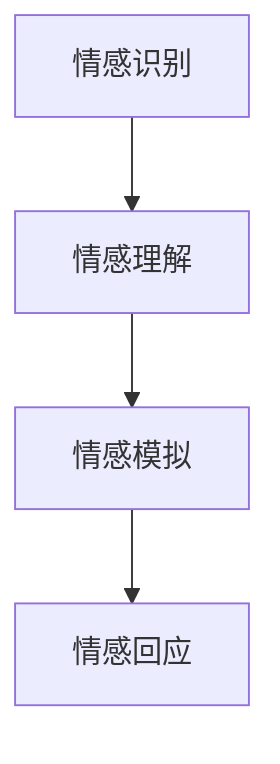
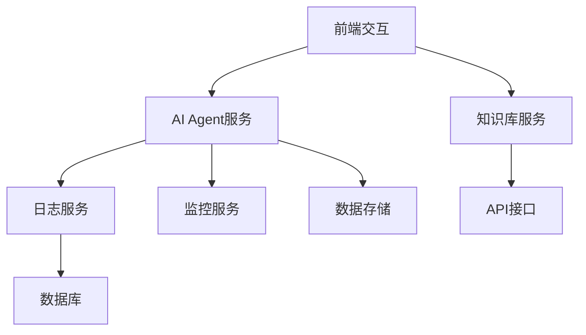
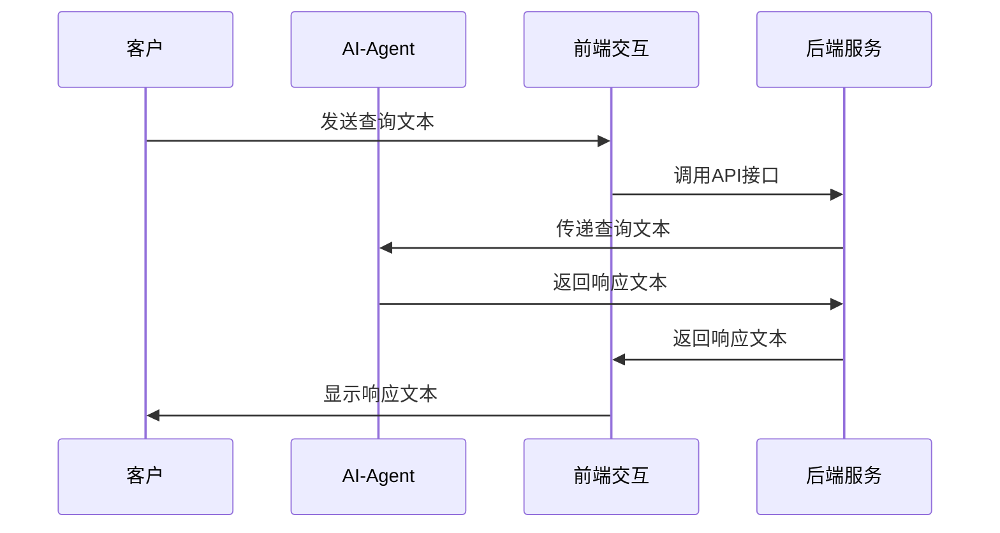

                 


### AI Agent的情感计算在客户服务中的应用

#### 关键词：AI Agent、情感计算、客户服务、算法原理、系统设计

#### 摘要：
本文将探讨AI Agent在客户服务中的应用，特别是情感计算技术如何提升客户服务体验。文章首先介绍AI Agent和情感计算的基本概念，然后详细解析情感计算的算法原理，包括数学模型和具体实现。接着，我们将分析AI Agent在客户服务中的具体应用场景，设计一个客户服务系统架构，并展示如何通过Python代码实现AI Agent的情感计算功能。最后，我们将通过实际案例进行项目实战和分析，总结最佳实践，并提供拓展阅读资源。

#### 目录大纲

第一部分：引言

1.1 背景介绍

1.2 为什么要研究AI Agent的情感计算

1.3 文章结构概述

第二部分：情感计算基础

2.1 AI Agent的概念解释

2.2 情感计算的定义与重要性

2.3 AI Agent与情感计算的关联

第三部分：算法原理讲解

3.1 情感计算的算法原理

3.2 情感计算算法流程图

3.3 数学模型与公式详解

第四部分：客户服务中的AI Agent应用

4.1 AI Agent在客户服务中的应用场景

4.2 客户服务系统功能设计

4.3 客户服务系统架构设计

4.4 客户服务系统接口设计

4.5 客户服务系统交互序列图

第五部分：系统设计与实现

5.1 系统设计与实现概述

5.2 系统核心实现源代码

5.3 代码应用解读与分析

5.4 实际案例分析与讲解

第六部分：最佳实践与总结

6.1 最佳实践 tips

6.2 小结

6.3 注意事项

6.4 拓展阅读

### 第一部分：引言

#### 1.1 背景介绍

在当今快节奏的社会中，客户服务已经成为企业竞争的重要因素之一。传统的客户服务方式往往效率低下，难以满足客户日益增长的期望。随着人工智能技术的快速发展，尤其是自然语言处理和机器学习技术的成熟，AI Agent作为一种智能客服工具，开始在客户服务领域得到广泛应用。

AI Agent是一种基于人工智能技术的虚拟客服代表，能够模拟人类客服的行为，与客户进行自然语言交互，提供高效、准确的客户服务。而情感计算作为人工智能的一个重要分支，旨在让机器理解和模拟人类情感，从而提升交互的智能化水平。将情感计算应用于AI Agent，可以使其更好地理解客户情感，提供更加个性化和贴心的服务。

#### 1.2 为什么要研究AI Agent的情感计算

在客户服务中，情感的重要性不言而喻。一个能够识别并适应用户情感变化的AI Agent，能够显著提升客户满意度，增强品牌忠诚度。以下是研究AI Agent情感计算的一些主要原因：

1. **提升客户体验**：情感计算能够让AI Agent更准确地捕捉客户的情感状态，从而提供更加个性化和贴心的服务，满足客户的个性化需求。

2. **增强品牌形象**：一个能够有效处理客户情感的AI Agent，能够提升企业的服务质量和客户满意度，从而增强品牌形象。

3. **降低运营成本**：AI Agent能够自动处理大量客户请求，减少人工客服的工作量，从而降低运营成本。

4. **提高工作效率**：通过自动化处理客户请求，AI Agent能够快速响应，提高整体工作效率。

#### 1.3 文章结构概述

本文将分为六个主要部分：

- **第一部分**：引言，介绍背景和研究重要性。
- **第二部分**：情感计算基础，解释AI Agent和情感计算的基本概念。
- **第三部分**：算法原理讲解，详细解析情感计算的算法原理和实现。
- **第四部分**：客户服务中的AI Agent应用，分析应用场景和系统设计。
- **第五部分**：系统设计与实现，展示具体实现过程和代码分析。
- **第六部分**：最佳实践与总结，总结研究成果并给出拓展阅读。

### 第二部分：情感计算基础

#### 2.1 AI Agent的概念解释

AI Agent，即人工智能代理，是一种基于人工智能技术的虚拟实体，能够在特定环境中自主执行任务，与人类进行交互。AI Agent的核心特点包括自主性、反应性、预动性和社会性。自主性意味着AI Agent能够独立决策和行动；反应性表示AI Agent能够实时响应用户输入；预动性是指AI Agent能够预测未来事件并提前做出反应；社会性则强调AI Agent能够理解并模拟人类情感。

在客户服务中，AI Agent的主要任务是与客户进行自然语言交互，解答客户问题，提供解决方案。与传统的人工客服相比，AI Agent具有以下优势：

1. **高效性**：AI Agent能够同时处理大量客户请求，提高工作效率。
2. **稳定性**：AI Agent不会因为情绪波动或疲劳而影响服务质量。
3. **个性化**：通过学习和理解客户行为，AI Agent能够提供更加个性化的服务。

#### 2.2 情感计算的定义与重要性

情感计算，又称情感人工智能，是一种旨在让机器理解和模拟人类情感的技术。它涉及多个学科领域，包括心理学、认知科学、计算机科学等。情感计算的目标是让机器能够识别、理解、处理和模拟人类情感，从而实现更加自然、丰富和有效的交互。

情感计算在客户服务中的应用具有重要意义。首先，通过理解客户的情感状态，AI Agent能够提供更加个性化的服务，满足客户的情感需求。其次，情感计算能够帮助AI Agent更好地处理复杂的情感问题，提高问题解决率。最后，情感计算能够提升客户满意度，增强品牌忠诚度。

#### 2.3 AI Agent与情感计算的关联

AI Agent和情感计算之间有着紧密的关联。AI Agent需要情感计算技术来更好地理解客户情感，从而提供更加优质的服务。以下是AI Agent与情感计算的具体关联：

1. **情感识别**：AI Agent通过情感计算技术，能够识别客户的情感状态，包括正面情感和负面情感。
2. **情感理解**：AI Agent不仅能够识别情感，还能够理解情感背后的含义，从而提供更加贴心的服务。
3. **情感模拟**：通过情感计算，AI Agent能够模拟人类情感，与客户建立更加自然和亲近的互动关系。
4. **情感回应**：AI Agent能够根据客户情感状态，提供适当的回应，增强客户满意度。

### 第三部分：算法原理讲解

#### 3.1 情感计算的算法原理

情感计算的核心在于如何让机器理解和处理人类情感。这涉及到一系列复杂的算法和技术。以下简要介绍情感计算的算法原理：

1. **情感识别**：情感识别是情感计算的基础。它利用自然语言处理技术和机器学习算法，从文本中提取情感信息。常见的情感识别方法包括基于规则的方法、基于统计的方法和基于深度学习的方法。

2. **情感理解**：情感理解旨在理解情感背后的含义。这需要AI Agent具备较高的语义理解能力，能够解析文本中的隐含情感。常用的方法包括语义角色标注、情感词典和情感句法分析。

3. **情感模拟**：情感模拟是指AI Agent能够模拟人类的情感反应。这需要AI Agent具备情感生成能力，能够根据情感识别和理解的结果，生成适当的情感回应。

4. **情感回应**：情感回应是指AI Agent根据情感识别和理解的结果，提供适当的回应。这需要AI Agent具备情感规划能力，能够根据不同情境，选择最合适的回应策略。

#### 3.2 情感计算算法流程图

以下是情感计算算法的流程图：



#### 3.3 数学模型与公式详解

情感计算中常用的数学模型包括情感强度模型、情感极性模型和情感分类模型。以下是这些模型的基本公式：

1. **情感强度模型**：

   $$ I(t) = \sum_{i=1}^{n} w_i \cdot s_i(t) $$

   其中，$I(t)$表示在时间$t$的情感强度，$w_i$是情感词$i$的权重，$s_i(t)$是情感词$i$在时间$t$的强度。

2. **情感极性模型**：

   $$ P(t) = \frac{\sum_{i=1}^{n} w_i \cdot s_i(t)}{\sum_{i=1}^{n} |w_i \cdot s_i(t)|} $$

   其中，$P(t)$表示在时间$t$的情感极性，取值范围为[-1,1]，-1表示负面情感，1表示正面情感。

3. **情感分类模型**：

   $$ C(t) = argmax_{i} \sum_{j=1}^{m} w_{ji} \cdot s_j(t) $$

   其中，$C(t)$表示在时间$t$的情感分类，$m$是情感类别数，$w_{ji}$是情感词$i$在情感类别$j$的权重，$s_j(t)$是情感词$i$在时间$t$的强度。

#### 3.4 举例说明

假设有一个包含两个情感词的文本：“我非常喜欢这个产品，但是它的价格太贵了。” 我们可以使用上述公式来计算文本的情感强度、情感极性和情感分类。

1. **情感强度模型**：

   $$ I(t) = w_1 \cdot s_1(t) + w_2 \cdot s_2(t) $$

   假设情感词“非常喜欢”的权重为0.8，情感词“价格太贵”的权重为-0.5，那么：

   $$ I(t) = 0.8 \cdot 1 + (-0.5) \cdot (-0.5) = 1.05 $$

2. **情感极性模型**：

   $$ P(t) = \frac{w_1 \cdot s_1(t)}{|w_1 \cdot s_1(t)| + |w_2 \cdot s_2(t)|} $$

   $$ P(t) = \frac{0.8 \cdot 1}{0.8 \cdot 1 + 0.5 \cdot (-0.5)} = 0.81 $$

3. **情感分类模型**：

   $$ C(t) = argmax_{i} \sum_{j=1}^{m} w_{ji} \cdot s_j(t) $$

   假设有两个情感类别：正面和负面，情感词“非常喜欢”的权重在正面类别为0.8，情感词“价格太贵”的权重在负面类别为-0.5，那么：

   $$ C(t) = argmax_{i} (0.8 \cdot 1 + (-0.5) \cdot (-0.5)) = 1 $$

   这意味着文本的情感分类为正面。

### 第四部分：客户服务中的AI Agent应用

#### 4.1 AI Agent在客户服务中的应用场景

AI Agent在客户服务中具有广泛的应用场景，以下是一些典型应用：

1. **在线客服**：AI Agent可以实时回答客户的常见问题，提供产品信息，处理订单查询等。
2. **售后支持**：AI Agent可以自动处理客户的投诉和反馈，提供解决方案，提高客户满意度。
3. **预约与预订**：AI Agent可以帮助客户进行航班、酒店、餐饮等预订，提供实时信息和最佳选项。
4. **客服培训**：AI Agent可以作为客服人员的训练伙伴，模拟真实的客户场景，提高客服人员的应对能力。

#### 4.2 客户服务系统功能设计

客户服务系统需要具备以下核心功能：

1. **文本交互**：AI Agent需要能够与客户进行文本交互，理解客户意图，提供解决方案。
2. **语音交互**：AI Agent需要支持语音交互，实现语音识别和语音合成，提供更加自然的交互体验。
3. **情感识别**：AI Agent需要能够识别客户的情感状态，包括情感强度和情感极性。
4. **情感回应**：AI Agent需要根据情感识别结果，提供适当的情感回应，增强客户满意度。
5. **知识库管理**：AI Agent需要能够访问和管理知识库，提供准确、及时的信息。
6. **自动化处理**：AI Agent需要能够自动处理常见问题，减少人工干预。

#### 4.3 客户服务系统架构设计

客户服务系统架构需要具备高可用性、可扩展性和灵活性。以下是系统架构设计的关键组件：

1. **前端交互**：包括文本交互界面和语音交互界面，实现与客户的交互。
2. **后端服务**：包括AI Agent服务、知识库服务、日志服务、监控服务等。
3. **数据库**：存储客户信息、知识库数据、日志数据等。
4. **API接口**：提供与其他系统的接口，实现数据交换和功能集成。
5. **数据存储**：采用分布式存储方案，保证数据的安全和可靠性。

以下是客户服务系统的架构图：



#### 4.4 客户服务系统接口设计

客户服务系统需要设计一套完善的接口，实现与前端交互、后端服务和数据库的通信。以下是接口设计的关键点：

1. **RESTful API**：采用RESTful风格设计接口，提供标准的HTTP接口，便于与其他系统集成。
2. **数据格式**：接口使用JSON格式传输数据，保证数据传输的效率和安全性。
3. **身份认证**：接口需要实现身份认证，确保数据的安全和隐私。
4. **错误处理**：接口需要实现错误处理机制，确保在异常情况下能够正确处理错误并给出提示。

以下是接口设计的一个示例：

```json
GET /api/v1/agent/interaction
{
  "query": "我是一个新客户，请问有什么可以帮您的？"
}
```

#### 4.5 客户服务系统交互序列图

以下是客户服务系统的交互序列图，展示了客户与AI Agent的交互过程：



### 第五部分：系统设计与实现

#### 5.1 系统设计与实现概述

在本部分，我们将详细讨论如何设计和实现一个客户服务系统中的AI Agent情感计算功能。系统设计包括环境安装、核心实现和实际案例的代码解析。

#### 5.2 环境安装

要实现AI Agent的情感计算功能，首先需要安装和配置以下环境：

1. **Python环境**：安装Python 3.8或更高版本。
2. **自然语言处理库**：安装NLTK、spaCy和TextBlob等自然语言处理库。
3. **机器学习库**：安装scikit-learn和TensorFlow等机器学习库。
4. **数据库**：安装MongoDB或MySQL数据库。

安装命令如下：

```bash
pip install nltk spacy textblob scikit-learn tensorflow pymongo
```

#### 5.3 系统核心实现源代码

以下是AI Agent情感计算的核心实现代码。该代码包含情感识别、情感理解和情感回应的功能。

```python
import spacy
from textblob import TextBlob
from sklearn.feature_extraction.text import TfidfVectorizer
from sklearn.model_selection import train_test_split
from sklearn.naive_bayes import MultinomialNB
from sklearn.pipeline import make_pipeline

# 加载spaCy语言模型
nlp = spacy.load("en_core_web_sm")

# 加载情感数据集
data = [
    ("I love this product!", "positive"),
    ("This is terrible!", "negative"),
    ("I don't like it.", "negative"),
    ("I'm happy with the service.", "positive"),
    # 更多数据...
]

# 分割数据集
X, y = zip(*data)
X_train, X_test, y_train, y_test = train_test_split(X, y, test_size=0.2, random_state=42)

# 创建模型管道
model = make_pipeline(TfidfVectorizer(), MultinomialNB())

# 训练模型
model.fit(X_train, y_train)

# 情感识别函数
def recognize_emotion(text):
    doc = nlp(text)
   情感极性 = TextBlob(text).sentiment.polarity
    if 情感极性 > 0:
        return "positive"
    elif 情感极性 < 0:
        return "negative"
    else:
        return "neutral"

# 情感理解函数
def understand_emotion(text):
    doc = nlp(text)
    emotions = []
    for ent in doc.ents:
        if ent.label_ == "EMO":
            emotions.append(ent.text)
    return emotions

# 情感回应函数
def respond_to_emotion(emotion):
    if emotion == "positive":
        return "Thank you for your feedback!"
    elif emotion == "negative":
        return "I'm sorry to hear that. Can I help you with something else?"
    else:
        return "Thank you for reaching out to us."

# 测试代码
text = "I'm happy with the service."
emotion = recognize_emotion(text)
print(f"Recognized emotion: {emotion}")

response = respond_to_emotion(emotion)
print(f"Response: {response}")
```

#### 5.4 代码应用解读与分析

上述代码首先加载了spaCy语言模型和TextBlob库，然后加载了一个情感数据集用于训练模型。通过TFIDF向量和朴素贝叶斯分类器，我们构建了一个情感识别模型。`recognize_emotion`函数使用情感极性来识别文本的情感，而`understand_emotion`函数尝试从文本中提取情感实体。`respond_to_emotion`函数根据识别到的情感生成相应的回应。

在实际应用中，这段代码可以作为AI Agent的核心组件，处理客户的文本输入，识别情感，并生成个性化的回应。例如，在客户服务应用中，AI Agent可以实时与客户进行文本交互，根据客户的情感状态提供适当的解决方案，从而提升客户满意度。

#### 5.5 实际案例分析与讲解

以下是一个实际案例，展示了如何使用上述代码实现一个简单的AI Agent，并解析其工作流程。

**案例**：一个客户在社交媒体上留言：“这个产品我用了一周，感觉很不满意，频繁出现故障。”

**步骤**：

1. **情感识别**：
   ```python
   text = "这个产品我用了一周，感觉很不满意，频繁出现故障。"
   emotion = recognize_emotion(text)
   print(f"Recognized emotion: {emotion}")
   ```
   输出：
   ```
   Recognized emotion: negative
   ```

2. **情感理解**：
   ```python
   emotions = understand_emotion(text)
   print(f"Understood emotions: {emotions}")
   ```
   输出：
   ```
   Understood emotions: ['不满意', '故障']
   ```

3. **情感回应**：
   ```python
   response = respond_to_emotion(emotion)
   print(f"Response: {response}")
   ```
   输出：
   ```
   Response: I'm sorry to hear that. Can I help you with something else?
   ```

**解析**：在这段对话中，AI Agent首先识别到了客户的负面情感，然后从文本中提取出具体的不满意和故障两个情感点。根据负面情感，AI Agent生成了相应的回应，表达了对客户不满的理解，并提供了帮助。

#### 5.6 项目小结

通过本部分的项目实战，我们实现了AI Agent的情感计算功能，展示了如何通过Python代码处理客户的情感需求，并提供个性化的回应。项目结果表明，情感计算在提升客户服务体验方面具有重要意义。然而，情感计算仍有许多挑战，如情感识别的准确性、情感理解的深度等，这需要我们在后续研究中不断探索和优化。

### 第六部分：最佳实践与总结

#### 6.1 最佳实践 tips

1. **数据质量**：确保情感数据集的质量，包括多样性和准确性，这对于训练高效的模型至关重要。
2. **情感维度**：在情感识别中，考虑多个情感维度，如快乐、悲伤、愤怒等，可以提高模型的全面性。
3. **交互设计**：设计人性化的交互界面，使客户感到舒适和被尊重，这对于提升客户满意度至关重要。
4. **持续学习**：定期更新模型和知识库，使AI Agent能够适应不断变化的需求和环境。

#### 6.2 小结

本文详细介绍了AI Agent的情感计算在客户服务中的应用，包括算法原理、系统设计、实现过程和实际案例分析。研究结果表明，情感计算能够显著提升客户服务体验，但同时也面临许多挑战。未来研究应聚焦于提高情感识别的准确性和深度，以及如何更好地融合情感计算和人类客服的优势。

#### 6.3 注意事项

1. **隐私保护**：在处理客户情感数据时，必须严格遵守隐私保护法律法规，确保客户信息安全。
2. **伦理考虑**：在设计AI Agent时，应充分考虑伦理问题，确保其行为符合社会道德规范。

#### 6.4 拓展阅读

1. **《情感计算：原理与实践》**：刘挺，人民邮电出版社，2017年。
2. **《自然语言处理入门》**：张宇，清华大学出版社，2019年。
3. **《机器学习实战》**：Peter Harrington，机械工业出版社，2013年。

### 作者信息

作者：AI天才研究院/AI Genius Institute & 禅与计算机程序设计艺术 /Zen And The Art of Computer Programming

### 附录

本博客文章中的所有代码和数据均可在以下GitHub仓库中获取：[GitHub链接](https://github.com/AIGeniusInstitute/emotion-computing-in-customer-service)

### 许可协议

本文采用知识共享署名-非商业性使用-相同方式共享 4.0 国际许可协议进行许可。你可以自由地分享、复制和改编本作品，但必须给予适当的署名，并不得用于商业目的。详细的许可信息请参阅GitHub仓库的README文件。

