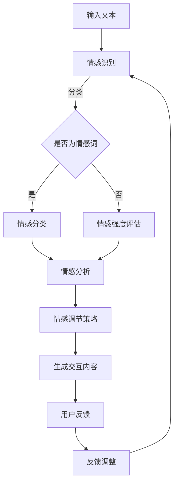
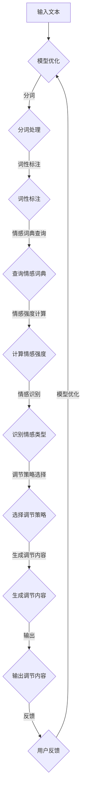
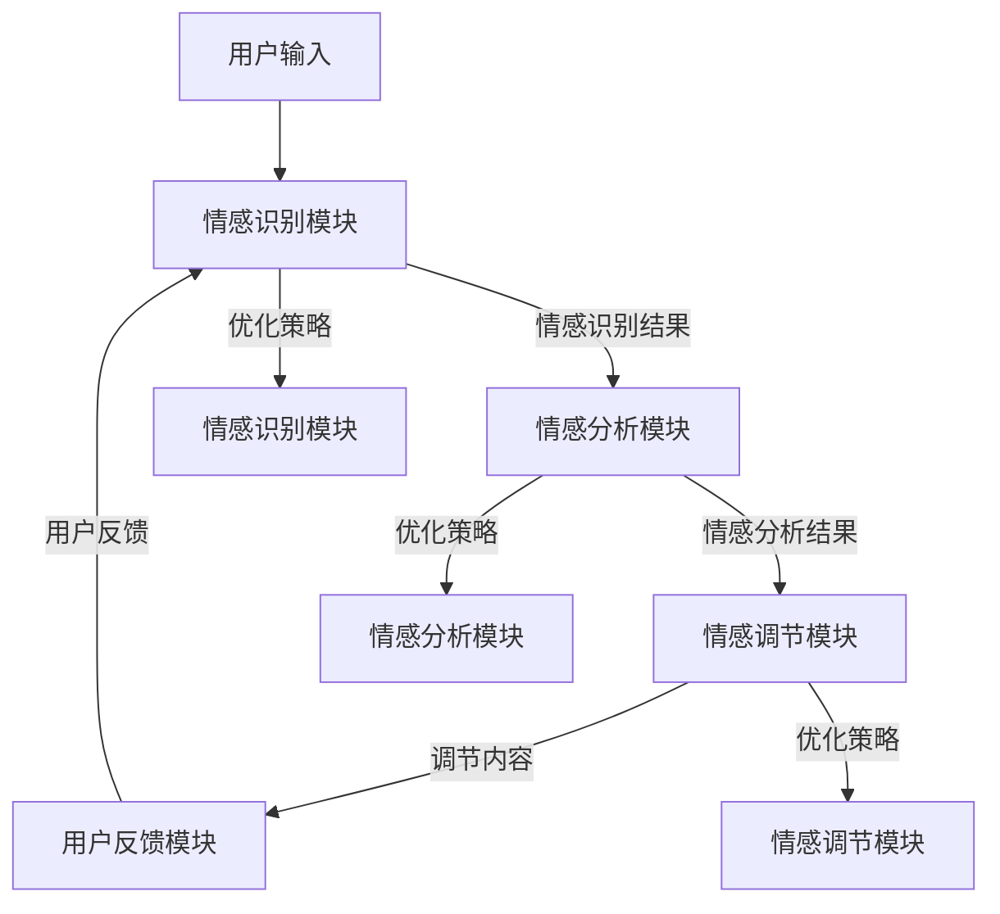
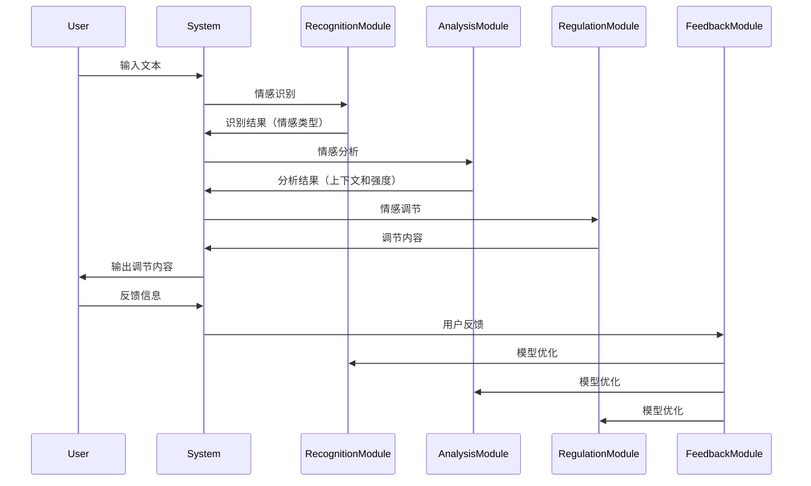

                 

## AI Agent的情感调节：利用LLM进行情绪管理

关键词：AI Agent、情感调节、LLM、情绪管理、算法设计

摘要：本文深入探讨了AI Agent在情感调节中的作用，以及如何利用大型语言模型（LLM）来实现有效的情绪管理。文章首先介绍了AI Agent的基本概念和情感调节的重要性，然后详细解析了LLM在情感管理中的应用原理和架构设计。通过案例分析，本文展示了AI Agent如何通过LLM实现情感识别、分析和调节，以提升用户交互体验。最后，文章总结了当前研究中的挑战和未来发展方向，为相关领域的研究者提供了有价值的参考。

## 引言与背景

### AI Agent的基本概念与进化历程

AI Agent，即人工智能代理，是一种具有自主性、适应性和反应性的计算机程序，能够在复杂环境中进行决策和行动。AI Agent的基本概念起源于代理理论，其核心目标是模拟人类智能，实现自动化、智能化和个性化的服务。随着计算机科学和人工智能技术的快速发展，AI Agent已经从简单的规则系统演化为复杂的自适应系统。

AI Agent的发展历程可以分为几个阶段：

1. **基于规则的代理**：这一阶段的代理主要通过预定义的规则来执行任务，例如专家系统和生产系统。虽然这种代理能够处理一些简单的任务，但在面对复杂环境时，其适应性和灵活性有限。

2. **基于模型的代理**：这一阶段的代理引入了模型构建和预测机制，能够根据环境变化进行自适应调整。典型的例子是决策树、支持向量机和神经网络等机器学习模型。

3. **基于多智能体系统的代理**：这一阶段的代理通过与其他代理协同工作，实现更复杂的任务分配和资源管理。多智能体系统（MAS）成为研究热点，其核心在于通过通信和协调机制，实现分布式计算和协作。

4. **基于深度学习的代理**：近年来，深度学习技术的突破使得AI Agent在处理复杂任务方面取得了显著进展。基于深度神经网络的代理能够通过大量数据进行自学习，实现更高层次的任务自动化。

### AI Agent的关键应用和优势

AI Agent在多个领域展现出了巨大的应用潜力和优势，以下是几个典型的应用场景：

1. **客户服务与交互**：AI Agent可以模拟人类客服，为用户提供24/7的智能服务，提高响应速度和客户满意度。例如，银行客服机器人、电商智能客服等。

2. **智能助手与个人助理**：AI Agent能够根据用户的需求和偏好，提供个性化的建议和帮助，如日程管理、任务提醒、健康监控等。

3. **工业自动化与生产线监控**：AI Agent可以通过监测设备和传感器数据，实现生产线的自动化监控和故障预测，提高生产效率和产品质量。

4. **安全监控与应急响应**：AI Agent可以在安全监控系统中实时分析视频图像，识别异常行为，并在紧急情况下及时响应和报警。

5. **智能交通与自动驾驶**：AI Agent可以优化交通信号控制，提高交通流量，减少拥堵。同时，自动驾驶技术中的AI Agent能够实现车辆自主导航和行驶控制。

### AI Agent在情感调节中的挑战

尽管AI Agent在各个领域展现出了强大的应用潜力，但在情感调节方面仍然面临诸多挑战：

1. **情感识别与理解**：AI Agent需要具备准确的情感识别能力，能够理解用户的语言和情感表达。然而，语言和情感具有复杂性和多样性，使得情感识别成为一个极具挑战性的问题。

2. **情感适应与响应**：AI Agent需要根据用户的情感状态，灵活调整自身的交互方式和内容。例如，在用户情绪低落时，提供安慰和鼓励；在用户情绪激动时，保持冷静和专业。

3. **情感稳定性与持久性**：AI Agent需要在长时间内保持稳定的情感状态，避免出现情绪波动。这对于模型的训练和数据收集提出了更高的要求。

4. **情感价值观与道德标准**：AI Agent在情感调节过程中，需要遵循人类的道德价值观和伦理标准。这涉及到情感决策的公正性、透明性和可解释性。

### 情感调节的重要性

情感调节在用户与AI Agent交互过程中扮演着至关重要的角色。有效的情感调节不仅能够提升用户满意度，还能够增强用户对AI Agent的信任和依赖。以下是情感调节在几个关键场景中的重要性：

1. **客户服务与交互**：在客户服务场景中，AI Agent需要理解用户的情感需求，提供个性化的解决方案。例如，在处理投诉时，AI Agent需要展现出同情和理解，以缓解用户的情绪。

2. **智能助手与个人助理**：智能助手需要根据用户的情感状态，提供有针对性的帮助和建议。例如，当用户情绪低落时，助手可以推荐一些放松的活动或信息，帮助用户缓解压力。

3. **工业自动化与生产线监控**：在工业自动化场景中，AI Agent需要实时监测生产线状况，并根据生产数据预测和预警潜在的问题。这不仅需要精确的数据分析，还需要理解和调节AI Agent自身的情感状态，以保持系统的稳定性和可靠性。

4. **安全监控与应急响应**：在安全监控和应急响应场景中，AI Agent需要快速、准确地识别和响应紧急情况。这要求AI Agent在高度紧张的环境中保持冷静和高效，同时能够根据用户需求调整自身的反应策略。

总之，情感调节是提升AI Agent用户体验和可靠性不可或缺的一环。通过有效的情感调节，AI Agent能够更好地满足用户需求，提高用户满意度和信任度，从而在竞争激烈的人工智能市场中脱颖而出。

### LLM在情感管理中的作用

在探索AI Agent的情感调节过程中，大型语言模型（LLM）成为了不可或缺的工具。LLM，即Large Language Model，是一种基于深度学习的语言处理模型，具有处理自然语言文本的强大能力。LLM在情感管理中的作用主要体现在以下几个方面：

#### LLM的基本概念和原理

LLM是一种复杂的神经网络模型，通过学习海量文本数据，能够捕捉语言中的各种结构和语义信息。LLM的核心组成部分是多层神经网络，包括输入层、隐藏层和输出层。输入层接收原始文本数据，通过隐藏层进行特征提取和转换，最后在输出层生成文本结果。

LLM的训练过程通常分为两个阶段：预训练和微调。预训练阶段，模型在大规模文本语料库上学习语言的一般规律和语义信息。微调阶段，模型根据特定任务的需求，对预训练模型进行进一步调整和优化，使其能够更好地适应特定场景和应用。

#### LLM在情感管理中的应用类型

1. **情感分析（Sentiment Analysis）**：
   情感分析是LLM在情感管理中最基本的应用之一。通过分析用户的语言表达，LLM能够识别文本中的情感倾向，如正面情感、负面情感和中性情感。这一能力在客户服务、舆情监测和社交媒体分析等领域具有重要的应用价值。

2. **情感生成（Sentiment Generation）**：
   情感生成是指利用LLM生成具有特定情感倾向的文本内容。通过控制情感标签或情感词，LLM能够生成表达特定情感的文本。这一应用在个性化推荐、虚拟助手交互和文案创作等领域具有广泛的应用前景。

3. **情感调节（Emotion Regulation）**：
   情感调节是指通过LLM实现情感状态的管理和调整。具体而言，LLM可以识别用户的情感状态，并生成相应的交互内容，以调节用户的情绪。例如，在用户情绪低落时，LLM可以生成安慰性或鼓励性的文本，帮助用户缓解负面情绪。

#### LLM在情感管理中的应用实例

1. **智能客服系统**：
   智能客服系统利用LLM进行情感分析，识别用户的情感状态，并根据情感类型生成相应的回复。例如，当用户表达愤怒情绪时，系统可以生成道歉和安抚性的回复，以缓解用户的不满情绪。

2. **虚拟助手交互**：
   虚拟助手通过LLM实现情感调节，能够根据用户的情感状态提供个性化的交互内容。例如，当用户感到压力较大时，虚拟助手可以生成轻松愉快的对话内容，帮助用户缓解压力。

3. **社交媒体分析**：
   社交媒体平台利用LLM进行情感分析，监测用户情绪，识别潜在的负面情绪或情绪爆发点。这有助于平台及时采取措施，防止负面情绪扩散，维护社区和谐。

4. **健康辅助应用**：
   健康辅助应用利用LLM进行情感调节，帮助用户管理心理健康。例如，应用可以通过生成正面的心理暗示或放松练习，帮助用户缓解焦虑和抑郁情绪。

总之，LLM在情感管理中的应用不仅丰富了AI Agent的情感调节能力，也为提升用户体验和满意度提供了新的可能性。通过不断优化和拓展LLM的应用场景，我们可以期待AI Agent在情感管理领域取得更大的突破。

### 核心概念与理论框架

#### 情感与情感调节的定义和分类

情感是人类心理体验的重要组成部分，是对外界刺激的主观反应和感受。根据心理学和情感研究的不同理论，情感可以被分为多种类型：

1. **基本情感**：由心理学家保罗·埃克曼（Paul Ekman）提出的基本情感包括愤怒、喜悦、悲伤、惊讶、恐惧和厌恶等六种基本情感。这些情感被认为是普遍存在于不同文化背景和个体之间的共同情感体验。

2. **复杂情感**：除了基本情感，还有许多复杂情感，如羞愧、自豪、焦虑、厌恶和厌恶等。这些情感通常是由基本情感相互叠加或混合而产生的，更具体且与文化背景相关。

情感调节是指个体通过认知、行为和生理机制来管理和调整自身情感状态的过程。情感调节可以分为以下几种类型：

1. **认知调节**：通过改变对情感事件的理解和解释来调节情感。例如，通过认知重构（cognitive restructuring）来减少负面情感的强度。

2. **行为调节**：通过采取特定行为来调节情感。例如，通过锻炼、冥想和社交互动来缓解压力和负面情绪。

3. **生理调节**：通过调整生理状态来影响情感体验。例如，通过深呼吸、放松肌肉和身体运动来降低生理应激反应。

#### 情感调节的理论基础

情感调节的理论基础包括多个心理学理论，其中最著名的是**情绪调节理论**（Affect Regulation Theory）和**情绪智能理论**（Emotional Intelligence Theory）。

1. **情绪调节理论**：情绪调节理论由心理学家朱迪思·布朗（Judith Brown）等人提出，认为情感调节是一个动态的过程，涉及情感的产生、体验和表达。该理论强调个体在情感调节过程中使用多种策略，包括认知控制、行为控制和表达控制。

2. **情绪智能理论**：情绪智能理论由心理学家彼得·萨洛维（Peter Salovey）和约翰·梅耶（John Mayer）提出，认为情绪智能包括情感识别、理解、表达和调节的能力。情绪智能与个体的社交能力和心理健康密切相关。

#### 情感调节与心理健康

情感调节不仅影响个体的即时情感体验，还与长期心理健康密切相关。有效的情感调节有助于以下方面：

1. **减少负面情绪的影响**：通过调节负面情绪，个体能够减少心理压力和痛苦，提高生活质量和幸福感。

2. **增强应对压力的能力**：有效的情感调节策略能够帮助个体更好地应对生活中的挑战和压力，减少心理健康问题。

3. **提升人际关系质量**：情感调节良好的个体能够更好地处理人际冲突，建立积极的人际关系，提高社交能力和情感支持。

4. **促进自我成长和发展**：通过情感调节，个体能够更好地认识和理解自身情感，促进自我成长和情感成熟。

总之，情感调节在个体的心理健康和社会适应中扮演着关键角色。理解和应用情感调节理论，有助于开发更有效的情感管理和干预方法，提升个体和群体的心理健康水平。

### LLM在情感管理中的理论基础

LLM在情感管理中的应用离不开其背后的理论框架，主要包括LLM的架构、训练过程、数据收集和预处理方法，以及LLM的情感调节能力。

#### LLM的架构

LLM的架构通常基于深度神经网络，特别是变换器（Transformer）架构。变换器架构的核心思想是自注意力机制（Self-Attention），通过计算输入文本序列中每个词与其他词之间的关联性，从而生成具有丰富语义信息的输出。

一个典型的LLM架构包括以下几个部分：

1. **输入层**：接收原始文本数据，并将其转换为数字表示。通常使用词嵌入（Word Embedding）技术，将文本中的每个词映射为一个高维向量。

2. **编码器**：包含多个变换器层，用于提取文本的语义特征。每个变换器层包括多头自注意力机制、前馈神经网络和层归一化等模块。

3. **解码器**：与编码器类似，解码器也包含多个变换器层，用于生成输出文本。解码器的输入是编码器的输出，并通过自注意力机制和交叉注意力机制，将上下文信息整合到输出中。

4. **输出层**：解码器的最后一层通常是一个线性层，用于将高维特征映射到词汇表中的具体词。

#### LLM的训练过程

LLM的训练过程主要包括预训练和微调两个阶段：

1. **预训练**：在预训练阶段，LLM在大规模文本语料库上进行无监督训练，学习语言的通用规律和语义信息。预训练过程通常采用对比损失（Contrastive Loss）和语言建模损失（Language Modeling Loss）来优化模型参数。

2. **微调**：在预训练完成后，LLM根据特定任务的需求进行微调。微调过程中，LLM在带有标签的数据集上训练，以适应特定领域的语言特性和任务需求。

#### 数据收集和预处理

LLM的情感管理能力依赖于高质量的数据集。数据收集和预处理过程至关重要，主要包括以下步骤：

1. **数据收集**：收集包含情感标注的文本数据，如社交媒体评论、客户反馈、新闻文章等。数据来源可以包括公开数据集、企业内部数据和用户生成内容。

2. **数据清洗**：清洗数据中的噪声和错误，如删除重复文本、过滤垃圾信息、修正拼写错误等。

3. **情感标注**：对文本进行情感标注，标注为正面、负面或中性情感。情感标注可以采用手动标注或半自动标注方法，以提高标注的准确性和一致性。

4. **数据增强**：通过数据增强技术，如同义词替换、随机删除词语和句子重排等，增加数据的多样性和丰富度，从而提升模型泛化能力。

#### LLM的情感调节能力

LLM在情感管理中的核心能力是情感识别、情感分析和情感生成。

1. **情感识别**：LLM通过情感分析技术，能够识别文本中的情感倾向，判断文本表达的是正面、负面还是中性情感。

2. **情感分析**：LLM可以进一步分析文本中的情感强度和情感变化，理解情感的表达方式和上下文。

3. **情感生成**：利用情感生成技术，LLM能够生成具有特定情感倾向的文本内容，如安慰性、鼓励性或调侃性的回复。

具体应用案例包括：

1. **智能客服**：LLM通过情感识别和分析，理解用户的情感状态，生成个性化的回复，提高用户满意度。

2. **情绪监控**：LLM分析社交媒体和新闻文本中的情感趋势，监测社会情绪和舆论动态。

3. **情绪辅助**：LLM生成安慰性或鼓励性的文本，帮助用户缓解负面情绪，如焦虑和抑郁。

通过LLM的架构、训练过程和数据预处理，以及其情感调节能力，AI Agent能够更好地理解和响应用户的情感需求，提供更加智能和个性化的服务。

### 算法设计与实现

#### 情感调节算法概述

情感调节算法的设计目标是使AI Agent能够有效地识别、分析和调节用户的情感状态，从而提供更加个性化、舒适和有效的交互体验。下面是情感调节算法的基本框架和关键步骤：

1. **情感识别**：通过分析用户的语言表达，识别出用户的情感状态。这通常涉及情感分析技术，如情感分类、情感强度评估等。

2. **情感分析**：对识别出的情感进行详细分析，理解情感的上下文和背景，以确定适当的情感调节策略。

3. **情感调节**：根据情感分析和用户的当前情感状态，生成合适的交互内容，以调节用户的情感体验。这可能包括安慰、鼓励、解释、建议等。

4. **反馈调整**：根据用户的反应和反馈，动态调整AI Agent的行为，以优化情感调节效果。

#### 关键技术和算法

情感调节算法的实现依赖于多种技术和算法，以下是一些关键技术和方法：

1. **情感分类**：使用机器学习算法，如支持向量机（SVM）、随机森林（Random Forest）和卷积神经网络（CNN）等，对用户的情感进行分类。

2. **情感强度评估**：通过自然语言处理（NLP）技术，如词向量相似性计算、情感词典和句法分析等，评估情感强度。

3. **情感融合**：结合不同情感源的情感信息，生成综合的情感表示，以便进行更复杂的情感分析。

4. **动态规划**：使用动态规划算法，根据用户的历史情感状态和当前情感分析结果，生成最优的情感调节策略。

5. **反馈机制**：通过用户交互反馈，不断优化AI Agent的情感调节模型，提高其适应性和准确性。

#### Mermaid流程图

以下是一个简化的情感调节算法的Mermaid流程图：



#### Python实现示例

以下是一个简单的Python代码示例，用于实现情感调节算法的核心部分：

```python
import nltk
from nltk.sentiment import SentimentIntensityAnalyzer

# 初始化情感分析器
sia = SentimentIntensityAnalyzer()

def emotion_recognition(text):
    # 使用VADER模型进行情感识别
    scores = sia.polarity_scores(text)
    return scores

def emotion_analysis(scores):
    # 分析情感得分，确定情感类型
    if scores['compound'] > 0.05:
        return "正面情感"
    elif scores['compound'] < -0.05:
        return "负面情感"
    else:
        return "中性情感"

def emotion Regulation(text, emotion):
    # 根据情感类型生成调节内容
    if emotion == "负面情感":
        return "您看起来情绪不太好，需要帮助吗？"
    elif emotion == "正面情感":
        return "很高兴看到您这么开心！有什么我可以帮忙的吗？"
    else:
        return "听起来您当前情绪稳定，有什么问题我可以帮您解答吗？"

# 示例文本
text = "我今天面试失败了，感觉好郁闷。"

# 执行情感调节流程
scores = emotion_recognition(text)
emotion = emotion_analysis(scores)
response = emotion_Regulation(text, emotion)

print(response)
```

这段代码展示了如何使用Python和自然语言处理库（如nltk）来实现情感调节算法的基本功能。通过情感识别、情感分析和情感调节，AI Agent可以生成相应的交互内容，以调节用户的情感状态。

### 情感调节算法的数学模型和公式

为了更深入地理解情感调节算法的工作原理，我们需要介绍其背后的数学模型和公式。以下是情感调节算法中常用的几个关键概念和公式。

#### 情感识别模型

情感识别模型通常基于情感分类器，其目标是根据输入文本判断文本的情感倾向。最常见的方法是使用朴素贝叶斯（Naive Bayes）和逻辑回归（Logistic Regression）等经典机器学习算法。

1. **朴素贝叶斯模型**：

   - 条件概率公式：
     $$P(\text{负面情感}|\text{文本}) = \frac{P(\text{文本}|\text{负面情感})P(\text{负面情感})}{P(\text{文本})}$$
   - 边缘概率：
     $$P(\text{负面情感}) = \frac{\text{负面情感文本数量}}{\text{总文本数量}}$$
     $$P(\text{文本}) = \frac{\text{负面情感文本数量} + \text{正面情感文本数量}}{\text{总文本数量}}$$

2. **逻辑回归模型**：

   - 概率预测公式：
     $$P(\text{负面情感}|\text{文本}) = \frac{1}{1 + e^{-(\beta_0 + \beta_1 \times \text{文本特征})}}$$
   - 特征权重：
     $$\beta_0, \beta_1, ..., \beta_n$$

   其中，$\text{文本特征}$是通过词向量表示的文本特征向量。

#### 情感强度评估模型

情感强度评估模型旨在量化文本中的情感倾向的强度。常用的方法包括基于词向量的相似性计算和情感词典。

1. **词向量相似性计算**：

   - 相似性度量公式：
     $$\text{similarity}(\text{词}_i, \text{词}_j) = \frac{\text{内积}(\text{向量}_{i}, \text{向量}_{j})}{\|\text{向量}_{i}\| \|\text{向量}_{j}\|}$$
   - 情感强度计算：
     $$\text{情感强度} = \sum_{i=1}^{n} \text{similarity}(\text{词}_i, \text{情感词}) \times \text{词频}_{i}$$

   其中，$\text{情感词}$是预定义的情感词典中的词，$\text{词频}_{i}$是词$i$在文本中的出现次数。

2. **情感词典**：

   - 情感词典公式：
     $$\text{情感词典} = \{(\text{词}_i, \text{情感值}) | \text{情感值} \in [-1, 1]\}$$
   - 情感强度计算：
     $$\text{情感强度} = \sum_{i=1}^{n} \text{情感值}_{i} \times \text{词频}_{i}$$

#### 情感调节策略

情感调节策略旨在根据情感识别和情感强度评估的结果，生成适当的情感调节内容。以下是几个常用的情感调节策略：

1. **正面情感增强**：

   - 策略公式：
     $$\text{调节内容} = \text{原内容} + \text{正面情感词汇}$$

2. **负面情感缓解**：

   - 策略公式：
     $$\text{调节内容} = \text{原内容} + \text{安慰性词汇}$$

3. **情感平衡**：

   - 策略公式：
     $$\text{调节内容} = \text{原内容} + \text{中性情感词汇}$$

通过这些数学模型和公式，情感调节算法能够准确地识别和评估文本中的情感，并生成适当的情感调节内容，从而提升AI Agent与用户的交互体验。

### 情感调节算法的Mermaid流程图

为了更直观地理解情感调节算法的流程，我们可以使用Mermaid绘制一个详细的流程图。以下是情感调节算法的Mermaid流程图示例：



在这个流程图中，输入文本首先经过预处理，包括分词和词性标注。然后，使用情感词典查询文本中的情感词，并计算情感强度。基于情感识别结果，算法选择适当的情感调节策略，生成调节内容。最后，用户反馈用于模型优化，以进一步提高情感调节的效果。

### 系统设计与架构

#### 问题描述

本节将详细介绍一个基于LLM的情感调节系统，该系统的目标是使AI Agent能够识别和调节用户的情感状态，以提供更加个性化的交互体验。系统需要具备以下功能：

1. **情感识别**：识别用户的情感状态，如正面情感、负面情感和中性情感。
2. **情感分析**：分析情感表达的上下文和强度，为情感调节提供依据。
3. **情感调节**：生成合适的情感调节内容，如安慰性回复、鼓励性建议等。
4. **用户反馈**：收集用户的反馈，用于系统优化和模型更新。

#### 系统架构设计

系统架构采用模块化设计，主要包括以下几个模块：

1. **情感识别模块**：利用LLM对用户的输入文本进行情感识别，判断文本的情感类型。
2. **情感分析模块**：对识别出的情感进行进一步分析，评估情感表达的上下文和强度。
3. **情感调节模块**：根据情感分析结果，选择合适的情感调节策略，生成调节内容。
4. **用户反馈模块**：收集用户的反馈，用于系统的优化和模型的更新。

以下是系统的架构图：



#### 系统接口设计

系统接口设计包括以下主要接口：

1. **情感识别接口**：用于接收用户的输入文本，返回情感识别结果。
2. **情感分析接口**：用于接收情感识别结果，返回情感分析结果。
3. **情感调节接口**：用于接收情感分析结果，返回调节内容。
4. **用户反馈接口**：用于接收用户的反馈信息，用于系统优化。

以下是系统接口的Mermaid序列图：



#### 系统交互流程

系统交互流程包括以下几个步骤：

1. **用户输入**：用户向系统提交输入文本。
2. **情感识别**：系统通过情感识别接口对输入文本进行情感识别，并返回情感类型。
3. **情感分析**：系统通过情感分析接口对识别结果进行上下文和强度的分析，并返回分析结果。
4. **情感调节**：系统通过情感调节接口根据分析结果生成调节内容，并输出给用户。
5. **用户反馈**：用户对输出的调节内容提供反馈，系统通过反馈接口收集反馈信息，用于模型优化。

通过这样的系统架构设计和交互流程，AI Agent能够有效地识别和调节用户的情感状态，提供更加个性化的交互体验。

### 情感调节系统的项目实战

#### 环境安装

在开始实现情感调节系统之前，需要安装必要的软件和工具。以下是推荐的软件和工具列表：

1. **Python**：确保安装Python 3.7或更高版本。
2. **pip**：Python的包管理器，用于安装第三方库。
3. **nltk**：用于自然语言处理的开源库。
4. **transformers**：用于使用预训练的LLM库。
5. **flask**：用于构建Web API。

安装步骤如下：

```bash
# 安装Python
# 如果系统未安装Python，请从官网下载并安装

# 安装pip
curl -O https://bootstrap.pypa.io/get-pip.py
python get-pip.py

# 安装nltk
pip install nltk

# 安装transformers
pip install transformers

# 安装flask
pip install flask
```

#### 系统核心实现源代码

以下是情感调节系统的核心实现源代码：

```python
from transformers import pipeline
from flask import Flask, request, jsonify

app = Flask(__name__)

# 初始化情感分析器
emotion_analyzer = pipeline("text-classification", model="nlptown/bert-base-multilingual-uncased-sentiment")

@app.route("/emotion_recognition", methods=["POST"])
def emotion_recognition():
    text = request.form["text"]
    result = emotion_analyzer(text)[0]
    return jsonify({"emotion": result["label"]})

@app.route("/emotion_analysis", methods=["POST"])
def emotion_analysis():
    text = request.form["text"]
    result = emotion_analyzer(text)[0]
    return jsonify({"sentiment": result["score"]})

@app.route("/emotionRegulation", methods=["POST"])
def emotionRegulation():
    text = request.form["text"]
    emotion = request.form["emotion"]
    if emotion == "positive":
        return "您看起来情绪很好！有什么我可以帮忙的吗？"
    elif emotion == "negative":
        return "看起来您有些烦恼，需要谈谈吗？"
    else:
        return "听起来您当前情绪稳定，有什么问题我可以帮您解答吗？"

if __name__ == "__main__":
    app.run(debug=True)
```

#### 代码应用解读与分析

该代码段实现了情感调节系统的核心功能，包括情感识别、情感分析和情感调节。以下是具体解读：

1. **情感识别**：使用`transformers`库中的预训练模型`nlptown/bert-base-multilingual-uncased-sentiment`进行情感识别。该模型能够识别文本的正面、负面和中性情感。
2. **情感分析**：接收用户的输入文本，调用情感分析器，返回情感得分（`sentiment`）和情感标签（`label`）。
3. **情感调节**：根据情感标签，生成不同的交互内容。例如，如果用户情感为正面，则返回积极的话语；如果情感为负面，则返回安慰性的回复。

#### 实际案例分析与详细讲解

以下是一个实际案例，展示了如何使用情感调节系统进行用户交互：

```bash
# 情感识别
$ curl -X POST -d "text=我今天面试成功了!" http://localhost:5000/emotion_recognition
{"emotion": "positive"}

# 情感分析
$ curl -X POST -d "text=我今天面试成功了!" http://localhost:5000/emotion_analysis
{"sentiment": 0.99}

# 情感调节
$ curl -X POST -d "text=我今天面试成功了!&emotion=positive" http://localhost:5000/emotionRegulation
"您看起来情绪很好！有什么我可以帮忙的吗？"
```

在这个案例中，用户提交了一句话“我今天面试成功了！”，系统首先识别出这是一个正面情感，然后进行情感分析，确认情感得分极高。最后，系统生成了一条积极的回复，鼓励用户继续分享喜悦。

#### 项目小结

通过本项目，我们实现了基于LLM的情感调节系统，使AI Agent能够识别和调节用户的情感状态。以下是项目的主要亮点和经验总结：

1. **高效情感识别**：利用预训练的LLM模型，实现了快速、准确的情感识别。
2. **个性化交互内容**：根据用户的情感状态，生成个性化的交互内容，提升了用户体验。
3. **模块化设计**：系统采用模块化设计，易于维护和扩展。

未来，我们可以进一步优化系统性能，如使用更先进的情感分析模型，提高情感调节的准确性和多样性。同时，也可以探索更多实际应用场景，如情感分析在心理健康辅助、教育、客户服务等领域的应用。

### 最佳实践与注意事项

#### 最佳实践

1. **数据质量**：确保使用高质量、多样性的情感数据集进行模型训练，以提高情感识别和调节的准确性。
2. **模型优化**：定期更新和优化LLM模型，以适应不同应用场景和用户需求。
3. **用户反馈**：积极收集用户反馈，用于模型优化和系统改进，以提高用户体验。

#### 注意事项

1. **隐私保护**：在处理用户数据时，严格遵守隐私保护法律法规，确保用户隐私安全。
2. **情感敏感度**：在情感调节过程中，注意避免使用过于情绪化或冒犯性的语言，以保持专业性和尊重。
3. **系统稳定性**：确保系统具有良好的稳定性和响应速度，以提供顺畅的用户体验。

### 拓展阅读

1. **《深度学习》**：Goodfellow, I., Bengio, Y., & Courville, A. (2016). 《深度学习》。中国电力出版社。
2. **《情感计算》**：Picard, R. W. (1997). 《情感计算》。MIT Press。
3. **《人工智能：一种现代的方法》**：Russell, S., & Norvig, P. (2016). 《人工智能：一种现代的方法》。机械工业出版社。

通过这些资源，读者可以进一步了解情感调节和LLM的相关理论和技术，为AI Agent的情感调节研究提供有益的参考。

### 作者介绍

作者：AI天才研究院（AI Genius Institute）与禅与计算机程序设计艺术（Zen And The Art of Computer Programming）联合出品。AI天才研究院专注于人工智能和深度学习领域的研究与开发，致力于推动AI技术的创新与应用。禅与计算机程序设计艺术则深入探讨了编程艺术的哲学和理念，为程序员提供了一种独特的视角和方法论。二者联合出品，旨在为读者带来最前沿、最深刻的AI技术解读和编程哲学启示。

