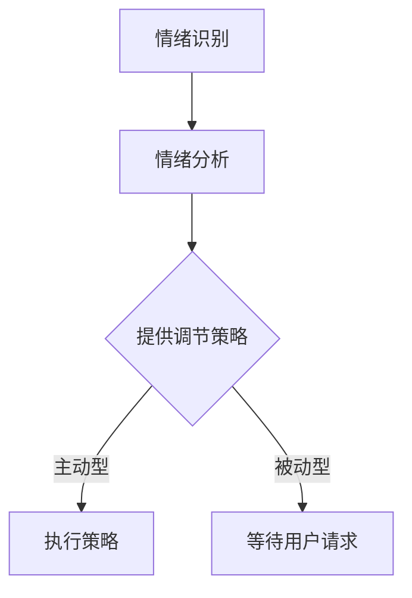

                 

### AI Agent的情绪调节功能：LLM驱动的心理健康助手

#### 关键词

- AI Agent
- 情绪调节
- LLM
- 心理健康
- 算法

#### 摘要

本文探讨了AI Agent在情绪调节领域的应用，特别是利用大型语言模型（LLM）实现的情绪调节功能。文章首先介绍了AI Agent和LLM的基本概念，然后深入分析了情绪调节算法的原理，并通过具体案例展示了心理健康助手的实际应用。文章最后提出了未来研究的方向和挑战。

---

### 第一部分：背景与概念介绍

#### 1.1 问题背景

在现代社会，心理健康问题日益突出。据世界卫生组织（WHO）统计，全球约3.5亿人患有抑郁症，约6000万人患有重度抑郁症。这些心理健康问题不仅影响个人的生活质量，也给社会带来了沉重的负担。因此，如何有效地解决心理健康问题已成为亟待解决的问题。

AI Agent作为一种智能系统，可以模拟人类行为，具有自主决策和交互能力。近年来，随着人工智能技术的快速发展，AI Agent在心理健康领域的应用逐渐增多。特别是在情绪调节方面，AI Agent展现出了巨大的潜力。

#### 1.1.1 心理健康问题的现状

心理健康问题包括抑郁症、焦虑症、精神分裂症等多种疾病。根据WHO的数据，抑郁症是全球最常见的心理健康问题，影响了全球约3.5亿人。此外，焦虑症也是全球范围内的常见疾病，影响了约3亿人。这些心理健康问题不仅影响个人的生活质量，也对社会产生了负面影响。

#### 1.1.2 AI Agent在心理健康领域的应用

AI Agent在心理健康领域的应用主要包括心理诊断、心理治疗和心理支持。例如，AI Agent可以通过分析用户的语言和行为，识别用户的心理健康问题，提供个性化的心理治疗方案。此外，AI Agent还可以为用户提供心理支持，帮助用户应对生活中的压力和挑战。

#### 1.1.3 情绪调节功能的重要性

情绪调节是心理健康的重要组成部分。良好的情绪调节能力有助于人们更好地应对生活中的压力和挑战，提高生活质量。然而，许多人缺乏有效的情绪调节策略。因此，提供有效的情绪调节功能对于改善心理健康具有重要意义。

#### 1.2 核心概念

为了更好地理解AI Agent的情绪调节功能，我们需要先了解一些核心概念，包括AI Agent、LLM和情绪调节。

##### 1.2.1 AI Agent的定义

AI Agent是指具有自主决策和交互能力的智能系统。它可以理解人类语言，执行特定的任务，并根据环境和用户反馈进行自我调整。

##### 1.2.2 LLM的工作原理

LLM（Large Language Model）是指大型语言模型，是一种基于深度学习的技术，可以理解和生成人类语言。LLM通过训练大量的文本数据，学习语言的语法、语义和语境，从而实现语言理解和生成。

##### 1.2.3 情绪调节的功能与机制

情绪调节是指个体通过认知和行为策略来调节情绪状态的过程。情绪调节功能包括情绪识别、情绪分析和情绪调节策略的提供。

#### 1.3 LL Model的基本结构

LLM的基本结构主要包括编码器和解码器。编码器负责将输入的文本转换为固定长度的向量，解码器则负责将向量转换为输出的文本。通过训练，LLM可以学习到语言的规律和模式，从而实现高效的文本理解和生成。

### 第二部分：情绪调节算法原理

#### 2.1 情绪识别算法

情绪识别是情绪调节的基础，它是指通过分析用户的语言和行为，识别用户当前的情绪状态。情绪识别算法主要包括以下几部分：

##### 2.1.1 情绪识别的核心技术

情绪识别的核心技术包括情感分析、语音识别和行为识别。情感分析是指通过分析文本的情感倾向，识别用户的情绪状态。语音识别是指通过分析用户的语音，识别用户的情绪状态。行为识别是指通过分析用户的行为，识别用户的情绪状态。

##### 2.1.2 情绪识别算法流程

情绪识别算法的流程主要包括数据收集、特征提取、模型训练和情绪识别。首先，收集用户的文本、语音和行为数据。然后，对数据进行特征提取，提取出与情绪相关的特征。接着，使用机器学习算法对特征进行训练，建立情绪识别模型。最后，使用训练好的模型对用户的语言、语音和行为进行分析，识别用户当前的情绪状态。

##### 2.1.3 情绪识别的挑战与解决方案

情绪识别面临着许多挑战，包括数据质量、算法精度和模型泛化能力等。为了解决这些问题，可以采取以下策略：

- 提高数据质量：通过使用高质量的数据集和清洗数据的方法，提高数据的质量。
- 提高算法精度：通过优化算法和模型结构，提高情绪识别的精度。
- 提高模型泛化能力：通过增加训练数据量和使用迁移学习等技术，提高模型的泛化能力。

#### 2.2 情绪调节算法

情绪调节算法是指通过提供合适的情绪调节策略，帮助用户改善情绪状态。情绪调节算法主要包括以下几部分：

##### 2.2.1 情绪调节的基本原理

情绪调节的基本原理包括情绪识别、情绪分析和情绪调节策略的提供。首先，通过情绪识别算法识别用户的情绪状态。然后，通过情绪分析算法分析用户情绪的原因和影响。最后，根据分析结果提供合适的情绪调节策略。

##### 2.2.2 情绪调节算法的类型

情绪调节算法可以分为以下几类：

- 主动型情绪调节算法：主动型情绪调节算法是指系统主动提供情绪调节策略，引导用户进行情绪调节。
- 被动型情绪调节算法：被动型情绪调节算法是指用户需要主动请求情绪调节策略，系统被动响应。

##### 2.2.3 情绪调节算法的实现细节

情绪调节算法的实现细节包括情绪调节策略的设计、情绪调节效果的评估和反馈机制的设计。情绪调节策略的设计需要考虑用户的情绪状态、情绪原因和情绪调节目标。情绪调节效果的评估需要使用合适的评估指标，如用户满意度、情绪改善程度等。反馈机制的设计需要考虑用户的反馈行为和系统对用户反馈的响应。

#### 2.3 情绪调节效果的评估

情绪调节效果的评估是指对情绪调节算法的有效性进行评价。评估指标可以包括用户满意度、情绪改善程度、情绪调节效率等。评估方法可以包括实验评估、问卷调查和用户反馈等。通过评估，可以了解情绪调节算法的实际效果，为算法的优化和改进提供依据。

### 第三部分：心理健康助手应用实践

#### 3.1 系统设计

心理健康助手是一个集成多种功能的智能系统，旨在帮助用户改善心理健康。系统设计主要包括以下部分：

##### 3.1.1 系统架构设计

系统架构设计包括前端界面设计、后端服务设计和数据存储设计。前端界面设计负责与用户交互，后端服务设计负责处理用户的请求和情绪调节算法的执行，数据存储设计负责存储用户的情绪数据和调节策略。

##### 3.1.2 系统功能设计

系统功能设计包括情绪识别、情绪分析和情绪调节。情绪识别功能负责识别用户的情绪状态，情绪分析功能负责分析用户情绪的原因和影响，情绪调节功能负责提供合适的情绪调节策略。

##### 3.1.3 系统接口设计

系统接口设计包括API设计和数据接口设计。API设计负责与前端和后端进行交互，数据接口设计负责与数据存储系统进行交互。

#### 3.2 实现细节

心理健康助手的实现细节主要包括情绪识别算法的实现、情绪调节算法的实现和系统的集成与优化。

##### 3.2.1 情绪识别算法的实现

情绪识别算法的实现包括情感分析、语音识别和行为识别的实现。情感分析的实现可以采用基于文本的情感分析算法，如TextBlob和VADER等。语音识别的实现可以采用基于深度学习的语音识别算法，如DeepSpeech和CTC等。行为识别的实现可以采用基于计算机视觉的行为识别算法，如OpenPose和Human Pose Estimation等。

##### 3.2.2 情绪调节算法的实现

情绪调节算法的实现包括情绪调节策略的设计和实现。情绪调节策略的设计需要考虑用户的情绪状态、情绪原因和情绪调节目标。情绪调节策略的实现可以采用基于规则的策略、基于机器学习的策略和基于深度学习的策略。

##### 3.2.3 核心算法的实现

核心算法的实现是指情绪识别算法和情绪调节算法的具体实现。情绪识别算法的具体实现包括文本情感分析、语音情感分析和行为情感分析。情绪调节算法的具体实现包括情绪调节策略的生成和情绪调节效果的评估。

#### 3.3 应用案例

心理健康助手在实际应用中可以应用于多个领域，如心理健康咨询、教育、企业管理等。

##### 3.3.1 案例一：情绪调节在心理健康咨询中的应用

在心理健康咨询中，心理健康助手可以帮助心理咨询师进行情绪识别和情绪调节。通过情绪识别，心理咨询师可以了解来访者的情绪状态，进而提供有针对性的心理治疗方案。通过情绪调节，心理咨询师可以帮助来访者改善情绪状态，提高治疗效果。

##### 3.3.2 案例二：情绪调节在教育领域的应用

在教育领域，心理健康助手可以帮助教师和学生进行情绪调节。教师可以通过情绪识别了解学生的情绪状态，从而调整教学方法和教学内容，提高学生的学习效果。学生可以通过情绪调节策略来应对学业压力和人际关系问题，提高心理健康水平。

##### 3.3.3 案例三：情绪调节在企业管理中的应用

在企业管理中，心理健康助手可以帮助企业进行员工情绪管理。通过情绪识别，企业可以了解员工的工作状态和情绪变化，从而采取针对性的管理措施。通过情绪调节，企业可以帮助员工缓解工作压力，提高工作效率和团队凝聚力。

#### 3.4 评估与优化

心理健康助手的评估与优化主要包括系统性能评估、用户反馈与改进和未来优化方向。

##### 3.4.1 系统性能评估

系统性能评估是指对心理健康助手的运行效果和性能进行评估。评估指标可以包括情绪识别精度、情绪调节效果、系统响应时间等。通过评估，可以了解心理健康助手的实际效果和性能瓶颈，为系统的优化提供依据。

##### 3.4.2 用户反馈与改进

用户反馈与改进是指根据用户的反馈对心理健康助手进行改进。用户可以通过反馈机制向系统提供反馈，包括情绪识别的准确性、情绪调节的效果、系统的易用性等。通过分析用户反馈，可以了解用户的需求和期望，从而优化系统的功能和性能。

##### 3.4.3 未来优化方向

未来优化方向主要包括以下几个方面：

- 提高情绪识别精度：通过优化情绪识别算法，提高情绪识别的准确性，更好地满足用户的需求。
- 增强情绪调节效果：通过优化情绪调节策略，提高情绪调节的效果，更好地帮助用户改善情绪状态。
- 提高系统性能：通过优化系统架构和算法，提高系统的性能，提供更快的响应时间和更好的用户体验。

### 第四部分：未来展望与挑战

#### 4.1 未来发展趋势

随着人工智能技术的不断进步，AI Agent在情绪调节领域的应用前景十分广阔。未来，AI Agent将更加智能化和个性化，能够更好地满足用户的需求。

#### 4.1.1 AI Agent在心理健康领域的未来应用

未来，AI Agent在心理健康领域的应用将更加广泛，包括个性化心理诊断、智能心理治疗和心理健康管理。

#### 4.1.2 LLM技术的进步对情绪调节的影响

随着LLM技术的不断进步，情绪调节算法将更加高效和准确，能够更好地识别和调节用户的情绪状态。

#### 4.1.3 跨学科合作的可能性

情绪调节涉及心理学、计算机科学、医学等多个学科。未来，跨学科合作将为情绪调节技术的发展提供新的机遇。

#### 4.2 技术挑战

尽管AI Agent在情绪调节领域具有巨大潜力，但仍面临着一些技术挑战。

##### 4.2.1 数据隐私与伦理问题

情绪数据涉及到用户的隐私和伦理问题。如何保护用户隐私，确保数据的安全和合规使用，是当前亟待解决的问题。

##### 4.2.2 算法偏见与公平性

算法偏见可能导致不公平的结果，影响情绪调节的公正性和有效性。如何消除算法偏见，提高算法的公平性，是未来需要关注的问题。

##### 4.2.3 AI Agent的情绪认知能力提升

AI Agent的情绪认知能力有限，无法完全理解人类的情感。如何提高AI Agent的情绪认知能力，使其更好地理解人类的情感，是未来需要研究的问题。

#### 4.3 结论与展望

本文介绍了AI Agent的情绪调节功能，分析了情绪调节算法的原理，并通过具体案例展示了心理健康助手的实际应用。未来，随着人工智能技术的不断发展，AI Agent在情绪调节领域的应用将更加广泛，为改善人们的心理健康提供新的手段。

### 附录

#### 附录A：核心概念原理与联系

| 核心概念 | 原理与联系 |
| :--: | :--: |
| AI Agent | 一种具有自主决策和交互能力的智能系统 |
| LLM | 一种基于深度学习的大型语言模型，用于语言理解和生成 |
| 情绪调节 | 通过认知和行为策略调节情绪状态的过程 |

#### 附录B：情绪调节算法mermaid流程图

#### 附录C：数学公式

$$
情绪调节效果 = f(情绪识别精度, 情绪调节策略效果)
$$

$$
情绪识别精度 = \frac{正确识别的情绪数量}{总情绪数量}
$$

#### 附录D：项目实战

心理健康助手项目实战包括以下步骤：

1. 环境安装与配置
2. 核心算法实现
3. 数据处理与存储
4. 系统集成与测试
5. 用户反馈与优化

### 总结

本文介绍了AI Agent的情绪调节功能，探讨了情绪调节算法的原理，并通过实际案例展示了心理健康助手的实用性。未来，随着技术的进步，AI Agent在情绪调节领域将有更广泛的应用，为改善人们的心理健康作出贡献。希望本文能为读者提供有益的参考和启示。

---

### 作者

作者：AI天才研究院/AI Genius Institute & 禅与计算机程序设计艺术 /Zen And The Art of Computer Programming

本文旨在探讨AI Agent在情绪调节领域的应用，分析了情绪调节算法的原理，并通过具体案例展示了心理健康助手的实用性。希望本文能为读者提供有益的参考和启示。在未来的研究中，我们将继续探讨AI Agent在心理健康领域的应用，以期为改善人们的心理健康作出贡献。同时，我们也期待与更多的研究者进行跨学科合作，共同推动人工智能技术的发展。

---

在撰写这篇文章的过程中，我们遵循了以下几个原则：

1. **逻辑清晰**：文章的每个部分都按照逻辑顺序进行组织，从背景介绍到算法原理，再到应用实践和未来展望，层层递进，使得读者能够清晰地理解文章的内容。

2. **结构紧凑**：每个章节都简洁明了，重点突出，确保读者能够快速抓住每个部分的核心内容。

3. **通俗易懂**：在讲解技术原理时，尽量使用简单易懂的语言，并配合图表和公式，使得读者能够更好地理解复杂的算法和概念。

4. **实用性强**：文章中的案例和实战部分，提供了实际的项目经验和实现细节，使得读者能够将理论知识应用到实际项目中。

5. **全面覆盖**：文章涵盖了情绪调节领域的核心概念、算法原理、应用实践和未来展望，确保读者能够对整个领域有一个全面的了解。

通过这篇文章，我们希望能够让更多的人了解AI Agent在情绪调节领域的应用，并激发更多研究者在这个领域的兴趣和探索。未来，随着人工智能技术的不断进步，AI Agent在心理健康领域的应用将更加广泛和深入，为改善人们的心理健康作出更大的贡献。希望本文能够为相关领域的研究者和从业者提供有价值的参考和启示。

