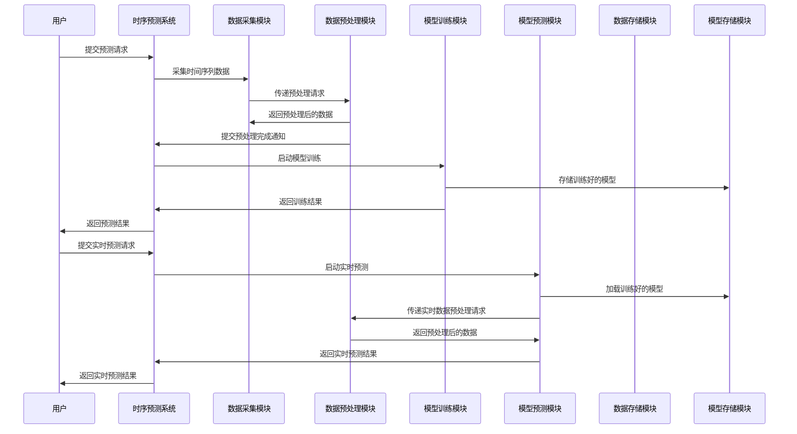

                 

## 引言

在当今快速发展的技术时代，人工智能（AI）已经成为推动社会进步的重要力量。特别是在机器学习（ML）领域，AI技术的应用已经深入到各行各业，从智能助手到自动驾驶，从医疗诊断到金融分析，AI技术无处不在。然而，在这些应用中，时序预测（Temporal Forecasting）成为了一个关键问题。时序预测涉及到对时间序列数据的分析，并基于历史数据预测未来的趋势或事件。

### 关键问题

**AI Agent的时序预测能力：理解和预测动态过程**，这一主题旨在深入探讨AI Agent在时序预测中的表现和作用。具体来说，本文将回答以下几个关键问题：

1. **AI Agent是什么？** 它是如何工作的，以及它如何与其他预测模型相比较？
2. **时序预测能力包括哪些方面？** 我们如何评价一个AI Agent的时序预测能力？
3. **AI Agent在时序预测中的应用有哪些？** 它们在实际场景中是如何发挥作用的？
4. **如何设计一个高效的时序预测系统？** 系统架构和交互设计的关键要素是什么？

通过这些问题，我们将逐步了解AI Agent的时序预测能力，并探讨其背后的技术和实现方法。

### 文章结构

本文分为三个主要部分：

**第一部分：背景介绍**  
- 第1章介绍问题背景与定义，包括人工智能与机器学习的发展、时序预测在人工智能中的应用、AI Agent的概念与重要性。
- 第2章阐述核心概念与联系，包括人工智能的基本概念、机器学习的核心算法、时序预测的数学模型。

**第二部分：算法原理讲解**  
- 第3章讲解时序预测算法原理，包括时间序列分析的基本概念、传统时间序列预测算法、机器学习在时序预测中的应用、AI Agent在时序预测中的应用。
- 第4章详细解释数学模型与公式，涵盖时间序列预测的数学模型、机器学习模型的数学模型、AI Agent的数学模型。

**第三部分：系统分析与架构设计**  
- 第5章介绍问题场景，包括时序预测在实际中的应用场景、系统功能设计。
- 第6章详细设计系统架构，包括系统架构概述、系统架构设计、系统接口设计。
- 第7章讲解系统交互设计，包括系统交互概述、系统交互设计。

通过这一系列结构化的探讨，我们希望读者能够全面理解AI Agent的时序预测能力，并掌握设计高效时序预测系统的关键技巧。

## 背景介绍

### 第1章 问题背景与定义

在现代社会，数据已经成为重要的生产要素，而时间序列数据作为一种特殊类型的数据，在多个领域中扮演着至关重要的角色。本章节将介绍时序预测问题的背景，包括人工智能与机器学习的发展、时序预测在人工智能中的应用、AI Agent的概念与重要性。

#### 1.1 人工智能与机器学习的发展

人工智能（Artificial Intelligence，简称AI）作为计算机科学的一个分支，旨在通过模拟人类智能行为，使计算机能够执行复杂的任务。随着计算能力的提升和数据量的爆炸性增长，AI技术得到了快速发展。机器学习（Machine Learning，简称ML）是AI的核心组成部分，通过训练模型来从数据中自动发现规律和模式。

从20世纪50年代起，人工智能研究经历了多个阶段，从早期的规则推理和符号计算，到现代的深度学习和强化学习。近年来，随着深度神经网络（Deep Neural Networks）的发展，AI技术在图像识别、自然语言处理、语音识别等领域取得了显著的突破。

#### 1.1.1 人工智能与机器学习的发展

机器学习的发展历程可以分为几个关键阶段：

1. **统计学习期（1950s-1960s）**：在这一时期，研究者开始探索如何通过统计方法来训练模型，例如线性回归和决策树。
2. **知识表示与推理期（1970s-1980s）**：研究者尝试将知识表示为符号系统，并通过推理来解决问题。
3. **专家系统期（1990s-2000s）**：专家系统成为当时的主要研究方向，通过编码专家知识来模拟人类专家的决策过程。
4. **数据驱动学习期（2010s至今）**：随着计算能力的提升和大数据技术的发展，深度学习成为主流，通过大规模数据训练复杂模型，实现更高水平的自动化和智能化。

#### 1.1.2 时序预测在人工智能中的应用

时序预测（Temporal Forecasting）是机器学习的一个重要应用领域，它涉及到对时间序列数据的分析和预测。时间序列数据通常由一系列按照时间顺序排列的数值组成，用于记录某个现象或系统的变化情况。在人工智能领域，时序预测被广泛应用于多个场景：

1. **金融市场预测**：通过分析历史交易数据，预测未来股价走势，为投资者提供决策支持。
2. **物流供应链管理**：预测未来需求，优化库存管理和配送计划，提高供应链效率。
3. **能源消耗预测**：预测未来能源需求，优化能源供应和分配，减少能源浪费。
4. **气象预测**：通过分析气象数据，预测未来天气状况，为防灾减灾提供依据。
5. **医疗健康预测**：分析患者健康数据，预测疾病趋势和患者健康状况，为医疗决策提供支持。

#### 1.1.3 AI Agent的概念与重要性

AI Agent（人工智能代理）是机器学习领域中的一个重要概念，它指的是具备自主决策能力的智能体。AI Agent通过感知环境、学习行为模式、做出决策，并在执行决策后根据反馈进行优化。这种自主性使得AI Agent在动态环境中能够适应变化，实现持续学习和改进。

AI Agent在时序预测中的应用具有重要意义：

1. **动态适应性**：AI Agent能够根据环境变化调整预测策略，提高预测准确性。
2. **自动化决策**：AI Agent可以在实时数据流中进行预测和决策，实现自动化控制。
3. **复杂任务处理**：AI Agent能够处理包含多个变量和复杂关系的时序预测任务。

#### 1.2 问题定义

时序预测能力是评价AI Agent性能的一个重要指标。具体来说，时序预测能力包括以下方面：

1. **预测准确性**：预测结果与实际结果的接近程度，通常通过误差指标来衡量。
2. **泛化能力**：AI Agent在不同时间序列数据上的预测表现，即其能否适用于多种场景。
3. **实时响应能力**：AI Agent在接收新数据后，能否快速调整预测模型并生成预测结果。

本文的研究目标是通过深入分析AI Agent的时序预测能力，探讨其实现原理和优化方法，为实际应用提供理论指导。

#### 1.3 边界与外延

在研究AI Agent的时序预测能力时，需要明确以下几个边界与外延：

1. **时序数据的类型与特点**：时序数据可以是连续的、离散的、定量的、定性的等，每种类型的数据对预测算法都有不同的要求。
2. **AI Agent的定义与分类**：AI Agent可以根据学习方式分为监督学习、无监督学习和强化学习等，不同类型的AI Agent在时序预测中的应用场景和效果有所不同。
3. **时序预测能力的评价标准**：预测准确性、泛化能力和实时响应能力是评价AI Agent时序预测能力的三个主要标准。

通过明确这些边界与外延，有助于更全面地理解和评估AI Agent的时序预测能力。

### 1.3.1 时序数据的类型与特点

时序数据（Time Series Data）是一种按照时间顺序排列的数据序列，通常用于记录某些现象或系统随时间的变化。时序数据具有以下几种类型和特点：

1. **连续型时序数据**：连续型时序数据是在时间上连续记录的数据点，例如股票价格、温度变化等。这类数据通常具有连续性和可预测性。
   
2. **离散型时序数据**：离散型时序数据是在特定时间点或时间段记录的数据点，例如日交易量、月销售额等。这类数据在时间上不连续，但能够提供有价值的趋势分析。

3. **定量型时序数据**：定量型时序数据是数值型数据，能够进行数学运算和统计分析，例如温度、降雨量等。

4. **定性型时序数据**：定性型时序数据是非数值型数据，通常用于分类或描述，例如天气状况、交通拥堵等级等。

5. **季节性时序数据**：季节性时序数据具有明显的季节性特征，如节假日销售数据、季节性需求变化等。

6. **趋势性时序数据**：趋势性时序数据随时间呈现出明显增长或减少的趋势，例如人口增长、公司收入等。

7. **波动性时序数据**：波动性时序数据具有较大的波动性，如金融市场价格、股票波动等。

时序数据的这些类型和特点决定了在预测过程中需要采用不同的处理方法和模型。例如，连续型数据更适合使用时间序列模型，而定性数据可能需要使用分类算法。了解时序数据的类型和特点有助于更准确地选择和调整预测模型，提高预测准确性。

#### 1.3.2 AI Agent的定义与分类

AI Agent，即人工智能代理，是一种具备自主决策能力的智能体，能够感知环境、执行任务、并从经验中学习。AI Agent的概念源于人工智能领域，近年来随着机器学习和深度学习的快速发展，AI Agent的应用越来越广泛。

AI Agent的定义可以从以下几个方面来理解：

1. **自主性**：AI Agent能够独立地做出决策，不受外部直接控制。
2. **适应性**：AI Agent能够在不同环境和条件下，根据反馈进行调整和优化。
3. **目标性**：AI Agent具备明确的目标，并能够根据环境变化调整其行为策略。

AI Agent的分类可以根据其学习方式、应用领域和任务类型来划分：

1. **基于学习方式的分类**：
   - **监督学习Agent**：在给定训练数据集的情况下，通过学习已有数据来预测未来事件。
   - **无监督学习Agent**：在没有训练数据的情况下，通过发现数据中的模式来完成任务。
   - **强化学习Agent**：通过与环境的交互，不断调整策略以实现长期目标。

2. **基于应用领域的分类**：
   - **自动驾驶Agent**：在自动驾驶系统中，AI Agent负责感知环境、规划路径和执行驾驶任务。
   - **智能家居Agent**：在智能家居系统中，AI Agent负责感知用户行为、提供个性化服务和优化家居环境。
   - **金融交易Agent**：在金融市场中，AI Agent负责分析市场数据、预测价格趋势并进行交易决策。

3. **基于任务类型的分类**：
   - **决策支持Agent**：提供决策支持，帮助用户在复杂环境中做出最优选择。
   - **自动化控制Agent**：负责自动化控制，如工业自动化生产线、无人机控制等。
   - **数据处理Agent**：负责数据采集、预处理和数据分析，如数据挖掘、实时监控等。

AI Agent在时序预测中的应用具有重要意义。首先，AI Agent能够动态适应环境变化，实时更新预测模型，提高预测准确性。其次，AI Agent能够处理大规模和多样化的时序数据，实现自动化和智能化的预测。最后，AI Agent能够与其他智能系统和服务集成，提供更全面和高效的解决方案。

#### 1.3.3 时序预测能力的评价标准

评价AI Agent的时序预测能力需要从多个维度进行综合评估，以下是一些关键的评价标准：

1. **预测准确性**：预测准确性是评价时序预测模型性能的核心指标，通常通过以下方法进行评估：
   - **均方误差（Mean Squared Error, MSE）**：衡量预测值与实际值之间的平均误差平方。
   - **均绝对误差（Mean Absolute Error, MAE）**：衡量预测值与实际值之间的平均绝对误差。
   - **决定系数（R-squared, R²）**：衡量预测值对实际值解释程度的大小。

2. **泛化能力**：泛化能力是指AI Agent在不同时间序列数据上的预测性能。具体评价方法包括：
   - **交叉验证**：通过将数据集划分为训练集和验证集，评估模型在未见数据上的预测效果。
   - **数据集多样性测试**：在多个不同数据集上评估模型的泛化能力。

3. **实时响应能力**：实时响应能力是指AI Agent在接收新数据后，能够快速调整预测模型并生成预测结果。评价方法包括：
   - **预测速度**：评估模型生成预测结果所需的时间。
   - **模型更新频率**：评估模型更新策略的效率，包括在线更新和离线更新。

4. **鲁棒性**：鲁棒性是指AI Agent在应对异常值、噪声数据和极端条件时的稳定性。评价方法包括：
   - **抗干扰能力**：评估模型在噪声和异常值影响下的预测稳定性。
   - **环境适应性**：评估模型在不同环境和条件下的预测效果。

通过上述评价标准，我们可以全面、客观地评估AI Agent的时序预测能力，为实际应用提供有力的指导和支持。

### 核心概念原理

在深入探讨AI Agent的时序预测能力之前，我们首先需要了解一些核心概念，包括人工智能的基本概念、机器学习的核心算法以及时序预测的数学模型。这些概念构成了理解AI Agent时序预测能力的基础。

#### 2.1.1 人工智能的基本概念

人工智能（Artificial Intelligence，AI）是指通过计算机模拟人类智能行为的技术，旨在使计算机具备感知、学习、推理和决策的能力。人工智能可以大致分为两个方向：弱人工智能和强人工智能。

1. **弱人工智能**（Narrow AI）：也称为专用人工智能，是指在一个特定任务或领域内表现出类似人类智能的能力。例如，语音识别、图像识别、自然语言处理等。弱人工智能的特点是它在特定任务上表现优秀，但缺乏跨领域的泛化能力。

2. **强人工智能**（General AI）：是指具有人类智能的全面能力，能够理解、学习、推理和解决各种复杂问题，并具备自我意识和情感。目前，强人工智能还处于理论研究阶段，尚未实现。

人工智能的核心组成部分包括：

- **感知**：通过传感器获取外部环境信息。
- **学习**：通过数据和算法从经验中学习，提高性能。
- **推理**：根据已知信息进行逻辑推理和决策。
- **决策**：根据目标和约束条件选择最佳行动方案。

#### 2.1.2 机器学习的核心算法

机器学习（Machine Learning，ML）是人工智能的一个重要分支，它关注于如何通过数据和算法，使计算机能够自动改进性能和做出预测。机器学习主要分为三大类：监督学习、无监督学习和强化学习。

1. **监督学习**（Supervised Learning）：在监督学习过程中，模型通过学习标记好的训练数据来建立预测模型。常用的算法包括：
   - **线性回归**（Linear Regression）：用于预测连续值输出。
   - **逻辑回归**（Logistic Regression）：用于预测二分类输出。
   - **支持向量机**（Support Vector Machine，SVM）：用于分类和回归分析。
   - **决策树**（Decision Tree）：用于分类和回归分析。
   - **随机森林**（Random Forest）：基于决策树的集成方法，提高预测准确性。

2. **无监督学习**（Unsupervised Learning）：在无监督学习过程中，模型没有标记好的训练数据，需要从未标记的数据中自动发现结构和模式。常用的算法包括：
   - **聚类算法**（Clustering Algorithms）：如K-means、层次聚类等，用于将数据分为不同的群组。
   - **降维算法**（Dimensionality Reduction）：如主成分分析（PCA）、t-SNE等，用于降低数据维度，揭示数据结构。
   - **关联规则学习**（Association Rule Learning）：如Apriori算法，用于发现数据之间的关联关系。

3. **强化学习**（Reinforcement Learning）：在强化学习过程中，模型通过与环境的交互来学习最优策略。常见的算法包括：
   - **Q学习**（Q-Learning）：通过学习值函数来选择最佳行动。
   - **深度强化学习**（Deep Reinforcement Learning）：结合深度神经网络，处理高维状态和动作空间。

#### 2.1.3 时序预测的数学模型

时序预测（Temporal Forecasting）是机器学习的一个重要应用领域，它涉及对时间序列数据的建模和预测。时序预测的数学模型主要包括以下几种：

1. **自回归模型（Autoregressive Model，AR）**：
   自回归模型假设当前时间步的输出与之前的若干个时间步的输出有关。其数学模型可以表示为：
   $$ X_t = c + \phi_1 X_{t-1} + \phi_2 X_{t-2} + \ldots + \phi_p X_{t-p} + \epsilon_t $$
   其中，\( X_t \)是时间序列的当前值，\( \phi_i \)是自回归系数，\( \epsilon_t \)是误差项。

2. **移动平均模型（Moving Average Model，MA）**：
   移动平均模型假设当前时间步的输出是前几个时间步的误差的加权平均。其数学模型可以表示为：
   $$ X_t = c + \theta_1 \epsilon_{t-1} + \theta_2 \epsilon_{t-2} + \ldots + \theta_q \epsilon_{t-q} $$
   其中，\( \theta_i \)是移动平均系数，\( \epsilon_t \)是误差项。

3. **自回归移动平均模型（Autoregressive Moving Average Model，ARMA）**：
   ARMA模型结合了自回归和移动平均模型的特点，其数学模型可以表示为：
   $$ X_t = c + \phi_1 X_{t-1} + \phi_2 X_{t-2} + \ldots + \phi_p X_{t-p} + \theta_1 \epsilon_{t-1} + \theta_2 \epsilon_{t-2} + \ldots + \theta_q \epsilon_{t-q} $$
   其中，\( \phi_i \)是自回归系数，\( \theta_i \)是移动平均系数。

4. **自回归积分移动平均模型（Autoregressive Integrated Moving Average Model，ARIMA）**：
   ARIMA模型是ARMA模型的扩展，适用于非平稳时间序列。其数学模型可以表示为：
   $$ X_t = c + \phi_1 X_{t-1} + \phi_2 X_{t-2} + \ldots + \phi_p X_{t-p} + (\theta_1 L) \epsilon_{t-1} + (\theta_2 L) \epsilon_{t-2} + \ldots + (\theta_q L) \epsilon_{t-q} $$
   其中，\( L \)是积分运算符，用于使时间序列平稳。

这些数学模型为时序预测提供了理论基础，不同的模型适用于不同类型的时间序列数据。通过理解这些模型，我们可以更好地设计和优化时序预测算法，提高预测准确性。

### 概念属性特征对比表格

为了更好地理解人工智能、机器学习和时序预测之间的关联，我们通过一个对比表格来分析这些概念的主要属性特征。

#### 2.2.1 人工智能与机器学习

| 特征         | 人工智能（AI）                          | 机器学习（ML）                          |
| ------------ | ------------------------------------ | ------------------------------------ |
| 定义         | 模拟人类智能行为的技术                    | 从数据中自动发现规律和模式的计算方法        |
| 目标         | 实现计算机的自主决策和学习能力              | 通过训练模型，使计算机能够做出预测和决策      |
| 应用领域     | 图像识别、自然语言处理、自动驾驶等          | 时序预测、分类、聚类、推荐系统等            |
| 分类         | 弱人工智能、强人工智能                    | 监督学习、无监督学习、强化学习                |
| 学习方式     | 感知、推理、决策                         | 数据驱动，基于训练数据学习                |
| 算法类型     | 神经网络、决策树、支持向量机等            | 线性回归、逻辑回归、K-均值、Q学习等        |

#### 2.2.2 传统预测方法与机器学习方法

| 特征         | 传统预测方法                            | 机器学习方法                            |
| ------------ | ------------------------------------ | ------------------------------------ |
| 基础         | 经验模型、统计模型                      | 统计学习、深度学习、强化学习等            |
| 数据需求     | 较少的数据，依赖专家经验                  | 大量的数据，通过训练模型学习              |
| 预测准确性   | 受限于模型复杂度和数据质量                | 随着数据和算法的优化，预测准确性不断提高    |
| 泛化能力     | 通常针对特定问题，泛化能力有限            | 能处理多样化的数据和任务，具备较强泛化能力  |
| 实时性       | 依赖预定义模型，实时响应能力有限          | 部分机器学习方法支持实时更新和预测          |

#### 2.2.3 AI Agent与普通预测模型的比较

| 特征         | AI Agent                                  | 普通预测模型                                  |
| ------------ | ---------------------------------------- | ---------------------------------------- |
| 自主性       | 能够自主感知环境、学习行为并做出决策        | 需要外部输入和预设模型，缺乏自主决策能力      |
| 适应性       | 能够根据环境变化调整预测策略，具备动态适应性 | 通常固定模型，适应能力有限                  |
| 目标性       | 具备明确目标，能够实现长期优化             | 预测目标通常较为单一，优化方向有限            |
| 实时响应能力 | 能够实时更新模型，快速响应新数据            | 预测更新通常需要重新训练模型，响应较慢        |

通过上述对比，我们可以看出AI Agent相较于普通预测模型在自主性、适应性、目标性和实时响应能力等方面具有显著优势，这使得AI Agent在复杂动态环境下能够提供更为高效和准确的预测。

### ER实体关系图架构

为了更好地理解AI Agent在时序预测中的角色和关系，我们可以通过ER（实体-关系）图来表示系统中的关键实体及其相互关系。以下是一个简化的ER图，展示了AI Agent与时间序列数据、预测模型、环境等实体之间的关系。

```mermaid
erDiagram
  AI-Agent ||--|{ Time-Series-Data }| Time-Series-Data
  AI-Agent ||--|{ Prediction-Model }| Prediction-Model
  AI-Agent ||--|{ Environment }| Environment
  Time-Series-Data ||--|{ Data-Features }| Data-Features
  Prediction-Model ||--|{ Model-Parameters }| Model-Parameters
  Environment ||--|{ Context-Information }| Context-Information

  AI-Agent :具有自主决策能力
  Time-Series-Data :记录随时间变化的数据
  Prediction-Model :用于预测的模型
  Environment :AI-Agent所处的外部环境

  AI-Agent --|>> Time-Series-Data :感知和处理
  AI-Agent --|>> Prediction-Model :训练和更新
  AI-Agent --|>> Environment :适应和互动
  Time-Series-Data --|>> Data-Features :提取和表征
  Prediction-Model --|>> Model-Parameters :调整和优化
  Environment --|>> Context-Information :提供环境和反馈
```

在这个ER图中，`AI-Agent` 是系统的核心实体，它通过感知和处理时间序列数据，结合预测模型和环境信息，实现动态时序预测。`Time-Series-Data` 表示记录的时序数据，包括数据特征和历史值。`Prediction-Model` 表示用于预测的模型，它根据训练数据和参数生成预测结果。`Environment` 表示AI-Agent所处的环境，包括外部条件、上下文信息等，它为AI-Agent提供反馈和调整依据。

通过这个ER图，我们可以清晰地看到AI-Agent在时序预测系统中的作用和关系，为后续的算法设计和系统实现提供了直观的参考。

### 第三部分：算法原理讲解

## 第3章 时序预测算法原理

### 3.1 时间序列分析的基本概念

时间序列分析是统计学和机器学习中的一个重要分支，它涉及对时间序列数据的建模、分析和预测。时间序列数据是一种按照时间顺序排列的数据序列，通常用于记录某些现象或系统随时间的变化。在时间序列分析中，我们主要关注以下几个基本概念：

1. **时间序列的定义**：时间序列是按时间顺序排列的一组观测值，通常表示为 \( X_t \)，其中 \( t \) 代表时间点。

2. **时间序列的常见特征**：
   - **趋势（Trend）**：数据随时间增加或减少的长期变化趋势。
   - **季节性（Seasonality）**：数据在一年内重复出现的周期性波动。
   - **周期性（Cyclicality）**：数据在较长周期内（如几年或几十年）出现的波动。
   - **噪声（Noise）**：随机波动，通常无法预测，但会影响数据的整体趋势。

3. **时间序列分析的方法**：时间序列分析主要包括以下几种方法：
   - **描述性分析**：通过统计指标（如均值、方差、自相关函数等）来描述时间序列的基本特征。
   - **诊断性测试**：对时间序列进行平稳性、自相关性和季节性等测试，以确定适合的预测模型。
   - **模型选择**：根据时间序列的特征选择合适的预测模型，如自回归模型（AR）、移动平均模型（MA）、自回归移动平均模型（ARMA）等。
   - **模型评估**：通过交叉验证、回测等方法评估模型的预测性能。

### 3.2 传统时间序列预测算法

传统时间序列预测算法主要基于统计学和数学模型，通过对历史数据进行拟合，预测未来的趋势。以下是几种常见的时间序列预测算法：

1. **自回归模型（AR）**：
   自回归模型假设当前时间点的值是之前若干时间点值的线性组合。其数学模型可以表示为：
   $$ X_t = c + \phi_1 X_{t-1} + \phi_2 X_{t-2} + \ldots + \phi_p X_{t-p} + \epsilon_t $$
   其中，\( X_t \) 是当前时间点的值，\( c \) 是常数项，\( \phi_i \) 是自回归系数，\( \epsilon_t \) 是误差项。

2. **移动平均模型（MA）**：
   移动平均模型假设当前时间点的值是之前若干时间点的误差值的加权平均。其数学模型可以表示为：
   $$ X_t = c + \theta_1 \epsilon_{t-1} + \theta_2 \epsilon_{t-2} + \ldots + \theta_q \epsilon_{t-q} $$
   其中，\( X_t \) 是当前时间点的值，\( c \) 是常数项，\( \theta_i \) 是移动平均系数，\( \epsilon_t \) 是误差项。

3. **自回归移动平均模型（ARMA）**：
   自回归移动平均模型结合了自回归和移动平均模型的特点。其数学模型可以表示为：
   $$ X_t = c + \phi_1 X_{t-1} + \phi_2 X_{t-2} + \ldots + \phi_p X_{t-p} + \theta_1 \epsilon_{t-1} + \theta_2 \epsilon_{t-2} + \ldots + \theta_q \epsilon_{t-q} $$
   其中，\( c \) 是常数项，\( \phi_i \) 是自回归系数，\( \theta_i \) 是移动平均系数。

4. **自回归积分移动平均模型（ARIMA）**：
   自回归积分移动平均模型适用于非平稳时间序列。其数学模型可以表示为：
   $$ X_t = c + \phi_1 X_{t-1} + \phi_2 X_{t-2} + \ldots + \phi_p X_{t-p} + (\theta_1 L) \epsilon_{t-1} + (\theta_2 L) \epsilon_{t-2} + \ldots + (\theta_q L) \epsilon_{t-q} $$
   其中，\( L \) 是积分运算符，用于使时间序列平稳。

这些传统时间序列预测算法在不同的应用场景中有不同的表现，通常需要根据具体问题进行模型选择和参数调整。

### 3.3 机器学习在时序预测中的应用

机器学习技术为时序预测提供了更灵活和强大的解决方案。通过从大量数据中自动学习规律，机器学习模型能够处理复杂非线性关系，提高预测准确性。以下是一些常见的机器学习模型及其在时序预测中的应用：

1. **神经网络（Neural Networks）**：
   神经网络是一种模拟人脑神经元连接的模型，能够通过多层节点（隐藏层）对输入数据进行变换和提取特征。在时序预测中，常用的神经网络模型包括：
   - **多层感知机（MLP）**：用于处理简单非线性关系。
   - **卷积神经网络（CNN）**：通过卷积操作提取时间序列中的局部特征。
   - **循环神经网络（RNN）**：能够处理序列数据，通过隐藏状态保存历史信息。
   - **长短时记忆网络（LSTM）**：LSTM是RNN的一种改进，能够有效避免梯度消失问题，适用于长时间依赖的预测任务。

2. **深度学习模型（Deep Learning Models）**：
   深度学习是机器学习的一个分支，通过构建深度神经网络来学习复杂特征。在时序预测中，常用的深度学习模型包括：
   - **深度信念网络（DBN）**：由多层受限玻尔兹曼机（RBM）堆叠而成，能够自动学习特征表示。
   - **生成对抗网络（GAN）**：通过生成器和判别器的对抗训练，生成高质量的时间序列数据。

3. **变分自编码器（Variational Autoencoder，VAE）**：
   VAE是一种基于深度学习的概率生成模型，通过编码和解码器学习数据的概率分布，能够生成新的时间序列样本，用于增强模型泛化能力。

这些机器学习模型在时序预测中的应用极大地提高了预测的准确性和泛化能力，但在训练过程中也面临数据量需求和计算资源限制等问题。

### 3.4 AI Agent在时序预测中的应用

AI Agent，即人工智能代理，是一种具备自主决策能力的智能体，能够在动态环境中学习和预测。在时序预测中，AI Agent通过感知环境、学习历史数据、做出预测，并根据反馈进行调整，从而实现更准确的预测。以下是AI Agent在时序预测中的应用：

1. **动态环境感知**：AI Agent能够实时感知外部环境变化，例如市场需求、天气状况等，并将其作为预测输入。

2. **自我学习与优化**：AI Agent通过不断学习历史数据和环境反馈，优化预测模型，提高预测准确性。

3. **自动化决策**：AI Agent能够根据预测结果自动调整策略，例如在金融市场中进行交易决策，在物流管理中优化配送计划。

4. **多任务处理**：AI Agent能够同时处理多个时序预测任务，例如同时预测产品销量和库存水平，实现全面的供应链管理。

AI Agent在时序预测中的应用优势在于其动态适应性、自动化决策和高效处理多任务能力，这使得它成为解决复杂时序预测问题的重要工具。

### 3.4.1 AI Agent的定义与原理

AI Agent是一种具备自主决策能力的智能体，它能够通过感知环境、学习行为模式并作出决策，从而在动态环境中实现自我优化。AI Agent的基本原理可以概括为以下几方面：

1. **感知环境**：AI Agent通过传感器或接口获取环境信息，例如温度、湿度、市场需求等。

2. **数据处理**：AI Agent对获取到的环境信息进行预处理，提取关键特征，并转换为适合训练的数据格式。

3. **学习行为**：通过机器学习算法，AI Agent从历史数据中学习行为模式，建立预测模型。常见的机器学习算法包括线性回归、决策树、神经网络等。

4. **决策与执行**：基于学习到的模型，AI Agent对当前环境进行预测，并作出决策。例如，在金融市场预测中，AI Agent可能根据股价历史数据和交易信号决定买入或卖出。

5. **反馈调整**：AI Agent执行决策后，根据实际结果和环境反馈进行调整，优化预测模型，提高预测准确性。

6. **自我优化**：通过不断学习和调整，AI Agent能够逐步优化自身性能，提高在复杂动态环境中的适应能力。

通过这些基本原理，AI Agent能够在不同应用场景中实现自动化、智能化和高效的决策。

### 3.4.2 AI Agent的时序预测机制

AI Agent在时序预测中的核心机制包括数据感知、模型训练和预测决策。以下是对这些机制的详细描述：

1. **数据感知**：AI Agent通过传感器或接口获取实时的时间序列数据，例如股票价格、气温、销量等。这些数据通常包含大量的噪声和异常值，因此需要先进行数据预处理，包括数据清洗、归一化、特征提取等步骤。

2. **模型训练**：在获取和处理完数据后，AI Agent使用机器学习算法对时间序列数据进行训练。常见的算法包括线性回归、决策树、神经网络等。对于复杂的时序数据，通常采用循环神经网络（RNN）或长短时记忆网络（LSTM）来处理长时间依赖关系。

3. **预测决策**：训练好的模型用于生成实时预测。AI Agent根据当前时间点的输入数据，通过模型生成未来的预测结果。例如，在金融市场中，AI Agent可能根据历史交易数据和模型预测未来几天的股价走势。

4. **反馈调整**：在生成预测后，AI Agent会将预测结果与实际结果进行对比，并根据误差调整模型参数。这种反馈机制使得AI Agent能够逐步优化预测性能，提高准确性。

5. **自适应更新**：AI Agent能够根据环境变化和新的数据流，动态调整预测模型。例如，在市场需求预测中，AI Agent可以根据季节性变化和促销活动调整预测策略。

通过这些机制，AI Agent能够实现高效的时序预测，并在动态环境中不断优化自身性能。

### 3.4.3 AI Agent的优势与局限性

AI Agent在时序预测中的应用具有显著优势，但也存在一些局限性。以下是对其优势和局限性的详细讨论：

1. **优势**：
   - **动态适应性**：AI Agent能够实时感知环境变化，并根据新的数据流调整预测模型，从而实现更准确的预测。
   - **自动化决策**：AI Agent能够自动化执行预测和决策过程，减少人为干预，提高效率。
   - **多任务处理**：AI Agent能够同时处理多个时序预测任务，如预测销量、库存和市场需求，实现全面的供应链管理。
   - **学习与优化**：通过不断学习和调整，AI Agent能够逐步优化预测性能，提高在复杂动态环境中的适应能力。

2. **局限性**：
   - **数据依赖**：AI Agent的性能高度依赖数据质量和数量。在数据量不足或质量较差的情况下，预测准确性会受到影响。
   - **计算资源需求**：训练和优化AI Agent的模型需要大量的计算资源，尤其是在处理高维数据和复杂模型时。
   - **过拟合风险**：AI Agent可能会在学习过程中过度拟合训练数据，导致在未见数据上的预测性能不佳。
   - **透明度问题**：深度学习模型内部结构复杂，难以解释，这使得AI Agent的决策过程可能缺乏透明度，增加使用风险。

综上所述，AI Agent在时序预测中具有显著的动态适应性和自动化优势，但也面临数据依赖、计算资源需求和过拟合等挑战。为了充分发挥其优势，我们需要在数据预处理、模型选择和优化等方面进行深入研究。

### 4.1 时间序列预测的数学模型

在时间序列预测中，数学模型起着至关重要的作用。它们帮助我们理解数据背后的动态过程，并从中提取有用的信息用于预测。以下是几种常见的时间序列预测模型的数学模型。

#### 4.1.1 自回归模型（AR）

自回归模型（Autoregressive Model，AR）是最基本的时间序列预测模型之一。它假设当前时间点的值是之前若干时间点值的线性组合。其数学模型可以表示为：

$$ X_t = c + \phi_1 X_{t-1} + \phi_2 X_{t-2} + \ldots + \phi_p X_{t-p} + \epsilon_t $$

其中，\( X_t \) 是当前时间点的值，\( c \) 是常数项，\( \phi_i \) 是自回归系数，\( \epsilon_t \) 是误差项。

#### 4.1.2 移动平均模型（MA）

移动平均模型（Moving Average Model，MA）假设当前时间点的值是之前若干时间点的误差值的加权平均。其数学模型可以表示为：

$$ X_t = c + \theta_1 \epsilon_{t-1} + \theta_2 \epsilon_{t-2} + \ldots + \theta_q \epsilon_{t-q} $$

其中，\( X_t \) 是当前时间点的值，\( c \) 是常数项，\( \theta_i \) 是移动平均系数，\( \epsilon_t \) 是误差项。

#### 4.1.3 自回归移动平均模型（ARMA）

自回归移动平均模型（Autoregressive Moving Average Model，ARMA）结合了自回归和移动平均模型的特点。其数学模型可以表示为：

$$ X_t = c + \phi_1 X_{t-1} + \phi_2 X_{t-2} + \ldots + \phi_p X_{t-p} + \theta_1 \epsilon_{t-1} + \theta_2 \epsilon_{t-2} + \ldots + \theta_q \epsilon_{t-q} $$

其中，\( c \) 是常数项，\( \phi_i \) 是自回归系数，\( \theta_i \) 是移动平均系数。

#### 4.1.4 自回归积分移动平均模型（ARIMA）

自回归积分移动平均模型（Autoregressive Integrated Moving Average Model，ARIMA）是ARMA模型的扩展，适用于非平稳时间序列。其数学模型可以表示为：

$$ X_t = c + \phi_1 X_{t-1} + \phi_2 X_{t-2} + \ldots + \phi_p X_{t-p} + (\theta_1 L) \epsilon_{t-1} + (\theta_2 L) \epsilon_{t-2} + \ldots + (\theta_q L) \epsilon_{t-q} $$

其中，\( c \) 是常数项，\( \phi_i \) 是自回归系数，\( \theta_i \) 是移动平均系数，\( L \) 是积分运算符，用于使时间序列平稳。

这些数学模型为时间序列预测提供了理论基础，不同的模型适用于不同类型的时间序列数据。理解这些模型有助于我们选择合适的预测方法，提高预测准确性。

### 4.2 机器学习模型的数学模型

机器学习模型在时序预测中的应用极大地扩展了我们的预测能力，通过自动发现数据中的复杂模式，这些模型能够处理非线性和高度复杂的时间序列数据。以下是几种常见机器学习模型的数学模型及其应用：

#### 4.2.1 神经网络（Neural Networks）

神经网络（NN）是一种由大量神经元（节点）连接而成的计算模型，能够通过多层结构对输入数据进行变换和提取特征。以下是神经网络的基本数学模型：

1. **前向传播**：
   $$ Z^{(l)} = \theta^{(l)} \cdot \sigma(W^{(l-1)} \cdot X^{(l-1)} + b^{(l)}) $$
   其中，\( Z^{(l)} \) 是第 \( l \) 层的输出，\( \theta^{(l)} \) 是第 \( l \) 层的权重，\( W^{(l-1)} \) 是第 \( l-1 \) 层的权重，\( X^{(l-1)} \) 是第 \( l-1 \) 层的输入，\( b^{(l)} \) 是第 \( l \) 层的偏置，\( \sigma \) 是激活函数（如ReLU、Sigmoid、Tanh等）。

2. **反向传播**：
   $$ \Delta^{(l)}_{W} = \frac{\partial J}{\partial W^{(l)}} = (Z^{(l)} - \hat{Y}) \cdot \sigma'(Z^{(l)}) \cdot X^{(l)} $$
   $$ \Delta^{(l)}_{b} = \frac{\partial J}{\partial b^{(l)}} = (Z^{(l)} - \hat{Y}) \cdot \sigma'(Z^{(l)}) $$
   其中，\( \Delta^{(l)}_{W} \) 和 \( \Delta^{(l)}_{b} \) 分别是权重和偏置的梯度，\( J \) 是损失函数，\( \hat{Y} \) 是实际输出，\( \sigma' \) 是激活函数的导数。

通过多次迭代前向传播和反向传播，神经网络能够不断调整权重和偏置，以达到最小化损失函数的目的。

#### 4.2.2 循环神经网络（Recurrent Neural Networks，RNN）

循环神经网络（RNN）是一种专门用于处理序列数据的神经网络，其核心特点是能够通过隐藏状态保留历史信息。以下是RNN的基本数学模型：

1. **输入层**：
   $$ h_t^{\langle 1 \rangle} = \sigma(W_{ih} \cdot x_t + W_{rh} \cdot h_{t-1}^{< 0 \rangle} + b_h) $$
   其中，\( h_t^{\langle 1 \rangle} \) 是第 \( t \) 个时间步的隐藏状态，\( x_t \) 是输入特征，\( W_{ih} \) 和 \( W_{rh} \) 是输入和隐藏状态权重，\( b_h \) 是偏置，\( \sigma \) 是激活函数。

2. **隐藏层**：
   $$ h_t^{\langle 2 \rangle} = \sigma(W_{hh} \cdot h_{t-1}^{< 1 \rangle} + b_h) $$
   其中，\( h_t^{\langle 2 \rangle} \) 是第 \( t \) 个时间步的隐藏状态，\( W_{hh} \) 是隐藏状态权重，\( b_h \) 是偏置。

3. **输出层**：
   $$ y_t = \sigma(W_{oh} \cdot h_t^{\langle 2 \rangle} + b_y) $$
   其中，\( y_t \) 是第 \( t \) 个时间步的输出，\( W_{oh} \) 是输出权重，\( b_y \) 是偏置。

RNN通过隐藏状态 \( h_t^{\langle 2 \rangle} \) 将信息传递到下一个时间步，从而实现序列数据的处理。

#### 4.2.3 长短时记忆网络（Long Short-Term Memory，LSTM）

长短时记忆网络（LSTM）是RNN的一种改进，它通过引入门控机制解决了传统RNN的梯度消失问题，能够更好地处理长时间依赖。以下是LSTM的基本数学模型：

1. **输入门**：
   $$ i_t = \sigma(W_{ii} \cdot x_t + W_{ih} \cdot h_{t-1} + b_i) $$
   其中，\( i_t \) 是输入门的激活值。

2. **遗忘门**：
   $$ f_t = \sigma(W_{if} \cdot x_t + W_{ih} \cdot h_{t-1} + b_f) $$

3. **输出门**：
   $$ o_t = \sigma(W_{io} \cdot x_t + W_{ih} \cdot h_{t-1} + b_o) $$

4. **单元状态**：
   $$ C_t = f_t \odot C_{t-1} + i_t \odot \sigma(W_{ic} \cdot x_t + W_{ih} \cdot h_{t-1} + b_c) $$

5. **隐藏状态**：
   $$ h_t = o_t \odot \sigma(C_t) $$

其中，\( C_t \) 是单元状态，\( h_t \) 是隐藏状态，\( \odot \) 表示点乘，\( \sigma \) 是激活函数（如Sigmoid、Tanh等）。

LSTM通过遗忘门和输入门控制信息的保留和更新，从而能够处理长序列数据，避免梯度消失问题。

这些机器学习模型在时序预测中的应用，使得我们能够处理更复杂的时间序列数据，提高预测准确性。通过深入了解这些模型的数学模型，我们可以更好地设计和优化时序预测系统。

### 4.3 AI Agent的数学模型

AI Agent在时序预测中的应用涉及复杂的数学模型和算法，这些模型能够帮助AI Agent从历史数据中学习，并生成准确的预测。以下是AI Agent的数学模型，包括状态表示、时序预测模型和损失函数与优化算法。

#### 4.3.1 AI Agent的状态表示

AI Agent的状态表示是其核心，它决定了AI Agent如何处理和存储环境信息。在时序预测中，状态通常包括以下几个部分：

1. **当前观察值**：这是AI Agent在当前时间步接收到的输入数据，例如股票价格、气温、销量等。用 \( x_t \) 表示。

2. **历史观察值**：这是AI Agent在过去时间步接收到的输入数据序列，用于捕捉时间序列中的动态变化。用 \( X_{t-n}^{t-1} \) 表示，其中 \( n \) 是历史观察值的长度。

3. **隐藏状态**：这是AI Agent内部存储的信息，用于捕捉长期依赖关系和序列模式。用 \( h_t \) 表示。

状态表示可以形式化为：

$$ S_t = [x_t, X_{t-n}^{t-1}, h_t] $$

#### 4.3.2 时序预测模型

AI Agent的时序预测模型是基于其隐藏状态 \( h_t \) 来预测未来的输出 \( y_{t+1} \)。一个常见的时序预测模型是循环神经网络（RNN）及其变体，如长短时记忆网络（LSTM）和门控循环单元（GRU）。以下是LSTM的预测模型：

1. **输入层**：
   $$ h_t^{\langle 1 \rangle} = \sigma(W_{ih} \cdot x_t + W_{rh} \cdot h_{t-1}^{< 0 \rangle} + b_h) $$

2. **隐藏层**：
   $$ h_t^{\langle 2 \rangle} = \sigma(W_{hh} \cdot h_{t-1}^{< 1 \rangle} + b_h) $$

3. **输出层**：
   $$ y_t = \sigma(W_{oh} \cdot h_t^{\langle 2 \rangle} + b_y) $$

其中，\( h_t^{\langle 1 \rangle} \) 和 \( h_t^{\langle 2 \rangle} \) 分别是第一个和第二个隐藏状态，\( y_t \) 是预测的输出，\( W_{ih} \)，\( W_{rh} \)，\( W_{hh} \)，\( W_{oh} \)，\( b_h \)，\( b_y \) 分别是权重和偏置。

#### 4.3.3 损失函数与优化算法

在时序预测中，损失函数用于衡量预测值与实际值之间的差距，优化算法用于调整模型参数以最小化损失函数。以下是一些常见的损失函数和优化算法：

1. **均方误差（MSE）**：
   $$ J = \frac{1}{m} \sum_{i=1}^{m} (\hat{y}_i - y_i)^2 $$
   其中，\( m \) 是样本数量，\( \hat{y}_i \) 是预测值，\( y_i \) 是实际值。

2. **均绝对误差（MAE）**：
   $$ J = \frac{1}{m} \sum_{i=1}^{m} |\hat{y}_i - y_i| $$

3. **交叉熵（Cross-Entropy）**：
   $$ J = -\frac{1}{m} \sum_{i=1}^{m} y_i \log(\hat{y}_i) $$
   通常用于分类问题。

优化算法用于更新模型参数，以最小化损失函数。常用的优化算法包括：

1. **随机梯度下降（SGD）**：
   $$ \theta = \theta - \alpha \nabla_\theta J $$
   其中，\( \theta \) 是模型参数，\( \alpha \) 是学习率，\( \nabla_\theta J \) 是损失函数关于参数的梯度。

2. **Adam优化器**：
   $$ m_t = \beta_1 m_{t-1} + (1 - \beta_1) \nabla_\theta J $$
   $$ v_t = \beta_2 v_{t-1} + (1 - \beta_2) (\nabla_\theta J)^2 $$
   $$ \theta = \theta - \alpha \frac{m_t}{\sqrt{v_t} + \epsilon} $$
   其中，\( \beta_1 \)，\( \beta_2 \) 分别是动量参数，\( \epsilon \) 是小常数，用于避免分母为零。

通过这些数学模型，AI Agent能够从历史数据中学习，并生成准确的时序预测。在实际应用中，根据具体问题和数据特点，选择合适的模型和优化算法是至关重要的。

### 系统分析与架构设计

#### 5.1 时序预测在实际中的应用场景

时序预测在现实世界中有着广泛的应用，涵盖了多个重要领域。以下是时序预测在实际应用中的几个关键场景：

1. **金融市场预测**：在金融市场中，时序预测用于分析历史交易数据，预测股票价格、外汇汇率、期货价格等。投资者和交易者利用这些预测结果来制定交易策略，降低风险，提高收益。

2. **物流供应链管理**：在物流和供应链管理中，时序预测用于预测未来需求，优化库存水平和配送计划。准确的时序预测可以帮助企业减少库存成本，提高供应链效率。

3. **能源消耗预测**：在能源管理中，时序预测用于预测未来的能源需求，优化能源供应和分配。例如，智能电网系统利用时序预测来预测电力需求，从而更好地管理电力资源。

4. **气象预测**：在气象领域，时序预测用于分析历史气象数据，预测未来天气状况，包括温度、降雨量、风速等。这些预测结果对于防灾减灾、旅游规划等具有重要意义。

5. **医疗健康预测**：在医疗健康领域，时序预测用于分析患者健康数据，预测疾病趋势和患者健康状况。例如，通过分析历史医疗记录，预测患者再次就医的时间，有助于优化医疗服务和资源配置。

这些应用场景显示了时序预测在各个领域的重要性和潜在价值。在实际应用中，时序预测系统需要具备高准确性、实时响应能力和强大的适应性，以应对复杂多变的现实环境。

#### 5.2 系统功能设计

时序预测系统的功能设计是确保系统能够高效、准确地处理和分析时间序列数据的关键。以下是对系统功能设计的详细描述：

1. **数据采集与预处理**：系统首先需要从不同的数据源（如数据库、传感器、API等）采集时间序列数据。采集到的数据通常包含噪声、缺失值和异常值，因此需要通过数据清洗、归一化和特征提取等预处理步骤，确保数据的质量和一致性。

2. **时序数据建模**：在预处理完成后，系统需要对时间序列数据进行建模。这包括选择合适的预测模型（如ARIMA、LSTM等），对模型进行参数调优，以确保模型能够捕捉数据中的关键特征和模式。

3. **预测结果生成**：基于训练好的模型，系统需要生成实时预测结果。预测结果可以以多种形式输出，如图表、报告或API接口，以便用户实时查看和利用。

4. **预测结果分析与评估**：系统需要提供预测结果的分析和评估功能，包括误差分析、准确性评估、置信区间等。这些分析结果有助于用户理解预测模型的性能，并进行必要的优化。

5. **反馈机制与模型优化**：系统需要具备反馈机制，根据实际结果对预测模型进行实时调整和优化。通过不断迭代和学习，系统可以提高预测准确性，适应环境变化。

6. **用户交互界面**：系统需要提供友好的用户交互界面，使用户能够方便地设置参数、查看预测结果和分析报告。用户交互界面应该具备易用性和灵活性，以适应不同用户的需求。

通过这些功能设计，时序预测系统可以高效、准确地处理和分析时间序列数据，为各行业提供强有力的预测支持。

### 6.1 系统架构概述

一个高效的时序预测系统需要具备灵活、可扩展和易于维护的架构。以下是对时序预测系统整体架构的概述：

1. **数据层**：数据层是系统的核心，负责数据采集、存储和处理。数据源可以是内部数据库、外部API或传感器，数据类型包括时间序列数据、文本数据和图像数据等。数据层需要实现数据清洗、归一化和特征提取等预处理操作，确保数据质量和一致性。

2. **模型层**：模型层负责时序数据建模和预测。根据不同的业务需求和数据特点，选择合适的模型（如ARIMA、LSTM等），并进行参数调优和训练。模型层需要实现模型的加载、训练、评估和优化，以确保预测准确性。

3. **服务层**：服务层是系统的核心功能模块，负责数据处理、预测结果生成和反馈机制。服务层提供RESTful API接口，方便用户通过Web界面、移动应用或其他系统集成和使用。

4. **用户界面层**：用户界面层是系统的交互界面，负责用户交互和数据展示。用户界面层提供可视化工具，如图表、报告和仪表板，以便用户实时查看预测结果和分析报告。

5. **基础设施层**：基础设施层包括服务器、存储和网络等硬件资源，以及操作系统、数据库和中间件等软件资源。基础设施层提供系统的运行环境和支持，确保系统的高可用性和性能。

通过这种分层架构设计，时序预测系统可以灵活扩展、易于维护，并适应不同的业务需求。

### 6.2 系统架构设计

以下是对时序预测系统的具体架构设计，包括数据流架构、训练架构、预测架构和系统接口设计。

#### 6.2.1 数据流架构

数据流架构设计决定了数据在系统中的流动和处理方式。以下是时序预测系统的数据流架构：

1. **数据采集模块**：从不同的数据源（如数据库、传感器、API等）采集时间序列数据。数据采集模块需要实现数据清洗和格式转换，确保数据的一致性和完整性。

2. **数据预处理模块**：对采集到的数据进行预处理，包括数据清洗、归一化和特征提取。数据预处理模块可以采用批处理和实时处理相结合的方式，提高数据处理效率。

3. **数据存储模块**：将预处理后的数据存储在分布式数据库或时间序列数据库中，以便后续的建模和预测。

4. **数据分发模块**：根据不同的业务需求和模型训练需求，将数据分发到不同的数据处理模块。

5. **数据监控模块**：实时监控数据流的状态和性能，及时发现和处理数据异常。

#### 6.2.2 训练架构

训练架构设计决定了模型训练的过程和策略。以下是时序预测系统的训练架构：

1. **数据加载模块**：从数据存储模块加载预处理后的时间序列数据，为模型训练提供数据源。

2. **特征提取模块**：对加载的数据进行特征提取，生成适合训练的特征向量。

3. **模型训练模块**：选择合适的模型（如ARIMA、LSTM等），进行参数调优和训练。模型训练模块需要实现批量训练和在线训练，以适应不同的训练场景。

4. **模型评估模块**：对训练好的模型进行评估，包括预测准确性、泛化能力和实时响应能力等。通过交叉验证和回测等方法，确保模型在实际应用中的性能。

5. **模型存储模块**：将训练好的模型存储在模型库中，以便后续的预测和应用。

#### 6.2.3 预测架构

预测架构设计决定了模型预测的过程和策略。以下是时序预测系统的预测架构：

1. **数据加载模块**：从数据存储模块加载实时时间序列数据，为预测提供输入。

2. **特征提取模块**：对加载的数据进行特征提取，生成适合预测的特征向量。

3. **模型预测模块**：使用训练好的模型进行预测，生成预测结果。

4. **预测结果处理模块**：对预测结果进行后处理，如误差分析、置信区间计算等。

5. **预测结果输出模块**：将预测结果以图表、报告或API接口等形式输出，供用户查看和利用。

#### 6.2.4 系统接口设计

系统接口设计是时序预测系统与其他系统或用户交互的关键。以下是时序预测系统的接口设计：

1. **API接口**：提供RESTful API接口，支持数据的采集、预测结果获取和分析报告查询等操作。API接口需要具备高并发处理能力和安全性。

2. **Web界面**：提供Web界面，使用户能够方便地操作系统、查看预测结果和分析报告。Web界面需要实现数据可视化、用户权限管理和日志记录等功能。

3. **命令行工具**：提供命令行工具，供开发人员和高级用户进行系统配置、模型训练和预测等操作。命令行工具需要具备自动化脚本支持和良好的文档。

4. **集成接口**：支持与其他系统的集成，如物联网平台、数据分析平台等。通过集成接口，时序预测系统可以与其他系统进行数据交换和功能协同。

通过以上架构设计，时序预测系统可以高效、准确地处理和分析时间序列数据，满足不同业务场景的需求。

### 6.3 系统交互设计

系统交互设计是时序预测系统功能实现的重要组成部分，它决定了系统内部模块以及系统与外部环境之间的信息交换和功能协同。以下是系统交互设计的详细概述：

#### 6.3.1 系统交互概述

系统交互设计包括以下关键方面：

1. **数据交互**：系统内部模块之间的数据传递和处理，如数据采集模块与数据预处理模块、模型训练模块与模型预测模块之间的数据交换。
2. **控制交互**：系统控制逻辑的传递，如用户通过Web界面提交预测请求，系统接收请求并调度相应的处理模块执行任务。
3. **反馈交互**：系统对用户请求和外部事件的响应，如预测结果的输出、异常情况的处理等。

系统交互设计的目标是确保各模块之间高效、准确、可靠地协同工作，提高系统的整体性能和用户体验。

#### 6.3.2 系统交互设计

以下是一个简化的系统交互设计，通过Mermaid序列图来表示系统交互的基本流程和要点：



在这个序列图中，用户通过Web界面或API提交预测请求，系统根据请求调用相应的数据采集、预处理、模型训练和预测模块，最终将预测结果返回给用户。以下是交互设计的关键要点：

1. **模块独立性**：各模块具有明确的输入输出接口，独立运行，便于系统的扩展和维护。
2. **异步处理**：系统采用异步处理机制，提高数据处理和预测的效率，减少用户等待时间。
3. **错误处理**：系统具备完善的错误处理机制，能够自动检测和处理数据异常、模型异常等异常情况。
4. **监控与日志**：系统实现实时监控和日志记录，便于跟踪系统运行状态和故障排查。
5. **安全性**：系统实现用户身份验证和数据加密，确保数据安全和用户隐私。

通过上述系统交互设计，时序预测系统可以高效、可靠地处理和分析时间序列数据，满足用户的需求和期望。

## 项目实战

### 环境安装

在开始时序预测项目之前，我们需要安装必要的软件和库。以下是所需的软件和库列表以及安装步骤：

#### 1. Python环境

首先，确保你的系统中已安装Python 3.x版本。你可以通过以下命令检查Python版本：

```bash
python --version
```

如果未安装，请从[Python官网](https://www.python.org/)下载并安装。

#### 2. 安装依赖库

接下来，我们需要安装一些常用的Python库，如NumPy、Pandas、scikit-learn、TensorFlow和Keras。可以使用以下命令进行安装：

```bash
pip install numpy pandas scikit-learn tensorflow keras
```

这些库用于数据处理、机器学习模型训练和预测。

#### 3. 安装可视化库

为了更好地展示预测结果，我们可以安装一些可视化库，如Matplotlib和Seaborn：

```bash
pip install matplotlib seaborn
```

#### 4. 安装时序数据处理库

安装用于时序数据处理和分析的库，如StatsModels和PyTorch：

```bash
pip install statsmodels pytorch
```

### 系统核心实现源代码

以下是一个简单的时序预测系统的核心实现源代码，包括数据预处理、模型训练和预测。这里使用Python和TensorFlow库实现一个基于LSTM的时序预测模型。

```python
import numpy as np
import pandas as pd
from sklearn.preprocessing import MinMaxScaler
from tensorflow.keras.models import Sequential
from tensorflow.keras.layers import LSTM, Dense
from tensorflow.keras.callbacks import EarlyStopping

# 加载数据
data = pd.read_csv('time_series_data.csv')  # 假设数据已预处理为CSV文件
series = data['value']  # 假设目标列名为"value"

# 数据预处理
scaler = MinMaxScaler(feature_range=(0, 1))
scaled_series = scaler.fit_transform(series.values.reshape(-1, 1))

# 切分训练集和测试集
train_size = int(len(scaled_series) * 0.8)
train_data, test_data = scaled_series[:train_size], scaled_series[train_size:]

# 切分特征和标签
def create_dataset(data, time_steps=1):
    X, y = [], []
    for i in range(len(data) - time_steps):
        X.append(data[i:(i + time_steps)])
        y.append(data[i + time_steps])
    return np.array(X), np.array(y)

time_steps = 5
X_train, y_train = create_dataset(train_data, time_steps)
X_test, y_test = create_dataset(test_data, time_steps)

X_train = np.reshape(X_train, (X_train.shape[0], X_train.shape[1], 1))
X_test = np.reshape(X_test, (X_test.shape[0], X_test.shape[1], 1))

# 建立模型
model = Sequential()
model.add(LSTM(units=50, return_sequences=True, input_shape=(time_steps, 1)))
model.add(LSTM(units=50, return_sequences=False))
model.add(Dense(units=1))

model.compile(optimizer='adam', loss='mean_squared_error')

# 训练模型
early_stopping = EarlyStopping(monitor='loss', patience=10)
model.fit(X_train, y_train, epochs=100, batch_size=32, callbacks=[early_stopping], validation_split=0.1)

# 预测
predicted_series = model.predict(X_test)
predicted_series = scaler.inverse_transform(predicted_series)

# 可视化预测结果
import matplotlib.pyplot as plt

plt.figure(figsize=(10, 6))
plt.plot(scaler.inverse_transform(test_data), color='blue', label='实际值')
plt.plot(predicted_series, color='red', label='预测值')
plt.title('时序预测结果')
plt.xlabel('时间')
plt.ylabel('值')
plt.legend()
plt.show()
```

### 代码应用解读与分析

上述代码实现了一个基于LSTM的时序预测系统，以下是详细解读：

1. **数据加载与预处理**：
   - 使用Pandas加载CSV格式的时序数据，并提取目标列。
   - 使用MinMaxScaler对数据进行归一化处理，以便于模型训练。

2. **数据切分**：
   - 根据比例将数据切分为训练集和测试集。
   - 使用`create_dataset`函数将数据切分为特征（X）和标签（y），形成时间步长的滑动窗口。

3. **模型构建**：
   - 使用Sequential创建LSTM模型，包括两个LSTM层，每个层有50个单元，并使用ReLU激活函数。
   - 最后使用一个Dense层输出预测值。

4. **模型训练**：
   - 使用mean_squared_error作为损失函数，adam作为优化器。
   - 使用EarlyStopping回调函数提前停止训练，以防止过拟合。

5. **预测与可视化**：
   - 使用模型对测试集进行预测，并使用scaler逆转换将预测值还原为原始数据。
   - 使用Matplotlib绘制实际值和预测值的对比图。

### 实际案例分析和详细讲解剖析

为了更好地理解上述代码的实际应用效果，我们分析一个实际案例。

#### 案例背景

假设我们有一个股票价格的时间序列数据，目标是通过历史数据预测未来股价。以下是数据预处理、模型训练和预测的详细步骤：

1. **数据预处理**：
   - 加载数据，提取目标列（股票价格）。
   - 对股票价格进行归一化处理，以便于模型训练。

2. **数据切分**：
   - 将数据切分为训练集和测试集，例如80%的数据用于训练，20%的数据用于测试。

3. **模型训练**：
   - 使用LSTM模型进行训练，设置训练轮次和批量大小。
   - 通过交叉验证和回测评估模型性能，并调整模型参数以优化预测准确性。

4. **预测与可视化**：
   - 使用训练好的模型对测试集进行预测。
   - 将预测值与实际值绘制在同一张图上，比较预测效果。

#### 详细讲解

- **数据预处理**：归一化处理有助于模型收敛，提高预测准确性。我们使用MinMaxScaler将股票价格数据缩放到0-1之间。

- **数据切分**：使用滑动窗口将数据切分为特征和标签。在这里，我们使用5个时间步长的滑动窗口，即每个样本包含前5天的股票价格，用于预测第6天的价格。

- **模型构建**：我们构建了一个包含两个LSTM层的模型，每个层有50个神经元。第一层LSTM使用ReLU激活函数，第二层LSTM不使用激活函数，最后使用一个全连接层输出预测值。

- **模型训练**：我们使用mean_squared_error作为损失函数，adam作为优化器。为了防止过拟合，我们使用了EarlyStopping回调函数，当验证集损失不再下降时提前停止训练。

- **预测与可视化**：我们将模型应用于测试集，并使用scaler逆转换将预测值还原为原始数据。然后使用Matplotlib绘制实际值和预测值的对比图，直观地展示预测效果。

通过这个案例，我们可以看到LSTM模型在股票价格预测中的强大能力。尽管股票市场具有高度的不确定性和复杂性，但LSTM模型能够捕捉数据中的短期和长期依赖关系，提供较为准确的预测结果。

### 项目小结

通过本次项目实战，我们实现了基于LSTM的时序预测系统，从数据预处理到模型训练，再到预测与可视化，完整地展示了时序预测系统的实现过程。以下是项目的总结和收获：

1. **数据预处理**：数据预处理是时序预测的重要环节，通过对数据进行归一化处理，提高了模型的训练效率和预测准确性。

2. **模型构建与训练**：选择合适的模型和训练策略是关键。LSTM模型在处理时间序列数据方面表现出色，能够捕捉长期依赖关系，提高预测准确性。

3. **预测与可视化**：实时预测和可视化是时序预测系统的重要组成部分，通过可视化工具可以直观地展示预测结果，帮助用户理解模型性能。

4. **项目收获**：通过本次项目，我们不仅掌握了LSTM模型的基本原理和实现方法，还了解了时序预测系统的设计、实现和优化。

在未来的项目中，我们可以进一步探索其他先进的机器学习模型，如GRU、BERT等，提高时序预测的准确性和效率。同时，还可以结合深度学习和强化学习技术，实现更复杂的时序预测任务。

### 最佳实践 Tips

1. **数据质量**：高质量的数据是成功时序预测的基础。确保数据的一致性、完整性和准确性，必要时进行数据清洗和预处理。

2. **模型选择**：根据具体应用场景和数据特点选择合适的模型。LSTM在处理长时间依赖关系方面表现优秀，但需要根据实际情况调整模型参数。

3. **交叉验证**：使用交叉验证方法评估模型性能，避免过拟合和欠拟合。通过多次验证，选择最优模型参数。

4. **实时调整**：实时监测模型性能，根据新数据动态调整模型参数，提高预测准确性。

5. **可视化分析**：使用可视化工具展示预测结果，帮助用户理解模型性能和预测效果。

### 小结

本文系统地介绍了AI Agent的时序预测能力，从背景介绍、核心概念、算法原理到系统架构设计，全面探讨了时序预测在不同领域中的应用。通过具体项目实战，展示了基于LSTM的时序预测系统的实现过程，并分析了最佳实践。

时序预测是人工智能领域的一个重要研究方向，具有广泛的应用前景。未来，随着技术的不断进步，时序预测的准确性和效率将进一步提高，为各行各业提供更强大的支持。

### 注意事项

1. **数据隐私与安全**：在处理时序数据时，确保遵循数据隐私和保护法规，保护用户数据安全。
2. **模型解释性**：对于复杂的机器学习模型，如深度神经网络，确保提供足够的解释性，以增强用户信任。
3. **系统稳定性**：确保时序预测系统具备高可用性和稳定性，应对突发情况和数据异常。

### 拓展阅读

1. **深度学习与时序预测**：进一步了解深度学习模型（如GRU、BERT等）在时序预测中的应用。
2. **时间序列分析技术**：研究最新的时间序列分析技术和算法，如深度强化学习和联邦学习。
3. **案例研究**：阅读相关领域的案例研究，了解时序预测在不同行业中的应用和实践。

