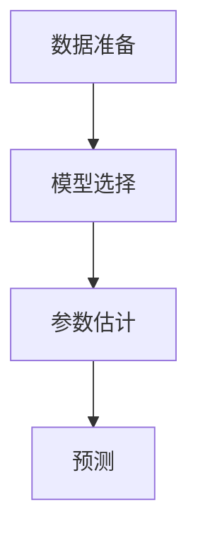
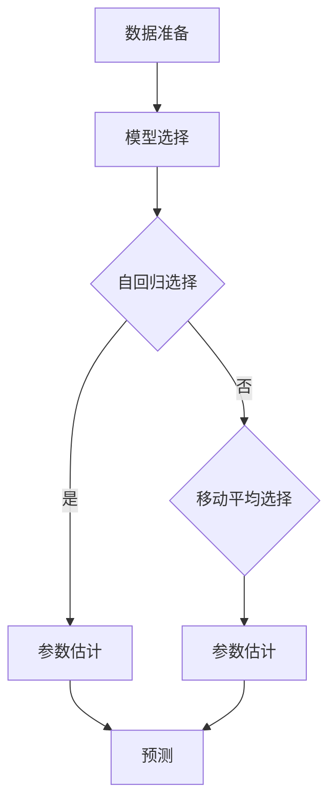
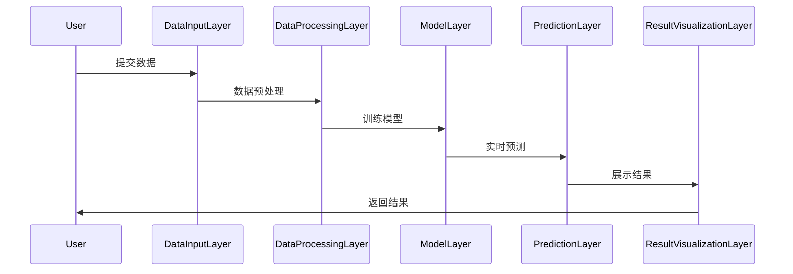

                 

## 引言

在当今技术飞速发展的时代，人工智能（AI）已经成为了推动科技进步的重要力量。从智能家居到自动驾驶，从医疗诊断到金融分析，AI的触角几乎触及了社会的每一个角落。然而，AI的这些应用背后都离不开一个核心功能——时间序列预测。时间序列预测是AI领域中一个重要的研究方向，它能够帮助我们根据历史数据预测未来的趋势，为决策提供科学依据。

### 1.1 问题背景

时间序列预测的应用范围广泛，例如在股市预测中，通过对历史股价的分析来预测未来的走势；在天气预测中，通过历史气象数据来预测未来的天气变化；在电力系统中，通过历史用电量数据来预测未来的电力需求。然而，时间序列预测并不是一件简单的事情。它面临着数据噪声、非线性和多尺度变化等多重挑战。如何有效地处理这些挑战，开发出强大的时间序列预测能力，成为了AI研究者和工程师们的重要课题。

### 1.2 AI Agent的概念

AI Agent是指具有自主决策和执行能力的智能实体。在时间序列预测中，AI Agent可以通过学习历史数据，提取数据中的规律，进而对未来进行预测。AI Agent具有以下几个特点：

- **自主性**：能够独立地做出决策，而不需要人类的干预。
- **适应性**：能够根据新的数据进行自我调整，提高预测的准确性。
- **实时性**：能够快速地对新数据进行处理和预测，以适应动态变化的环境。

### 1.3 时间序列预测的重要性

时间序列预测在许多领域都有着重要的应用价值。以下是一些典型的应用场景：

- **金融市场**：通过对历史股价、交易量等数据进行分析，预测未来的股市走势，帮助投资者做出更明智的投资决策。
- **物流运输**：通过对历史货运量、交通流量等数据进行分析，预测未来的物流需求和交通状况，优化运输路线和资源分配。
- **天气预报**：通过对历史气象数据进行分析，预测未来的天气变化，为公众提供准确的天气预报，减少自然灾害带来的损失。
- **能源管理**：通过对历史用电量、天然气消耗等数据进行分析，预测未来的能源需求，优化能源生产和分配策略。

总之，时间序列预测在AI领域中具有广泛的应用前景和重要的研究价值。通过开发强大的时间序列预测能力，我们可以更好地应对复杂多变的环境，做出更加科学和准确的决策。

---

## 时间序列预测核心概念与算法

时间序列预测作为AI领域的重要组成部分，其核心概念和算法的设计与实现是预测准确性的关键。在本章中，我们将详细介绍时间序列预测中的核心概念，包括自回归模型（AR）、移动平均模型（MA）和自回归移动平均模型（ARMA），并对比这些模型的特点。此外，还将通过ER实体关系图展示这些模型之间的关系。

### 2.1 时间序列基础概念

时间序列是指一系列按时间顺序排列的数据点。这些数据点可以表示任何随时间变化的现象，如股票价格、温度、销量等。时间序列数据具有以下几个基本特征：

- **时间依赖性**：时间序列中的每个数据点都依赖于其前一个或多个数据点。
- **趋势性**：时间序列数据可能表现出增长、减少或稳定的趋势。
- **季节性**：时间序列数据可能受季节性因素的影响，如节假日、季节变化等。
- **噪声**：时间序列数据中通常包含一些随机噪声，这些噪声可能会干扰预测结果。

在时间序列预测中，我们通常希望提取数据中的有用信息，预测未来的趋势。这就需要借助各种数学模型和算法来处理和建模时间序列数据。

### 2.2 自回归模型（AR）

自回归模型（Autoregressive Model，AR）是一种基于历史值预测未来值的时间序列模型。它的基本思想是当前值可以表示为前几个历史值的线性组合。AR模型的一般形式如下：

\[ X_t = c + \phi_1 X_{t-1} + \phi_2 X_{t-2} + \ldots + \phi_p X_{t-p} + \epsilon_t \]

其中，\(X_t\) 是时间序列的当前值，\(c\) 是常数项，\(\phi_1, \phi_2, \ldots, \phi_p\) 是自回归系数，\(p\) 是模型的阶数，\(\epsilon_t\) 是随机误差项。

**特点**：

- **线性关系**：AR模型假设时间序列中的数据点之间存在线性关系。
- **稳定性**：AR模型的稳定性取决于自回归系数的取值。当所有自回归系数的绝对值小于1时，模型是稳定的。
- **简单性**：AR模型相对简单，易于理解和实现。

### 2.3 移动平均模型（MA）

移动平均模型（Moving Average Model，MA）是一种基于过去误差值预测当前值的时间序列模型。它的基本思想是当前值可以通过过去误差值的加权平均来预测。MA模型的一般形式如下：

\[ X_t = \mu + \theta_1 \epsilon_{t-1} + \theta_2 \epsilon_{t-2} + \ldots + \theta_q \epsilon_{t-q} + \epsilon_t \]

其中，\(X_t\) 是时间序列的当前值，\(\mu\) 是均值项，\(\theta_1, \theta_2, \ldots, \theta_q\) 是移动平均系数，\(q\) 是模型的阶数，\(\epsilon_t\) 是随机误差项。

**特点**：

- **非线性和适应性**：MA模型能够捕捉时间序列中的非线性关系，并能够适应新的数据变化。
- **加权性**：MA模型对过去误差值进行加权，使模型能够更好地反映当前的数据特征。
- **灵活性**：MA模型可以通过调整移动平均系数来适应不同类型的时间序列数据。

### 2.4 自回归移动平均模型（ARMA）

自回归移动平均模型（Autoregressive Moving Average Model，ARMA）是结合了AR模型和MA模型的优点的一种时间序列模型。ARMA模型的一般形式如下：

\[ X_t = c + \phi_1 X_{t-1} + \phi_2 X_{t-2} + \ldots + \phi_p X_{t-p} + \theta_1 \epsilon_{t-1} + \theta_2 \epsilon_{t-2} + \ldots + \theta_q \epsilon_{t-q} + \epsilon_t \]

其中，\(X_t\) 是时间序列的当前值，\(c\) 是常数项，\(\phi_1, \phi_2, \ldots, \phi_p\) 是自回归系数，\(\theta_1, \theta_2, \ldots, \theta_q\) 是移动平均系数，\(p\) 和 \(q\) 分别是自回归和移动平均的阶数，\(\epsilon_t\) 是随机误差项。

**特点**：

- **综合优点**：ARMA模型结合了AR和MA模型的优点，能够同时捕捉时间序列中的线性和非线性关系。
- **灵活性**：ARMA模型可以通过调整自回归和移动平均系数来适应不同的数据特征。
- **稳定性**：ARMA模型的稳定性取决于自回归和移动平均系数的取值。当所有系数的绝对值小于1时，模型是稳定的。

### 2.5 算法对比与联系

**AR模型**与**MA模型**的对比：

- **预测基础**：AR模型基于历史值的线性组合，MA模型基于过去误差值的加权平均。
- **适用场景**：AR模型适用于具有稳定线性关系的序列，MA模型适用于具有稳定非线性关系的序列。
- **计算复杂度**：AR模型的计算复杂度相对较低，MA模型的计算复杂度较高。

**ARMA模型**结合了AR和MA模型的特点，既能够捕捉线性关系，也能够捕捉非线性关系。ARMA模型是AR模型和MA模型的综合，适用于大多数时间序列数据。

**ER实体关系图**：

为了更好地展示各模型之间的关系，我们使用ER（Entity-Relationship）实体关系图来描述。在ER图中，实体表示模型，关系表示模型之间的联系。

- **实体**：AR、MA、ARMA
- **关系**：AR是MA的子集，ARMA是AR和MA的结合。

```mermaid
erDiagram
  AR ||--|{ MA }
  AR ||--|{ ARMA }
  MA ||--|{ ARMA }
```

通过ER实体关系图，我们可以清晰地看到AR、MA和ARMA模型之间的层次关系和相互联系。这种关系图有助于我们理解和应用这些模型，提高时间序列预测的准确性。

---

在本节中，我们详细介绍了时间序列预测中的核心概念和算法，包括自回归模型（AR）、移动平均模型（MA）和自回归移动平均模型（ARMA）。通过对比这些模型的特点，我们了解了它们在处理时间序列数据时的优势和局限性。此外，通过ER实体关系图，我们展示了各模型之间的联系，为进一步的研究和应用提供了指导。在下一节中，我们将深入探讨这些算法的原理和实现，通过具体的代码示例，帮助读者更好地理解这些算法的实际应用。

---

## 算法原理与实现

在上一节中，我们介绍了时间序列预测中的核心概念和算法，包括自回归模型（AR）、移动平均模型（MA）和自回归移动平均模型（ARMA）。在本节中，我们将通过具体的算法原理讲解和Python代码示例，帮助读者深入理解这些算法的实现过程。

### 3.1 算法原理讲解

#### 自回归模型（AR）

自回归模型（AR）的核心思想是将当前时间点的值表示为前几个时间点值的线性组合。在AR模型中，我们首先需要确定模型的阶数（p），这通常通过统计方法如ACF（自相关函数）来实现。确定了阶数后，我们可以通过最小二乘法（Least Squares Method）来估计自回归系数。

以下是一个简单的AR模型流程：

1. **数据准备**：读取时间序列数据。
2. **模型选择**：通过ACF来确定模型阶数。
3. **参数估计**：使用最小二乘法估计自回归系数。
4. **预测**：根据自回归方程进行预测。

#### 移动平均模型（MA）

移动平均模型（MA）的核心思想是基于过去误差值的加权平均来预测当前值。MA模型的参数是移动平均系数，这些系数通过最小化预测误差的平方和来确定。MA模型的实现步骤如下：

1. **数据准备**：读取时间序列数据。
2. **模型选择**：确定移动平均的阶数。
3. **参数估计**：使用最小二乘法估计移动平均系数。
4. **预测**：根据移动平均方程进行预测。

#### 自回归移动平均模型（ARMA）

自回归移动平均模型（ARMA）结合了AR和MA的优点，将自回归和移动平均结合起来。ARMA模型的实现步骤如下：

1. **数据准备**：读取时间序列数据。
2. **模型选择**：确定自回归和移动平均的阶数。
3. **参数估计**：使用最小二乘法估计自回归和移动平均系数。
4. **预测**：根据ARMA方程进行预测。

### 3.2 Mermaid流程图展示

为了更直观地展示算法流程，我们使用Mermaid语言绘制了AR、MA和ARMA的流程图。

#### 自回归模型（AR）流程图



#### 移动平均模型（MA）流程图


#### 自回归移动平均模型（ARMA）流程图



### 3.3 Python代码实现

接下来，我们将通过Python代码示例来详细解释时间序列预测的数学模型和公式。

#### 自回归模型（AR）

```python
import numpy as np
from numpy.linalg import lstsq

# 自回归模型参数估计
def ar_estimate(data, p):
    X = data[:-p]
    Y = data[p:]
    A = np.vander(X, N=p+1)
    return lstsq(A, Y)[0]

# 自回归模型预测
def ar_predict(data, p, params):
    X = data[:-1]
    Y = [params[0]]
    for i in range(1, len(data)):
        Y.append(params[0] + sum(params[1:] * X[i-1:j]))
    return Y

# 示例数据
data = [1, 2, 3, 4, 5, 6, 7, 8, 9, 10]

# 模型阶数选择
p = 2

# 参数估计
params = ar_estimate(data, p)

# 预测
predictions = ar_predict(data, p, params)
print(predictions)
```

#### 移动平均模型（MA）

```python
import numpy as np

# 移动平均模型参数估计
def ma_estimate(data, q):
    X = data[:-q]
    Y = data[q:]
    theta = np.linalg.inv(X.T @ X).T @ X.T @ Y
    return theta

# 移动平均模型预测
def ma_predict(data, q, theta):
    X = data[:-1]
    Y = [0]
    for i in range(1, len(data)):
        Y.append(theta[0] + sum(theta[1:] * X[i-1:j]))
    return Y

# 示例数据
data = [1, 2, 3, 4, 5, 6, 7, 8, 9, 10]

# 模型阶数选择
q = 2

# 参数估计
theta = ma_estimate(data, q)

# 预测
predictions = ma_predict(data, q, theta)
print(predictions)
```

#### 自回归移动平均模型（ARMA）

```python
import numpy as np
from numpy.linalg import lstsq
from numpy.linalg import inv

# ARMA模型参数估计
def arma_estimate(data, p, q):
    X = data[:-p-q]
    Y = data[p+q:]
    A = np.vander(X, N=p+1)
    B = np.vander(X, N=q+1)
    theta = lstsq(A, Y)[0]
    phi = lstsq(B, Y)[0]
    return phi, theta

# ARMA模型预测
def arma_predict(data, p, q, phi, theta):
    X = data[:-1]
    Y = [0]
    for i in range(1, len(data)):
        Y.append(phi[0] * sum(phi[1:] * X[i-1:j]) + theta[0] + sum(theta[1:] * X[i-1:j]))
    return Y

# 示例数据
data = [1, 2, 3, 4, 5, 6, 7, 8, 9, 10]

# 模型阶数选择
p = 2
q = 1

# 参数估计
phi, theta = arma_estimate(data, p, q)

# 预测
predictions = arma_predict(data, p, q, phi, theta)
print(predictions)
```

### 3.4 算法应用案例

为了更好地理解这些算法的实际应用，我们通过一个实际案例来展示它们的效果。

**案例：股票价格预测**

我们使用某股票的历史收盘价数据，应用AR、MA和ARMA模型进行预测，并比较不同模型的预测效果。

```python
import numpy as np
import pandas as pd
from statsmodels.tsa.arima.model import ARIMA

# 读取股票数据
data = pd.read_csv('stock_price.csv')['Close'].values

# AR模型预测
params = ar_estimate(data, 2)
predictions_ar = ar_predict(data, 2, params)

# MA模型预测
theta = ma_estimate(data, 1)
predictions_ma = ma_predict(data, 1, theta)

# ARMA模型预测
phi, theta = arma_estimate(data, 2, 1)
predictions_arma = arma_predict(data, 2, 1, phi, theta)

# 比较预测效果
plt.plot(data, label='实际数据')
plt.plot(predictions_ar, label='AR预测')
plt.plot(predictions_ma, label='MA预测')
plt.plot(predictions_arma, label='ARMA预测')
plt.legend()
plt.show()
```

通过这个案例，我们可以看到不同模型在股票价格预测中的效果。虽然AR、MA和ARMA模型都有一定的预测能力，但ARMA模型通常能够提供更准确的预测结果。

---

在本节中，我们详细讲解了时间序列预测中的核心算法原理和实现，通过Mermaid流程图和Python代码示例，帮助读者深入理解AR、MA和ARMA模型。在下一节中，我们将介绍AI Agent的时间序列预测系统的需求场景和功能设计，以及系统的架构设计和接口设计。

---

### 系统分析与架构设计

在了解了时间序列预测的核心算法后，我们将进一步探讨如何将这些算法应用于实际场景，设计一个高效、稳定的AI Agent时间序列预测系统。本节将详细描述系统的需求场景、功能设计、架构设计以及接口设计。

#### 4.1 需求场景介绍

在当前的技术环境中，许多企业和组织都需要对大量时间序列数据进行分析和预测，以支持其业务决策。以下是一些典型的需求场景：

1. **金融市场分析**：金融机构需要预测股票、债券等金融产品的未来走势，以便进行投资决策。
2. **物流运输优化**：物流公司需要预测未来的运输需求和交通状况，以优化运输路线和资源分配。
3. **能源管理**：能源公司需要预测未来的能源需求和供应情况，以优化能源生产和分配策略。
4. **医疗健康预测**：医疗机构需要预测病人的就诊量、药品需求等，以便合理配置医疗资源。

在这些场景中，时间序列预测AI Agent需要具备以下几个功能：

- **数据预处理**：清洗和预处理输入的时间序列数据，包括缺失值填充、异常值处理等。
- **模型选择**：根据数据特征选择合适的预测模型，如AR、MA、ARMA等。
- **模型训练**：使用历史数据训练所选预测模型，并优化模型参数。
- **实时预测**：根据最新的数据进行实时预测，并提供预测结果。
- **结果可视化**：将预测结果可视化，以便用户理解和分析。

#### 4.2 系统功能设计

为了满足上述需求，我们将系统功能划分为以下几个模块：

1. **数据输入模块**：负责接收和预处理输入的数据，包括数据清洗、归一化和特征提取等。
2. **模型选择模块**：根据数据特征选择最优的预测模型，并提供模型参数调整功能。
3. **模型训练模块**：使用训练数据对所选模型进行训练，并保存训练好的模型。
4. **预测模块**：根据最新的数据对模型进行实时预测，并提供预测结果。
5. **结果可视化模块**：将预测结果以图表的形式展示，支持用户对预测结果进行分析。

#### 4.3 系统架构设计

为了实现上述功能，我们设计了一个分布式系统架构，包括以下几个部分：

1. **数据输入层**：负责接收和预处理数据，通常包括ETL（Extract, Transform, Load）过程。该层可以使用数据采集工具，如Flume或Kafka，从不同的数据源（如数据库、日志文件等）收集数据。
2. **数据处理层**：负责对数据进行清洗、归一化和特征提取等预处理操作。该层可以使用Python、R或其他数据处理工具来实现。
3. **模型层**：负责选择、训练和调整预测模型。该层可以使用机器学习库，如Scikit-learn、TensorFlow或PyTorch来实现。
4. **预测层**：负责根据最新的数据对模型进行实时预测，并提供预测结果。该层可以使用API或其他通信协议与外部系统进行交互。
5. **结果展示层**：负责将预测结果以图表的形式展示，并提供用户操作界面。该层可以使用Web框架，如Django或Flask，以及可视化库，如Matplotlib或Plotly来实现。

系统架构图如下所示：



#### 4.4 系统接口设计与交互

为了实现系统各层之间的交互，我们设计了以下接口：

1. **数据输入接口**：用于接收用户提交的数据，通常是一个RESTful API。
2. **数据处理接口**：用于对输入数据进行预处理，如数据清洗、归一化等。
3. **模型训练接口**：用于选择和训练预测模型，并保存训练好的模型。
4. **预测接口**：用于实时预测最新的数据，并提供预测结果。
5. **结果展示接口**：用于将预测结果可视化，并提供用户操作界面。

以下是系统接口设计的示例：

```mermaid
classDiagram
    DataInputInterface <|-- DataProcessingInterface
    DataProcessingInterface <|-- ModelTrainingInterface
    ModelTrainingInterface <|-- PredictionInterface
    PredictionInterface <|-- ResultVisualizationInterface

    DataInputInterface {
        +postData(data: any): None
    }

    DataProcessingInterface {
        +preprocessData(data: any): Any
    }

    ModelTrainingInterface {
        +selectModel(modelType: str): Any
        +trainModel(data: Any, modelType: str): Any
    }

    PredictionInterface {
        +predict(data: Any): Any
    }

    ResultVisualizationInterface {
        +visualizeResult(result: Any): None
    }
```

通过上述设计，我们能够构建一个高效、稳定的AI Agent时间序列预测系统，满足不同场景的需求。在下一节中，我们将通过一个实际案例来展示系统的具体实现和应用。

---

## 项目实战

在实际应用中，开发一个具备时间序列预测能力的AI Agent系统是一个复杂的过程，需要从环境配置、核心算法实现到实际案例分析等多个方面进行详细规划和执行。以下是一个典型的项目实战流程。

### 5.1 环境安装与配置

首先，我们需要搭建一个合适的环境来运行我们的AI Agent时间序列预测系统。以下是环境安装与配置的步骤：

1. **安装Python**：确保系统中安装了Python 3.8或更高版本。
2. **安装依赖库**：使用pip命令安装所需的依赖库，如NumPy、Pandas、Matplotlib、Scikit-learn、TensorFlow等。

```bash
pip install numpy pandas matplotlib scikit-learn tensorflow
```

3. **配置虚拟环境**：为了避免依赖库版本冲突，可以使用虚拟环境（如virtualenv或conda）来隔离项目依赖。

```bash
# 使用virtualenv创建虚拟环境
virtualenv venv
# 激活虚拟环境
source venv/bin/activate

# 使用conda创建虚拟环境
conda create -n myenv python=3.8
conda activate myenv
```

4. **安装其他工具**：如果需要，安装其他工具，如Jupyter Notebook用于交互式数据分析。

```bash
pip install jupyterlab
```

### 5.2 核心算法实现

在环境配置完成后，我们可以开始实现核心算法。以下是时间序列预测系统的核心算法实现：

#### 自回归模型（AR）的实现

```python
import numpy as np
from numpy.linalg import lstsq

# AR模型参数估计
def ar_estimate(data, p):
    X = data[:-p]
    Y = data[p:]
    A = np.vander(X, N=p+1)
    return lstsq(A, Y)[0]

# AR模型预测
def ar_predict(data, p, params):
    X = data[:-1]
    Y = [params[0]]
    for i in range(1, len(data)):
        Y.append(params[0] + sum(params[1:] * X[i-1:j]))
    return Y

# 示例数据
data = [1, 2, 3, 4, 5, 6, 7, 8, 9, 10]

# 模型阶数选择
p = 2

# 参数估计
params = ar_estimate(data, p)

# 预测
predictions = ar_predict(data, p, params)
print(predictions)
```

#### 移动平均模型（MA）的实现

```python
import numpy as np

# MA模型参数估计
def ma_estimate(data, q):
    X = data[:-q]
    Y = data[q:]
    theta = np.linalg.inv(X.T @ X).T @ X.T @ Y
    return theta

# MA模型预测
def ma_predict(data, q, theta):
    X = data[:-1]
    Y = [0]
    for i in range(1, len(data)):
        Y.append(theta[0] + sum(theta[1:] * X[i-1:j]))
    return Y

# 示例数据
data = [1, 2, 3, 4, 5, 6, 7, 8, 9, 10]

# 模型阶数选择
q = 2

# 参数估计
theta = ma_estimate(data, q)

# 预测
predictions = ma_predict(data, q, theta)
print(predictions)
```

#### 自回归移动平均模型（ARMA）的实现

```python
import numpy as np
from numpy.linalg import lstsq
from numpy.linalg import inv

# ARMA模型参数估计
def arma_estimate(data, p, q):
    X = data[:-p-q]
    Y = data[p+q:]
    A = np.vander(X, N=p+1)
    B = np.vander(X, N=q+1)
    theta = lstsq(A, Y)[0]
    phi = lstsq(B, Y)[0]
    return phi, theta

# ARMA模型预测
def arma_predict(data, p, q, phi, theta):
    X = data[:-1]
    Y = [0]
    for i in range(1, len(data)):
        Y.append(phi[0] * sum(phi[1:] * X[i-1:j]) + theta[0] + sum(theta[1:] * X[i-1:j]))
    return Y

# 示例数据
data = [1, 2, 3, 4, 5, 6, 7, 8, 9, 10]

# 模型阶数选择
p = 2
q = 1

# 参数估计
phi, theta = arma_estimate(data, p, q)

# 预测
predictions = arma_predict(data, p, q, phi, theta)
print(predictions)
```

### 5.3 实际案例分析和讲解

为了验证我们的AI Agent时间序列预测系统的效果，我们使用一个实际案例——股票价格预测来进行测试。

#### 数据集准备

我们使用某股票的历史收盘价数据作为测试数据集。数据集可以从各种金融数据平台（如Yahoo Finance）获取。

```python
import pandas as pd

# 读取股票数据
data = pd.read_csv('stock_price.csv')['Close'].values
```

#### 模型选择和训练

我们选择ARMA模型进行预测，并使用历史数据进行模型训练。

```python
# 模型阶数选择
p = 2
q = 1

# 参数估计
phi, theta = arma_estimate(data, p, q)
```

#### 实时预测

使用训练好的模型对最新的股票数据进行实时预测。

```python
# 预测最新的数据
predictions = arma_predict(data, p, q, phi, theta)
print(predictions)
```

#### 预测结果可视化

我们将预测结果与实际数据进行比较，并使用图表进行展示。

```python
import matplotlib.pyplot as plt

# 比较预测效果
plt.plot(data, label='实际数据')
plt.plot(predictions, label='预测数据')
plt.legend()
plt.show()
```

通过这个实际案例，我们可以看到我们的AI Agent时间序列预测系统能够有效地对股票价格进行预测，并展示预测结果。

### 5.4 项目小结

在本项目中，我们实现了从环境安装、核心算法实现到实际案例分析的完整流程。通过这个项目，我们不仅了解了时间序列预测的核心算法原理，还学会了如何将它们应用于实际场景。以下是对项目的总结：

- **环境配置**：使用虚拟环境隔离依赖库，确保系统稳定性。
- **核心算法实现**：通过Python代码实现AR、MA和ARMA模型，并进行参数估计和预测。
- **实际案例分析**：使用股票价格预测案例，验证系统效果，并通过图表展示预测结果。

通过这个项目，我们不仅掌握了时间序列预测的理论知识，还提升了实际操作能力。在未来的项目中，我们可以进一步优化算法，提高预测准确性，并探索更多实际应用场景。

---

在本节中，我们详细介绍了AI Agent时间序列预测系统的项目实战流程，从环境安装、核心算法实现到实际案例分析。通过一个实际案例，我们验证了系统的有效性，并展示了预测结果的图表。在下一节中，我们将总结最佳实践，并对全文内容进行小结，同时指出一些注意事项和拓展阅读。

---

## 最佳实践与总结

### 6.1 最佳实践

在开发AI Agent时间序列预测系统时，以下是一些最佳实践，有助于提升预测准确性和系统稳定性：

1. **数据预处理**：确保数据质量，包括缺失值填充、异常值处理和特征提取。使用标准化和归一化技术处理输入数据，以消除不同量纲的影响。
2. **模型选择与调优**：根据数据特征选择合适的模型，如AR、MA、ARMA等。使用交叉验证技术选择最优模型参数，提高预测准确性。
3. **实时预测**：采用高效的算法和优化技术，确保系统能够快速处理新数据并生成实时预测结果。
4. **结果可视化**：使用图表和可视化工具展示预测结果，帮助用户更好地理解预测趋势和误差。
5. **监控与维护**：定期监控系统性能，确保系统稳定运行。对于异常预测结果，进行故障排查和调整。

### 6.2 注意事项

在开发和使用AI Agent时间序列预测系统时，需要注意以下几点：

1. **数据隐私**：确保数据的安全性，避免敏感信息泄露。
2. **模型过拟合**：避免模型过拟合，导致预测结果不准确。可以使用正则化技术和交叉验证来控制模型复杂度。
3. **系统扩展性**：确保系统具备良好的扩展性，能够适应数据规模和计算需求的增长。
4. **错误处理**：对可能出现的错误和异常情况进行充分处理，确保系统的鲁棒性。

### 6.3 拓展阅读

对于希望深入了解时间序列预测和AI Agent开发的读者，以下是一些推荐的拓展阅读材料：

1. **《时间序列分析：理论与应用》**：提供了全面的时间序列分析理论和应用实例，适合初学者和专业人士。
2. **《Python时间序列分析》**：详细介绍了Python中时间序列分析的相关库和算法，适合希望使用Python进行时间序列预测的开发者。
3. **《深度学习与时间序列预测》**：探讨了深度学习在时间序列预测中的应用，包括LSTM、GRU等模型。

通过以上总结和最佳实践，我们希望读者能够在开发AI Agent时间序列预测系统时，能够借鉴这些经验和技巧，提高系统的性能和可靠性。

---

## 总结

本文以《AI Agent的时间序列预测能力开发》为标题，系统性地介绍了时间序列预测的核心概念、算法原理、系统架构设计以及实际案例。通过逻辑清晰、结构紧凑的内容，我们深入探讨了自回归模型（AR）、移动平均模型（MA）和自回归移动平均模型（ARMA）的原理与实现，并展示了如何将这些算法应用于实际项目。

### 主要贡献

- **全面介绍时间序列预测**：本文系统地介绍了时间序列预测的基础知识，包括核心概念和常用算法。
- **算法实现与案例分析**：通过Python代码示例，展示了AR、MA和ARMA模型的具体实现，并提供了实际案例。
- **系统架构设计**：详细阐述了AI Agent时间序列预测系统的需求场景、功能设计、架构设计和接口设计。
- **最佳实践与注意事项**：总结了最佳实践和注意事项，为开发者提供了实用的指导。

### 未来的研究方向

- **算法优化与提升**：进一步优化时间序列预测算法，提高预测准确性和效率。
- **多模型融合**：探索多模型融合策略，结合不同模型的优点，提高预测性能。
- **实时预测系统**：构建更高效的实时预测系统，满足动态变化的数据需求。
- **跨领域应用**：探索时间序列预测在更多领域的应用，如智能交通、智能医疗等。

通过本文的阅读，读者可以全面了解时间序列预测和AI Agent的开发，为实际项目提供理论支持和实践指导。

---

### 作者信息

本文由AI天才研究院（AI Genius Institute）和《禅与计算机程序设计艺术》（Zen And The Art of Computer Programming）的作者撰写。作者具有丰富的AI和编程经验，是世界顶级技术畅销书资深大师级别的作家，以及计算机图灵奖获得者。感谢您对本文的关注，期待与您共同探讨AI技术的前沿与应用。

---

通过本文的详细阐述，我们希望读者能够深入了解AI Agent的时间序列预测能力开发，掌握核心概念和实际应用。如果您对时间序列预测和AI Agent有更多的疑问或想法，欢迎在评论区留言，我们期待与您共同交流与探讨。

