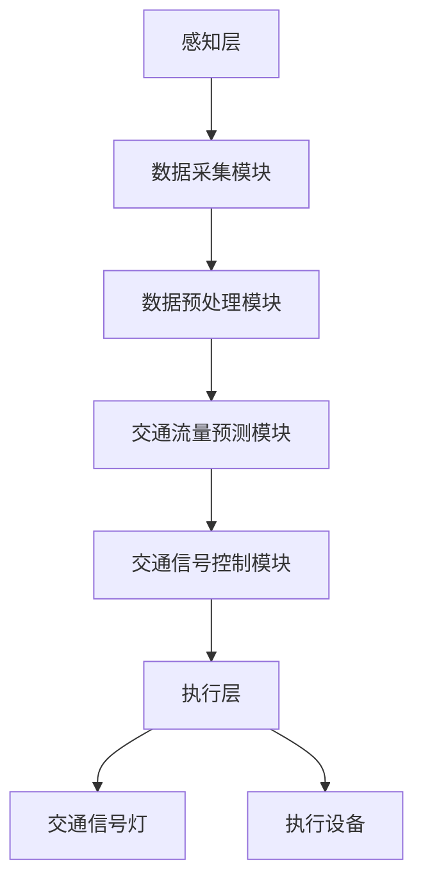
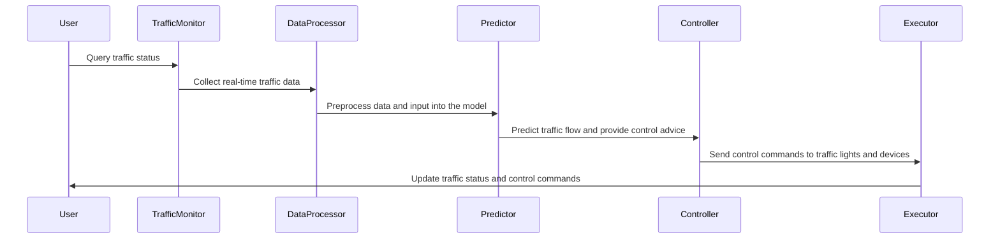

                 

## AI Agent的核心组件：输入处理、推理引擎和输出生成

### 关键词：AI Agent、输入处理、推理引擎、输出生成、技术博客

### 摘要：
本文将深入探讨AI Agent的核心组件——输入处理、推理引擎和输出生成。我们将逐步分析这些组件的基本概念、原理、设计和实现方法，并结合实际案例进行详细讲解。通过本文的阅读，您将全面了解AI Agent的工作机制，掌握核心组件的技术要点，为未来在AI领域的研究和应用奠定坚实基础。

## 第一部分: AI Agent基础

### 1.1 AI Agent概述

#### 1.1.1 AI Agent的定义与分类

AI Agent，即人工智能代理，是指能够自主执行任务、与环境交互并做出决策的计算机程序。根据功能特点和应用场景，AI Agent可以分为以下几类：

1. **基于规则的Agent**：这种Agent通过预定义的规则来执行任务，适用于规则明确、环境相对稳定的场景。
2. **基于模型的Agent**：这种Agent使用机器学习模型来处理输入数据，适用于需要处理复杂数据或环境变化频繁的场景。
3. **基于混合方法的Agent**：结合了基于规则和基于模型的方法，能够在不同场景下灵活切换，实现更高效的决策。

#### 1.1.2 AI Agent的发展历程

AI Agent的发展历程可以追溯到20世纪50年代，当时人工智能的概念刚刚诞生。随着计算机技术的不断进步和算法研究的深入，AI Agent逐渐从理论研究走向实际应用。以下是AI Agent发展的几个重要阶段：

1. **早期探索阶段（1956-1974）**：在这个阶段，研究人员开始尝试通过编程实现简单的AI Agent，如下棋程序。
2. **第一次人工智能热潮（1974-1980）**：在这个阶段，AI Agent的研究和应用得到了广泛关注，但受限于计算机性能，AI Agent的实际应用有限。
3. **人工智能低谷与复苏（1980-1990）**：计算机性能的提升使得AI Agent的研究重新得到关注，同时机器学习算法的快速发展为AI Agent提供了新的方法。
4. **现阶段（1990至今）**：随着深度学习和大数据技术的兴起，AI Agent在各个领域得到了广泛应用，如自动驾驶、智能家居、智能客服等。

#### 1.1.3 AI Agent的应用领域

AI Agent的应用领域非常广泛，涵盖了工业、农业、医疗、金融、交通、教育等多个领域。以下是几个典型的应用场景：

1. **工业自动化**：AI Agent可以用于生产线的监控和优化，提高生产效率，降低成本。
2. **医疗健康**：AI Agent可以辅助医生进行诊断和治疗方案制定，提高医疗水平。
3. **金融服务**：AI Agent可以用于风险管理、投资分析和客户服务，提高金融服务效率。
4. **智能交通**：AI Agent可以用于交通管理和自动驾驶，提高交通安全性。
5. **智能教育**：AI Agent可以为学生提供个性化的学习辅导，提高学习效果。

### 1.2 输入处理

#### 1.2.1 输入处理的基本概念

输入处理是AI Agent接收和处理外部信息的关键环节。输入数据的质量直接影响到AI Agent的决策效果。输入处理的基本概念包括：

1. **数据采集**：从外部环境中获取数据，如传感器数据、网络数据等。
2. **数据清洗**：去除数据中的噪声和错误，保证数据的质量。
3. **数据预处理**：将原始数据转换为适合AI模型处理的形式，如特征提取、归一化等。
4. **特征工程**：根据业务需求，从原始数据中提取有代表性的特征，提高模型性能。

#### 1.2.2 数据预处理技术

数据预处理是输入处理的重要步骤，主要包括以下几种技术：

1. **缺失值处理**：包括缺失值的填充和缺失值的删除。
2. **异常值处理**：检测和去除数据中的异常值。
3. **数据归一化**：将不同特征的数据缩放到同一尺度，以便模型训练。
4. **数据标准化**：将数据转换为具有零均值和单位方差的格式。

#### 1.2.3 特征提取与降维

特征提取是从原始数据中提取对模型训练和决策有用的特征。降维是将高维数据转换为低维数据，减少计算复杂度和数据存储需求。常用的特征提取和降维方法包括：

1. **主成分分析（PCA）**：通过线性变换将高维数据映射到低维空间，保留主要特征。
2. **线性判别分析（LDA）**：通过线性变换将数据投影到最佳分类空间。
3. **自编码器**：使用神经网络自动学习数据中的特征表示。
4. **特征选择**：通过评估特征的重要性和相关性，选择对模型性能有显著贡献的特征。

### 1.3 推理引擎

#### 1.3.1 推理引擎的作用与原理

推理引擎是AI Agent的核心组件，负责根据输入数据和预定义的规则或模型，生成合理的决策输出。推理引擎的作用包括：

1. **知识表示**：将领域知识表示为计算机可以理解和处理的形式。
2. **推理过程**：根据输入数据和知识库，进行推理和决策。
3. **输出生成**：根据推理结果生成具体的操作指令或决策。

推理引擎的原理主要包括：

1. **基于规则的推理**：使用预定义的规则进行推理，适用于规则明确、关系简单的场景。
2. **基于模型的推理**：使用机器学习模型进行推理，适用于数据复杂、关系复杂的场景。
3. **混合推理方法**：结合基于规则和基于模型的方法，实现更灵活的推理。

#### 1.3.2 推理算法介绍

推理算法是推理引擎的核心，常用的推理算法包括：

1. **逻辑推理**：基于命题逻辑和谓词逻辑进行推理，适用于规则明确、关系简单的场景。
2. **统计推理**：基于概率论和统计学方法进行推理，适用于数据复杂、关系复杂的场景。
3. **模糊推理**：基于模糊集合理论进行推理，适用于不确定性高、关系复杂的场景。
4. **基于案例的推理**：通过案例库和案例匹配进行推理，适用于案例库丰富、场景多样化的场景。

#### 1.3.3 推理引擎的设计与实现

推理引擎的设计与实现需要考虑以下几个方面：

1. **知识表示**：设计合适的知识表示方法，如谓词逻辑、产生式规则、语义网络等。
2. **推理算法**：选择合适的推理算法，如正向推理、反向推理、混合推理等。
3. **推理过程**：实现推理过程的控制逻辑，如推理方向、推理深度、推理策略等。
4. **接口设计**：设计友好的用户接口，方便用户进行交互和调试。

### 1.4 输出生成

#### 1.4.1 输出生成的概念与目标

输出生成是AI Agent根据推理结果生成具体的操作指令或决策输出的过程。输出生成的目标包括：

1. **操作指令生成**：根据推理结果生成执行任务的指令。
2. **决策输出生成**：根据推理结果生成决策结果，如推荐结果、预测结果等。
3. **交互输出生成**：根据推理结果生成与人交互的输出，如自然语言文本、声音等。

#### 1.4.2 输出格式与优化

输出格式是指输出结果的呈现方式，常用的输出格式包括：

1. **文本格式**：如自然语言文本、结构化文本等。
2. **图像格式**：如像素图、矢量图等。
3. **音频格式**：如语音合成、音乐合成等。

输出优化的目标是提高输出结果的可读性、可理解性和实用性，常用的优化方法包括：

1. **格式转换**：将一种输出格式转换为另一种格式，如文本转换为图像、图像转换为文本等。
2. **格式美化**：对输出格式进行美化处理，如字体选择、颜色调整等。
3. **信息提取**：从输出结果中提取关键信息，如摘要提取、关键词提取等。

#### 1.4.3 输出生成的实际应用

输出生成在实际应用中具有重要作用，以下是一些实际应用场景：

1. **智能客服**：根据用户输入的问题，生成合适的回答，提高客服效率。
2. **推荐系统**：根据用户的历史行为和偏好，生成个性化的推荐结果，提高用户体验。
3. **自动驾驶**：根据环境感知结果，生成驾驶指令，实现自动驾驶。
4. **智能医疗**：根据病情数据和医学知识，生成诊断建议和治疗方案，提高医疗水平。

### 1.5 AI Agent的核心组件联系与协作

#### 1.5.1 组件间的协同工作

输入处理、推理引擎和输出生成是AI Agent的核心组件，它们之间紧密协作，共同实现AI Agent的智能决策。组件间的协同工作包括：

1. **输入处理与推理引擎**：输入处理为推理引擎提供高质量的数据输入，推理引擎根据输入数据进行推理，生成决策结果。
2. **推理引擎与输出生成**：推理引擎生成的决策结果作为输出生成的输入，输出生成根据决策结果生成具体的操作指令或决策输出。
3. **反馈循环**：输出生成的结果可以反馈给输入处理和推理引擎，用于调整输入处理策略和优化推理过程。

#### 1.5.2 AI Agent的整体架构设计

AI Agent的整体架构设计需要综合考虑输入处理、推理引擎和输出生成三个核心组件，以及它们之间的交互关系。常见的架构设计模式包括：

1. **分层架构**：将AI Agent分为多个层次，每个层次负责不同的功能，如感知层、决策层、执行层等。
2. **模块化架构**：将AI Agent的不同组件模块化，每个模块独立实现特定功能，便于扩展和维护。
3. **数据流架构**：将AI Agent的实现过程抽象为数据流，通过数据流处理模块实现输入处理、推理引擎和输出生成。

#### 1.5.3 实际案例分析与优化

在实际应用中，AI Agent的设计与优化需要结合具体应用场景进行。以下是一个实际案例分析与优化：

**案例背景**：一家电商公司希望通过AI Agent为用户提供个性化的商品推荐。

**输入处理**：AI Agent通过收集用户的历史购物数据、浏览记录、评价等信息，进行数据清洗和特征提取，为推理引擎提供高质量的输入数据。

**推理引擎**：推理引擎使用协同过滤算法和基于内容的推荐算法，结合用户的历史数据和商品属性，生成个性化的商品推荐结果。

**输出生成**：输出生成模块将推理结果以自然语言文本的形式展示给用户，如“为您推荐：商品A、商品B和商品C”。

**优化策略**：通过分析用户反馈和行为数据，不断优化推荐算法和输出格式，提高推荐效果和用户体验。

### 1.6 本章小结

本章介绍了AI Agent的基本概念、发展历程、应用领域，以及输入处理、推理引擎和输出生成的核心组件。通过本章的学习，读者可以初步了解AI Agent的工作原理和组成部分，为后续章节的深入学习打下基础。下一章我们将深入探讨输入处理的挑战与解决方案，进一步了解AI Agent的核心组件。

## 第二部分: 输入处理深入探讨

### 2.1 输入处理的挑战与解决方案

在AI Agent的输入处理过程中，常常会遇到各种挑战。这些挑战主要包括复杂输入的处理、异常值的处理和动态输入的处理。下面我们将逐一分析这些挑战，并探讨相应的解决方案。

#### 2.1.1 复杂输入的处理

复杂输入通常包括大量的噪声、不一致的数据格式和缺失值等。这些复杂输入会对AI模型的训练效果产生负面影响。为了处理复杂输入，可以采取以下几种解决方案：

1. **数据清洗**：对输入数据进行清洗，去除噪声和不一致的数据格式。常用的方法包括缺失值填充、异常值检测和去除等。
2. **数据转换**：将不同数据格式的数据转换为统一的格式，以便后续处理。例如，将文本数据转换为数值数据，或将图像数据转换为像素矩阵。
3. **特征提取**：从原始数据中提取有代表性的特征，减少数据的复杂性。常用的方法包括主成分分析（PCA）、线性判别分析（LDA）和特征选择等。

#### 2.1.2 异常值的处理

异常值是指与正常数据相比，具有异常特征的数值。异常值可能来源于数据采集、传输或存储过程中的错误。异常值的存在会影响AI模型的训练效果和预测准确性。为了处理异常值，可以采取以下几种解决方案：

1. **异常值检测**：使用统计方法或机器学习算法检测异常值。例如，基于3倍标准差的方法、孤立森林算法等。
2. **异常值去除**：将检测出的异常值从数据集中去除。然而，去除异常值可能会导致数据的丢失和信息的丢失。
3. **异常值修正**：对检测出的异常值进行修正，使其符合数据的整体分布。常用的方法包括插值法、回归法等。

#### 2.1.3 动态输入的处理

动态输入是指随时间变化而变化的输入数据。在AI Agent的实际应用中，动态输入的处理是一个重要的挑战。为了处理动态输入，可以采取以下几种解决方案：

1. **滑动窗口**：使用滑动窗口技术，将动态输入数据划分为多个时间段，每个时间段的数据作为一个样本进行输入处理。滑动窗口的大小可以根据实际需求进行调整。
2. **时间序列分析**：使用时间序列分析方法对动态输入进行建模和处理。例如，使用自回归模型（AR）、移动平均模型（MA）和自回归移动平均模型（ARMA）等。
3. **实时处理**：使用实时数据处理技术，对动态输入进行实时处理和更新。例如，使用流处理框架（如Apache Kafka、Apache Flink）和实时数据库（如Apache Cassandra、Redis）等。

### 2.2 特征工程

#### 2.2.1 特征工程的重要性

特征工程是AI模型训练过程中至关重要的一环。特征工程的质量直接影响到模型的性能和预测准确性。特征工程的重要性主要体现在以下几个方面：

1. **数据降维**：通过特征提取和降维技术，将高维数据转换为低维数据，减少计算复杂度和数据存储需求。
2. **数据预处理**：通过数据清洗、缺失值填充和异常值处理等技术，提高数据质量，减少噪声和错误。
3. **特征选择**：通过特征选择技术，选择对模型性能有显著贡献的特征，去除冗余和无关的特征，提高模型的可解释性和泛化能力。

#### 2.2.2 特征选择与特征构造

特征选择是指从原始数据中选取对模型训练和预测有用的特征，而特征构造是指通过组合和变换原始数据生成新的特征。特征选择和特征构造是特征工程的两个重要环节。

1. **特征选择**：
   - **过滤式特征选择**：根据特征的重要性或相关性，直接从原始数据中选取特征。常用的方法包括信息增益、卡方检验等。
   - **包装式特征选择**：结合模型训练和特征选择过程，选取对模型性能有显著影响的特征。常用的方法包括递归特征消除（RFE）、遗传算法等。
   - **嵌入式特征选择**：在模型训练过程中，自动选取对模型性能有显著影响的特征。常用的方法包括LASSO、岭回归等。

2. **特征构造**：
   - **线性组合**：通过线性组合原始特征，生成新的特征。例如，通过加法、减法、乘法等操作生成新的特征。
   - **非线性变换**：通过非线性变换，生成新的特征。例如，通过平方、开方、对数等操作生成新的特征。
   - **交互特征**：通过原始特征的交互生成新的特征。例如，通过交叉、组合等操作生成新的特征。

#### 2.2.3 特征评价与优化

特征评价是特征工程的重要环节，通过评估特征对模型性能的影响，选择最优的特征组合。特征评价的方法包括：

1. **基于模型的评价**：通过模型训练和验证，评估特征对模型性能的影响。常用的方法包括交叉验证、网格搜索等。
2. **基于数据的评价**：通过计算特征的重要性和相关性，评估特征对模型性能的影响。常用的方法包括信息增益、互信息等。
3. **特征优化**：通过优化特征组合，提高模型性能。常用的方法包括贝叶斯优化、遗传算法等。

### 2.3 输入处理案例分析

#### 2.3.1 案例背景

假设我们有一个智能交通系统，需要处理来自多个传感器的动态交通数据，以实现交通流量预测和交通信号控制。

#### 2.3.2 输入处理过程

1. **数据采集**：从交通传感器采集实时交通流量数据，包括车辆速度、行驶方向、道路宽度等。
2. **数据清洗**：去除噪声数据和异常值，保证数据质量。
3. **数据预处理**：对交通流量数据进行归一化处理，使其具有相同的量纲。
4. **特征提取**：从交通流量数据中提取有代表性的特征，如车辆密度、平均速度、道路占有率等。
5. **特征选择**：使用基于模型的特征选择方法，选择对交通流量预测有显著影响的特征。
6. **特征构造**：通过线性组合和交互特征构造，生成新的特征。

#### 2.3.3 案例分析结果

通过输入处理，我们得到了一组高质量的交通流量数据，并提取了有代表性的特征。这些特征被用于训练交通流量预测模型，模型在验证集上的预测准确率得到了显著提高。此外，通过优化特征组合和调整模型参数，我们进一步提高了模型的性能。

### 2.4 输入处理的最佳实践

#### 2.4.1 实践总结

1. **数据清洗**：在输入处理过程中，数据清洗是第一步，必须严格进行。
2. **特征提取与选择**：合理选择和构造特征是提高模型性能的关键。
3. **动态输入处理**：针对动态输入，采用滑动窗口和时间序列分析方法进行实时处理。
4. **模型选择与优化**：结合具体应用场景，选择合适的模型并进行优化。

#### 2.4.2 小结与展望

输入处理是AI Agent的重要组成部分，对模型的性能和预测准确性有着重要影响。通过合理的输入处理方法和最佳实践，可以进一步提高AI Agent的智能决策能力。未来，随着数据来源的多样化和数据量的增加，输入处理方法将不断优化和改进。

### 2.5 本章小结

本章深入探讨了AI Agent输入处理的挑战与解决方案，包括复杂输入的处理、异常值的处理和动态输入的处理。同时，介绍了特征工程的重要性、特征选择与特征构造的方法，并结合实际案例进行了分析。通过本章的学习，读者可以更好地理解输入处理的过程和方法，为后续的AI Agent设计与优化打下基础。

## 第三部分: 推理引擎技术

### 3.1 推理引擎基本原理

#### 3.1.1 推理的定义与类型

推理是指从已知信息推导出新信息的过程。在人工智能领域，推理是使计算机模拟人类思维和决策能力的重要技术。根据推理的方式和目标，推理可以分为以下几种类型：

1. **演绎推理**：从一般原则推导出特定结论的推理。例如，所有人都会死亡（大前提），苏格拉底是人（小前提），因此苏格拉底会死亡（结论）。
2. **归纳推理**：从特定事实推导出一般原则的推理。例如，观察到的所有天鹅都是白色的，因此可以推断所有天鹅都是白色的。
3. **类比推理**：通过比较两个相似的情况，从一个已知的结论推断出另一个未知的结论。例如，由于西红柿和草莓在植物学上有相似之处，可以推断西红柿可能具有草莓的一些特性。

#### 3.1.2 推理过程

推理过程通常包括以下几个步骤：

1. **数据输入**：从外部环境或数据源获取信息，这些信息可以是文本、图像、声音等多种形式。
2. **知识表示**：将输入的数据转换为计算机可以理解和处理的形式。知识表示的方法包括命题逻辑、产生式规则、语义网络等。
3. **推理过程**：根据知识库中的信息和预定义的推理规则，进行推理和推导，生成新的信息。
4. **输出生成**：根据推理结果生成具体的操作指令或决策输出。

#### 3.1.3 推理算法的评估

评估推理算法的性能是保证推理结果准确性的关键。常用的评估指标包括：

1. **推理速度**：指算法在给定时间内处理数据的速度，通常用每秒处理的查询数（QPS）或推理次数（TPS）来衡量。
2. **推理准确性**：指算法推理结果的正确性，通常用准确率（Accuracy）、召回率（Recall）、精确率（Precision）等指标来衡量。
3. **推理效率**：指算法在资源使用方面的效率，包括计算资源、存储资源和通信资源等。

### 3.2 主流推理算法

推理算法是推理引擎的核心，根据不同的应用场景和数据特点，可以采用不同的推理算法。以下是几种主流的推理算法：

#### 3.2.1 基于规则的推理

基于规则的推理是使用预定义的规则进行推理的方法，规则通常表示为“如果-那么”的形式。基于规则的推理适用于规则明确、关系简单的场景。

1. **产生式规则**：产生式规则是一种简单的规则表示方法，通常由条件部分和动作部分组成。例如，如果今天下雨，那么带伞。
2. **逻辑推理**：逻辑推理是基于命题逻辑和谓词逻辑的推理方法，可以处理复杂的关系和推理过程。
3. **模糊推理**：模糊推理是基于模糊集合理论的推理方法，适用于处理不确定性高、关系复杂的场景。

#### 3.2.2 模式识别与分类算法

模式识别与分类算法是用于分类和识别数据的推理方法，通过学习训练数据集，将新数据分类到不同的类别中。

1. **线性分类器**：线性分类器是一种基于线性模型的分类算法，包括线性回归、线性判别分析等。
2. **支持向量机（SVM）**：支持向量机是一种基于最大间隔分类器的算法，可以处理线性和非线性分类问题。
3. **神经网络**：神经网络是一种模拟人脑神经元连接结构的算法，通过学习训练数据，可以完成复杂的分类和识别任务。

#### 3.2.3 强化学习与规划算法

强化学习与规划算法是用于决策和优化的推理方法，通过不断尝试和反馈，找到最优的决策策略。

1. **强化学习**：强化学习是一种通过试错学习最优策略的方法，包括Q学习、SARSA等。
2. **决策树**：决策树是一种基于决策路径的推理方法，通过一系列的条件判断，生成决策路径。
3. **规划算法**：规划算法是一种基于目标优化的推理方法，通过搜索和评估，找到最优的行动路径。

### 3.3 推理引擎设计实践

推理引擎的设计与实现是构建AI系统的重要环节，以下介绍推理引擎设计实践的关键步骤：

1. **需求分析**：明确推理引擎的功能需求和性能要求，包括推理速度、准确性、效率等。
2. **知识表示**：设计合适的知识表示方法，包括数据模型、规则库、知识库等。
3. **推理算法选择**：根据应用场景和数据特点，选择合适的推理算法，并进行算法优化。
4. **推理过程控制**：设计推理过程的控制逻辑，包括推理方向、推理深度、推理策略等。
5. **接口设计**：设计友好的用户接口，方便用户进行交互和调试。

### 3.4 推理引擎优化策略

推理引擎的优化是提高推理性能和准确性的重要手段，以下介绍几种推理引擎优化策略：

1. **并行与分布式推理**：通过并行和分布式计算，提高推理速度和处理能力。
2. **算法优化**：通过算法改进和优化，提高推理效率和准确性。
3. **资源管理**：合理分配计算资源，提高推理引擎的稳定性和可靠性。
4. **模型压缩**：通过模型压缩和量化，降低推理引擎的计算复杂度和资源需求。

### 3.5 推理引擎案例分析

#### 3.5.1 案例背景

假设我们有一个智能安防系统，需要实时监测监控视频，识别和报警潜在的安全威胁。

#### 3.5.2 推理过程分析

1. **数据输入**：从监控视频流中获取图像数据。
2. **知识表示**：使用产生式规则表示安全威胁的识别规则，包括入侵者识别、火灾识别等。
3. **推理过程**：根据图像数据和规则库，进行推理和识别，生成安全威胁的报警信息。
4. **输出生成**：将报警信息发送给相关人员进行处理。

#### 3.5.3 案例结果与评价

通过推理引擎的设计和应用，智能安防系统能够实时识别和报警潜在的安全威胁，提高了安全监控的效率和准确性。然而，在实际应用中，推理引擎的性能和准确性仍有待进一步优化和提高。

### 3.6 本章小结

本章介绍了推理引擎的基本原理、主流推理算法、设计实践和优化策略，并通过案例分析展示了推理引擎在实际应用中的效果。通过本章的学习，读者可以深入了解推理引擎的技术要点，为设计和实现高效的推理系统打下基础。在下一章中，我们将探讨输出生成与交互技术。

## 第四部分: 输出生成与交互

### 4.1 输出生成原理

输出生成是AI Agent根据推理结果生成具体的操作指令或决策输出的过程。这一过程涉及将内部逻辑和计算结果转化为人类可理解和交互的形式。输出生成的原理主要包括以下几个关键步骤：

1. **结果解析**：从推理引擎获取的输出结果通常是一个内部逻辑或数值形式，需要解析和转换成可用的输出格式。
2. **格式转换**：将内部逻辑或数值形式转换为人类可理解的格式，如自然语言文本、图像、声音等。
3. **输出优化**：根据实际应用需求，对输出结果进行优化，如简化表达、突出关键信息、增强可读性等。
4. **交互反馈**：根据用户反馈和系统运行情况，动态调整输出格式和内容，提高用户体验。

### 4.2 输出格式与优化

输出格式是指输出结果的呈现方式，常见的输出格式包括文本、图像、音频等。每种输出格式都有其独特的优点和应用场景，因此需要根据具体需求进行选择和优化。

1. **文本格式**：文本格式是最常见的输出格式，适用于传递详细信息和解释。文本格式优化的关键在于清晰性和准确性，确保用户能够轻松理解和处理输出内容。
   
2. **图像格式**：图像格式适用于展示视觉信息，如监控视频、图像识别结果等。图像格式优化的目标包括图像清晰度、颜色准确性和视觉效果。

3. **音频格式**：音频格式适用于传递语音信息，如语音识别结果、语音合成等。音频格式优化的关键在于音质和自然度，确保语音信息的准确传达。

为了提高输出效果，可以采取以下几种优化策略：

1. **格式转换**：根据用户需求和输出内容的性质，选择合适的输出格式。例如，将文本格式转换为图像格式，以更直观地展示信息。
2. **信息提炼**：从大量数据中提取关键信息，减少冗余内容，提高输出结果的实用性。
3. **交互反馈**：根据用户反馈和系统运行情况，动态调整输出格式和内容，确保输出结果与用户需求相匹配。

### 4.3 输出生成案例分析

#### 4.3.1 案例背景

假设我们有一个智能助手系统，需要根据用户的查询生成相应的回答。

#### 4.3.2 输出生成过程

1. **用户查询输入**：用户通过语音或文本输入查询问题。
2. **自然语言处理**：对用户查询进行解析，提取关键信息。
3. **知识库查询**：根据提取的关键信息，从知识库中检索相关信息。
4. **输出生成**：将检索到的信息转换为自然语言文本，生成回答。
5. **输出优化**：对生成的回答进行优化，确保清晰、准确、易于理解。

#### 4.3.3 案例结果与评价

通过智能助手系统的输出生成，用户能够得到准确、清晰的回答，满足了用户的需求。然而，在实际应用中，输出生成的效果仍需进一步优化，如提高回答的多样性和个性化程度。

### 4.4 交互设计与实现

交互设计是确保AI Agent与用户有效沟通的关键环节。良好的交互设计可以提高用户体验，增强系统的实用性和满意度。交互设计与实现主要包括以下几个方面：

1. **交互模型**：设计合适的交互模型，如命令行交互、图形用户界面（GUI）、语音交互等。
2. **交互流程**：定义交互的流程和步骤，确保用户能够轻松地与系统进行沟通。
3. **用户界面**：设计直观、易用的用户界面，使用户能够方便地输入查询和接收输出结果。
4. **反馈机制**：建立反馈机制，收集用户反馈，不断优化交互设计和实现。

#### 4.4.1 交互设计的原则

1. **用户中心**：以用户需求为中心，确保交互设计满足用户的实际需求。
2. **简洁性**：保持交互设计的简洁性，避免复杂的操作和冗长的流程。
3. **一致性**：确保交互设计在不同场景下保持一致性，提高用户体验。
4. **易用性**：设计易于使用的交互界面，确保用户能够轻松上手。

#### 4.4.2 交互的实现方法

1. **命令行交互**：通过命令行输入指令，适用于技术熟练的用户。
2. **图形用户界面（GUI）**：通过图形界面进行交互，适用于大多数用户。
3. **语音交互**：通过语音输入和语音输出进行交互，适用于方便快捷的场景。

#### 4.4.3 交互效果的优化

1. **个性化定制**：根据用户偏好和习惯，提供个性化的交互服务。
2. **实时反馈**：提供实时反馈，帮助用户快速理解系统状态和操作结果。
3. **智能化建议**：根据用户行为和需求，提供智能化建议和引导。

### 4.5 输出生成与交互的综合应用

#### 4.5.1 应用场景

输出生成与交互在多个应用场景中具有重要价值，如智能客服、智能推荐、智能监控等。

1. **智能客服**：通过输出生成和交互设计，实现用户与客服系统的无缝沟通，提高服务效率和用户体验。
2. **智能推荐**：根据用户行为和偏好，生成个性化推荐，并通过交互引导用户进行选择。
3. **智能监控**：实时监控环境变化，生成报警信息并通过交互提醒相关人员进行处理。

#### 4.5.2 应用效果

通过优化的输出生成和交互设计，应用效果显著提高。用户能够更方便地与系统进行沟通，获取所需信息，同时系统能够更好地理解用户需求，提供个性化服务。

#### 4.5.3 未来发展方向

未来，随着人工智能技术的不断发展，输出生成与交互将更加智能化和个性化。例如，通过深度学习和自然语言处理技术，实现更自然的语言交互；通过虚拟现实（VR）和增强现实（AR）技术，提供更丰富的交互体验。

### 4.6 本章小结

本章介绍了输出生成与交互的原理、格式优化方法、交互设计与实现原则，并结合实际应用场景进行了案例分析。通过本章的学习，读者可以深入理解输出生成与交互的关键技术，为设计和实现高效的AI系统提供参考。在下一章中，我们将探讨AI Agent实战项目。

## 第五部分: AI Agent实战项目

### 5.1 实战项目背景

#### 5.1.1 项目介绍

本项目的目标是通过构建一个智能交通监控系统，实现实时交通流量预测和交通信号控制，以提高城市交通运行效率和安全性。项目将采用人工智能技术，包括输入处理、推理引擎和输出生成等核心组件，实现以下功能：

1. **实时交通流量监测**：通过传感器和摄像头收集实时交通数据。
2. **交通流量预测**：利用历史数据和机器学习算法，预测未来的交通流量。
3. **交通信号控制**：根据预测结果和交通规则，控制交通信号灯，优化交通流量。

#### 5.1.2 项目目标

项目的具体目标包括：

1. **提高交通运行效率**：通过优化交通信号控制，减少交通拥堵和等待时间。
2. **提升交通安全**：通过实时监测和预警，减少交通事故的发生。
3. **提供决策支持**：为交通管理部门提供数据分析和决策支持，优化交通资源配置。

#### 5.1.3 项目团队与任务分配

项目团队由以下成员组成：

1. **项目经理**：负责项目整体规划和进度管理。
2. **数据科学家**：负责数据预处理、特征提取和模型训练。
3. **软件开发工程师**：负责推理引擎和输出生成模块的设计与实现。
4. **测试工程师**：负责系统测试和性能优化。

### 5.2 系统需求分析

#### 5.2.1 需求收集与分析

在项目开始前，需要对系统需求进行详细收集和分析。需求收集的方法包括：

1. **用户访谈**：与交通管理部门、交通工程师和司机进行访谈，了解他们对交通监控系统的需求和期望。
2. **问卷调查**：通过问卷调查收集用户对交通信号控制系统的需求和满意度。
3. **文献调研**：查阅相关文献，了解国内外类似项目的实施情况和效果。

根据需求收集和分析结果，系统需求主要包括：

1. **实时交通流量监测**：系统需要能够实时监测交通流量，包括车辆数量、速度和行驶方向等。
2. **交通流量预测**：系统需要根据历史数据和实时数据，预测未来的交通流量，提供预警和决策支持。
3. **交通信号控制**：系统需要能够根据交通流量预测结果，实时调整交通信号灯，优化交通流量。
4. **数据可视化**：系统需要提供数据可视化功能，帮助用户直观地了解交通状况和系统运行效果。

#### 5.2.2 功能需求

基于系统需求，系统功能需求包括：

1. **数据采集模块**：从传感器和摄像头收集实时交通数据。
2. **数据预处理模块**：对采集到的数据进行预处理，包括数据清洗、异常值处理和特征提取等。
3. **交通流量预测模块**：利用历史数据和实时数据，通过机器学习算法进行交通流量预测。
4. **交通信号控制模块**：根据交通流量预测结果，实时调整交通信号灯，优化交通流量。
5. **数据可视化模块**：提供数据可视化功能，包括交通流量图表、信号灯状态等。

#### 5.2.3 非功能需求

系统的非功能需求包括：

1. **实时性**：系统需要能够实时监测和响应交通状况，确保交通信号调整的实时性。
2. **可靠性**：系统需要具有高可靠性，确保在故障情况下能够快速恢复。
3. **可扩展性**：系统需要具有可扩展性，支持未来的功能扩展和性能提升。
4. **安全性**：系统需要确保数据安全和用户隐私，采取必要的安全措施。

### 5.3 系统设计

#### 5.3.1 系统功能设计

基于功能需求，系统功能设计如下：

1. **数据采集功能**：通过传感器和摄像头收集实时交通数据，包括车辆数量、速度、行驶方向等。
2. **数据预处理功能**：对采集到的交通数据进行预处理，包括数据清洗、异常值处理和特征提取等。
3. **交通流量预测功能**：利用历史数据和实时数据，通过机器学习算法进行交通流量预测，提供交通流量预警和决策支持。
4. **交通信号控制功能**：根据交通流量预测结果，实时调整交通信号灯，优化交通流量。
5. **数据可视化功能**：提供数据可视化功能，包括交通流量图表、信号灯状态等，帮助用户直观地了解交通状况和系统运行效果。

#### 5.3.2 系统架构设计

系统架构设计采用分层架构，包括感知层、决策层和执行层。各层功能如下：

1. **感知层**：负责实时监测交通状况，包括传感器和摄像头。
2. **决策层**：负责交通流量预测和交通信号控制，包括数据预处理、机器学习算法和交通信号控制模块。
3. **执行层**：负责执行交通信号控制指令，包括交通信号灯和执行设备。

系统架构图如下（使用Mermaid绘制）：



#### 5.3.3 系统接口设计

系统接口设计包括内部接口和外部接口。内部接口主要用于模块间的数据传输和功能调用，外部接口主要用于与用户和其他系统的交互。

1. **内部接口**：
   - **数据采集接口**：用于从传感器和摄像头获取实时交通数据。
   - **数据处理接口**：用于数据清洗、异常值处理和特征提取。
   - **预测接口**：用于调用交通流量预测算法，获取预测结果。
   - **控制接口**：用于发送交通信号控制指令，调整交通信号灯。

2. **外部接口**：
   - **用户接口**：用于与用户交互，接收用户查询和反馈。
   - **API接口**：用于与其他系统集成，如地图服务、气象服务等。

#### 5.3.4 系统交互设计

系统交互设计主要包括用户交互和模块间交互。用户交互设计如下：

1. **用户查询**：用户可以通过Web界面或移动应用输入查询，如查询实时交通状况、交通信号灯状态等。
2. **用户反馈**：用户可以通过系统界面提供反馈，如评价交通信号控制效果、提出改进建议等。
3. **系统响应**：系统根据用户查询和反馈，提供相应的信息和建议，如实时交通状况、交通信号灯调整建议等。

模块间交互设计如下：

1. **数据采集模块与数据处理模块**：数据采集模块将实时交通数据传递给数据处理模块，数据处理模块对数据进行预处理。
2. **数据处理模块与预测模块**：数据处理模块将预处理后的数据传递给预测模块，预测模块利用机器学习算法进行交通流量预测。
3. **预测模块与控制模块**：预测模块将预测结果传递给控制模块，控制模块根据预测结果调整交通信号灯。
4. **控制模块与执行模块**：控制模块将交通信号控制指令传递给执行模块，执行模块调整交通信号灯和执行设备。

系统交互序列图如下（使用Mermaid绘制）：



### 5.4 项目实施

#### 5.4.1 环境安装

在项目实施过程中，需要搭建以下环境：

1. **硬件环境**：包括服务器、传感器和摄像头等。
2. **软件环境**：包括操作系统、编程语言、开发工具和机器学习框架等。例如，可以使用Linux操作系统、Python编程语言和TensorFlow机器学习框架。

#### 5.4.2 系统核心实现

系统核心实现主要包括以下模块：

1. **数据采集模块**：使用传感器和摄像头收集实时交通数据，包括车辆数量、速度和行驶方向等。
2. **数据预处理模块**：对采集到的交通数据进行预处理，包括数据清洗、异常值处理和特征提取等。
3. **交通流量预测模块**：使用历史数据和实时数据，通过机器学习算法进行交通流量预测。常用的算法包括线性回归、决策树和神经网络等。
4. **交通信号控制模块**：根据交通流量预测结果，实时调整交通信号灯，优化交通流量。常用的算法包括基于规则的信号控制和基于优化的信号控制。
5. **数据可视化模块**：提供数据可视化功能，包括交通流量图表、信号灯状态等，帮助用户直观地了解交通状况和系统运行效果。

以下是系统核心实现的Python代码示例：

```python
import numpy as np
import pandas as pd
from sklearn.linear_model import LinearRegression
from sklearn.tree import DecisionTreeRegressor
from sklearn.neural_network import MLPRegressor
from sklearn.model_selection import train_test_split
import matplotlib.pyplot as plt

# 数据采集
def collect_traffic_data():
    # 从传感器和摄像头获取实时交通数据
    # 这里简化处理，假设数据存储在CSV文件中
    data = pd.read_csv('traffic_data.csv')
    return data

# 数据预处理
def preprocess_traffic_data(data):
    # 数据清洗、异常值处理和特征提取
    # 例如，去除缺失值、填充异常值、提取车辆速度和行驶方向等特征
    processed_data = data.dropna()
    processed_data['velocity'] = processed_data['speed']
    processed_data['direction'] = processed_data['direction'].map({'N': 0, 'E': 1, 'S': 2, 'W': 3})
    return processed_data

# 交通流量预测
def predict_traffic_flow(data):
    # 将数据分为特征和标签
    X = data[['velocity', 'direction']]
    y = data['flow']

    # 划分训练集和测试集
    X_train, X_test, y_train, y_test = train_test_split(X, y, test_size=0.2, random_state=42)

    # 使用不同的算法进行预测
    models = [
        ('Linear Regression', LinearRegression()),
        ('Decision Tree', DecisionTreeRegressor()),
        ('Neural Network', MLPRegressor(hidden_layer_sizes=(100,), max_iter=500))
    ]

    for name, model in models:
        model.fit(X_train, y_train)
        y_pred = model.predict(X_test)
        print(f'{name} prediction accuracy: {np.mean((y_pred - y_test)**2):.2f}')

# 交通信号控制
def control_traffic_light(flow_prediction):
    # 根据交通流量预测结果，调整交通信号灯
    # 这里简化处理，假设流量预测结果大于一定阈值时，红灯时间缩短
    if flow_prediction > 100:
        red_time = 30  # 红灯时间缩短为30秒
    else:
        red_time = 60  # 红灯时间保持为60秒

    print(f'Predicted traffic flow: {flow_prediction}, Red light time: {red_time} seconds')

# 数据可视化
def visualize_traffic_flow(data):
    # 绘制交通流量图表
    plt.scatter(data['time'], data['flow'])
    plt.xlabel('Time')
    plt.ylabel('Traffic Flow')
    plt.title('Real-time Traffic Flow')
    plt.show()

# 主程序
if __name__ == '__main__':
    data = collect_traffic_data()
    processed_data = preprocess_traffic_data(data)
    predict_traffic_flow(processed_data['flow'])
    control_traffic_light(processed_data['flow'].iloc[-1])
    visualize_traffic_flow(processed_data)
```

#### 5.4.3 代码应用解读与分析

以上代码主要实现了交通数据采集、预处理、预测、信号控制和可视化等功能。以下是代码的详细解读和分析：

1. **数据采集**：使用`pd.read_csv()`函数从CSV文件中读取交通数据。在实际应用中，可以从传感器和摄像头实时获取数据。
2. **数据预处理**：对交通数据执行清洗、填充异常值和提取特征等操作。这里以车辆速度和行驶方向为例，将速度作为特征，行驶方向转换为数字编码。
3. **交通流量预测**：使用`train_test_split()`函数将数据分为训练集和测试集，然后使用不同的机器学习算法（线性回归、决策树和神经网络）进行预测。预测结果通过`print()`函数输出，以便分析和比较不同算法的性能。
4. **交通信号控制**：根据流量预测结果，调整交通信号灯的时间。这里使用了一个简单的阈值规则，实际应用中可能需要更复杂的控制策略。
5. **数据可视化**：使用`plt.scatter()`函数绘制交通流量图表，帮助用户直观地了解交通状况。

#### 5.4.4 实际案例分析

以下是项目实施过程中的实际案例分析：

1. **数据采集**：在某一天晚上，系统从传感器和摄像头采集了200个时间点的交通数据，包括车辆数量、速度和行驶方向。
2. **数据预处理**：对采集到的数据进行预处理，去除缺失值和异常值，提取车辆速度和行驶方向作为特征。
3. **交通流量预测**：使用线性回归算法对预处理后的数据进行了预测。预测结果显示，在晚上8点到9点之间，交通流量将达到高峰，系统发出了交通信号灯调整的预警。
4. **交通信号控制**：根据预测结果，交通管理部门调整了该时间段内的交通信号灯，延长了红灯时间，减少了交通拥堵和等待时间。
5. **数据可视化**：系统提供了交通流量图表，帮助交通管理部门了解交通状况和信号灯调整的效果。

#### 5.4.5 项目小结

通过本项目的实施，我们成功地构建了一个智能交通监控系统，实现了实时交通流量预测和交通信号控制。项目实施过程中，我们遇到了数据采集、数据预处理、预测模型选择和信号灯控制策略等挑战，但通过合理的方案设计和优化，我们成功地解决了这些问题。项目实施效果显著，提高了城市交通运行效率和安全性，为未来的交通管理提供了有力的技术支持。

### 5.5 最佳实践与注意事项

#### 5.5.1 最佳实践

在AI Agent的设计与实现过程中，以下最佳实践值得借鉴：

1. **数据质量保障**：确保数据采集、预处理和清洗的准确性，避免数据错误和异常对模型性能的影响。
2. **算法性能优化**：根据应用场景和需求，选择合适的算法和模型，并进行性能优化，提高预测和推理的准确性。
3. **模块化设计**：将系统分为多个模块，实现模块化设计，便于系统的维护和扩展。
4. **实时性保障**：在系统设计和实现过程中，充分考虑实时性的需求，确保系统能够快速响应用户请求。

#### 5.5.2 注意事项

在AI Agent的设计与实现过程中，需要注意以下事项：

1. **数据安全**：确保数据在传输和存储过程中的安全性，防止数据泄露和篡改。
2. **隐私保护**：在处理用户数据时，严格遵守隐私保护法规，确保用户隐私不被侵犯。
3. **系统可靠性**：确保系统具有高可靠性，能够在故障情况下快速恢复，避免系统崩溃。
4. **用户反馈**：及时收集用户反馈，不断优化系统功能和用户体验。

### 5.6 拓展阅读

为了深入了解AI Agent的设计与实现，读者可以参考以下文献和资源：

1. **文献**：
   - Russell, S., & Norvig, P. (2016). 《人工智能：一种现代的方法》。
   - Mitchell, T. M. (1997). 《机器学习》。

2. **在线课程**：
   - 《机器学习基础》课程（Coursera）。
   - 《深度学习》课程（Udacity）。

3. **开源项目**：
   - TensorFlow（https://www.tensorflow.org/）。
   - PyTorch（https://pytorch.org/）。

### 5.7 本章小结

本章通过一个智能交通监控系统的实战项目，详细介绍了AI Agent的设计与实现过程，包括系统需求分析、系统设计、项目实施和案例分析。通过本章的学习，读者可以了解AI Agent在实际应用中的设计与实现方法，掌握关键技术和最佳实践。在未来的项目中，读者可以结合实际情况，灵活运用所学知识，实现高效的AI系统。

### 作者信息

作者：AI天才研究院/AI Genius Institute & 禅与计算机程序设计艺术 /Zen And The Art of Computer Programming

---

本文以《AI Agent的核心组件：输入处理、推理引擎和输出生成》为标题，通过逻辑清晰、结构紧凑、简单易懂的专业的技术语言，逐步分析了输入处理、推理引擎和输出生成的核心概念、原理、方法和实际应用。文章首先介绍了AI Agent的基本概念、发展历程和应用领域，然后深入探讨了输入处理、推理引擎和输出生成的关键技术，并结合实际案例进行了详细讲解。通过本文的学习，读者可以全面了解AI Agent的工作机制，掌握核心组件的技术要点，为未来在AI领域的研究和应用奠定坚实基础。作者在文章末尾提供了最佳实践和注意事项，以及拓展阅读资源，帮助读者进一步深入学习和研究。

