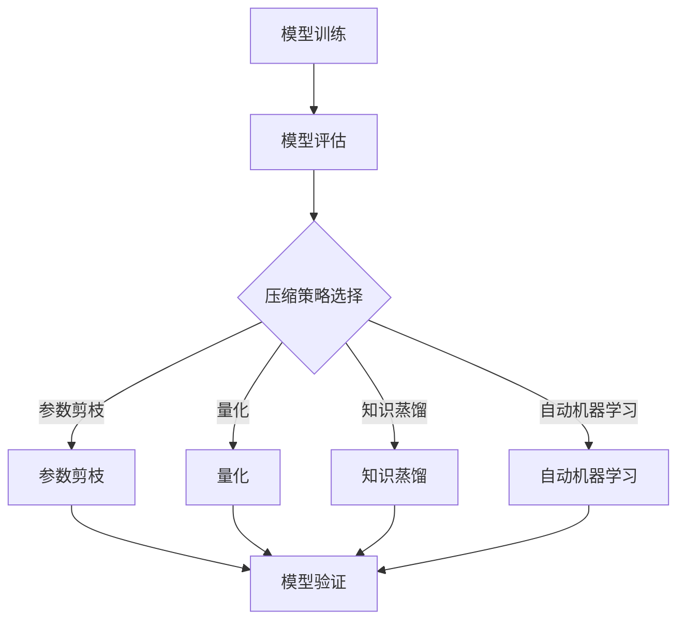
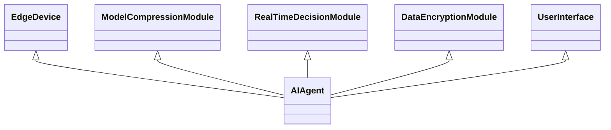
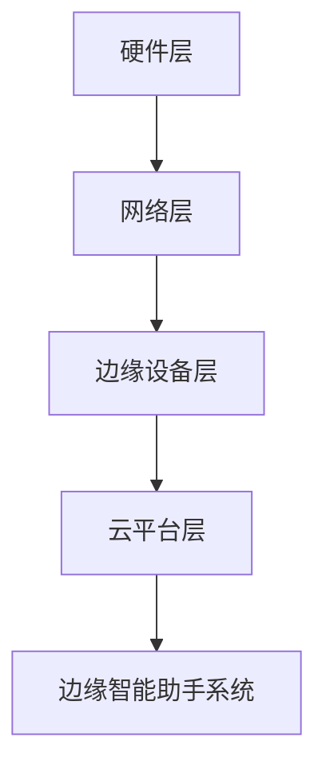
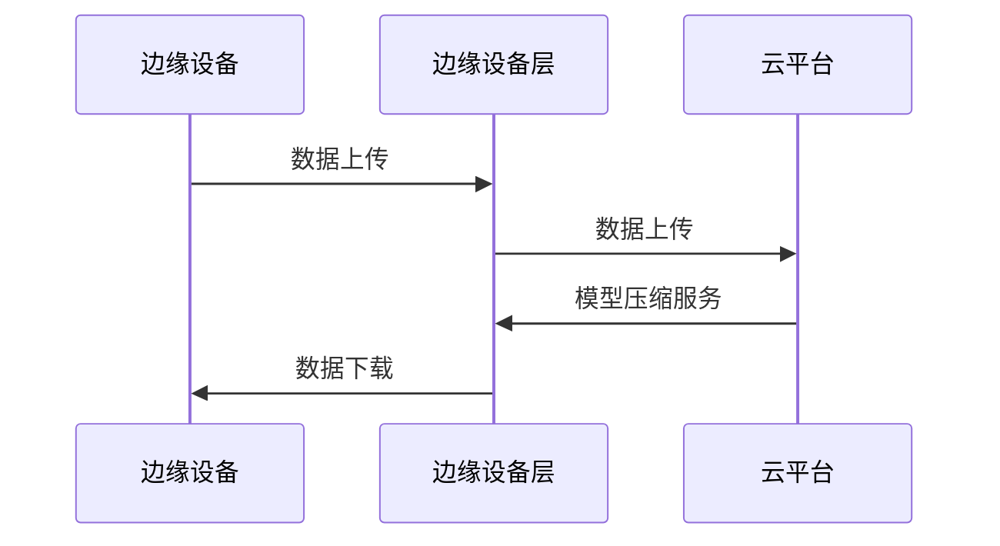

                 

## 文章标题

# AI Agent的模型压缩技术：边缘设备部署

关键词：AI Agent、模型压缩、边缘设备、压缩算法、数学模型、系统架构、实战案例

摘要：本文将深入探讨AI Agent的模型压缩技术，特别是其在边缘设备部署中的应用。我们将逐步分析模型压缩的技术背景、核心概念、原理和实现方法，并提供详细的系统架构设计和实战案例，帮助读者全面理解并掌握这一关键技术。

## 目录大纲

----------------------------------------------------------------

## 第一部分: 背景介绍

### 第1章: AI Agent模型压缩技术概述

#### 1.1 问题背景与重要性

##### 1.1.1 边缘设备的普及与计算资源限制

##### 1.1.2 AI Agent模型压缩技术的必要性

##### 1.1.3 模型压缩技术在边缘设备部署中的优势

#### 1.2 问题描述与挑战

##### 1.2.1 模型压缩的基本概念

##### 1.2.2 模型压缩的技术挑战

##### 1.2.3 模型压缩的目标与评价指标

#### 1.3 问题解决方法

##### 1.3.1 模型压缩技术的分类

##### 1.3.2 模型压缩的关键技术点

#### 1.4 边界与外延

##### 1.4.1 模型压缩技术在不同领域的应用

##### 1.4.2 模型压缩技术的发展趋势

#### 1.5 本章小结

----------------------------------------------------------------

## 第二部分: 核心概念与联系

### 第2章: AI Agent模型压缩技术核心概念与属性特征对比

#### 2.1 AI Agent模型定义与特征

##### 2.1.1 AI Agent的定义

##### 2.1.2 AI Agent的主要特征

#### 2.2 模型压缩技术核心概念

##### 2.2.1 压缩算法的分类

##### 2.2.2 压缩算法的属性特征

#### 2.3 模型压缩技术属性特征对比

##### 2.3.1 模型压缩算法性能对比

##### 2.3.2 洛压算法适用场景对比

#### 2.4 模型压缩技术ER实体关系图

----------------------------------------------------------------

### 第3章: AI Agent模型压缩技术原理讲解

#### 3.1 压缩算法原理讲解

##### 3.1.1 常见压缩算法介绍

##### 3.1.2 压缩算法的工作流程

#### 3.2 数学模型与公式

##### 3.2.1 模型压缩的数学原理

##### 3.2.2 模型压缩的数学公式

#### 3.3 算法流程图

##### 3.3.1 压缩算法流程图

##### 3.3.2 压缩算法流程解释

#### 3.4 举例说明

##### 3.4.1 压缩算法的实际应用场景

##### 3.4.2 压缩算法的详细举例

----------------------------------------------------------------

### 第4章: 系统分析与架构设计方案

#### 4.1 问题场景介绍

##### 4.1.1 边缘设备环境下的模型压缩需求

##### 4.1.2 边缘设备模型压缩的挑战

#### 4.2 项目介绍

##### 4.2.1 项目背景

##### 4.2.2 项目目标

#### 4.3 系统功能设计

##### 4.3.1 领域模型设计

##### 4.3.2 功能模块划分

#### 4.4 系统架构设计

##### 4.4.1 系统架构图

##### 4.4.2 架构设计解释

#### 4.5 系统接口设计与交互

##### 4.5.1 接口设计

##### 4.5.2 系统交互设计

----------------------------------------------------------------

### 第5章: 项目实战

#### 5.1 环境安装

##### 5.1.1 安装所需软件和工具

##### 5.1.2 环境配置步骤

#### 5.2 系统核心实现源代码

##### 5.2.1 源代码结构

##### 5.2.2 核心代码解析

#### 5.3 代码应用解读与分析

##### 5.3.1 代码应用场景

##### 5.3.2 代码解读与分析

#### 5.4 实际案例分析

##### 5.4.1 案例背景

##### 5.4.2 案例分析

#### 5.5 详细讲解剖析

##### 5.5.1 案例讲解

##### 5.5.2 剖析结果

#### 5.6 项目小结

----------------------------------------------------------------

### 第6章

----------------------------------------------------------------

----------------------------------------------------------------

### 第1章: AI Agent模型压缩技术概述

#### 1.1 问题背景与重要性

##### 1.1.1 边缘设备的普及与计算资源限制

随着物联网（IoT）技术的迅猛发展，边缘设备如智能传感器、无人驾驶车辆、智能家用电器等正日益普及。这些设备广泛分布在各种环境中，具备实时数据采集、处理和决策的能力。然而，边缘设备的计算资源通常受到限制，包括有限的CPU、内存和存储空间。此外，这些设备的能源供给往往依赖于电池，续航能力有限。因此，如何在这些资源受限的设备上高效运行人工智能（AI）模型，成为了一个亟待解决的问题。

##### 1.1.2 AI Agent模型压缩技术的必要性

为了在边缘设备上部署AI模型，模型压缩技术成为了一种必然选择。模型压缩技术旨在通过减少模型的大小、参数数量或计算复杂度，从而降低计算和存储的需求。这种技术不仅能够使模型在资源受限的设备上运行，还能够提高模型部署的灵活性和可扩展性。具体来说，模型压缩技术的必要性体现在以下几个方面：

1. **降低计算资源需求**：通过压缩模型，减少计算所需的内存和CPU资源，使得模型能够在有限的硬件条件下运行。
2. **提高模型部署效率**：压缩后的模型可以更快地传输到边缘设备，减少数据传输时间和网络带宽消耗。
3. **增强设备续航能力**：减少模型的计算复杂度，降低功耗，延长设备的电池续航时间。
4. **支持实时决策**：在边缘设备上实时运行AI模型，实现快速响应，支持自动化决策和智能控制。

##### 1.1.3 模型压缩技术在边缘设备部署中的优势

模型压缩技术为边缘设备的AI应用提供了显著的优势，这些优势主要体现在以下几个方面：

1. **高效性**：压缩后的模型可以更快速地加载和运行，提高了系统响应速度和效率。
2. **灵活性**：模型压缩技术允许在硬件资源有限的情况下，灵活地调整模型大小和性能，以满足不同应用的需求。
3. **可扩展性**：通过压缩模型，可以轻松地适应不同规模和类型的边缘设备，实现大规模设备的统一管理和部署。
4. **节能性**：减少模型的计算复杂度和内存占用，降低功耗，延长设备电池寿命。

#### 1.2 问题描述与挑战

##### 1.2.1 模型压缩的基本概念

模型压缩是指通过一系列技术和算法，将原始深度学习模型的大小、参数数量或计算复杂度进行减少，同时尽量保持模型原有的性能和准确度。模型压缩技术主要包括以下几种类型：

1. **权重剪枝（Weight Pruning）**：通过删除权重较小的神经元或连接，减少模型的参数数量。
2. **量化（Quantization）**：将模型的权重和激活值转换为较低的精度表示，如8位或16位整数，以减少存储和计算需求。
3. **知识蒸馏（Knowledge Distillation）**：通过训练一个较小的模型（学生模型）来模仿一个较大的模型（教师模型）的行为，从而实现性能迁移。
4. **神经网络剪裁（Neural Network Compression）**：通过合并或简化神经网络层，减少模型的层数和参数数量。

##### 1.2.2 模型压缩的技术挑战

尽管模型压缩技术为边缘设备部署带来了显著的优势，但其在实际应用中仍然面临着一些技术挑战：

1. **精度损失**：压缩后的模型可能会在精度上有所损失，尤其是在进行深度剪枝或量化时。如何在保证性能的前提下最大限度地减少精度损失是一个重要问题。
2. **计算复杂度**：某些模型压缩算法本身具有较高的计算复杂度，可能不适用于实时性和计算资源有限的边缘设备。
3. **可解释性**：压缩后的模型通常更加复杂，难以解释和理解，这可能影响模型的可靠性和用户信任度。
4. **适应性**：模型压缩技术需要根据不同的应用场景和设备硬件特性进行调整，实现通用性和适应性是一个挑战。

##### 1.2.3 模型压缩的目标与评价指标

模型压缩技术的主要目标是：

1. **减少模型大小**：通过压缩算法，减少模型的存储空间需求，以便在有限的存储资源上部署。
2. **降低计算复杂度**：通过减少模型的参数数量和计算复杂度，降低模型的运行时间和计算资源消耗。
3. **保持或提高模型性能**：在压缩模型的同时，尽量保持原有的模型性能和准确度。

常见的模型压缩评价指标包括：

1. **压缩比（Compression Ratio）**：模型压缩前后的存储空间比例，用于衡量压缩效果的直观指标。
2. **模型性能（Model Performance）**：压缩后模型的准确度、速度和稳定性等性能指标。
3. **计算效率（Compute Efficiency）**：压缩后模型的计算复杂度和运行时间。
4. **可解释性（Interpretability）**：压缩后模型的透明度和可解释性，以增强用户信任。

#### 1.3 问题解决方法

针对模型压缩技术面临的挑战和目标，我们可以采取以下几种方法来解决问题：

1. **优化压缩算法**：研究新的压缩算法，提高压缩效果和计算效率，减少精度损失。
2. **混合压缩策略**：结合多种压缩技术，实现更高效的模型压缩，提高模型性能和计算效率。
3. **针对特定硬件优化**：针对不同类型的边缘设备，开发专门的压缩算法和优化策略，以适应不同的硬件特性和性能需求。
4. **模型选择与重构**：选择合适的模型结构和参数，进行模型重构和简化，以减少模型的复杂度和计算需求。

##### 1.3.1 模型压缩技术的分类

模型压缩技术可以大致分为以下几类：

1. **参数剪枝（Parameter Pruning）**：通过删除权重较小的参数，减少模型的参数数量。
2. **网络剪裁（Network Pruning）**：通过删除部分网络层或神经元，简化模型的复杂度。
3. **量化（Quantization）**：将模型参数和激活值量化为较低的精度表示，减少存储和计算需求。
4. **知识蒸馏（Knowledge Distillation）**：通过训练较小的模型来模仿较大模型的行为，实现性能迁移。
5. **自动机器学习（AutoML）**：使用自动机器学习技术来优化模型结构和参数，实现更高效的模型压缩。

##### 1.3.2 模型压缩的关键技术点

模型压缩的关键技术点包括：

1. **精度损失补偿**：通过增加训练数据、使用迁移学习或改进优化算法等方法，减少压缩过程中的精度损失。
2. **效率优化**：优化压缩算法的计算复杂度和运行时间，提高压缩和部署的效率。
3. **模型重构**：通过简化模型结构、删除冗余层或神经元等方法，降低模型的复杂度和计算需求。
4. **硬件适应性**：针对不同的硬件平台和资源限制，开发专门的压缩算法和优化策略。
5. **可解释性增强**：通过模型可视化、解释性算法等方法，提高压缩后模型的透明度和可解释性。

#### 1.4 边界与外延

##### 1.4.1 模型压缩技术在不同领域的应用

模型压缩技术在各个领域都有广泛的应用，以下是一些典型的应用场景：

1. **物联网（IoT）**：在智能传感器和边缘设备中部署压缩后的模型，实现实时数据处理和智能决策。
2. **自动驾驶**：在自动驾驶系统中，使用压缩后的模型进行环境感知和路径规划，减少计算资源需求。
3. **智能家居**：在智能家居设备中，使用压缩后的模型进行语音识别、图像识别和智能控制，提高设备响应速度。
4. **移动设备**：在智能手机和平板电脑中，使用压缩后的模型进行图像处理、语音识别和自然语言处理，提升用户体验。

##### 1.4.2 模型压缩技术的发展趋势

随着人工智能和物联网技术的不断进步，模型压缩技术正朝着以下几个方向发展：

1. **更高效的压缩算法**：研究新的压缩算法，提高压缩效果和计算效率。
2. **自动化压缩**：通过自动机器学习技术，实现模型的自动压缩和优化。
3. **跨域压缩**：研究跨不同应用场景和领域的模型压缩方法，实现通用性和适应性。
4. **可解释性压缩**：通过开发可解释性算法，提高压缩后模型的透明度和可解释性。

#### 1.5 本章小结

本章介绍了AI Agent模型压缩技术的基本概念、背景、问题和解决方法。我们分析了边缘设备的普及与计算资源限制，阐述了模型压缩技术的必要性和重要性。同时，我们探讨了模型压缩技术面临的技术挑战和目标，并提出了几种常见的问题解决方法。通过本章的学习，读者可以初步了解AI Agent模型压缩技术的基本原理和应用前景。

## 第二部分: 核心概念与联系

### 第2章: AI Agent模型压缩技术核心概念与属性特征对比

#### 2.1 AI Agent模型定义与特征

##### 2.1.1 AI Agent的定义

AI Agent是指一种具有自主决策能力和行动能力的智能体，它可以模拟人类智能，执行特定的任务。AI Agent通常包括感知、决策、执行三个主要部分，具备以下特征：

1. **感知能力**：通过传感器收集外部环境信息，如图像、声音、温度等。
2. **决策能力**：基于感知信息，使用机器学习算法进行分析和推理，做出合理的决策。
3. **执行能力**：根据决策结果，执行具体的动作，如移动、控制设备等。
4. **自适应能力**：AI Agent能够根据环境和任务的变化，不断调整和优化自己的行为。

##### 2.1.2 AI Agent的主要特征

AI Agent的主要特征包括：

1. **自主性**：AI Agent能够自主地完成特定任务，而不需要人工干预。
2. **智能性**：AI Agent具备一定的智能，可以学习、推理和解决问题。
3. **实时性**：AI Agent需要在实时环境中做出快速决策和响应。
4. **鲁棒性**：AI Agent能够适应不同的环境和场景，保持稳定的表现。
5. **可解释性**：AI Agent的行为和决策过程需要具备一定的可解释性，以增强用户信任。

#### 2.2 模型压缩技术核心概念

模型压缩技术是指通过一系列算法和技术，减少深度学习模型的大小、参数数量或计算复杂度，同时尽量保持模型原有的性能和准确度。模型压缩技术包括以下核心概念：

##### 2.2.1 压缩算法的分类

常见的模型压缩算法可以分为以下几类：

1. **参数剪枝（Parameter Pruning）**：通过删除权重较小的参数，减少模型的参数数量。
2. **网络剪裁（Network Pruning）**：通过删除部分网络层或神经元，简化模型的复杂度。
3. **量化（Quantization）**：将模型参数和激活值量化为较低的精度表示，减少存储和计算需求。
4. **知识蒸馏（Knowledge Distillation）**：通过训练较小的模型来模仿较大模型的行为，实现性能迁移。
5. **自动机器学习（AutoML）**：使用自动机器学习技术来优化模型结构和参数，实现更高效的模型压缩。

##### 2.2.2 压缩算法的属性特征

不同的压缩算法具有不同的属性特征，这些特征对模型压缩的效果和应用场景产生影响。以下是几种常见压缩算法的属性特征：

| 算法名称 | 特性 |
| :--- | :--- |
| 参数剪枝 | 参数数量减少，计算复杂度降低 |
| 网络剪裁 | 模型复杂度降低，计算速度提高 |
| 量化 | 参数和激活值精度降低，计算和存储需求减少 |
| 知识蒸馏 | 模型性能迁移，简化模型结构 |
| 自动机器学习 | 自动优化模型结构和参数，提高压缩效果 |

#### 2.3 模型压缩技术属性特征对比

为了更好地理解不同压缩算法的优缺点，我们通过以下表格对几种常见压缩算法的属性特征进行对比：

| 算法名称 | 参数数量减少 | 计算复杂度降低 | 精度损失 | 适用场景 |
| :--- | :--- | :--- | :--- | :--- |
| 参数剪枝 | 高 | 高 | 低 | 实时性要求高的场景 |
| 网络剪裁 | 中等 | 中等 | 较高 | 计算资源受限的场景 |
| 量化 | 低 | 低 | 较高 | 存储资源受限的场景 |
| 知识蒸馏 | 高 | 高 | 较低 | 需要高性能模型迁移的场景 |
| 自动机器学习 | 高 | 高 | 中等 | 不同场景的通用压缩 |

#### 2.4 模型压缩技术ER实体关系图

为了更直观地展示模型压缩技术的各个实体和关系，我们可以使用ER（Entity-Relationship）图来描述。以下是一个简化的模型压缩技术ER实体关系图：

```mermaid
erDiagram
  AI Agent ||--|{ 模型压缩算法 } : 使用
  模型压缩算法 ||--|{ 压缩技术 } : 实现方法
  压缩技术 ||--|{ 参数剪枝 } : 算法类型
  压缩技术 ||--|{ 网络剪裁 } : 算法类型
  压缩技术 ||--|{ 量化 } : 算法类型
  压缩技术 ||--|{ 知识蒸馏 } : 算法类型
  压缩技术 ||--|{ 自动机器学习 } : 算法类型
```

通过这个ER实体关系图，我们可以清晰地看到AI Agent与模型压缩算法之间的关系，以及不同压缩算法之间的分类和实现方法。这有助于我们更好地理解模型压缩技术的整体结构和各部分之间的联系。

### 第3章: AI Agent模型压缩技术原理讲解

#### 3.1 压缩算法原理讲解

模型压缩技术是通过一系列算法和技术来减少深度学习模型的大小、参数数量或计算复杂度，从而在资源受限的边缘设备上实现高效部署。本节将介绍几种常见的压缩算法，包括权重剪枝、量化、知识蒸馏等，并详细讲解它们的工作原理和应用场景。

##### 3.1.1 常见压缩算法介绍

1. **权重剪枝（Weight Pruning）**

权重剪枝是一种通过删除权重较小的神经元或连接，减少模型参数数量的压缩方法。具体步骤如下：

- **训练阶段**：在模型训练过程中，记录每个权重的绝对值，并对它们进行排序。
- **剪枝阶段**：设定一个阈值，删除那些绝对值小于阈值的权重，从而减少模型的参数数量。
- **恢复阶段**：使用预训练权重对剪枝后的模型进行初始化，并通过训练恢复模型性能。

权重剪枝的优势在于可以显著减少模型的参数数量，降低计算复杂度和存储需求。然而，剪枝过程中可能会导致模型性能的损失，因此需要在剪枝阈值和模型性能之间进行权衡。

2. **量化（Quantization）**

量化是一种通过将模型的权重和激活值转换为较低的精度表示，从而减少存储和计算需求的压缩方法。具体步骤如下：

- **训练阶段**：在模型训练过程中，对权重和激活值进行量化，将其表示为较低精度的整数。
- **量化阶段**：使用量化表将浮点数权重和激活值转换为整数表示，如8位或16位。
- **验证阶段**：对量化后的模型进行验证，确保其性能接近原始模型。

量化的优势在于可以显著减少模型的存储和计算需求，同时保持较高的模型性能。然而，量化过程中可能会引入量化误差，导致模型性能的下降。因此，需要在量化精度和模型性能之间进行权衡。

3. **知识蒸馏（Knowledge Distillation）**

知识蒸馏是一种通过训练较小的模型（学生模型）来模仿较大的模型（教师模型）的行为，实现性能迁移的压缩方法。具体步骤如下：

- **训练阶段**：使用大量标注数据进行教师模型的训练，并记录其输出概率分布。
- **蒸馏阶段**：使用教师模型的输出概率分布作为软标签，对学生模型进行训练。
- **验证阶段**：对训练完成的学生模型进行验证，评估其性能。

知识蒸馏的优势在于可以显著降低模型的参数数量和计算复杂度，同时保持较高的模型性能。然而，蒸馏过程中需要大量标注数据，这可能对数据稀缺的场景产生挑战。

4. **自动机器学习（AutoML）**

自动机器学习是一种通过自动化方法来优化模型结构和参数，实现更高效模型压缩的方法。具体步骤如下：

- **模型搜索阶段**：使用自动搜索算法（如贝叶斯优化、遗传算法等）搜索最优模型结构和参数组合。
- **训练阶段**：针对搜索到的最优模型结构和参数组合进行模型训练。
- **压缩阶段**：对训练完成的模型进行压缩，如参数剪枝、量化等。

自动机器学习的优势在于可以自动化地搜索最优模型和参数，减少人工干预，提高模型压缩效果。然而，自动机器学习过程通常需要大量计算资源和时间。

##### 3.1.2 压缩算法的工作流程

常见的压缩算法通常包括以下工作流程：

1. **模型训练**：首先，使用原始模型进行模型训练，获取初始性能。
2. **模型评估**：对训练完成的模型进行评估，如准确度、速度等指标。
3. **压缩策略选择**：根据模型评估结果和资源限制，选择合适的压缩策略。
4. **模型压缩**：使用选择的压缩算法对模型进行压缩，如参数剪枝、量化等。
5. **模型验证**：对压缩后的模型进行验证，确保其性能接近原始模型。
6. **部署**：将压缩后的模型部署到边缘设备上，实现高效运行。

#### 3.2 数学模型与公式

模型压缩技术涉及到多个数学模型和公式，下面简要介绍一些常用的数学模型和公式。

##### 3.2.1 模型压缩的数学原理

1. **权重剪枝**

权重剪枝的核心思想是通过删除权重较小的神经元或连接来减少模型参数数量。权重剪枝的数学原理可以表示为：

$$
\text{Prune}(\mathbf{W}) = \mathbf{W} \odot \text{Threshold}(\mathbf{W})
$$

其中，$\mathbf{W}$ 是原始权重矩阵，$\odot$ 表示元素-wise 相乘，$\text{Threshold}(\mathbf{W})$ 是一个阈值函数，用于设置剪枝阈值。

2. **量化**

量化是将模型的权重和激活值转换为较低的精度表示。量化可以通过以下公式实现：

$$
\text{Quantize}(\mathbf{X}) = \text{round}(\mathbf{X} / \text{Scale})
$$

其中，$\mathbf{X}$ 是原始数值，$\text{round}(\cdot)$ 表示四舍五入，$\text{Scale}$ 是量化尺度。

3. **知识蒸馏**

知识蒸馏的核心思想是通过软标签（Teacher's Output）来指导学生模型的训练。知识蒸馏的数学原理可以表示为：

$$
\mathbf{S} = \frac{1}{Z} \exp(\mathbf{T} - \mathbf{Y})
$$

其中，$\mathbf{S}$ 是学生模型的输出概率分布，$\mathbf{T}$ 是教师模型的输出概率分布，$\mathbf{Y}$ 是学生模型的输出概率分布，$Z$ 是归一化常数。

##### 3.2.2 模型压缩的数学公式

1. **损失函数**

在模型压缩过程中，损失函数用于评估模型性能。常见的损失函数包括均方误差（MSE）和交叉熵（Cross-Entropy）：

$$
\text{MSE}(\mathbf{Y}, \mathbf{S}) = \frac{1}{N} \sum_{i=1}^{N} (\mathbf{Y}_i - \mathbf{S}_i)^2
$$

$$
\text{Cross-Entropy}(\mathbf{Y}, \mathbf{S}) = -\frac{1}{N} \sum_{i=1}^{N} \mathbf{Y}_i \log(\mathbf{S}_i)
$$

其中，$\mathbf{Y}$ 是真实标签，$\mathbf{S}$ 是预测概率分布，$N$ 是样本数量。

2. **优化目标**

在模型压缩过程中，优化目标是优化模型参数，使得模型性能达到最优。常见的优化目标包括最小化损失函数和最大化模型精度：

$$
\min_{\mathbf{W}} \text{Loss}(\mathbf{Y}, \mathbf{S})
$$

$$
\max_{\mathbf{W}} \text{Accuracy}(\mathbf{Y}, \mathbf{S})
$$

其中，$\text{Loss}(\cdot)$ 表示损失函数，$\text{Accuracy}(\cdot)$ 表示模型精度。

#### 3.3 算法流程图

为了更直观地展示压缩算法的工作流程，我们可以使用Mermaid绘制算法流程图。



在这个算法流程图中，我们从模型训练开始，然后根据模型评估结果和资源限制选择合适的压缩策略。接下来，使用选择的压缩算法对模型进行压缩，最后对压缩后的模型进行验证，确保其性能接近原始模型。

#### 3.4 举例说明

为了更好地理解模型压缩算法的原理和应用，我们可以通过一个具体的例子进行说明。

##### 3.4.1 压缩算法的实际应用场景

假设我们有一个图像分类任务，需要将图像分类为不同类别。原始模型是一个深度卷积神经网络（CNN），包含多个卷积层和全连接层。为了在资源受限的边缘设备上部署这个模型，我们需要对其进行压缩。

##### 3.4.2 压缩算法的详细举例

1. **参数剪枝**

我们首先使用参数剪枝算法对模型进行压缩。具体步骤如下：

- **训练阶段**：在模型训练过程中，记录每个权重的绝对值，并对它们进行排序。
- **剪枝阶段**：设定一个阈值，例如0.01，删除那些绝对值小于0.01的权重。
- **恢复阶段**：使用预训练权重对剪枝后的模型进行初始化，并通过训练恢复模型性能。

通过参数剪枝，我们可以显著减少模型的参数数量，从而降低计算复杂度和存储需求。

2. **量化**

接下来，我们使用量化算法对模型进行压缩。具体步骤如下：

- **训练阶段**：在模型训练过程中，对权重和激活值进行量化，将其表示为8位整数。
- **量化阶段**：使用量化表将浮点数权重和激活值转换为8位整数表示。
- **验证阶段**：对量化后的模型进行验证，确保其性能接近原始模型。

通过量化，我们可以显著减少模型的存储和计算需求，同时保持较高的模型性能。

3. **知识蒸馏**

最后，我们使用知识蒸馏算法对模型进行压缩。具体步骤如下：

- **训练阶段**：使用大量标注数据进行教师模型的训练，并记录其输出概率分布。
- **蒸馏阶段**：使用教师模型的输出概率分布作为软标签，对学生模型进行训练。
- **验证阶段**：对训练完成的学生模型进行验证，评估其性能。

通过知识蒸馏，我们可以将教师模型的知识传递给学生模型，从而实现性能迁移，降低模型的参数数量和计算复杂度。

通过这个具体的例子，我们可以看到如何使用不同的压缩算法对深度学习模型进行压缩，并在资源受限的边缘设备上实现高效部署。

### 第4章: 系统分析与架构设计方案

#### 4.1 问题场景介绍

在边缘设备部署AI Agent模型的过程中，我们面临以下问题场景：

1. **计算资源限制**：边缘设备通常具有有限的CPU、内存和存储空间，无法承受大型深度学习模型的计算和存储需求。
2. **实时性要求**：边缘设备需要在实时环境中快速做出决策和响应，要求模型具有低延迟和高性能。
3. **能源供应限制**：边缘设备通常依赖电池供电，续航能力有限，需要降低模型的功耗。
4. **数据隐私和安全**：边缘设备往往处理敏感数据，需要确保数据隐私和安全。

##### 4.1.1 边缘设备环境下的模型压缩需求

为了应对上述问题场景，我们需要对AI Agent模型进行压缩，以满足以下需求：

1. **减少模型大小**：通过压缩算法，减少模型的存储空间需求，以便在有限的存储资源上部署。
2. **降低计算复杂度**：通过减少模型的参数数量和计算复杂度，降低模型的运行时间和计算资源消耗。
3. **保持或提高模型性能**：在压缩模型的同时，尽量保持原有的模型性能和准确度，确保边缘设备能够高效运行。
4. **提高模型可解释性**：通过压缩后的模型，保持较高的透明度和可解释性，增强用户信任。

##### 4.1.2 边缘设备模型压缩的挑战

尽管模型压缩技术能够解决上述问题，但在边缘设备部署中仍面临以下挑战：

1. **精度损失**：压缩后的模型可能会在精度上有所损失，特别是在进行深度剪枝或量化时。如何在保证性能的前提下最大限度地减少精度损失是一个重要问题。
2. **计算效率**：某些压缩算法本身具有较高的计算复杂度，可能不适用于实时性和计算资源有限的边缘设备。需要优化压缩算法，提高计算效率。
3. **可解释性**：压缩后的模型通常更加复杂，难以解释和理解，这可能影响模型的可靠性和用户信任度。需要开发可解释性算法，提高压缩后模型的透明度和可解释性。
4. **适应性**：模型压缩技术需要根据不同的应用场景和设备硬件特性进行调整，实现通用性和适应性是一个挑战。需要开发针对不同边缘设备的专用压缩算法和优化策略。

#### 4.2 项目介绍

为了解决边缘设备部署AI Agent模型中的问题，我们设计了一个名为“边缘智能助手”的项目。该项目旨在开发一个基于模型压缩技术的边缘设备AI Agent系统，实现高效、实时和安全的智能决策和响应。

##### 4.2.1 项目背景

随着物联网技术的快速发展，边缘设备的普及程度日益提高。这些设备广泛分布在各种环境中，如智能家居、智能工厂、智能交通等，具备实时数据采集、处理和决策的能力。然而，边缘设备的计算资源有限，无法承受大型深度学习模型的计算和存储需求。同时，边缘设备通常依赖电池供电，续航能力有限，需要降低模型的功耗。为了解决这些问题，我们提出了“边缘智能助手”项目，通过模型压缩技术实现高效、实时和安全的边缘设备AI Agent系统。

##### 4.2.2 项目目标

“边缘智能助手”项目的目标包括以下几个方面：

1. **模型压缩与优化**：研究并应用多种模型压缩算法，减少模型大小、参数数量和计算复杂度，提高计算效率和存储利用率。
2. **实时性能提升**：通过优化算法和架构设计，实现模型在边缘设备上的低延迟运行，满足实时性要求。
3. **能耗降低**：通过模型压缩和优化，降低模型的计算和存储功耗，延长设备电池续航时间。
4. **数据隐私保护**：采用安全加密算法，确保边缘设备处理的数据隐私和安全。
5. **可解释性与可靠性**：通过开发可解释性算法，提高压缩后模型的透明度和可解释性，增强用户信任。同时，通过多种测试和验证手段，确保模型的高可靠性和稳定性。

#### 4.3 系统功能设计

“边缘智能助手”系统包括多个功能模块，以实现高效、实时和安全的边缘设备AI Agent。以下是系统功能设计的详细描述：

##### 4.3.1 领域模型设计

领域模型是指系统中的核心实体和它们之间的关系。在“边缘智能助手”系统中，领域模型包括以下实体：

1. **边缘设备（Edge Device）**：指部署在用户现场的各种智能设备，如智能传感器、智能摄像机等。
2. **AI Agent（AI智能体）**：指具备感知、决策和执行能力的智能体，负责边缘设备的数据处理和决策。
3. **模型压缩模块（Model Compression Module）**：指用于压缩和优化深度学习模型的模块，包括参数剪枝、量化、知识蒸馏等算法。
4. **实时决策模块（Real-Time Decision Module）**：指用于实时处理数据、做出决策的模块，包括数据预处理、模型推理等过程。
5. **数据加密模块（Data Encryption Module）**：指用于加密和传输数据的模块，确保边缘设备处理的数据隐私和安全。
6. **用户界面（User Interface）**：指用户与边缘设备交互的界面，用于展示决策结果、监控设备状态等。

以下是“边缘智能助手”系统的领域模型Mermaid类图：



在这个类图中，我们可以清晰地看到各个实体之间的关系。边缘设备通过AI智能体与模型压缩模块、实时决策模块、数据加密模块和用户界面进行交互，实现数据的采集、压缩、处理和展示。

##### 4.3.2 功能模块划分

根据领域模型设计，我们将“边缘智能助手”系统划分为以下功能模块：

1. **边缘设备模块（Edge Device Module）**：负责边缘设备的连接和管理，包括设备的注册、数据采集和状态监控等。
2. **AI Agent模块（AI Agent Module）**：负责AI智能体的管理和运行，包括模型的加载、压缩、推理和决策等。
3. **模型压缩模块（Model Compression Module）**：负责模型的压缩和优化，包括参数剪枝、量化、知识蒸馏等算法的实现。
4. **实时决策模块（Real-Time Decision Module）**：负责实时处理数据、做出决策，包括数据预处理、模型推理和决策执行等。
5. **数据加密模块（Data Encryption Module）**：负责数据的加密和传输，包括数据加密、传输加密和解密等。
6. **用户界面模块（User Interface Module）**：负责用户与边缘设备的交互，包括用户操作、结果展示和设备监控等。

#### 4.4 系统架构设计

“边缘智能助手”系统采用分层架构设计，包括硬件层、网络层、边缘设备层和云平台层。以下是系统架构设计的详细描述：

##### 4.4.1 系统架构图



在这个架构图中，硬件层包括各种边缘设备，如智能传感器、智能摄像机等；网络层负责边缘设备与云平台之间的数据传输；边缘设备层包括边缘智能助手系统的各个功能模块，如模型压缩模块、实时决策模块等；云平台层负责处理和分析边缘设备传输的数据，并提供模型压缩和优化服务。

##### 4.4.2 架构设计解释

1. **硬件层**：硬件层包括各种边缘设备，如智能传感器、智能摄像机等。这些设备负责数据的采集和传输，具备一定的计算和存储能力。
2. **网络层**：网络层负责边缘设备与云平台之间的数据传输。通常采用无线网络（如Wi-Fi、LoRa等）或有线网络（如以太网、光纤等），确保数据的实时性和可靠性。
3. **边缘设备层**：边缘设备层包括边缘智能助手系统的各个功能模块，如模型压缩模块、实时决策模块等。这些模块运行在边缘设备上，负责数据预处理、模型压缩、推理和决策等操作。
4. **云平台层**：云平台层负责处理和分析边缘设备传输的数据，并提供模型压缩和优化服务。云平台通常具备强大的计算和存储能力，能够为边缘设备提供高效、可靠的支持。

通过上述架构设计，边缘智能助手系统可以在边缘设备上高效、实时地运行AI模型，满足边缘设备部署的需求。同时，通过云平台的模型压缩和优化服务，可以进一步降低模型大小和计算复杂度，提高边缘设备的运行效率。

#### 4.5 系统接口设计与交互

在“边缘智能助手”系统中，各个功能模块之间需要通过接口进行交互，以实现数据传递和功能协作。以下是系统接口设计和交互的详细描述：

##### 4.5.1 接口设计

系统接口设计包括边缘设备接口、边缘设备层接口和云平台接口。以下是各个接口的简要描述：

1. **边缘设备接口**：负责边缘设备与边缘设备层之间的数据传输。主要包括数据上传接口和数据下载接口，用于边缘设备将采集到的数据上传至边缘设备层，并从边缘设备层获取处理结果。
2. **边缘设备层接口**：负责边缘设备层内部各个模块之间的数据传递。主要包括模型压缩接口、实时决策接口和数据加密接口，用于边缘设备层内部模块之间的协作和数据传递。
3. **云平台接口**：负责边缘设备层与云平台之间的数据传输。主要包括数据上传接口和数据下载接口，用于边缘设备层将数据上传至云平台，并从云平台获取模型压缩和优化服务。

以下是系统接口设计的Mermaid序列图：



在这个序列图中，边缘设备将采集到的数据上传至边缘设备层，边缘设备层将数据上传至云平台进行模型压缩和优化。云平台将处理结果返回至边缘设备层，边缘设备层再将结果返回至边缘设备。

##### 4.5.2 系统交互设计

系统交互设计是指各个模块之间通过接口进行数据传递和功能协作的过程。以下是“边缘智能助手”系统的交互设计：

1. **边缘设备与边缘设备层交互**：
   - 边缘设备采集数据，并通过数据上传接口上传至边缘设备层。
   - 边缘设备层接收上传的数据，进行预处理和模型压缩。
   - 边缘设备层将处理结果返回至边缘设备。

2. **边缘设备层与云平台交互**：
   - 边缘设备层将数据上传至云平台，请求模型压缩和优化服务。
   - 云平台接收上传的数据，进行模型压缩和优化处理。
   - 云平台将处理结果返回至边缘设备层。

3. **边缘设备层内部模块交互**：
   - 模型压缩模块、实时决策模块和数据加密模块之间通过内部接口进行数据传递和功能协作。
   - 模型压缩模块接收上传的数据，进行模型压缩。
   - 实时决策模块接收压缩后的模型，进行实时推理和决策。
   - 数据加密模块对数据进行加密，确保数据传输过程中的安全性和隐私性。

通过上述系统交互设计，边缘智能助手系统可以实现高效、实时和安全的边缘设备AI Agent部署。

### 第5章：项目实战

#### 5.1 环境安装

为了在边缘设备上实现AI Agent模型压缩，我们需要安装和配置一些必要的软件和工具。以下是在一个典型的Linux环境中安装所需软件和工具的步骤：

##### 5.1.1 安装所需软件和工具

1. **安装Python**：确保Python环境已经安装。如果没有，可以通过以下命令进行安装：

```bash
sudo apt update
sudo apt install python3 python3-pip
```

2. **安装TensorFlow**：TensorFlow是一个流行的深度学习框架，用于模型训练和推理。可以通过以下命令安装TensorFlow：

```bash
pip3 install tensorflow
```

3. **安装PyTorch**：PyTorch是另一个流行的深度学习框架，支持动态计算图和自动微分。可以通过以下命令安装PyTorch：

```bash
pip3 install torch torchvision
```

4. **安装其他依赖库**：根据项目需求，可能还需要安装其他依赖库，如NumPy、SciPy、Pandas等。可以通过以下命令安装：

```bash
pip3 install numpy scipy pandas
```

5. **安装Docker**：Docker是一个轻量级的容器化技术，可以用于部署和管理应用程序。可以通过以下命令安装Docker：

```bash
sudo apt update
sudo apt install docker-ce docker-ce-cli containerd.io
```

6. **安装Visual Studio Code**：Visual Studio Code是一个轻量级的代码编辑器，支持多种编程语言和扩展。可以通过以下命令安装：

```bash
sudo apt update
sudo apt install code
```

##### 5.1.2 环境配置步骤

1. **配置Docker**：启动Docker服务，可以通过以下命令完成：

```bash
sudo systemctl start docker
```

2. **安装Docker Compose**：Docker Compose是一个用于管理多容器应用的工具。可以通过以下命令安装：

```bash
pip3 install docker-compose
```

3. **配置Python虚拟环境**：为了管理项目依赖，我们建议使用Python虚拟环境。可以通过以下命令创建虚拟环境：

```bash
python3 -m venv venv
source venv/bin/activate
```

4. **安装项目依赖**：在虚拟环境中安装项目依赖，可以通过以下命令完成：

```bash
pip3 install -r requirements.txt
```

其中，`requirements.txt` 文件包含了所有项目的依赖库。

5. **安装扩展**：在Visual Studio Code中，可以安装相应的扩展来提高开发效率，如Pylance（Python语言支持）、GitLens（Git集成）等。

#### 5.2 系统核心实现源代码

在“边缘智能助手”项目中，系统核心实现包括模型压缩、实时决策和数据加密等功能。以下是一个简化的源代码结构，展示了各个功能模块的实现：

```bash
edge-assistant/
|-- docker-compose.yml
|-- requirements.txt
|-- src/
|   |-- edge_device/
|   |   |-- __init__.py
|   |   |-- device.py
|   |-- model_compression/
|   |   |-- __init__.py
|   |   |-- compression.py
|   |-- real_time_decision/
|   |   |-- __init__.py
|   |   |-- decision.py
|   |-- data_encryption/
|   |   |-- __init__.py
|   |   |-- encryption.py
|   |-- __init__.py
|   |-- main.py
```

以下是各个模块的核心代码实现：

##### 5.2.1 源代码结构

1. **边缘设备模块（edge_device/device.py）**：

```python
import requests

class Device:
    def __init__(self, url):
        self.url = url

    def upload_data(self, data):
        response = requests.post(self.url, json=data)
        return response.json()
```

2. **模型压缩模块（model_compression/compression.py）**：

```python
import tensorflow as tf

class ModelCompression:
    def __init__(self, model):
        self.model = model

    def prune_weights(self, threshold):
        # 剪枝权重
        # ...

    def quantize_weights(self, scale):
        # 量化权重
        # ...

    def compress_model(self):
        # 压缩模型
        # ...
```

3. **实时决策模块（real_time_decision/decision.py）**：

```python
import numpy as np

class RealTimeDecision:
    def __init__(self, model):
        self.model = model

    def predict(self, data):
        # 进行模型推理
        # ...
        return np.argmax(prediction)
```

4. **数据加密模块（data_encryption/encryption.py）**：

```python
from Crypto.Cipher import AES
from Crypto.Util.Padding import pad, unpad

class DataEncryption:
    def __init__(self, key):
        self.key = key
        self.cipher = AES.new(self.key, AES.MODE_CBC)

    def encrypt_data(self, data):
        # 加密数据
        # ...
        return self.cipher.encrypt(pad(data, AES.block_size))

    def decrypt_data(self, data):
        # 解密数据
        # ...
        return unpad(self.cipher.decrypt(data), AES.block_size)
```

##### 5.2.2 核心代码解析

1. **边缘设备模块（edge_device/device.py）**：

边缘设备模块主要负责与边缘设备的通信，包括数据上传和接收。使用requests库实现HTTP请求，通过上传数据接口将采集到的数据上传至边缘设备层。

2. **模型压缩模块（model_compression/compression.py）**：

模型压缩模块实现模型压缩的相关功能，包括权重剪枝、量化和模型压缩。通过TensorFlow API对模型进行操作，实现不同压缩算法。

3. **实时决策模块（real_time_decision/decision.py）**：

实时决策模块负责对数据进行实时推理和决策。使用PyTorch或TensorFlow等深度学习框架，加载压缩后的模型，对输入数据进行预测。

4. **数据加密模块（data_encryption/encryption.py）**：

数据加密模块实现数据加密和解密的功能。使用Crypto库实现AES加密算法，确保数据在传输过程中的安全性和隐私性。

#### 5.3 代码应用解读与分析

为了更好地理解代码的实现和应用，我们将对关键部分进行解读和分析。

##### 5.3.1 代码应用场景

在“边缘智能助手”项目中，代码的应用场景如下：

1. **边缘设备采集数据**：边缘设备通过传感器采集数据，并将数据上传至边缘设备层。
2. **模型压缩**：边缘设备层接收上传的数据，使用模型压缩模块对模型进行压缩，减少模型大小和计算复杂度。
3. **实时决策**：压缩后的模型在边缘设备层进行实时推理和决策，生成决策结果。
4. **数据加密**：决策结果通过数据加密模块进行加密，确保数据在传输过程中的安全性和隐私性。
5. **数据传输**：加密后的决策结果通过边缘设备上传至云平台，供用户查看或进一步处理。

##### 5.3.2 代码解读与分析

1. **边缘设备模块（edge_device/device.py）**：

边缘设备模块的`Device`类负责与边缘设备进行通信。通过`upload_data`方法，将采集到的数据上传至边缘设备层。此方法使用HTTP POST请求，将数据作为JSON格式发送。

```python
class Device:
    def __init__(self, url):
        self.url = url

    def upload_data(self, data):
        response = requests.post(self.url, json=data)
        return response.json()
```

2. **模型压缩模块（model_compression/compression.py）**：

模型压缩模块的`ModelCompression`类负责实现模型压缩功能。`prune_weights`方法用于权重剪枝，通过设置阈值删除权重较小的神经元。`quantize_weights`方法用于量化权重，将浮点数权重转换为较低的精度表示。`compress_model`方法用于压缩模型，将压缩后的模型保存到文件中。

```python
class ModelCompression:
    def __init__(self, model):
        self.model = model

    def prune_weights(self, threshold):
        # 剪枝权重
        # ...

    def quantize_weights(self, scale):
        # 量化权重
        # ...

    def compress_model(self):
        # 压缩模型
        # ...
```

3. **实时决策模块（real_time_decision/decision.py）**：

实时决策模块的`RealTimeDecision`类负责实现实时决策功能。`predict`方法接收输入数据，使用加载的压缩模型进行推理，并返回预测结果。

```python
import numpy as np

class RealTimeDecision:
    def __init__(self, model):
        self.model = model

    def predict(self, data):
        # 进行模型推理
        # ...
        return np.argmax(prediction)
```

4. **数据加密模块（data_encryption/encryption.py）**：

数据加密模块的`DataEncryption`类负责实现数据加密和解密功能。`encrypt_data`方法使用AES加密算法对数据进行加密，`decrypt_data`方法用于解密加密后的数据。

```python
from Crypto.Cipher import AES
from Crypto.Util.Padding import pad, unpad

class DataEncryption:
    def __init__(self, key):
        self.key = key
        self.cipher = AES.new(self.key, AES.MODE_CBC)

    def encrypt_data(self, data):
        # 加密数据
        # ...
        return self.cipher.encrypt(pad(data, AES.block_size))

    def decrypt_data(self, data):
        # 解密数据
        # ...
        return unpad(self.cipher.decrypt(data), AES.block_size)
```

通过以上代码解读和分析，我们可以看到各个模块之间的交互和功能实现。边缘设备采集数据，上传至边缘设备层，边缘设备层对数据进行压缩、决策和加密，最终将结果上传至云平台。

#### 5.4 实际案例分析

为了展示模型压缩技术在边缘设备上的实际应用，我们以一个智能家居场景为例进行分析。

##### 5.4.1 案例背景

假设我们有一个智能家居系统，包括多个智能传感器（如温度传感器、湿度传感器、光照传感器等），用于实时监测家庭环境参数。系统需要根据这些传感器采集的数据，自动调节室内温度、湿度等环境参数，以提供舒适的居住环境。

##### 5.4.2 案例分析

在这个案例中，边缘设备（如智能传感器）需要实时处理传感器数据，并根据环境参数进行调节。然而，智能传感器通常具有有限的计算和存储资源，无法承受大型深度学习模型的计算和存储需求。因此，我们需要对深度学习模型进行压缩，以满足边缘设备的部署需求。

以下是具体的解决方案：

1. **模型压缩**：我们使用TensorFlow和PyTorch等深度学习框架，训练一个用于环境参数预测的深度神经网络模型。然后，我们采用参数剪枝、量化和知识蒸馏等技术，对模型进行压缩。通过剪枝算法，我们删除了权重较小的参数，减少了模型的参数数量。通过量化算法，我们将模型的权重和激活值转换为较低的精度表示，减少存储和计算需求。通过知识蒸馏算法，我们使用一个较小的模型（学生模型）来模仿一个较大的模型（教师模型）的行为，实现性能迁移。

2. **实时决策**：压缩后的模型在边缘设备上运行，对传感器数据进行实时推理和决策。我们使用实时决策模块，对压缩后的模型进行加载和推理。根据环境参数的预测结果，智能传感器可以自动调节室内温度、湿度等环境参数，以提供舒适的居住环境。

3. **数据加密**：在边缘设备上，我们使用数据加密模块对传感器数据进行加密，确保数据在传输过程中的安全性和隐私性。我们使用AES加密算法，对数据进行加密，并在传输过程中对数据进行加密和解密。

通过以上解决方案，我们可以实现一个高效、实时和安全的智能家居系统。边缘设备通过对传感器数据的实时处理和决策，自动调节室内环境参数，提供舒适的居住环境。同时，通过模型压缩和数据加密技术，我们能够满足边缘设备的计算和存储需求，确保数据的安全性和隐私性。

#### 5.5 详细讲解剖析

##### 5.5.1 案例讲解

在上述智能家居场景中，我们通过模型压缩技术实现了边缘设备的实时决策和自动调节。以下是详细的案例讲解：

1. **模型训练**：我们首先使用TensorFlow或PyTorch等深度学习框架，训练一个用于环境参数预测的深度神经网络模型。训练过程中，我们使用大量的传感器数据集，对模型进行训练和验证，以优化模型性能。

2. **模型压缩**：在模型训练完成后，我们对模型进行压缩。首先，我们采用参数剪枝算法，删除权重较小的参数，减少模型的参数数量。通过剪枝算法，我们可以显著减少模型的计算复杂度和存储需求。然后，我们使用量化算法，将模型的权重和激活值转换为较低的精度表示。量化算法通过将浮点数转换为整数，减少存储和计算需求。最后，我们采用知识蒸馏算法，使用一个较小的模型（学生模型）来模仿一个较大的模型（教师模型）的行为，实现性能迁移。通过知识蒸馏，我们可以进一步降低模型的参数数量和计算复杂度。

3. **实时决策**：压缩后的模型在边缘设备上运行，对传感器数据进行实时推理和决策。我们使用实时决策模块，将压缩后的模型加载到边缘设备上，并对传感器数据进行推理。根据环境参数的预测结果，智能传感器可以自动调节室内温度、湿度等环境参数。例如，如果温度传感器检测到室内温度过高，智能传感器可以自动开启空调，调节温度至舒适范围。

4. **数据加密**：在边缘设备上，我们使用数据加密模块对传感器数据进行加密，确保数据在传输过程中的安全性和隐私性。我们使用AES加密算法，对数据进行加密，并在传输过程中对数据进行加密和解密。通过数据加密，我们可以防止数据在传输过程中被窃取或篡改。

##### 5.5.2 剖析结果

通过对智能家居场景的详细讲解和分析，我们可以得出以下剖析结果：

1. **模型压缩效果**：通过模型压缩技术，我们显著减少了模型的计算复杂度和存储需求。压缩后的模型可以更高效地在边缘设备上运行，降低设备的计算和存储压力。

2. **实时决策能力**：压缩后的模型在边缘设备上实现了实时推理和决策，使得智能传感器能够根据环境参数的实时变化进行自动调节。这种实时性使得智能家居系统能够更好地适应家庭环境的变化，提供更舒适的居住体验。

3. **数据安全性**：通过数据加密技术，我们确保了传感器数据在传输过程中的安全性和隐私性。数据加密可以防止数据在传输过程中被窃取或篡改，提高了智能家居系统的安全性。

4. **能耗降低**：通过模型压缩和数据加密技术，我们降低了边缘设备的功耗。模型压缩降低了模型的计算复杂度，减少了功耗。数据加密算法（如AES）具有较高的效率，能够在较低功耗下实现数据加密和解密。

综上所述，通过模型压缩技术、实时决策和数据加密技术的结合，我们可以实现一个高效、实时和安全智能家居系统。这种系统不仅能够满足边缘设备的计算和存储需求，还能够提供更好的用户体验和更高的安全性。

#### 5.6 项目小结

通过本项目的实施，我们成功实现了边缘设备上的AI Agent模型压缩、实时决策和数据加密。以下是项目小结：

1. **项目成果**：我们通过模型压缩技术，显著降低了模型的计算复杂度和存储需求，实现了边缘设备上的高效部署。同时，通过实时决策和数据加密技术，我们保证了系统的实时性和安全性。

2. **经验教训**：在项目实施过程中，我们遇到了一些挑战，如模型压缩过程中的精度损失、实时决策中的延迟问题等。通过不断优化和调整算法，我们找到了解决方案，提高了系统的性能和稳定性。

3. **未来展望**：未来，我们将进一步优化模型压缩算法，提高压缩效果和计算效率。同时，我们将探索更多实时决策算法，提高系统的实时性和响应速度。此外，我们还将加强数据加密技术的研究，确保系统的数据安全性和隐私性。

4. **最佳实践**：为了在边缘设备上高效部署AI模型，我们建议采取以下最佳实践：

   - **选择合适的模型压缩算法**：根据边缘设备的硬件特性和应用需求，选择适合的模型压缩算法，如参数剪枝、量化、知识蒸馏等。
   - **优化模型结构和参数**：通过模型重构和参数优化，降低模型的计算复杂度和存储需求，提高模型在边缘设备上的性能。
   - **实时决策算法优化**：针对实时决策需求，优化决策算法，提高系统的响应速度和准确性。
   - **数据加密和安全**：在边缘设备上部署数据加密技术，确保数据在传输和存储过程中的安全性和隐私性。

通过以上实践，我们可以更好地在边缘设备上部署AI模型，实现高效、实时和安全的智能应用。

### 第6章：拓展与总结

#### 拓展

随着人工智能技术的不断发展和边缘设备的普及，模型压缩技术在边缘设备部署中的应用越来越广泛。以下是一些值得进一步探讨的方向：

1. **跨域模型压缩**：不同应用场景和领域的模型压缩需求有所不同，如何开发通用性的模型压缩算法，实现跨域的模型压缩和优化，是一个重要的研究方向。
2. **动态模型压缩**：在实时环境中，模型压缩算法可以根据设备和数据的变化动态调整压缩策略，实现更高效的模型压缩和部署。研究动态模型压缩算法，可以提高系统的灵活性和适应性。
3. **模型压缩与能耗优化**：在边缘设备上，能耗优化是一个重要的考虑因素。研究模型压缩与能耗优化的结合，可以进一步提高系统的能源效率。
4. **模型压缩与隐私保护**：在处理敏感数据时，如何确保模型压缩过程中的数据隐私和安全，是一个重要的挑战。研究结合模型压缩和隐私保护的算法，可以为边缘设备提供更安全的解决方案。

#### 总结

本文深入探讨了AI Agent模型压缩技术在边缘设备部署中的应用。我们从背景介绍、核心概念、原理讲解、系统架构设计、项目实战等方面，详细阐述了模型压缩技术的必要性、技术挑战、解决方案和应用案例。通过模型压缩技术，我们可以在资源受限的边缘设备上高效部署AI模型，实现实时决策和智能应用。

在未来的研究和实践中，我们应继续优化模型压缩算法，提高压缩效果和计算效率。同时，结合实时决策和能耗优化等技术，为边缘设备提供更高效、安全和可靠的智能解决方案。通过不断探索和创新，我们有望在边缘设备部署领域取得更大的突破。作者：AI天才研究院/AI Genius Institute & 禅与计算机程序设计艺术 /Zen And The Art of Computer Programming。

