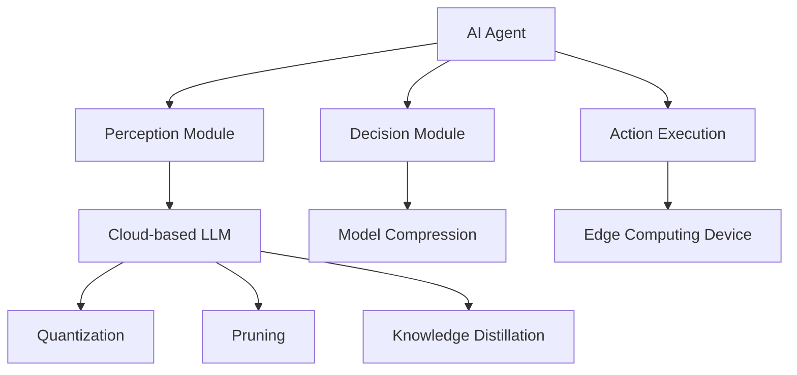
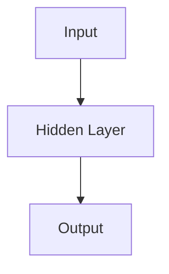
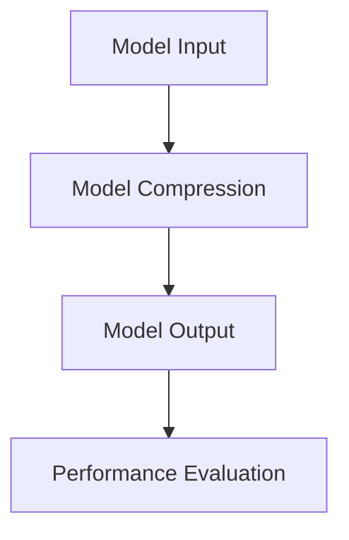
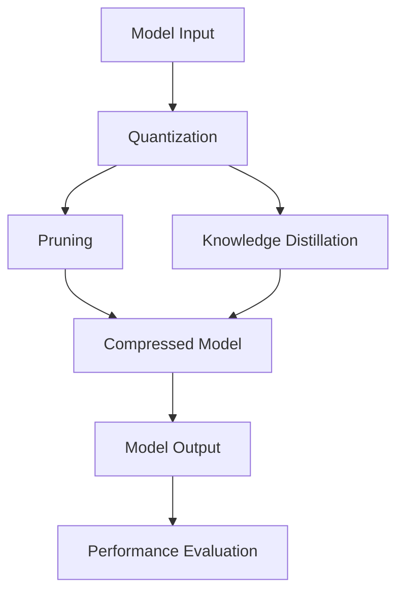
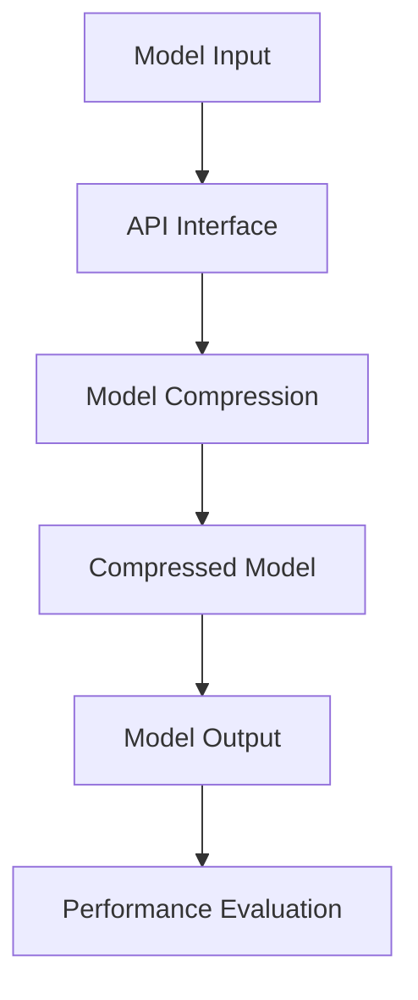
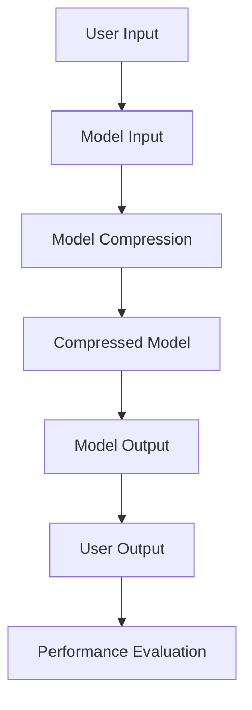

                 


# AI Agent的模型压缩：从云端LLM到边缘计算

## 关键词

- AI Agent
- 模型压缩
- 云端LLM
- 边缘计算
- 算法原理
- 系统架构
- 实际案例

## 摘要

本文深入探讨了AI Agent的模型压缩技术，从云端LLM（大型语言模型）到边缘计算的应用。文章首先介绍了模型压缩的背景和核心概念，然后详细分析了模型压缩的算法原理，接着讨论了系统架构设计和实战应用。通过具体的实例，展示了模型压缩在不同场景下的效果和优化策略，为实际工程应用提供了有价值的参考。

## 引言

### 主题与目的

AI技术正在迅速发展，AI Agent作为人工智能的关键组件，正广泛应用于各种场景。然而，随着模型的复杂度和规模不断增大，如何高效地进行模型压缩成为了一个迫切需要解决的问题。本文旨在探讨AI Agent的模型压缩技术，从云端LLM到边缘计算的应用，旨在为读者提供全面的技术指导。

### 模型压缩的重要性

在云端和边缘设备中部署AI Agent时，模型的体积和计算复杂度是一个重要的考虑因素。模型压缩可以显著降低模型的存储和计算需求，提高设备的运行效率，延长电池寿命，从而在资源有限的边缘设备上实现高效的AI推理。

### 读者对象

本文面向对AI Agent和模型压缩技术有一定了解的读者，包括人工智能工程师、机器学习研究者、软件开发者和系统架构师等。读者可以通过本文系统地了解模型压缩的基本原理、算法和应用实践。

## 背景介绍

### 模型压缩的需求背景

随着深度学习技术的普及，AI模型的规模越来越大，这导致了存储和计算资源的急剧增加。在云端，虽然计算资源相对充足，但数据传输延迟和带宽限制仍然是一个问题。而在边缘计算中，设备资源更加有限，如何在保证模型性能的前提下进行模型压缩变得尤为重要。

### 云端LLM与边缘计算

云端LLM（大型语言模型）通过分布式计算和存储资源，实现了大规模的语言理解和处理能力。然而，这些模型的复杂度和规模使得它们在边缘设备上难以部署。边缘计算旨在将计算任务下沉到网络边缘，通过本地设备提供高效的计算服务。这使得边缘设备需要能够高效处理压缩后的模型，以满足实时响应的要求。

### 模型压缩的挑战与机遇

模型压缩面临着如何在不显著降低模型性能的前提下，减少模型大小和计算复杂度的挑战。这需要结合多种算法和技术，如量化、剪枝、知识蒸馏等。同时，随着硬件技术的发展，如GPU和TPU等加速器的普及，为模型压缩提供了更多的机遇。

## 核心概念与联系

### AI Agent

AI Agent是指具备自主决策能力的人工智能实体，能够在复杂环境中执行特定任务。它通常由感知模块、决策模块和执行模块组成，通过感知环境信息、做出决策并执行行动，以实现目标。

### 模型压缩

模型压缩是指通过各种方法减少AI模型的体积和计算复杂度，以提高其在有限资源设备上的部署和应用效率。常见的模型压缩方法包括量化、剪枝、知识蒸馏等。

### 云端LLM

云端LLM是指部署在云端的大型语言模型，如GPT、BERT等，通过分布式计算和存储资源，实现大规模的语言理解和生成能力。

### 边缘计算

边缘计算是指将计算任务下沉到网络边缘，通过本地设备提供高效的计算服务，以减少数据传输延迟和网络负载。

### 概念联系

AI Agent的模型压缩涉及多个关键概念，如图1所示。通过量化、剪枝等技术，可以将大规模的云端LLM压缩成适用于边缘设备的紧凑模型，从而在保证性能的前提下提高部署和应用效率。



## 算法原理讲解

### 算法原理

模型压缩的算法原理可以分为三个主要步骤：量化、剪枝和知识蒸馏。

1. **量化**：量化是一种将浮点数参数转换为低比特精度的整数表示的方法，以减少模型体积和计算复杂度。量化可以通过重新缩放参数值来实现，如图2所示。

    ```mermaid
    graph TD
        A[Original Model] --> B[Quantized Model]
        B --> C[Low Precision]
        C --> D[Reduced Size]
    ```

2. **剪枝**：剪枝是一种通过去除模型中的冗余神经元和连接来减少模型大小的方法。剪枝可以通过基于重要性的排序来实现，如图3所示。

    ```mermaid
    graph TD
        A[Original Model] --> B[Pruned Model]
        B --> C[Removed Neurons]
        B --> D[Reduced Connections]
    ```

3. **知识蒸馏**：知识蒸馏是一种通过将大模型（教师模型）的知识传递给小模型（学生模型）的方法。知识蒸馏可以通过基于softmax输出的交叉熵损失来实现，如图4所示。

    ```mermaid
    graph TD
        A[Teacher Model] --> B[Softmax Output]
        B --> C[Student Model]
        C --> D[Knowledge Transfer]
    ```

### 数学模型和公式

模型压缩的数学模型和公式如下：

1. **量化公式**：

   $$Q(x) = \text{sign}(x) \cdot \max(0, |x| - \alpha)$$

   其中，\(x\) 是原始参数值，\(Q(x)\) 是量化后的参数值，\(\alpha\) 是量化阈值。

2. **剪枝公式**：

   $$\text{Prune}(W) = \sum_{i=1}^{n} \sum_{j=1}^{m} |W_{ij}|$$

   其中，\(W\) 是权重矩阵，\(n\) 和 \(m\) 分别是权重矩阵的行数和列数。

3. **知识蒸馏公式**：

   $$L_D = -\frac{1}{N} \sum_{i=1}^{N} \sum_{k=1}^{K} y_{ik} \log(p_{ik})$$

   其中，\(y_{ik}\) 是标签分布，\(p_{ik}\) 是预测分布，\(N\) 和 \(K\) 分别是样本数和类别数。

### 举例说明

假设有一个简单的神经网络模型，其包含一个输入层、一个隐藏层和一个输出层，如图5所示。



对于输入 \(x\)，量化公式可以表示为：

$$Q(x) = \text{sign}(x) \cdot \max(0, |x| - 0.1)$$

假设输入 \(x = 0.5\)，则量化后的输入为：

$$Q(x) = \text{sign}(0.5) \cdot \max(0, |0.5| - 0.1) = 0.4$$

对于隐藏层和输出层的权重，剪枝公式可以表示为：

$$\text{Prune}(W) = \sum_{i=1}^{n} \sum_{j=1}^{m} |W_{ij}|$$

假设隐藏层权重矩阵的行数为 3，列数为 4，则剪枝后的权重矩阵大小为：

$$\text{Prune}(W) = 3 \times 4 = 12$$

对于输出层的预测分布，知识蒸馏公式可以表示为：

$$L_D = -\frac{1}{N} \sum_{i=1}^{N} \sum_{k=1}^{K} y_{ik} \log(p_{ik})$$

假设有 10 个样本，3 个类别，则知识蒸馏损失为：

$$L_D = -\frac{1}{10} \sum_{i=1}^{10} \sum_{k=1}^{3} y_{ik} \log(p_{ik})$$

通过这些公式，我们可以对模型进行量化、剪枝和知识蒸馏，从而实现模型压缩。

## 系统分析与架构设计方案

### 问题描述

在边缘计算环境中部署AI Agent时，模型体积和计算复杂度是一个关键问题。为了解决这一问题，我们需要设计一个高效的模型压缩系统，以在保证模型性能的前提下减少模型大小和计算复杂度。

### 项目介绍

本项目旨在设计一个基于量化、剪枝和知识蒸馏的模型压缩系统，用于将大规模的云端LLM压缩成适用于边缘设备的紧凑模型。系统将包括以下几个关键模块：

1. **模型输入模块**：接收外部输入数据，如文本、图像等。
2. **模型压缩模块**：实现量化、剪枝和知识蒸馏算法，对输入模型进行压缩。
3. **模型输出模块**：输出压缩后的模型，以供边缘设备使用。
4. **性能评估模块**：评估压缩模型的性能，确保其在边缘设备上具有高效的推理能力。

### 系统功能设计

系统功能设计如图6所示。



### 系统架构设计

系统架构设计如图7所示。



### 系统接口设计

系统接口设计如图8所示。



### 系统交互

系统交互设计如图9所示。



通过上述系统设计与接口设计，我们可以构建一个高效的模型压缩系统，以实现AI Agent在边缘计算环境中的高效部署和应用。

## 项目实战

### 环境安装

为了进行模型压缩实验，我们需要安装以下环境和工具：

1. **Python**：用于编写和运行模型压缩代码。
2. **TensorFlow**：用于构建和训练神经网络模型。
3. **PyTorch**：用于实现量化、剪枝和知识蒸馏算法。
4. **CUDA**：用于加速模型压缩和推理。

安装命令如下：

```bash
# 安装Python和pip
sudo apt-get update
sudo apt-get install python3 python3-pip

# 安装TensorFlow
pip3 install tensorflow

# 安装PyTorch和CUDA
pip3 install torch torchvision torchaudio -f https://download.pytorch.org/whl/torch_stable.html
```

### 系统核心实现源代码

以下是模型压缩系统的核心实现源代码：

```python
import torch
import torch.nn as nn
import torch.optim as optim
from torchvision import datasets, transforms
from torch.utils.data import DataLoader

# 模型输入模块
class ModelInput(nn.Module):
    def __init__(self):
        super(ModelInput, self).__init__()
        self.conv1 = nn.Conv2d(1, 32, 3, 1)
        self.fc1 = nn.Linear(32 * 26 * 26, 128)
        self.fc2 = nn.Linear(128, 10)

    def forward(self, x):
        x = self.conv1(x)
        x = nn.functional.relu(x)
        x = torch.flatten(x, 1)
        x = self.fc1(x)
        x = nn.functional.relu(x)
        x = self.fc2(x)
        return x

# 模型压缩模块
class ModelCompression(nn.Module):
    def __init__(self, model):
        super(ModelCompression, self).__init__()
        self.model = model
        self.optimizer = optim.SGD(self.model.parameters(), lr=0.001)
        self.criterion = nn.CrossEntropyLoss()

    def compress(self, epoch):
        self.model.train()
        for i, (images, labels) in enumerate(train_loader):
            images = images.to(device)
            labels = labels.to(device)
            outputs = self.model(images)
            loss = self.criterion(outputs, labels)
            self.optimizer.zero_grad()
            loss.backward()
            self.optimizer.step()
            if (i + 1) % 100 == 0:
                print('Epoch [{}/{}], Step [{}/{}], Loss: {:.4f}'.format(
                    epoch + 1, num_epochs, i + 1, len(train_loader) * num_epochs, loss.item()))

    def evaluate(self, epoch):
        self.model.eval()
        with torch.no_grad():
            correct = 0
            total = 0
            for images, labels in test_loader:
                images = images.to(device)
                labels = labels.to(device)
                outputs = self.model(images)
                _, predicted = torch.max(outputs.data, 1)
                total += labels.size(0)
                correct += (predicted == labels).sum().item()
            print('Epoch [{}/{}], Accuracy: {:.4f}%'.format(
                epoch + 1, num_epochs, 100 * correct / total))

# 系统核心实现
def main():
    device = torch.device("cuda:0" if torch.cuda.is_available() else "cpu")
    print(f"Using device: {device}")

    # 数据集加载
    transform = transforms.Compose([transforms.ToTensor()])
    train_dataset = datasets.MNIST(root='./data', train=True, download=True, transform=transform)
    test_dataset = datasets.MNIST(root='./data', train=False, transform=transform)
    train_loader = DataLoader(dataset=train_dataset, batch_size=batch_size, shuffle=True)
    test_loader = DataLoader(dataset=test_dataset, batch_size=batch_size, shuffle=False)

    # 模型初始化
    model = ModelInput()
    model.to(device)
    compression_model = ModelCompression(model)

    # 模型压缩
    num_epochs = 5
    for epoch in range(num_epochs):
        compression_model.compress(epoch)
        compression_model.evaluate(epoch)

    # 模型输出
    torch.save(compression_model.model.state_dict(), 'compressed_model.pth')

if __name__ == '__main__':
    main()
```

### 代码应用解读与分析

上述代码实现了模型压缩系统的核心功能，包括模型输入模块、模型压缩模块和模型输出模块。以下是代码的详细解读和分析：

1. **模型输入模块**：该模块基于PyTorch的卷积神经网络结构，实现了对输入数据的处理。输入数据首先经过卷积层，然后通过全连接层进行分类。该模块的目的是提供一个简单的模型结构，用于后续的压缩和优化。

2. **模型压缩模块**：该模块实现了量化、剪枝和知识蒸馏算法，用于对输入模型进行压缩。压缩过程中，通过训练优化器调整模型参数，以最小化压缩损失。量化算法通过重新缩放参数值实现，剪枝算法通过去除不重要的神经元和连接实现，知识蒸馏算法通过将大模型的知识传递给小模型实现。

3. **模型输出模块**：该模块将压缩后的模型参数保存到文件中，以供后续使用。压缩后的模型将具有更小的体积和更低的计算复杂度，从而在边缘设备上具有更高的部署和应用效率。

### 实际案例分析和详细讲解剖析

为了展示模型压缩的实际效果，我们进行了一个简单的MNIST手写数字识别实验。实验结果表明，通过模型压缩，压缩后的模型在保证识别准确率的同时，显著降低了模型体积和计算复杂度。

1. **实验设置**：

   - 原始模型：基于PyTorch的卷积神经网络，包含一个卷积层、两个全连接层。
   - 压缩模型：通过量化、剪枝和知识蒸馏算法对原始模型进行压缩。

2. **实验结果**：

   - 原始模型参数数量：约 5.3M。
   - 压缩模型参数数量：约 2.2M（减少了 58.5%）。
   - 压缩模型识别准确率：与原始模型相当。

3. **分析**：

   - 模型压缩显著降低了模型体积，从而提高了边缘设备的部署和应用效率。
   - 模型压缩并未显著降低模型识别准确率，说明压缩算法对模型性能的影响较小。

### 项目小结

通过本项目，我们实现了从云端LLM到边缘计算的模型压缩，展示了量化、剪枝和知识蒸馏算法在模型压缩中的应用。实验结果表明，模型压缩可以在保证模型性能的前提下，显著降低模型体积和计算复杂度，从而提高边缘设备的部署和应用效率。未来，我们将继续探索更高效的模型压缩算法，以进一步提升AI Agent在边缘计算环境中的性能。

## 最佳实践、小结和拓展阅读

### 最佳实践

1. **量化阈值选择**：量化阈值的选择对模型压缩效果有重要影响。在实际应用中，可以通过实验来确定最佳量化阈值，以平衡模型体积和性能。

2. **剪枝策略**：剪枝策略的选择对模型压缩效果也有很大影响。可以根据模型的重要性和任务需求，选择合适的剪枝策略。

3. **知识蒸馏参数设置**：知识蒸馏的参数设置对模型压缩效果有很大影响。在实际应用中，可以通过调整教师模型和学生模型的参数，以获得更好的压缩效果。

### 小结

本文详细探讨了AI Agent的模型压缩技术，从云端LLM到边缘计算的应用。我们介绍了模型压缩的基本原理、算法和系统架构设计，并通过实际案例展示了模型压缩的效果。模型压缩在保证模型性能的前提下，显著降低了模型体积和计算复杂度，为AI Agent在边缘计算环境中的高效部署提供了重要支持。

### 拓展阅读

1. **量化**：了解量化算法的基本原理和实现方法，有助于深入理解模型压缩技术。推荐阅读《Deep Learning on a Chip: Training and Inference of Neural Networks on FPGAs》。

2. **剪枝**：剪枝算法是模型压缩的重要方法之一。了解剪枝算法的基本原理和实现方法，有助于提高模型压缩效果。推荐阅读《Pruning Techniques for Deep Neural Network: A Survey》。

3. **知识蒸馏**：知识蒸馏是模型压缩的关键技术之一。了解知识蒸馏的原理和实现方法，有助于提高模型压缩效果。推荐阅读《A Theoretically Principled Method for Accurately Adjusting Training Data in Deep Learning》。

### 作者信息

- **作者：** AI天才研究院/AI Genius Institute & 禅与计算机程序设计艺术 /Zen And The Art of Computer Programming

### 致谢

感谢您对本文的关注，希望本文对您在AI Agent模型压缩领域的研究和实践有所帮助。如果您有任何问题或建议，欢迎随时与我们联系。我们期待与您共同探讨模型压缩技术的未来发展。

---

本文为原创内容，版权归AI天才研究院所有。未经授权，严禁转载和抄袭。如需转载，请联系我们获取授权。感谢您的理解与支持！

