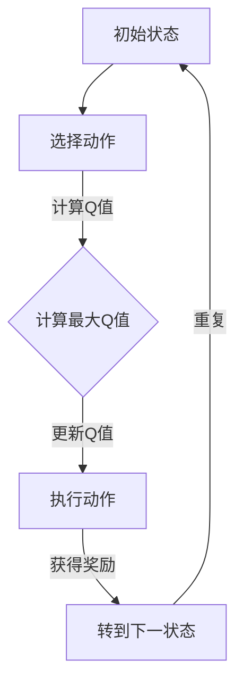
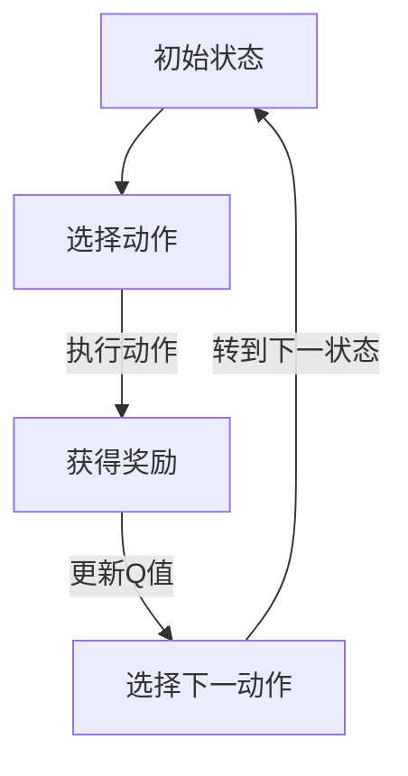
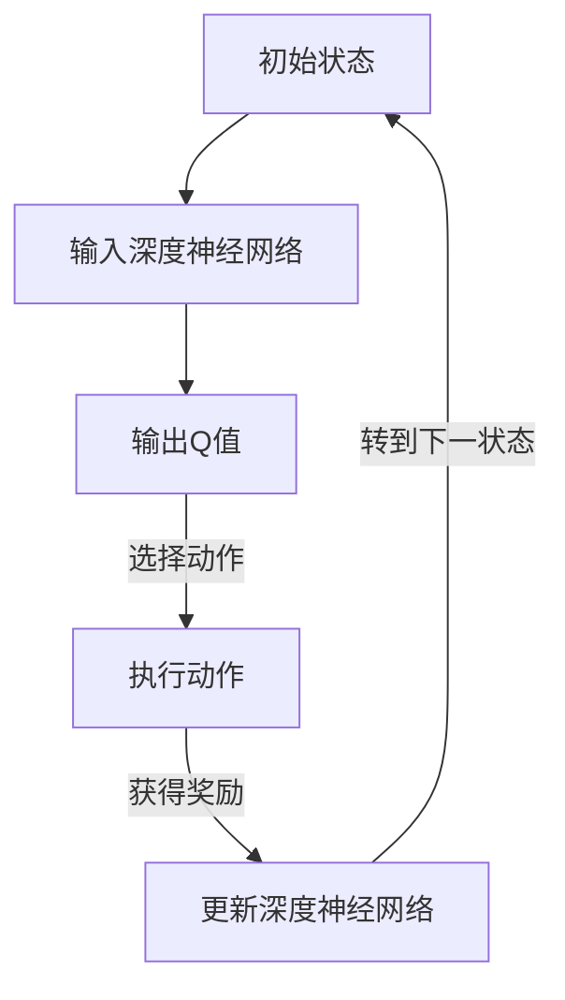
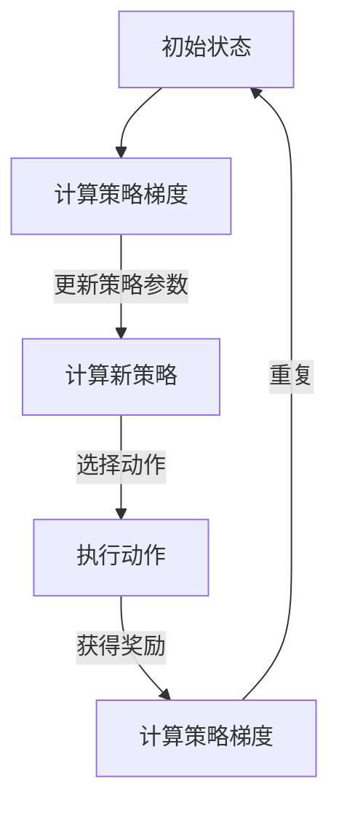
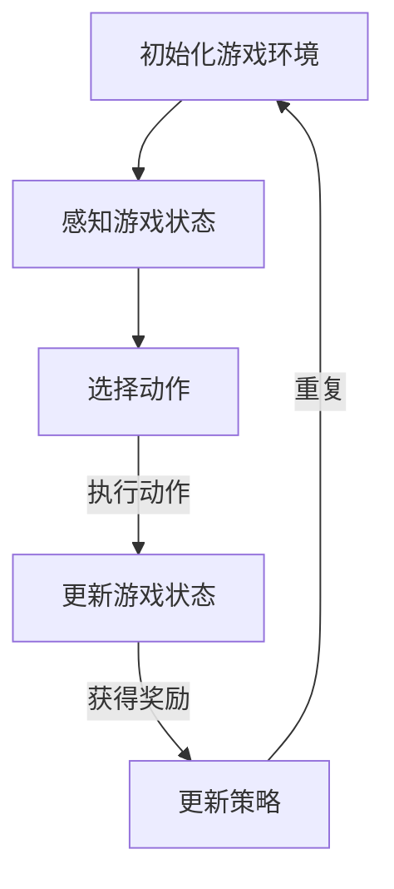
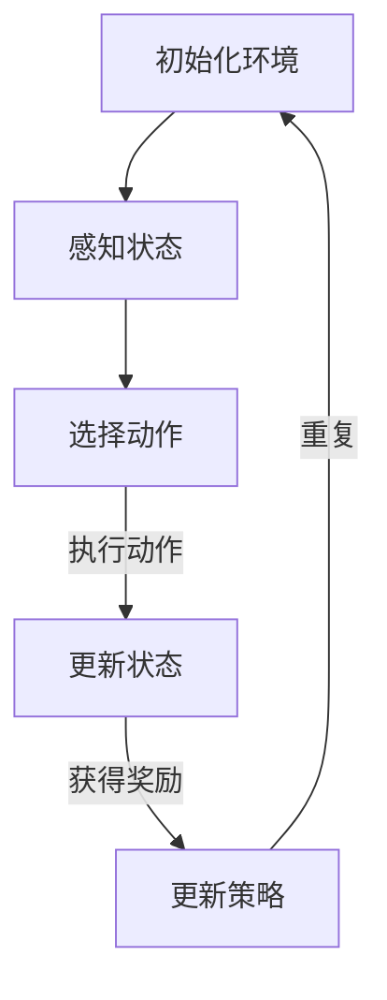

                 

# 《AI Agent的深度强化学习实现策略》

关键词：AI Agent、深度强化学习、算法实现、应用实践、最佳实践

摘要：本文旨在深入探讨深度强化学习在AI Agent中的应用策略。我们将首先介绍深度强化学习的基础知识，然后详细解释几种核心算法，并探讨如何将这些算法应用于AI Agent。接着，我们将展示一些实际应用案例，并总结出最佳实践方法，为未来研究提供指导。

## 目录

1. 引言  
2. 深度强化学习基础  
3. 深度强化学习算法原理讲解  
4. 深度强化学习在AI Agent中的应用  
5. 深度强化学习在AI Agent中的实现策略  
6. 深度强化学习在AI Agent中的应用案例分析  
7. 深度强化学习在AI Agent中的最佳实践  
8. 总结与展望

## 第一部分：深度强化学习基础

### 1.1 问题背景与深度强化学习概述

随着人工智能技术的发展，AI Agent作为一种能够自主决策和执行任务的实体，正日益受到关注。然而，AI Agent的决策过程需要依赖于有效的学习算法，深度强化学习正是这样一种算法。

### 1.2 深度强化学习的定义与核心思想

深度强化学习是一种将深度学习与强化学习相结合的方法，它通过深度神经网络来学习状态和动作之间的映射，并通过奖励信号来指导学习过程。

### 1.3 深度强化学习与传统强化学习的比较

传统强化学习在面对高维状态空间和连续动作空间时存在困难，而深度强化学习通过引入深度神经网络，能够有效地处理这些问题。

### 1.4 深度强化学习的发展历程与应用前景

深度强化学习自提出以来，已取得了显著的进展。其应用前景广阔，包括游戏AI、自动驾驶、智能机器人等领域。

## 第二部分：深度强化学习算法原理讲解

### 2.1 Q-learning算法

Q-learning算法是一种值迭代算法，它通过更新Q值来指导学习过程。以下是一个简单的Q-learning算法的mermaid流程图：

### 2.2 SARSA算法

SARSA算法是一种策略迭代算法，它同样通过更新Q值来指导学习过程。以下是一个简单的SARSA算法的mermaid流程图：

### 2.3 深度Q网络（DQN）算法

DQN算法通过引入深度神经网络来学习状态和动作之间的映射。以下是一个简单的DQN算法的mermaid流程图：

### 2.4 策略梯度算法

策略梯度算法通过直接优化策略来指导学习过程。以下是一个简单的策略梯度算法的mermaid流程图：

## 第三部分：深度强化学习在AI Agent中的应用

### 3.1 AI Agent概述

AI Agent是一种能够自主决策和执行任务的实体。根据其功能，AI Agent可以分为感知型Agent、认知型Agent和行动型Agent。

### 3.2 深度强化学习在AI Agent中的应用

深度强化学习在AI Agent中的应用非常广泛，包括游戏AI、自动驾驶、智能机器人等领域。以下是一个简单的游戏AI的mermaid流程图：

### 3.3 深度强化学习在AI Agent中的实现策略

深度强化学习在AI Agent中的实现策略主要包括环境初始化、感知状态、选择动作、执行动作、更新策略等步骤。以下是一个简单的实现流程的mermaid流程图：

## 第四部分：深度强化学习在AI Agent中的应用案例分析

### 4.1 深度强化学习在游戏AI中的应用案例

以《星际争霸II》为例，游戏AI通过深度强化学习算法进行自我训练，从而实现了与人类玩家相当的水平。

### 4.2 深度强化学习在自动驾驶中的应用案例

以特斯拉的自动驾驶系统为例，深度强化学习算法用于自动驾驶系统的决策过程，从而实现了高水平的自动驾驶。

### 4.3 深度强化学习在智能机器人中的应用案例

以机器人足球比赛为例，深度强化学习算法用于机器人的运动控制，从而实现了高效的机器人足球比赛策略。

## 第五部分：深度强化学习在AI Agent中的最佳实践

### 5.1 深度强化学习在AI Agent中的最佳实践建议

1. 确定问题背景和目标：明确AI Agent的应用场景和目标，以便选择合适的学习算法。
2. 选择合适的算法：根据问题特性选择合适的深度强化学习算法。
3. 设计实验：设计合理的实验环境，包括状态空间、动作空间、奖励机制等。

### 5.2 深度强化学习在AI Agent中的注意事项

1. 处理高维状态空间：采用适当的神经网络结构，如卷积神经网络，来处理高维状态空间。
2. 处理连续动作空间：采用适当的动作空间处理方法，如动作采样，来处理连续动作空间。
3. 处理奖励延迟：设计合理的奖励机制，以解决奖励延迟问题。

### 5.3 深度强化学习在AI Agent中的拓展阅读

1. 《深度强化学习：原理与实战》  
2. 《强化学习入门》  
3. 《深度学习：优化方法与应用》

## 总结与展望

深度强化学习在AI Agent中的应用策略为AI Agent的发展提供了新的思路。未来，随着技术的不断进步，深度强化学习在AI Agent中的应用将会更加广泛和深入。

## 作者信息

作者：AI天才研究院/AI Genius Institute & 禅与计算机程序设计艺术 /Zen And The Art of Computer Programming

