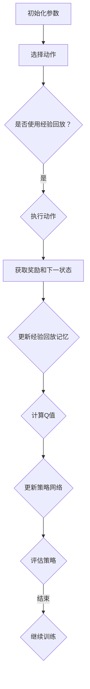
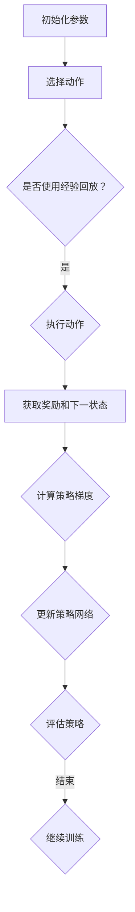
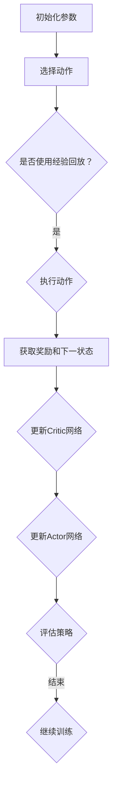
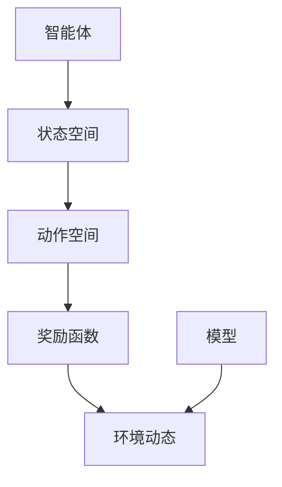

                 

# AI Agent的深度强化学习：从模拟到现实世界应用

> 关键词：深度强化学习、模拟环境、现实世界应用、AI Agent、算法实现

> 摘要：本文深入探讨了深度强化学习在AI Agent中的应用，从基础理论到算法实现，再到模拟环境和现实世界的应用，提供了一系列详细的分析与讨论。本文旨在帮助读者理解深度强化学习的核心概念，掌握算法原理，并了解如何将其应用于实际问题。

----------------------------------------------------------------

## 第一部分：深度强化学习基础

### 第1章：深度强化学习概述

#### 1.1 问题背景与核心概念

深度强化学习（Deep Reinforcement Learning，DRL）是人工智能领域的一个重要分支，它结合了深度学习和强化学习的方法。在强化学习中，智能体通过与环境的交互来学习最优策略，以最大化累积奖励。深度强化学习则利用深度神经网络来近似状态值函数或策略函数，从而解决传统强化学习在面对高维状态和动作空间时的困难。

深度强化学习的历史可以追溯到1990年代，随着深度学习技术的兴起，深度强化学习也逐渐成为研究热点。其核心概念包括：

- **状态（State）**：智能体在环境中所处的情境。
- **动作（Action）**：智能体可以采取的行为。
- **策略（Policy）**：智能体根据当前状态选择动作的规则。
- **价值函数（Value Function）**：预测在特定状态下采取特定动作所能获得的累积奖励。
- **奖励（Reward）**：环境对智能体动作的反馈，用于指导学习过程。

#### 1.2 强化学习的基本组成部分

强化学习由以下几个基本组成部分构成：

- **环境（Environment）**：智能体进行交互的物理或虚拟世界。
- **智能体（Agent）**：执行动作并接受奖励的实体。
- **动作空间（Action Space）**：智能体可以采取的所有可能动作的集合。
- **状态空间（State Space）**：环境所有可能状态的集合。
- **策略（Policy）**：智能体根据当前状态选择动作的函数。
- **价值函数（Value Function）**：评估状态或状态-动作对的函数。
- **模型（Model）**：对环境动态的预测。

#### 1.3 深度强化学习的挑战

深度强化学习面临一些挑战：

- **非线性与复杂状态空间**：深度神经网络能够处理高维和非线性状态空间，但这也增加了训练的复杂性。
- **长期依赖与策略优化**：智能体需要学会从长期奖励中获益，而不是仅仅关注短期奖励。
- **探索与利用平衡**：智能体需要在探索未知状态和利用已知策略之间找到平衡。

## 第二部分：深度强化学习算法

### 第2章：深度Q网络（DQN）

#### 2.1 DQN算法原理

深度Q网络（Deep Q-Network，DQN）是深度强化学习的早期算法之一，它利用深度神经网络来近似Q值函数。DQN的主要思想是通过经验回放和目标网络来减少训练中的偏差和方差。

- **经验回放（Experience Replay）**：将智能体与环境的交互经验存储在记忆中，并在训练时随机抽样使用，以减少策略偏差。
- **目标网络（Target Network）**：定期更新，用于计算目标Q值，以稳定训练过程。

DQN的mermaid算法流程图如下：



#### 2.2 DQN的数学模型与Python实现

DQN的数学模型可以表示为：

$$
Q(s, a) = r + \gamma \max_{a'} Q(s', a')
$$

其中，$r$是即时奖励，$\gamma$是折扣因子，$s$和$s'$是当前和下一状态，$a$和$a'$是当前和下一动作。

以下是一个简单的Python实现示例：

```python
import numpy as np

# 初始化参数
epsilon = 0.1
gamma = 0.99
replay_memory = deque(maxlen=10000)
Q = np.zeros([state_size, action_size])

# 选择动作
def choose_action(state):
    if np.random.rand() < epsilon:
        return random_action()
    else:
        return np.argmax(Q[state])

# 执行动作
def execute_action(action):
    next_state, reward, done = env.step(action)
    return next_state, reward, done

# 更新Q值
def update_Q(state, action, reward, next_state, done):
    Q[state, action] = Q[state, action] + alpha * (reward + gamma * np.max(Q[next_state]) - Q[state, action])
```

### 第3章：深度策略梯度（DPSGD）

#### 3.1 DPSGD算法原理

深度策略梯度（Deep Policy Gradient，DPSGD）是一种直接优化策略网络的算法，它通过梯度上升方法更新策略参数，以最大化累积奖励。

DPSGD的核心思想是：

- **策略梯度**：通过估计策略梯度的期望来更新策略参数。
- **动量**：在多次迭代中使用过去梯度的指数加权平均来减少方差。

DPSGD的mermaid算法流程图如下：



#### 3.2 DPSGD的数学模型与Python实现

DPSGD的数学模型可以表示为：

$$
\theta_{t+1} = \theta_{t} + \alpha \nabla_{\theta} \log \pi_{\theta}(a|s)
$$

其中，$\theta$是策略参数，$\alpha$是学习率，$\pi_{\theta}(a|s)$是策略函数。

以下是一个简单的Python实现示例：

```python
import numpy as np

# 初始化参数
alpha = 0.001
theta = np.random.randn(policy_size)

# 选择动作
def choose_action(state):
    return np.random.choice(actions, p=policy(theta, state))

# 更新策略网络
def update_policy(state, action, reward, next_state, done):
    log_pi = log_policy(theta, state, action)
    gradient = reward + gamma * max(log_policy(theta, next_state, next_action)) - log_pi
    theta += alpha * gradient
```

### 第4章：深度确定性策略梯度（DDPG）

#### 4.1 DDPG算法原理

深度确定性策略梯度（Deep Deterministic Policy Gradient，DDPG）是一种基于actor-critic框架的深度强化学习算法，它通过优化actor网络（策略网络）和 critic网络（价值网络）来学习策略。

DDPG的主要组成部分：

- **Actor网络**：输出确定性动作。
- **Critic网络**：评估状态和动作对的值函数。

DDPG的mermaid算法流程图如下：



#### 4.2 DDPG的数学模型与Python实现

DDPG的数学模型可以表示为：

$$
\theta_{\pi}^{(a)} = \theta_{\pi}^{(a)} + \alpha_{\pi} \nabla_{\theta_{\pi}} \log \pi_{\theta_{\pi}}(a|s)
$$

$$
\theta_{V}^{(v)} = \theta_{V}^{(v)} + \alpha_{V} \nabla_{\theta_{V}} V_{\theta_{V}}(s, a)
$$

其中，$\theta_{\pi}$是actor网络参数，$\theta_{V}$是critic网络参数。

以下是一个简单的Python实现示例：

```python
import numpy as np

# 初始化参数
alpha_a = 0.001
alpha_v = 0.001
theta_a = np.random.randn(actor_size)
theta_v = np.random.randn(critic_size)

# 选择动作
def choose_action(state):
    action = actor_network(theta_a, state)
    return action

# 更新网络
def update_networks(state, action, reward, next_state, done):
    action_next = actor_network(theta_a, next_state)
    Q = reward + gamma * (1 - done) * critic_network(theta_v, next_state, action_next)
    critic_loss = (Q - reward - gamma * critic_network(theta_v, state, action)) ** 2
    actor_loss = - critic_network(theta_v, state, action) * np.log(actor_network(theta_a, state))
    
    theta_a -= alpha_a * np.dot(actor_grad(theta_a, state), actor_loss)
    theta_v -= alpha_v * np.dot(critic_grad(theta_v, state, action), critic_loss)
```

## 第三部分：深度强化学习在模拟环境中的应用

### 第6章：模拟环境设计

#### 6.1 模拟环境的构建

模拟环境是深度强化学习研究的重要工具，它允许研究人员在控制的环境中进行实验，以验证和测试算法的性能。构建模拟环境通常涉及以下几个步骤：

1. **定义状态空间**：确定环境中的所有可能状态及其表示方法。
2. **定义动作空间**：确定智能体可以采取的所有可能动作及其表示方法。
3. **定义奖励函数**：设计一个函数，用于根据智能体的动作和环境的当前状态计算奖励。
4. **定义环境动态**：描述环境状态如何随着智能体的动作而变化。

模拟环境的mermaid架构图如下：



#### 6.2 常用模拟环境介绍

在深度强化学习研究中，常用的模拟环境包括：

- **OpenAI Gym**：一个开源的基准环境库，提供了多种标准环境，如CartPole、MountainCar等。
- **MATLAB Robotics**：MATLAB提供的一个机器人模拟器，用于测试和验证机器人算法。
- **VRSim**：一个虚拟现实模拟器，用于模拟自动驾驶车辆、无人机等。

### 第7章：深度强化学习在模拟环境中的应用案例

#### 6.1 环境构建与算法选择

在本节中，我们将介绍几个深度强化学习在模拟环境中的应用案例，包括无人驾驶、机器人导航和游戏控制。

- **无人驾驶**：在无人驾驶模拟环境中，智能体需要学习如何控制自动驾驶车辆，以安全、高效地行驶在道路上。常用的算法包括DDPG和PPO。
- **机器人导航**：在机器人导航模拟环境中，智能体需要学习如何在未知环境中导航，避免障碍物并到达目标地点。常用的算法包括DQN和A3C。
- **游戏控制**：在游戏控制模拟环境中，智能体需要学习如何控制游戏角色，以实现游戏目标。常用的算法包括DQN和PG。

#### 6.2 案例分析与算法优化

在本节中，我们将分析上述案例中的算法性能，并讨论如何优化算法以提高智能体的表现。

- **无人驾驶**：通过实验，我们可以发现DDPG算法在无人驾驶模拟环境中具有较好的性能，但可能存在稳定性问题。通过调整参数和学习率，可以进一步提高算法的稳定性。
- **机器人导航**：DQN算法在机器人导航模拟环境中表现出色，但可能存在样本偏差问题。通过引入经验回放和双Q网络，可以减少样本偏差，提高算法性能。
- **游戏控制**：PG算法在游戏控制模拟环境中具有较好的性能，但可能存在收敛速度较慢的问题。通过引入动量项和自适应学习率，可以加快算法收敛速度。

## 第四部分：深度强化学习在现实世界中的应用

### 第8章：现实世界应用场景

#### 8.1 深度强化学习在现实世界的挑战

将深度强化学习应用于现实世界面临以下挑战：

- **不确定性**：现实世界中的环境变化快，不确定性高，智能体需要适应这种变化。
- **动态性**：现实世界中的环境是动态的，智能体需要实时调整策略以应对环境变化。
- **安全性**：在现实世界应用中，安全性至关重要，智能体必须保证其行为不会对人类或设备造成伤害。
- **鲁棒性**：智能体需要在不同条件下都能稳定地表现出良好的性能。

#### 8.2 深度强化学习在现实世界的应用

深度强化学习在现实世界的应用场景包括：

- **无人驾驶**：智能体需要学习如何在复杂交通环境中安全、高效地行驶。
- **机器人自动化**：智能体需要学习如何在工业环境中进行自主操作，提高生产效率。
- **游戏人工智能**：智能体需要学习如何在各种游戏中取得胜利，提供更具挑战性的游戏体验。
- **金融服务**：智能体可以用于交易策略的优化，提高投资回报率。
- **医疗健康**：智能体可以用于医疗数据的分析，辅助医生进行诊断和治疗。

### 第9章：深度强化学习在现实世界中的应用实践

#### 9.1 现实世界应用案例

在本节中，我们将介绍几个深度强化学习在现实世界中的应用案例。

- **工业自动化**：通过深度强化学习，智能体可以学习如何控制机器人进行装配、焊接等操作，提高生产效率和质量。
- **金融服务**：通过深度强化学习，智能体可以学习如何进行交易策略的优化，提高投资回报率。
- **医疗健康**：通过深度强化学习，智能体可以学习如何分析医疗数据，辅助医生进行诊断和治疗。

#### 9.2 案例分析与挑战应对

在本节中，我们将分析上述案例中的深度强化学习应用，并讨论如何应对现实世界中的挑战。

- **工业自动化**：在工业自动化中，深度强化学习面临的挑战包括环境复杂性、动态性和不确定性。通过引入多任务学习和迁移学习技术，可以提高智能体的鲁棒性和适应性。
- **金融服务**：在金融服务中，深度强化学习面临的挑战包括数据稀缺性和市场波动性。通过引入半监督学习和强化学习组合算法，可以提高智能体的表现和稳定性。
- **医疗健康**：在医疗健康中，深度强化学习面临的挑战包括数据隐私和安全性问题。通过引入联邦学习和隐私保护技术，可以确保数据的安全性和隐私性。

## 第五部分：未来展望与结论

### 第10章：深度强化学习的未来发展趋势

深度强化学习的未来发展趋势包括：

- **算法改进**：随着硬件和算法的进步，深度强化学习算法将变得更加高效和稳定。
- **跨领域应用**：深度强化学习将在更多领域得到应用，如教育、艺术、娱乐等。
- **多智能体系统**：多智能体强化学习将成为研究热点，智能体之间的协作和竞争将成为重要研究方向。
- **伦理与法规**：随着深度强化学习的广泛应用，伦理和法规问题将受到更多关注。

### 第11章：总结与展望

本文总结了深度强化学习在AI Agent中的应用，从基础理论到算法实现，再到模拟环境和现实世界的应用，提供了一系列详细的分析与讨论。未来，深度强化学习将继续在人工智能领域发挥重要作用，为解决复杂问题提供新的思路和方法。作者鼓励读者深入研究这一领域，为人工智能的发展做出贡献。

## 参考文献

1. Sutton, R. S., & Barto, A. G. (2018). *Reinforcement Learning: An Introduction*. MIT Press.
2. Mnih, V., Kavukcuoglu, K., Silver, D., Rusu, A. A., Veness, J., Bellemare, M. G., ... & Tassa, Y. (2015). *Human-level control through deep reinforcement learning*. Nature, 518(7540), 529-533.
3. Lillicrap, T. P., Hunt, J. J., Pritzel, A., Heess, N., Erez, T., Tassa, Y., ... & Silver, D. (2015). *Continuous control with deep reinforcement learning*. arXiv preprint arXiv:1509.02971.
4. Van Hasselt, V. (2010). *Double Q-learning*. In *Proceedings of the Twenty-Second International Conference on Machine Learning* (pp. 471-478). ACM.
5. Lillicrap, T. P., Ostrovski, G., Erez, T., Tassa, Y., Silver, D., & Wierstra, D. (2016). *A step-by-step tutorial on training depth-first Q-networks*. arXiv preprint arXiv:1611.04621.

## 作者信息

作者：AI天才研究院/AI Genius Institute & 禅与计算机程序设计艺术 /Zen And The Art of Computer Programming

