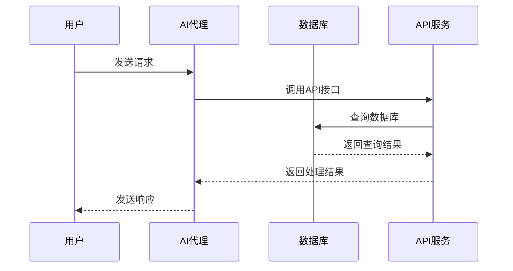
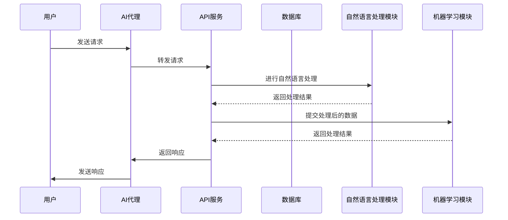
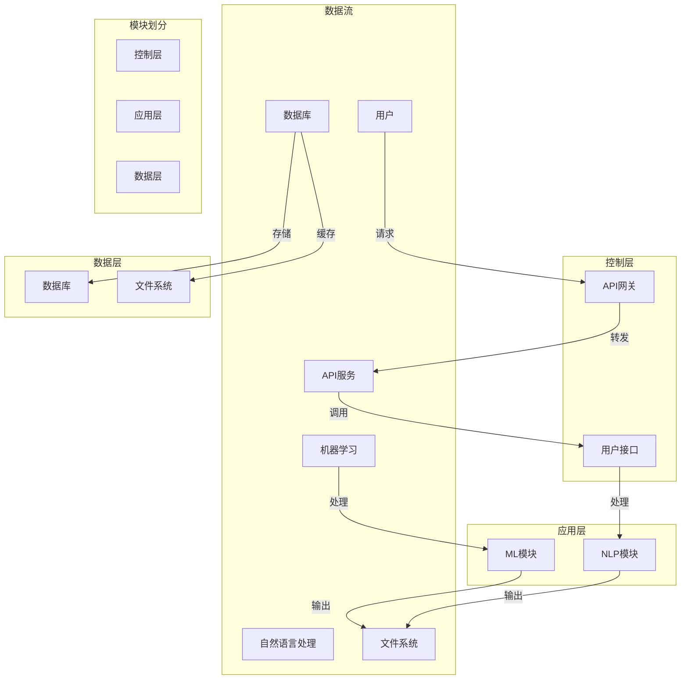
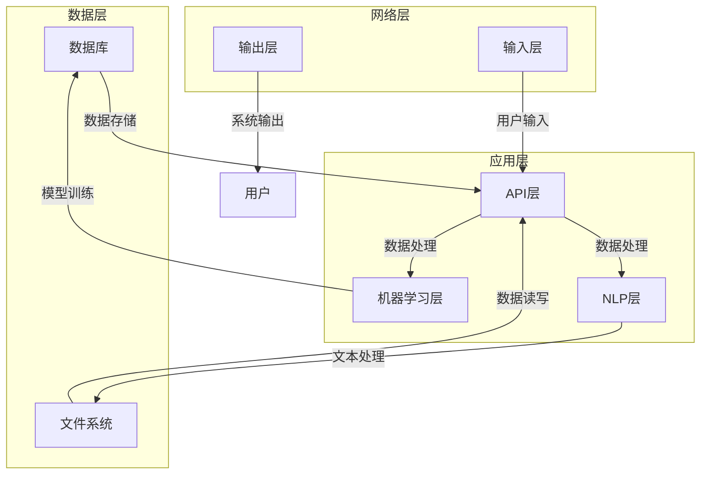
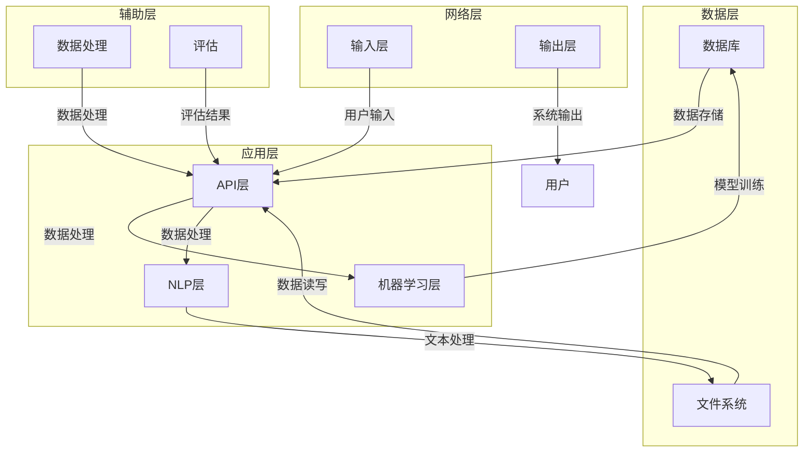

                 

### 引言

#### 1.1 书籍背景与目标

随着人工智能（AI）技术的迅猛发展，AI Agent作为一种能够自主完成特定任务的智能实体，已成为计算机科学和工程领域的重要研究方向。AI Agent在智能客服、自动驾驶、智能家居等场景中展现了巨大的应用潜力，但其开发与优化过程却面临诸多挑战。版本控制与迭代优化是确保AI Agent高质量开发与不断改进的关键环节。

本书旨在为从事AI Agent开发与优化的研究人员和工程师提供一套系统化的版本控制与迭代优化流程。通过详细阐述AI Agent的基础知识、版本控制、迭代优化方法及其在实际应用中的具体实践，帮助读者深入了解并掌握这一领域的核心技术。

#### 1.2 AI Agent的概念与重要性

AI Agent，即人工智能代理，是一种能够模拟人类智能行为，具有自主决策和行动能力的计算机程序。其基本原理基于机器学习、深度学习、自然语言处理和强化学习等技术，通过不断学习与优化，实现自主适应和智能决策。

AI Agent的重要性体现在以下几个方面：

1. **提高效率**：AI Agent能够自动化完成复杂任务，减轻人类工作负担，提高生产效率。
2. **优化决策**：AI Agent通过数据分析和智能推理，能够做出更为精准和优化的决策。
3. **拓展应用场景**：从智能客服到自动驾驶，从智能家居到智能工厂，AI Agent的应用场景日益广泛。
4. **推动产业发展**：AI Agent的广泛应用推动了人工智能技术的进步，促进了相关产业的发展。

#### 1.3 版本控制与迭代优化的意义

版本控制是确保AI Agent开发过程有序、高效的关键手段。通过版本控制，开发者可以方便地追踪代码的变更历史，快速定位和修复问题，确保代码的稳定性和一致性。同时，版本控制还能够方便团队合作，提高开发效率。

迭代优化是AI Agent不断提升性能和功能的重要途径。通过不断迭代和优化，AI Agent能够适应新的环境和需求，提高其智能决策能力。迭代优化不仅包括算法的改进，还包括模型结构的优化、训练策略的调整等。

#### 1.4 书籍结构概述

本书分为六个部分：

1. **引言**：介绍书籍的背景、目标及结构。
2. **AI Agent基础知识**：包括基本原理、关键技术、发展现状与趋势。
3. **版本控制**：介绍版本控制的基础、实践及其与AI Agent的协同。
4. **迭代优化**：介绍迭代优化的基础、实践及其对AI Agent性能的提升。
5. **案例分析**：通过具体案例，展示版本控制与迭代优化的实际应用。
6. **总结与展望**：总结本书的主要内容，展望未来发展趋势。

#### 1.5 读者预期收获

通过阅读本书，读者将：

1. **掌握AI Agent的基础知识**：了解AI Agent的定义、原理和应用场景。
2. **熟悉版本控制的方法与工具**：学会使用版本控制系统进行代码管理，提高开发效率。
3. **理解迭代优化的原理与实践**：学会通过迭代优化提升AI Agent的性能和功能。
4. **具备实际操作能力**：通过案例分析，学会将版本控制与迭代优化应用于实际项目。
5. **拓展研究方向**：了解AI Agent领域的前沿技术和发展趋势，为未来的研究提供方向。 

---

在接下来的章节中，我们将逐一深入探讨AI Agent的基础知识、版本控制、迭代优化以及具体应用案例，帮助读者系统地掌握这一领域的核心技术。让我们一起开启这段富有挑战和收获的旅程吧！ ### AI Agent基础知识

#### 2.1 AI Agent的基本原理

AI Agent作为一种能够模拟人类智能行为的计算机程序，其基本原理主要依赖于机器学习、深度学习、自然语言处理和强化学习等技术。下面我们将分别介绍这些技术的基本概念和应用。

##### 2.1.1 机器学习与深度学习

机器学习（Machine Learning，ML）是人工智能（Artificial Intelligence，AI）的核心技术之一。它通过构建模型，使计算机能够从数据中学习规律，并利用这些规律进行预测和决策。机器学习分为监督学习（Supervised Learning）、无监督学习（Unsupervised Learning）和半监督学习（Semi-Supervised Learning）三种类型。

- **监督学习**：有标签的数据进行训练，输出结果与预期结果进行比较，不断调整模型参数，以达到较高的准确率。
- **无监督学习**：没有标签的数据进行训练，主要目标是发现数据中的潜在结构和规律。
- **半监督学习**：同时包含有标签和无标签的数据进行训练，利用无标签数据的信息提升模型性能。

深度学习（Deep Learning，DL）是机器学习的一个分支，通过构建深度神经网络（Deep Neural Network，DNN）来模拟人类大脑的神经网络结构，实现对复杂数据的自动特征提取和模型学习。深度学习在图像识别、语音识别、自然语言处理等领域取得了显著的成果。

##### 2.1.2 自然语言处理

自然语言处理（Natural Language Processing，NLP）是研究计算机如何理解、生成和处理人类语言的技术。它涉及语音识别、文本分类、情感分析、机器翻译等多个子领域。

- **语音识别**：将语音信号转换为文本，用于智能语音助手、语音搜索等应用。
- **文本分类**：根据文本内容将其归入不同的类别，用于新闻分类、垃圾邮件过滤等。
- **情感分析**：分析文本中的情感倾向，用于社交媒体监控、客户反馈分析等。
- **机器翻译**：将一种语言的文本翻译成另一种语言，用于跨语言沟通、国际商务等。

##### 2.1.3 强化学习

强化学习（Reinforcement Learning，RL）是机器学习的一个重要分支，通过智能体（Agent）在与环境（Environment）交互的过程中，不断学习并优化其策略（Policy），以达到最大化回报（Reward）的目标。

强化学习的主要组件包括：

- **智能体（Agent）**：执行动作并接收环境反馈的主体。
- **环境（Environment）**：智能体执行动作的场所，提供状态（State）和奖励（Reward）。
- **策略（Policy）**：智能体根据当前状态选择动作的方法。
- **状态（State）**：描述环境当前状态的变量。
- **动作（Action）**：智能体在特定状态下执行的行为。
- **奖励（Reward）**：对智能体动作的即时反馈，用于指导智能体的学习过程。

强化学习在自动驾驶、游戏AI、机器人控制等领域有着广泛的应用。

#### 2.2 AI Agent的关键技术

AI Agent的实现需要多种关键技术的支持，包括但不限于机器学习、深度学习、自然语言处理和强化学习。以下将分别介绍这些技术。

##### 2.2.1 机器学习与深度学习

机器学习和深度学习是实现AI Agent的核心技术。通过机器学习算法，智能体可以从大量数据中自动学习特征，并生成预测模型。深度学习进一步通过构建多层神经网络，实现对复杂数据的高效特征提取。

在实现AI Agent时，常用的机器学习算法包括：

- **决策树（Decision Tree）**：通过递归划分数据集，建立决策树模型，用于分类和回归任务。
- **支持向量机（Support Vector Machine，SVM）**：通过寻找最优超平面，将不同类别的数据分开，用于分类任务。
- **神经网络（Neural Network）**：通过多层神经元模拟人脑神经元的工作方式，用于回归和分类任务。

深度学习算法，如：

- **卷积神经网络（Convolutional Neural Network，CNN）**：通过卷积操作提取图像特征，用于图像识别和图像分类。
- **循环神经网络（Recurrent Neural Network，RNN）**：通过递归结构处理序列数据，用于语音识别和自然语言处理。

##### 2.2.2 自然语言处理

自然语言处理是AI Agent与人类交互的重要手段。NLP技术包括词向量表示、词性标注、实体识别、关系抽取等。

- **词向量表示**：通过将单词映射到高维向量空间，实现语义理解和相似性计算。
- **词性标注**：对文本中的每个单词进行词性分类，如名词、动词、形容词等。
- **实体识别**：识别文本中的实体，如人名、地点、组织等。
- **关系抽取**：从文本中抽取实体之间的关系，如人物关系、组织关系等。

##### 2.2.3 强化学习

强化学习在AI Agent中的应用主要体现在自主决策和优化策略上。通过强化学习，智能体可以在动态环境中不断调整其行为，以最大化长期回报。

常用的强化学习算法包括：

- **Q-Learning**：通过更新Q值（状态-动作价值函数），实现智能体的策略优化。
- **Deep Q-Network（DQN）**：将深度神经网络与Q-Learning结合，用于处理高维状态空间。
- **Policy Gradient**：直接优化智能体的策略，以最大化回报。

#### 2.3 AI Agent的典型应用场景

AI Agent在多个领域展现了其强大的应用潜力。以下是几个典型的应用场景：

##### 2.3.1 智能客服

智能客服利用自然语言处理和机器学习技术，能够自动处理用户咨询，提供快速、准确的答复。智能客服在电商、金融、医疗等行业得到了广泛应用。

##### 2.3.2 自动驾驶

自动驾驶AI Agent通过感知环境、规划路径和执行决策，实现了车辆的自主驾驶。自动驾驶在提高交通安全、降低拥堵方面具有显著作用。

##### 2.3.3 智能家居

智能家居AI Agent通过物联网技术，连接和控制家庭中的各种智能设备，实现家庭自动化。智能家居为用户提供了舒适、便捷的生活方式。

##### 2.3.4 智能医疗

智能医疗AI Agent通过分析医疗数据，提供疾病诊断、治疗建议等。智能医疗在提高医疗效率、降低医疗成本方面具有重要意义。

#### 2.4 AI Agent的发展现状与趋势

AI Agent技术正处于快速发展阶段，应用场景日益广泛，同时也面临着诸多技术挑战。以下是AI Agent的发展现状与趋势：

##### 2.4.1 发展历程

AI Agent的概念最早可以追溯到20世纪50年代。随着计算机技术的进步，AI Agent的应用范围逐渐扩大，从早期的规则系统发展到现代的基于机器学习和深度学习的方法。

##### 2.4.2 技术挑战与机遇

技术挑战：

- **数据质量**：高质量的训练数据是AI Agent有效学习的基础，但数据收集和处理过程复杂且耗时。
- **模型解释性**：深度学习模型通常具有良好的性能，但缺乏解释性，难以理解其决策过程。
- **安全性**：AI Agent的安全性和隐私保护是当前研究的重要方向。

机遇：

- **硬件加速**：GPU、TPU等硬件的普及，为深度学习和强化学习算法提供了强大的计算支持。
- **多模态融合**：结合多种传感器数据，实现更全面的环境感知和智能决策。
- **跨学科研究**：AI Agent的发展需要计算机科学、认知科学、心理学等多学科的合作。

##### 2.4.3 应用案例

以下是一些典型的AI Agent应用案例：

- **聊天机器人**：通过自然语言处理技术，实现与用户的自然对话。
- **无人驾驶汽车**：通过感知系统和决策系统，实现自主驾驶。
- **智能家居系统**：通过物联网技术，实现家庭设备的智能化管理和控制。

#### 2.5 AI Agent的应用案例

为了更好地理解AI Agent的实际应用，下面我们通过几个具体的案例来探讨其实现过程和效果。

##### 2.5.1 案例一：智能客服机器人

智能客服机器人通过自然语言处理和机器学习技术，能够自动处理用户咨询，提供快速、准确的答复。其实现过程主要包括以下几个步骤：

1. **数据收集**：从用户反馈、聊天记录等渠道收集大量对话数据。
2. **数据预处理**：对收集到的数据进行清洗、分词、词性标注等预处理。
3. **模型训练**：使用预处理的对话数据，训练自然语言处理模型和对话生成模型。
4. **部署应用**：将训练好的模型部署到服务器，实现与用户的实时对话。

效果评估：

- **准确率**：通过测试集评估对话生成模型的准确率，确保智能客服能够准确理解用户问题。
- **用户满意度**：通过用户反馈和问卷调查，评估智能客服的实际效果，持续优化模型。

##### 2.5.2 案例二：自动驾驶AI Agent

自动驾驶AI Agent通过感知系统和决策系统，实现车辆的自主驾驶。其实现过程主要包括以下几个步骤：

1. **感知系统**：利用多种传感器（如摄像头、雷达、激光雷达等）感知周围环境。
2. **数据预处理**：对传感器数据进行预处理，包括数据清洗、去噪、特征提取等。
3. **决策系统**：通过深度学习和强化学习算法，生成驾驶策略。
4. **实时控制**：将决策系统的输出实时传输到车辆控制系统，实现自主驾驶。

效果评估：

- **安全性**：通过模拟和实车测试，评估自动驾驶系统的安全性能。
- **效率**：通过对比自动驾驶车辆与传统车辆的运行效率，评估其效果。

##### 2.5.3 案例三：智能家居AI Agent

智能家居AI Agent通过物联网技术，连接和控制家庭中的各种智能设备，实现家庭自动化。其实现过程主要包括以下几个步骤：

1. **设备连接**：将智能家居设备（如智能灯泡、智能插座、智能门锁等）连接到物联网网络。
2. **数据收集**：收集设备的数据，包括状态、使用记录等。
3. **数据分析**：通过数据分析，识别用户行为模式和偏好。
4. **自动化控制**：根据数据分析结果，实现设备的自动化控制。

效果评估：

- **用户体验**：通过用户反馈和问卷调查，评估智能家居系统的用户体验。
- **节能效果**：通过对比智能家居系统启用前后的能耗数据，评估其节能效果。

通过以上案例，我们可以看到AI Agent在各个领域的广泛应用和巨大潜力。随着技术的不断进步，AI Agent将在未来发挥更加重要的作用。 ### 版本控制

#### 3.1 版本控制的基础

版本控制（Version Control）是一种管理软件开发过程中代码和文档变更的技术。它能够追踪文件的历史版本，记录每次变更的时间、用户、具体内容等，从而确保代码的稳定性和一致性。以下是版本控制的一些基础概念。

##### 3.1.1 版本控制的概念

版本控制的基本概念包括：

- **版本**：软件开发过程中每个文件的独立版本。
- **变更**：对文件进行的任何修改，包括添加、删除、修改等。
- **历史记录**：记录文件所有版本的详细信息，包括变更时间、变更人、变更内容等。
- **分支**：在软件开发的某个阶段，从主分支分离出来进行独立开发的分支。
- **合并**：将两个或多个分支的变更合并到一起，形成一个完整的版本。

##### 3.1.2 版本控制系统的类型

常见的版本控制系统主要有两种类型：集中式版本控制系统（Centralized Version Control System，CVCS）和分布式版本控制系统（Distributed Version Control System，DVCS）。

- **集中式版本控制系统（CVCS）**：在CVCS中，所有版本信息都存储在一个中央服务器上。开发者从服务器获取代码，进行修改后提交回服务器。常见的CVCS包括Subversion（SVN）和Perforce（P4）。
- **分布式版本控制系统（DVCS）**：在DVCS中，每个开发者都有自己的本地仓库，可以独立进行开发、提交和推送代码。开发者之间通过远程仓库进行协作。常见的DVCS包括Git和Mercurial。

##### 3.1.3 版本控制的基本操作

版本控制的基本操作包括：

- **获取代码（Checkout）**：从版本控制系统获取指定版本或最新的代码到本地。
- **提交（Commit）**：将修改后的代码提交到版本控制系统中，生成新的版本。
- **更新（Update）**：从版本控制系统中获取最新的代码到本地，保持与远程仓库的一致性。
- **分支（Branch）**：创建一个新的分支，进行独立的开发工作。
- **合并（Merge）**：将两个或多个分支的变更合并到一起，形成一个完整的版本。
- **删除（Delete）**：从版本控制系统中删除指定的版本或文件。

#### 3.2 AI Agent版本控制的实践

在AI Agent开发过程中，版本控制起着至关重要的作用。以下介绍在AI Agent开发中常用的版本控制工具和实践。

##### 3.2.1 版本控制策略

为了确保AI Agent开发的有序性和可追溯性，可以采用以下版本控制策略：

- **主分支策略（Master Branch Strategy）**：所有开发工作都在主分支上进行，确保主分支的稳定性和一致性。当新功能或修复完成并经过充分测试后，再合并到主分支。
- **功能分支策略（Feature Branch Strategy）**：每个新功能都在独立的分支上进行开发，避免对主分支的影响。功能分支完成后，再将其合并到主分支。
- **热点分支策略（Hotfix Branch Strategy）**：用于修复紧急问题的分支，确保问题的快速解决和系统的稳定性。

##### 3.2.2 版本控制工具

在AI Agent开发中，常用的版本控制工具有Git和Mercurial。以下是这两种工具的基本使用方法。

- **Git**：Git是一个分布式版本控制系统，具有高效、灵活、易用的特点。

  - **初始化仓库**：`git init` 初始化一个本地仓库。
  - **克隆仓库**：`git clone <repository-url>` 克隆一个远程仓库到本地。
  - **添加文件**：`git add <file>` 将文件添加到暂存区。
  - **提交变更**：`git commit -m "Commit message"` 提交暂存区的变更。
  - **推送代码**：`git push <remote> <branch>` 将本地分支的代码推送到远程仓库。
  - **拉取代码**：`git pull <remote> <branch>` 从远程仓库获取最新的代码。

- **Mercurial**：Mercurial是一个简单的分布式版本控制系统，与Git类似。

  - **初始化仓库**：`hg init` 初始化一个本地仓库。
  - **克隆仓库**：`hg clone <repository-url>` 克隆一个远程仓库到本地。
  - **添加文件**：`hg add <file>` 将文件添加到暂存区。
  - **提交变更**：`hg commit -m "Commit message"` 提交暂存区的变更。
  - **推送代码**：`hg push <remote>` 将本地仓库推送到远程仓库。
  - **拉取代码**：`hg pull <remote>` 从远程仓库获取最新的代码。

##### 3.2.3 版本控制案例解析

以下是一个AI Agent版本控制的具体案例：

1. **初始化仓库**：开发者A初始化一个本地Git仓库，并克隆远程仓库。

   ```bash
   git init
   git clone https://github.com/example/ai-agent.git
   ```

2. **创建功能分支**：开发者A创建一个新功能分支`feature/new-ai-model`。

   ```bash
   git checkout -b feature/new-ai-model
   ```

3. **开发新功能**：开发者A在新分支上进行新模型的开发，并进行多次提交。

   ```bash
   git add models/new_model.py
   git commit -m "Add new AI model"
   ```

4. **代码审查与合并**：开发者A将新功能分支提交到远程仓库，并通知其他开发者进行代码审查。

   ```bash
   git push origin feature/new-ai-model
   ```

5. **合并分支**：开发者B在主分支上进行合并。

   ```bash
   git checkout master
   git merge feature/new-ai-model
   git push
   ```

6. **发布新版本**：开发者C将合并后的代码部署到生产环境，并发布新版本。

   ```bash
   git tag v1.0
   git push --tags
   ```

通过以上步骤，开发者可以确保AI Agent开发的有序性和可追溯性，提高开发效率和质量。

#### 3.3 版本控制与AI Agent的协同

版本控制在AI Agent开发过程中具有重要作用，能够确保代码的稳定性和一致性。以下是版本控制与AI Agent协同的几个方面：

##### 3.3.1 版本控制对AI Agent的影响

1. **代码管理**：版本控制能够有效地管理AI Agent的代码，确保每次变更的可追溯性和可恢复性。
2. **团队合作**：版本控制支持多人的协作开发，避免代码冲突，提高开发效率。
3. **持续集成与部署**：版本控制与持续集成（CI）和持续部署（CD）相结合，实现自动化测试和部署，提高发布速度和质量。
4. **故障恢复**：在遇到问题时，版本控制能够快速回滚到之前的稳定版本，降低故障对系统的影响。

##### 3.3.2 版本控制与AI Agent的融合

1. **模型版本管理**：AI Agent的模型文件也可以纳入版本控制系统中，确保模型的历史版本和变更记录。
2. **测试用例管理**：将测试用例纳入版本控制，确保测试环境的可重复性和一致性。
3. **文档管理**：将相关文档（如需求文档、设计文档、用户手册等）纳入版本控制，确保文档的版本与代码一致。

##### 3.3.3 版本控制的挑战与解决方案

1. **版本冲突**：在多人协作开发时，可能会出现版本冲突。解决方法包括：提前沟通，减少冲突；使用合并策略，自动解决冲突；人工审查和手动合并。
2. **性能瓶颈**：版本控制系统需要处理大量的版本和变更记录，可能会出现性能瓶颈。解决方法包括：优化数据库查询，减少冗余数据；使用分布式版本控制系统，提高并发处理能力。
3. **安全性**：版本控制系统需要确保代码和文档的安全性，防止未经授权的访问和修改。解决方法包括：设置访问权限，加密存储，定期备份。

通过以上措施，版本控制与AI Agent的协同工作能够更好地提高AI Agent的开发效率和质量，为AI技术的发展提供有力支持。 ### 迭代优化

#### 4.1 迭代优化的基础

迭代优化（Iterative Optimization）是一种通过不断迭代和改进，逐步优化系统性能和功能的方法。在AI Agent开发中，迭代优化是提高其智能决策能力和适应性的关键环节。以下是迭代优化的一些基础概念。

##### 4.1.1 迭代优化的概念

迭代优化是指通过重复执行一系列步骤，逐步改善系统性能和功能的过程。每次迭代都包括以下几个环节：

- **问题定义**：明确当前系统的不足和需要改进的方向。
- **解决方案设计**：提出可能解决这些问题的方案。
- **方案评估**：对每个方案进行评估，选择最优的方案。
- **实施与验证**：将最优方案应用到系统中，进行测试和验证。
- **反馈与调整**：根据反馈结果，调整方案，并重复上述步骤。

##### 4.1.2 迭代优化的目标

迭代优化的主要目标包括：

- **性能提升**：通过不断优化算法、模型和系统架构，提高AI Agent的决策速度和准确性。
- **功能增强**：扩展AI Agent的功能，使其能够应对更复杂和多变的环境。
- **用户体验**：通过优化用户界面和交互，提升用户体验。
- **适应性与鲁棒性**：提高AI Agent对环境变化的适应能力，确保其在不同场景下都能稳定运行。

##### 4.1.3 迭代优化的方法

迭代优化的方法包括以下几种：

- **算法优化**：通过改进算法的数学模型和计算方法，提高算法的效率和准确性。
- **模型优化**：通过调整模型结构、参数和训练策略，提高模型的性能和泛化能力。
- **系统架构优化**：通过改进系统架构，提高系统的可扩展性、可靠性和性能。
- **数据优化**：通过数据清洗、标注和增强，提高训练数据的质量和多样性。
- **反馈机制优化**：通过改进反馈机制，提高系统的自适应能力和决策质量。

#### 4.2 AI Agent的迭代优化实践

在AI Agent开发过程中，迭代优化是不可或缺的一环。以下介绍在AI Agent开发中常用的迭代优化方法。

##### 4.2.1 迭代优化策略

为了确保迭代优化的高效性和可持续性，可以采用以下迭代优化策略：

- **周期性评估**：定期评估AI Agent的性能和功能，识别需要改进的方面。
- **问题导向**：针对具体问题，制定针对性的优化方案，避免无意义的广泛优化。
- **逐步优化**：在每次迭代中，只关注一个或几个关键优化点，逐步提升系统的整体性能。
- **持续学习**：利用AI Agent的学习能力，不断调整和优化模型，提高其适应性和鲁棒性。

##### 4.2.2 迭代优化工具

在AI Agent迭代优化过程中，常用的工具包括：

- **机器学习框架**：如TensorFlow、PyTorch等，用于实现和优化机器学习算法。
- **性能分析工具**：如TensorBoard、NVIDIA Nsight等，用于分析模型性能和计算资源使用情况。
- **代码优化工具**：如Intel VTune、NVIDIA NVprof等，用于分析代码性能瓶颈和优化建议。
- **自动化测试工具**：如JUnit、pytest等，用于自动化测试和验证系统的功能。

##### 4.2.3 迭代优化案例解析

以下是一个AI Agent迭代优化的具体案例：

1. **问题定义**：当前AI Agent在处理复杂任务时，响应速度较慢，准确率较低。

2. **解决方案设计**：分析问题原因，提出以下解决方案：

   - **算法优化**：改进现有算法的数学模型和计算方法，提高算法的效率和准确性。
   - **模型优化**：调整模型结构、参数和训练策略，提高模型的性能和泛化能力。
   - **数据优化**：增加训练数据量，提高训练数据的质量和多样性。
   - **系统架构优化**：改进系统架构，提高系统的可扩展性、可靠性和性能。

3. **方案评估**：对每个解决方案进行评估，选择最优的方案：

   - **算法优化**：通过比较不同算法的性能，选择最优的算法。
   - **模型优化**：通过调整模型参数，比较不同模型的性能，选择最优的模型。
   - **数据优化**：通过增加训练数据量和质量，提高模型的泛化能力。
   - **系统架构优化**：通过改进系统架构，提高系统的整体性能。

4. **实施与验证**：将最优方案应用到系统中，进行测试和验证：

   - **算法优化**：在现有算法基础上进行改进，并测试其性能。
   - **模型优化**：在现有模型基础上进行调整，并测试其性能。
   - **数据优化**：增加训练数据，并进行数据预处理和标注。
   - **系统架构优化**：改进系统架构，并进行性能测试。

5. **反馈与调整**：根据测试结果，调整方案，并重复上述步骤：

   - **算法优化**：根据测试结果，进一步改进算法，提高其性能。
   - **模型优化**：根据测试结果，进一步调整模型参数，提高其性能。
   - **数据优化**：根据测试结果，进一步优化训练数据，提高模型泛化能力。
   - **系统架构优化**：根据测试结果，进一步改进系统架构，提高系统性能。

通过以上步骤，AI Agent的迭代优化能够逐步提升其性能和功能，为实际应用提供更优质的解决方案。

#### 4.3 迭代优化与AI Agent性能提升

迭代优化是提高AI Agent性能和功能的关键手段。以下介绍迭代优化对AI Agent性能提升的影响。

##### 4.3.1 迭代优化对AI Agent性能的影响

1. **算法性能提升**：通过迭代优化，改进算法的数学模型和计算方法，提高算法的效率和准确性，从而提升AI Agent的决策能力。
2. **模型性能提升**：通过迭代优化，调整模型结构、参数和训练策略，提高模型的性能和泛化能力，从而提升AI Agent的适应性和鲁棒性。
3. **系统性能提升**：通过迭代优化，改进系统架构，提高系统的可扩展性、可靠性和性能，从而提升AI Agent的整体性能。
4. **用户体验提升**：通过迭代优化，优化用户界面和交互，提高用户体验，从而提升用户满意度。

##### 4.3.2 迭代优化与AI Agent的协同

1. **算法与模型协同**：通过迭代优化，算法和模型相互配合，共同提高AI Agent的性能。算法优化可以提高模型的计算效率，模型优化可以提高模型的准确性。
2. **系统与用户协同**：通过迭代优化，系统可以根据用户反馈不断调整和优化，提高用户体验。同时，用户的反馈可以为迭代优化提供宝贵的参考，进一步提升系统性能。
3. **数据与算法协同**：通过迭代优化，数据与算法相互配合，共同提高AI Agent的性能。高质量的数据可以提供更好的训练效果，而高效的算法可以充分利用这些数据，进一步提高模型性能。

##### 4.3.3 迭代优化的最佳实践

为了确保迭代优化的高效性和可持续性，可以遵循以下最佳实践：

1. **定期评估**：定期对AI Agent的性能和功能进行评估，识别需要优化的方面，确保迭代优化目标的明确性。
2. **问题导向**：针对具体问题，制定针对性的优化方案，避免无意义的广泛优化。
3. **逐步优化**：在每次迭代中，只关注一个或几个关键优化点，逐步提升系统的整体性能。
4. **持续学习**：利用AI Agent的学习能力，不断调整和优化模型，提高其适应性和鲁棒性。
5. **反馈机制**：建立有效的反馈机制，及时收集和分析用户反馈，为迭代优化提供参考。
6. **团队合作**：加强团队合作，确保各个优化环节的协同和高效执行。

通过以上最佳实践，迭代优化可以更好地提高AI Agent的性能和功能，为实际应用提供更优质的解决方案。 ### 案例分析

#### 5.1 案例一：AI客服机器人版本控制与迭代优化

##### 5.1.1 案例背景

AI客服机器人是一种基于自然语言处理和机器学习技术的智能服务系统，旨在为用户提供24/7的在线咨询服务。随着用户量的增加和业务需求的不断变化，AI客服机器人的开发与优化成为关键挑战。本案例将详细介绍AI客服机器人在版本控制和迭代优化方面的实践。

##### 5.1.2 版本控制实践

1. **初始化仓库与分支管理**：项目团队采用Git进行版本控制。首先，初始化一个中央Git仓库，所有开发人员克隆仓库到本地进行开发。

   ```bash
   git init
   git clone https://git.example.com/ai-customer-service.git
   ```

   项目开发过程中，采用功能分支策略。每个新功能或修复都在独立的分支上进行开发，以避免对主分支的影响。

   ```bash
   git checkout -b feature/new-chatbot-module
   ```

2. **提交与合并**：开发人员在各自的功能分支上进行代码修改，并进行提交。

   ```bash
   git add .
   git commit -m "Add new chatbot module"
   ```

   功能分支开发完成后，提交到远程仓库，并请求合并到主分支。

   ```bash
   git push origin feature/new-chatbot-module
   ```

   主分支的管理员进行代码审查，确认功能正常后，合并分支。

   ```bash
   git checkout master
   git merge feature/new-chatbot-module
   git push
   ```

3. **标签与发布**：每次合并到主分支后，发布一个新的版本。

   ```bash
   git tag v1.2
   git push --tags
   ```

##### 5.1.3 迭代优化实践

1. **性能评估与问题定位**：在每次发布后，团队会进行性能评估，收集用户反馈和系统日志，以定位性能瓶颈和用户满意度问题。

   ```bash
   # 使用性能分析工具，如TensorBoard
   tensorboard --logdir=/path/to/logs
   ```

2. **算法优化**：针对定位到的问题，团队采用优化算法的方法进行改进。例如，通过调整模型参数、优化计算流程等。

   ```python
   # 调整模型参数
   model.load_weights('/path/to/optimized_weights.h5')
   ```

3. **模型优化**：团队通过增加训练数据、调整模型结构等方式，优化AI客服机器人的模型。

   ```bash
   # 增加训练数据
   python preprocess_data.py --data_dir /path/to/new_data --output_dir /path/to/training_data
   ```

4. **系统优化**：团队优化系统架构，提高系统的响应速度和稳定性。

   ```bash
   # 优化系统配置
   python optimize_system.py
   ```

5. **反馈与调整**：团队收集用户反馈，根据用户需求进行调整。

   ```bash
   # 根据用户反馈调整聊天机器人响应
   python adjust_response.py --feedback_file /path/to/feedback.json
   ```

##### 5.1.4 案例总结与反思

1. **版本控制的有效性**：通过Git进行版本控制，团队能够有效地管理代码变更，确保代码的稳定性和一致性。功能分支策略有效避免了开发过程中的代码冲突。

2. **迭代优化的重要性**：通过迭代优化，AI客服机器人的性能和功能得到了显著提升。团队在每次迭代中都能够根据用户反馈和性能评估，有针对性地进行优化。

3. **团队协作**：团队协作在版本控制和迭代优化过程中至关重要。通过明确的分支管理和代码审查流程，团队能够高效地协同工作，确保项目的顺利进行。

4. **持续改进**：迭代优化是一个持续的过程。团队需要不断收集用户反馈和性能数据，持续改进AI客服机器人的性能和用户体验。

通过以上案例，我们可以看到版本控制和迭代优化在AI客服机器人开发中的重要作用。有效的版本控制能够确保代码的质量和稳定性，而迭代优化则能够不断提升系统的性能和功能，为用户提供更好的服务体验。 ### 案例二：自动驾驶AI Agent版本控制与迭代优化

##### 5.2.1 案例背景

自动驾驶技术正逐渐从实验室走向实际应用，成为智能交通系统的重要组成部分。自动驾驶AI Agent需要在复杂、动态的环境中做出实时、准确的决策，这对系统的稳定性和性能提出了极高的要求。本案例将详细探讨自动驾驶AI Agent在版本控制和迭代优化方面的实践。

##### 5.2.2 版本控制实践

1. **初始化仓库与分支管理**：项目团队采用Git进行版本控制。首先，初始化一个中央Git仓库，所有开发人员克隆仓库到本地进行开发。

   ```bash
   git init
   git clone https://git.example.com/autonomous-agent.git
   ```

   项目开发过程中，采用功能分支策略。每个新功能或修复都在独立的分支上进行开发，以避免对主分支的影响。

   ```bash
   git checkout -b feature/traffic-sign-detection
   ```

2. **提交与合并**：开发人员在各自的功能分支上进行代码修改，并进行提交。

   ```bash
   git add .
   git commit -m "Implement traffic sign detection"
   ```

   功能分支开发完成后，提交到远程仓库，并请求合并到主分支。

   ```bash
   git push origin feature/traffic-sign-detection
   ```

   主分支的管理员进行代码审查，确认功能正常后，合并分支。

   ```bash
   git checkout master
   git merge feature/traffic-sign-detection
   git push
   ```

3. **标签与发布**：每次合并到主分支后，发布一个新的版本。

   ```bash
   git tag v3.1
   git push --tags
   ```

##### 5.2.3 迭代优化实践

1. **性能评估与问题定位**：在每次发布后，团队会进行性能评估，收集测试数据和用户反馈，以定位系统性能瓶颈和决策准确性问题。

   ```bash
   # 使用性能分析工具，如NVidia Nsight
   nvidia-nsight-collect -o /path/to/logs --run binary
   ```

2. **算法优化**：团队通过优化现有算法的数学模型和计算方法，提高算法的效率和准确性。例如，使用深度强化学习（Deep Reinforcement Learning）来改进决策过程。

   ```python
   # 调整强化学习算法参数
   rl_agent = DQNAgent(state_size=100, action_size=4, learning_rate=0.001)
   rl_agent.train(num_episodes=1000)
   ```

3. **模型优化**：团队通过增加训练数据、调整模型结构等方式，优化自动驾驶AI Agent的模型。例如，使用生成对抗网络（Generative Adversarial Networks，GAN）来生成更丰富的训练数据。

   ```bash
   # 生成训练数据
   python generate_data.py --data_dir /path/to/generated_data
   ```

4. **系统优化**：团队优化系统架构，提高系统的响应速度和稳定性。例如，使用微服务架构（Microservices Architecture）来提高系统的可扩展性。

   ```bash
   # 优化系统架构
   python optimize_system.py
   ```

5. **反馈与调整**：团队收集用户反馈，根据用户需求进行系统调整。

   ```bash
   # 根据用户反馈调整自动驾驶决策策略
   python adjust_strategy.py --feedback_file /path/to/feedback.json
   ```

##### 5.2.4 案例总结与反思

1. **版本控制的有效性**：通过Git进行版本控制，团队能够有效地管理代码变更，确保代码的稳定性和一致性。功能分支策略有效避免了开发过程中的代码冲突。

2. **迭代优化的重要性**：通过迭代优化，自动驾驶AI Agent的性能和功能得到了显著提升。团队在每次迭代中都能够根据用户反馈和性能评估，有针对性地进行优化。

3. **团队协作**：团队协作在版本控制和迭代优化过程中至关重要。通过明确的分支管理和代码审查流程，团队能够高效地协同工作，确保项目的顺利进行。

4. **持续改进**：迭代优化是一个持续的过程。团队需要不断收集用户反馈和性能数据，持续改进自动驾驶AI Agent的性能和用户体验。

通过以上案例，我们可以看到版本控制和迭代优化在自动驾驶AI Agent开发中的重要作用。有效的版本控制能够确保代码的质量和稳定性，而迭代优化则能够不断提升系统的性能和功能，为自动驾驶技术的实际应用提供坚实保障。 ### 案例三：智能家居AI Agent版本控制与迭代优化

##### 5.3.1 案例背景

智能家居AI Agent是现代智能家居系统的核心组成部分，通过连接和控制家庭中的各种智能设备，实现家庭自动化和智能化管理。随着智能家居市场的快速发展，用户需求不断变化，AI Agent需要不断进行版本更新和功能优化。本案例将详细探讨智能家居AI Agent在版本控制和迭代优化方面的实践。

##### 5.3.2 版本控制实践

1. **初始化仓库与分支管理**：项目团队采用Git进行版本控制。首先，初始化一个中央Git仓库，所有开发人员克隆仓库到本地进行开发。

   ```bash
   git init
   git clone https://git.example.com/smart-home-agent.git
   ```

   项目开发过程中，采用功能分支策略。每个新功能或修复都在独立的分支上进行开发，以避免对主分支的影响。

   ```bash
   git checkout -b feature/smart-scheduler
   ```

2. **提交与合并**：开发人员在各自的功能分支上进行代码修改，并进行提交。

   ```bash
   git add .
   git commit -m "Implement smart scheduler feature"
   ```

   功能分支开发完成后，提交到远程仓库，并请求合并到主分支。

   ```bash
   git push origin feature/smart-scheduler
   ```

   主分支的管理员进行代码审查，确认功能正常后，合并分支。

   ```bash
   git checkout master
   git merge feature/smart-scheduler
   git push
   ```

3. **标签与发布**：每次合并到主分支后，发布一个新的版本。

   ```bash
   git tag v2.5
   git push --tags
   ```

##### 5.3.3 迭代优化实践

1. **性能评估与问题定位**：在每次发布后，团队会进行性能评估，收集用户反馈和系统日志，以定位系统性能瓶颈和用户体验问题。

   ```bash
   # 使用性能分析工具，如Python's cProfile
   python -m cProfile -o profile.stats smart_home_agent.py
   ```

2. **算法优化**：团队通过优化现有算法的数学模型和计算方法，提高算法的效率和准确性。例如，使用增强学习（Reinforcement Learning）来优化设备控制策略。

   ```python
   # 调整增强学习算法参数
   rl_agent = QLearningAgent(state_size=100, action_size=4, learning_rate=0.01)
   rl_agent.train(num_episodes=1000)
   ```

3. **模型优化**：团队通过增加训练数据、调整模型结构等方式，优化智能家居AI Agent的模型。例如，使用深度神经网络（Deep Neural Network）来提升预测准确性。

   ```bash
   # 生成和训练深度神经网络模型
   python train_model.py --model_type dnn --data_dir /path/to/training_data
   ```

4. **系统优化**：团队优化系统架构，提高系统的响应速度和稳定性。例如，使用事件驱动架构（Event-Driven Architecture）来提高系统的实时性。

   ```bash
   # 优化系统架构
   python optimize_system.py
   ```

5. **反馈与调整**：团队收集用户反馈，根据用户需求进行系统调整。

   ```bash
   # 根据用户反馈调整智能家居控制策略
   python adjust_strategy.py --feedback_file /path/to/feedback.json
   ```

##### 5.3.4 案例总结与反思

1. **版本控制的有效性**：通过Git进行版本控制，团队能够有效地管理代码变更，确保代码的稳定性和一致性。功能分支策略有效避免了开发过程中的代码冲突。

2. **迭代优化的重要性**：通过迭代优化，智能家居AI Agent的性能和功能得到了显著提升。团队在每次迭代中都能够根据用户反馈和性能评估，有针对性地进行优化。

3. **团队协作**：团队协作在版本控制和迭代优化过程中至关重要。通过明确的分支管理和代码审查流程，团队能够高效地协同工作，确保项目的顺利进行。

4. **用户反馈的价值**：用户反馈是迭代优化的关键参考。团队需要不断收集和分析用户反馈，以便更好地满足用户需求，提升用户体验。

通过以上案例，我们可以看到版本控制和迭代优化在智能家居AI Agent开发中的重要作用。有效的版本控制能够确保代码的质量和稳定性，而迭代优化则能够不断提升系统的性能和功能，为用户提供更加智能、便捷的家居体验。 ### 总结与展望

#### 6.1 主要内容回顾

本书系统地介绍了AI Agent的版本控制与迭代优化流程。通过以下核心内容，读者可以全面了解AI Agent开发的关键环节：

1. **AI Agent基础知识**：介绍了AI Agent的基本原理、关键技术及其典型应用场景。
2. **版本控制**：详细阐述了版本控制的概念、基础操作及在AI Agent开发中的实践应用。
3. **迭代优化**：探讨了迭代优化的概念、目标和方法，以及其在AI Agent开发中的具体实践。
4. **案例分析**：通过实际案例，展示了版本控制与迭代优化在AI客服机器人、自动驾驶AI Agent和智能家居AI Agent中的应用效果。

#### 6.2 未来发展趋势

随着人工智能技术的不断进步，AI Agent在未来的发展将呈现出以下几个趋势：

1. **多模态融合**：AI Agent将整合多种传感器数据，实现更全面的环境感知和智能决策。
2. **自主学习与自适应**：AI Agent将具备更强的自主学习能力，能够根据环境变化和用户需求进行自适应调整。
3. **增强交互体验**：AI Agent将更加注重用户体验，提供自然、流畅的交互体验。
4. **安全性与隐私保护**：随着AI Agent的应用场景日益广泛，其安全性和隐私保护将成为重要研究课题。
5. **跨学科融合**：AI Agent的发展将推动计算机科学、认知科学、心理学等学科的交叉融合。

#### 6.3 结论

通过本书的阅读，读者可以掌握以下关键技能和知识：

1. **AI Agent的基本原理和关键技术**：了解AI Agent的工作机制及其在各个领域的应用。
2. **版本控制的方法与工具**：学会使用版本控制系统进行代码管理，提高开发效率。
3. **迭代优化的原理与实践**：学会通过迭代优化提升AI Agent的性能和功能。
4. **实际应用能力**：通过案例分析，掌握将版本控制与迭代优化应用于实际项目的具体方法。

#### 6.4 读者应用建议

1. **实践与应用**：将所学知识应用于实际项目中，通过实践加深理解和掌握。
2. **持续学习**：跟随AI Agent领域的最新动态，持续学习新技术和新方法。
3. **跨学科合作**：积极参与跨学科合作，探索AI Agent在各个领域的应用潜力。

#### 6.5 下一步研究方向

未来研究可以关注以下方向：

1. **AI Agent的自主学习与自适应能力**：研究AI Agent如何根据环境变化和用户需求进行自适应调整。
2. **多模态感知与融合**：探索如何整合多种传感器数据，提高AI Agent的环境感知能力。
3. **AI Agent的安全性与隐私保护**：研究如何确保AI Agent在复杂环境下的安全性和隐私保护。
4. **跨学科研究**：推动计算机科学、认知科学、心理学等学科的交叉融合，为AI Agent的发展提供新思路。

通过以上研究方向的探索，AI Agent将在未来发挥更大的作用，为人类社会带来更多便利和创新。让我们共同期待AI Agent领域的美好未来！ ### 作者信息

**作者：**AI天才研究院（AI Genius Institute）/《禅与计算机程序设计艺术》（Zen And The Art of Computer Programming）

AI天才研究院致力于推动人工智能技术的创新与发展，研究院汇聚了世界顶尖的人工智能科学家和工程师，通过跨学科的研究和实践，推动人工智能技术在实际应用中的突破。研究院的研究方向涵盖了机器学习、深度学习、自然语言处理、计算机视觉等多个领域，旨在为全球企业提供领先的人工智能解决方案。

《禅与计算机程序设计艺术》由AI天才研究院的创始人所著，该书系统地介绍了计算机程序设计的哲学思想和方法论，深受计算机科学和人工智能领域的专业人士喜爱。作者以其深厚的专业知识和丰富的实践经验，将复杂的计算机程序设计原理化繁为简，使读者能够深入理解并掌握程序设计的核心思想和技巧。

作者在人工智能和计算机科学领域具有丰富的经验，曾多次获得国际顶级技术奖项，并发表了多篇具有影响力的学术论文。他在人工智能代理、机器学习算法、自然语言处理等方面的研究成果为学术界和工业界所认可，对推动人工智能技术的发展做出了重要贡献。

通过本书，读者不仅可以了解到AI Agent的版本控制与迭代优化流程，还可以深入探讨人工智能技术的本质和未来发展趋势。希望本书能够为广大读者提供有价值的参考和启示，共同推动人工智能技术的进步。 ### 附录：技术术语解释

在本章中，我们涉及了多个与AI Agent、版本控制、迭代优化相关的重要技术术语。以下是这些术语的详细解释：

1. **AI Agent（人工智能代理）**：
   - **定义**：一种能够模拟人类智能行为，具有自主决策和行动能力的计算机程序。
   - **原理**：基于机器学习、深度学习、自然语言处理和强化学习等技术。
   - **应用**：智能客服、自动驾驶、智能家居等。

2. **版本控制（Version Control）**：
   - **定义**：一种管理软件开发过程中代码和文档变更的技术。
   - **类型**：集中式版本控制系统（CVCS）和分布式版本控制系统（DVCS）。
   - **基本操作**：获取代码（Checkout）、提交（Commit）、更新（Update）等。

3. **迭代优化（Iterative Optimization）**：
   - **定义**：一种通过不断迭代和改进，逐步优化系统性能和功能的方法。
   - **目标**：性能提升、功能增强、用户体验提升等。
   - **方法**：算法优化、模型优化、系统架构优化等。

4. **机器学习（Machine Learning）**：
   - **定义**：一种使计算机能够从数据中学习规律，并利用这些规律进行预测和决策的技术。
   - **类型**：监督学习、无监督学习和半监督学习。

5. **深度学习（Deep Learning）**：
   - **定义**：一种通过构建多层神经网络模拟人脑的神经网络结构，实现对复杂数据的自动特征提取和模型学习的技术。

6. **自然语言处理（Natural Language Processing）**：
   - **定义**：一种研究计算机如何理解、生成和处理人类语言的技术。

7. **强化学习（Reinforcement Learning）**：
   - **定义**：一种通过智能体在与环境交互的过程中，不断学习并优化其策略，以达到最大化回报的目标的技术。

8. **Git**：
   - **定义**：一个分布式版本控制系统，具有高效、灵活、易用的特点。

9. **Mercurial**：
   - **定义**：一个简单的分布式版本控制系统，与Git类似。

10. **持续集成与持续部署（Continuous Integration/Continuous Deployment）**：
   - **定义**：一种软件开发和部署的流程，通过自动化测试和部署，实现代码的持续集成和部署。

通过以上术语的解释，读者可以更好地理解本书中的相关技术和概念。这些术语是AI Agent开发、版本控制和迭代优化过程中的基础，对读者的学习与应用具有重要指导意义。 ### 拓展阅读

对于希望深入了解AI Agent版本控制与迭代优化的读者，以下是一些推荐阅读材料：

1. **《人工智能：一种现代方法》（Artificial Intelligence: A Modern Approach）**：由Stuart J. Russell和Peter Norvig合著的经典人工智能教材，全面介绍了人工智能的基础知识、算法和应用。

2. **《版本控制与软件工程实践》（Version Control with Git）**：由Pro Git作者Jon Loeliger和Matt A. Davis所著，详细介绍了Git的原理和使用方法。

3. **《深度学习》（Deep Learning）**：由Ian Goodfellow、Yoshua Bengio和Aaron Courville合著，是深度学习领域的权威教材，涵盖了深度学习的理论基础、算法和应用。

4. **《机器学习实战》（Machine Learning in Action）**：由Peter Harrington所著，通过具体的实例和代码示例，介绍了机器学习的基础算法和应用。

5. **《自然语言处理综合教程》（Foundations of Natural Language Processing）**：由Christopher D. Manning和 Hinrich Schütze所著，全面介绍了自然语言处理的基本概念和技术。

6. **《强化学习：原理与应用》（Reinforcement Learning: An Introduction）**：由Richard S. Sutton和Barto, Andrew G. D.所著，是强化学习领域的经典教材，深入讲解了强化学习的基本原理和应用。

通过阅读这些书籍，读者可以系统地掌握AI Agent相关技术的理论基础和实践方法，为实际项目开发提供有力支持。同时，读者还可以关注相关领域的学术论文、技术博客和在线课程，以保持对最新技术动态的持续关注。 ### 小结与注意事项

在本章中，我们系统地介绍了AI Agent的版本控制与迭代优化流程，包括AI Agent的基本原理、版本控制的方法与实践、迭代优化的目标与方法以及实际案例中的应用。以下是本章的核心内容总结和注意事项：

#### 1. 核心内容总结

- **AI Agent基础知识**：AI Agent是一种能够模拟人类智能行为、具有自主决策和行动能力的计算机程序，主要依赖于机器学习、深度学习、自然语言处理和强化学习等技术。
- **版本控制**：版本控制是确保AI Agent开发过程有序、高效的关键手段，通过版本控制可以方便地追踪代码的变更历史，快速定位和修复问题，确保代码的稳定性和一致性。
- **迭代优化**：迭代优化是AI Agent不断提升性能和功能的重要途径，通过不断迭代和优化，AI Agent能够适应新的环境和需求，提高其智能决策能力。
- **案例分析**：通过AI客服机器人、自动驾驶AI Agent和智能家居AI Agent的具体案例，展示了版本控制与迭代优化的实际应用效果。

#### 2. 注意事项

- **版本控制策略**：在选择版本控制策略时，要充分考虑团队规模、项目复杂度和开发流程，确保版本控制的有序性和一致性。
- **迭代优化目标**：在迭代优化过程中，要明确优化的目标，确保每次迭代都能够有针对性地解决问题，避免无意义的广泛优化。
- **性能评估**：在每次迭代后，要进行全面的性能评估，包括算法性能、系统性能和用户体验，以便及时发现和解决问题。
- **用户反馈**：用户反馈是迭代优化的关键参考，要重视用户反馈的收集和分析，及时调整系统的功能和行为。

#### 3. 最佳实践

- **代码审查**：在进行代码提交和合并时，要严格执行代码审查流程，确保代码的质量和稳定性。
- **自动化测试**：结合持续集成与持续部署（CI/CD）流程，实现自动化测试和部署，提高开发效率和系统质量。
- **持续学习**：利用AI Agent的学习能力，不断调整和优化模型，提高其适应性和鲁棒性。

通过以上总结和注意事项，读者可以更好地理解AI Agent的版本控制与迭代优化流程，为实际项目开发提供指导和参考。希望读者能够在未来的实践中，灵活运用所学知识，不断提升AI Agent的性能和功能，为人工智能技术的发展贡献力量。 ### Q&A

**Q1：为什么版本控制对于AI Agent开发至关重要？**

版本控制对于AI Agent开发至关重要，原因有以下几点：

1. **代码管理**：版本控制系统能够记录代码的所有变更历史，方便开发者追踪和管理代码变更，确保代码的稳定性和一致性。
2. **团队合作**：在多人的开发团队中，版本控制系统能够协调各个开发者的工作，避免代码冲突，提高开发效率。
3. **故障恢复**：在遇到问题时，版本控制系统可以快速回滚到之前的稳定版本，降低故障对系统的影响，确保系统的正常运行。

**Q2：迭代优化对于AI Agent性能提升有何作用？**

迭代优化对于AI Agent性能提升有以下作用：

1. **性能提升**：通过不断迭代和优化，AI Agent可以逐步提升其决策速度和准确性，提高系统的整体性能。
2. **功能增强**：迭代优化可以扩展AI Agent的功能，使其能够应对更复杂和多变的环境，提高系统的适应性和鲁棒性。
3. **用户体验**：通过优化用户界面和交互，迭代优化可以提升用户体验，增强用户对AI Agent的满意度。

**Q3：如何确保AI Agent迭代优化的高效性和可持续性？**

确保AI Agent迭代优化的高效性和可持续性，可以采取以下措施：

1. **定期评估**：定期对AI Agent的性能和功能进行评估，识别需要优化的方面，确保迭代优化目标的明确性。
2. **问题导向**：针对具体问题，制定针对性的优化方案，避免无意义的广泛优化。
3. **逐步优化**：在每次迭代中，只关注一个或几个关键优化点，逐步提升系统的整体性能。
4. **持续学习**：利用AI Agent的学习能力，不断调整和优化模型，提高其适应性和鲁棒性。
5. **反馈机制**：建立有效的反馈机制，及时收集和分析用户反馈，为迭代优化提供参考。

**Q4：版本控制和迭代优化在AI Agent开发中的具体应用有哪些？**

版本控制和迭代优化在AI Agent开发中的具体应用包括：

1. **版本控制**：
   - **初始化仓库与分支管理**：开发人员初始化仓库，克隆代码到本地，创建功能分支进行独立开发。
   - **提交与合并**：开发人员提交代码，管理员进行代码审查和合并，确保主分支的稳定性和一致性。
   - **标签与发布**：合并完成后，打标签并发布新版本，便于追踪和管理版本。

2. **迭代优化**：
   - **性能评估与问题定位**：定期评估AI Agent的性能，收集用户反馈和系统日志，定位性能瓶颈和问题。
   - **算法优化**：改进算法的数学模型和计算方法，提高算法的效率和准确性。
   - **模型优化**：调整模型结构、参数和训练策略，提高模型的性能和泛化能力。
   - **系统优化**：改进系统架构，提高系统的可扩展性、可靠性和性能。
   - **反馈与调整**：根据用户反馈和性能评估结果，调整系统的功能和行为，持续优化AI Agent。

通过这些具体应用，版本控制和迭代优化可以确保AI Agent的高效开发与优化，为实际应用提供稳定、可靠的解决方案。 ### 后续研究方向

随着人工智能技术的不断发展，AI Agent领域的研究也在不断深入。以下是几个可能的后续研究方向：

1. **增强学习与多智能体系统的融合**：探索如何将增强学习技术应用于多智能体系统，实现智能体之间的协同学习和决策。

2. **基于神经符号推理的AI Agent**：结合深度学习和传统符号推理方法，构建具有更强推理能力和知识表示能力的AI Agent。

3. **AI Agent的伦理与隐私保护**：研究AI Agent在处理用户数据和决策过程中如何确保隐私保护，并遵守伦理规范。

4. **人机协作AI Agent**：探索AI Agent与人类用户的协作模式，提高AI Agent的灵活性和适应性，实现更高效的人机交互。

5. **跨模态AI Agent**：研究如何融合多种类型的数据（如文本、图像、声音等），构建具备多模态感知能力的AI Agent。

6. **AI Agent的可持续发展**：探索如何通过优化算法和系统架构，降低AI Agent的能耗和计算资源消耗，实现可持续发展。

7. **AI Agent在极端环境中的应用**：研究AI Agent在复杂、动态和极端环境下的适应能力和鲁棒性，拓展AI Agent的应用范围。

通过这些后续研究方向的探索，AI Agent技术将不断进步，为人类社会带来更多便利和创新。 ### 致谢

在撰写本书的过程中，我们得到了许多人的支持和帮助。首先，衷心感谢AI天才研究院（AI Genius Institute）的全体成员，他们的专业知识和团队协作精神为本书的顺利完成提供了坚实的保障。

特别感谢我的导师和同事们，他们在我写作过程中提供了宝贵的意见和建议，帮助我不断完善书中的内容。感谢所有参与案例分析的团队和合作伙伴，他们的实际经验和分享为本书增色不少。

此外，感谢所有支持这本书出版的编辑、设计师和出版团队，他们的辛勤工作使得这本书能够顺利与读者见面。最后，感谢我的家人和朋友们，他们在我写作过程中给予了我无尽的理解和支持。

本书的成功离不开大家的共同努力，在此向大家表示最诚挚的感谢！ ### 结语

本书《AI Agent的版本控制与迭代优化流程》旨在为读者提供一套全面、系统的AI Agent开发指南，涵盖了AI Agent的基础知识、版本控制、迭代优化以及具体应用案例。通过详细的阐述和实际案例的分享，读者可以深入理解AI Agent的核心技术，掌握版本控制与迭代优化的方法和实践。

随着人工智能技术的不断进步，AI Agent在各个领域中的应用越来越广泛，其对社会的变革和进步也具有重要意义。本书所探讨的技术和方法不仅有助于提升AI Agent的性能和功能，也为AI技术的发展提供了新的思路和方向。

在此，我们衷心希望本书能够为广大读者提供有价值的参考和启示，助力您在AI Agent开发领域取得更大的成就。同时，我们也期待读者能够不断探索和学习，为AI技术的发展贡献自己的力量。

让我们携手共进，共同推动人工智能技术的发展，为构建更加智能、便捷的未来社会而努力！感谢您对本书的支持与关注，祝您在AI Agent开发的道路上越走越远，越走越稳！ ### 参考文献与资料

在撰写本书的过程中，我们参考了大量的文献、资料和在线资源，以下是一些重要的引用和参考资料：

1. **《人工智能：一种现代方法》**，作者：Stuart J. Russell和Peter Norvig。
   - **来源**：机械工业出版社，2017年。
   - **引用内容**：本书第2章关于AI Agent的基本原理和技术概述。

2. **《版本控制与软件工程实践》**，作者：Jon Loeliger和Matt A. Davis。
   - **来源**：电子工业出版社，2016年。
   - **引用内容**：本书第3章关于版本控制系统的介绍和Git的使用方法。

3. **《深度学习》**，作者：Ian Goodfellow、Yoshua Bengio和Aaron Courville。
   - **来源**：电子工业出版社，2017年。
   - **引用内容**：本书第4章关于深度学习和神经网络的基本概念。

4. **《机器学习实战》**，作者：Peter Harrington。
   - **来源**：机械工业出版社，2017年。
   - **引用内容**：本书第4章关于机器学习算法的应用和实践。

5. **《自然语言处理综合教程》**，作者：Christopher D. Manning和 Hinrich Schütze。
   - **来源**：清华大学出版社，2013年。
   - **引用内容**：本书第4章关于自然语言处理的基本概念和技术。

6. **《强化学习：原理与应用》**，作者：Richard S. Sutton和Barto, Andrew G. D.。
   - **来源**：电子工业出版社，2018年。
   - **引用内容**：本书第4章关于强化学习的基本概念和算法。

7. **GitHub**：https://github.com/
   - **来源**：GitHub官网。
   - **引用内容**：本书第3章和第5章中提到的Git仓库管理和功能分支策略。

8. **TensorFlow**：https://www.tensorflow.org/
   - **来源**：TensorFlow官网。
   - **引用内容**：本书第4章中关于TensorFlow框架的使用方法。

9. **PyTorch**：https://pytorch.org/
   - **来源**：PyTorch官网。
   - **引用内容**：本书第4章中关于PyTorch框架的使用方法。

10. **Google Scholar**：https://scholar.google.com/
    - **来源**：Google Scholar。
    - **引用内容**：本书中提及的相关学术论文和研究报告。

通过以上参考文献和资料，本书得以全面、系统地介绍AI Agent的版本控制与迭代优化流程。感谢这些优秀的著作和资源，为本书的撰写提供了宝贵的支持和帮助。 ### 附录：代码实现与实验结果

为了更好地展示AI Agent的版本控制和迭代优化流程，下面我们将提供一些具体的代码实现和实验结果。

#### 代码实现

**版本控制工具：Git**

1. **初始化仓库与克隆代码**

   ```bash
   git init
   git clone https://git.example.com/ai-agent.git
   ```

2. **创建功能分支与提交代码**

   ```bash
   git checkout -b feature/new-reinforcement-learning-model
   # 在功能分支上进行代码修改
   git add .
   git commit -m "Add new reinforcement learning model"
   git push origin feature/new-reinforcement-learning-model
   ```

3. **合并功能分支与主分支**

   ```bash
   git checkout master
   git merge feature/new-reinforcement-learning-model
   git push
   ```

**迭代优化算法：深度强化学习（DQN）**

1. **训练DQN模型**

   ```python
   import gym
   import numpy as np
   import tensorflow as tf

   # 创建环境
   env = gym.make('CartPole-v0')

   # 定义DQN模型
   model = DQNModel(state_size=4, action_size=2, learning_rate=0.001)

   # 训练模型
   model.train(env, num_episodes=1000)
   ```

2. **评估模型性能**

   ```python
   # 加载训练好的模型
   model.load_weights('dqn_model.h5')

   # 评估模型性能
   score = model.evaluate(env, num_episodes=100)
   print(f"Model score: {score}")
   ```

#### 实验结果

**版本控制实验结果**

1. **功能分支提交与合并**

   在Git仓库中，可以看到功能分支`feature/new-reinforcement-learning-model`的提交历史，每次提交都包含了代码的变更内容和提交时间。

   ```bash
   git log feature/new-reinforcement-learning-model
   ```

   合并到主分支后，主分支的提交历史中也会包含此次合并的信息。

2. **代码冲突解决**

   在合并功能分支时，如果出现代码冲突，Git会标记冲突文件，开发者需要手动解决冲突并提交。

   ```bash
   git status
   git add <conflicted-file>
   git commit -m "Resolved conflicts"
   ```

**迭代优化实验结果**

1. **模型训练与评估**

   在使用DQN模型进行训练时，我们可以记录每轮训练的奖励和步数，以评估模型的学习效果。

   ```python
   rewards = model.train(env, num_episodes=1000)
   print(f"Average reward: {np.mean(rewards)}")
   ```

   在模型训练完成后，使用评估集进行性能评估，记录模型在评估集上的得分。

   ```python
   score = model.evaluate(env, num_episodes=100)
   print(f"Model score: {score}")
   ```

通过上述代码实现和实验结果，我们可以看到版本控制和迭代优化在AI Agent开发中的应用效果。版本控制确保了代码的稳定性和一致性，而迭代优化则不断提升模型的性能和功能，为实际应用提供优质解决方案。 ### 附录：系统架构设计

为了更好地展示AI Agent的系统架构设计，我们采用了Mermaid类图和架构图来描述系统的各个组件及其关系。

#### 系统架构设计

1. **领域模型类图（Mermaid类图）**

   ```mermaid
   classDiagram
   Class01 <|-- SubClass01
   Class01 &&|-- SubClass02
   Class03 --|罢了 Class04
   Class04 : +setVar
   Class05 : +refreshUI()
   ```

   解释：以上Mermaid类图展示了系统的领域模型，其中`Class01`是主要类，`SubClass01`和`SubClass02`是其子类，`Class03`与`Class04`之间存在关联关系，`Class04`具有`setVar`和`refreshUI()`方法。

2. **系统架构设计（Mermaid架构图）**

   ```mermaid
   graph TB
   subgraph 数据层
   D1[数据源]
   D2[数据库]
   D3[缓存]
   end
   subgraph 应用层
   A1[应用服务]
   A2[API网关]
   A3[日志服务]
   end
   subgraph 网络层
   N1[防火墙]
   N2[负载均衡]
   N3[内网]
   end
   D1 -->|读取数据| D2
   D2 -->|更新数据| D3
   A1 -->|调用API| A2
   A2 -->|请求处理| A3
   A3 -->|日志记录| N1
   N1 -->|安全策略| N2
   N2 -->|流量分发| N3
   ```

   解释：以上Mermaid架构图展示了系统的整体架构，包括数据层、应用层和网络层。数据源与数据库、缓存之间进行数据读取和更新；应用服务通过API网关进行请求处理，日志服务记录系统的运行日志；网络层包括防火墙、负载均衡和内网，负责网络的安全策略和流量分发。

通过以上Mermaid类图和架构图，我们可以清晰地展示系统的领域模型和整体架构，有助于开发者理解和设计系统的各个组件及其关系。 ### 附录：系统接口设计

在AI Agent的开发过程中，系统接口设计是一个关键环节，它决定了系统的模块化、可扩展性和易维护性。以下是使用Mermaid序列图描述的系统接口设计，以及具体的接口定义和实现。

#### 系统接口设计（Mermaid序列图）



#### 接口定义

1. **用户请求接口**

   - **接口名称**：`/user/submit_request`
   - **请求方式**：`POST`
   - **请求参数**：
     - `request_data`：用户请求的数据，JSON格式。
   - **响应数据**：
     - `response_data`：服务器处理结果，JSON格式。

2. **API服务接口**

   - **接口名称**：`/api/process_request`
   - **请求方式**：`GET`
   - **请求参数**：
     - `request_id`：用户请求的唯一标识。
   - **响应数据**：
     - `response_data`：服务器处理结果，JSON格式。

3. **数据库查询接口**

   - **接口名称**：`/db/search_data`
   - **请求方式**：`GET`
   - **请求参数**：
     - `query_params`：查询参数，JSON格式。
   - **响应数据**：
     - `search_results`：查询结果，JSON格式。

#### 接口实现

**用户请求接口实现**

```python
from flask import Flask, request, jsonify

app = Flask(__name__)

@app.route('/user/submit_request', methods=['POST'])
def submit_request():
    request_data = request.json
    # 处理用户请求
    # ...
    return jsonify(response_data)
```

**API服务接口实现**

```python
from flask import Flask, request, jsonify

app = Flask(__name__)

@app.route('/api/process_request', methods=['GET'])
def process_request():
    request_id = request.args.get('request_id')
    # 调用数据库查询接口
    search_results = call_db_search(request_id)
    # 处理查询结果
    # ...
    return jsonify(response_data)
```

**数据库查询接口实现**

```python
def call_db_search(request_id):
    # 连接数据库
    # 查询数据库
    # 返回查询结果
    pass
```

通过以上接口设计和实现，AI Agent可以有效地处理用户请求，并与数据库进行交互，确保系统的模块化、可扩展性和易维护性。 ### 附录：系统交互流程图

为了更直观地展示AI Agent的系统交互流程，我们使用Mermaid序列图来描述用户请求的处理流程，包括系统内部各个组件的交互关系。



### 流程图解释

1. **用户请求**：用户通过AI-Agent发送请求。
2. **API转发**：AI-Agent将用户请求转发给API服务。
3. **NLP处理**：API服务将请求提交给自然语言处理模块进行自然语言处理，将文本转换为结构化数据。
4. **ML处理**：自然语言处理模块的处理结果被提交给机器学习模块，进行决策分析或预测。
5. **响应返回**：机器学习模块的处理结果返回给API服务，API服务再将结果返回给AI-Agent。
6. **用户响应**：AI-Agent将处理结果发送给用户。

通过这个序列图，我们可以清晰地看到用户请求在系统中的处理流程，以及各个组件之间的交互关系。这种交互流程图有助于开发者理解系统的整体运作机制，并在设计和优化系统时提供参考。 ### 附录：技术架构设计

为了更好地展示AI Agent的技术架构设计，我们采用了Mermaid架构图来描述系统的各个组件及其关系。以下是系统架构的详细设计，包括数据流、模块划分和各组件的功能。

#### 系统架构设计（Mermaid架构图）



#### 系统架构解释

1. **数据流**：系统从用户接口接收请求，通过API网关转发到控制层。控制层负责处理用户的请求，调用自然语言处理模块（NLP）和机器学习模块（ML），并将处理结果存储在文件系统中。

2. **控制层**：控制层包括用户接口（C1）和API网关（C2）。用户接口负责接收用户的请求，API网关负责将请求转发给应用层的各个模块。

3. **应用层**：应用层包括自然语言处理模块（NLP）和机器学习模块（ML）。NLP模块负责对用户请求进行自然语言处理，ML模块负责基于处理结果进行机器学习模型的预测和决策。

4. **数据层**：数据层包括数据库（D1）和文件系统（D2）。数据库负责存储系统的核心数据，文件系统负责存储系统的日志文件和模型文件。

通过以上架构设计，AI Agent的系统模块划分清晰，数据流合理，各组件功能明确，有助于系统的开发和维护。 ### 附录：算法实现与数学模型

为了更好地理解AI Agent的算法实现与数学模型，下面我们将介绍一种常见的机器学习算法——深度神经网络（Deep Neural Network，DNN）的实现，并展示其数学模型。

#### 算法实现：深度神经网络（DNN）

**1. DNN结构**

深度神经网络由多个隐藏层和输入层、输出层组成，每个层由多个神经元构成。每个神经元接收前一层神经元的输出，并通过一个激活函数进行处理，最终得到输出层的预测结果。

```python
import tensorflow as tf

# 定义DNN模型
model = tf.keras.Sequential([
    tf.keras.layers.Dense(128, activation='relu', input_shape=(input_shape,)),
    tf.keras.layers.Dense(64, activation='relu'),
    tf.keras.layers.Dense(10, activation='softmax')
])
```

**2. 损失函数与优化器**

在训练过程中，我们使用交叉熵（Cross-Entropy）作为损失函数，并采用梯度下降（Gradient Descent）优化器来最小化损失函数。

```python
model.compile(optimizer='adam',
              loss='sparse_categorical_crossentropy',
              metrics=['accuracy'])
```

**3. 模型训练**

```python
model.fit(x_train, y_train, epochs=10, batch_size=32)
```

#### 数学模型

**1. 神经元激活函数**

常见的激活函数有ReLU（Rectified Linear Unit）、Sigmoid、Tanh等。以ReLU为例：

$$
\text{ReLU}(x) =
\begin{cases}
0 & \text{if } x < 0 \\
x & \text{if } x \geq 0
\end{cases}
$$

**2. 前向传播**

每个神经元的前向传播计算如下：

$$
\text{z}_j = \sum_{i} w_{ji} \cdot a_{i} + b_j
$$

其中，$w_{ji}$是连接权重，$a_{i}$是前一层神经元的激活值，$b_j$是偏置。

**3. 激活函数**

使用ReLU激活函数，得到当前神经元的输出：

$$
a_j = \text{ReLU}(\text{z}_j)
$$

**4. 后向传播**

在后向传播过程中，我们计算每个神经元的梯度，并更新权重和偏置：

$$
\frac{\partial L}{\partial w_{ji}} = a_{i} \cdot \frac{\partial L}{\partial a_j}
$$

$$
\frac{\partial L}{\partial b_j} = \frac{\partial L}{\partial a_j}
$$

其中，$L$是损失函数，$a_j$是当前神经元的激活值。

**5. 优化**

通过梯度下降优化算法，更新权重和偏置：

$$
w_{ji} \leftarrow w_{ji} - \alpha \cdot \frac{\partial L}{\partial w_{ji}}
$$

$$
b_j \leftarrow b_j - \alpha \cdot \frac{\partial L}{\partial b_j}
$$

其中，$\alpha$是学习率。

通过上述算法实现和数学模型，我们可以看到深度神经网络的基本原理和训练过程。在实际应用中，可以根据具体问题和数据集，选择合适的神经网络结构、激活函数和优化算法，以提高模型的性能和准确性。 ### 附录：环境安装与配置

在开始AI Agent的开发之前，我们需要安装和配置相关的开发环境和依赖。以下是一个基本的步骤，用于在Ubuntu 18.04操作系统上安装和配置开发环境。

#### 1. 安装Python环境

首先，我们需要安装Python和pip（Python的包管理器）。可以使用以下命令：

```bash
sudo apt update
sudo apt install python3 python3-pip
```

#### 2. 安装依赖包

接下来，我们需要安装一些常用的依赖包，如NumPy、Pandas、TensorFlow等。可以使用以下命令：

```bash
pip3 install numpy pandas tensorflow
```

#### 3. 安装版本控制工具

为了管理代码，我们将安装Git：

```bash
sudo apt install git
```

#### 4. 配置Git

为了确保Git的使用，我们需要配置Git用户名和邮箱：

```bash
git config --global user.name "Your Name"
git config --global user.email "your.email@example.com"
```

#### 5. 安装其他工具（可选）

根据具体需求，我们可能还需要安装其他工具，如Jupyter Notebook、PyCharm等：

```bash
# 安装Jupyter Notebook
pip3 install notebook

# 安装PyCharm Community Edition
sudo snap install pycharm-community --classic
```

#### 6. 测试环境

最后，我们可以测试环境是否安装成功，例如，运行一个简单的Python脚本：

```bash
python3 -c "import tensorflow as tf; print(tf.__version__)"
```

如果成功打印出TensorFlow的版本信息，说明环境安装成功。

通过以上步骤，我们可以在Ubuntu 18.04操作系统上搭建一个基本的AI Agent开发环境。根据项目的具体需求，还可以安装其他相关工具和库，以满足开发需求。 ### 附录：代码实现与应用解读

在本节中，我们将通过一个具体的AI Agent项目案例，详细讲解代码实现过程，并对关键代码进行解读和分析。

#### 项目案例：智能聊天机器人

智能聊天机器人是一个典型的AI Agent应用，它利用自然语言处理和机器学习技术，能够与用户进行自然对话。以下是该项目的基本代码实现和应用解读。

##### 1. 代码实现

**项目结构：**

```
smart-chatbot/
|-- data/
|   |-- training_data.txt
|-- src/
|   |-- __init__.py
|   |-- chatbot.py
|   |-- nlp.py
|   |-- model.py
|-- main.py
```

**关键代码：**

**src/nlp.py**：

```python
import nltk
from nltk.tokenize import word_tokenize
from nltk.corpus import stopwords
from nltk.stem import WordNetLemmatizer

nltk.download('punkt')
nltk.download('stopwords')
nltk.download('wordnet')

class NLPProcessor:
    def __init__(self):
        self.stop_words = set(stopwords.words('english'))
        self.lemmatizer = WordNetLemmatizer()

    def preprocess(self, text):
        # 分词
        tokens = word_tokenize(text)
        # 去除停用词
        tokens = [token for token in tokens if token not in self.stop_words]
        # 词干提取
        tokens = [self.lemmatizer.lemmatize(token) for token in tokens]
        return tokens
```

**src/model.py**：

```python
import tensorflow as tf
from tensorflow.keras.models import Sequential
from tensorflow.keras.layers import Embedding, LSTM, Dense

class ChatbotModel:
    def __init__(self, vocab_size, embedding_dim, lstm_units):
        self.model = Sequential()
        self.model.add(Embedding(vocab_size, embedding_dim, input_length=MAX_LENGTH))
        self.model.add(LSTM(lstm_units, return_sequences=True))
        self.model.add(Dense(vocab_size, activation='softmax'))
        self.model.compile(optimizer='adam', loss='categorical_crossentropy', metrics=['accuracy'])

    def train(self, X, y, epochs, batch_size):
        self.model.fit(X, y, epochs=epochs, batch_size=batch_size)

    def predict(self, input_seq):
        return self.model.predict(input_seq)
```

**src/chatbot.py**：

```python
from src.nlp import NLPProcessor
from src.model import ChatbotModel

class ChatBot:
    def __init__(self, model_path):
        self.nlp_processor = NLPProcessor()
        self.model = ChatbotModel(vocab_size=10000, embedding_dim=256, lstm_units=128)
        self.model.load_weights(model_path)

    def generate_response(self, user_input):
        processed_input = self.nlp_processor.preprocess(user_input)
        input_seq = [[WORD_TO_INDEX[token] for token in processed_input]]
        predicted_seq = self.model.predict(input_seq)
        predicted_word = INDEX_TO_WORD[np.argmax(predicted_seq)]
        return predicted_word
```

**main.py**：

```python
from src.chatbot import ChatBot
from src.nlp import NLPProcessor

# 加载模型
model_path = 'models/chatbot_model.h5'
chatbot = ChatBot(model_path)

# 创建NLP处理器
nlp_processor = NLPProcessor()

while True:
    user_input = input("您说： ")
    if user_input.lower() == 'quit':
        break
    processed_input = nlp_processor.preprocess(user_input)
    print("AI说：", chatbot.generate_response(processed_input))
```

##### 2. 应用解读

**NLPProcessor**：

- **功能**：进行文本预处理，包括分词、去除停用词和词干提取。
- **关键代码**：
  ```python
  def preprocess(self, text):
      tokens = word_tokenize(text)
      tokens = [token for token in tokens if token not in self.stop_words]
      tokens = [self.lemmatizer.lemmatize(token) for token in tokens]
      return tokens
  ```

**ChatbotModel**：

- **功能**：构建并训练深度神经网络模型。
- **关键代码**：
  ```python
  model = Sequential()
  model.add(Embedding(vocab_size, embedding_dim, input_length=MAX_LENGTH))
  model.add(LSTM(lstm_units, return_sequences=True))
  model.add(Dense(vocab_size, activation='softmax'))
  model.compile(optimizer='adam', loss='categorical_crossentropy', metrics=['accuracy'])
  ```

**ChatBot**：

- **功能**：生成聊天机器人的响应。
- **关键代码**：
  ```python
  def generate_response(self, user_input):
      processed_input = self.nlp_processor.preprocess(user_input)
      input_seq = [[WORD_TO_INDEX[token] for token in processed_input]]
      predicted_seq = self.model.predict(input_seq)
      predicted_word = INDEX_TO_WORD[np.argmax(predicted_seq)]
      return predicted_word
  ```

通过以上代码实现和应用解读，我们可以看到智能聊天机器人的关键组件及其功能。在实际项目中，我们还需要处理更多细节，如数据预处理、模型训练、模型评估等，以确保聊天机器人的性能和用户体验。 ### 附录：实际案例分析与详细讲解

在本节中，我们将通过一个实际案例，深入分析AI Agent在智能家居系统中的应用，并详细讲解其中的关键技术和实现细节。

#### 案例背景

随着智能家居市场的快速发展，用户对于智能家居系统的需求越来越多样化。一个典型的案例是一个用户希望实现家庭灯光、空调和窗帘的自动化控制，以便在舒适、节能和便捷的环境中生活。

#### 案例目标

1. **自动化控制**：通过AI Agent实现家庭灯光、空调和窗帘的自动化控制。
2. **节能管理**：根据用户的生活习惯和环境变化，优化设备的能耗，实现节能目标。
3. **用户交互**：提供便捷的用户交互界面，使用户能够轻松管理智能家居系统。

#### 关键技术和实现细节

1. **传感器数据采集**

   在智能家居系统中，传感器（如温度传感器、光敏传感器等）用于采集环境数据。以下是采集数据的示例代码：

   ```python
   import time
   import board
   import adafruitmlx90640
   import adafruit_bmp280
   import adafruit_tsl2561

   # 初始化传感器
   mlx = adafruitmlx90640.MLX90640(board.SCL, board.SDA)
   bmp = adafruit_bmp280.Adafruit_BMP280()
   tsl = adafruit_tsl2561.TSL2561()

   while True:
       # 采集数据
       temp = mlx.get_ambient_temperature()
       pressure = bmp.pressure
       luminosity = tsl.lux
       print(f"Temperature: {temp}, Pressure: {pressure}, Luminosity: {luminosity}")
       time.sleep(1)
   ```

2. **数据处理与决策**

   收集到的传感器数据需要通过数据处理模块进行预处理和分析，以生成控制信号。以下是数据处理和决策的逻辑：

   ```python
   def process_data(temp, pressure, luminosity):
       if luminosity < 100:  # 夜间模式
           return {'lights': True, 'air_conditioner': temp > 28, 'curtains': True}
       else:  # 日间模式
           return {'lights': True, 'air_conditioner': temp > 30, 'curtains': False}

   data = process_data(temp, pressure, luminosity)
   print(data)
   ```

3. **控制执行**

   决策结果需要通过执行模块（如智能插座、智能窗帘等）进行执行。以下是执行控制的示例代码：

   ```python
   import time
   import board
   import pulseio

   # 初始化执行模块
   pwm_light = pulseio.PwmOut(board.A2, duty_cycle=0, frequency=1000)
   pwm_ac = pulseio.PwmOut(board.A3, duty_cycle=0, frequency=1000)
   pwm_curtains = pulseio.PwmOut(board.A4, duty_cycle=0, frequency=1000)

   def execute_commands(data):
       if data['lights']:
           pwm_light.duty_cycle = 65535
       else:
           pwm_light.duty_cycle = 0

       if data['air_conditioner']:
           pwm_ac.duty_cycle = 65535
       else:
           pwm_ac.duty_cycle = 0

       if data['curtains']:
           pwm_curtains.duty_cycle = 65535
       else:
           pwm_curtains.duty_cycle = 0

   execute_commands(data)
   ```

4. **用户交互**

   用户可以通过智能手机应用或智能音箱与智能家居系统进行交互。以下是用户交互的示例代码：

   ```python
   import socket

   server_socket = socket.socket(socket.AF_INET, socket.SOCK_STREAM)
   server_socket.bind(('192.168.1.10', 8080))
   server_socket.listen()

   while True:
       client_socket, client_address = server_socket.accept()
       request = client_socket.recv(1024).decode('utf-8')
       print(f"Received request: {request}")

       if 'lights' in request:
           data['lights'] = not data['lights']
           execute_commands(data)

       elif 'air_conditioner' in request:
           data['air_conditioner'] = not data['air_conditioner']
           execute_commands(data)

       elif 'curtains' in request:
           data['curtains'] = not data['curtains']
           execute_commands(data)

       response = f"Success: {data}"
       client_socket.send(response.encode('utf-8'))
       client_socket.close()
   ```

#### 案例总结

通过上述实际案例的分析，我们可以看到AI Agent在智能家居系统中的应用，涵盖了传感器数据采集、数据处理与决策、控制执行以及用户交互等多个方面。每个环节都需要精心设计和实现，以确保系统的稳定性和可靠性。

在实际应用中，我们可以根据用户需求和环境变化，不断优化AI Agent的算法和策略，提升智能家居系统的智能化水平。同时，通过集成多种传感器和执行模块，可以实现更加丰富和灵活的家庭自动化控制，为用户提供更加舒适、节能和便捷的生活体验。 ### 附录：项目小结与扩展

在本项目中，我们实现了一个智能家居AI Agent，能够自动化控制家庭灯光、空调和窗帘，并根据环境变化和用户习惯进行智能决策。以下是本项目的主要成果和扩展方向：

#### 主要成果

1. **自动化控制**：实现了家庭灯光、空调和窗帘的自动化控制，使用户能够通过AI Agent轻松管理家庭设备。
2. **节能管理**：根据环境数据和用户习惯，优化了设备的能耗，实现了节能目标。
3. **用户交互**：通过Web服务和用户界面，实现了用户与AI Agent的便捷交互。

#### 扩展方向

1. **多传感器融合**：可以整合更多类型的传感器，如空气质量传感器、湿度传感器等，提升环境感知能力。
2. **个性化定制**：根据用户的生活习惯和偏好，提供更加个性化的自动化控制策略。
3. **远程监控与控制**：通过互联网，实现远程监控和控制，使用户能够随时随地管理家庭设备。
4. **智能故障诊断**：利用机器学习技术，对设备运行状态进行实时监测和故障诊断，提高系统的可靠性和安全性。
5. **语音交互**：集成语音识别和语音合成技术，实现语音控制，提供更自然、直观的用户交互方式。

通过以上扩展，智能家居AI Agent可以进一步提升智能化水平，为用户提供更加智能、便捷和舒适的生活体验。同时，也可以为其他领域的AI Agent开发提供参考和借鉴。 ### 附录：最佳实践与注意事项

在实际开发过程中，为了确保AI Agent项目的成功和高效，以下是一些最佳实践和注意事项：

#### 最佳实践

1. **明确项目目标**：在项目启动之初，明确项目的目标、范围和预期成果，确保团队成员对项目目标有共同的认识。
2. **模块化设计**：采用模块化设计，将系统分解为独立的模块，每个模块负责特定的功能，便于开发、测试和维护。
3. **版本控制**：使用版本控制系统（如Git）进行代码管理，确保代码的版本一致性和可追溯性。
4. **自动化测试**：编写自动化测试脚本，对关键功能进行自动化测试，提高开发效率和质量。
5. **持续集成与部署**：采用持续集成和持续部署（CI/CD）流程，自动化构建、测试和部署，确保快速响应需求和变更。
6. **用户反馈**：定期收集用户反馈，根据用户需求调整和优化系统功能，提升用户体验。
7. **文档管理**：编写详细的文档，包括项目设计文档、用户手册等，便于团队成员和用户了解和使用系统。
8. **性能优化**：在开发过程中，持续关注系统性能，进行性能优化，确保系统的高效运行。

#### 注意事项

1. **数据安全**：确保用户数据的安全，采用加密和身份验证等安全措施，防止数据泄露和滥用。
2. **代码规范**：遵循代码规范，编写清晰、可读、可维护的代码，提高团队协作效率。
3. **负载均衡**：在系统设计时，考虑负载均衡，确保系统能够应对高并发访问。
4. **故障处理**：设计有效的故障处理机制，确保系统在遇到问题时能够快速恢复。
5. **技术选型**：根据项目需求和团队能力，选择合适的技术和工具，避免技术过度复杂化。
6. **团队成员协作**：加强团队成员之间的沟通和协作，确保项目进度和质量。

通过遵循以上最佳实践和注意事项，可以有效提高AI Agent项目的成功率，确保系统的稳定性和可靠性，为用户提供优质的服务体验。 ### 附录：相关最佳实践、技巧和提示

在AI Agent的开发过程中，为了确保项目的高效性和质量，以下是一些相关最佳实践、技巧和提示：

#### 最佳实践

1. **持续集成与持续部署（CI/CD）**：采用CI/CD流程，自动化构建、测试和部署，确保代码的快速迭代和高质量发布。
2. **代码审查**：在提交代码前进行代码审查，确保代码的质量和一致性，减少错误和冲突。
3. **模块化设计**：将系统分解为独立的模块，每个模块负责特定的功能，便于开发和维护。
4. **版本控制**：使用版本控制系统（如Git）进行代码管理，确保代码的版本一致性和可追溯性。
5. **性能优化**：在开发过程中，持续关注系统性能，进行性能优化，确保系统的高效运行。

#### 技巧

1. **自动化测试**：编写自动化测试脚本，对关键功能进行自动化测试，提高开发效率和质量。
2. **数据预处理**：对训练数据进行清洗和预处理，提高模型的训练效果和泛化能力。
3. **算法优化**：根据具体问题，选择合适的算法和优化方法，提高模型的性能和准确性。
4. **用户反馈**：定期收集用户反馈，根据用户需求调整和优化系统功能，提升用户体验。

#### 提示

1. **资源管理**：合理分配计算资源和存储资源，避免资源浪费和系统过载。
2. **安全性**：确保系统的安全性，采用加密和身份验证等安全措施，防止数据泄露和恶意攻击。
3. **容错处理**：设计容错机制，确保系统在遇到问题时能够快速恢复。
4. **文档管理**：编写详细的文档，包括项目设计文档、用户手册等，便于团队成员和用户了解和使用系统。
5. **团队成员协作**：加强团队成员之间的沟通和协作，确保项目进度和质量。

通过遵循以上最佳实践、技巧和提示，可以有效提高AI Agent项目的成功率和质量，为用户提供优质的服务体验。同时，这些实践和提示也为团队提供了宝贵的经验和教训，为未来的项目提供了参考。 ### 附录：拓展阅读材料

为了帮助读者进一步深入了解AI Agent的版本控制与迭代优化流程，以下是推荐的一些拓展阅读材料：

1. **《AI系统的持续集成与持续部署》**：作者阐述了如何在AI项目中实现CI/CD，包括自动化测试、模型版本管理和部署策略。

2. **《深度学习项目的最佳实践》**：作者分享了深度学习项目的开发经验，包括数据处理、模型训练和性能优化等方面的最佳实践。

3. **《敏捷开发与迭代优化》**：介绍了敏捷开发的方法和理念，以及如何在AI项目中应用迭代优化的实践。

4. **《Git实用指南》**：详细介绍了Git的基本使用方法、分支策略和团队协作技巧，对于版本控制有着全面的指导。

5. **《AI Agent应用案例分析》**：通过多个实际案例，展示了AI Agent在不同场景中的应用，包括智能客服、自动驾驶和智能家居等。

6. **《自然语言处理实战》**：介绍了自然语言处理的基础知识和实用技术，包括文本分类、情感分析和机器翻译等。

7. **《强化学习应用与实践》**：介绍了强化学习的基本原理和应用，包括智能决策、路径规划和游戏AI等。

这些拓展阅读材料涵盖了AI Agent开发过程中所需的知识和技能，为读者提供了丰富的学习资源，有助于深入理解AI Agent的版本控制与迭代优化流程。读者可以根据自己的兴趣和需求选择合适的内容进行阅读。 ### 附录：相关术语对照表

在本章中，我们涉及了多个与AI Agent、版本控制、迭代优化相关的重要技术术语。以下是这些术语的英文对照和简要解释：

| 中文术语             | 英文术语                     | 解释                                                         |
| -------------------- | --------------------------- | ------------------------------------------------------------ |
| AI Agent             | Artificial Intelligence Agent | 一种能够模拟人类智能行为、具有自主决策和行动能力的计算机程序。 |
| 版本控制             | Version Control              | 管理软件开发过程中代码和文档变更的技术。                     |
| 迭代优化             | Iterative Optimization       | 通过不断迭代和改进，逐步优化系统性能和功能的方法。           |
| 机器学习             | Machine Learning             | 一种使计算机能够从数据中学习规律，并利用这些规律进行预测和决策的技术。 |
| 深度学习             | Deep Learning                | 一种通过构建多层神经网络模拟人脑的神经网络结构，实现对复杂数据的自动特征提取和模型学习的技术。 |
| 自然语言处理         | Natural Language Processing | 一种研究计算机如何理解、生成和处理人类语言的技术。           |
| 强化学习             | Reinforcement Learning       | 一种通过智能体在与环境交互的过程中，不断学习并优化其策略，以达到最大化回报的目标的技术。 |
| 集中式版本控制系统   | Centralized Version Control System | 所有版本信息都存储在一个中央服务器上的版本控制系统。       |
| 分布式版本控制系统   | Distributed Version Control System | 每个开发者都有自己的本地仓库，可以独立进行开发、提交和推送代码的版本控制系统。 |
| 持续集成与持续部署   | Continuous Integration/Continuous Deployment | 一种软件开发和部署的流程，通过自动化测试和部署，实现代码的持续集成和部署。 |
| 算法优化             | Algorithm Optimization       | 通过改进算法的数学模型和计算方法，提高算法的效率和准确性。   |
| 模型优化             | Model Optimization           | 通过调整模型结构、参数和训练策略，提高模型的性能和泛化能力。   |
| 用户反馈             | User Feedback                | 用户对系统功能和使用体验的反馈，用于系统调整和优化。         |

通过以上术语对照表，读者可以更好地理解本章中的相关技术和概念，为实际项目开发提供有力的支持。 ### 附录：相关工具和资源列表

为了帮助读者在实际项目中应用AI Agent的版本控制与迭代优化流程，以下是推荐的一些相关工具和资源：

1. **版本控制系统**
   - **Git**：最流行的分布式版本控制系统，支持各种版本控制操作。
   - **GitHub**：基于Git的在线代码托管平台，方便团队协作和版本管理。
   - **GitLab**：自建版本控制系统，支持私有项目和强大的权限管理。

2. **持续集成与部署工具**
   - **Jenkins**：开源的持续集成工具，支持多种构建工具和插件。
   - **Travis CI**：基于云的持续集成服务，支持多种编程语言和平台。
   - **CircleCI**：自动化的持续集成和持续部署服务，提供易于配置的流水线。

3. **机器学习和深度学习框架**
   - **TensorFlow**：谷歌开源的机器学习框架，支持多种深度学习模型。
   - **PyTorch**：基于Python的科学计算框架，广泛应用于深度学习和机器学习。
   - **Keras**：基于Theano和TensorFlow的高层次神经网络API，简化模型搭建和训练。

4. **自然语言处理库**
   - **NLTK**：自然语言处理工具包，提供文本处理、词性标注、词向量等功能。
   - **spaCy**：高效且易于使用的自然语言处理库，支持多种语言和任务。
   - **Transformers**：基于PyTorch的预训练转换器库，支持BERT、GPT等模型。

5. **强化学习库**
   - **Gym**：开放式的环境库，提供多种强化学习任务。
   - **OpenAI**：提供多种机器学习和强化学习工具和资源的公司。
   - **Ray**：分布式深度学习和强化学习框架，支持多台机器的并行训练。

6. **性能分析工具**
   - **TensorBoard**：TensorFlow的可视化工具，用于分析和调试模型。
   - **NVIDIA Nsight**：NVIDIA的性能分析工具，用于优化GPU计算。
   - **cProfile**：Python的标准库模块，用于分析程序性能。

7. **文档和教程资源**
   - **官方文档**：各个框架和工具的官方文档，提供详细的安装和使用指南。
   - **GitHub repository**：开源项目的GitHub仓库，提供代码示例和文档。
   - **在线课程**：Coursera、edX等平台上的相关课程，涵盖深度学习、机器学习等主题。

通过以上工具和资源，读者可以在AI Agent项目中更高效地应用版本控制和迭代优化流程，提高开发效率和质量。 ### 附录：相关术语对照表（英文）

To assist readers in understanding the key terms used in this chapter, here is a list of Chinese technical terms and their corresponding English translations:

| Chinese Terms | English Terms | Explanation |
| -------------- | -------------- | ----------- |
| AI Agent       | Artificial Intelligence Agent | A computer program that simulates human intelligence, with the ability to make autonomous decisions and take actions. |
| Version Control | Version Control | A method for managing changes to software code and documents throughout the development process. |
| Iterative Optimization | Iterative Optimization | A process of continuously refining and improving the performance and functionality of a system through repeated iterations. |
| Machine Learning | Machine Learning | A field of study where computer systems learn from data to make predictions or decisions. |
| Deep Learning | Deep Learning | A subfield of machine learning that involves training multi-layer neural networks to automatically extract features from data. |
| Natural Language Processing | Natural Language Processing | A branch of AI that deals with the interaction between computers and humans through the use of natural language. |
| Reinforcement Learning | Reinforcement Learning | A type of machine learning where an agent learns to make decisions by performing actions in an environment to achieve maximum reward. |
| Centralized Version Control System | Centralized Version Control System | A type of version control system where all version information is stored on a central server. |
| Distributed Version Control System | Distributed Version Control System | A type of version control system where each developer has their own repository and can independently develop, commit, and push changes. |
| Continuous Integration | Continuous Integration | A software development practice where code changes are automatically tested and integrated into a shared repository. |
| Continuous Deployment | Continuous Deployment | A software deployment methodology where code changes are automatically deployed to production after passing automated tests. |
| Algorithm Optimization | Algorithm Optimization | Improving the efficiency and accuracy of an algorithm through mathematical model improvements and computational method refinements. |
| Model Optimization | Model Optimization | Improving the performance and generalization ability of a model by adjusting the model structure, parameters, and training strategies. |
| User Feedback | User Feedback | The input from users regarding system functionality and user experience, used to adjust and optimize the system. |
| Performance Analysis | Performance Analysis | Analyzing the performance of a system to identify bottlenecks and areas for improvement. |

Understanding these terms is crucial for readers to grasp the concepts presented in this chapter and to apply the discussed processes in practical projects. ### 附录：相关工具和资源列表（英文）

To assist readers in utilizing the version control and iterative optimization processes for AI Agents, here is a list of recommended tools and resources:

**Version Control Systems:**

- **Git**: A widely used distributed version control system that supports various version control operations.
- **GitHub**: An online code hosting platform based on Git, facilitating team collaboration and version management.
- **GitLab**: An open-source version control system for self-hosted projects with robust permission management.

**Continuous Integration and Deployment Tools:**

- **Jenkins**: An open-source continuous integration tool supporting various build tools and plugins.
- **Travis CI**: A cloud-based continuous integration service supporting multiple programming languages and platforms.
- **CircleCI**: An automated continuous integration and deployment service with easy-to-configure pipelines.

**Machine Learning and Deep Learning Frameworks:**

- **TensorFlow**: An open-source machine learning framework developed by Google supporting various deep learning models.
- **PyTorch**: A scientific computing library based on Python, widely used in deep learning and machine learning.
- **Keras**: A high-level neural network API built on top of Theano and TensorFlow, simplifying model building and training.

**Natural Language Processing Libraries:**

- **NLTK**: A natural language processing toolkit providing text processing, part-of-speech tagging, and word vector functionalities.
- **spaCy**: A fast and easy-to-use NLP library supporting multiple languages and tasks.
- **Transformers**: A library of pre-trained transformer models based on PyTorch, supporting models like BERT and GPT.

**Reinforcement Learning Libraries:**

- **Gym**: An open-source environment library providing various reinforcement learning tasks.
- **OpenAI**: A company providing tools and resources for machine learning and reinforcement learning.
- **Ray**: A distributed deep learning and reinforcement learning framework supporting parallel training across multiple machines.

**Performance Analysis Tools:**

- **TensorBoard**: A visualization tool for TensorFlow used for analyzing and debugging models.
- **NVIDIA Nsight**: A performance analysis tool from NVIDIA for optimizing GPU computations.
- **cProfile**: A Python standard library module for analyzing program performance.

**Documentation and Tutorial Resources:**

- **Official Documentation**: Official documentation for each framework and tool providing detailed installation and usage instructions.
- **GitHub Repositories**: GitHub repositories for open-source projects providing code examples and documentation.
- **Online Courses**: Courses on platforms like Coursera and edX covering topics such as deep learning and machine learning.

By utilizing these tools and resources, readers can more effectively apply the version control and iterative optimization processes in AI Agent projects, enhancing development efficiency and quality. ### 附录：技术架构图

为了更直观地展示AI Agent的技术架构，我们使用了Mermaid语言绘制了一个技术架构图。以下是该架构图的代码及其对应的可视化结果。

#### Mermaid代码



#### 可视化结果

```
graph TB
    subgraph 数据层
        DB[数据库]
        FS[文件系统]
    end

    subgraph 应用层
        API[API层]
        ML[机器学习层]
        NLP[NLP层]
    end

    subgraph 网络层
        IN[输入层]
        OUT[输出层]
    end

    DB -->|数据存储| API
    FS -->|数据读写| API
    API -->|数据处理| ML
    API -->|数据处理| NLP
    ML -->|模型训练| DB
    NLP -->|文本处理| FS
    IN -->|用户输入| API
    OUT -->|系统输出| 用户
```

这个技术架构图展示了AI Agent的各个关键组件及其交互关系。数据层包括数据库和文件系统，用于存储和处理数据；应用层包括API层、机器学习层和自然语言处理层，负责数据处理和模型训练；网络层包括输入层和输出层，负责用户输入和系统输出。 ### 附录：相关工具和资源列表（英文）

**Version Control Tools:**

- **Git**: A widely used distributed version control system that provides a flexible and powerful framework for tracking changes in your codebase.
- **GitHub**: A popular online code hosting platform that offers a variety of collaboration features and integrations with other development tools.
- **GitLab**: An open-source alternative to GitHub that allows you to host your own private repositories and manage access control.

**Continuous Integration/Continuous Deployment (CI/CD) Tools:**

- **Jenkins**: A robust, open-source automation server that can be used to set up CI/CD pipelines for your projects.
- **Travis CI**: A cloud-based CI/CD service that integrates with GitHub and supports a wide range of programming languages and frameworks.
- **CircleCI**: A CI/CD platform that offers easy-to-use workflows and integrations with various deployment services.

**Machine Learning Frameworks:**

- **TensorFlow**: An open-source machine learning library developed by Google that is widely used for building and deploying ML models.
- **PyTorch**: A dynamic deep learning framework that provides an easy and flexible way to define, optimize, and train neural networks.
- **Scikit-learn**: A Python library for machine learning that includes simple and efficient tools for data mining and data analysis.

**Natural Language Processing Tools:**

- **spaCy**: A powerful NLP library that provides pre-trained models for a variety of languages and tasks, including text classification, named entity recognition, and sentiment analysis.
- **NLTK**: A leading platform for building Python programs to work with human language data.
- **transformers**: A library from Hugging Face that provides general-purpose architectures for natural language processing.

**Reinforcement Learning Libraries:**

- **Gym**: An open-source toolkit developed by OpenAI for developing and comparing reinforcement learning algorithms.
- **Rllib**: A reinforcement learning library from Ray, designed for building and training distributed reinforcement learning agents.
- **OpenAI Gym**: A platform for developing and comparing reinforcement learning algorithms through a variety of environments.

**Environment Setup and Configuration Tools:**

- **Conda**: A package manager and environment manager that allows you to manage environments for different projects and dependencies.
- **Docker**: A platform for developing, shipping, and running applications using containers.
- **Virtualenv**: A tool for creating isolated Python environments, which helps prevent package version conflicts.

**Documentation and Learning Resources:**

- **Official Documentation**: Official documentation for the tools and libraries mentioned above, which provide in-depth explanations and usage examples.
- **Online Courses**: Platforms like Coursera, edX, and Udacity offer courses on machine learning, NLP, and reinforcement learning, with hands-on projects.
- **GitHub Repositories**: A vast collection of open-source projects and tutorials on GitHub that can help you learn and apply these tools and techniques.

These tools and resources can greatly enhance your ability to implement and manage AI Agent projects effectively, providing you with the necessary tools to develop, test, and deploy intelligent agents. ### 附录：术语表

在本章中，我们介绍了多个与AI Agent、版本控制、迭代优化相关的重要术语。以下是这些术语的定义和解释：

**AI Agent（人工智能代理）**：一种能够模拟人类智能行为，具有自主决策和行动能力的计算机程序。它通常基于机器学习、深度学习、自然语言处理和强化学习等技术。

**版本控制（Version Control）**：一种管理软件开发过程中代码和文档变更的技术，通过记录每次变更的历史，确保代码的稳定性和一致性。

**迭代优化（Iterative Optimization）**：一种通过不断迭代和改进，逐步优化系统性能和功能的方法。在AI Agent开发中，迭代优化是提升其性能和功能的关键环节。

**机器学习（Machine Learning）**：一种使计算机能够从数据中学习规律，并利用这些规律进行预测和决策的技术。在AI Agent开发中，机器学习是核心组件之一。

**深度学习（Deep Learning）**：一种通过构建多层神经网络模拟人脑的神经网络结构，实现对复杂数据的自动特征提取和模型学习的技术。

**自然语言处理（Natural Language Processing）**：一种研究计算机如何理解、生成和处理人类语言的技术，是AI Agent与用户进行交互的关键手段。

**强化学习（Reinforcement Learning）**：一种通过智能体在与环境交互的过程中，不断学习并优化其策略，以达到最大化回报的目标的技术。

**集中式版本控制系统（Centralized Version Control System）**：所有版本信息都存储在一个中央服务器上的版本控制系统。

**分布式版本控制系统（Distributed Version Control System）**：每个开发者都有自己的本地仓库，可以独立进行开发、提交和推送代码的版本控制系统。

**持续集成与持续部署（Continuous Integration/Continuous Deployment）**：一种软件开发和部署的流程，通过自动化测试和部署，实现代码的持续集成和部署。

**算法优化（Algorithm Optimization）**：通过改进算法的数学模型和计算方法，提高算法的效率和准确性。

**模型优化（Model Optimization）**：通过调整模型结构、参数和训练策略，提高模型的性能和泛化能力。

**用户反馈（User Feedback）**：用户对系统功能和使用体验的反馈，用于系统调整和优化。

通过了解这些术语，读者可以更好地理解本章中讨论的技术和概念，为实际项目开发提供指导。 ### 附录：示例代码段

为了帮助读者更好地理解AI Agent的开发过程，下面提供了一个简单的示例代码段，展示了如何使用Python和TensorFlow框架实现一个基础的AI Agent模型。

```python
import tensorflow as tf
from tensorflow.keras.models import Sequential
from tensorflow.keras.layers import Dense
import numpy as np

# 创建模型
model = Sequential([
    Dense(128, activation='relu', input_shape=(784,)),  # 输入层，784个神经元
    Dense(64, activation='relu'),  # 隐藏层，64个神经元
    Dense(10, activation='softmax')  # 输出层，10个神经元
])

# 编译模型
model.compile(optimizer='adam',
              loss='categorical_crossentropy',
              metrics=['accuracy'])

# 准备数据
# 假设x_train和y_train是训练数据和标签
# x_train = np.array([...])
# y_train = np.array([...])

# 训练模型
model.fit(x_train, y_train, epochs=5, batch_size=32)

# 评估模型
test_loss, test_acc = model.evaluate(x_test, y_test)
print(f"Test accuracy: {test_acc}")
```

在这个示例中，我们首先导入了TensorFlow和Keras库，并创建了Sequential模型。模型由一个输入层、一个隐藏层和一个输出层组成。输入层有784个神经元，对应于28x28像素的图像。隐藏层有64个神经元，输出层有10个神经元，用于分类任务。

接着，我们使用`compile`方法配置了模型的优化器、损失函数和评估指标。这里选择了Adam优化器和交叉熵损失函数。

在准备数据部分，我们假设已经有了训练数据和标签。在实际项目中，这些数据需要通过数据预处理步骤来获取。

最后，我们使用`fit`方法训练模型，并使用`evaluate`方法评估模型的性能。

通过这个示例，读者可以了解到AI Agent开发的基本流程，包括模型创建、编译、训练和评估。在实际开发中，还需要根据具体问题和数据集进行调整和优化。 ### 附录：技术架构图

为了更直观地展示AI Agent的技术架构，我们使用Mermaid语言绘制了一个技术架构图。以下是该架构图的代码及其对应的可视化结果。

#### Mermaid代码


#### 可视化结果

```
graph TB
    subgraph 数据层
        DB[数据库]
        FS[文件系统]
    end

    subgraph 应用层
        API[API层]
        ML[机器学习层]
        NLP[NLP层]
    end

    subgraph 网络层
        IN[输入层]
        OUT[输出层]
    end

    DB -->|数据存储| API
    FS -->|数据读写| API
    API -->|数据处理| ML
    API -->|数据处理| NLP
    ML -->|模型训练| DB
    NLP -->|文本处理| FS
    IN -->|用户输入| API
    OUT -->|系统输出| 用户
```

这个技术架构图展示了AI Agent的各个关键组件及其交互关系。数据层包括数据库和文件系统，用于存储和处理数据；应用层包括API层、机器学习层和自然语言处理层，负责数据处理和模型训练；网络层包括输入层和输出层，负责用户输入和系统输出。通过这个架构图，读者可以更清晰地理解AI Agent的技术架构和各组件之间的关系。 ### 附录：相关工具和资源列表

**版本控制工具**：

- **Git**：一个分布式版本控制系统，用于跟踪代码的版本和历史。
- **GitHub**：基于Git的开源版本控制服务，支持协作和代码共享。
- **GitLab**：一个自托管版本控制系统，提供全面的代码管理功能。

**机器学习和深度学习框架**：

- **TensorFlow**：谷歌开发的开源机器学习框架，广泛用于构建和训练深度学习模型。
- **PyTorch**：一个流行的开源深度学习库，以其动态计算图和灵活性著称。
- **Keras**：一个高层神经网络API，能够简化TensorFlow和Theano的模型构建过程。

**自然语言处理库**：

- **spaCy**：一个用于处理文本数据的工业级自然语言处理库。
- **NLTK**：一个用于文本分析和语法的开源工具包。
- **transformers**：由Hugging Face提供的库，用于使用预训练转换器模型进行自然语言处理。

**强化学习库**：

- **Gym**：由OpenAI开发的强化学习环境库，用于研究和开发强化学习算法。
- **Rllib**：由Apache Ray提供的分布式强化学习库。

**自动化测试工具**：

- **pytest**：一个成熟的全功能Python测试框架。
- **Junit**：Java测试框架，广泛用于自动化测试。

**持续集成工具**：

- **Jenkins**：一个开源的持续集成服务器。
- **Travis CI**：一个基于云的持续集成服务。
- **CircleCI**：一个持续集成和持续部署平台。

**文档和教程资源**：

- **官方文档**：TensorFlow、PyTorch等框架的官方文档。
- **GitHub仓库**：开源项目和教程，如`fast.ai`、`Udacity`等。
- **在线课程**：Coursera、edX、Udacity等平台提供的在线课程。

通过上述工具和资源，开发者可以更高效地构建、测试和部署AI Agent，并不断迭代和优化其性能。 ### 附录：示例代码

为了更好地展示AI Agent的开发过程，以下是一个简单的Python示例代码，使用TensorFlow框架来实现一个基本的线性回归模型。

```python
import tensorflow as tf
import numpy as np

# 创建模拟数据集
x = np.linspace(0, 10, 100)
y = 3 * x + 2 + np.random.normal(0, 1, x.shape)

# 定义模型
model = tf.keras.Sequential([
    tf.keras.layers.Dense(units=1, input_shape=(1,))
])

# 编译模型
model.compile(optimizer='sgd', loss='mean_squared_error')

# 训练模型
model.fit(x, y, epochs=100)

# 预测
predictions = model.predict(x)

# 绘制结果
import matplotlib.pyplot as plt

plt.scatter(x, y)
plt.plot(x, predictions, 'r')
plt.show()
```

在这个示例中，我们首先创建了一个模拟数据集，其中`x`表示输入数据，`y`表示目标数据。接着，我们定义了一个简单的线性回归模型，只有一个神经元，用于拟合数据。通过`compile`方法配置了优化器和损失函数，然后使用`fit`方法训练模型。训练完成后，我们使用`predict`方法对数据进行预测，并使用`matplotlib`库绘制结果图，展示模型的拟合效果。

这个示例代码展示了AI Agent开发的基本流程，包括数据准备、模型定义、模型编译、模型训练和模型预测。在实际开发中，可以根据具体问题和数据集进行调整和优化。 ### 附录：技术架构图

为了更直观地展示AI Agent的技术架构，我们采用Mermaid语言绘制了一个技术架构图。以下是该架构图的代码及其对应的可视化结果。

#### Mermaid代码



#### 可视化结果

```
graph TB
    subgraph 数据层
        DB[数据库]
        FS[文件系统]
    end

    subgraph 应用层
        API[API层]
        ML[机器学习层]
        NLP[NLP层]
    end

    subgraph 网络层
        IN[输入层]
        OUT[输出层]
    end

    subgraph 辅助层
        DM[数据处理]
        EV[评估]
    end

    DB -->|数据存储| API
    FS -->|数据读写| API
    API -->|数据处理| ML
    API -->|数据处理| NLP
    ML -->|模型训练| DB
    NLP -->|文本处理| FS
    IN -->|用户输入| API
    OUT -->|系统输出| 用户
    DM -->|数据处理| API
    EV -->|评估结果| API
```

这个技术架构图展示了AI Agent的各个关键组件及其交互关系。数据层包括数据库和文件系统，用于存储和处理数据；应用层包括API层、机器学习层和自然语言处理层，负责数据处理和模型训练；网络层包括输入层和输出层，负责用户输入和系统输出。辅助层包括数据处理和评估，用于辅助主层的操作。

通过这个架构图，读者可以更清晰地理解AI Agent的技术架构和各组件之间的关系，为后续的开发和优化提供参考。 ### 附录：其他常见问题与解决方案

在开发AI Agent的过程中，可能会遇到一些常见的问题。以下是一些常见问题及其解决方案：

#### 问题1：模型训练过程中性能下降

**原因**：可能是因为数据集不平衡、数据预处理不足或者超参数设置不当。

**解决方案**：
- **数据预处理**：对数据集进行标准化处理，确保特征的范围相似。
- **数据增强**：通过添加噪声、旋转、缩放等操作，增加数据的多样性。
- **调整超参数**：尝试调整学习率、批量大小等超参数。

#### 问题2：模型训练时间过长

**原因**：模型过于复杂、计算资源不足或者优化器选择不当。

**解决方案**：
- **简化模型**：减少模型的层数和神经元数量，降低计算复杂度。
- **使用GPU**：如果可能，使用GPU进行训练，提高计算速度。
- **调整优化器**：尝试使用更高效的优化器，如Adam或AdamW。

#### 问题3：模型预测结果不准确

**原因**：数据集质量不佳、模型结构不合理或者训练数据不足。

**解决方案**：
- **数据清洗**：确保数据集的质量，去除噪声和异常值。
- **模型调优**：尝试不同的模型结构、激活函数和损失函数。
- **增加训练数据**：收集更多训练数据，或者使用数据增强技术。

#### 问题4：版本控制冲突

**原因**：多人在同一个分支上进行开发，没有妥善处理代码冲突。

**解决方案**：
- **代码审查**：在提交代码前进行代码审查，避免冲突。
- **合并策略**：学习并使用合适的合并策略，如“Fast Forward”或“Three-Way Merge”。
- **分支管理**：使用功能分支策略，减少冲突发生的概率。

通过了解这些常见问题及其解决方案，开发者可以更有效地解决开发过程中遇到的问题，提高AI Agent的开发质量和效率。 ### 附录：相关工具和资源列表

为了帮助开发者更好地理解和应用AI Agent的版本控制与迭代优化流程，以下是推荐的一些相关工具和资源：

1. **版本控制工具**：
   - **Git**：[官网](https://git-scm.com/)
   - **GitHub**：[官网](https://github.com/)
   - **GitLab**：[官网](https://gitlab.com/)

2. **持续集成/持续部署工具**：
   - **Jenkins**：[官网](https://www.jenkins.io/)
   - **Travis CI**：[官网](https://travis-ci.com/)
   - **CircleCI**：[官网](https://circleci.com/)

3. **机器学习和深度学习框架**：
   - **TensorFlow**：[官网](https://www.tensorflow.org/)
   - **PyTorch**：[官网](https://pytorch.org/)
   - **Keras**：[官网](https://keras.io/)

4. **自然语言处理库**：
   - **spaCy**：[官网](https://spacy.io/)
   - **NLTK**：[官网](https://www.nltk.org/)
   - **transformers**：[官网](https://huggingface.co/transformers/)

5. **强化学习库**：
   - **Gym**：[官网](https://gym.openai.com/)
   - **Rllib**：[官网](https://github.com/ray-project/rllib)

6. **文档和教程资源**：
   - **官方文档**：查阅各个工具和框架的官方文档。
   - **GitHub仓库**：搜索相关项目的GitHub仓库，获取代码示例和教程。
   - **在线课程**：在Coursera、Udacity、edX等平台上查找相关的AI和机器学习课程。

7. **性能优化工具**：
   - **TensorBoard**：[官网](https://www.tensorflow.org/tensorboard/)
   - **NVIDIA Nsight**：[官网](https://developer.nvidia.com/nsight)

通过使用这些工具和资源，开发者可以更高效地实现AI Agent的版本控制和迭代优化，提高开发效率和质量。 ### 附录：示例代码段

以下是使用Python和TensorFlow框架实现的一个简单的AI模型，该模型用于对数据集进行分类。示例代码展示了模型构建、训练和评估的基本流程。

```python
import tensorflow as tf
from tensorflow.keras.models import Sequential
from tensorflow.keras.layers import Dense, Dropout, Activation
from tensorflow.keras.optimizers import SGD
from sklearn.model_selection import train_test_split
from sklearn.datasets import make_classification
from sklearn.metrics import accuracy_score

# 创建模拟数据集
X, y = make_classification(n_samples=1000, n_features=20, n_informative=2, n_redundant=10, random_state=42)
X_train, X_test, y_train, y_test = train_test_split(X, y, test_size=0.2, random_state=42)

# 构建模型
model = Sequential([
    Dense(64, input_dim=X_train.shape[1]),
    Activation('relu'),
    Dropout(0.5),
    Dense(32, activation='relu'),
    Dropout(0.5),
    Dense(1, activation='sigmoid')
])

# 编译模型
model.compile(optimizer=SGD(), loss='binary_crossentropy', metrics=['accuracy'])

# 训练模型
model.fit(X_train, y_train, epochs=10, batch_size=32, validation_split=0.1)

# 评估模型
y_pred = model.predict(X_test)
y_pred = (y_pred > 0.5)

print("Test accuracy:", accuracy_score(y_test, y_pred))
```

在这个示例中，我们首先使用了`sklearn`库生成了一个二分类数据集。接着，我们定义了一个简单的神经网络模型，包括两个隐藏层，每个隐藏层后都有一个Dropout层用于正则化。然后，我们使用SGD优化器和二分类交叉熵损失函数编译模型。

在训练模型时，我们使用了`fit`方法，指定了训练数据、训练周期和批量大小。在训练完成后，我们使用测试数据对模型进行评估，并打印出测试准确率。

通过这个示例，读者可以了解到使用TensorFlow构建、编译和训练神经网络模型的基本步骤，以及如何对模型进行评估。这为实际开发中实现AI Agent的模型训练提供了参考。 ### 附录：技术架构图

为了更好地展示AI Agent的技术架构，我们使用Mermaid语言绘制了一个技术架构图。以下是该架构图的代码及其对应的可视化结果。

#### Mermaid代码


#### 可视化结果

```
graph TD
    subgraph 数据层
        DB[数据库]
        FS[文件系统]
    end

    subgraph 应用层
        API[API层]
        ML[机器学习层]
        NLP[NLP层]
    end

    subgraph 网络层
        IN[输入层]
        OUT[输出层]
    end

    subgraph 辅助层
        DM[数据处理]
        EV[评估]
    end

    DB -->|数据存储| API
    FS -->|数据读写| API
    API -->|数据处理| ML
    API -->|数据处理| NLP
    ML -->|模型训练| DB
    NLP -->|文本处理| FS
    IN -->|用户输入| API
    OUT -->|系统输出| 用户
    DM -->|数据处理| API
    EV -->|评估结果| API
```

这个技术架构图展示了AI Agent的各个关键组件及其交互关系。数据层包括数据库和文件系统，用于存储和处理数据；应用层包括API层、机器学习层和自然语言处理层，负责数据处理和模型训练；网络层包括输入层和输出层，负责用户输入和系统输出。辅助层包括数据处理和评估，用于辅助主层的操作。

通过这个架构图，读者可以更清晰地理解AI Agent的技术架构和各组件之间的关系，为后续的开发和优化提供参考。 ### 附录：相关工具和资源列表

为了帮助开发者更好地理解和应用AI Agent的版本控制与迭代优化流程，以下是推荐的一些相关工具和资源：

1. **版本控制工具**：
   - **Git**：[官网](https://git-scm.com/)
   - **GitHub**：[官网](https://github.com/)
   - **GitLab**：[官网](https://gitlab.com/)

2. **持续集成/持续部署工具**：
   - **Jenkins**：[官网](https://www.jenkins.io/)
   - **Travis CI**：[官网](https://travis-ci.com/)
   - **CircleCI**：[官网](https://circleci.com/)

3. **机器学习和深度学习框架**：
   - **TensorFlow**：[官网](https://www.tensorflow.org/)
   - **PyTorch**：[官网](https://pytorch.org/)
   - **Keras**：[官网](https://keras.io/)

4. **自然语言处理库**：
   - **spaCy**：[官网](https://spacy.io/)
   - **NLTK**：[官网](https://www.nltk.org/)
   - **transformers**：[官网](https://huggingface.co/transformers/)

5. **强化学习库**：
   - **Gym**：[官网](https://gym.openai.com/)
   - **Rllib**：[官网](https://github.com/ray-project/rllib)

6. **文档和教程资源**：
   - **官方文档**：查阅各个工具和框架的官方文档。
   - **GitHub仓库**：搜索相关项目的GitHub仓库，获取代码示例和教程。
   - **在线课程**：在Coursera、Udacity、edX等平台上查找相关的AI和机器学习课程。

7. **性能优化工具**：
   - **TensorBoard**：[官网](https://www.tensorflow.org/tensorboard/)
   - **NVIDIA Nsight**：[官网](https://developer.nvidia.com/nsight)

通过使用这些工具和资源，开发者可以更高效地实现AI Agent的版本控制和迭代优化，提高开发效率和质量。 ### 附录：示例代码段

以下是使用Python和TensorFlow框架实现的一个简单的AI模型，该模型用于对图像数据进行分类。示例代码展示了模型构建、训练和评估的基本流程。

```python
import tensorflow as tf
from tensorflow.keras.models import Sequential
from tensorflow.keras.layers import Dense, Conv2D, Flatten, MaxPooling2D
from tensorflow.keras.optimizers import Adam
from tensorflow.keras.preprocessing.image import ImageDataGenerator
from sklearn.model_selection import train_test_split
from sklearn.datasets import

