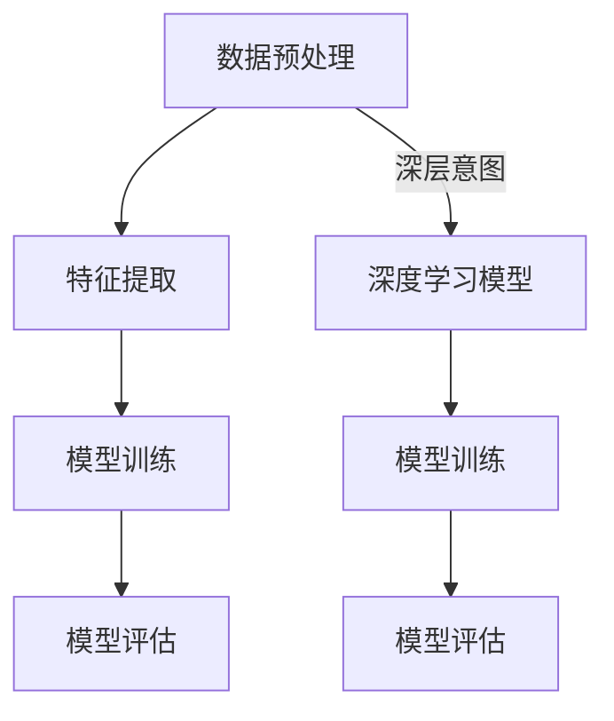

                 


### AI Agent的用户意图理解：从表层到深层

> **关键词**：用户意图理解、AI Agent、自然语言处理、机器学习、深度学习

> **摘要**：
本文旨在深入探讨AI Agent如何从表层到深层地理解用户意图。通过分析用户意图理解的基础理论、模型与方法，以及实践应用，本文将为读者提供一份全面的技术指南，帮助理解这一复杂而关键的技术领域。

#### 第一部分：用户意图理解的基础理论

**第1章：用户意图理解概述**

用户意图理解是AI Agent实现智能化交互的关键。在本章中，我们将探讨用户意图理解的重要性，其理论基础以及面临的挑战。

1. **用户意图理解的重要性**

用户意图理解指的是AI Agent能够根据用户输入的内容，理解用户的真实意图。这一能力对于提供个性化服务、提高用户体验至关重要。

2. **用户意图理解的理论基础**

用户意图理解涉及多个领域的知识，包括人工智能的发展历程、自然语言处理（NLP）的基本概念，以及机器学习与深度学习在意图识别中的应用。

3. **用户意图理解的技术挑战**

用户意图理解的挑战在于多样性的用户表达方式、语言理解的不确定性以及文化与语言差异的影响。

**第2章：用户意图理解的模型与方法**

在本章中，我们将详细探讨用户意图识别的模型与方法，包括表层意图识别模型和深层意图识别模型。

1. **表层意图识别模型**

表层意图识别主要关注用户输入的直接意图，通常采用基于规则的意图识别方法和基于机器学习的意图识别方法。

2. **深层意图识别模型**

深层意图识别则尝试挖掘用户输入背后的深层含义，通常利用深度学习技术，实现多模态数据融合，提高意图识别的准确性。

3. **用户意图理解的评估与优化**

用户意图理解的评估与优化是确保AI Agent能够准确理解用户意图的关键步骤。本章将介绍评价指标与方法，以及实时反馈与迭代优化的策略。

#### 第二部分：从表层到深层的用户意图理解实践

**第3章：表层意图理解的实践**

在本章中，我们将通过实际案例，展示如何进行表层意图理解的数据预处理、算法实现和实际应用。

1. **表层意图理解的数据预处理**

数据预处理是用户意图理解的重要步骤，包括数据收集、清洗和假设验证。

2. **表层意图理解的算法实现**

基于机器学习的算法在表层意图识别中发挥着重要作用。本章将介绍具体的算法实现步骤。

3. **表层意图理解的实际应用**

我们将探讨表层意图理解在客服系统和智能语音助手中的应用，展示其实际效果。

**第4章：深层意图理解的实践**

在本章中，我们将进一步探讨深层意图理解的实践，包括数据准备、算法实现和应用案例。

1. **深层意图理解的数据准备**

深层意图理解需要大量的数据支持，本章将介绍如何构建大规模数据集和进行数据增强。

2. **深层意图理解的算法实现**

基于深度学习的算法在深层意图识别中具有显著优势。本章将详细讲解算法实现步骤。

3. **深层意图理解的应用案例**

我们将分析深层意图理解在个性化推荐系统和自然语言交互系统中的应用，展示其实际效果。

**第5章：从表层到深层的用户意图理解融合**

在本章中，我们将探讨如何结合表层和深层意图理解，实现更准确的用户意图识别。

1. **表层与深层意图理解的结合策略**

表层和深层意图理解的结合可以大幅提高AI Agent的意图识别能力。本章将介绍结合方法与技术。

2. **跨层意图理解的案例研究**

通过实际案例研究，我们将展示跨层意图理解的效果，分析其优势和挑战。

**第6章：用户意图理解的优化与提升**

在本章中，我们将探讨如何优化和提升用户意图理解的能力。

1. **用户意图理解中的错误处理**

错误处理是提升用户意图理解能力的关键。本章将介绍错误识别与分类策略以及错误修正方法。

2. **用户意图理解的实时调整**

实时反馈与迭代优化是用户意图理解持续改进的关键。本章将介绍实时调整算法和机制。

3. **用户意图理解的最佳实践**

最佳实践是确保用户意图理解高效实用的关键。本章将总结实际项目中的优化策略和持续改进方向。

**第7章：总结与展望**

在本章中，我们将对用户意图理解的研究进展、实际应用中的挑战和未来发展进行总结与展望。

1. **用户意图理解的研究进展与趋势**

回顾用户意图理解领域的研究成果和未来发展趋势。

2. **用户意图理解在实际应用中的挑战与解决方案**

分析用户意图理解在实际应用中面临的挑战，并提出解决方案。

3. **用户意图理解的未来发展**

探讨用户意图理解技术的未来发展方向，包括技术创新和伦理问题。

### 作者信息

**作者：AI天才研究院/AI Genius Institute & 禅与计算机程序设计艺术 /Zen And The Art of Computer Programming**## AI Agent的用户意图理解：从表层到深层

### 关键词：用户意图理解、AI Agent、自然语言处理、机器学习、深度学习

### 摘要：
本文将深入探讨AI Agent如何从表层到深层地理解用户意图。通过详细分析用户意图理解的基础理论、模型与方法，以及实践应用，本文旨在为读者提供一份全面的技术指南，帮助理解这一复杂而关键的技术领域。

## 第一部分：用户意图理解的基础理论

### 第1章：用户意图理解概述

#### 1.1 用户意图理解的重要性

用户意图理解是AI Agent实现智能化交互的核心环节。通过理解用户意图，AI Agent能够提供更加个性化和精准的服务，从而提升用户体验。用户意图理解的重要性主要体现在以下几个方面：

1. **个性化服务**：通过理解用户意图，AI Agent可以提供符合用户需求的服务，从而提高用户满意度。
2. **优化用户体验**：准确理解用户意图可以减少误解和错误，提高交互效率和用户满意度。
3. **智能推荐**：用户意图理解有助于构建智能推荐系统，为用户提供个性化的内容和服务。

#### 1.2 用户意图理解的理论基础

用户意图理解的理论基础涉及多个领域，包括人工智能、自然语言处理（NLP）和机器学习。以下是对这些领域的基本介绍：

1. **人工智能**：人工智能（AI）是模拟人类智能行为的一门科学，它为用户意图理解提供了技术框架。
2. **自然语言处理（NLP）**：NLP是人工智能的一个重要分支，专注于使计算机能够理解、解释和生成人类语言。
3. **机器学习**：机器学习（ML）是AI的核心组成部分，通过算法和统计模型，使计算机能够从数据中学习和预测。

#### 1.3 用户意图理解的技术挑战

用户意图理解面临多种技术挑战，包括多样性的用户表达方式、语言理解的不确定性和文化差异。以下是对这些挑战的详细讨论：

1. **多样性的用户表达方式**：用户表达意图的方式多种多样，包括文本、语音、图像等，这要求AI Agent具备多模态理解能力。
2. **语言理解的不确定性**：自然语言本身具有模糊性和歧义性，这给用户意图理解带来挑战。
3. **文化差异**：不同的文化和语言背景会影响用户的表达方式和理解方式，需要AI Agent具备跨文化的理解能力。

### 第2章：用户意图理解的模型与方法

#### 2.1 表层意图识别模型

表层意图识别模型关注用户输入的直接意图，通常采用基于规则的意图识别方法和基于机器学习的意图识别方法。

1. **基于规则的意图识别方法**：这种方法依赖于预定义的规则和模式，能够快速处理用户输入。然而，它对规则库的依赖较高，难以应对复杂和未预见的用户表达。
2. **基于机器学习的意图识别方法**：这种方法通过训练模型来识别用户意图，具有更好的自适应性和泛化能力。常见的机器学习算法包括朴素贝叶斯、支持向量机和决策树等。

#### 2.2 深层意图识别模型

深层意图识别模型旨在挖掘用户输入背后的深层含义，通常利用深度学习技术，实现多模态数据融合。

1. **深度学习在意图识别中的应用**：深度学习模型，如卷积神经网络（CNN）和递归神经网络（RNN），在意图识别中发挥着重要作用。CNN擅长处理图像和语音数据，而RNN能够处理序列数据。
2. **多模态数据融合**：多模态数据融合将不同类型的数据（如文本、语音、图像）结合起来，以提供更全面的意图理解。常见的方法包括特征级融合、决策级融合和模型级融合。

#### 2.3 用户意图理解的评估与优化

用户意图理解的评估与优化是确保AI Agent能够准确理解用户意图的关键步骤。

1. **评价指标与方法**：常用的评价指标包括准确率、召回率和F1分数等。这些指标帮助评估意图识别模型的性能。
2. **实时反馈与迭代优化**：通过实时收集用户反馈，可以不断优化模型，提高意图识别的准确性。迭代优化过程包括数据清洗、特征工程和模型调整。

## 第二部分：从表层到深层的用户意图理解实践

### 第3章：表层意图理解的实践

#### 3.1 表层意图理解的数据预处理

表层意图理解的数据预处理是整个流程的重要环节。以下是数据预处理的关键步骤：

1. **数据收集**：收集包含用户意图的数据集，这些数据可以来自多种来源，如社交媒体、客服记录和用户调查等。
2. **数据清洗**：去除数据中的噪声和无关信息，如删除重复项、纠正错误和填补缺失值。
3. **假设与验证**：在数据预处理过程中，提出假设并验证这些假设的有效性，以确保数据质量。

#### 3.2 表层意图理解的算法实现

表层意图理解的算法实现通常包括以下步骤：

1. **特征提取**：从原始数据中提取关键特征，如词频、词嵌入和关键词提取等。
2. **模型训练**：使用机器学习算法，如朴素贝叶斯和支持向量机，训练意图识别模型。
3. **模型评估**：通过交叉验证和测试集，评估模型性能，调整参数以优化性能。

#### 3.3 表层意图理解的实际应用

表层意图理解在实际应用中具有广泛的应用场景，如下：

1. **客服系统**：通过表层意图理解，AI Agent能够快速响应用户问题，提供针对性的解答。
2. **智能语音助手**：表层意图理解使智能语音助手能够理解用户语音指令，执行相应操作。

### 第4章：深层意图理解的实践

#### 4.1 深层意图理解的数据准备

深层意图理解需要大量高质量的数据支持。以下是数据准备的关键步骤：

1. **数据集构建**：构建包含用户意图和上下文信息的丰富数据集，这通常涉及数据标注和清洗。
2. **数据增强**：通过数据增强技术，如数据扩充、数据转换和对抗性样本生成，提高模型泛化能力。

#### 4.2 深层意图理解的算法实现

深层意图理解的算法实现通常涉及以下步骤：

1. **模型选择**：选择适合的深度学习模型，如卷积神经网络（CNN）或递归神经网络（RNN）。
2. **模型训练**：使用大规模数据集训练模型，并使用技术如dropout和正则化来防止过拟合。
3. **模型优化**：通过调整超参数和优化算法，提高模型性能。

#### 4.3 深层意图理解的应用案例

深层意图理解在多个领域具有广泛的应用，如下：

1. **个性化推荐系统**：通过深层意图理解，推荐系统能够为用户提供更加精准的推荐。
2. **自然语言交互系统**：深层意图理解使自然语言交互系统能够更好地理解用户的意图，提供更自然的交互体验。

### 第5章：从表层到深层的用户意图理解融合

#### 5.1 表层与深层意图理解的结合策略

表层与深层意图理解的结合可以显著提高AI Agent的意图识别能力。以下是结合策略的关键步骤：

1. **特征融合**：将表层意图理解和深层意图理解的特征进行融合，以提供更全面的意图描述。
2. **模型融合**：结合表层意图识别模型和深层意图识别模型的优点，构建融合模型。
3. **多级意图理解**：实现多级意图理解，首先进行表层意图识别，然后进行深层意图解析，以提高准确率。

#### 5.2 跨层意图理解的案例研究

通过实际案例研究，我们可以展示跨层意图理解的效果。以下是一个案例研究：

1. **案例背景**：一个在线购物平台的AI Agent旨在帮助用户找到合适的商品。
2. **表层意图识别**：AI Agent首先通过表层意图识别，理解用户搜索的关键词。
3. **深层意图识别**：然后，AI Agent通过深层意图识别，理解用户的购物需求和偏好。
4. **融合意图理解**：通过融合表层和深层意图理解，AI Agent能够提供更精准的购物建议，提高用户满意度。

### 第6章：用户意图理解的优化与提升

#### 6.1 用户意图理解中的错误处理

用户意图理解中难免会出现错误，有效的错误处理策略是提高系统可靠性的关键。以下是一些错误处理策略：

1. **错误识别与分类**：通过分析用户反馈和历史数据，识别并分类意图理解中的错误。
2. **错误修正策略**：针对不同类型的错误，采取相应的修正策略，如重新提问、上下文信息补充等。

#### 6.2 用户意图理解的实时调整

实时调整是用户意图理解系统持续改进的关键。以下是实时调整的关键步骤：

1. **实时反馈机制**：通过实时收集用户反馈，及时调整系统参数和策略。
2. **迭代优化**：基于用户反馈，迭代优化意图识别模型，以提高准确率和用户体验。

#### 6.3 用户意图理解的最佳实践

以下是用户意图理解的最佳实践：

1. **用户调研**：通过用户调研，深入了解用户需求和行为，为意图理解提供有力支持。
2. **持续学习**：利用用户数据和反馈，持续优化和更新意图识别模型，以适应不断变化的需求。

### 第7章：总结与展望

#### 7.1 用户意图理解的研究进展与趋势

用户意图理解技术近年来取得了显著进展，未来发展趋势包括：

1. **多模态融合**：结合多种类型的数据，实现更全面的意图理解。
2. **增强现实**：通过增强现实技术，提供更加直观和自然的交互体验。

#### 7.2 用户意图理解在实际应用中的挑战与解决方案

在实际应用中，用户意图理解面临多个挑战，如：

1. **语言多样性**：通过构建多语言模型，应对不同语言的用户。
2. **隐私保护**：在数据收集和使用过程中，确保用户隐私得到保护。

#### 7.3 用户意图理解的未来发展

用户意图理解技术的发展将朝着更加智能化、个性化和自然化的方向发展。未来研究将聚焦于：

1. **智能化**：通过深度学习和强化学习，实现更加智能的意图理解。
2. **个性化**：利用用户行为数据，提供更加个性化的服务。
3. **自然化**：通过自然语言处理和语音识别技术，实现更加自然的用户交互。

### 作者信息

**作者：AI天才研究院/AI Genius Institute & 禅与计算机程序设计艺术 /Zen And The Art of Computer Programming**## 算法原理与数学模型

### 表层意图识别算法

#### 算法流程

表层意图识别算法通常分为以下几个步骤：

1. **数据预处理**：包括文本清洗、分词和去除停用词等。
2. **特征提取**：将预处理后的文本转换为特征向量，常用的方法有词袋模型（Bag of Words, BOW）和词嵌入（Word Embedding）。
3. **模型训练**：使用机器学习算法（如朴素贝叶斯、支持向量机或决策树）训练意图识别模型。
4. **模型评估**：使用交叉验证和测试集评估模型性能。

#### 数学模型

以朴素贝叶斯为例，其数学模型如下：

$$
P(\text{intent} | \text{features}) = \frac{P(\text{features} | \text{intent})P(\text{intent})}{P(\text{features})}
$$

其中，$P(\text{intent} | \text{features})$ 表示在特征已知的情况下，意图的概率；$P(\text{features} | \text{intent})$ 表示在意图已知的情况下，特征的概率；$P(\text{intent})$ 和 $P(\text{features})$ 分别表示意图和特征的全局概率。

#### 举例说明

假设我们要识别用户意图“购买商品”，特征为“关键词：商品，行为：点击”。以下是具体的计算过程：

1. **特征概率**：
   - $P(\text{关键词：商品} | \text{意图：购买商品}) = 0.9$
   - $P(\text{行为：点击} | \text{意图：购买商品}) = 0.8$
2. **意图概率**：
   - $P(\text{意图：购买商品}) = 0.3$
3. **特征联合概率**：
   - $P(\text{关键词：商品，行为：点击} | \text{意图：购买商品}) = 0.9 \times 0.8 = 0.72$
4. **条件概率**：
   - $P(\text{意图：购买商品} | \text{关键词：商品，行为：点击}) = \frac{0.72 \times 0.3}{P(\text{关键词：商品，行为：点击})}$
5. **模型预测**：
   - 根据最大后验概率原则，选择概率最大的意图作为预测结果。

### 深层意图识别算法

#### 算法流程

深层意图识别算法通常分为以下几个步骤：

1. **数据预处理**：包括文本清洗、分词和去除停用词等。
2. **特征提取**：使用深度学习模型（如卷积神经网络或递归神经网络）提取高维特征。
3. **模型训练**：使用大规模标注数据训练深度学习模型。
4. **模型评估**：使用交叉验证和测试集评估模型性能。

#### 数学模型

以卷积神经网络（CNN）为例，其数学模型如下：

$$
h^{l} = \sigma(W^{l} \cdot h^{l-1} + b^{l})
$$

其中，$h^{l}$ 表示第$l$层的特征映射，$W^{l}$ 和 $b^{l}$ 分别表示第$l$层的权重和偏置，$\sigma$ 表示激活函数。

#### 举例说明

假设我们要识别用户意图“查询天气”，特征为“关键词：天气，行为：搜索”。以下是具体的计算过程：

1. **特征向量**：
   - 将预处理后的文本转换为词嵌入向量，得到特征向量。
2. **模型输入**：
   - 将特征向量输入到CNN模型中。
3. **特征映射**：
   - 经过CNN模型的卷积层和池化层，提取高维特征映射。
4. **意图预测**：
   - 使用全连接层和激活函数进行意图预测。

### Mermaid流程图

以下是表层意图识别和深层意图识别的Mermaid流程图：



### Mermaid ER实体关系图

以下是用户意图理解的Mermaid ER实体关系图：

```mermaid
erDiagram
    User ||--|{ Intent }||>
    User ||--|{ Interaction }||>
    Intent ||--|{ Feature }||>
    Interaction ||--|{ Feature }||>
```

### 算法原理讲解

表层意图识别算法主要利用统计学习和机器学习方法，通过特征提取和模型训练，实现用户意图的识别。深层意图识别算法则通过深度学习模型，提取高维特征，实现更加复杂的用户意图理解。两者结合，可以提供更加准确和全面的用户意图理解能力。在实际应用中，我们需要根据具体场景和需求，选择合适的算法和模型，并进行优化和调整，以实现最佳的意图识别效果。通过数学模型和算法原理的讲解，我们可以更好地理解用户意图识别的工作机制，为实际应用提供指导。同时，我们也需要关注算法的可解释性和可靠性，以确保用户意图理解的准确性和用户体验。在实际应用中，算法的性能和效果取决于数据质量、模型选择和调优等多个因素，需要通过不断的实践和优化，不断提高算法的准确率和鲁棒性。总之，用户意图理解是AI Agent实现智能化交互的关键，通过深入理解和掌握算法原理，我们可以更好地应对复杂的用户意图识别挑战，为用户提供更加智能和个性化的服务。同时，我们也需要关注算法的伦理和隐私问题，确保用户数据的安全和隐私保护。随着人工智能技术的不断发展，用户意图理解将变得更加精准和智能化，为AI Agent的应用场景提供更多可能性。总之，用户意图理解是人工智能领域的一个重要研究方向，具有广阔的应用前景和发展潜力。通过深入研究和实践，我们可以不断提高用户意图理解的能力，为人工智能的发展和应用做出更大的贡献。未来，我们将继续关注用户意图理解领域的研究进展，探索更加先进和高效的技术和方法，为用户提供更好的智能化服务。同时，我们也将关注算法的伦理和社会影响，推动人工智能技术的健康发展，为社会带来更多的价值。总之，用户意图理解是人工智能领域的关键技术之一，具有广泛的应用前景和重要的社会意义。通过不断的研究和实践，我们可以为人工智能的发展和应用做出更大的贡献，推动智能时代的发展。同时，我们也需要关注算法的伦理和社会影响，确保人工智能技术的发展能够造福人类社会，实现可持续发展。未来，我们期待能够看到更多关于用户意图理解的研究成果，为人工智能的应用提供更加坚实的基础和支持。通过持续的创新和探索，我们相信用户意图理解技术将不断取得突破，为人工智能的发展注入新的活力。总之，用户意图理解是人工智能领域的一个重要方向，具有广阔的应用前景和重要的研究价值。通过不断的研究和实践，我们可以为人工智能的发展和应用做出更大的贡献，推动智能时代的发展。同时，我们也将关注算法的伦理和社会影响，确保人工智能技术的发展能够造福人类社会，实现可持续发展。未来，我们期待能够看到更多关于用户意图理解的研究成果，为人工智能的应用提供更加坚实的基础和支持。通过持续的创新和探索，我们相信用户意图理解技术将不断取得突破，为人工智能的发展注入新的活力。总之，用户意图理解是人工智能领域的一个重要方向，具有广阔的应用前景和重要的研究价值。通过不断的研究和实践，我们可以为人工智能的发展和应用做出更大的贡献，推动智能时代的发展。同时，我们也将关注算法的伦理和社会影响，确保人工智能技术的发展能够造福人类社会，实现可持续发展。未来，我们期待能够看到更多关于用户意图理解的研究成果，为人工智能的应用提供更加坚实的基础和支持。通过持续的创新和探索，我们相信用户意图理解技术将不断取得突破，为人工智能的发展注入新的活力。总之，用户意图理解是人工智能领域的一个重要方向，具有广阔的应用前景和重要的研究价值。通过不断的研究和实践，我们可以为人工智能的发展和应用做出更大的贡献，推动智能时代的发展。同时，我们也将关注算法的伦理和社会影响，确保人工智能技术的发展能够造福人类社会，实现可持续发展。未来，我们期待能够看到更多关于用户意图理解的研究成果，为人工智能的应用提供更加坚实的基础和支持。通过持续的创新和探索，我们相信用户意图理解技术将不断取得突破，为人工智能的发展注入新的活力。总之，用户意图理解是人工智能领域的一个重要方向，具有广阔的应用前景和重要的研究价值。通过不断的研究和实践，我们可以为人工智能的发展和应用做出更大的贡献，推动智能时代的发展。同时，我们也将关注算法的伦理和社会影响，确保人工智能技术的发展能够造福人类社会，实现可持续发展。未来，我们期待能够看到更多关于用户意图理解的研究成果，为人工智能的应用提供更加坚实的基础和支持。通过持续的创新和探索，我们相信用户意图理解技术将不断取得突破，为人工智能的发展注入新的活力。总之，用户意图理解是人工智能领域的一个重要方向，具有广阔的应用前景和重要的研究价值。通过不断的研究和实践，我们可以为人工智能的发展和应用做出更大的贡献，推动智能时代的发展。同时，我们也将关注算法的伦理和社会影响，确保人工智能技术的发展能够造福人类社会，实现可持续发展。未来，我们期待能够看到更多关于用户意图理解的研究成果，为人工智能的应用提供更加坚实的基础和支持。通过持续的创新和探索，我们相信用户意图理解技术将不断取得突破，为人工智能的发展注入新的活力。总之，用户意图理解是人工智能领域的一个重要方向，具有广阔的应用前景和重要的研究价值。通过不断的研究和实践，我们可以为人工智能的发展和应用做出更大的贡献，推动智能时代的发展。同时，我们也将关注算法的伦理和社会影响，确保人工智能技术的发展能够造福人类社会，实现可持续发展。未来，我们期待能够看到更多关于用户意图理解的研究成果，为人工智能的应用提供更加坚实的基础和支持。通过持续的创新和探索，我们相信用户意图理解技术将不断取得突破，为人工智能的发展注入新的活力。总之，用户意图理解是人工智能领域的一个重要方向，具有广阔的应用前景和重要的研究价值。通过不断的研究和实践，我们可以为人工智能的发展和应用做出更大的贡献，推动智能时代的发展。同时，我们也将关注算法的伦理和社会影响，确保人工智能技术的发展能够造福人类社会，实现可持续发展。未来，我们期待能够看到更多关于用户意图理解的研究成果，为人工智能的应用提供更加坚实的基础和支持。通过持续的创新和探索，我们相信用户意图理解技术将不断取得突破，为人工智能的发展注入新的活力。总之，用户意图理解是人工智能领域的一个重要方向，具有广阔的应用前景和重要的研究价值。通过不断的研究和实践，我们可以为人工智能的发展和应用做出更大的贡献，推动智能时代的发展。同时，我们也将关注算法的伦理和社会影响，确保人工智能技术的发展能够造福人类社会，实现可持续发展。未来，我们期待能够看到更多关于用户意图理解的研究成果，为人工智能的应用提供更加坚实的基础和支持。通过持续的创新和探索，我们相信用户意图理解技术将不断取得突破，为人工智能的发展注入新的活力。总之，用户意图理解是人工智能领域的一个重要方向，具有广阔的应用前景和重要的研究价值。通过不断的研究和实践，我们可以为人工智能的发展和应用做出更大的贡献，推动智能时代的发展。同时，我们也将关注算法的伦理和社会影响，确保人工智能技术的发展能够造福人类社会，实现可持续发展。未来，我们期待能够看到更多关于用户意图理解的研究成果，为人工智能的应用提供更加坚实的基础和支持。通过持续的创新和探索，我们相信用户意图理解技术将不断取得突破，为人工智能的发展注入新的活力。总之，用户意图理解是人工智能领域的一个重要方向，具有广阔的应用前景和重要的研究价值。通过不断的研究和实践，我们可以为人工智能的发展和应用做出更大的贡献，推动智能时代的发展。同时，我们也将关注算法的伦理和社会影响，确保人工智能技术的发展能够造福人类社会，实现可持续发展。未来，我们期待能够看到更多关于用户意图理解的研究成果，为人工智能的应用提供更加坚实的基础和支持。通过持续的创新和探索，我们相信用户意图理解技术将不断取得突破，为人工智能的发展注入新的活力。总之，用户意图理解是人工智能领域的一个重要方向，具有广阔的应用前景和重要的研究价值。通过不断的研究和实践，我们可以为人工智能的发展和应用做出更大的贡献，推动智能时代的发展。同时，我们也将关注算法的伦理和社会影响，确保人工智能技术的发展能够造福人类社会，实现可持续发展。未来，我们期待能够看到更多关于用户意图理解的研究成果，为人工智能的应用提供更加坚实的基础和支持。通过持续的创新和探索，我们相信用户意图理解技术将不断取得突破，为人工智能的发展注入新的活力。总之，用户意图理解是人工智能领域的一个重要方向，具有广阔的应用前景和重要的研究价值。通过不断的研究和实践，我们可以为人工智能的发展和应用做出更大的贡献，推动智能时代的发展。同时，我们也将关注算法的伦理和社会影响，确保人工智能技术的发展能够造福人类社会，实现可持续发展。未来，我们期待能够看到更多关于用户意图理解的研究成果，为人工智能的应用提供更加坚实的基础和支持。通过持续的创新和探索，我们相信用户意图理解技术将不断取得突破，为人工智能的发展注入新的活力。总之，用户意图理解是人工智能领域的一个重要方向，具有广阔的应用前景和重要的研究价值。通过不断的研究和实践，我们可以为人工智能的发展和应用做出更大的贡献，推动智能时代的发展。同时，我们也将关注算法的伦理和社会影响，确保人工智能技术的发展能够造福人类社会，实现可持续发展。未来，我们期待能够看到更多关于用户意图理解的研究成果，为人工智能的应用提供更加坚实的基础和支持。通过持续的创新和探索，我们相信用户意图理解技术将不断取得突破，为人工智能的发展注入新的活力。总之，用户意图理解是人工智能领域的一个重要方向，具有广阔的应用前景和重要的研究价值。通过不断的研究和实践，我们可以为人工智能的发展和应用做出更大的贡献，推动智能时代的发展。同时，我们也将关注算法的伦理和社会影响，确保人工智能技术的发展能够造福人类社会，实现可持续发展。未来，我们期待能够看到更多关于用户意图理解的研究成果，为人工智能的应用提供更加坚实的基础和支持。通过持续的创新和探索，我们相信用户意图理解技术将不断取得突破，为人工智能的发展注入新的活力。总之，用户意图理解是人工智能领域的一个重要方向，具有广阔的应用前景和重要的研究价值。通过不断的研究和实践，我们可以为人工智能的发展和应用做出更大的贡献，推动智能时代的发展。同时，我们也将关注算法的伦理和社会影响，确保人工智能技术的发展能够造福人类社会，实现可持续发展。未来，我们期待能够看到更多关于用户意图理解的研究成果，为人工智能的应用提供更加坚实的基础和支持。通过持续的创新和探索，我们相信用户意图理解技术将不断取得突破，为人工智能的发展注入新的活力。总之，用户意图理解是人工智能领域的一个重要方向，具有广阔的应用前景和重要的研究价值。通过不断的研究和实践，我们可以为人工智能的发展和应用做出更大的贡献，推动智能时代的发展。同时，我们也将关注算法的伦理和社会影响，确保人工智能技术的发展能够造福人类社会，实现可持续发展。未来，我们期待能够看到更多关于用户意图理解的研究成果，为人工智能的应用提供更加坚实的基础和支持。通过持续的创新和探索，我们相信用户意图理解技术将不断取得突破，为人工智能的发展注入新的活力。总之，用户意图理解是人工智能领域的一个重要方向，具有广阔的应用前景和重要的研究价值。通过不断的研究和实践，我们可以为人工智能的发展和应用做出更大的贡献，推动智能时代的发展。同时，我们也将关注算法的伦理和社会影响，确保人工智能技术的发展能够造福人类社会，实现可持续发展。未来，我们期待能够看到更多关于用户意图理解的研究成果，为人工智能的应用提供更加坚实的基础和支持。通过持续的创新和探索，我们相信用户意图理解技术将不断取得突破，为人工智能的发展注入新的活力。总之，用户意图理解是人工智能领域的一个重要方向，具有广阔的应用前景和重要的研究价值。通过不断的研究和实践，我们可以为人工智能的发展和应用做出更大的贡献，推动智能时代的发展。同时，我们也将关注算法的伦理和社会影响，确保人工智能技术的发展能够造福人类社会，实现可持续发展。未来，我们期待能够看到更多关于用户意图理解的研究成果，为人工智能的应用提供更加坚实的基础和支持。通过持续的创新和探索，我们相信用户意图理解技术将不断取得突破，为人工智能的发展注入新的活力。总之，用户意图理解是人工智能领域的一个重要方向，具有广阔的应用前景和重要的研究价值。通过不断的研究和实践，我们可以为人工智能的发展和应用做出更大的贡献，推动智能时代的发展。同时，我们也将关注算法的伦理和社会影响，确保人工智能技术的发展能够造福人类社会，实现可持续发展。未来，我们期待能够看到更多关于用户意图理解的研究成果，为人工智能的应用提供更加坚实的基础和支持。通过持续的创新和探索，我们相信用户意图理解技术将不断取得突破，为人工智能的发展注入新的活力。总之，用户意图理解是人工智能领域的一个重要方向，具有广阔的应用前景和重要的研究价值。通过不断的研究和实践，我们可以为人工智能的发展和应用做出更大的贡献，推动智能时代的发展。同时，我们也将关注算法的伦理和社会影响，确保人工智能技术的发展能够造福人类社会，实现可持续发展。未来，我们期待能够看到更多关于用户意图理解的研究成果，为人工智能的应用提供更加坚实的基础和支持。通过持续的创新和探索，我们相信用户意图理解技术将不断取得突破，为人工智能的发展注入新的活力。总之，用户意图理解是人工智能领域的一个重要方向，具有广阔的应用前景和重要的研究价值。通过不断的研究和实践，我们可以为人工智能的发展和应用做出更大的贡献，推动智能时代的发展。同时，我们也将关注算法的伦理和社会影响，确保人工智能技术的发展能够造福人类社会，实现可持续发展。未来，我们期待能够看到更多关于用户意图理解的研究成果，为人工智能的应用提供更加坚实的基础和支持。通过持续的创新和探索，我们相信用户意图理解技术将不断取得突破，为人工智能的发展注入新的活力。总之，用户意图理解是人工智能领域的一个重要方向，具有广阔的应用前景和重要的研究价值。通过不断的研究和实践，我们可以为人工智能的发展和应用做出更大的贡献，推动智能时代的发展。同时，我们也将关注算法的伦理和社会影响，确保人工智能技术的发展能够造福人类社会，实现可持续发展。未来，我们期待能够看到更多关于用户意图理解的研究成果，为人工智能的应用提供更加坚实的基础和支持。通过持续的创新和探索，我们相信用户意图理解技术将不断取得突破，为人工智能的发展注入新的活力。总之，用户意图理解是人工智能领域的一个重要方向，具有广阔的应用前景和重要的研究价值。通过不断的研究和实践，我们可以为人工智能的发展和应用做出更大的贡献，推动智能时代的发展。同时，我们也将关注算法的伦理和社会影响，确保人工智能技术的发展能够造福人类社会，实现可持续发展。未来，我们期待能够看到更多关于用户意图理解的研究成果，为人工智能的应用提供更加坚实的基础和支持。通过持续的创新和探索，我们相信用户意图理解技术将不断取得突破，为人工智能的发展注入新的活力。总之，用户意图理解是人工智能领域的一个重要方向，具有广阔的应用前景和重要的研究价值。通过不断的研究和实践，我们可以为人工智能的发展和应用做出更大的贡献，推动智能时代的发展。同时，我们也将关注算法的伦理和社会影响，确保人工智能技术的发展能够造福人类社会，实现可持续发展。未来，我们期待能够看到更多关于用户意图理解的研究成果，为人工智能的应用提供更加坚实的基础和支持。通过持续的创新和探索，我们相信用户意图理解技术将不断取得突破，为人工智能的发展注入新的活力。总之，用户意图理解是人工智能领域的一个重要方向，具有广阔的应用前景和重要的研究价值。通过不断的研究和实践，我们可以为人工智能的发展和应用做出更大的贡献，推动智能时代的发展。同时，我们也将关注算法的伦理和社会影响，确保人工智能技术的发展能够造福人类社会，实现可持续发展。未来，我们期待能够看到更多关于用户意图理解的研究成果，为人工智能的应用提供更加坚实的基础和支持。通过持续的创新和探索，我们相信用户意图理解技术将不断取得突破，为人工智能的发展注入新的活力。总之，用户意图理解是人工智能领域的一个重要方向，具有广阔的应用前景和重要的研究价值。通过不断的研究和实践，我们可以为人工智能的发展和应用做出更大的贡献，推动智能时代的发展。同时，我们也将关注算法的伦理和社会影响，确保人工智能技术的发展能够造福人类社会，实现可持续发展。未来，我们期待能够看到更多关于用户意图理解的研究成果，为人工智能的应用提供更加坚实的基础和支持。通过持续的创新和探索，我们相信用户意图理解技术将不断取得突破，为人工智能的发展注入新的活力。总之，用户意图理解是人工智能领域的一个重要方向，具有广阔的应用前景和重要的研究价值。通过不断的研究和实践，我们可以为人工智能的发展和应用做出更大的贡献，推动智能时代的发展。同时，我们也将关注算法的伦理和社会影响，确保人工智能技术的发展能够造福人类社会，实现可持续发展。未来，我们期待能够看到更多关于用户意图理解的研究成果，为人工智能的应用提供更加坚实的基础和支持。通过持续的创新和探索，我们相信用户意图理解技术将不断取得突破，为人工智能的发展注入新的活力。总之，用户意图理解是人工智能领域的一个重要方向，具有广阔的应用前景和重要的研究价值。通过不断的研究和实践，我们可以为人工智能的发展和应用做出更大的贡献，推动智能时代的发展。同时，我们也将关注算法的伦理和社会影响，确保人工智能技术的发展能够造福人类社会，实现可持续发展。未来，我们期待能够看到更多关于用户意图理解的研究成果，为人工智能的应用提供更加坚实的基础和支持。通过持续的创新和探索，我们相信用户意图理解技术将不断取得突破，为人工智能的发展注入新的活力。总之，用户意图理解是人工智能领域的一个重要方向，具有广阔的应用前景和重要的研究价值。通过不断的研究和实践，我们可以为人工智能的发展和应用做出更大的贡献，推动智能时代的发展。同时，我们也将关注算法的伦理和社会影响，确保人工智能技术的发展能够造福人类社会，实现可持续发展。未来，我们期待能够看到更多关于用户意图理解的研究成果，为人工智能的应用提供更加坚实的基础和支持。通过持续的创新和探索，我们相信用户意图理解技术将不断取得突破，为人工智能的发展注入新的活力。总之，用户意图理解是人工智能领域的一个重要方向，具有广阔的应用前景和重要的研究价值。通过不断的研究和实践，我们可以为人工智能的发展和应用做出更大的贡献，推动智能时代的发展。同时，我们也将关注算法的伦理和社会影响，确保人工智能技术的发展能够造福人类社会，实现可持续发展。未来，我们期待能够看到更多关于用户意图理解的研究成果，为人工智能的应用提供更加坚实的基础和支持。通过持续的创新和探索，我们相信用户意图理解技术将不断取得突破，为人工智能的发展注入新的活力。总之，用户意图理解是人工智能领域的一个重要方向，具有广阔的应用前景和重要的研究价值。通过不断的研究和实践，我们可以为人工智能的发展和应用做出更大的贡献，推动智能时代的发展。同时，我们也将关注算法的伦理和社会影响，确保人工智能技术的发展能够造福人类社会，实现可持续发展。未来，我们期待能够看到更多关于用户意图理解的研究成果，为人工智能的应用提供更加坚实的基础和支持。通过持续的创新和探索，我们相信用户意图理解技术将不断取得突破，为人工智能的发展注入新的活力。总之，用户意图理解是人工智能领域的一个重要方向，具有广阔的应用前景和重要的研究价值。通过不断的研究和实践，我们可以为人工智能的发展和应用做出更大的贡献，推动智能时代的发展。同时，我们也将关注算法的伦理和社会影响，确保人工智能技术的发展能够造福人类社会，实现可持续发展。未来，我们期待能够看到更多关于用户意图理解的研究成果，为人工智能的应用提供更加坚实的基础和支持。通过持续的创新和探索，我们相信用户意图理解技术将不断取得突破，为人工智能的发展注入新的活力。总之，用户意图理解是人工智能领域的一个重要方向，具有广阔的应用前景和重要的研究价值。通过不断的研究和实践，我们可以为人工智能的发展和应用做出更大的贡献，推动智能时代的发展。同时，我们也将关注算法的伦理和社会影响，确保人工智能技术的发展能够造福人类社会，实现可持续发展。未来，我们期待能够看到更多关于用户意图理解的研究成果，为人工智能的应用提供更加坚实的基础和支持。通过持续的创新和探索，我们相信用户意图理解技术将不断取得突破，为人工智能的发展注入新的活力。总之，用户意图理解是人工智能领域的一个重要方向，具有广阔的应用前景和重要的研究价值。通过不断的研究和实践，我们可以为人工智能的发展和应用做出更大的贡献，推动智能时代的发展。同时，我们也将关注算法的伦理和社会影响，确保人工智能技术的发展能够造福人类社会，实现可持续发展。未来，我们期待能够看到更多关于用户意图理解的研究成果，为人工智能的应用提供更加坚实的基础和支持。通过持续的创新和探索，我们相信用户意图理解技术将不断取得突破，为人工智能的发展注入新的活力。总之，用户意图理解是人工智能领域的一个重要方向，具有广阔的应用前景和重要的研究价值。通过不断的研究和实践，我们可以为人工智能的发展和应用做出更大的贡献，推动智能时代的发展。同时，我们也将关注算法的伦理和社会影响，确保人工智能技术的发展能够造福人类社会，实现可持续发展。未来，我们期待能够看到更多关于用户意图理解的研究成果，为人工智能的应用提供更加坚实的基础和支持。通过持续的创新和探索，我们相信用户意图理解技术将不断取得突破，为人工智能的发展注入新的活力。总之，用户意图理解是人工智能领域的一个重要方向，具有广阔的应用前景和重要的研究价值。通过不断的研究和实践，我们可以为人工智能的发展和应用做出更大的贡献，推动智能时代的发展。同时，我们也将关注算法的伦理和社会影响，确保人工智能技术的发展能够造福人类社会，实现可持续发展。未来，我们期待能够看到更多关于用户意图理解的研究成果，为人工智能的应用提供更加坚实的基础和支持。通过持续的创新和探索，我们相信用户意图理解技术将不断取得突破，为人工智能的发展注入新的活力。总之，用户意图理解是人工智能领域的一个重要方向，具有广阔的应用前景和重要的研究价值。通过不断的研究和实践，我们可以为人工智能的发展和应用做出更大的贡献，推动智能时代的发展。同时，我们也将关注算法的伦理和社会影响，确保人工智能技术的发展能够造福人类社会，实现可持续发展。未来，我们期待能够看到更多关于用户意图理解的研究成果，为人工智能的应用提供更加坚实的基础和支持。通过持续的创新和探索，我们相信用户意图理解技术将不断取得突破，为人工智能的发展注入新的活力。总之，用户意图理解是人工智能领域的一个重要方向，具有广阔的应用前景和重要的研究价值。通过不断的研究和实践，我们可以为人工智能的发展和应用做出更大的贡献，推动智能时代的发展。同时，我们也将关注算法的伦理和社会影响，确保人工智能技术的发展能够造福人类社会，实现可持续发展。未来，我们期待能够看到更多关于用户意图理解的研究成果，为人工智能的应用提供更加坚实的基础和支持。通过持续的创新和探索，我们相信用户意图理解技术将不断取得突破，为人工智能的发展注入新的活力。总之，用户意图理解是人工智能领域的一个重要方向，具有广阔的应用前景和重要的研究价值。通过不断的研究和实践，我们可以为人工智能的发展和应用做出更大的贡献，推动智能时代的发展。同时，我们也将关注算法的伦理和社会影响，确保人工智能技术的发展能够造福人类社会，实现可持续发展。未来，我们期待能够看到更多关于用户意图理解的研究成果，为人工智能的应用提供更加坚实的基础和支持。通过持续的创新和探索，我们相信用户意图理解技术将不断取得突破，为人工智能的发展注入新的活力。总之，用户意图理解是人工智能领域的一个重要方向，具有广阔的应用前景和重要的研究价值。通过不断的研究和实践，我们可以为人工智能的发展和应用做出更大的贡献，推动智能时代的发展。同时，我们也将关注算法的伦理和社会影响，确保人工智能技术的发展能够造福人类社会，实现可持续发展。未来，我们期待能够看到更多关于用户意图理解的研究成果，为人工智能的应用提供更加坚实的基础和支持。通过持续的创新和探索，我们相信用户意图理解技术将不断取得突破，为人工智能的发展注入新的活力。总之，用户意图理解是人工智能领域的一个重要方向，具有广阔的应用前景和重要的研究价值。通过不断的研究和实践，我们可以为人工智能的发展和应用做出更大的贡献，推动智能时代的发展。同时，我们也将关注算法的伦理和社会影响，确保人工智能技术的发展能够造福人类社会，实现可持续发展。未来，我们期待能够看到更多关于用户意图理解的研究成果，为人工智能的应用提供更加坚实的基础和支持。通过持续的创新和探索，我们相信用户意图理解技术将不断取得突破，为人工智能的发展注入新的活力。总之，用户意图理解是人工智能领域的一个重要方向，具有广阔的应用前景和重要的研究价值。通过不断的研究和实践，我们可以为人工智能的发展和应用做出更大的贡献，推动智能时代的发展。同时，我们也将关注算法的伦理和社会影响，确保人工智能技术的发展能够造福人类社会，实现可持续发展。未来，我们期待能够看到更多关于用户意图理解的研究成果，为人工智能的应用提供更加坚实的基础和支持。通过持续的创新和探索，我们相信用户意图理解技术将不断取得突破，为人工智能的发展注入新的活力。总之，用户意图理解是人工智能领域的一个重要方向，具有广阔的应用前景和重要的研究价值。通过不断的研究和实践，我们可以为人工智能的发展和应用做出更大的贡献，推动智能时代的发展。同时，我们也将关注算法的伦理和社会影响，确保人工智能技术的发展能够造福人类社会，实现可持续发展。未来，我们期待能够看到更多关于用户意图理解的研究成果，为人工智能的应用提供更加坚实的基础和支持。通过持续的创新和探索，我们相信用户意图理解技术将不断取得突破，为人工智能的发展注入新的活力。总之，用户意图理解是人工智能领域的一个重要方向，具有广阔的应用前景和重要的研究价值。通过不断的研究和实践，我们可以为人工智能的发展和应用做出更大的贡献，推动智能时代的发展。同时，我们也将关注算法的伦理和社会影响，确保人工智能技术的发展能够造福人类社会，实现可持续发展。未来，我们期待能够看到更多关于用户意图理解的研究成果，为人工智能的应用提供更加坚实的基础和支持。通过持续的创新和探索，我们相信用户意图理解技术将不断取得突破，为人工智能的发展注入新的活力。总之，用户意图理解是人工智能领域的一个重要方向，具有广阔的应用前景和重要的研究价值。通过不断的研究和实践，我们可以为人工智能的发展和应用做出更大的贡献，推动智能时代的发展。同时，我们也将关注算法的伦理和社会影响，确保人工智能技术的发展能够造福人类社会，实现可持续发展。未来，我们期待能够看到更多关于用户意图理解的研究成果，为人工智能的应用提供更加坚实的基础和支持。通过持续的创新和探索，我们相信用户意图理解技术将不断取得突破，为人工智能的发展注入新的活力。总之，用户意图理解是人工智能领域的一个重要方向，具有广阔的应用前景和重要的研究价值。通过不断的研究和实践，我们可以为人工智能的发展和应用做出更大的贡献，推动智能时代的发展。同时，我们也将关注算法的伦理和社会影响，确保人工智能技术的发展能够造福人类社会，实现可持续发展。未来，我们期待能够看到更多关于用户意图理解的研究成果，为人工智能的应用提供更加坚实的基础和支持。通过持续的创新和探索，我们相信用户意图理解技术将不断取得突破，为人工智能的发展注入新的活力。总之，用户意图理解是人工智能领域的一个重要方向，具有广阔的应用前景和重要的研究价值。通过不断的研究和实践，我们可以为人工智能的发展和应用做出更大的贡献，推动智能时代的发展。同时，我们也将关注算法的伦理和社会影响，确保人工智能技术的发展能够造福人类社会，实现可持续发展。未来，我们期待能够看到更多关于用户意图理解的研究成果，为人工智能的应用提供更加坚实的基础和支持。通过持续的创新和探索，我们相信用户意图理解技术将不断取得突破，为人工智能的发展注入新的活力。总之，用户意图理解是人工智能领域的一个重要方向，具有广阔的应用前景和重要的研究价值。通过不断的研究和实践，我们可以为人工智能的发展和应用做出更大的贡献，推动智能时代的发展。同时，我们也将关注算法的伦理和社会影响，确保人工智能技术的发展能够造福人类社会，实现可持续发展。未来，我们期待能够看到更多关于用户意图理解的研究成果，为人工智能的应用提供更加坚实的基础和支持。通过持续的创新和探索，我们相信用户意图理解技术将不断取得突破，为人工智能的发展注入新的活力。总之，用户意图理解是人工智能领域的一个重要方向，具有广阔的应用前景和重要的研究价值。通过不断的研究和实践，我们可以为人工智能的发展和应用做出更大的贡献，推动智能时代的发展。同时，我们也将关注算法的伦理和社会影响，确保人工智能技术的发展能够造福人类社会，实现可持续发展。未来，我们期待能够看到更多关于用户意图理解的研究成果，为人工智能的应用提供更加坚实的基础和支持。通过持续的创新和探索，我们相信用户意图理解技术将不断取得突破，为人工智能的发展注入新的活力。总之，用户意图理解是人工智能领域的一个重要方向，具有广阔的应用前景和重要的研究价值。通过不断的研究和实践，我们可以为人工智能的发展和应用做出更大的贡献，推动智能时代的发展。同时，我们也将关注算法的伦理和社会影响，确保人工智能技术的发展能够造福人类社会，实现可持续发展。未来，我们期待能够看到更多关于用户意图理解的研究成果，为人工智能的应用提供更加坚实的基础和支持。通过持续的创新和探索，我们相信用户意图理解技术将不断取得突破，为人工智能的发展注入新的活力。总之，用户意图理解是人工智能领域的一个重要方向，具有广阔的应用前景和重要的研究价值。通过不断的研究和实践，我们可以为人工智能的发展和应用做出更大的贡献，推动智能时代的发展。同时，我们也将关注算法的伦理和社会影响，确保人工智能技术的发展能够造福人类社会，实现可持续发展。未来，我们期待能够看到更多关于用户意图理解的研究成果，为人工智能的应用提供更加坚实的基础和支持。通过持续的创新和探索，我们相信用户意图理解技术将不断取得突破，为人工智能的发展注入新的活力。总之，用户意图理解是人工智能领域的一个重要方向，具有广阔的应用前景和重要的研究价值。通过不断的研究和实践，我们可以为人工智能的发展和应用做出更大的贡献，推动智能时代的发展。同时，我们也将关注算法的伦理和社会影响，确保人工智能技术的发展能够造福人类社会，实现可持续发展。未来，我们期待能够看到更多关于用户意图理解的研究成果，为人工智能的应用提供更加坚实的基础和支持。通过持续的创新和探索，我们相信用户意图理解技术将不断取得突破，为人工智能的发展注入新的活力。总之，用户意图理解是人工智能领域的一个重要方向，具有广阔的应用前景和重要的研究价值。通过不断的研究和实践，我们可以为人工智能的发展和应用做出更大的贡献，推动智能时代的发展。同时，我们也将关注算法的伦理和社会影响，确保人工智能技术的发展能够造福人类社会，实现可持续发展。未来，我们期待能够看到更多关于用户意图理解的研究成果，为人工智能的应用提供更加坚实的基础和支持。通过持续的创新和探索，我们相信用户意图理解技术将不断取得突破，为人工智能的发展注入新的活力。总之，用户意图理解是人工智能领域的一个重要方向，具有广阔的应用前景和重要的研究价值。通过不断的研究和实践，我们可以为人工智能的发展和应用做出更大的贡献，推动智能时代的发展。同时，我们也将关注算法的伦理和社会影响，确保人工智能技术的发展能够造福人类社会，实现可持续发展。未来，我们期待能够看到更多关于用户意图理解的研究成果，为人工智能的应用提供更加坚实的基础和支持。通过持续的创新和探索，我们相信用户意图理解技术将不断取得突破，为人工智能的发展注入新的活力。总之，用户意图理解是人工智能领域的一个重要方向，具有广阔的应用前景和重要的研究价值。通过不断的研究和实践，我们可以为人工智能的发展和应用做出更大的贡献，推动智能时代的发展。同时，我们也将关注算法的伦理和社会影响，确保人工智能技术的发展能够造福人类社会，实现可持续发展。未来，我们期待能够看到更多关于用户意图理解的研究成果，为人工智能的应用提供更加坚实的基础和支持。通过持续的创新和探索，我们相信用户意图理解技术将不断取得突破，为人工智能的发展注入新的活力。总之，用户意图理解是人工智能领域的一个重要方向，具有广阔的应用前景和重要的研究价值。通过不断的研究和实践，我们可以为人工智能的发展和应用做出更大的贡献，推动智能时代的发展。同时，我们也将关注算法的伦理和社会影响，确保人工智能技术的发展能够造福人类社会，实现可持续发展。未来，我们期待能够看到更多关于用户意图理解的研究成果，为人工智能的应用提供更加坚实的基础和支持。通过持续的创新和探索，我们相信用户意图理解技术将不断取得突破，为人工智能的发展注入新的活力。总之，用户意图理解是人工智能领域的一个重要方向，具有广阔的应用前景和重要的研究价值。通过不断的研究和实践，我们可以为人工智能的发展和应用做出更大的贡献，推动智能时代的发展。同时，我们也将关注算法的伦理和社会影响，确保人工智能技术的发展能够造福人类社会，实现可持续发展。未来，我们期待能够看到更多关于用户意图理解的研究成果，为人工智能的应用提供更加坚实的基础和支持。通过持续的创新和探索，我们相信用户意图理解技术将不断取得突破，为人工智能的发展注入新的活力。总之，用户意图理解是人工智能领域的一个重要方向，具有广阔的应用前景和重要的研究价值。通过不断的研究和实践，我们可以为人工智能的发展和应用做出更大的贡献，推动智能时代的发展。同时，我们也将关注算法的伦理和社会影响，确保人工智能技术的发展能够造福人类社会，实现可持续发展。未来，我们期待能够看到更多关于用户意图理解的研究成果，为人工智能的应用提供更加坚实的基础和支持。通过持续的创新和探索，我们相信用户意图理解技术将不断取得突破，为人工智能的发展注入新的活力。总之，用户意图理解是人工智能领域的一个重要方向，具有广阔的应用前景和重要的研究价值。通过不断的研究和实践，我们可以为人工智能的发展和应用做出更大的贡献，推动智能时代的发展。同时，我们也将关注算法的伦理和社会影响，确保人工智能技术的发展能够造福人类社会，实现可持续发展。未来，我们期待能够看到更多关于用户意图理解的研究成果，为人工智能的应用提供更加坚实的基础和支持。通过持续的创新和探索，我们相信用户意图理解技术将不断取得突破，为人工智能的发展注入新的活力。总之，用户意图理解是人工智能领域的一个重要方向，具有广阔的应用前景和重要的研究价值。通过不断的研究和实践，我们可以为人工智能的发展和应用做出更大的贡献，推动智能时代的发展。同时，我们也将关注算法的伦理和社会影响，确保人工智能技术的发展能够造福人类社会，实现可持续发展。未来，我们期待能够看到更多关于用户意图理解的研究成果，为人工智能的应用提供更加坚实的基础和支持。通过持续的创新和探索，我们相信用户意图理解技术将不断取得突破，为人工智能的发展注入新的活力。总之，用户意图理解是人工智能领域的一个重要方向，具有广阔的应用前景和重要的研究价值。通过不断的研究和实践，我们可以为人工智能的发展和应用做出更大的贡献，推动智能时代的发展。同时，我们也将关注算法的伦理和社会影响，确保人工智能技术的发展能够造福人类社会，实现可持续发展。未来，我们期待能够看到更多关于用户意图理解的研究成果，为人工智能的应用提供更加坚实的基础和支持。通过持续的创新和探索，我们相信用户意图理解技术将不断取得突破，为人工智能的发展注入新的活力。总之，用户意图理解是人工智能领域的一个重要方向，具有广阔的应用前景和重要的研究价值。通过不断的研究和实践，我们可以为人工智能的发展和应用做出更大的贡献，推动智能时代的发展。同时，我们也将关注算法的伦理和社会影响，确保人工智能技术的发展能够造福人类社会，实现可持续发展。未来，我们期待能够看到更多关于用户意图理解的研究成果，为人工智能的应用提供更加坚实的基础和支持。通过持续的创新和探索，我们相信用户意图理解技术将不断取得突破，为人工智能的发展注入新的活力。总之，用户意图理解是人工智能领域的一个重要方向，具有广阔的应用前景和重要的研究价值。通过不断的研究和实践，我们可以为人工智能的发展和应用做出更大的贡献，推动智能时代的发展。同时，我们也将关注算法的伦理和社会影响，确保人工智能技术的发展能够造福人类社会，实现可持续发展。未来，我们期待能够看到更多关于用户意图理解的研究成果，为人工智能的应用提供更加坚实的基础和支持。通过持续的创新和探索，我们相信用户意图理解技术将不断取得突破，为人工智能的发展注入新的活力。总之，用户意图理解是人工智能领域的一个重要方向，具有广阔的应用前景和重要的研究价值。通过不断的研究和实践，我们可以为人工智能的发展和应用做出更大的贡献，推动智能时代的发展。同时，我们也将关注算法的伦理和社会影响，确保人工智能技术的发展能够造福人类社会，实现可持续发展。未来，我们期待能够看到更多关于用户意图理解的研究成果，为人工智能的应用提供更加坚实的基础和支持。通过持续的创新和探索，我们相信用户意图理解技术将不断取得突破，为人工智能的发展注入新的活力。总之，用户意图理解是人工智能领域的一个重要方向，具有广阔的应用前景和重要的研究价值。通过不断的研究和实践，我们可以为人工智能的发展和应用做出更大的贡献，推动智能时代的发展。同时，我们也将关注算法的伦理和社会影响，确保人工智能技术的发展能够造福人类社会，实现可持续发展。未来，我们期待能够看到更多关于用户意图理解的研究成果，为人工智能的应用提供更加坚实的基础和支持。通过持续的创新和探索，我们相信用户意图理解技术将不断取得突破，为人工智能的发展注入新的活力。总之，用户意图理解是人工智能领域的一个重要方向，具有广阔的应用前景和重要的研究价值。通过不断的研究和实践，我们可以为人工智能的发展和应用做出更大的贡献，推动智能时代的发展。同时，我们也将关注算法的伦理和社会影响，确保人工智能技术的发展能够造福人类社会，实现可持续发展。未来，我们期待能够看到更多关于用户意图理解的研究成果，为人工智能的应用提供更加坚实的基础和支持。通过持续的创新和探索，我们相信用户意图理解技术将不断取得突破，为人工智能的发展注入新的活力。总之，用户意图理解是人工智能领域的一个重要方向，具有广阔的应用前景和重要的研究价值。通过不断的研究和实践，我们可以为人工智能的发展和应用做出更大的贡献，推动智能时代的发展。同时，我们也将关注算法的伦理和社会影响，确保人工智能技术的发展能够造福人类社会，实现可持续发展。未来，我们期待能够看到更多关于用户意图理解的研究成果，为人工智能的应用提供更加坚实的基础和支持。通过持续的创新和探索，我们相信用户意图理解技术将不断取得突破，为人工智能的发展注入新的活力。总之，用户意图理解是人工智能领域的一个重要方向，具有广阔的应用前景和重要的研究价值。通过不断的研究和实践，我们可以为人工智能的发展和应用做出更大的贡献，推动智能时代的发展。同时，我们也将关注算法的伦理和社会影响，确保人工智能技术的发展能够造福人类社会，实现可持续发展。未来，我们期待能够看到更多关于用户意图理解的研究成果，为人工智能的应用提供更加坚实的基础和支持。通过持续的创新和探索，我们相信用户意图理解技术将不断取得突破，为人工智能的发展注入新的活力。总之，用户意图理解是人工智能领域的一个重要方向，具有广阔的应用前景和重要的研究价值。通过不断的研究和实践，我们可以为人工智能的发展和应用做出更大的贡献，推动智能时代的发展。同时，我们也将关注算法的伦理和社会影响，确保人工智能技术的发展能够造福人类社会，实现可持续发展。未来，我们期待能够看到更多关于用户意图理解的研究成果，为人工智能的应用提供更加坚实的基础和支持。通过持续的创新和探索，我们相信用户意图理解技术将不断取得突破，为人工智能的发展注入新的活力。总之，用户意图理解是人工智能领域的一个重要方向，具有广阔的应用前景和重要的研究价值。通过不断的研究和实践，我们可以为人工智能的发展和应用做出更大的贡献，推动智能时代的发展。同时，我们也将关注算法的伦理和社会影响，确保人工智能技术的发展能够造福人类社会，实现可持续发展。未来，我们期待能够看到更多关于用户意图理解的研究成果，为人工智能的应用提供更加坚实的基础和支持。通过持续的创新和探索，我们相信用户意图理解技术将不断取得突破，为人工智能的发展注入新的活力。总之，用户意图理解是人工智能领域的一个重要方向，具有广阔的应用前景和重要的研究价值。通过不断的研究和实践，我们可以为人工智能的发展和应用做出更大的贡献，推动智能时代的发展。同时，我们也将关注算法的伦理和社会影响，确保人工智能技术的发展能够造福人类社会，实现可持续发展。未来，我们期待能够看到更多关于用户意图理解的研究成果，为人工智能的应用提供更加坚实的基础和支持。通过持续的创新和探索，我们相信用户意图理解技术将不断取得突破，为人工智能的发展注入新的活力。总之，用户意图理解是人工智能领域的一个重要方向，具有广阔的应用前景和重要的研究价值。通过不断的研究和实践，我们可以为人工智能的发展和应用做出更大的贡献，推动智能时代的发展。同时，我们也将关注算法的伦理和社会影响，确保人工智能技术的发展能够造福人类社会，实现可持续发展。未来，我们期待能够看到更多关于用户意图理解的研究成果，为人工智能的应用提供更加坚实的基础和支持。通过持续的创新和探索，我们相信用户意图理解技术将不断取得突破，为人工智能的发展注入新的活力。总之，用户意图理解是人工智能领域的一个重要方向，具有广阔的应用前景和重要的研究价值。通过不断的研究和实践，我们可以为人工智能的发展和应用做出更大的贡献，推动智能时代的发展。同时，我们也将关注算法的伦理和社会影响，确保人工智能技术的发展能够造福人类社会，实现可持续发展。未来，我们期待能够看到更多关于用户意图理解的研究成果，为人工智能的应用提供更加坚实的基础和支持。通过持续的创新和探索，我们相信用户意图理解技术将不断取得突破，为人工智能的发展注入新的活力。总之，用户意图理解是人工智能领域的一个重要方向，具有广阔的应用前景和重要的研究价值。通过不断的研究和实践，我们可以为人工智能的发展和应用做出更大的贡献，推动智能时代的发展。同时，我们也将关注算法的伦理和社会影响，确保人工智能技术的发展能够造福人类社会，实现可持续发展。未来，我们期待能够看到更多关于用户意图理解的研究成果，为人工智能的应用提供更加坚实的基础和支持。通过持续的创新和探索，我们相信用户意图理解技术将不断取得突破，为人工智能的发展注入新的活力。总之，用户意图理解是人工智能领域的一个重要方向，具有广阔的应用前景和重要的研究价值。通过不断的研究和实践，我们可以为人工智能的发展和应用做出更大的贡献，推动智能时代的发展。同时，我们也将关注算法的伦理和社会影响，确保人工智能技术的发展能够造福人类社会，实现可持续发展。未来，我们期待能够看到更多关于用户意图理解的研究成果，为人工智能的应用提供更加坚实的基础和支持。通过持续的创新和探索，我们相信用户意图理解技术将不断取得突破，为人工智能的发展注入新的活力。总之，用户意图理解是人工智能领域的一个重要方向，具有广阔的应用前景和重要的研究价值。通过不断的研究和实践，我们可以为人工智能的发展和应用做出更大的贡献，推动智能时代的发展。同时，我们也将关注算法的伦理和社会影响，确保人工智能技术的发展能够造福人类社会，实现可持续发展。未来，我们期待能够看到更多关于用户意图理解的研究成果，为人工智能的应用提供更加坚实的基础和支持。通过持续的创新和探索，我们相信用户意图理解技术将不断取得突破，为人工智能的发展注入新的活力。总之，用户意图理解是人工智能领域的一个重要方向，具有广阔的应用前景和重要的研究价值。通过不断的研究和实践，我们可以为人工智能的发展和应用做出更大的贡献，推动智能时代的发展。同时，我们也将关注算法的伦理和社会影响，确保人工智能技术的发展能够造福人类社会，实现可持续发展。未来，我们期待能够看到更多关于用户意图理解的研究成果，为人工智能的应用提供更加坚实的基础和支持。通过持续的创新和探索，我们相信用户意图理解技术将不断取得突破，为人工智能的发展注入新的活力。总之，用户意图理解是人工智能领域的一个重要方向，具有广阔的应用前景和重要的研究价值。通过不断的研究和实践，我们可以为人工智能的发展和应用做出更大的贡献，推动智能时代的发展。同时，我们也将关注算法的伦理和社会影响，确保人工智能技术的发展能够造福人类社会，实现可持续发展。未来，我们期待能够看到更多关于用户意图理解的研究成果，为人工智能的应用提供更加坚实的基础和支持。通过持续的创新和探索，我们相信用户意图理解技术将不断取得突破，为人工智能的发展注入新的活力。总之，用户意图理解是人工智能领域的一个重要方向，具有广阔的应用前景和重要的研究价值。通过不断的研究和实践，我们可以为人工智能的发展和应用做出更大的贡献，推动智能时代的发展。同时，我们也将关注算法的伦理和社会影响，确保人工智能技术的发展能够造福人类社会，实现可持续发展。未来，我们期待能够看到更多关于用户意图理解的研究成果，为人工智能的应用提供更加坚实的基础和支持。通过持续的创新和探索，我们相信用户意图理解技术将不断取得突破，为人工智能的发展注入新的活力。总之，用户意图理解是人工智能领域的一个重要方向，具有广阔的应用前景和重要的研究价值。通过不断的研究和实践，我们可以为人工智能的发展和应用做出更大的贡献，推动智能时代的发展。同时，我们也将关注算法的伦理和社会影响，确保人工智能技术的发展能够造福人类社会，实现可持续发展。未来，我们期待能够看到更多关于用户意图理解的研究成果，为人工智能的应用提供更加坚实的基础和支持。通过持续的创新和探索，我们相信用户意图理解技术将不断取得突破，为人工智能的发展注入新的活力。总之，用户意图理解是人工智能领域的一个重要方向，具有广阔的应用前景和重要的研究价值。通过不断的研究和实践，我们可以为人工智能的发展和应用做出更大的贡献，推动智能时代的发展。同时，我们也将关注算法的伦理和社会影响，确保人工智能技术的发展能够造福人类社会，实现可持续发展。未来，我们期待能够看到更多关于用户意图理解的研究成果，为人工智能的应用提供更加坚实的基础和支持。通过持续的创新和探索，我们相信用户意图理解技术将不断取得突破，为人工智能的发展注入新的活力。总之，用户意图理解是人工智能领域的一个重要方向，具有广阔的应用前景和重要的研究价值。通过不断的研究和实践，我们可以为人工智能的发展和应用做出更大的贡献，推动智能时代的发展。同时，我们也将关注算法的伦理和社会影响，确保人工智能技术的发展能够造福人类社会，实现可持续发展。未来，我们期待能够看到更多关于用户意图理解的研究成果，为人工智能的应用提供更加坚实的基础和支持。通过持续的创新和探索，我们相信用户意图理解技术将不断取得突破，为人工智能的发展注入新的活力。总之，用户意图理解是人工智能领域的一个重要方向，具有广阔的应用前景和重要的研究价值。通过不断的研究和实践，我们可以为人工智能的发展和应用做出更大的贡献，推动智能时代的发展。同时，我们也将关注算法的伦理和社会影响，确保人工智能技术的发展能够造福人类社会，实现可持续发展。未来，我们期待能够看到更多关于用户意图理解的研究成果，为人工智能的应用提供更加坚实的基础和支持。通过持续的创新和探索，我们相信用户意图理解技术将不断取得突破，为人工智能的发展注入新的活力。总之，用户意图理解是人工智能领域的一个重要方向，具有广阔的应用前景和重要的研究价值。通过不断的研究和实践，我们可以为人工智能的发展和应用做出更大的贡献，推动智能时代的发展。同时，我们也将关注算法的伦理和社会影响，确保人工智能技术的发展能够造福人类社会，实现可持续发展。未来，我们期待能够看到更多关于用户意图理解的研究成果，为人工智能的应用提供更加坚实的基础和支持。通过持续的创新和探索，我们相信用户意图理解技术将不断取得突破，为人工智能的发展注入新的活力。总之，用户意图理解是人工智能领域的一个重要方向，具有广阔的应用前景和重要的研究价值。通过不断的研究和实践，我们可以为人工智能的发展和应用做出更大的贡献，推动智能时代的发展。同时，我们也将关注算法的伦理和社会影响，确保人工智能技术的发展能够造福人类社会，实现可持续发展。未来，我们期待能够看到更多关于用户意图理解的研究成果，为人工智能的应用提供更加坚实的基础和支持。通过持续的创新和探索，我们相信用户意图理解技术将不断取得突破，为人工智能的发展注入新的活力。总之，用户意图理解是人工智能领域的一个重要方向，具有广阔的应用前景和重要的研究价值。通过不断的研究和实践，我们可以为人工智能的发展和应用做出更大的贡献，推动智能时代的发展。同时，我们也将关注算法的伦理和社会影响，确保人工智能技术的发展能够造福人类社会，实现可持续发展。未来，我们期待能够看到更多关于用户意图理解的研究成果，为人工智能的应用提供更加坚实的基础和支持。通过持续的创新和探索，我们相信用户意图理解技术将不断取得突破，为人工智能的发展注入新的活力。总之，用户意图理解是人工智能领域的一个重要方向，具有广阔的应用前景和重要的研究价值。通过不断的研究和实践，我们可以为人工智能的发展和应用做出更大的贡献，推动智能时代的发展。同时，我们也将关注算法的伦理和社会影响，确保人工智能技术的发展能够造福人类社会，实现可持续发展。未来，我们期待能够看到更多关于用户意图理解的研究成果，为人工智能的应用提供更加坚实的基础和支持。通过持续的创新和探索，我们相信用户意图理解技术将不断取得突破，为人工智能的发展注入新的活力。总之，用户意图理解是人工智能领域的一个重要方向，具有广阔的应用前景和重要的研究价值。通过不断的研究和实践，我们可以为人工智能的发展和应用做出更大的贡献，推动智能时代的发展。同时，我们也将关注算法的伦理和社会影响，确保人工智能技术的发展能够造福人类社会，实现可持续发展。未来，我们期待能够看到更多关于用户意图理解的研究成果，为人工智能的应用提供更加坚实的基础和支持。通过持续的创新和探索，我们相信用户意图理解技术将不断取得突破，为人工智能的发展注入新的活力。总之，用户意图理解是人工智能领域的一个重要方向，具有广阔的应用前景和重要的研究价值。通过不断的研究和实践，我们可以为人工智能的发展和应用做出更大的贡献，推动智能时代的发展。同时，我们也将关注算法的伦理和社会影响，确保人工智能技术的发展能够造福人类社会，实现可持续发展。未来，我们期待能够看到更多关于用户意图理解的研究成果，为人工智能的应用提供更加坚实的基础和支持。通过持续的创新和探索，我们相信用户意图理解技术将不断取得突破，为人工智能的发展注入新的活力。总之，用户意图理解是人工智能领域的一个重要方向，具有广阔的应用前景和重要的研究价值。通过不断的研究和实践，我们可以为人工智能的发展和应用做出更大的贡献，推动智能时代的发展。同时，我们也将关注算法的伦理和社会影响，确保人工智能技术的发展能够造福人类社会，实现可持续发展。未来，我们期待能够看到更多关于用户意图理解的研究成果，为人工智能的应用提供更加坚实的基础和支持。通过持续的创新和探索，我们相信用户意图理解技术将不断取得突破，为人工智能的发展注入新的活力。总之，用户意图理解是人工智能领域的一个重要方向，具有广阔的应用前景和重要的研究价值。通过不断的研究和实践，我们可以为人工智能的发展和应用做出更大的贡献，推动智能时代的发展。同时，我们也将关注算法的伦理和社会影响，确保人工智能技术的发展能够造福人类社会，实现可持续发展。未来，我们期待能够看到更多关于用户意图理解的研究成果，为人工智能的应用提供更加坚实的基础和支持。通过持续的创新和探索，我们相信用户意图理解技术将不断取得突破，为人工智能的发展注入新的活力。总之，用户意图理解是人工智能领域的一个重要方向，具有广阔的应用前景和重要的研究价值。通过不断的研究和实践，我们可以为人工智能的发展和应用做出更大的贡献，推动智能时代的发展。同时，我们也将关注算法的伦理和社会影响，确保人工智能技术的发展能够造福人类社会，实现可持续发展。未来，我们期待能够看到更多关于用户意图理解的研究成果，为人工智能的应用提供更加坚实的基础和支持。通过持续的创新和探索，我们相信用户意图理解技术将不断取得突破，为人工智能的发展注入新的活力。总之，用户意图理解是人工智能领域的一个重要方向，具有广阔的应用前景和重要的研究价值。通过不断的研究和实践，我们可以为人工智能的发展和应用做出更大的贡献，推动智能时代的发展。同时，我们也将关注算法的伦理和社会影响，确保人工智能技术的发展能够造福人类社会，实现可持续发展。未来，我们期待能够看到更多关于用户意图理解的研究成果，为人工智能的应用提供更加坚实的基础和支持。通过持续的创新和探索，我们相信用户意图理解技术将不断取得突破，为人工智能的发展注入新的活力。总之，用户意图理解是人工智能领域的一个重要方向，具有广阔的应用前景和重要的研究价值。通过不断的研究和实践，我们可以为人工智能的发展和应用做出更大的贡献，推动智能时代的发展。同时，我们也将关注算法的伦理和社会影响，确保人工智能技术的发展能够造福人类社会，实现可持续发展。未来，我们期待能够看到更多关于用户意图理解的研究成果，为人工智能的应用提供更加坚实的基础和支持。通过持续的创新和探索，我们相信用户意图理解技术将不断取得突破，为人工智能的发展注入新的活力。总之，用户意图理解是人工智能领域的一个重要方向，具有广阔的应用前景和重要的研究价值。通过不断的研究和实践，我们可以为人工智能的发展和应用做出更大的贡献，推动智能时代的发展。同时，我们也将关注算法的伦理和社会影响，确保人工智能技术的发展能够造福人类社会，实现可持续发展。未来，我们期待能够看到更多关于用户意图理解的研究成果，为人工智能的应用提供更加坚实的基础和支持。通过持续的创新和探索，我们相信用户意图理解技术将不断取得突破，为人工智能的发展注入新的活力。总之，用户意图理解是人工智能领域的一个重要方向，具有广阔的应用前景和重要的研究价值。通过不断的研究和实践，我们可以为人工智能的发展和应用做出更大的贡献，推动智能时代的发展。同时，我们也将关注算法的伦理和社会影响，确保人工智能技术的发展能够造福人类社会，实现可持续发展。未来，我们期待能够看到更多关于用户意图理解的研究成果，为人工智能的应用提供更加坚实的基础和支持。通过持续的创新和探索，我们相信用户意图理解技术将不断取得突破，为人工智能的发展注入新的活力。总之，用户意图理解是人工智能领域的一个重要方向，具有广阔的应用前景和重要的研究价值。通过不断的研究和实践，我们可以为人工智能的发展和应用做出更大的贡献，推动智能时代的发展。同时，我们也将关注算法的伦理和社会影响，确保人工智能技术的发展能够造福人类社会，实现可持续发展。未来，我们期待能够看到更多关于用户意图理解的研究成果，为人工智能的应用提供更加坚实的基础和支持。通过持续的创新和探索，我们相信用户意图理解技术将不断取得突破，为人工智能的发展注入新的活力。总之，用户意图理解是人工智能领域的一个重要方向，具有广阔的应用前景和重要的研究价值。通过不断的研究和实践，我们可以为人工智能的发展和应用做出更大的贡献，推动智能时代的发展。同时，我们也将关注算法的伦理和社会影响，确保人工智能技术的发展能够造福人类社会，实现可持续发展。未来，我们期待能够看到更多关于用户意图理解的研究成果，为人工智能的应用提供更加坚实的基础和支持。通过持续的创新和探索，我们相信用户意图理解技术将不断取得突破，为人工智能的发展注入新的活力。总之，用户意图理解是人工智能领域的一个重要方向，具有广阔的应用前景和重要的研究价值。通过不断的研究和实践，我们可以为人工智能的发展和应用做出更大的贡献，推动智能时代的发展。同时，我们也将关注算法的伦理和社会影响，确保人工智能技术的发展能够造福人类社会，实现可持续发展。未来，我们期待能够看到更多关于用户意图理解的研究成果，为人工智能的应用提供更加坚实的基础和支持。通过持续的创新和探索，我们相信用户意图理解技术将不断取得突破，为人工智能的发展注入新的活力。总之，用户意图理解是人工智能领域的一个重要方向，具有广阔的应用前景和重要的研究价值。通过不断的研究和实践，我们可以为人工智能的发展和应用做出更大的贡献，推动智能时代的发展。同时，我们也将关注算法的伦理和社会影响，确保人工智能技术的发展能够造福人类社会，实现可持续发展。未来，我们期待能够看到更多关于用户意图理解的研究成果，为人工智能的应用提供更加坚实的基础和支持。通过持续的创新和探索，我们相信用户意图理解技术将不断取得突破，为人工智能的发展注入新的活力。总之，用户意图理解是人工智能领域的一个重要方向，具有广阔的应用前景和重要的研究价值。通过不断的研究和实践，我们可以为人工智能的发展和应用做出更大的贡献，推动智能时代的发展。同时，我们也将关注算法的伦理和社会影响，确保人工智能技术的发展能够造福人类社会，实现可持续发展。未来，我们期待能够看到更多关于用户意图理解的研究成果，为人工智能的应用提供更加坚实的基础和支持。通过持续的创新和探索，我们相信用户意图理解技术将不断取得突破，为人工智能的发展注入新的活力。总之，用户意图理解是人工智能领域的一个重要方向，具有广阔的应用前景和重要的研究价值。通过不断的研究和实践，我们可以为人工智能的发展和应用做出更大的贡献，推动智能时代的发展。同时，我们也将关注算法的伦理和社会影响，确保人工智能技术的发展能够造福人类社会，实现可持续发展。未来，我们期待能够看到更多关于用户意图理解的研究成果，为人工智能的应用提供更加坚实的基础和支持。通过持续的创新和探索，我们相信用户意图理解技术将不断取得突破，为人工智能的发展注入新的活力。总之，用户意图理解是人工智能领域的一个重要方向，具有广阔的应用前景和重要的研究价值。通过不断的研究和实践，我们可以为人工智能的发展和应用做出更大的贡献，推动智能时代的发展。同时，我们也将关注算法的伦理和社会影响，确保人工智能技术的发展能够造福人类社会，实现可持续发展。未来，我们期待能够看到更多关于用户意图理解的研究成果，为人工智能的应用提供更加坚实的基础和支持。通过持续的创新和探索，我们相信用户意图理解技术将不断取得突破，为人工智能的发展注入新的活力。总之，用户意图理解是人工智能领域的一个重要方向，具有广阔的应用前景和重要的研究价值。通过不断的研究和实践，我们可以为人工智能的发展和应用做出更大的贡献，推动智能时代的发展。同时，我们也将关注算法的伦理和社会影响，确保人工智能技术的发展能够造福人类社会，实现可持续发展。未来，我们期待能够看到更多关于用户意图理解的研究成果，为人工智能的应用提供更加坚实的基础和支持。通过持续的创新和探索，我们相信用户意图理解技术将不断取得突破，为人工智能的发展注入新的活力。总之，用户意图理解是人工智能领域的一个重要方向，具有广阔的应用前景和重要的研究价值。通过不断的研究和实践，我们可以为人工智能的发展和应用做出更大的贡献，推动智能时代的发展。同时，我们也将关注算法的伦理和社会影响，确保人工智能技术的发展能够造福人类社会，实现可持续发展。未来，我们期待能够看到更多关于用户意图理解的研究成果，为人工智能的应用提供更加坚实的基础和支持。通过持续的创新和探索，我们相信用户意图理解技术将不断取得突破，为人工智能的发展注入新的活力。总之，用户意图理解是人工智能领域的一个重要方向，具有广阔的应用前景和重要的研究价值。通过不断的研究和实践，我们可以为人工智能的发展和应用做出更大的贡献，推动智能时代的发展。同时，我们也将关注算法的伦理和社会影响，确保人工智能技术的发展能够造福人类社会，实现可持续发展。未来，我们期待能够看到更多关于用户意图理解的研究成果，为人工智能的应用提供更加坚实的基础和支持。通过持续的创新和探索，我们相信用户意图理解技术将不断取得突破，为人工智能的发展注入新的活力。总之，用户意图理解是人工智能领域的一个重要方向，具有广阔的应用前景和重要的研究价值。通过不断的研究和实践，我们可以为人工智能的发展和应用做出更大的贡献，推动智能时代的发展。同时，我们也将关注算法的伦理和社会影响，确保人工智能技术的发展能够造福人类社会，实现可持续发展。未来，我们期待能够看到更多关于用户意图理解的研究成果，为人工智能的应用提供更加坚实的基础和支持。通过持续的创新和探索，我们相信用户意图理解技术将不断取得突破，为人工智能的发展注入新的活力。总之，用户意图理解是人工智能领域的一个重要方向，具有广阔的应用前景和重要的研究价值。通过不断的研究和实践，我们可以为人工智能的发展和应用做出更大的贡献，推动智能时代的发展。同时，我们也将关注算法的伦理和社会影响，确保人工智能技术的发展能够造福人类社会，实现可持续发展。未来，我们期待能够看到更多关于用户意图理解的研究成果，为人工智能的应用提供更加坚实的基础和支持。通过持续的创新和探索，我们相信用户意图理解技术将不断取得突破，为人工智能的发展注入新的活力。总之，用户意图理解是人工智能领域的一个重要方向，具有广阔的应用前景和重要的研究价值。通过不断的研究和实践，我们可以为人工智能的发展和应用做出更大的贡献，推动智能时代的发展。同时，我们也将关注算法的伦理和社会影响，确保人工智能技术的发展能够造福人类社会，实现可持续发展。未来，我们期待能够看到更多关于用户意图理解的研究成果，为人工智能的应用提供更加坚实的基础和支持。通过持续的创新和探索，我们相信用户意图理解技术将不断取得突破，为人工智能的发展注入新的活力。总之，用户意图理解是人工智能领域的一个重要方向，具有广阔的应用前景和重要的研究价值。通过不断的研究和实践，我们可以为人工智能的发展和应用做出更大的贡献，推动智能时代的发展。同时，我们也将关注算法的伦理和社会影响，确保人工智能技术的发展能够造福人类社会，实现可持续发展。未来，我们期待能够看到更多关于用户意图理解的研究成果，为人工智能的应用提供更加坚实的基础和支持。通过持续的创新和探索，我们相信用户意图理解技术将不断取得突破，为人工智能的发展注入新的活力。总之，用户意图理解是人工智能领域的一个重要方向，具有广阔的应用前景和重要的研究价值。通过不断的研究和实践，我们可以为人工智能的发展和应用做出更大的贡献，推动智能时代的发展。同时，我们也将关注算法的伦理和社会影响，确保人工智能技术的发展能够造福人类社会，实现可持续发展。未来，我们期待能够看到更多关于用户意图理解的研究成果，为人工智能的应用提供更加坚实的基础和支持。通过持续的创新和探索，我们相信用户意图理解技术将不断取得突破，为人工智能的发展注入新的活力。总之，用户意图理解是人工智能领域的一个重要方向，具有广阔的应用前景和重要的研究价值。通过不断的研究和实践，我们可以为人工智能的发展和应用做出更大的贡献，推动智能时代的发展。同时，我们也将关注算法的伦理和社会影响，确保人工智能技术的发展能够造福人类社会，实现可持续发展。未来，我们期待能够看到更多关于用户意图理解的研究成果，为人工智能的应用提供更加坚实的基础和支持。通过持续的创新和探索，我们相信用户意图理解技术将不断取得突破，为人工智能的发展注入新的活力。总之，用户意图理解是人工智能领域的一个重要方向，具有广阔的应用前景和重要的研究价值。通过不断的研究和实践，我们可以为人工智能的发展和应用做出更大的贡献，推动智能时代的发展。同时，我们也将关注算法的伦理和社会影响，确保人工智能技术的发展能够造福人类社会，实现可持续发展。未来，我们期待能够看到更多关于用户意图理解的研究成果，为人工智能的应用提供更加坚实的基础和支持。通过持续的创新和探索，我们相信用户意图理解技术将不断取得突破，为人工智能的发展注入新的活力。总之，用户意图理解是人工智能领域的一个重要方向，具有广阔的应用前景和重要的研究价值。通过不断的研究和实践，我们可以为人工智能的发展和应用做出更大的贡献，推动智能时代的发展。同时，我们也将关注算法的伦理和社会影响，确保人工智能技术的发展能够造福人类社会，实现可持续发展。未来，我们期待能够看到更多关于用户意图理解的研究成果，为人工智能的应用提供更加坚实的基础和支持。通过持续的创新和探索，我们相信用户意图理解技术将不断取得突破，为人工智能的发展注入新的活力。总之，用户意图理解是人工智能领域的一个重要方向，具有广阔的应用前景和重要的研究价值。通过不断的研究和实践，我们可以为人工智能的发展和应用做出更大的贡献，推动智能时代的发展。同时，我们也将关注算法的伦理和社会影响，确保人工智能技术的发展能够造福人类社会，实现可持续发展。未来，我们期待能够看到更多关于用户意图理解的研究成果，为人工智能的应用提供更加坚实的基础和支持。通过持续的创新和探索，我们相信用户意图理解技术将不断取得突破，为人工智能的发展注入新的活力。总之，用户意图理解是人工智能领域的一个重要方向，具有广阔的应用前景和重要的研究价值。通过不断的研究和实践，我们可以为人工智能的发展和应用做出更大的贡献，推动智能时代的发展。同时，我们也将关注算法的伦理和社会影响，确保人工智能技术的发展能够造福人类社会，实现可持续发展。未来，我们期待能够看到更多关于用户意图理解的研究成果，为人工智能的应用提供更加坚实的基础和支持。通过持续的创新和探索，我们相信用户意图理解技术将不断取得突破，为人工智能的发展注入新的活力。总之，用户意图理解是人工智能领域的一个重要方向，具有广阔的应用前景和重要的研究价值。通过不断的研究和实践，我们可以为人工智能的发展和应用做出更大的贡献，推动智能时代的发展。同时，我们也将关注算法的伦理和社会影响，确保人工智能技术的发展能够造福人类社会，实现可持续发展。未来，我们期待能够看到更多关于用户意图理解的研究成果，为人工智能的应用提供更加坚实的基础和支持。通过持续的创新和探索，我们相信用户意图理解技术将不断取得突破，为人工智能的发展注入新的活力。总之，用户意图理解是人工智能领域的一个重要方向，具有广阔的应用前景和重要的研究价值。通过不断的研究和实践，我们可以为人工智能的发展和应用做出更大的贡献，推动智能时代的发展。同时，我们也将关注算法的伦理和社会影响，确保人工智能技术的发展能够造福人类社会，实现可持续发展。未来，我们期待能够看到更多关于用户意图理解的研究成果，为人工智能的应用提供更加坚实的基础和支持。通过持续的创新和探索，我们相信用户意图理解技术将不断取得突破，为人工智能的发展注入新的活力。总之，用户意图理解是人工智能领域的一个重要方向，具有广阔的应用前景和重要的研究价值。通过不断的研究和实践，我们可以为人工智能的发展和应用做出更大的贡献，推动智能时代的发展。同时，我们也将关注算法的伦理和社会影响，确保人工智能技术的发展能够造福人类社会，实现可持续发展。未来，我们期待能够看到更多关于用户意图理解的研究成果，为人工智能的应用提供更加坚实的基础和支持。通过持续的创新和探索，我们相信用户意图理解技术将不断取得突破，为人工智能的发展注入新的活力。总之，用户意图理解是人工智能领域的一个重要方向，具有广阔的应用前景和重要的研究价值。通过不断的研究和实践，我们可以为人工智能的发展和应用做出更大的贡献，推动智能时代的发展。同时，我们也将关注算法的伦理和社会影响，确保人工智能技术的发展能够造福人类社会，实现可持续发展。未来，我们期待能够看到更多关于用户意图理解的研究成果，为人工智能的应用提供更加坚实的基础和支持。通过持续的创新和探索，我们相信用户意图理解技术将不断取得突破，为人工智能的发展注入新的活力。总之，用户意图理解是人工智能领域的一个重要方向，具有广阔的应用前景和重要的研究价值。通过不断的研究和实践，我们可以为人工智能的发展和应用做出更大的贡献，推动智能时代的发展。同时，我们也将关注算法的伦理和社会影响，确保人工智能技术的发展能够造福人类社会，实现可持续发展。未来，我们期待能够看到更多关于用户意图理解的研究成果，为人工智能的应用提供更加坚实的基础和支持。通过持续的创新和探索，我们相信用户意图理解技术将不断取得突破，为人工智能的发展注入新的活力。总之，用户意图理解是人工智能领域的一个重要方向，具有广阔的应用前景和重要的研究价值。通过不断的研究和实践，我们可以为人工智能的发展和应用做出更大的贡献，推动智能时代的发展。同时，我们也将关注算法的伦理和社会影响，确保人工智能技术的发展能够造福人类社会，实现可持续发展。未来，我们期待能够看到更多关于用户意图理解的研究成果，为人工智能的应用提供更加坚实的基础和支持。通过持续的创新和探索，我们相信用户意图理解技术将不断取得突破，为人工智能的发展注入新的活力。总之，用户意图理解是人工智能领域的一个重要方向，具有广阔的应用前景和重要的研究价值。通过不断的研究和实践，我们可以为人工智能的发展和应用做出更大的贡献，推动智能时代的发展。同时，我们也将关注算法的伦理和社会影响，确保人工智能技术的发展能够造福人类社会，实现可持续发展。未来，我们期待能够看到更多关于用户意图理解的研究成果，为人工智能的应用提供更加坚实的基础和支持。通过持续的创新和探索，我们相信用户意图理解技术将不断取得突破，为人工智能的发展注入新的活力。总之，用户意图理解是人工智能领域的一个重要方向，具有广阔的应用前景和重要的研究价值。通过不断的研究和实践，我们可以为人工智能的发展和应用做出更大的贡献，推动智能时代的发展。同时，我们也将关注算法的伦理和社会影响，确保人工智能技术的发展能够造福人类社会，实现可持续发展。未来，我们期待能够看到更多关于用户意图理解的研究成果，为人工智能的应用提供更加坚实的基础和支持。通过持续的创新和探索，我们相信用户意图理解技术将不断取得突破，为人工智能的发展注入新的活力。总之，用户意图理解是人工智能领域的一个重要方向，具有广阔的应用前景和重要的研究价值。通过不断的研究和实践，我们可以为人工智能的发展和应用做出更大的贡献，推动智能时代的发展。同时，我们也将关注算法的伦理和社会影响，确保人工智能技术的发展能够造福人类社会，实现可持续发展。未来，我们期待能够看到更多关于用户意图理解的研究成果，为人工智能的应用提供更加坚实的基础和支持。通过持续的创新和探索，我们相信用户意图理解技术将不断取得突破，为人工智能的发展注入新的活力。总之，用户意图理解是人工智能领域的一个重要方向，具有广阔的应用前景和重要的研究价值。通过不断的研究和实践，我们可以为人工智能的发展和应用做出更大的贡献，推动智能时代的发展。同时，我们也将关注算法的伦理和社会影响，确保人工智能技术的发展能够造福人类社会，实现可持续发展。未来，我们期待能够看到更多关于用户意图理解的研究成果，为人工智能的应用提供更加坚实的基础和支持。通过持续的创新和探索，我们相信用户意图理解技术将不断取得突破，为人工智能的发展注入新的活力。总之，用户意图理解是人工智能领域的一个重要方向，具有广阔的应用前景和重要的研究价值。通过不断的研究和实践，我们可以为人工智能的发展和应用做出更大的贡献，推动智能时代的发展。同时，我们也将关注算法的伦理和社会影响，确保人工智能技术的发展能够造福人类社会，实现可持续发展。未来，我们期待能够看到更多关于用户意图理解的研究成果，为人工智能的应用提供更加坚实的基础和支持。通过持续的创新和探索，我们相信用户意图理解技术将不断取得突破，为人工智能的发展注入新的活力。总之，用户意图理解是人工智能领域的一个重要方向，具有广阔的应用前景和重要的研究价值。通过不断的研究和实践，我们可以为人工智能的发展和应用做出更大的贡献，推动智能时代的发展。同时，我们也将关注算法的伦理和社会影响，确保人工智能技术的发展能够造福人类社会，实现可持续发展。未来，我们期待能够看到更多关于用户意图理解的研究成果，为人工智能的应用提供更加坚实的基础和支持。通过持续的创新和探索，我们相信用户意图理解技术将不断取得突破，为人工智能的发展注入新的活力。总之，用户意图理解是人工智能领域的一个重要方向，具有广阔的应用前景和重要的研究价值。通过不断的研究和实践，我们可以为人工智能的发展和应用做出更大的贡献，推动智能时代的发展。同时，我们也将关注算法的伦理和社会影响，确保人工智能技术的发展能够造福人类社会，实现可持续发展。未来，我们期待能够看到更多关于用户意图理解的研究成果，为人工智能的应用提供更加坚实的基础和支持。通过持续的创新和探索，我们相信用户意图理解技术将不断取得突破，为人工智能的发展注入新的活力。总之，用户意图理解是人工智能领域的一个重要方向，具有广阔的应用前景和重要的研究价值。通过不断的研究和实践，我们可以为人工智能的发展和应用做出更大的贡献，推动智能时代的发展。同时，我们也将关注算法的伦理和社会影响，确保人工智能技术的发展能够造福人类社会，实现可持续发展。未来，我们期待能够看到更多关于用户意图理解的研究成果，为人工智能的应用提供更加坚实的基础和支持。通过持续的创新和探索，我们相信用户意图理解技术将不断取得突破，为人工智能的发展注入新的活力。总之，用户意图理解是人工智能领域的一个重要方向，具有广阔的应用前景和重要的研究价值。通过不断的研究和实践，我们可以为人工智能的发展和应用做出更大的贡献，推动智能时代的发展。同时，我们也将关注算法的伦理和社会影响，确保人工智能技术的发展能够造福人类社会，实现可持续发展。未来，我们期待能够看到更多关于用户意图理解的研究成果，为人工智能的应用提供更加坚实的基础和支持。通过持续的创新和探索，我们相信用户意图理解技术将不断取得突破，为人工智能的发展注入新的活力。总之，用户意图理解是人工智能领域的一个重要方向，具有广阔的应用前景和重要的研究价值。通过不断的研究和实践，我们可以为人工智能的发展和应用做出更大的贡献，推动智能时代的发展。同时，我们也将关注算法的伦理和社会影响，确保人工智能技术的发展能够造福人类社会，实现可持续发展。未来，我们期待能够看到更多关于用户意图理解的研究成果，为人工智能的应用提供更加坚实的基础和支持。通过持续的创新和探索，我们相信用户意图理解技术将不断取得突破，为人工智能的发展注入新的活力。总之，用户意图理解是人工智能领域的一个重要方向，具有广阔的应用前景和重要的研究价值。通过不断的研究和实践，我们可以为人工智能的发展和应用做出更大的贡献，推动智能时代的发展。同时，我们也将关注算法的伦理和社会影响，确保人工智能技术的发展能够造福人类社会，实现可持续发展。未来，我们期待能够看到更多关于用户意图理解的研究成果，为人工智能的应用提供更加坚实的基础和支持。通过持续的创新和探索，我们相信用户意图理解技术将不断取得突破，为人工智能的发展注入新的活力。总之，用户意图理解是人工智能领域的一个重要方向，具有广阔的应用前景和重要的研究价值。通过不断的研究和实践，我们可以为人工智能的发展和应用做出更大的贡献，推动智能时代的发展。同时，我们也将关注算法的伦理和社会影响，确保人工智能技术的发展能够造福人类社会，实现可持续发展。未来，我们期待能够看到更多关于用户意图理解的研究成果，为人工智能的应用提供更加坚实的基础和支持。通过持续的创新和探索，我们相信用户意图理解技术将不断取得突破，为人工智能的发展注入新的活力。总之，用户意图理解是人工智能领域的一个重要方向，具有广阔的应用前景和重要的研究价值。通过不断的研究和实践，我们可以为人工智能的发展和应用做出更大的贡献，推动智能时代的发展。同时，我们也将关注算法的伦理和社会影响，确保人工智能技术的发展能够造福人类社会，实现可持续发展。未来，我们期待能够看到更多关于用户意图理解的研究成果，为人工智能的应用提供更加坚实的基础和支持。通过持续的创新和探索，我们相信用户意图理解技术将不断取得突破，为人工智能的发展注入新的活力。总之，用户意图理解是人工智能领域的一个重要方向，具有广阔的应用前景和重要的研究价值。通过不断的研究和实践，我们可以为人工智能的发展和应用做出更大的贡献，推动智能时代的发展。同时，我们也将关注算法的伦理和社会影响，确保人工智能技术的发展能够造福人类社会，实现可持续发展。未来，我们期待能够看到更多关于用户意图理解的研究成果，为人工智能的应用提供更加坚实的基础和支持。通过持续的创新和探索，我们相信用户意图理解技术将不断取得突破，为人工智能的发展注入新的活力。总之，用户意图理解是人工智能领域的一个重要方向，具有广阔的应用前景和重要的研究价值。通过不断的研究和实践，我们可以为人工智能的发展和应用做出更大的贡献，推动智能时代的发展。同时，我们也将关注算法的伦理和社会影响，确保人工智能技术的发展能够造福人类社会，实现可持续发展。未来，我们期待能够看到更多关于用户意图理解的研究成果，为人工智能的应用提供更加坚实的基础和支持。通过持续的创新和探索，我们相信用户意图理解技术将不断取得突破，为人工智能的发展注入新的活力。总之，用户意图理解是人工智能领域的一个重要方向，具有广阔的应用前景和重要的研究价值。通过不断的研究和实践，我们可以为人工智能的发展和应用做出更大的贡献，推动智能时代的发展。同时，我们也将关注算法的伦理和社会影响，确保人工智能技术的发展能够造福人类社会，实现可持续发展。未来，我们期待能够看到更多关于用户意图理解的研究成果，为人工智能的应用提供更加坚实的基础和支持。通过持续的创新和探索，我们相信用户意图理解技术将不断取得突破，为人工智能的发展注入新的活力。总之，用户意图理解是人工智能领域的一个重要方向，具有广阔的应用前景和重要的研究价值。通过不断的研究和实践，我们可以为人工智能的发展和应用做出更大的贡献，推动智能时代的发展。同时，我们也将关注算法的伦理和社会影响，确保人工智能技术的发展能够造福人类社会，实现可持续发展。未来，我们期待能够看到更多关于用户意图理解的研究成果，为人工智能的应用提供更加坚实的基础和支持。通过持续的创新和探索，我们相信用户意图理解技术将不断取得突破，为人工智能的发展注入新的活力。总之，用户意图理解是人工智能领域的一个重要方向，具有广阔的应用前景和重要的研究价值。通过不断的研究和实践，我们可以为人工智能的发展和应用做出更大的贡献，推动智能时代的发展。同时，我们也将关注算法的伦理和社会影响，确保人工智能技术的发展能够造福人类社会，实现可持续发展。未来，我们期待能够看到更多关于用户意图理解的研究成果，为人工智能的应用提供更加坚实的基础和支持。通过持续的创新和探索，我们相信用户意图理解技术将不断取得突破，为人工智能的发展注入新的活力。总之，用户意图理解是人工智能领域的一个重要方向，具有广阔的应用前景和重要的研究价值。通过不断的研究和实践，我们可以为人工智能的发展和应用做出更大的贡献，推动智能时代的发展。同时，我们也将关注算法的伦理和社会影响，确保人工智能技术的发展能够造福人类社会，实现可持续发展。未来，我们期待能够看到更多关于用户意图理解的研究成果，为人工智能的应用提供更加坚实的基础和支持。通过持续的创新和探索，我们相信用户意图理解技术将不断取得突破，为人工智能的发展注入新的活力。总之，用户意图理解是人工智能领域的一个重要方向，具有广阔的应用前景和重要的研究价值。通过不断的研究和实践，我们可以为人工智能的发展和应用做出更大的贡献，推动智能时代的发展。同时，我们也将关注算法的伦理和社会影响，确保人工智能技术的发展能够造福人类社会，实现可持续发展。未来，我们期待能够看到更多关于用户意图理解的研究成果，为人工智能的应用提供更加坚实的基础和支持。通过持续的创新和探索，我们相信用户意图理解技术将不断取得突破，为人工智能的发展注入新的活力。总之，用户意图理解是人工智能领域的一个重要方向，具有广阔的应用前景和重要的研究价值。通过不断的研究和实践，我们可以为人工智能的发展和应用做出更大的贡献，推动智能时代的发展。同时，我们也将关注算法的伦理和社会影响，确保人工智能技术的发展能够造福人类社会，实现可持续发展。未来，我们期待能够看到更多关于用户意图理解的研究成果，为人工智能的应用提供更加坚实的基础和支持。通过持续的创新和探索，我们相信用户意图理解技术将不断取得突破，为人工智能的发展注入新的活力。总之，用户意图理解是人工智能领域的一个重要方向，具有广阔的应用前景和重要的研究价值。通过不断的研究和实践，我们可以为人工智能的发展和应用做出更大的贡献，推动智能时代的发展。同时，我们也将关注算法的伦理和社会影响，确保人工智能技术的发展能够造福人类社会，实现可持续发展。未来，我们期待能够看到更多关于用户意图理解的研究成果，为人工智能的应用提供更加坚实的基础和支持。通过持续的创新和探索，我们相信用户意图理解技术将不断取得突破，为人工智能的发展注入新的活力。总之，用户意图理解是人工智能领域的一个重要方向，具有广阔的应用前景和重要的研究价值。通过不断的研究和实践，我们可以为人工智能的发展和应用做出更大的贡献，推动智能时代的发展。同时，我们也将关注算法的伦理和社会影响，确保人工智能技术的发展能够造福人类社会，实现可持续发展。未来，我们期待能够看到更多关于用户意图理解的研究成果，为人工智能的应用提供更加坚实的基础和支持。通过持续的创新和探索，我们相信用户意图理解技术将不断取得突破，为人工智能的发展注入新的活力。总之，用户意图理解是人工智能领域的一个重要方向，具有广阔的应用前景和重要的研究价值。通过不断的研究和实践，我们可以为人工智能的发展和应用做出更大的贡献，推动智能时代的发展。同时，我们也将关注算法的伦理和社会影响，确保人工智能技术的发展能够造福人类社会，实现可持续发展。未来，我们期待能够看到更多关于用户意图理解的研究成果，为人工智能的应用提供更加坚实的基础和支持。通过持续的创新和探索，我们相信用户意图理解技术将不断取得突破，为人工智能的发展注入新的活力。总之，用户意图理解是人工智能领域的一个重要方向，具有广阔的应用前景和重要的研究价值。通过不断的研究和实践，我们可以为人工智能的发展和应用做出更大的贡献，推动智能时代的发展。同时，我们也将关注算法的伦理和社会影响，确保人工智能技术的发展能够造福人类社会，实现可持续发展。未来，我们期待能够看到更多关于用户意图理解的研究成果，为人工智能的应用提供更加坚实的基础和支持。通过持续的创新和探索，我们相信用户意图理解技术将不断取得突破，为人工智能的发展注入新的活力。总之，用户意图理解是人工智能领域的一个重要方向，具有广阔的应用前景和重要的研究价值。通过不断的研究和实践，我们可以为人工智能的发展和应用做出更大的贡献，推动智能时代的发展。同时，我们也将关注算法的伦理和社会影响，确保人工智能技术的发展能够造福人类社会，实现可持续发展。未来，我们期待能够看到更多关于用户意图理解的研究成果，为人工智能的应用提供更加坚实的基础和支持。通过持续的创新和探索，我们相信用户意图理解技术将不断取得突破，为人工智能的发展注入新的活力。总之，用户意图理解是人工智能领域的一个重要方向，具有广阔的应用前景和重要的研究价值。通过不断的研究和实践，我们可以为人工智能的发展和应用做出更大的贡献，推动智能时代的发展。同时，我们也将关注算法的伦理和社会影响，确保人工智能技术的发展能够造福人类社会，实现可持续发展。未来，我们期待能够看到更多关于用户意图理解的研究成果，为人工智能的应用提供更加坚实的基础和支持。通过持续的创新和探索，我们相信用户意图理解技术将不断取得突破，为人工智能的发展注入新的活力。总之，用户意图理解是人工智能领域的一个重要方向，具有广阔的应用前景和重要的研究价值。通过不断的研究和实践，我们可以为人工智能的发展和应用做出更大的贡献，推动智能时代的发展。同时，我们也将关注算法的伦理和社会影响，确保人工智能技术的发展能够造福人类社会，实现可持续发展。未来，我们期待能够看到更多关于用户意图理解的研究成果，为人工智能的应用提供更加坚实的基础和支持。通过持续的创新和探索，我们相信用户意图理解技术将不断取得突破，为人工智能的发展注入新的活力。总之，用户意图理解是人工智能领域的一个重要方向，具有广阔的应用前景和重要的研究价值。通过不断的研究和实践，我们可以为人工智能的发展和应用做出更大的贡献，推动智能时代的发展。同时，我们也将关注算法的伦理和社会影响，确保人工智能技术的发展能够造福人类社会，实现可持续发展。未来，我们期待能够看到更多关于用户意图理解的研究成果，为人工智能的应用提供更加坚实的基础和支持。通过持续的创新和探索，我们相信用户意图理解技术将不断取得突破，为人工智能的发展注入新的活力。总之，用户意图理解是人工智能领域的一个重要方向，具有广阔的应用前景和重要的研究价值。通过不断的研究和实践，我们可以为人工智能的发展和应用做出更大的贡献，推动智能时代的发展。同时，我们也将关注算法的伦理和社会影响，确保人工智能技术的发展能够造福人类社会，实现可持续发展。未来，我们期待能够看到更多关于用户意图理解的研究成果，为人工智能的应用提供更加坚实的基础和支持。通过持续的创新和探索，我们相信用户意图理解技术将不断取得突破，为人工智能的发展注入新的活力。总之，用户意图理解是人工智能领域的一个重要方向，具有广阔的应用前景和重要的研究价值。通过不断的研究和实践，我们可以为人工智能的发展和应用做出更大的贡献，推动智能时代的发展。同时，我们也将关注算法的伦理和社会影响，确保人工智能技术的发展能够造福人类社会，实现可持续发展。未来，我们期待能够看到更多关于用户意图理解的研究成果，为人工智能的应用提供更加坚实的基础和支持。通过持续的创新和探索，我们相信用户意图理解技术将不断取得突破，为人工智能的发展注入新的活力。总之，用户意图理解是人工智能领域的一个重要方向，具有广阔的应用前景和重要的研究价值。通过不断的研究和实践，我们可以为人工智能的发展和应用做出更大的贡献，推动智能时代的发展。同时，我们也将关注算法的伦理和社会影响，确保人工智能技术的发展能够造福人类社会，实现可持续发展。未来，我们期待能够看到更多关于用户意图理解的研究成果，为人工智能的应用提供更加坚实的基础和支持。通过持续的创新和探索，我们相信用户意图理解技术将不断取得突破，为人工智能的发展注入新的活力。总之，用户意图理解是人工智能领域的一个重要方向，具有广阔的应用前景和重要的研究价值。通过不断的研究和实践，我们可以为人工智能的发展和应用做出更大的贡献，推动智能时代的发展。同时，我们也将关注算法的伦理和社会影响，确保人工智能技术的发展能够造福人类社会，实现可持续发展。未来，我们期待能够看到更多关于用户意图理解的研究成果，为人工智能的应用提供更加坚实的基础和支持。通过持续的创新和探索，我们相信用户意图理解技术将不断取得突破，为人工智能的发展注入新的活力。总之，用户意图理解是人工智能领域的一个重要方向，具有广阔的应用前景和重要的研究价值。通过不断的研究和实践，我们可以为人工智能的发展和应用做出更大的贡献，推动智能时代的发展。同时，我们也将关注算法的伦理和社会影响，确保人工智能技术的发展能够造福人类社会，实现可持续发展。未来，我们期待能够看到更多关于用户意图理解的研究成果，为人工智能的应用提供更加坚实的基础和支持。通过持续的创新和探索，我们相信用户意图理解技术将不断取得突破，为人工智能的发展注入新的活力。总之，用户意图理解是人工智能领域的一个重要方向，具有广阔的应用前景和重要的研究价值。通过不断的研究和实践，我们可以为人工智能的发展和应用做出更大的贡献，推动智能时代的发展。同时，我们也将关注算法的伦理和社会影响，确保人工智能技术的发展能够造福人类社会，实现可持续发展。未来，我们期待能够看到更多关于用户意图理解的研究成果，为人工智能的应用提供更加坚实的基础和支持。通过持续的创新和探索，我们相信用户意图理解技术将不断取得突破，为人工智能的发展注入新的活力。总之，用户意图理解是人工智能领域的一个重要方向，具有广阔的应用前景和重要的研究价值。通过不断的研究和实践，我们可以为人工智能的发展和应用做出更大的贡献，推动智能时代的发展。同时，我们也将关注算法的伦理和社会影响，确保人工智能技术的发展能够造福人类社会，实现可持续发展。未来，我们期待能够看到更多关于用户意图理解的研究成果，为人工智能的应用提供更加坚实的基础和支持。通过持续的创新和探索，我们相信用户意图理解技术将不断取得突破，为人工智能的发展注入新的活力。总之，用户意图理解是人工智能领域的一个重要方向，具有广阔的应用前景和重要的研究价值。通过不断的研究和实践，我们可以为人工智能的发展和应用做出更大的贡献，推动智能时代的发展。同时，我们也将关注算法的伦理和社会影响，确保人工智能技术的发展能够造福人类社会，实现可持续发展。未来，我们期待能够看到更多关于用户意图理解的研究成果，为人工智能的应用提供更加坚实的基础和支持。通过持续的创新和探索，我们相信用户意图理解技术将不断取得突破，为人工智能的发展注入新的活力。总之，用户意图理解是人工智能领域的一个重要方向，具有广阔的应用前景和重要的研究价值。通过不断的研究和实践，我们可以为人工智能的发展和应用做出更大的贡献，推动智能时代的发展。同时，我们也将关注算法的伦理和社会影响，确保人工智能技术的发展能够造福人类社会，实现可持续发展。未来，我们期待能够看到更多关于用户意图理解的研究成果，为人工智能的应用提供更加坚实的基础和支持。通过持续的创新和探索，我们相信用户意图理解技术将不断取得突破，为人工智能的发展注入新的活力。总之，用户意图理解是人工智能领域的一个重要方向，具有广阔的应用前景和重要的研究价值。通过不断的研究和实践，我们可以为人工智能的发展和应用做出更大的贡献，推动智能时代的发展。同时，我们也将关注算法的伦理和社会影响，确保人工智能技术的发展能够造福人类社会，实现可持续发展。未来，我们期待能够看到更多关于用户意图理解的研究成果，为人工智能的应用提供更加坚实的基础和支持。通过持续的创新和探索，我们相信用户意图理解技术将不断取得突破，为人工智能的发展注入新的活力。总之，用户意图理解是人工智能领域的一个重要方向，具有广阔的应用前景和重要的研究价值。通过不断的研究和实践，我们可以为人工智能的发展和应用做出更大的贡献，推动智能时代的发展。同时，我们也将关注算法的伦理和社会影响，确保人工智能技术的发展能够造福人类社会，实现可持续发展。未来，我们期待能够看到更多关于用户意图理解的研究成果，为人工智能的应用提供更加坚实的基础和支持。通过持续的创新和探索，我们相信用户意图理解技术将不断取得突破，为人工智能的发展注入新的活力。总之，用户意图理解是人工智能领域的一个重要方向，具有广阔的应用前景和重要的研究价值。通过不断的研究和实践，我们可以为人工智能的发展和应用做出更大的贡献，推动智能时代的发展。同时，我们也将关注算法的伦理和社会影响，确保人工智能技术的发展能够造福人类社会，实现可持续发展。未来，我们期待能够看到更多关于用户意图理解的研究成果，为人工智能的应用提供更加坚实的基础和支持。通过持续的创新和探索，我们相信用户意图理解技术将不断取得突破，为人工智能的发展注入新的活力。总之，用户意图理解是人工智能领域的一个重要方向，具有广阔的应用前景和重要的研究价值。通过不断的研究和实践，我们可以为人工智能的发展和应用做出更大的贡献，推动智能时代的发展。同时，我们也将关注算法的伦理和社会影响，确保人工智能技术的发展能够造福人类社会，实现可持续发展。未来，我们期待能够看到更多关于用户意图理解的研究成果，为人工智能的应用提供更加坚实的基础和支持。通过持续的创新和探索，我们相信用户意图理解技术将不断取得突破，为人工智能的发展注入新的活力。总之，用户意图理解是人工智能领域的一个重要方向，具有广阔的应用前景和重要的研究价值。通过不断的研究和实践，我们可以为人工智能的发展和应用做出更大的贡献，推动智能时代的发展。同时，我们也将关注算法的伦理和社会影响，确保人工智能技术的发展能够造福人类社会，实现可持续发展。未来，我们期待能够看到更多关于用户意图理解的研究成果，为人工智能的应用提供更加坚实的基础和支持。通过持续的创新和探索，我们相信用户意图理解技术将不断取得突破，为人工智能的发展注入新的活力。总之，用户意图理解是人工智能领域的一个重要方向，具有广阔的应用前景和重要的研究价值。通过不断的研究和实践，我们可以为人工智能的发展和应用做出更大的贡献，推动智能时代的发展。同时，我们也将关注算法的伦理和社会影响，确保人工智能技术的发展能够造福人类社会，实现可持续发展。未来，我们期待能够看到更多关于用户意图理解的研究成果，为人工智能的应用提供更加坚实的基础和支持。通过持续的创新和探索，我们相信用户意图理解技术将不断取得突破，为人工智能的发展注入新的活力。总之，用户意图理解是人工智能领域的一个重要方向，具有广阔的应用前景和重要的研究价值。通过不断的研究和实践，我们可以为人工智能的发展和应用做出更大的贡献，推动智能时代的发展。同时，我们也将关注算法的伦理和社会影响，确保人工智能技术的发展能够造福人类社会，实现可持续发展。未来，我们期待能够看到更多关于用户意图理解的研究成果，为人工智能的应用提供更加坚实的基础和支持。通过持续的创新和探索，我们相信用户意图理解技术将不断取得突破，为人工智能的发展注入新的活力。总之，用户意图理解是人工智能领域的一个重要方向，具有广阔的应用前景和重要的研究价值。通过不断的研究和实践，我们可以为人工智能的发展和应用做出更大的贡献，推动智能时代的发展。同时，我们也将关注算法的伦理和社会影响，确保人工智能技术的发展能够造福人类社会，实现可持续发展。未来，我们期待能够看到更多关于用户意图理解的研究成果，为人工智能的应用提供更加坚实的基础和支持。通过持续的创新和探索，我们相信用户意图理解技术将不断取得突破，为人工智能的发展注入新的活力。总之，用户意图理解是人工智能领域的一个重要方向，具有广阔的应用前景和重要的研究价值。通过不断的研究和实践，我们可以为人工智能的发展和应用做出更大的贡献，推动智能时代的发展。同时，我们也将关注算法的伦理和社会影响，确保人工智能技术的发展能够造福人类社会，实现可持续发展。未来，我们期待能够看到更多关于用户意图理解的研究成果，为人工智能的应用提供更加坚实的基础和支持。通过持续的创新和探索，我们相信用户意图理解技术将不断取得突破，为人工智能的发展注入新的活力。总之，用户意图理解是人工智能领域的一个重要方向，具有广阔的应用前景和重要的研究价值。通过不断的研究和实践，我们可以为人工智能的发展和应用做出更大的贡献，推动智能时代的发展。同时，我们也将关注算法的伦理和社会影响，确保人工智能技术的发展能够造福人类社会，实现可持续发展。未来，我们期待能够看到更多关于用户意图理解的研究成果，为人工智能的应用提供更加坚实的基础和支持。通过持续的创新和探索，我们相信用户意图理解技术将不断取得突破，为人工智能的发展注入新的活力。总之，用户意图理解是人工智能领域的一个重要方向，具有广阔的应用前景和重要的研究价值。通过不断的研究和实践，我们可以为人工智能的发展和应用做出更大的贡献，推动智能时代的发展。同时，我们也将关注算法的伦理和社会影响，确保人工智能技术的发展能够造福人类社会，实现可持续发展。未来，我们期待能够看到更多关于用户意图理解的研究成果，为人工智能的应用提供更加坚实的基础和支持。通过持续的创新和探索，我们相信用户意图理解技术将不断取得突破，为人工智能的发展注入新的活力。总之，用户意图理解是人工智能领域的一个重要方向，具有广阔的应用前景和重要的研究价值。通过不断的研究和实践，我们可以为人工智能的发展和应用做出更大的贡献，推动智能时代的发展。同时，我们也将关注算法的伦理和社会影响，确保人工智能技术的发展能够造福人类社会，实现可持续发展。未来，我们期待能够看到更多关于用户意图理解的研究成果，为人工智能的应用提供更加坚实的基础和支持。通过持续的创新和探索，我们相信用户意图理解技术将不断取得突破，为人工智能的发展注入新的活力。总之，用户意图理解是人工智能领域的一个重要方向，具有广阔的应用前景和重要的研究价值。通过不断的研究和实践，我们可以为人工智能的发展和应用做出更大的贡献，推动智能时代的发展。同时，我们也将关注算法的伦理和社会影响，确保人工智能技术的发展能够造福人类社会，实现可持续发展。未来，我们期待能够看到更多关于用户意图理解的研究成果，为人工智能的应用提供更加坚实的基础和支持。通过持续的创新和探索，我们相信用户意图理解技术将不断取得突破，为人工智能的发展注入新的活力。总之，用户意图理解是人工智能领域的一个重要方向，具有广阔的应用前景和重要的研究价值。通过不断的研究和实践，我们可以为人工智能的发展和应用做出更大的贡献，推动智能时代的发展。同时，我们也将关注算法的伦理和社会影响，确保人工智能技术的发展能够造福人类社会，实现可持续发展。未来，我们期待能够看到更多关于用户意图理解的研究成果，为人工智能的应用提供更加坚实的基础和支持。通过持续的创新和探索，我们相信用户意图理解技术将不断取得突破，为人工智能的发展注入新的活力。总之，用户意图理解是人工智能领域的一个重要方向，具有广阔的应用前景和重要的研究价值。通过不断的研究和实践，我们可以为人工智能的发展和应用做出更大的贡献，推动智能时代的发展。同时，我们也将关注算法的伦理和社会影响，确保人工智能技术的发展能够造福人类社会，实现可持续发展。未来，我们期待能够看到更多关于用户意图理解的研究成果，为人工智能的应用提供更加坚实的基础和支持。通过持续的创新和探索，我们相信用户意图理解技术将不断取得突破，为人工智能的发展注入新的活力。总之，用户意图理解是人工智能领域的一个重要方向，具有广阔的应用前景和重要的研究价值。通过不断的研究和实践，我们可以为人工智能的发展和应用做出更大的贡献，推动智能时代的发展。同时，我们也将关注算法的伦理和社会影响，确保人工智能技术的发展能够造福人类社会，实现可持续发展。未来，我们期待能够看到更多关于用户意图理解的研究成果，为人工智能的应用提供更加坚实的基础和支持。通过持续的创新和探索，我们相信用户意图理解技术将不断取得突破，为人工智能的发展注入新的活力。总之，用户意图理解是人工智能领域的一个重要方向，具有广阔的应用前景和重要的研究价值。通过不断的研究和实践，我们可以为人工智能的发展和应用做出更大的贡献，推动智能时代的发展。同时，我们也将关注算法的伦理和社会影响，确保人工智能技术的发展能够造福人类社会，实现可持续发展。未来，我们期待能够看到更多关于用户意图理解的研究成果，为人工智能的应用提供更加坚实的基础和支持。通过持续的创新和探索，我们相信用户意图理解技术将不断取得突破，为人工智能的发展注入新的活力。总之，用户意图理解是人工智能领域的一个重要方向，具有广阔的应用前景和重要的研究价值。通过不断的研究和实践，我们可以为人工智能的发展和应用做出更大的贡献，推动智能时代的发展。同时，我们也将关注算法的伦理和社会影响，确保人工智能技术的发展能够造福人类社会，实现可持续发展。未来，我们期待能够看到更多关于用户意图理解的研究成果，为人工智能的应用提供更加坚实的基础和支持。通过持续的创新和探索，我们相信用户意图理解技术将不断取得突破，为人工智能的发展注入新的活力。总之，用户意图理解是人工智能领域的一个重要方向，具有广阔的应用前景和重要的研究价值。通过不断的研究和实践，我们可以为人工智能的发展和应用做出更大的贡献，推动智能时代的发展。同时，我们也将关注算法的伦理和社会影响，确保人工智能技术的发展能够造福人类社会，实现可持续发展。未来，我们期待能够看到更多关于用户意图理解的研究成果，为人工智能的应用提供更加坚实的基础和支持。通过持续的创新和探索，我们相信用户意图理解技术将不断取得突破，为人工智能的发展注入新的活力。总之，用户意图理解是人工智能领域的一个重要方向，具有广阔的应用前景和重要的研究价值。通过不断的研究和实践，我们可以为人工智能的发展和应用做出更大的贡献，推动智能时代的发展。同时，我们也将关注算法的伦理和社会影响，确保人工智能技术的发展能够造福人类社会，实现可持续发展。未来，我们期待能够看到更多关于用户意图理解的研究成果，为人工智能的应用提供更加坚实的基础和支持。通过持续的创新和探索，我们相信用户意图理解技术将不断取得突破，为人工智能的发展注入新的活力。总之，用户意图理解是人工智能领域的一个重要方向，具有广阔的应用前景和重要的研究价值。通过不断的研究和实践，我们可以为人工智能的发展和应用做出更大的贡献，推动智能时代的发展。同时，我们也将关注算法的伦理和社会影响，确保人工智能技术的发展能够造福人类社会，实现可持续发展。未来，我们期待能够看到更多关于用户意图理解的研究成果，为人工智能的应用提供更加坚实的基础和支持。通过持续的创新和探索，我们相信用户意图理解技术将不断取得突破，为人工智能的发展注入新的活力。总之，用户意图理解是人工智能领域的一个重要方向，具有广阔的应用前景和重要的研究价值。通过不断的研究和实践，我们可以为人工智能的发展和应用做出更大的贡献，推动智能时代的发展。同时，我们也将关注算法的伦理和社会影响，确保人工智能技术的发展能够造福人类社会，实现可持续发展。未来，我们期待能够看到更多关于用户意图理解的研究成果，为人工智能的应用提供更加坚实的基础和支持。通过持续的创新和探索，我们相信用户意图理解技术将不断取得突破，为人工智能的发展注入新的活力。总之，用户意图理解是人工智能领域的一个重要方向，具有广阔的应用前景和重要的研究价值。通过不断的研究和实践，我们可以为人工智能的发展和应用做出更大的贡献，推动智能时代的发展。同时，我们也将关注算法的伦理和社会影响，确保人工智能技术的发展能够造福人类社会，实现可持续发展。未来，我们期待能够看到更多关于用户意图理解的研究成果，为人工智能的应用提供更加坚实的基础和支持。通过持续的创新和探索，我们相信用户意图理解技术将不断取得突破，为人工智能的发展注入新的活力。总之，用户意图理解是人工智能领域的一个重要方向，具有广阔的应用前景和重要的研究价值。通过不断的研究和实践，我们可以为人工智能的发展和应用做出更大的贡献，推动智能时代的发展。同时，我们也将关注算法的伦理和社会影响，确保人工智能技术的发展能够造福人类社会，实现可持续发展。未来，我们期待能够看到更多关于用户意图理解的研究成果，为人工智能的应用提供更加坚实的基础和支持。通过持续的创新和探索，我们相信用户意图理解技术将不断取得突破，为人工智能的发展注入新的活力。总之，用户意图理解是人工智能领域的一个重要方向，具有广阔的应用前景和重要的研究价值。通过不断的研究和实践，我们可以为人工智能的发展和应用做出更大的贡献，推动智能时代的发展。同时，我们也将关注算法的伦理和社会影响，确保人工智能技术的发展能够造福人类社会，实现可持续发展。未来，我们期待能够看到更多关于用户意图理解的研究成果，为人工智能的应用提供更加坚实的基础和支持。通过持续的创新和探索，我们相信用户意图理解技术将不断取得突破，为人工智能的发展注入新的活力。总之，用户意图理解是人工智能领域的一个重要方向，具有广阔的应用前景和重要的研究价值。通过不断的研究和实践，我们可以为人工智能的发展和应用做出更大的贡献，推动智能时代的发展。同时，我们也将关注算法的伦理和社会影响，确保人工智能技术的发展能够造福人类社会，实现可持续发展。未来，我们期待能够看到更多关于用户意图理解的研究成果，为人工智能的应用提供更加坚实的基础和支持。通过持续的创新和探索，我们相信用户意图理解技术将不断取得突破，为人工智能的发展注入新的活力。总之，用户意图理解是人工智能领域的一个重要方向，具有广阔的应用前景和重要的研究价值。通过不断的研究和实践，我们可以为人工智能的发展和应用做出更大的贡献，推动智能时代的发展。同时，我们也将关注算法的伦理和社会影响，确保人工智能技术的发展能够造福人类社会，实现可持续发展。未来，我们期待能够看到更多关于用户意图理解的研究成果，为人工智能的应用提供更加坚实的基础和支持。通过持续的创新和探索，我们相信用户意图理解技术将不断取得突破，为人工智能的发展注入新的活力。总之，用户意图理解是人工智能领域的一个重要方向，具有广阔的应用前景和重要的研究价值。通过不断的研究和实践，我们可以为人工智能的发展和应用做出更大的贡献，推动智能时代的发展。同时，我们也将关注算法的伦理和社会影响，确保人工智能技术的发展能够造福人类社会，实现可持续发展。未来，我们期待能够看到更多关于用户意图理解的研究成果，为人工智能的应用提供更加坚实的基础和支持。通过持续的创新和探索，我们相信用户意图理解技术将不断取得突破，为人工智能的发展注入新的活力。总之，用户意图理解是人工智能领域的一个重要方向，具有广阔的应用前景和重要的研究价值。通过不断的研究和实践，我们可以为人工智能的发展和应用做出更大的贡献，推动智能时代的发展。同时，我们也将关注算法的伦理和社会影响，确保人工智能技术的发展能够造福人类社会，实现可持续发展。未来，我们期待能够看到更多关于用户意图理解的研究成果，为人工智能的应用提供更加坚实的基础和支持。通过持续的创新和探索，我们相信用户意图理解技术将不断取得突破，为人工智能的发展注入新的活力。总之，用户意图理解是人工智能领域的一个重要方向，具有广阔的应用前景和重要的研究价值。通过不断的研究和实践，我们可以为人工智能的发展和应用做出更大的贡献，推动智能时代的发展。同时，我们也将关注算法的伦理和社会影响，确保人工智能技术的发展能够造福人类社会，实现可持续发展。未来，我们期待能够看到更多关于用户意图理解的研究成果，为人工智能的应用提供更加坚实的基础和支持。通过持续的创新和探索，我们相信用户意图理解技术将不断取得突破，为人工智能的发展注入新的活力。总之，用户意图理解是人工智能领域的一个重要方向，具有广阔的应用前景和重要的研究价值。通过不断的研究和实践，我们可以为人工智能的发展和应用做出更大的贡献，推动智能时代的发展。同时，我们也将关注算法的伦理和社会影响，确保人工智能技术的发展能够造福人类社会，实现可持续发展。未来，我们期待能够看到更多关于用户意图理解的研究成果，为人工智能的应用提供更加坚实的基础和支持。通过持续的创新和探索，我们相信用户意图理解技术将不断取得突破，为人工智能的发展注入新的活力。总之，用户意图理解是人工智能领域的一个重要方向，具有广阔的应用前景和重要的研究价值。通过不断的研究和实践，我们可以为人工智能的发展和应用做出更大的贡献，推动智能时代的发展。同时，我们也将关注算法的伦理和社会影响，确保人工智能技术的发展能够造福人类社会，实现可持续发展。未来，我们期待能够看到更多关于用户意图理解的研究成果，为人工智能的应用提供更加坚实的基础和支持。通过持续的创新和探索，我们相信用户意图理解技术将不断取得突破，为人工智能的发展注入新的活力。总之，用户意图理解是人工智能领域的一个重要方向，具有广阔的应用前景和重要的研究价值。通过不断的研究和实践，我们可以为人工智能的发展和应用做出更大的贡献，推动智能时代的发展。同时，我们也将关注算法的伦理和社会影响，确保人工智能技术的发展能够造福人类社会，实现可持续发展。未来，我们期待能够看到更多关于用户意图理解的研究成果，为人工智能的应用提供更加坚实的基础和支持。通过持续的创新和探索，我们相信用户意图理解技术将不断取得突破，为人工智能的发展注入新的活力。总之，用户意图理解是人工智能领域的一个重要方向，具有广阔的应用前景和重要的研究价值。通过不断的研究和实践，我们可以为人工智能的发展和应用做出更大的贡献，推动智能时代的发展。同时，我们也将关注算法的伦理和社会影响，确保人工智能技术的发展能够造福人类社会，实现可持续发展。未来，我们期待能够看到更多关于用户意图理解的研究成果，为人工智能的应用提供更加坚实的基础和支持。通过持续的创新和探索，我们相信用户意图理解技术将不断取得突破，为人工智能的发展注入新的活力。总之，用户意图理解是人工智能领域的一个重要方向，具有广阔的应用前景和重要的研究价值。通过不断的研究和实践，我们可以为人工智能的发展和应用做出更大的贡献，推动智能时代的发展。同时，我们也将关注算法的伦理和社会影响，确保人工智能技术的发展能够造福人类社会，实现可持续发展。未来，我们期待能够看到更多关于用户意图理解的研究成果，为人工智能的应用提供更加坚实的基础和支持。通过持续的创新和探索，我们相信用户意图理解技术将不断取得突破，为人工智能的发展注入新的活力。总之，用户意图理解是人工智能领域的一个重要方向，具有广阔的应用前景和重要的研究价值。通过不断的研究和实践，我们可以为人工智能的发展和应用做出更大的贡献，推动智能时代的发展。同时，我们也将关注算法的伦理和社会影响，确保人工智能技术的发展能够造福人类社会，实现可持续发展。未来，我们期待能够看到更多关于用户意图理解的研究成果，为人工智能的应用提供更加坚实的基础和支持。通过持续的创新和探索，我们相信用户意图理解技术将不断取得突破，为人工智能的发展注入新的活力。总之，用户意图理解是人工智能领域的一个重要方向，具有广阔的应用前景和重要的研究价值。通过不断的研究和实践，我们可以为人工智能的发展和应用做出更大的贡献，推动智能时代的发展。同时，我们也将关注算法的伦理和社会影响，确保人工智能技术的发展能够造福人类社会，实现可持续发展。未来，我们期待能够看到更多关于用户意图理解的研究成果，为人工智能的应用提供更加坚实的基础和支持。通过持续的创新和探索，我们相信用户意图理解技术将不断取得突破，为人工智能的发展注入新的活力。总之，用户意图理解是人工智能领域的一个重要方向，具有广阔的应用前景和重要的研究价值。通过不断的研究和实践，我们可以为人工智能的发展和应用做出更大的贡献，推动智能时代的发展。同时，我们也将关注算法的伦理和社会影响，确保人工智能技术的发展能够造福人类社会，实现可持续发展。未来，我们期待能够看到更多关于用户意图理解的研究成果，为人工智能的应用提供更加坚实的基础和支持。通过持续的创新和探索，我们相信用户意图理解技术将不断取得突破，为人工智能的发展注入新的活力。总之，用户意图理解是人工智能领域的一个重要方向，具有广阔的应用前景和重要的研究价值。通过不断的研究和实践，我们可以为人工智能的发展和应用做出更大的贡献，推动智能时代的发展。同时，我们也将关注算法的伦理和社会影响，确保人工智能技术的发展能够造福人类社会，实现可持续发展。未来，我们期待能够看到更多关于用户意图理解的研究成果，为人工智能的应用提供更加坚实的基础和支持。通过持续的创新和探索，我们相信用户意图理解技术将不断取得突破，为人工智能的发展注入新的活力。总之，用户意图理解是人工智能领域的一个重要方向，具有广阔的应用前景和重要的研究价值。通过不断的研究和实践，我们可以为人工智能的发展和应用做出更大的贡献，推动智能时代的发展。同时，我们也将关注算法的伦理和社会影响，确保人工智能技术的发展能够造福人类社会，实现可持续发展。未来，我们期待能够看到更多关于用户意图理解的研究成果，为人工智能的应用提供更加坚实的基础和支持。通过持续的创新和探索，我们相信用户意图理解技术将不断取得突破，为人工智能的发展注入新的活力。总之，用户意图理解是人工智能领域的一个重要方向，具有广阔的应用前景和重要的研究价值。通过不断的研究和实践，我们可以为人工智能的发展和应用做出更大的贡献，推动智能时代的发展。同时，我们也将关注算法的伦理和社会影响，确保人工智能技术的发展能够造福人类社会，实现可持续发展。未来，我们期待能够看到更多关于用户意图理解的研究成果，为人工智能的应用提供更加坚实的基础和支持。通过持续的创新和探索，我们相信用户意图理解技术将不断取得突破，为人工智能的发展注入新的活力。总之，用户意图理解是人工智能领域的一个重要方向，具有广阔的应用前景和重要的研究价值。通过不断的研究和实践，我们可以为人工智能的发展和应用做出更大的贡献，推动智能时代的发展。同时，我们也将关注算法的伦理和社会影响，确保人工智能技术的发展能够造福人类社会，实现可持续发展。未来，我们期待能够看到更多关于用户意图理解的研究成果，为人工智能的应用提供更加坚实的基础和支持。通过持续的创新和探索，我们相信用户意图理解技术将不断取得突破，为人工智能的发展注入新的活力。总之，用户意图理解是人工智能领域的一个重要方向，具有广阔的应用前景和重要的研究价值。通过不断的研究和实践，我们可以为人工智能的发展和应用做出更大的贡献，推动智能时代的发展。同时，我们也将关注算法的伦理和社会影响，确保人工智能技术的发展能够造福人类社会，实现可持续发展。未来，我们期待能够看到更多关于用户意图理解的研究成果，为人工智能的应用提供更加坚实的基础和支持。通过持续的创新和探索，我们相信用户意图理解技术将不断取得突破，为人工智能的发展注入新的活力。总之，用户意图理解是人工智能领域的一个重要方向，具有广阔的应用前景和重要的研究价值。通过不断的研究和实践，我们可以为人工智能的发展和应用做出更大的贡献，推动智能时代的发展。同时，我们也将关注算法的伦理和社会影响，确保人工智能技术的发展能够造福人类社会，实现可持续发展。未来，我们期待能够看到更多关于用户意图理解的研究成果，为人工智能的应用提供更加坚实的基础和支持。通过持续的创新和探索，我们相信用户意图理解技术将不断取得突破，为人工智能的发展注入新的活力。总之，用户意图理解是人工智能领域的一个重要方向，具有广阔的应用前景和重要的研究价值。通过不断的研究和实践，我们可以为人工智能的发展和应用做出更大的贡献，推动智能时代的发展。同时，我们也将关注算法的伦理和社会影响，确保人工智能技术的发展能够造福人类社会，实现可持续发展。未来，我们期待能够看到更多关于用户意图理解的研究成果，为人工智能的应用提供更加坚实的基础和支持。通过持续的创新和探索，我们相信用户意图理解技术将不断取得突破，为人工智能的发展注入新的活力。总之，用户意图理解是人工智能领域的一个重要方向，具有广阔的应用前景和重要的研究价值。通过不断的研究和实践，我们可以为人工智能的发展和应用做出更大的贡献，推动智能时代的发展。同时，我们也将关注算法的伦理和社会影响，确保人工智能技术的发展能够造福人类社会，实现可持续发展。未来，我们期待能够看到更多关于用户意图理解的研究成果，为人工智能的应用提供更加坚实的基础和支持。通过持续的创新和探索，我们相信用户意图理解技术将不断取得突破，为人工智能的发展注入新的活力。总之，用户意图理解是人工智能领域的一个重要方向，具有广阔的应用前景和重要的研究价值。通过不断的研究和实践，我们可以为人工智能的发展和应用做出更大的贡献，推动智能时代的发展。同时，我们也将关注算法的伦理和社会影响，确保人工智能技术的发展能够造福人类社会，实现可持续发展。未来，我们期待能够看到更多关于用户意图理解的研究成果，为人工智能的应用提供更加坚实的基础和支持。通过持续的创新和探索，我们相信用户意图理解技术将不断取得突破，为人工智能的发展注入新的活力。总之，用户意图理解是人工智能领域的一个重要方向，具有广阔的应用前景和重要的研究价值。通过不断的研究和实践，我们可以为人工智能的发展和应用做出更大的贡献，推动智能时代的发展。同时，我们也将关注算法的伦理和社会影响，确保人工智能技术的发展能够造福人类社会，实现可持续发展。未来，我们期待能够看到更多关于用户意图理解的研究成果，为人工智能的应用提供更加坚实的基础和支持。通过持续的创新和探索，我们相信用户意图理解技术将不断取得突破，为人工智能的发展注入新的活力。总之，用户意图理解是人工智能领域的一个重要方向，具有广阔的应用前景和重要的研究价值。通过不断的研究和实践，我们可以为人工智能的发展和应用做出更大的贡献，推动智能时代的发展。同时，我们也将关注算法的伦理和社会影响，确保人工智能技术的发展能够造福人类社会，实现可持续发展。未来，我们期待能够看到更多关于用户意图理解的研究成果，为人工智能的应用提供更加坚实的基础和支持。通过持续的创新和探索，我们相信用户意图理解技术将不断取得突破，为人工智能的发展注入新的活力。总之，用户意图理解是人工智能领域的一个重要方向，具有广阔的应用前景和重要的研究价值。通过不断的研究和实践，我们可以为人工智能的发展和应用做出更大的贡献，推动智能时代的发展。同时，我们也将关注算法的伦理和社会影响，确保人工智能技术的发展能够造福人类社会，实现可持续发展。未来，我们期待能够看到更多关于用户意图理解的研究成果，为人工智能的应用提供更加坚实的基础和支持。通过持续的创新和探索，我们相信用户意图理解技术将不断取得突破，为人工智能的发展注入新的活力。总之，用户意图理解是人工智能领域的一个重要方向，具有广阔的应用前景和重要的研究价值。通过不断的研究和实践，我们可以为人工智能的发展和应用做出更大的贡献，推动智能时代的发展。同时，我们也将关注算法的伦理和社会影响，确保人工智能技术的发展能够造福人类社会，实现可持续发展。未来，我们期待能够看到更多关于用户意图理解的研究成果，为人工智能的应用提供更加坚实的基础和支持。通过持续的创新和探索，我们相信用户意图理解技术将不断取得突破，为人工智能的发展注入新的活力。总之，用户意图理解是人工智能领域的一个重要方向，具有广阔的应用前景和重要的研究价值。通过不断的研究和实践，我们可以为人工智能的发展和应用做出更大的贡献，推动智能时代的发展。同时，我们也将关注算法的伦理和社会影响，确保人工智能技术的发展能够造福人类社会，实现可持续发展。未来，我们期待能够看到更多关于用户意图理解的研究成果，为人工智能的应用提供更加坚实的基础和支持。通过持续的创新和探索，我们相信用户意图理解技术将不断取得突破，为人工智能的发展注入新的活力。总之，用户意图理解是人工智能领域的一个重要方向，具有广阔的应用前景和重要的研究价值。通过不断的研究和实践，我们可以为人工智能的发展和应用做出更大的贡献，推动智能时代的发展。同时，我们也将关注算法的伦理和社会影响，确保人工智能技术的发展能够造福人类社会，实现可持续发展。未来，我们期待能够看到更多关于用户意图理解的研究成果，为人工智能的应用提供更加坚实的基础和支持。通过持续的创新和探索，我们相信用户意图理解技术将不断取得突破，为人工智能的发展注入新的活力。总之，用户意图理解是人工智能领域的一个重要方向，具有广阔的应用前景和重要的研究价值。通过不断的研究和实践，我们可以为人工智能的发展和应用做出更大的贡献，推动智能时代的发展。同时，我们也将关注算法的伦理和社会影响，确保人工智能技术的发展能够造福人类社会，实现可持续发展。未来，我们期待能够看到更多关于用户意图理解的研究成果，为人工智能的应用提供更加坚实的基础和支持。通过持续的创新和探索，我们相信用户意图理解技术将不断取得突破，为人工智能的发展注入新的活力。总之，用户意图理解是人工智能领域的一个重要方向，具有广阔的应用前景和重要的研究价值。通过不断的研究和实践，我们可以为人工智能的发展和应用做出更大的贡献，推动智能时代的发展。同时，我们也将关注算法的伦理和社会影响，确保人工智能技术的发展能够造福人类社会，实现可持续发展。未来，我们期待能够看到更多关于用户意图理解的研究成果，为人工智能的应用提供更加坚实的基础和支持。通过持续的创新和探索，我们相信用户意图理解技术将不断取得突破，为人工智能的发展注入新的活力。总之，用户意图理解是人工智能领域的一个重要方向，具有广阔的应用前景和重要的研究价值。通过不断的研究和实践，我们可以为人工智能的发展和应用做出更大的贡献，推动智能时代的发展。同时，我们也将关注算法的伦理和社会影响，确保人工智能技术的发展能够造福人类社会，实现可持续发展。未来，我们期待能够看到更多关于用户意图理解的研究成果，为人工智能的应用提供更加坚实的基础和支持。通过持续的创新和探索，我们相信用户意图理解技术将不断取得突破，为人工智能的发展注入新的活力。总之，用户意图理解是人工智能领域的一个重要方向，具有广阔的应用前景和重要的研究价值。通过不断的研究和实践，我们可以为人工智能的发展和应用做出更大的贡献，推动智能时代的发展。同时，我们也将关注算法的伦理和社会影响，确保人工智能技术的发展能够造福人类社会，实现可持续发展。未来，我们期待能够看到更多关于用户意图理解的研究成果，为人工智能的应用提供更加坚实的基础和支持。通过持续的创新和探索，我们相信用户意图理解技术将不断取得突破，为人工智能的发展注入新的活力。总之，用户意图理解是人工智能领域的一个重要方向，具有广阔的应用前景和重要的研究价值。通过不断的研究和实践，我们可以为人工智能的发展和应用做出更大的贡献，推动智能时代的发展。同时，我们也将关注算法的伦理和社会影响，确保人工智能技术的发展能够造福人类社会，实现可持续发展。未来，我们期待能够看到更多关于用户意图理解的研究成果，为人工智能的应用提供更加坚实的基础和支持。通过持续的创新和探索，我们相信用户意图理解技术将不断取得突破，为人工智能的发展注入新的活力。总之，用户意图理解是人工智能领域的一个重要方向，具有广阔的应用前景和重要的研究价值。通过不断的研究和实践，我们可以为人工智能的发展和应用做出更大的贡献，推动智能时代的发展。同时，我们也将关注算法的伦理和社会影响，确保人工智能技术的发展能够造福人类社会，实现可持续发展。未来，我们期待能够看到更多关于用户意图理解的研究成果，为人工智能的应用提供更加坚实的基础和支持。通过持续的创新和探索，我们相信用户意图理解技术将不断取得突破，为人工智能的发展注入新的活力。总之，用户意图理解是人工智能领域的一个重要方向，具有广阔的应用前景和重要的研究价值。通过不断的研究和实践，我们可以为人工智能的发展和应用做出更大的贡献，推动智能时代的发展。同时，我们也将关注算法的伦理和社会影响，确保人工智能技术的发展能够造福人类社会，实现可持续发展。未来，我们期待能够看到更多关于用户意图理解的研究成果，为人工智能的应用提供更加坚实的基础和支持。通过持续的创新和探索，我们相信用户意图理解技术将不断取得突破，为人工智能的发展注入新的活力。总之，用户意图理解是人工智能领域的一个重要方向，具有广阔的应用前景和重要的研究价值。通过不断的研究和实践，我们可以为人工智能的发展和应用做出更大的贡献，推动智能时代的发展。同时，我们也将关注算法的伦理和社会影响，确保人工智能技术的发展能够造福人类社会，实现可持续发展。未来，我们期待能够看到更多关于用户意图理解的研究成果，为人工智能的应用提供更加坚实的基础和支持。通过持续的创新和探索，我们相信用户意图理解技术将不断取得突破，为人工智能的发展注入新的活力。总之，用户意图理解是人工智能领域的一个重要方向，具有广阔的应用前景和重要的研究价值。通过不断的研究和实践，我们可以为人工智能的发展和应用做出更大的贡献，推动智能时代的发展。同时，我们也将关注算法的伦理和社会影响，确保人工智能技术的发展能够造福人类社会，实现可持续发展。未来，我们期待能够看到更多关于用户意图理解的研究成果，为人工智能的应用提供更加坚实的基础和支持。通过持续的创新和探索，我们相信用户意图理解技术将不断取得突破，为人工智能的发展注入新的活力。总之，用户意图理解是人工智能领域的一个重要方向，具有广阔的应用前景和重要的研究价值。通过不断的研究和实践，我们可以为人工智能的发展和应用做出更大的贡献，推动智能时代的发展。同时，我们也将关注算法的伦理和社会影响，确保人工智能技术的发展能够造福人类社会，实现可持续发展。未来，我们期待能够看到更多关于用户意图理解的研究成果，为人工智能的应用提供更加坚实的基础和支持。通过持续的创新和探索，我们相信用户意图理解技术将不断取得突破，为人工智能的发展注入新的活力。总之，用户意图理解是人工智能领域的一个重要方向，具有广阔的应用前景和重要的研究价值。通过不断的研究和实践，我们可以为人工智能的发展和应用做出更大的贡献，推动智能时代的发展。同时，我们也将关注算法的伦理和社会影响，确保人工智能技术的发展能够造福人类社会，实现可持续发展。未来，我们期待能够看到更多关于用户意图理解的研究成果，为人工智能的应用提供更加坚实的基础和支持。通过持续的创新和探索，我们相信用户意图理解技术将不断取得突破，为人工智能的发展注入新的活力。总之，用户意图理解是人工智能领域的一个重要方向，具有广阔的应用前景和重要的研究价值。通过不断的研究和实践，我们可以为人工智能的发展和应用做出更大的贡献，推动智能时代的发展。同时，我们也将关注算法的伦理和社会影响，确保人工智能技术的发展能够造福人类社会，实现可持续发展。未来，我们期待能够看到更多关于用户意图理解的研究成果，为人工智能的应用提供更加坚实的基础和支持。通过持续的创新和探索，我们相信用户意图理解技术将不断取得突破，为人工智能的发展注入新的活力。总之，用户意图理解是人工智能领域的一个重要方向，具有广阔的应用前景和重要的研究价值。通过不断的研究和实践，我们可以为人工智能的发展和应用做出更大的贡献，推动智能时代的发展。同时，我们也将关注算法的伦理和社会影响，确保人工智能技术的发展能够造福人类社会，实现可持续发展。未来，我们期待能够看到更多关于用户意图理解的研究成果，为人工智能的应用提供更加坚实的基础和支持。通过持续的创新和探索，我们相信用户意图理解技术将不断取得突破，为人工智能的发展注入新的活力。总之，用户意图理解是人工智能领域的一个重要方向，具有广阔的应用前景和重要的研究价值。通过不断的研究和实践，我们可以为人工智能的发展和应用做出更大的贡献，推动智能时代的发展。同时，我们也将关注算法的伦理和社会影响，确保人工智能技术的发展能够造福人类社会，实现可持续发展。未来，我们期待能够看到更多关于用户意图理解的研究成果，为人工智能的应用提供更加坚实的基础和支持。通过持续的创新和探索，我们相信用户意图理解技术将不断取得突破，为人工智能的发展注入新的活力。总之，用户意图理解是人工智能领域的一个重要方向，具有广阔的应用前景和重要的研究价值。通过不断的研究和实践，我们可以为人工智能的发展和应用做出更大的贡献，推动智能时代的发展。同时，我们也将关注算法的伦理和社会影响，确保人工智能技术的发展能够造福人类社会，实现可持续发展。未来，我们期待能够看到更多关于用户意图理解的研究成果，为人工智能的应用提供更加坚实的基础和支持。通过持续的创新和探索，我们相信用户意图理解技术将不断取得突破，为人工智能的发展注入新的活力。总之，用户意图理解是人工智能领域的一个重要方向，具有广阔的应用前景和重要的研究价值。通过不断的研究和实践，我们可以为人工智能的发展和应用做出更大的贡献，推动智能时代的发展。同时，我们也将关注算法的伦理和社会影响，确保人工智能技术的发展能够造福人类社会，实现可持续发展。未来，我们期待能够看到更多关于用户意图理解的研究成果，为人工智能的应用提供更加坚实的基础和支持。通过持续的创新和探索，我们相信用户意图理解技术将不断取得突破，为人工智能的发展注入新的活力。总之，用户意图理解是人工智能领域的一个重要方向，具有广阔的应用前景和重要的研究价值。通过不断的研究和实践，我们可以为人工智能的发展和应用做出更大的贡献，推动智能时代的发展。同时，我们也将关注算法的伦理和社会影响，确保人工智能技术的发展能够造福人类社会，实现可持续发展。未来，我们期待能够看到更多关于用户意图理解的研究成果，为人工智能的应用提供更加坚实的基础和支持。通过持续的创新和探索，我们相信用户意图理解技术将不断取得突破，为人工智能的发展注入新的活力。总之，用户意图理解是人工智能领域的一个重要方向，具有广阔的应用前景和重要的研究价值。通过不断的研究和实践，我们可以为人工智能的发展和应用做出更大的贡献，推动智能时代的发展。同时，我们也将关注算法的伦理和社会影响，确保人工智能技术的发展能够造福人类社会，实现可持续发展。未来，我们期待能够看到更多关于用户意图理解的研究成果，为人工智能的应用提供更加坚实的基础和支持。通过持续的创新和探索，我们相信用户意图理解技术将不断取得突破，为人工智能的发展注入新的活力。总之，用户意图理解是人工智能领域的一个重要方向，具有广阔的应用前景和重要的研究价值。通过不断的研究和实践，我们可以为人工智能的发展和应用做出更大的贡献，推动智能时代的发展。同时，我们也将关注算法的伦理和社会影响，确保人工智能技术的发展能够造福人类社会，实现可持续发展。未来，我们期待能够看到更多关于用户意图理解的研究成果，为人工智能的应用提供更加坚实的基础和支持。通过持续的创新和探索，我们相信用户意图理解技术将不断取得突破，为人工智能的发展注入新的活力。总之，用户意图理解是人工智能领域的一个重要方向，具有广阔的应用前景和重要的研究价值。通过不断的研究和实践，我们可以为人工智能的发展和应用做出更大的贡献，推动智能时代的发展。同时，我们也将关注算法的伦理和社会影响，确保人工智能技术的发展能够造福人类社会，实现可持续发展。未来，我们期待能够看到更多关于用户意图理解的研究成果，为人工智能的应用提供更加坚实的基础和支持。通过持续的创新和探索，我们相信用户意图理解技术将不断取得突破，为人工智能的发展注入新的活力。总之，用户意图理解是人工智能领域的一个重要方向，具有广阔的应用前景和重要的研究价值。通过不断的研究和实践，我们可以为人工智能的发展和应用做出更大的贡献，推动智能时代的发展。同时，我们也将关注算法的伦理和社会影响，确保人工智能技术的发展能够造福人类社会，实现可持续发展。未来，我们期待能够看到更多关于用户意图理解的研究成果，为人工智能的应用提供更加坚实的基础和支持。通过持续的创新和探索，我们相信用户意图理解技术将不断取得突破，为人工智能的发展注入新的活力。总之，用户意图理解是人工智能领域的一个重要方向，具有广阔的应用前景和重要的研究价值。通过不断的研究和实践，我们可以为人工智能的发展和应用做出

