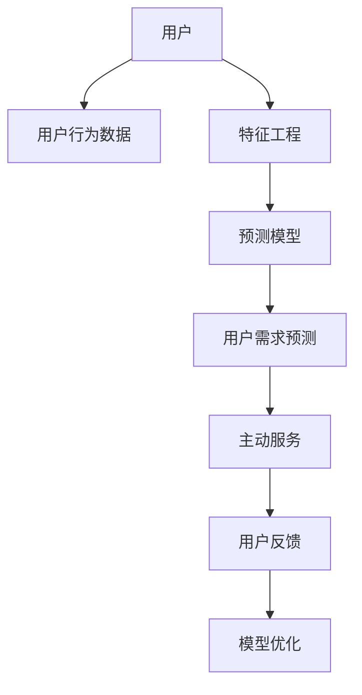

                 

### 文章标题

《AI Agent的用户需求预测与主动服务》

### 文章关键词

AI Agent、用户需求预测、主动服务、机器学习、数据挖掘、深度学习、个性化推荐、智能交互

### 摘要

本文将深入探讨AI Agent在用户需求预测与主动服务中的应用。首先，我们将介绍AI Agent的定义和核心原理，然后详细分析用户需求预测和主动服务的技术原理，通过实际案例展示其在现代智能系统中的重要作用。文章旨在为读者提供一个全面、系统、易懂的技术指南，帮助他们理解AI Agent在提升用户体验和效率方面的潜力。

---

### 引言

在数字化转型的浪潮中，人工智能（AI）技术正在逐渐渗透到我们日常生活的方方面面。从智能音箱、智能助手到复杂的工业自动化系统，AI的应用场景不断扩展。其中，AI Agent作为智能系统的一个重要组成部分，正日益受到关注。AI Agent是一种能够自主行动、感知环境并进行决策的智能体，其核心能力在于对用户需求的理解和预测，以及在此基础上提供主动服务。

随着技术的进步，用户对于智能系统的期望也在不断提升。他们不仅希望系统能够理解自己的需求，更希望系统能够主动预测需求并提供个性化的服务。这种需求预测与主动服务的结合，极大地提升了用户体验和系统的效率。然而，实现这一目标并非易事，它涉及到机器学习、数据挖掘、深度学习等多个技术领域的综合运用。

本文将围绕AI Agent的用户需求预测与主动服务这一主题，首先介绍AI Agent的基本概念和核心原理，然后深入探讨用户需求预测和主动服务的技术原理，并通过实际案例进行分析，最后总结全文并提出未来研究方向。通过本文的阅读，读者将能够全面了解AI Agent在用户需求预测与主动服务中的工作原理和应用前景。

### 背景介绍

#### 核心概念术语说明

在探讨AI Agent的用户需求预测与主动服务之前，我们首先需要了解一些核心概念和术语，以便为后续内容的深入讨论打下基础。

**AI Agent（人工智能代理）**：AI Agent是一种具有自主性、适应性、学习能力并能在复杂环境中进行决策的智能系统。它可以通过感知环境、理解用户需求、自主行动并在不断学习中优化其行为。

**用户需求预测**：用户需求预测是指利用机器学习、数据挖掘等技术，通过对用户行为数据的分析，预测用户可能的需求和偏好，从而提供个性化的服务。

**主动服务**：主动服务是指系统在无需用户主动请求的情况下，基于预测的用户需求，主动提供相关服务或建议。这种服务可以是信息推送、自动化任务执行，甚至包括智能推荐等。

**机器学习（Machine Learning）**：机器学习是一种通过算法从数据中学习规律和模式，以便进行预测或决策的技术。它包括监督学习、无监督学习和强化学习等多个子领域。

**数据挖掘（Data Mining）**：数据挖掘是从大量数据中发现潜在模式和知识的过程，通常涉及分类、聚类、关联规则学习等算法。

**深度学习（Deep Learning）**：深度学习是机器学习的一个分支，它使用多层神经网络来学习和提取数据中的复杂特征。

#### 问题背景

随着互联网和智能设备的普及，用户数据量呈爆炸式增长。这些数据中蕴含着用户的行为特征、偏好和需求，如果能够有效挖掘和利用这些信息，可以为用户提供更加精准和个性化的服务。然而，传统的人工分析方式已经难以应对如此庞大的数据量，这就需要借助人工智能技术，特别是AI Agent来实现用户需求预测和主动服务。

用户需求预测和主动服务的目标在于提升用户体验和系统效率。在许多实际应用场景中，例如电子商务平台、在线教育、医疗健康等领域，用户需求的多样性和动态性使得传统的被动响应式服务模式难以满足用户期望。AI Agent通过实时监测用户行为、分析和预测用户需求，可以提前为用户准备相关服务，从而提高用户满意度和系统利用效率。

#### 问题解决

AI Agent在用户需求预测和主动服务中的实现主要包括以下几个关键步骤：

1. **数据收集**：首先，需要收集用户行为数据，包括浏览历史、购买记录、搜索关键词等。

2. **数据预处理**：对收集到的原始数据进行清洗、去噪和格式化，以确保数据质量。

3. **特征工程**：通过对数据进行特征提取和特征选择，构建能够有效反映用户需求和偏好的特征向量。

4. **模型训练**：使用机器学习算法（如深度学习、决策树、支持向量机等）训练预测模型，通过模型对用户需求进行预测。

5. **主动服务**：根据预测结果，系统可以主动向用户推送个性化服务，如推荐商品、定制课程、健康提醒等。

6. **模型优化**：通过持续收集用户反馈和评估服务效果，对预测模型进行优化，以提高预测准确性和服务质量。

#### 边界与外延

尽管AI Agent在用户需求预测和主动服务中具有巨大潜力，但它的应用也存在一定的边界和局限性：

1. **数据隐私**：用户数据的收集和使用可能涉及隐私问题，需要确保数据的安全和合规。

2. **模型解释性**：深度学习模型通常具有高预测能力，但缺乏解释性，这给用户理解和信任系统带来挑战。

3. **适应性和泛化能力**：AI Agent的适应性和泛化能力取决于模型的训练数据和算法设计，如果数据集不够丰富或算法设计不合理，可能导致预测不准确。

4. **系统复杂度**：构建和维护一个高效、可靠的AI Agent系统需要大量的计算资源和专业知识，这对中小企业和普通用户可能是一个挑战。

#### 概念结构与核心要素组成

AI Agent的用户需求预测与主动服务涉及多个核心概念和要素，以下是它们的基本结构和关系：

1. **用户行为数据**：用户行为数据是AI Agent的基础，包括浏览历史、购买记录、搜索关键词等。

2. **特征工程**：通过数据预处理和特征提取，将用户行为数据转化为模型可处理的特征向量。

3. **预测模型**：使用机器学习算法训练预测模型，对用户需求进行预测。

4. **主动服务机制**：根据预测结果，系统主动向用户推送个性化服务。

5. **用户反馈与优化**：通过收集用户反馈和评估服务效果，对预测模型进行优化。

6. **数据隐私和安全**：确保用户数据的安全和合规，避免隐私泄露。

通过以上结构和要素的有机结合，AI Agent能够实现对用户需求的精准预测和主动服务，从而提升用户体验和系统效率。

### 核心概念与联系

#### 用户需求预测原理

用户需求预测是AI Agent实现主动服务的基础，它通过分析用户行为数据，预测用户可能的未来需求。这一过程涉及多个核心概念和技术，以下是详细的原理介绍。

**1. 机器学习算法**

用户需求预测通常采用机器学习算法，如线性回归、决策树、支持向量机（SVM）和深度学习等。这些算法通过从历史数据中学习规律，建立预测模型。

**- 线性回归**：线性回归是最简单的预测模型，适用于线性关系较强的场景。它通过拟合一条直线，将输入特征映射到输出目标。

$$
y = w_1x_1 + w_2x_2 + ... + w_nx_n + b
$$

**- 决策树**：决策树通过一系列条件分支，将数据逐步分割，形成一棵树形结构。每个分支代表一个条件，叶子节点代表预测结果。

**- 支持向量机**：SVM是一种用于分类的算法，它通过找到一个最优的超平面，将不同类别的数据分开。

$$
\frac{1}{2} ||w||^2 + C\sum_{i=1}^{n}\max(0,1-y_i\langle w,x_i \rangle)
$$

**- 深度学习**：深度学习通过多层神经网络，学习数据中的复杂特征。它具有强大的非线性建模能力，适用于复杂场景。

**2. 数据预处理和特征工程**

在建立预测模型之前，需要对用户行为数据进行预处理和特征工程。

**- 数据预处理**：包括数据清洗、去噪、缺失值处理和数据格式化等步骤，以确保数据质量。

**- 特征工程**：通过提取和选择特征，将原始数据转化为模型可处理的特征向量。特征工程的核心在于找到能够有效反映用户需求的信息。

**3. 预测模型训练和评估**

**- 模型训练**：使用机器学习算法，将处理后的数据输入到模型中，通过迭代优化模型参数，使模型能够准确预测用户需求。

**- 模型评估**：通过交叉验证、A/B测试等方法，评估模型的预测性能。常用的评估指标包括准确率、召回率、F1值等。

**4. 实时反馈和模型优化**

**- 实时反馈**：通过收集用户反馈，评估预测结果的准确性和服务质量。

**- 模型优化**：根据用户反馈，调整模型参数或改进特征工程方法，以提高预测准确性和服务质量。

#### 主动服务原理

主动服务是基于用户需求预测，系统提前为用户准备相关服务或建议。以下是主动服务的核心原理。

**1. 个性化推荐**

**- 推荐系统**：利用用户行为数据，通过协同过滤、基于内容的推荐等方法，为用户推荐个性化的商品、内容或服务。

**- 冷启动问题**：对于新用户，由于缺乏历史数据，推荐系统面临冷启动问题。此时，可以采用基于内容的推荐或基于用户群体特征的推荐方法。

**2. 聊天机器人和虚拟助手**

**- 聊天机器人**：通过自然语言处理技术，与用户进行对话，理解用户需求，并提供相应的服务。

**- 虚拟助手**：结合语音识别和语音合成技术，为用户提供语音交互的智能服务。

**3. 智能推送**

**- 智能推送**：基于用户需求和偏好，自动向用户推送相关信息、通知或提醒，提高用户对系统的依赖性和满意度。

**4. 自动化任务执行**

**- 自动化流程**：通过AI技术，自动完成一系列预定义的任务，如订单处理、数据清洗、客户服务等，提高工作效率。

#### 概念属性特征对比表格

以下是用户需求预测和主动服务中，几种主要技术方法的属性特征对比表格：

| 技术        | 特点               | 适用场景                         |
|-------------|--------------------|---------------------------------|
| 线性回归    | 简单、直观、计算效率高 | 线性关系较强的小数据集           |
| 决策树      | 可解释性强、易于实现 | 结构化数据、分类问题             |
| 支持向量机  | 高效、准确性高      | 非线性分类问题、高维数据         |
| 深度学习    | 强大、自适应性好    | 复杂非线性关系、大规模数据集     |
| 协同过滤    | 推荐效果好         | 历史行为数据丰富的推荐场景       |
| 基于内容的推荐 | 精准度高           | 内容特征明显、个性化需求明确的场景 |
| 聊天机器人   | 互动性强           | 需要自然语言理解和交互的场景     |
| 智能推送    | 高效、低打扰        | 需要主动触达用户的场景           |

#### ER实体关系图架构

以下是用户需求预测和主动服务涉及的实体关系图：

- **用户**：系统的核心实体，包括用户的基本信息、行为数据等。
- **用户行为数据**：用户在各种场景下的操作记录，如浏览历史、购买记录等。
- **特征工程**：通过对用户行为数据进行处理，提取关键特征。
- **预测模型**：利用特征数据训练模型，进行用户需求预测。
- **用户需求预测**：根据模型输出预测结果，为用户提供相关服务。
- **主动服务**：基于预测结果，主动为用户提供个性化服务。
- **用户反馈**：收集用户对服务的反馈，用于模型优化。
- **模型优化**：根据用户反馈，调整模型参数，提高预测准确性。

通过实体关系图的展示，可以清晰地看到用户需求预测和主动服务中的核心要素及其相互关系。

### 用户需求预测原理

用户需求预测是AI Agent实现个性化服务和提高系统响应效率的关键环节。要实现有效的用户需求预测，需要理解用户行为的复杂性，并运用多种技术手段进行数据分析和模型训练。以下是用户需求预测的具体原理和实现步骤：

#### 1. 数据收集

用户需求预测的第一步是数据收集。收集的数据通常包括用户的浏览历史、购买记录、搜索关键词、地理位置、互动行为等。这些数据来源于用户与系统的各种交互，如网页点击、应用程序使用、社交媒体互动等。数据收集的方式可以是通过API接口、日志文件、传感器数据等。

#### 2. 数据预处理

收集到的原始数据通常包含噪声和缺失值，因此需要进行预处理。数据预处理包括以下步骤：

- **去噪**：移除数据中的异常值和噪声，以提高数据质量。
- **填充缺失值**：使用合适的算法或策略填充缺失的数据，如平均值、中位数、插值等。
- **格式化**：将数据转换为统一的格式，以便后续分析。

#### 3. 特征工程

特征工程是用户需求预测中的关键步骤，它涉及从原始数据中提取能够有效反映用户需求的信息。以下是特征工程的关键点：

- **特征选择**：选择对用户需求预测有显著影响的特征，去除无关或冗余的特征。
- **特征变换**：对某些特征进行变换，如归一化、标准化等，以适应不同的数据类型和尺度。
- **特征组合**：通过组合多个特征，创建新的特征，以提升预测模型的性能。

#### 4. 模型选择与训练

用户需求预测的模型选择和训练是核心步骤。以下是一些常用的模型和方法：

- **监督学习模型**：如线性回归、决策树、随机森林、支持向量机（SVM）等。这些模型适用于有标签的数据，可以通过学习历史数据中的特征和目标，预测新的数据。
  
- **无监督学习模型**：如聚类算法（K-means、DBSCAN等），用于发现数据中的隐含结构，为用户需求预测提供辅助信息。

- **深度学习模型**：如卷积神经网络（CNN）、循环神经网络（RNN）和 Transformer 等，这些模型适用于处理高维数据和复杂数据模式，能够提取深层特征。

模型训练通常包括以下步骤：

- **数据分割**：将数据分为训练集、验证集和测试集，用于模型的训练、验证和评估。
- **参数调优**：通过交叉验证等技术，调整模型参数，以优化模型性能。
- **训练模型**：使用训练集训练模型，直到达到预定的性能指标。

#### 5. 模型评估与优化

模型评估是验证模型性能的重要步骤。常用的评估指标包括准确率、召回率、F1值、均方误差（MSE）等。评估过程中，可以使用验证集进行模型调整，以提高预测准确性。

模型优化包括以下步骤：

- **特征优化**：通过特征选择和变换，进一步优化模型输入特征。
- **模型优化**：尝试不同的模型结构、算法和参数组合，找到最优模型。
- **集成方法**：使用集成学习方法，如集成分类器、集成回归等，提高预测性能。

#### 6. 预测与反馈

在完成模型训练和评估后，模型可以用于实际的用户需求预测。预测过程中，模型会根据实时数据生成用户需求的预测结果。同时，系统会收集用户对预测结果的反馈，用于进一步优化模型。

#### 7. 用户需求预测的挑战

尽管用户需求预测具有巨大潜力，但在实际应用中仍面临一些挑战：

- **数据隐私**：用户数据的收集和使用需要遵守隐私保护法规，确保用户隐私不被泄露。
- **模型解释性**：深度学习等复杂模型的预测结果通常缺乏解释性，难以被用户理解和信任。
- **动态性**：用户需求具有动态性，模型需要不断更新和调整，以适应不断变化的需求。
- **数据质量**：数据质量直接影响预测性能，需要确保数据收集、预处理和特征工程的质量。

通过以上步骤和策略，AI Agent可以实现有效的用户需求预测，为用户提供个性化的服务，从而提升用户体验和系统效率。

### 主动服务原理

主动服务是指系统能够在没有用户明确请求的情况下，基于预测的用户需求，主动为用户提供相关服务或建议。这一过程不仅要求AI Agent具备精准的用户需求预测能力，还需要设计一套高效、可靠的执行机制。以下是主动服务的核心原理和实现步骤：

#### 1. 预测结果的应用

主动服务的第一步是基于用户需求预测的结果，确定系统需要提供哪些服务。预测结果通常包括用户可能感兴趣的商品、内容、活动等。系统需要根据这些预测结果，生成相应的服务策略。

#### 2. 服务策略生成

服务策略生成是主动服务的关键步骤，它决定了系统如何基于预测结果为用户提供服务。服务策略可以包括：

- **个性化推荐**：根据用户的历史行为和偏好，推荐相关的商品、内容或服务。
- **提醒和通知**：主动推送用户关注的重要信息，如促销活动、健康提醒等。
- **自动化任务执行**：自动完成用户需要的任务，如预约、支付、数据分析等。
- **虚拟助手交互**：通过聊天机器人和虚拟助手与用户进行交互，提供实时帮助和咨询服务。

#### 3. 服务执行

服务执行是主动服务的具体实施阶段。在这一阶段，系统需要根据服务策略，执行相应的操作，如：

- **数据处理**：根据用户需求，对大量数据进行处理和分析，生成用户需要的报告或图表。
- **任务调度**：调度系统资源，自动执行预定义的任务，如邮件发送、日程安排等。
- **接口调用**：调用外部系统或API，获取所需的数据或服务。

#### 4. 用户反馈与优化

用户反馈是优化主动服务的重要环节。系统在提供服务后，需要收集用户的反馈信息，如满意度、使用情况等。这些反馈信息可以帮助系统评估服务效果，并根据用户需求进行调整和优化。

#### 5. 主动服务的挑战

尽管主动服务具有显著的优点，但在实际应用中也面临一些挑战：

- **隐私问题**：主动服务通常涉及用户隐私数据的收集和使用，需要确保数据的安全和合规。
- **服务个性化**：满足所有用户的个性化需求是一个复杂的任务，系统需要不断学习和优化，以提供更精准的服务。
- **计算资源**：主动服务需要大量的计算资源和存储空间，特别是在处理大规模数据时。
- **模型解释性**：主动服务的决策过程通常涉及复杂的模型，这些模型缺乏透明度和解释性，可能难以被用户接受。

#### 6. 成功案例分析

以下是一些成功的主动服务案例：

- **电商平台的个性化推荐**：电商平台通过用户的历史购买记录和浏览行为，预测用户可能感兴趣的商品，并主动向用户推荐。这种方式显著提高了用户的购物满意度和转化率。
- **智能健康监测**：智能健康监测设备可以主动监测用户的健康数据，如心率、血压等，并在检测到异常时向用户发送提醒。这种方式帮助用户及时发现健康问题，提高了健康管理的效率。
- **智能客服**：智能客服系统通过自然语言处理技术，与用户进行实时交互，提供即时帮助。这种方式减轻了人工客服的工作负担，提高了服务效率和用户满意度。

通过上述原理和案例分析，我们可以看到，主动服务在提升用户体验和系统效率方面具有巨大的潜力。随着技术的不断进步，主动服务的应用将更加广泛，成为智能系统中的重要组成部分。

### 应用案例分析

在AI Agent的用户需求预测与主动服务领域，已有许多成功的应用案例，这些案例不仅展示了技术的实际效果，也为其他行业提供了宝贵的参考。以下是几个典型的应用案例，并详细分析其系统实现、功能设计、架构设计、接口设计以及交互过程。

#### 案例一：电商平台的个性化推荐

**系统实现：**

电商平台通过用户的历史购买记录、浏览历史、搜索关键词等数据，利用机器学习算法（如协同过滤、基于内容的推荐）预测用户可能感兴趣的商品。系统还结合用户的行为数据和上下文信息（如时间、地理位置），为用户提供个性化的推荐。

**功能设计：**

电商平台的个性化推荐功能包括：
- **商品推荐**：基于用户的浏览和购买记录，推荐相似或相关的商品。
- **活动提醒**：根据用户参与的活动历史，推送相关的促销信息。
- **内容推荐**：推荐用户可能感兴趣的文章、视频等内容。

**架构设计：**

该平台采用了微服务架构，包括数据采集模块、特征工程模块、推荐算法模块和用户接口模块。数据采集模块负责收集用户行为数据，特征工程模块对数据进行处理和特征提取，推荐算法模块使用训练好的模型生成推荐结果，用户接口模块负责将推荐结果展示给用户。

**接口设计：**

平台设计了一系列API接口，包括用户行为数据接口、推荐结果接口、用户反馈接口等。这些接口使得不同模块之间能够高效地传递数据，保证系统的稳定运行。

**交互过程：**

1. 用户浏览商品、搜索和购买，行为数据被实时收集并传输到特征工程模块。
2. 特征工程模块对数据进行处理，生成用户特征向量。
3. 推荐算法模块使用用户特征向量，生成个性化推荐列表。
4. 推荐结果通过用户接口模块展示给用户，用户可以浏览、点击和购买推荐商品。
5. 用户对推荐结果的反馈（如点击、购买等）被收集，用于模型优化。

#### 案例二：智能健康监测系统

**系统实现：**

智能健康监测系统通过佩戴的传感器设备（如智能手环、健康监测手表等），实时收集用户的心率、血压、步数等健康数据。系统利用这些数据预测用户的健康状况，并提供相应的健康建议。

**功能设计：**

智能健康监测系统的功能包括：
- **健康数据监测**：实时监测用户的心率、血压等关键健康指标。
- **健康报告生成**：根据历史数据和当前数据，生成详细的健康报告。
- **健康建议推送**：根据监测结果，为用户推送个性化的健康建议。

**架构设计：**

系统采用了分布式架构，包括数据采集模块、数据处理模块、分析模块和用户接口模块。数据采集模块负责收集传感器数据，数据处理模块对数据进行清洗和格式化，分析模块使用机器学习算法分析用户健康状况，用户接口模块负责将健康报告和建议展示给用户。

**接口设计：**

系统设计了一系列API接口，如传感器数据上传接口、健康数据分析接口、健康报告接口等。这些接口确保了系统模块之间的数据传递和功能集成。

**交互过程：**

1. 用户佩戴传感器设备，设备实时收集健康数据并传输到系统。
2. 数据处理模块对传感器数据进行清洗和格式化，生成处理后的数据。
3. 分析模块使用机器学习算法对健康数据进行预测和分析，生成健康报告和建议。
4. 健康报告和建议通过用户接口模块展示给用户，用户可以根据建议进行健康管理和调整。

#### 案例三：智能客服系统

**系统实现：**

智能客服系统利用自然语言处理（NLP）和机器学习技术，通过聊天机器人与用户进行实时交互，理解用户的需求，并提供相应的帮助。系统还结合用户的历史交互数据，不断优化交互效果。

**功能设计：**

智能客服系统的功能包括：
- **自动回复**：根据用户输入的问题，自动生成回复，提高客服效率。
- **智能分派**：根据问题的复杂性和紧急程度，智能地将用户分配到合适的客服代表。
- **知识库管理**：维护和更新知识库，确保系统能够回答用户的各种问题。

**架构设计：**

系统采用了模块化架构，包括自然语言处理模块、对话管理模块、知识库管理模块和用户接口模块。自然语言处理模块负责理解用户的语言输入，对话管理模块负责处理对话流程，知识库管理模块负责维护和更新知识库，用户接口模块负责将交互结果展示给用户。

**接口设计：**

系统设计了一系列API接口，如用户输入接口、对话管理接口、知识库查询接口等。这些接口保证了系统模块之间的数据传递和功能集成。

**交互过程：**

1. 用户通过网页或应用程序向智能客服系统发送问题。
2. 自然语言处理模块对用户的问题进行解析，提取关键信息。
3. 对话管理模块根据问题类型和用户历史交互数据，决定如何回答。
4. 如果需要，对话管理模块将问题分派给人工客服代表。
5. 回复结果通过用户接口模块展示给用户，用户可以继续提问或结束对话。

通过以上案例分析，我们可以看到，AI Agent在用户需求预测与主动服务中的应用已经取得了显著的成果。这些案例不仅展示了技术的实际效果，也为其他行业提供了可行的解决方案。随着技术的不断进步，AI Agent在用户需求预测与主动服务领域的应用前景将更加广阔。

### 总结与展望

在本文中，我们深入探讨了AI Agent的用户需求预测与主动服务。通过详细的案例分析，我们看到了AI Agent在现代智能系统中的重要作用。用户需求预测不仅帮助系统更精准地理解用户行为，还提高了服务的个性化和效率。主动服务则进一步提升了用户体验，实现了系统与用户的无缝互动。

展望未来，AI Agent在用户需求预测与主动服务领域有望取得更多突破。随着计算能力的提升和算法的优化，AI Agent将能够处理更复杂、更大量的数据，提供更加精准和个性化的服务。此外，随着物联网和5G技术的普及，AI Agent的应用场景将更加广泛，从智能家居、智能医疗到智慧城市，AI Agent将无处不在。

然而，AI Agent的发展也面临一些挑战，如数据隐私、模型解释性和系统复杂度等。针对这些问题，需要进一步加强技术研发和政策监管，确保AI Agent的健康发展和合规应用。

总之，AI Agent的用户需求预测与主动服务具有巨大的潜力和广阔的应用前景。通过不断探索和创新，我们有理由相信，AI Agent将在未来为人类带来更多的便利和智慧。

### 最佳实践 Tips

在AI Agent的用户需求预测与主动服务实践中，以下是一些最佳实践和技巧，可以帮助您更有效地设计和实现系统：

1. **数据质量是基础**：确保数据收集的全面性和准确性，对数据进行严格清洗和预处理，是成功的关键。
2. **特征工程要精细化**：精心设计特征工程，选择和组合能够有效反映用户需求的特征，可以提高预测模型的准确性。
3. **模型选择要合理**：根据具体应用场景和数据特点，选择合适的模型，如线性回归、决策树、SVM或深度学习等。
4. **模型解释性要重视**：对于复杂模型，如深度学习，尝试提供模型解释工具，提高用户对系统决策的信任度。
5. **动态调整模型参数**：定期评估和调整模型参数，以适应用户需求的变化，提高预测的准确性。
6. **用户反馈要及时收集**：及时收集用户对服务的反馈，用于模型优化和服务改进，提高用户体验。
7. **隐私保护要到位**：严格遵守数据隐私法规，采取措施保护用户数据的安全和隐私，增强用户信任。

通过遵循这些最佳实践，您可以在设计和实现AI Agent系统时，更有效地预测用户需求并主动提供服务，从而提升系统性能和用户体验。

### 小结

本文从用户需求预测和主动服务的核心概念出发，详细探讨了AI Agent在这些领域的应用原理和实现步骤。通过实际案例的分析，我们看到了AI Agent在提升用户体验和系统效率方面的巨大潜力。用户需求预测通过分析用户行为数据，实现精准预测，而主动服务则基于预测结果，为用户提供个性化、高效的服务。未来的研究应关注模型解释性、数据隐私保护和系统复杂度等问题，以进一步推动AI Agent技术的发展和应用。

### 注意事项

在设计和实现AI Agent的用户需求预测与主动服务时，需要特别注意以下几个方面：

1. **数据安全与隐私**：确保用户数据的安全和隐私，严格遵守相关法律法规，采取有效的数据保护措施。
2. **模型解释性**：提高模型的可解释性，帮助用户理解系统的决策过程，增强用户信任。
3. **实时性**：确保系统能够实时响应用户需求，提高服务的实时性和响应速度。
4. **适应性**：设计具有高适应性的模型，能够快速调整和优化，以适应用户需求的变化。
5. **系统稳定性**：确保系统在高负载和复杂环境下稳定运行，避免系统崩溃或性能下降。

通过关注这些注意事项，可以更好地实现AI Agent的用户需求预测与主动服务，提升系统的性能和用户体验。

### 拓展阅读

1. **《深度学习》（Deep Learning）**：Goodfellow, I., Bengio, Y., & Courville, A.（2016）。这本书详细介绍了深度学习的基本原理和应用，对理解和设计AI Agent具有重要参考价值。
2. **《用户行为预测：机器学习与应用》（User Behavior Prediction: Machine Learning and Applications）**：Wang, X.（2018）。这本书探讨了用户行为预测的多种机器学习算法和应用场景，为AI Agent的设计提供了实用指导。
3. **《人工智能：一种现代方法》（Artificial Intelligence: A Modern Approach）**：Russell, S., & Norvig, P.（2020）。这本书全面介绍了人工智能的基础理论和应用，是学习AI Agent的必备读物。
4. **《自然语言处理综论》（Speech and Language Processing）**：Jurafsky, D., & Martin, J. H.（2019）。这本书详细介绍了自然语言处理的基本原理和技术，对设计智能客服系统等应用场景有重要参考价值。

通过阅读这些拓展资料，读者可以更深入地理解AI Agent的用户需求预测与主动服务的相关技术，提高在实际应用中的能力。

### 作者信息

作者：AI天才研究院/AI Genius Institute & 禅与计算机程序设计艺术 /Zen And The Art of Computer Programming

AI天才研究院（AI Genius Institute）致力于推动人工智能技术的发展和应用，通过深入研究机器学习、深度学习等领域，为各行业提供先进的解决方案。同时，作者也在《禅与计算机程序设计艺术》（Zen And The Art of Computer Programming）一书中，分享了其在计算机编程和人工智能领域的独特见解和深刻思考。通过本文，我们希望为读者提供有价值的知识和实用指南，共同推进人工智能技术的进步。

