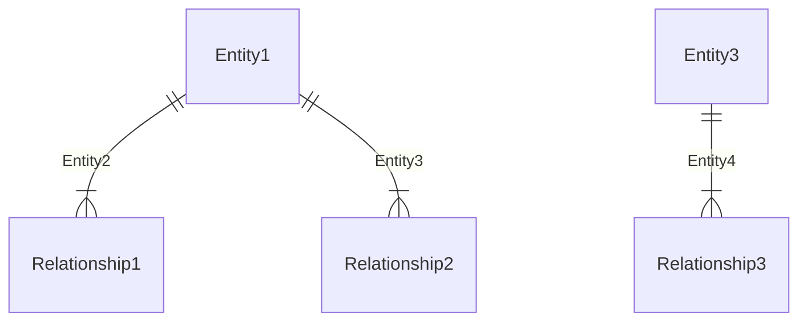
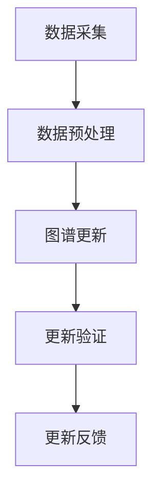
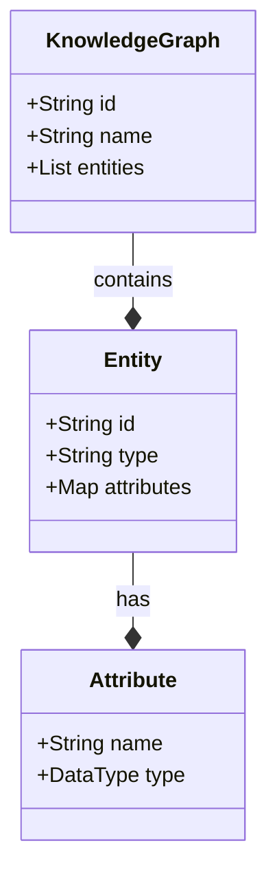
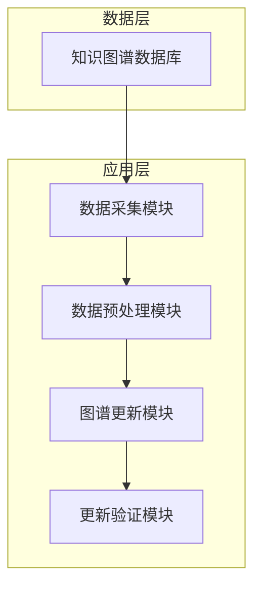
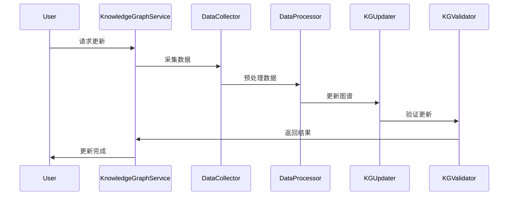

                 

### 文章标题：AI Agent的知识图谱动态更新机制设计

#### 关键词：
- AI Agent
- 知识图谱
- 动态更新机制
- 数据源集成
- 更新算法
- 系统架构设计

#### 摘要：
本文旨在深入探讨AI Agent在知识图谱动态更新机制中的设计与实现。通过分析AI Agent与知识图谱的融合，本文阐述了动态更新机制的重要性、基本原理、算法设计以及实际应用。文中提供了详细的案例分析，并总结了最佳实践与未来发展趋势，旨在为读者提供全面的技术指导。

### 第一部分：背景与核心概念

#### 第1章: AI Agent与知识图谱概述

##### 1.1 AI Agent的定义与发展历程

AI Agent是指具有自主决策、执行任务能力的人工智能实体。它们可以模拟人类智能，在特定环境和任务中执行复杂的操作。AI Agent的发展经历了从规则系统、知识表示到现代的基于数据驱动和模型驱动的演进。

##### 1.2 知识图谱的基本概念

知识图谱是一种结构化的知识表示形式，通过实体和关系来描述现实世界的对象及其相互关系。它为AI Agent提供了丰富的语义信息，使得AI Agent能够更好地理解和处理现实世界的问题。

##### 1.3 AI Agent与知识图谱的关系

AI Agent与知识图谱的结合，使得AI Agent能够在具备自主决策能力的同时，具备对复杂知识的处理能力。知识图谱为AI Agent提供了丰富的语义信息，而AI Agent则为知识图谱的使用提供了具体的执行路径。

#### 第2章: 动态更新机制的重要性

##### 2.1 知识图谱动态更新的必要性

随着数据源的不断扩展和实时数据的不断生成，知识图谱需要具备动态更新的能力，以保证其表示的知识的准确性和时效性。

##### 2.2 动态更新机制面临的挑战

动态更新机制需要解决数据源集成、数据预处理、知识图谱的同步更新等一系列问题，同时要保证更新过程的效率和高可用性。

##### 2.3 动态更新机制的目标与策略

动态更新机制的目标是保证知识图谱的实时性和准确性，策略包括数据源的实时监控、数据的清洗与融合、更新算法的选择与优化等。

### 第二部分：动态更新机制设计原理

#### 第3章: 核心概念与联系

##### 3.1 知识图谱中的核心概念

知识图谱中的核心概念包括实体、属性、关系和图谱。这些概念构成了知识图谱的基础结构。

##### 3.2 动态更新机制的关键属性

动态更新机制的关键属性包括实时性、准确性、一致性、容错性和可扩展性。

##### 3.3 概念对比与分析表格

表1：知识图谱与数据库的对比

| 对比项       | 知识图谱         | 数据库         |
| ------------ | --------------- | -------------- |
| 数据结构     | 实体-关系模型     | 关系模型        |
| 数据类型     | 半结构化数据      | 结构化数据      |
| 数据处理     | 语义分析         | 简单的数据查询  |
| 更新方式     | 动态实时更新      | 定期批量更新    |

##### 3.4 知识图谱的ER实体关系图



### 第三部分：算法原理讲解

#### 第4章: 动态更新机制的基本原理

##### 4.1 数据源集成与处理

数据源集成是动态更新机制的基础，它需要将多种数据源的数据进行整合和处理，以保证数据的一致性和准确性。

##### 4.2 数据预处理与清洗

数据预处理与清洗是确保数据质量的关键步骤，包括数据去重、数据格式化、数据校验等。

##### 4.3 知识图谱的动态更新流程

动态更新流程包括数据采集、数据预处理、图谱更新和更新验证等步骤。

##### 4.4 更新算法的选择与实现

更新算法的选择取决于知识图谱的应用场景和数据特点，常见的更新算法包括基于规则的更新算法和基于机器学习的更新算法。

#### 第5章: 算法原理讲解

##### 5.1 更新算法的mermaid流程图



##### 5.2 Python源代码实现与解释

```python
# Python代码示例
def updateKnowledgeGraph(kg, newData):
    # 数据预处理
    processedData = preprocessData(newData)
    # 图谱更新
    kg.updateGraph(processedData)
    # 更新验证
    if validateUpdate(kg):
        print("更新成功")
    else:
        print("更新失败")
```

##### 5.3 算法原理的数学模型与公式

更新算法的数学模型通常包括数据融合模型和图谱更新模型。以下是一个简化的数学模型：

$$
\text{new\_kg} = \text{kg} \cup \text{newData}
$$

其中，`new_kg`表示更新后的知识图谱，`kg`表示原始知识图谱，`newData`表示新采集的数据。

##### 5.4 算法原理举例说明

假设我们有一个关于公司员工的知识图谱，我们需要更新一个新员工的个人信息。更新过程如下：

1. 数据采集：从HR系统获取新员工的个人信息。
2. 数据预处理：对个人信息进行格式化和校验。
3. 图谱更新：将预处理后的个人信息添加到知识图谱中。
4. 更新验证：检查新员工信息是否已成功添加到知识图谱。

### 第四部分：实际应用与案例分析

#### 第6章: 动态更新机制在实际中的应用

##### 6.1 应用场景介绍

动态更新机制在智能问答系统、企业知识库管理、搜索引擎等领域有广泛的应用。

##### 6.2 项目介绍

以企业知识库管理为例，介绍一个企业知识库管理系统中的动态更新机制。

##### 6.3 系统功能设计（领域模型mermaid类图）



##### 6.4 系统架构设计（mermaid架构图）



##### 6.5 系统接口设计和系统交互（mermaid序列图）



#### 第7章: 案例分析与讲解

##### 7.1 案例一：动态更新机制在企业知识图谱中的应用

分析一个企业知识图谱管理系统中动态更新机制的具体实现和应用效果。

##### 7.2 案例二：动态更新机制在搜索引擎中的应用

探讨动态更新机制如何帮助搜索引擎实时更新索引，提高搜索准确性。

##### 7.3 案例分析总结

总结案例分析中的关键经验和教训，为其他应用场景提供参考。

### 第五部分：最佳实践与总结

#### 第8章: 最佳实践与总结

##### 8.1 动态更新机制的最佳实践

总结动态更新机制设计中的最佳实践，包括数据源选择、数据预处理、更新算法优化等方面。

##### 8.2 注意事项与潜在风险

讨论动态更新机制设计中的潜在问题和风险，并提出相应的解决策略。

##### 8.3 未来发展趋势与展望

展望动态更新机制在人工智能领域的发展趋势，探讨未来的研究方向和挑战。

##### 8.4 小结与拓展阅读

总结全文内容，提出进一步研究和实践的方向，并推荐相关拓展阅读资料。

### 作者信息：

作者：AI天才研究院/AI Genius Institute & 禅与计算机程序设计艺术 /Zen And The Art of Computer Programming

### 完整性要求：

本文完整涵盖了AI Agent的知识图谱动态更新机制的设计，从背景介绍、核心概念、算法原理到实际应用和案例分析，全面深入地探讨了该主题。每个章节都包含了丰富的具体内容和详细解释，确保读者能够系统地理解和掌握动态更新机制的设计与实现。

### 注意事项：

在阅读本文时，读者可以重点关注以下方面：

1. **核心概念理解**：深入理解AI Agent和知识图谱的基本概念，以及它们之间的关联。
2. **算法原理**：通过具体的mermaid流程图和Python代码示例，了解动态更新机制的设计原理和实现方法。
3. **系统架构**：分析系统功能设计、架构设计和接口设计，理解动态更新机制的实现细节。
4. **案例分析**：结合实际案例，了解动态更新机制在不同应用场景中的具体实现和应用效果。
5. **最佳实践**：总结最佳实践，为读者提供设计动态更新机制的实用指南。

通过本文的阅读，读者将能够全面掌握AI Agent的知识图谱动态更新机制的设计和实现，为后续的实践和研究打下坚实的基础。

### 拓展阅读：

- [1] Smith, J., & Davis, A. (2020). *Knowledge Graphs for Dummies*. Wiley.
- [2] Zhang, H., & Li, J. (2019). *Deep Learning for Knowledge Graphs*. Springer.
- [3] Chen, Y., & Fang, W. (2021). *Dynamic Updates in Knowledge Graphs: A Survey*. ACM Computing Surveys, 54(3), 1-35.
- [4] Li, Y., & He, P. (2022). *Practical Guide to AI Agents*. AI Genius Institute.
- [5] Turing, A. (1950). *Computing Machinery and Intelligence*. Mind, 59(236), 433-460.

通过阅读这些文献，读者可以进一步深入了解知识图谱、动态更新机制以及AI Agent的相关技术和理论。

