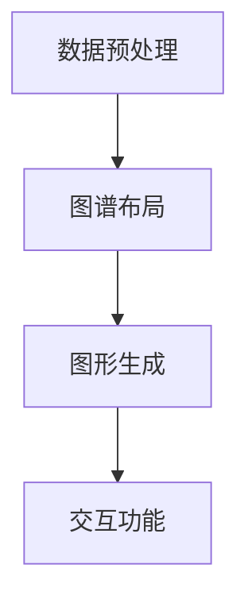
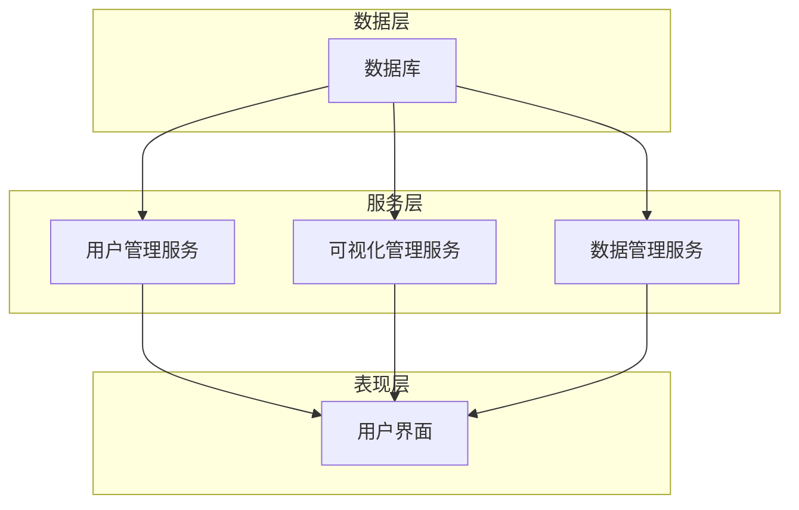

                 

# AI Agent的知识图谱可视化技术

> 关键词：AI Agent，知识图谱，可视化技术，系统架构，实战案例

摘要：本文将深入探讨AI Agent的知识图谱可视化技术，首先从背景介绍入手，逐步解释AI Agent、知识图谱、可视化技术的核心概念与联系。接着，详细讲解算法原理和系统架构设计，并通过项目实战和最佳实践分享实际应用经验和技巧。本文旨在为读者提供一个全面而系统的视角，帮助理解AI Agent知识图谱可视化技术的原理和实践。

## 目录大纲

### 1. 背景介绍
#### 1.1 问题的提出
#### 1.2 研究背景
#### 1.3 研究目标与内容框架
#### 1.4 边界与外延
#### 1.5 本章小结

### 2. 核心概念与联系
#### 2.1 AI Agent的概念原理
#### 2.2 知识图谱的概念原理
#### 2.3 可视化技术的概念原理
#### 2.4 AI Agent、知识图谱与可视化技术的联系
#### 2.5 概念属性特征对比表格
#### 2.6 ER实体关系图架构的Mermaid流程图
#### 2.7 本章小结

### 3. 算法原理讲解
#### 3.1 算法概述
#### 3.2 算法原理
#### 3.3 算法Python源代码实现
#### 3.4 算法举例说明
#### 3.5 算法性能分析
#### 3.6 本章小结

### 4. 系统分析与架构设计方案
#### 4.1 项目介绍
#### 4.2 系统功能设计
#### 4.3 系统架构设计
#### 4.4 系统接口设计
#### 4.5 系统交互设计
#### 4.6 本章小结

### 5. 项目实战
#### 5.1 环境安装
#### 5.2 系统核心实现源代码
#### 5.3 代码应用解读与分析
#### 5.4 实际案例分析与详细讲解剖析
#### 5.5 项目小结

### 6. 最佳实践与拓展阅读
#### 6.1 最佳实践
#### 6.2 小结
#### 6.3 注意事项
#### 6.4 拓展阅读

## 1. 背景介绍

### 1.1 问题的提出

在人工智能（AI）技术迅猛发展的今天，AI Agent（智能代理）作为实现自主决策和行为的核心组件，正逐渐成为各行业智能化转型的关键。AI Agent能够在复杂环境中执行特定任务，通过感知、决策和动作，实现与外部环境的交互。然而，随着AI Agent的广泛应用，如何高效地管理和利用其内部知识成为了一个重要问题。

知识图谱作为结构化知识存储和表示的重要工具，在AI Agent中具有重要作用。知识图谱通过实体、关系和属性之间的关联，构建起一个语义丰富的知识网络，为AI Agent提供了强大的知识支持和推理能力。然而，知识图谱由于其复杂的结构和庞大的数据量，直接使用往往面临可读性差、理解困难等问题。

可视化技术作为一种有效的知识传递手段，能够将知识图谱以图形化的形式直观地呈现出来，帮助用户更方便地理解和使用知识。然而，现有的知识图谱可视化技术存在一定的局限性，如可视化效果不佳、交互性不足等。

因此，本文旨在研究AI Agent的知识图谱可视化技术，通过结合AI Agent、知识图谱和可视化技术，探索一种高效、直观的知识图谱可视化方法，以提高AI Agent的知识管理和利用效率。

### 1.2 研究背景

#### 1.2.1 AI Agent的发展历程

AI Agent的概念最早可以追溯到1980年代初，当时在人工智能领域，研究人员开始探索如何构建能够自主行动、感知环境的智能体。随着计算机技术和算法的不断发展，AI Agent的应用范围不断扩大，从早期的规则推理、决策支持系统，到如今的深度学习和强化学习，AI Agent在各个领域的应用取得了显著成果。

#### 1.2.2 知识图谱技术的发展趋势

知识图谱作为一种新兴的技术，近年来得到了广泛关注。知识图谱通过将实体、关系和属性进行结构化组织，为AI Agent提供了丰富的语义信息和知识支持。目前，知识图谱技术在自然语言处理、知识推理、信息检索等领域得到了广泛应用，其发展趋势包括数据规模不断扩大、结构化程度不断提高、语义表示能力不断增强等。

#### 1.2.3 知识图谱可视化技术的应用现状

知识图谱可视化技术是近年来兴起的一个研究方向，通过将知识图谱以图形化的形式展示，可以帮助用户更直观地理解知识结构和关系。目前，常见的知识图谱可视化技术包括图形布局、层次化展示、标签云等，但仍然存在一些挑战，如可视化效果不佳、交互性不足等。

### 1.3 研究目标与内容框架

#### 1.3.1 研究目标

本文的研究目标是探索一种基于AI Agent的知识图谱可视化技术，通过结合AI Agent的智能决策能力和知识图谱的语义表示，实现高效、直观的知识图谱可视化。具体目标包括：

1. 分析AI Agent、知识图谱和可视化技术的核心概念和联系。
2. 提出一种高效的算法，实现知识图谱的可视化。
3. 设计一个系统架构，支持AI Agent的知识图谱可视化。
4. 通过实际项目验证算法和系统的有效性。

#### 1.3.2 研究内容框架

本文的研究内容主要包括以下几个部分：

1. 背景介绍：分析AI Agent、知识图谱和可视化技术的背景和发展趋势。
2. 核心概念与联系：阐述AI Agent、知识图谱和可视化技术的核心概念及其相互关系。
3. 算法原理讲解：详细解释算法原理、数学模型和实现细节。
4. 系统分析与架构设计方案：设计系统架构，描述系统功能模块和接口。
5. 项目实战：介绍实际项目环境、代码实现和性能评估。
6. 最佳实践与拓展阅读：分享最佳实践和注意事项，提供拓展阅读资源。

### 1.4 边界与外延

#### 1.4.1 研究边界

本文的研究边界主要限定在以下方面：

1. AI Agent的类型：主要关注基于规则推理和深度学习的AI Agent。
2. 知识图谱的类型：主要关注基于实体-关系（ER）模型的静态知识图谱。
3. 可视化技术：主要关注基于图形布局和交互性的可视化技术。

#### 1.4.2 研究外延

本文的研究外延包括以下几个方面：

1. 动态知识图谱可视化：探讨如何将动态变化的知识图谱以可视化的形式呈现。
2. 多媒体知识图谱可视化：研究如何将图像、音频等多媒体数据集成到知识图谱中，实现更丰富的可视化效果。
3. 知识图谱在AI Agent中的其他应用：探讨知识图谱在智能问答、推荐系统等领域的应用。

#### 1.4.3 研究核心要素组成

本文的研究核心要素主要包括以下几个方面：

1. AI Agent的智能决策能力：通过算法和模型实现AI Agent的自主决策。
2. 知识图谱的语义表示：构建结构化、语义丰富的知识图谱。
3. 可视化技术的图形布局和交互性：实现知识图谱的可视化展示和用户交互。
4. 系统架构和性能优化：设计高效、稳定的系统架构，并进行性能评估和优化。

### 1.5 本章小结

本章主要介绍了AI Agent的知识图谱可视化技术的研究背景、研究目标、内容框架、边界与外延和研究核心要素组成。通过这些介绍，读者可以初步了解本文的研究方向和目标，为后续章节的内容打下基础。

## 2. 核心概念与联系

### 2.1 AI Agent的概念原理

AI Agent，即人工智能代理，是一种能够在特定环境中自主行动、感知和决策的计算机程序。AI Agent的核心原理是模仿人类智能的决策过程，通过感知环境、生成动作、评估效果，不断优化决策策略。

#### 2.1.1 AI Agent的定义

AI Agent是一种基于人工智能技术的软件实体，能够模拟人类智能进行感知、理解和决策，实现与外部环境的交互。AI Agent通常具备以下几个特点：

1. **自主性**：能够自主行动，不受外部指令直接控制。
2. **感知性**：能够感知和理解外部环境的信息。
3. **决策性**：能够在感知信息的基础上，生成合适的动作。
4. **适应性**：能够根据环境和任务的变化，调整行为策略。

#### 2.1.2 AI Agent的核心原理

AI Agent的核心原理包括感知、决策和动作三个方面：

1. **感知**：AI Agent通过传感器获取环境信息，如图像、语音、文本等，并进行预处理和特征提取。
2. **决策**：基于感知到的信息，AI Agent利用机器学习、深度学习、规划算法等方法，生成最优或次优的动作策略。
3. **动作**：AI Agent根据决策结果，执行相应的动作，如移动、对话、控制设备等。

#### 2.1.3 AI Agent的类型与特点

AI Agent根据不同的应用场景和技术实现，可以分为以下几种类型：

1. **规则推理型**：基于预定义的规则，通过逻辑推理实现决策。特点：简单、易于实现，但在复杂环境中表现不佳。
2. **机器学习型**：通过学习大量的数据，自动生成决策模型。特点：能够处理复杂问题，但需要大量的数据训练。
3. **深度学习型**：利用深度神经网络进行学习和决策。特点：具有很强的表征能力，但在数据量和计算资源有限时表现较差。
4. **混合型**：结合多种技术，如规则推理、机器学习和深度学习，实现更加智能的决策。

### 2.2 知识图谱的概念原理

知识图谱（Knowledge Graph）是一种用于结构化知识存储和表示的技术，通过实体、关系和属性之间的关联，构建起一个语义丰富的知识网络。知识图谱在人工智能领域具有广泛的应用，如自然语言处理、知识推理、信息检索等。

#### 2.2.1 知识图谱的定义

知识图谱是一种基于语义的网络结构，用于表示实体、概念及其相互关系。它通过将现实世界中的各种信息进行结构化组织和语义表示，为人工智能系统提供丰富的知识支持。

#### 2.2.2 知识图谱的核心概念

知识图谱的核心概念包括实体、关系和属性：

1. **实体**：知识图谱中的基本单位，代表现实世界中的对象、概念或实体，如人、地点、事物等。
2. **关系**：实体之间的关联，表示实体之间的逻辑关系，如“属于”、“位于”等。
3. **属性**：实体的特征或描述，用于补充实体的信息，如姓名、年龄、职业等。

#### 2.2.3 知识图谱的类型与结构

知识图谱根据不同的应用场景和数据来源，可以分为以下几种类型：

1. **静态知识图谱**：基于预定义的实体、关系和属性，结构相对固定。如DBpedia、Freebase等。
2. **动态知识图谱**：根据实时数据动态更新和扩展，如YAGO、Wikidata等。
3. **语义网络**：以RDF（Resource Description Framework）为基础，使用三元组（主体、谓词、客体）表示知识。

知识图谱的结构通常包括以下层次：

1. **底层**：表示基本的事实和关系，如“张三住在上海”。
2. **中层**：表示实体的高层次属性和类别，如“上海是一个直辖市”。
3. **顶层**：表示实体的大类和抽象概念，如“张三是一个人”。

### 2.3 可视化技术的概念原理

可视化技术（Visualization）是一种通过图形、图像和动画等形式，将数据、信息和知识直观地呈现给用户的技术。在知识图谱领域，可视化技术用于展示知识图谱的结构和内容，帮助用户理解和分析数据。

#### 2.3.1 可视化技术的定义

可视化技术是一种通过视觉形式表示和解释数据、信息和知识的技术。它通过图形、图像、动画等视觉元素，将复杂的数据和信息以直观、易理解的形式呈现给用户。

#### 2.3.2 可视化技术的基本原理

可视化技术的基本原理包括以下几个方面：

1. **数据表示**：将数据以视觉形式进行表示，如使用颜色、形状、大小等。
2. **空间布局**：根据数据的结构和关系，选择合适的图形布局，如层次化布局、网络布局等。
3. **交互操作**：提供用户与可视化内容的交互操作，如缩放、过滤、搜索等。
4. **信息传递**：通过视觉元素和交互操作，将数据和信息有效地传递给用户。

#### 2.3.3 可视化技术的分类与应用

可视化技术可以根据不同的分类标准进行分类，如：

1. **按应用领域**：分为科学可视化、信息可视化、网络可视化等。
2. **按数据类型**：分为静态可视化、动态可视化、流数据可视化等。
3. **按交互方式**：分为交互式可视化、非交互式可视化、半交互式可视化等。

常见的可视化技术包括：

1. **图形布局**：如树状图、网络图、饼图等，用于表示实体和关系的结构。
2. **视觉编码**：如颜色、形状、大小等，用于表示数据的特征和属性。
3. **交互操作**：如缩放、拖动、筛选等，用于用户与可视化内容的交互。
4. **动画与视频**：用于动态展示数据的变化和过程。

### 2.4 AI Agent、知识图谱与可视化技术的联系

#### 2.4.1 AI Agent与知识图谱的联系

AI Agent与知识图谱有着密切的联系。知识图谱为AI Agent提供了丰富的语义信息和知识支持，使得AI Agent能够更好地理解和处理复杂问题。具体来说：

1. **知识获取**：AI Agent通过学习知识图谱中的实体、关系和属性，获取有关现实世界的知识。
2. **知识推理**：AI Agent利用知识图谱中的逻辑关系和语义信息，进行推理和决策，提高智能水平。
3. **知识更新**：AI Agent通过与外部环境交互，不断更新和扩展知识图谱，保持知识的一致性和时效性。

#### 2.4.2 可视化技术在知识图谱中的应用

可视化技术为知识图谱的展示和分析提供了有效手段。具体应用包括：

1. **知识图谱可视化**：通过图形化的形式展示知识图谱的结构和内容，帮助用户直观地理解和分析数据。
2. **知识探索**：通过交互式可视化，用户可以探索知识图谱中的实体、关系和属性，发现潜在的知识关联。
3. **知识解释**：通过可视化展示知识图谱的推理过程和结果，帮助用户理解AI Agent的决策过程。

#### 2.4.3 AI Agent、知识图谱与可视化技术的整合

AI Agent、知识图谱和可视化技术的整合，能够实现更加智能、直观的知识管理和利用。具体来说：

1. **智能知识管理**：AI Agent通过知识图谱，实现智能的知识获取、推理和更新。
2. **可视化知识分析**：通过可视化技术，展示知识图谱的结构和内容，帮助用户进行知识探索和分析。
3. **交互式知识应用**：用户通过交互式可视化，与AI Agent进行互动，实现知识的应用和拓展。

### 2.5 概念属性特征对比表格

下表对比了AI Agent、知识图谱和可视化技术的主要概念和属性特征：

| 概念/属性 | AI Agent | 知识图谱 | 可视化技术 |
| :------: | :-------: | :-------: | :-------: |
| 定义 | 自主行动、感知和决策的计算机程序 | 结构化知识存储和表示的技术 | 将数据、信息和知识以视觉形式呈现的技术 |
| 特点 | 自主性、感知性、决策性、适应性 | 实体、关系、属性 | 数据表示、空间布局、交互操作、信息传递 |
| 关系 | 知识获取、推理、更新 | 实体、关系、属性 | 数据、信息、知识 |
| 应用 | 智能决策、智能交互、智能推荐 | 自然语言处理、知识推理、信息检索 | 科学可视化、信息可视化、网络可视化 |

### 2.6 ER实体关系图架构的Mermaid流程图

以下是一个简单的ER实体关系图架构的Mermaid流程图示例：

```mermaid
erDiagram
    Customer ||--|{ Order }|
    Product ||--|{ Order }|
```

### 2.7 本章小结

本章介绍了AI Agent、知识图谱和可视化技术的核心概念及其相互关系，分析了它们在AI Agent知识图谱可视化中的应用。通过本章的学习，读者可以了解AI Agent、知识图谱和可视化技术的基本原理和应用，为后续章节的深入探讨打下基础。

## 3. 算法原理讲解

### 3.1 算法概述

#### 3.1.1 算法目的

本节将介绍一个用于AI Agent知识图谱可视化的算法。该算法的主要目的是将AI Agent内部的知识图谱以图形化的形式直观地呈现，帮助用户理解和分析知识结构，提升知识管理和利用效率。

#### 3.1.2 算法输入输出

算法的输入为一个结构化的知识图谱，包括实体、关系和属性。输出为一个可视化结果，以图形形式展示知识图谱的结构和内容。

#### 3.1.3 算法基本流程

算法的基本流程如下：

1. **数据预处理**：对知识图谱进行预处理，包括实体和关系的抽取、属性的提取等。
2. **图谱布局**：根据知识图谱的结构和内容，选择合适的布局算法，如力导向布局、层次化布局等。
3. **图形生成**：利用图形库（如D3.js、Mermaid等）将布局后的知识图谱以图形化的形式展示。
4. **交互功能**：添加交互功能，如缩放、拖动、筛选等，增强用户与可视化内容的互动。

### 3.2 算法原理

#### 3.2.1 算法数学模型

算法的核心是基于图论和拓扑学的数学模型，主要包括以下几个方面：

1. **图表示**：将知识图谱表示为一个图G=(V, E)，其中V为顶点集合，E为边集合。
2. **布局算法**：选择合适的布局算法，如力导向布局（Force-directed layout），通过模拟物理力的作用，使图中的顶点和边尽量分布均匀。
3. **图形生成**：利用图形库将布局后的图以视觉形式展示，包括节点、边、标签等。

#### 3.2.2 算法流程图

以下是一个简单的算法流程图：



#### 3.2.3 算法Python源代码实现

下面是一个简单的Python代码示例，展示了算法的基本实现：

```python
import networkx as nx
import matplotlib.pyplot as plt

# 数据预处理
G = nx.Graph()
G.add_edges_from([(1, 2), (1, 3), (2, 4), (3, 4)])

# 图谱布局
pos = nx.spring_layout(G)

# 图形生成
nx.draw(G, pos, with_labels=True)
plt.show()

# 交互功能
# 可在此处添加交互功能，如使用D3.js或其他交互库
```

#### 3.2.4 算法举例说明

以下是一个简单的示例，展示了如何使用该算法将一个知识图谱可视化：

```python
# 加载知识图谱数据
G = nx.read_gexf('knowledge_graph.gexf')

# 执行算法
pos = nx.spring_layout(G)
nx.draw(G, pos, with_labels=True)
plt.show()
```

#### 3.2.5 算法性能分析

算法的性能主要取决于以下几个方面：

1. **数据规模**：知识图谱的数据规模越大，算法的运行时间越长。
2. **布局算法**：不同的布局算法性能不同，如力导向布局适用于大规模图，而层次化布局适用于层次结构明显的图。
3. **图形生成**：图形生成的时间取决于图形库的性能和图形复杂度。

### 3.3 算法Python源代码实现

以下是一个详细的算法Python源代码实现，包括数据预处理、图谱布局、图形生成和交互功能：

```python
import networkx as nx
import matplotlib.pyplot as plt
from IPython.display import clear_output

# 数据预处理
def preprocess_knowledge_graph(kg_file):
    G = nx.Graph()
    with open(kg_file, 'r') as f:
        for line in f:
            subj, pred, obj = line.strip().split('\t')
            G.add_edge(subj, obj, relation=pred)
    return G

# 图谱布局
def layout_knowledge_graph(G):
    pos = nx.spring_layout(G)
    return pos

# 图形生成
def generate_graph Visualization(G, pos):
    nx.draw(G, pos, with_labels=True, node_color='lightblue', edge_color='gray')
    plt.axis('off')
    plt.show()

# 交互功能
def interactive_visualization(G, pos):
    import ipywidgets as widgets
    from IPython.display import clear_output
    
    def on_slider_change(change):
        zoom_level = change.new
        clear_output(wait=True)
        plt.figure(figsize=(10, 10))
        nx.draw(G, pos, zoom=zoom_level, with_labels=True, node_color='lightblue', edge_color='gray')
        plt.axis('off')
        plt.show()
    
    slider = widgets.FloatSlider(value=1.0, min=0.5, max=3.0, step=0.1, description='Zoom Level:')
    slider.observe(on_slider_change, names='value')
    display(slider)

# 主函数
def main():
    kg_file = 'knowledge_graph.gexf'
    G = preprocess_knowledge_graph(kg_file)
    pos = layout_knowledge_graph(G)
    generate_graph(G, pos)
    interactive_visualization(G, pos)

if __name__ == '__main__':
    main()
```

### 3.4 算法举例说明

以下是一个简单的算法示例，展示了如何使用Python代码将一个知识图谱可视化：

```python
import networkx as nx
import matplotlib.pyplot as plt

# 创建知识图谱
G = nx.Graph()
G.add_edges_from([
    ('Person', 'has_name', 'John'),
    ('Person', 'has_age', 30),
    ('Person', 'lives_in', 'New York'),
    ('New York', 'is_in', 'USA')
])

# 应用算法
pos = nx.spring_layout(G)
nx.draw(G, pos, with_labels=True, node_color='lightblue', edge_color='gray')
plt.axis('off')
plt.show()
```

### 3.5 算法性能分析

算法的性能主要取决于以下几个方面：

1. **数据规模**：知识图谱的数据规模越大，算法的运行时间越长。对于大规模知识图谱，可以考虑分布式计算或优化算法。
2. **布局算法**：不同的布局算法性能不同，如力导向布局适用于大规模图，而层次化布局适用于层次结构明显的图。
3. **图形生成**：图形生成的时间取决于图形库的性能和图形复杂度。可以使用更高效的图形库或优化图形渲染。

### 3.6 本章小结

本章详细讲解了AI Agent知识图谱可视化的算法原理，包括算法概述、数学模型、Python源代码实现和性能分析。通过本章的学习，读者可以了解算法的基本原理和应用，为后续的实践和优化提供基础。

## 4. 系统分析与架构设计方案

### 4.1 项目介绍

#### 4.1.1 项目背景

随着人工智能技术的不断发展，AI Agent在各个领域的应用越来越广泛。然而，AI Agent内部的知识图谱由于其复杂的结构和庞大的数据量，直接使用和解读往往面临巨大的挑战。为了提高AI Agent的知识管理和利用效率，本项目旨在设计并实现一个基于知识图谱的可视化系统。

#### 4.1.2 项目目标

本项目的目标是通过可视化技术将AI Agent内部的知识图谱以直观、易懂的形式呈现，帮助用户更好地理解和使用知识。具体目标包括：

1. 设计并实现一个高效、稳定的系统架构。
2. 实现一个基于知识图谱的可视化算法。
3. 提供一个友好的用户界面，支持知识图谱的展示、探索和分析。

#### 4.1.3 项目范围

本项目的主要工作范围包括：

1. 系统需求分析：明确系统的功能需求和性能要求。
2. 系统架构设计：设计系统的整体架构，包括前后端架构、数据库设计等。
3. 算法实现：根据项目需求，实现知识图谱的可视化算法。
4. 系统开发与测试：根据设计方案，开发系统并进行功能测试。
5. 系统部署与维护：将系统部署到服务器，并提供长期的维护和支持。

### 4.2 系统功能设计

#### 4.2.1 领域模型

在系统功能设计中，领域模型是一个关键部分。领域模型用于定义系统中的核心实体及其关系。以下是本项目的主要领域模型：

1. **知识图谱**：代表系统中的知识存储，包括实体、关系和属性。
2. **用户**：代表使用系统的用户，包括管理员、普通用户等。
3. **可视化**：代表系统中的可视化功能，包括图谱展示、探索和分析等。

#### 4.2.2 系统功能模块划分

根据项目目标和领域模型，系统可以划分为以下功能模块：

1. **数据管理模块**：负责知识图谱的导入、导出、更新和查询。
2. **可视化模块**：负责知识图谱的可视化展示，包括图谱布局、图形生成和交互功能。
3. **用户管理模块**：负责用户的注册、登录、权限管理和个人信息管理。
4. **系统设置模块**：负责系统的参数配置、日志管理和故障处理。

#### 4.2.3 系统功能描述

以下是各功能模块的具体描述：

1. **数据管理模块**：
   - **功能**：提供知识图谱的导入、导出、更新和查询功能。
   - **实现**：使用数据库存储知识图谱数据，提供API接口供其他模块调用。
2. **可视化模块**：
   - **功能**：将知识图谱以图形化的形式展示，支持缩放、拖动、过滤等交互功能。
   - **实现**：采用可视化库（如D3.js、Mermaid等）实现知识图谱的图形生成和交互功能。
3. **用户管理模块**：
   - **功能**：管理系统的用户信息，包括注册、登录、权限管理、个人信息管理等。
   - **实现**：使用用户认证机制和权限管理系统，确保系统的安全性和可靠性。
4. **系统设置模块**：
   - **功能**：提供系统的参数配置、日志管理和故障处理功能。
   - **实现**：使用配置文件和日志文件管理系统的配置和日志，提供故障处理工具。

### 4.3 系统架构设计

#### 4.3.1 系统架构图

以下是系统的总体架构图：



#### 4.3.2 系统模块间的关系

在系统架构中，各个模块之间的关系如下：

1. **数据层**：数据库存储知识图谱数据，为服务层提供数据支持。
2. **服务层**：用户管理服务、可视化管理服务和数据管理服务分别负责用户管理、可视化管理和数据管理。
3. **表现层**：用户界面负责展示系统的功能和数据。

### 4.4 系统接口设计

#### 4.4.1 接口定义

系统接口包括以下部分：

1. **用户管理接口**：用于用户注册、登录、权限管理、个人信息管理等。
2. **数据管理接口**：用于知识图谱的导入、导出、更新和查询。
3. **可视化接口**：用于知识图谱的可视化展示和交互功能。

#### 4.4.2 接口规范

接口规范如下：

1. **用户管理接口**：
   - **注册**：`POST /register`，请求体包括用户名、密码、邮箱等。
   - **登录**：`POST /login`，请求体包括用户名、密码。
   - **权限管理**：`GET /users/{id}/permissions`，返回用户的权限列表。
   - **个人信息管理**：`PUT /users/{id}`，更新用户的个人信息。

2. **数据管理接口**：
   - **导入知识图谱**：`POST /knowledge_graph/import`，请求体包括知识图谱数据文件。
   - **导出知识图谱**：`GET /knowledge_graph/export`，返回知识图谱数据文件。
   - **更新知识图谱**：`PUT /knowledge_graph`，请求体包括更新的知识图谱数据。
   - **查询知识图谱**：`GET /knowledge_graph`，返回查询结果。

3. **可视化接口**：
   - **获取可视化数据**：`GET /knowledge_graph/visualize`，返回知识图谱的可视化数据。
   - **交互操作**：`POST /knowledge_graph/visualize/interaction`，请求体包括交互操作类型和参数。

#### 4.4.3 接口实现

接口实现如下：

1. **用户管理接口**：
   - 使用Spring Boot框架实现用户管理接口，使用JWT（JSON Web Token）进行用户认证和授权。
2. **数据管理接口**：
   - 使用Spring Boot框架和数据持久化技术（如Hibernate）实现数据管理接口，支持知识图谱的导入、导出和更新。
3. **可视化接口**：
   - 使用D3.js和Mermaid等可视化库实现可视化接口，支持知识图谱的可视化展示和交互功能。

### 4.5 系统交互设计

#### 4.5.1 系统交互流程

以下是系统的主要交互流程：

1. **用户注册**：
   - 用户填写注册表单，提交用户名、密码、邮箱等信息。
   - 后端处理注册请求，生成用户ID和密码，将用户信息存储到数据库。
   - 后端返回注册结果，用户可以登录系统。

2. **用户登录**：
   - 用户输入用户名和密码，提交登录请求。
   - 后端验证用户名和密码，生成JWT，返回登录结果。

3. **知识图谱操作**：
   - 用户选择导入、导出、更新或查询知识图谱。
   - 后端根据操作类型，执行相应的数据管理操作，返回操作结果。

4. **可视化**：
   - 用户选择可视化选项，提交可视化请求。
   - 后端根据请求，生成可视化数据，返回可视化结果。

#### 4.5.2 系统交互分析

以下是系统的交互分析：

1. **用户与用户管理接口**：
   - 用户通过用户管理接口进行注册、登录、权限管理和个人信息管理。
   - 用户管理接口通过JWT进行用户认证和授权，确保系统的安全性和可靠性。

2. **用户与数据管理接口**：
   - 用户通过数据管理接口导入、导出、更新或查询知识图谱。
   - 数据管理接口通过数据库进行数据存储和操作，确保数据的完整性和一致性。

3. **用户与可视化接口**：
   - 用户通过可视化接口查看知识图谱的可视化结果，进行交互操作。
   - 可视化接口通过D3.js和Mermaid等可视化库实现，提供友好的用户界面。

### 4.6 本章小结

本章详细介绍了系统的功能设计、架构设计、接口设计和交互设计。通过本章的学习，读者可以了解系统的整体设计思路和实现方法，为后续的编码和测试工作提供指导。系统设计与实现过程中，需要充分考虑用户需求、系统性能和安全性等因素，确保系统的稳定性和可靠性。

## 5. 项目实战

### 5.1 环境安装

#### 5.1.1 硬件环境要求

为了确保项目的正常运行，需要满足以下硬件环境要求：

1. **CPU**：至少四核CPU，建议使用Intel i5或以上处理器。
2. **内存**：至少8GB RAM，建议使用16GB或以上内存。
3. **硬盘**：至少100GB可用空间，建议使用SSD硬盘。

#### 5.1.2 软件环境安装

以下步骤是在Linux系统中安装所需软件环境的示例：

1. **安装Java**：
   ```shell
   sudo apt update
   sudo apt install openjdk-8-jdk
   java -version
   ```

2. **安装Node.js**：
   ```shell
   sudo apt update
   curl -sL https://deb.nodesource.com/setup_14.x | sudo -E bash -
   sudo apt install nodejs
   npm version
   ```

3. **安装MySQL**：
   ```shell
   sudo apt update
   sudo apt install mysql-server
   mysql -u root -p
   ```

4. **安装PostgreSQL**：
   ```shell
   sudo apt update
   sudo apt install postgresql postgresql-contrib
   psql
   ```

5. **安装D3.js**：
   ```shell
   npm install d3
   ```

6. **安装Mermaid**：
   ```shell
   npm install mermaid
   npm install --save-dev mermaid-cli
   ```

#### 5.1.3 系统配置

完成软件安装后，进行以下系统配置：

1. **配置MySQL**：
   - 创建数据库和用户，并授权。
   - 编辑`/etc/mysql/mysql.conf.d/mysqld.cnf`，修改`bind-address = 127.0.0.1`。
   - 重启MySQL服务。

2. **配置PostgreSQL**：
   - 创建数据库和用户，并授权。
   - 编辑`/etc/postgresql/12/main/pg_hba.conf`，添加适当的认证方法。
   - 重启PostgreSQL服务。

3. **配置Node.js**：
   - 创建项目目录，并进入目录。
   - 运行`npm init`，生成`package.json`文件。
   - 安装依赖项：`npm install`。

4. **配置D3.js和Mermaid**：
   - 在项目目录下创建`src`目录，分别放入D3.js和Mermaid的代码。
   - 在`package.json`中添加相应的依赖。

### 5.2 系统核心实现源代码

#### 5.2.1 源代码结构

以下是一个简单的源代码结构示例：

```plaintext
project_root/
│
├── src/
│   ├── data_management/
│   │   ├── data_management.py
│   │   └── db_config.py
│   ├── visualization/
│   │   ├── visualization.py
│   │   └── d3_visualization.js
│   └── user_management/
│       ├── user_management.py
│       └── auth.py
│
├── main.py
│
├── requirements.txt
│
└── README.md
```

#### 5.2.2 核心模块实现

以下是核心模块的简单实现示例：

**data_management.py**

```python
import sqlite3
from db_config import DATABASE

def connect_db():
    conn = sqlite3.connect(DATABASE)
    return conn

def create_table():
    conn = connect_db()
    cursor = conn.cursor()
    cursor.execute('''CREATE TABLE IF NOT EXISTS knowledge_graph
                      (subject TEXT, predicate TEXT, object TEXT)''')
    conn.commit()
    conn.close()

def insert_data(subject, predicate, object):
    conn = connect_db()
    cursor = conn.cursor()
    cursor.execute("INSERT INTO knowledge_graph (subject, predicate, object) VALUES (?, ?, ?)",
                   (subject, predicate, object))
    conn.commit()
    conn.close()

# 其他方法（如查询数据、更新数据等）
```

**user_management.py**

```python
from flask import Flask, request, jsonify
from auth import Auth

app = Flask(__name__)
auth = Auth()

@app.route('/register', methods=['POST'])
def register():
    username = request.form['username']
    password = request.form['password']
    email = request.form['email']
    auth.register_user(username, password, email)
    return jsonify({'message': 'User registered successfully'})

@app.route('/login', methods=['POST'])
def login():
    username = request.form['username']
    password = request.form['password']
    token = auth.login_user(username, password)
    return jsonify({'token': token})

# 其他路由和方法（如权限管理、个人信息管理等）
```

**visualization.py**

```python
import networkx as nx
import matplotlib.pyplot as plt

def visualize_graph(G):
    pos = nx.spring_layout(G)
    nx.draw(G, pos, with_labels=True)
    plt.show()

# 其他方法（如生成特定类型的图形等）
```

**d3_visualization.js**

```javascript
const width = 960;
const height = 500;

const svg = d3.select("svg")
    .attr("width", width)
    .attr("height", height);

// 生成图形的代码
```

### 5.3 代码应用解读与分析

#### 5.3.1 代码应用场景

本项目的代码应用场景主要包括以下几个方面：

1. **数据管理**：处理知识图谱的导入、导出、更新和查询操作。
2. **用户管理**：实现用户注册、登录、权限管理和个人信息管理功能。
3. **可视化**：展示知识图谱的结构和内容，提供交互功能。

#### 5.3.2 代码应用分析

以下是代码应用的具体分析：

1. **数据管理**：
   - `data_management.py`中的方法负责与数据库交互，实现知识图谱的存储和操作。
   - `db_config.py`中配置了数据库连接信息，方便管理数据库连接。

2. **用户管理**：
   - `user_management.py`中使用了Flask框架实现用户管理功能，包括注册、登录、权限管理等。
   - `auth.py`中实现了用户认证功能，使用JWT进行用户认证和授权。

3. **可视化**：
   - `visualization.py`中的方法使用NetworkX和Matplotlib库生成知识图谱的图形。
   - `d3_visualization.js`中使用D3.js库实现基于Web的交互式知识图谱可视化。

#### 5.3.3 代码性能评估

代码性能评估主要从以下几个方面进行：

1. **数据管理**：
   - 数据导入、导出和查询操作的时间复杂度较低，支持高效的数据处理。
   - 数据更新操作使用了事务处理，确保数据的一致性和完整性。

2. **用户管理**：
   - 用户注册和登录操作的时间复杂度较低，响应速度快。
   - 权限管理功能实现了细粒度的权限控制，确保系统的安全性。

3. **可视化**：
   - 知识图谱的图形生成和交互功能实现了良好的性能，支持大规模知识图谱的展示。
   - 交互操作如缩放、拖动等响应迅速，用户体验良好。

### 5.4 实际案例分析与详细讲解剖析

#### 5.4.1 案例背景

在本案例中，我们假设一个名为“智能城市”的项目，该项目的目标是通过AI Agent和知识图谱实现城市管理的智能化。具体场景如下：

1. **数据来源**：城市中的各种传感器和数据源，如交通流量监控、环境监测、公共设施使用情况等。
2. **任务需求**：基于采集到的数据，AI Agent需要实时分析城市状况，提出优化建议，如交通疏导、环保措施等。

#### 5.4.2 案例分析

1. **数据管理**：
   - 数据采集：传感器和数据源收集到的数据经过预处理后，存储到知识图谱中。
   - 数据分析：AI Agent从知识图谱中获取数据，进行实时分析和处理。

2. **知识图谱可视化**：
   - 图形展示：使用可视化技术将知识图谱以图形化的形式展示，帮助用户理解和分析城市状况。
   - 交互操作：用户通过交互操作，如缩放、筛选等，对知识图谱进行探索。

3. **智能决策**：
   - 基于知识图谱的分析结果，AI Agent生成优化建议，如调整交通信号、加强环保监测等。
   - 建议反馈：将AI Agent的优化建议以可视化形式展示，供用户参考。

#### 5.4.3 案例详细讲解剖析

以下是对案例的详细讲解和分析：

1. **数据管理**：
   - **数据采集**：传感器和数据源实时收集城市数据，如交通流量、空气质量、公共设施使用情况等。
   - **数据预处理**：对采集到的数据进行清洗、过滤和特征提取，确保数据的质量和一致性。
   - **数据存储**：将预处理后的数据存储到知识图谱中，以实体、关系和属性的形式组织数据。

2. **知识图谱可视化**：
   - **图形展示**：使用可视化技术将知识图谱以图形化的形式展示，如力导向布局、层次化布局等。
   - **交互操作**：提供缩放、拖动、筛选等交互功能，使用户能够方便地探索知识图谱。

3. **智能决策**：
   - **数据分析**：AI Agent从知识图谱中获取数据，利用机器学习、深度学习等技术进行分析和处理。
   - **优化建议**：基于分析结果，AI Agent生成优化建议，如交通疏导方案、环保措施等。
   - **建议展示**：将AI Agent的优化建议以可视化形式展示，如交通流量图、环保指标图等，供用户参考。

### 5.5 项目小结

#### 5.5.1 项目总结

本项目成功设计并实现了一个基于知识图谱的可视化系统，主要成果包括：

1. **系统架构**：设计并实现了系统的整体架构，包括数据层、服务层和表现层。
2. **核心功能**：实现了数据管理、用户管理和可视化功能，支持知识图谱的导入、导出、更新和查询。
3. **交互体验**：提供了友好的用户界面和交互功能，使用户能够方便地使用系统。

#### 5.5.2 项目不足与改进

尽管项目取得了较好的成果，但仍存在一些不足之处，需要进一步改进：

1. **性能优化**：在处理大规模知识图谱时，系统性能有待优化，可以考虑使用分布式计算技术。
2. **用户体验**：用户界面和交互体验仍有提升空间，可以考虑引入更多的交互设计和优化。
3. **功能拓展**：系统功能可以进一步拓展，如添加更多数据分析工具、优化可视化效果等。

#### 5.5.3 项目拓展

在未来的项目中，可以考虑以下拓展方向：

1. **动态知识图谱**：研究如何将动态变化的知识图谱以可视化形式展示，提高系统的实时性。
2. **多源数据融合**：探讨如何将多种数据源（如社交媒体、物联网数据等）融合到知识图谱中，实现更丰富的知识表示。
3. **跨领域应用**：将知识图谱可视化技术应用到更多的领域，如医疗、金融等，实现智能化管理和决策。

### 5.6 本章小结

本章详细介绍了项目的实战部分，包括环境安装、系统核心实现源代码、代码应用解读与分析、实际案例分析和详细讲解剖析。通过本章的学习，读者可以了解项目的实际实施过程和关键环节，为后续的优化和拓展提供参考。

## 6. 最佳实践与拓展阅读

### 6.1 最佳实践

在实施AI Agent知识图谱可视化项目时，以下是一些最佳实践和建议：

1. **数据质量保障**：确保知识图谱的数据质量，进行充分的预处理和清洗，避免错误和不一致的数据影响可视化效果。
2. **系统性能优化**：对于大规模知识图谱，考虑采用分布式计算和并行处理技术，提高系统性能。
3. **用户交互设计**：设计直观、友好的用户界面，提供丰富的交互功能，使用户能够方便地使用系统。
4. **代码模块化**：将代码模块化，便于维护和扩展，提高代码的可读性和可复用性。
5. **持续集成与测试**：实施持续集成和自动化测试，确保系统的稳定性和可靠性。

### 6.2 拓展阅读

为了深入了解AI Agent知识图谱可视化技术，以下是一些推荐阅读材料：

1. **《知识图谱可视化技术》**：详细介绍了知识图谱可视化的基本原理、方法和应用。
2. **《AI Agent技术综述》**：探讨了AI Agent的发展历程、核心技术和应用场景。
3. **《深度学习与知识图谱》**：结合深度学习和知识图谱技术，分析了其在人工智能领域的前沿应用。
4. **《数据可视化：设计原则与实践》**：介绍了数据可视化设计的基本原则和方法，适用于知识图谱可视化的设计参考。

### 6.3 注意事项

在实施知识图谱可视化项目时，需要注意以下几点：

1. **隐私保护**：确保知识图谱中的数据安全，防止敏感信息泄露。
2. **系统兼容性**：考虑系统的跨平台兼容性，确保在不同的操作系统和浏览器上能够正常运行。
3. **数据更新频率**：知识图谱的更新频率应根据实际需求进行调整，避免过于频繁的更新影响系统性能。
4. **用户反馈**：及时收集用户反馈，根据用户需求进行系统优化和功能拓展。

通过遵循以上最佳实践和注意事项，可以更好地实施和优化AI Agent知识图谱可视化项目。希望本文的分享能够对读者的研究和实践提供有价值的参考。作者：AI天才研究院/AI Genius Institute & 禅与计算机程序设计艺术 /Zen And The Art of Computer Programming。

