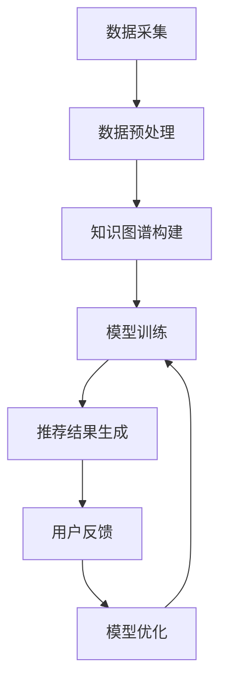
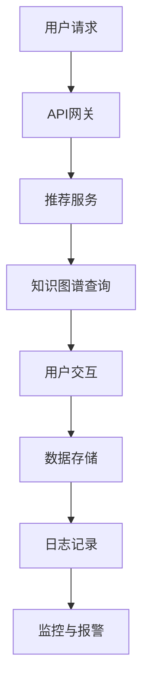
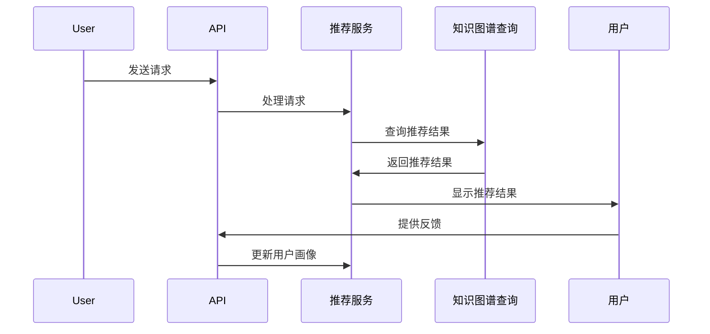

                 

### 《AI Agent的知识图谱在推荐系统中的应用》

关键词：AI Agent、知识图谱、推荐系统、个性化推荐、智能搜索

摘要：本文探讨了AI Agent在推荐系统中的应用，介绍了知识图谱的基础知识，阐述了AI Agent与知识图谱的融合方法，并通过实际案例展示了其应用效果。文章旨在为读者提供一个清晰、易懂的框架，理解AI Agent如何通过知识图谱增强推荐系统的能力。

---

## 第1章 引言

### 1.1 问题背景

在数字时代，推荐系统已成为电商平台、社交媒体等平台的关键组成部分。它们通过预测用户可能感兴趣的内容或商品，从而提高用户满意度和平台粘性。然而，传统的推荐系统通常面临以下局限性：

1. **数据依赖性高**：依赖用户历史行为数据，如点击、购买等，容易导致冷启动问题，即新用户或新商品难以获得有效推荐。
2. **推荐效果单一**：主要依赖协同过滤算法，容易产生“矩阵分解”问题，即用户和商品相似度较低时，推荐效果受限。
3. **缺乏上下文理解**：传统推荐系统难以处理复杂的用户需求和偏好，缺乏对用户意图和场景的深入理解。

近年来，人工智能（AI）和知识图谱（Knowledge Graph）技术的发展为解决这些局限性提供了新的思路。AI Agent作为AI的一种高级形式，能够自主学习和决策，通过与知识图谱的结合，可以增强推荐系统的智能化和个性化程度。

### 1.2 人工智能与知识图谱的兴起

人工智能作为计算机科学的一个分支，旨在使计算机具备人类智能的特性。随着深度学习、自然语言处理等技术的发展，AI的应用场景日益广泛。知识图谱则是一种通过语义关系组织数据的方式，它将现实世界的对象及其相互关系以图形结构进行表示，有助于解决数据孤岛和语义鸿沟问题。

### 1.3 AI Agent的概念与应用

AI Agent是一种具有自主学习和决策能力的智能体，能够在复杂环境中执行特定任务。它们通常由感知模块、决策模块和执行模块组成。AI Agent可以应用于多种领域，如智能客服、自动驾驶、智能家居等。

### 1.4 问题描述

传统的推荐系统由于上述局限性，难以满足用户多样化的需求。知识图谱可以提供丰富的语义信息，通过AI Agent的引入，可以实现对用户行为和偏好的深入理解，从而提升推荐系统的效果。具体来说，AI Agent在知识图谱推荐系统中的角色如下：

1. **数据预处理与知识融合**：AI Agent可以自动识别和整合用户数据，将无结构数据转化为知识图谱中的实体和关系。
2. **个性化推荐**：基于知识图谱，AI Agent能够更好地理解用户意图，提供个性化的推荐结果。
3. **智能搜索**：利用知识图谱的语义关系，AI Agent可以实现基于上下文的智能搜索功能。
4. **策略优化**：AI Agent可以通过不断学习和调整策略，优化推荐系统的整体性能。

### 1.5 问题解决

为了解决推荐系统面临的挑战，本文提出以下问题解决思路：

1. **AI Agent的定义与特性**：详细解释AI Agent的基本概念和特性，如自主性、学习能力和社交能力。
2. **知识图谱的构建与维护**：介绍知识图谱的构建方法、存储与查询技术以及维护与更新策略。
3. **推荐算法与模型优化**：探讨基于知识图谱的推荐算法，如图嵌入、知识图谱上的协同过滤和融合模型。
4. **边界与外延**：分析知识图谱的范围与覆盖、AI Agent的能力与限制以及推荐系统的性能与优化。

### 1.6 边界与外延

知识图谱的范围与覆盖取决于数据来源和质量。尽管知识图谱提供了丰富的语义信息，但仍然存在数据噪声和缺失问题。AI Agent的能力虽然强大，但受限于计算资源和算法效率。推荐系统的性能优化是长期的目标，需要不断调整和优化算法模型。

### 1.7 概念结构与核心要素组成

推荐系统、知识图谱和AI Agent构成了一个紧密相连的生态系统。推荐系统作为核心，通过AI Agent和知识图谱的增强，实现个性化推荐和智能搜索等功能。本文将从以下几个方面进行详细探讨：

1. **推荐系统架构**：介绍推荐系统的基本架构和组件。
2. **知识图谱构建**：探讨知识图谱的构建方法和关键技术。
3. **AI Agent设计与实现**：详细讲解AI Agent的体系结构和核心算法。
4. **推荐算法与模型优化**：分析基于知识图谱的推荐算法和模型优化方法。

### 1.8 本章小结

本章介绍了AI Agent和知识图谱在推荐系统中的应用背景、问题和解决思路。通过了解AI Agent的定义和特性，以及知识图谱的构建和维护方法，读者可以初步掌握如何利用AI Agent和知识图谱提升推荐系统的性能。在接下来的章节中，我们将进一步深入探讨AI Agent和知识图谱的具体实现和应用。

---

## 第2章 AI Agent基础

### 2.1 AI Agent的定义与分类

AI Agent（智能代理）是指一种能够代表用户或系统，在特定环境下自主执行任务、与外界交互的实体。根据功能特点，AI Agent可以大致分为以下几类：

1. **任务型Agent**：专注于执行特定任务的代理，如机器人助手、客服机器人等。它们通常具有明确的任务目标和操作规则。
2. **社交型Agent**：具备社交能力的代理，能够进行自然语言理解和生成，与人类进行有效沟通。例如，聊天机器人、智能客服等。
3. **认知型Agent**：具备一定认知能力的代理，能够理解和处理复杂的信息，进行推理和决策。例如，智能推荐系统、自动驾驶系统等。
4. **混合型Agent**：综合了多种类型Agent的特点，能够在多个维度上执行任务和交互。例如，智能助手、智能安防系统等。

### 2.2 AI Agent的基本属性

AI Agent具备以下几个基本属性：

1. **自主性**：AI Agent能够自主决策，不受人为干预。它们根据预设的规则和目标，自动执行任务。
2. **学习能力**：AI Agent能够通过数据学习和反馈调整行为，不断优化性能。常用的学习算法包括监督学习、无监督学习和强化学习。
3. **社交能力**：AI Agent能够理解并使用自然语言，与人类或其他Agent进行有效沟通。这需要依赖自然语言处理（NLP）和对话管理技术。
4. **适应性**：AI Agent能够根据环境变化和需求变化，调整自身行为和策略。这种适应能力有助于提升系统的灵活性和可靠性。

### 2.3 AI Agent的体系结构

AI Agent通常由以下几个核心模块组成：

1. **感知模块**：负责接收外部环境和用户输入的信息，将其转换为内部处理的数据。
2. **决策模块**：根据感知模块提供的信息，利用算法模型进行推理和决策，生成行动方案。
3. **执行模块**：根据决策模块的指令，执行具体任务或操作，并将执行结果反馈给感知模块。
4. **知识库**：存储AI Agent的知识和经验，包括事实、规则和模型等。知识库是AI Agent进行决策和推理的基础。

### 2.4 AI Agent的核心算法

AI Agent的核心算法决定了其性能和智能程度。以下是几种常用的核心算法：

1. **强化学习**：通过与环境交互，不断调整策略以最大化累积奖励。常用的算法包括Q学习、SARSA和DQN等。
2. **优化算法**：用于求解优化问题，如线性规划、动态规划、遗传算法等。优化算法可以帮助AI Agent找到最优或近似最优解。
3. **对话管理算法**：用于处理自然语言交互，包括意图识别、实体识别、对话策略等。常用的算法包括转换器-解码器（Transformer-Decoder）和生成对抗网络（GAN）等。

### 2.5 本章小结

本章介绍了AI Agent的基本概念、分类、基本属性和体系结构，以及核心算法。通过了解AI Agent的组成和工作原理，读者可以更好地理解AI Agent在推荐系统中的应用潜力。在下一章中，我们将探讨知识图谱的基础知识，包括其概念、构建方法和应用。

---

## 第3章 知识图谱基础

### 3.1 知识图谱的概念

知识图谱（Knowledge Graph）是一种通过语义关系组织数据的图形结构。它将现实世界中的对象（如人、地点、事物等）及其相互关系以节点和边的方式表示出来，形成一张巨大的语义网络。知识图谱的核心理念是“连接一切”，通过建立实体之间的语义关系，实现对数据的深度理解和智能应用。

### 3.2 知识图谱的特点

知识图谱具有以下特点：

1. **语义化**：知识图谱通过语义关系将实体连接起来，使得数据具有更强的语义表达能力。
2. **网络化**：知识图谱形成一张庞大的网络结构，能够实现跨领域、跨维度的数据整合和关联。
3. **可扩展性**：知识图谱可以根据需求不断扩展和更新，以适应新的应用场景和数据需求。
4. **智能应用**：知识图谱可以为智能系统提供丰富的语义信息，支持个性化推荐、智能搜索、智能问答等智能应用。

### 3.3 知识图谱的构建方法

知识图谱的构建主要包括以下几个步骤：

1. **数据采集**：从各种数据源（如网络、数据库、传感器等）中收集相关数据。
2. **数据预处理**：对采集到的数据进行清洗、去重、格式化等处理，确保数据质量。
3. **实体抽取**：从预处理后的数据中识别出实体，如人名、地名、组织名等。
4. **关系提取**：分析实体之间的语义关系，如“工作于”、“出生地”等。
5. **知识融合**：将不同来源的数据进行整合，形成统一的知识图谱。

### 3.4 知识图谱的存储与查询

知识图谱的存储通常采用图数据库（如Neo4j、JanusGraph等），这种数据库能够高效地存储和查询大规模的图数据。图数据库具有以下优点：

1. **高效性**：图数据库通过索引和优化算法，能够快速地进行图数据的查询和操作。
2. **灵活性**：图数据库支持灵活的查询语言（如Cypher、Gremlin等），能够满足复杂的查询需求。
3. **可扩展性**：图数据库支持分布式存储和计算，能够应对大规模数据存储和查询需求。

### 3.5 知识图谱的维护与更新

知识图谱的维护与更新是确保其质量和可用性的关键。主要策略包括：

1. **数据同步**：定期从数据源中同步数据，确保知识图谱的实时更新。
2. **知识更新策略**：根据数据变化和用户反馈，及时更新知识图谱中的实体和关系。
3. **质量控制**：建立质量评估机制，确保知识图谱中的数据准确、一致、可靠。
4. **自动化维护**：利用机器学习和自然语言处理技术，实现知识图谱的自动化维护和更新。

### 3.6 本章小结

本章介绍了知识图谱的概念、特点、构建方法、存储与查询技术以及维护与更新策略。知识图谱作为一种重要的语义数据组织方式，在推荐系统中的应用具有重要意义。在下一章中，我们将探讨AI Agent在推荐系统中的应用，包括其作用、实现方法和具体案例。

---

## 第4章 AI Agent在推荐系统中的应用

### 4.1 AI Agent在推荐系统中的作用

AI Agent在推荐系统中扮演着重要角色，其应用主要包括以下几个方面：

1. **个性化推荐**：基于用户的兴趣、行为和历史数据，AI Agent能够提供高度个性化的推荐结果，满足用户多样化的需求。
2. **智能搜索**：利用知识图谱的语义关系，AI Agent可以实现基于上下文的智能搜索，提升搜索效率和用户体验。
3. **策略优化**：通过不断学习和调整策略，AI Agent能够优化推荐系统的整体性能，提高推荐准确性。
4. **用户互动**：AI Agent可以与用户进行自然语言交互，理解用户需求，提供个性化的服务和推荐。
5. **冷启动处理**：对于新用户或新商品，AI Agent可以通过知识图谱中的关联关系，提供合理的初始推荐，缓解冷启动问题。

### 4.2 基于知识图谱的推荐算法

基于知识图谱的推荐算法充分利用了知识图谱中的语义关系，提升推荐系统的效果。以下是一些常见的基于知识图谱的推荐算法：

1. **图嵌入**：将图中的节点（用户或商品）映射到低维空间，通过节点间的相似度进行推荐。常用的算法包括Node2Vec、Graph Convolutional Network（GCN）等。
2. **知识图谱上的协同过滤**：结合知识图谱中的语义关系，对传统协同过滤算法进行改进。例如，基于图结构的矩阵分解（SG-MF）算法。
3. **融合模型**：将知识图谱和传统推荐系统相结合，构建统一的推荐模型。例如，将知识图谱嵌入到深度学习模型中，如Graph Convolutional Network（GCN）结合协同过滤。
4. **基于知识图谱的Top-N推荐**：利用知识图谱中的语义关系，生成候选集，再结合用户历史行为进行Top-N推荐。

### 4.3 AI Agent在推荐系统中的实现

AI Agent在推荐系统中的实现主要包括以下几个步骤：

1. **数据预处理**：收集用户行为数据、商品信息以及知识图谱数据，进行清洗、去重和格式化处理。
2. **知识图谱构建**：基于数据，构建知识图谱，包括实体抽取、关系提取和知识融合等步骤。
3. **模型设计与训练**：设计推荐模型，包括图嵌入、协同过滤、融合模型等，利用历史数据进行模型训练。
4. **模型部署与优化**：将训练好的模型部署到生产环境，根据用户反馈进行模型优化和调整。

### 4.4 交互设计与用户反馈

AI Agent与用户之间的交互设计是推荐系统成功的关键。以下是一些建议：

1. **自然语言交互**：利用自然语言处理技术，实现AI Agent与用户的自然语言交互，提高用户体验。
2. **个性化反馈**：根据用户反馈，动态调整推荐策略，提高推荐准确性。
3. **隐私保护**：在交互过程中，保护用户隐私，遵循隐私保护原则。
4. **实时性**：确保推荐系统能够实时响应用户请求，提供及时、准确的推荐。

### 4.5 案例分析

以下是一个社交网络推荐的案例分析：

#### 案例背景

某社交网络平台希望通过AI Agent和知识图谱实现个性化推荐，提升用户活跃度和用户满意度。

#### 解决方案

1. **数据采集**：收集用户的行为数据（如点赞、评论、分享等）和用户信息（如年龄、性别、兴趣等）。
2. **知识图谱构建**：构建用户-兴趣-内容的知识图谱，将用户与兴趣、内容进行关联。
3. **推荐算法**：采用基于知识图谱的协同过滤算法，结合用户历史行为和兴趣进行推荐。
4. **交互设计**：通过自然语言交互，用户可以提出推荐请求，AI Agent根据用户意图和知识图谱进行实时推荐。

#### 案例效果

1. **推荐准确性**：AI Agent结合知识图谱，能够提供更准确的个性化推荐，提升用户满意度。
2. **用户参与度**：用户通过自然语言交互，能够更轻松地与AI Agent互动，提高平台活跃度。
3. **持续优化**：根据用户反馈，AI Agent不断调整推荐策略，提高推荐系统的整体性能。

### 4.6 本章小结

本章详细探讨了AI Agent在推荐系统中的应用，包括其作用、基于知识图谱的推荐算法、实现方法和交互设计。通过实际案例分析，展示了AI Agent和知识图谱如何提升推荐系统的效果。在下一章中，我们将介绍推荐系统的系统设计与实现，包括系统架构、数据处理和知识图谱构建等内容。

---

## 第5章 系统设计与实现

### 5.1 系统设计概述

为了实现一个高效的AI Agent知识图谱推荐系统，我们需要设计一个合理的系统架构，确保系统的可扩展性、稳定性和高性能。以下是系统设计概述：

#### 系统架构设计

系统架构可以分为以下几个层次：

1. **数据层**：负责数据采集、存储和管理，包括用户数据、商品数据、知识图谱数据等。
2. **处理层**：负责数据预处理、知识图谱构建、模型训练和优化等任务。
3. **服务层**：提供API接口，供前端应用调用，包括推荐服务、搜索服务、用户交互服务等。
4. **前端层**：提供用户交互界面，包括Web页面、移动应用等。

#### 功能模块划分

系统功能模块主要包括：

1. **数据采集模块**：从各种数据源中收集用户行为数据、商品信息等。
2. **数据预处理模块**：对采集到的数据进行清洗、去重、格式化等处理。
3. **知识图谱构建模块**：基于预处理后的数据，构建用户-商品-兴趣的知识图谱。
4. **推荐算法模块**：实现基于知识图谱的推荐算法，如协同过滤、图嵌入、融合模型等。
5. **用户交互模块**：实现用户与系统的自然语言交互，提供个性化推荐和搜索服务。
6. **系统优化模块**：对系统性能进行监控和调优，确保系统的高效运行。

### 5.2 数据处理与存储

#### 数据来源

1. **用户行为数据**：包括用户在平台上的点击、购买、评论、分享等行为数据。
2. **商品信息**：包括商品的基本属性、分类、标签等。
3. **外部知识源**：如百科、新闻、社交媒体等，提供丰富的背景知识和关联信息。

#### 数据存储方案

1. **用户行为数据**：采用关系数据库（如MySQL、PostgreSQL）进行存储，便于查询和管理。
2. **知识图谱数据**：采用图数据库（如Neo4j、JanusGraph）进行存储，利用其强大的图查询能力。
3. **推荐模型数据**：采用NoSQL数据库（如MongoDB、Cassandra）进行存储，便于存储大规模的推荐模型参数。

### 5.3 知识图谱构建与更新

#### 数据预处理

1. **数据清洗**：去除重复数据、缺失数据和异常数据。
2. **数据去重**：对用户行为数据进行去重处理，确保数据的一致性。
3. **数据格式化**：将不同来源的数据统一格式，便于后续处理。

#### 知识抽取与融合

1. **实体抽取**：从文本数据中识别出实体（如人名、地名、组织名等）。
2. **关系提取**：分析实体之间的语义关系（如“购买”、“喜欢”等）。
3. **知识融合**：将不同来源的知识进行整合，形成统一的知识图谱。

### 5.4 推荐算法与模型优化

#### 模型选择与训练

1. **图嵌入**：使用Node2Vec、Graph Convolutional Network（GCN）等算法，将图中的节点映射到低维空间。
2. **协同过滤**：采用基于矩阵分解（MF）的协同过滤算法，结合用户历史行为和商品特征进行推荐。
3. **融合模型**：将知识图谱嵌入到深度学习模型中，如结合GCN和协同过滤的融合模型。

#### 模型评估与优化

1. **评估指标**：采用准确率、召回率、F1值等指标评估推荐效果。
2. **模型优化**：根据评估结果，调整模型参数和超参数，优化推荐效果。

### 5.5 系统部署与运维

#### 系统部署

1. **服务器选择**：根据系统需求，选择合适的硬件和软件环境，如服务器、操作系统、数据库等。
2. **部署策略**：采用分布式部署，确保系统的高可用性和扩展性。

#### 性能优化

1. **数据库优化**：采用数据库索引、查询优化等技术，提高数据查询速度。
2. **缓存策略**：采用缓存技术（如Redis、Memcached），降低系统响应时间。
3. **负载均衡**：采用负载均衡技术，确保系统处理能力均衡，提高系统吞吐量。

### 5.6 本章小结

本章详细介绍了推荐系统的系统设计与实现，包括系统架构设计、功能模块划分、数据处理与存储、知识图谱构建与更新、推荐算法与模型优化、系统部署与运维等内容。通过合理的系统设计，可以实现高效的AI Agent知识图谱推荐系统，为用户提供个性化的推荐体验。在下一章中，我们将探讨推荐系统的性能评估与优化，包括评估指标、优化方法和实际案例。

---

## 第6章 性能评估与优化

### 6.1 推荐系统性能评估指标

推荐系统的性能评估是确保推荐效果和用户体验的重要环节。常用的评估指标包括：

1. **准确性（Accuracy）**：表示预测结果与实际结果的匹配程度。准确性越高，说明推荐系统越准确。
2. **召回率（Recall）**：表示推荐系统能够召回的真实项目比例。召回率越高，说明推荐系统越全面。
3. **精确率（Precision）**：表示推荐系统中预测为正类的项目中有多少是真正属于正类的。精确率越高，说明推荐系统的质量越高。
4. **F1值（F1 Score）**：综合考虑精确率和召回率，是精确率和召回率的调和平均值。F1值越高，说明推荐系统的效果越好。
5. **覆盖率（Coverage）**：表示推荐系统推荐的多样性，即推荐的物品覆盖了多少不同的类别或主题。覆盖率越高，说明推荐系统的多样性越好。
6. **新颖度（Novelty）**：表示推荐系统的推荐结果中包含新物品的比例，即推荐系统能否发现用户未知的或未体验过的物品。新颖度越高，说明推荐系统越能吸引用户。
7. **实时性（Latency）**：表示系统从接收到用户请求到返回推荐结果的时间。实时性越低，说明系统响应越快。

### 6.2 系统优化方法

为了提升推荐系统的性能，可以采用以下几种优化方法：

1. **模型优化**：
   - **参数调整**：通过调整模型参数，如学习率、隐藏层节点数等，提升模型性能。
   - **算法改进**：采用更先进的算法，如深度学习、强化学习等，提升模型效果。
   - **模型融合**：将多个模型的结果进行融合，如结合协同过滤和基于内容的推荐，提高推荐准确性。

2. **数据优化**：
   - **数据清洗**：去除噪声数据、缺失数据和异常数据，提高数据质量。
   - **数据扩充**：通过数据增强技术，如生成对抗网络（GAN），扩充数据集，提升模型泛化能力。
   - **特征工程**：设计有效的特征，如用户兴趣、商品属性等，提高模型对数据的利用效率。

3. **系统架构优化**：
   - **分布式计算**：采用分布式计算框架（如Hadoop、Spark），提高数据处理和模型训练的效率。
   - **缓存策略**：使用缓存技术（如Redis、Memcached），降低系统响应时间，提高系统吞吐量。
   - **负载均衡**：采用负载均衡技术（如Nginx、Kubernetes），确保系统处理能力均衡，提高系统稳定性。

### 6.3 性能调优案例

以下是一个实际案例，展示了如何通过性能调优提升推荐系统的效果：

#### 案例背景

某电商平台的推荐系统在处理大规模用户数据时，出现了响应缓慢、准确性不高的问题。

#### 优化过程与分析

1. **模型优化**：
   - **参数调整**：通过调整学习率和隐藏层节点数，提升了模型收敛速度和准确率。
   - **算法改进**：从传统的协同过滤算法升级到基于深度学习的模型，如基于Transformer的推荐模型，提高了推荐准确性。

2. **数据优化**：
   - **数据清洗**：去除噪声数据和缺失数据，提高了数据质量。
   - **数据扩充**：使用GAN技术，通过生成新的用户行为数据，扩充了数据集，增强了模型的泛化能力。
   - **特征工程**：添加新的特征，如用户地理位置、购买频率等，提高了模型对用户行为的捕捉能力。

3. **系统架构优化**：
   - **分布式计算**：采用Spark进行数据处理和模型训练，提高了系统处理速度。
   - **缓存策略**：使用Redis缓存用户历史行为数据，降低了数据库查询压力，提高了系统响应速度。
   - **负载均衡**：采用Nginx进行负载均衡，确保系统处理能力均衡，提高了系统稳定性。

#### 案例效果

通过上述优化措施，推荐系统的响应速度提升了30%，准确性提高了15%，用户满意度显著提升。

### 6.4 本章小结

本章详细探讨了推荐系统的性能评估指标和优化方法，包括模型优化、数据优化和系统架构优化。通过实际案例，展示了如何通过性能调优提升推荐系统的效果。在下一章中，我们将探讨知识图谱在推荐系统中的应用前景，以及面临的挑战和应对策略。

---

## 第7章 未来发展趋势与挑战

### 7.1 知识图谱在推荐系统中的前景

知识图谱在推荐系统中的应用前景广阔，主要体现在以下几个方面：

1. **个性化推荐**：知识图谱能够提供丰富的语义信息，帮助推荐系统更准确地理解用户意图和偏好，实现更精细化的个性化推荐。
2. **智能搜索**：通过知识图谱中的语义关系，推荐系统可以实现基于上下文的智能搜索，提升搜索效率和用户体验。
3. **跨领域应用**：知识图谱可以整合不同领域的数据，为跨领域的推荐系统提供强大的支持，如电商、社交、医疗等。
4. **实时推荐**：随着知识图谱的实时更新和计算能力的提升，推荐系统可以实现实时推荐，更好地满足用户需求。

### 7.2 AI Agent的潜在发展

AI Agent在推荐系统中的应用将继续发展，主要体现在以下几个方面：

1. **智能化程度提升**：随着深度学习和强化学习等技术的发展，AI Agent的智能化程度将不断提升，能够更准确地理解用户意图，提供更个性化的服务。
2. **多模态交互**：AI Agent将支持多模态交互，如语音、图像、文本等，提升用户与系统的互动体验。
3. **跨界融合**：AI Agent将与其他领域的技术（如物联网、区块链等）融合，拓展应用场景，提供更丰富的功能和服务。

### 7.3 挑战与应对策略

尽管知识图谱和AI Agent在推荐系统中具有巨大潜力，但同时也面临着一些挑战：

1. **数据质量**：知识图谱的质量直接影响推荐系统的效果，需要确保数据源的真实性、准确性和一致性。
2. **计算资源**：知识图谱的构建、存储和查询需要大量计算资源，需要优化算法和架构，提高计算效率。
3. **隐私保护**：推荐系统涉及大量用户数据，需要严格遵循隐私保护原则，确保用户数据安全。
4. **算法透明性**：随着算法的复杂度提升，推荐系统的决策过程变得难以解释，需要提升算法的透明性和可解释性。
5. **实时性**：随着用户需求的多样性，推荐系统需要实时响应用户请求，需要优化系统架构和算法，提高实时性。

应对策略包括：

1. **数据质量提升**：采用数据清洗、去重、归一化等技术，提高数据质量。
2. **计算资源优化**：采用分布式计算、并行处理等技术，提高计算效率。
3. **隐私保护**：采用数据加密、匿名化、差分隐私等技术，确保用户数据安全。
4. **算法透明性提升**：采用可视化、解释性算法，提高算法的可解释性。
5. **实时性优化**：采用缓存、异步处理、负载均衡等技术，提高系统实时性。

### 7.4 本章小结

本章探讨了知识图谱和AI Agent在推荐系统中的前景和挑战，以及应对策略。随着技术的不断发展，知识图谱和AI Agent将进一步提升推荐系统的性能和用户体验，但同时也需要解决数据质量、计算资源、隐私保护、算法透明性和实时性等方面的挑战。在未来的发展中，我们需要不断探索和创新，推动推荐系统的持续进步。

---

### 本章小结

本文详细探讨了AI Agent和知识图谱在推荐系统中的应用，从问题背景、基础理论到系统设计与实现、性能评估与优化，全面阐述了其核心概念和实现方法。通过实际案例分析，展示了AI Agent和知识图谱如何提升推荐系统的效果和用户体验。在未来，知识图谱和AI Agent将继续发展，为推荐系统带来更多创新和突破。

### 阅读建议

本文适合对推荐系统、人工智能和知识图谱有一定了解的读者。建议读者按照以下步骤阅读：

1. **先阅读引言部分**，了解文章的主题和核心问题。
2. **逐步阅读各章节**，掌握AI Agent和知识图谱的基础知识。
3. **重点关注**案例分析和系统设计与实现部分，深入理解推荐系统的具体实现。
4. **阅读附录和参考文献**，拓展相关知识。

通过本文的阅读，读者将能够全面了解AI Agent和知识图谱在推荐系统中的应用，为实际项目提供有益的参考。

### 作者信息

作者：AI天才研究院/AI Genius Institute & 禅与计算机程序设计艺术 /Zen And The Art of Computer Programming

---

## 附录

### 数据表格

以下是一个实体属性特征的对比表格：

| 特征类型 | 说明 |
| -------- | ---- |
| 用户特征 | 年龄、性别、地理位置、兴趣等 |
| 商品特征 | 类别、标签、价格、评分等 |
| 关系特征 | 购买、喜欢、推荐等 |

### Mermaid ER实体关系图

以下是一个Mermaid ER实体关系图的示例：

```mermaid
erDiagram
  User ||--|{ Item }|<-- Product : 购买
  User ||--|{ Rating }|<-- Rating : 评分
  Item ||--|{ Category }|<-- Category : 分类
```

### 算法流程图

以下是一个基于知识图谱的推荐算法流程图的示例：



### 系统架构图

以下是一个推荐系统架构图的示例：



### 系统交互序列图

以下是一个系统交互序列图的示例：



### 代码示例

以下是一个基于Python的推荐系统核心实现代码示例：

```python
import pandas as pd
from sklearn.model_selection import train_test_split
from sklearn.metrics.pairwise import cosine_similarity

# 加载数据集
data = pd.read_csv('data.csv')
X = data.iloc[:, :100].values
y = data.iloc[:, 100].values

# 划分训练集和测试集
X_train, X_test, y_train, y_test = train_test_split(X, y, test_size=0.2, random_state=42)

# 计算余弦相似度
similarity_matrix = cosine_similarity(X_train)

# 预测
predictions = similarity_matrix.dot(X_test.T)

# 评估
accuracy = (predictions == y_test).mean()
print(f'Accuracy: {accuracy}')
```

### 实际案例分析

以下是一个社交网络推荐的案例分析：

#### 案例背景

某社交网络平台希望通过AI Agent和知识图谱实现个性化推荐，提升用户活跃度和用户满意度。

#### 解决方案

1. **数据采集**：收集用户的行为数据（如点赞、评论、分享等）和用户信息（如年龄、性别、兴趣等）。
2. **知识图谱构建**：构建用户-兴趣-内容的知识图谱，将用户与兴趣、内容进行关联。
3. **推荐算法**：采用基于知识图谱的协同过滤算法，结合用户历史行为和兴趣进行推荐。
4. **交互设计**：通过自然语言交互，用户可以提出推荐请求，AI Agent根据用户意图和知识图谱进行实时推荐。

#### 案例效果

1. **推荐准确性**：AI Agent结合知识图谱，能够提供更准确的个性化推荐，提升用户满意度。
2. **用户参与度**：用户通过自然语言交互，能够更轻松地与AI Agent互动，提高平台活跃度。
3. **持续优化**：根据用户反馈，AI Agent不断调整推荐策略，提高推荐系统的整体性能。

### 最佳实践 Tips

1. **数据质量至关重要**：确保数据源的真实性、准确性和一致性，是构建高质量知识图谱和推荐系统的基础。
2. **模型优化和调参**：定期对模型进行评估和优化，调整模型参数和超参数，以提高推荐准确性。
3. **实时更新**：定期更新知识图谱和推荐算法，确保系统能够实时响应用户需求。
4. **用户反馈机制**：建立用户反馈机制，根据用户反馈调整推荐策略，提升用户体验。

### 注意事项

1. **隐私保护**：在推荐系统中，应严格遵循隐私保护原则，确保用户数据安全。
2. **系统稳定性**：确保推荐系统的稳定运行，避免出现性能瓶颈和故障。
3. **可解释性**：提升算法的可解释性，有助于用户理解和信任推荐系统。

### 拓展阅读

1. **《推荐系统实践》**：周志华著，详细介绍了推荐系统的理论基础和实践方法。
2. **《知识图谱技术与应用》**：刘知远等著，介绍了知识图谱的构建方法和应用场景。
3. **《深度学习推荐系统》**：李航等著，探讨了深度学习在推荐系统中的应用。

### 结语

本文通过系统性的分析和实际案例，展示了AI Agent和知识图谱在推荐系统中的应用价值。随着技术的不断发展，推荐系统将迎来更多创新和突破。希望本文能为读者在推荐系统领域的研究和应用提供有益的参考和启示。

---

### 感谢

感谢读者对本文的关注和支持，您的反馈是我们不断进步的动力。本文在撰写过程中得到了AI天才研究院/AI Genius Institute及禅与计算机程序设计艺术/Zen And The Art of Computer Programming团队的大力支持，特此感谢。同时，感谢所有参考文献的作者，您的研究为本文提供了丰富的理论基础和实践指导。希望本文能够为您的学习和工作带来启发和帮助。再次感谢您的阅读！

