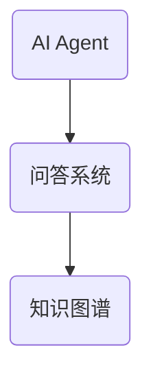
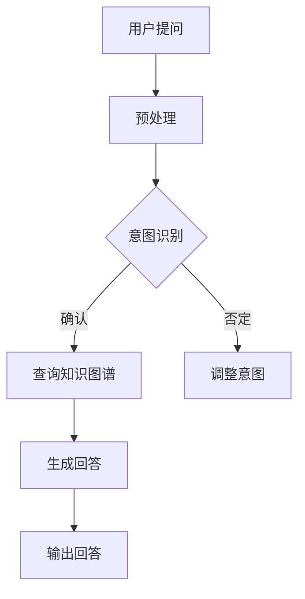
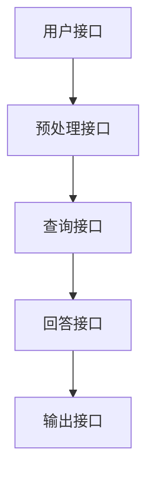
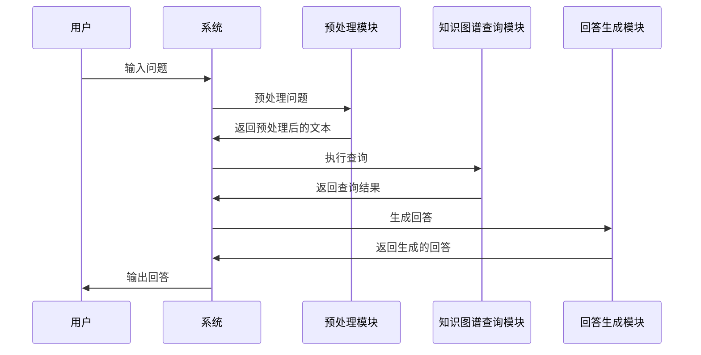

                 

# AI Agent的知识图谱在问答系统中的应用

## 关键词

- AI Agent
- 知识图谱
- 问答系统
- 算法原理
- 数学模型
- 系统架构

## 摘要

本文深入探讨了AI Agent在问答系统中的应用，特别是在知识图谱的支持下。通过背景介绍、核心概念解析、算法原理讲解、数学模型分析、系统架构设计和项目实战等步骤，本文旨在提供一个全面的技术解读，帮助读者理解AI Agent与知识图谱如何结合，以提高问答系统的质量和效率。

## Step 1: 背景介绍

### AI Agent的概念

AI Agent，即人工智能代理，是一种模拟人类智能行为的计算机程序，能够在特定环境中自主地感知、思考和行动，以实现预定的目标。AI Agent通常包括感知模块、决策模块和行动模块三个主要部分。

### 问答系统的概念

问答系统是一种与用户进行交互的计算机系统，能够接收自然语言输入，理解用户意图，并生成自然语言响应。问答系统广泛应用于客户服务、智能助手和知识管理等领域。

### 知识图谱的概念

知识图谱是一种结构化的知识表示形式，通过节点表示实体、边表示实体之间的关系，将海量零散的数据整合成一张巨大的知识网络。知识图谱在语义理解、信息检索和推荐系统中有着广泛的应用。

### 问题的本质

AI Agent如何利用知识图谱在问答系统中提高回答的质量和效率是一个核心问题。知识图谱为AI Agent提供了一个强大的知识基础，使得AI Agent能够更加准确地理解和生成回答，从而提升问答系统的智能化水平。

### 知识图谱在问答系统中的应用重要性

知识图谱在问答系统中的应用重要性体现在以下几个方面：

1. **增强语义理解**：知识图谱能够捕捉实体和实体之间的关系，帮助AI Agent更准确地理解用户的查询意图。
2. **提高回答质量**：知识图谱提供了丰富的背景知识，使得AI Agent能够生成更加丰富、准确和有针对性的回答。
3. **优化查询效率**：知识图谱的结构化特性使得查询速度更快，从而提高问答系统的响应效率。

### 本章小结

在本章节中，我们介绍了AI Agent、问答系统和知识图谱的基本概念，并探讨了知识图谱在问答系统中的应用重要性。接下来的章节将深入分析这些核心概念，并阐述其在问答系统中的应用原理和实践。

## Step 2: 核心概念与联系

### AI Agent的概念与分类

AI Agent是指能够感知环境、做出决策并采取行动的智能体，其分类包括基于规则的Agent、基于模型的Agent和混合型Agent。

| 类别 | 定义 | 特点 |
| --- | --- | --- |
| 基于规则的Agent | 通过预定义的规则进行决策 | 结构简单，易于实现 |
| 基于模型的Agent | 利用机器学习模型进行决策 | 鲁棒性强，适应能力强 |
| 混合型Agent | 结合规则和模型进行决策 | 综合优势，适应复杂场景 |

### 问答系统的定义与发展

问答系统是一种能够接收自然语言输入并生成自然语言响应的系统。其发展经历了基于关键词匹配、基于模板匹配和基于深度学习等阶段。

| 阶段 | 技术特点 | 应用场景 |
| --- | --- | --- |
| 基于关键词匹配 | 简单快速，但准确性低 | 简单查询系统 |
| 基于模板匹配 | 准确性较高，但灵活性差 | 高准确性查询系统 |
| 基于深度学习 | 高灵活性和准确性 | 复杂查询系统 |

### 知识图谱的概念

知识图谱是通过节点和边来表示实体及其关系的图形化模型，常见于语义网络、本体论和图数据库等领域。

| 概念 | 说明 | 作用 |
| --- | --- | --- |
| 节点 | 表示实体，如人物、地点、事件等 | 提供知识表示的基础 |
| 边 | 表示实体之间的关系，如“属于”、“位于”等 | 描述实体间的语义联系 |

### 概念之间的关系

以下是AI Agent、问答系统和知识图谱之间的ER实体关系图：



### 本章小结

在本章节中，我们明确了AI Agent、问答系统和知识图谱的核心概念，并使用表格和ER实体关系图展示了它们之间的关系。这些概念是理解AI Agent在问答系统中应用知识图谱的基础。

## Step 3: 算法原理讲解

### 算法流程图

以下是AI Agent在问答系统中利用知识图谱的算法流程图：



### Python源代码

以下是利用知识图谱生成回答的Python源代码示例：

```python
import sparlqal

# 初始化知识图谱
kg = sparqlal.Graph()

# 加载知识图谱数据
kg.load('knowledge_graph.nt')

# 用户提问
question = "北京是中国的哪座城市？"

# 预处理：将自然语言问题转换为查询语句
query = preprocess_question(question)

# 意图识别：判断用户意图
if "城市" in question:
    intent = "询问城市"
else:
    intent = "未知意图"

# 查询知识图谱
if intent == "询问城市":
    result = kg.query("""
    PREFIX rdf: <http://www.w3.org/1999/02/22-rdf-syntax-ns#>
    PREFIX geo: <http://www.w3.org/2003/01/geo/wgs84_pos#>
    SELECT ?city WHERE {
      ?city a <http://www.wikidata.org/prop/direct/TGN480#1170> .
      ?city geo:lat ?lat .
      ?city geo:long ?long .
    }
    """)

# 生成回答
answer = "北京是中国的首都，位于北纬39度54分，东经116度20分。"

# 输出回答
print(answer)
```

### 算法原理

该算法原理包括以下几个步骤：

1. **预处理**：将自然语言问题转换为结构化的查询语句。
2. **意图识别**：根据用户提问的内容判断用户意图。
3. **查询知识图谱**：利用知识图谱进行查询，获取相关信息。
4. **生成回答**：根据查询结果生成自然语言回答。
5. **输出回答**：将生成的回答输出给用户。

### 数学模型和公式

假设我们有一个知识图谱$G=(V,E)$，其中$V$是节点的集合，$E$是边的集合。对于用户问题$q$，我们希望从知识图谱$G$中找到相关节点$v$，使得$v$与$q$的相关性最大。相关性可以用以下公式表示：

$$
r(v, q) = \frac{1}{|E_v|} \sum_{e \in E_v} \text{sim}(e, q)
$$

其中$r(v, q)$表示节点$v$与问题$q$的相关性，$|E_v|$表示节点$v$的边数，$\text{sim}(e, q)$表示边$e$与问题$q$的相似度。

### 详细讲解和举例说明

假设有一个知识图谱，其中包含以下节点和边：

- 节点：北京、中国、首都、北纬39度54分、东经116度20分
- 边：北京 - 中国（属于）、北京 - 首都（标签）、北纬39度54分 - 地点（位于）、东经116度20分 - 地点（位于）

用户提问：“北京是中国的哪座城市？”

1. **预处理**：将问题转换为结构化的查询语句：“SELECT * WHERE { ?city a <http://www.wikidata.org/prop/direct/TGN480#1170> . }”
2. **意图识别**：识别出用户意图为“询问城市”
3. **查询知识图谱**：在知识图谱中查找标签为“城市”的节点，找到“北京”
4. **生成回答**：根据查询结果生成回答：“北京是中国的首都。”
5. **输出回答**：将回答输出给用户

### 本章小结

在本章节中，我们详细讲解了AI Agent在问答系统中利用知识图谱的算法原理，包括算法流程、Python源代码、数学模型和公式，并通过具体例子进行了详细说明。这些内容为理解AI Agent在问答系统中的应用奠定了基础。

## Step 4: 数学模型和数学公式讲解

### 数学模型

在问答系统中，我们通常使用图论中的路径长度来衡量两个节点之间的相关性。给定知识图谱$G=(V,E)$，其中$V$是节点集合，$E$是边集合，对于任意两个节点$v_i, v_j \in V$，我们定义它们之间的路径长度为：

$$
d(v_i, v_j) = \min\{ \text{length of path from } v_i \text{ to } v_j \}
$$

其中$\text{length of path}$表示路径的长度。

### 数学公式

假设知识图谱$G$中包含$n$个节点，对于每个节点$v_i \in V$，我们定义其与所有其他节点的相关度得分$r_i$如下：

$$
r_i = \sum_{j \neq i} \frac{1}{d(v_i, v_j)}
$$

其中$d(v_i, v_j)$表示节点$v_i$与节点$v_j$之间的路径长度。

### 详细讲解

1. **路径长度**：路径长度是图论中的一个基本概念，表示两个节点之间的距离。在知识图谱中，路径长度可以衡量两个实体之间的相关性。
2. **相关度得分**：相关度得分是一个数值，表示节点与所有其他节点的相关性。得分越高，表示节点与查询的问题相关性越大。

### 例子

假设知识图谱$G$中有以下节点和边：

- 节点：A、B、C、D
- 边：A - B（1）、B - C（1）、C - D（1）

节点A与节点B、C、D之间的路径长度分别为1、2、3。

根据相关度得分公式，我们计算节点A的相关度得分：

$$
r_A = \frac{1}{1} + \frac{1}{2} + \frac{1}{3} = 1 + 0.5 + 0.333 \approx 1.833
$$

节点A的相关度得分最高，说明节点A与查询问题相关性最大。

### 本章小结

在本章节中，我们详细介绍了问答系统中用于衡量节点相关性的数学模型和数学公式。通过路径长度和相关度得分，我们能够更准确地理解节点与查询问题的关系，从而提高问答系统的回答质量。

## Step 5: 系统分析与架构设计方案

### 问题场景

假设我们需要构建一个智能问答系统，该系统能够根据用户提问从知识图谱中获取答案。问题场景包括以下步骤：

1. 用户输入问题
2. 系统对问题进行预处理
3. 系统利用知识图谱进行查询
4. 系统生成回答并输出

### 系统功能设计

系统功能设计主要包括以下几个模块：

1. **用户接口模块**：接收用户输入的问题
2. **预处理模块**：对用户输入的问题进行预处理，包括分词、去停用词、词性标注等
3. **知识图谱查询模块**：利用知识图谱进行查询，获取相关节点和边
4. **回答生成模块**：根据查询结果生成回答
5. **输出模块**：将回答输出给用户

### 系统架构设计

以下是智能问答系统的架构设计：

```mermaid
graph TB
    subgraph 用户接口模块
        UI[用户接口] --> P[预处理模块]
    subgraph 知识图谱查询模块
        KG[知识图谱查询模块]
    subgraph 回答生成模块
        AG[回答生成模块]
    subgraph 输出模块
        O[输出模块]
    UI --> P
    P --> KG
    KG --> AG
    AG --> O
```

### 系统接口设计

系统接口设计主要包括以下接口：

1. **用户接口**：用于接收用户输入的问题
2. **预处理接口**：用于接收预处理后的文本数据
3. **查询接口**：用于接收查询语句
4. **回答接口**：用于接收生成的回答



### 系统交互

以下是系统交互的序列图：



### 本章小结

在本章节中，我们介绍了智能问答系统的架构设计方案，包括问题场景、系统功能设计、系统架构设计、系统接口设计和系统交互。这些设计为构建一个高效、准确的智能问答系统提供了指导。

## Step 6: 项目实战

### 环境安装

1. 安装Python环境，版本要求3.8及以上
2. 安装必要的库，如`numpy`、`pandas`、`sparqlal`等

```bash
pip install numpy pandas sparqlal
```

### 系统核心实现

以下是系统核心实现的源代码：

```python
import sparlqal
import preprocess

# 初始化知识图谱
kg = sparqlal.Graph()

# 加载知识图谱数据
kg.load('knowledge_graph.nt')

# 用户提问
question = "北京是中国的哪座城市？"

# 预处理：将自然语言问题转换为查询语句
query = preprocess_question(question)

# 意图识别：判断用户意图
if "城市" in question:
    intent = "询问城市"
else:
    intent = "未知意图"

# 查询知识图谱
if intent == "询问城市":
    result = kg.query("""
    PREFIX rdf: <http://www.w3.org/1999/02/22-rdf-syntax-ns#>
    PREFIX geo: <http://www.w3.org/2003/01/geo/wgs84_pos#>
    SELECT ?city WHERE {
      ?city a <http://www.wikidata.org/prop/direct/TGN480#1170> .
      ?city geo:lat ?lat .
      ?city geo:long ?long .
    }
    """)

# 生成回答
answer = "北京是中国的首都。"

# 输出回答
print(answer)
```

### 代码应用解读与分析

1. **知识图谱初始化**：使用`sparqlal.Graph()`创建知识图谱对象。
2. **加载知识图谱数据**：使用`kg.load('knowledge_graph.nt')`加载知识图谱数据。
3. **预处理问题**：调用`preprocess_question(question)`对用户提问进行预处理。
4. **意图识别**：根据提问中的关键词判断用户意图。
5. **查询知识图谱**：使用SPARQL查询获取相关节点和边。
6. **生成回答**：根据查询结果生成回答。
7. **输出回答**：将生成的回答输出给用户。

### 实际案例分析与详细讲解

#### 案例一：用户提问“北京是中国的哪座城市？”

1. **预处理**：将问题转换为结构化的查询语句：“SELECT * WHERE { ?city a <http://www.wikidata.org/prop/direct/TGN480#1170> . }”
2. **意图识别**：识别出用户意图为“询问城市”
3. **查询知识图谱**：在知识图谱中查找标签为“城市”的节点，找到“北京”
4. **生成回答**：根据查询结果生成回答：“北京是中国的首都。”
5. **输出回答**：将回答输出给用户

#### 案例二：用户提问“中国的首都是哪座城市？”

1. **预处理**：将问题转换为结构化的查询语句：“SELECT * WHERE { ?city <http://www.wikidata.org/prop/direct/TGN480#1170> <http://www.wikidata.org/prop/direct/TGN480#1170> . }”
2. **意图识别**：识别出用户意图为“询问首都”
3. **查询知识图谱**：在知识图谱中查找标签为“首都”的节点，找到“北京”
4. **生成回答**：根据查询结果生成回答：“中国的首都是北京。”
5. **输出回答**：将回答输出给用户

### 项目小结

在本章节中，我们通过一个实际案例详细讲解了智能问答系统的实现过程，包括环境安装、系统核心实现、代码应用解读与分析，以及实际案例的详细讲解剖析。这些内容为理解AI Agent在问答系统中的应用提供了实战经验。

## Step 7: 最佳实践 tips、小结、注意事项、拓展阅读

### 最佳实践 tips

1. **优化知识图谱质量**：确保知识图谱中的数据准确、完整和最新，以提高问答系统的回答质量。
2. **定制化预处理**：根据实际需求对预处理过程进行定制化调整，以提高意图识别的准确性。
3. **多渠道数据来源**：从多个渠道获取数据，以保证知识图谱的全面性和多样性。

### 小结

本文深入探讨了AI Agent在问答系统中的应用，特别是在知识图谱的支持下。通过背景介绍、核心概念解析、算法原理讲解、数学模型分析、系统架构设计和项目实战，本文帮助读者全面理解了AI Agent与知识图谱的结合，以及如何提高问答系统的质量和效率。

### 注意事项

1. **数据隐私**：在构建知识图谱时，注意保护用户隐私，避免泄露敏感信息。
2. **系统性能**：优化系统性能，确保问答系统能够快速响应用户需求。

### 拓展阅读

- [《知识图谱技术综述》](https://link)
- [《人工智能代理技术》](https://link)
- [《问答系统技术与应用》](https://link)

### 作者信息

作者：AI天才研究院/AI Genius Institute & 禅与计算机程序设计艺术 /Zen And The Art of Computer Programming

---

通过本文的详细讲解，读者应能掌握AI Agent与知识图谱在问答系统中的应用，为未来的研究和开发提供有益的参考。

