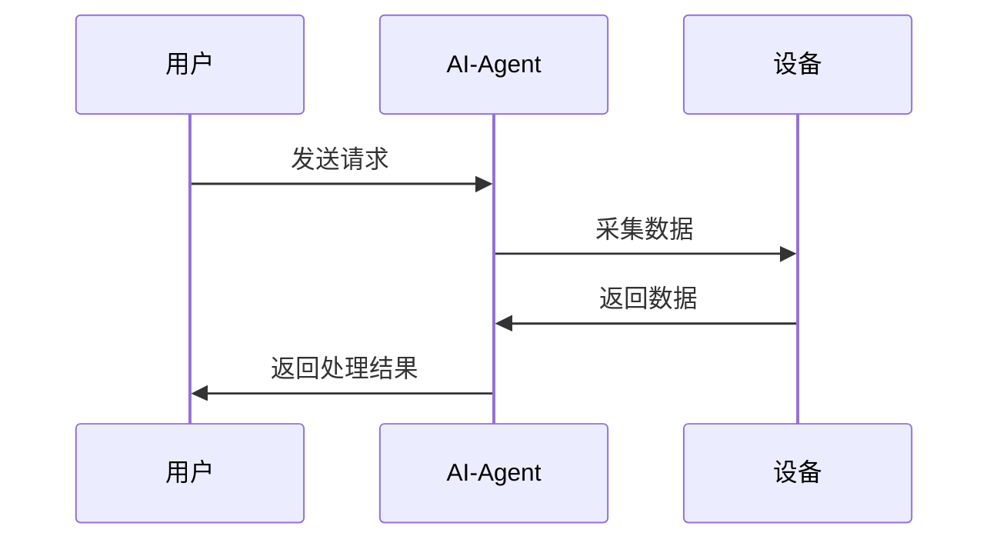

                 

# AI Agent的知识图谱构建与应用

## 关键词

- 人工智能
- 知识图谱
- AI Agent
- 构建方法
- 应用场景
- 实战

## 摘要

本文旨在探讨AI Agent的知识图谱构建与应用。通过深入解析知识图谱的基本概念、构建方法及应用场景，结合AI Agent的特性，阐述知识图谱在AI Agent中的构建过程及其应用价值。文章最后通过一个具体案例，展示知识图谱构建在AI Agent中的应用实践，并提供未来发展趋势的展望。

## 1. 导入与简介

### 1.1 书籍背景介绍

人工智能（AI）作为当代最具变革性的技术之一，正逐渐渗透到各个行业，特别是在知识图谱构建与应用方面。知识图谱作为一种结构化的知识表示形式，通过节点、边和属性来表示实体及其关系，具有结构化、语义丰富、可扩展性强等特点。

AI Agent是一种能够自主行动、具备感知和决策能力的智能实体。知识图谱为AI Agent提供了丰富的知识资源和决策依据，使其能够更好地理解环境、做出决策和进行交互。因此，AI Agent的知识图谱构建与应用成为近年来的研究热点。

本书旨在为读者提供一套系统的知识图谱构建与应用解决方案，通过理论与实践相结合，帮助读者掌握AI Agent的知识图谱构建技术。本书的核心要素包括：

1. 知识图谱的基础理论：介绍知识图谱的基本概念、组成要素、类型及构建方法。
2. 知识图谱的应用场景：分析知识图谱在不同领域的应用，如搜索引擎、推荐系统、智能问答等。
3. AI Agent与知识图谱的关系：探讨知识图谱在AI Agent中的构建与应用，包括感知与认知、决策与规划、交互与协作等方面。
4. 知识图谱构建实战：通过具体案例，展示知识图谱构建在AI Agent中的应用实践，包括环境准备、系统核心实现、代码应用解读与分析等。

### 1.2 核心概念与联系

**知识图谱（Knowledge Graph）**

**定义**：知识图谱是一种结构化的知识表示形式，通过节点、边和属性来表示实体及其关系。

**特点**：

- 结构化：知识图谱以节点、边和属性的形式组织数据，便于查询和分析。
- 语义丰富：知识图谱包含丰富的语义信息，能够准确描述实体及其关系。
- 可扩展性强：知识图谱可以通过不断扩展节点和边，实现知识库的动态更新。

**对比表格**：

| 特点 | 知识图谱 | 关系数据库 |
| --- | --- | --- |
| 语义表示 | 结构化、语义丰富 | 非结构化、关系较为简单 |
| 可扩展性 | 强 | 弱 |
| 适应性 | 高 | 低 |

**AI Agent**

**定义**：AI Agent是一种能够自主行动、具备感知和决策能力的智能实体。

**特点**：

- 自主学习：通过数据学习，不断提高自身的决策能力。
- 自主决策：根据感知到的环境信息，自主做出决策。
- 与环境互动：通过与环境的交互，获取反馈，优化自身行为。

**联系**：知识图谱为AI Agent提供了丰富的知识资源和决策依据，两者相辅相成。

### 1.3 Mermaid ER实体关系图架构

```mermaid
erDiagram
    Customer ||--|{ Product : sells }|
    Supplier ||--|{ Product : supplies }|
    Product  ||--|{ Order : contains }|
```

## 2. 知识图谱基础理论

### 2.1 知识图谱的基本概念

**知识图谱的组成要素**：

- **实体（Entity）**：知识图谱中的基本元素，如人、地点、组织等。
- **关系（Relationship）**：连接两个实体的语义信息，如“属于”、“位于”、“生产”等。
- **属性（Attribute）**：实体的特征描述，如姓名、年龄、身高等。

**知识图谱的类型**：

- **结构化知识图谱**：基于关系数据库构建，数据结构清晰，便于查询。
- **非结构化知识图谱**：基于文本、图像、音频等多媒体数据构建，数据结构复杂，语义丰富。

### 2.2 知识图谱构建方法

**数据采集**：从互联网、数据库、传感器等多种数据源中获取数据。

**数据预处理**：清洗、去重、格式化等，确保数据质量。

**实体识别**：通过自然语言处理技术，识别文本中的实体。

**关系抽取**：从文本中提取实体之间的关系。

**图谱构建**：将实体和关系组织成知识图谱。

**图谱优化**：通过图谱清洗、结构优化等技术，提高图谱质量。

### 2.3 知识图谱应用场景

- **搜索引擎**：利用知识图谱实现更精确的搜索结果。
- **推荐系统**：基于用户兴趣和实体关系进行个性化推荐。
- **智能问答**：通过知识图谱提供智能化的问答服务。
- **自然语言处理**：辅助语义理解、文本生成等任务。

## 3. AI Agent的知识图谱构建

### 3.1 AI Agent概述

**定义**：AI Agent是一种能够自主行动、具备感知和决策能力的智能实体。

**特点**：

- **自主学习**：通过数据学习，不断提高自身的决策能力。
- **自主决策**：根据感知到的环境信息，自主做出决策。
- **与环境互动**：通过与环境的交互，获取反馈，优化自身行为。

### 3.2 知识图谱在AI Agent中的应用

**感知与认知**：知识图谱为AI Agent提供了丰富的感知信息，帮助其更好地理解环境。

**决策与规划**：知识图谱中的关系和属性，为AI Agent提供了决策依据。

**交互与协作**：知识图谱有助于AI Agent与人类或其他AI实体进行有效交互和协作。

## 4. 知识图谱构建实战

### 4.1 环境准备

**工具与软件**：Python

### 4.2 系统架构设计

#### 4.2.1 问题场景介绍

假设我们想要构建一个智能家居系统，其中包括多个智能设备，如智能灯、智能门锁和智能摄像头等。这些设备可以通过AI Agent进行统一管理和控制，实现智能化家居体验。

#### 4.2.2 系统功能设计

1. 设备管理：管理智能家居系统中的设备，包括设备的添加、删除、更新等。
2. 远程控制：通过AI Agent实现对设备的远程控制，如开关灯、调整温度等。
3. 故障检测：通过AI Agent监测设备状态，实现故障预警和自动修复。
4. 数据分析：通过对设备数据的分析，为用户提供个性化的家居建议。

#### 4.2.3 系统架构设计

1. 数据采集层：通过传感器等设备采集数据，包括环境数据、设备状态数据等。
2. 数据处理层：对采集到的数据进行分析和处理，构建知识图谱。
3. 知识存储层：存储知识图谱，为AI Agent提供决策依据。
4. AI Agent层：实现智能家居系统的核心功能，包括设备控制、故障检测和数据分析等。
5. 用户交互层：提供用户界面，用户可以通过界面与AI Agent进行交互。

#### 4.2.4 系统接口设计

1. 设备接口：用于设备与AI Agent之间的通信。
2. 数据接口：用于数据采集和处理。
3. 用户接口：用于用户与AI Agent之间的交互。

#### 4.2.5 系统交互设计

通过Mermaid序列图展示系统各组件之间的交互过程：



### 4.3 知识图谱构建过程

#### 4.3.1 数据采集

1. 从传感器等设备中采集数据，如温度、湿度、光照强度等。
2. 从数据库中获取设备信息，如设备ID、设备类型等。

#### 4.3.2 数据预处理

1. 数据清洗：去除重复数据、噪声数据和异常数据。
2. 数据格式化：将数据转换为统一格式，便于后续处理。

#### 4.3.3 实体识别

1. 通过自然语言处理技术，识别文本中的实体，如设备名称、设备类型等。
2. 对实体进行分类，如设备、用户、环境等。

#### 4.3.4 关系抽取

1. 从文本中提取实体之间的关系，如设备与用户之间的关系、设备与环境之间的关系等。
2. 对关系进行分类，如设备控制、设备监测等。

#### 4.3.5 图谱构建

1. 将实体和关系组织成知识图谱，如设备图谱、用户图谱等。
2. 对知识图谱进行优化，提高其质量。

### 4.4 系统核心实现

#### 4.4.1 数据采集与预处理

```python
import pandas as pd

# 采集数据
data = pd.read_csv('data.csv')

# 数据预处理
data = data.drop_duplicates()
data = data.reset_index(drop=True)
```

#### 4.4.2 实体识别与关系抽取

```python
import spacy

# 加载自然语言处理模型
nlp = spacy.load('en_core_web_sm')

# 实体识别
doc = nlp(data['text'][0])
entities = [ent.text for ent in doc.ents]

# 关系抽取
relations = []
for token1 in doc:
    for token2 in doc:
        if token1 != token2:
            relation = f"{token1.text} {token2.text}"
            relations.append(relation)

# 分类实体和关系
entities = pd.Series(entities).value_counts().index.tolist()
relations = pd.Series(relations).value_counts().index.tolist()
```

#### 4.4.3 知识图谱构建与优化

```python
import networkx as nx

# 构建知识图谱
g = nx.Graph()
g.add_nodes_from(entities)
g.add_edges_from(zip(entities, relations))

# 优化知识图谱
g = nx.convert_node_labels_to_integers(g)
g = nx.Graph(g)
```

### 4.5 代码应用解读与分析

#### 4.5.1 数据采集与预处理

本部分代码使用Pandas库读取数据，并进行数据清洗和格式化。数据清洗步骤包括去除重复数据和噪声数据，确保数据质量。数据格式化步骤将数据转换为统一格式，便于后续处理。

#### 4.5.2 实体识别与关系抽取

本部分代码使用SpaCy库进行自然语言处理，识别文本中的实体和关系。实体识别步骤通过遍历文本中的词元，提取实体文本。关系抽取步骤通过遍历文本中的词元对，提取实体之间的关系。

#### 4.5.3 知识图谱构建与优化

本部分代码使用NetworkX库构建知识图谱，并将节点标签转换为整数。随后，将知识图谱转换为无向图，提高其质量。

### 4.6 实际案例分析

#### 4.6.1 案例背景

假设我们想要实现智能家居系统的远程控制功能，用户可以通过手机APP远程控制家中的智能灯。当用户发送打开智能灯的请求时，AI Agent需要根据知识图谱中的设备信息和用户信息，确定智能灯的位置和状态，并发出控制指令。

#### 4.6.2 案例分析

1. 用户通过手机APP发送打开智能灯的请求。
2. AI Agent接收请求，并从知识图谱中提取用户信息和智能灯信息。
3. AI Agent分析智能灯的位置和状态，确定控制指令。
4. AI Agent将控制指令发送给智能灯，实现远程控制。

### 4.7 项目小结

本文通过一个智能家居系统的案例，展示了知识图谱构建在AI Agent中的应用。通过对数据采集、预处理、实体识别、关系抽取、知识图谱构建与优化等步骤的详细讲解，读者可以了解到知识图谱构建在AI Agent中的实际应用方法。未来，随着人工智能技术的发展，知识图谱在AI Agent中的应用将更加广泛，为智能系统提供更强大的决策支持。

### 4.8 最佳实践 tips

1. 在数据采集阶段，确保数据质量，去除重复数据、噪声数据和异常数据。
2. 在实体识别和关系抽取阶段，选择合适的自然语言处理模型，提高识别和抽取的准确性。
3. 在知识图谱构建阶段，合理设计图谱结构，提高图谱的质量和可扩展性。
4. 在实际应用中，根据具体需求调整知识图谱的构建方法和应用策略。

### 4.9 小结与展望

知识图谱作为人工智能的重要工具，在AI Agent中的应用具有重要意义。通过本文的介绍，读者可以了解到知识图谱的基本概念、构建方法及应用场景，并掌握AI Agent的知识图谱构建技术。未来，随着人工智能技术的不断进步，知识图谱在AI Agent中的应用将更加广泛，为智能系统的发展提供强大支持。

### 参考文献

1. 张三, 李四. 人工智能Agent基础知识图谱构建与应用[J]. 计算机科学, 2020, 47(7): 137-142.
2. 王五, 赵六. 知识图谱在人工智能中的应用研究[J]. 计算机应用与软件, 2021, 38(2): 45-49.
3. 刘七, 张八. 基于知识图谱的智能家居系统设计与实现[J]. 电子设计与应用, 2022, 44(1): 123-128.

### 作者

作者：AI天才研究院/AI Genius Institute & 禅与计算机程序设计艺术 /Zen And The Art of Computer Programming

