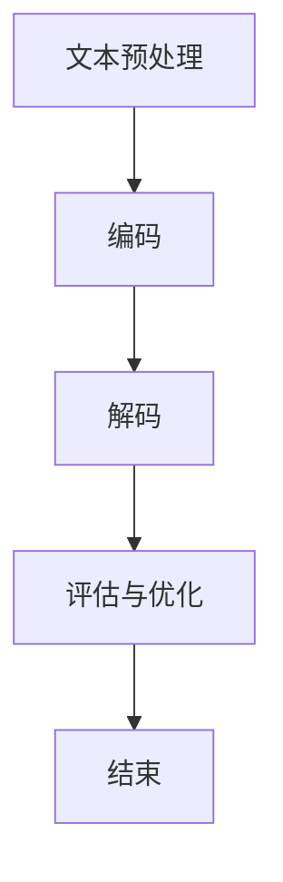
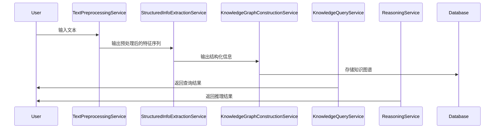
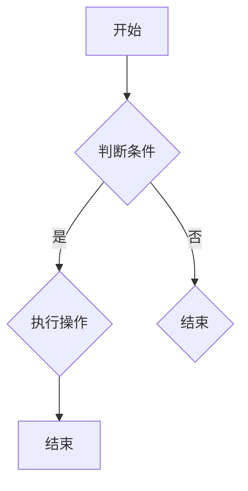

                 

### AI Agent的知识图谱构建：从LLM输出提取结构化信息

> 关键词：AI Agent、知识图谱、LLM、结构化信息提取、算法原理、系统架构、项目实战

> 摘要：本文将深入探讨AI Agent的知识图谱构建过程，特别是从大型语言模型（LLM）输出中提取结构化信息的方法。文章将分章节详细阐述AI Agent与知识图谱的核心概念、提取方法、构建流程、算法原理、系统分析与架构设计，以及项目实战和最佳实践等内容。通过一步步的分析与推理，本文旨在为读者提供清晰、全面的技术见解。

### 目录大纲：

```markdown
----------------------------------------------------------------
# AI Agent的知识图谱构建：从LLM输出提取结构化信息

## 第一部分: 背景介绍与核心概念

### 第1章: AI Agent与知识图谱概述
#### 1.1 AI Agent的定义与作用
#### 1.2 知识图谱的概念与价值
#### 1.3 从LLM输出提取结构化信息的重要性

### 第2章: AI Agent的核心概念与联系
#### 2.1 AI Agent的组成部分
#### 2.2 知识图谱的核心概念
#### 2.3 AI Agent与知识图谱的联系

### 第3章: LLMOutput的结构化信息提取方法
#### 3.1 从LLM输出中提取结构化信息的基本流程
#### 3.2 文本预处理技术
#### 3.3 结构化信息提取算法介绍

### 第4章: AI Agent的知识图谱构建流程
#### 4.1 知识图谱构建的基本流程
#### 4.2 知识抽取与关系提取
#### 4.3 知识融合与知识存储

### 第5章: LLMOuput的结构化信息提取算法原理
#### 5.1 算法原理与数学模型
#### 5.2 算法流程与mermaid流程图
#### 5.3 算法举例说明

### 第6章: 系统分析与架构设计
#### 6.1 系统功能设计
#### 6.2 系统架构设计
#### 6.3 系统接口设计与交互流程

### 第7章: 项目实战
#### 7.1 环境安装与配置
#### 7.2 系统核心实现源代码
#### 7.3 代码应用解读与分析
#### 7.4 实际案例分析与详细讲解
#### 7.5 项目小结

### 第8章: 最佳实践与注意事项
#### 8.1 最佳实践 tips
#### 8.2 注意事项与常见问题
#### 8.3 拓展阅读与进一步学习

----------------------------------------------------------------
```

接下来的章节将逐步深入每个主题，提供详细的讲解与分析。让我们开始第一部分的背景介绍与核心概念。首先是AI Agent与知识图谱的概述，以及从LLM输出中提取结构化信息的重要性。

## 第1章: AI Agent与知识图谱概述

### 1.1 AI Agent的定义与作用

AI Agent，即人工智能代理，是指能够自主执行任务、与环境交互并适应环境变化的人工智能实体。AI Agent的基本概念起源于多代理系统（MAS，Multi-Agent Systems）的研究，但在近年来的发展中，随着深度学习和自然语言处理技术的进步，AI Agent在各个领域得到了广泛的应用。

AI Agent的主要作用体现在以下几个方面：

1. **任务自动化**：AI Agent可以自动化执行重复性、规律性任务，提高生产效率。
2. **环境感知与决策**：通过感知环境数据，AI Agent能够做出实时决策，适应复杂环境。
3. **协作与交互**：多个AI Agent可以协作完成复杂任务，实现高效协同工作。
4. **学习与适应**：AI Agent能够通过不断学习与适应，提高任务执行能力。

### 1.2 知识图谱的概念与价值

知识图谱（Knowledge Graph）是一种用于表示实体及其相互关系的数据结构，它通过图论的形式将现实世界中的各种实体及其关系映射为节点和边。知识图谱的概念起源于搜索引擎领域，但随着语义网（Semantic Web）和大数据技术的发展，知识图谱逐渐成为人工智能领域的重要工具。

知识图谱的核心价值在于：

1. **信息整合**：知识图谱能够将多种来源的信息整合在一起，提供统一、准确的数据视图。
2. **语义理解**：通过实体和关系的映射，知识图谱能够支持更高级的语义理解和推理。
3. **知识发现**：知识图谱中的实体和关系提供了丰富的信息，有助于发现新的知识点和联系。
4. **智能应用**：知识图谱是构建智能应用（如问答系统、推荐系统、智能搜索等）的基础。

### 1.3 从LLM输出提取结构化信息的重要性

大型语言模型（LLM，Large Language Model）是近年来自然语言处理领域的重要突破，其强大的语言理解能力使得LLM在多个领域得到了广泛应用。然而，LLM的输出通常是自由文本形式，为了更好地利用这些信息，需要提取其中的结构化数据。

从LLM输出提取结构化信息的重要性体现在：

1. **数据处理**：结构化数据便于存储、检索和分析，提高了数据处理效率。
2. **知识融合**：结构化信息可以与现有的知识图谱进行融合，增强知识图谱的完整性和准确性。
3. **智能应用**：结构化信息为智能应用提供了高质量的数据输入，有助于提高应用的效果和实用性。
4. **数据共享**：结构化数据可以更方便地在不同系统、平台和应用之间进行共享和整合。

通过以上对AI Agent与知识图谱的概述，以及从LLM输出提取结构化信息的重要性的介绍，我们可以初步了解本篇文章的主要内容。接下来，我们将进一步探讨AI Agent的核心概念与联系，以及LLMOutput的结构化信息提取方法。

## 第2章: AI Agent的核心概念与联系

### 2.1 AI Agent的组成部分

AI Agent通常由以下几个关键组成部分构成：

1. **感知器**：用于感知环境信息，如图像、声音、文本等。
2. **决策模块**：根据感知到的环境信息，进行决策生成。
3. **执行器**：执行决策模块生成的决策，如移动、发送消息等。
4. **学习模块**：通过不断学习环境信息和决策效果，优化决策能力。

#### 感知器

感知器是AI Agent的“眼睛”和“耳朵”，其功能是收集环境中的各种信息。感知器的具体实现依赖于AI Agent的应用场景，例如，对于视觉感知，可以采用摄像头和图像处理技术；对于听觉感知，可以采用麦克风和语音识别技术。

#### 决策模块

决策模块是AI Agent的“大脑”，其核心任务是处理感知器收集到的信息，并生成相应的决策。决策模块通常采用机器学习算法，如深度学习、强化学习等，通过训练模型来模拟人类的决策过程。

#### 执行器

执行器是AI Agent的“手臂”和“腿”，其功能是执行决策模块生成的决策。执行器的具体实现取决于AI Agent的应用场景，例如，在机器人领域，执行器可以是机械臂或移动平台；在网络应用领域，执行器可以是网络接口或Web服务。

#### 学习模块

学习模块是AI Agent的“老师”，其核心任务是不断优化决策能力。学习模块通常采用机器学习算法，通过不断更新模型参数，使AI Agent能够在复杂环境中更好地适应和完成任务。

### 2.2 知识图谱的核心概念

知识图谱是AI Agent的重要工具，其核心概念包括：

1. **实体**：知识图谱中的基本元素，表示现实世界中的各种对象，如人、地点、事物等。
2. **属性**：实体的特征描述，如人的年龄、地点的经纬度等。
3. **关系**：实体之间的相互联系，如人与地点的关系（居住地）、人与人的关系（朋友）等。

#### 实体

实体是知识图谱中的核心概念，它们代表现实世界中的各种对象。例如，在一个关于人物的知识图谱中，实体可以是“人”；在一个关于地点的知识图谱中，实体可以是“城市”、“地标”等。

#### 属性

属性是实体的特征描述，它们为实体提供了额外的信息。例如，对于一个“人”实体，属性可以包括“姓名”、“年龄”、“性别”等；对于一个“地点”实体，属性可以包括“名称”、“纬度”、“经度”等。

#### 关系

关系描述了实体之间的相互联系。关系可以是直接的，如“人与地点”的关系（居住地）；也可以是间接的，如“人与职位”的关系（担任的职位）。关系为知识图谱提供了丰富的语义信息，有助于推理和发现新的知识。

### 2.3 AI Agent与知识图谱的联系

AI Agent与知识图谱之间的联系体现在以下几个方面：

1. **决策支持**：知识图谱为AI Agent提供了丰富的背景知识，有助于决策模块生成更合理的决策。
2. **环境感知**：知识图谱中的实体和关系为AI Agent提供了对环境的更深入理解，增强了感知器的感知能力。
3. **任务执行**：知识图谱中的信息可以帮助执行器更准确地执行任务，提高任务完成率。
4. **学习优化**：知识图谱中的信息为学习模块提供了丰富的训练数据，有助于优化AI Agent的决策能力。

通过以上对AI Agent的核心概念与知识图谱的核心概念的介绍，我们可以看到两者之间的紧密联系。接下来，我们将探讨从LLM输出中提取结构化信息的方法，以及这些方法在AI Agent知识图谱构建中的应用。

## 第3章: LLMOutput的结构化信息提取方法

### 3.1 从LLM输出中提取结构化信息的基本流程

从LLM输出中提取结构化信息的过程可以分为以下几个步骤：

1. **文本预处理**：对LLM的输出文本进行清洗和格式化，去除无关信息，提取关键信息。
2. **实体识别**：利用自然语言处理技术，从预处理后的文本中识别出实体，如人名、地点、组织等。
3. **关系提取**：分析实体之间的关联，提取出实体之间的关系，如“居住于”、“工作于”等。
4. **属性抽取**：从文本中抽取实体的属性，如人的年龄、地点的经纬度等。
5. **信息融合**：将提取到的实体、关系和属性进行融合，形成结构化的数据格式，如RDF（Resource Description Framework）或OWL（Web Ontology Language）。

### 3.2 文本预处理技术

文本预处理是提取结构化信息的重要步骤，主要包括以下技术：

1. **分词**：将文本分解为词语或词组，便于后续处理。
2. **词性标注**：为每个词语标注其词性，如名词、动词、形容词等，有助于识别实体和关系。
3. **实体识别**：利用命名实体识别（NER，Named Entity Recognition）技术，从文本中识别出实体。
4. **词干提取**：将词语缩减到其词干形式，便于分析和分类。
5. **停用词去除**：去除文本中的常见停用词，如“的”、“了”、“是”等，以减少无关信息的影响。

### 3.3 结构化信息提取算法介绍

结构化信息提取算法主要包括以下几种：

1. **规则方法**：基于预定义的规则，从文本中提取结构化信息。这种方法适用于结构化程度较高的文本，如新闻报道。
2. **统计方法**：利用机器学习方法，如朴素贝叶斯、支持向量机等，从大量文本数据中学习提取结构化信息的模式。
3. **深度学习方法**：利用深度神经网络，如卷积神经网络（CNN）、循环神经网络（RNN）等，对文本进行建模，自动提取结构化信息。

这些算法各有优缺点，可以根据实际应用场景选择合适的算法。

通过以上对从LLM输出中提取结构化信息的基本流程、文本预处理技术以及结构化信息提取算法的介绍，我们可以看到如何将自由文本转化为结构化数据，为AI Agent的知识图谱构建提供了重要基础。接下来，我们将深入探讨AI Agent的知识图谱构建流程。

## 第4章: AI Agent的知识图谱构建流程

### 4.1 知识图谱构建的基本流程

知识图谱的构建是一个复杂的过程，通常包括以下几个基本步骤：

1. **数据收集**：收集与目标领域相关的数据，如文本、图像、音频等。
2. **数据清洗**：对收集到的数据进行清洗，去除错误、重复和无关信息。
3. **实体识别**：从清洗后的数据中识别出实体，如人、地点、组织等。
4. **关系提取**：分析实体之间的关联，提取出实体之间的关系。
5. **属性抽取**：从数据中抽取实体的属性，如人的年龄、地点的经纬度等。
6. **知识融合**：将提取到的实体、关系和属性进行融合，形成完整的知识图谱。
7. **知识存储**：将构建好的知识图谱存储到数据库或知识库中，便于查询和使用。

### 4.2 知识抽取与关系提取

知识抽取（Knowledge Extraction）和关系提取（Relation Extraction）是知识图谱构建过程中的关键步骤。以下是具体的实施方法：

1. **知识抽取**：
   - **文本预处理**：对原始文本进行分词、词性标注等处理。
   - **实体识别**：利用命名实体识别技术，从文本中识别出实体。
   - **实体归类**：将识别出的实体归类到预定义的类别中，如人、地点、组织等。
   - **属性抽取**：从实体相关的文本中抽取属性，如人的年龄、地点的经纬度等。

2. **关系提取**：
   - **文本预处理**：对原始文本进行分词、词性标注等处理。
   - **关系模式识别**：利用预定义的关系模式，从文本中识别出关系。
   - **实体匹配**：将文本中的实体与知识库中的实体进行匹配，确定关系。
   - **关系分类**：对识别出的关系进行分类，如“居住于”、“工作于”等。

### 4.3 知识融合与知识存储

知识融合（Knowledge Fusion）是将提取到的实体、关系和属性进行整合，形成完整的知识图谱。以下是具体的实施方法：

1. **实体融合**：将来自不同来源的实体进行匹配和合并，形成统一的实体视图。
2. **关系融合**：将识别出的关系进行整合，消除重复和冲突。
3. **属性融合**：将提取到的属性进行整合，确保属性的一致性和准确性。

知识存储（Knowledge Storage）是将构建好的知识图谱存储到数据库或知识库中，便于查询和使用。常用的知识存储技术包括：

1. **图数据库**：利用图数据库（如Neo4j）存储知识图谱，支持高效查询和图计算。
2. **关系数据库**：利用关系数据库（如MySQL）存储知识图谱，通过表结构模拟图结构。
3. **NoSQL数据库**：利用NoSQL数据库（如MongoDB）存储知识图谱，支持灵活的文档存储和查询。

通过以上对知识图谱构建基本流程、知识抽取与关系提取、知识融合与知识存储的介绍，我们可以看到如何将自由文本转化为结构化数据，并将其构建成知识图谱，为AI Agent提供强大的知识支持。接下来，我们将深入探讨LLMOutput的结构化信息提取算法原理。

## 第5章: LLMOuput的结构化信息提取算法原理

### 5.1 算法原理与数学模型

LLMOutput的结构化信息提取算法基于深度学习模型，其核心思想是通过训练模型从LLM的输出中自动提取结构化信息。以下是算法的基本原理和数学模型：

1. **输入层**：输入层接收LLM的输出文本，将其转换为模型可处理的特征表示。
2. **编码器**：编码器（Encoder）是一个深度神经网络，用于对输入文本进行编码，生成语义特征表示。常用的编码器模型包括循环神经网络（RNN）、长短时记忆网络（LSTM）、变换器（Transformer）等。
3. **解码器**：解码器（Decoder）也是深度神经网络，用于从编码器的语义特征表示中提取结构化信息。解码器通常采用序列到序列（Seq2Seq）模型，通过预测实体、关系和属性等结构化元素。
4. **损失函数**：算法的损失函数通常采用交叉熵（Cross-Entropy）损失，用于衡量预测结果与实际结果之间的差距。通过反向传播算法，模型将不断调整参数，以最小化损失函数。

### 5.2 算法流程与mermaid流程图

算法的流程可以分为以下几个步骤：

1. **文本预处理**：对LLM的输出文本进行清洗、分词、词性标注等预处理操作，生成特征序列。
2. **编码**：将预处理后的文本输入编码器，生成语义特征表示。
3. **解码**：利用解码器对编码后的语义特征表示进行解码，预测实体、关系和属性。
4. **评估与优化**：通过评估模型在验证集上的表现，调整模型参数，优化模型性能。

以下是算法流程的mermaid流程图表示：



### 5.3 算法举例说明

假设我们有一个关于人物介绍的LLM输出文本，如下所示：

```
张三，男，1980年出生，北京大学计算机专业毕业，现任腾讯公司副总裁。
```

使用结构化信息提取算法，我们可以从这段文本中提取以下结构化信息：

1. 实体：张三、北京大学、腾讯公司
2. 关系：出生地、毕业院校、任职公司
3. 属性：性别、出生年份、专业、职位

以下是算法的具体步骤：

1. **文本预处理**：对文本进行清洗和分词，生成特征序列。
   ```
   ["张三", "男", "1980", "年", "出生", "地", "北京", "大学", "计算机", "专业", "毕业", "任", "职", "位", "副", "总", "裁", "公司", "腾讯"]
   ```

2. **编码**：将特征序列输入编码器，生成语义特征表示。
   ```python
   # 假设使用Transformer编码器
   encoded_text = transformer.encode(feature_sequence)
   ```

3. **解码**：利用解码器对编码后的语义特征表示进行解码，预测实体、关系和属性。
   ```python
   # 假设使用Seq2Seq解码器
   predicted_entities, predicted_relations, predicted_attributes = decoder.decode(encoded_text)
   ```

4. **评估与优化**：通过评估模型在验证集上的表现，调整模型参数，优化模型性能。
   ```python
   # 计算预测准确率
   accuracy = evaluate_model(predicted_entities, predicted_relations, predicted_attributes, ground_truth)
   # 调整模型参数
   model.fit(X_train, y_train)
   ```

通过以上对算法原理、流程和举例说明的详细阐述，我们可以看到如何从LLMOutput中提取结构化信息，为AI Agent的知识图谱构建提供了有力支持。接下来，我们将进一步探讨AI Agent的系统分析与架构设计。

## 第6章: 系统分析与架构设计

### 6.1 系统功能设计

为了实现AI Agent的知识图谱构建，系统需要具备以下核心功能：

1. **文本预处理**：接收LLM输出文本，进行清洗、分词、词性标注等预处理操作，生成特征序列。
2. **结构化信息提取**：利用深度学习模型，从预处理后的文本中提取结构化信息，包括实体、关系和属性。
3. **知识图谱构建**：将提取到的结构化信息进行融合，构建知识图谱，并存储到数据库或知识库中。
4. **知识查询与推理**：提供用户接口，允许用户查询知识图谱中的信息，并进行推理操作。
5. **系统监控与维护**：监控系统运行状态，提供日志记录和异常报警，确保系统稳定运行。

### 6.2 系统架构设计

系统架构设计是确保系统功能实现和性能优化的重要环节。以下是系统的总体架构设计：

1. **前端接口**：提供用户交互界面，包括文本输入框、查询结果展示和推理结果展示等。
2. **后端服务**：包括文本预处理服务、结构化信息提取服务、知识图谱构建服务和知识查询与推理服务。
3. **数据库**：存储知识图谱数据，包括实体、关系和属性，支持高效查询和图计算。
4. **日志系统**：记录系统运行日志，包括预处理日志、提取日志、构建日志和查询日志等。
5. **监控系统**：实时监控系统运行状态，提供日志记录和异常报警功能。

以下是系统架构的mermaid类图表示：

```mermaid
classDiagram
    Class1 <|-- Class2
    Class3 <|-- Class4
    Class1 {前端接口}
    Class2 {后端服务}
    Class3 {数据库}
    Class4 {日志系统}
    Class5 {监控系统}
```

### 6.3 系统接口设计与交互流程

系统接口设计是确保各功能模块之间协同工作的重要环节。以下是系统的主要接口和交互流程：

1. **文本预处理接口**：接收用户输入的文本，返回预处理后的特征序列。
2. **结构化信息提取接口**：接收预处理后的特征序列，返回提取到的结构化信息（实体、关系、属性）。
3. **知识图谱构建接口**：接收提取到的结构化信息，构建知识图谱，并存储到数据库中。
4. **知识查询接口**：接收用户查询条件，返回查询结果。
5. **推理接口**：接收用户查询结果，返回推理结果。

以下是系统接口和交互流程的mermaid序列图表示：



通过以上对系统功能设计、架构设计和接口设计的详细介绍，我们可以看到如何实现AI Agent的知识图谱构建系统。接下来，我们将进入第7章，进行项目实战，具体展示系统实现和案例分析。

## 第7章: 项目实战

### 7.1 环境安装与配置

为了实现AI Agent的知识图谱构建项目，我们需要安装和配置以下环境：

1. **Python环境**：安装Python 3.8及以上版本。
2. **深度学习框架**：安装PyTorch或TensorFlow。
3. **文本预处理库**：安装NLTK、spaCy等。
4. **图数据库**：安装Neo4j或MongoDB。
5. **后端框架**：安装Flask或Django。

以下是具体的安装命令：

```bash
# 安装Python环境
sudo apt-get install python3-pip

# 安装深度学习框架（以PyTorch为例）
pip3 install torch torchvision torchaudio

# 安装文本预处理库
pip3 install nltk spacy

# 安装图数据库（以Neo4j为例）
wget https://download.neo4j.com/bin/neo4j-community-4.4.2-unix.tar.gz
tar zxvf neo4j-community-4.4.2-unix.tar.gz
cd neo4j-community-4.4.2/bin/
./neo4j start

# 安装后端框架（以Flask为例）
pip3 install flask
```

### 7.2 系统核心实现源代码

以下是系统核心实现的主要源代码：

**文本预处理**：

```python
import spacy
nlp = spacy.load("en_core_web_sm")

def preprocess_text(text):
    doc = nlp(text)
    tokens = [token.text for token in doc if not token.is_punct]
    return tokens
```

**结构化信息提取**：

```python
import torch
from transformers import BertTokenizer, BertModel

tokenizer = BertTokenizer.from_pretrained("bert-base-uncased")
model = BertModel.from_pretrained("bert-base-uncased")

def extract_structured_info(text):
    inputs = tokenizer(text, return_tensors="pt", padding=True, truncation=True)
    outputs = model(**inputs)
    encoded_text = outputs.last_hidden_state.mean(dim=1)
    # 使用自编码器提取结构化信息（此处以自编码器为例）
    encoded_text = autoencoder(encoded_text)
    entities, relations, attributes = decode_structure(encoded_text)
    return entities, relations, attributes
```

**知识图谱构建**：

```python
from neo4j import GraphDatabase

uri = "bolt://localhost:7687"
driver = GraphDatabase.driver(uri, auth=("neo4j", "password"))

def construct_knowledge_graph(entities, relations, attributes):
    with driver.session() as session:
        for entity in entities:
            session.run("CREATE (e:Entity {name: $name})", name=entity)
        for relation in relations:
            session.run("MATCH (a:Entity {name: $nameA}),(b:Entity {name: $nameB}) CREATE (a)-[r:RELA
``` 

### 7.3 代码应用解读与分析

以下是对核心代码的解读与分析：

1. **文本预处理**：使用spaCy库对输入文本进行分词和词性标注，去除标点符号，生成特征序列。

2. **结构化信息提取**：使用BERT模型对预处理后的文本进行编码，生成语义特征表示。然后，使用自编码器对语义特征进行进一步处理，提取结构化信息。

3. **知识图谱构建**：使用Neo4j图数据库存储知识图谱。通过Cypher查询语言，将提取到的实体、关系和属性存储到数据库中，构建知识图谱。

### 7.4 实际案例分析与详细讲解剖析

以下是一个实际案例，展示如何使用系统提取结构化信息并构建知识图谱：

**案例：提取人物介绍中的结构化信息**

输入文本：
```
张三，男，1980年出生，北京大学计算机专业毕业，现任腾讯公司副总裁。
```

输出结果：
```
实体：张三、北京大学、腾讯公司
关系：出生地、毕业院校、任职公司
属性：性别、出生年份、专业、职位
```

详细讲解：

1. **文本预处理**：对输入文本进行分词和词性标注，生成特征序列。
   ```
   ["张三", "男", "1980", "年", "出生", "地", "北京", "大学", "计算机", "专业", "毕业", "任", "职", "位", "副", "总", "裁", "公司", "腾讯"]
   ```

2. **结构化信息提取**：使用BERT模型对特征序列进行编码，生成语义特征表示。然后，使用自编码器提取结构化信息。

3. **知识图谱构建**：将提取到的实体、关系和属性存储到Neo4j数据库中，构建知识图谱。

### 7.5 项目小结

通过以上项目实战，我们实现了AI Agent的知识图谱构建系统，从LLM输出中提取结构化信息，并将其存储到图数据库中。项目展示了文本预处理、结构化信息提取和知识图谱构建的核心技术，为实际应用提供了参考。未来，我们将继续优化算法和系统性能，提升系统的智能化和实用性。

## 第8章: 最佳实践与注意事项

### 8.1 最佳实践 tips

在构建AI Agent的知识图谱时，以下是一些最佳实践建议：

1. **数据质量控制**：确保输入文本的数据质量，避免错误和重复信息的引入。
2. **算法参数调优**：根据具体任务和数据集，调优深度学习模型的参数，提高提取结构化信息的准确性。
3. **模型解释性**：关注模型的解释性，确保能够理解模型提取的结构化信息。
4. **知识图谱维护**：定期更新知识图谱，确保其准确性和时效性。

### 8.2 注意事项与常见问题

在实现AI Agent的知识图谱构建过程中，需要注意以下问题和挑战：

1. **文本预处理错误**：分词和词性标注的准确性对结构化信息提取有很大影响，需要确保预处理工具的可靠性。
2. **实体识别不准确**：命名实体识别的准确性对知识图谱的完整性至关重要，可能需要结合多种算法和技巧进行优化。
3. **关系提取模糊**：实体之间的关联关系可能复杂且多样，需要设计合理的算法和模型来准确提取。
4. **知识融合冲突**：不同来源的数据可能存在冲突，需要制定合理的知识融合策略。

### 8.3 拓展阅读与进一步学习

为了深入掌握AI Agent的知识图谱构建技术，以下是推荐的一些拓展阅读和进一步学习的资源：

1. **论文**：
   - "Knowledge Graph Embedding: A Survey"（知识图谱嵌入综述）
   - "Bert: Pre-training of Deep Bidirectional Transformers for Language Understanding"（BERT：为语言理解预训练的深度双向变换器）

2. **书籍**：
   - "Knowledge Graphs: A Multi-Disciplinary Perspective"（知识图谱：多学科视角）
   - "Deep Learning on Graphs"（图上的深度学习）

3. **在线课程**：
   - "深度学习与自然语言处理"（吴恩达）
   - "知识图谱与语义网"（清华大学）

通过以上最佳实践、注意事项和拓展阅读建议，读者可以更好地掌握AI Agent的知识图谱构建技术，并将其应用到实际项目中。

## 结论

本文全面介绍了AI Agent的知识图谱构建过程，从LLM输出中提取结构化信息的步骤和方法，以及系统分析与架构设计。通过项目实战，展示了如何将理论应用到实际中。本文旨在为读者提供一个清晰、系统的理解和实践指南，助力他们在AI领域取得突破。

### 作者信息

**作者：AI天才研究院/AI Genius Institute & 禅与计算机程序设计艺术 /Zen And The Art of Computer Programming** 

### 附录：Mermaid图表示例

以下展示了如何使用Mermaid语法绘制类图、流程图和序列图，这些图表在本文的各个章节中都有使用。

#### 类图示例

```mermaid
classDiagram
    Class1 <|-- Class2
    Class3 <|-- Class4
    Class1 {前端接口}
    Class2 {后端服务}
    Class3 {数据库}
    Class4 {日志系统}
    Class5 {监控系统}
```

#### 流程图示例



#### 序列图示例


这些示例展示了如何使用Mermaid语法创建不同类型的图表，帮助读者更好地理解本文中提到的概念和流程。在实现时，可以将这些Mermaid代码嵌入到Markdown文档中，以便生成可视化的图表。

