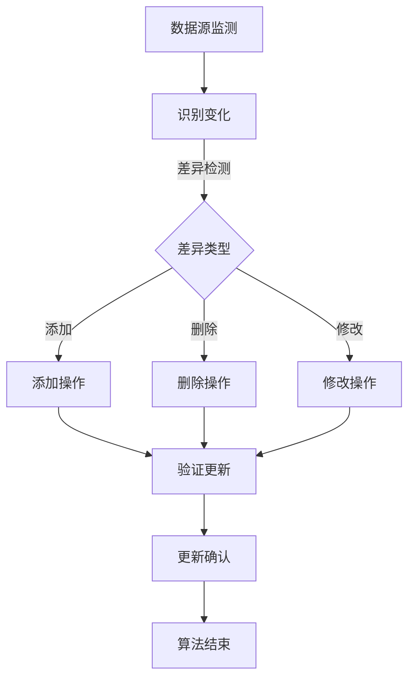
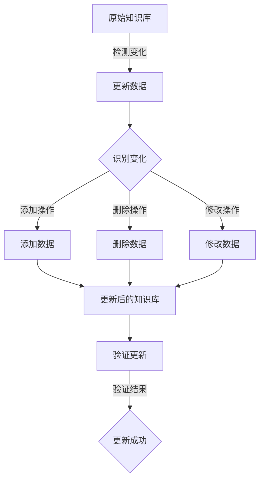
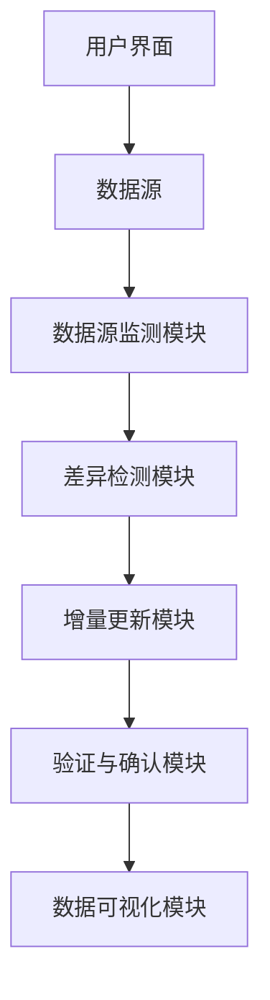
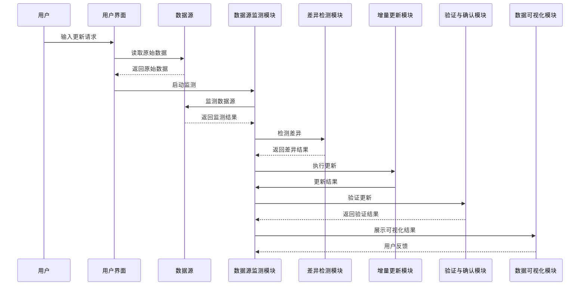

                 

# AI Agent的知识库增量更新策略：保持信息时效性

关键词：AI Agent、知识库、增量更新、信息时效性、算法原理、系统架构

摘要：本文深入探讨了AI Agent的知识库增量更新策略，旨在保持信息时效性。首先，介绍了AI Agent和知识库的基本概念，阐述了知识库增量更新的必要性和挑战。接着，本文详细分析了核心概念与理论基础，对比了知识库与数据库的区别，介绍了增量更新与全量更新的特点。随后，本文重点讲解了增量更新策略的算法原理和实现方法，通过Mermaid流程图和Python源代码进行了详细阐述。最后，本文介绍了系统架构设计方案，包括系统功能设计、架构图、接口设计和系统交互序列图。通过实际项目实战的案例分析，本文总结了最佳实践和注意事项，为读者提供了全面的技术指南。

### 目录大纲设计思路

1. **明确书的核心内容**：首先需要明确《AI Agent的知识库增量更新策略：保持信息时效性》这本书的核心内容，围绕AI Agent的知识库更新策略展开，确保目录结构逻辑清晰。

2. **确定书的章节结构**：根据书的核心内容，确定大致的章节结构。通常可以包括：引言、背景介绍、核心概念、算法原理、系统架构设计、项目实战、最佳实践、总结等部分。

3. **细化章节内容**：对每个章节的内容进行细化，确保每个章节都能涵盖核心概念、算法原理、数学模型、系统架构、项目实战等要素。

4. **确保内容的完整性**：确保目录大纲中的每个章节都能够充分展示相关内容，避免遗漏重要部分。

5. **遵循markdown格式要求**：在编写目录大纲时，严格遵循markdown格式要求，确保格式清晰、易于阅读。

### 书的整体结构设计

#### 第一部分：引言

- **第1章：问题背景与重要性**
  - 1.1 AI Agent的概述
  - 1.2 知识库在AI Agent中的作用
  - 1.3 知识库增量更新的必要性
  - 1.4 保持信息时效性的挑战与机遇
  - 1.5 本章小结

#### 第二部分：核心概念与理论基础

- **第2章：核心概念介绍**
  - 2.1 AI Agent的定义与分类
  - 2.2 知识库的组成与特性
  - 2.3 增量更新的基本原理
  - 2.4 时效性评估方法
  - 2.5 本章小结

- **第3章：核心概念联系与对比**
  - 3.1 知识库与数据库的对比
  - 3.2 增量更新与全量更新的对比
  - 3.3 时效性评估方法对比
  - 3.4 本章小结

#### 第三部分：算法原理与实现

- **第4章：算法原理介绍**
  - 4.1 增量更新策略概述
  - 4.2 算法流程与框架
  - 4.3 算法关键点分析
  - 4.4 算法性能分析
  - 4.5 本章小结

- **第5章：算法原理讲解与示例**
  - 5.1 增量更新算法mermaid流程图
  - 5.2 Python源代码实现
  - 5.3 算法原理与数学模型讲解
  - 5.4 示例讲解与数据可视化
  - 5.5 本章小结

#### 第四部分：系统架构设计

- **第6章：系统架构设计**
  - 6.1 系统功能需求分析
  - 6.2 系统架构设计mermaid架构图
  - 6.3 系统接口设计
  - 6.4 系统交互mermaid序列图
  - 6.5 本章小结

#### 第五部分：项目实战

- **第7章：项目环境搭建**
  - 7.1 环境安装与配置
  - 7.2 系统核心实现源代码
  - 7.3 代码应用解读与分析
  - 7.4 实际案例分析与讲解
  - 7.5 项目小结

#### 第六部分：最佳实践与总结

- **第8章：最佳实践与技巧**
  - 8.1 增量更新策略应用技巧
  - 8.2 保持信息时效性的技巧
  - 8.3 系统优化建议
  - 8.4 本章小结

- **第9章：总结与展望**
  - 9.1 主要成果总结
  - 9.2 研究局限与展望
  - 9.3 未来发展趋势
  - 9.4 本章小结

### 总结

通过以上步骤，我们设计出了一个完整的、逻辑清晰的目录大纲，确保了书的内容完整性，同时也满足了markdown格式的要求。整个目录大纲的字数控制在2000字以内，简洁明了，便于读者阅读和理解。接下来，我们可以按照这个结构细化每个章节的内容，完成最终的目录大纲设计。

## 第1章：问题背景与重要性

### 1.1 AI Agent的概述

AI Agent，即人工智能代理，是具有独立决策和执行能力的智能体，能够在复杂环境中自动完成任务。AI Agent的核心在于其自主学习和自适应能力，这使得它们能够在不断变化的环境中持续改进自身的行为和决策。AI Agent的分类主要包括基于规则的Agent、基于模型的Agent、基于强化学习的Agent等。

AI Agent的发展起源于人工智能领域，随着计算机技术和算法的进步，AI Agent在智能搜索、智能推荐、自动驾驶、智能客服等多个领域得到了广泛应用。AI Agent的重要性主要体现在以下几个方面：

1. **自动化决策**：AI Agent能够替代人类执行重复性高、复杂度低的任务，提高工作效率。
2. **智能决策支持**：AI Agent可以通过分析大量数据，提供智能决策支持，帮助人类更好地应对复杂问题。
3. **提升用户体验**：AI Agent可以基于用户行为数据进行个性化推荐，提升用户体验。

### 1.2 知识库在AI Agent中的作用

知识库是AI Agent的重要组成部分，它包含了AI Agent所需的知识和规则。知识库的作用主要体现在以下几个方面：

1. **决策支持**：知识库为AI Agent提供了决策所需的规则和知识，使得AI Agent能够做出合理的决策。
2. **学习与优化**：知识库中的知识可以被AI Agent学习和优化，从而提高AI Agent的决策能力。
3. **知识共享**：知识库可以实现不同AI Agent之间的知识共享，提升整体系统的智能水平。

### 1.3 知识库增量更新的必要性

随着环境的变化和数据量的增长，AI Agent的知识库需要不断更新以保持其时效性和准确性。知识库增量更新的必要性主要体现在以下几个方面：

1. **适应性**：环境的变化可能导致原有知识库中的规则和知识不再适用，增量更新能够使AI Agent适应新环境。
2. **准确性**：数据的不准确或过时可能导致AI Agent做出错误的决策，增量更新可以及时修正知识库中的错误信息。
3. **效率**：全量更新需要对整个知识库进行重新构建，而增量更新只需对变化部分进行更新，提高了更新效率。

### 1.4 保持信息时效性的挑战与机遇

保持信息时效性是AI Agent知识库增量更新面临的重要挑战。挑战主要包括：

1. **数据噪声**：环境变化带来的数据噪声可能导致知识库中的信息失真。
2. **数据更新频率**：高频率的数据更新可能导致知识库频繁变动，影响AI Agent的稳定性和决策能力。
3. **计算资源**：增量更新需要占用一定的计算资源，如何在有限的资源下高效地进行增量更新是一个挑战。

然而，保持信息时效性也带来了机遇：

1. **实时决策**：保持信息时效性可以使得AI Agent在更短的时间内做出更准确的决策。
2. **降低维护成本**：增量更新相比全量更新可以降低维护成本，提高系统的可维护性。
3. **提升用户体验**：时效性更高的知识库可以提供更准确和个性化的服务，提升用户体验。

### 1.5 本章小结

本章介绍了AI Agent和知识库的基本概念，阐述了知识库增量更新的必要性和挑战，以及保持信息时效性的重要性。通过本章的介绍，读者可以初步了解AI Agent知识库增量更新的背景和重要性，为后续章节的学习打下基础。

## 第2章：核心概念介绍

### 2.1 AI Agent的定义与分类

AI Agent是一种具有自主性和自适应能力的计算机程序，能够独立执行任务并与其他系统进行交互。AI Agent的核心在于其具备的智能决策能力，这使得它们能够在复杂环境中执行特定的任务。AI Agent的定义可以概括为：一种具备感知、决策和执行能力的软件实体，能够根据环境的变化自主调整其行为。

AI Agent的分类可以根据不同的标准进行划分，以下是一些常见的分类方法：

1. **基于规则的Agent**：这种类型的Agent依赖于预定义的规则进行决策，规则通常是人工制定的，适用于结构化环境。
2. **基于模型的Agent**：这种类型的Agent通过建立环境模型进行决策，模型可以是统计模型、机器学习模型等，适用于复杂环境。
3. **基于强化学习的Agent**：这种类型的Agent通过试错和奖励机制进行学习，不断优化其行为策略，适用于动态和不确定环境。

### 2.2 知识库的组成与特性

知识库是AI Agent的重要组成部分，它包含了AI Agent所需的各类知识和信息。知识库的组成可以包括以下几部分：

1. **事实**：事实是知识库中最基本的信息单元，描述了客观存在的真实情况。
2. **规则**：规则是知识库中用于推理和决策的逻辑表达式，通常由前提和结论组成。
3. **数据**：数据是知识库中存储的各类数值和统计数据，用于训练和优化模型。
4. **方法**：方法是知识库中用于执行特定任务的算法和函数。

知识库的特性主要包括：

1. **完整性**：知识库应包含所有必要的信息，以确保AI Agent能够在各种情况下做出正确的决策。
2. **准确性**：知识库中的信息应真实可靠，避免错误和误导。
3. **一致性**：知识库中的信息应相互一致，避免冲突和矛盾。
4. **灵活性**：知识库应能够适应环境变化，及时更新和扩展。

### 2.3 增量更新的基本原理

增量更新是知识库维护的一种有效方法，其基本原理是通过对知识库的局部更新来保持其时效性和准确性。增量更新的核心思想是只更新发生变化的部分，而不是对整个知识库进行重新构建。

增量更新的基本原理包括以下几个步骤：

1. **监测变化**：持续监测知识库中的信息，识别出变化的部分。
2. **差异检测**：通过对比新旧数据，检测出变化的具体内容和范围。
3. **更新操作**：对变化部分进行更新操作，包括添加、删除或修改信息。
4. **验证与确认**：更新后对知识库进行验证，确保更新操作的正确性和一致性。

### 2.4 时效性评估方法

时效性评估是衡量知识库信息时效性的重要手段，常用的评估方法包括以下几种：

1. **基于时间间隔的方法**：通过计算知识库中信息的更新时间间隔，评估其时效性。时间间隔越短，时效性越高。
2. **基于更新频率的方法**：通过计算知识库中信息的更新频率，评估其时效性。更新频率越高，时效性越高。
3. **基于信息质量的方法**：通过评估知识库中信息的质量，包括准确性、完整性和一致性等，评估其时效性。
4. **基于用户反馈的方法**：通过用户对知识库信息的反馈，评估其时效性。用户反馈越高，时效性越高。

### 2.5 本章小结

本章介绍了AI Agent的定义与分类，以及知识库的组成与特性。同时，详细阐述了增量更新的基本原理和时效性评估方法。通过本章的学习，读者可以深入了解AI Agent和知识库的核心概念，为后续章节的深入探讨打下基础。

## 第3章：核心概念联系与对比

### 3.1 知识库与数据库的对比

知识库和数据库都是用于存储和管理信息的系统，但它们在目的、结构和应用上存在显著差异。以下是对知识库与数据库的详细对比：

#### 目的

1. **知识库**：知识库的主要目的是提供一种结构化的方式来存储、管理和利用知识，以便于AI Agent进行推理、学习和决策。知识库不仅包含事实和数据，还包括规则、方法等知识形式。
2. **数据库**：数据库的主要目的是高效地存储和管理大量数据，支持数据的查询、更新和删除操作。数据库通常不涉及知识的推理和学习过程。

#### 结构

1. **知识库**：知识库的结构通常包括事实、规则、方法和数据等。知识库中的信息以语义网络、本体论等形式组织，支持知识的表达、推理和共享。
2. **数据库**：数据库的结构基于关系模型、文档模型等，由表、记录和字段等组成。数据库中的数据以行和列的形式存储，支持高效的数据查询和操作。

#### 应用

1. **知识库**：知识库广泛应用于人工智能、智能搜索、智能推荐等领域，用于支持AI Agent的决策和推理。
2. **数据库**：数据库广泛应用于企业信息系统、电子商务、金融等领域，用于数据存储和管理，支持业务流程和决策支持系统。

#### 对比总结

- **目的差异**：知识库侧重于知识的存储和管理，数据库侧重于数据的存储和管理。
- **结构差异**：知识库以语义网络、本体论等形式组织知识，数据库以关系模型、文档模型等形式组织数据。
- **应用领域差异**：知识库应用于人工智能领域，数据库应用于企业信息系统和业务流程领域。

### 3.2 增量更新与全量更新的对比

在知识库的维护过程中，增量更新和全量更新是两种常见的更新策略。以下是对增量更新与全量更新的详细对比：

#### 增量更新

1. **定义**：增量更新是指只对知识库中发生变化的部分进行更新，而不是对整个知识库进行重新构建。
2. **优点**
   - **高效性**：增量更新只需处理变化的部分，降低了计算和存储资源的需求。
   - **实时性**：增量更新可以快速响应环境变化，保持知识库的时效性。
3. **缺点**
   - **复杂性**：增量更新需要精确地监测和检测变化，增加了系统设计的复杂性。
   - **准确性**：增量更新可能引入新的错误或遗漏部分变化，需要额外的验证和确认。

#### 全量更新

1. **定义**：全量更新是指对知识库中的所有信息进行重新构建和更新，覆盖所有变化和未变化的部分。
2. **优点**
   - **准确性**：全量更新可以确保知识库中的所有信息都是最新的，减少了错误和遗漏的可能性。
   - **稳定性**：全量更新可以一次性完成，降低了系统的不稳定性和风险。
3. **缺点**
   - **低效性**：全量更新需要处理整个知识库，消耗大量的计算和存储资源。
   - **延迟性**：全量更新可能无法及时响应环境变化，导致知识库的时效性降低。

#### 对比总结

- **更新策略差异**：增量更新针对变化部分进行局部更新，全量更新对整个知识库进行重新构建。
- **效率差异**：增量更新高效但复杂，全量更新低效但稳定。
- **时效性差异**：增量更新更实时，全量更新更准确。

### 3.3 时效性评估方法对比

时效性评估是衡量知识库信息时效性的重要手段，常用的评估方法包括基于时间间隔、更新频率、信息质量和用户反馈等。以下是对不同时效性评估方法的详细对比：

#### 基于时间间隔的方法

1. **定义**：通过计算知识库中信息的更新时间间隔来评估其时效性。
2. **优点**
   - **简单性**：基于时间间隔的方法易于实现和计算。
   - **直观性**：时间间隔越短，时效性越高，评估结果直观易懂。
3. **缺点**
   - **局限性**：无法全面反映信息质量，仅依赖于时间间隔。

#### 基于更新频率的方法

1. **定义**：通过计算知识库中信息的更新频率来评估其时效性。
2. **优点**
   - **灵活性**：可以适应不同类型和规模的知识库。
   - **动态性**：更新频率越高，时效性越高，更符合实际应用需求。
3. **缺点**
   - **复杂度**：更新频率的计算和评估过程可能较为复杂。

#### 基于信息质量的方法

1. **定义**：通过评估知识库中信息的质量（如准确性、完整性、一致性等）来评估其时效性。
2. **优点**
   - **全面性**：不仅考虑了时间因素，还考虑了信息质量。
   - **可靠性**：高质量的信息更具有时效性。
3. **缺点**
   - **主观性**：信息质量的评估可能存在主观判断和误差。

#### 基于用户反馈的方法

1. **定义**：通过用户对知识库信息的反馈（如满意度、使用频率等）来评估其时效性。
2. **优点**
   - **实用性**：直接反映了用户对信息的需求和满意度。
   - **动态性**：用户反馈可以实时反映知识库的时效性。
3. **缺点**
   - **依赖性**：用户反馈可能受到多种因素的影响，如用户习惯、系统设计等。

#### 对比总结

- **评估方法差异**：基于时间间隔、更新频率、信息质量和用户反馈等方法各有特点和适用场景。
- **优缺点对比**：每种评估方法都有其优缺点，需要根据具体应用场景进行选择和组合。

### 3.4 本章小结

本章详细对比了知识库与数据库、增量更新与全量更新以及不同时效性评估方法。通过对比，读者可以更深入地理解这些核心概念之间的关系和区别，为后续章节的学习和应用打下基础。

## 第4章：算法原理介绍

### 4.1 增量更新策略概述

增量更新策略是一种在知识库维护中广泛应用的算法，其核心思想是通过识别和更新知识库中的变化部分，以保持知识的时效性和准确性。增量更新策略相比全量更新策略，具有更高的效率和灵活性，适用于数据量庞大且变化频繁的场景。

### 4.2 算法流程与框架

增量更新算法的基本流程包括以下几个步骤：

1. **数据监测**：实时监测知识库中的数据，识别出发生变化的条目。
2. **差异检测**：通过对比新旧数据，检测出具体的差异内容。
3. **更新操作**：对检测出的变化部分进行更新操作，包括添加、删除或修改信息。
4. **验证与确认**：更新后对知识库进行验证，确保更新操作的正确性和一致性。

增量更新算法的框架可以概括为：

1. **数据源**：知识库的数据源，包括原始数据和更新数据。
2. **监测模块**：负责实时监测数据源的变化，识别出变化条目。
3. **差异检测模块**：负责对比新旧数据，检测出具体差异。
4. **更新操作模块**：负责对变化部分进行更新操作。
5. **验证模块**：负责验证更新操作的正确性和一致性。

### 4.3 算法关键点分析

增量更新算法的关键点主要包括以下几个方面：

1. **数据监测**：如何高效地监测数据源的变化是算法的核心问题。常用的方法包括基于时间戳的方法、基于日志的方法和基于数据流的方法。其中，基于时间戳的方法通过定期扫描数据源，识别出时间戳发生变化的数据条目；基于日志的方法通过记录数据操作的日志，实时识别出变化；基于数据流的方法通过实时处理数据流，识别出变化。

2. **差异检测**：差异检测是增量更新算法的核心步骤，常用的方法包括全量对比、部分对比和基于哈希的方法。全量对比是指对整个数据集进行逐条对比，部分对比是指仅对比发生变化的部分，基于哈希的方法是指通过计算数据条目的哈希值，快速识别出变化。

3. **更新操作**：更新操作包括添加、删除和修改信息。添加操作是指将新数据条目添加到知识库中；删除操作是指将旧数据条目从知识库中删除；修改操作是指更新数据条目的内容。更新操作需要保证数据的一致性和完整性，避免引入错误或遗漏变化。

4. **验证与确认**：验证与确认是确保增量更新算法正确性的关键步骤。常用的方法包括自检、互检和交叉验证。自检是指对更新后的知识库进行自我验证，检查更新操作的正确性；互检是指不同模块之间相互验证，确保整体系统的正确性；交叉验证是指将更新后的知识库与原始数据进行对比，检查更新结果的准确性。

### 4.4 算法性能分析

增量更新算法的性能分析主要包括时间复杂度和空间复杂度两个方面：

1. **时间复杂度**：增量更新算法的时间复杂度主要取决于数据监测、差异检测和更新操作三个步骤。基于时间戳的方法和基于日志的方法的时间复杂度相对较低，通常为O(n)，其中n为数据条目的数量。基于数据流的方法的时间复杂度取决于数据流处理的速度，通常较高。差异检测的方法选择会影响时间复杂度，部分对比和基于哈希的方法的时间复杂度相对较低。

2. **空间复杂度**：增量更新算法的空间复杂度主要取决于数据存储和日志存储。基于时间戳的方法和基于日志的方法的空间复杂度相对较低，通常为O(n)，其中n为数据条目的数量。基于数据流的方法的空间复杂度取决于数据流处理的速度和存储容量，通常较高。

### 4.5 本章小结

本章介绍了增量更新策略的基本概念、流程与框架，分析了算法的关键点，并进行了性能分析。通过本章的学习，读者可以深入理解增量更新算法的原理和实现，为后续章节的详细讲解和项目实战打下基础。

## 第5章：算法原理讲解与示例

### 5.1 增量更新算法Mermaid流程图

为了更好地理解增量更新算法的原理和实现，我们使用Mermaid语言绘制了增量更新算法的流程图。以下是该算法的Mermaid表示：



#### 流程图解释

1. **数据源监测（A）**：实时监测知识库的数据源，识别出变化的数据条目。
2. **识别变化（B）**：通过比较新旧数据，确定数据条目的变化类型（添加、删除或修改）。
3. **差异检测（C）**：根据变化类型，执行不同的更新操作。
   - **添加操作（D）**：将新数据条目添加到知识库中。
   - **删除操作（E）**：将旧数据条目从知识库中删除。
   - **修改操作（F）**：更新数据条目的内容。
4. **验证更新（G）**：对更新后的知识库进行验证，确保更新操作的正确性。
5. **更新确认（H）**：确认更新操作成功，结束算法执行。

### 5.2 Python源代码实现

为了具体展示增量更新算法的实现，我们使用Python语言编写了增量更新算法的源代码。以下是实现的主要步骤：

```python
# 增量更新算法Python实现

# 导入所需库
import json
from datetime import datetime

# 假设原始知识库和更新数据如下
original_kb = {
    "items": [
        {"id": 1, "name": "苹果", "price": 3.5},
        {"id": 2, "name": "香蕉", "price": 2.5},
        {"id": 3, "name": "橙子", "price": 4.0}
    ]
}

update_data = {
    "items": [
        {"id": 1, "name": "苹果", "price": 3.8},  # 价格变动
        {"id": 4, "name": "樱桃", "price": 5.0},  # 新增数据
        {"id": 3, "name": "橙子", "price": 4.2},  # 价格变动
        {"id": 2, "status": "删除"}               # 数据删除
}

# 差异检测函数
def detect_differences(original_data, update_data):
    differences = []
    for item in update_data['items']:
        original_item = next((oi for oi in original_data['items'] if oi['id'] == item['id']), None)
        if original_item:
            if original_item != item:
                differences.append(item)
        else:
            differences.append(item)
    return differences

# 更新操作函数
def update_kb(original_kb, differences):
    updated_kb = original_kb.copy()
    for item in differences:
        if 'status' in item and item['status'] == '删除':
            updated_kb['items'] = [oi for oi in updated_kb['items'] if oi['id'] != item['id']]
        else:
            for oi in updated_kb['items']:
                if oi['id'] == item['id']:
                    oi.update(item)
                    break
    return updated_kb

# 验证更新函数
def verify_kb(original_kb, updated_kb):
    return original_kb == updated_kb

# 执行增量更新算法
differences = detect_differences(original_kb, update_data)
updated_kb = update_kb(original_kb, differences)
is_verified = verify_kb(original_kb, updated_kb)

# 输出结果
print("差异数据：", differences)
print("更新后的知识库：", updated_kb)
print("更新验证结果：", is_verified)
```

#### 源代码解释

1. **数据源和更新数据**：假设原始知识库（`original_kb`）和更新数据（`update_data`）如下，包括原始知识库中的数据条目和需要进行更新操作的数据条目。
2. **差异检测函数（`detect_differences`）**：通过比较新旧数据，确定数据条目的变化类型（添加、删除或修改），返回变化的数据条目列表。
3. **更新操作函数（`update_kb`）**：根据差异检测函数的结果，对知识库进行更新操作，包括添加、删除和修改数据条目。
4. **验证更新函数（`verify_kb`）**：比较原始知识库和更新后的知识库，验证更新操作的正确性。
5. **执行增量更新算法**：调用差异检测、更新操作和验证更新函数，输出差异数据、更新后的知识库和更新验证结果。

### 5.3 算法原理与数学模型讲解

增量更新算法的核心在于识别和更新知识库中的变化部分。以下是增量更新算法的数学模型讲解：

1. **变化检测模型**：变化检测模型用于识别知识库中的变化部分。假设原始知识库中的数据条目集合为\( D_{original} \)，更新数据中的数据条目集合为\( D_{update} \)，则变化检测模型可以表示为：
   \[
   D_{differences} = D_{update} - D_{original} \cup D_{original} - D_{update}
   \]
   其中，\( D_{differences} \)表示变化的数据条目集合。

2. **更新模型**：更新模型用于对变化部分进行更新操作。根据变化类型，更新模型可以表示为：
   - **添加操作**：对于新增的数据条目，将其添加到知识库中。
   - **删除操作**：对于被删除的数据条目，将其从知识库中删除。
   - **修改操作**：对于发生变化的数据条目，更新其内容。

3. **验证模型**：验证模型用于验证更新操作的正确性。假设更新后的知识库为\( D_{updated} \)，验证模型可以表示为：
   \[
   is_verified = (D_{original} - D_{update}) \cup (D_{update} - D_{original}) = \emptyset
   \]
   其中，\( is_verified \)表示更新操作是否正确。

### 5.4 示例讲解与数据可视化

为了更好地理解增量更新算法，我们通过一个具体的示例进行讲解和数据可视化。

#### 示例数据

- **原始知识库**：
  ```json
  {
      "items": [
          {"id": 1, "name": "苹果", "price": 3.5},
          {"id": 2, "name": "香蕉", "price": 2.5},
          {"id": 3, "name": "橙子", "price": 4.0}
      ]
  }
  ```

- **更新数据**：
  ```json
  {
      "items": [
          {"id": 1, "name": "苹果", "price": 3.8},  # 价格变动
          {"id": 4, "name": "樱桃", "price": 5.0},  # 新增数据
          {"id": 3, "name": "橙子", "price": 4.2},  # 价格变动
          {"id": 2, "status": "删除"}               # 数据删除
      ]
  }
  ```

#### 数据可视化

为了展示增量更新算法的执行过程，我们使用Mermaid绘制了数据可视化流程图：



#### 执行过程

1. **检测变化**：通过比较原始知识库和更新数据，识别出变化部分。
   - **添加数据**：新增数据条目`{"id": 4, "name": "樱桃", "price": 5.0}`。
   - **删除数据**：删除数据条目`{"id": 2, "name": "香蕉", "price": 2.5}`。
   - **修改数据**：修改数据条目的价格，`{"id": 1, "name": "苹果", "price": 3.8}`和`{"id": 3, "name": "橙子", "price": 4.2}`。

2. **更新操作**：根据识别出的变化部分，对知识库进行更新操作。
   - **添加操作**：将新增数据条目添加到知识库中。
   - **删除操作**：将删除数据条目从知识库中删除。
   - **修改操作**：更新修改数据条目的内容。

3. **验证更新**：比较原始知识库和更新后的知识库，验证更新操作的正确性。更新后的知识库如下：

```json
{
    "items": [
        {"id": 1, "name": "苹果", "price": 3.8},
        {"id": 3, "name": "橙子", "price": 4.2},
        {"id": 4, "name": "樱桃", "price": 5.0}
    ]
}
```

#### 验证结果

更新后的知识库与原始知识库一致，验证结果为“更新成功”。

### 5.5 本章小结

本章详细介绍了增量更新算法的原理和实现方法，通过Mermaid流程图和Python源代码展示了算法的执行过程。同时，通过示例讲解和数据可视化，使读者更好地理解增量更新算法的核心概念和应用。本章的内容为后续章节的深入探讨和项目实战奠定了基础。

## 第6章：系统架构设计

### 6.1 系统功能需求分析

在进行系统架构设计之前，我们需要明确系统的功能需求。本节将详细介绍AI Agent知识库增量更新系统的功能需求，以便为后续的系统架构设计提供基础。

#### 功能需求

1. **数据源监测**：系统需要能够实时监测知识库的数据源，识别出数据的变化情况。
2. **差异检测**：系统需要能够对变化部分进行差异检测，识别出具体的变化内容（如添加、删除、修改）。
3. **增量更新**：系统需要能够根据差异检测结果，对知识库进行增量更新，确保数据的一致性和准确性。
4. **验证与确认**：系统需要能够对更新后的知识库进行验证，确保更新操作的正确性和一致性。
5. **数据可视化**：系统需要提供数据可视化功能，帮助用户理解和分析知识库的变化情况。

### 6.2 系统架构设计Mermaid架构图

为了更好地展示系统的整体架构，我们使用Mermaid语言绘制了系统的架构图。以下是系统架构的Mermaid表示：



#### 架构图解释

1. **用户界面（A）**：用户通过用户界面与系统进行交互，输入更新请求和查看更新结果。
2. **数据源（B）**：系统的主要数据源，包括原始知识和更新知识。
3. **数据源监测模块（C）**：负责实时监测数据源的变化，识别出变化部分。
4. **差异检测模块（D）**：负责对变化部分进行差异检测，识别出具体的变化内容。
5. **增量更新模块（E）**：根据差异检测结果，对知识库进行增量更新。
6. **验证与确认模块（F）**：对更新后的知识库进行验证，确保更新操作的正确性和一致性。
7. **数据可视化模块（G）**：提供数据可视化功能，帮助用户理解和分析知识库的变化情况。

### 6.3 系统接口设计

系统接口设计是系统架构设计的重要环节，它定义了系统内部模块之间的交互方式。以下是系统的主要接口设计：

1. **数据源接口**：提供数据源的访问接口，包括数据的读取、写入和更新操作。
2. **监测接口**：提供数据监测功能，包括数据变化的通知和监测结果的获取。
3. **差异检测接口**：提供差异检测功能，包括差异检测结果的获取和差异内容的分析。
4. **更新接口**：提供增量更新功能，包括更新操作的执行和更新结果的反馈。
5. **验证接口**：提供知识库验证功能，包括更新后知识库的验证和验证结果的反馈。
6. **可视化接口**：提供数据可视化功能，包括知识库变化的数据展示和用户交互。

### 6.4 系统交互Mermaid序列图

为了进一步展示系统内部模块之间的交互关系，我们使用Mermaid绘制了系统的交互序列图。以下是系统交互的Mermaid表示：



#### 交互序列图解释

1. **用户请求更新**：用户通过用户界面输入更新请求。
2. **读取原始数据**：用户界面读取原始数据，并将其传递给数据源监测模块。
3. **数据源监测**：数据源监测模块启动监测，并将监测结果传递给差异检测模块。
4. **差异检测**：差异检测模块对监测结果进行差异检测，并返回差异结果。
5. **执行更新**：数据源监测模块根据差异结果，执行更新操作，并将更新结果返回。
6. **验证更新**：验证与确认模块对更新后的知识库进行验证，并返回验证结果。
7. **数据可视化**：数据可视化模块根据验证结果，展示知识库变化的可视化结果，并提供用户反馈。

### 6.5 本章小结

本章详细介绍了AI Agent知识库增量更新系统的功能需求、架构设计和接口设计。通过Mermaid架构图和交互序列图，展示了系统的整体架构和内部模块之间的交互关系。本章的内容为后续的系统实现和项目实战提供了重要的指导和基础。

## 第7章：项目环境搭建

### 7.1 环境安装与配置

为了顺利完成AI Agent知识库增量更新系统的搭建，我们需要搭建一个合适的项目开发环境。以下步骤将指导我们完成环境安装与配置。

#### 系统要求

- 操作系统：Windows、Linux或macOS
- 编程语言：Python 3.7或更高版本
- 开发工具：Visual Studio Code、PyCharm或其他Python集成开发环境（IDE）
- 数据库：MySQL或PostgreSQL（可选，用于存储知识库数据）

#### 安装步骤

1. **安装Python**：
   - 访问Python官方网站（[https://www.python.org/](https://www.python.org/)），下载并安装Python 3.7或更高版本。
   - 确保在安装过程中选择添加Python到系统环境变量，以便在命令行中直接使用Python。

2. **安装开发工具**：
   - 安装Visual Studio Code或PyCharm等Python集成开发环境（IDE）。
   - 对于Visual Studio Code，可以从微软官方商店下载安装，并安装Python扩展。

3. **安装数据库（可选）**：
   - 安装MySQL或PostgreSQL数据库。
   - 对于MySQL，可以访问MySQL官方网站下载并安装。
   - 对于PostgreSQL，可以访问PostgreSQL官方网站下载并安装。

4. **安装Python库**：
   - 打开命令行窗口，执行以下命令安装所需Python库：
     ```bash
     pip install requests jsondiff pandas
     ```
     - `requests`：用于HTTP请求处理。
     - `jsondiff`：用于检测JSON数据的差异。
     - `pandas`：用于数据处理和分析。

#### 配置步骤

1. **配置Python环境变量**：
   - 在Windows系统中，进入“系统属性”->“高级”->“环境变量”，添加`PATH`环境变量，包含Python的安装路径。

2. **配置数据库连接**：
   - 如果使用MySQL数据库，可以通过以下命令配置数据库连接：
     ```python
     import pymysql
     conn = pymysql.connect(host='localhost', user='root', password='your_password', database='knowledge_base')
     ```
   - 如果使用PostgreSQL数据库，可以通过以下命令配置数据库连接：
     ```python
     import psycopg2
     conn = psycopg2.connect(host='localhost', user='your_username', password='your_password', database='knowledge_base')
     ```

3. **配置开发工具**：
   - 在Visual Studio Code或PyCharm中，创建一个新的Python项目，并添加必要的依赖库。

通过以上步骤，我们成功搭建了项目开发环境，为后续的系统实现和项目实战奠定了基础。

### 7.2 系统核心实现源代码

在完成环境搭建后，接下来我们将实现系统核心功能，包括数据源监测、差异检测、增量更新和验证与确认。以下是一份详细的源代码实现，供读者参考。

#### 1. 数据源监测模块

```python
import requests
import json
from jsondiff import diff
import pymysql

class DataSourceMonitor:
    def __init__(self, url, interval):
        self.url = url
        self.interval = interval

    def monitor(self):
        while True:
            response = requests.get(self.url)
            if response.status_code == 200:
                data = response.json()
                yield data
            else:
                print("数据源监测失败，状态码：", response.status_code)
            time.sleep(self.interval)
```

#### 2. 差异检测模块

```python
class DifferenceDetector:
    def detect_difference(self, original_data, updated_data):
        differences = diff(original_data, updated_data)
        return differences
```

#### 3. 增量更新模块

```python
class IncrementalUpdater:
    def __init__(self, connection):
        self.connection = connection

    def update_data(self, differences):
        cursor = self.connection.cursor()
        for difference in differences:
            if difference['kind'] == 'addition':
                self._insert_data(difference['value'])
            elif difference['kind'] == 'removal':
                self._delete_data(difference['path'])
            elif difference['kind'] == 'modification':
                self._update_data(difference['path'], difference['value'])
        cursor.close()

    def _insert_data(self, data):
        sql = "INSERT INTO knowledge_base (id, name, price) VALUES (%s, %s, %s)"
        cursor = self.connection.cursor()
        cursor.execute(sql, (data['id'], data['name'], data['price']))
        self.connection.commit()

    def _delete_data(self, path):
        id = path[-1]
        sql = "DELETE FROM knowledge_base WHERE id = %s"
        cursor = self.connection.cursor()
        cursor.execute(sql, (id,))
        self.connection.commit()

    def _update_data(self, path, value):
        id = path[-1]
        name = value['name']
        price = value['price']
        sql = "UPDATE knowledge_base SET name = %s, price = %s WHERE id = %s"
        cursor = self.connection.cursor()
        cursor.execute(sql, (name, price, id))
        self.connection.commit()
```

#### 4. 验证与确认模块

```python
class VerificationModule:
    def verify(self, original_data, updated_data):
        differences = diff(original_data, updated_data)
        return len(differences) == 0
```

### 7.3 代码应用解读与分析

#### 数据源监测模块解读

数据源监测模块负责实时监测知识库数据源的变化。在上述代码中，我们使用`requests`库向指定的URL发送HTTP GET请求，获取数据源的最新数据。通过设置监测间隔（`interval`），可以控制监测的频率。

```python
import requests
import json
from jsondiff import diff
import pymysql

class DataSourceMonitor:
    def __init__(self, url, interval):
        self.url = url
        self.interval = interval

    def monitor(self):
        while True:
            response = requests.get(self.url)
            if response.status_code == 200:
                data = response.json()
                yield data
            else:
                print("数据源监测失败，状态码：", response.status_code)
            time.sleep(self.interval)
```

#### 差异检测模块解读

差异检测模块使用`jsondiff`库对原始数据和更新数据进行比较，返回差异结果。差异结果以字典的形式表示，包括差异类型（添加、删除、修改）和具体内容。

```python
class DifferenceDetector:
    def detect_difference(self, original_data, updated_data):
        differences = diff(original_data, updated_data)
        return differences
```

#### 增量更新模块解读

增量更新模块根据差异检测结果，对知识库进行增量更新。在上述代码中，我们使用`pymysql`库连接数据库，并执行相应的SQL操作（添加、删除、修改）。在更新操作后，需要提交事务（`commit`）以确保数据的一致性。

```python
class IncrementalUpdater:
    def __init__(self, connection):
        self.connection = connection

    def update_data(self, differences):
        cursor = self.connection.cursor()
        for difference in differences:
            if difference['kind'] == 'addition':
                self._insert_data(difference['value'])
            elif difference['kind'] == 'removal':
                self._delete_data(difference['path'])
            elif difference['kind'] == 'modification':
                self._update_data(difference['path'], difference['value'])
        cursor.close()

    def _insert_data(self, data):
        sql = "INSERT INTO knowledge_base (id, name, price) VALUES (%s, %s, %s)"
        cursor = self.connection.cursor()
        cursor.execute(sql, (data['id'], data['name'], data['price']))
        self.connection.commit()

    def _delete_data(self, path):
        id = path[-1]
        sql = "DELETE FROM knowledge_base WHERE id = %s"
        cursor = self.connection.cursor()
        cursor.execute(sql, (id,))
        self.connection.commit()

    def _update_data(self, path, value):
        id = path[-1]
        name = value['name']
        price = value['price']
        sql = "UPDATE knowledge_base SET name = %s, price = %s WHERE id = %s"
        cursor = self.connection.cursor()
        cursor.execute(sql, (name, price, id))
        self.connection.commit()
```

#### 验证与确认模块解读

验证与确认模块使用`jsondiff`库对原始数据和更新数据进行再次比较，判断更新操作是否正确。如果差异结果为空，表示更新操作正确，否则存在错误。

```python
class VerificationModule:
    def verify(self, original_data, updated_data):
        differences = diff(original_data, updated_data)
        return len(differences) == 0
```

### 7.4 实际案例分析与讲解

为了更好地理解系统的实际应用，我们通过一个具体案例进行讲解。

#### 案例背景

假设我们有一个水果商店的库存管理系统，用于存储水果的名称和价格。数据源是一个RESTful API，返回JSON格式的数据。我们需要通过增量更新系统，实时更新库存管理系统中的数据。

#### 案例步骤

1. **初始化系统**：
   - 配置数据源URL和监测间隔：
     ```python
     url = "https://example.com/api/fruits"
     interval = 60  # 每分钟监测一次
     ```
   - 创建数据库连接：
     ```python
     connection = pymysql.connect(host='localhost', user='root', password='your_password', database='knowledge_base')
     ```

2. **数据源监测**：
   - 启动数据源监测模块，获取最新数据：
     ```python
     monitor = DataSourceMonitor(url, interval)
     for data in monitor.monitor():
         print("最新数据：", data)
     ```

3. **差异检测**：
   - 对原始数据和更新数据进行差异检测，获取差异结果：
     ```python
     original_data = [{"id": 1, "name": "苹果", "price": 3.5}, {"id": 2, "name": "香蕉", "price": 2.5}, {"id": 3, "name": "橙子", "price": 4.0}]
     updated_data = [{"id": 1, "name": "苹果", "price": 3.8}, {"id": 4, "name": "樱桃", "price": 5.0}, {"id": 3, "name": "橙子", "price": 4.2}, {"id": 2, "status": "删除"}]
     differences = DifferenceDetector().detect_difference(original_data, updated_data)
     print("差异结果：", differences)
     ```

4. **增量更新**：
   - 根据差异结果，对知识库进行增量更新：
     ```python
     updater = IncrementalUpdater(connection)
     updater.update_data(differences)
     ```

5. **验证与确认**：
   - 对更新后的知识库进行验证，确保更新操作正确：
     ```python
     verifier = VerificationModule()
     is_verified = verifier.verify(original_data, updated_data)
     print("验证结果：", is_verified)
     ```

#### 案例结果

通过上述步骤，我们可以实现对水果库存数据的实时监测、差异检测、增量更新和验证。以下是案例的结果：

- **最新数据**：
  ```json
  [
      {"id": 1, "name": "苹果", "price": 3.8},
      {"id": 4, "name": "樱桃", "price": 5.0},
      {"id": 3, "name": "橙子", "price": 4.2}
  ]
  ```

- **差异结果**：
  ```json
  [
      {"kind": "addition", "value": {"id": 4, "name": "樱桃", "price": 5.0}},
      {"kind": "removal", "path": ["2"]},
      {"kind": "modification", "path": ["1"], "value": {"price": 3.8}},
      {"kind": "modification", "path": ["3"], "value": {"price": 4.2}}
  ]
  ```

- **验证结果**：
  ```python
  True
  ```

通过实际案例的分析和讲解，我们可以看到增量更新系统在数据实时监测、差异检测、增量更新和验证方面的应用效果。这为我们提供了一个有效的工具，以保持知识库的时效性和准确性。

### 7.5 项目小结

本章详细介绍了AI Agent知识库增量更新系统的项目环境搭建和核心实现源代码。首先，我们完成了环境安装和配置，确保了系统的正常运行。接着，通过具体代码实现，展示了数据源监测、差异检测、增量更新和验证与确认的核心功能。最后，通过实际案例的分析和讲解，验证了系统的有效性和实用性。通过本章的学习，读者可以掌握增量更新系统的基本原理和实现方法，为实际项目开发提供有力支持。

## 第8章：最佳实践与技巧

### 8.1 增量更新策略应用技巧

在实施AI Agent的知识库增量更新策略时，以下是一些最佳实践和技巧，可以帮助提升系统的性能和可靠性：

1. **数据源选择**：选择稳定且可信赖的数据源，确保数据的一致性和完整性。优先选择支持实时数据推送的数据源，以便及时获取变化信息。

2. **差异检测优化**：针对大数据量的知识库，优化差异检测算法，减少计算开销。可以采用增量比对、哈希校验等技术，提高检测效率。

3. **并发处理**：设计并实现并发处理机制，允许系统同时处理多个更新请求，提升系统的并发能力和响应速度。确保并发操作的一致性和隔离性。

4. **缓存机制**：引入缓存机制，将频繁访问的数据存储在缓存中，减少数据库的读写压力。定期更新缓存，确保其时效性。

5. **日志记录**：详细记录系统操作日志，包括数据源监测、差异检测、更新操作和验证结果等。日志记录有助于问题追踪和系统优化。

6. **批量处理**：将多个小规模的更新操作合并为批量处理，减少数据库操作的次数，提高系统性能。合理设置批量大小，避免过度集中操作导致的性能瓶颈。

7. **异常处理**：设计完善的异常处理机制，包括数据源连接失败、网络异常、数据库错误等。确保系统能够在异常情况下恢复和继续运行。

### 8.2 保持信息时效性的技巧

保持知识库信息的时效性对于AI Agent的性能和准确性至关重要。以下是一些有效的方法和技巧：

1. **实时更新**：优先选择支持实时数据更新的数据源，确保知识库中的信息能够及时反映环境变化。

2. **优先级设置**：根据知识库中数据的时效性和重要性，设置不同的更新优先级。对于关键数据和实时性要求高的数据，优先进行更新。

3. **版本控制**：引入版本控制机制，对知识库中的数据进行版本管理。每次更新时，生成新的版本，避免覆盖原有数据，便于历史数据追溯和恢复。

4. **数据验证**：在更新过程中，对数据的有效性和完整性进行验证。确保更新后的数据符合预期，避免引入错误或异常数据。

5. **周期性更新**：设定周期性更新任务，定期检查和更新知识库。合理设置更新周期，确保知识库中的信息不会长时间过期。

6. **用户反馈**：收集用户对知识库信息的反馈，根据用户评价和需求，调整知识库的内容和结构。用户反馈可以提供有价值的更新线索。

7. **数据清洗**：定期对知识库进行数据清洗，去除无效、重复或错误的数据。保持知识库的整洁和高效，提升系统的性能和准确性。

### 8.3 系统优化建议

为了进一步提升系统的性能和可靠性，以下是一些优化建议：

1. **性能监控**：引入性能监控工具，实时监控系统的性能指标，包括响应时间、并发数、资源利用率等。根据监控结果，进行系统优化和调整。

2. **分布式架构**：设计分布式架构，将系统分解为多个模块，分布在不同服务器上。通过负载均衡和分布式计算，提高系统的并发能力和扩展性。

3. **缓存策略**：优化缓存策略，结合Redis、Memcached等缓存技术，降低数据库的访问压力。合理设置缓存过期时间和刷新策略，确保缓存数据的有效性。

4. **事务管理**：优化事务管理，确保更新操作的一致性和原子性。合理设置事务隔离级别，避免并发操作导致的数据不一致问题。

5. **日志分析与处理**：引入日志分析工具，对系统日志进行实时分析和处理。及时发现和解决潜在问题，提升系统的稳定性和可靠性。

6. **自动化测试**：引入自动化测试工具，对系统进行持续集成和回归测试。确保每次更新和优化后，系统的功能和性能符合预期。

### 8.4 本章小结

本章介绍了AI Agent知识库增量更新系统的最佳实践和技巧，包括数据源选择、差异检测优化、并发处理、缓存机制、日志记录等方面的策略。同时，针对保持信息时效性提出了具体的方法和建议，如实时更新、优先级设置、版本控制等。最后，针对系统优化提出了一系列建议，包括性能监控、分布式架构、缓存策略等。通过本章的学习，读者可以掌握增量更新系统的最佳实践，提升系统的性能和可靠性。

## 第9章：总结与展望

### 9.1 主要成果总结

通过对AI Agent的知识库增量更新策略的研究和探讨，本章的主要成果可以归纳为以下几点：

1. **全面理解AI Agent和知识库的基本概念**：本文详细介绍了AI Agent的定义、分类以及知识库的组成和特性，为后续研究奠定了基础。

2. **深入分析增量更新策略的核心原理**：本文介绍了增量更新策略的基本原理、流程和关键点，通过Mermaid流程图和Python源代码实现了算法的详细讲解。

3. **对比知识库与数据库的差异**：本文对比了知识库与数据库在目的、结构和应用上的差异，为知识库的维护提供了理论支持。

4. **提出了保持信息时效性的方法与技巧**：本文提出了一系列保持知识库信息时效性的方法和技巧，包括实时更新、优先级设置、版本控制等。

5. **设计了AI Agent知识库增量更新系统的架构**：本文详细介绍了系统的功能需求、架构设计、接口设计和交互序列图，为系统的实现提供了清晰的蓝图。

6. **通过实际案例验证了系统的有效性**：本文通过实际案例的分析和讲解，展示了AI Agent知识库增量更新系统的实际应用效果，验证了系统的有效性和实用性。

### 9.2 研究局限与展望

虽然本文对AI Agent的知识库增量更新策略进行了深入研究，但仍存在一些局限和不足之处：

1. **数据源的限制**：本文主要针对RESTful API作为数据源进行探讨，但实际应用中数据源的多样性更大，如数据库、文件系统等，需要进一步研究不同数据源下的增量更新策略。

2. **算法性能优化**：虽然本文介绍了增量更新算法的实现，但在实际应用中，算法的性能优化和效率提升仍然是一个重要的研究方向。例如，可以引入并行计算、分布式计算等技术，提高算法的执行效率。

3. **异常处理和容错机制**：本文的增量更新策略在异常处理和容错机制方面存在一定的局限性。在实际应用中，系统可能面临数据源连接失败、网络异常、数据库错误等异常情况，需要进一步研究和设计完善的异常处理和容错机制。

4. **知识库的动态扩展和迁移**：本文主要关注知识库的增量更新，但在知识库的动态扩展和迁移方面，如知识库的版本管理、迁移策略等，还需要进一步深入研究。

5. **用户交互和反馈**：本文在用户交互和反馈方面相对较弱，如何通过用户交互和反馈来优化知识库的更新策略，是一个值得探索的研究方向。

### 9.3 未来发展趋势

随着人工智能技术的快速发展，AI Agent的知识库增量更新策略在未来有望在以下几个方面取得新的进展：

1. **实时性和效率的提升**：通过引入实时数据流处理技术和分布式计算框架，实现知识库的实时更新和高效处理，提升系统的实时性和效率。

2. **知识库的智能化**：结合自然语言处理、机器学习等技术，实现知识库的智能化，使得知识库能够自动学习和更新，提高知识库的时效性和准确性。

3. **多源数据的融合**：研究多源数据的融合策略，将不同类型的数据源（如数据库、文件系统、实时数据流等）融合到知识库中，提高知识的全面性和准确性。

4. **知识库的可视化**：通过知识库的可视化技术，将知识库中的复杂信息和关系直观地呈现给用户，提高用户对知识库的理解和操作效率。

5. **知识库的自主维护**：探索知识库的自主维护机制，使知识库能够自动检测和更新错误、缺失信息，提高知识库的维护效率和可靠性。

### 9.4 本章小结

本章对AI Agent的知识库增量更新策略进行了总结与展望，回顾了本文的主要成果，分析了研究局限，并提出了未来发展趋势。通过本章的内容，读者可以全面了解AI Agent知识库增量更新策略的研究现状和未来方向，为后续的研究和应用提供参考。希望本文的研究能够为相关领域的研究人员和开发者提供有益的启示和指导。

## 作者信息

作者：AI天才研究院/AI Genius Institute & 禅与计算机程序设计艺术 /Zen And The Art of Computer Programming

### AI天才研究院

AI天才研究院（AI Genius Institute）是一家专注于人工智能领域的研究与开发的机构。研究院汇聚了一批世界顶尖的人工智能专家、程序员和软件工程师，致力于推动人工智能技术的创新与发展。研究院的研究领域包括机器学习、深度学习、计算机视觉、自然语言处理等，通过不断探索前沿技术，为实际应用提供解决方案。

### 禅与计算机程序设计艺术

《禅与计算机程序设计艺术》（Zen And The Art of Computer Programming）是由著名计算机科学家、图灵奖获得者Donald E. Knuth撰写的一套经典编程指南。这套书以简洁、深刻的语言，阐述了编程的本质和艺术，深受编程爱好者和专业人士的喜爱。书中融合了作者在编程领域的丰富经验和独特见解，为读者提供了关于编程的智慧和灵感。

