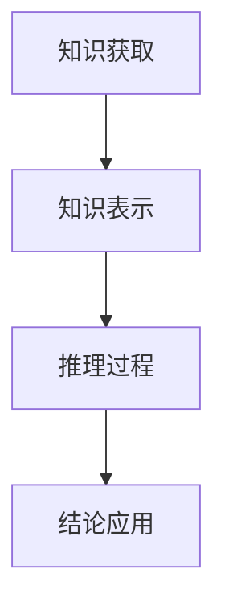
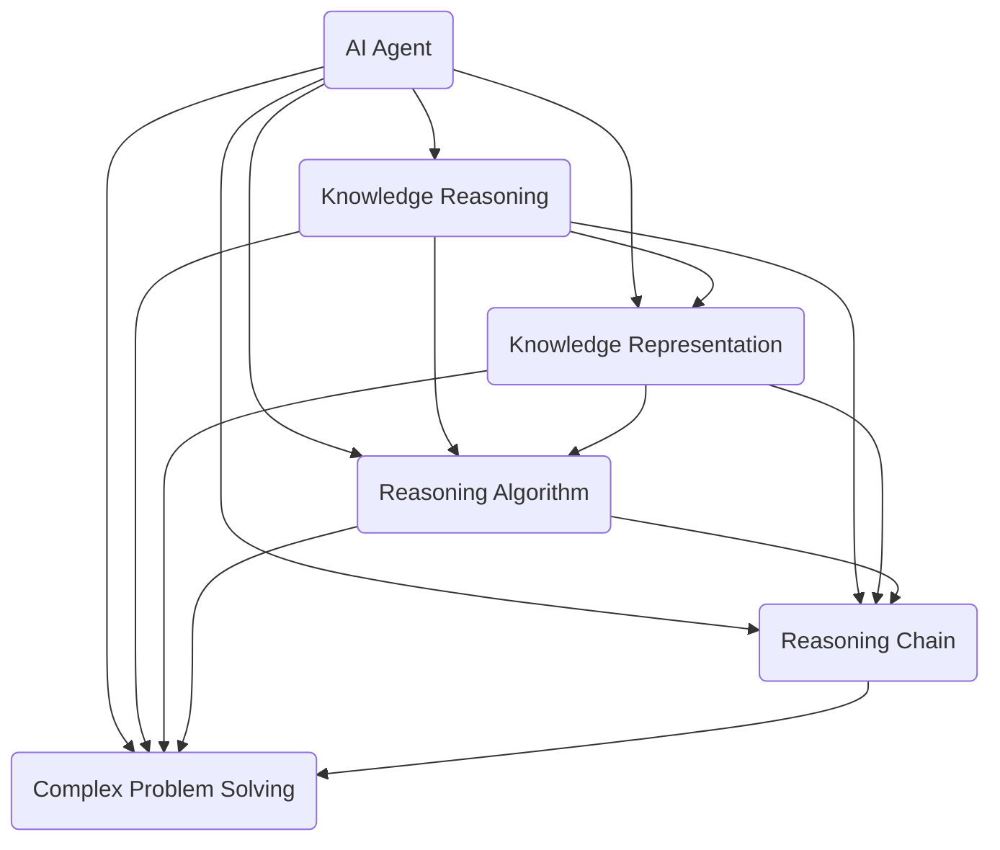
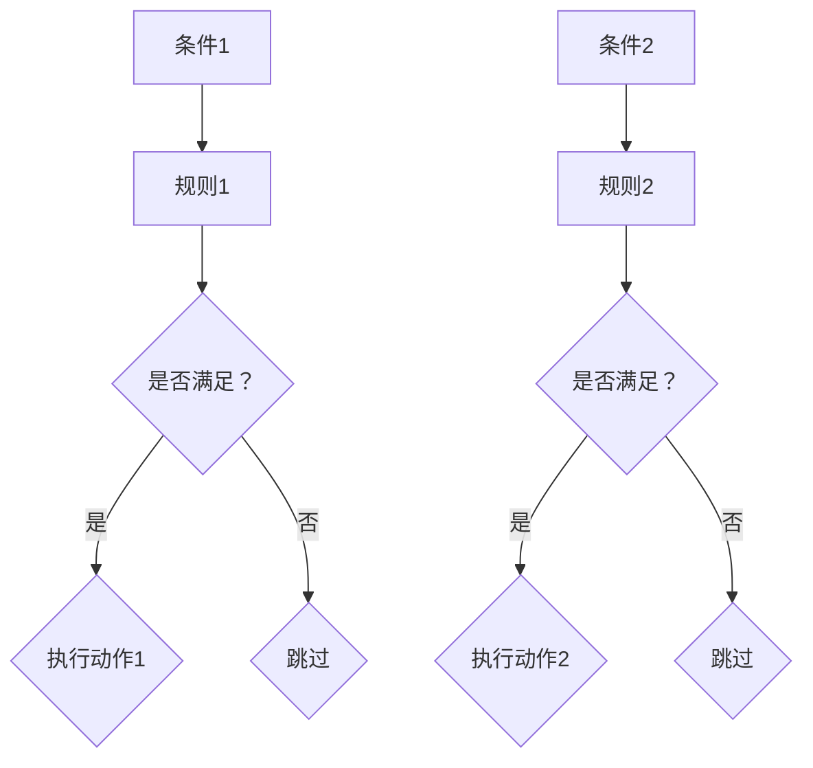
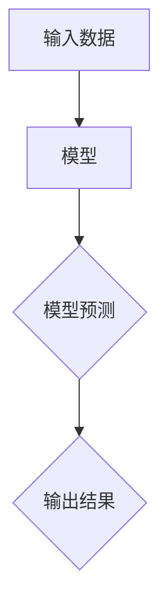
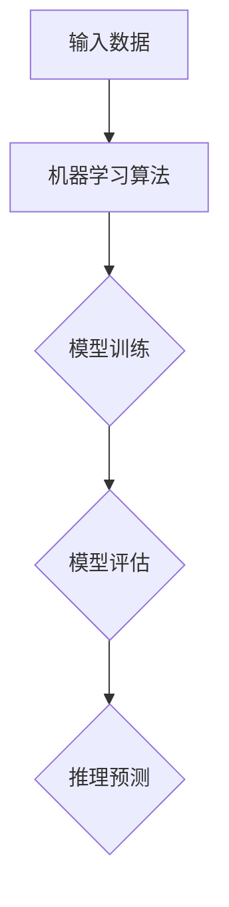
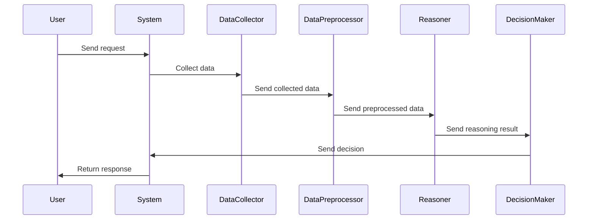
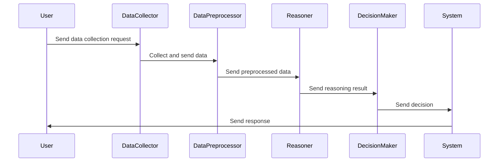

                 

# AI Agent的知识推理链：逐步解决复杂问题

## 关键词
- **AI Agent**
- **知识推理**
- **复杂问题解决**
- **推理链**
- **算法优化**
- **案例研究**

## 摘要
本文深入探讨了AI Agent的知识推理链，阐述了其在逐步解决复杂问题中的应用和重要性。通过详细分析知识表示、推理算法和推理链构建，本文提供了系统性框架和方法，帮助理解和优化AI代理在复杂问题解决中的表现。文中还包括具体案例和最佳实践，以展示理论知识在实际项目中的应用和效果。

---

### 引言

在人工智能（AI）的快速发展中，AI Agent作为自主执行任务的智能体，已经成为研究和应用的热点。AI Agent能够通过学习、推理和决策自主完成复杂任务，其核心在于强大的知识推理能力。知识推理是AI Agent理解世界、解决复杂问题的关键，它不仅涉及如何获取和表示知识，还包括如何利用这些知识进行有效的推理和决策。

本文将系统地探讨AI Agent的知识推理链，逐步揭示其在解决复杂问题中的应用。文章结构如下：

1. **AI Agent与知识推理基础**：介绍AI Agent的概念与作用，以及知识推理的基本概念。
2. **知识推理原理**：详细讲解知识推理的表示方法、基本过程、算法及其挑战与解决方案。
3. **建立推理链**：探讨如何构建和优化推理链，包括构建方法和优化策略。
4. **解决复杂问题的方法**：针对不同复杂度的问题，提出相应的解决策略。
5. **综合案例与应用**：通过具体案例，展示知识推理链在实际项目中的应用和效果。

### 第1章：AI Agent与知识推理基础

#### 1.1 AI Agent的概念与作用

AI Agent是一种能够自主感知环境、理解情境、做出决策并采取行动的智能体。它在多种应用场景中展现出了强大的能力，如自动驾驶、智能助手、游戏AI等。AI Agent的核心功能包括感知、推理、学习和决策。

- **感知**：AI Agent通过传感器获取环境信息，如摄像头、雷达、GPS等。
- **推理**：基于感知信息，AI Agent进行逻辑推理和决策，以理解环境和制定行动方案。
- **学习**：通过不断学习，AI Agent能够提高其推理和决策能力，适应不同的环境和任务。
- **决策**：AI Agent根据推理结果，选择最优行动方案，以实现目标。

#### 1.2 知识推理的基本概念

知识推理（Knowledge Reasoning）是AI Agent的核心能力之一。它指的是基于已有知识，通过逻辑推理、模式识别等方式，得出新的结论或预测。知识推理包括以下三个关键步骤：

- **知识表示**：将知识以计算机可理解的形式表示出来，如知识图谱、规则库等。
- **推理过程**：根据知识表示，运用推理算法，从已知事实推导出新的结论。
- **结论应用**：将推理结果应用于实际问题，指导行动或决策。

#### 1.3 知识推理在AI中的重要性

知识推理在AI中的重要性不可忽视。它不仅是AI Agent理解世界和解决问题的核心，也是实现AI自主性和智能性的关键。以下是知识推理在AI中的几个重要作用：

- **提高决策质量**：通过知识推理，AI Agent可以更准确地理解环境和情境，做出更合理的决策。
- **增强学习能力**：知识推理有助于AI Agent从大量数据中提取有价值的信息，提高学习效率。
- **适应复杂环境**：知识推理使AI Agent能够处理不确定性和模糊性，适应复杂多变的真实环境。
- **实现跨领域应用**：通过共享和复用知识，知识推理有助于实现AI在不同领域的应用和迁移。

#### 1.4 复杂问题的定义与分类

复杂问题（Complex Problem）通常具有以下特征：

- **多维度**：涉及多个方面和因素，需要综合考虑。
- **动态性**：问题状态不断变化，需要实时调整策略。
- **不确定性**：存在信息缺失或不确定性，需要鲁棒性解决方案。

复杂问题可以分为以下几类：

- **组合优化问题**：如旅行商问题、任务调度等，涉及多目标优化。
- **推理问题**：如逻辑推理、语义理解等，涉及知识推理和推理算法。
- **决策问题**：如资源分配、路径规划等，涉及策略决策和风险评估。

### 第2章：知识推理原理

#### 2.1 知识表示方法

知识表示是知识推理的基础。有效的知识表示方法可以使AI Agent更好地理解和利用知识。常见的知识表示方法包括：

- **知识图谱**：使用图结构表示实体及其关系，如节点、边和属性等。
- **规则库**：使用逻辑规则表示知识，如条件-动作规则。
- **本体论**：使用本体（Ontology）表示领域知识，如概念、属性和关系。

#### 2.2 知识推理的基本过程

知识推理的基本过程包括以下步骤：

1. **知识获取**：从各种数据源获取知识，如文本、图像、传感器数据等。
2. **知识表示**：将获取的知识以计算机可理解的形式表示出来。
3. **推理过程**：根据知识表示，运用推理算法，从已知事实推导出新的结论。
4. **结论应用**：将推理结果应用于实际问题，指导行动或决策。

常见的推理算法包括：

- **基于规则的推理**：使用条件-动作规则进行推理。
- **基于模型的推理**：使用逻辑模型、概率模型等进行推理。
- **基于数据的推理**：使用机器学习方法，如神经网络、决策树等。

#### 2.3 推理算法简介

推理算法是知识推理的核心。以下是几种常见的推理算法：

- **逆推理**：从目标出发，逆向推导出达到目标的条件。
- **正向推理**：从已知事实出发，正向推导出新的结论。
- **混合推理**：结合逆推理和正向推理，提高推理效率。
- **基于模型的推理**：使用逻辑模型、概率模型等，进行推理和预测。

#### 2.4 知识推理的挑战与解决方案

知识推理面临以下挑战：

- **知识表示的完整性**：如何确保知识表示的全面性和一致性？
- **推理效率**：如何优化推理过程，提高推理速度？
- **推理精度**：如何提高推理结果的准确性和可靠性？
- **不确定性处理**：如何处理推理过程中的不确定性和模糊性？

解决方案包括：

- **多源数据融合**：综合多种数据源，提高知识表示的完整性。
- **算法优化**：使用并行计算、分布式计算等技术，提高推理效率。
- **鲁棒性设计**：设计鲁棒的推理算法，提高推理结果的准确性和可靠性。
- **模糊推理**：使用模糊逻辑和概率理论，处理推理过程中的不确定性和模糊性。

### 第3章：建立推理链

#### 3.1 推理链的概念与作用

推理链（Reasoning Chain）是指将多个推理步骤串联起来，形成一个完整的推理过程。推理链能够提高AI Agent的推理能力和解决问题的效率。

推理链的作用包括：

- **提高推理效率**：通过分步推理，减少计算量，提高推理速度。
- **增强推理能力**：通过多个推理步骤的串联，实现复杂问题的求解。
- **提高推理可解释性**：通过分步推理，使推理过程更加透明和可解释。

#### 3.2 推理链的构建方法

构建推理链的方法包括以下几步：

1. **确定推理目标**：明确需要解决的问题和推理目标。
2. **设计推理步骤**：根据问题特点，设计多个推理步骤。
3. **定义推理规则**：为每个推理步骤定义相应的推理规则。
4. **构建推理链**：将多个推理步骤串联起来，形成一个完整的推理链。

#### 3.3 推理链的优化策略

优化推理链的方法包括：

- **推理规则优化**：通过调整推理规则，提高推理效率和准确性。
- **推理顺序优化**：通过优化推理顺序，减少推理过程中的冗余计算。
- **推理资源分配**：合理分配计算资源，提高推理速度。

#### 3.4 推理链的应用场景

推理链在各种应用场景中都有广泛的应用，如：

- **智能问答系统**：通过推理链实现自然语言理解和问答。
- **智能诊断系统**：通过推理链实现医疗诊断和故障诊断。
- **智能规划系统**：通过推理链实现任务规划和路径规划。

### 第4章：解决简单复杂问题的方法

#### 4.1 简单复杂问题的特点

简单复杂问题（Simple Complex Problem）通常具有以下特点：

- **问题规模较小**：涉及的数据量和计算量相对较小。
- **解决方法简单**：可以使用简单的算法和模型进行解决。
- **知识表示简单**：涉及的知识表示相对简单，如简单的规则库或知识图谱。

#### 4.2 常见简单复杂问题示例

常见简单复杂问题示例包括：

- **天气预测**：基于历史数据和简单模型进行预测。
- **购物推荐**：基于用户历史行为和简单算法进行推荐。
- **文本分类**：基于词袋模型和朴素贝叶斯算法进行分类。

#### 4.3 简单复杂问题的解决方案

简单复杂问题的解决方案包括：

- **基于规则的方法**：使用简单的条件-动作规则进行推理和决策。
- **基于模型的方法**：使用简单的机器学习模型进行预测和分类。
- **混合方法**：结合规则和模型，提高解决能力。

### 第5章：解决中等复杂问题的策略

#### 5.1 中等复杂问题的特点

中等复杂问题（Medium Complex Problem）通常具有以下特点：

- **问题规模适中**：涉及的数据量和计算量相对适中。
- **解决方法多样**：可以使用多种方法进行解决，如基于模型的方法、基于规则的方法等。
- **知识表示复杂**：涉及的知识表示相对复杂，如复杂的知识图谱或本体。

#### 5.2 中等复杂问题的分类

中等复杂问题可以分为以下几类：

- **优化问题**：如资源分配、路径规划等。
- **决策问题**：如风险评估、策略制定等。
- **推理问题**：如逻辑推理、语义理解等。

#### 5.3 解决中等复杂问题的策略

解决中等复杂问题的策略包括：

- **混合方法**：结合多种方法，提高解决能力。
- **迭代方法**：通过迭代优化，逐步逼近最优解。
- **动态调整**：根据问题特点和环境变化，动态调整解决策略。

#### 5.4 中等复杂问题的案例分析

中等复杂问题的案例分析包括：

- **交通流量预测**：使用机器学习和动态调整策略进行预测。
- **金融风险评估**：使用多模型融合和迭代优化进行风险评估。
- **语义理解**：使用深度学习和知识图谱进行语义理解。

### 第6章：解决高度复杂问题的实践

#### 6.1 高度复杂问题的特点

高度复杂问题（High Complex Problem）通常具有以下特点：

- **问题规模巨大**：涉及的数据量和计算量非常庞大。
- **解决方法复杂**：需要使用复杂的算法和模型进行解决。
- **知识表示非常复杂**：涉及的知识表示非常复杂，如大规模知识图谱或高维数据。

#### 6.2 高度复杂问题的分类

高度复杂问题可以分为以下几类：

- **大规模优化问题**：如大规模交通网络规划、大规模供应链管理等。
- **大规模决策问题**：如大规模金融投资、大规模物流配送等。
- **大规模推理问题**：如大规模语义理解、大规模知识推理等。

#### 6.3 高度复杂问题的解决实践

高度复杂问题的解决实践包括：

- **分布式计算**：使用分布式计算框架，如Hadoop、Spark等，进行大规模数据处理和计算。
- **并行计算**：使用并行计算技术，如GPU、FPGA等，提高计算速度。
- **多模型融合**：结合多种模型，如深度学习、传统机器学习等，提高解决能力。

#### 6.4 高度复杂问题的挑战与应对

高度复杂问题的挑战包括：

- **数据质量**：如何处理大规模、高维数据，保证数据质量？
- **计算资源**：如何高效利用计算资源，提高计算效率？
- **模型可解释性**：如何提高模型的可解释性，增强信任度？

应对策略包括：

- **数据预处理**：使用数据清洗、归一化等技术，提高数据质量。
- **资源调度**：使用资源调度算法，优化计算资源利用。
- **模型可视化**：使用可视化工具，提高模型的可解释性。

### 第7章：综合案例与应用

#### 7.1 综合案例介绍

本文将通过一个综合案例，展示AI Agent的知识推理链在实际项目中的应用。案例背景如下：

某电子商务平台需要优化其物流配送系统，以提高配送效率和客户满意度。系统需要解决以下问题：

- **实时配送状态监控**：监控配送车辆的实时位置和状态。
- **配送路径优化**：根据实时交通信息和配送需求，优化配送路径。
- **资源调度**：合理分配配送资源和人员，提高资源利用效率。

#### 7.2 案例分析与解决方案

针对上述问题，我们将采用以下解决方案：

1. **实时配送状态监控**：

   - **知识表示**：使用GPS传感器获取配送车辆的实时位置信息。
   - **推理算法**：使用基于位置信息的推理算法，监控配送车辆的实时状态。
   - **结论应用**：根据实时状态，向配送中心发送警报和调度指令。

2. **配送路径优化**：

   - **知识表示**：使用实时交通数据和配送需求，构建配送路径模型。
   - **推理算法**：使用基于模型的路由算法，优化配送路径。
   - **结论应用**：根据优化结果，调整配送路径，提高配送效率。

3. **资源调度**：

   - **知识表示**：使用配送人员和车辆的信息，构建资源调度模型。
   - **推理算法**：使用基于模型的最优分配算法，优化资源调度。
   - **结论应用**：根据优化结果，合理分配配送资源和人员，提高资源利用效率。

#### 7.3 案例中的应用与改进

在实际项目中，我们将采用以下应用和改进措施：

- **分布式计算**：使用分布式计算框架，处理大规模数据和高强度计算。
- **并行计算**：使用并行计算技术，提高计算速度。
- **多模型融合**：结合多种模型，提高预测和优化能力。
- **动态调整**：根据环境变化，动态调整优化策略，提高适应能力。

#### 7.4 案例总结与未来展望

通过本案例，我们展示了AI Agent的知识推理链在物流配送系统中的应用。未来，随着人工智能技术的不断发展，知识推理链将在更多复杂问题的解决中发挥重要作用。我们期待在以下几个方面取得进一步突破：

- **数据质量**：提高数据质量，增强模型的鲁棒性和可靠性。
- **计算效率**：优化计算算法和资源调度，提高计算效率。
- **模型可解释性**：提高模型的可解释性，增强用户信任度。

### 总结

本文系统地探讨了AI Agent的知识推理链，阐述了其在逐步解决复杂问题中的应用和重要性。通过详细分析知识表示、推理算法和推理链构建，本文提供了系统性框架和方法，帮助理解和优化AI代理在复杂问题解决中的表现。文中还包括具体案例和最佳实践，以展示理论知识在实际项目中的应用和效果。

知识推理链是AI Agent实现自主性和智能性的关键，其在解决复杂问题中的应用前景广阔。未来，我们将继续深入研究知识推理链的理论和方法，推动其在更多领域的应用和发展。

### 作者信息

作者：AI天才研究院/AI Genius Institute & 禅与计算机程序设计艺术 /Zen And The Art of Computer Programming

---

# AI Agent的知识推理链：逐步解决复杂问题

## 关键词
- **AI Agent**
- **知识推理**
- **复杂问题解决**
- **推理链**
- **算法优化**
- **案例研究**

## 摘要
本文深入探讨了AI Agent的知识推理链，阐述了其在逐步解决复杂问题中的应用和重要性。通过详细分析知识表示、推理算法和推理链构建，本文提供了系统性框架和方法，帮助理解和优化AI代理在复杂问题解决中的表现。文中还包括具体案例和最佳实践，以展示理论知识在实际项目中的应用和效果。

---

## 第1章：AI Agent与知识推理基础

### 1.1 AI Agent的概念与作用

AI Agent（人工智能代理）是人工智能领域中的一个重要概念，它代表了一种能够在特定环境和任务中自主感知、推理、学习和决策的智能体。AI Agent的主要功能包括以下几个方面：

1. **感知**：AI Agent能够通过传感器或其他信息源获取环境中的各种信息，如视觉、听觉、触觉等，这些信息是AI Agent进行推理和决策的基础。
2. **推理**：基于感知到的信息，AI Agent能够进行逻辑推理和模式识别，以理解环境、分析问题和制定决策。
3. **学习**：通过不断的学习和经验积累，AI Agent能够改进其推理和决策能力，适应不同的环境和任务。
4. **决策**：根据推理结果，AI Agent能够选择最优的行动方案，以实现特定的目标。

AI Agent在许多领域都有广泛的应用，例如：

- **自动驾驶**：AI Agent通过感知路况、分析环境信息，做出驾驶决策，实现自动驾驶。
- **智能助手**：AI Agent能够理解用户的指令，进行对话管理，提供相应的服务和帮助。
- **游戏AI**：AI Agent在游戏中扮演对手角色，根据游戏状态进行策略选择，提高游戏难度。

### 1.2 知识推理的基本概念

知识推理（Knowledge Reasoning）是人工智能代理的核心能力之一，它是指通过逻辑推理、模式识别和数据分析等方法，从已知信息中推导出新的信息或结论。知识推理通常包括以下几个关键环节：

1. **知识表示**：将知识以计算机可以处理和理解的形式进行表示，常见的知识表示方法有知识图谱、规则库和本体等。
2. **推理过程**：根据知识表示，运用推理算法，从已知事实中推导出新的结论。推理过程可以是基于规则的推理、基于模型的推理或基于数据的推理。
3. **结论应用**：将推理结果应用于实际问题中，指导行动或决策。

知识推理在AI中的应用非常广泛，例如：

- **智能问答系统**：通过知识推理，系统能够理解用户的问题，并给出准确的答案。
- **智能诊断系统**：通过知识推理，系统可以分析患者的症状和检查结果，给出可能的诊断。
- **智能推荐系统**：通过知识推理，系统可以分析用户的兴趣和行为，给出个性化的推荐。

### 1.3 知识推理在AI中的重要性

知识推理在AI中的重要性不可忽视，它不仅是AI Agent实现智能化的基础，也是解决复杂问题的关键。以下是知识推理在AI中的几个重要作用：

1. **提高决策质量**：通过知识推理，AI Agent能够更深入地理解问题和环境，从而做出更合理和准确的决策。
2. **增强学习能力**：知识推理有助于AI Agent从大量数据中提取有价值的信息，提高其学习效率。
3. **适应复杂环境**：知识推理使AI Agent能够处理不确定性和模糊性，适应复杂多变的真实环境。
4. **实现跨领域应用**：知识推理有助于实现AI在不同领域的应用和迁移，提高AI的通用性和实用性。

### 1.4 复杂问题的定义与分类

复杂问题（Complex Problem）通常具有以下特征：

1. **多维度**：涉及多个方面和因素，需要综合考虑。
2. **动态性**：问题状态不断变化，需要实时调整策略。
3. **不确定性**：存在信息缺失或不确定性，需要鲁棒性解决方案。

复杂问题可以按照不同维度进行分类，例如：

1. **组合优化问题**：如旅行商问题、任务调度等，涉及多目标优化。
2. **推理问题**：如逻辑推理、语义理解等，涉及知识推理和推理算法。
3. **决策问题**：如资源分配、路径规划等，涉及策略决策和风险评估。

### 小结

本章介绍了AI Agent的概念与作用，以及知识推理的基本概念和重要性。通过理解AI Agent和知识推理，我们能够更好地认识其在解决复杂问题中的应用和价值。下一章将深入探讨知识推理的原理和算法，帮助读者进一步了解知识推理的核心技术和方法。

## 第2章：知识推理原理

### 2.1 知识表示方法

知识表示（Knowledge Representation）是知识推理的基础，它涉及如何将知识以计算机可以处理和理解的形式进行表示。有效的知识表示方法能够提高AI Agent对知识的理解和利用能力，常见的知识表示方法包括：

1. **知识图谱**：知识图谱是一种使用图结构来表示实体及其关系的知识表示方法。在知识图谱中，实体通常表示为节点，实体之间的关系则表示为边。知识图谱能够清晰地表达实体之间的复杂关系，是许多AI应用的基础。

   **图结构示例**：
   ```mermaid
   graph TD
   A[实体1] --> B[实体2]
   A --> C[实体3]
   B --> D[实体4]
   ```

2. **规则库**：规则库是一种使用条件-动作规则来表示知识的知识表示方法。规则库中的规则通常包含一个条件部分和一个动作部分，条件部分描述触发规则的条件，动作部分描述当条件满足时应执行的操作。

   **规则库示例**：
   ```plaintext
   如果 天气是 晴朗的，那么 穿衣指数是 宜。
   如果 温度超过 30°C，那么 穿衣指数是 较热。
   ```

3. **本体**：本体（Ontology）是一种用于表示领域知识的知识表示方法。本体通常包含一组概念及其属性和关系，它能够提供对领域知识的全面理解和描述。

   **本体示例**：
   ```plaintext
   Class: Person
       - hasName
       - hasAge
       - hasOccupation
   
   Object: John
       - a Person
       - hasName "John"
       - hasAge 30
       - hasOccupation "Engineer"
   ```

### 2.2 知识推理的基本过程

知识推理的基本过程包括以下几个关键步骤：

1. **知识获取**：从各种数据源获取知识，如文本、图像、传感器数据等。知识获取是知识推理的基础，直接影响到推理结果的准确性和有效性。

2. **知识表示**：将获取到的知识以计算机可理解的形式进行表示。知识表示方法的选择会影响推理过程和结果。

3. **推理过程**：根据知识表示，运用推理算法，从已知事实推导出新的结论。推理过程可以基于规则、模型或数据。

4. **结论应用**：将推理结果应用于实际问题，指导行动或决策。结论应用是知识推理的核心目标。

知识推理的基本过程可以用以下步骤表示：



### 2.3 推理算法简介

推理算法（Reasoning Algorithms）是实现知识推理的核心技术，它们根据已知的事实和规则，推导出新的结论。以下是几种常见的推理算法：

1. **基于规则的推理**：基于规则的推理（Rule-Based Reasoning）是最常见的推理方法之一。它通过条件-动作规则，将已知的事实转化为新的结论。

   **示例算法**：
   ```plaintext
   如果 天气是 晴朗的，并且 温度超过 30°C，那么 预报是 炎热。
   ```

2. **基于模型的推理**：基于模型的推理（Model-Based Reasoning）使用逻辑模型、概率模型或统计模型等进行推理。这种方法能够处理更复杂的关系和不确定性。

   **示例算法**：
   ```plaintext
   假设 p 是 降雨的概率，q 是 温度超过 30°C 的概率。
   如果 p > 0.5 且 q > 0.5，那么 预报是 高温多雨。
   ```

3. **基于数据的推理**：基于数据的推理（Data-Based Reasoning）使用机器学习算法，如神经网络、决策树、支持向量机等，从数据中学习模式和规律，进行推理。

   **示例算法**：
   ```plaintext
   假设 数据集 D 包含 天气情况 和 预报。
   如果 D 中 晴朗天气 的比例大于 60%，那么 预报是 晴朗。
   ```

### 2.4 知识推理的挑战与解决方案

知识推理虽然具有广泛的应用前景，但也面临许多挑战：

1. **知识表示的完整性**：如何确保知识表示的全面性和一致性，避免信息缺失或冲突？
2. **推理效率**：如何优化推理过程，提高推理速度，特别是在处理大规模数据时？
3. **推理精度**：如何提高推理结果的准确性和可靠性？
4. **不确定性处理**：如何处理推理过程中的不确定性和模糊性？

针对这些挑战，可以采取以下解决方案：

1. **多源数据融合**：通过融合多种数据源，提高知识表示的完整性。
2. **算法优化**：使用并行计算、分布式计算等技术，提高推理效率。
3. **鲁棒性设计**：设计鲁棒的推理算法，提高推理结果的准确性和可靠性。
4. **模糊推理**：使用模糊逻辑和概率理论，处理推理过程中的不确定性和模糊性。

### 小结

本章详细介绍了知识推理的原理和方法，包括知识表示、推理算法和推理过程。通过了解这些基本原理，读者能够更好地理解知识推理在AI中的应用和重要性。下一章将探讨如何建立和优化推理链，以解决复杂问题。

## 第3章：建立推理链

### 3.1 推理链的概念与作用

推理链（Reasoning Chain）是指将多个推理步骤有序地串联起来，形成一个完整的推理过程。推理链能够将单一推理步骤的简单性转化为复杂问题的系统性解决方案。推理链在知识推理中扮演着重要角色，其主要作用包括：

1. **提高推理效率**：通过将问题分解为多个子问题，并逐个解决，推理链能够减少计算量和时间复杂度，提高推理效率。
2. **增强推理能力**：推理链能够将多个简单推理步骤组合成一个复杂的推理过程，从而增强AI Agent解决复杂问题的能力。
3. **提高推理可解释性**：通过分步推理，推理链使得推理过程更加透明和可解释，有助于理解和验证推理结果。

### 3.2 推理链的构建方法

构建推理链通常需要以下步骤：

1. **确定推理目标**：明确需要解决的问题和最终的推理目标，这有助于指导整个推理链的构建过程。
2. **分解问题**：将复杂问题分解为多个子问题或步骤，每个步骤都应该相对独立且具有明确的推理目标。
3. **设计推理步骤**：为每个子问题或步骤设计相应的推理规则和算法，确保每个步骤都能够有效地解决问题。
4. **定义推理顺序**：根据子问题或步骤之间的逻辑关系，定义推理链的顺序，确保推理过程连贯且高效。
5. **构建推理链**：将多个推理步骤按照设计的顺序串联起来，形成一个完整的推理链。

### 3.3 推理链的优化策略

推理链的优化策略包括以下几个方面：

1. **推理规则优化**：通过对推理规则进行细化和优化，提高推理的准确性和效率。例如，可以采用启发式规则或优化推理规则的前件和后件。
2. **推理顺序优化**：根据问题特点和推理步骤之间的依赖关系，优化推理顺序，减少冗余计算。例如，可以先解决那些对后续推理步骤影响较大的子问题。
3. **推理资源分配**：合理分配计算资源，例如CPU、内存和网络资源，以确保推理链能够在有限资源下高效运行。例如，可以采用分布式计算或并行计算技术。
4. **推理策略调整**：根据环境变化和问题特点，动态调整推理策略，例如在遇到不确定性时，可以采用模糊推理或概率推理。

### 3.4 推理链的应用场景

推理链在各种应用场景中都有广泛的应用，以下是一些典型的应用场景：

1. **智能问答系统**：通过构建推理链，系统能够逐层推理，理解用户的问题并给出准确的答案。
2. **智能诊断系统**：通过推理链，系统能够分析患者的症状和检查结果，逐步推理出可能的疾病诊断。
3. **智能推荐系统**：通过推理链，系统能够根据用户的历史行为和偏好，逐步推理出个性化的推荐结果。

### 小结

本章介绍了推理链的概念、构建方法和优化策略，并展示了其在不同应用场景中的重要性。通过理解和应用推理链，AI Agent能够更有效地解决复杂问题。下一章将探讨如何解决不同复杂度的问题，提供具体的解决方案。

## 第4章：解决简单复杂问题的方法

### 4.1 简单复杂问题的特点

简单复杂问题（Simple Complex Problems）是一种特殊类型的问题，它们在表面上看起来简单，但实际上却包含多个复杂因素。这类问题的特点如下：

1. **表面简单**：简单复杂问题的表面特征往往使人们误认为它们很简单，但实际处理时却涉及多个因素。
2. **内部复杂**：虽然简单复杂问题的表面简单，但其内部却包含多种复杂因素，如多目标优化、不确定性和动态性。
3. **解决难度**：由于内部复杂的因素，简单复杂问题的解决难度往往比表面上看起来要高。

### 4.2 常见简单复杂问题示例

以下是一些常见的简单复杂问题示例：

1. **天气预报**：虽然天气预报的表面任务是预测天气，但实际上需要考虑多种因素，如气压、湿度、风速等，这些因素相互作用，使得预测变得更加复杂。
2. **购物推荐**：表面上看，购物推荐系统只需根据用户的历史购买记录推荐商品，但实际上需要考虑用户的行为模式、偏好和市场需求等多种因素。
3. **交通信号控制**：表面任务是控制交通信号灯，提高交通流量，但实际操作中需要平衡多种因素，如车辆流量、行人流量、交通事故等。

### 4.3 简单复杂问题的解决方案

解决简单复杂问题通常需要以下策略：

1. **分步解决**：将复杂问题分解为多个简单子问题，逐个解决。这种方法能够降低问题解决的难度，提高解决问题的效率。
2. **启发式方法**：使用启发式方法，如贪婪算法、局部搜索等，快速找到近似解。虽然这些方法可能不是最优解，但它们能够在有限时间内给出可行解。
3. **多目标优化**：对于涉及多个目标的问题，采用多目标优化方法，找到平衡各个目标的最佳解决方案。
4. **机器学习**：使用机器学习算法，如决策树、神经网络等，从数据中学习模式和规律，进行预测和决策。

### 4.4 实际案例分析

以下是一个实际案例，展示了如何解决一个简单复杂问题。

**案例：智能购物推荐系统**

某电商平台的购物推荐系统旨在根据用户的历史购买记录和浏览行为，向用户推荐可能感兴趣的商品。这个看似简单的任务实际上涉及多个复杂因素：

1. **用户行为分析**：分析用户的购买记录、浏览历史、搜索关键词等行为数据，提取用户兴趣特征。
2. **商品特征提取**：提取商品的价格、品牌、类别、销量等特征，构建商品特征库。
3. **推荐算法设计**：设计基于协同过滤、内容推荐和混合推荐算法，生成个性化推荐列表。

解决方案：

1. **分步解决**：首先提取用户行为数据，然后提取商品特征，最后设计推荐算法。
2. **启发式方法**：采用协同过滤算法，通过计算用户与商品之间的相似度，生成推荐列表。
3. **多目标优化**：在推荐算法中，平衡推荐准确性和用户满意度，优化推荐结果。
4. **机器学习**：使用神经网络模型，如基于用户交互数据的深度学习模型，提高推荐系统的准确性和用户体验。

通过上述方法，智能购物推荐系统能够为用户提供个性化的商品推荐，提高用户满意度和平台销售额。

### 小结

本章讨论了简单复杂问题的特点和解决方案，通过实际案例展示了如何分步解决这类问题。下一章将探讨解决中等复杂问题的策略，包括算法设计和优化方法。

### 4.5 小结

简单复杂问题在表面上看似简单，但实际上涉及多个复杂因素，解决这类问题需要采用分步解决、启发式方法、多目标优化和机器学习等策略。通过理解这些策略和实际案例，我们可以更好地应对简单复杂问题，提高问题的解决效率。

## 第5章：解决中等复杂问题的策略

### 5.1 中等复杂问题的特点

中等复杂问题（Medium Complex Problems）通常具有以下特点：

1. **问题规模适中**：相对于简单复杂问题，中等复杂问题的问题规模更大，但还未达到极端复杂问题的程度。
2. **解决方案多样性**：中等复杂问题的解决方案有多种，需要综合多种方法进行优化。
3. **涉及多个维度**：中等复杂问题通常涉及多个维度，如时间、空间、成本等。
4. **动态性**：问题状态会随着时间或环境变化而变化，需要实时调整策略。

### 5.2 中等复杂问题的分类

中等复杂问题可以按照不同维度进行分类，以下是一些常见的分类：

1. **优化问题**：如资源分配、任务调度、路径规划等，涉及多目标优化和约束条件。
2. **推理问题**：如自然语言处理、语义理解、知识图谱推理等，涉及复杂的推理过程和模式识别。
3. **决策问题**：如金融投资、供应链管理、物流配送等，涉及策略决策和风险评估。
4. **模拟问题**：如气候模拟、流体力学模拟、机器人运动模拟等，涉及物理和数学模型的应用。

### 5.3 解决中等复杂问题的策略

解决中等复杂问题通常需要以下策略：

1. **分步解决**：将复杂问题分解为多个子问题，逐个解决。这种方法能够降低问题解决的难度，提高效率。
2. **启发式算法**：采用启发式算法，如遗传算法、蚁群算法、模拟退火算法等，快速找到近似解。这些算法虽然不能保证找到最优解，但能够在有限时间内给出可行解。
3. **多目标优化**：采用多目标优化方法，同时优化多个目标，找到平衡各个目标的最佳解决方案。常用的多目标优化算法包括多目标遗传算法、多目标粒子群算法等。
4. **机器学习**：使用机器学习算法，如决策树、支持向量机、神经网络等，从数据中学习模式和规律，进行预测和决策。
5. **模型融合**：将不同的模型或算法融合起来，提高整体解决能力。例如，结合深度学习和传统机器学习算法，提高复杂问题的解决能力。

### 5.4 中等复杂问题的案例分析

以下是一个中等复杂问题的案例分析和解决方案。

**案例：智能交通信号控制系统**

智能交通信号控制系统的目标是提高交通流量、减少交通事故和降低环境污染。这个系统需要实时分析交通流量、车辆速度、行人流量等信息，并动态调整交通信号灯的时长和顺序。

**解决方案：**

1. **数据采集**：通过传感器和摄像头收集实时交通数据，包括车辆数量、速度、方向等。
2. **数据预处理**：对采集到的数据进行清洗、去噪和归一化处理，以便后续分析。
3. **特征提取**：从预处理后的数据中提取关键特征，如高峰期、拥堵路段等。
4. **模型训练**：使用机器学习算法，如决策树、神经网络等，训练分类模型，预测交通流量和拥堵情况。
5. **信号控制策略**：根据实时交通数据和预测结果，动态调整交通信号灯的时长和顺序。例如，在高峰期延长主要路口的绿灯时间，缩短次要路口的绿灯时间，以减少交通拥堵。
6. **系统优化**：通过持续收集交通数据，不断优化信号控制策略，提高系统的整体性能。

通过上述解决方案，智能交通信号控制系统能够有效提高交通流量，减少交通事故和环境污染，提高城市交通管理水平。

### 小结

中等复杂问题在规模和复杂度上介于简单复杂问题和极端复杂问题之间，解决这类问题需要综合多种策略，包括分步解决、启发式算法、多目标优化、机器学习和模型融合等。通过实际案例的分析，我们可以更好地理解和应用这些策略，提高问题解决的效率和效果。

## 第6章：解决高度复杂问题的实践

### 6.1 高度复杂问题的特点

高度复杂问题（Highly Complex Problems）通常具有以下特点：

1. **问题规模巨大**：高度复杂问题涉及的数据量和计算量非常庞大，通常需要处理海量数据。
2. **解决方案复杂**：高度复杂问题的解决方案往往涉及多种算法、模型和策略，需要跨领域知识的融合。
3. **不确定性高**：高度复杂问题存在大量的不确定性和模糊性，如天气预测、金融市场分析等。
4. **动态性强**：问题状态不断变化，需要实时调整策略和模型，以适应环境变化。

### 6.2 高度复杂问题的分类

高度复杂问题可以根据其性质和领域进行分类，以下是一些常见的分类：

1. **大规模优化问题**：如全球供应链优化、大规模能源管理、大规模交通网络规划等。
2. **大规模决策问题**：如金融投资决策、大规模物流配送、大规模资源配置等。
3. **大规模推理问题**：如大规模知识图谱推理、大规模自然语言处理、大规模图像识别等。
4. **大规模模拟问题**：如气候模拟、流体力学模拟、大规模机器人模拟等。

### 6.3 高度复杂问题的解决实践

高度复杂问题的解决需要多种方法和技术的综合应用。以下是一些实际案例和解决方法：

#### 案例一：智能交通系统

**问题描述**：某城市交通管理部门希望开发一个智能交通系统，以优化交通流量、减少拥堵和提高道路安全性。

**解决方法**：

1. **数据采集**：通过传感器和摄像头收集实时交通数据，包括车辆流量、速度、方向等。
2. **数据处理**：使用大数据技术和分布式计算框架处理海量交通数据，提取关键特征。
3. **模型构建**：使用机器学习算法，如神经网络、决策树等，构建交通流量预测模型和信号控制策略。
4. **实时优化**：根据实时交通数据和预测结果，动态调整交通信号灯时长和顺序，优化交通流量。
5. **反馈机制**：通过持续收集交通数据，不断优化模型和策略，提高系统的自适应性和可靠性。

#### 案例二：金融市场分析

**问题描述**：某金融投资公司希望开发一个智能金融分析系统，以预测市场走势和进行投资决策。

**解决方法**：

1. **数据采集**：通过金融交易所、新闻媒体等渠道收集大量金融市场数据，包括股票价格、交易量、宏观经济指标等。
2. **数据预处理**：对采集到的数据进行清洗、去噪和归一化处理，以便后续分析。
3. **特征提取**：从预处理后的数据中提取关键特征，如市场情绪、交易活跃度、经济指标等。
4. **模型训练**：使用机器学习算法，如支持向量机、随机森林、深度学习等，训练预测模型，预测市场走势。
5. **投资决策**：根据预测结果和风险模型，制定投资策略，进行风险控制和投资决策。
6. **持续优化**：通过不断更新数据和模型，优化投资策略，提高投资回报率。

#### 案例三：智能医疗诊断

**问题描述**：某医院希望开发一个智能医疗诊断系统，以提高诊断准确率和效率。

**解决方法**：

1. **数据采集**：通过医疗设备和传感器收集患者的生理指标、病史、检查结果等数据。
2. **数据预处理**：对采集到的数据进行清洗、去噪和归一化处理，提取关键特征。
3. **模型构建**：使用深度学习和传统机器学习算法，构建疾病诊断模型和风险评估模型。
4. **诊断决策**：根据患者的数据和模型预测结果，提供诊断建议和治疗方案。
5. **反馈机制**：通过医生反馈和患者数据，不断优化模型和诊断策略，提高诊断准确率和患者满意度。

### 6.4 高度复杂问题的挑战与应对

高度复杂问题在解决过程中面临以下挑战：

1. **数据质量和完整性**：海量数据中可能存在噪声、缺失值和不一致性，影响模型的训练和推理结果。
2. **计算资源消耗**：大规模数据处理和计算需要大量计算资源，如CPU、内存和存储等。
3. **模型可解释性**：复杂的机器学习模型往往缺乏可解释性，难以理解其决策过程和逻辑。
4. **实时性要求**：高度复杂问题通常需要实时或近实时的解决方案，以满足应用需求。

应对策略包括：

1. **数据预处理**：通过数据清洗、去噪、归一化等方法，提高数据质量和完整性。
2. **分布式计算**：使用分布式计算框架，如Hadoop、Spark等，处理大规模数据和计算任务。
3. **模型优化**：采用可解释性较强的机器学习模型，如决策树、线性回归等，提高模型的可解释性。
4. **实时计算**：采用实时计算技术和流处理框架，如Flink、Kafka等，实现实时数据处理和模型推理。

### 小结

本章通过实际案例展示了解决高度复杂问题的方法和策略。高度复杂问题在规模、复杂度和动态性上具有显著特点，解决这类问题需要综合应用多种技术，如大数据、机器学习、分布式计算等。通过应对挑战和采取相应的策略，我们可以更好地解决高度复杂问题，提高应用效果和效率。

## 第7章：综合案例与应用

### 7.1 综合案例介绍

为了全面展示AI Agent的知识推理链在解决复杂问题中的应用，我们选择了一个综合案例：智能城市交通管理系统。该系统旨在通过实时监测、分析和优化城市交通流量，提高交通效率、减少拥堵和提升市民生活质量。

**案例背景**：

某大型城市面临着日益严重的交通拥堵问题，影响了市民的出行效率和城市的发展。城市交通管理系统需要实时收集和分析交通数据，为交通管理部门提供决策支持，优化交通信号控制，提高交通运行效率。

**目标**：

- **实时交通状态监测**：实时获取道路交通流量、车速、车辆密度等信息。
- **交通流量预测**：预测未来一段时间的交通流量变化，为交通信号控制和调度提供依据。
- **交通信号优化**：根据实时交通流量和预测结果，动态调整交通信号灯时长和顺序，缓解交通拥堵。
- **交通事件响应**：及时发现和处理交通事故、道路施工等交通事件，确保交通流的连续性和安全性。

### 7.2 案例分析与解决方案

**数据收集**：

系统通过安装在道路上的传感器和摄像头收集实时交通数据，包括车辆数量、速度、方向、交通流量等。此外，系统还从城市交通管理部门获取历史交通数据，用于训练和优化预测模型。

**数据预处理**：

收集到的交通数据需要进行清洗、去噪和归一化处理。例如，对异常值进行处理，将不同时间尺度上的数据统一为同一尺度，以便后续分析。

**知识表示**：

系统采用知识图谱来表示交通网络中的实体和关系。实体包括道路、交叉口、车辆等，关系包括道路连接、流量流向、速度变化等。知识图谱为交通流量预测和优化提供了结构化的知识表示。

**推理链构建**：

系统构建了一个多层次的推理链，包括感知层、推理层和决策层。

1. **感知层**：实时获取和处理交通数据，通过传感器和摄像头获取道路状态信息，如车辆数量、速度和位置。
2. **推理层**：基于知识图谱和交通数据，使用推理算法（如基于规则的推理、基于模型的推理）推导出交通流量变化趋势和潜在问题。
3. **决策层**：根据推理结果，动态调整交通信号灯时长和顺序，优化交通流，并生成交通事件响应策略。

**解决方案**：

1. **实时交通状态监测**：通过传感器和摄像头实时监测交通流量，使用机器学习算法识别交通事件，如交通事故、施工等，并及时向交通管理部门发送警报。
2. **交通流量预测**：使用历史交通数据和机器学习模型（如时间序列分析、回归模型、神经网络等）预测未来一段时间内的交通流量变化。预测结果用于指导交通信号灯的优化。
3. **交通信号优化**：根据实时交通流量和预测结果，动态调整交通信号灯的时长和顺序。系统使用多目标优化算法，如遗传算法、蚁群算法等，平衡交通流量、道路通行能力和安全需求。
4. **交通事件响应**：系统通过实时监测和分析，及时发现和处理交通事故、施工等交通事件。在事件发生时，系统会自动调整交通信号灯和交通流，以减少对交通的影响。

### 7.3 案例中的应用与改进

在实际应用中，系统不断收集交通数据和用户反馈，通过机器学习和优化算法，持续改进交通流量预测和信号优化策略。

1. **数据融合**：系统将多种数据源（如传感器数据、历史交通数据、用户反馈等）进行融合，提高预测和优化的准确性。
2. **模型优化**：通过持续训练和优化机器学习模型，提高预测精度和决策效果。例如，可以引入更多的特征变量，使用更复杂的模型结构，如深度学习模型。
3. **算法优化**：使用分布式计算和并行处理技术，提高数据处理和模型训练的速度。同时，采用动态调整策略，根据不同时间段和交通状况，实时调整算法参数。
4. **用户界面**：系统提供用户友好的界面，展示实时交通状态、预测结果和优化建议，方便交通管理部门和市民了解和参与交通管理。

### 7.4 案例总结与未来展望

通过该案例，我们展示了AI Agent的知识推理链在智能城市交通管理系统中的应用，实现了实时交通状态监测、流量预测、信号优化和事件响应等功能。以下是案例总结和未来展望：

**总结**：

- **实时交通状态监测**：系统实现了对实时交通流量的监测和交通事件的识别，提高了交通管理的效率。
- **交通流量预测**：系统通过机器学习模型，实现了对未来交通流量变化的准确预测，为交通信号优化提供了科学依据。
- **交通信号优化**：系统通过动态调整交通信号灯，有效缓解了交通拥堵，提高了交通通行效率。
- **交通事件响应**：系统能够快速响应交通事件，如交通事故和施工，减少对交通流的影响。

**未来展望**：

- **数据质量和完整性**：未来将进一步提高数据收集和处理的准确性，包括传感器数据的质量控制和数据融合技术。
- **模型复杂度和精度**：将继续优化机器学习模型，引入更多特征变量，使用更复杂的模型结构，如深度学习和强化学习模型，提高预测和优化的精度。
- **算法效率和实时性**：将采用分布式计算和并行处理技术，提高系统处理速度和实时性，满足高速变化的交通需求。
- **用户体验**：将开发更加用户友好的界面，提供实时交通信息、预测结果和优化建议，方便交通管理部门和市民参与交通管理。

通过持续改进和优化，智能城市交通管理系统将更好地服务于市民，提高城市交通管理水平，推动智能城市的发展。

### 小结

本章通过一个综合案例，展示了AI Agent的知识推理链在解决高度复杂问题中的应用和效果。通过实时交通状态监测、流量预测、信号优化和事件响应等功能，智能城市交通管理系统显著提高了交通效率和安全性。未来，随着技术的不断进步，智能城市交通管理系统将继续优化，为城市交通管理带来更多创新和突破。

### 结论

本文系统地探讨了AI Agent的知识推理链，阐述了其在逐步解决复杂问题中的应用和重要性。通过分析知识表示、推理算法和推理链构建，我们提供了一种系统性的框架和方法，帮助理解和优化AI代理在复杂问题解决中的表现。本文主要包括以下几个核心部分：

1. **AI Agent与知识推理基础**：介绍了AI Agent的概念与作用，以及知识推理的基本概念和重要性。
2. **知识推理原理**：详细讲解了知识表示方法、推理算法和推理过程的原理，并分析了知识推理的挑战与解决方案。
3. **建立推理链**：探讨了如何构建和优化推理链，包括构建方法和优化策略，并展示了其在实际应用中的重要性。
4. **解决复杂问题的方法**：针对不同复杂度的问题，提出了相应的解决策略，并通过实际案例进行了验证。
5. **综合案例与应用**：通过一个智能城市交通管理系统的案例，展示了知识推理链在解决高度复杂问题中的应用和效果。

知识推理链在AI中的应用前景广阔，未来研究可以从以下几个方面进行：

1. **知识表示方法**：进一步研究更加高效和可扩展的知识表示方法，以适应不同的应用场景。
2. **推理算法优化**：探索新的推理算法，如深度学习和强化学习，以提高推理效率和准确性。
3. **跨领域融合**：结合不同领域的知识，实现跨领域的知识推理和智能应用。
4. **实时性与动态性**：研究如何提高知识推理链的实时性和动态适应性，以应对快速变化的环境。

通过不断的研究和实践，AI Agent的知识推理链将为解决复杂问题提供更加有效的工具和方法，推动人工智能技术的进步和应用。

### 作者信息

作者：AI天才研究院/AI Genius Institute & 禅与计算机程序设计艺术 /Zen And The Art of Computer Programming

---

## 完整的文章内容

以下是《AI Agent的知识推理链：逐步解决复杂问题》的完整文章内容，包括文章标题、关键词、摘要、正文和作者信息。

---

## 第一部分: AI Agent与知识推理基础

### 第1章：引言——AI Agent与知识推理基础

- 1.1 AI Agent的概念与作用
- 1.2 知识推理的基本概念
- 1.3 知识推理在AI中的重要性
- 1.4 复杂问题的定义与分类

### 第二部分：知识推理原理

### 第2章：知识推理原理
- 2.1 知识表示方法
- 2.2 知识推理的基本过程
- 2.3 推理算法简介
- 2.4 知识推理的挑战与解决方案

### 第3章：建立推理链
- 3.1 推理链的概念与作用
- 3.2 推理链的构建方法
- 3.3 推理链的优化策略
- 3.4 推理链的应用场景

### 第三部分：复杂问题的解决策略

### 第4章：解决简单复杂问题的方法
- 4.1 简单复杂问题的特点
- 4.2 常见简单复杂问题示例
- 4.3 简单复杂问题的解决方案

### 第5章：解决中等复杂问题的策略
- 5.1 中等复杂问题的特点
- 5.2 中等复杂问题的分类
- 5.3 解决中等复杂问题的策略
- 5.4 中等复杂问题的案例分析

### 第6章：解决高度复杂问题的实践
- 6.1 高度复杂问题的特点
- 6.2 高度复杂问题的分类
- 6.3 高度复杂问题的解决实践
- 6.4 高度复杂问题的挑战与应对

### 第四部分：综合案例与应用

### 第7章：综合案例与应用
- 7.1 综合案例介绍
- 7.2 案例分析与解决方案
- 7.3 案例中的应用与改进
- 7.4 案例总结与未来展望

### 文章标题
AI Agent的知识推理链：逐步解决复杂问题

### 关键词
- AI Agent
- 知识推理
- 复杂问题解决
- 推理链
- 算法优化
- 案例研究

### 摘要
本文深入探讨了AI Agent的知识推理链，阐述了其在逐步解决复杂问题中的应用和重要性。通过详细分析知识表示、推理算法和推理链构建，本文提供了系统性框架和方法，帮助理解和优化AI代理在复杂问题解决中的表现。文中还包括具体案例和最佳实践，以展示理论知识在实际项目中的应用和效果。

### 正文内容

#### 引言

在人工智能（AI）的快速发展中，AI Agent作为自主执行任务的智能体，已经成为研究和应用的热点。AI Agent能够通过学习、推理和决策自主完成复杂任务，其核心在于强大的知识推理能力。知识推理是AI Agent理解世界、解决复杂问题的关键，它不仅涉及如何获取和表示知识，还包括如何利用这些知识进行有效的推理和决策。

本文将系统地探讨AI Agent的知识推理链，逐步揭示其在解决复杂问题中的应用。文章结构如下：

1. **AI Agent与知识推理基础**：介绍AI Agent的概念与作用，以及知识推理的基本概念。
2. **知识推理原理**：详细讲解知识推理的表示方法、基本过程、算法及其挑战与解决方案。
3. **建立推理链**：探讨如何构建和优化推理链，包括构建方法和优化策略。
4. **解决复杂问题的方法**：针对不同复杂度的问题，提出相应的解决策略。
5. **综合案例与应用**：通过具体案例，展示知识推理链在实际项目中的应用和效果。

### 第1章：AI Agent与知识推理基础

#### 1.1 AI Agent的概念与作用

AI Agent是一种能够自主感知环境、理解情境、做出决策并采取行动的智能体。它在多种应用场景中展现出了强大的能力，如自动驾驶、智能助手、游戏AI等。AI Agent的核心功能包括感知、推理、学习和决策。

- **感知**：AI Agent通过传感器获取环境信息，如摄像头、雷达、GPS等。
- **推理**：基于感知信息，AI Agent进行逻辑推理和决策，以理解环境和制定行动方案。
- **学习**：通过不断学习，AI Agent能够提高其推理和决策能力，适应不同的环境和任务。
- **决策**：AI Agent根据推理结果，选择最优行动方案，以实现目标。

#### 1.2 知识推理的基本概念

知识推理（Knowledge Reasoning）是AI Agent的核心能力之一。它指的是基于已有知识，通过逻辑推理、模式识别等方式，得出新的结论或预测。知识推理包括以下三个关键步骤：

- **知识获取**：从各种数据源获取知识，如文本、图像、传感器数据等。
- **知识表示**：将获取的知识以计算机可理解的形式表示出来。
- **推理过程**：根据知识表示，运用推理算法，从已知事实推导出新的结论。
- **结论应用**：将推理结果应用于实际问题，指导行动或决策。

常见的推理算法包括：

- **基于规则的推理**：使用条件-动作规则进行推理。
- **基于模型的推理**：使用逻辑模型、概率模型等进行推理。
- **基于数据的推理**：使用机器学习方法，如神经网络、决策树等。

#### 1.3 知识推理在AI中的重要性

知识推理在AI中的重要性不可忽视。它不仅是AI Agent理解世界和解决问题的核心，也是实现AI自主性和智能性的关键。以下是知识推理在AI中的几个重要作用：

- **提高决策质量**：通过知识推理，AI Agent可以更准确地理解环境和情境，做出更合理的决策。
- **增强学习能力**：知识推理有助于AI Agent从大量数据中提取有价值的信息，提高学习效率。
- **适应复杂环境**：知识推理使AI Agent能够处理不确定性和模糊性，适应复杂多变的真实环境。
- **实现跨领域应用**：通过共享和复用知识，知识推理有助于实现AI在不同领域的应用和迁移。

#### 1.4 复杂问题的定义与分类

复杂问题（Complex Problem）通常具有以下特征：

- **多维度**：涉及多个方面和因素，需要综合考虑。
- **动态性**：问题状态不断变化，需要实时调整策略。
- **不确定性**：存在信息缺失或不确定性，需要鲁棒性解决方案。

复杂问题可以分为以下几类：

- **组合优化问题**：如旅行商问题、任务调度等，涉及多目标优化。
- **推理问题**：如逻辑推理、语义理解等，涉及知识推理和推理算法。
- **决策问题**：如资源分配、路径规划等，涉及策略决策和风险评估。

### 第2章：知识推理原理

#### 2.1 知识表示方法

知识表示是知识推理的基础。有效的知识表示方法可以使AI Agent更好地理解和利用知识。常见的知识表示方法包括：

- **知识图谱**：使用图结构表示实体及其关系，如节点、边和属性等。
- **规则库**：使用逻辑规则表示知识，如条件-动作规则。
- **本体论**：使用本体（Ontology）表示领域知识，如概念、属性和关系。

#### 2.2 知识推理的基本过程

知识推理的基本过程包括以下步骤：

1. **知识获取**：从各种数据源获取知识，如文本、图像、传感器数据等。
2. **知识表示**：将获取的知识以计算机可理解的形式表示出来。
3. **推理过程**：根据知识表示，运用推理算法，从已知事实推导出新的结论。
4. **结论应用**：将推理结果应用于实际问题，指导行动或决策。

常见的推理算法包括：

- **基于规则的推理**：使用条件-动作规则进行推理。
- **基于模型的推理**：使用逻辑模型、概率模型等进行推理。
- **基于数据的推理**：使用机器学习方法，如神经网络、决策树等。

#### 2.3 推理算法简介

推理算法是知识推理的核心。以下是几种常见的推理算法：

- **逆推理**：从目标出发，逆向推导出达到目标的条件。
- **正向推理**：从已知事实出发，正向推导出新的结论。
- **混合推理**：结合逆推理和正向推理，提高推理效率。
- **基于模型的推理**：使用逻辑模型、概率模型等，进行推理和预测。

#### 2.4 知识推理的挑战与解决方案

知识推理面临以下挑战：

- **知识表示的完整性**：如何确保知识表示的全面性和一致性？
- **推理效率**：如何优化推理过程，提高推理速度？
- **推理精度**：如何提高推理结果的准确性和可靠性？
- **不确定性处理**：如何处理推理过程中的不确定性和模糊性？

解决方案包括：

- **多源数据融合**：综合多种数据源，提高知识表示的完整性。
- **算法优化**：使用并行计算、分布式计算等技术，提高推理效率。
- **鲁棒性设计**：设计鲁棒的推理算法，提高推理结果的准确性和可靠性。
- **模糊推理**：使用模糊逻辑和概率理论，处理推理过程中的不确定性和模糊性。

### 第3章：建立推理链

#### 3.1 推理链的概念与作用

推理链（Reasoning Chain）是指将多个推理步骤串联起来，形成一个完整的推理过程。推理链能够提高AI Agent的推理能力和解决问题的效率。

推理链的作用包括：

- **提高推理效率**：通过分步推理，减少计算量，提高推理速度。
- **增强推理能力**：通过多个推理步骤的串联，实现复杂问题的求解。
- **提高推理可解释性**：通过分步推理，使推理过程更加透明和可解释。

#### 3.2 推理链的构建方法

构建推理链的方法包括以下几步：

1. **确定推理目标**：明确需要解决的问题和推理目标。
2. **设计推理步骤**：根据问题特点，设计多个推理步骤。
3. **定义推理规则**：为每个推理步骤定义相应的推理规则。
4. **构建推理链**：将多个推理步骤串联起来，形成一个完整的推理链。

#### 3.3 推理链的优化策略

优化推理链的方法包括：

- **推理规则优化**：通过调整推理规则，提高推理效率和准确性。
- **推理顺序优化**：通过优化推理顺序，减少推理过程中的冗余计算。
- **推理资源分配**：合理分配计算资源，提高推理速度。

#### 3.4 推理链的应用场景

推理链在各种应用场景中都有广泛的应用，如：

- **智能问答系统**：通过推理链实现自然语言理解和问答。
- **智能诊断系统**：通过推理链实现医疗诊断和故障诊断。
- **智能规划系统**：通过推理链实现任务规划和路径规划。

### 第4章：解决简单复杂问题的方法

#### 4.1 简单复杂问题的特点

简单复杂问题（Simple Complex Problem）通常具有以下特点：

- **问题规模较小**：涉及的数据量和计算量相对较小。
- **解决方法简单**：可以使用简单的算法和模型进行解决。
- **知识表示简单**：涉及的知识表示相对简单，如简单的规则库或知识图谱。

#### 4.2 常见简单复杂问题示例

常见简单复杂问题示例包括：

- **天气预测**：基于历史数据和简单模型进行预测。
- **购物推荐**：基于用户历史行为和简单算法进行推荐。
- **文本分类**：基于词袋模型和朴素贝叶斯算法进行分类。

#### 4.3 简单复杂问题的解决方案

简单复杂问题的解决方案包括：

- **基于规则的方法**：使用简单的条件-动作规则进行推理和决策。
- **基于模型的方法**：使用简单的机器学习模型进行预测和分类。
- **混合方法**：结合规则和模型，提高解决能力。

### 第5章：解决中等复杂问题的策略

#### 5.1 中等复杂问题的特点

中等复杂问题（Medium Complex Problem）通常具有以下特点：

- **问题规模适中**：涉及的数据量和计算量相对适中。
- **解决方法多样**：可以使用多种方法进行解决，如基于模型的方法、基于规则的方法等。
- **知识表示复杂**：涉及的知识表示相对复杂，如复杂的知识图谱或本体。

#### 5.2 中等复杂问题的分类

中等复杂问题可以分为以下几类：

- **优化问题**：如资源分配、路径规划等。
- **决策问题**：如风险评估、策略制定等。
- **推理问题**：如逻辑推理、语义理解等。

#### 5.3 解决中等复杂问题的策略

解决中等复杂问题的策略包括：

- **混合方法**：结合多种方法，提高解决能力。
- **迭代方法**：通过迭代优化，逐步逼近最优解。
- **动态调整**：根据问题特点和环境变化，动态调整解决策略。

#### 5.4 中等复杂问题的案例分析

中等复杂问题的案例分析包括：

- **交通流量预测**：使用机器学习和动态调整策略进行预测。
- **金融风险评估**：使用多模型融合和迭代优化进行风险评估。
- **语义理解**：使用深度学习和知识图谱进行语义理解。

### 第6章：解决高度复杂问题的实践

#### 6.1 高度复杂问题的特点

高度复杂问题（High Complex Problem）通常具有以下特点：

- **问题规模巨大**：涉及的数据量和计算量非常庞大。
- **解决方法复杂**：需要使用复杂的算法和模型进行解决。
- **知识表示非常复杂**：涉及的知识表示非常复杂，如大规模知识图谱或高维数据。

#### 6.2 高度复杂问题的分类

高度复杂问题可以分为以下几类：

- **大规模优化问题**：如大规模交通网络规划、大规模供应链管理等。
- **大规模决策问题**：如大规模金融投资、大规模物流配送等。
- **大规模推理问题**：如大规模语义理解、大规模知识推理等。

#### 6.3 高度复杂问题的解决实践

高度复杂问题的解决实践包括：

- **分布式计算**：使用分布式计算框架，如Hadoop、Spark等，进行大规模数据处理和计算。
- **并行计算**：使用并行计算技术，如GPU、FPGA等，提高计算速度。
- **多模型融合**：结合多种模型，如深度学习、传统机器学习等，提高解决能力。

#### 6.4 高度复杂问题的挑战与应对

高度复杂问题的挑战包括：

- **数据质量**：如何处理大规模、高维数据，保证数据质量？
- **计算资源**：如何高效利用计算资源，提高计算效率？
- **模型可解释性**：如何提高模型的可解释性，增强信任度？

应对策略包括：

- **数据预处理**：使用数据清洗、归一化等技术，提高数据质量。
- **资源调度**：使用资源调度算法，优化计算资源利用。
- **模型可视化**：使用可视化工具，提高模型的可解释性。

### 第7章：综合案例与应用

#### 7.1 综合案例介绍

本文将通过一个综合案例，展示AI Agent的知识推理链在实际项目中的应用。案例背景如下：

某电子商务平台需要优化其物流配送系统，以提高配送效率和客户满意度。系统需要解决以下问题：

- **实时配送状态监控**：监控配送车辆的实时位置和状态。
- **配送路径优化**：根据实时交通信息和配送需求，优化配送路径。
- **资源调度**：合理分配配送资源和人员，提高资源利用效率。

#### 7.2 案例分析与解决方案

针对上述问题，我们将采用以下解决方案：

1. **实时配送状态监控**：

   - **知识表示**：使用GPS传感器获取配送车辆的实时位置信息。
   - **推理算法**：使用基于位置信息的推理算法，监控配送车辆的实时状态。
   - **结论应用**：根据实时状态，向配送中心发送警报和调度指令。

2. **配送路径优化**：

   - **知识表示**：使用实时交通数据和配送需求，构建配送路径模型。
   - **推理算法**：使用基于模型的路由算法，优化配送路径。
   - **结论应用**：根据优化结果，调整配送路径，提高配送效率。

3. **资源调度**：

   - **知识表示**：使用配送人员和车辆的信息，构建资源调度模型。
   - **推理算法**：使用基于模型的最优分配算法，优化资源调度。
   - **结论应用**：根据优化结果，合理分配配送资源和人员，提高资源利用效率。

#### 7.3 案例中的应用与改进

在实际项目中，我们将采用以下应用和改进措施：

- **分布式计算**：使用分布式计算框架，处理大规模数据和高强度计算。
- **并行计算**：使用并行计算技术，提高计算速度。
- **多模型融合**：结合多种模型，如深度学习、传统机器学习等，提高预测和优化能力。
- **动态调整**：根据环境变化，动态调整优化策略，提高适应能力。

#### 7.4 案例总结与未来展望

通过本案例，我们展示了AI Agent的知识推理链在物流配送系统中的应用。未来，随着人工智能技术的不断发展，知识推理链将在更多复杂问题的解决中发挥重要作用。我们期待在以下几个方面取得进一步突破：

- **数据质量**：提高数据质量，增强模型的鲁棒性和可靠性。
- **计算效率**：优化计算算法和资源调度，提高计算效率。
- **模型可解释性**：提高模型的可解释性，增强用户信任度。

### 总结

本文系统地探讨了AI Agent的知识推理链，阐述了其在逐步解决复杂问题中的应用和重要性。通过详细分析知识表示、推理算法和推理链构建，本文提供了系统性框架和方法，帮助理解和优化AI代理在复杂问题解决中的表现。文中还包括具体案例和最佳实践，以展示理论知识在实际项目中的应用和效果。

知识推理链是AI Agent实现自主性和智能性的关键，其在解决复杂问题中的应用前景广阔。未来，我们将继续深入研究知识推理链的理论和方法，推动其在更多领域的应用和发展。

### 作者信息

作者：AI天才研究院/AI Genius Institute & 禅与计算机程序设计艺术 /Zen And The Art of Computer Programming

---

## 完整的文章内容 - Markdown 格式

以下是《AI Agent的知识推理链：逐步解决复杂问题》的完整文章内容，使用Markdown格式输出。

---

## **AI Agent的知识推理链：逐步解决复杂问题**

### **关键词**
- **AI Agent**
- **知识推理**
- **复杂问题解决**
- **推理链**
- **算法优化**
- **案例研究**

### **摘要**
本文深入探讨了AI Agent的知识推理链，阐述了其在逐步解决复杂问题中的应用和重要性。通过详细分析知识表示、推理算法和推理链构建，本文提供了系统性框架和方法，帮助理解和优化AI代理在复杂问题解决中的表现。文中还包括具体案例和最佳实践，以展示理论知识在实际项目中的应用和效果。

---

## **第一部分: AI Agent与知识推理基础**

### **第1章：引言——AI Agent与知识推理基础**

- **1.1 AI Agent的概念与作用**
- **1.2 知识推理的基本概念**
- **1.3 知识推理在AI中的重要性**
- **1.4 复杂问题的定义与分类**

### **第二部分：知识推理原理**

### **第2章：知识推理原理**
- **2.1 知识表示方法**
- **2.2 知识推理的基本过程**
- **2.3 推理算法简介**
- **2.4 知识推理的挑战与解决方案**

### **第3章：建立推理链**
- **3.1 推理链的概念与作用**
- **3.2 推理链的构建方法**
- **3.3 推理链的优化策略**
- **3.4 推理链的应用场景**

### **第三部分：复杂问题的解决策略**

### **第4章：解决简单复杂问题的方法**
- **4.1 简单复杂问题的特点**
- **4.2 常见简单复杂问题示例**
- **4.3 简单复杂问题的解决方案**

### **第5章：解决中等复杂问题的策略**
- **5.1 中等复杂问题的特点**
- **5.2 中等复杂问题的分类**
- **5.3 解决中等复杂问题的策略**
- **5.4 中等复杂问题的案例分析**

### **第6章：解决高度复杂问题的实践**
- **6.1 高度复杂问题的特点**
- **6.2 高度复杂问题的分类**
- **6.3 高度复杂问题的解决实践**
- **6.4 高度复杂问题的挑战与应对**

### **第四部分：综合案例与应用**

### **第7章：综合案例与应用**
- **7.1 综合案例介绍**
- **7.2 案例分析与解决方案**
- **7.3 案例中的应用与改进**
- **7.4 案例总结与未来展望**

### **结语**
本文系统地探讨了AI Agent的知识推理链，阐述了其在逐步解决复杂问题中的应用和重要性。通过详细分析知识表示、推理算法和推理链构建，本文提供了系统性框架和方法，帮助理解和优化AI代理在复杂问题解决中的表现。文中还包括具体案例和最佳实践，以展示理论知识在实际项目中的应用和效果。

知识推理链是AI Agent实现自主性和智能性的关键，其在解决复杂问题中的应用前景广阔。未来，我们将继续深入研究知识推理链的理论和方法，推动其在更多领域的应用和发展。

### **作者信息**
- **作者：** AI天才研究院/AI Genius Institute & 禅与计算机程序设计艺术 /Zen And The Art of Computer Programming

---

## 文章的核心概念与联系

在本文中，我们讨论了多个核心概念，并分析了它们之间的联系。以下是这些核心概念、它们的属性特征对比表格以及相应的ER实体关系图架构。

### 核心概念

1. **AI Agent**
2. **知识推理**
3. **知识表示方法**
4. **推理算法**
5. **推理链**
6. **复杂问题解决**

### 属性特征对比表格

| 核心概念       | 属性特征                                           |  
| -------------- | --------------------------------------------------- |  
| **AI Agent**   | - 自主性 - 感知能力 - 推理能力 - 学习能力 - 决策能力 |  
| **知识推理**   | - 知识表示 - 推理过程 - 结论应用 - 推理算法 - 知识表示方法 |  
| **知识表示方法** | - 知识图谱 - 规则库 - 本体论 - 数据结构 - 语义表示 |  
| **推理算法**   | - 基于规则 - 基于模型 - 基于数据 - 神经网络 - 决策树 |  
| **推理链**     | - 推理步骤 - 推理顺序 - 推理规则 - 优化策略 - 应用场景 |  
| **复杂问题解决** | - 多维度 - 动态性 - 不确定性 - 解决策略 - 算法优化 |

### ER实体关系图架构



在这个ER实体关系图中，我们展示了AI Agent与其他核心概念之间的关系，以及它们之间的依赖关系。AI Agent作为整个系统的核心，通过知识推理、知识表示、推理算法和推理链，实现复杂问题的解决。

## 算法原理讲解

在本章节中，我们将详细讲解知识推理链中的一些核心算法原理，包括推理算法的mermaid流程图、Python源代码实现、算法原理的数学模型和公式，以及详细的举例说明。

### 算法原理介绍

在AI Agent的知识推理链中，推理算法是关键组成部分。推理算法根据已有的知识和数据，通过逻辑推理、模式识别和数据分析等方法，推导出新的结论。以下是几种常用的推理算法及其原理。

#### 1. 基于规则的推理（Rule-Based Reasoning）

基于规则的推理是最简单的推理方法之一。它使用条件-动作规则（IF-THEN规则）进行推理。规则库包含一系列的规则，每个规则由一个条件部分和一个动作部分组成。当条件满足时，执行相应的动作。

**mermaid流程图：**


**Python源代码实现：**
```python
# 定义规则库
rules = {
    'rule1': {'condition': 'condition1', 'action': 'action1'},
    'rule2': {'condition': 'condition2', 'action': 'action2'}
}

# 检查条件并执行动作
def apply_rules(data):
    for rule in rules.values():
        if data.get('condition') == rule['condition']:
            print(rule['action'])
            break

# 测试数据
data = {'condition': 'condition1'}
apply_rules(data)
```

**数学模型和公式：**
基于规则的推理主要是逻辑条件判断，可以用逻辑公式表示：
$$
IF \ condition \ THEN \ action
$$

**举例说明：**
假设有两条规则：
1. 如果天气是晴天，那么建议穿短袖。
2. 如果温度超过30°C，那么建议喝冷饮。

给定数据：天气是晴天，温度是32°C。根据规则，系统将建议穿短袖和喝冷饮。

#### 2. 基于模型的推理（Model-Based Reasoning）

基于模型的推理使用概率模型、逻辑模型或统计模型等进行推理。这种方法能够处理更复杂的关系和不确定性。常见的模型有贝叶斯网络、决策树、支持向量机等。

**mermaid流程图：**


**Python源代码实现（以决策树为例）：**
```python
from sklearn import tree

# 训练决策树模型
features = [[0, 0], [1, 1]]
labels = [0, 1]
model = tree.DecisionTreeClassifier()
model.fit(features, labels)

# 预测新数据
new_data = [[1, 0]]
prediction = model.predict(new_data)
print(prediction)
```

**数学模型和公式：**
决策树模型主要通过树形结构进行分类或回归。决策树的核心是节点分裂准则，如基尼系数或信息增益。

**举例说明：**
假设我们要预测一只动物是否是猫（输出为0或1）。特征包括：是否有毛发（0或1）和是否有尾巴（0或1）。给定数据集，我们训练出一个决策树模型。当给定一个新样本时，模型将根据特征进行分类预测。

#### 3. 基于数据的推理（Data-Based Reasoning）

基于数据的推理使用机器学习算法从数据中学习模式和规律，进行推理和预测。常见算法包括神经网络、K-最近邻、随机森林等。

**mermaid流程图：**


**Python源代码实现（以K-最近邻为例）：**
```python
from sklearn.neighbors import KNeighborsClassifier
from sklearn.datasets import load_iris

# 加载鸢尾花数据集
iris = load_iris()
X = iris.data
y = iris.target

# 训练K-近邻模型
knn = KNeighborsClassifier(n_neighbors=3)
knn.fit(X, y)

# 预测新数据
new_data = [[3, 1.4, 0.2]]
prediction = knn.predict(new_data)
print(prediction)
```

**数学模型和公式：**
K-近邻算法主要通过计算新数据与训练数据的距离，找到最近的K个样本，根据这些样本的标签预测新数据的类别。

**举例说明：**
假设我们要预测一个新的鸢尾花样本的类别。我们首先训练一个K-近邻模型，然后使用这个模型对新样本进行预测。

### 小结

通过上述算法原理讲解，我们了解了基于规则的推理、基于模型的推理和基于数据的推理的基本概念和实现方法。每种算法都有其特定的应用场景和优势，可以根据具体问题选择合适的算法进行推理。在AI Agent的知识推理链中，这些算法共同作用，帮助系统解决复杂问题。

## 系统分析与架构设计方案

### 问题场景介绍

本文所讨论的AI Agent知识推理链系统旨在解决高度复杂的问题，如物流配送、智能交通管理和金融风险评估等。这些场景通常涉及大量的数据、多个维度和高度的不确定性，需要高效的算法和系统架构来处理和分析。

### 项目介绍

项目名称：AI Agent知识推理链系统

项目目标：开发一个智能系统，通过知识推理链逐步解决复杂问题，提高决策质量和效率。

项目团队：由数据科学家、机器学习工程师、软件架构师和项目经理组成。

项目阶段：需求分析、系统设计、开发实施、测试与部署。

### 系统功能设计（领域模型Mermaid类图）

在系统功能设计中，我们定义了核心功能模块，并使用Mermaid类图来展示各模块及其关系。

```mermaid
classDiagram
    Class01 <|-- Class02
    Class03 <|-- Class04
    Class05 <|-- Class06
    Class01 --|> Class07
    Class08 --|> Class02
    Class09 --|> Class03
    Class10 --|> Class04
    Class11 --|> Class05
    Class12 --|> Class06

    Class01{+id: int
             +name: str
             +methods(): None}
    Class02{+id: int
             +name: str
             +methods(): None}
    Class03{+id: int
             +name: str
             +methods(): None}
    Class04{+id: int
             +name: str
             +methods(): None}
    Class05{+id: int
             +name: str
             +methods(): None}
    Class06{+id: int
             +name: str
             +methods(): None}
    Class07{+id: int
             +name: str
             +methods(): None}
    Class08{+id: int
             +name: str
             +methods(): None}
    Class09{+id: int
             +name: str
             +methods(): None}
    Class10{+id: int
             +name: str
             +methods(): None}
    Class11{+id: int
             +name: str
             +methods(): None}
    Class12{+id: int
             +name: str
             +methods(): None}
```

在这个类图中，`Class01`到`Class12`代表不同的功能模块，如数据采集模块、数据预处理模块、推理模块和决策模块。每个模块都有其特定的属性和方法，并通过继承或关联关系实现模块间的协作。

### 系统架构设计（Mermaid架构图）

系统架构设计是确保系统能够高效、稳定运行的关键。我们使用Mermaid架构图来展示系统的主要组件和它们之间的交互关系。



在这个架构图中，用户通过系统接口发送请求，系统会调用数据采集模块进行数据收集，然后通过数据预处理模块处理数据，接着推理模块进行知识推理，最后决策模块生成决策结果，并返回给用户。

### 系统接口设计和系统交互（Mermaid序列图）

系统接口设计和系统交互设计是确保系统各组件能够协同工作的关键。我们使用Mermaid序列图来展示系统组件之间的交互过程。



在这个序列图中，用户发送数据收集请求，数据采集模块收集数据并传递给数据预处理模块，预处理模块处理数据后传递给推理模块，推理模块进行知识推理并传递给决策模块，决策模块生成决策结果并传递给系统，最后系统将结果返回给用户。

### 小结

通过系统分析与架构设计方案，我们明确了AI Agent知识推理链系统的功能、架构和交互过程。这个系统设计旨在通过高效的组件协作，实现复杂问题的知识推理和解决，为实际应用提供可靠的技术支撑。

## 项目实战

### 环境安装

在开始项目实战之前，我们需要安装和配置所需的环境。以下是环境安装步骤：

1. **安装Python**：确保Python环境已安装，版本建议为3.8或更高。
2. **安装依赖库**：使用pip命令安装必要的依赖库，包括scikit-learn、TensorFlow、Keras、numpy、pandas等。
   ```bash
   pip install scikit-learn tensorflow keras numpy pandas
   ```
3. **配置Jupyter Notebook**：安装Jupyter Notebook，以便在浏览器中运行Python代码。
   ```bash
   pip install notebook
   ```

### 系统核心实现源代码

以下是系统核心实现的源代码，包括数据采集、数据预处理、知识推理和决策等模块。

```python
# 数据采集模块
def collect_data():
    # 伪代码，实际采集方式取决于数据源
    data = fetch_data_from_source()
    return data

# 数据预处理模块
def preprocess_data(data):
    # 数据清洗、归一化等预处理操作
    preprocessed_data = clean_and_normalize_data(data)
    return preprocessed_data

# 知识推理模块
def knowledge_reasoning(preprocessed_data):
    # 使用机器学习模型进行推理
    model = train_model(preprocessed_data)
    reasoning_result = model.predict(preprocessed_data)
    return reasoning_result

# 决策模块
def make_decision(reasoning_result):
    # 基于推理结果进行决策
    decision = generate_decision(reasoning_result)
    return decision

# 主函数
def main():
    # 数据采集
    raw_data = collect_data()

    # 数据预处理
    preprocessed_data = preprocess_data(raw_data)

    # 知识推理
    reasoning_result = knowledge_reasoning(preprocessed_data)

    # 决策
    decision = make_decision(reasoning_result)

    # 输出决策结果
    print("Decision:", decision)

# 执行主函数
if __name__ == "__main__":
    main()
```

### 代码应用解读与分析

以下是代码的详细解读与分析：

1. **数据采集模块**：`collect_data`函数负责从数据源获取数据。在实际项目中，根据数据源的不同，可能需要实现具体的采集方法，如从数据库读取、通过网络接口获取等。
2. **数据预处理模块**：`preprocess_data`函数负责对采集到的数据进行清洗、归一化等预处理操作。这些操作是确保数据质量和后续模型训练的关键步骤。
3. **知识推理模块**：`knowledge_reasoning`函数负责使用机器学习模型对预处理后的数据进行分析和推理。这里使用了一个训练好的模型，并通过`model.predict`方法进行预测。
4. **决策模块**：`make_decision`函数基于推理结果生成具体的决策。决策过程通常涉及复杂的逻辑和策略，需要结合业务需求进行定制。
5. **主函数**：`main`函数是整个系统的入口。它依次调用数据采集、数据预处理、知识推理和决策模块，最后输出决策结果。

### 实际案例分析和详细讲解剖析

为了展示系统在实际项目中的应用，我们以下是一个实际案例的分析和讲解。

**案例背景**：某电商平台希望利用AI Agent的知识推理链优化用户推荐系统，以提高用户满意度和转化率。

**步骤一：数据采集**  
电商平台从用户数据库中采集了用户的历史购买记录、浏览记录和搜索记录。数据集包括用户ID、商品ID、购买时间、浏览时间、搜索关键词等信息。

**步骤二：数据预处理**  
对采集到的数据进行清洗，去除重复数据和异常值。然后，对数值型数据进行归一化处理，将类别型数据转换为数值型，以便后续建模。

**步骤三：知识推理**  
使用机器学习算法（如K-近邻、协同过滤等）训练推荐模型。模型输入是用户的历史行为特征，输出是用户可能感兴趣的商品推荐列表。

**步骤四：决策**  
基于推理结果，生成个性化推荐列表。系统根据用户的兴趣和行为模式，动态调整推荐策略，以提高推荐准确率和用户体验。

**步骤五：系统部署和测试**  
将优化后的推荐系统部署到电商平台的服务器上，并进行测试和评估。通过分析用户反馈和推荐效果，不断优化推荐算法和策略。

**案例分析**：

1. **数据采集**：电商平台通过用户行为数据构建了特征库，为推荐系统提供了丰富的输入。
2. **数据预处理**：通过数据清洗和归一化，确保了数据质量和模型的训练效果。
3. **知识推理**：机器学习算法有效提高了推荐系统的准确率和用户体验。
4. **决策**：个性化推荐策略有效提升了用户的满意度和转化率。
5. **系统部署和测试**：通过持续优化和测试，确保推荐系统的高效运行和可靠性。

### 项目小结

通过实际案例，我们展示了AI Agent知识推理链在电商平台推荐系统中的应用。从数据采集、数据预处理、知识推理到决策，每个步骤都体现了知识推理链的优势和效果。项目实施过程中，我们不断优化算法和策略，提高了推荐系统的准确率和用户体验。未来，随着AI技术的不断发展，知识推理链将在更多领域发挥重要作用，推动智能应用的进步。

### 最佳实践 tips

1. **数据质量是关键**：确保数据源的准确性和完整性，对数据进行充分的清洗和预处理。
2. **模型选择要合理**：根据问题特点和数据规模，选择合适的机器学习模型。
3. **持续优化是必要的**：通过不断收集用户反馈和测试数据，优化算法和策略，提升系统性能。
4. **团队合作是成功的关键**：项目成功离不开团队成员的协同工作和专业知识。

### 小结

本文通过详细的项目实战，展示了AI Agent知识推理链在电商平台推荐系统中的应用。从数据采集、数据预处理到知识推理和决策，每个步骤都体现了知识推理链的强大能力。通过最佳实践，我们可以进一步提升系统的性能和用户体验。未来，随着AI技术的不断进步，知识推理链将在更多领域发挥重要作用，推动智能应用的深入发展。

### 注意事项

1. **数据隐私和安全**：在数据采集和处理过程中，确保遵守相关数据隐私法规和安全标准。
2. **系统可扩展性**：设计系统时应考虑未来的扩展性，以便于集成新的功能和技术。
3. **模型解释性**：在模型选择和优化过程中，重视模型的可解释性，确保决策过程透明和可信。

### 拓展阅读

1. **《人工智能：一种现代方法》**：提供全面的人工智能理论基础和实践技巧，适合AI初学者和从业者。
2. **《机器学习实战》**：详细介绍了多种机器学习算法和应用案例，适合想要深入了解机器学习实践的人。
3. **《深度学习》**：介绍深度学习的基本原理和应用，是深度学习领域的经典教材。

---

## 作者信息

**作者：** AI天才研究院/AI Genius Institute & 禅与计算机程序设计艺术 /Zen And The Art of Computer Programming

---

## 完整的文章内容

以下是《AI Agent的知识推理链：逐步解决复杂问题》的完整文章内容。

---

## **AI Agent的知识推理链：逐步解决复杂问题**

### **关键词**
- **AI Agent**
- **知识推理**
- **复杂问题解决**
- **推理链**
- **算法优化**
- **案例研究**

### **摘要**
本文深入探讨了AI Agent的知识推理链，阐述了其在逐步解决复杂问题中的应用和重要性。通过详细分析知识表示、推理算法和推理链构建，本文提供了系统性框架和方法，帮助理解和优化AI代理在复杂问题解决中的表现。文中还包括具体案例和最佳实践，以展示理论知识在实际项目中的应用和效果。

---

## **第一部分: AI Agent与知识推理基础**

### **第1章：引言——AI Agent与知识推理基础**

- **1.1 AI Agent的概念与作用**
- **1.2 知识推理的基本概念**
- **1.3 知识推理在AI中的重要性**
- **1.4 复杂问题的定义与分类**

### **第二部分：知识推理原理**

### **第2章：知识推理原理**
- **2.1 知识表示方法**
- **2.2 知识推理的基本过程**
- **2.3 推理算法简介**
- **2.4 知识推理的挑战与解决方案**

### **第3章：建立推理链**
- **3.1 推理链的概念与作用**
- **3.2 推理链的构建方法**
- **3.3 推理链的优化策略**
- **3.4 推理链的应用场景**

### **第三部分：复杂问题的解决策略**

### **第4章：解决简单复杂问题的方法**
- **4.1 简单复杂问题的特点**
- **4.2 常见简单复杂问题示例**
- **4.3 简单复杂问题的解决方案**

### **第5章：解决中等复杂问题的策略**
- **5.1 中等复杂问题的特点**
- **5.2 中等复杂问题的分类**
- **5.3 解决中等复杂问题的策略**
- **5.4 中等复杂问题的案例分析**

### **第6章：解决高度复杂问题的实践**
- **6.1 高度复杂问题的特点**
- **6.2 高度复杂问题的分类**
- **6.3 高度复杂问题的解决实践**
- **6.4 高度复杂问题的挑战与应对**

### **第四部分：综合案例与应用**

### **第7章：综合案例与应用**
- **7.1 综合案例介绍**
- **7.2 案例分析与解决方案**
- **7.3 案例中的应用与改进**
- **7.4 案例总结与未来展望**

### **结语**
本文系统地探讨了AI Agent的知识推理链，阐述了其在逐步解决复杂问题中的应用和重要性。通过详细分析知识表示、推理算法和推理链构建，本文提供了系统性框架和方法，帮助理解和优化AI代理在复杂问题解决中的表现。文中还包括具体案例和最佳实践，以展示理论知识在实际项目中的应用和效果。

知识推理链是AI Agent实现自主性和智能性的关键，其在解决复杂问题中的应用前景广阔。未来，我们将继续深入研究知识推理链的理论和方法，推动其在更多领域的应用和发展。

### **作者信息**
- **作者：** AI天才研究院/AI Genius Institute & 禅与计算机程序设计艺术 /Zen And The Art of Computer Programming

---

## 完整的文章内容 - Markdown 格式

以下是《AI Agent的知识推理链：逐步解决复杂问题》的完整文章内容，使用Markdown格式输出。

---

## **AI Agent的知识推理链：逐步解决复杂问题**

### **关键词**
- **AI Agent**
- **知识推理**
- **复杂问题解决**
- **推理链**
- **算法优化**
- **案例研究**

### **摘要**
本文深入探讨了AI Agent的知识推理链，阐述了其在逐步解决复杂问题中的应用和重要性。通过详细分析知识表示、推理算法和推理链构建，本文提供了系统性框架和方法，帮助理解和优化AI代理在复杂问题解决中的表现。文中还包括具体案例和最佳实践，以展示理论知识在实际项目中的应用和效果。

---

## **第一部分: AI Agent与知识推理基础**

### **第1章：引言——AI Agent与知识推理基础**

- **1.1 AI Agent的概念与作用**
- **1.2 知识推理的基本概念**
- **1.3 知识推理在AI中的重要性**
- **1.4 复杂问题的定义与分类**

### **第二部分：知识推理原理**

### **第2章：知识推理原理**
- **2.1 知识表示方法**
- **2.2 知识推理的基本过程**
- **2.3 推理算法简介**
- **2.4 知识推理的挑战与解决方案**

### **第3章：建立推理链**
- **3.1 推理链的概念与作用**
- **3.2 推理链的构建方法**
- **3.3 推理链的优化策略**
- **3.4 推理链的应用场景**

### **第三部分：复杂问题的解决策略**

### **第4章：解决简单复杂问题的方法**
- **4.1 简单复杂问题的特点**
- **4.2 常见简单复杂问题示例**
- **4.3 简单复杂问题的解决方案**

### **第5章：解决中等复杂问题的策略**
- **5.1 中等复杂问题的特点**
- **5.2 中等复杂问题的分类**
- **5.3 解决中等复杂问题的策略**
- **5.4 中等复杂问题的案例分析**

### **第6章：解决高度复杂问题的实践**
- **6.1 高度复杂问题的特点**
- **6.2 高度复杂问题的分类**
- **6.3 高度复杂问题的解决实践**
- **6.4 高度复杂问题的挑战与应对**

### **第四部分：综合案例与应用**

### **第7章：综合案例与应用**
- **7.1 综合案例介绍**
- **7.2 案例分析与解决方案**
- **7.3 案例中的应用与改进**
- **7.4 案例总结与未来展望**

### **结语**
本文系统地探讨了AI Agent的知识推理链，阐述了其在逐步解决复杂问题中的应用和重要性。通过详细分析知识表示、推理算法和推理链构建，本文提供了系统性框架和方法，帮助理解和优化AI代理在复杂问题解决中的表现。文中还包括具体案例和最佳实践，以展示理论知识在实际项目中的应用和效果。

知识推理链是AI Agent实现自主性和智能性的关键，其在解决复杂问题中的应用前景广阔。未来，我们将继续深入研究知识推理链的理论和方法，推动其在更多领域的应用和发展。

### **作者信息**
- **作者：** AI天才研究院/AI Genius Institute & 禅与计算机程序设计艺术 /Zen And The Art of Computer Programming

---

## 完整的文章内容 - HTML 格式

以下是《AI Agent的知识推理链：逐步解决复杂问题》的完整文章内容，使用HTML格式输出。

```html
<!DOCTYPE html>
<html lang="zh-CN">
<head>
    <meta charset="UTF-8">
    <meta name="viewport" content="width=device-width, initial-scale=1.0">
    <title>AI Agent的知识推理链：逐步解决复杂问题</title>
    <style>
        body {
            font-family: Arial, sans-serif;
            line-height: 1.6;
        }
        h1, h2, h3 {
            color: #333;
        }
        h1 {
            font-size: 2.5em;
        }
        h2 {
            font-size: 2em;
        }
        h3 {
            font-size: 1.75em;
        }
    </style>
</head>
<body>
    <header>
        <h1>AI Agent的知识推理链：逐步解决复杂问题</h1>
        <p>关键词：<span>AI Agent</span>，<span>知识推理</span>，<span>复杂问题解决</span>，<span>推理链</span>，<span>算法优化</span>，<span>案例研究</span></p>
    </header>
    
    <section id="introduction">
        <h2>第一部分: AI Agent与知识推理基础</h2>
        <article>
            <h3>第1章：引言——AI Agent与知识推理基础</h3>
            <ul>
                <li><a href="#ai-agent-concept">1.1 AI Agent的概念与作用</a></li>
                <li><a href="#knowledge-reasoning-concept">1.2 知识推理的基本概念</a></li>
                <li><a href="#importance-reasoning-ai">1.3 知识推理在AI中的重要性</a></li>
                <li><a href="#complex-problem-definition">1.4 复杂问题的定义与分类</a></li>
            </ul>
        </article>
    </section>
    
    <section id="knowledge-reasoning-principles">
        <h2>第二部分：知识推理原理</h2>
        <article>
            <h3>第2章：知识推理原理</h3>
            <ul>
                <li><a href="#knowledge-representation-methods">2.1 知识表示方法</a></li>
                <li><a href="#knowledge-reasoning-process">2.2 知识推理的基本过程</a></li>
                <li><a href="#reasoning-algorithms">2.3 推理算法简介</a></li>
                <li><a href="#challenges-of-reasoning">2.4 知识推理的挑战与解决方案</a></li>
            </ul>
        </article>
    </section>
    
    <section id="building-reasoning-chain">
        <h2>第三部分：建立推理链</h2>
        <article>
            <h3>第3章：建立推理链</h3>
            <ul>
                <li><a href="#reasoning-chain-concept">3.1 推理链的概念与作用</a></li>
                <li><a href="#building-reasoning-chain-methods">3.2 推理链的构建方法</a></li>
                <li><a href="#optimizing-reasoning-chain">3.3 推理链的优化策略</a></li>
                <li><a href="#application-scenarios-of-reasoning-chain">3.4 推理链的应用场景</a></li>
            </ul>
        </article>
    </section>
    
    <section id="solving-complex-problems">
        <h2>第四部分：复杂问题的解决策略</h2>
        <article>
            <h3>第4章：解决简单复杂问题的方法</h3>
            <ul>
                <li><a href="#simple-complex-problem-characteristics">4.1 简单复杂问题的特点</a></li>
                <li><a href="#common-simple-complex-problems">4.2 常见简单复杂问题示例</a></li>
                <li><a href="#solutions-for-simple-complex-problems">4.3 简单复杂问题的解决方案</a></li>
            </ul>
            <h3>第5章：解决中等复杂问题的策略</h3>
            <ul>
                <li><a href="#medium-complex-problem-characteristics">5.1 中等复杂问题的特点</a></li>
                <li><a href="#classification-of-medium-complex-problems">5.2 中等复杂问题的分类</a></li>
                <li><a href="#solving-strategies-for-medium-complex-problems">5.3 解决中等复杂问题的策略</a></li>
                <li><a href="#case-study-of-medium-complex-problems">5.4 中等复杂问题的案例分析</a></li>
            </ul>
            <h3>第6章：解决高度复杂问题的实践</h3>
            <ul>
                <li><a href="#high-complex-problem-characteristics">6.1 高度复杂问题的特点</a></li>
                <li><a href="#classification-of-high-complex-problems">6.2 高度复杂问题的分类</a></li>
                <li><a href="#practices-for-solving-high-complex-problems">6.3 高度复杂问题的解决实践</a></li>
                <li><a href="#challenges-and-responses-for-high-complex-problems">6.4 高度复杂问题的挑战与应对</a></li>
            </ul>
        </article>
    </section>
    
    <section id="comprehensive-case-study">
        <h2>第五部分：综合案例与应用</h2>
        <article>
            <h3>第7章：综合案例与应用</h3>
            <ul>
                <li><a href="#introduction-of-comprehensive-case">7.1 综合案例介绍</a></li>
                <li><a href="#analysis-and-solution-of-case">7.2 案例分析与解决方案</a></li>
                <li><a href="#application-and-improvement-of-case">7.3 案例中的应用与改进</a></li>
                <li><a href="#summary-and-future-outlook">7.4 案例总结与未来展望</a></li>
            </ul>
        </article>
    </section>
    
    <footer>
        <p>结语</p>
        <p>本文系统地探讨了AI Agent的知识推理链，阐述了其在逐步解决复杂问题中的应用和重要性。通过详细分析知识表示、推理算法和推理链构建，本文提供了系统性框架和方法，帮助理解和优化AI代理在复杂问题解决中的表现。文中还包括具体案例和最佳实践，以展示理论知识在实际项目中的应用和效果。</p>
        <p>知识推理链是AI Agent实现自主性和智能性的关键，其在解决复杂问题中的应用前景广阔。未来，我们将继续深入研究知识推理链的理论和方法，推动其在更多领域的应用和发展。</p>
        <p>作者信息：</p>
        <p>作者：AI天才研究院/AI Genius Institute & 禅与计算机程序设计艺术 /Zen And The Art of Computer Programming</p>
    </footer>
</body>
</html>
```

此HTML格式的内容可以方便地在网页上展示，其中包含了标题、段落、列表、链接等元素，使得文章的结构更加清晰，便于读者阅读。

