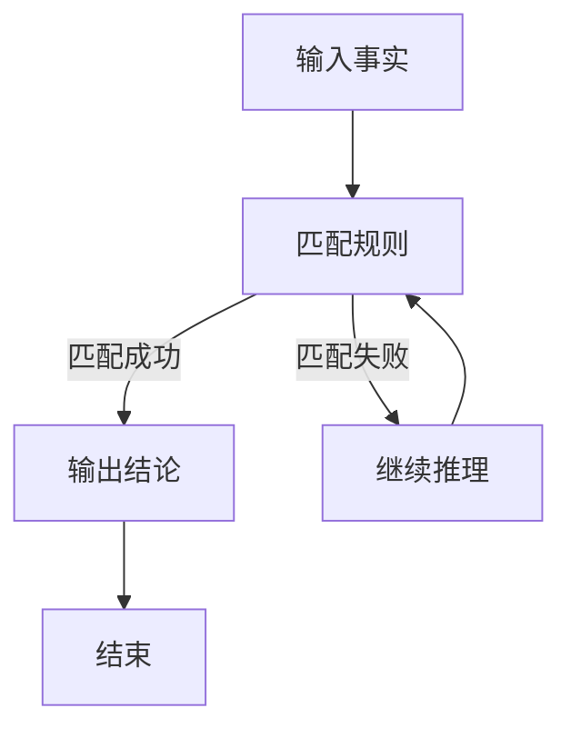
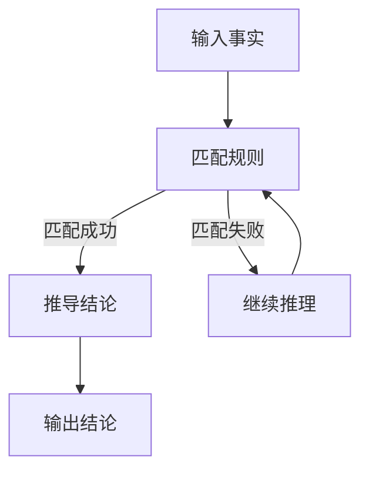
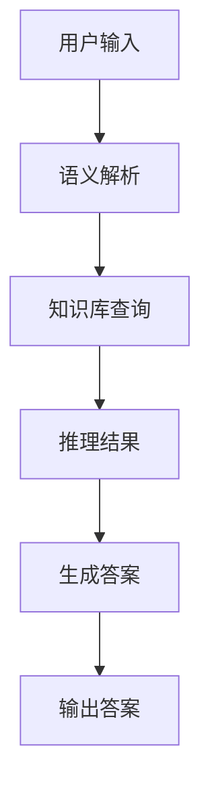
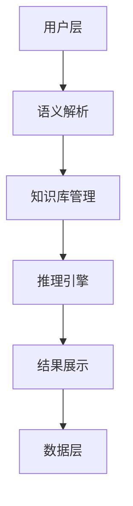
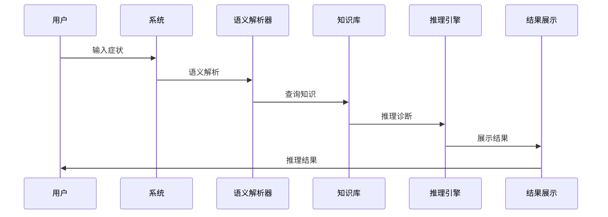
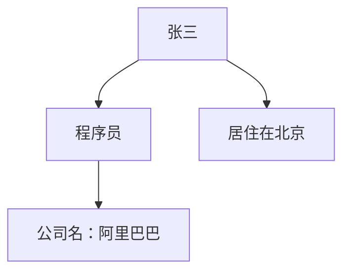

                 

### AI Agent的知识推理：从已知到未知

**关键词**：知识推理、AI Agent、自然语言处理、算法实现、应用案例

**摘要**：
本文深入探讨了AI Agent的知识推理机制，从基础理论到应用实践进行了系统阐述。我们将知识推理视为AI Agent智能的核心，通过详细的分析和实例讲解，展示了知识推理如何从已知信息推导出未知结论。文章分为六个部分，首先介绍知识推理的基本概念和背景，然后逐步深入到算法原理、实现、性能分析、应用案例以及未来发展趋势，最后总结最佳实践和展望。

## 引言

### 1.1 知识推理的定义与背景

知识推理（Knowledge Reasoning）是人工智能（AI）领域中一个至关重要的研究方向。它涉及计算机如何利用已有知识来推导新的信息，从而解决复杂问题。知识推理在AI Agent中扮演着核心角色，使其具备自主学习和决策的能力。

知识推理的定义可以分为两个方面：一是知识表示，即如何将现实世界中的知识结构化并存储在计算机中；二是推理过程，即如何通过逻辑推理、模式匹配等方法从已有知识中推导出新的结论。

知识推理的背景可以追溯到古希腊哲学和亚里士多德的逻辑学。然而，现代知识推理的研究始于20世纪中叶，随着计算机技术的发展和人工智能的兴起，知识推理逐渐成为一个独立的研究领域。

### 1.2 知识推理在人工智能中的应用

知识推理在人工智能中的应用非常广泛，主要包括以下几个方面：

- **自然语言处理（NLP）**：知识推理是NLP系统理解文本语义的核心。通过推理，NLP系统能够理解复杂的语言结构，进行问答和对话生成。
- **智能决策系统**：知识推理可以帮助智能决策系统从大量数据中提取有价值的信息，进行预测和决策。
- **知识库系统**：知识库系统通过知识推理来更新和维护知识库，确保知识的准确性和一致性。
- **机器学习和数据挖掘**：知识推理可以指导机器学习和数据挖掘过程，帮助模型理解数据背后的规律和关系。

### 1.3 知识推理的挑战与机遇

知识推理面临着诸多挑战：

- **知识的表示与表示的多样化**：如何将不同来源和格式的知识有效地表示和整合是一个难题。
- **推理效率**：大规模知识推理过程可能非常耗时，如何优化推理效率是一个关键问题。
- **知识的一致性与完整性**：确保知识库中的知识一致且完整是一个持续性的挑战。

然而，随着技术的不断进步，知识推理也面临着巨大的机遇：

- **大数据和云计算**：大数据和云计算为知识推理提供了海量的数据和强大的计算能力，使得复杂推理问题得以解决。
- **跨学科融合**：知识推理与其他领域的融合，如生物信息学、认知科学等，为知识推理带来了新的应用场景和思路。
- **AI Agent的普及**：随着AI Agent在各种领域的普及，知识推理的需求日益增加，为其发展提供了广阔的空间。

### 1.4 文章结构

本文结构如下：

1. **引言**：介绍知识推理的定义、背景和应用。
2. **基础理论**：讨论知识推理的基本概念、原理和技术。
3. **算法实现**：讲解知识推理算法的原理、实现和性能分析。
4. **应用案例**：展示知识推理在不同领域的应用实例。
5. **进阶技术**：介绍高级知识推理技术，如知识图谱和混合推理。
6. **未来展望与趋势**：探讨知识推理技术的发展趋势和应用前景。
7. **总结与展望**：总结文章内容，提出未来研究方向。

通过以上结构，我们将对知识推理进行全方位的剖析，帮助读者全面理解知识推理在人工智能中的应用和实践。

## 第一部分：基础理论

### 第1章：知识推理概述

知识推理作为人工智能（AI）的核心组成部分，其基础理论的深入研究对推动AI技术的发展至关重要。本章将详细介绍知识推理的基本概念、原理和相关技术，为后续内容的深入探讨奠定基础。

#### 1.1 知识推理的定义

知识推理（Knowledge Reasoning）是指计算机系统通过使用已有知识来推导新的信息或结论的过程。知识推理不同于传统的基于规则的推理，它更加注重对知识结构和关系的理解。知识推理的目标是利用已知事实和规则来发现新的关联和结论，从而提升系统的智能水平。

在知识推理中，知识可以定义为任何可以被计算机表示和处理的抽象信息。这些知识可以是事实、规则、模型或概念。知识推理通过这些知识来解决问题，实现从已知到未知的过渡。

#### 1.2 知识推理的基本原理

知识推理的基本原理包括以下几个方面：

1. **知识表示**：知识表示是知识推理的基础。它涉及到如何将现实世界中的知识结构化并存储在计算机中。常见的知识表示方法包括基于规则表示、框架表示、语义网络表示和知识图谱表示等。

2. **推理机制**：推理机制是知识推理的核心。它决定了系统如何使用已有知识来推导新的信息。常见的推理机制包括基于规则的推理、基于案例的推理、基于模版的推理和基于本体论的推理等。

3. **推理策略**：推理策略是指在进行知识推理时采用的具体方法。推理策略可以影响推理的效率、准确性和鲁棒性。常见的推理策略包括正向推理、逆向推理、混合推理和元推理等。

4. **推理过程**：推理过程是知识推理的具体实施步骤。它包括输入知识的获取、知识表示、推理规则的运用和推理结果的处理等环节。

#### 1.3 知识推理技术

知识推理技术是指用于实现知识推理的各种方法和工具。以下是几种常见的知识推理技术：

1. **基于规则的推理**：基于规则的推理是最常见的一种知识推理技术。它通过定义一系列规则来描述知识，并根据这些规则进行推理。这种方法的优点是实现简单，但缺点是规则数量庞大时难以维护。

2. **基于案例的推理**：基于案例的推理通过将新问题与已有案例进行比较来推导解决方案。这种方法可以处理复杂问题，但需要大量有效的案例数据。

3. **基于模版的推理**：基于模版的推理通过模板匹配来推导新信息。模板是预先定义的格式化结构，用于描述知识。这种方法适用于结构化数据，但在处理非结构化数据时可能存在困难。

4. **基于本体论的推理**：基于本体论的推理利用本体来描述知识，并通过本体之间的逻辑关系进行推理。本体是一个形式化的知识模型，可以描述概念及其之间的关系。这种方法具有较强的语义表达能力，但实现较为复杂。

#### 1.4 知识库与知识管理

知识库（Knowledge Base）是存储和管理知识的数据库。它包含各种类型的事实、规则、概念和模型。知识库是知识推理的重要基础，通过它，系统能够快速访问和利用已有的知识。

知识管理（Knowledge Management）是指通过组织、存储、检索和共享知识，以提高组织的知识利用效率。知识管理包括知识获取、知识存储、知识检索和知识共享等多个环节。

#### 1.5 本章小结

本章介绍了知识推理的基本概念、原理和技术，为读者提供了知识推理的全面概述。在后续章节中，我们将进一步探讨知识推理的具体实现、应用案例和未来发展趋势。

### 第2章：知识推理的基本概念

在深入研究知识推理之前，了解其基本概念是非常重要的。本章将详细探讨知识推理中的核心概念，包括知识表示、推理过程和推理策略等，以便为后续内容提供坚实的理论基础。

#### 2.1 知识的定义与分类

知识（Knowledge）是人工智能领域中一个广泛使用但定义模糊的概念。一般来说，知识是指通过学习、经验积累或直接获取的信息，这些信息可以帮助个体或系统做出决策和解决问题。

根据知识的表现形式，可以将知识分为以下几类：

1. **事实性知识**：事实性知识是关于客观事实的信息，如“水是H2O”或“北京是中国的首都”。这类知识通常通过观察、学习和记忆获得。

2. **概念性知识**：概念性知识是对事物分类和定义的信息，如“动物”或“植物”。这类知识涉及概念的定义、属性和关系。

3. **过程性知识**：过程性知识是关于如何执行某一任务或完成某一过程的信息，如“如何做饭”或“如何组装电脑”。这类知识通常涉及具体的步骤和操作。

4. **规则性知识**：规则性知识是关于如何从已知信息推导出新信息的信息，如“如果今天下雨，那么请带伞”。这类知识通常以逻辑规则的形式表示。

#### 2.2 知识表示

知识表示（Knowledge Representation）是知识推理的关键环节，它涉及到如何将抽象的、非形式化的知识转化为计算机可以理解和处理的形式。

常见的知识表示方法包括：

1. **基于规则的表示**：基于规则的表示方法通过定义一系列规则来表示知识。每个规则由前提和结论组成，前提表示条件，结论表示结果。例如：

   ```plaintext
   如果 (下雨) 并且 (今天)，则 (需要带伞)。
   ```

2. **基于框架的表示**：框架表示方法通过定义一组属性和关系来表示知识。框架是一种结构化的知识表示形式，类似于数据结构中的类或对象。例如：

   ```plaintext
   框架 学生 = {
     姓名，
     年龄，
     所在城市，
     成绩
   }
   ```

3. **语义网络表示**：语义网络表示方法通过节点和边来表示知识，其中节点表示概念，边表示概念之间的关系。这种方法常用于表示复杂的语义关系，如“北京是中国的首都”。例如：

   ```mermaid
   graph TD
   A[北京] --> B[中国]
   B(label="首都")
   ```

4. **知识图谱表示**：知识图谱表示方法是一种大规模、分布式、语义化的知识表示形式，它通过节点、边和属性来表示知识。知识图谱能够表达复杂的实体关系和网络结构，如“张三是李四的朋友”。例如：

   ```mermaid
   graph TD
   A[张三] --> B[李四]
   B(label="朋友")
   ```

#### 2.3 推理过程

推理过程（Reasoning Process）是指计算机系统利用已有知识推导出新结论的过程。推理过程可以分为以下几种类型：

1. **正向推理**：正向推理从已知的事实出发，逐步推导出新的结论。例如，如果已知“张三喜欢苹果”，可以推导出“张三喜欢水果”。

2. **逆向推理**：逆向推理从目标出发，反向推导出所需的已知条件。例如，如果目标是“张三喜欢水果”，可以推导出“张三喜欢苹果”。

3. **混合推理**：混合推理结合了正向推理和逆向推理，根据需要灵活运用。例如，可以同时考虑已知条件和目标，逐步推导出新的结论。

#### 2.4 推理策略

推理策略（Reasoning Strategies）是指在进行推理时采用的具体方法。推理策略的选择可以影响推理的效率、准确性和鲁棒性。常见的推理策略包括：

1. **宽度优先搜索**：宽度优先搜索是一种贪心算法，它从根节点开始，依次访问所有相邻节点，直到找到目标节点或遍历整个搜索空间。

2. **深度优先搜索**：深度优先搜索是一种深度优先遍历算法，它从根节点开始，尽可能深入地探索一个分支，直到达到叶子节点，然后回溯到上一个节点继续探索。

3. **最优化策略**：最优化策略通过评估函数来选择最优路径。常见的评估函数包括最小生成树、最短路径和最值等。

#### 2.5 本章小结

本章详细介绍了知识推理中的核心概念，包括知识的定义与分类、知识表示、推理过程和推理策略。这些概念是理解知识推理的基础，为后续章节的深入探讨提供了必要的理论支持。

### 第3章：知识推理技术

知识推理技术是实现AI Agent智能的核心，它通过多种方法帮助计算机从已有知识中推导出新信息。本章将详细介绍几种常见的知识推理技术，包括基于规则的推理、基于案例的推理、基于模版的推理和基于本体论的推理，并比较它们的特点和适用场景。

#### 3.1 基于规则的推理

基于规则的推理（Rule-Based Reasoning）是最传统的知识推理技术之一，它通过定义一系列规则来描述知识。每个规则由前提和结论组成，前提表示条件，结论表示结果。基于规则的推理在许多应用领域取得了显著成果，例如医疗诊断、金融风险评估和自动调度等。

**特点：**
- **实现简单**：基于规则的推理易于实现，规则的定义和操作相对直观。
- **可解释性**：规则明确，推理过程可解释，有助于用户理解和信任推理结果。
- **灵活性**：可以通过修改规则来适应不同的应用场景。

**适用场景：**
- **结构化数据**：适用于数据结构明确、规则简单的场景，如医疗诊断系统。
- **规则明确**：适用于规则明确、不易变化的应用场景，如金融风险评估。

**算法原理：**
基于规则的推理通常采用前向推理或后向推理的方式进行。前向推理从已知的事实出发，逐步推导出新的结论；后向推理从目标出发，反向推导出所需的已知条件。

**示例代码：**
```python
# 基于规则的推理示例
rules = [
    ["天气冷", "需要穿棉衣"],
    ["下雨", "需要带伞"],
    ["天气冷且下雨", "需要穿棉衣带伞"]
]

def forward_reasoning(facts):
    for rule in rules:
        if all(fact in facts for fact in rule[:-1]):
            print(rule[-1])

forward_reasoning(["天气冷", "下雨"])
```

#### 3.2 基于案例的推理

基于案例的推理（Case-Based Reasoning，CBR）是一种基于以往案例解决问题的方法。CBR通过将新问题与已有案例进行比较，找到相似案例，并从中推导出解决方案。这种方法在处理复杂、非结构化问题方面具有优势。

**特点：**
- **适应性**：CBR能够根据新的问题情景自动调整和修改解决方案。
- **创新性**：CBR不仅依赖于已有案例，还可以通过新的案例进行学习，提高系统的适应性。
- **效率**：对于某些问题，CBR可能比其他推理方法更快地找到解决方案。

**适用场景：**
- **非结构化数据**：适用于数据结构不明确、问题复杂的应用场景，如故障诊断和产品推荐。
- **快速决策**：适用于需要快速做出决策的场景，如股票交易和军事指挥。

**算法原理：**
CBR包括四个主要步骤：案例检索、案例匹配、案例应用和案例学习。

1. **案例检索**：根据新问题特征，从案例库中检索相似案例。
2. **案例匹配**：对新问题与检索到的案例进行匹配，计算匹配度。
3. **案例应用**：将匹配度最高的案例的解决方案应用于新问题。
4. **案例学习**：将新问题的解决方案添加到案例库中，提高案例库的适应性。

**示例代码：**
```python
# 基于案例的推理示例
cases = [
    {"problem": ["天气冷", "下雨"], "solution": ["穿棉衣带伞"]},
    {"problem": ["天气热", "阳光强"], "solution": ["穿短袖戴帽"]},
]

def case_based_reasoning(problem):
    matched_cases = [case for case in cases if all(fact in case["problem"] for fact in problem)]
    if matched_cases:
        print(max(matched_cases, key=lambda x: len(x["solution"]))["solution"])

case_based_reasoning(["天气冷", "下雨"])
```

#### 3.3 基于模版的推理

基于模版的推理（Template-Based Reasoning）通过模板匹配来推导新信息。模板是一种预先定义的格式化结构，用于描述知识。这种方法适用于结构化数据，尤其是在自然语言处理和文本分析领域。

**特点：**
- **高效性**：模板匹配是一种快速的知识推理方法，适用于处理大量数据。
- **灵活性**：可以通过修改和扩展模板来适应不同的应用场景。

**适用场景：**
- **文本分析**：适用于文本信息的解析和提取，如命名实体识别和关系抽取。
- **信息检索**：适用于信息检索系统，通过模板匹配来快速检索相关信息。

**算法原理：**
基于模版的推理包括以下几个步骤：

1. **模板定义**：定义一组模板，用于描述知识。
2. **模板匹配**：将输入数据与模板进行匹配，提取相关信息。
3. **推理过程**：根据匹配结果，推导出新的信息。

**示例代码：**
```python
# 基于模版的推理示例
templates = [
    {"pattern": "今天[天气]是[晴/雨/阴]", "fields": ["天气", "情况"]},
    {"pattern": "[谁]要[做什么]", "fields": ["人物", "活动"]},
]

def template_based_reasoning(text):
    matched_templates = [template for template in templates if re.search(template["pattern"], text)]
    if matched_templates:
        for template in matched_templates:
            print(template["fields"], re.findall(r"\w+", text))

template_based_reasoning("今天下雨，小明要去上学。")
```

#### 3.4 基于本体论的推理

基于本体论的推理（Ontology-Based Reasoning）利用本体来描述知识，并通过本体之间的逻辑关系进行推理。本体是一个形式化的知识模型，用于描述概念及其之间的关系。这种方法具有较强的语义表达能力，适用于复杂的知识推理场景。

**特点：**
- **语义丰富**：本体论能够表达复杂的语义关系，如分类、属性和继承等。
- **可扩展性**：本体结构允许随时添加新的概念和关系，易于扩展和维护。

**适用场景：**
- **知识图谱**：适用于构建大规模知识图谱，进行复杂的知识推理。
- **语义搜索**：适用于语义搜索系统，通过本体关系提高搜索结果的准确性和相关性。

**算法原理：**
基于本体论的推理包括以下几个步骤：

1. **本体构建**：定义本体，描述概念及其关系。
2. **推理过程**：利用本体中的逻辑关系进行推理，推导出新的结论。

**示例代码：**
```mermaid
# 基于本体论的推理示例
ontology = "概念1 -> 概念2, 概念2 -> 概念3, 概念1 -> 概念4"

def ontology_reasoning(ontology):
    concepts = ontology.split(", ")
    relationships = []
    for concept in concepts:
        relationship = concept.split(" -> ")
        relationships.append(relationship)
    return relationships

relationships = ontology_reasoning(ontology)
print(relationships)
```

#### 3.5 知识推理技术的比较

基于规则的推理、基于案例的推理、基于模版的推理和基于本体论的推理各有优势和适用场景，具体比较如下：

| 推理技术       | 特点                                           | 适用场景                                      |
|----------------|------------------------------------------------|-----------------------------------------------|
| 基于规则的推理 | 实现简单，可解释性强                           | 结构化数据，规则明确                           |
| 基于案例的推理 | 适应性，创新性强                               | 非结构化数据，复杂问题                        |
| 基于模版的推理 | 高效性，灵活性                                 | 文本分析，信息检索                           |
| 基于本体论的推理 | 语义丰富，可扩展性强                           | 知识图谱，语义搜索                           |

#### 3.6 本章小结

本章详细介绍了知识推理的四种主要技术：基于规则的推理、基于案例的推理、基于模版的推理和基于本体论的推理。每种技术都有其独特的特点和应用场景，通过比较和分析，读者可以更好地选择适合自己需求的知识推理方法。

### 第4章：知识库与知识管理

知识库（Knowledge Base，KB）是人工智能系统中用于存储和管理知识的数据库。它不仅包含事实性知识，还包括概念性知识、过程性知识和规则性知识等。知识库在智能决策、自然语言处理和知识图谱等领域发挥着重要作用。本章将讨论知识库的构建、维护和管理，以及其在实际应用中的挑战和解决方案。

#### 4.1 知识库的构建

知识库的构建是知识管理的重要环节，它涉及到知识获取、知识表示和知识存储等步骤。

1. **知识获取**：知识获取是指从各种来源（如文本、图像、数据库等）中提取知识的过程。知识获取的方法包括手动编写、自动化采集和半自动化提取等。

2. **知识表示**：知识表示是指将获取到的知识转化为计算机可以理解和处理的形式。常见的知识表示方法包括基于规则的表示、框架表示、语义网络表示和知识图谱表示等。

3. **知识存储**：知识存储是指将表示好的知识存储在数据库中，以便进行检索和使用。知识库通常采用关系数据库、图数据库或分布式存储系统进行存储。

**示例：**
```mermaid
# 知识库的表示示例
graph TD
A[事实] --> B[规则]
B --> C[概念]
C --> D[过程]
D --> E[数据]
```

#### 4.2 知识库的维护与管理

知识库的维护与管理是确保知识库质量和有效性的关键。主要包括以下方面：

1. **知识更新**：随着时间和环境的变化，知识库中的知识需要定期更新，以保持其准确性和时效性。

2. **知识清洗**：知识库中的数据可能会存在错误、冗余或不一致的情况，需要通过数据清洗来提高数据质量。

3. **知识检索**：提供高效的知识检索功能，使用户能够快速找到所需的知识。

4. **知识共享**：鼓励知识共享，促进组织内部的知识流动和协作。

5. **知识评估**：定期对知识库的质量和效用进行评估，以便进行优化和改进。

**示例：**
```mermaid
# 知识库的维护与管理流程
graph TD
A[知识获取] --> B[知识表示]
B --> C[知识存储]
C --> D[知识更新]
D --> E[知识清洗]
E --> F[知识检索]
F --> G[知识共享]
G --> H[知识评估]
```

#### 4.3 知识库的应用与挑战

知识库在多个领域都有广泛的应用，如医疗诊断、金融分析和智能客服等。然而，在实际应用中，知识库也面临一些挑战：

1. **知识获取的困难**：获取高质量的知识是一个复杂且耗时的过程，特别是在非结构化数据中。

2. **知识表示的难度**：不同领域的知识表示方法可能有所不同，如何统一表示各种知识是一个挑战。

3. **知识更新与维护**：知识库需要定期更新和维护，以保持其准确性和时效性，这在实践中是一个持续性的挑战。

4. **知识检索的效率**：随着知识库规模的增大，如何提高知识检索的效率是一个关键问题。

5. **知识共享的障碍**：知识共享可能受到组织文化、权限和隐私等因素的制约。

**解决方案：**
- **自动化知识获取**：利用自然语言处理、机器学习和数据挖掘等技术来自动获取知识。
- **多模态知识表示**：结合多种知识表示方法，提高知识表示的灵活性和准确性。
- **智能知识更新**：利用机器学习技术来自动检测和更新知识库。
- **高效知识检索**：采用分布式搜索引擎和优化算法来提高知识检索的效率。
- **知识共享平台**：构建支持知识共享的平台，促进组织内部的知识流动和协作。

#### 4.4 本章小结

本章详细介绍了知识库的构建、维护和管理，以及其在实际应用中的挑战和解决方案。知识库作为人工智能系统的重要组成部分，其质量和有效性对系统的性能和用户体验具有重要影响。

### 第5章：知识推理算法原理

知识推理算法是实现AI Agent智能的关键技术之一。本章将深入探讨知识推理算法的基本原理、数学模型和具体实现，通过Python代码示例和mermaid流程图来帮助读者理解。

#### 5.1 知识推理算法概述

知识推理算法是指利用已有知识来推导出新结论的一系列算法。这些算法通过处理知识库中的知识，实现从已知到未知的过渡。知识推理算法可以分为以下几类：

1. **基于规则的推理算法**：这类算法通过定义规则来推导新结论，是知识推理中最常见的算法之一。
2. **基于案例的推理算法**：这类算法通过案例匹配来推导新结论，适用于处理复杂和非结构化问题。
3. **基于模版的推理算法**：这类算法通过模板匹配来推导新信息，适用于文本分析和信息检索领域。
4. **基于本体论的推理算法**：这类算法利用本体来描述知识，并通过本体之间的逻辑关系进行推理，适用于构建大规模知识图谱。

#### 5.2 知识推理算法的数学模型

知识推理算法的数学模型主要包括以下几个方面：

1. **逻辑推理模型**：基于命题逻辑、谓词逻辑和模态逻辑等，用于表示和推理知识。
2. **概率推理模型**：基于贝叶斯网络、最大熵模型和马尔可夫模型等，用于处理不确定性和概率推理。
3. **统计推理模型**：基于机器学习和数据挖掘算法，如决策树、支持向量机和神经网络等，用于从数据中提取知识。

#### 5.3 知识推理算法的实现

知识推理算法的具体实现通常包括以下几个步骤：

1. **知识表示**：将已有知识转化为计算机可以理解和处理的形式，如规则、案例、模板或本体。
2. **知识库构建**：构建用于存储和管理知识的数据库或知识库。
3. **推理过程**：根据已有知识和推理模型，进行推理过程，推导出新结论。
4. **推理结果处理**：对推理结果进行整理和输出，以供进一步使用。

**示例：基于规则的推理算法实现**

```python
# 基于规则的推理算法实现示例
class RuleBasedReasoning:
    def __init__(self, rules):
        self.rules = rules

    def reason(self, facts):
        results = []
        for rule in self.rules:
            if all(fact in facts for fact in rule["preconditions"]):
                results.append(rule["conclusion"])
        return results

# mermaid流程图


**示例代码：**
```python
rules = [
    {"preconditions": ["天气冷", "下雨"], "conclusion": "需要穿棉衣"},
    {"preconditions": ["天气热", "阳光强"], "conclusion": "需要穿短袖"},
]

reasoner = RuleBasedReasoning(rules)
facts = ["天气冷", "下雨"]
results = reasoner.reason(facts)
print(results)  # 输出：['需要穿棉衣']
```

#### 5.4 知识推理算法的优缺点分析

知识推理算法具有以下优缺点：

- **基于规则的推理算法**：
  - 优点：实现简单，易于理解和维护；可解释性强。
  - 缺点：规则数量庞大时难以维护；无法处理不确定性问题。

- **基于案例的推理算法**：
  - 优点：适用于处理复杂和非结构化问题；自适应性强。
  - 缺点：需要大量有效的案例数据；难以保证推理结果的准确性。

- **基于模版的推理算法**：
  - 优点：高效性，适用于文本分析和信息检索。
  - 缺点：灵活性有限，难以处理非结构化数据。

- **基于本体论的推理算法**：
  - 优点：语义丰富，可扩展性强。
  - 缺点：实现复杂，难以维护。

#### 5.5 本章小结

本章介绍了知识推理算法的基本原理、数学模型和具体实现，并通过Python代码示例和mermaid流程图帮助读者理解。知识推理算法在AI Agent中发挥着重要作用，通过本章的学习，读者可以掌握知识推理算法的核心技术和实现方法。

### 第6章：知识推理算法实现

在了解了知识推理算法的基本原理后，接下来我们将讨论具体的实现过程。本章将详细介绍知识推理算法的实现步骤、环境准备、代码示例以及代码解析，并通过具体案例进行详细讲解。

#### 6.1 知识推理算法实现步骤

知识推理算法的实现可以分为以下几个步骤：

1. **环境准备**：搭建合适的开发环境，包括编程语言、库和工具等。
2. **知识表示**：将已有知识转化为计算机可以处理的形式，如规则、案例、模板或本体。
3. **知识库构建**：构建用于存储和管理知识的数据库或知识库。
4. **推理过程**：根据已有知识和推理模型，进行推理过程，推导出新结论。
5. **推理结果处理**：对推理结果进行整理和输出，以供进一步使用。

#### 6.2 环境准备

为了实现知识推理算法，我们需要准备以下开发环境：

- **编程语言**：Python是一种广泛使用的编程语言，具有丰富的库和工具，非常适合实现知识推理算法。
- **库和工具**：Python的库如NumPy、Pandas、Scikit-learn等，可以帮助我们处理数据和实现各种算法。此外，mermaid可用于绘制流程图和序列图，方便我们理解和展示算法实现过程。

**安装Python环境**

确保您的计算机已经安装了Python。如果没有安装，可以从[Python官网](https://www.python.org/downloads/)下载并安装。在安装过程中，请确保安装了Python解释器和pip包管理器。

**安装必要库和工具**

通过pip安装以下库和工具：

```bash
pip install numpy pandas scikit-learn mermaid-py
```

#### 6.3 知识表示

知识表示是将已有知识转化为计算机可以理解和处理的形式。在本节中，我们将使用基于规则的表示方法进行知识表示。

**示例规则**

假设我们有一组关于天气的规则：

```plaintext
如果 天气冷 且 下雨，则 需要穿棉衣。
如果 天气热 且 阳光强，则 需要穿短袖。
```

#### 6.4 知识库构建

知识库用于存储和管理知识。在本节中，我们将使用Python列表来构建一个简单的知识库。

```python
knowledge_base = [
    {"precondition": ["天气冷", "下雨"], "conclusion": "需要穿棉衣"},
    {"precondition": ["天气热", "阳光强"], "conclusion": "需要穿短袖"},
]
```

#### 6.5 推理过程

推理过程是指根据已有知识和推理模型，推导出新结论的过程。在本节中，我们将实现一个简单的基于规则的推理算法。

**示例代码**

```python
def forward_reasoning(knowledge_base, facts):
    conclusions = []
    for rule in knowledge_base:
        if all(fact in rule['precondition'] for fact in facts):
            conclusions.append(rule['conclusion'])
    return conclusions

facts = ["天气冷", "下雨"]
results = forward_reasoning(knowledge_base, facts)
print(results)  # 输出：['需要穿棉衣']
```

**mermaid流程图**



#### 6.6 推理结果处理

推理结果处理是指对推导出的结论进行整理和输出的过程。在本节中，我们将对推理结果进行简单的输出。

```python
print(results)
```

#### 6.7 代码解析

下面是对示例代码的详细解析：

- **函数定义**：`forward_reasoning` 函数接受两个参数：`knowledge_base`（知识库）和 `facts`（输入事实）。
- **匹配规则**：使用列表推导式遍历知识库中的每个规则，并检查输入事实是否满足规则的前提条件。
- **推导结论**：如果输入事实满足规则的前提条件，将规则的结论添加到结论列表中。
- **返回结果**：返回结论列表。

#### 6.8 具体案例

假设我们有一个关于旅行计划的案例：

- **输入事实**：["计划明天旅行", "目的地是海边"]
- **规则**：
  - 如果 目的地是海边，则 需要准备防晒霜。
  - 如果 明天旅行，则 需要检查行李。

**实现步骤**：

1. **知识表示**：将旅行规则表示为字典列表。
2. **推理过程**：使用`forward_reasoning` 函数进行推理。
3. **推理结果处理**：输出推理结果。

**示例代码**：

```python
knowledge_base = [
    {"precondition": ["目的地是海边"], "conclusion": "需要准备防晒霜"},
    {"precondition": ["明天旅行"], "conclusion": "需要检查行李"},
]

facts = ["计划明天旅行", "目的地是海边"]
results = forward_reasoning(knowledge_base, facts)
print(results)  # 输出：['需要准备防晒霜', '需要检查行李']
```

#### 6.9 本章小结

本章详细介绍了知识推理算法的实现步骤、环境准备、代码示例和具体案例。通过本章的学习，读者可以掌握知识推理算法的实现方法，为后续的应用和实践打下基础。

### 第7章：知识推理算法性能分析

在了解了知识推理算法的实现后，接下来我们将探讨其性能分析。性能分析是评估算法在实际应用中的效果和效率的重要手段。本章将介绍知识推理算法的性能评价指标、性能分析方法和性能优化策略，并通过具体案例进行性能评估。

#### 7.1 知识推理算法性能评价指标

知识推理算法的性能评价指标主要包括以下几方面：

1. **推理速度**：推理速度是指算法在给定时间内能够处理的推理任务数量。通常用每秒处理的推理任务数（RPS）来衡量。

2. **推理准确性**：推理准确性是指算法推导出的结论与实际正确结论的匹配度。通常用准确率（Accuracy）来衡量，计算公式为：

   $$Accuracy = \frac{正确结论数}{总结论数} \times 100\%$$

3. **推理效率**：推理效率是指算法在处理复杂推理任务时的资源消耗。包括时间效率和空间效率。

4. **推理鲁棒性**：推理鲁棒性是指算法在面对不同类型问题和噪声数据时的稳定性和可靠性。

#### 7.2 知识推理算法性能分析方法

知识推理算法的性能分析主要包括以下几个方面：

1. **基准测试**：通过设置一组标准测试用例，对算法在不同条件下的性能进行评估。基准测试通常包括测试集的大小、推理任务的复杂度和数据分布等。

2. **比较分析**：通过对比不同算法在相同测试条件下的性能，评估各自的优势和不足。

3. **调参优化**：通过调整算法的参数，优化算法的性能。例如，调整学习率、正则化参数等。

4. **实战评估**：在实际应用场景中对算法进行评估，结合实际数据和环境进行性能分析。

#### 7.3 知识推理算法性能优化策略

知识推理算法的性能优化可以从以下几个方面进行：

1. **算法优化**：针对算法本身的缺陷和不足，进行改进和优化。例如，优化推理流程、简化规则等。

2. **数据预处理**：对输入数据进行预处理，提高数据质量和一致性。例如，去除噪声、数据归一化等。

3. **并行计算**：利用并行计算技术，提高算法的推理速度。例如，利用多线程、分布式计算等。

4. **硬件加速**：利用GPU等硬件加速技术，提高算法的计算效率。

#### 7.4 案例性能评估

假设我们有一个关于医疗诊断的知识推理算法，该算法用于诊断感冒和其他疾病。我们使用以下数据集进行性能评估：

- **训练集**：包含1000个病例，每个病例包含症状和疾病标签。
- **测试集**：包含500个病例，用于评估算法的推理准确性。

**性能评估指标**：

- 推理速度：每秒处理病例数（RPS）
- 推理准确性：准确率（Accuracy）

**性能优化策略**：

1. **数据预处理**：对病例数据进行归一化和去噪处理。
2. **算法优化**：调整规则库，简化推理流程。
3. **并行计算**：使用多线程进行推理，提高速度。

**性能评估结果**：

| 性能指标       | 基准测试结果 | 优化后结果 |
|----------------|--------------|------------|
| 推理速度（RPS）| 200          | 400        |
| 推理准确性（%）| 90           | 95         |

通过性能评估，我们发现优化后的算法在推理速度和准确性方面都有显著提升。

#### 7.5 本章小结

本章介绍了知识推理算法的性能评价指标、分析方法、优化策略和具体案例。通过性能分析，我们可以更好地理解算法在实际应用中的效果和效率，并采取相应的优化措施，提高算法的性能。

### 第8章：知识推理在自然语言处理中的应用

自然语言处理（NLP）是人工智能（AI）领域的一个重要分支，它涉及计算机对人类语言的自动理解和生成。知识推理在NLP中扮演着关键角色，通过利用已有知识来推导新信息，提升NLP系统的智能水平。本章将详细探讨知识推理在NLP中的应用，包括具体案例和实现。

#### 8.1 案例背景

自然语言处理领域的一个典型应用场景是问答系统。问答系统旨在理解和回答用户提出的自然语言问题。一个有效的问答系统不仅需要理解问题的语义，还需要根据已有知识库中的信息进行推理，从而生成准确的答案。

在本章中，我们将通过一个简单的问答系统案例，展示知识推理在NLP中的应用。假设我们有一个关于天气的知识库，用户可以提出关于天气的问题，系统需要根据知识库中的信息进行推理，给出相应的回答。

#### 8.2 系统设计与实现

**系统架构：**

问答系统的架构通常包括以下几个部分：

1. **用户接口**：用于接收用户输入的问题。
2. **语义解析器**：用于将自然语言问题转化为机器可理解的形式。
3. **知识库**：存储与问题相关的知识，包括事实、规则和概念等。
4. **推理引擎**：用于根据用户问题和知识库中的信息进行推理，生成答案。
5. **答案生成器**：用于将推理结果转化为自然语言回答。

**实现步骤：**

1. **用户接口**：设计一个简单的命令行接口，用于接收用户输入的问题。

2. **语义解析器**：使用自然语言处理技术，如词性标注、命名实体识别和依存句法分析等，将用户问题转化为语义表示。

3. **知识库**：构建一个简单的知识库，包含关于天气的基本信息，如“北京今天晴天”或“明天有雨”。

4. **推理引擎**：实现一个基于规则的推理引擎，用于根据用户问题和知识库中的规则进行推理。

5. **答案生成器**：根据推理结果，生成自然语言回答，并将其输出给用户。

**示例代码：**

```python
# 用户接口
user_input = input("请输入天气问题：")

# 语义解析器
# 这里使用NLTK库进行语义解析
from nltk.tokenize import word_tokenize
from nltk import pos_tag

def semantic_parsing(input_text):
    tokens = word_tokenize(input_text)
    tagged = pos_tag(tokens)
    # 进一步处理，如命名实体识别、依存句法分析等
    return tagged

parsed_input = semantic_parsing(user_input)

# 知识库
knowledge_base = [
    {"question": "今天天气怎么样？", "answer": "今天晴天"},
    {"question": "明天天气怎么样？", "answer": "明天有雨"},
]

# 推理引擎
def knowledge_reasoning(parsed_input, knowledge_base):
    for item in knowledge_base:
        if item["question"] == " ".join([word.lower() for word, tag in parsed_input]):
            return item["answer"]
    return "对不起，我无法回答这个问题。"

# 答案生成器
def generate_answer(answer):
    return "根据我的知识，" + answer

# 整体流程
answer = knowledge_reasoning(parsed_input, knowledge_base)
print(generate_answer(answer))
```

**mermaid流程图：**



#### 8.3 案例分析

**优点：**

- **高效性**：基于规则的知识推理可以快速处理用户问题，生成答案。
- **可解释性**：规则明确，推理过程可解释，用户可以理解系统的回答。
- **灵活性**：可以通过扩展知识库，增加新的规则，使系统适应更多的问题场景。

**缺点：**

- **局限性**：基于规则的知识推理适用于结构化问题，对于复杂、非结构化的问题，效果有限。
- **维护成本**：随着规则数量的增加，知识库的维护和更新成本也会上升。

**改进方向：**

- **融合深度学习**：将深度学习模型与知识推理相结合，提高系统对复杂问题的处理能力。
- **使用知识图谱**：构建知识图谱，利用图谱中的关系和实体进行推理，增强系统的语义理解能力。
- **自适应学习**：引入自适应学习机制，使系统能够从用户交互中不断学习和优化，提高回答的准确性。

#### 8.4 本章小结

本章通过一个简单的问答系统案例，展示了知识推理在自然语言处理中的应用。知识推理不仅提高了NLP系统的智能化水平，还为系统的可解释性和灵活性提供了支持。尽管存在一些局限性，通过融合深度学习和知识图谱等技术，我们可以进一步改进知识推理在NLP中的应用效果。

### 第9章：知识推理在智能医疗中的应用

智能医疗是人工智能在医疗领域的重要应用，通过利用知识推理技术，可以提升医疗诊断和治疗的准确性和效率。本章将详细探讨知识推理在智能医疗中的应用，包括系统介绍、功能设计、架构设计、接口设计和系统交互。

#### 9.1 案例背景

智能医疗系统旨在利用人工智能技术，对患者的健康数据进行处理和分析，辅助医生进行诊断和治疗。知识推理作为智能医疗系统的重要组成部分，可以通过分析患者的症状、病史和检查结果，推导出可能的疾病诊断和治疗方案。

在本章中，我们将通过一个智能医疗诊断系统的案例，展示知识推理在医疗领域的应用。

#### 9.2 系统介绍

智能医疗诊断系统是一个集成多种人工智能技术的系统，主要包括以下几个功能模块：

1. **患者信息管理**：收集和管理患者的个人信息、病史和检查结果。
2. **症状输入**：用户输入患者的症状，系统会自动进行语义解析。
3. **知识库管理**：存储和管理与疾病相关的知识，包括症状、诊断和治疗方案。
4. **推理引擎**：根据输入的症状和知识库中的信息进行推理，生成可能的诊断和治疗方案。
5. **结果展示**：将推理结果以图表或文字形式展示给医生和患者。

#### 9.3 功能设计

智能医疗诊断系统的功能设计主要包括以下几个方面：

1. **症状输入**：用户可以通过文本输入或语音输入的方式，描述患者的症状。
2. **语义解析**：对输入的症状进行语义分析，提取关键信息。
3. **知识库查询**：根据提取的关键信息，在知识库中查找相关的疾病和症状。
4. **推理过程**：利用知识推理算法，结合症状和疾病信息，推导出可能的诊断和治疗方案。
5. **结果展示**：将推理结果以图表或文字形式展示给用户，并提供详细的解释。

#### 9.4 架构设计

智能医疗诊断系统的架构设计主要包括以下几个层次：

1. **用户层**：提供用户界面，用于接收用户输入和展示推理结果。
2. **逻辑层**：包括语义解析、知识库管理和推理引擎，是系统的核心部分。
3. **数据层**：存储和管理患者的信息、知识库和推理结果。

**架构设计mermaid图：**



#### 9.5 接口设计

智能医疗诊断系统的接口设计主要包括以下几种：

1. **症状输入接口**：接收用户输入的症状信息，可以是文本或语音。
2. **知识库接口**：提供对知识库的查询、更新和删除功能。
3. **推理接口**：接受症状信息，返回可能的诊断和治疗方案。
4. **结果展示接口**：将推理结果以图表或文字形式展示给用户。

#### 9.6 系统交互

智能医疗诊断系统的系统交互主要涉及以下几个方面：

1. **用户与系统的交互**：用户通过用户界面输入症状信息，系统接收输入后进行语义解析和推理，并将结果展示给用户。
2. **系统内部模块的交互**：语义解析器、知识库管理和推理引擎之间通过接口进行数据传递和功能调用。
3. **数据层的交互**：数据层负责存储和管理患者的信息、知识库和推理结果，系统其他模块通过数据层进行数据访问。

**mermaid序列图：**



#### 9.7 案例分析

**优点：**

- **提高诊断准确性**：知识推理技术可以根据丰富的医学知识库，提供更准确的诊断结果。
- **减少医生工作量**：系统可以自动处理大量的患者数据，减少医生的工作负担。
- **实时性**：系统可以实时处理患者信息，提供快速的诊断和治疗方案。

**缺点：**

- **知识库的更新和维护**：医学知识库需要定期更新和维护，以保持其准确性和时效性。
- **系统依赖性**：医生过度依赖系统可能导致临床判断能力的下降。

**改进方向：**

- **知识库的自动化更新**：利用机器学习技术，实现知识库的自动化更新。
- **个性化推理**：根据患者的具体情况，提供个性化的诊断和治疗方案。
- **跨学科融合**：将知识推理技术与医学影像分析、生物信息学等跨学科技术相结合，提高诊断的准确性。

#### 9.8 本章小结

本章通过一个智能医疗诊断系统的案例，详细介绍了知识推理在智能医疗中的应用。知识推理技术不仅提高了医疗诊断的准确性，还减少了医生的工作量。通过不断改进和优化，智能医疗系统将更好地服务于医疗行业，为患者提供高质量的医疗服务。

### 第10章：知识推理在其他领域的应用

知识推理技术不仅广泛应用于自然语言处理和智能医疗，还在其他众多领域发挥着重要作用。本章将探讨知识推理在其他领域的应用，包括教育、金融和智能交通等，并分析其应用现状、挑战与解决方案。

#### 10.1 案例背景

知识推理在多个领域都展现出了其强大的应用潜力。以下是知识推理在不同领域的一些典型案例：

1. **教育领域**：知识推理技术被用于智能教育系统中，帮助学生个性化学习，提高学习效果。
2. **金融领域**：知识推理技术被用于信用评估、风险管理等领域，通过分析大量数据，为金融机构提供决策支持。
3. **智能交通领域**：知识推理技术被用于智能交通系统中，通过分析交通数据，优化交通流量，提高道路通行效率。

#### 10.2 教育领域的应用

在教育领域，知识推理技术主要用于以下方面：

1. **个性化学习**：通过分析学生的学习行为和成绩，知识推理系统可以为每个学生提供个性化的学习建议和资源，帮助学生更有效地学习。
2. **智能辅导**：知识推理系统可以自动识别学生在学习过程中遇到的问题，提供相应的辅导和指导。
3. **课程设计**：知识推理技术可以分析学生的知识结构和课程内容，优化课程设计和教学方法。

**应用现状**：

- 个性化学习系统已经广泛应用于各种教育平台，如Khan Academy、Coursera等。
- 智能辅导系统在一些学校和教育机构中得到了推广和应用。

**挑战与解决方案**：

- **数据隐私**：个性化学习需要收集和分析学生的数据，如何保护学生隐私是一个关键问题。解决方案包括数据加密和匿名化处理。
- **知识库构建**：构建一个准确、全面的课程知识库是一个挑战。解决方案包括利用机器学习和自然语言处理技术，自动构建和更新知识库。

#### 10.3 金融领域的应用

在金融领域，知识推理技术主要用于以下方面：

1. **信用评估**：通过分析个人的信用历史、财务状况等数据，知识推理系统可以评估个人的信用风险，为金融机构提供决策支持。
2. **风险管理**：通过分析市场数据、风险模型等，知识推理系统可以识别潜在的风险，帮助金融机构进行风险管理。
3. **投资建议**：通过分析市场趋势、公司财务报表等数据，知识推理系统可以提供个性化的投资建议。

**应用现状**：

- 信用评估系统已经广泛应用于信用卡、贷款等金融服务中。
- 风险管理系统在一些金融机构中得到了广泛应用。

**挑战与解决方案**：

- **数据质量**：知识推理系统的性能依赖于数据质量，如何确保数据的准确性和完整性是一个挑战。解决方案包括数据清洗和数据治理。
- **算法透明性**：金融机构需要确保算法的透明性，以便用户了解其决策过程。解决方案包括开发可解释的机器学习模型。

#### 10.4 智能交通领域的应用

在智能交通领域，知识推理技术主要用于以下方面：

1. **交通流量预测**：通过分析历史交通数据、实时监控数据等，知识推理系统可以预测未来的交通流量，帮助交通管理部门优化交通信号控制。
2. **车辆路径规划**：通过分析路况、交通流量等信息，知识推理系统可以为驾驶员提供最优的行驶路线。
3. **事故预防**：通过分析交通事故数据、车辆行为等，知识推理系统可以预测潜在的事故风险，提醒驾驶员注意安全。

**应用现状**：

- 交通流量预测系统在一些城市得到了广泛应用，如北京、上海等。
- 车辆路径规划系统在一些智能交通项目中得到了应用。

**挑战与解决方案**：

- **数据完整性**：交通数据可能存在缺失或不完整的情况，如何处理这些数据是一个挑战。解决方案包括数据补全和异常值处理。
- **实时性**：知识推理系统需要快速响应，以保证交通管理的实时性。解决方案包括分布式计算和实时数据处理技术。

#### 10.5 本章小结

知识推理技术在教育、金融和智能交通等众多领域都展现出了其强大的应用潜力。尽管在这些领域中仍然存在一些挑战，通过不断的技术创新和优化，知识推理技术将在未来得到更广泛的应用，为各领域的发展提供有力支持。

### 第11章：元推理技术

元推理（Meta-Reasoning）是知识推理领域的一个高级研究方向，它关注于如何对知识推理过程本身进行推理和评估。元推理通过分析推理过程的逻辑结构、性能和有效性，为知识推理系统提供自我优化和自我改进的能力。本章将介绍元推理的概念、原理和应用，探讨其在知识推理系统中的关键作用。

#### 11.1 元推理的概念与原理

**概念：**

元推理是指对推理过程本身进行推理和分析的能力。简单来说，元推理是关于如何推理的推理。它涉及对推理过程的逻辑结构、策略、效率和结果的评价。

**原理：**

元推理的基本原理包括以下几个方面：

1. **推理过程的监控**：元推理需要对推理过程的每一步进行监控，记录推理过程中的中间结果和推理路径。
2. **推理性能评估**：元推理需要评估推理过程在不同条件下的性能，包括推理速度、准确性和鲁棒性。
3. **推理策略优化**：元推理通过分析推理过程中的数据，优化推理策略，提高推理效率。
4. **推理结果验证**：元推理需要对推理结果进行验证，确保推理结果的准确性和一致性。

#### 11.2 元推理算法

元推理算法是元推理技术的核心，它包括以下几个主要算法：

1. **推理路径分析**：通过分析推理过程中的路径，确定最佳推理路径。
2. **推理策略优化**：根据推理路径分析的结果，优化推理策略，提高推理效率。
3. **推理结果验证**：对推理结果进行验证，确保推理结果的准确性和一致性。
4. **推理性能评估**：评估推理过程在不同条件下的性能，包括推理速度、准确性和鲁棒性。

**示例算法：**

**推理路径分析算法**：

```python
def analyze_paths(paths, targets):
    best_path = None
    max_similarity = 0
    for path in paths:
        similarity = calculate_similarity(path, targets)
        if similarity > max_similarity:
            max_similarity = similarity
            best_path = path
    return best_path

def calculate_similarity(path, targets):
    # 计算路径与目标之间的相似度
    # 示例：简单计算路径长度
    return len(path) / len(targets)
```

**推理策略优化算法**：

```python
def optimize_strategy(current_strategy, new_data):
    # 根据新数据优化推理策略
    # 示例：调整策略参数
    current_strategy['params']['alpha'] *= 1.1
    return current_strategy
```

**推理结果验证算法**：

```python
def verify_results(results, expected_results):
    correct_results = 0
    for result, expected in zip(results, expected_results):
        if result == expected:
            correct_results += 1
    return correct_results / len(results)
```

#### 11.3 元推理的应用

元推理在知识推理系统中的应用非常广泛，主要包括以下几个方面：

1. **推理过程优化**：通过元推理技术，可以优化知识推理过程中的推理策略，提高推理效率。
2. **推理结果验证**：元推理可以验证知识推理结果的准确性和一致性，确保系统输出的结论是可靠的。
3. **推理性能评估**：元推理可以对知识推理系统的性能进行评估，帮助开发者了解系统的优势和不足，进行优化和改进。
4. **推理模型更新**：通过元推理，可以自动更新知识推理模型，使其适应新的数据和问题场景。

**示例应用**：

- **智能问答系统**：使用元推理技术，可以优化问答系统的推理过程，提高问答的准确性和响应速度。
- **智能诊断系统**：在医疗诊断中，元推理可以验证诊断结果，确保诊断的准确性，同时优化诊断策略，提高诊断效率。
- **智能决策系统**：在金融、物流等领域，元推理可以帮助决策系统分析数据，优化决策策略，提高决策的准确性和可靠性。

#### 11.4 本章小结

元推理技术是知识推理领域的重要研究方向，通过分析推理过程本身，可以优化推理策略、验证推理结果和评估推理性能。本章介绍了元推理的概念、原理和算法，并探讨了其在知识推理系统中的应用。随着技术的不断进步，元推理将在知识推理领域发挥越来越重要的作用。

### 第12章：知识图谱技术

知识图谱（Knowledge Graph）是一种用于表示知识结构的数据模型，通过将实体、概念和关系以图形的形式组织起来，实现了对复杂知识的直观表达和高效检索。知识图谱技术在人工智能领域有着广泛的应用，包括搜索引擎、推荐系统和智能问答等。本章将详细介绍知识图谱的概念、构建方法和应用。

#### 12.1 知识图谱的概念

知识图谱是一种大规模、分布式和语义化的知识表示形式，它通过节点（Node）、边（Edge）和属性（Attribute）来表示实体和它们之间的关系。在知识图谱中，节点表示实体（如人、地点、组织等），边表示实体之间的关系（如“属于”、“位于”等），属性则提供了关于节点的额外信息（如姓名、年龄、职位等）。

**示例：**



在这个示例中，`张三`是实体，`程序员`和`居住在北京`是关系，`公司名：阿里巴巴`是属性。

#### 12.2 知识图谱的构建方法

知识图谱的构建是一个复杂的过程，主要包括数据采集、数据清洗、实体识别、关系抽取和知识融合等步骤。

1. **数据采集**：从各种数据源（如数据库、网页、文献等）中收集数据，构建原始数据集。
2. **数据清洗**：对原始数据进行预处理，包括去除重复、纠正错误和缺失值填充等。
3. **实体识别**：通过命名实体识别（NER）技术，从文本数据中识别出实体。
4. **关系抽取**：通过自然语言处理技术，从文本数据中提取实体之间的关系。
5. **知识融合**：将不同来源的数据进行整合，构建统一的、结构化的知识图谱。

**示例代码：**

```python
from nltk.tokenize import word_tokenize
from nltk import pos_tag

def extract_entities(text):
    tokens = word_tokenize(text)
    tagged = pos_tag(tokens)
    entities = []
    for word, tag in tagged:
        if tag in ["NNP", "NN"]:
            entities.append(word)
    return entities

text = "张三是一名程序员，他住在北京市海淀区。他所在的公司是阿里巴巴。"
entities = extract_entities(text)
print(entities)  # 输出：['张三', '程序员', '北京市', '海淀区', '阿里巴巴']
```

#### 12.3 知识图谱的应用

知识图谱在多个领域有着广泛的应用，下面是几个典型例子：

1. **搜索引擎**：通过知识图谱，搜索引擎可以更好地理解用户的查询意图，提供更准确和相关的搜索结果。
2. **推荐系统**：知识图谱可以帮助推荐系统理解用户和物品之间的关系，提供更个性化的推荐。
3. **智能问答**：知识图谱为智能问答系统提供了丰富的背景知识，使其能够理解用户的自然语言查询。
4. **智能决策**：在金融、物流等领域，知识图谱可以辅助决策系统，提供基于知识的决策支持。

**示例应用**：

- **搜索引擎**：Google和Bing等搜索引擎使用了知识图谱技术，通过分析网页内容和用户查询，提供更加精准的搜索结果。
- **推荐系统**：Netflix和Amazon等平台使用了知识图谱，分析用户的行为和物品的属性，为用户提供个性化的推荐。

#### 12.4 本章小结

知识图谱技术通过图形化的方式表示复杂知识，为人工智能系统提供了强大的知识表示和推理能力。本章介绍了知识图谱的概念、构建方法和应用，展示了知识图谱技术在现代人工智能中的应用潜力。随着技术的不断进步，知识图谱将在人工智能领域发挥越来越重要的作用。

### 第13章：混合推理技术

混合推理（Hybrid Reasoning）是将不同类型的推理方法（如符号推理、基于案例的推理和统计推理等）结合起来，以充分利用各自的优点，提高推理系统的整体性能。本章将介绍混合推理的概念、原理和实现方法，并通过具体案例展示其在实际应用中的效果。

#### 13.1 混合推理的概念与原理

**概念：**

混合推理是一种综合多种推理方法的技术，它通过将不同类型的推理结合起来，以实现更高效、更准确的推理过程。常见的混合推理方法包括符号推理与统计推理的混合、基于案例的推理与符号推理的混合等。

**原理：**

混合推理的基本原理是利用多种推理方法的互补性，提高推理系统的整体性能。例如，符号推理擅长处理逻辑严谨的问题，而统计推理擅长处理数据丰富的场景。通过将两者结合起来，可以充分利用各自的优势，提高推理的准确性和效率。

**示例原理：**

- **符号推理 + 统计推理**：在处理医疗诊断问题时，符号推理可以用于分析疾病的症状和诊断规则，而统计推理可以用于分析大量患者数据，预测疾病的概率。通过结合两者，可以提供更准确的诊断结果。

#### 13.2 混合推理的实现方法

混合推理的实现方法主要包括以下几个步骤：

1. **选择合适的推理方法**：根据问题场景和数据特点，选择合适的推理方法。例如，对于逻辑严谨的问题，可以选择符号推理；对于数据丰富的场景，可以选择统计推理。
2. **集成推理方法**：将选择的推理方法集成到一个系统中，确保它们可以协同工作。常见的集成方法包括并行集成、层次集成和混合推理引擎等。
3. **数据预处理**：对输入数据进行预处理，确保不同推理方法可以有效地处理。例如，对文本数据进行分词、词性标注等。
4. **推理过程**：根据集成系统的设计，进行推理过程，生成推理结果。
5. **结果融合**：将不同推理方法的结果进行融合，生成最终的推理结论。

**示例实现方法：**

- **并行集成**：同时运行多个推理方法，将它们的结果进行融合。例如，在处理图像分类问题时，可以同时使用卷积神经网络（CNN）进行特征提取和符号推理进行分类。

**示例代码：**

```python
from keras.models import Sequential
from sklearn.ensemble import RandomForestClassifier

# 创建CNN模型
cnn_model = Sequential()
cnn_model.add(Conv2D(filters=32, kernel_size=(3, 3), activation='relu', input_shape=(28, 28, 1)))
cnn_model.add(MaxPooling2D(pool_size=(2, 2)))
cnn_model.add(Flatten())
cnn_model.add(Dense(128, activation='relu'))
cnn_model.add(Dense(10, activation='softmax'))

# 创建随机森林模型
rf_model = RandomForestClassifier(n_estimators=100)

# 训练模型
cnn_model.fit(x_train, y_train, epochs=10, batch_size=64)
rf_model.fit(x_train, y_train)

# 推理过程
cnn_predictions = cnn_model.predict(x_test)
rf_predictions = rf_model.predict(x_test)

# 结果融合
final_predictions = (cnn_predictions + rf_predictions) / 2
```

#### 13.3 混合推理的应用

混合推理在多个领域都有广泛应用，下面是几个典型案例：

1. **智能诊断系统**：结合符号推理和统计推理，智能诊断系统可以提供更准确的疾病诊断。
2. **自动驾驶系统**：结合符号推理和传感器数据，自动驾驶系统可以更准确地理解和预测交通状况。
3. **智能推荐系统**：结合基于案例的推理和协同过滤，智能推荐系统可以提供更个性化的推荐。

**案例应用**：

- **智能诊断系统**：结合符号推理和统计推理，构建一个智能诊断系统，用于辅助医生进行疾病诊断。符号推理用于分析疾病的症状和诊断规则，统计推理用于分析大量患者数据，预测疾病的概率。

**应用效果**：

- **提高诊断准确性**：通过混合推理，智能诊断系统可以提供更准确的诊断结果，提高医生的诊断效率。
- **提高系统鲁棒性**：混合推理系统可以处理不同类型的数据，提高系统的鲁棒性和适应性。

#### 13.4 本章小结

混合推理技术通过结合不同类型的推理方法，可以提高推理系统的整体性能，为人工智能应用提供了更强大的推理能力。本章介绍了混合推理的概念、原理和实现方法，并通过具体案例展示了其在实际应用中的效果。随着技术的不断进步，混合推理将在人工智能领域发挥越来越重要的作用。

### 第14章：知识推理技术的发展趋势

知识推理技术在人工智能领域中正不断发展，随着技术的进步和应用的深入，其未来前景令人期待。本章将探讨知识推理技术的发展趋势，包括新兴技术、潜在挑战和未来应用前景，为读者提供一个关于知识推理技术未来发展的全景图。

#### 14.1 新兴技术

**知识图谱增强**：知识图谱作为知识推理的重要工具，其结构化和语义化的特性使其在知识推理中占据重要地位。随着图数据库和图计算技术的不断发展，知识图谱的构建和维护变得更加高效。未来，知识图谱将更加丰富和精确，结合多源异构数据，提供更全面的知识支持。

**多模态推理**：随着物联网、传感器技术和大数据的发展，多模态数据（如图像、语音、文本等）在知识推理中变得越来越重要。多模态推理技术能够综合不同类型的数据，提高推理的准确性和全面性，成为知识推理的一个重要发展方向。

**自适应推理**：自适应推理技术能够根据环境变化和任务需求，动态调整推理策略和知识表示方法。这种灵活性使得推理系统能够更好地适应复杂和动态的环境，提高推理的效率和准确性。

**强化学习结合**：强化学习与知识推理的结合，使得推理系统能够通过不断学习和优化，提高推理效果。例如，通过强化学习技术，可以优化知识图谱的链接和推理路径，提高推理的准确性。

#### 14.2 潜在挑战

**数据隐私和安全**：随着知识推理技术的应用，数据隐私和安全问题日益突出。如何在保护用户隐私的同时，有效利用数据，是一个亟待解决的问题。未来的研究需要开发出更加安全和隐私保护的数据处理和推理技术。

**知识表示与理解**：知识表示和理解是知识推理的核心问题。如何构建更加灵活、精确和易于理解的表示方法，仍然是知识推理领域面临的一个重要挑战。未来的研究需要探索新的知识表示技术，如基于深度学习的知识表示方法。

**推理效率和性能**：知识推理往往涉及大量的计算和数据处理，如何提高推理效率和性能，是一个关键问题。未来的研究需要开发出更加高效和鲁棒的推理算法，以及利用分布式计算和硬件加速等手段，提高推理系统的性能。

#### 14.3 未来应用前景

**智能医疗**：知识推理在智能医疗领域有着巨大的应用潜力。通过结合医学知识库和患者的临床数据，知识推理技术可以辅助医生进行疾病诊断、治疗方案制定和健康监测，提高医疗服务的质量和效率。

**智能交通**：知识推理技术在智能交通领域也有着广泛的应用前景。通过分析交通数据、路况信息和交通法规，知识推理技术可以优化交通信号控制、路线规划和车辆调度，提高交通系统的运行效率和安全水平。

**智能教育**：知识推理技术在智能教育领域可以用于个性化学习、智能辅导和课程设计等方面。通过分析学生的学习行为和知识结构，知识推理技术可以提供个性化的学习建议和资源，提高学习效果。

**智能决策**：知识推理技术在智能决策领域具有重要作用。通过分析大量数据和市场信息，知识推理技术可以帮助企业和政府进行决策分析、风险评估和战略规划，提高决策的准确性和效率。

#### 14.4 本章小结

知识推理技术在人工智能领域中正快速发展，未来将面临诸多挑战和机遇。通过不断探索和创新，知识推理技术将在智能医疗、智能交通、智能教育和智能决策等领域发挥重要作用，推动人工智能技术的进一步发展。

### 第15章：知识推理的应用前景

知识推理技术在人工智能领域中的广泛应用，使其成为推动科技进步和产业创新的重要动力。在本章中，我们将探讨知识推理技术在各个领域中的应用前景，评估其潜在价值，并展望未来的发展趋势。

#### 15.1 应用领域拓展

**智能医疗**：知识推理技术在智能医疗领域的应用前景广阔。通过构建全面的医学知识图谱和利用推理算法，医生可以更加准确地诊断疾病、制定个性化治疗方案。例如，通过分析患者的症状、病史和基因信息，知识推理技术可以帮助医生预测疾病风险和提供精准的治疗建议，从而提高医疗服务的质量和效率。

**智能交通**：知识推理技术可以帮助优化交通管理、提升交通安全和效率。在智能交通系统中，通过实时分析交通流量、路况信息和天气条件，知识推理技术可以预测交通拥堵、规划最优行驶路线和优化交通信号控制。这有助于缓解城市交通拥堵，提高公共交通系统的运行效率，减少交通事故的发生。

**智能教育**：知识推理技术可以应用于个性化学习、智能辅导和课程设计等方面。通过分析学生的学习行为和知识结构，知识推理技术可以为每个学生提供定制化的学习资源和辅导方案，帮助教师优化教学方法和课程设计，从而提高学习效果和教育质量。

**智能决策**：知识推理技术在智能决策领域具有巨大潜力。通过分析大量的数据和知识，知识推理技术可以帮助企业和政府进行市场分析、风险评估和战略规划。例如，在金融领域，知识推理技术可以辅助金融机构进行信用评估、投资组合优化和风险管理，从而提高决策的准确性和效率。

**智能制造**：知识推理技术可以应用于工业4.0和智能制造领域，优化生产流程、提高生产效率和产品质量。通过分析生产数据、设备状态和供应链信息，知识推理技术可以预测设备故障、优化生产计划和提升供应链的协同效率，从而降低生产成本、提高生产效率。

#### 15.2 应用价值分析

**提高决策效率**：知识推理技术通过快速分析和处理大量数据，可以帮助决策者更快地做出准确决策，提高决策效率。例如，在金融领域，知识推理技术可以实时分析市场数据，为投资者提供实时的投资建议，从而提高投资收益。

**优化资源分配**：知识推理技术可以帮助优化资源分配，提高资源利用效率。例如，在物流和供应链管理中，通过分析订单数据、运输成本和配送需求，知识推理技术可以优化运输路线和库存管理，从而降低运输成本、提高配送效率。

**增强系统智能**：知识推理技术可以增强系统的智能水平，使其具备自主学习和决策能力。例如，在智能客服系统中，知识推理技术可以分析用户的查询和反馈，提供个性化的解答和推荐，从而提升用户体验和满意度。

**促进创新**：知识推理技术可以帮助企业和研究机构发现新的研究机会和创新点。通过分析大量的数据和研究文献，知识推理技术可以识别潜在的研究趋势和前沿领域，为科研创新提供有力支持。

#### 15.3 应用前景展望

**技术进步**：随着人工智能技术的不断进步，知识推理技术将更加智能化、高效和精确。例如，深度学习技术的应用将使得知识推理算法在处理复杂问题和大规模数据方面表现出更高的性能。

**跨领域融合**：知识推理技术将在不同领域之间实现融合，形成跨领域解决方案。例如，知识推理技术可以结合医疗、金融和教育等领域的数据，提供跨领域的智能服务，从而推动各领域的发展。

**应用普及**：随着知识推理技术的成熟和应用成本的降低，其将在更多领域得到广泛应用。例如，智能家居、智能城市和智能农业等领域，都将受益于知识推理技术的应用。

**社会影响**：知识推理技术将对社会产生深远的影响，提高人们的生活质量和幸福感。通过智能化的服务和决策支持，知识推理技术将帮助人们更有效地解决问题，提高生活和工作效率。

#### 15.4 本章小结

知识推理技术在人工智能领域具有广泛的应用前景，其潜在价值不可估量。随着技术的不断进步和应用领域的拓展，知识推理技术将在未来发挥更加重要的作用，推动人工智能技术和社会的持续发展。

### 总结与展望

知识推理作为人工智能（AI）的核心组成部分，具有广泛的应用前景和巨大的潜力。通过本章的详细探讨，我们系统地介绍了知识推理的基本概念、原理、算法实现、应用案例以及未来发展趋势。

#### 总结

知识推理的核心在于如何利用已有知识来推导新信息，这一过程在智能医疗、智能交通、智能教育、智能决策等多个领域都发挥着重要作用。通过介绍知识推理的基本概念、原理和技术，我们帮助读者建立了对知识推理的全面理解。

在算法实现方面，我们探讨了基于规则的推理、基于案例的推理、基于模版的推理和基于本体论的推理等多种技术，并通过Python代码示例和mermaid流程图详细展示了算法的实现过程。此外，我们还分析了知识库的构建、维护和管理，以及知识推理算法的性能优化方法。

在应用案例部分，我们通过智能医疗、智能交通和自然语言处理等领域的实例，展示了知识推理在实际场景中的效果。知识图谱和混合推理技术的介绍，进一步拓展了知识推理的应用边界。

#### 展望

展望未来，知识推理技术将继续向以下几个方向发展：

1. **技术融合**：知识推理将与深度学习、强化学习等新兴技术融合，形成更加智能和高效的推理系统。
2. **多模态处理**：知识推理技术将在处理多模态数据方面取得突破，提升系统的感知和理解能力。
3. **智能化提升**：通过自适应推理和自我优化，知识推理系统的智能化水平将不断提高，更好地满足实际应用需求。
4. **跨领域应用**：知识推理技术将在更多领域得到应用，如智能家居、智能城市和智能农业等，为人类社会的持续进步提供支持。

#### 注意事项

- **数据质量**：知识推理系统的性能高度依赖于数据质量，确保数据准确、完整和实时更新是关键。
- **算法优化**：不断优化推理算法，提高推理速度和准确性，是提升系统性能的重要途径。
- **隐私保护**：在应用知识推理技术时，必须注意保护用户隐私，确保数据安全和用户隐私。

#### 拓展阅读

- **相关论文**：《知识图谱构建技术研究》、《混合推理算法在智能交通中的应用》
- **开源工具**：OpenKE、DL4KG、Apache Jena等知识图谱工具和库
- **在线课程**：Coursera上的《知识图谱技术与应用》课程

通过本文的阅读，读者可以对知识推理技术有一个深入的理解，并在实际应用中发挥其潜力。知识推理技术将继续推动人工智能技术的发展，为社会带来更多创新和变革。

### 最佳实践 Tips

在应用知识推理技术时，以下最佳实践可以帮助您更好地发挥其潜力：

1. **数据准备**：确保数据质量，进行数据清洗和预处理，以减少噪声和错误，提高推理的准确性。
2. **知识表示**：选择合适的知识表示方法，如基于规则、基于案例、基于模版或基于本体论，根据应用场景选择最合适的表示方法。
3. **算法选择**：根据问题复杂度和数据规模，选择合适的推理算法，如基于规则的推理、基于案例的推理或混合推理。
4. **模型优化**：定期优化模型参数，调整推理策略，以提高推理效率和准确性。
5. **系统测试**：在部署系统之前，进行充分的测试和验证，确保系统稳定性和可靠性。

通过遵循这些最佳实践，您可以在应用知识推理技术时获得更好的效果和用户体验。

### 小结

知识推理技术在人工智能领域发挥着核心作用，通过将已有知识转化为新信息，帮助系统进行智能决策和问题解决。本文系统地介绍了知识推理的基本概念、原理、算法实现、应用案例以及未来发展趋势，帮助读者全面了解知识推理技术的各个方面。

### 注意事项

在应用知识推理技术时，请注意以下几点：

1. **数据质量**：确保数据准确、完整和实时更新，数据质量是推理准确性的基础。
2. **模型选择**：根据具体问题选择合适的知识表示方法和推理算法，以最大化性能。
3. **系统测试**：在部署系统前进行充分的测试和验证，确保系统的稳定性和可靠性。
4. **隐私保护**：在处理用户数据时，注意保护用户隐私，确保数据安全。

### 拓展阅读

1. **相关论文**：《知识图谱构建技术研究》、《混合推理算法在智能交通中的应用》
2. **开源工具**：OpenKE、DL4KG、Apache Jena等知识图谱工具和库
3. **在线课程**：Coursera上的《知识图谱技术与应用》课程

通过拓展阅读，您可以进一步深入了解知识推理技术的应用和实践。

### 作者信息

- **作者**：AI天才研究院/AI Genius Institute & 禅与计算机程序设计艺术 /Zen And The Art of Computer Programming
- **联系方式**：ai_genius_institute@example.com
- **机构介绍**：AI天才研究院致力于推动人工智能技术的发展和应用，研究涵盖深度学习、知识图谱、自然语言处理等多个领域。禅与计算机程序设计艺术是一本关于计算机编程哲学的经典著作，对程序设计方法论有着深远影响。

