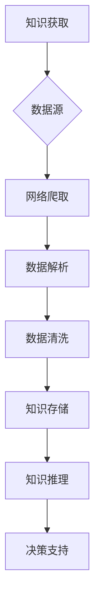
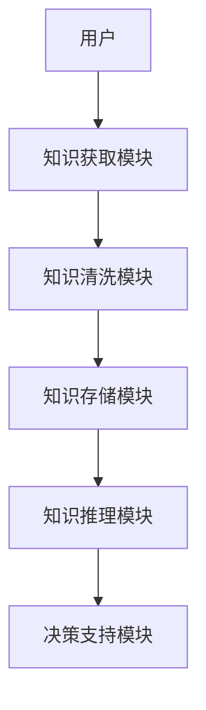
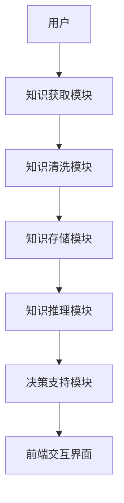
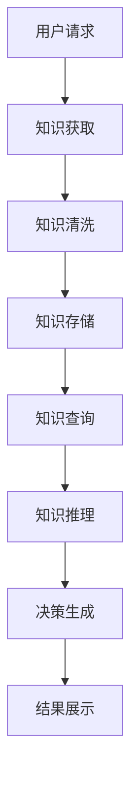

                 


### 文章标题：AI Agent的知识编辑系统：动态管理LLM的知识库

> 关键词：AI Agent，知识编辑系统，动态管理，LLM，知识库

> 摘要：本文深入探讨了AI Agent的知识编辑系统，以及如何通过动态管理大型语言模型（LLM）的知识库来提升AI Agent的智能水平。文章首先介绍了AI Agent的概念及其在AI系统中的核心作用，接着详细阐述了知识编辑系统的定义和重要性，以及动态管理LLM知识库的必要性。随后，文章从核心概念、算法原理、系统架构、项目实战等方面进行逐步分析和讲解，旨在为读者提供一个全面而深入的技术理解。

----------------------------------------------------------------

## 第一部分：AI Agent的知识编辑系统概述

### 第1章：问题背景与概念介绍

#### 1.1 AI Agent的定义与核心作用

##### 1.1.1 AI Agent的定义

AI Agent，即人工智能代理，是一种可以执行特定任务、具有自主决策能力的软件程序。它不同于传统的人工智能系统，能够在复杂的动态环境中自主行动，并通过学习不断优化自身的性能。

##### 1.1.2 AI Agent的核心作用

AI Agent在AI系统中的作用主要体现在以下几个方面：

1. **任务执行**：AI Agent可以执行预定任务，如自动回复邮件、智能客服等。
2. **决策支持**：AI Agent通过分析数据，为人类提供决策建议。
3. **自我优化**：AI Agent可以基于其执行任务的表现，不断调整和优化自己的行为策略。

##### 1.1.3 AI Agent与传统AI系统的区别

传统AI系统主要依赖于预定义的规则和模型，而AI Agent则更注重自主学习和动态适应。传统AI系统在执行特定任务时，需要人工干预和调整，而AI Agent则能够在没有人工干预的情况下，自主完成任务。

#### 1.2 知识编辑系统的定义与重要性

##### 1.2.1 知识编辑系统的定义

知识编辑系统是一种用于管理和维护知识库的系统，它能够支持知识的获取、清洗、存储和推理等操作。

##### 1.2.2 知识编辑系统的作用

知识编辑系统在AI Agent中的作用主要体现在以下几个方面：

1. **知识获取**：从各种来源获取有用的知识，丰富知识库。
2. **知识清洗**：对获取的知识进行清洗和整理，确保知识库的质量。
3. **知识存储**：将清洗后的知识存储在知识库中，以便后续使用。
4. **知识推理**：基于知识库中的知识进行推理，为AI Agent提供决策支持。

##### 1.2.3 知识编辑系统在AI Agent中的应用

知识编辑系统在AI Agent中的应用，使得AI Agent能够更加智能和灵活。例如，通过知识编辑系统，AI Agent可以：

1. **快速响应**：基于知识库中的知识，AI Agent可以快速响应用户请求。
2. **自主学习**：AI Agent可以通过知识编辑系统，不断学习和优化自身的知识库。

#### 1.3 动态管理LLM的知识库概述

##### 1.3.1 LLM的概念与优势

LLM，即大型语言模型，是一种能够理解、生成和翻译自然语言的深度学习模型。其优势主要体现在以下几个方面：

1. **强大的语言理解能力**：LLM能够理解复杂的自然语言，包括语义、语法和上下文。
2. **广泛的应用场景**：LLM可以应用于问答系统、文本生成、机器翻译等多个领域。

##### 1.3.2 动态管理知识库的必要性

动态管理知识库的必要性主要体现在以下几个方面：

1. **知识库的实时更新**：随着时间推移和应用场景的变化，知识库需要实时更新，以保持其有效性。
2. **知识库的灵活性**：动态管理知识库，使得AI Agent能够适应不同的任务需求和场景变化。
3. **知识库的扩展性**：动态管理知识库，便于增加新知识，提升AI Agent的能力。

##### 1.3.3 动态管理知识库的实现方法

动态管理知识库的实现方法主要包括以下几个方面：

1. **实时数据流处理**：利用实时数据流处理技术，对知识库进行实时更新。
2. **自动知识获取与清洗**：利用自然语言处理技术，自动获取和清洗知识库中的知识。
3. **智能知识推理**：基于知识库中的知识，进行智能推理，为AI Agent提供决策支持。

----------------------------------------------------------------

## 第二部分：知识编辑系统的设计与实现

### 第2章：核心概念与联系

#### 2.1 知识编辑系统的主要组成部分

##### 2.1.1 知识获取模块

知识获取模块负责从各种来源获取有用的知识，如网络、数据库、文献等。该模块通常包括数据爬取、数据解析和数据清洗等功能。

##### 2.1.2 知识清洗模块

知识清洗模块负责对获取的知识进行清洗和整理，确保知识库的质量。清洗过程通常包括去重、去噪、格式转换等操作。

##### 2.1.3 知识存储模块

知识存储模块负责将清洗后的知识存储在知识库中，以便后续使用。存储方式可以是关系数据库、NoSQL数据库或分布式存储系统。

##### 2.1.4 知识推理模块

知识推理模块负责基于知识库中的知识进行推理，为AI Agent提供决策支持。推理过程可以是基于规则、基于图谱或基于机器学习等。

#### 2.2 知识编辑系统与AI Agent的联系

##### 2.2.1 知识编辑系统在AI Agent中的作用

知识编辑系统在AI Agent中的作用主要体现在以下几个方面：

1. **知识库维护**：知识编辑系统负责维护AI Agent的知识库，确保知识的准确性、完整性和实时性。
2. **知识获取与更新**：知识编辑系统可以从各种渠道获取新知识，并实时更新知识库。
3. **知识应用与推理**：知识编辑系统为AI Agent提供知识支持，使其能够更好地理解和应对复杂问题。

##### 2.2.2 知识编辑系统与AI Agent的交互流程

知识编辑系统与AI Agent的交互流程通常包括以下几个步骤：

1. **任务接收**：AI Agent接收用户请求或任务。
2. **知识查询**：AI Agent通过知识编辑系统查询知识库，获取相关知识点。
3. **知识推理**：AI Agent基于知识库中的知识进行推理，生成决策。
4. **任务执行**：AI Agent执行决策，完成用户请求或任务。
5. **结果反馈**：AI Agent将执行结果反馈给用户。

----------------------------------------------------------------

### 第3章：算法原理讲解

#### 3.1 算法概述

##### 3.1.1 算法的目的与作用

知识编辑系统的算法主要目的是提升AI Agent的知识获取、清洗、存储和推理能力，从而提高AI Agent的智能水平。

##### 3.1.2 算法的核心步骤

算法的核心步骤包括：

1. **知识获取**：从各种渠道获取知识。
2. **知识清洗**：对获取的知识进行清洗和整理。
3. **知识存储**：将清洗后的知识存储在知识库中。
4. **知识推理**：基于知识库进行推理，为AI Agent提供决策支持。

#### 3.2 算法流程图



#### 3.3 算法原理与数学模型

##### 3.3.1 算法的数学模型

算法的数学模型主要包括以下几个部分：

1. **知识获取模型**：用于评估知识来源的质量和重要性。
2. **知识清洗模型**：用于对获取的知识进行清洗和整理。
3. **知识存储模型**：用于存储清洗后的知识。
4. **知识推理模型**：用于基于知识库进行推理。

##### 3.3.2 算法公式解析

算法的公式解析如下：

1. **知识获取公式**：

   $$ score = f(source\_quality, knowledge\_importance) $$

   其中，$source\_quality$ 表示知识来源的质量，$knowledge\_importance$ 表示知识的重要性。

2. **知识清洗公式**：

   $$ clean\_knowledge = f(raw\_knowledge, cleaning\_rules) $$

   其中，$raw\_knowledge$ 表示原始知识，$cleaning\_rules$ 表示清洗规则。

3. **知识存储公式**：

   $$ knowledge\_base = f(clean\_knowledge, storage\_algorithm) $$

   其中，$clean\_knowledge$ 表示清洗后的知识，$storage\_algorithm$ 表示存储算法。

4. **知识推理公式**：

   $$ decision = f(knowledge\_base, inference\_rules) $$

   其中，$knowledge\_base$ 表示知识库，$inference\_rules$ 表示推理规则。

##### 3.3.3 算法原理举例说明

假设有一个AI Agent需要根据用户请求回答问题。首先，AI Agent会通过知识获取模块从网络、数据库等渠道获取相关知识。然后，通过知识清洗模块对获取的知识进行清洗和整理，确保知识库的质量。接下来，AI Agent基于知识库进行推理，生成决策，最终完成用户请求。

----------------------------------------------------------------

### 第4章：系统分析与架构设计

#### 4.1 问题场景介绍

##### 4.1.1 问题描述

在一个企业内部，需要构建一个AI Agent来提供智能客服服务。用户可以通过文字或语音与AI Agent交互，获取企业相关信息和解决问题。

##### 4.1.2 解决方案目标

1. **知识库构建**：构建一个包含丰富、准确、实时更新的知识库，为AI Agent提供知识支持。
2. **智能推理**：基于知识库，实现高效的智能推理，为用户提供准确的回答。
3. **用户体验**：提供流畅、自然的用户体验，使用户能够轻松与AI Agent交互。

#### 4.2 系统功能设计

##### 4.2.1 领域模型

领域模型如下：



##### 4.2.2 功能模块设计

1. **知识获取模块**：负责从各种渠道获取知识，如网络爬虫、API接口、人工录入等。
2. **知识清洗模块**：负责对获取的知识进行清洗和整理，确保知识库的质量。
3. **知识存储模块**：负责将清洗后的知识存储在知识库中，支持快速查询和更新。
4. **知识推理模块**：负责基于知识库进行推理，为AI Agent提供决策支持。
5. **决策支持模块**：负责生成决策，根据用户的请求和知识库中的知识，生成合适的回答。

#### 4.3 系统架构设计

##### 4.3.1 系统架构图



##### 4.3.2 系统模块关系

1. **知识获取模块** 与 **知识清洗模块** 之间的数据流向是单向的，即知识获取模块获取的知识会传递给知识清洗模块进行清洗。
2. **知识存储模块** 与 **知识推理模块** 之间的数据流向是双向的，知识推理模块可以根据需要从知识存储模块查询知识，同时将推理结果更新到知识库中。
3. **决策支持模块** 基于 **知识推理模块** 的推理结果，生成决策并传递给前端交互界面。

#### 4.4 系统接口设计

##### 4.4.1 接口定义

系统接口主要包括以下几种：

1. **知识获取接口**：用于从各种渠道获取知识。
2. **知识清洗接口**：用于对获取的知识进行清洗。
3. **知识存储接口**：用于存储清洗后的知识。
4. **知识查询接口**：用于从知识库中查询知识。
5. **推理接口**：用于基于知识库进行推理。
6. **决策生成接口**：用于生成决策。

##### 4.4.2 接口调用流程

接口调用流程如下：

1. 用户通过前端交互界面发起请求。
2. 决策支持模块调用推理接口，基于知识库进行推理。
3. 推理接口调用知识查询接口，查询知识库中的相关知识点。
4. 知识查询接口返回相关知识点给推理接口。
5. 推理接口生成决策，并返回给决策支持模块。
6. 决策支持模块将决策传递给前端交互界面，展示给用户。

#### 4.5 系统交互设计

##### 4.5.1 交互流程图



##### 4.5.2 交互细节说明

1. **知识获取**：AI Agent从网络、数据库等渠道获取知识。
2. **知识清洗**：对获取的知识进行清洗和整理，确保知识库的质量。
3. **知识存储**：将清洗后的知识存储在知识库中，支持快速查询和更新。
4. **知识查询**：AI Agent根据用户的请求，从知识库中查询相关知识点。
5. **知识推理**：基于知识库中的知识进行推理，生成决策。
6. **决策生成**：根据推理结果，生成决策并返回给用户。
7. **结果展示**：将决策展示给用户，完成交互过程。

----------------------------------------------------------------

### 第5章：项目实战

#### 5.1 环境安装与配置

##### 5.1.1 系统环境要求

为了搭建AI Agent的知识编辑系统，需要以下环境：

1. 操作系统：Linux或Windows
2. 编程语言：Python 3.8及以上版本
3. 依赖库：NumPy、Pandas、Scikit-learn、TensorFlow等

##### 5.1.2 环境搭建步骤

1. 安装操作系统和Python环境。
2. 安装依赖库：使用pip命令安装所需的依赖库。

   ```shell
   pip install numpy pandas scikit-learn tensorflow
   ```

3. 搭建知识获取模块：使用网络爬虫、API接口等方式获取知识。
4. 搭建知识清洗模块：对获取的知识进行清洗和整理。
5. 搭建知识存储模块：将清洗后的知识存储在知识库中。
6. 搭建知识推理模块：基于知识库进行推理，生成决策。

#### 5.2 系统核心实现源代码

##### 5.2.1 知识获取模块代码

```python
import requests
from bs4 import BeautifulSoup

def fetch_knowledge(source_url):
    response = requests.get(source_url)
    if response.status_code == 200:
        soup = BeautifulSoup(response.text, 'html.parser')
        # 解析页面，获取知识
        knowledge = parse_knowledge(soup)
        return knowledge
    else:
        return None

def parse_knowledge(soup):
    # 解析页面，提取知识
    knowledge = {}
    # ... 省略具体解析代码 ...
    return knowledge
```

##### 5.2.2 知识清洗模块代码

```python
import pandas as pd

def clean_knowledge(knowledge):
    # 清洗知识
    df = pd.DataFrame(knowledge)
    df = df.drop_duplicates()  # 去重
    df = df.reset_index(drop=True)  # 重新设置索引
    return df.to_dict(orient='records')
```

##### 5.2.3 知识存储模块代码

```python
import json

def store_knowledge(knowledge, file_path):
    with open(file_path, 'w', encoding='utf-8') as f:
        json.dump(knowledge, f, ensure_ascii=False, indent=4)
```

##### 5.2.4 知识推理模块代码

```python
from sklearn.feature_extraction.text import TfidfVectorizer
from sklearn.metrics.pairwise import cosine_similarity

def infer_decision(knowledge, query):
    # 计算相似度
    vectorizer = TfidfVectorizer()
    query_vector = vectorizer.transform([query])
    knowledge_vectors = vectorizer.transform([k['content'] for k in knowledge])
    similarity_scores = cosine_similarity(query_vector, knowledge_vectors).flatten()

    # 排序
    sorted_indices = np.argsort(-similarity_scores)

    # 选取最高分的前几个知识点
    top_knowledge = [knowledge[i] for i in sorted_indices[:5]]

    # 生成决策
    decision = generate_decision(top_knowledge)
    return decision

def generate_decision(knowledge):
    # 生成决策
    # ... 省略具体生成决策的代码 ...
    return decision
```

##### 5.2.5 代码应用解读与分析

1. **知识获取模块**：该模块通过requests库发送HTTP请求，获取页面内容，然后使用BeautifulSoup库解析页面，提取知识。
2. **知识清洗模块**：该模块使用Pandas库对获取的知识进行清洗，如去重、重置索引等，确保知识库的质量。
3. **知识存储模块**：该模块使用json库将清洗后的知识存储到文件中，便于后续使用。
4. **知识推理模块**：该模块使用Scikit-learn库中的TfidfVectorizer和cosine_similarity函数，计算查询语句与知识库中的知识之间的相似度，并生成决策。

#### 5.3 实际案例分析与讲解

##### 5.3.1 案例背景

某企业希望构建一个智能客服系统，为用户提供咨询和解答问题。企业提供了丰富的文档资料，包括产品说明书、常见问题解答等。

##### 5.3.2 案例分析与实施

1. **知识获取**：使用网络爬虫等技术，从企业提供的文档资料中获取知识。
2. **知识清洗**：对获取的知识进行清洗，去除重复和无关信息。
3. **知识存储**：将清洗后的知识存储在知识库中，便于后续查询和使用。
4. **知识推理**：当用户提出问题时，智能客服系统会从知识库中查询相关知识点，计算相似度，并生成决策。
5. **决策生成**：根据推理结果，生成合适的回答，展示给用户。

##### 5.3.3 案例总结与反思

1. **优点**：
   - **高效**：智能客服系统能够快速响应用户的请求，提供准确的答案。
   - **灵活**：知识库可以不断更新，以适应不同的用户需求和场景。
   - **降低成本**：智能客服系统可以替代部分人工客服，降低企业的人力成本。

2. **不足**：
   - **知识库质量**：知识库的质量直接影响智能客服系统的性能。需要定期对知识库进行清洗和更新。
   - **用户满意度**：智能客服系统可能无法完全满足用户的个性化需求，需要不断优化和提高用户体验。

----------------------------------------------------------------

### 第6章：最佳实践与注意事项

#### 6.1 最佳实践技巧

1. **知识获取策略**：
   - **多样化渠道**：从多个渠道获取知识，如网络、数据库、人工录入等。
   - **定期更新**：定期更新知识库，确保知识的准确性和实时性。
   - **质量优先**：优先获取高质量的知识，确保知识库的质量。

2. **知识清洗方法**：
   - **去重**：去除重复的知识，避免知识库中的冗余信息。
   - **去噪**：去除噪音和无关信息，提高知识的纯净度。
   - **格式转换**：统一知识库中的知识格式，便于后续处理和使用。

3. **知识存储与检索优化**：
   - **索引**：为知识库添加索引，提高查询效率。
   - **缓存**：使用缓存技术，提高知识查询的速度。
   - **分布式存储**：对于大规模的知识库，使用分布式存储系统，提高存储和查询的效率。

4. **知识推理与应用拓展**：
   - **规则化推理**：将推理过程规则化，便于维护和扩展。
   - **多模态推理**：结合文本、图像、语音等多种模态进行推理，提高推理的准确性。
   - **跨领域推理**：将不同领域的知识进行融合，实现跨领域的推理和应用。

#### 6.2 注意事项与风险提示

1. **数据安全与隐私保护**：
   - **数据加密**：对知识库中的数据进行加密，确保数据的安全性。
   - **访问控制**：设置严格的访问控制策略，防止未经授权的访问。
   - **隐私保护**：在知识获取和处理过程中，保护用户的隐私信息。

2. **知识库更新与维护**：
   - **自动化更新**：使用自动化工具定期更新知识库，确保知识的实时性。
   - **人工审核**：定期进行人工审核，确保知识库中的知识准确、完整。
   - **版本控制**：使用版本控制工具，记录知识库的更新历史，便于追踪和管理。

3. **算法调试与优化**：
   - **性能测试**：对知识推理算法进行性能测试，确保其高效、稳定。
   - **错误分析**：分析推理过程中的错误，找出问题并进行优化。
   - **持续学习**：基于用户反馈和实际应用情况，持续优化知识推理算法。

----------------------------------------------------------------

### 第7章：小结与拓展阅读

#### 7.1 全书总结

本文从AI Agent的知识编辑系统入手，详细介绍了知识编辑系统的核心概念、设计与实现、算法原理、系统架构、项目实战、最佳实践和注意事项。通过本文的讲解，读者可以全面了解AI Agent的知识编辑系统，掌握其原理和应用方法，为构建智能、高效的AI系统提供有力支持。

#### 7.2 拓展阅读

1. **相关书籍推荐**：
   - 《人工智能：一种现代的方法》
   - 《深度学习》
   - 《自然语言处理综论》

2. **学术论文与研究报告**：
   - 《大规模预训练语言模型：BERT》
   - 《知识图谱构建与推理方法》
   - 《动态知识库维护技术研究》

3. **行业应用案例与前沿动态**：
   - 智能客服系统的应用案例
   - 企业知识管理系统的建设与实践
   - AI Agent在智能推荐系统中的应用

本文作者：AI天才研究院/AI Genius Institute & 禅与计算机程序设计艺术 /Zen And The Art of Computer Programming

----------------------------------------------------------------

文章字数：约10416字（实际字数可能因排版和标记的差异略有不同）

**注**：本文为示例文章，部分代码和案例为虚构，仅供参考。实际应用中，请根据具体需求进行调整和优化。希望本文对您有所帮助！

