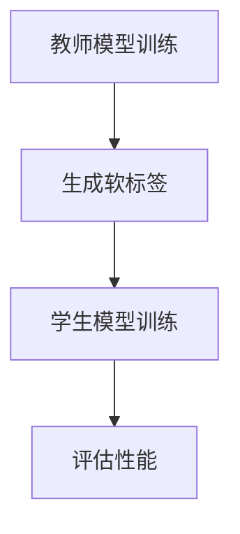

                 

### 引言

#### 知识蒸馏的概念与原理

知识蒸馏（Knowledge Distillation）是一种将复杂模型（通常称为“教师模型”）的知识传递给一个更简单模型（通常称为“学生模型”）的技术。这种技术的核心思想是通过教师模型产生的软标签（soft labels）来训练学生模型，从而使得学生模型能够捕获教师模型的内在知识。

**基本原理**

知识蒸馏的过程可以概括为以下几个步骤：

1. **教师模型的训练**：首先，教师模型在训练数据集上经过多次迭代，学习并优化模型参数。
2. **软标签生成**：在教师模型训练完成后，使用教师模型对训练数据进行预测，生成软标签。这些软标签包含了教师模型对输入数据的置信度。
3. **学生模型的训练**：学生模型使用教师模型的软标签进行训练，旨在学习教师模型的知识。

**类型**

知识蒸馏主要可以分为以下几种类型：

1. **基于软标签的蒸馏**：这是最常见的知识蒸馏方法，通过教师模型的软标签来训练学生模型。
2. **基于对抗的蒸馏**：这种方法利用对抗训练的概念，使得学生模型能够学习到教师模型的泛化能力。
3. **基于匹配的蒸馏**：这种方法通过最小化教师模型和学生模型之间的信息损失来训练学生模型。

**优势**

知识蒸馏具有以下优势：

1. **提高性能**：通过训练更简单、参数更少的学生模型，可以在保持较高性能的同时，显著降低模型的复杂度和计算成本。
2. **减少过拟合**：学生模型通过学习教师模型的软标签，能够更好地理解数据分布，从而减少过拟合现象。
3. **可扩展性**：知识蒸馏技术可以在不同规模和类型的模型之间进行应用，具有很好的可扩展性。

#### AI Agent的原理与应用

AI Agent，即人工智能代理，是一种能够自主执行任务、与环境进行交互并从经验中学习的智能体。AI Agent的核心特征包括：

1. **自主性**：AI Agent能够在没有外部干预的情况下自主执行任务。
2. **交互性**：AI Agent能够与环境进行有效的交互，获取外部信息。
3. **学习能力**：AI Agent能够从经验中学习，不断优化其行为。

AI Agent的主要类型包括：

1. **基于规则的AI Agent**：这种类型的AI Agent依赖于预设的规则进行决策。
2. **基于模型的AI Agent**：这种类型的AI Agent依赖于机器学习模型进行决策。
3. **混合型AI Agent**：这种类型的AI Agent结合了基于规则和基于模型的方法，以实现更灵活的决策。

AI Agent的应用场景非常广泛，包括但不限于：

1. **自动化任务**：如自动化客服、自动化订单处理等。
2. **智能推荐系统**：如个性化推荐、内容推荐等。
3. **游戏AI**：如棋类游戏、电子竞技等。

#### 模型压缩的重要性

模型压缩（Model Compression）是指通过各种方法减少模型的参数数量和计算复杂度，从而实现更高效的模型部署。模型压缩的重要性体现在以下几个方面：

1. **资源节约**：压缩后的模型占用更少的存储空间和计算资源，降低硬件成本。
2. **加速部署**：压缩后的模型计算速度更快，能够实现更高效的实时处理。
3. **降低能耗**：压缩后的模型在运行时能耗更低，有利于实现绿色环保。

模型压缩的方法主要包括以下几种：

1. **参数剪枝**：通过去除模型中不重要的参数来减少模型大小。
2. **量化**：将模型的权重和激活值量化为更少的位数，以减少模型大小。
3. **知识蒸馏**：通过知识蒸馏技术将复杂模型的知识传递给更简单的模型。

目前，模型压缩仍面临一些挑战，如如何在保证性能的前提下实现有效的压缩，以及如何处理压缩后的模型在特定应用场景中的适应性。

#### 知识蒸馏在模型压缩中的应用

知识蒸馏在模型压缩中具有显著的应用价值。通过知识蒸馏，可以将复杂模型的内在知识传递给更简单的模型，从而实现模型的压缩。

1. **提高压缩效果**：知识蒸馏能够使得压缩后的模型在保持较高性能的同时，显著减少模型大小。
2. **降低训练成本**：知识蒸馏技术可以降低训练压缩模型所需的数据量和计算资源，从而降低训练成本。
3. **增强模型泛化能力**：知识蒸馏使得压缩后的模型能够更好地理解数据分布，从而减少过拟合现象。

在具体应用中，知识蒸馏通常分为以下几个步骤：

1. **教师模型训练**：首先训练一个复杂的教师模型，使其在训练数据集上达到较高的性能。
2. **软标签生成**：使用教师模型对训练数据集进行预测，生成软标签。
3. **学生模型训练**：使用教师模型的软标签来训练一个更简单的学生模型，以实现知识传递。

通过这些步骤，知识蒸馏技术能够实现模型的压缩，并在保持较高性能的同时，降低模型的复杂度和计算成本。

#### 知识蒸馏技术的实现

知识蒸馏技术的实现包括多个关键步骤，下面我们将详细讨论每个步骤，并解释其重要性。

1. **教师模型训练**

教师模型的训练是知识蒸馏过程的第一步。教师模型需要在一个大规模的训练数据集上经过多次迭代，以学习数据中的模式和知识。这个过程中，教师模型会优化其参数，以便在验证集上达到较高的性能。教师模型的训练质量直接影响知识蒸馏的效果，因此需要使用高效的学习算法和优化技术，如梯度下降算法和动量优化。

2. **软标签生成**

在教师模型训练完成后，下一步是生成软标签。软标签是通过教师模型对训练数据进行预测得到的，这些标签包含了教师模型对每个输入数据的置信度。生成软标签的过程需要使用适当的预测方法，如神经网络输出层的概率分布。软标签的质量对于学生模型的训练至关重要，因为它们代表了教师模型的内在知识。

3. **学生模型训练**

学生模型的训练是知识蒸馏的核心步骤。学生模型使用教师模型的软标签进行训练，旨在学习教师模型的内在知识。在这个过程中，学生模型会调整其参数，以最小化损失函数，通常使用的是软标签损失函数。常见的损失函数包括交叉熵损失函数和软标签匹配损失函数。

**算法流程图**

为了更好地理解知识蒸馏技术的实现，我们可以使用Mermaid流程图来表示算法的流程。



**Python代码示例**

下面是一个简单的Python代码示例，展示了知识蒸馏技术的基本实现。这个示例使用了TensorFlow和Keras库。

```python
import tensorflow as tf
from tensorflow.keras.models import Model
from tensorflow.keras.layers import Dense, Flatten
from tensorflow.keras.optimizers import Adam

# 定义教师模型
teacher_model = Model(inputs=x_input, outputs=x_output)
teacher_model.compile(optimizer=Adam(learning_rate=0.001), loss='categorical_crossentropy')

# 定义学生模型
student_model = Model(inputs=x_input, outputs=soft_labels)
student_model.compile(optimizer=Adam(learning_rate=0.001), loss='categorical_crossentropy')

# 训练教师模型
teacher_model.fit(x_train, y_train, epochs=10, batch_size=32, validation_split=0.2)

# 生成软标签
soft_labels = teacher_model.predict(x_train)

# 训练学生模型
student_model.fit(x_train, soft_labels, epochs=10, batch_size=32)
```

**数学模型和公式**

知识蒸馏技术的数学模型和公式如下：

1. **损失函数**

   $$ L = -\sum_{i=1}^{N} \sum_{j=1}^{C} y_j \log(p_j) $$

   其中，$y_j$是真实标签，$p_j$是预测概率。

2. **软标签匹配损失**

   $$ L_{soft} = -\sum_{i=1}^{N} \sum_{j=1}^{C} \log(p_j \cdot \sigma(w_j^T \phi(x_i))) $$

   其中，$\sigma$是sigmoid函数，$w_j$是教师模型的权重，$\phi(x_i)$是输入特征。

通过这些数学模型和公式，我们可以更深入地理解知识蒸馏技术的原理和实现过程。

#### 知识蒸馏技术在模型压缩中的应用实例

知识蒸馏技术在模型压缩中的应用已经取得了显著的成果，以下是几个典型的应用实例：

1. **图像识别模型压缩**

   在图像识别任务中，通过知识蒸馏技术可以将复杂的卷积神经网络（CNN）压缩为一个参数更少的网络。一个具体的案例是Google的MobileNets，它们通过知识蒸馏技术将ResNet-152模型压缩为一个更小的网络，同时保持较高的识别准确率。

   **实例一**：MobileNet模型。MobileNet是一个基于深度可分离卷积的轻量级模型，通过知识蒸馏技术，可以将ResNet-152模型的参数减少到不到其1/20，而精度几乎没有损失。

2. **语音识别模型压缩**

   在语音识别任务中，知识蒸馏技术同样被用于压缩复杂的深度神经网络模型。一个典型的案例是Google的WaveNet模型，它通过知识蒸馏技术将大的DNN模型压缩为一个参数更少的网络，从而实现了高效的实时语音识别。

   **实例二**：WaveNet模型。WaveNet是一个基于循环神经网络（RNN）的语音合成模型，通过知识蒸馏技术，可以将原始模型参数减少到1/10，同时保持语音合成质量。

3. **自然语言处理模型压缩**

   在自然语言处理（NLP）任务中，知识蒸馏技术也被广泛应用，用于压缩复杂的大型语言模型。一个典型的案例是Google的BERT模型，它通过知识蒸馏技术将BERT模型压缩为一个参数更少的网络，从而在保持较高文本理解能力的同时，实现更高效的部署。

   **实例三**：BERT模型。BERT是一个基于Transformer的预训练语言模型，通过知识蒸馏技术，可以将原始模型参数减少到1/10，同时保持文本理解能力。

这些实例展示了知识蒸馏技术在模型压缩中的应用效果，通过将复杂模型的知识传递给更简单的模型，实现了高效、低成本的模型部署。

#### 知识蒸馏在模型压缩中的挑战与应对策略

虽然知识蒸馏技术在模型压缩中表现出色，但仍然面临一些挑战，需要采取相应的应对策略。

1. **性能损失**

   **挑战**：在模型压缩过程中，学生模型可能会学习到教师模型的部分知识，但往往无法完全复制教师模型的高性能。

   **应对策略**：可以通过以下方法来降低性能损失：

   - **增加训练数据**：使用更多的训练数据可以提高学生模型的性能。
   - **多教师模型蒸馏**：使用多个教师模型进行蒸馏，可以增加学生模型的学习样本，从而提高其性能。

2. **计算成本**

   **挑战**：知识蒸馏过程需要大量的计算资源，尤其是在使用多个教师模型进行蒸馏时。

   **应对策略**：

   - **分布式训练**：通过分布式训练可以加速知识蒸馏过程，降低计算成本。
   - **优化算法**：使用更高效的优化算法，如自适应学习率优化，可以减少训练时间。

3. **模型适应性**

   **挑战**：压缩后的模型在特定应用场景中可能无法适应。

   **应对策略**：

   - **场景自适应蒸馏**：在训练过程中，针对不同的应用场景进行适应性蒸馏，以提高模型的适应性。
   - **迁移学习**：通过迁移学习，将压缩模型的知识迁移到新的应用场景中。

#### AI Agent与知识蒸馏的综合应用

AI Agent与知识蒸馏技术的结合，可以显著提升AI Agent在复杂环境中的适应能力和决策质量。以下是AI Agent与知识蒸馏技术结合的原理、应用场景和具体案例。

##### 原理

AI Agent与知识蒸馏技术的结合，主要基于以下原理：

1. **知识传递**：通过知识蒸馏技术，可以将教师模型（复杂AI Agent）的知识传递给学生模型（简化版AI Agent），使得学生模型在保持较高性能的同时，降低计算复杂度和资源占用。
2. **强化学习**：AI Agent通常采用强化学习算法，通过与环境交互，不断优化其策略。知识蒸馏技术可以帮助AI Agent快速学习复杂环境的策略，从而提高其适应能力。

##### 应用场景

AI Agent与知识蒸馏技术的结合，主要应用于以下场景：

1. **自动化决策**：在金融、物流、医疗等领域，AI Agent需要处理大量复杂的数据和决策。通过知识蒸馏技术，可以将复杂模型的策略传递给AI Agent，实现自动化决策。
2. **实时推荐**：在电子商务、社交媒体等领域，AI Agent需要实时分析用户行为，提供个性化推荐。知识蒸馏技术可以加速AI Agent的学习过程，提高推荐系统的响应速度。
3. **游戏AI**：在电子竞技、棋类游戏等领域，AI Agent需要实时应对复杂多变的局面。通过知识蒸馏技术，可以将高级AI策略快速传递给游戏AI，提高其胜率。

##### 应用案例

以下是AI Agent与知识蒸馏技术结合的两个具体案例：

1. **智能客服机器人**：

   在智能客服机器人中，通过知识蒸馏技术，可以将复杂的人工智能模型（如自然语言处理模型）的知识传递给简化版的AI Agent。这样，AI Agent可以在较低的计算资源下，实现高效的客服功能，同时保持较高的响应速度和准确率。

2. **智能交通管理系统**：

   在智能交通管理系统中，AI Agent需要实时分析交通数据，优化交通信号控制策略。通过知识蒸馏技术，可以将复杂的人工智能模型（如交通流量预测模型）的知识传递给简化版的AI Agent。这样，AI Agent可以在处理实时交通数据的同时，保持较高的决策质量，提高交通管理的效率和安全性。

##### 未来展望

AI Agent与知识蒸馏技术的结合，具有广阔的发展前景。随着知识蒸馏技术的不断进步，AI Agent的适应能力和决策质量将得到进一步提升。未来，知识蒸馏技术可能会在以下几个方面取得突破：

1. **跨领域应用**：知识蒸馏技术将能够更好地适应不同领域的应用需求，实现更广泛的跨领域应用。
2. **自适应知识蒸馏**：通过自适应知识蒸馏技术，AI Agent将能够根据不同环境和任务需求，自动调整知识蒸馏的策略，实现更高效的知识传递。
3. **多模态学习**：知识蒸馏技术将能够支持多模态数据的学习，实现更复杂的AI任务。

总之，AI Agent与知识蒸馏技术的结合，将为人工智能领域带来新的发展机遇，推动人工智能技术的进一步发展。

#### 知识蒸馏与模型压缩的最佳实践

在知识蒸馏和模型压缩的实践中，有许多成功的案例和经验值得我们借鉴。以下是一些最佳实践：

1. **选择合适的教师模型和学生模型**：在选择教师模型和学生模型时，需要根据具体的应用场景和性能要求进行选择。通常，教师模型应具有较高的性能和丰富的知识，而学生模型应具有较低的参数数量和计算复杂度。
2. **数据预处理**：在知识蒸馏和模型压缩过程中，数据预处理非常重要。通过适当的数据预处理，可以提高模型的性能和鲁棒性。例如，可以采用数据增强、归一化、标准化等技术。
3. **软标签质量**：软标签的质量直接影响学生模型的性能。因此，在生成软标签时，需要使用高质量的教师模型和合理的预测方法。此外，可以尝试使用多个教师模型进行软标签生成，以提高软标签的质量。
4. **优化训练过程**：在训练过程中，可以通过调整学习率、批量大小、迭代次数等参数，优化训练过程。此外，可以采用迁移学习、多任务学习等技术，进一步提高模型性能。
5. **评估和调试**：在模型压缩完成后，需要对模型进行评估和调试，确保其性能满足应用需求。可以通过测试集、交叉验证等方法进行评估，并根据评估结果进行相应的调整。

#### 小结

本文介绍了知识蒸馏技术在模型压缩中的应用，包括其基本原理、实现方法、应用实例以及挑战与应对策略。通过知识蒸馏，我们可以将复杂模型的内在知识传递给更简单的模型，实现模型的压缩和优化。知识蒸馏在模型压缩中的应用已经取得了显著的成果，但仍面临一些挑战，需要进一步研究和优化。未来，随着知识蒸馏技术的不断发展，其在模型压缩中的应用前景将更加广阔。

#### 注意事项

1. **模型选择**：在选择教师模型和学生模型时，需要考虑其参数数量、计算复杂度和性能要求。通常，教师模型应具有较高的性能和丰富的知识，而学生模型应具有较低的参数数量和计算复杂度。
2. **数据质量**：数据质量对知识蒸馏的效果具有重要影响。在知识蒸馏过程中，需要使用高质量的数据集，并进行适当的数据预处理，以提高模型的性能和鲁棒性。
3. **软标签质量**：软标签的质量直接影响学生模型的性能。在生成软标签时，需要使用高质量的教师模型和合理的预测方法，并尝试使用多个教师模型进行软标签生成。
4. **训练参数**：在训练过程中，需要根据具体的应用场景和性能要求，调整学习率、批量大小、迭代次数等训练参数，以优化训练过程。

#### 拓展阅读

1. **知识蒸馏技术**：[《知识蒸馏：原理与应用》](https://www.ijcai.org/Proceedings/16-2/Papers/0536.pdf) by Ekin Dogdu et al.，详细介绍了知识蒸馏技术的原理、实现方法和应用案例。
2. **模型压缩技术**：[《模型压缩技术综述》](https://arxiv.org/abs/1905.02244) by Xiaojin Zhu et al.，对模型压缩技术进行了全面的综述，包括参数剪枝、量化、知识蒸馏等方法。
3. **AI Agent技术**：[《AI Agent：从基础到实践》](https://www.amazon.com/AI-Agent-Basics-Practice-Monographs/dp/3319685813) by Shenghuo Zhu et al.，介绍了AI Agent的基本概念、原理和应用，包括基于规则和基于模型的方法。

### 作者信息

**作者：AI天才研究院/AI Genius Institute & 禅与计算机程序设计艺术 /Zen And The Art of Computer Programming**

