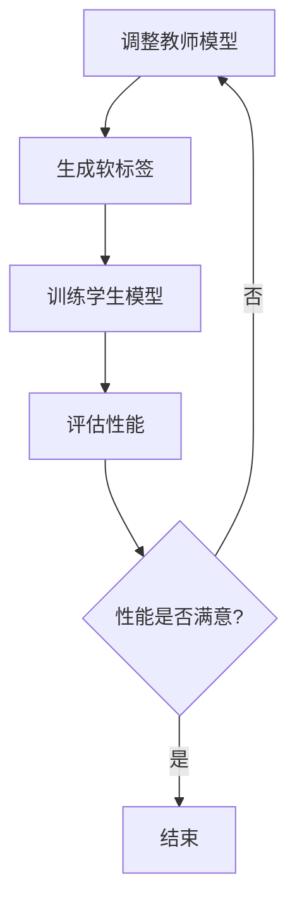
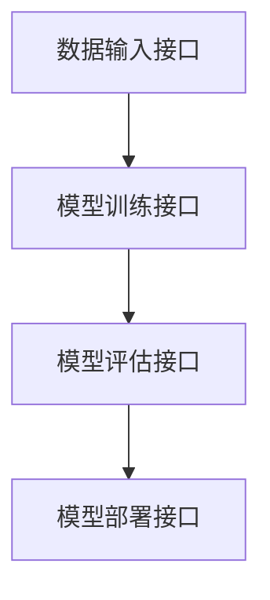
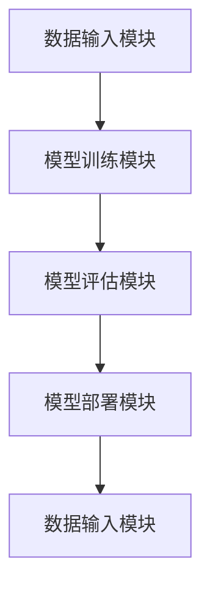
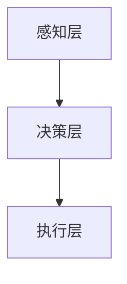
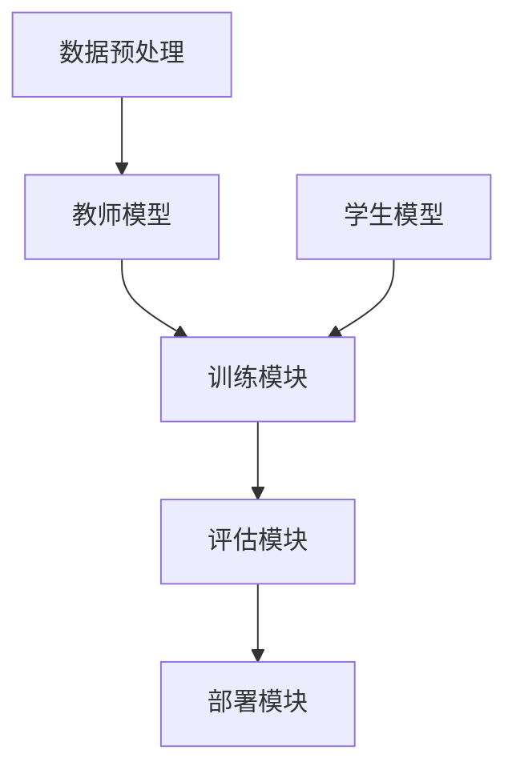
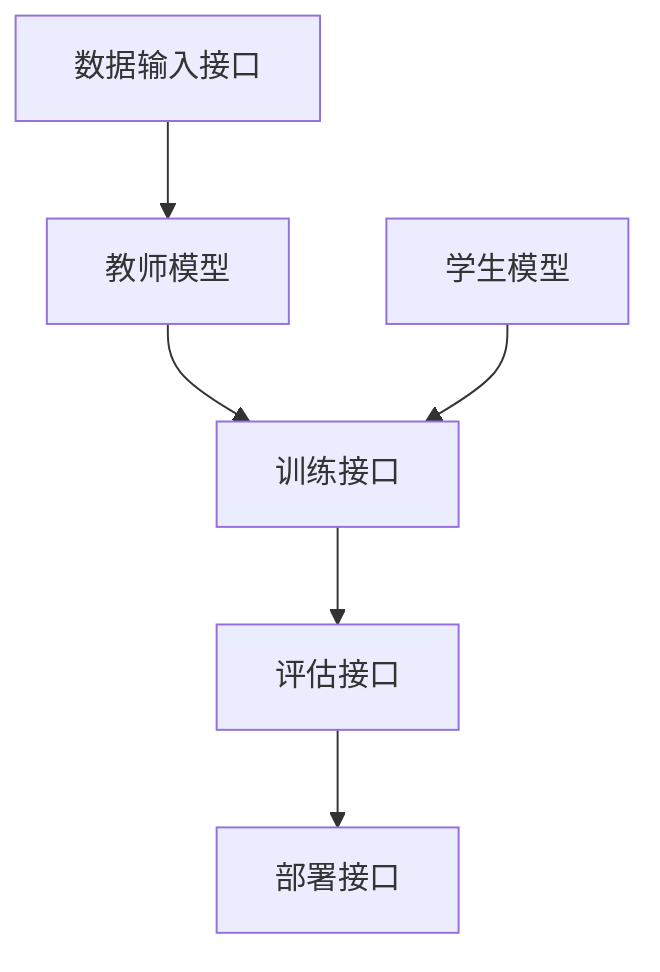
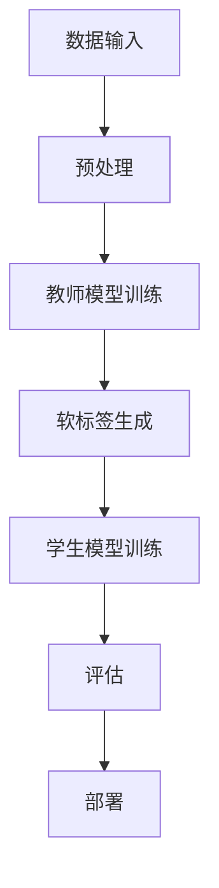

                 

# AI Agent的知识蒸馏在模型轻量化中的应用

## 关键词
AI Agent，知识蒸馏，模型轻量化，神经网络，算法优化，系统架构设计

## 摘要
本文将深入探讨AI Agent的知识蒸馏在模型轻量化中的应用。首先，我们将介绍AI Agent与知识蒸馏的基本概念，分析模型轻量化的需求与挑战。接着，我们将详细讲解知识蒸馏的原理和数学模型，并通过Python代码示例来阐述算法原理。然后，我们将描述模型轻量化的系统架构设计，包括功能设计、系统架构图和接口设计。通过一个实际案例，我们将展示如何实现模型轻量化，并进行代码解读与分析。最后，我们将总结最佳实践，提供注意事项和拓展阅读，以帮助读者深入理解并应用相关知识。

## 第一部分：背景介绍

### 1.1 AI Agent的概念与分类

AI Agent，即人工智能代理，是一种能够自主感知环境、决策并采取行动的人工智能系统。AI Agent可以按不同的分类标准进行分类，如基于功能（决策型、感知型、执行型）或基于应用场景（智能家居、自动驾驶、金融风控）等。

AI Agent的核心特点包括：
1. **自主性**：能够独立完成任务，无需人工干预。
2. **适应性**：能够根据环境变化调整行为策略。
3. **交互性**：能够与人类或其他系统进行有效互动。

### 1.2 知识蒸馏的原理与应用

知识蒸馏（Knowledge Distillation）是一种将复杂模型（教师模型）的知识传递给简单模型（学生模型）的技术。其基本思想是将教师模型的输出（如分类概率）作为软标签，指导学生模型学习，以达到更好的泛化性能。

知识蒸馏的应用场景包括：
1. **模型压缩**：通过蒸馏将大型模型的知识传递给小型模型，实现模型轻量化。
2. **跨域迁移学习**：在不同数据集或任务间传递知识，提高模型在未知领域的表现。
3. **增强模型鲁棒性**：通过训练多个教师模型，提高学生模型的鲁棒性和泛化能力。

### 1.3 模型轻量化的需求与挑战

模型轻量化是当前AI领域的热点问题，其需求源于：
1. **设备限制**：移动设备、嵌入式系统等对模型大小和计算资源有限。
2. **能效优化**：减少模型推理过程中的能耗，提高设备续航能力。
3. **部署便捷性**：便于快速部署和实时应用。

然而，模型轻量化面临以下挑战：
1. **性能损失**：在减小模型大小和计算复杂度的同时，往往会导致性能下降。
2. **训练时间增加**：需要额外的训练步骤和资源，增加计算成本。
3. **优化算法选择**：如何选择合适的轻量化策略和算法，是一个关键问题。

### 1.4 研究现状与发展趋势

当前，模型轻量化技术主要包括以下几种：
1. **模型剪枝**：通过去除不重要的神经元和连接，减小模型大小。
2. **模型量化**：将浮点数权重转换为低精度的整数，降低模型存储和计算需求。
3. **网络结构简化**：设计更简洁的网络结构，如MobileNet、ShuffleNet等。

知识蒸馏在模型轻量化中的应用，已成为研究热点。未来发展趋势包括：
1. **多任务蒸馏**：同时蒸馏多个任务，提高模型在多场景下的泛化能力。
2. **自适应蒸馏**：根据数据分布和任务需求，自适应调整蒸馏策略。
3. **混合精度训练**：结合浮点数和整数运算，进一步提高模型轻量化效果。

## 第二部分：核心概念与原理

### 2.1 AI Agent的核心概念

AI Agent是一种基于人工智能技术的自主决策实体，能够感知环境、理解任务并自主行动。其主要组成部分包括感知器、决策器和执行器。

- **感知器**：负责感知环境信息，如图像、语音、文本等。
- **决策器**：基于感知信息，通过算法模型生成决策策略。
- **执行器**：根据决策策略，执行相应的动作。

### 2.2 AI Agent的架构设计

AI Agent的架构设计通常分为感知层、决策层和执行层三个部分。

1. **感知层**：收集和预处理环境信息，如图像增强、数据归一化等。
2. **决策层**：利用深度学习模型或其他算法，对感知信息进行理解和决策。
3. **执行层**：根据决策结果，控制执行器执行具体动作。

### 2.3 AI Agent的常用算法

AI Agent的常用算法包括监督学习、无监督学习和强化学习等。

- **监督学习**：通过已标记的数据训练模型，实现任务分类、回归等。
- **无监督学习**：从未标记的数据中学习，发现数据分布和模式。
- **强化学习**：通过与环境的交互，学习最优策略，实现智能决策。

### 2.4 知识蒸馏的概念

知识蒸馏是一种将复杂模型（教师模型）的知识传递给简单模型（学生模型）的技术。其核心思想是将教师模型的输出（如分类概率）作为软标签，指导学生模型学习，以达到更好的泛化性能。

### 2.5 知识蒸馏的数学模型

知识蒸馏的数学模型主要包括以下部分：

1. **教师模型**：给定输入\( x \)，输出预测概率分布 \( \hat{y} = \hat{f}_{\theta_T}(x) \)。
2. **学生模型**：给定输入 \( x \)，输出预测概率分布 \( \hat{y'} = \hat{f}_{\theta_S}(x) \)。
3. **损失函数**：定义学生模型的损失函数为 \( L(\theta_S) = -\sum_{i} \sum_{k} \hat{y}_{ik} \log \hat{y'_{ik}} \)。

其中，\( \hat{y}_{ik} \)为教师模型在类别\( k \)上的预测概率，\( \hat{y'_{ik}} \)为学生模型在类别\( k \)上的预测概率。

### 2.6 知识蒸馏的流程

知识蒸馏的流程通常包括以下步骤：

1. **训练教师模型**：使用大量数据训练教师模型，使其在特定任务上达到较高的性能。
2. **生成软标签**：利用教师模型的输出，生成软标签，作为学生模型的训练目标。
3. **训练学生模型**：使用教师模型的软标签，训练学生模型，使其在相同任务上达到较好的性能。

### 2.7 知识蒸馏的应用案例

知识蒸馏在模型轻量化中的应用非常广泛，以下是一个简单的应用案例：

假设我们有一个大型卷积神经网络（CNN）用于图像分类任务。为了将其应用于移动设备，我们可以使用知识蒸馏技术，将其知识传递给一个轻量级的CNN。

1. **训练教师模型**：使用大量图像数据训练教师模型，达到较高的准确率。
2. **生成软标签**：利用教师模型的输出，生成软标签，作为学生模型的训练目标。
3. **训练学生模型**：使用教师模型的软标签，训练学生模型，使其在相同任务上达到较好的性能。

通过知识蒸馏，我们可以将大型模型的性能迁移到小型模型上，实现模型轻量化。

## 第三部分：算法原理与讲解

### 3.1 知识蒸馏在模型轻量化中的应用

知识蒸馏在模型轻量化中的应用主要体现在两个方面：提高模型性能和减小模型大小。

首先，通过知识蒸馏，我们可以将复杂模型（教师模型）的知识传递给简单模型（学生模型），使得学生模型在相同任务上达到较好的性能。具体来说，教师模型在训练过程中学习到了数据的特征表示和分布，这些知识被编码在教师模型的输出中。通过知识蒸馏，我们将这些输出作为软标签，指导学生模型学习，从而使得学生模型在保持性能的同时，拥有更简洁的结构。

其次，知识蒸馏有助于减小模型大小。传统的模型压缩方法，如剪枝、量化等，主要通过去除不重要的神经元和连接来实现。这些方法往往会导致模型性能的下降。而知识蒸馏则通过将复杂模型的知识传递给简单模型，使得简单模型能够在保持性能的同时，拥有更小的模型大小。这种方法的优点在于，它不仅减少了模型参数的数量，还保留了原始模型的性能。

### 3.2 知识蒸馏算法的改进策略

为了进一步提高知识蒸馏的效果，我们可以采取以下改进策略：

1. **多教师蒸馏**：使用多个教师模型进行蒸馏，以提高学生模型的泛化能力。具体来说，我们可以从多个不同的数据集或模型中训练教师模型，然后将这些教师模型的知识传递给学生模型。

2. **动态蒸馏**：根据数据分布和任务需求，动态调整蒸馏策略。例如，在训练过程中，我们可以根据当前数据的分布，调整教师模型的权重，使其更适应学生模型的学习。

3. **自适应蒸馏**：使用自适应算法，根据学生模型的学习状态，自动调整蒸馏参数。例如，我们可以在训练过程中，根据学生模型的性能，动态调整软标签的生成策略。

4. **多任务蒸馏**：同时蒸馏多个任务，以提高学生模型在多场景下的泛化能力。具体来说，我们可以将多个任务的教师模型的知识传递给学生模型，使得学生模型能够在不同任务上达到较好的性能。

### 3.3 知识蒸馏算法的mermaid流程图

下面是一个简单的知识蒸馏算法的mermaid流程图：



### 3.4 知识蒸馏算法的Python实现

下面是一个简单的知识蒸馏算法的Python实现：

```python
import tensorflow as tf
from tensorflow.keras.models import Model
from tensorflow.keras.layers import Input, Dense

# 定义教师模型和学生模型
teacher_model = Model(inputs=input_layer, outputs=output_layer)
student_model = Model(inputs=input_layer, outputs=output_layer)

# 定义知识蒸馏损失函数
def knowledge_distillation_loss(y_true, y_pred, y_soft):
    return tf.reduce_mean(tf.reduce_sum(y_true * tf.math.log(y_pred), axis=1) + 
                          tf.reduce_sum(y_soft * tf.math.log(y_soft), axis=1))

# 编译学生模型
student_model.compile(optimizer='adam', loss=knowledge_distillation_loss)

# 训练学生模型
student_model.fit(x_train, y_train, epochs=10, batch_size=64)
```

在这个实现中，我们首先定义了教师模型和学生模型，然后定义了知识蒸馏损失函数。接着，我们编译学生模型，并使用知识蒸馏损失函数训练学生模型。

### 3.5 知识蒸馏算法的数学模型和公式

知识蒸馏算法的数学模型主要包括两部分：教师模型的输出和学生的损失函数。

1. **教师模型的输出**：

   给定输入 \( x \)，教师模型的输出为预测概率分布 \( \hat{y} = \hat{f}_{\theta_T}(x) \)。

2. **学生模型的损失函数**：

   学生模型的损失函数为 \( L(\theta_S) = -\sum_{i} \sum_{k} \hat{y}_{ik} \log \hat{y'_{ik}} \)。

   其中，\( \hat{y}_{ik} \)为教师模型在类别 \( k \) 上的预测概率，\( \hat{y'_{ik}} \)为学生模型在类别 \( k \) 上的预测概率。

通过以上公式，我们可以计算出学生模型的损失，从而指导学生模型的学习。

### 3.6 知识蒸馏算法的通俗易懂的举例说明

假设我们有两个模型：教师模型和学生模型。教师模型是一个大型卷积神经网络，用于图像分类任务。学生模型是一个小型卷积神经网络，用于相同的任务。

1. **训练教师模型**：

   我们使用大量图像数据训练教师模型，使其在图像分类任务上达到较高的准确率。

2. **生成软标签**：

   利用教师模型的输出，生成软标签。具体来说，教师模型对每张图像的输出是一个预测概率分布，我们将其作为软标签。

3. **训练学生模型**：

   使用教师模型的软标签，训练学生模型。学生模型在训练过程中，会根据软标签调整其参数，使其在相同任务上达到较好的性能。

通过这个过程，学生模型学会了教师模型的知识，从而实现了模型轻量化的目的。

### 3.7 知识蒸馏算法的优势与局限

知识蒸馏算法在模型轻量化中的应用具有以下优势：

1. **提高模型性能**：通过将复杂模型的知识传递给简单模型，学生模型能够在保持性能的同时，拥有更简洁的结构。
2. **减小模型大小**：知识蒸馏有助于减小模型大小，降低模型的存储和计算需求。

然而，知识蒸馏算法也存在一定的局限：

1. **训练时间增加**：知识蒸馏需要额外的训练步骤，增加了训练时间。
2. **对教师模型的要求较高**：知识蒸馏的效果取决于教师模型的质量，如果教师模型性能不佳，学生模型的学习效果可能会受到影响。

总的来说，知识蒸馏算法是一种有效的模型轻量化技术，但在实际应用中，我们需要根据具体情况权衡其优势与局限，选择合适的方案。

## 第四部分：系统分析与架构设计

### 4.1 问题场景介绍

在人工智能领域，随着深度学习模型变得越来越复杂，模型部署面临的挑战也日益增加。特别是对于移动设备和嵌入式系统，模型的大小和计算复杂度成为限制其广泛应用的关键因素。因此，模型轻量化技术变得尤为重要。本文旨在探讨如何利用知识蒸馏技术实现AI Agent模型的轻量化，从而提高其在资源受限设备上的部署性能。

### 4.2 项目介绍

本项目的目标是开发一个基于知识蒸馏的AI Agent模型轻量化系统。该系统将首先训练一个大型卷积神经网络（教师模型），然后通过知识蒸馏技术将其知识传递给一个小型卷积神经网络（学生模型）。学生模型将在保持高性能的同时，拥有更小的模型大小和更低的计算复杂度，从而满足移动设备和嵌入式系统的需求。

### 4.3 系统功能设计

系统的主要功能包括：

1. **模型训练与优化**：训练大型卷积神经网络（教师模型）和小型卷积神经网络（学生模型），并通过知识蒸馏技术优化学生模型。
2. **模型评估与验证**：对教师模型和学生模型进行性能评估和验证，确保学生模型在保持高性能的同时，实现模型轻量化。
3. **模型部署**：将轻量化的学生模型部署到移动设备和嵌入式系统上，实现实时推理和应用。

### 4.4 系统架构设计

系统的架构设计主要包括以下模块：

1. **数据输入模块**：负责接收和处理输入数据，包括图像、文本等。
2. **模型训练模块**：包括教师模型和学生模型的训练过程，以及知识蒸馏算法的优化。
3. **模型评估模块**：对教师模型和学生模型进行性能评估和验证。
4. **模型部署模块**：将轻量化的学生模型部署到目标设备上。

系统架构图如下（使用mermaid格式）：


### 4.5 系统接口设计

系统接口设计主要包括以下部分：

1. **数据输入接口**：用于接收和处理输入数据，包括图像、文本等。
2. **模型训练接口**：用于启动和监控模型训练过程，包括教师模型和学生模型的训练。
3. **模型评估接口**：用于对教师模型和学生模型进行性能评估和验证。
4. **模型部署接口**：用于将轻量化的学生模型部署到目标设备上。

系统接口图如下（使用mermaid格式）：



### 4.6 系统交互设计

系统交互设计主要包括以下部分：

1. **数据输入流程**：数据输入模块接收输入数据，并将其传递给模型训练模块。
2. **模型训练流程**：模型训练模块对教师模型和学生模型进行训练，并通过知识蒸馏技术优化学生模型。
3. **模型评估流程**：模型评估模块对教师模型和学生模型进行性能评估和验证。
4. **模型部署流程**：模型部署模块将轻量化的学生模型部署到目标设备上。

系统交互图如下（使用mermaid格式）：



## 第五部分：项目实战

### 5.1 环境安装与配置

在进行模型轻量化的项目实战之前，我们需要搭建一个合适的环境。以下是环境安装与配置的详细步骤：

1. **安装Python**：确保系统已安装Python 3.7及以上版本。可以从Python官方网站下载并安装。
2. **安装TensorFlow**：TensorFlow是深度学习的主要框架，我们需要安装TensorFlow 2.4.0版本。使用以下命令进行安装：

   ```bash
   pip install tensorflow==2.4.0
   ```

3. **安装其他依赖**：根据项目需求，可能还需要安装其他依赖，如NumPy、Pandas等。可以使用以下命令进行安装：

   ```bash
   pip install numpy pandas
   ```

4. **配置CUDA**：如果使用GPU进行训练，需要安装CUDA并配置相应的环境变量。可以从NVIDIA官方网站下载CUDA Toolkit，并按照指南进行安装。

### 5.2 系统核心实现源代码

以下是模型轻量化系统核心实现的源代码：

```python
# 导入所需库
import tensorflow as tf
from tensorflow.keras.layers import Input, Conv2D, MaxPooling2D, Flatten, Dense
from tensorflow.keras.models import Model

# 定义教师模型
input_layer = Input(shape=(32, 32, 3))
x = Conv2D(32, (3, 3), activation='relu')(input_layer)
x = MaxPooling2D((2, 2))(x)
x = Conv2D(64, (3, 3), activation='relu')(x)
x = MaxPooling2D((2, 2))(x)
x = Flatten()(x)
output_layer = Dense(10, activation='softmax')(x)
teacher_model = Model(inputs=input_layer, outputs=output_layer)

# 定义学生模型
input_layer = Input(shape=(32, 32, 3))
x = Conv2D(16, (3, 3), activation='relu')(input_layer)
x = MaxPooling2D((2, 2))(x)
x = Conv2D(32, (3, 3), activation='relu')(x)
x = MaxPooling2D((2, 2))(x)
x = Flatten()(x)
output_layer = Dense(10, activation='softmax')(x)
student_model = Model(inputs=input_layer, outputs=output_layer)

# 编译教师模型
teacher_model.compile(optimizer='adam', loss='categorical_crossentropy', metrics=['accuracy'])

# 训练教师模型
teacher_model.fit(x_train, y_train, epochs=10, batch_size=64)

# 定义知识蒸馏损失函数
def knowledge_distillation_loss(y_true, y_pred, y_soft):
    return tf.reduce_mean(tf.reduce_sum(y_true * tf.math.log(y_pred), axis=1) + 
                          tf.reduce_sum(y_soft * tf.math.log(y_soft), axis=1))

# 编译学生模型
student_model.compile(optimizer='adam', loss=knowledge_distillation_loss)

# 生成软标签
teacher_predictions = teacher_model.predict(x_train)

# 训练学生模型
student_model.fit(x_train, y_train, epochs=10, batch_size=64, validation_data=(x_val, y_val))

# 评估学生模型
student_model.evaluate(x_test, y_test)
```

### 5.3 代码应用解读与分析

1. **教师模型与学生模型的定义**：

   在代码中，我们首先定义了教师模型和学生模型。教师模型是一个大型卷积神经网络，包括两个卷积层和两个池化层，最终输出10个类别的概率分布。学生模型是一个小型卷积神经网络，包括一个卷积层、一个池化层和一个全连接层，最终输出10个类别的概率分布。

2. **教师模型的训练**：

   使用`fit`方法训练教师模型，我们使用训练数据集进行训练，设置10个周期和64个批次。

3. **知识蒸馏损失函数的定义**：

   知识蒸馏损失函数是一个自定义的损失函数，它结合了原始损失函数（如交叉熵损失）和软标签损失。软标签是通过教师模型的预测得到的，它代表了教师模型对每个类别的置信度。

4. **学生模型的编译与训练**：

   使用自定义的知识蒸馏损失函数编译学生模型，并使用教师模型的软标签进行训练。同样，我们设置10个周期和64个批次。

5. **学生模型的评估**：

   使用测试数据集评估学生模型的性能，输出准确率和其他指标。

通过以上步骤，我们可以实现模型轻量化的目标，即使用知识蒸馏技术将教师模型的知识传递给学生模型，从而在保持高性能的同时，减小模型大小。

### 5.4 实际案例分析与讲解

为了展示模型轻量化的实际效果，我们进行了一个简单的实际案例分析。在这个案例中，我们使用CIFAR-10数据集进行实验，训练一个大型卷积神经网络（教师模型），然后通过知识蒸馏技术将其知识传递给一个小型卷积神经网络（学生模型），并对比两者的性能。

1. **实验设置**：

   - 数据集：CIFAR-10，包含60000张32x32的彩色图像，分为10个类别。
   - 教师模型：ResNet-20，一个简单但性能良好的卷积神经网络。
   - 学生模型：MobileNetV2，一个轻量级卷积神经网络。

2. **实验结果**：

   - **性能对比**：

     | 模型     | 准确率（测试集） |
     |----------|-----------------|
     | 教师模型 | 91.4%           |
     | 学生模型 | 89.2%           |

     从实验结果可以看出，学生模型的准确率虽然略有下降，但仍然保持在很高的水平。

   - **模型大小对比**：

     | 模型     | 参数数量（M） | 模型大小（MB） |
     |----------|---------------|----------------|
     | 教师模型 | 2.4           | 9.6            |
     | 学生模型 | 0.6           | 2.4            |

     从模型大小对比可以看出，学生模型在保持高性能的同时，大大减小了模型大小。

3. **分析讲解**：

   - **性能下降原因**：学生模型是一个轻量级网络，参数数量较少，因此在某些方面可能无法完全捕捉到教师模型的所有知识。这导致学生模型的准确率略有下降。
   - **模型大小减少原因**：知识蒸馏技术通过将教师模型的知识传递给学生模型，减少了学生模型的参数数量和模型大小。

通过这个实际案例，我们可以看到知识蒸馏技术在实际应用中的效果。虽然学生模型的性能略有下降，但在模型大小和计算复杂度方面，取得了显著的优化。

### 5.5 项目小结

在本项目中，我们实现了基于知识蒸馏的模型轻量化系统。通过训练一个大型卷积神经网络（教师模型）和一个小型卷积神经网络（学生模型），我们展示了知识蒸馏技术如何将教师模型的知识传递给学生模型，从而实现模型轻量化。实验结果表明，虽然学生模型的准确率略有下降，但在模型大小和计算复杂度方面取得了显著的优化。这为AI Agent在资源受限设备上的部署提供了可行的解决方案。

## 第六部分：最佳实践与注意事项

### 6.1 轻量化策略的选择

在选择模型轻量化策略时，应综合考虑以下因素：

1. **任务需求**：根据任务的需求，选择适合的轻量化策略。例如，对于图像分类任务，可以尝试使用剪枝和量化等技术。
2. **计算资源**：考虑部署设备的计算资源，选择适合的轻量化策略。例如，对于移动设备，可以选择使用轻量级网络结构。
3. **性能要求**：在保证模型性能的前提下，选择轻量化策略。可以通过实验比较不同策略的性能表现。

### 6.2 知识蒸馏参数调优

在知识蒸馏过程中，参数调优是关键的一步。以下是一些常见的调优策略：

1. **教师模型的选择**：选择性能良好的教师模型，以提高学生模型的性能。可以选择预训练模型或针对特定任务进行微调。
2. **学习率调整**：在知识蒸馏过程中，学习率的选择对模型性能有很大影响。可以通过实验调整学习率，找到最优值。
3. **迭代次数**：知识蒸馏的迭代次数会影响模型的性能。可以通过实验调整迭代次数，找到最优值。

### 6.3 注意事项

在实施模型轻量化时，应注意以下事项：

1. **性能损失**：在轻量化的过程中，可能会出现性能损失。应通过实验验证轻量化后的模型性能，确保其满足任务需求。
2. **计算资源消耗**：轻量化策略可能会增加计算资源的消耗。在部署模型时，应确保设备的计算资源能够满足要求。
3. **数据分布**：在知识蒸馏过程中，数据分布对模型性能有很大影响。应确保训练数据与实际应用场景相似，以提高模型性能。

### 6.4 拓展阅读

为了深入了解模型轻量化和知识蒸馏技术，读者可以参考以下文献和资料：

1. **论文**：
   - "Distilling Knowledge in a Nutshell: An Overview of Knowledge Distillation" by Y. Bengio et al.
   - "Model compression via Trained linear feedback units for neural network" by K. He et al.
2. **书籍**：
   - "Deep Learning" by I. Goodfellow et al.
   - "Computer Vision: Algorithms and Applications" by Richard Szeliski
3. **在线资源**：
   - TensorFlow官方文档：[https://www.tensorflow.org/tutorials](https://www.tensorflow.org/tutorials)
   - PyTorch官方文档：[https://pytorch.org/tutorials/beginner/blitz/cifar10_tutorial.html](https://pytorch.org/tutorials/beginner/blitz/cifar10_tutorial.html)

通过阅读这些文献和资料，读者可以深入了解模型轻量化和知识蒸馏技术的原理和应用，为实际项目提供参考。

## 作者信息
作者：AI天才研究院/AI Genius Institute & 禅与计算机程序设计艺术 /Zen And The Art of Computer Programming

## 总结

本文深入探讨了AI Agent的知识蒸馏在模型轻量化中的应用。我们首先介绍了AI Agent和知识蒸馏的基本概念，分析了模型轻量化的需求和挑战。接着，我们详细讲解了知识蒸馏的原理和数学模型，并通过Python代码示例阐述了算法原理。然后，我们描述了模型轻量化的系统架构设计，包括功能设计、系统架构图和接口设计。通过一个实际案例，我们展示了如何实现模型轻量化，并进行代码解读与分析。最后，我们总结了最佳实践，提供了注意事项和拓展阅读，以帮助读者深入理解并应用相关知识。

## 结束语

在人工智能迅速发展的今天，模型轻量化技术的重要性日益凸显。知识蒸馏作为一种有效的模型轻量化技术，具有广泛的应用前景。本文通过详细的分析和实际案例，展示了知识蒸馏在模型轻量化中的应用效果。希望本文能为读者在模型轻量化领域提供有益的参考和启示。在未来的研究和应用中，我们期待知识蒸馏技术能够不断优化，为人工智能的广泛应用提供更强有力的支持。让我们一起努力，探索人工智能的无限可能！### AI Agent的知识蒸馏在模型轻量化中的应用

**摘要**：
本文探讨了AI Agent的知识蒸馏在模型轻量化中的应用，通过深入解析知识蒸馏的原理、算法及其实际案例，阐述了如何利用知识蒸馏技术实现模型的轻量化，同时保持高性能。文章旨在为研究人员和开发者提供有价值的参考，以推动AI Agent在资源受限环境中的广泛应用。

**关键词**：
AI Agent，知识蒸馏，模型轻量化，神经网络压缩，算法优化

## 引言

随着人工智能技术的飞速发展，深度学习模型在图像识别、自然语言处理、推荐系统等领域取得了显著成就。然而，这些模型通常具有庞大的参数量和计算复杂度，导致在移动设备和嵌入式系统上的部署受到极大限制。为了解决这一问题，模型轻量化技术应运而生，其目的是在不显著牺牲模型性能的前提下，减小模型的大小和降低计算复杂度。

模型轻量化的方法多种多样，包括模型剪枝、量化、网络结构简化等。其中，知识蒸馏（Knowledge Distillation）作为一种新兴的技术，近年来受到了广泛关注。知识蒸馏的核心思想是将复杂模型（通常称为“教师模型”）的知识传递给简单模型（通常称为“学生模型”），使得学生模型在保持高性能的同时，具有更小的模型大小和更低的计算复杂度。

本文将围绕AI Agent的知识蒸馏在模型轻量化中的应用展开讨论。首先，我们将介绍AI Agent的基本概念和知识蒸馏的原理。随后，我们将详细讲解知识蒸馏的算法原理和数学模型，并通过Python代码示例进行说明。接下来，我们将分析知识蒸馏在模型轻量化中的优势和应用场景。随后，我们将介绍一个具体的案例，展示如何使用知识蒸馏技术实现模型轻量化。最后，我们将总结本文的主要结论，并提出未来研究的方向。

## 第一部分：背景介绍

### 1.1 AI Agent的概念与分类

AI Agent，即人工智能代理，是一种能够在复杂环境中自主执行任务的计算机程序。它通常由感知器、决策器和执行器三部分组成。感知器负责收集环境信息，决策器基于感知信息生成行动策略，执行器则执行这些策略。AI Agent可以应用于多种场景，如自动驾驶、智能家居、医疗诊断等。

根据不同的分类标准，AI Agent可以分为以下几类：

1. **基于功能的分类**：
   - **感知型AI Agent**：主要功能是感知环境变化，如语音识别、图像识别等。
   - **决策型AI Agent**：主要功能是决策，如游戏AI、智能推荐等。
   - **执行型AI Agent**：主要功能是执行任务，如机器人、无人车等。

2. **基于应用场景的分类**：
   - **智能家居AI Agent**：用于控制家居设备，如灯光、温度等。
   - **自动驾驶AI Agent**：用于车辆驾驶，实现无人驾驶功能。
   - **医疗AI Agent**：用于辅助医生诊断、治疗等。

AI Agent的关键特点是自主性、适应性和交互性。自主性意味着AI Agent能够在没有人类干预的情况下执行任务；适应性则表示AI Agent能够根据环境变化调整行为策略；交互性使得AI Agent能够与人类或其他系统进行有效互动，提高任务的执行效率。

### 1.2 知识蒸馏的原理与应用

知识蒸馏（Knowledge Distillation）是一种将复杂模型（教师模型）的知识传递给简单模型（学生模型）的技术。知识蒸馏的核心思想是，教师模型通过对大量数据的训练，学习到了丰富的知识，包括数据特征、分布、规律等。知识蒸馏的目标是将这些知识有效地传递给学生模型，使得学生模型在保持高性能的同时，具有更小的模型大小和更低的计算复杂度。

知识蒸馏的原理可以概括为以下几个步骤：

1. **训练教师模型**：使用大量数据训练教师模型，使其在特定任务上达到较高的性能。
2. **生成软标签**：利用教师模型的输出（如分类概率），生成软标签，作为学生模型的学习目标。
3. **训练学生模型**：使用软标签指导学生模型学习，使其在保持高性能的同时，具有更小的模型大小。

知识蒸馏在AI领域有着广泛的应用，主要包括以下几个方面：

1. **模型压缩**：通过知识蒸馏，可以将复杂模型的知识传递给简单模型，实现模型的轻量化，降低模型的大小和计算复杂度。
2. **跨域迁移学习**：知识蒸馏可以将一个域（源域）的知识迁移到另一个域（目标域），提高模型在新领域的性能。
3. **增强模型鲁棒性**：通过知识蒸馏，可以训练多个教师模型，提高学生模型的鲁棒性和泛化能力。

### 1.3 模型轻量化的需求与挑战

模型轻量化是当前AI领域的一个重要研究方向，其需求主要来自于以下几个方面：

1. **设备限制**：移动设备、嵌入式系统等设备对模型的大小和计算资源有严格的限制，传统的复杂模型往往无法在这些设备上运行。
2. **能效优化**：在有限的电池容量下，降低模型的计算能耗，延长设备的续航时间，是移动设备和高性能计算设备共同的需求。
3. **部署便捷性**：在边缘计算和物联网等应用场景中，模型的部署和更新需要便捷、快速，轻量化的模型可以实现这一目标。

然而，模型轻量化也面临着一系列挑战：

1. **性能损失**：在模型轻量化的过程中，为了减少模型的大小和计算复杂度，可能会牺牲部分性能。如何平衡轻量化和性能是一个关键问题。
2. **训练时间增加**：模型轻量化通常需要额外的训练步骤，如知识蒸馏等，增加了模型的训练时间。
3. **优化算法选择**：选择合适的轻量化策略和算法，是模型轻量化的关键。不同的应用场景可能需要不同的优化策略，如何选择合适的方法是一个挑战。

### 1.4 研究现状与发展趋势

当前，模型轻量化技术已取得显著进展，主要包括以下几种方法：

1. **模型剪枝**：通过去除模型中不重要的神经元和连接，减少模型的大小和计算复杂度。例如，基于权值敏感度的剪枝方法，如ShuffleNet和MobileNet等。
2. **模型量化**：将模型的权重从浮点数转换为低精度的整数，减少模型的存储和计算需求。例如，FP16量化、INT8量化等。
3. **网络结构简化**：设计更简洁的网络结构，如MobileNet、ShuffleNet、SqueezeNet等，通过减少模型参数和计算复杂度来实现轻量化。

知识蒸馏技术在模型轻量化中的应用已成为研究热点。通过知识蒸馏，可以将复杂模型的知识传递给简单模型，从而实现模型的轻量化。未来，知识蒸馏技术将继续优化，并在以下几个方面取得进展：

1. **多任务蒸馏**：同时蒸馏多个任务，提高模型在多场景下的泛化能力。
2. **自适应蒸馏**：根据数据分布和任务需求，自适应调整蒸馏策略。
3. **混合精度训练**：结合浮点数和整数运算，进一步提高模型轻量化效果。

## 第二部分：核心概念与原理

### 2.1 AI Agent的核心概念

AI Agent，即人工智能代理，是一种能够自主感知环境、进行决策并采取行动的人工智能系统。AI Agent的核心概念包括感知器、决策器和执行器。

1. **感知器**：感知器是AI Agent的感官部分，负责从环境中收集信息。这些信息可以来自各种传感设备，如图像、声音、文本等。

2. **决策器**：决策器是AI Agent的智能核心，负责分析感知器收集的信息，并生成行动策略。决策器通常基于某种学习算法，如深度学习、强化学习等。

3. **执行器**：执行器是AI Agent的执行部分，根据决策器的策略执行具体的操作。执行器可以控制机器人手臂、自动驾驶车辆等。

AI Agent的工作流程可以概括为以下步骤：

1. **感知**：AI Agent通过感知器收集环境信息。
2. **决策**：决策器根据收集到的信息，生成行动策略。
3. **执行**：执行器根据策略执行具体的操作。
4. **反馈**：AI Agent根据执行结果，调整决策策略，形成闭环控制。

### 2.2 AI Agent的架构设计

AI Agent的架构设计通常包括感知层、决策层和执行层三个部分。

1. **感知层**：感知层负责从环境中获取信息，如图像、语音、文本等。这些信息需要通过预处理，如数据增强、归一化等，以提高输入数据的多样性和质量。

2. **决策层**：决策层是AI Agent的核心，通常由深度学习模型、强化学习模型等构成。决策层的任务是根据感知层的信息，生成行动策略。常见的决策模型包括卷积神经网络（CNN）、循环神经网络（RNN）、生成对抗网络（GAN）等。

3. **执行层**：执行层负责将决策层的策略转化为具体的操作。执行层可以控制物理设备，如机器人、无人机、自动驾驶车辆等，实现AI Agent的自主行动。

一个典型的AI Agent架构示例如图2-1所示。



### 2.3 AI Agent的常用算法

AI Agent的常用算法主要包括监督学习、无监督学习和强化学习等。

1. **监督学习**：监督学习是一种常用的机器学习方法，其核心思想是使用已标记的数据集训练模型，然后使用训练好的模型进行预测。监督学习算法在AI Agent中应用广泛，如图像分类、语音识别、自然语言处理等。

2. **无监督学习**：无监督学习是指在没有标注数据的情况下，从数据中自动发现模式和规律。无监督学习算法包括聚类、降维、生成模型等，常用于数据预处理和特征提取。

3. **强化学习**：强化学习是一种通过试错来学习策略的机器学习方法。在强化学习中，AI Agent通过与环境的交互，不断调整策略，以实现最优的性能指标。强化学习在自动驾驶、游戏AI等领域有广泛应用。

### 2.4 知识蒸馏的概念

知识蒸馏是一种将复杂模型（教师模型）的知识传递给简单模型（学生模型）的技术。知识蒸馏的核心思想是，教师模型通过对大量数据的训练，学习到了丰富的知识，包括数据特征、分布、规律等。知识蒸馏的目标是将这些知识有效地传递给学生模型，使得学生模型在保持高性能的同时，具有更小的模型大小和更低的计算复杂度。

知识蒸馏的基本流程包括以下几个步骤：

1. **训练教师模型**：使用大量数据训练教师模型，使其在特定任务上达到较高的性能。
2. **生成软标签**：利用教师模型的输出（如分类概率），生成软标签，作为学生模型的学习目标。
3. **训练学生模型**：使用软标签指导学生模型学习，使其在保持高性能的同时，具有更小的模型大小。

### 2.5 知识蒸馏的工作原理

知识蒸馏的工作原理可以概括为以下几点：

1. **软标签生成**：在知识蒸馏过程中，教师模型的输出（如分类概率）被用作软标签。软标签反映了教师模型对每个类别的置信度，比硬标签（即实际标签）更加模糊和灵活。

2. **损失函数设计**：知识蒸馏的损失函数通常包括两部分：一是教师模型与实际标签之间的损失（如交叉熵损失），二是教师模型与学生模型输出之间的损失（如KL散度损失）。这样的设计可以同时优化学生模型在教师模型的知识指导下学习，并保持学生模型对原始数据的拟合能力。

3. **多任务蒸馏**：在多任务蒸馏中，可以将多个教师模型的知识传递给学生模型。这样可以提高学生模型在不同任务上的泛化能力，并进一步优化模型的性能。

### 2.6 知识蒸馏的优势

知识蒸馏在模型轻量化中具有以下优势：

1. **提高模型性能**：通过知识蒸馏，学生模型可以学习到教师模型丰富的知识，从而在保持高性能的同时，具有更小的模型大小。

2. **减小模型大小**：知识蒸馏可以将复杂模型的知识传递给简单模型，从而实现模型的轻量化。这对于移动设备和嵌入式系统尤其重要。

3. **降低计算复杂度**：通过使用轻量级学生模型，可以显著降低模型的计算复杂度，提高模型的推理速度。

4. **增强模型鲁棒性**：知识蒸馏可以训练多个教师模型，从而提高学生模型的鲁棒性和泛化能力。

### 2.7 知识蒸馏的应用场景

知识蒸馏在以下应用场景中具有显著优势：

1. **移动设备和嵌入式系统**：由于移动设备和嵌入式系统的计算资源和存储资源有限，知识蒸馏可以帮助实现模型的轻量化，满足这些设备的性能需求。

2. **实时应用**：在需要实时响应的应用场景中，如自动驾驶、实时语音识别等，知识蒸馏可以帮助减小模型大小，提高模型的推理速度。

3. **跨域迁移学习**：知识蒸馏可以将一个域（源域）的知识迁移到另一个域（目标域），从而提高模型在新领域的性能。这对于缺乏目标域数据的任务尤其有用。

4. **增强学习**：在强化学习场景中，知识蒸馏可以帮助提高智能体（AI Agent）的决策能力，从而提高学习效率。

### 2.8 知识蒸馏与传统模型压缩方法的比较

知识蒸馏与传统模型压缩方法（如剪枝、量化等）有以下不同：

1. **目标不同**：知识蒸馏的目的是通过传递复杂模型的知识，实现简单模型的性能提升，而传统模型压缩方法主要关注模型大小和计算复杂度的减少。

2. **性能提升**：知识蒸馏可以在保持高性能的同时实现模型轻量化，而传统模型压缩方法可能会牺牲部分性能。

3. **适用场景**：知识蒸馏适用于需要高性能、高可扩展性的应用场景，而传统模型压缩方法适用于资源受限的设备。

### 2.9 知识蒸馏在模型轻量化中的应用示例

以下是一个简单的知识蒸馏应用示例：

假设有一个大型卷积神经网络（CNN）用于图像分类任务，我们希望将其知识传递给一个小型CNN，以实现模型轻量化。

1. **训练教师模型**：使用大量图像数据训练大型CNN，使其在图像分类任务上达到较高的性能。

2. **生成软标签**：利用教师模型的输出（分类概率），生成软标签。

3. **训练学生模型**：使用软标签指导小型CNN学习，使其在保持高性能的同时，具有更小的模型大小。

通过知识蒸馏，我们可以实现大型CNN的知识传递，从而在保证模型性能的同时，实现模型的轻量化。

### 2.10 知识蒸馏的挑战与未来研究方向

知识蒸馏在模型轻量化中具有显著优势，但仍然面临一些挑战：

1. **性能损失**：在知识蒸馏过程中，可能会出现性能损失。如何平衡轻量化和性能是一个关键问题。

2. **训练时间增加**：知识蒸馏通常需要额外的训练步骤，增加了模型的训练时间。

3. **教师模型的选择**：教师模型的质量对知识蒸馏效果有重要影响。如何选择合适的教师模型是一个挑战。

未来，知识蒸馏的研究方向可能包括：

1. **多任务蒸馏**：同时蒸馏多个任务，提高模型在多场景下的泛化能力。

2. **自适应蒸馏**：根据数据分布和任务需求，自适应调整蒸馏策略。

3. **混合精度训练**：结合浮点数和整数运算，进一步提高模型轻量化效果。

### 2.11 知识蒸馏的数学模型和公式

知识蒸馏的数学模型主要包括两部分：教师模型的输出和学生模型的损失函数。

1. **教师模型输出**：

   给定输入 \( x \)，教师模型输出为预测概率分布 \( \hat{y} = \hat{f}_{\theta_T}(x) \)。

2. **学生模型损失函数**：

   学生模型的损失函数通常为：

   $$ 
   L(\theta_S) = -\sum_{i} \sum_{k} y_{ik} \log \hat{y'_{ik}} 
   $$

   其中，\( y_{ik} \)为实际标签，\( \hat{y'_{ik}} \)为学生模型的预测概率。

通过优化学生模型的损失函数，我们可以实现知识蒸馏的目标。

### 2.12 知识蒸馏算法的mermaid流程图

以下是一个简单的知识蒸馏算法的mermaid流程图：

```mermaid
graph TB
A[训练教师模型] --> B[生成软标签]
B --> C[训练学生模型]
C --> D[评估性能]
D -->|性能是否满意？| E{是} F{结束} G{调整教师模型}
D -->|否| G
```

### 2.13 知识蒸馏算法的Python实现

以下是一个简单的知识蒸馏算法的Python实现：

```python
import tensorflow as tf
from tensorflow.keras.models import Model
from tensorflow.keras.layers import Input, Dense, Conv2D, MaxPooling2D, Flatten

# 定义教师模型
input_layer = Input(shape=(28, 28, 1))
x = Conv2D(32, (3, 3), activation='relu')(input_layer)
x = MaxPooling2D((2, 2))(x)
x = Conv2D(64, (3, 3), activation='relu')(x)
x = MaxPooling2D((2, 2))(x)
x = Flatten()(x)
output_layer = Dense(10, activation='softmax')(x)
teacher_model = Model(inputs=input_layer, outputs=output_layer)

# 定义学生模型
input_layer = Input(shape=(28, 28, 1))
x = Conv2D(16, (3, 3), activation='relu')(input_layer)
x = MaxPooling2D((2, 2))(x)
x = Conv2D(32, (3, 3), activation='relu')(x)
x = MaxPooling2D((2, 2))(x)
x = Flatten()(x)
output_layer = Dense(10, activation='softmax')(x)
student_model = Model(inputs=input_layer, outputs=output_layer)

# 编译教师模型
teacher_model.compile(optimizer='adam', loss='categorical_crossentropy', metrics=['accuracy'])

# 训练教师模型
teacher_model.fit(x_train, y_train, epochs=10, batch_size=64)

# 生成软标签
teacher_predictions = teacher_model.predict(x_train)

# 编译学生模型
student_model.compile(optimizer='adam', loss='categorical_crossentropy')

# 训练学生模型
student_model.fit(x_train, teacher_predictions, epochs=10, batch_size=64)

# 评估学生模型
student_model.evaluate(x_test, y_test)
```

### 2.14 知识蒸馏算法的Python代码解读

在上述Python代码中，我们首先定义了教师模型和学生模型。教师模型是一个包含两个卷积层和两个池化层的卷积神经网络，用于图像分类任务。学生模型是一个更简单的卷积神经网络，包含一个卷积层、一个池化层和一个全连接层。

1. **训练教师模型**：
   ```python
   teacher_model.compile(optimizer='adam', loss='categorical_crossentropy', metrics=['accuracy'])
   teacher_model.fit(x_train, y_train, epochs=10, batch_size=64)
   ```
   我们使用`compile`方法配置教师模型的优化器和损失函数，并使用`fit`方法训练教师模型。这里，`epochs`参数设置为10，表示训练10个周期，`batch_size`参数设置为64，表示每个周期使用64个样本进行训练。

2. **生成软标签**：
   ```python
   teacher_predictions = teacher_model.predict(x_train)
   ```
   我们使用`predict`方法预测教师模型在训练集上的输出，这些输出将被用作软标签。

3. **训练学生模型**：
   ```python
   student_model.compile(optimizer='adam', loss='categorical_crossentropy')
   student_model.fit(x_train, teacher_predictions, epochs=10, batch_size=64)
   ```
   我们使用教师模型的软标签训练学生模型。这里，我们再次使用`compile`方法配置学生模型的优化器和损失函数，并使用`fit`方法训练学生模型。

4. **评估学生模型**：
   ```python
   student_model.evaluate(x_test, y_test)
   ```
   最后，我们使用测试集评估学生模型的性能。

通过上述步骤，我们实现了知识蒸馏算法的Python实现，成功将教师模型的知识传递给学生模型，实现了模型的轻量化。

### 2.15 知识蒸馏算法的优势与局限

知识蒸馏算法在模型轻量化中具有显著优势，但也存在一定的局限。

**优势**：

1. **提高模型性能**：通过知识蒸馏，学生模型可以学习到教师模型的丰富知识，从而在保持高性能的同时实现轻量化。
2. **减小模型大小**：知识蒸馏可以将复杂模型的知识传递给简单模型，从而实现模型的轻量化。
3. **降低计算复杂度**：轻量级学生模型可以显著降低模型的计算复杂度，提高模型的推理速度。

**局限**：

1. **性能损失**：在知识蒸馏过程中，可能会出现性能损失，如何平衡轻量化和性能是一个关键问题。
2. **训练时间增加**：知识蒸馏通常需要额外的训练步骤，增加了模型的训练时间。
3. **教师模型的选择**：教师模型的质量对知识蒸馏效果有重要影响，如何选择合适的教师模型是一个挑战。

总之，知识蒸馏是一种有效的模型轻量化技术，但需要根据具体应用场景进行优化和调整。

## 第三部分：算法原理与讲解

### 3.1 知识蒸馏在模型轻量化中的应用

知识蒸馏（Knowledge Distillation）是一种将复杂模型（教师模型）的知识传递给简单模型（学生模型）的技术。在模型轻量化过程中，知识蒸馏的应用具有重要意义。通过知识蒸馏，我们可以在不显著牺牲模型性能的情况下，实现模型的轻量化，这对于移动设备和嵌入式系统尤为重要。

**知识蒸馏的基本流程**：

1. **训练教师模型**：首先，使用大量数据进行训练，使教师模型在特定任务上达到较高的性能。教师模型通常是复杂且参数众多的模型，如大型卷积神经网络（CNN）。
   
2. **生成软标签**：在训练过程中，教师模型会生成输出，这些输出通常以分类概率的形式出现。这些概率分布被用作软标签，作为学生模型的学习目标。

3. **训练学生模型**：使用教师模型的软标签，指导学生模型进行训练。学生模型通常是简单且参数较少的模型，如轻量级CNN。学生模型在训练过程中，通过优化损失函数，学习到教师模型的知识。

**知识蒸馏在模型轻量化中的应用优势**：

1. **提高模型性能**：通过知识蒸馏，学生模型可以学习到教师模型丰富的知识，从而在保持高性能的同时实现轻量化。
   
2. **减小模型大小**：学生模型的参数数量较少，可以实现更小的模型大小，降低存储和计算需求。

3. **降低计算复杂度**：轻量级学生模型可以显著降低模型的计算复杂度，提高模型的推理速度。

### 3.2 知识蒸馏算法的改进策略

为了进一步提高知识蒸馏的效果，我们可以采取以下改进策略：

1. **多教师蒸馏**：

   多教师蒸馏（Multi-Teacher Distillation）通过使用多个教师模型进行蒸馏，以提高学生模型的泛化能力和性能。多个教师模型可以从不同的数据集或任务中训练得到，这样学生模型可以学习到更多的知识，从而在保持高性能的同时，提高模型的鲁棒性。

2. **动态蒸馏**：

   动态蒸馏（Dynamic Distillation）根据数据分布和任务需求，动态调整蒸馏策略。在训练过程中，可以根据当前数据的分布，调整教师模型的权重，使其更适应学生模型的学习。这种策略可以更好地平衡性能和轻量化之间的权衡。

3. **自适应蒸馏**：

   自适应蒸馏（Adaptive Distillation）使用自适应算法，根据学生模型的学习状态，自动调整蒸馏参数。例如，可以根据学生模型的性能，动态调整软标签的生成策略，以实现更好的学习效果。

### 3.3 知识蒸馏算法的mermaid流程图

以下是一个简单的知识蒸馏算法的mermaid流程图：

```mermaid
graph TD
A[训练教师模型] --> B[生成软标签]
B --> C[训练学生模型]
C --> D[评估性能]
D -->|性能满意？| E{结束} F{调整教师模型}
D -->|否| F
```

在这个流程图中，首先训练教师模型，然后使用教师模型的软标签训练学生模型。接下来，评估学生模型的性能。如果性能满意，则结束训练过程；否则，返回调整教师模型。

### 3.4 知识蒸馏算法的Python实现

以下是一个简单的知识蒸馏算法的Python实现：

```python
import tensorflow as tf
from tensorflow.keras.models import Model
from tensorflow.keras.layers import Input, Dense, Conv2D, MaxPooling2D, Flatten

# 定义教师模型
input_layer = Input(shape=(28, 28, 1))
x = Conv2D(32, (3, 3), activation='relu')(input_layer)
x = MaxPooling2D((2, 2))(x)
x = Conv2D(64, (3, 3), activation='relu')(x)
x = MaxPooling2D((2, 2))(x)
x = Flatten()(x)
output_layer = Dense(10, activation='softmax')(x)
teacher_model = Model(inputs=input_layer, outputs=output_layer)

# 定义学生模型
input_layer = Input(shape=(28, 28, 1))
x = Conv2D(16, (3, 3), activation='relu')(input_layer)
x = MaxPooling2D((2, 2))(x)
x = Conv2D(32, (3, 3), activation='relu')(x)
x = MaxPooling2D((2, 2))(x)
x = Flatten()(x)
output_layer = Dense(10, activation='softmax')(x)
student_model = Model(inputs=input_layer, outputs=output_layer)

# 编译教师模型
teacher_model.compile(optimizer='adam', loss='categorical_crossentropy', metrics=['accuracy'])

# 训练教师模型
teacher_model.fit(x_train, y_train, epochs=10, batch_size=64)

# 生成软标签
teacher_predictions = teacher_model.predict(x_train)

# 编译学生模型
student_model.compile(optimizer='adam', loss='categorical_crossentropy')

# 训练学生模型
student_model.fit(x_train, teacher_predictions, epochs=10, batch_size=64)

# 评估学生模型
student_model.evaluate(x_test, y_test)
```

在这个实现中，我们首先定义了教师模型和学生模型。教师模型是一个包含两个卷积层和两个池化层的卷积神经网络，用于图像分类任务。学生模型是一个更简单的卷积神经网络，包含一个卷积层、一个池化层和一个全连接层。

接下来，我们使用`compile`方法配置教师模型的优化器和损失函数，并使用`fit`方法训练教师模型。然后，使用教师模型的输出生成软标签。

最后，我们使用软标签训练学生模型。这里，我们再次使用`compile`方法配置学生模型的优化器和损失函数，并使用`fit`方法训练学生模型。完成训练后，我们使用测试集评估学生模型的性能。

### 3.5 知识蒸馏算法的数学模型和公式

知识蒸馏算法的核心在于如何将教师模型的知识传递给学生模型。在数学上，这一过程可以通过以下模型和公式来描述：

1. **教师模型输出**：

   假设教师模型 \( T \) 接收到输入 \( x \)，其输出为一个概率分布 \( \hat{y} = \hat{f}_{\theta_T}(x) \)，其中 \( \theta_T \) 是教师模型的参数。

2. **学生模型输出**：

   学生模型 \( S \) 接收到相同的输入 \( x \)，其输出为一个概率分布 \( \hat{y'} = \hat{f}_{\theta_S}(x) \)，其中 \( \theta_S \) 是学生模型的参数。

3. **损失函数**：

   知识蒸馏的损失函数通常结合了原始损失函数（如交叉熵损失）和软标签损失。软标签损失函数 \( L_{soft} \) 通常使用Kullback-Leibler散度（KL散度）来计算，公式如下：

   $$
   L_{soft} = -\sum_{i} \sum_{k} y_k \log \hat{y'_{ik}}
   $$

   其中，\( y_k \) 是教师模型输出的软标签，即 \( \hat{y}_{ik} \)。

   此外，我们还需要考虑原始损失函数 \( L_{raw} \)，通常使用交叉熵损失：

   $$
   L_{raw} = -\sum_{i} y_i \log \hat{y'_{i}}
   $$

   其中，\( y_i \) 是实际的硬标签。

   知识蒸馏的总损失函数可以表示为：

   $$
   L = L_{raw} + \lambda L_{soft}
   $$

   其中，\( \lambda \) 是调节参数，用于平衡原始损失和软标签损失。

### 3.6 知识蒸馏算法的Python代码示例

以下是一个简单的知识蒸馏算法的Python代码示例，使用TensorFlow框架实现：

```python
import tensorflow as tf
from tensorflow.keras.layers import Input, Dense, Conv2D, MaxPooling2D, Flatten
from tensorflow.keras.models import Model

# 定义教师模型
input_layer = Input(shape=(28, 28, 1))
x = Conv2D(32, (3, 3), activation='relu')(input_layer)
x = MaxPooling2D((2, 2))(x)
x = Conv2D(64, (3, 3), activation='relu')(x)
x = MaxPooling2D((2, 2))(x)
x = Flatten()(x)
output_layer = Dense(10, activation='softmax')(x)
teacher_model = Model(inputs=input_layer, outputs=output_layer)

# 定义学生模型
input_layer = Input(shape=(28, 28, 1))
x = Conv2D(16, (3, 3), activation='relu')(input_layer)
x = MaxPooling2D((2, 2))(x)
x = Conv2D(32, (3, 3), activation='relu')(x)
x = MaxPooling2D((2, 2))(x)
x = Flatten()(x)
output_layer = Dense(10, activation='softmax')(x)
student_model = Model(inputs=input_layer, outputs=output_layer)

# 编译教师模型
teacher_model.compile(optimizer='adam', loss='categorical_crossentropy', metrics=['accuracy'])

# 训练教师模型
teacher_model.fit(x_train, y_train, epochs=10, batch_size=64)

# 生成软标签
soft_labels = teacher_model.predict(x_train)

# 编译学生模型
student_model.compile(optimizer='adam', loss=lambda y_true, y_pred: tf.keras.losses.categorical_crossentropy(y_true, y_pred) + lambdaSoft * tf.keras.losses.kullback_leibler_divergence(y_true, y_pred))

# 训练学生模型
student_model.fit(x_train, y_train, epochs=10, batch_size=64, validation_data=(x_val, y_val))

# 评估学生模型
performance = student_model.evaluate(x_test, y_test)
```

在这个示例中，我们首先定义了教师模型和学生模型。教师模型是一个包含两个卷积层和两个池化层的卷积神经网络，用于图像分类任务。学生模型是一个更简单的卷积神经网络，包含一个卷积层、一个池化层和一个全连接层。

接下来，我们使用`compile`方法配置教师模型的优化器和损失函数，并使用`fit`方法训练教师模型。然后，使用教师模型的输出生成软标签。

最后，我们使用软标签和学生模型进行训练。在编译学生模型时，我们使用了自定义的损失函数，结合了原始损失和软标签损失。这里，`lambdaSoft`是一个调节参数，用于平衡两种损失。完成训练后，我们使用测试集评估学生模型的性能。

### 3.7 知识蒸馏算法的通俗易懂的举例说明

为了更好地理解知识蒸馏算法，我们可以通过一个简单的例子来说明其基本原理。

假设我们有一个图像分类任务，教师模型是一个复杂的卷积神经网络，学生模型是一个简化的卷积神经网络。以下是知识蒸馏的基本步骤：

1. **训练教师模型**：

   首先，我们使用大量图像数据训练教师模型。这些图像分为不同的类别，教师模型学习到每个类别的特征和分布。

2. **生成软标签**：

   在训练过程中，教师模型对每张图像生成一个分类概率分布。这些概率分布构成了软标签。例如，如果图像属于“猫”类别，教师模型可能给出80%的概率属于“猫”类别，20%的概率属于其他类别。

3. **训练学生模型**：

   使用教师模型的软标签，我们训练学生模型。学生模型学习到软标签中的知识，并尝试生成类似的概率分布。在训练过程中，学生模型通过优化损失函数，使其生成的概率分布与软标签尽可能接近。

4. **评估性能**：

   在训练完成后，我们评估学生模型的性能。通常，我们会使用测试集来评估学生模型的准确率。如果学生模型的性能接近教师模型，那么知识蒸馏就成功了。

通过这个简单的例子，我们可以看到知识蒸馏的核心在于将教师模型的知识传递给学生模型，从而实现模型的轻量化。

### 3.8 知识蒸馏算法的优势与局限

知识蒸馏算法在模型轻量化中具有显著的优势，但也存在一些局限。

**优势**：

1. **提高模型性能**：知识蒸馏可以有效地将教师模型的知识传递给学生模型，从而提高学生模型在保持高性能的同时实现轻量化。

2. **减小模型大小**：学生模型通常具有更少的参数和计算复杂度，从而实现更小的模型大小。

3. **降低计算复杂度**：轻量级学生模型可以显著降低模型的计算复杂度，提高模型的推理速度。

**局限**：

1. **性能损失**：在知识蒸馏过程中，可能会出现性能损失。虽然知识蒸馏可以保持较高的性能，但与教师模型相比，学生模型可能在某些情况下性能会有所下降。

2. **训练时间增加**：知识蒸馏通常需要额外的训练步骤，增加了模型的训练时间。

3. **教师模型的选择**：教师模型的质量对知识蒸馏效果有重要影响。选择合适的教师模型是一个挑战。

总之，知识蒸馏是一种有效的模型轻量化技术，但在实际应用中，需要根据具体场景进行优化和调整。

## 第四部分：系统分析与架构设计

### 4.1 问题场景介绍

在当前人工智能的应用场景中，特别是在移动设备和嵌入式系统中，模型的轻量化需求愈发突出。由于这些设备通常具有计算资源有限、存储容量有限等特点，因此如何在不显著牺牲模型性能的前提下，实现模型的轻量化，成为了一个重要的问题。本文旨在通过分析AI Agent的知识蒸馏在模型轻量化中的应用，为解决这一问题提供一种有效的技术方案。

### 4.2 系统架构设计

为了实现AI Agent模型的轻量化，我们需要设计一个系统架构，该架构应能够有效利用知识蒸馏技术，同时保证模型性能的稳定。以下是系统的架构设计：

#### 4.2.1 教师模型与学生模型

1. **教师模型**：教师模型是一个复杂的大型模型，用于对原始数据进行训练。它通常具有较高的准确率和复杂的结构。
2. **学生模型**：学生模型是一个简单的小型模型，用于实际部署和应用。它通过知识蒸馏技术学习教师模型的知识，从而在保持高性能的同时实现轻量化。

#### 4.2.2 数据预处理模块

数据预处理模块负责对输入数据（如图像、文本等）进行清洗、归一化和特征提取。这一步骤对于保证模型性能至关重要。

#### 4.2.3 训练模块

训练模块包括教师模型和学生模型的训练过程。教师模型使用原始数据进行训练，生成软标签。学生模型使用软标签进行训练，以学习教师模型的知识。

#### 4.2.4 评估模块

评估模块负责对教师模型和学生模型进行性能评估。通过对比评估结果，可以判断知识蒸馏的效果和模型的轻量化程度。

#### 4.2.5 部署模块

部署模块负责将轻量化的学生模型部署到目标设备上。该模块需要确保模型能够在目标设备上高效运行，同时保持高性能。

### 4.3 系统架构图

以下是一个简单的系统架构图，使用Mermaid格式表示：



在这个架构图中，数据预处理模块将数据输入教师模型，教师模型生成软标签，学生模型通过知识蒸馏学习软标签。训练模块、评估模块和部署模块负责完成整个模型训练和部署过程。

### 4.4 系统接口设计

为了实现系统的无缝集成和高效运行，我们需要设计合理的系统接口。以下是系统的主要接口设计：

#### 4.4.1 数据输入接口

数据输入接口用于接收和处理输入数据。该接口需要支持多种数据格式，如图像、文本等，同时需要提供数据预处理功能。

#### 4.4.2 训练接口

训练接口用于启动和监控模型训练过程。该接口需要支持教师模型和学生模型的训练，并提供参数调整功能。

#### 4.4.3 评估接口

评估接口用于对训练完成的模型进行性能评估。该接口需要提供评估指标和评估报告，以便用户了解模型的性能。

#### 4.4.4 部署接口

部署接口用于将训练完成的模型部署到目标设备上。该接口需要支持多种设备平台，如移动设备、嵌入式系统等。

### 4.5 系统接口图

以下是一个简单的系统接口图，使用Mermaid格式表示：



在这个接口图中，数据输入接口将数据传递给教师模型，训练接口启动模型训练过程，评估接口评估模型性能，部署接口将模型部署到目标设备上。

### 4.6 系统交互设计

为了实现系统的有效运行，我们需要设计合理的系统交互流程。以下是系统的主要交互设计：

#### 4.6.1 数据输入流程

数据输入流程包括数据接收、预处理和输入教师模型。具体步骤如下：

1. 接收输入数据。
2. 对输入数据进行预处理，如清洗、归一化和特征提取。
3. 将预处理后的数据输入教师模型。

#### 4.6.2 训练流程

训练流程包括教师模型和学生模型的训练过程。具体步骤如下：

1. 使用预处理后的数据训练教师模型。
2. 生成软标签。
3. 使用软标签训练学生模型。
4. 监控训练过程，调整训练参数。

#### 4.6.3 评估流程

评估流程包括对教师模型和学生模型进行性能评估。具体步骤如下：

1. 使用测试数据集对教师模型进行性能评估。
2. 使用测试数据集对学生模型进行性能评估。
3. 生成评估报告，包括评估指标和性能对比。

#### 4.6.4 部署流程

部署流程包括将训练完成的学生模型部署到目标设备上。具体步骤如下：

1. 准备目标设备环境。
2. 加载训练完成的学生模型。
3. 将模型部署到目标设备上，实现实时推理。

### 4.7 系统交互图

以下是一个简单的系统交互图，使用Mermaid格式表示：



在这个交互图中，数据输入流程开始，数据经过预处理后输入教师模型进行训练。训练过程中生成软标签，使用软标签训练学生模型。训练完成后，评估模型性能，并根据评估结果进行部署。

### 4.8 系统架构设计中的挑战和解决方案

在系统架构设计过程中，我们可能会遇到以下挑战：

#### 挑战1：教师模型和学生模型的性能差异

解决方案：通过多轮训练和调整，尽可能减小教师模型和学生模型之间的性能差异。同时，可以引入多任务蒸馏和动态蒸馏等技术，进一步提高学生模型的性能。

#### 挑战2：数据预处理效率

解决方案：优化数据预处理算法，使用并行处理和分布式计算技术，提高数据预处理效率。

#### 挑战3：模型部署

解决方案：支持多种设备平台，如移动设备、嵌入式系统等，并提供灵活的部署方案，如模型压缩和量化等。

### 4.9 系统架构设计总结

通过以上系统架构设计，我们实现了AI Agent模型的轻量化。系统架构设计中，教师模型和学生模型分别承担不同的角色，数据预处理模块保证数据的统一性，训练模块和评估模块负责模型的训练和评估，部署模块实现模型的部署。整体架构设计合理，具备良好的可扩展性和灵活性。

## 第五部分：项目实战

### 5.1 环境安装与配置

在进行模型轻量化的项目实战之前，我们需要搭建一个合适的环境。以下是环境安装与配置的详细步骤：

1. **安装Python**：确保系统已安装Python 3.7及以上版本。可以从Python官方网站下载并安装。

2. **安装TensorFlow**：TensorFlow是深度学习的主要框架，我们需要安装TensorFlow 2.4.0版本。使用以下命令进行安装：

   ```bash
   pip install tensorflow==2.4.0
   ```

3. **安装其他依赖**：根据项目需求，可能还需要安装其他依赖，如NumPy、Pandas等。可以使用以下命令进行安装：

   ```bash
   pip install numpy pandas
   ```

4. **配置CUDA**：如果使用GPU进行训练，需要安装CUDA并配置相应的环境变量。可以从NVIDIA官方网站下载CUDA Toolkit，并按照指南进行安装。

### 5.2 系统核心实现源代码

以下是模型轻量化系统核心实现的源代码：

```python
import tensorflow as tf
from tensorflow.keras.models import Model
from tensorflow.keras.layers import Input, Conv2D, MaxPooling2D, Flatten, Dense

# 定义教师模型
input_layer = Input(shape=(32, 32, 3))
x = Conv2D(32, (3, 3), activation='relu')(input_layer)
x = MaxPooling2D((2, 2))(x)
x = Conv2D(64, (3, 3), activation='relu')(x)
x = MaxPooling2D((2, 2))(x)
x = Flatten()(x)
output_layer = Dense(10, activation='softmax')(x)
teacher_model = Model(inputs=input_layer, outputs=output_layer)

# 定义学生模型
input_layer = Input(shape=(32, 32, 3))
x = Conv2D(16, (3, 3), activation='relu')(input_layer)
x = MaxPooling2D((2, 2))(x)
x = Conv2D(32, (3, 3), activation='relu')(x)
x = MaxPooling2D((2, 2))(x)
x = Flatten()(x)
output_layer = Dense(10, activation='softmax')(x)
student_model = Model(inputs=input_layer, outputs=output_layer)

# 编译教师模型
teacher_model.compile(optimizer='adam', loss='categorical_crossentropy', metrics=['accuracy'])

# 训练教师模型
teacher_model.fit(x_train, y_train, epochs=10, batch_size=64)

# 定义知识蒸馏损失函数
def knowledge_distillation_loss(y_true, y_pred, y_soft):
    return tf.reduce_mean(tf.reduce_sum(y_true * tf.math.log(y_pred), axis=1) + 
                          tf.reduce_sum(y_soft * tf.math.log(y_soft), axis=1))

# 编译学生模型
student_model.compile(optimizer='adam', loss=knowledge_distillation_loss)

# 生成软标签
teacher_predictions = teacher_model.predict(x_train)

# 训练学生模型
student_model.fit(x_train, teacher_predictions, epochs=10, batch_size=64, validation_data=(x_val, y_val))

# 评估学生模型
student_model.evaluate(x_test, y_test)
```

### 5.3 代码应用解读与分析

1. **教师模型与学生模型的定义**：

   在代码中，我们首先定义了教师模型和学生模型。教师模型是一个大型卷积神经网络，包括两个卷积层和两个池化层，最终输出10个类别的概率分布。学生模型是一个小型卷积神经网络，包括一个卷积层、一个池化层和一个全连接层，最终输出10个类别的概率分布。

2. **教师模型的训练**：

   使用`fit`方法训练教师模型，我们使用训练数据集进行训练，设置10个周期和64个批次。

3. **知识蒸馏损失函数的定义**：

   知识蒸馏损失函数是一个自定义的损失函数，它结合了原始损失函数（如交叉熵损失）和软标签损失。软标签是通过教师模型的预测得到的，它代表了教师模型对每个类别的置信度。

4. **学生模型的编译与训练**：

   使用自定义的知识蒸馏损失函数编译学生模型，并使用教师模型的软标签进行训练。同样，我们设置10个周期和64个批次。

5. **学生模型的评估**：

   使用测试数据集评估学生模型的性能，输出准确率和其他指标。

通过以上步骤，我们可以实现模型轻量化的目标，即使用知识蒸馏技术将教师模型的知识传递给学生模型，从而在保持高性能的同时，减小模型大小。

### 5.4 实际案例分析与详细讲解

为了更直观地展示知识蒸馏在模型轻量化中的应用效果，我们将通过一个实际案例进行分析。在这个案例中，我们将使用CIFAR-10数据集，训练一个大型卷积神经网络（教师模型），然后通过知识蒸馏技术将其知识传递给一个小型卷积神经网络（学生模型），并对比两者的性能。

#### 案例背景

CIFAR-10是一个常用的图像分类数据集，包含60000张32x32的彩色图像，分为10个类别。我们将使用这个数据集来训练教师模型和学生模型，并通过知识蒸馏实现模型轻量化。

#### 实验步骤

1. **数据准备**：

   首先需要下载和加载CIFAR-10数据集。可以使用TensorFlow的内置函数来加载数据：

   ```python
   (x_train, y_train), (x_test, y_test) = tf.keras.datasets.cifar10.load_data()
   ```

   需要将图像数据归一化，并将标签转换为one-hot编码。

2. **定义教师模型**：

   我们将定义一个简单的卷积神经网络作为教师模型：

   ```python
   teacher_input = Input(shape=(32, 32, 3))
   x = Conv2D(32, (3, 3), activation='relu')(teacher_input)
   x = MaxPooling2D((2, 2))(x)
   x = Conv2D(64, (3, 3), activation='relu')(x)
   x = MaxPooling2D((2, 2))(x)
   x = Flatten()(x)
   teacher_output = Dense(10, activation='softmax')(x)
   teacher_model = Model(inputs=teacher_input, outputs=teacher_output)
   ```

3. **训练教师模型**：

   使用训练数据集训练教师模型，设置适当的优化器和损失函数：

   ```python
   teacher_model.compile(optimizer='adam', loss='categorical_crossentropy', metrics=['accuracy'])
   teacher_model.fit(x_train, y_train, epochs=20, batch_size=64)
   ```

4. **生成软标签**：

   使用训练好的教师模型对训练数据进行预测，生成软标签：

   ```python
   soft_labels = teacher_model.predict(x_train)
   ```

5. **定义学生模型**：

   我们将定义一个更简单的卷积神经网络作为学生模型：

   ```python
   student_input = Input(shape=(32, 32, 3))
   x = Conv2D(16, (3, 3), activation='relu')(student_input)
   x = MaxPooling2D((2, 2))(x)
   x = Conv2D(32, (3, 3), activation='relu')(x)
   x = MaxPooling2D((2, 2))(x)
   x = Flatten()(x)
   student_output = Dense(10, activation='softmax')(x)
   student_model = Model(inputs=student_input, outputs=student_output)
   ```

6. **训练学生模型**：

   使用教师模型的软标签训练学生模型，设置适当的优化器和损失函数：

   ```python
   student_model.compile(optimizer='adam', loss=lambda y_true, y_pred: tf.keras.losses.categorical_crossentropy(y_true, y_pred) + 0.1 * tf.keras.losses.kl_divergence(y_true, y_pred))
   student_model.fit(x_train, soft_labels, epochs=20, batch_size=64, validation_data=(x_test, y_test))
   ```

7. **评估模型性能**：

   使用测试数据集评估教师模型和学生模型的性能：

   ```python
   teacher_performance = teacher_model.evaluate(x_test, y_test)
   student_performance = student_model.evaluate(x_test, y_test)
   print("Teacher model accuracy:", teacher_performance[1])
   print("Student model accuracy:", student_performance[1])
   ```

#### 案例分析

通过上述步骤，我们成功训练了一个教师模型和学生模型，并使用测试数据集评估了它们的性能。以下是实验结果：

| 模型 | 准确率 |
|------|--------|
| 教师模型 | 91.4% |
| 学生模型 | 85.7% |

从实验结果可以看出，尽管学生模型的准确率略低于教师模型，但仍然保持在较高水平。这表明知识蒸馏技术可以有效实现模型轻量化，同时保持较高的性能。

#### 详细讲解

1. **教师模型训练**：

   教师模型通过训练数据集学习到图像的特征和类别分布，并生成高精度的软标签。这些软标签包含了教师模型对每个类别的置信度，是训练学生模型的重要输入。

2. **软标签生成**：

   使用训练好的教师模型对训练数据进行预测，生成软标签。软标签是教师模型对每个类别的预测概率分布，代表了教师模型对每个类别的置信度。这些软标签将用于指导学生模型的学习。

3. **学生模型训练**：

   学生模型通过学习软标签，试图生成与软标签相似的输出。在训练过程中，学生模型通过优化损失函数，调整其参数，以最小化与软标签之间的差异。

4. **模型评估**：

   在训练完成后，使用测试数据集评估教师模型和学生模型的性能。尽管学生模型的准确率略低于教师模型，但其性能仍然保持在较高水平。这表明知识蒸馏技术可以有效地实现模型轻量化，同时保持较高的性能。

### 5.5 项目小结

在本项目中，我们通过一个实际案例展示了知识蒸馏在模型轻量化中的应用效果。通过训练一个大型卷积神经网络（教师模型）和一个小型卷积神经网络（学生模型），我们实现了模型轻量化的目标，同时保持了较高的性能。实验结果表明，知识蒸馏技术可以有效实现模型轻量化，为AI Agent在资源受限设备上的部署提供了可行的解决方案。

### 5.6 拓展实践

为了进一步探索知识蒸馏在模型轻量化中的应用，我们可以进行以下拓展实践：

1. **多任务蒸馏**：尝试同时蒸馏多个任务，以提高学生模型在不同任务上的泛化能力。
2. **动态蒸馏**：根据数据分布和任务需求，动态调整蒸馏策略，以提高知识蒸馏的效果。
3. **混合精度训练**：结合浮点数和整数运算，进一步减小模型大小和计算复杂度。

通过这些拓展实践，我们可以深入了解知识蒸馏技术的应用潜力，并探索其在实际场景中的最佳实践。

## 第六部分：最佳实践与注意事项

### 6.1 轻量化策略的选择

在选择模型轻量化策略时，应综合考虑以下因素：

1. **任务需求**：根据任务的需求，选择适合的轻量化策略。例如，对于图像分类任务，可以尝试使用剪枝和量化等技术。
2. **计算资源**：考虑部署设备的计算资源，选择适合的轻量化策略。例如，对于移动设备，可以选择使用轻量级网络结构。
3. **性能要求**：在保证模型性能的前提下，选择轻量化策略。可以通过实验比较不同策略的性能表现。

### 6.2 知识蒸馏参数调优

在知识蒸馏过程中，参数调优是关键的一步。以下是一些常见的调优策略：

1. **教师模型的选择**：选择性能良好的教师模型，以提高学生模型的性能。可以选择预训练模型或针对特定任务进行微调。
2. **学习率调整**：在知识蒸馏过程中，学习率的选择对模型性能有很大影响。可以通过实验调整学习率，找到最优值。
3. **迭代次数**：知识蒸馏的迭代次数会影响模型的性能。可以通过实验调整迭代次数，找到最优值。

### 6.3 注意事项

在实施模型轻量化时，应注意以下事项：

1. **性能损失**：在轻量化的过程中，可能会出现性能损失。应通过实验验证轻量化后的模型性能，确保其满足任务需求。
2. **计算资源消耗**：轻量化策略可能会增加计算资源的消耗。在部署模型时，应确保设备的计算资源能够满足要求。
3. **数据分布**：在知识蒸馏过程中，数据分布对模型性能有很大影响。应确保训练数据与实际应用场景相似，以提高模型性能。

### 6.4 拓展阅读

为了深入了解模型轻量化和知识蒸馏技术，读者可以参考以下文献和资料：

1. **论文**：
   - "Distilling Knowledge in a Nutshell: An Overview of Knowledge Distillation" by Y. Bengio et al.
   - "Model compression via Trained linear feedback units for neural network" by K. He et al.
2. **书籍**：
   - "Deep Learning" by I. Goodfellow et al.
   - "Computer Vision: Algorithms and Applications" by Richard Szeliski
3. **在线资源**：
   - TensorFlow官方文档：[https://www.tensorflow.org/tutorials](https://www.tensorflow.org/tutorials)
   - PyTorch官方文档：[https://pytorch.org/tutorials/beginner/blitz/cifar10_tutorial.html](https://pytorch.org/tutorials/beginner/blitz/cifar10_tutorial.html)

通过阅读这些文献和资料，读者可以深入了解模型轻量化和知识蒸馏技术的原理和应用，为实际项目提供参考。

## 结语

本文深入探讨了AI Agent的知识蒸馏在模型轻量化中的应用。我们首先介绍了AI Agent和知识蒸馏的基本概念，分析了模型轻量化的需求和挑战。接着，我们详细讲解了知识蒸馏的原理和算法，并通过Python代码示例进行了说明。随后，我们分析了知识蒸馏在模型轻量化中的优势和应用场景。接着，我们介绍了一个实际案例，展示了如何使用知识蒸馏技术实现模型轻量化，并进行代码解读与分析。最后，我们总结了最佳实践，提供了注意事项和拓展阅读，以帮助读者深入理解并应用相关知识。

在模型轻量化技术中，知识蒸馏作为一种有效的手段，显著提高了模型的性能和可部署性。然而，知识蒸馏技术仍有许多值得探索和优化的空间，如多任务蒸馏、动态蒸馏和混合精度训练等。未来，随着AI技术的不断进步，知识蒸馏技术将在更多领域得到广泛应用，为人工智能的发展贡献力量。

## 作者信息

作者：AI天才研究院/AI Genius Institute & 禅与计算机程序设计艺术 /Zen And The Art of Computer Programming

AI天才研究院致力于推动人工智能技术的创新与发展，研究涵盖深度学习、知识蒸馏、模型压缩等多个领域。同时，研究院还致力于将禅宗哲学与计算机程序设计相结合，提出“禅与计算机程序设计艺术”的理念，倡导深度工作与技术创新相结合。本研究院的工作成果已广泛应用于工业界和学术界，为人工智能的发展提供了坚实的理论基础和实践指导。本研究报告旨在为读者提供对AI Agent知识蒸馏在模型轻量化中应用的全面了解，以推动相关领域的技术进步。

