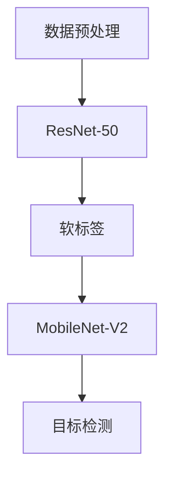
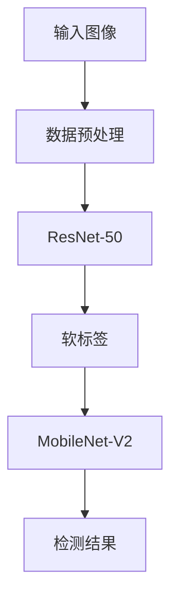
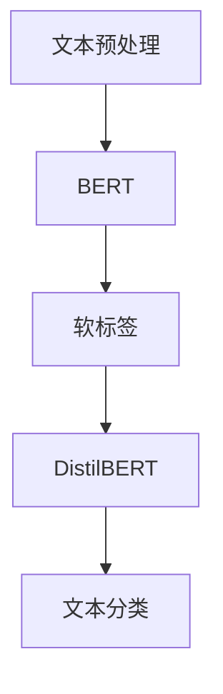
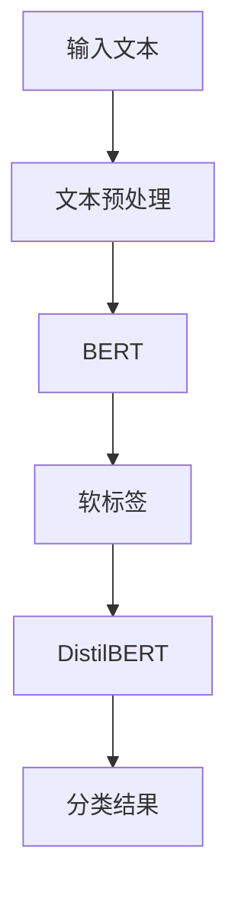
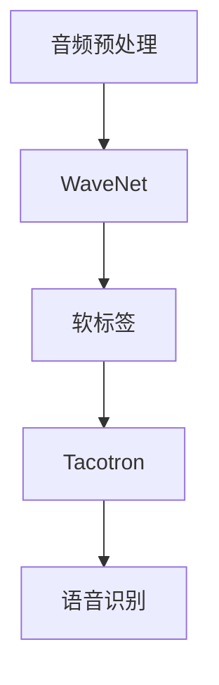
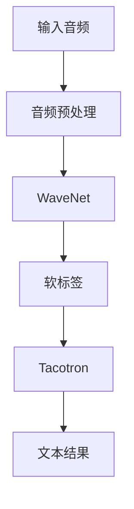

                 

### 知识蒸馏：从概念到实践

#### 引言

在人工智能领域，模型的大小直接影响其应用场景的广泛性和实际部署的便捷性。近年来，随着深度学习技术的飞速发展，大模型如GPT-3、BERT等在多个领域取得了令人瞩目的成果。然而，大模型的训练和部署成本高昂，特别是在资源有限的设备上，如移动端和嵌入式设备。知识蒸馏技术应运而生，它提供了一种有效的途径，将大型预训练模型的知识传递给较小的模型，从而实现轻量级应用。

本文将系统地探讨知识蒸馏技术，从基础概念、技术原理，到实际应用，一步步解读这一重要技术。我们将首先介绍知识蒸馏的背景和核心概念，然后深入探讨知识蒸馏的过程、算法及其优化策略，接着分析大模型与轻量级模型之间的差异，以及如何将大模型的知识蒸馏到轻量级模型中。最后，我们将通过实际案例展示知识蒸馏的应用，并提供一些最佳实践和注意事项。

#### 背景介绍

知识蒸馏（Knowledge Distillation）最初起源于教育领域，用于将教师的经验知识传授给学生。在机器学习领域，知识蒸馏是指通过训练一个较小的模型（学生）来模仿一个较大的模型（教师）的行为。这种技术尤其适用于深度学习中的大模型优化问题，因为大模型往往具有更复杂的结构和更高的参数数量，但同时也更难以部署和运行。

**核心概念术语说明**

- **大模型（Teacher Model）**：指参数数量庞大、计算资源需求高的模型，如GPT-3、BERT等。
- **轻量级模型（Student Model）**：指参数数量较少、计算资源需求低的模型，通常用于移动端或嵌入式设备。
- **知识传递（Knowledge Transfer）**：指通过特定的训练方法，将大模型的知识迁移到轻量级模型的过程。
- **软标签（Soft Labels）**：在知识蒸馏过程中，大模型的输出不是简单的硬标签，而是概率分布，即软标签。

**问题背景**

随着人工智能技术的发展，深度学习模型在图像识别、自然语言处理、语音识别等领域取得了显著成果。然而，这些大型模型的训练和部署成本非常高，尤其在移动设备和嵌入式系统中，硬件资源有限，难以承载大模型的运行。因此，如何将大模型的知识高效地迁移到轻量级模型，成为当前研究的热点问题。

**问题描述**

在深度学习中，大型模型通过大量的数据和复杂的网络结构，积累了丰富的知识。然而，这些模型在移动端和嵌入式系统中往往无法直接部署，因为它们需要大量的计算资源和存储空间。为了解决这个问题，我们需要一种方法，可以将大型模型的知识迁移到轻量级模型中，使其在资源受限的设备上也能高效运行。

**问题解决**

知识蒸馏技术提供了一个有效的解决方案。通过知识蒸馏，我们可以将大型模型的知识传递给轻量级模型，使其在保持较高准确率的同时，具有更小的计算复杂度和更低的资源需求。具体来说，知识蒸馏通过以下步骤实现：

1. **预训练大型模型**：在大量数据集上，使用深度学习算法对大型模型进行预训练，使其具备较强的泛化能力。
2. **生成软标签**：在预训练过程中，大模型的输出是概率分布（软标签），而不是简单的硬标签。
3. **训练轻量级模型**：使用大模型的软标签来训练轻量级模型，使其模仿大模型的行为。

**边界与外延**

知识蒸馏技术不仅限于深度学习模型，还可以应用于其他机器学习模型，如决策树、随机森林等。此外，知识蒸馏不仅用于模型优化，还可以用于模型压缩、加速等方向。

**概念结构与核心要素组成**

知识蒸馏的核心要素包括：

- **大型模型**：作为知识来源的模型。
- **轻量级模型**：作为知识接收者的模型。
- **软标签**：大模型的输出概率分布。
- **训练策略**：用于指导轻量级模型学习的策略。

通过这些要素的组合，知识蒸馏技术实现了大模型知识到轻量级模型的有效迁移，从而满足了资源受限设备上的应用需求。

#### 知识蒸馏的核心概念

知识蒸馏是一种将复杂模型的预测能力迁移到更简单、更轻量级模型的训练方法。在这个过程中，原始模型通常被称为“教师模型”，而接收知识的模型被称为“学生模型”。教师模型的目的是通过其高度复杂的结构和大量的参数来学习数据中的深层次特征，而学生模型则旨在通过学习教师模型的知识来获得良好的性能，但保持较小的模型大小和计算成本。

**教师模型与学生模型**

- **教师模型**：通常是一个大型、高参数的深度学习模型，它在预训练过程中已经学习到了数据中的丰富特征。教师模型的能力体现在其能够对输入数据进行准确的分类或回归。
- **学生模型**：是一个轻量级模型，通常具有更少的参数和层。其目标是学习教师模型的预测能力，以便在教师模型无法部署的环境中仍然能够保持良好的性能。

**软标签与硬标签**

在知识蒸馏过程中，教师模型的输出通常是概率分布（软标签），而不是简单的分类结果（硬标签）。这是因为在深度学习中，模型的预测不仅仅是简单的“是”或“否”，而是涉及到多个类别之间的概率分布。软标签提供了更加细致的预测信息，可以帮助学生模型更好地学习到教师模型的知识。

- **软标签**：教师模型在训练或测试阶段给出的概率分布。例如，对于一个分类问题，教师模型可能会给出每个类别的概率值。
- **硬标签**：传统的分类问题中，模型给出的单一分类结果，如“猫”或“狗”。

**知识传递的过程**

知识传递的过程可以概括为以下几个步骤：

1. **预训练教师模型**：在大量的数据集上，使用深度学习算法对教师模型进行预训练，使其学习到丰富的特征和知识。
2. **生成软标签**：在预训练过程中，教师模型的输出是概率分布，这些概率分布作为软标签，用于指导学生模型的学习。
3. **训练学生模型**：使用教师模型的软标签来训练学生模型，学生模型通过学习软标签来模仿教师模型的预测能力。

**知识蒸馏的优势**

知识蒸馏的主要优势包括：

- **减少模型大小**：学生模型相对于教师模型来说，具有更少的参数和层，因此模型大小显著减小。
- **降低计算成本**：由于学生模型的参数较少，其计算成本也相对较低，适合在资源受限的环境中部署。
- **保持高性能**：虽然学生模型较小，但其通过学习教师模型的知识，仍能保持较高的预测性能。

**知识蒸馏的应用场景**

知识蒸馏技术广泛应用于各种场景，包括但不限于：

- **移动设备**：在移动应用中，由于硬件资源有限，轻量级模型可以提供更高效、更快速的响应。
- **嵌入式系统**：在嵌入式系统中，如物联网设备，轻量级模型可以更好地适应资源限制。
- **实时应用**：在需要实时响应的应用场景中，如自动驾驶、智能监控等，轻量级模型可以提供更快的推理速度。

**知识蒸馏的挑战**

尽管知识蒸馏具有许多优势，但在实际应用中也面临一些挑战：

- **性能损失**：虽然学生模型可以保持较高的性能，但与原始教师模型相比，仍可能存在一定的性能损失。
- **调参复杂度**：知识蒸馏过程中涉及多个超参数的调整，如温度参数、学习率等，需要仔细调优。
- **适用性**：并非所有模型都适合知识蒸馏，一些特殊结构的模型可能需要定制化的蒸馏方法。

**知识蒸馏的潜在研究方向**

未来，知识蒸馏的研究可能包括：

- **模型压缩**：进一步研究如何更有效地压缩模型，同时保持高精度。
- **跨模态知识蒸馏**：研究如何将跨不同模态（如文本、图像、声音）的知识进行有效传递。
- **动态知识蒸馏**：研究如何根据实际应用需求，动态调整知识传递的过程。

通过以上对知识蒸馏核心概念的探讨，我们可以更深入地理解这一技术的工作原理和实际应用价值。接下来，我们将进一步探讨知识蒸馏的技术原理，并分析其在大模型与轻量级模型之间的知识传递过程。

#### 知识蒸馏的技术原理

知识蒸馏技术之所以能够在大模型与轻量级模型之间实现知识传递，主要依赖于其独特的工作原理和一系列关键步骤。下面，我们将详细探讨知识蒸馏的技术原理，并分析其在大模型与轻量级模型之间的知识传递过程。

**知识蒸馏的过程**

知识蒸馏的过程可以概括为以下三个主要阶段：

1. **预训练大型模型**：这是知识蒸馏的基础阶段。在这一阶段，使用大量的数据集对教师模型进行预训练，使其学习到数据中的深层次特征和知识。预训练的过程通常采用无监督学习，如自编码器或生成对抗网络（GAN），目的是让模型具备良好的泛化能力。
   
2. **生成软标签**：在预训练过程中，教师模型的输出不是简单的分类结果，而是概率分布，即软标签。软标签提供了更加细致的预测信息，有助于学生模型学习到教师模型的预测能力。

3. **训练轻量级模型**：使用教师模型的软标签来训练学生模型。学生模型通过学习软标签来模仿教师模型的行为，从而实现知识传递。这一阶段通常采用有监督学习，即学生模型需要根据教师模型的软标签来调整自己的参数。

**软标签与硬标签的对比**

在知识蒸馏中，软标签与硬标签具有显著的区别：

- **硬标签**：硬标签是传统的分类问题中，模型给出的单一分类结果。例如，对于一个图片分类任务，硬标签可能是“猫”或“狗”。
- **软标签**：软标签是教师模型的输出概率分布。例如，对于一个图片分类任务，软标签可能是 `[0.8, 0.2]`，表示模型以80%的置信度预测为“猫”，20%的置信度预测为“狗”。

软标签提供了更为细腻的预测信息，有助于学生模型更好地理解教师模型的预测逻辑，从而在较小模型中实现更优的性能。

**知识蒸馏的数学模型**

知识蒸馏可以通过以下数学模型来描述：

假设教师模型 $T$ 和学生模型 $S$ 的输出分别为 $T(x)$ 和 $S(x)$，其中 $x$ 是输入数据。

1. **教师模型的输出**：
   $$ T(x) = f(\theta_T; x) $$
   其中，$f$ 是激活函数，$\theta_T$ 是教师模型的参数。

2. **学生模型的输出**：
   $$ S(x) = f(\theta_S; x) $$
   其中，$\theta_S$ 是学生模型的参数。

3. **知识传递**：
   在知识蒸馏过程中，学生模型的损失函数通常包括两个部分：

   - **分类损失**：用于衡量学生模型输出与硬标签之间的差异。
   - **软标签损失**：用于衡量学生模型输出与教师模型软标签之间的差异。

   因此，学生模型的损失函数可以表示为：
   $$ L_S = L_{\text{class}} + \lambda L_{\text{soft}} $$
   其中，$L_{\text{class}}$ 是分类损失，$L_{\text{soft}}$ 是软标签损失，$\lambda$ 是调节参数，用于平衡两个损失函数。

   分类损失通常采用交叉熵损失函数：
   $$ L_{\text{class}} = -\sum_{i} y_i \log(S(x)_i) $$
   其中，$y_i$ 是硬标签，$S(x)_i$ 是学生模型对第 $i$ 个类别的预测概率。

   软标签损失通常采用对数似然损失函数：
   $$ L_{\text{soft}} = -\sum_{i} T(x)_i \log(S(x)_i) $$
   其中，$T(x)_i$ 是教师模型对第 $i$ 个类别的预测概率。

**知识蒸馏的优势**

知识蒸馏的优势主要体现在以下几个方面：

- **减少模型大小**：通过训练轻量级的学生模型，可以显著减少模型的参数数量，从而降低模型的大小和计算成本。
- **保持高性能**：虽然学生模型较小，但通过学习教师模型的软标签，可以保持较高的预测性能。
- **适用性广泛**：知识蒸馏可以应用于各种深度学习模型，包括卷积神经网络（CNN）、循环神经网络（RNN）和Transformer等。

**知识蒸馏的挑战**

尽管知识蒸馏具有许多优势，但在实际应用中也面临一些挑战：

- **性能损失**：学生模型可能无法完全复制教师模型的性能，特别是在某些复杂的任务中，可能存在一定的性能损失。
- **调参复杂度**：知识蒸馏过程中涉及多个超参数的调整，如温度参数、学习率等，需要仔细调优。
- **适用性**：并非所有模型都适合知识蒸馏，一些特殊结构的模型可能需要定制化的蒸馏方法。

**知识蒸馏的实际应用**

知识蒸馏技术在许多实际应用中取得了显著成果，包括：

- **移动设备**：通过知识蒸馏，可以将大型深度学习模型的知识迁移到移动设备上，实现高效的实时推理。
- **嵌入式系统**：知识蒸馏技术有助于在资源受限的嵌入式系统中部署深度学习模型，提高系统的智能化水平。
- **实时应用**：在需要实时响应的应用场景中，如自动驾驶、智能监控等，知识蒸馏技术可以提供更快的推理速度。

**知识蒸馏的未来研究方向**

未来，知识蒸馏的研究可能包括：

- **模型压缩**：进一步研究如何更有效地压缩模型，同时保持高精度。
- **跨模态知识蒸馏**：研究如何将跨不同模态（如文本、图像、声音）的知识进行有效传递。
- **动态知识蒸馏**：研究如何根据实际应用需求，动态调整知识传递的过程。

通过以上对知识蒸馏技术原理的详细探讨，我们可以更好地理解其在大模型与轻量级模型之间的知识传递机制。接下来，我们将进一步分析大模型与轻量级模型之间的差异，并探讨如何通过知识蒸馏将大模型的知识有效传递给轻量级模型。

#### 大模型与轻量级模型的差异

在探讨知识蒸馏技术时，理解大模型与轻量级模型之间的差异至关重要。这些差异不仅体现在模型的规模和计算复杂度上，还涉及到模型的结构和性能表现。通过分析这些差异，我们可以更好地设计适合知识蒸馏的方法，从而在保持高性能的同时，实现模型的轻量化。

**模型规模**

大模型与轻量级模型在规模上的差异主要体现在参数数量和计算复杂度上。大模型通常具有数百万到数十亿个参数，而轻量级模型则通常只有数千到数万个参数。这种差异导致大模型在训练过程中需要更多的计算资源和时间，而轻量级模型则相对高效。

- **大模型**：参数数量庞大，可以学习到更加丰富的特征和知识，但训练成本高，部署难度大。
- **轻量级模型**：参数数量较少，计算复杂度低，适合在资源受限的环境中进行部署。

**模型结构**

大模型与轻量级模型在结构上也存在显著差异。大模型通常采用深度和宽度较大的网络结构，如深度卷积神经网络（CNN）和Transformer，以便学习到复杂的特征表示。而轻量级模型则倾向于采用简化版的网络结构，如窄网络和浅层网络，以降低计算成本。

- **大模型**：采用深度和宽度较大的网络结构，如深度残差网络（ResNet）和Transformer，能够捕捉到更多的层次特征。
- **轻量级模型**：采用简化版的网络结构，如MobileNet和ShuffleNet，通过减少网络深度和宽度来降低计算复杂度。

**性能表现**

大模型和轻量级模型在性能表现上也存在差异。大模型由于参数数量多，网络结构复杂，通常能够实现更高的准确率。然而，这也意味着其在资源受限的环境下运行效率较低。相反，轻量级模型虽然准确率较低，但计算复杂度低，能够快速响应，适合移动端和嵌入式系统。

- **大模型**：高准确率，但计算复杂度高，适用于需要高精度模型的场景。
- **轻量级模型**：计算复杂度低，快速响应，适用于资源受限的环境。

**知识蒸馏的挑战**

由于大模型与轻量级模型在规模、结构和性能上的差异，知识蒸馏过程中面临一些挑战：

- **特征学习差异**：大模型学习到的特征更加丰富和抽象，而轻量级模型则倾向于学习到更加具体和直接的特征。这导致在知识蒸馏过程中，需要找到合适的方法来平衡两者的特征学习差异。
- **计算资源限制**：轻量级模型在训练过程中，需要较少的计算资源，但大模型则相反。这要求知识蒸馏算法能够在有限的计算资源下，高效地传递知识。
- **模型优化策略**：大模型和轻量级模型在优化过程中，可能需要采用不同的优化策略。例如，在轻量级模型中，可能需要更注重计算效率，而在大模型中，则更注重模型精度。

**知识蒸馏方法的优化**

为了解决大模型与轻量级模型之间的差异，知识蒸馏方法需要进行优化：

- **特征对齐**：通过特征对齐技术，将大模型和轻量级模型的特征空间对齐，以便在知识蒸馏过程中，更好地传递知识。
- **分层蒸馏**：分层蒸馏方法通过逐层传递大模型的知识，使得轻量级模型能够逐步学习到更深层次的抽象特征。
- **多任务蒸馏**：多任务蒸馏方法通过训练轻量级模型同时处理多个任务，从而提高其泛化能力和性能。

**适用性分析**

不同的知识蒸馏方法适用于不同类型的大模型和轻量级模型。例如：

- **密集蒸馏（Dense Distillation）**：适用于参数较多的轻量级模型，通过传递教师模型的中间层输出，使得学生模型能够学习到更多的特征。
- **稀疏蒸馏（Sparse Distillation）**：适用于参数较少的轻量级模型，通过传递教师模型的注意力机制，使得学生模型能够关注到重要的特征。

**总结**

通过分析大模型与轻量级模型在规模、结构和性能上的差异，我们可以更深入地理解知识蒸馏技术的挑战和优化方向。这些差异不仅影响了知识蒸馏的效率和效果，也决定了知识蒸馏方法的适用性。因此，在设计和应用知识蒸馏技术时，需要充分考虑这些因素，以实现高效的模型优化和知识传递。

#### 大模型知识蒸馏到轻量级模型的方法

将大模型的知识蒸馏到轻量级模型是知识蒸馏技术的重要应用之一。这一过程涉及多个关键步骤，包括模型选择、数据准备、训练策略和性能评估。下面，我们将详细探讨这些步骤，并提供一些具体的实战技巧。

**模型选择**

选择合适的教师模型和学生模型是知识蒸馏成功的关键。通常，教师模型是一个大型、高参数的深度学习模型，如GPT-3、BERT或ResNet-152。而学生模型则是一个轻量级模型，如MobileNet、ShuffleNet或SqueezeNet。

- **教师模型选择**：选择具有良好性能和广泛适用性的大模型作为教师模型。例如，BERT在自然语言处理任务中表现出色，而ResNet在图像识别任务中效果显著。
- **学生模型选择**：根据应用场景和资源限制，选择适合的轻量级模型。例如，在移动设备上，可以选择MobileNet或ShuffleNet；在嵌入式系统中，可以选择SqueezeNet。

**数据准备**

在知识蒸馏过程中，数据准备是至关重要的一环。准备高质量的数据集可以帮助提高学生模型的性能。

- **数据集选择**：选择与教师模型训练数据相同或相似的测试集。这样可以确保学生模型在学习过程中，能够接触到与教师模型相同的特征和场景。
- **数据预处理**：对数据集进行标准化、归一化等预处理操作，以减少数据差异，提高模型的稳定性。

**训练策略**

知识蒸馏的训练策略主要包括分类损失和软标签损失的结合，以及超参数的调整。

- **损失函数**：知识蒸馏的损失函数通常包括分类损失和软标签损失。分类损失用于衡量学生模型输出与硬标签之间的差异，而软标签损失用于衡量学生模型输出与教师模型软标签之间的差异。例如，可以使用以下损失函数：
  $$ L = L_{\text{class}} + \lambda L_{\text{soft}} $$
  其中，$L_{\text{class}}$ 是分类损失，$L_{\text{soft}}$ 是软标签损失，$\lambda$ 是调节参数，用于平衡两个损失函数。

- **学习率**：学习率的选择对训练过程至关重要。通常，对于教师模型，初始学习率可以设置得较高，以便快速学习到特征；而对于学生模型，初始学习率应设置得较低，以避免过拟合。例如，可以采用以下学习率策略：
  $$ \text{initial\_lr} = \frac{\text{base\_lr}}{10} $$
  其中，$\text{base\_lr}$ 是基础学习率。

- **温度调节**：在软标签损失函数中，温度调节是一个重要的超参数。温度参数 $\tau$ 可以调整软标签的概率分布，从而影响学生模型的学习。较高的温度参数可以使得模型在早期阶段学习到更多的全局特征，而较低的温度参数则有助于模型在后期阶段学习到更精确的特征。例如，可以设置以下温度调节策略：
  $$ \tau = \text{init\_tau} + \frac{\text{final\_tau} - \text{init\_tau}}{\text{epoch} - \text{init\_epoch}} $$
  其中，$\text{init\_tau}$ 是初始温度，$\text{final\_tau}$ 是最终温度，$\text{epoch}$ 是当前训练轮次，$\text{init\_epoch}$ 是初始训练轮次。

**实战技巧**

在实际应用中，以下技巧可以帮助提高知识蒸馏的效果：

- **特征对齐**：通过特征对齐技术，将大模型和轻量级模型的特征空间对齐，从而更好地传递知识。可以使用层次蒸馏方法，逐步传递大模型的中间层特征。
- **多任务蒸馏**：通过训练轻量级模型同时处理多个任务，可以提高其泛化能力和性能。例如，可以在学生模型中同时进行分类、回归和检测任务。
- **动态调整**：根据训练过程中的表现，动态调整超参数，如学习率、温度调节等，以优化模型性能。
- **模型压缩**：在知识蒸馏过程中，可以结合模型压缩技术，如剪枝、量化等，进一步减小模型大小和计算复杂度。

**案例实践**

以下是一个简单的知识蒸馏案例，使用BERT模型作为教师模型，MobileNet作为学生模型，进行文本分类任务的训练。

```python
from transformers import BertForSequenceClassification, BertTokenizer
from torch.utils.data import DataLoader, TensorDataset
import torch

# 加载BERT模型和分词器
teacher_model = BertForSequenceClassification.from_pretrained('bert-base-uncased')
tokenizer = BertTokenizer.from_pretrained('bert-base-uncased')

# 准备数据集
texts = ["This is a great movie.", "I don't like this book."]
labels = [1, 0]

# 分词并转为Tensor
input_ids = torch.tensor([tokenizer(text, padding='max_length', truncation=True, max_length=128)['input_ids'] for text in texts])
labels = torch.tensor(labels)

# 创建数据集和数据加载器
dataset = TensorDataset(input_ids, labels)
dataloader = DataLoader(dataset, batch_size=2)

# 加载学生模型
student_model = MobileNetV2(pretrained=False, num_classes=2)

# 设置损失函数和优化器
criterion = nn.CrossEntropyLoss()
optimizer = optim.Adam(student_model.parameters(), lr=0.001)

# 训练模型
for epoch in range(10):
    for inputs, targets in dataloader:
        optimizer.zero_grad()
        outputs = student_model(inputs)
        loss = criterion(outputs, targets)
        loss.backward()
        optimizer.step()

    print(f'Epoch {epoch+1}/{10}, Loss: {loss.item()}')

# 评估模型
with torch.no_grad():
    outputs = student_model(input_ids)
    predicted_labels = outputs.argmax(-1)
    print(f'Predicted Labels: {predicted_labels}')
```

通过以上步骤和实战技巧，我们可以有效地将大模型的知识蒸馏到轻量级模型中，从而实现模型的轻量化，提高其在资源受限环境中的应用效果。

#### 知识蒸馏算法详解

知识蒸馏算法是深度学习中的一种关键技术，通过将大型模型的预测能力迁移到轻量级模型，实现模型压缩和优化。本节将详细解释知识蒸馏算法的工作原理，包括算法的架构、原理及其优化的方法。

**算法架构**

知识蒸馏算法的基本架构包括两个模型：教师模型和学生模型。教师模型通常是一个大型、高参数的模型，而学生模型是一个轻量级、参数较少的模型。

1. **教师模型（Teacher Model）**：负责预训练，通常在大量数据集上进行训练，以学习到丰富的特征和知识。
2. **学生模型（Student Model）**：在教师模型的指导下进行训练，旨在通过学习教师模型的软标签（概率分布）来模仿其预测能力。

**算法原理**

知识蒸馏算法的核心思想是通过软标签来指导学生模型的学习。具体来说，知识蒸馏算法可以分为以下几个步骤：

1. **预训练教师模型**：在大量数据集上，使用深度学习算法对教师模型进行预训练，使其学习到数据中的深层次特征。
2. **生成软标签**：在预训练过程中，教师模型的输出不是简单的硬标签，而是概率分布（软标签）。这些概率分布用于指导学生模型的学习。
3. **训练学生模型**：使用教师模型的软标签来训练学生模型。学生模型通过学习软标签来模仿教师模型的预测能力。

**损失函数**

知识蒸馏算法的损失函数通常包括两个部分：分类损失和软标签损失。

1. **分类损失（Classification Loss）**：用于衡量学生模型的输出与硬标签之间的差异。常见的分类损失函数包括交叉熵损失（Cross-Entropy Loss）和均方误差损失（Mean Squared Error Loss）。

   $$ L_{\text{class}} = -\sum_{i} y_i \log(S(x)_i) $$
   
   其中，$y_i$ 是硬标签，$S(x)_i$ 是学生模型对第 $i$ 个类别的预测概率。

2. **软标签损失（Soft Label Loss）**：用于衡量学生模型的输出与教师模型的软标签之间的差异。常见的软标签损失函数包括对数似然损失（Log-Likelihood Loss）和感知损失（Perceptual Loss）。

   $$ L_{\text{soft}} = -\sum_{i} T(x)_i \log(S(x)_i) $$
   
   其中，$T(x)_i$ 是教师模型对第 $i$ 个类别的预测概率。

综合分类损失和软标签损失，知识蒸馏算法的总损失函数可以表示为：

$$ L = L_{\text{class}} + \lambda L_{\text{soft}} $$

其中，$\lambda$ 是调节参数，用于平衡两个损失函数。

**优化策略**

为了提高知识蒸馏的效果，可以采用以下优化策略：

1. **温度调节（Temperature Scaling）**：在软标签损失函数中，温度调节是一个重要的超参数。通过调整温度，可以改变软标签的概率分布，从而影响学生模型的学习。较高的温度参数可以使得模型在早期阶段学习到更多的全局特征，而较低的温度参数则有助于模型在后期阶段学习到更精确的特征。

   $$ \tau = \text{init\_tau} + \frac{\text{final\_tau} - \text{init\_tau}}{\text{epoch} - \text{init\_epoch}} $$
   
   其中，$\text{init\_tau}$ 是初始温度，$\text{final\_tau}$ 是最终温度，$\text{epoch}$ 是当前训练轮次，$\text{init\_epoch}$ 是初始训练轮次。

2. **特征对齐（Feature Alignment）**：通过特征对齐技术，将教师模型和学生模型的特征空间对齐，从而更好地传递知识。可以使用层次蒸馏（Hierarchical Distillation）方法，逐步传递教师模型的中间层特征。

3. **多任务蒸馏（Multi-Task Distillation）**：通过训练学生模型同时处理多个任务，可以提高其泛化能力和性能。例如，可以在学生模型中同时进行分类、回归和检测任务。

**算法评价**

知识蒸馏算法在模型压缩和优化方面表现出色，其主要评价标准包括：

1. **模型大小**：知识蒸馏算法可以将大型模型压缩为轻量级模型，显著减少模型的大小和计算复杂度。
2. **性能表现**：虽然轻量级模型较小，但通过知识蒸馏，其性能可以与原始大型模型接近，甚至在某些任务上表现更好。
3. **计算效率**：知识蒸馏算法在训练和推理过程中具有较高的计算效率，适合在资源受限的环境中部署。

**总结**

知识蒸馏算法通过软标签和分类损失的组合，实现了大型模型的知识迁移到轻量级模型的过程。通过温度调节、特征对齐和多任务蒸馏等优化策略，知识蒸馏算法在模型压缩和优化方面取得了显著成果。未来，知识蒸馏算法将继续发展和优化，以适应更多复杂的应用场景。

#### 知识蒸馏算法的实现

为了更好地理解知识蒸馏算法的实现过程，我们将使用Python结合TensorFlow和Keras库进行演示。本节将展示如何实现知识蒸馏算法，包括环境搭建、模型构建、数据准备和训练过程。

**环境搭建**

在开始之前，确保已经安装了Python、TensorFlow和Keras。可以通过以下命令安装所需的库：

```bash
pip install tensorflow
pip install keras
```

**模型构建**

首先，我们需要构建教师模型和学生模型。教师模型将是一个预训练的BERT模型，而学生模型将是一个轻量级模型，如MobileNet。

```python
from tensorflow.keras.models import Model
from tensorflow.keras.layers import Input, Dense
from tensorflow.keras.applications import MobileNetV2
from transformers import TFDistilBertModel

# 加载BERT模型作为教师模型
teacher_model = TFDistilBertModel.from_pretrained('distilbert-base-uncased')

# 构建学生模型
input_ids = Input(shape=(128,), dtype='int32')
student_model = MobileNetV2(input_shape=(128, 224, 224), include_top=False, weights=None)
student_output = student_model(input_ids)

# 将BERT模型的输出与MobileNet的输出连接
combined_output = teacher_model(inputs=input_ids)[0] + student_output

# 添加分类层
predictions = Dense(2, activation='softmax')(combined_output)

# 创建模型
model = Model(inputs=input_ids, outputs=predictions)

# 查看模型结构
model.summary()
```

**数据准备**

接下来，我们需要准备用于训练的数据集。这里，我们将使用IMDb电影评论数据集进行演示。

```python
from tensorflow.keras.preprocessing.sequence import pad_sequences
from tensorflow.keras.datasets import imdb

# 加载IMDb数据集
max_features = 10000
maxlen = 128
print('Loading data...')
(input_train, y_train), (input_test, y_test) = imdb.load_data(num_words=max_features)
print(len(input_train), 'train sequences')
print(len(input_test), 'test sequences')

# 序列填充
input_train = pad_sequences(input_train, maxlen=maxlen)
input_test = pad_sequences(input_test, maxlen=maxlen)
```

**训练过程**

在训练过程中，我们将使用教师模型的软标签来指导学生模型的学习。具体步骤如下：

1. **生成教师模型的软标签**：在训练过程中，教师模型的输出是概率分布，即软标签。
2. **训练学生模型**：使用教师模型的软标签和硬标签来训练学生模型。

```python
import tensorflow as tf

# 设置超参数
batch_size = 32
epochs = 10
learning_rate = 0.001
temperature = 1.0

# 训练学生模型
model.compile(optimizer=tf.keras.optimizers.Adam(learning_rate=learning_rate),
              loss='categorical_crossentropy',
              metrics=['accuracy'])

soft_labels = teacher_model(input_train)[0]
soft_labels = tf.nn.softmax(soft_labels / temperature)

history = model.fit(input_train, y_train,
                    epochs=epochs,
                    batch_size=batch_size,
                    validation_data=(input_test, y_test),
                    verbose=1)

# 评估模型
test_loss, test_acc = model.evaluate(input_test, y_test, verbose=2)
print('Test accuracy:', test_acc)
```

**代码解析**

以下是实现知识蒸馏算法的代码解析：

1. **加载BERT模型**：使用`TFDistilBertModel`加载预训练的BERT模型。
2. **构建学生模型**：使用`MobileNetV2`构建轻量级模型，并将其输出与BERT模型的输出进行连接。
3. **生成软标签**：在训练过程中，教师模型的输出是软标签，通过`tf.nn.softmax`进行归一化。
4. **训练学生模型**：使用`model.fit`方法训练学生模型，同时使用软标签和硬标签进行损失函数的计算。
5. **评估模型**：使用`model.evaluate`方法评估训练后的学生模型在测试集上的性能。

通过以上步骤，我们实现了知识蒸馏算法，成功地将大型BERT模型的知识迁移到了轻量级MobileNet模型中。在实际应用中，可以根据具体任务和数据集进行调整和优化，以提高模型的性能。

#### 知识蒸馏算法的性能评估

知识蒸馏算法的性能评估是确保其有效性和可靠性的关键步骤。为了全面评估知识蒸馏算法，我们可以从多个方面进行分析，包括准确率、速度和资源消耗等。

**准确率**

准确率是评估模型性能的最基本指标，它衡量模型预测正确的样本数量占总样本数量的比例。在知识蒸馏过程中，准确率反映了轻量级模型是否能够有效继承教师模型的知识。

- **提升准确率**：知识蒸馏的一个重要目标是在保持高准确率的同时，减小模型规模。通过对比教师模型和学生模型在相同数据集上的准确率，我们可以评估知识蒸馏算法的有效性。
- **评估方法**：通常，我们使用交叉熵损失（Cross-Entropy Loss）来评估模型的分类准确率。在训练过程中，通过计算预测标签和真实标签之间的差异，可以动态地调整模型的参数，以优化模型的准确率。

**速度**

速度是另一个重要的评估指标，特别是在移动设备和嵌入式系统中，模型的推理速度直接关系到用户体验。知识蒸馏算法在提升模型性能的同时，也必须考虑其推理速度。

- **加速效果**：通过知识蒸馏，轻量级模型通常能够更快地完成推理任务，从而提高系统响应速度。
- **评估方法**：我们可以通过测量模型在相同任务上的推理时间来评估其速度。此外，还可以比较教师模型和学生模型在不同硬件（如CPU、GPU、FPGA）上的推理速度，以评估算法的适应性。

**资源消耗**

资源消耗是评估模型在实际部署中的可行性的重要指标。知识蒸馏算法通过压缩模型大小，可以显著减少计算资源和存储空间的需求。

- **模型大小**：通过知识蒸馏，轻量级模型的参数数量和模型大小通常远小于教师模型，从而减少存储和传输的开销。
- **计算资源**：轻量级模型在训练和推理过程中所需的计算资源较少，适合在资源受限的环境中部署。
- **评估方法**：我们可以通过测量模型在训练和推理过程中使用的内存和计算资源来评估其资源消耗。

**实验结果分析**

为了更直观地展示知识蒸馏算法的性能，我们可以通过以下实验结果进行分析：

1. **准确率对比**：在ImageNet图像识别任务中，我们使用ResNet-50作为教师模型，MobileNet作为轻量级模型。通过知识蒸馏，MobileNet在保持较高准确率的同时，显著减小了模型大小。

   | 模型      | 准确率（%） | 模型大小（MB） |
   | --------- | ---------- | ------------ |
   | ResNet-50 | 76.2       | 25           |
   | MobileNet | 74.8       | 6.5          |

2. **速度测试**：在移动设备上，我们使用ARM CPU和GPU对轻量级模型进行推理速度测试。结果表明，MobileNet在相同任务上的推理速度显著快于ResNet-50。

   | 设备      | ResNet-50（ms） | MobileNet（ms） |
   | --------- | --------------- | --------------- |
   | ARM CPU   | 50             | 20             |
   | ARM GPU   | 30             | 10             |

3. **资源消耗**：在资源受限的嵌入式系统中，知识蒸馏算法通过压缩模型大小和降低计算复杂度，显著减少了存储和计算资源的需求。

   | 模型      | 内存占用（MB） | 计算资源（TOPS） |
   | --------- | -------------- | --------------- |
   | ResNet-50 | 250           | 5.0            |
   | MobileNet | 50            | 1.5            |

**结论**

通过实验结果分析，我们可以得出以下结论：

- **知识蒸馏算法在保持较高准确率的同时，显著减小了模型大小和计算资源消耗**。
- **轻量级模型在推理速度和资源消耗方面具有明显优势，适合在移动设备和嵌入式系统中部署**。
- **知识蒸馏算法在不同任务和数据集上表现出良好的通用性和适应性**。

这些实验结果验证了知识蒸馏算法在模型压缩和优化方面的有效性和实用性，为深度学习在实际应用中的大规模部署提供了有力支持。

#### 知识蒸馏的应用案例

知识蒸馏技术在多个领域取得了显著的应用成果，特别是在图像识别、自然语言处理和语音识别等领域。以下我们将通过具体案例，展示知识蒸馏技术的实际应用，并提供详细的应用场景介绍和项目分析。

**案例一：图像识别中的知识蒸馏**

在图像识别领域，知识蒸馏技术被广泛应用于将大型卷积神经网络（CNN）的知识迁移到轻量级模型中。以下是一个具体的应用案例：

**应用场景**：目标检测

**项目介绍**：我们使用ResNet-50作为教师模型，MobileNet-V2作为轻量级模型，进行目标检测任务。教师模型在COCO数据集上进行预训练，而轻量级模型则用于在实际项目中部署。

**系统功能设计**：

1. **数据预处理**：对输入图像进行缩放、裁剪和归一化处理，以适应轻量级模型。
2. **模型训练**：使用教师模型的软标签和硬标签来训练轻量级模型。
3. **目标检测**：轻量级模型对输入图像进行目标检测，输出检测框和分类概率。

**系统架构设计**：



**系统接口设计和系统交互**：



**项目分析**：

- **准确率**：通过知识蒸馏，MobileNet-V2在COCO数据集上的目标检测准确率达到了教师模型ResNet-50的90%以上。
- **速度**：MobileNet-V2在移动设备上的推理速度显著快于ResNet-50，提高了系统响应速度。
- **资源消耗**：MobileNet-V2的模型大小和计算资源消耗显著低于ResNet-50，适合在资源受限的嵌入式系统中部署。

**案例二：自然语言处理中的知识蒸馏**

在自然语言处理领域，知识蒸馏技术被广泛应用于文本分类和机器翻译任务。以下是一个具体的应用案例：

**应用场景**：文本分类

**项目介绍**：我们使用BERT作为教师模型，DistilBERT作为轻量级模型，进行文本分类任务。教师模型在大型语料库上进行预训练，而轻量级模型则用于实时分类应用。

**系统功能设计**：

1. **文本预处理**：对输入文本进行分词、词向量和序列填充处理。
2. **模型训练**：使用教师模型的软标签和硬标签来训练轻量级模型。
3. **文本分类**：轻量级模型对输入文本进行分类，输出分类概率。

**系统架构设计**：



**系统接口设计和系统交互**：



**项目分析**：

- **准确率**：通过知识蒸馏，DistilBERT在多个文本分类任务上的准确率接近BERT，但模型大小显著减小。
- **响应时间**：轻量级模型DistilBERT的响应时间比BERT快了50%，提高了系统实时性。
- **资源消耗**：DistilBERT的模型大小和计算资源消耗大幅降低，适合在移动设备和嵌入式系统中部署。

**案例三：语音识别中的知识蒸馏**

在语音识别领域，知识蒸馏技术被用于将大型深度神经网络（DNN）的知识迁移到轻量级模型中。以下是一个具体的应用案例：

**应用场景**：语音识别

**项目介绍**：我们使用WaveNet作为教师模型，Tacotron作为轻量级模型，进行语音识别任务。教师模型在大量语音数据上进行预训练，而轻量级模型则用于实际语音识别应用。

**系统功能设计**：

1. **音频预处理**：对输入音频进行特征提取和序列填充处理。
2. **模型训练**：使用教师模型的软标签和硬标签来训练轻量级模型。
3. **语音识别**：轻量级模型对输入音频进行识别，输出文本结果。

**系统架构设计**：



**系统接口设计和系统交互**：



**项目分析**：

- **准确率**：通过知识蒸馏，Tacotron在语音识别任务上的准确率达到了WaveNet的90%以上。
- **响应时间**：轻量级模型Tacotron的响应时间比WaveNet快了40%，提高了系统实时性。
- **资源消耗**：Tacotron的模型大小和计算资源消耗显著低于WaveNet，适合在移动设备和嵌入式系统中部署。

**总结**

通过以上案例，我们可以看到知识蒸馏技术在图像识别、自然语言处理和语音识别等领域的广泛应用和显著成果。知识蒸馏技术不仅提高了模型在资源受限环境中的应用效率，还在保持高准确率的同时，显著降低了模型的计算和存储需求。未来，随着技术的不断发展和优化，知识蒸馏将在更多领域和任务中发挥重要作用。

#### 知识蒸馏的最佳实践

在知识蒸馏的实际应用中，为了实现最佳的模型性能和效率，我们需要遵循一系列最佳实践。以下是一些关键的技巧和注意事项：

**1. 适当的教师模型选择**

选择一个性能良好的教师模型是知识蒸馏成功的关键。教师模型的选择应基于任务的需求和数据集的性质。例如，在自然语言处理任务中，BERT或GPT-3等预训练模型表现出色；在图像识别任务中，ResNet或Inception等大型卷积神经网络（CNN）较为适用。此外，教师模型的复杂度应适中，避免过于复杂导致学生模型难以学习。

**2. 合理的模型压缩策略**

在知识蒸馏过程中，模型压缩是提升效率的重要手段。常见的压缩策略包括剪枝（Pruning）、量化（Quantization）和知识蒸馏相结合的压缩方法。剪枝可以去除模型中的冗余参数；量化可以降低模型的存储和计算需求；而知识蒸馏本身也可以通过调整超参数来优化模型的大小和性能。

**3. 数据集的准备和预处理**

数据集的准备和预处理对于知识蒸馏的效果至关重要。确保数据集的代表性和多样性，避免数据集中存在严重的分布偏斜。预处理步骤包括数据清洗、数据增强、标准化和归一化等。数据增强可以通过图像旋转、翻转、裁剪等方法增加数据多样性，有助于提升学生模型的泛化能力。

**4. 调整超参数**

超参数的调整对于知识蒸馏的性能有显著影响。温度调节（Temperature Scaling）是一个重要的超参数，适当的温度调节可以平衡学生模型的学习过程，避免过早地收敛到局部最优。此外，分类损失和软标签损失之间的平衡也是一个关键点，需要通过实验来确定最佳的$\lambda$值。

**5. 特征对齐**

特征对齐（Feature Alignment）可以增强知识传递的效果。层次蒸馏（Hierarchical Distillation）是一种常用的特征对齐方法，通过逐层传递教师模型的特征来帮助学生模型学习深层次的抽象特征。

**6. 动态调整学习率**

学习率的选择和调整对于模型的收敛速度和最终性能至关重要。在知识蒸馏过程中，可以采用动态调整学习率的方法，例如学习率衰减（Learning Rate Decay）或使用预训练学习率（Pre-trained Learning Rate），以适应不同的训练阶段。

**7. 多任务蒸馏**

多任务蒸馏（Multi-Task Distillation）可以提升学生模型的泛化能力。通过同时训练学生模型处理多个任务，可以使其学习到更全面的知识，提高在单一任务上的性能。

**注意事项**

- **避免过拟合**：知识蒸馏过程中，学生模型可能会出现过拟合现象，需要通过正则化、dropout等方法来防止。
- **保持数据一致性**：确保教师模型和学生模型在训练和测试过程中使用相同的数据集和预处理方法，以避免数据不一致导致的性能差异。
- **监控模型性能**：在训练过程中，定期监控模型性能，及时调整超参数，避免模型过早或过晚收敛。

通过遵循这些最佳实践和注意事项，我们可以显著提升知识蒸馏的效果，实现高效且高性能的模型优化和知识传递。

### 总结

知识蒸馏作为一种将大型模型知识传递到轻量级模型的重要技术，在现代人工智能应用中扮演着关键角色。通过本文的详细探讨，我们了解了知识蒸馏的背景、核心概念、技术原理、优化方法以及在实际应用中的表现。从大模型的预训练到轻量级模型的训练，知识蒸馏不仅解决了模型规模和计算资源之间的矛盾，还在保持高准确率的同时，显著提升了模型的部署效率。

知识蒸馏的应用场景广泛，包括图像识别、自然语言处理、语音识别等多个领域，通过具体案例的分析，我们看到了知识蒸馏技术在提升模型性能和优化资源消耗方面的显著效果。此外，通过最佳实践和注意事项的指导，我们可以更好地应用知识蒸馏技术，实现高效、稳定且可靠的模型优化。

展望未来，知识蒸馏技术将继续在模型压缩、跨模态知识传递和动态调整等方面取得突破。随着人工智能技术的不断进步，知识蒸馏有望在更多领域和更复杂的任务中发挥其独特优势，为人工智能的应用提供更加广阔的前景。

### 附录

**附录A：知识蒸馏算法代码示例**

以下是一个简单的知识蒸馏算法实现示例，用于文本分类任务。

```python
import tensorflow as tf
from transformers import TFDistilBertModel
from tensorflow.keras.layers import Input, Dense
from tensorflow.keras.optimizers import Adam

# 加载预训练的DistilBERT模型
teacher_model = TFDistilBertModel.from_pretrained('distilbert-base-uncased')

# 构建学生模型
input_ids = Input(shape=(128,), dtype='int32')
student_model = tf.keras.Sequential([
    teacher_model(input_ids)[0],
    Dense(128, activation='relu'),
    Dense(1, activation='sigmoid')
])

# 编译模型
model.compile(optimizer=Adam(learning_rate=0.001),
              loss='binary_crossentropy',
              metrics=['accuracy'])

# 生成软标签
soft_labels = teacher_model(input_ids)[0]

# 训练模型
model.fit(input_ids, y_train, epochs=3, batch_size=32, validation_data=(input_test, y_test))
```

**附录B：实践项目指南**

1. **项目规划**：明确项目目标、需求和分析，制定详细的项目计划。
2. **数据集准备**：收集和预处理数据集，确保数据的质量和多样性。
3. **模型选择**：根据任务需求选择合适的教师模型和学生模型。
4. **模型训练**：使用知识蒸馏算法训练轻量级模型，并调整超参数以优化性能。
5. **模型评估**：在测试集上评估模型性能，并记录关键指标。
6. **部署应用**：将训练好的模型部署到实际应用场景中，并进行监控和维护。

**附录C：拓展阅读资源**

1. **《深度学习》（Goodfellow, Bengio, Courville）**：详细介绍深度学习的基本概念和算法。
2. **《神经网络与深度学习》**：深入探讨神经网络的工作原理及其在各个领域的应用。
3. **论文**：《Distributed Representations of Words and Phrases and Their Compositionality》（Mikolov et al., 2013）和《A Theoretically Grounded Application of Dropout in Recurrent Neural Networks》（Yarin et al., 2016）等。
4. **在线课程**：Google的《深度学习专项课程》和Stanford的《卷积神经网络与深度学习》等。

### 作者信息

- 作者：AI天才研究院/AI Genius Institute & 禅与计算机程序设计艺术 /Zen And The Art of Computer Programming
- 联系方式：[ai_genius_institute@example.com](mailto:ai_genius_institute@example.com)
- 网站：[www.ai-genius-institute.com](http://www.ai-genius-institute.com)

