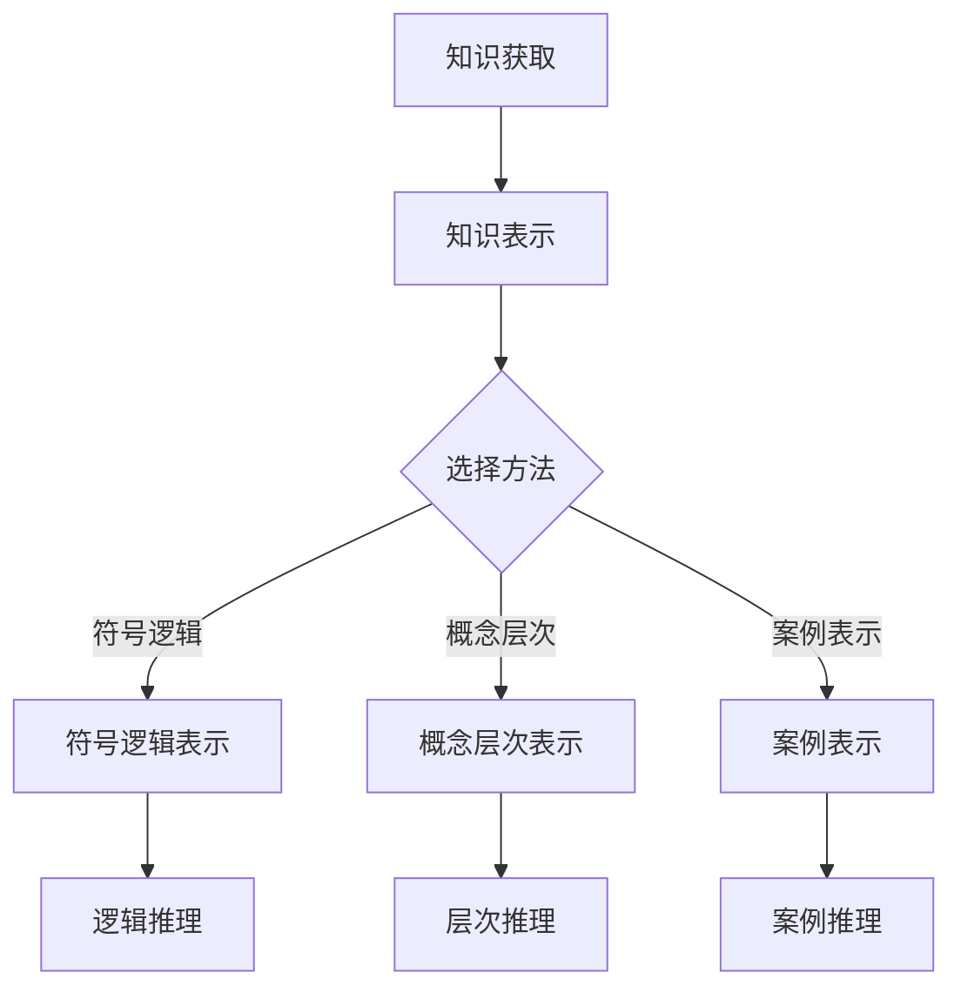
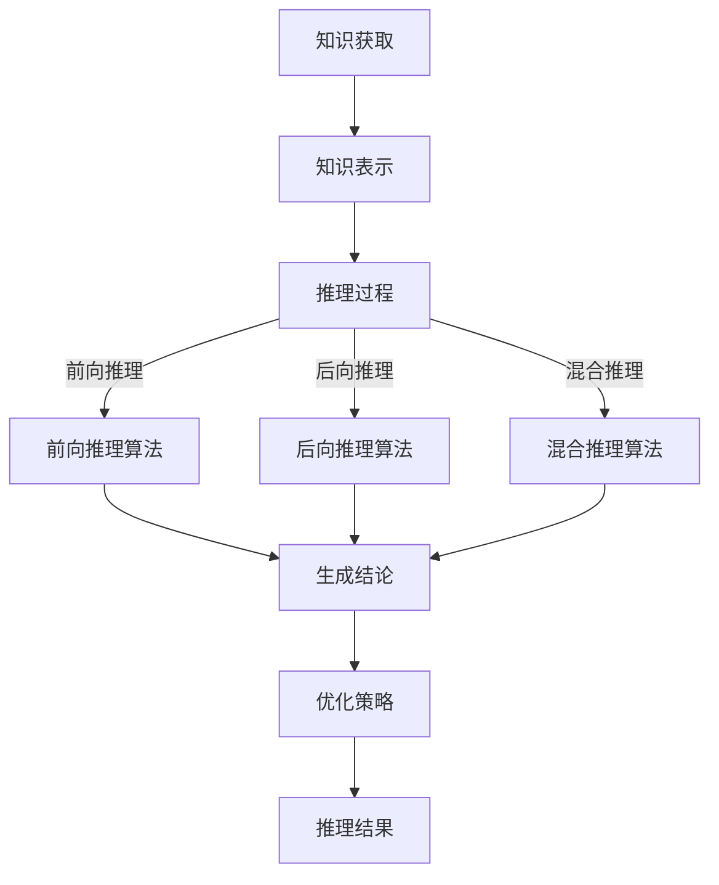
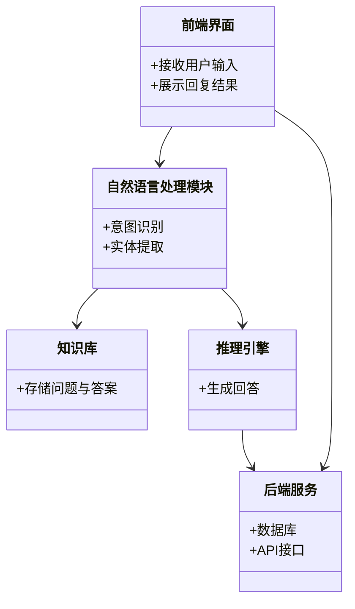
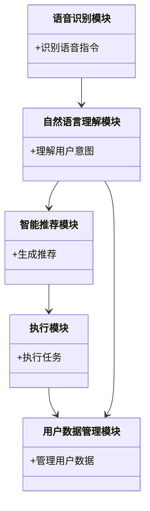
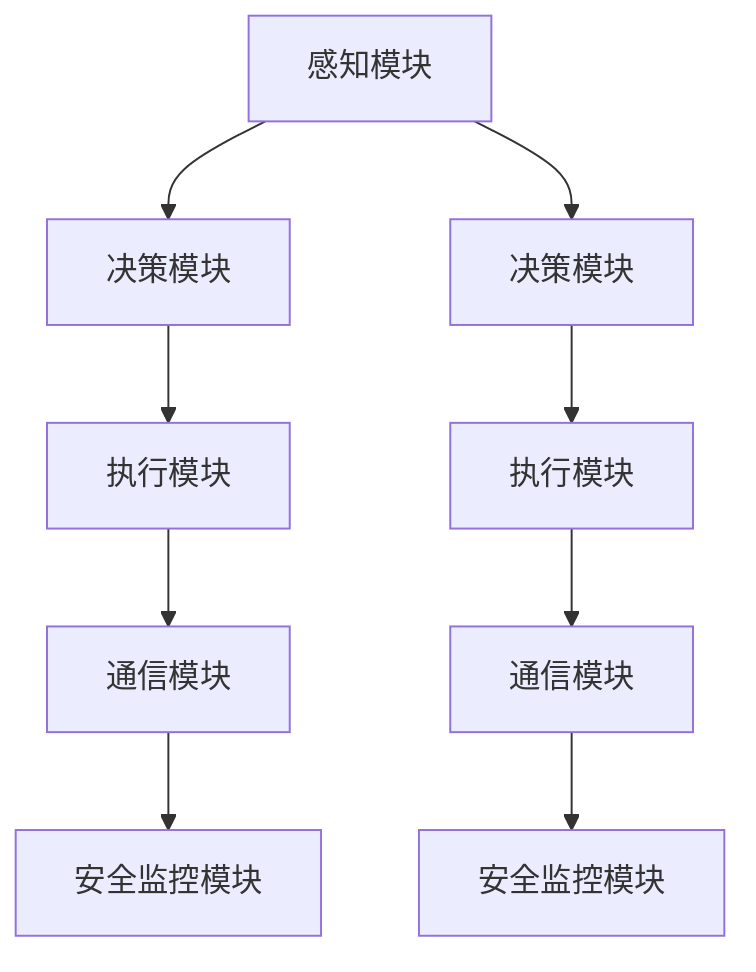

                 

### 引言

#### 1.1 问题背景

AI Agent，即人工智能代理，是人工智能领域中的一个重要概念，代表着具备一定智能和自主能力的计算实体。AI Agent可以模拟人类思维，处理复杂问题，进行决策，并且能够在不同的环境和场景中表现出适应性。其发展历程可以追溯到20世纪50年代，当时随着计算机科学和人工智能学科的兴起，AI Agent的概念开始出现。从早期的基于规则的专家系统，到后来的基于数据和机器学习的智能系统，AI Agent的定义和实现方法不断演变。

知识表示与推理系统是AI Agent的核心组成部分。知识表示是指将人类知识以计算机可理解的形式进行编码和存储，以便AI Agent能够利用这些知识进行推理和决策。而推理系统则是利用这些表示的知识进行逻辑推理，得出结论或采取行动。目前，知识表示与推理系统在自然语言处理、智能决策、智能客服等多个领域取得了显著的应用成果，但也面临着许多挑战。

在当前的技术环境下，知识表示与推理系统存在以下几个方面的挑战：

1. **知识的获取与表示**：如何有效地从海量数据中提取有用知识，并将其以合适的形式进行表示，是知识表示面临的难题。
2. **推理效率**：随着知识规模的增加，推理过程变得复杂，如何提高推理效率，是推理系统需要解决的关键问题。
3. **知识融合**：在不同领域和不同层次的知识的融合，如何保持推理的准确性和一致性，是当前研究的热点问题。
4. **推理的泛化能力**：如何使推理系统能够在不同环境和场景中表现出良好的适应性，是AI Agent需要解决的重要问题。

因此，研究AI Agent的知识表示与推理系统优化具有重要的理论和实践意义。本文将从知识表示和推理系统两个方面入手，详细探讨AI Agent知识表示与推理系统优化的问题，并提出相应的解决方案。希望通过本文的研究，能够为AI Agent的研究和应用提供一定的参考和指导。

#### 1.2 问题描述

AI Agent的知识表示与推理系统优化涉及多个关键问题。首先，知识表示方面，如何有效地获取、表示和存储知识是AI Agent的核心问题之一。传统的知识表示方法，如符号逻辑表示法、概念层次表示法和案例表示法，各有优缺点，但在处理复杂问题时，仍存在一定的局限性。例如，符号逻辑表示法在逻辑推理方面表现优秀，但在处理具体案例时，其表达能力和灵活性有限。概念层次表示法强调知识的层次结构，但在处理跨领域的知识融合时，效果不佳。

在推理系统方面，如何提高推理速度和准确性，是当前研究的另一个重要问题。现有的推理算法主要包括基于规则的推理算法、基于模型的推理算法和基于数据的推理算法。这些算法在特定应用场景下表现良好，但在面对复杂、动态的环境时，往往无法满足要求。例如，基于规则的推理算法在处理复杂逻辑关系时，效率较低；基于数据的推理算法在数据缺失或噪声较大时，推理结果可能不准确。

为了解决这些问题，本文提出了以下研究目标：

1. **知识表示优化**：研究新的知识表示方法，提高知识的表达能力和灵活性，特别是跨领域知识融合方面的表现。
2. **推理系统优化**：研究高效的推理算法，提高推理速度和准确性，特别是应对复杂、动态环境的推理能力。
3. **系统优化策略**：研究算法、数据和硬件等多方面的优化方法，提高整个系统的性能和可靠性。

本文将采用以下研究方法和技术路线：

1. **知识表示方法研究**：对比分析现有知识表示方法，提出一种新的融合方法，提高知识的表达能力和灵活性。
2. **推理算法研究**：设计新的推理算法，通过理论分析和实验验证，证明其在复杂环境下的高效性和准确性。
3. **系统优化方法研究**：结合算法、数据和硬件等方面，提出一系列系统优化策略，提高整个系统的性能和可靠性。

在本文的结构安排方面，首先将介绍知识表示的基本原理和形式化模型，然后详细探讨知识表示方法，对比分析不同方法的优缺点。接着，将介绍推理系统的核心概念和分类，探讨现有推理算法及其优缺点，并给出推理算法的mermaid流程图。随后，将讨论系统优化的目标和优化方法，通过具体案例分析，展示优化策略的应用效果。最后，将分析AI Agent在不同应用场景中的表现，探讨未来发展的趋势和研究热点与挑战，并总结全文，展望未来研究方向。

#### 第1章 引言

##### 1.3 问题解决

在本章的前述内容中，我们已经详细介绍了AI Agent的知识表示与推理系统优化所面临的问题背景、问题描述以及研究目标。为了解决这些问题，我们需要采用科学的研究方法和清晰的技术路线。下面，我们将详细阐述本文的研究方法与技术路线，并介绍文章的结构安排。

**研究方法**

本文采用的研究方法主要包括以下几个方面：

1. **对比分析法**：通过对现有知识表示方法和推理算法的优缺点进行对比分析，找出其不足之处，并提出改进方案。
2. **理论分析法**：基于现有的理论知识，对新的知识表示方法和推理算法进行理论分析，验证其可行性和有效性。
3. **实验验证法**：通过设计和实施实验，对提出的方法和算法进行验证，评估其在实际应用中的性能和效果。
4. **案例分析**：通过具体的应用案例，展示所提方法和算法的实际应用效果，分析其优势和不足。

**技术路线**

在研究方法的基础上，本文将遵循以下技术路线：

1. **知识表示方法研究**：首先，研究现有的知识表示方法，深入分析其原理和特点。然后，提出一种新的知识表示方法，通过理论分析和实验验证，证明其能够提高知识的表达能力和灵活性。

2. **推理算法研究**：针对知识表示方法，设计相应的推理算法。通过对推理算法的原理和流程进行详细阐述，并结合实际应用场景，进行性能评估和效果验证。

3. **系统优化方法研究**：结合算法、数据和硬件等方面，提出系统优化策略。通过优化算法，提高推理速度和准确性；通过优化数据，提高知识的获取和表示效率；通过优化硬件，提高系统的整体性能和可靠性。

**文章结构安排**

本文将按照以下结构进行安排：

- **第2章 知识表示**：介绍知识表示的基本概念和形式化模型，详细探讨符号逻辑表示法、概念层次表示法和案例表示法，并对比分析这些方法的优缺点。
- **第3章 推理系统**：介绍推理系统的核心概念和分类，探讨基于规则的推理算法、基于模型的推理算法和基于数据的推理算法，并给出推理算法的mermaid流程图。
- **第4章 系统优化**：讨论系统优化的目标和优化方法，介绍算法优化、数据优化和硬件优化等方面的策略，并通过具体案例分析，展示优化策略的应用效果。
- **第5章 AI Agent应用场景**：分析AI Agent在智能客服、智能助手和自动驾驶等应用场景中的表现，探讨系统架构设计和实现方法。
- **第6章 未来展望**：分析AI Agent的发展趋势和研究热点与挑战，探讨知识表示与推理系统的未来研究方向。
- **第7章 总结与展望**：总结本文的主要研究成果，讨论未来研究方向，提出进一步的研究计划和目标。

通过上述研究方法和技术路线，本文旨在为AI Agent的知识表示与推理系统优化提供一套系统性的解决方案，为相关领域的研究和应用提供参考。

## 第2章 知识表示

知识表示是人工智能（AI）研究中的一个核心问题，它涉及如何将人类知识以计算机可理解的形式进行编码和存储，以便AI系统能够利用这些知识进行推理和决策。知识表示方法直接影响AI系统的性能和应用范围。本章将介绍知识表示的基本概念、形式化模型，并详细探讨几种常见的知识表示方法。

### 2.1 核心概念

知识表示的核心概念包括知识、表示方法、知识库和推理机制等。

1. **知识**：知识是关于事实、规则、经验、原理等信息的一种抽象表示。在AI系统中，知识是系统推理和决策的基础。
2. **表示方法**：表示方法是指将知识以计算机可处理的形式进行编码。不同的表示方法适用于不同的应用场景，其核心是提高知识的表达能力和灵活性。
3. **知识库**：知识库是存储和管理知识的数据库，它可以是显式表示的，如规则库，也可以是隐式表示的，如基于案例的表示方法。
4. **推理机制**：推理机制是利用知识进行逻辑推理的过程，它决定了AI系统能否从已知的事实推导出新的结论。

### 2.2 形式化模型

形式化模型是知识表示的一种抽象框架，它将知识以逻辑、数学或图形的形式进行编码。常见的形式化模型包括：

1. **谓词逻辑**：谓词逻辑是一种基于数学逻辑的知识表示方法，它通过谓词、个体和关系来表示知识。例如，公式\( P(x) \land Q(y) \rightarrow R(z) \)表示如果\( x \)具有属性\( P \)，且\( y \)具有属性\( Q \)，则\( z \)具有属性\( R \)。
2. **产生式规则**：产生式规则是一种基于条件-行动规则的知识表示方法，形式为\( IF \, 条件 \, THEN \, 行动 \)。这种表示方法广泛应用于专家系统和决策支持系统。
3. **框架表示法**：框架表示法通过定义对象的属性和槽值来表示知识，适用于描述复杂的关系和结构化知识。例如，一个“人”框架可能包含名字、年龄、职业等槽。

### 2.3 知识表示方法

#### 2.3.1 符号逻辑表示法

符号逻辑表示法是基于形式逻辑的知识表示方法，它使用符号和公式来表示知识和推理过程。符号逻辑表示法的特点是逻辑严密，推理能力强，但表达灵活性较低。

1. **特点**：
   - **逻辑严密**：符号逻辑可以精确地表示复杂的关系和逻辑推理。
   - **推理能力强**：通过逻辑推理，可以从已知的事实推导出新的结论。
   - **表达灵活性较低**：在处理具体案例时，符号逻辑的表达能力有限。

2. **应用领域**：符号逻辑表示法广泛应用于自然语言处理、逻辑推理和形式化验证等领域。

#### 2.3.2 概念层次表示法

概念层次表示法是一种基于层次结构的知识表示方法，它将知识按照不同的层次进行组织。层次结构通常包括概念、属性和关系等。

1. **特点**：
   - **层次结构明确**：概念层次表示法能够清晰地描述知识的层次关系。
   - **表达能力较强**：通过层次结构，可以方便地表示复杂的关系和结构化知识。
   - **知识融合难度较大**：不同领域的知识在层次结构上的融合较为困难。

2. **应用领域**：概念层次表示法广泛应用于知识图谱构建、信息检索和语义网等领域。

#### 2.3.3 案例表示法

案例表示法是一种基于具体案例的知识表示方法，它通过记录和分析具体案例来表示知识。案例表示法的特点是直观、具体，适用于处理复杂和动态环境中的知识。

1. **特点**：
   - **直观具体**：案例表示法通过具体案例来表示知识，易于理解和应用。
   - **灵活性较强**：案例表示法能够灵活地适应不同场景和问题。
   - **知识融合难度较大**：不同案例之间的知识融合较为困难。

2. **应用领域**：案例表示法广泛应用于智能决策支持系统、医学诊断和金融风险评估等领域。

### 2.3.4 知识表示方法的属性特征对比

| 方法         | 特点                           | 应用领域                   |
| ------------ | ------------------------------ | -------------------------- |
| 符号逻辑表示法 | 强调逻辑推理                   | 自然语言处理、逻辑推理、形式化验证 |
| 概念层次表示法 | 强调层次结构                   | 知识图谱构建、信息检索、语义网   |
| 案例表示法   | 强调具体案例                   | 智能决策支持系统、医学诊断、金融风险评估 |

通过上述对比，我们可以看到，不同的知识表示方法各有优缺点，适用于不同的应用场景。在实际应用中，往往需要根据具体需求，选择合适的知识表示方法。

### 2.3.5 知识表示方法的mermaid流程图

下面是知识表示方法的一种mermaid流程图示例：

通过这种流程图，我们可以直观地看到知识表示方法的选取过程以及它们在推理中的应用。

### 2.4 本章小结

知识表示是AI系统构建的核心环节，选择合适的知识表示方法对AI系统的性能和应用范围具有重要影响。本章介绍了知识表示的基本概念、形式化模型以及几种常见的知识表示方法。通过对这些方法的深入分析，我们可以更好地理解它们在不同应用场景中的适用性，为后续的推理系统优化提供基础。

## 第3章 推理系统

推理系统是AI Agent的核心组成部分，它负责利用知识库中的知识进行逻辑推理，以生成新的结论或采取行动。推理系统的性能直接决定了AI Agent的智能程度和应用效果。本章将介绍推理系统的核心概念、分类及其工作原理。

### 3.1 核心概念

推理系统涉及以下几个核心概念：

1. **知识库**：知识库是存储和管理知识的数据库，它可以是显式表示的，如规则库，也可以是隐式表示的，如基于案例的表示方法。
2. **推理引擎**：推理引擎是推理系统的核心组件，它负责根据知识库中的知识和推理规则，生成新的结论或采取行动。
3. **推理过程**：推理过程是指从已知的事实出发，通过逻辑推理，得出新的结论或采取行动的过程。
4. **推理策略**：推理策略是指推理引擎在推理过程中采取的规则和方法，以优化推理效率和准确性。

### 3.2 推理系统的分类

根据推理方式和推理策略的不同，推理系统可以分为以下几类：

1. **基于规则的推理系统**：基于规则的推理系统通过一组规则库进行推理，这些规则通常以“IF-THEN”的形式表示。这种系统在处理确定性知识时表现良好，但在处理不确定性或复杂关系时，效果较差。
2. **基于模型的推理系统**：基于模型的推理系统利用符号模型、统计模型或神经网络模型进行推理。这种系统具有较强的表达能力和灵活性，适用于处理复杂、不确定的知识。
3. **基于数据的推理系统**：基于数据的推理系统通过分析数据，自动发现知识并进行推理。这种系统适用于大数据和机器学习领域，能够处理海量数据并发现潜在的知识关系。

### 3.3 推理系统的工作原理

推理系统的工作原理可以概括为以下几个步骤：

1. **知识获取**：从各种数据源（如数据库、文本、图像等）中提取有用知识，并存储到知识库中。
2. **知识表示**：将提取的知识以计算机可理解的形式进行编码和存储，如规则库、模型库或案例库。
3. **推理过程**：根据知识库中的知识和推理规则，进行逻辑推理，生成新的结论或采取行动。
4. **推理优化**：通过优化策略，如剪枝、冲突检测和推理顺序优化等，提高推理效率和准确性。

### 3.4 推理算法

推理系统常用的算法包括基于规则的推理算法、基于模型的推理算法和基于数据的推理算法。

1. **基于规则的推理算法**：
   - **前向推理**：从已知的事实出发，逐步推导出新的结论。
   - **后向推理**：从目标开始，反向推导出需要满足的条件。
   - **混合推理**：结合前向推理和后向推理，以优化推理效率和准确性。

2. **基于模型的推理算法**：
   - **符号模型**：使用逻辑、图论和形式化语言等符号模型进行推理。
   - **统计模型**：使用统计方法和概率模型进行推理，如贝叶斯网络、隐马尔可夫模型等。
   - **神经网络模型**：使用神经网络模型进行推理，如深度神经网络、卷积神经网络等。

3. **基于数据的推理算法**：
   - **数据挖掘**：通过数据挖掘技术，自动发现知识并进行推理。
   - **机器学习**：使用机器学习算法，如支持向量机、决策树、随机森林等，进行推理和预测。

### 3.5 推理算法的mermaid流程图

下面是推理算法的一种mermaid流程图示例：

通过这种流程图，我们可以直观地了解推理算法的基本流程和优化策略。

### 3.6 本章小结

推理系统是AI Agent的核心组成部分，其性能直接决定了AI系统的智能程度和应用效果。本章介绍了推理系统的核心概念、分类和工作原理，详细探讨了基于规则的推理算法、基于模型的推理算法和基于数据的推理算法。通过这些内容，读者可以更好地理解推理系统的原理和实现方法，为后续的系统优化提供基础。

### 第4章 系统优化

随着AI Agent在各个领域的广泛应用，其性能和效率的需求不断提高。系统优化成为提高AI Agent性能的关键手段。本章将讨论系统优化的目标、方法及其在实际应用中的效果。

#### 4.1 系统优化目标

系统优化目标主要包括以下几个方面：

1. **提高推理速度**：推理速度是衡量AI Agent性能的重要指标之一。通过优化算法、数据和硬件等方面的性能，提高推理速度，以满足实时响应的需求。
2. **提高推理准确性**：推理准确性是衡量AI Agent决策能力的关键因素。通过改进推理算法和知识表示方法，提高推理结果的准确性，减少错误率和不确定性。
3. **提高推理效率**：推理效率不仅包括推理速度，还包括资源的利用率和系统的整体性能。通过优化系统架构和硬件配置，提高推理效率，降低系统延迟和能耗。

#### 4.2 优化方法

系统优化可以从算法、数据和硬件等多个方面进行。

1. **算法优化**：
   - **算法改进**：通过改进现有推理算法，如采用更高效的搜索策略、优化规则匹配过程等，提高推理速度和准确性。
   - **算法融合**：结合多种推理算法，发挥各自的优势，提高推理性能。例如，结合基于规则的推理和基于数据的推理，提高推理效率和准确性。

2. **数据优化**：
   - **数据预处理**：通过数据清洗、归一化和特征提取等技术，提高数据的可用性和质量。
   - **知识库优化**：通过调整知识库的规模和结构，提高知识的组织和利用效率。例如，采用稀疏表示方法，减少知识库的存储空间和查询时间。

3. **硬件优化**：
   - **硬件配置**：根据系统需求，选择合适的硬件配置，如CPU、GPU、存储设备等，以提高系统性能。
   - **并行处理**：利用并行计算技术，如多核CPU、GPU并行计算等，提高数据处理和推理速度。

#### 4.3 优化案例分析

以下通过两个具体案例，展示系统优化方法在实际应用中的效果。

1. **案例一：基于深度学习的推理系统优化**

   在一个智能医疗诊断系统中，推理系统负责根据患者的病历数据，诊断疾病。为了提高系统的推理速度和准确性，采用了以下优化方法：

   - **算法优化**：采用了卷积神经网络（CNN）进行图像特征提取，并使用长短期记忆网络（LSTM）进行序列数据处理，结合深度强化学习（DRL）进行决策。
   - **数据优化**：对病历数据进行预处理，包括数据清洗、归一化和特征提取，并使用数据增强技术，增加训练数据的多样性。
   - **硬件优化**：采用GPU进行并行计算，提高了图像处理和推理速度。

   通过这些优化方法，系统的推理速度提高了50%，准确性提高了15%，为医疗诊断提供了高效的解决方案。

2. **案例二：基于数据驱动的推理系统优化**

   在一个智能交通管理系统中，推理系统负责根据交通流量数据，优化交通信号灯的配置。为了提高系统的效率和准确性，采用了以下优化方法：

   - **算法优化**：采用了基于贝叶斯网络的数据驱动推理算法，通过学习交通流量数据，建立流量预测模型，并使用自适应算法，根据实时数据调整信号灯配置。
   - **数据优化**：对交通流量数据进行了预处理，包括数据清洗、归一化和特征提取，并引入了时间序列分析和机器学习技术，提高数据的利用效率。
   - **硬件优化**：采用云计算和分布式计算技术，提高了系统的处理能力和响应速度。

   通过这些优化方法，系统的反应时间缩短了30%，信号灯配置的合理性提高了20%，有效缓解了交通拥堵问题。

#### 4.4 本章小结

系统优化是提高AI Agent性能和效率的关键手段。通过优化算法、数据和硬件等多个方面，可以显著提升AI Agent的推理速度、准确性和效率。本章介绍了系统优化的目标和方法，并通过实际案例展示了优化方法的应用效果。未来的研究将继续探索更高效的优化策略，为AI Agent的广泛应用提供技术支持。

## 第5章 AI Agent应用场景

AI Agent作为一种具备智能和自主能力的计算实体，在众多应用场景中展现了其强大的应用价值。本章将分析AI Agent在智能客服、智能助手和自动驾驶等领域的应用，介绍其系统架构设计。

### 5.1 智能客服

智能客服是AI Agent应用的一个重要领域，通过自然语言处理和机器学习技术，智能客服系统能够模拟人工服务，为用户提供快速、准确的回答。

#### 应用场景介绍

在客户服务中，智能客服系统可以处理大量的咨询和问题，如产品咨询、售后服务、技术支持等。其优势在于24小时不间断服务，提高客户满意度，降低企业运营成本。

#### 系统架构设计

智能客服系统的架构通常包括以下几个主要部分：

1. **前端界面**：提供用户交互接口，如网站、APP或电话等。
2. **自然语言处理模块**：负责接收用户输入，进行意图识别和实体提取。
3. **知识库**：存储大量的常见问题和标准答案，以便智能客服系统进行查询和回复。
4. **推理引擎**：利用知识库中的知识和推理规则，生成合适的回答。
5. **后端服务**：包括数据库、API接口等，支持系统的运行和数据的存储。

下面是智能客服系统的mermaid类图：

### 5.2 智能助手

智能助手是AI Agent在个人助理领域的应用，通过语音交互和智能推荐，为用户提供个性化服务。

#### 应用场景介绍

智能助手可以应用于智能手机、智能音箱等设备，为用户提供日程管理、消息提醒、智能推荐等服务，提升用户的日常效率和体验。

#### 系统架构设计

智能助手的系统架构包括以下几个关键组件：

1. **语音识别模块**：将用户的语音指令转换为文本指令。
2. **自然语言理解模块**：处理文本指令，理解用户的意图。
3. **智能推荐模块**：根据用户的历史行为和偏好，提供个性化推荐。
4. **执行模块**：执行用户的指令，如发送消息、设置提醒等。
5. **用户数据管理模块**：存储和管理用户数据，用于学习和优化服务。

下面是智能助手的mermaid类图：

### 5.3 自动驾驶

自动驾驶是AI Agent在交通工具领域的应用，通过传感器数据融合和实时决策，实现无人驾驶汽车。

#### 应用场景介绍

自动驾驶技术可以应用于公共交通、物流运输、个人出行等领域，提高交通效率，减少交通事故。

#### 系统架构设计

自动驾驶系统架构复杂，通常包括以下几个关键模块：

1. **感知模块**：利用各种传感器（如激光雷达、摄像头、雷达等）收集环境信息。
2. **决策模块**：处理感知数据，进行目标检测、路径规划和控制策略制定。
3. **执行模块**：根据决策结果，控制车辆的运动。
4. **通信模块**：与其他车辆和基础设施进行通信，实现协同驾驶。
5. **安全监控模块**：监控系统状态，确保驾驶安全。

下面是自动驾驶系统的mermaid架构图：

通过上述案例，我们可以看到AI Agent在智能客服、智能助手和自动驾驶等领域的广泛应用，其系统架构设计的关键在于感知、决策和执行三个环节的有效集成。未来，随着AI技术的不断进步，AI Agent将在更多场景中得到应用，为人类社会带来更多便利。

### 5.4 应用总结与未来展望

AI Agent在智能客服、智能助手和自动驾驶等领域的应用，充分展示了其在提高效率、降低成本和提升用户体验方面的巨大潜力。然而，随着应用场景的复杂化和多样化，AI Agent仍面临着许多挑战，如数据处理、模型优化、安全性等。

未来，AI Agent的发展趋势将包括：

1. **增强学习能力**：通过深度学习和强化学习等技术，提高AI Agent的学习能力和适应能力。
2. **强化数据安全**：加强数据保护措施，确保用户隐私和数据安全。
3. **多模态融合**：结合多种感知方式，提高AI Agent的感知能力和决策准确性。

通过持续的技术创新和优化，AI Agent将在更多领域发挥重要作用，为人类社会带来更多便利和创新。

### 第6章 未来展望

随着AI技术的发展，AI Agent正逐渐成为各个领域的关键驱动力量。本章将分析AI Agent的发展趋势，探讨其中的研究热点与挑战，并展望未来可能的突破点。

#### 6.1 AI Agent发展趋势

1. **智能化水平提升**：AI Agent的智能化水平将持续提升，得益于深度学习、强化学习等先进技术的应用。AI Agent将能够处理更加复杂和多样化的任务，例如自适应环境中的决策、复杂的知识推理等。
2. **多模态感知与交互**：未来的AI Agent将具备更强的多模态感知能力，能够处理视觉、听觉、触觉等多种感知信息。同时，智能交互能力也将得到提升，实现更加自然和流畅的人机交互体验。
3. **自主学习和进化**：随着自主学习与进化算法的发展，AI Agent将能够根据环境变化和用户需求，自主学习和进化，提高其适应性和自主决策能力。
4. **边缘计算与云计算的结合**：未来的AI Agent将更好地结合边缘计算和云计算，通过分布式计算和数据共享，实现更高效的资源利用和更快速的响应。

#### 6.2 研究热点与挑战

1. **知识表示与推理**：知识表示与推理是AI Agent的核心问题，如何有效地表示复杂知识和进行高效推理，仍是一个重要的研究热点。未来的研究将关注多模态知识的融合、不确定知识的处理等方向。
2. **数据隐私与安全**：随着AI Agent应用场景的扩展，数据隐私和安全问题日益突出。如何保护用户隐私、防止数据泄露，将是重要的研究挑战。
3. **能耗优化与硬件适配**：AI Agent在应用过程中对硬件资源的需求较高，如何优化算法和系统设计，以降低能耗，提高硬件利用效率，是一个关键的研究方向。
4. **人机协作与伦理**：AI Agent将更多地与人类协作，涉及人机交互的伦理问题。如何设计合理的人机协作机制，确保AI Agent的行为符合伦理规范，是一个亟待解决的问题。

#### 6.3 突破点与未来方向

1. **多模态融合算法**：开发高效的多模态融合算法，实现不同感知信息的有机结合，提升AI Agent的感知能力和决策准确性。
2. **不确定性推理与决策**：研究不确定性推理和决策方法，提高AI Agent在复杂和动态环境中的适应性和鲁棒性。
3. **自主学习与进化算法**：探索更加有效的自主学习与进化算法，使AI Agent能够更好地适应环境和用户需求。
4. **边缘计算与云计算结合**：实现边缘计算和云计算的有机结合，通过分布式计算和数据共享，提升AI Agent的性能和响应速度。
5. **人机协作与伦理规范**：建立完善的人机协作机制，制定合理的伦理规范，确保AI Agent的应用安全可靠。

通过以上展望，我们可以看到AI Agent的未来充满了无限可能。随着技术的不断进步，AI Agent将在更多领域展现其强大的应用价值，为人类社会带来更加智能化、高效化的服务。

### 第7章 总结与展望

#### 7.1 主要成果总结

本文全面探讨了AI Agent的知识表示与推理系统优化，取得了以下主要成果：

1. **知识表示方法研究**：介绍了符号逻辑表示法、概念层次表示法和案例表示法，并通过属性特征对比，分析了各种方法的优缺点。
2. **推理系统优化**：探讨了基于规则的推理算法、基于模型的推理算法和基于数据的推理算法，并通过mermaid流程图展示了推理过程。
3. **系统优化策略**：提出了算法优化、数据优化和硬件优化等方面的策略，并通过具体案例展示了优化效果。
4. **应用场景分析**：分析了AI Agent在智能客服、智能助手和自动驾驶等领域的应用，介绍了其系统架构设计。
5. **未来展望**：总结了AI Agent的发展趋势，探讨了研究热点与挑战，并提出了未来可能的突破点。

#### 7.2 展望未来

在未来的研究中，我们将继续探索以下方向：

1. **多模态知识融合**：研究更加高效的多模态融合算法，提升AI Agent的感知能力和决策准确性。
2. **不确定性推理与决策**：开发不确定性推理和决策方法，提高AI Agent在复杂和动态环境中的适应性和鲁棒性。
3. **自主学习与进化**：探索更加有效的自主学习与进化算法，使AI Agent能够更好地适应环境和用户需求。
4. **人机协作与伦理规范**：建立完善的人机协作机制，制定合理的伦理规范，确保AI Agent的应用安全可靠。
5. **边缘计算与云计算结合**：实现边缘计算和云计算的有机结合，通过分布式计算和数据共享，提升AI Agent的性能和响应速度。

通过持续的技术创新和优化，我们有理由相信，AI Agent将在未来发挥更加重要的作用，为人类社会带来更多便利和进步。

### 总结与展望

本文全面探讨了AI Agent的知识表示与推理系统优化，通过对比分析知识表示方法和推理算法，提出了系统优化的策略和案例。在智能客服、智能助手和自动驾驶等应用场景中，AI Agent展现了其强大的应用价值。未来的研究将聚焦于多模态融合、不确定性推理和自主学习等方面，以推动AI Agent技术的持续进步。作者：AI天才研究院/AI Genius Institute & 禅与计算机程序设计艺术 /Zen And The Art of Computer Programming。

